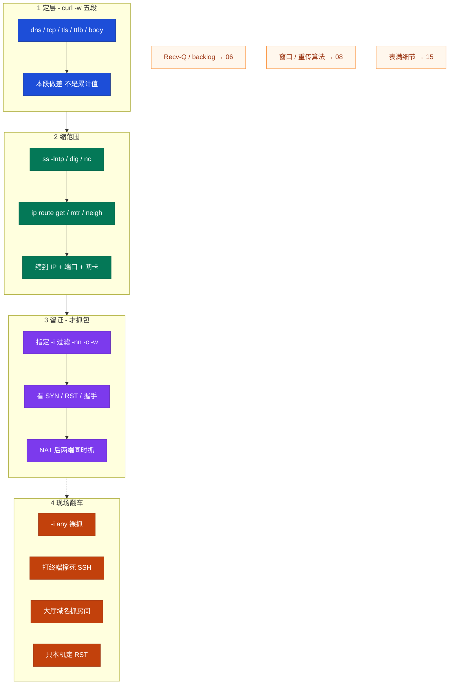
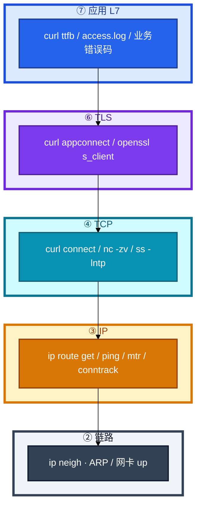
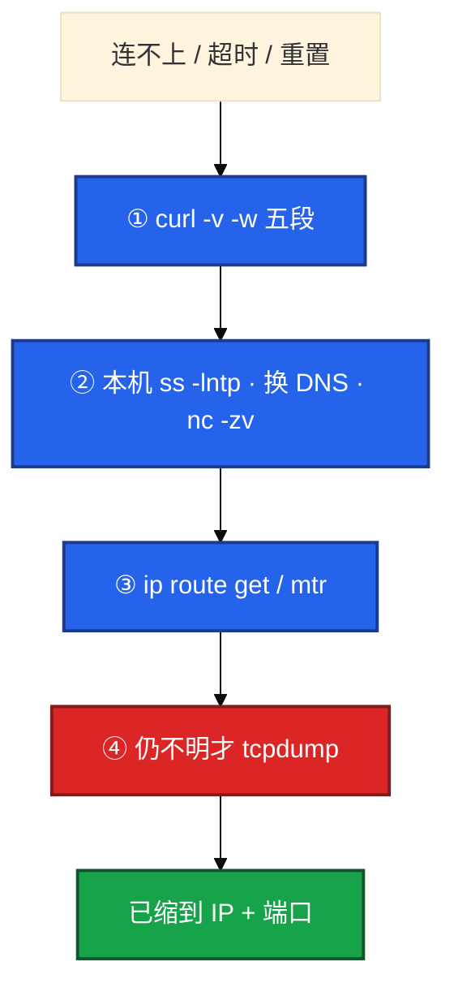
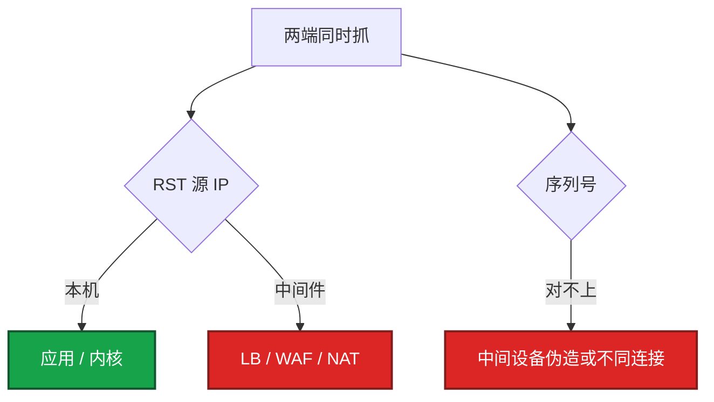
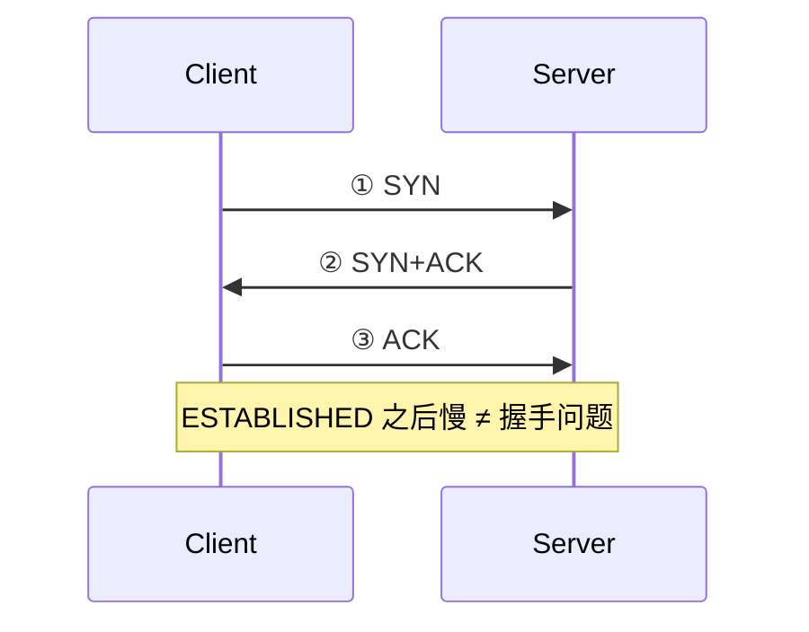
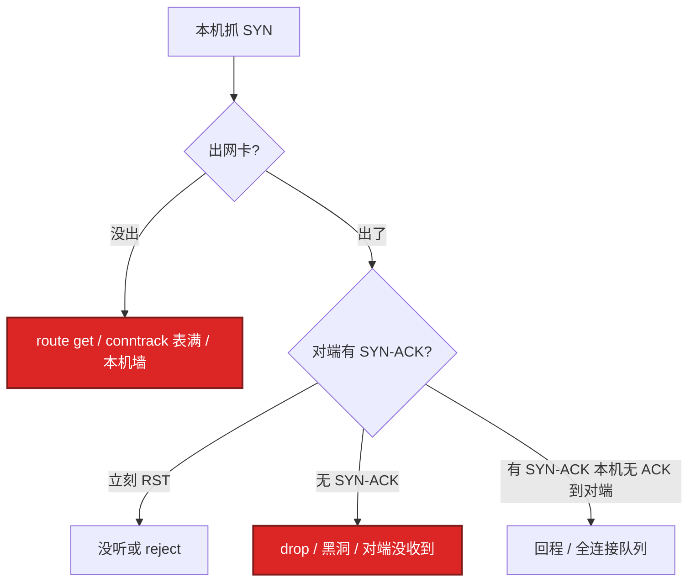
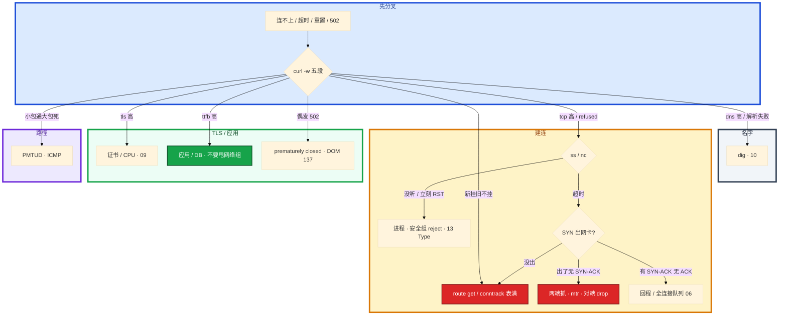

# 网络排障与抓包

> **这章解决什么**：玩家报「连不上 / 超时 / 重置」——卡在 DNS、TCP、TLS、应用，还是路径 / MTU / 中间设备？怎么**定层、缩范围、留证**？  
> **读法**：**先看总图** → **再认名词** → **再分节抠五段 / 路由 / 抓包 / 握手看包 / PMTUD**。  
> **刻意不展开**：Recv-Q / backlog / TIME_WAIT / CLOSE_WAIT → [12](../12-网络栈与Socket/)；窗口 / 重传算法 / 心跳机制 → [13](../13-TCP与UDP/)；HTTP 499/502/504、证书语义 → [14](../14-HTTP与TLS/)；DNS 劫持 / TTL / CDN → [15](../15-DNS与CDN/)；conntrack 表满、五链四表 → [17](../17-iptables与conntrack/)。

---

## 本章目录

1. [本章定位](#1-本章定位)
2. [先看总图：排障怎么从上往下](#2-先看总图排障怎么从上往下) ← **开篇必读**
   - [2.0 全章知识串图](#20-全章知识串图一张把细节串起来) ← **架构总览**
   - [2.1 L7→L2 分层](#21-分层-l7l2排障坐标系)
   - [2.2 排障主线](#22-排障主线定层--缩范围--留证)
   - [2.3 完整走读](#23-完整走读登录连不上从电话到结案)
3. [名词扫盲（对照总图认词）](#3-名词扫盲对照总图认词)
4. [curl -w 五段定层](#4-curl--w-五段定层) ← **重点精读**
5. [路由 / ARP / mtr / ping](#5-路由--arp--mtr--ping)
6. [tcpdump / 过滤 / 两端抓：本章最易翻车](#6-tcpdump--过滤--两端抓本章最易翻车) ← **重点精读**
7. [三次握手在抓包里怎么认](#7-三次握手在抓包里怎么认)
8. [MTU / MSS / PMTUD](#8-mtu--mss--pmtud)
9. [nc / telnet 替代与常见误区](#9-nc--telnet-替代与常见误区)
10. [定责决策树与命令速查](#10-定责决策树与命令速查)
11. [去哪章继续学](#11-去哪章继续学)
12. [面试 · 易错 · 数字](#12-面试--易错--数字)
13. [合上书](#合上书)

---

## 1. 本章定位

| 章 | 负责 |
|----|------|
| **06** | 包怎么走、怎么进主机、Socket/队列、本机「满」了怎么定责 |
| **08** | TCP/UDP：握手机制、窗口、重传、心跳 |
| **11（本章）** | **定层手法、抓包纪律、路由/ARP/mtr、握手在包里怎么认、MTU/PMTUD** |

本章是**排障手法主场**。06/08 告诉你「机制上可能卡哪」；本章告诉你「现场第一刀敲什么、抓什么、怎么读输出」。

🎯 **值班签名**：连不上——先 `curl -w` 五段定层，**禁止**一上来 `tcpdump -i any` 打到终端。

玩家报「登录连不上」。群里有人已经在生产机 `tcpdump -i any` 打到终端滚屏，SSH 卡到怀疑人生；另有人把工单甩给网络组查专线——其实 API、大厅、房间是**三条连接、三个端口**，在登录域名上抓房间包等于白抓。

**读完你能：** 白板上画出 L7→L2；连不上 / 超时 / 重置能一口定责；会 `curl -w` 做差、`ip route get`、tcpdump/Wireshark 过滤；三次握手丢包能指到 SYN / SYN-ACK / ACK 哪一步；小包通大包死能复现 PMTUD。

---

## 2. 先看总图：排障怎么从上往下

> **正确开篇顺序**：先有全局画面，再认词，再抠细节。  
> 先看 **§2.0 全章串图**（考点挂一张板上），再看 **§2.1 分层**（坐标系），再用 **§2.3 走读**把一次工单串起来。

### 2.0 全章知识串图（一张把细节串起来）

> 🎯 **合上书要能默画这张。** 蓝=定层 · 绿=缩范围 · 紫=留证 · 橙=翻车点。  
> 若预览仍报错，以下面 **ASCII 一页板** 为准。



**读图路线：**

| 段 | 记住 |
|----|------|
| ① | 五段做差定层（§4）；dns→10，tls→09，ttfb→应用 |
| ② | ss / route get 缩到「这个 IP + 端口 + 网卡」（§5、§9） |
| ③ | 过滤 + `-c` + `-w`；握手看包（§6、§7）；PMTUD（§8） |
| ④ | 禁止 `-i any` 裸抓；NAT 后两端同时抓；别跳层 |

```text
┌──────────────────────────────────────────────────────────────────────────┐
│                     11 一张板：定层 → 缩范围 → 留证                        │
├─────────────┬────────────────────┬───────────────────────────────────────┤
│  ① 定层     │  ② 缩范围          │  ③ 留证（才抓）                        │
│  curl -w    │  ss / dig / nc     │  -i ethX + host/port                  │
│  五段做差   │  route get / mtr   │  -nn -c -w；SYN/RST                   │
│  别跳层     │  neigh / ping-MTU  │  NAT→两端抓；对序列号                  │
├─────────────┴────────────────────┴───────────────────────────────────────┤
│  翻车：-i any · 打终端 · 登录域名抓房间 · 只本机定 RST · 默认小 ping 结案 │
│  链出：队列/Recv-Q→06 · 窗口重传→08 · 502/证书→09 · DNS→10 · 表满→15     │
└──────────────────────────────────────────────────────────────────────────┘
```

---

### 2.1 分层 L7→L2（排障坐标系）

后面五段、握手、抓包都对着这张图。**从上往下定层，不要一上来抓 L2。**



**读图三句话：**

1. **L7→L2 逐层下**：dns 高走 10，tls 高走 09，ttfb 高进应用，别跳层抓包。  
2. **大厅 HTTP 用五段**；房间长连接用 ss + 抓 SYN / 心跳（端口不同）。  
3. **现场顺序**：五段 → ss → route get → 仍不明才 tcpdump。

| 层 | 典型工具 | 本章讲什么 | 细节去哪 |
|----|----------|------------|----------|
| L7 应用 | curl ttfb、access.log | 五段里 ttfb/body | 业务 / DB |
| TLS | curl appconnect、openssl | 五段 tls 段指责 | [14](../14-HTTP与TLS/) |
| TCP | connect、nc、ss、抓握手 | 握手看包、RST 源 | [13](../13-TCP与UDP/) 机制 |
| IP | route get、mtr、ping | 出接口、路径、PMTUD | [17](../17-iptables与conntrack/) 表满 |
| 链路 | neigh、ethtool | ARP FAILED、TSO 假象 | — |

---

### 2.2 排障主线：定层 → 缩范围 → 留证

**本章主线（排障就按这三步想）：**

1. **定层**：连不上 / 超时 / 重置 / 解析失败——先用 `curl -w` 五段分到 DNS / TCP / TLS / 应用，**别跳层**。  
2. **缩范围**：`ss -lntp` → `ip route get` → 缩到「这个 IP + 这个端口」再抓，**禁止 `-i any` 裸抓**。  
3. **留证**：握手卡在哪一包、RST 源 IP 是谁——NAT 后面必须**两端同时抓**才是铁证。



**打个比方**：像快递查不到——要先分清是「地址写错」（DNS）、「路不通」（TCP 超时）、「门卫不让进」（refused/RST）、还是「仓库拣货慢」（ttfb 高）。别一接到电话就让司机全程跟车录像（`tcpdump -i any`）。

---

### 2.3 完整走读：登录连不上，从电话到结案

假设：玩家报「登录一直转圈」；域名 `login.example.com`；跳板机能 curl。

```text
① 问清人话
   「转圈」≈ timeout 或 ttfb 慢；「立刻失败」≈ refused/RST；「打不开」先要完整报错句
   「能进大厅进不了房间」→ 两条连接，后面抓房间口

② 跳板 curl -w 五段（§4）
   输出：dns:0.02 tcp:0.022 tls:0.08 ttfb:3.5 total:3.52 code:200
   做差 → tcp≈2ms、ttfb≈3.4s → 路通了，慢在应用/DB
   → 结案方向：查 login 服务与 DB，不要甩专线
   工单里写清五段本段数字，避免群里继续猜「专线」

③ 若是 tcp 段超时（connect 挂死）
   ss -lntp 对端有没有人听？
   ip route get 对端 IP → 出哪张网卡、源 IP 对不对（§5）
   nc -zv 对照：refused vs timeout（§9）
   仍不明 → 指定网卡 + host+port 抓 SYN（§6、§7）

④ 若大厅能进、房间进不去
   两条连接两个端口 → 抓房间口，别在登录域名上抓（§4.7、§7.6）

⑤ NAT 后要定 RST 是谁发的
   客户端侧 + 服务端侧同时抓，对序列号（§6.5）

⑥ 小 API 通、大登录偶发挂
   别先换证书 → ping -M do -s 1472（§8）
```

**对照：错误走读（禁止照抄）**

```text
电话响 → tcpdump -i any → SSH 卡死
     → 在登录域名上抓房间
     → ping 通就结案
     → 只本机看到 RST 就骂应用
```

🎯 **总图结论**：网络排障是**按层定责**；抓包是缩小范围之后的确认手段，不是第一刀。本章后半全是「怎么读输出、怎么不翻车」。

---

## 3. 名词扫盲（对照总图认词）

对照 §2 认词即可，细节在后文展开。

| 词 | 人话 | 本章哪里用 |
|----|------|------------|
| **定层** | 先分 DNS/TCP/TLS/应用，再动手 | §2、§4 |
| **五段** | curl `-w` 五个时间戳；累计，要做差 | §4 |
| **namelookup / connect / appconnect / starttransfer / total** | DNS完 / TCP完 / TLS完 / 首字节 / 全程 | §4 |
| **ttfb** | 到首字节；常 = 服务端「开始拣货」 | §4 |
| **Connection refused** | 对端立刻 RST（没听或 reject） | §3 现象表、§7 |
| **Timed out** | SYN 无回复或中途黑洞 | §7 |
| **drop vs reject** | drop=吃掉→超时；reject=RST | §3 |
| **ip route get** | 内核「去这个 IP 实际走哪」 | §5 |
| **ip route show** | 路由表清单，≠ 单包决策 | §5 |
| **ARP / neigh** | IP→MAC；FAILED=二层不通 | §5 |
| **mtr** | 逐跳延迟/丢包；看形态不盯单跳 | §5 |
| **PMTUD** | 路径 MTU 探测；ICMP「需要分片」 | §8 |
| **DF / MSS** | 不分片标志；TCP 段最大载荷 | §8 |
| **BPF 过滤** | tcpdump 抓包时就筛 | §6 |
| **显示过滤** | Wireshark 打开 pcap 后再筛 | §6 |
| **TSO / GRO** | 网卡分段/聚合卸载 → 假 checksum | §6.6 |
| **两端同时抓** | NAT/LB 后定 RST 的铁证 | §6.5 |
| **snaplen / -s0** | 抓多长；默认可能截断 | §6 |

### 3.1 值班里怎么认现象（先听人话）

| 玩家/客户端说的 | 技术含义 | 你的第一刀 |
|-----------------|----------|------------|
| 「连不上」「打不开」 | 可能是 refused / timeout / DNS | 先问清**完整报错句** |
| 「一直转圈」 | 多半是 timeout 或 ttfb 慢 | `curl -w` 五段 |
| 「闪退 / 立刻失败」 | 可能是 refused 或 RST | `ss -lntp` + 五段 |
| 「能进大厅进不了房间」 | **两条连接** | 别在登录域名上抓房间端口 |

| 现象 | 含义 | 第一刀 |
|------|------|--------|
| Connection refused | 对端 RST 或无监听 | `ss -lntp`、安全组 **reject** |
| Timed out | SYN 无回复或中途黑洞 | 抓 SYN、mtr、conntrack |
| Reset | 有人发 RST | 抓包看 RST **源 IP** |
| Could not resolve | DNS | `dig`（见第 10 章） |

安全组 **drop** = 超时（包被吃掉，像石沉大海）；**reject** = RST（门卫明确说「不让进」）。  
ping 不通 TCP 通 → ICMP 被禁，正常。ping 通**不能**证明 TCP 通——ICMP 和 TCP 走的不完全是同一条路。

> **记住**：先五段和 ss，后抓包；卡在哪一层就在哪一层取证，不要跳层。

**面试怎么说**：「连不上我先 curl -w 做差定层，refused 查监听和 reject，timeout 查 SYN 和 conntrack，不会一上来 tcpdump -i any。」

---

## 4. curl -w 五段定层

> 🎯 **本章定层第一刀。** 合上书要能对着一组输出做差，并一口说出锅在谁。

### 4.1 一句话 + 比方

**一句话：** 五段是**累计**计时，本段必须**做差**；connect 2ms、ttfb 3.5s → 路通了，慢在对方「拣货」（应用），不是路上堵车（公网）。

**打个比方**：查快递轨迹——`dns` 是查单号、`tcp` 是车出库、`tls` 是安检、`ttfb` 是对方开始拣货、`total` 是签收。总耗时 3.5 小时，得看卡在「运输」还是「拣货」。

```text
时间轴（累计，从 0 起）：

  0 ──────── namelookup ── connect ── appconnect ── starttransfer ── total
               │ dns 段 │  tcp 段  │   tls 段   │     ttfb 段    │ body │
```

| 字段（curl） | 累计到哪 | 本段怎么算 | 高了找谁 |
|--------------|----------|------------|----------|
| `time_namelookup` | DNS 完 | = 自身 | DNS / 劫持 / ndots → [15](../15-DNS与CDN/) |
| `time_connect` | TCP 握手完 | connect − dns | 防火墙、对端远、SYN 黑洞 |
| `time_appconnect` | TLS 握手完 | appconnect − connect | 证书、握手 CPU → [14](../14-HTTP与TLS/) |
| `time_starttransfer` | 首字节 | starttransfer − appconnect（HTTP 无 TLS 则 − connect） | **服务端 / DB** |
| `time_total` | 全程 | total − starttransfer = body | 响应体大、带宽 |

> 🔥 **易错钉死**：`time_connect` **不是**「纯 TCP 耗时」——它从 0 累计到 TCP 完成，**包含 DNS**。口播「connect 慢」前先做差。

### 4.2 现场模板（必会敲）

```bash
curl -o /dev/null -s -w \
  'dns:%{time_namelookup} tcp:%{time_connect} tls:%{time_appconnect} ttfb:%{time_starttransfer} total:%{time_total} code:%{http_code}\n' \
  https://login.example.com
```

- `-o /dev/null`：不要存 body，只要计时。  
- HTTPS 才有有意义的 tls 段；纯 HTTP 看 connect 与 ttfb。  
- 辅助：`curl -v` 卡在哪一行也能分层——`Trying IP` / `Connected` / `SSL connection` / 首字节。

### 4.3 多组输出解读（钉死做差）

#### 例 A：ttfb 慢（别甩网络组）

```text
dns:0.018 tcp:0.020 tls:0.080 ttfb:3.520 total:3.545 code:200
```

| 本段 | 计算 | 结果 |
|------|------|------|
| dns | 0.018 | 正常 |
| tcp | 0.020 − 0.018 | **2ms** |
| tls | 0.080 − 0.020 | 60ms，可接受 |
| ttfb | 3.520 − 0.080 | **≈3.44s** |
| body | 3.545 − 3.520 | 很小 |

**结论**：TCP/TLS 都正常，**ttfb ~3.4s** → 查 login 服务和 DB，**不要甩网络组查专线**。

#### 例 B：DNS 慢

```text
dns:1.200 tcp:1.205 tls:1.280 ttfb:1.350 total:1.360 code:200
```

| 本段 | 结果 | 定责 |
|------|------|------|
| dns | **1.2s** | dig、本机 resolve、ndots、劫持 → 10 |
| tcp | 5ms | 路通 |
| tls / ttfb | 正常量级 | 不是本章主战场 |

#### 例 C：TCP 建连挂 / 极慢

```text
dns:0.010 tcp:75.000 ...（后面可能失败或极慢）
```

或 `curl` 报 `Connection timed out`：

| 读法 | 下一步 |
|------|--------|
| dns 正常，卡在 connect | 对端远 / 墙 drop / SYN 黑洞 / 错源 IP |
| 立刻 `Connection refused` | ss 听没听、安全组 reject（§7） |

#### 例 D：TLS 慢

```text
dns:0.01 tcp:0.02 tls:2.50 ttfb:2.55 total:2.56 code:200
```

tls 本段 ≈ **2.48s** → 证书链、RSA CPU、未复用 session（09）。用 `--resolve` / `-servername`，不要只 IP 直连却怪路由。

#### 例 E：HTTP（无 TLS）怎么算 ttfb

```text
dns:0.01 tcp:0.02 ttfb:0.80 total:0.85 code:200
# 无 appconnect 时：ttfb 本段 = starttransfer − connect
```

ttfb ≈ 0.78s → 仍是应用侧。

#### 例 F：body 慢（路通、首字节也快）

```text
dns:0.01 tcp:0.02 tls:0.05 ttfb:0.08 total:8.50 code:200
```

| 本段 | 结果 | 定责 |
|------|------|------|
| dns/tcp/tls/ttfb | 都很快 | 建连与首字节没问题 |
| body | **≈8.4s** | 响应体巨大、客户端带宽、或服务端慢慢吐 |

别把 body 慢说成「网络抖动」——先看 `Content-Length` / 是否在下大包。

#### 例 G：同一域名，跳板快玩家慢

跳板：

```text
dns:0.01 tcp:0.02 tls:0.05 ttfb:0.12 total:0.15 code:200
```

玩家侧（或模拟玩家出口）：

```text
dns:0.02 tcp:1.80 tls:2.10 ttfb:2.30 total:2.35 code:200
```

| 对比 | 读法 |
|------|------|
| 跳板 tcp≈10ms，玩家 tcp≈1.8s | **路径/出口差异**，不是 login 代码突然变慢 |
| 两边 ttfb 本段都短 | 应用本身不慢；查玩家侧网络、DNS、运营商 |

定层之后才决定：查 CDN/就近接入（10），还是查服务端。

### 4.4 现场走一遍：登录慢，先别抓包

1. 跳板机执行 §4.2 模板。  
2. 屏幕出现例 A 那种数 → **做差四次**写在工单里。  
3. 结论写清：「TCP 2ms，ttfb 3.4s，定责应用/DB」——网络组工单可以关。  
4. 若 tcp 段已经秒级 → 才进入 §5 / §7，**仍然先 ss 和 route get，后抓包**。

### 4.5 和 `curl -v` 对照读

| `-v` 停在 | 对应五段 | 想什么 |
|-----------|----------|--------|
| `Could not resolve host` | dns | dig → 10 |
| `Trying x.x.x.x...` 后长时间 | tcp | SYN / 墙 / route get |
| `Connected` 后卡 SSL | tls | openssl s_client → 09 |
| HTTP 行出来很慢 | ttfb | 应用 / DB |
| 下载进度条很慢 | body | 体积 / 带宽 |

### 4.6 五段做差速算板（合上书默算）

```text
给定：dns=D  tcp=C  tls=A  ttfb=S  total=T

本段 dns  = D
本段 tcp  = C − D
本段 tls  = A − C          （仅 HTTPS；HTTP 无此项）
本段 ttfb = S − A          （HTTP：S − C）
本段 body = T − S
```

口算检查：五段本段相加应 ≈ `total`（允许毫秒级误差）。

### 4.7 长连接房间怎么「定层」？

大厅是 HTTPS，可用五段；**房间常是长连接**，curl 打不上业务语义。

| 步骤 | 做什么 |
|------|--------|
| 1 | 确认房间 **IP + 端口**（别用登录域名） |
| 2 | `nc -zv` / 客户端日志看是 timeout 还是 reset |
| 3 | `ss` 本机有没有到该端口的 ESTAB |
| 4 | 仍不明 → 抓该端口 SYN/心跳（§6、§7）；窗口/重传 → 08 |

**面试怎么说**：「connect 快、ttfb 慢，我定责应用层，先查服务和 DB，不会先 tcpdump。」

> **记住**：HTTP 才有 tls 段；纯 TCP 看 connect 和 ttfb 就够。五段要做差（通常四次减法）。

---

## 5. 路由 / ARP / mtr / ping

> 🎯 **双网卡、策略路由、白名单：一例 `ip route get` 钉死。**

### 5.1 一句话：show 是地图册，get 是 GPS

**一句话：** 双网卡必须 `route get`；mtr 后面跳同样丢才是真丢，中间一跳 ICMP 丢不能当事故。

**打个比方**：`route show` 像看地图册里有哪些路；`route get` 像 GPS 算「去这个地址实际走哪条」——双网卡、策略路由时，地图册和 GPS 可能不一致。

| 命令 | 给你什么 | 不够什么 |
|------|----------|----------|
| `ip route show` | main 表清单 | 单包真实决策、策略路由命中 |
| `ip route get $IP` | 出接口、源 IP、via、cache | — **排障优先这个** |
| `ip neigh` / `ip neigh show` | ARP/邻居状态 | 跨网段应查网关邻居 |

### 5.2 一例钉死：`ip route get` 输出怎么读

**场景**：新机器连 DB 超时，ping「好像通」，业务连不上。

```bash
ip route get 10.0.1.50
```

```text
10.0.1.50 via 10.0.0.1 dev eth1 src 10.0.2.88 uid 0
    cache
```

| 字段 | 含义 | 现场联想 |
|------|------|----------|
| `via 10.0.0.1` | 下一跳网关 | 跨网段；同网段通常无 via |
| `dev eth1` | **从 eth1 出** | 别以为一定 eth0 |
| `src 10.0.2.88` | **本机源 IP** | DB 白名单是否只放了 eth0 的 IP？ |
| `cache` | 走了路由缓存 | 改完路由可 `ip route flush cache` 再 get |

**结论**：包从 **eth1** 出、源 IP **10.0.2.88**——若 DB 白名单只放了 eth0 的源 IP，就会 timeout；ping 却可能走 eth0 所以「通」。

🔥 **易错钉死**：`ip route show` 里 default 走 eth0，**不能**推出「去 DB 也走 eth0」。以 `get` 为准。

### 5.3 同网段再查 ARP

```bash
ip neigh show dev eth1 | grep 10.0.1.50
# 或
ip neigh show 10.0.1.50
```

| 状态 | 含义 | 下一步 |
|------|------|--------|
| `REACHABLE` / `STALE` | MAC 已学到（STALE 可再确认） | 二层大体通，往上查 |
| `FAILED` | 二层不通或对端 down | 同网段线缆/对端网卡/二层隔离 |
| 没有条目 | 还没试过或已过期 | ping 一下再看 |

跨网段：Client ARP 问的是**网关**，不是 Server。同网段 vs 跨网段封包细节见 [12 §2](../12-网络栈与Socket/)。

### 5.4 mtr：看形态，不盯单跳 Loss%

```bash
mtr -r -c 10 203.0.113.10
# 或交互：mtr 203.0.113.10
```

| mtr 形态 | 含义 | 你怎么说 |
|----------|------|----------|
| 某跳丢、**后面不丢** | 该跳限 ICMP，不是真丢业务包 | 「ICMP 限速，不当光纤断」 |
| 某跳起**后面同样丢** | 该跳开始真丢 | 从那一跳往后查 |
| 跨区延迟 | 看哪一跳起 **RTT 台阶** | 别只盯 Loss% |
| 全程 0 丢但业务 TCP 挂 | ICMP ≠ TCP 路径 | 抓 TCP / 查墙 |

**面试怎么说**：「双网卡我必打 `ip route get`，不看 `route show` 就猜。mtr 中间一跳 30% 丢、后面 0%，是 ICMP 限速不是光纤断。」

### 5.5 ping 的正确打开方式

| 用法 | 测什么 | 坑 |
|------|--------|-----|
| `ping -c 3 $IP` | 粗测三层/对端是否回 ICMP | **小包**；通 ≠ TCP 通 |
| `ping -M do -s 1472` | 路径能否过 1500 MTU（§8） | 不通先怀疑 PMTUD，不是「网络全挂」 |
| ping 不通 TCP 通 | ICMP 被禁 | **正常**，别当事故 |

### 5.6 再给两例：策略路由与同网段 FAILED

#### 例 H：策略路由——show 看见 default，get 走另一张表

```bash
ip rule show
# 0: from all lookup local
# 100: from 10.0.2.0/24 lookup game
# 32766: from all lookup main

ip route get 10.0.1.50 from 10.0.2.88
```

```text
10.0.1.50 from 10.0.2.88 via 10.0.2.1 dev eth1 table game src 10.0.2.88
```

| 要点 | 说明 |
|------|------|
| `table game` | 命中了策略路由，不是 main 里那条 default |
| 只敲 `ip route show` | **看不到** game 表，会误判 |
| 排障 | 对「这个源 IP 去这个目的」再 `get`，必要时带 `from` |

#### 例 I：同网段 ARP FAILED

```bash
ip route get 10.0.0.9
# 10.0.0.9 dev eth0 src 10.0.0.8  （无 via → 同网段）

ip neigh show 10.0.0.9
# 10.0.0.9 dev eth0 FAILED
```

| 读法 | 不是什么 |
|------|----------|
| 二层不通 / 对端 down / 隔离 | **不是**「默认路由丢了」 |
| 下一步查线、对端网卡、VLAN | 不要先改 default gateway |

### 5.7 mtr 输出形态速读（假想表）

```text
Host           Loss%   Snt   Last   Avg
1. gw          0.0%     10    1.0   1.1
2. isp-a      30.0%     10   12.0  11.0    ← 本跳丢
3. isp-b       0.0%     10   20.0  19.5    ← 后面不丢
4. dest        0.0%     10   25.0  24.0
```

→ **不当事故**：第 2 跳限 ICMP。

```text
2. isp-a      40.0%     10   ...
3. isp-b      40.0%     10   ...
4. dest       40.0%     10   ...
```

→ **从第 2 跳起真丢**：往后查链路/对端。

### 5.8 NAT 与路径（点到为止）

NAT（表满细节见第 15 章）：DNAT 改目的、SNAT 改源，都依赖 conntrack。排障时「新挂旧不挂」优先想表满，不是光纤。

| 你在本机看到 | 对端可能看到 | 含义 |
|--------------|--------------|------|
| 源 10.0.2.88:12345 | 源被 SNAT 成公网 IP:另一端口 | 两端抓要对「映射后」的四元组 |
| 目的是 VIP | DNAT 到 Pod/后端 IP | 服务端抓后端口，客户端抓 VIP |

**面试怎么说**：「双网卡我必打 `ip route get`，不看 `route show` 就猜。mtr 中间一跳 30% 丢、后面 0%，是 ICMP 限速不是光纤断。」

---

## 6. tcpdump / 过滤 / 两端抓：本章最易翻车

> 🎯 **生产纪律比过滤器语法更重要。** 合上书要能背：禁止 `-i any` 裸抓；NAT 后两端同时抓。

### 6.1 落地原则（先于任何过滤）

| 项 | 选 | 不选 |
|----|----|------|
| 机器 | 业务机**短窗口**抓，或旁路镜像到分析机 | 生产机开 Wireshark GUI |
| 权限 | `tcpdump` 组 / `CAP_NET_RAW` | 长期 root 裸跑、无过滤 |
| 落盘 | `/tmp` 或独立盘，`-c` / `-C` 限量 | 把大流量打印到 SSH 终端 |
| 分析 | pcap 带回来用本地 Wireshark | 在战斗服上 `follow stream` |

```bash
yum install -y tcpdump    # 或 apt install tcpdump
```

容器里默认看不到宿主机 veth 对端：要在 **宿主机网卡或 CNI 接口** 上抓。K8s 用 ephemeral debug / 节点上指定 Pod IP+端口。验收：能按 host+port 写出非空 pcap。

### 6.2 核心参数：每个都有翻车故事

五段已经缩到「这个 IP、这个端口、这个方向」再抓。

| 参数 | 作用 | 生产怎么用 | 改错会怎样 |
|------|------|------------|------------|
| `-i eth0` | 指定网卡 | 先 `ip route get` 再定口 | **`-i any` 聚合多口，TSO/方向都乱** |
| `-nn` | 不反解 DNS / 端口名 | **必开** | 抓包过程再解析，拖慢、污染 |
| `-s0` | 抓全包 | 要看 HTTP/TLS 明文或长度时开 | 默认 snaplen 截断 → Follow Stream 残 |
| `-c 1000` | 限包数 | **必开** | 活动高峰无限抓，把盘打满 |
| `-w file` | 写 pcap | 必写文件 | `-A` 打到终端 = **自造事故** |
| `-C 100 -W 5` | 单文件 MB、保留个数 | 长抓才用 | 不限会写满根盘 |
| `-B 4096` | 抓包缓冲 KB | 丢内核包时加大 | 缓冲不够 → pcap 自己丢 |

**最小闭环（背下来）：**

```bash
tcpdump -i eth0 host 10.0.0.5 and port 8080 -nn -s0 -c 1000 -w /tmp/a.pcap
```

> **记住**：先缩到 IP+端口再抓；过滤 + `-c` + `-w` + `-nn`；**禁止 `-i any` 裸抓**。

### 6.3 为什么禁止 `-i any`？

| 问题 | 说明 |
|------|------|
| 看不出哪张网卡 | 「SYN 出没出网卡」答不清 |
| 聚合假象 | 多口混在一起，方向/重复难判 |
| TSO/卸载更乱 | any 上更难看清真实帧 |
| 流量爆炸 | 更容易把 SSH/盘打满 |

正确姿势：`ip route get $IP` → 记下 `dev ethX` → `-i ethX`。

### 6.4 BPF 过滤（抓的时候就筛）

```bash
# 握手和复位（第一刀）
tcpdump -i eth0 'tcp[tcpflags] & (tcp-syn|tcp-rst) != 0' -nn
tcpdump -i eth0 'tcp[tcpflags] = tcp-syn' -nn               # 纯 SYN（不含 SYN-ACK）
tcpdump -i eth0 host 10.0.0.5 and port 8080 -nn -s0 -c 1000 -w /tmp/a.pcap

# UDP 房间 / ICMP（PMTUD）
tcpdump -i eth0 udp port 9000 -nn -c 500 -w /tmp/room.pcap
tcpdump -i eth0 icmp -nn
tcpdump -i eth0 'not port 22' -nn                           # 别抓 SSH 撑死
```

| 要看的问题 | 过滤怎么写 |
|------------|------------|
| 登录超时 | `host <vip> and port 443`，再加 SYN/RST 摘要 |
| 房间进不去 | **房间端口**，不要登录域名 |
| RST 谁发的 | `tcp[tcpflags] & tcp-rst != 0`，看源 IP |
| 只看纯 SYN | `tcp[tcpflags] = tcp-syn`（**等于**，不是 `&`） |

🔥 **易错钉死**：`& (tcp-syn) != 0` 会把 **SYN-ACK** 也带上；只要纯 SYN 用 `= tcp-syn`。

### 6.4.1 更多过滤配方（值班可抄）

```bash
# 多端口（登录 443 + 管理 8080）
tcpdump -i eth0 'host 10.0.0.5 and (port 443 or port 8080)' -nn -c 2000 -w /tmp/login.pcap

# 只看 RST
tcpdump -i eth0 'tcp[tcpflags] & tcp-rst != 0' and host 10.0.0.5 -nn -c 100

# 某网段（注意别过大）
tcpdump -i eth0 net 10.0.0.0/24 and port 9000 -nn -c 500 -w /tmp/room.pcap

# 离线读
tcpdump -nn -r /tmp/a.pcap 'tcp[tcpflags] & tcp-syn != 0' | head
```

| 写法 | 注意 |
|------|------|
| `host A and port P` | 最常用最小集 |
| `src host` / `dst host` | 只看一个方向时用 |
| 过滤写错 | pcap 空 ≠ 没故障；先放宽再收紧 |
| 活动高峰 | `-c` 必开；宁可变短窗口再抓一次 |

### 6.5 两端同时抓（NAT 后铁证）



| 只抓一侧够不够 | 场景 |
|----------------|------|
| 往往够 | 本机 SYN 有没有出网卡；本机立刻 RST |
| **不够** | NAT/LB/WAF 后「谁发的 RST」；序列号被改 |

**操作要点：**

1. 两端约定同一时间窗、同一四元组（注意 NAT 后外面看到的 IP:端口不同）。  
2. 对 **序列号 / ACK**：对不上 → 中间有人改包或根本不是同一条连接。  
3. RST 的 **TTL / 源 IP** 与两端主机不一致 → 怀疑中间设备。

> **硬规则（FAQ 只写一次）**：NAT 后面定 RST，必须**两端同时抓**；只在本机抓下结论 = 猜。

### 6.6 Wireshark 显示过滤（打开 pcap 后再筛）

显示过滤 ≠ tcpdump BPF。

| 目的 | 显示过滤 |
|------|----------|
| 重传 | `tcp.analysis.retransmission` |
| 重复 ACK | `tcp.analysis.duplicate_ack` |
| 零窗口 | `tcp.analysis.zero_window` |
| RST | `tcp.flags.reset==1` |
| 纯 SYN | `tcp.flags.syn==1 && tcp.flags.ack==0` |
| SYN-ACK | `tcp.flags.syn==1 && tcp.flags.ack==1` |
| HTTP 502 | `http.response.code==502` |
| 某两端 | `ip.addr==10.0.0.5 && tcp.port==8080` |

Follow TCP Stream 看 HTTP 502 发生在哪一跳；Statistics → Flow Graph 看哪边不回。窗口/重传**算法**见 [13](../13-TCP与UDP/)；这里只认包、定责。

### 6.7 TSO / GRO：假 checksum

**一句话：** 本机 Wireshark 里巨大帧 + incorrect checksum，多半是网卡卸载假象；对端抓才是真包。

**打个比方**：像本机看「打包好的整箱货」——网卡 TSO 在硬件里才拆成小件，本机抓包看到的是「整箱」，checksum 字段还没填真值。

```bash
ethtool -k eth0 | egrep 'tcp-segmentation-offload|tx-checksumming|generic-receive-offload'
```

| 现象 | 解读 |
|------|------|
| `tx-checksumming: on` + TSO on + 本机红 checksum | **正常假象**，别修应用 |
| 帧长好几 KB | TSO/GRO 聚合视图 |
| 对端抓正常 | 以对端或临时关卸载为准 |

生产**临时**关卸载、抓完立刻开——关 TSO 会把分段打回 CPU，高峰慎用。不要把「关 TSO」当业务修复。

### 6.8 生产翻车对照表（合上书默背）

| 翻车动作 | 现场后果 | 正确动作 |
|----------|----------|----------|
| `tcpdump -i any` 无过滤 | SSH 卡死、盘满、方向乱 | `route get` → `-i ethX` + host/port |
| `-A` / 不写 `-w` 打终端 | 自造事故 | `-w /tmp/x.pcap`，本地 Wireshark |
| 省略 `-nn` | 抓包时再 DNS，污染本案 | 永远 `-nn` |
| 省略 `-c` | 活动高峰写爆根盘 | `-c` 或 `-C/-W` |
| 登录域名抓房间 | 空 pcap、误判「没流量」 | 抓房间端口 |
| 只本机定 NAT 后 RST | 冤枉应用或冤枉网络 | 两端同时抓 |

**面试怎么说**：「本机 incorrect checksum 我先查 ethtool 卸载，对端抓验证；不会当应用改包去修代码。」

---

## 7. 三次握手在抓包里怎么认

> 机制（为什么三次、半连接/全连接）→ [13](../13-TCP与UDP/) / [12](../12-网络栈与Socket/)。  
> **本章只讲：包长什么样、卡在哪一包、下一步敲什么。**

### 7.1 一句话

**一句话：** 超时 = 重复 SYN 无 SYN-ACK；拒绝 = SYN 立刻 RST；先证明 SYN 出了本机，再怪中间，再怪对端。

**打个比方**：握手像敲门——timeout 是没人应门；refused 是门一开就被推出来（没监听或 reject）。



### 7.2 本机只看 SYN/RST 摘要

先缩 IP+端口：

```bash
tcpdump -i eth0 'tcp[tcpflags] & (tcp-syn|tcp-rst) != 0' and host 10.0.0.5 and port 443 -nn -c 50
```

### 7.3 假想 tcpdump 行怎么读

#### 形态 1：超时（重复 SYN）

```text
12:00:01.001 IP 10.0.2.88.54321 > 10.0.0.5.443: Flags [S], seq 1000, win 64240, options [...]
12:00:02.002 IP 10.0.2.88.54321 > 10.0.0.5.443: Flags [S], seq 1000, win 64240, options [...]
12:00:04.003 IP 10.0.2.88.54321 > 10.0.0.5.443: Flags [S], seq 1000, win 64240, options [...]
```

| 观察 | 结论 |
|------|------|
| 只有 `[S]`，无 `[S.]`（SYN-ACK） | 对端没应或回程没到 |
| 间隔 ≈1s、2s、4s | 典型 SYN 重传退避 |
| 下一步 | 证 SYN 出网卡 → 对端是否收到 → conntrack/mtr |

#### 形态 2：拒绝（立刻 RST）

```text
12:01:00.100 IP 10.0.2.88.54322 > 10.0.0.5.443: Flags [S], seq 2000, ...
12:01:00.101 IP 10.0.0.5.443 > 10.0.2.88.54322: Flags [R.], seq 0, ack 2001, ...
```

| 观察 | 结论 |
|------|------|
| SYN 后 **毫秒级** `[R.]` | refused：没监听或 reject |
| 下一步 | `ss -lntp`；安全组/防火墙 reject |

#### 形态 3：正常握手（对照）

```text
Flags [S]
Flags [S.]    ← SYN-ACK
Flags [.]     ← ACK（无 payload 的纯 ACK 常显示 [.]）
```

之后才是 TLS/数据。已出现三次且 `ss` 已 ESTAB，业务仍慢 → **离开握手**，去五段 ttfb / `ss -ti`（08）。

### 7.4 输出对照定责表

| 本机看到 | 定责 | 下一步 |
|----------|------|--------|
| 重复 SYN，无 SYN-ACK | drop / 黑洞 / conntrack / 对端没收到 | `conntrack -C`、对端抓、mtr |
| SYN → **立刻 RST** | 没监听 / reject | `ss -lntp` |
| 本机 SYN 出网卡，对端抓不到 | 源 IP / 策略路由错 / 中途丢 | `ip route get`；两端抓 |
| 对端有 SYN-ACK，本机没收到 | 回程黑洞 | 两端同时抓 |
| 有 SYN-ACK，对端等不到最终 ACK | 回程丢 ACK / 全连接队列满 | 对端 `ss -lnt` Recv-Q → [12](../12-网络栈与Socket/) |
| 已 ESTAB 仍慢 | **别回头改握手** | 五段 ttfb / TLS / `ss -ti`→08 |



### 7.5 现场走读：新连接全挂，老连接还在

1. 先 `conntrack -C` vs max；dmesg 有无 `nf_conntrack: table full`（细节 [17](../17-iptables与conntrack/)）。  
2. 表没满再抓：SYN 出没出网卡。  
3. **新挂旧不挂** → 优先表满/端口耗尽，**不是**光纤断（光纤断是新旧一起死）。

表满时 SYN 可能在 PREROUTING 就被丢——**网卡上看不到出站 SYN**。先 `-C` 再抓。

### 7.6 大厅 vs 房间：抓错端口等于白抓

```text
大厅：HTTPS login.example.com:443     ← curl 五段
房间：tcp/udp 某 IP:9000              ← 另一条连接

玩家：「能进大厅进不了房间」
  → 不要在 443 上找房间握手失败
  → nc/抓 9000；看 SYN 还是心跳后 RST（心跳机制见 08）
```

**面试怎么说**：「timeout 我先证 SYN 出没出网卡，再两端抓；refused 先 ss 看监听；NAT 后定 RST 必须两端对序列号。」

---

## 8. MTU / MSS / PMTUD

### 8.1 一句话 + 比方

**一句话：** 默认 ping 会骗你；小包通大包死，先查 ICMP「需要分片」是不是被墙。

**打个比方**：像寄小信封能进小区门，寄大沙发卡在大门——默认 ping 只寄「小信封」（56 字节），大门多窄发现不了。

| 词 | 含义 |
|----|------|
| **MTU** | 链路层一帧能装的 IP 包最大长度；以太网常见 **1500** |
| **MSS** | TCP 载荷上限，约 MTU − 40（IPv4+TCP 头）；常 **1460** |
| **DF** | Don't Fragment；PMTUD 靠「大包 + DF」探测 |
| **PMTUD** | 路径发现更小 MTU；靠 ICMP Type3 Code4「需要分片」 |

### 8.2 现场复现

**场景**：跨云 TLS 偶发失败、小 API 正常。

```bash
# 小包（常骗你）
ping -c 3 203.0.113.10

# 大包带 DF（不允许分片，测路径 MTU）
ping -M do -s 1472 -c 3 203.0.113.10    # 1472 + 28 头 = 1500
```

| 结果 | 含义 |
|------|------|
| 小 ping 通、大 ping **100% 丢** | 路径某段 MTU &lt; 1500，且/或 ICMP 需要分片被墙 |
| 发送方不知道降 MSS | 大 TLS 记录 / 大 POST **挂死** |
| 隧道（VPN/GRE/专线） | 有效 MTU 更小，更常见 |

处理方向：VPN/GRE/专线**降 MSS**（或夹 MSS）；放行 ICMP「Fragmentation needed」；游戏 UDP 大包同理。

```bash
# 顺便抓 ICMP 是否回来
tcpdump -i eth0 icmp -nn -c 20
```

### 8.3 二分找路径 MTU（现场手法）

不必一次赌 1472：

```bash
ping -M do -s 1472 -c 2 $IP   # 失败则降
ping -M do -s 1400 -c 2 $IP
ping -M do -s 1200 -c 2 $IP
# 找到「通」与「不通」的边界 ≈ 路径 MTU − 28
```

| 边界大约 | 常见原因 |
|----------|----------|
| 1500 通 | 以太网标准路径 OK |
| ~1400 通 / 1472 不通 | 隧道开销、部分云专线 |
| 更小 | 多层封装；必须降 MSS 或修 ICMP |

### 8.4 和 TCP 的关系（不展开算法）

```text
路径 MTU 变小 + DF + ICMP 被墙
  → 大段发不出去、也收不到「请缩小」
  → 表现：小请求 OK，大登录/大 TLS 记录偶发超时
```

MSS 协商发生在握手选项里；抓包可见 `mss` 选项。调拥塞/窗口 → [13](../13-TCP与UDP/)；本章只定「是不是路径 MTU」。

### 8.5 现象对照：别先换证书

| 现象 | 先怀疑 | 别先做 |
|------|--------|--------|
| 健康检查小包通、大 POST 挂 | PMTUD | 换证书、重启全服 |
| TLS 握手偶发挂、小 HTTPS GET 稳 | 大记录 + PMTUD | 只查 cipher |
| 跨云专线 / VPN 后才出现 | 有效 MTU 变小 | 当「光纤抖」 |
| 默认 ping 一直通 | **说明不了**大包 | 用 1472 结案 |

**面试怎么说**：「小包通大包死我先怀疑 PMTUD，用 `ping -M do -s 1472` 复现，不是先换证书。」

🔥 **易错钉死**：默认 ping 通 ≠ 网络好；**1472 + 28 = 1500**（IP 20 + ICMP 8）。

---

## 9. nc / telnet 替代与常见误区

### 9.1 四层通不通的第一刀

```bash
nc -zv 10.0.0.5 443
# 或
nc -vz 10.0.0.5 443
```

| 结果 | 含义 | 下一步 |
|------|------|--------|
| `succeeded` / open | **TCP 已通** | 不要再查路由；上 TLS/应用 |
| `refused` | RST | ss / reject |
| `timed out` | drop / 黑洞 | SYN、route get、两端抓 |
| ping 通、nc 不通 | 三层通、四层被挡 | 安全组/防火墙端口 |

老环境没有 nc 时：`timeout 3 bash -c 'echo >/dev/tcp/IP/PORT' && echo ok`（bash 内置）；或 `openssl s_client -connect IP:443 -servername HOST`（顺带看 TLS）。

telnet 测端口：**能连上只证明 TCP**，敲 HTTP 是另一层；很多镜像已不装 telnet，优先 nc。

### 9.2 常见误区对照

| 误区 | 真相 |
|------|------|
| nc 通 = HTTPS 一定通 | 否；TLS/证书/SNI 另查（09） |
| nc 不通先换证书 | 否；先四层 |
| telnet 通 = 业务通 | 否；只到 TCP |
| 用 telnet 抓包替代 tcpdump | 否 |
| ping 通再 nc | ping 可跳过；ICMP 常被禁 |

### 9.3 和五段、openssl 怎么配合

```text
nc -zv IP 443 通
  → curl -w 看 tls / ttfb
  → tls 高：openssl s_client -connect IP:443 -servername HOST
  → ttfb 高：应用 / DB
```

SNI 错会拿到默认证——只 IP 直连却不带 `-servername`，容易误判。

---

## 10. 定责决策树与命令速查

### 10.1 命令速查

```bash
dig +short $HOST
ip route get $IP
ping -c 3 $IP
ping -M do -s 1472 -c 3 $IP
mtr -r -c 10 $IP
nc -zv $IP 443
ss -lntp | grep 443
openssl s_client -connect $IP:443 -servername $HOST
conntrack -C
```

| 目的 | 命令 | 看什么 |
|------|------|--------|
| 五段 | `curl -w`（§4） | 本段做差，不是累计值 |
| 出接口 | `ip route get $IP` | 源 IP、出网卡、策略路由 |
| ARP | `ip neigh show` | FAILED = 二层 |
| 有没有人听 | `ss -lntp` | 端口、PID |
| 握手摘要 | `tcpdump ... 'tcp[tcpflags] & (tcp-syn\|tcp-rst) != 0' -nn` | SYN / RST |
| 读 pcap | `tcpdump -nn -r /tmp/a.pcap` | 离线确认 |
| 卸载 | `ethtool -k eth0` | TSO / checksum offload |
| 表压 | `conntrack -C` | 新挂旧不挂时先看 |

### 10.2 决策树

三问：进程还在不在？还能不能建新连接？已有流量还通不通？



### 10.3 现象 → 先做 / 别做

| 现象 | 先做什么 | 不要做什么 |
|------|----------|------------|
| refused | `ss -lntp`、journal、占口 | 先抓包、先改安全组 |
| timeout | SYN 出没出网卡；conntrack；两端抓 | 默认 ping 结案 |
| 大厅能进房间不能 | 抓 **房间端口** | 在登录域名上抓 |
| ttfb 3s、tcp 2ms | 应用 / DB | 甩网络组 |
| 新挂旧不挂 | conntrack -C、dmesg table full | 先改安全组、当光纤断 |
| 偶发 502 | prematurely closed + 137 + 中途 RST | 重启还活着的长连接服 |
| 本机 incorrect checksum | ethtool -k，对端抓 | 修应用校验、关 TSO 当修复 |
| mtr 中间一跳 30% 后面 0 | 当 ICMP 限速 | 开网络事故 |
| nc 通 HTTPS 失败 | openssl / 五段 tls | 再查路由 |
| 小包通大包死 | `ping -M do -s 1472` | 先换证书 |

### 10.4 五条 SOP（值班可抄）

**① Connection refused：** `ss -lntp` 没监听 → journal 是否 failed → Address already in use 则旧进程占口（Type=forking，见 13）。

**② 偶发 502：** error.log `prematurely closed` → 上游 OOM / 137 → cgroup limit vs Xmx。三条证据：网关日志、上游退出码 / dmesg、抓包中途断开。

**③ 新连接全挂、长连接还在：** conntrack 满（06 / 15）。dmesg 有 `nf_conntrack: table full, dropping packet`。

**④ CLOSE_WAIT 涨：** `ss` 按 PID 聚合 → 连接池不探活或没 close（06）。

**⑤ TLS 偶发超时：** curl tls 段高 → RSA CPU、证书链、未复用 session（09）。用 `--resolve` 或 `-servername`，不要只 IP 直连。

活动高峰最常见的误操作：**裸抓打满 SSH** 和 **跳层**。正确处理：五段定层 → 缩到 IP+端口 → 过滤 + `-c` + `-w` → RST 看源 IP。

---

## 11. 去哪章继续学

| 你想搞懂 | 章节 |
|----------|------|
| **网络命令刀法速查（ss/curl/mtr/tcpdump 最小集）** | [02](../02-网络排查命令/) |
| 封包/U 形流向、Socket、队列、Recv-Q、TW/CW、四个满 | [12](../12-网络栈与Socket/) |
| 握手机制、窗口、重传、心跳、`ss -ti` | [13](../13-TCP与UDP/) |
| HTTP 502/504、TLS 证书与握手语义 | [14](../14-HTTP与TLS/) |
| DNS / CDN | [15](../15-DNS与CDN/) |
| softirq `%si`、单核收包打满 | [06 CPU与Load](../06-CPU与Load/) |
| conntrack / NAT / 五链四表 | [17](../17-iptables与conntrack/) |
| systemd 占口、Type=forking | [11](../11-Systemd与服务管理/) |
| sysctl 持久化 | [24](../24-内核参数与sysctl/) |
| 主机 top/free/iostat 刀法 | [01](../01-主机排查命令/) |

---

## 12. 面试 · 易错 · 数字

| 问 | 30 秒答 |
|----|---------|
| 连不上第一刀？ | curl -w 五段定层，再 ss/dig，缩到 IP+端口才抓包。 |
| 五段怎么读？ | 累计值，本段做差；tcp 快 ttfb 慢 → 应用。 |
| refused vs timeout？ | 立刻 RST vs 重复 SYN 无 SYN-ACK；drop=超时，reject=RST。 |
| 为何禁 `-i any`？ | 多口聚合，看不出出接口；易撑死 SSH。 |
| NAT 后定 RST？ | **两端同时抓**，对序列号/TTL。 |
| route get vs show？ | get=单包真实出接口和源 IP；双网卡必 get。 |
| mtr 一跳 30%？ | 后面不丢多半 ICMP 限速；后面同丢才真丢。 |
| 小包通大包死？ | PMTUD；`ping -M do -s 1472`。 |
| 本机 checksum 红？ | TSO/GRO 假象；对端抓或临时关卸载。 |
| 新挂旧不挂？ | 先 conntrack；光纤断是新旧一起死。 |
| 大厅能进房间不能？ | 两条连接两个端口；别在登录域名抓房间。 |

| 易错说法 | 真相 |
|----------|------|
| 一上来 tcpdump -i any | 先五段和 ss，缩到 IP+端口 |
| ping 通就能证明 TCP 通 | ICMP 和 TCP 不是一条路 |
| 安全组 drop 是 Connection refused | drop=超时；reject=RST |
| time_connect 就是本段 TCP | 累计值，要减 namelookup |
| ttfb 高先查专线 | tcp 很快则锅在应用 |
| `ip route show` 等于内核决策 | 双网卡必须 `route get` |
| mtr 某一跳丢包就是该跳坏了 | 后面跳同样丢才是真丢 |
| 默认 ping 通 = 网络好 | 小包通大包死是 PMTUD |
| 本机 incorrect checksum 要修应用 | TSO 假象，对端抓 |
| NAT 后只在本机抓就能定 RST | 两端同时抓，对序列号 |
| 光纤断了会只死新连接 | 新旧一起死；不对称先 conntrack |
| `-nn` 可省 | 反解 DNS 会污染正在查的问题 |
| 大厅能进就在登录域名上抓房间 | 两条连接两个端口 |
| `& tcp-syn` 就是纯 SYN | 会带上 SYN-ACK；纯 SYN 用 `=` |

**数字**：以太网 MTU **1500** · `ping -M do -s 1472`（+28=1500）· MSS 常 **~1460** · tcpdump 必带 **`-c` 和 `-w`** · 五段做差 **四次** · 心跳/NAT 数字见 08 · 表满见 15

**易混对照**：timeout vs refused · drop vs reject · `route get` vs `show` · BPF vs 显示过滤 · SYN 没出网卡 vs 出了无 SYN-ACK · TSO 假 checksum vs 真坏包 · conntrack 丢 vs 中间黑洞 · 累计五段 vs 本段耗时

---

## 合上书

1. **默画 §2.0**：定层 → 缩范围 → 留证；四个翻车点。  
2. **口述**：连不上 / 超时 / 重置 / 解析失败，第一刀各是什么？drop 和 reject 差在哪？  
3. **五段 §4**：哪些是累计值？connect 2ms、ttfb 3.5s 锅在谁？再给一组 DNS 慢 / TLS 慢 的读法。  
4. **抓包 §6**：生产禁止什么？`-nn -c -w -i` 各干什么？只看握手 / 纯 SYN 的 BPF？为何两端抓？  
5. **握手看包 §7**：卡在 SYN、SYN-ACK、ACK 各查什么？  
6. **路径 §5·§8**：route get 一例字段；小包通大包死先怀疑什么？mtr 中间丢后面不丢怎么说？  
7. **定责 §10**：新挂旧不挂、偶发 502、nc 通 HTTPS 失败 —— 各走哪条？  
8. **边界**：Recv-Q/队列、窗口重传、证书语义、DNS、表满 —— 分别去哪一章？

六～八题都能口述，这一章就过了。地基：[12](../12-网络栈与Socket/) · 传输机制：[13](../13-TCP与UDP/) · 下一刀常接：[14 HTTP与TLS](../14-HTTP与TLS/) / [21 可观测性](../21-性能观测与排障/)（若目录有）。
