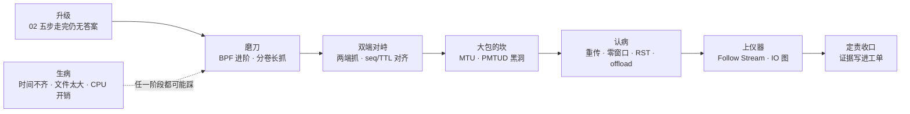
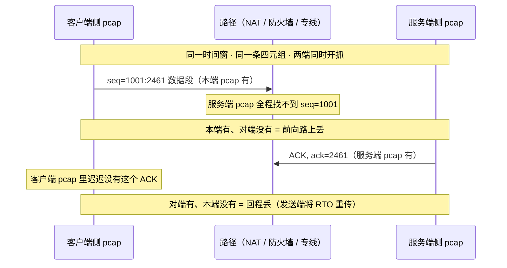
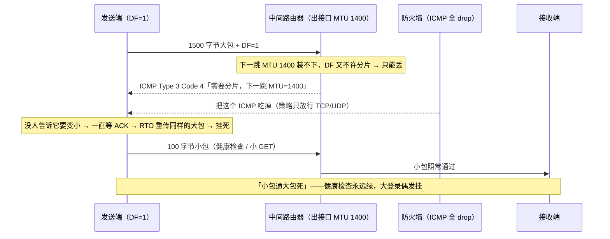
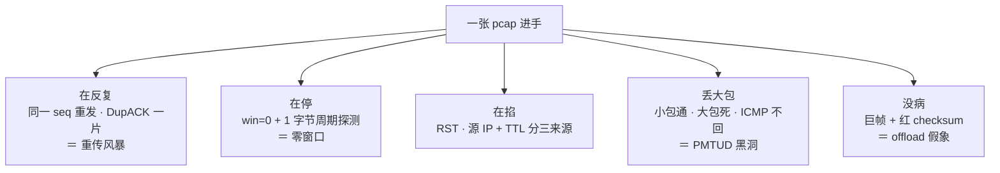
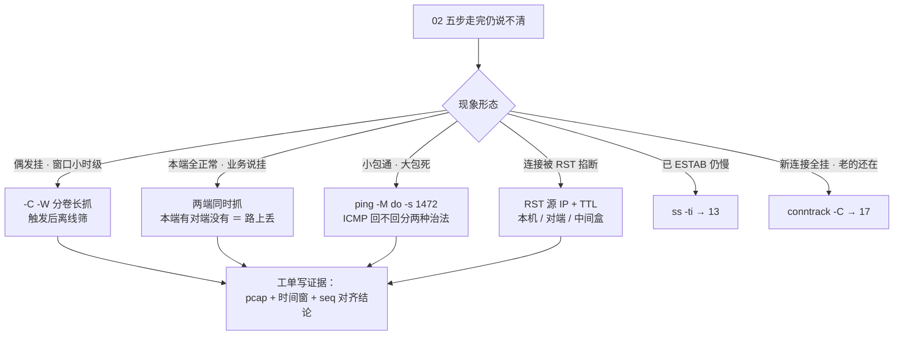

# 网络排障与抓包

> 登录偶发挂：curl 五段做差全正常、`nc` 秒通、mtr 全程 0 丢——[02](../02-网络排查命令/) 的五步走完了，还是说不清。群里开始互相甩锅，有人已经在生产机 `tcpdump -i any` 打终端，SSH 眼看卡死。
> **本章回答**：一次说不清的网络问题深排障怎么走——过滤器进阶、两端抓对比、MTU/PMTUD、读 pcap 认病，最后把锅钉死在证据上。
> **不讲**：第一轮刀法（curl -w 做差 / dig / nc / mtr / tcpdump 最小纪律四件套）→ [02](../02-网络排查命令/)；握手/窗口/重传机制 → [13](../13-TCP与UDP/)；分层封装与收包路径 → [12](../12-网络栈与Socket/)；TLS 流量为什么看不到明文 → [14](../14-HTTP与TLS/)。

**标记**：🎯重点 · 🔥难点 · ⭐常考 · 🔧实操

---

## 一、一张图：一次深排障的一生

> 🎯 **一句话**：02 的五步走完仍说不清，才升级到本章：磨刀 → 两端对峙 → 大包的坎 → 认病 → 上仪器，靠证据定责收口。



**读图**：
- 主线是一次深排障的六个阶段，每节讲一段；升级是入口——没走完 02 五步的工单不配进这张图。
- 「双端对峙」和「大包的坎」是本章两件只有深排障才做得动的事：单端永远定不了「路上」的罪，小包探测永远测不出大包的坎。
- 底部虚线是深排障自己会生的病，八节集中讲——工具用错，排障者自己就是事故源。

---

## 二、升级：什么样的工单才配深排障

> 🎯 **一句话**：「工具都说好、业务说不好」的工单才升级抓包——升级的是证据强度，不是抓更大的包。

02 的五步（接警翻译 → 定层做差 → 缩范围 → 最小留证 → 定责）走完仍没有答案的，就三种形态，各对应本章一条路：

```text
偶发型   一小时才挂一次，第一轮刀法等不到窗口      → 分卷长抓（三节）
说不清型 本端 ss / curl / mtr 全正常，业务说挂     → 两端抓对比（四节）
大包死型 健康检查小包通，大 POST / 大 TLS 记录挂   → MTU / PMTUD（五节）
```

**两种看着像、其实不用升级的**，先排掉：

- **大厅能进、房间进不去**——登录域名（HTTPS :443）和房间（长连接 IP:9000）是两条连接两个端口，这是抓错目标，不是深排障；抓房间端口去（02 已讲，别在登录域名上白抓一晚上）。
- **已 ESTAB 仍慢**——那是传输层窗口/重传的事，`ss -ti` 看 `retrans` / `rcv_space` / `rtt` 三样就能定型 → [13](../13-TCP与UDP/)；这种工单抓 2GB pcap 也只会看到「延迟大」，白烧。

> ⚠️ **别混**：「升级」≠ 把 `-c 1000` 改成 `-c 100000` 蛮力大抓。升级的是**证据强度**——两端对比、长窗口覆盖、离线分析；包数抓得再多，单端 pcap 还是定不了「路上丢没丢」。

> 📝 **面试**：「什么情况下你会两端抓包？」——答「本端一切正常但业务仍挂、或要区分路上丢还是端上丢、或偶发问题要留长窗口证据时；第一轮永远先做差 + nc + route get，任何情况下不裸抓」。

---

## 三、磨刀：BPF 过滤器进阶与长抓分卷 🔧

> 🎯 **一句话**：BPF 在内核里就把不要的包筛掉，写不对等于白抓；偶发问题靠 `-C -W` 分卷轮转留窗口，不靠蛮力大文件。

### 原语：host / port / net / 复合表达式

**BPF（Berkeley Packet Filter，捕获过滤器）** = tcpdump 在**内核里**就生效的筛选表达式，不匹配的包根本不会拷到用户态——开销小，但抓的时候就得写对。02 的最小闭环 `host IP and port P -nn -c 1000 -w file` 是地基，这里补全原语：

```bash
tcpdump -i eth1 src host 10.0.0.5 and dst port 8080 -nn -c 500 -w /tmp/one_way.pcap
#            ↑ 只看一个方向（源是对端、目的是本端口）——比 host+port 再砍掉一半流量
tcpdump -i eth1 net 10.0.0.0/24 and port 9000 -nn -c 500 -w /tmp/room.pcap
#            ↑ 一个网段；也可写 net 10.0.0.0 mask 255.255.255.0——别开得太大
tcpdump -i eth1 'host 10.0.0.5 and (port 443 or port 8080)' -nn -c 2000 -w /tmp/two.pcap
#                              ↑ 多端口 or 要整体加括号，否则 and 优先级会拆错
tcpdump -i eth1 'not port 22' -nn -c 500 -w /tmp/no_ssh.pcap
#            ↑ 永远排除自己的 SSH——排障者把值班通道抓死是经典事故
tcpdump -nn -r /tmp/a.pcap 'tcp[tcpflags] & tcp-syn != 0' | head
#            ↑ 离线读：pcap 拿回来还能再过滤，第一轮抓松一点没关系
```

> ⚠️ **别混**：**捕获过滤器（BPF）≠ 显示过滤器**。BPF 是 tcpdump 抓时在内核筛的，语法 `and / or / not`；显示过滤器是 Wireshark 打开 pcap 后再筛的，语法 `&& / || / !`，能力完全不同（`tcp.analysis.retransmission` 只有显示过滤有）。抓松了还能离线筛，抓紧了丢掉的包永远回不来——**先放宽再收紧**，pcap 空不等于没故障。

### tcp[tcpflags]：按位与还是等于 🔥

> 💡 **打个比方**：TCP 头的标志位字节是一排开关灯。`&` 是「这几盏里**任意一盏**亮着就算命中」；`=` 是「**恰好只有**这几盏亮」——SYN-ACK 的 SYN 灯也亮，所以 `& tcp-syn` 会把它一起抓进来。

```text
TCP 头第 14 字节（写作 tcp[13]，别名 tcp[tcpflags]）是标志位字节，每位一盏灯：
  FIN=0x01  SYN=0x02  RST=0x04  PSH=0x08  ACK=0x10  URG=0x20

'tcp[tcpflags] & (tcp-syn|tcp-rst) != 0'   ← SYN 或 RST 任一盏亮就抓（含 SYN-ACK）
'tcp[tcpflags] = tcp-syn'                  ← 恰好只有 SYN 亮（纯 SYN，不含 SYN-ACK）
'tcp[tcpflags] & tcp-rst != 0'             ← 只要 RST 亮（回来看源 IP 是谁）
```

> ⚠️ **别混**：`& tcp-syn != 0` 会把 **SYN-ACK 也带上**；只要纯 SYN 必须用 `= tcp-syn` 精确匹配。这是过滤器里被问得最多的一处笔误。

### 长抓：分卷轮转与 snaplen 🔧⭐

`-c 1000` 是短窗口的保险丝；偶发问题（一小时挂一次）要的是**长时间滚动覆盖**：

```text
-c 1000          抓够 1000 个包就停 —— 短窗口确认形态用
-C 100 -W 5      每个文件 100MB、最多留 5 个，写满第 6 个时删最旧的
                 → 磁盘占用封顶 500MB，永远保着「最近 500MB」的现场
-s0              抓全包（默认 snaplen 会截断，Follow Stream 会残）
-s 96            只抓前 96 字节 —— 认病（看头）足够，文件小一个量级
-B 4096          抓包内核缓冲 KB；流量大时 pcap 自己丢包就加大它
```

触发之后，拿着发生时刻去 5 个分卷里离线筛（`tcpdump -r` 或拷回 Wireshark），比在终端实时盯几个小时靠谱得多。

两件配套纪律：

- **权限**：抓包要 `CAP_NET_RAW`——给值班账号加 tcpdump 组，不要长期 root 裸跑；装包 `yum install -y tcpdump` / `apt install tcpdump`。
- **容器**：Pod 里默认看不到宿主机的 veth 对端——要抓「包到底有没有出节点」，在**宿主机网卡或 CNI 接口**上按 Pod IP+端口抓；进 Pod 排查用 K8s ephemeral debug 容器。

> 🔍 **现场**：偶发挂的分卷长抓剧本。

```bash
tcpdump -i eth1 host 10.0.0.5 and port 9000 -nn -s 96 -C 100 -W 5 -w /tmp/room_cap.pcap
# 挂了之后：
tcpdump -nn -r /tmp/room_cap.pcap4 'tcp[tcpflags] & (tcp-rst) != 0' | head
# ← 拿发生时刻对分卷时间范围，先筛 RST 再看前后 10 行，几秒钟出形态
```

> 📝 **面试**：「偶发问题怎么抓包？」——分卷轮转 `-C 100 -W 5` 滚动覆盖 + `-s 96` 只抓头控制体积，触发后拿时间点离线筛；**不要**开着终端实时盯，也不要 `-c` 无限抓等它写满根盘。

---

## 四、双端对峙：两端抓包对比定责 ⭐🔥

> 🎯 **一句话**：本端有、对端没有 = 路上丢；单端 pcap 只能证明「我发了 / 我收了」，永远定不了「路上」的罪。

### 单端证据的边界：四种组合

「说不清型」工单的核心动作就是**两端同时抓**。同一条连接、同一时间窗，两端 pcap 对着看只有四种结果：

```text
本端有 seq=1001，对端没有            → 前向路上丢（去查路径：mtr TCP 模式、运营商）
对端回了 ACK，本端没收到             → 回程丢（对端在重传，本端 later 才到或收不到）
对端有这条连接，seq 和本端对不上      → 根本不是同一条连接（NAT 映射算错 / 抓错四元组）
两端 seq 完全对得上，只有中间某包缺失 → 精确到包的丢点，这就是深排障要的铁证
```



**读图**：两端 pcap 像两台对着同一球门的摄像机——**谁家的带子里有这颗球（seq），球就到过谁家门口**；两家都没有的，丢在场上（路上）；两家都有但内容不同（TTL、源 IP 变了），有人在中场换过球。

### 时间戳对齐：别对表，对动作 🔥

> 💡 **打个比方**：两台摄像机时钟没对齐，「几点几分进球」永远吵不清；但对「第 1001 号球」这个动作没有歧义——seq/ack 就是球号。**对不齐表就对动作**。

- 两台机器 NTP 偏几秒到几分钟是常态，墙钟时间戳直接对比没有意义。
- 正确做法：Wireshark 里把两端都改成 **View → Time Display Format → Seconds Since Beginning of Capture**（相对秒），再用同一个 seq 当锚点对齐；或 `capinfos file.pcap` 先看两端的时区/起始时间差多少。
- 顺手把 NTP 修了（chrony 配置 → [32](../32-NTP与时间同步/)），下次对表就对得上了。

**TTL 也能当锚**：同一个包走同样路径，TTL 递减应该一致。抓到的 RST 的 TTL 和两端主机正常发包的 TTL **对不上**——这台发 RST 的机器不在两端路径上，是**中间设备伪造**的（TTL 每跳减 1 的机制 → [12](../12-网络栈与Socket/)）。

### NAT 后：先换算四元组再对

路径上有 NAT/LB 时，两端 pcap 里的四元组**长得不一样**，对 seq 前先换算：

```text
客户端侧抓：  192.168.1.9:52344 → 203.0.113.10:443（VIP）
服务端侧抓：  203.0.113.77:40001 → 10.0.0.5:443（SNAT 后源 + DNAT 后目的）
                ↑ 中间设备把两端各自看到的 IP:端口都改了——直接按本端四元组在对端 pcap 里 grep 永远是空
```

一句机制：**DNAT 在 PREROUTING 改目的（客户端抓 VIP、服务端抓后端口），SNAT 在 POSTROUTING 改源**，映射表在 conntrack 里，细节 → [17](../17-iptables与conntrack/)。

> 🔍 **现场**：两端对抓的操作要点，四步一步不能省。

```bash
# 服务端侧（按映射后的四元组写过滤）
tcpdump -i eth0 host 203.0.113.77 and port 443 -nn -s0 -w /tmp/srv_$(date +%H%M).pcap
# 客户端侧
tcpdump -i eth1 host 203.0.113.10 and port 443 -nn -s0 -w /tmp/cli_$(date +%H%M).pcap
# ① 复现前 10 秒两端同时开、复现后同时停（约好同一个钟点）
# ② 先换算 NAT 后四元组，再在对面 pcap 里找这条流
# ③ 对 seq/ack：对不上 = 不是同一条连接或有人改包
# ④ RST 看源 IP + TTL：与两端主机都不一致 = 中间盒（LB / WAF / 运营商 NAT）
```

### 握手卡死时的两端对照

SYN 形态两类（细节 02 已讲），配两端抓就 能定位到段：

```text
重复 [S]（间隔 ≈1s/2s/4s 退避）无 [S.]  → timeout：SYN 出没出本机网卡？对端抓不抓得到？
[S] 后毫秒级 [R.]                        → refused：不用两端抓，先 ss -lntp 查监听
```

两个只有深排障才碰得到的坑：

- **conntrack 表满**：SYN 可能在本机 PREROUTING 就被丢，**网卡上根本看不到出站 SYN**——先 `conntrack -C` 对 `nf_conntrack_max`、`dmesg | grep 'table full'`，再去抓包（→ [17](../17-iptables与conntrack/)）。「新连接全挂、老连接还在」是它的签名。
- **对端等不到第三个 ACK**：本端发了、对端没收到，或对端**全连接队列满**静默丢了收尾包——对端 `ss -lnt` 看 Recv-Q 是否顶满 Send-Q（→ [12](../12-网络栈与Socket/)）。

> 📝 **面试**：「NAT 后面定 RST 谁发的？」——必须**两端同时抓**，对**序列号和 TTL**；RST 源 IP 是第三个地址或 TTL 与两端路径不符，就是中间设备。只在本机抓就下结论 = 猜。

---

## 五、大包的坎：MTU 与 PMTUD 黑洞 🔥⭐

> 🎯 **一句话**：小包通大包死，先怀疑路径某段 MTU 小于 1500、且 ICMP「需要分片」被墙——PMTUD 黑洞。

### 1500 是怎么构成的

```text
以太网 MTU 1500 = 一个 IP 包的最大长度（不含以太网帧头和 FCS）
  [ IP 头 20 ][ TCP 头 20 ][ payload ≤ 1460 ]   ← 1460 就是 MSS：TCP 每段载荷上限
  [ IP 头 20 ][ ICMP 头 8 ][ 数据 ≤ 1472 ]      ← 所以探 MTU 用 ping -s 1472
```

| | **MTU** | **MSS** |
|--|--|--|
| 谁定的 | 链路层给 IP 包的限制 | TCP 载荷上限，握手里双方协商取小 |
| 算多宽 | 整个 IP 包（含全部头） | 只算 payload |
| 以太网常见值 | 1500 | ~1460 |

> ⚠️ **别混**：MTU 限的是**整个 IP 包**，MSS 限的是**TCP 载荷**——`1500 − 20(IP) − 20(TCP) = 1460` 这条算式把两者焊在一起，面试写反直接扣分。

**IP 分片**和 **TCP 切段**也是两码事，一张表钉死：

| | **IP 分片（fragmentation）** | **TCP 切段（segmentation）** |
|--|--|--|
| 谁干的 | 路由器，网络层 | 发送端，传输层 |
| 什么时候 | 包超过下一跳 MTU 且 DF=0 | 数据超过 MSS，常态 |
| 丢一个怎么办 | 任一分片丢，**整包废**，TCP 只能整段重传 | 每段独立带 seq，丢哪段补哪段 |
| 现代姿势 | 尽量避免（DF=1 + PMTUD） | 常态 |

### PMTUD 黑洞：DF、ICMP Type 3 Code 4

**PMTUD（Path MTU Discovery，路径 MTU 发现）** = 发送端把 IP 头的 **DF（Don't Fragment）位置 1**，赌路径能装下；装不下的路由器丢包并回 **ICMP Type 3 Code 4「Fragmentation Needed」（需要分片，并附下一跳 MTU）**，发送方据此调小。整个机制**寄生在 ICMP 上**——ICMP 被防火墙吃掉，发送方就瞎了：



**读图**：黑洞的两个必要条件缺一不可——**路径某段 MTU 偏小** + **ICMP 回不去**。前者是物理，后者是策略：只修其中一个就能通（放开 ICMP，或直接把 MSS 钳小）。表里发送方最后在「原样重传大包」里打转，这就是为什么 TLS 大记录（握手证书链常超 1400）偶发挂死而小 API 稳定。

> 💡 **打个比方**：隧道/VPN 像给你的信再套一层信封——每套一层壳，信就更厚一点，而小区信箱口（链路 MTU）还是那么大。原本塞得下的信，套上壳就卡在信箱口了；小纸条照塞得进。

### 隧道叠加：每一层封装都吃几十字节 ⭐

```text
裸以太网                              MTU 1500
GRE 隧道          −24               → 1476
VXLAN（K8s overlay 常用）−50        → 1450
WireGuard         −60               → 1440
IPsec ESP         −50 ~ 70          → 1430~1450
云专线再叠 VPN                       → 更小，1300 以下都有
```

两个高频现场：

- **K8s**：overlay 网络里 Pod 的包出节点要再封一层 VXLAN——Pod 里 `ip link` 看到的 1500 是假象，链路上实际只有 1450 可用 → Pod 访问集群外服务「小请求通、大 body 挂」。
- **VPN**：办公网/堡垒机 VPN 后传大文件卡死、小 ping 正常——同一个坑的另一张脸。

### 现场复现与治法 🔧

> 🔍 **现场**：小包通大包死，三条命令定形态。

```bash
ping -c 3 203.0.113.10                 # 小包，常骗你——它只有 56 字节
ping -M do -s 1472 -c 3 203.0.113.10   # DF=1 + 1472 payload（+28 头 = 1500）
# From 10.0.0.1: icmp_seq=1 Frag needed and DF set (mtu = 1400)
#   ← ICMP 回来了：路径 MTU=1400，PMTUD 还活着，按它调就行
# 3 packets transmitted, 0 received, 100% packet loss
#   ← 什么都回不来：ICMP 也被墙了 —— PMTUD 黑洞
tcpdump -i eth1 icmp -nn -c 20         # 顺手抓 ICMP，确认「需要分片」到底回没回
```

不必一次赌 1472，**二分找边界**：`-s 1472` 不通试 `-s 1400`，再 `-s 1200`……「通与不通」的边界 + 28 ≈ 路径 MTU。

治法四选一（按改动半径从小到大）：

- **放行 ICMP Type 3 Code 4**——最正确，但墙可能不归你管。
- **MSS 钳制（MSS clamp）**：`iptables -t mangle -A FORWARD -p tcp --tcp-flags SYN,RST SYN -j TCPMSS --clamp-mss-to-pmtu`，在握手时把 MSS 改小，两端都蒙在鼓里。
- **隧道内口调小 MTU**：让路径上每一跳自己算对。
- **应用主动切小**：游戏 UDP 大包自己按 ≤1400 切，别指望 IP 分片（丢一个全废）。

> 📝 **面试**：「健康检查正常、大请求偶发挂，你怀疑什么？」——PMTUD 黑洞：路径 MTU 小于 1500 + ICMP 需要分片被墙。验证用 `ping -M do -s 1472`（1472+28=1500），治法放行 ICMP 或 MSS clamp。**别先换证书、别重启服务**。

---

## 六、读包认病：重传、零窗口、RST 与 offload 假象 🔥⭐

> 🎯 **一句话**：pcap 进手先认五种病——在反复（重传风暴）、在停（零窗口）、在掐（RST）、丢大包（PMTUD）、根本没病（offload 假象）。

机制（为什么会重传、为什么零窗）→ [13](../13-TCP与UDP/)；本章只做**认形态 + 定方向**。

### 在反复：重传风暴

```text
12:00:01.100 IP 10.0.2.88.52344 > 10.0.0.5.443: Flags [.], seq 1001:2461, ack 88, win 501
12:00:01.203 IP 10.0.2.88.52344 > 10.0.0.5.443: Flags [.], seq 1001:2461, ack 88, win 501   ← 同一 seq 原样再发
12:00:01.410 IP 10.0.2.88.52344 > 10.0.0.5.443: Flags [.], seq 1001:2461, ack 88, win 501   ← 间隔变长：RTO 退避
12:00:01.602 IP 10.0.0.5.443 > 10.0.2.88.52344: Flags [.], ack 1001, win 501                ← DupACK：对端在等 1001
```

**读包**：同一个 `seq` 反复出现 + 对端一片重复的 `ack`（DupACK），就是丢包正在发生。配两端抓再进一步：重传的那段**对端到底收没收到过**——没收到过是路上丢，收到了但 ACK 回不来是回程丢，一把分开。

### 在停：零窗口

```text
12:01:00.001 IP 10.0.0.5.443 > 10.0.2.88.52344: Flags [.], ack 5001, win 0     ← 对端通告窗口 0：收不动了
12:01:00.320 IP 10.0.2.88.52344 > 10.0.0.5.443: Flags [.], seq 5001:5002      ← 本端 1 字节窗口探测（persist）
12:01:05.331 IP 10.0.2.88.52344 > 10.0.0.5.443: Flags [.], seq 5001:5002      ← 每 ~5s 探一次，一直 win 0
```

**读包**：`win=0` + 周期性 1 字节探测 = 对端接收缓冲满、应用不 read——**这不是网络病**，治对端去（线程卡死 / GC / 下游慢 → [12](../12-网络栈与Socket/)）。

| | **重传风暴** | **零窗口** |
|--|--|--|
| pcap 形态 | 同一 seq 反复重发 | `win=0` + 1 字节周期探测 |
| 谁在动 | 发送端在反复发 | 发送端干脆停发 |
| 根因方向 | 路上丢 / 回程丢 | **对端应用不 read** |
| 治 | 查路径（四节两端抓） | 治对端（→ [12](../12-网络栈与Socket/) / [13](../13-TCP与UDP/)） |

### 在掐：RST 的三个来源 ⭐

```text
12:02:10.507 IP 10.0.2.88.52344 > 10.0.0.5.443:  Flags [R.], seq 5001   ← RST 源 = 本端 IP：本机内核发的
12:02:10.507 IP 10.0.0.5.443 > 10.0.2.88.52344:  Flags [R.], seq 1      ← RST 源 = 对端 IP：对端或它本机的墙
12:02:10.507 IP 203.0.113.77:443 > 10.0.2.88.52344: Flags [R.]          ← 第三个 IP：中间盒插手
```

| 来源 | 怎么认 | 去向 |
|--|--|--|
| **本机内核** | 源 IP 是本端，且此刻端口没监听 / 队列满（`tcp_abort_on_overflow=1`） | 监听与队列 → [12](../12-网络栈与Socket/) |
| **对端进程** | 源 IP 是对端，对端此刻崩溃 / `kill -9` / 端口没人听 | 优雅停服 → [05](../05-进程与信号/) |
| **中间盒** | 源 IP 是第三方，或 TTL 与两端路径不符，或两端 seq 对不上 | 防火墙 / LB / NAT 空闲超时 → [17](../17-iptables与conntrack/) |

> ⚠️ **别混**：看到 RST 先看**源 IP**，别先骂应用——对端进程崩、本机没监听、中间盒超时掐线，三个来源三套治法；NAT 后源 IP 都可能是伪造的，只有四节的两端抓 + TTL 能钉死。

### 假象：offload 陷阱（TSO / GSO / GRO）🔥

**TSO（TCP Segmentation Offload）/ GSO（Generic Segmentation Offload）** = 内核把「按 MSS 切段」的活交给网卡硬件干；**GRO（Generic Receive Offload）** 是收包方向的反向聚合；**checksum offload** 是把算校验和也交给网卡。它们让本机抓包点看到的**不是线上真实的样子**：

```text
发送路径：
  应用 write 一大块（如 64KB）
    → 内核 TCP —— 本机抓包点①：看到 64KB 的「巨段」，checksum 字段还是占位值
    → 网卡 TSO 硬件切段 + 算 checksum —— 线上真实的 1460 字节段在这里才诞生
    → 线路：N 个 1500 字节的帧

接收路径：
  线路 N 个帧 → 网卡 GRO 聚合 —— 本机抓包点②：又看到「巨帧」→ 内核 TCP 正常处理
```

> 💡 **打个比方**：本机抓到的是**还没拆箱的整箱货**——网卡在后台才把整箱拆成小件、才给每件贴上校验封条。你在传送带末端蹲点看到「箱子上没贴封条」，不是货坏了，是你看的位置比贴封条的地方早。

> 🔍 **现场**：本机 Wireshark 巨帧 + incorrect checksum 满屏红，先认 offload 再说。

```bash
ethtool -k eth1 | grep -E 'tcp-segmentation-offload|generic-segmentation|generic-receive|tx-checksumming'
# tcp-segmentation-offload: on    ← TSO 开着：出站巨帧 + 红 checksum 多半是假象
# tx-checksumming: on             ← checksum 网卡算：抓包点看到的字段就是占位值
```

判据一句话：**对端抓正常 = 本机假象**。要看线上真实包：去对端抓，或**临时** `ethtool -K eth1 tso off gro off` 抓完**立刻开回去**——关 offload 会把分段打回 CPU，高峰期伤性能；抓包 CPU 开销与软中断 → [06](../06-CPU与Load/)。**不要**对着假 checksum 修应用的校验代码，更不要把「关 TSO」当业务修复。

### 收束：一张 pcap 的病谱 🎯⭐

到这里，「pcap 进手先看什么」可以收成一张可背的谱——**五种病，各有一个签名**：



**读图**：五个分支按「这条连接在干什么」分组——反复发、停着、被掐、只有大包死、看起来病但其实没病。前两个看**发送端行为**，第三个看**包的来源**，第四个看**包的大小分布**，第五个先排除再认病——**先认假象再看病**，不然会把一晚上的功劳耗在修一个不存在的 bug 上。

可背清单：**在反复查路径、在停查对端、在掐查来源、丢大包查 MTU、没病查自己（offload）**。

> ⚠️ **别混**：病谱认的是**形态，不是根因**——重传风暴的锅可能在路上也可能在对端（收了但 ACK 回不来），零窗口更和网速无关。形态定方向，根因还得回到四节的两端对比去钉。

> 📝 **面试**：「拿到一个 pcap 你怎么分析？」——按五个动词背：在反复（重传风暴）/ 在停（零窗口）/ 在掐（RST 三来源）/ 丢大包（PMTUD）/ 没病（offload 假象），先排假象、再认病、最后两端对比定根因。这一句就是本章的骨架。

---

## 七、上仪器：Wireshark 三板斧

> 🎯 **一句话**：Follow Stream 锁一条对话，tcp.analysis.flags 一网打尽异常段，IO 图看趋势——三板斧都在本地离线用，pcap 拷回来，不在生产机开 GUI。

（捕获过滤与显示过滤的差异见三节 ⚠️；这里全是显示过滤器的用法。）

**① Follow TCP Stream**：右键任一包 → Follow → TCP Stream，只留这条对话、按方向染色。HTTP 502 到底是网关回的还是上游回的、断在请求一半还是响应一半，一眼见分晓。TLS 流量在这里只看得到加密字节——想看明文要在服务端配 keylog 抓时导出密钥，方法与边界 → [14](../14-HTTP与TLS/)。

**② tcp.analysis.flags**（Statistics → Expert Information 同源）——Wireshark 替你标好的异常段，一行过滤器一种病：

```text
tcp.analysis.retransmission          ← 重传（病谱「在反复」）
tcp.analysis.duplicate_ack           ← DupACK 一片
tcp.analysis.zero_window             ← 零窗口（病谱「在停」）
tcp.analysis.lost_segment            ← 缺段（乱序或真丢，结合两端抓分）
tcp.flags.reset==1                   ← 所有 RST，配合源 IP 分三来源
tcp.flags.syn==1 && tcp.flags.ack==0 ← 纯 SYN（显示过滤里的「=」精确写法）
http.response.code==502              ← 定 502 是哪一跳回的
ip.addr==10.0.0.5 && tcp.port==8080  ← 锁定两端一端口
```

**③ IO 图**（Statistics → I/O Graph）：把整条流的吞吐画成曲线——**锯齿**是重传风暴（发一截退一截）、**台阶**是限速或窗口卡住、**曲线归零**的时刻就是断流点，拿它和业务日志的时间线对齐，比逐包翻快一个数量级。Statistics → Flow Graph 则把整条连接画成时序总览，「哪边不回话」直接可见。

> 📝 **面试**：「Wireshark 你常用什么？」——Follow Stream 看一条对话的完整往返、`tcp.analysis.flags` 一网打尽重传/零窗/丢段、IO 图看吞吐形态定断流时刻；生产机上不装 GUI，pcap 拷回本地分析。

---

## 八、生病：深排障自己会踩的坑 🔧

> 🎯 **一句话**：深排障四个坑——时间不齐对不了表、文件太大拖不动、抓包本身伤机器、GUI 开在生产机；排障者别成为事故源。

- **NTP 不齐**：两端时间戳没法对 → 四节的办法（对 seq 不对表）；治本是修 chrony → [32](../32-NTP与时间同步/)。
- **文件太大**：`-s 96` 只抓头认病、`-C -W` 分卷封顶；已经抓出 8GB 的用 `editcap -c 100000 big.pcap part_` 拆开再筛；抓满磁盘本身就是事故 → [08](../08-磁盘与IO/)。
- **抓包本身有开销**：过滤不紧时 tcpdump 吃软中断、占单核；高峰临时关 offload 抓真实包，抓完立刻开回去；开销账 → [06](../06-CPU与Load/)。
- **GUI 与权限**：生产机不装不开 Wireshark GUI；`-A` 把包打到 SSH 终端 = 自造事故；值班账号进 tcpdump 组（`CAP_NET_RAW`），不要 root 裸跑。

> 🔍 **现场**：开抓前 10 秒自查——网卡对不对（route get 的 dev）、过滤够不够紧（先跑 5 秒看计数）、盘够不够（`df -h /tmp`）、`not port 22` 带没带。四问都过再按下回车。

---

## 九、作战：定责

> 🎯 **一句话**：深排障的收口是把「现象 → pcap 证据 → 责任方」写进工单；没有证据链的定责都是猜。



**读图**：入口先分形态，六条分支各自有明确的第一刀；三个出口（13 / 17 / 证据工单）里只有「证据工单」是本章的终点——机制问题移交邻章时，**把 pcap 和时间窗一起附上**，别只甩一句「网络没问题」。

| 现象 | 先做 | 别做 |
|------|------|------|
| 登录偶发挂（小时级一次） | `-C -W` 分卷长抓 + 触发后离线筛 | 开着终端实时盯几小时 |
| 本端 curl / nc / mtr 全正常 | 两端同时抓，对 seq | 只凭本端 pcap 定责 |
| 小包通大包死 | `ping -M do -s 1472`；二分边界 | 先换证书、重启全服 |
| 巨帧 + checksum 满屏红 | `ethtool -k` 认 offload；对端抓验证 | 修应用的校验代码 |
| NAT 后连接被掐 | 两端抓 + RST 源 IP / TTL | 只本机抓就骂应用 |
| 重传风暴 | 两端抓：重传段对端收没收到过 | 直接换拥塞算法（→ 13） |
| 零窗口 `win=0` | 治对端 read（→ 12） | 加大本端发送缓冲 |
| 新连接全挂、老连接还在 | `conntrack -C` + dmesg（→ 17） | 先改安全组、重启服务 |
| 偶发 502 | 网关日志 + 上游退出码（OOM/137 → [07](../07-内存与OOM/)）+ pcap 中途断流，三证齐全（语义 → [14](../14-HTTP与TLS/)） | 只看一端日志就结案 |
| 重启 `bind` 报 Address already in use | 旧进程占口（→ [11](../11-Systemd与服务管理/)） | 当网络问题去抓包 |

**60 秒剧本** 🔧：

```text
① 0–10s  确认 02 五步真的走完了：五段做差 / nc / route get / mtr 的结论各是什么？
          「已 ESTAB 仍慢」当场转 ss -ti（→13），别进深排障
② 10–30s  定形态：偶发（分卷长抓）/ 本端正常（两端抓）/ 大包死（ping -M do）
③ 30–45s  备刀：两端约时间窗 + 换算 NAT 后四元组；过滤先放宽再收紧；not port 22
④ 45–60s  复现前 10 秒两端同时开抓；结束后先认病谱（反复/停/掐/大包/假象）再深挖
```

> 📝 **面试**：「你怎么证明问题是网络而不是应用？」——两端同时抓同一时间窗、同一条四元组：本端有对端没有 = 路上丢，这是 pcap 级铁证；只看本端或只看监控曲线，都只能算推测。

---

## 十、收口

### 命令速查 🔧

```bash
# 过滤器（BPF，抓时筛）
tcpdump -i eth1 'tcp[tcpflags] = tcp-syn' -nn -c 100 -w /tmp/syn.pcap       # 纯 SYN（= 不是 &）
tcpdump -i eth1 'tcp[tcpflags] & (tcp-syn|tcp-rst) != 0' -nn -c 200          # 握手/复位摘要
tcpdump -i eth1 net 10.0.0.0/24 and port 9000 -nn -c 500 -w /tmp/room.pcap   # 网段+端口
tcpdump -i eth1 'not port 22' -nn -c 500                                     # 别抓自己的 SSH
# 长抓与离线
tcpdump -i eth1 host A and port P -nn -s 96 -C 100 -W 5 -w /tmp/cap.pcap     # 分卷滚动，500MB 封顶
tcpdump -nn -r /tmp/cap.pcap 'tcp[tcpflags] & tcp-rst != 0' | head           # 离线再筛
# MTU / PMTUD
ping -M do -s 1472 -c 3 $IP        # 1472+28=1500；不通再 1400/1200 二分
tcpdump -i eth1 icmp -nn -c 20     # 看「需要分片」回没回
# offload
ethtool -k eth1 | grep -E 'segmentation-offload|checksumming'                # 认假 checksum
# NAT / 表满
conntrack -C; dmesg | grep -i 'table full'    # 新挂旧不挂先看这个（→ 17）
```

### 面试锚点

| 问 | 30 秒答 |
|----|---------|
| 什么时候才两端抓包？ | 02 五步走完仍说不清：本端全正常、偶发要留窗口、或要定「路上丢还是端上丢」。 |
| 两端抓怎么操作？ | 同一时间窗、同一条四元组；NAT 后先换算映射后四元组；对 seq/ack + TTL。 |
| 本端有对端没有说明什么？ | 前向路上丢；对端回包本端没有 = 回程丢；seq 对不上 = 不是同一条连接或有人改包。 |
| 两端时间戳对不齐怎么办？ | 别对表对动作：用 seq/ack 当锚点，Wireshark 改「相对捕获秒」。 |
| RST 三个来源？ | 本机内核（没监听/队列满）、对端进程（崩/被杀）、中间盒（源 IP 第三方 / TTL 不符）。 |
| NAT 后定 RST？ | 两端同时抓，看源 IP + TTL + seq；只本机抓 = 猜。 |
| MTU vs MSS？ | MTU 限整个 IP 包（以太网 1500）；MSS 限 TCP 载荷（~1460），握手协商取小。 |
| 分片 vs 切段？ | IP 分片是路由器干的、丢一片整包废；TCP 切段是发送端按 MSS 干的、丢哪段补哪段。 |
| 小包通大包死？ | PMTUD 黑洞：路径 MTU小于 1500 + ICMP 需要分片被墙；`ping -M do -s 1472` 复现。 |
| 隧道为什么更容易踩 MTU？ | 每层封装吃几十字节：VXLAN −50、GRE −24、WireGuard −60；K8s overlay 常见 1450。 |
| 治 PMTUD 黑洞？ | 放行 ICMP Type 3 Code 4、MSS clamp、隧道内口调 MTU、应用按小 MSS 主动切。 |
| 本机抓包 checksum 全红？ | TSO/GRO/checksum offload 假象；`ethtool -k` 认、对端抓验证；临时关抓完立刻开。 |
| 巨帧是坏包吗？ | 多半是 TSO/GSO 聚合视图，网卡硬件里才切段；对端抓到 1460 段才是线上真实样子。 |
| pcap 怎么认病？ | 五种：在反复（重传）/ 在停（零窗口）/ 在掐（RST）/ 丢大包（PMTUD）/ 没病（假象）。 |
| Wireshark 三板斧？ | Follow Stream、tcp.analysis.flags、IO 图；全在本地离线做。 |
| 偶发问题怎么抓？ | `-C 100 -W 5` 分卷滚动 + `-s 96` 控体积，触发后按时间点离线筛。 |

### 易错一句话对照

- 五步没走完就抓包 → 先做差 + nc + route get，抓包是升级不是第一刀
- 升级 = 抓更多包 → 升级的是证据强度（两端、长窗口、离线）
- `& tcp-syn != 0` 是纯 SYN → 会带上 SYN-ACK；纯 SYN 用 `= tcp-syn`
- pcap 空就是没故障 → 过滤可能写太紧，先放宽再收紧
- 只本端抓就定「网络丢包」 → 单端证明不了路上，必须两端
- 两端时间戳直接对比 → NTP 不齐，用 seq/ack 对齐
- NAT 两端按同一四元组找流 → 外侧是映射后的 IP:端口，先换算
- MTU 1500 所以 MSS 也是 1500 → MSS ≈ 1460（减 IP 头 20 + TCP 头 20）
- 大包死先换证书 → 先 `ping -M do -s 1472`，是 PMTUD 就治 MTU/ICMP
- 默认 ping 通排除 MTU 问题 → 小包 56 字节，测不出大包的坎
- 巨帧 + 红 checksum 修应用校验 → offload 假象，对端抓验证
- 把 `ethtool -K` 关 TSO 当修复 → 只是抓真实包的临时动作，抓完开回去
- 零窗口加大本端缓冲 → 根因在对端不 read
- 抓不到出站 SYN 就说网络好 → conntrack 满在 PREROUTING 就丢了，先 `conntrack -C`
- 生产机开 Wireshark GUI 分析 → pcap 拷回本地，生产机不装 GUI

### 数字墙

> 以太网 MTU **1500** · MSS **~1460** · `ping -M do -s 1472`（+28=1500）· GRE **−24** · VXLAN **−50** · WireGuard **−60** · IPsec **−50~70** · K8s overlay 常 **1450** · SYN 重传退避 **1s/2s/4s** · 分卷长抓 **`-C 100 -W 5`**（500MB 封顶）· 认病最小 snaplen **`-s 96`** · TCP flags 字节 **tcp[13]**：FIN 0x01 / SYN 0x02 / RST 0x04 / PSH 0x08 / ACK 0x10 · ICMP「需要分片」= Type **3** Code **4** · 零窗口探测 **~5s** 一次

---

## 合上书

- [ ] **默画主图**：升级 → 磨刀 → 双端对峙 → 大包的坎 → 认病 → 上仪器 → 定责；「生病」虚线挂在哪。
- [ ] **口述升级**：哪三种工单才升级（偶发 / 说不清 / 大包死），哪两种看着像其实不用（抓错目标 / ESTAB 仍慢去 13）。
- [ ] **默写过滤器**：host / src host / net / 复合括号各一例；`tcp[tcpflags]` 的 `&` 与 `=` 差在哪、纯 SYN 怎么写。
- [ ] **口述长抓**：`-c` 与 `-C -W` 的分工、`-s 96` 与 `-s0` 的取舍、偶发问题的完整抓法。
- [ ] **默画两端对比时序图**：同一时间窗同一条四元组，本端有对端没有 / 回程丢 / seq 对不上各是什么结论；NAT 后先做什么。
- [ ] **口述时间戳对齐**：为什么别对表、用什么当锚、TTL 怎么用来抓中间盒。
- [ ] **默画 PMTUD 黑洞过程图**：大包 + DF → 路由器丢并回 ICMP Type 3 Code 4 → 防火墙吃掉 → 发送方瞎等；两个必要条件、TLS 大记录为什么中招。
- [ ] **口述大包的坎**：1500 的构成、MTU vs MSS、分片 vs 切段、隧道每层吃多少、四条治法。
- [ ] **默画病谱结构图**：在反复 / 在停 / 在掐 / 丢大包 / 没病，各一个 pcap 签名；「先排假象」为什么排第一。
- [ ] **口述 RST 三来源**：怎么用源 IP + TTL + 两端 seq 分本机 / 对端 / 中间盒，各去哪章。
- [ ] **口述 Wireshark 三板斧**：Follow Stream、tcp.analysis.flags、IO 图各答什么问题；TLS 看不到明文怎么办（一句话 + 去 14）。
- [ ] **口述生病与作战**：四个坑各怎么防；60 秒剧本四段；「怎么证明是网络不是应用」的标准答案。

下一章：[iptables 与 conntrack](../17-iptables与conntrack/)。第一轮刀法：[02](../02-网络排查命令/) · 传输机制：[13](../13-TCP与UDP/) · 封装与收包：[12](../12-网络栈与Socket/) · NTP：[32](../32-NTP与时间同步/)。
