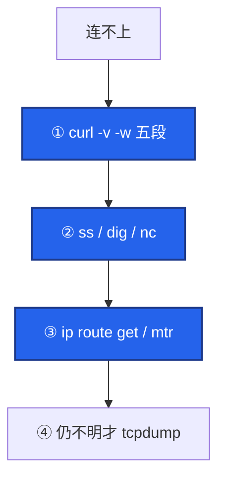
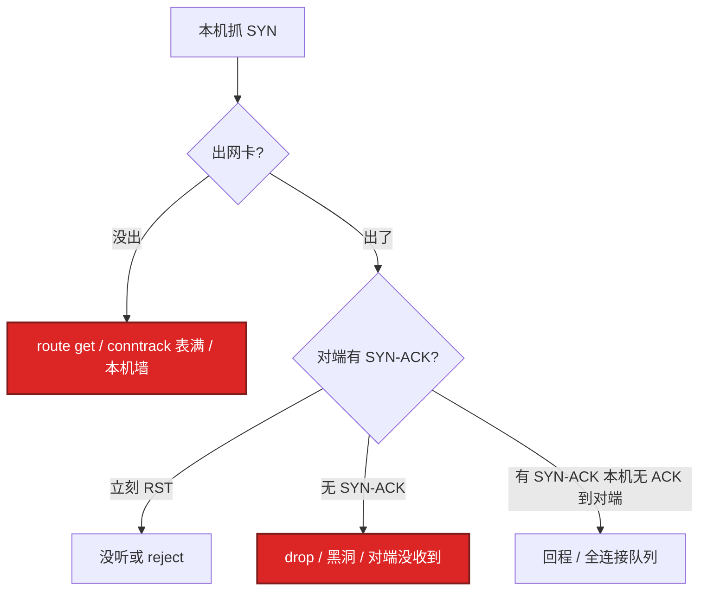
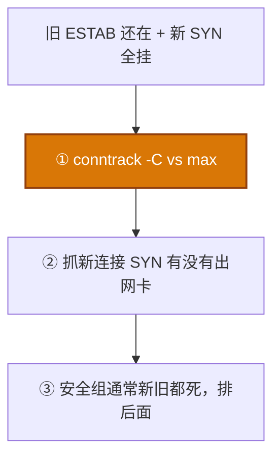

# 11｜网络排障与抓包 · 练习题

先对照 [知识点](知识点.md) **§2 总图 + §4 五段 + §6 抓包纪律** 自己口述，再对答案。关键字（curl -w 五段、tcpdump BPF、RST 源 IP、PMTUD）要能定层。每题标了覆盖范围：

| 标记 | 含义 |
|------|------|
| **核心** | 不懂整章就没建立起来 |
| **必会** | 值班和面试都要能讲 |
| **常用** | 线上会反复碰到 |
| **常考** | 白板和追问的高频口径 |

## 本题目录

- [Q1 分层、连不上三种人话](#q1)
- [Q2 curl -w 五段](#q2)
- [Q3 三次握手丢包定位](#q3)
- [Q4 route get / ARP / mtr](#q4)
- [Q5 tcpdump 过滤与生产纪律](#q5)
- [Q6 Wireshark 过滤与 RST](#q6)
- [Q7 MTU / PMTUD](#q7)
- [Q8 新挂旧不挂](#q8)
- [Q9 TSO 假 checksum](#q9)
- [Q10 502 与大厅/房间](#q10)
- [合上书](#合上书)

---

## Q1

**★★★★★｜从上往下还是先抓包？连不上三种人话怎么分？**

**覆盖**：核心 · 必会 · 常考

**对应**：知识点 §2 · §3.1

### 场景

oncall 电话：「现在连不上。」没有任何日志。有人已经准备 `tcpdump -i any`。

### 完整解答

**一句话**：从上往下定层：curl -w 五段 → ss/dig → route get/mtr → 仍不明才 tcpdump。

从上往下，不要先抓包。现场 80% 死在 DNS / TCP / TLS / 应用。主线见 §2.2：定层 → 缩范围 → 留证。



| 人话 | 包里 | 第一刀 |
|------|------|--------|
| refused | SYN → 立刻 RST | `ss -lntp`、reject |
| timeout | 重复 SYN，无 SYN-ACK | 抓 SYN、mtr、conntrack |
| reset | 有 RST | RST **源 IP** |
| 解析失败 | 无 TCP | dig（10） |

安全组 drop = 超时；reject = RST。ping 通不能证明 TCP 通；ping 不通 TCP 通 → ICMP 被禁，正常。

### 再追问

- 大厅能进、房间进不去，抓哪？——大厅 HTTP 用五段；房间长连接用 ss + 抓 **该端口** 的 SYN / 心跳。不要在大厅域名上抓房间。见 §4.7、§7.6。
- 80% 死在哪几层？——DNS / TCP / TLS / 应用。L2 抓包是缩小范围后的确认。

---

## Q2

**★★★★★｜curl -w 五段分别对应什么？哪段慢找谁？**

**覆盖**：核心 · 必会 · 常考

**对应**：知识点 §4

### 场景

HTTPS 登录 3 秒才出首字节。有人开了工单给网络组。你只有跳板上的 curl。

### 完整解答

**一句话**：curl -w 时间戳累计，本段做差：dns→tcp→tls→ttfb→body 各指向不同负责人。

时间戳从 0 累计，本段做差（§4.1、§4.6）。


1. **dns** = namelookup → DNS  
2. **tcp** = connect − dns → 网络 / 防火墙 / 端口  
3. **tls** = appconnect − connect → 证书 / CPU  
4. **ttfb** = starttransfer − appconnect → 服务端  
5. **body** = total − starttransfer → 体积 / 带宽  

HTTPS 才有 tls。生产案例（§4.3 例 A）：connect 2ms、ttfb 3.5s → 应用 / DB。`time_starttransfer=3.520`、`time_appconnect=0.080`，本段 ttfb ≈ 3.44s。数字已经把锅划给应用。

### 再追问

- time_connect 包含 DNS 吗？——包含，是从 0 到 TCP 完成的累计。本段要用减法。  
- HTTP 没有 tls 段怎么算 ttfb？——starttransfer − connect（没有 appconnect 就退到 connect）。见例 E。  
- body 8s、ttfb 很快？——路通、首字节也通，慢在体积/带宽（例 F），别当专线抖动。

---

## Q3

**★★★★★｜三次握手丢包，你怎么定位卡在哪一包？**

**覆盖**：核心 · 必会 · 常用

**对应**：知识点 §7

### 场景

登录 connect 超时。工单里 ping 通。有人说「对端没开」，有人说「专线丢包」。你要决定先在哪一侧抓哪一种包。

### 完整解答

**一句话**：握手丢包对着 SYN/SYN-ACK/ACK 逐包看，先证明 SYN 出了本机网卡。

对着 SYN → SYN-ACK → ACK 逐包看（§7.3 假想输出）。先证明 SYN **出了本机网卡**。机制见 08，本章只认包。



| 看到 | 定责 |
|------|------|
| 重复 SYN，无 SYN-ACK | 超时 |
| SYN → 立刻 RST | refused |
| SYN 本机有、对端抓不到 | 出接口 / 源 IP / 本机墙 |
| 已经 ESTAB 业务仍超时 | 握手成功，上 TLS / ttfb |

NAT 后必须两端同时抓（§6.5）。新挂旧不挂先 conntrack：SYN 可能在 PREROUTING 就被丢，网卡上看不到出站 SYN。

只看握手：

```bash
tcpdump -i eth0 host $VIP and port 443 -nn 'tcp[tcpflags] & (tcp-syn|tcp-rst) != 0'
```

### 再追问

- 对端回了 SYN-ACK，本机 ss 仍连不上？——ACK 丢了，或对端全连接队列满（06）。对端看 `ss -lnt` Recv-Q。  
- 为什么不要 `-i any`？——聚合多口，看不出 SYN 从哪张网卡出，TSO/方向都乱（§6.3）。

---

## Q4

**★★★★★｜ip route get 和 show 的区别？mtr 某一跳 30% 一定是那一跳坏了吗？**

**覆盖**：必会 · 常用 · 常考

**对应**：知识点 §5

### 场景

双网卡机器，`ip route show` 里 default 走 eth0。包实际从 eth1 出，源 IP 不对，对端 RST。另一次跨区工单：mtr 第 8 跳 30% Loss，第 9–12 跳 0%。

### 完整解答

**一句话**：多网卡用 ip route get 看实际出接口和源 IP；mtr 单跳 Loss 不一定真丢。

`show` 打印 main 表清单。`get` 模拟内核：出接口、源 IP、策略路由（§5.2 一例钉死）。多网卡、策略路由、容器必须 get。先 get 再 neigh：无路由是三层，ARP FAILED 是二层（同网段不回应 ARP，对端 down 或二层不通）——见例 I。

mtr（§5.4、§5.7）：后续跳不丢，多半该跳限 ICMP。后续跳同样 30% 才是真丢。业务以 TCP 抓包 / 业务丢包率为准。跨区延迟看哪一跳起 RTT 台阶，不要只盯 Loss%。不要用 56 字节 ping 结案。

### 再追问

- ARP FAILED 说明默认路由没了？——不是。是同网段二层。  
- SNAT / DNAT 在哪条链？——DNAT：PREROUTING 改目的（Service → Pod）。SNAT / MASQUERADE：POSTROUTING 改源（Pod 出站）。看 `iptables -t nat -L -n -v`，不要只看 filter。表满细节在 15。  
- 策略路由怎么 get？——可带 `from`，看 `table xxx`（例 H）。

---

## Q5

**★★★★★｜tcpdump 最小闭环怎么说？过滤怎么写？生产禁止什么？**

**覆盖**：核心 · 必会 · 常用

**对应**：知识点 §6

### 场景

有人在生产机 `tcpdump -i any` 打到终端，流量把 ssh 撑死。你要定一条能讲出口的规矩，并写出只看握手的过滤。

### 完整解答

**一句话**：tcpdump 先缩到 IP+端口，-nn -c -w -s0，禁止 -i any 无过滤长时间抓。

先用 curl / ss / mtr 缩到 IP + 端口，再抓，pcap 带回来离线看（§6.1、§6.2、§6.8）。

```bash
tcpdump -i eth0 host 10.0.0.5 and port 8080 -nn -s0 -c 1000 -w /tmp/a.pcap
tcpdump -i eth0 'tcp[tcpflags] & (tcp-syn|tcp-rst) != 0' -nn
tcpdump -i eth0 'tcp[tcpflags] = tcp-syn' -nn          # 纯 SYN
tcpdump -i eth0 'host 10.0.0.5 and (port 443 or port 8080)' -nn
tcpdump -i eth0 'not port 22' -nn                      # 别抓自己的 SSH
tcpdump -i eth0 icmp -nn                               # PMTUD
```

禁止：无过滤、`-i any` 长时间、打印到终端、在生产机开 GUI。

`-nn`：不反解 DNS。抓包过程中再去解析名字，会拖慢、污染、甚至触发你正在查的 DNS 问题。`-s0` 抓全包，否则 Follow Stream 残。`-c` 限包。过滤是 BPF，写错等于没抓到。

### 再追问

- 只看 SYN 不含 SYN-ACK？——`tcp[tcpflags] = tcp-syn`（等于，不是 &）。`& tcp-syn != 0` 会把 SYN-ACK 也带上。  
- `-C 100 -W 5` 干什么？——长抓时单文件 100MB、留 5 个，防止写满根盘。  
- NAT 后定 RST？——两端同时抓，对序列号（§6.5 硬规则）。

---

## Q6

**★★★★☆｜Wireshark 怎么过滤？RST 来自中间设备怎么判断？**

**覆盖**：必会 · 常用 · 常考

**对应**：知识点 §6.5 · §6.6

### 场景

长连接空闲几分钟被踢。本机 ss 还是 ESTAB，直到下一次发包才发现对端已经 RST。pcap 已经带回来。

### 完整解答

**一句话**：Wireshark 显示过滤看重传/RST/ZeroWindow；RST TTL 与两端不一致是中间设备。

显示过滤 ≠ tcpdump BPF（§6.6）。

| 目的 | 过滤 |
|------|------|
| 重传 | `tcp.analysis.retransmission` |
| ZeroWindow | `tcp.analysis.zero_window` |
| RST | `tcp.flags.reset==1` |
| 纯 SYN | `tcp.flags.syn==1 && tcp.flags.ack==0` |
| SYN-ACK | `tcp.flags.syn==1 && tcp.flags.ack==1` |
| HTTP 502 | `http.response.code==502` |

Follow TCP Stream；Statistics → Flow Graph 看哪边不回。

RST 的 TTL / 源 IP 与两端主机不一致，或两端抓包序列号对不上 → 中间设备。WAF / LB / 手机 NAT 空闲超时常见。两端同时抓是铁证（§6.5）。游戏房间：抓包能看到对端 RST，本端还在 ESTAB 直到发数据——所以要应用心跳（08）。NAT 后序列号会变，本机一侧不够。

### 再追问

- 只在本机抓够不够？——NAT 后不够。两端各抓一次才能定责。  
- Expert 里 checksum 全红？——先怀疑 TSO（Q9 / §6.7），不要当真坏包。

---

## Q7

**★★★★☆｜小请求正常、大请求挂死或 TLS 挂死，怀疑什么？**

**覆盖**：必会 · 常用

**对应**：知识点 §8

### 场景

跨云专线。健康检查小包通，登录 POST 大包偶发挂死。默认 ping 一直通。

### 完整解答

**一句话**：小包通大包死怀疑 PMTUD 被挡，ping -M do -s 1472 测 MTU。

PMTUD 被挡，大包 DF 被丢。防火墙丢了 ICMP「需要分片」，发送方不知道要降 MTU（§8.1、§8.2）。

```bash
ping -M do -s 1472     # 1472 + 28（IP 20 + ICMP 8）= 1500
```

VPN / GRE / 专线 → 降 MSS；放行 ICMP 需要分片。游戏大包协议在跨云专线最常见。默认 ping 会误判网络正常。隧道要更小；可用二分找边界（§8.3）。

### 再追问

- 1472 是怎么来的？——1472 + 28 = 1500。测的是以太网标准 MTU 能不能过。  
- nc -zv 通但 HTTPS 失败？——TCP 已通，问题在 TLS / HTTP。不要再查路由。`openssl s_client -servername` 看链和日期。SNI 错会拿到默认证。见 §9。

---

## Q8

**★★★★★｜新连接失败、旧长连接正常，分层怎么查？**

**覆盖**：核心 · 必会 · 常用

**对应**：知识点 §7.5 · §10

### 场景

战斗长连接还在打。新登录全超时。有人要改安全组，有人说光纤断了。

### 完整解答

**一句话**：新挂旧不挂优先 conntrack 满，光纤断了是新旧一起死。

光纤断了是新旧一起死。这个不对称优先 **conntrack 满 / 端口耗尽**，不是安全组（§7.5、§10.3）。



不要先改安全组。表满时 dmesg 有 `nf_conntrack: table full, dropping packet`。SYN 出了网卡、对端没有 SYN-ACK，才轮到中间黑洞 / 对端 drop。先证明本机 conntrack 没把包丢掉。细节在 15。

### 再追问

- 抓包看不到出站 SYN？——可能在 PREROUTING 就被 conntrack 丢掉，网卡上没有。先 `-C` 再抓。

---

## Q9

**★★★★☆｜tcpdump 看到 incorrect checksum，包还特别大？**

**覆盖**：必会 · 常用

**对应**：知识点 §6.7

### 场景

本机抓登录包，Wireshark 全是红色 checksum，帧长好几 KB。对端抓却正常。有人要改应用校验。

### 完整解答

**一句话**：本机巨大帧 checksum 红多半是 TSO/GRO 卸载，以对端抓或临时关卸载为准。

多半是 TSO / GRO 卸载：本机抓到的是卸载前的帧，不是真坏包（§6.7）。

```bash
ethtool -k eth0    # tx-checksumming / tcp-segmentation-offload
```

要看线上真实包，在对端抓，或临时关卸载抓完再开。不要对着假 checksum 去修应用。生产不能关 TSO 当修复：只为抓包临时关，抓完打开。关卸载会把分段打回 CPU，高峰会伤性能。

### 再追问

- GRO 呢？——收包方向把小段合成大帧。本机抓入站也可能看到「过大」帧。同样以对端或关卸载为准。

---

## Q10

**★★★★☆｜偶发 502 的证据链？分层开口顺序怎么收口？**

**覆盖**：必会 · 常用

**对应**：知识点 §10.2 · §10.4

### 场景

登录偶发 502。群里要重启全部逻辑服。你有 1 分钟同步现状。

### 完整解答

**一句话**：502 证据链：access→error.log→上游退出码→抓包中途 FIN/RST，缺一是猜测。

```
access 502
   → error.log prematurely closed
   → 上游 journal / OOMKilled 137
   → cgroup limit vs Xmx
抓包：响应中途 FIN / RST
止血：加 limit / 扩容，不要先重启还活着的长连接服
根因：堆外或泄漏（04）
```

三条证据：网关日志、上游退出码 / dmesg、抓包中途断开。缺一就是猜测。持续 502：进程没起来或健康检查全挂，直接 curl 打上游端口。SOP 见 §10.4 ②。

开口顺序（§2.2、§10）：五段定 DNS/TCP/TLS/应用 → ss/dig/nc → route get/mtr → conntrack -C（新挂旧不挂）→ 仍不明才 tcpdump（已缩到 IP+端口）。玩家「连不上」先问清：解析失败、TCP 超时、还是进得去大厅进不去房间。

### 再追问

- Address already in use 导致 refused？——旧进程占口，常见 Type=forking 配成 simple（13）。先 `ss -lntp` 找旧 PID。

---

## 合上书

- [ ] 连不上 / 超时 / 重置 / 解析失败，第一刀各是什么？drop 和 reject 差在哪？（§2、§3）
- [ ] 五段哪些是累计值？connect 2ms、ttfb 3.5s 锅在谁？（§4）
- [ ] 三次握手卡在 SYN、SYN-ACK、ACK 各查什么？为什么要两端抓？（§7、§6.5）
- [ ] tcpdump 生产禁止什么？`-nn -c -w -i` 各干什么？只看握手的 BPF 怎么写？（§6）
- [ ] Wireshark 重传 / RST / Follow Stream / 纯 SYN 的显示过滤？（§6.6）
- [ ] 新挂旧不挂、小包通大包死、本机巨大帧 checksum 红，各先怀疑什么？（§7.5、§8、§6.7）
