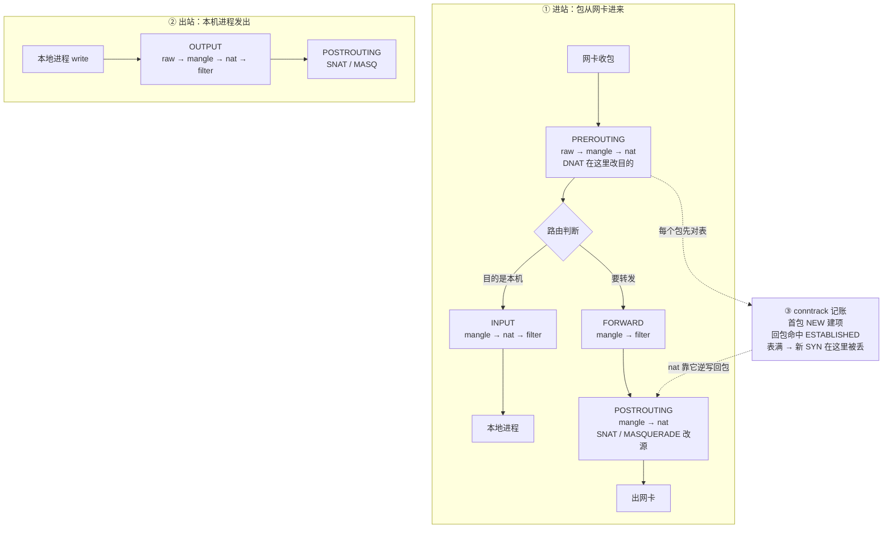
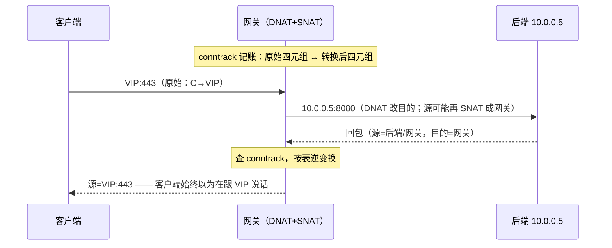
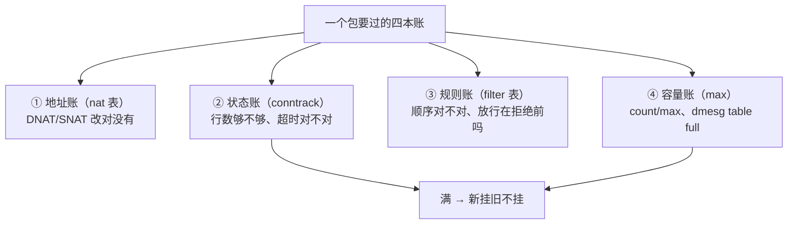
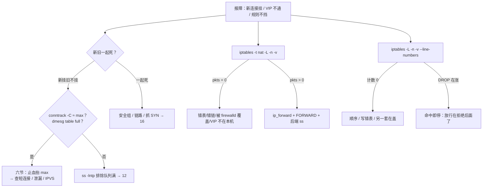

# iptables 与 conntrack

> 活动开闸十分钟，新登录全部超时、老玩家的战斗连接一条没断；群里一半人喊改安全组、一半人喊重启战斗服——真凶是 dmesg 里一行 `nf_conntrack: table full, dropping packet`。
> **本章回答**：一个包过主机防火墙的一生——走哪条链、被谁改地址、在哪记账、在哪被丢；「新挂旧不挂」怎么两条命令钉死。
> **不讲**：队列 / fd / 临时端口那三个「满」 → [12](../12-网络栈与Socket/)；握手/重传/心跳机制 → [13](../13-TCP与UDP/)；抓包与 MTU 深排障 → [16](../16-网络排障与抓包/)。

**标记**：🎯重点 · 🔥难点 · ⭐常考 · 🔧实操

---

## 一、一张图：一个包过墙的一生

> 🎯 **一句话**：进站先过 PREROUTING，记账、改名、过闸——每一步都能丢包。



**读图**：

- 一个包的一生三段：**进站**（PREROUTING → 路由 → INPUT 或 FORWARD → POSTROUTING）、**出站**（OUTPUT → POSTROUTING，**没有 PREROUTING**）、**记账**（conntrack 挂在旁边，nat 和 filter 都看它）。
- 排障从「包该走哪条链」入手：外网连本机端口查 INPUT；本机当网关/VIP 转发查 FORWARD；本机主动出站查 OUTPUT——查错链，规则写得再对也看不到计数。
- 本章的照妖镜只有三件：`iptables -t <表> -L -v`（规则吃没吃到包）、`conntrack -C`（账本还剩多少行）、`dmesg`（内核丢包铁证）。

---

## 二、进站：包走哪条链，谁在链上收钱 ⭐

> 🎯 **一句话**：五条链是包的检查站；四表按职责挂上去，优先级 raw→mangle→nat→filter。

**链（chain）** = 包在内核网络栈里路过的一个**检查点钩子**，五条主链：`PREROUTING / INPUT / FORWARD / OUTPUT / POSTROUTING`。**表（table）** = 挂在链上的规则集合，按职责分四张，同一链上**优先级 raw → mangle → nat → filter**。一条**规则** = 匹配条件（match）+ 动作（target）；链上所有规则都没命中时走**policy**（默认动作，常 DROP 或 ACCEPT）。

四张表各管一件事：

- **raw**：在连接跟踪**之前**动手，`NOTRACK` 豁免记账——减账手术刀，乱豁免会弄坏 NAT（三节）。
- **mangle**：改 TOS/TTL/mark——策略路由、TC 分流时才盯它，值班少碰。
- **nat**：DNAT / SNAT / MASQUERADE / REDIRECT——**只改地址**。VIP 不通先看这张表。
- **filter**：ACCEPT / DROP / REJECT——**只管放不放行，不改地址**。

链 × 表矩阵（有 ✓ 才有钩子）：

| | raw | mangle | nat | filter |
|--|:---:|:------:|:---:|:------:|
| PREROUTING | ✓ | ✓ | ✓ | |
| INPUT | | ✓ | ✓ | ✓ |
| FORWARD | | ✓ | | ✓ |
| OUTPUT | ✓ | ✓ | ✓ | ✓ |
| POSTROUTING | | ✓ | ✓ | |

> ⚠️ **别混**：链是「包路过哪」，表是「这类规则挂在哪」。**NAT 规则不在 filter 里**——在 filter 表翻 DNAT 是白板上的经典翻车；同理「放行 80」写进 nat 表也不会生效。

### 三条路径走读 🎯

同一条规则写错链就是废规则。三条路各走一遍：

```text
① 外网 SSH → 本机 sshd（目的是本机）
   网卡 → PREROUTING（一般不改地址）→ 路由：目的是本机
        → INPUT（filter 放行 tcp/22 + ESTABLISHED）→ sshd
   回包：OUTPUT → POSTROUTING → 网卡（回包走 conntrack ESTABLISHED，不必写反向规则）

② 外网 → VIP → 后端（本机当转发器）
   网卡 → PREROUTING/nat：DNAT 改目的到后端 → 路由：目的变内网 → 要转发
        → FORWARD/filter：必须放行 → POSTROUTING/nat：常再 SNAT/MASQ → 出网卡
   回包按 conntrack 逆写，客户端仍以为在跟 VIP 说话

③ 本机进程发出 → 公网
   进程 write → OUTPUT（filter 可能拦出站）→ POSTROUTING/nat：SNAT/MASQ → 网卡
   （本机发出没有 PREROUTING！）
```

**读图**：路径①的锅在 INPUT / 安全组 / sshd；路径②的锅在 nat 表 / `ip_forward` / FORWARD；路径③的锅在 OUTPUT / POSTROUTING。**只开 INPUT 80 救不了路径②**——VIP 转发走的是 FORWARD。

> ⚠️ **别混**：外网连本机 22 ≠ 外网连 VIP 再转后端——前者 INPUT，后者 FORWARD。安全组「开了 80」只覆盖包到本机这一层，本机 FORWARD policy 若是 DROP，照样不通。

> 🔍 **现场**：怀疑包没走到本机防火墙，先看计数再谈规则：

```bash
iptables -L INPUT -n -v --line-numbers
# Chain INPUT (policy DROP 0 packets, 0 bytes)
# num   pkts bytes target     prot opt in  out  source      destination
# 1     8521  511K  ACCEPT     tcp  --  *   *    0.0.0.0/0   0.0.0.0/0  tcp dpt:22
#       ↑ pkts 在涨 = 包确实走到了这条规则；全 0 = 没人匹配或包根本没进来
```

不带 `-v` 只能「看见规则」，不能证明「吃到了包」——这是本章排障第一纪律。

---

## 三、登记：conntrack，先记账再放行 ⭐🔥

> 🎯 **一句话**：conntrack 给每条流记五元组和状态；回包命中 ESTABLISHED 直接过。

> 💡 **打个比方**：conntrack 是门卫的**访客登记本**——每个进门的人记一行「谁、从哪来、去哪、现在什么状态」。回包出门时门卫翻本子对得上就放行，不用再查一遍证件。麻烦在于：**本子的行数有上限**，写满了新客进不来（六节）。

### 表项长什么样 🔧

```bash
conntrack -L -p tcp --dport 443 2>/dev/null | head -3
```

```text
tcp  6 431999 ESTABLISHED src=10.0.0.1 dst=10.0.0.5 sport=52341 dport=443 \
  packets=128 bytes=18432 src=10.0.0.5 dst=10.0.0.1 sport=443 dport=52341 \
  [ASSURED] mark=0 zone=0 use=2
```

**读法**：一行两个五元组——**前半是原始方向**（谁发起），**后半是回复方向**。做过 NAT 的流，这两套地址和肉眼抓包看到的不一致，属正常。`[ASSURED]` 表示双向都通过流量、更不易被提前淘汰；`use=` 是引用计数。四个状态：

- **NEW**：这个方向第一次见，通常就是首包——建账。
- **ESTABLISHED**：双向都见过——回包走状态匹配放行，**不必为每个端口写反向规则**。
- **RELATED**：和已有连接相关的期望连接（FTP 数据通道那类，游戏少碰）。
- **INVALID**：对不上任何账——乱序、异常分片、PMTUD 边角易被误判。

规则侧的标准写法（`-m state` 是老写法，同族，新稿优先 `-m conntrack`）：

```bash
iptables -A INPUT -m conntrack --ctstate ESTABLISHED,RELATED -j ACCEPT
iptables -A INPUT -m conntrack --ctstate INVALID -j DROP
```

> 🔥 **DROP INVALID 能加固，也能误伤**：PMTUD 中间报文、某些 NAT 边角会被判 INVALID，表现为「小包通、大包 HTTPS 偶发挂」。加这条要能回滚、要测大包（`ping -M do -s 1472`，深挖 → [16](../16-网络排障与抓包/)）。

### 超时：TCP 和 UDP 各盯各的 🔥

账本不是永久的，每行有**空闲过期时间**，超时没流量就撕掉这页：

```bash
sysctl net.netfilter.nf_conntrack_tcp_timeout_established   # 默认可达数天（如 432000s）
sysctl net.netfilter.nf_conntrack_udp_timeout               # 常见 30s
sysctl net.netfilter.nf_conntrack_udp_timeout_stream        # 双向有流量后，更长一档
```

> 🔥 **心跳 40s + udp_timeout 30s = 空闲玩家被踢的经典配方**：UDP 项过期后，下一个心跳包变成 NEW，若路径上还有 NAT/状态规则没对齐就断。先对齐数字，再谈「房间服有 bug」。

### NOTRACK：减账手术刀 🔥

表项太多时，raw 表能把**明确不需要记账**的流量豁免出 conntrack：

```bash
# 错误示范：全体 UDP 不跟踪——游戏房间当场炸（NAT 会话对不上）
# iptables -t raw -A PREROUTING -p udp -j NOTRACK

# 相对可控：只豁免确定无状态、不走 NAT 的探活网段
iptables -t raw -A PREROUTING -s 10.0.0.0/24 -p tcp --dport 8080 -j CT --notrack
```

**为什么不能乱豁免**：NAT 依赖 conntrack 记住「改之前/改之后」——被 NOTRACK 的流做了 DNAT，回包就改不回去（四节）。顺序永远是：**先证明表满、先抬 max、先治短连接，NOTRACK 是最后的定点手术**。

> ⚠️ **别混**：conntrack 表项 ≠ Socket——`ss` 看的是进程手里的连接（[12](../12-网络栈与Socket/)），`conntrack` 看的是内核的流账。一条 Socket 连接对应一行账，但账满时**Socket 完全健康**，这就是六节「新挂旧不挂」的机制根源。

---

## 四、改名：NAT，改收件人与寄件人 ⭐🔥

> 🎯 **一句话**：DNAT 在 PREROUTING 改目的，SNAT/MASQ 在 POSTROUTING 改源；filter 不改地址。

> 💡 **打个比方**：网关像中转快递站。**DNAT 是改收件地址**——必须在「分拣（路由判断）」之前改，否则包裹已经按旧地址发走了；**SNAT 是出站前换寄件人**——贴上公网 IP，回程包裹才知道寄回哪个站。

| 动作 | 表/链 | 改什么 | 游戏里 |
|------|-------|--------|--------|
| **DNAT** | nat / PREROUTING | **目的** IP:端口 | 登录/大厅 VIP → 后端 |
| **SNAT** | nat / POSTROUTING | 源 → **固定** IP | 出口固定的网关公网 |
| **MASQUERADE** | nat / POSTROUTING | 源 → **当前出口网卡** IP | 弹性 IP、拨号、Pod 出站 |
| **REDIRECT** | nat / PREROUTING 或 OUTPUT | 改到**本机**端口 | 透明代理，游戏入口少用 |

> ⚠️ **别混**：SNAT 和 MASQUERADE 都是改源——**出口 IP 固定用 SNAT**（性能更好），**出口 IP 会变用 MASQUERADE**（接口 IP 变了规则仍可用，代价是每次查接口）。

### 回包怎么「改回去」🔥



**读图**：NAT 的「改回去」全靠 conntrack 那行账——所以 **NAT 依赖 conntrack**，NOTRACK 掉的流做 NAT 会坏（三节）。验证就看账本里有没有**两套地址对**：

```bash
conntrack -L -p tcp --dport 443 2>/dev/null | head -3
conntrack -L -p tcp --dst 10.0.0.5 --dport 8080 2>/dev/null | head -3
```

只有半边、或表项转瞬消失 → 查超时、NOTRACK、表满。

### 现场：VIP 超时，本机 curl 后端正常 🔧

> 🔍 **现场**：外网打登录 VIP 超时，本机 `curl 10.0.0.5:8080` 正常——**几乎总是 NAT/转发问题，不是后端进程挂了**。

```bash
iptables -t nat -L PREROUTING -n -v --line-numbers
sysctl net.ipv4.ip_forward
iptables -L FORWARD -n -v | head
```

```text
Chain PREROUTING (policy ACCEPT 0 packets, 0 bytes)
num   pkts bytes target  prot opt in   out  source      destination
1     8521  511K  DNAT    tcp  --  eth0 *    0.0.0.0/0  203.0.113.10  tcp dpt:443 to:10.0.0.5:8080
#       ↑ 有计数 = 包到了 PREROUTING、目的已改

net.ipv4.ip_forward = 0        ← 目的改了，但内核拒绝转发！

Chain FORWARD (policy DROP 0 packets, 0 bytes)
#                              ← 就算开了 forward，没放行也扔
```

**口算定责**：DNAT 计数涨 + `ip_forward=0` → 开转发；DNAT 涨 + FORWARD policy DROP → 放行转发链；DNAT **pkts=0** → 规则没吃到包——查 VIP 是否绑在这台、`-i` 写错网卡、firewalld/nft 是否覆盖（七节）。修法顺序：

```bash
sysctl -w net.ipv4.ip_forward=1                                        # ① 开转发
iptables -A FORWARD -d 10.0.0.5 -p tcp --dport 8080 -j ACCEPT          # ② 放行转发
iptables -t nat -A POSTROUTING -s 10.0.0.0/24 -o eth0 -j MASQUERADE    # ③ 视拓扑补 SNAT
```

落地骨架（示例，勿照抄生产网段）：

```bash
iptables -t nat -A PREROUTING -i eth0 -d 203.0.113.10 -p tcp --dport 443 \
  -j DNAT --to-destination 10.0.0.5:8080
iptables -t nat -A POSTROUTING -s 10.0.0.0/24 -o eth0 -j SNAT --to-source 203.0.113.10
```

> 📝 **面试**：「DNAT 在 PREROUTING 改目的，SNAT/MASQ 在 POSTROUTING 改源；为什么？DNAT 必须在路由判断前改，否则按旧目的路由；SNAT 必须在出接口前改，回程才找得回来。VIP 不通第一刀 `iptables -t nat -L PREROUTING -n -v`，有计数再查 ip_forward 和 FORWARD。」

### 游戏服的五个 NAT 坑 🔥

- **大厅与房间是两条 NAT**：HTTPS 大厅通、进房间超时——房间是**另一端口的另一条 DNAT**，别只查 443。
- **UDP 心跳 > udp_timeout**：空闲一两分钟被踢，先对齐心跳和超时（三节）。
- **SNAT 后源 IP 全是网关**：反外挂/风控失效——要真实 IP 得上 TOA / Proxy Protocol，是**架构问题**，不是「DNAT 写错」。
- **hairpin**：内网打自己 VIP 不通、外网通——内网回环/路由问题，别当「DNAT 偶发失效」。
- **K8s 同款**：集群外进 Service ≈ DNAT（PREROUTING），Pod 出网 ≈ MASQUERADE（POSTROUTING），都写 conntrack——表满则新连接挂（主责 [03-08](../../03-Kubernetes/08-Service与kube-proxy/)）。

---

## 五、过闸：filter，命中即停 🔥

> 🎯 **一句话**：同一条链从上到下，第一条命中就结束——放行必须写在拒绝前面。

### 顺序反了就是锁死 🔧

```text
错误加固：
  1  DROP   tcp dpt:22          ← 所有 22 到此结束
  2  ACCEPT tcp dpt:22 -s 10/8  ← 永远走不到

正确加固：
  1  ACCEPT state ESTABLISHED,RELATED   ← 回包总闸放最前
  2  ACCEPT tcp dpt:22 -s 10.0.0.0/8
  3  DROP   tcp dpt:22
```

> 🔍 **现场**：安全收紧 22 端口，有人先 `-A DROP` 再 `-A ACCEPT`，当前唯一 ssh 还活着以为没事：

```bash
iptables -L INPUT -n -v --line-numbers
# Chain INPUT (policy DROP 0 packets, 0 bytes)
# num   pkts bytes target  prot opt in  out  source        destination
# 1        0     0 DROP    tcp  --  *   *    0.0.0.0/0     0.0.0.0/0    tcp dpt:22
# 2        0     0 ACCEPT  tcp  --  *   *    10.0.0.0/8    0.0.0.0/0    tcp dpt:22
# 3    12M  800M ACCEPT  all  --  *   *    0.0.0.0/0     0.0.0.0/0    state RELATED,ESTABLISHED
```

> 🔥 **当前会话还在 ≠ DROP 没锁死你**：它已经是 ESTABLISHED，靠第 3 条活着；新开 ssh 会在第 1 条死。**验证必须另开一条新 ssh**，当前会话不能当证据。

### 增删改的手感 ⭐

- `-A INPUT …` 追加到**尾部**——默认动作，但排在已有 DROP 之后就是废规则。
- `-I INPUT 1 …` 插到**头部**（或指定行）——**紧急放行**自己管理 IP 的唯一正确姿势。
- `-D INPUT 3` 按行号删 / `-D INPUT <完整规则文本>` 删——文本必须与写入时一致。
- `-R INPUT 2 …` 替换——少用，改错行更痛。

```bash
# 紧急放行：把自己管理 IP 插到所有 DROP 之前
iptables -I INPUT 1 -p tcp --dport 22 -s 203.0.113.50 -j ACCEPT
```

> ⚠️ **别混**：`-I` 是插队，`-A` 是排队——「加了放行还是登不进」九成是 `-A` 到了 DROP 后面。规则顺序问题看 `--line-numbers`，不要急着再 `-A` 一条相同的。

### DROP vs REJECT：超时查路，拒绝查口 ⭐

| 对比 | DROP | REJECT |
|------|------|--------|
| 对端感受 | 像超时/黑洞（hang 几十秒） | 立刻收到 TCP RST / ICMP（毫秒级 refused） |
| 排障方向 | **查路径**：哪段丢了、哪个源被丢 | **查端口**：谁在拒、哪条规则拒的 |
| 生产习惯 | 外网入口默认 policy 常用 DROP | 内网误连用 REJECT 加速反馈 |

口径与 [02](../02-网络排查命令/) 一致：**超时查路，拒绝查口**。游戏公网入口常见「policy DROP + 明确放行」——所以「连不上」别一律当业务挂，先分是 DROP 静默还是后端 RST（抓包认法 → [16](../16-网络排障与抓包/)）。

> 📝 **面试**：「drop 丢包不回应、客户端超时，排查方向是路径和源 IP；reject 回 RST、客户端立刻 refused，排查方向是监听和墙规则。一句『超时查路，拒绝查口』收尾。」

### 自定义链：别把 INPUT 写成一团浆糊

生产常把业务端口跳到自定义链，INPUT 只留总闸：

```bash
iptables -N GAME_IN
iptables -A GAME_IN -p tcp --dport 10001:10010 -s 10.0.0.0/8 -j ACCEPT
iptables -A GAME_IN -j RETURN          # 回到调用链继续匹配
iptables -A INPUT -j GAME_IN
```

好处：`-L GAME_IN -v` 只看业务口；回滚 `-F GAME_IN` 清业务规则、不动 ESTABLISHED 总闸。kube-proxy 的大量 `KUBE-*` 链就是这套——`-L` 卡时用 `iptables -L KUBE-SERVICES -n -v | head` 缩小范围。**自定义链末尾 `RETURN`（回去继续）还是 `DROP`（在此终结）要想清楚，它和 policy 不是一回事。**

### 改墙不锁死自己的六步 🔧

1. 留 **console / 云厂商 VNC** 后路。
2. 先放行 `ESTABLISHED,RELATED`。
3. 用 `-I`（不是 `-A`）放行你的管理网段，再写 DROP。
4. **另开一条新 ssh** 验证。
5. `iptables-save > /root/iptables.rules.$(date +%F)` 持久化（Debian 系用 iptables-persistent / netfilter-persistent）。
6. 已锁死 → console 上 `-D` 掉错序 DROP，或临时 `iptables -P INPUT ACCEPT` 再收拾。

「昨天还通今天不通」先想**规则没 save、reboot 丢了**，不要先怀疑业务代码。

### 安全组与本机墙是什么关系 ⭐

**云安全组（Security Group）在虚拟化/宿主层**，包进 ECS **之前**就过滤；iptables 是**_guest 内核里**的墙——两层先后串联，哪层拒都表现为不通。分工纪律：

- 云主机**优先改安全组**；不要再在 ECS 里堆一套本地墙「求稳」——健康检查源、CDN 回源网段很容易漏放，表现为**探活间歇 502**、部分用户打不开（[15](../15-DNS与CDN/) 的「安全组没放行 CDN 回源网段」就是这坑）。
- K8s 节点常关 firewalld，交给安全组 + NetworkPolicy。
- 查「规则在、计数 0」时永远要问：**是不是另一层（安全组/firewalld/nft）在前面把包吃了**。

### SYN flood 与 limit 模块 🔥

SYN 风暴打的是「每个 SYN 都要占一个半连接位」（队列侧 → [12](../12-网络栈与Socket/)，syncookies → [13](../13-TCP与UDP/)）。filter 侧的止血是 **limit 模块**——限速放行新建 SYN，超速的丢弃：

```bash
iptables -A INPUT -p tcp --syn --dport 7777 -m limit --limit 100/s --limit-burst 200 -j ACCEPT
iptables -A INPUT -p tcp --dport 7777 -m conntrack --ctstate ESTABLISHED -j ACCEPT
iptables -A INPUT -p tcp --dport 7777 -j DROP
```

`--limit 100/s` 是持续速率，`--limit-burst 200` 是突发桶容量——先放行突发、再削平到平均速率。**顺序必须是限速 ACCEPT 在前、兜底 DROP 在后**（命中即停，五节开头那条）。真被打了别只靠墙：SYN cookies、上游清洗、conntrack 容量一起上——风暴每秒几万 NEW，conntrack 行数也会被顶爆（六节）。

> 📝 **面试**：「命中即停，放行必须在拒绝前；ESTABLISHED 放最前；紧急放行用 `-I` 插到 DROP 前；改墙另开新 ssh 验证、留 console；SYN flood 用 limit 模块限速放行 + syncookies，队列细节在 12/13。」

---

## 六、生病：表满，新挂旧不挂 ⭐🔥

> 🎯 **一句话**：账本写满，新建建不了、旧账还在转——这就是「新挂旧不挂」。

> 💡 **打个比方**：conntrack 表像一个**固定车位的停车场**——场内已停好的车（旧连接）照常待着，新来的车（新 SYN）被闸机直接拒之门外。抬 `nf_conntrack_max` 是把隔壁楼层开放出来**止血**；治本得看谁在「短停占位」——登录短连接风暴就是一堆只停 10 秒的车，进来出去都挤同一个闸机。

### 一例钉死（固定四步）

**① 场景**：活动 5 万在线。新登录全部超时，房间里还在打。有人要改安全组，有人要重启战斗服。

**② 定义**：conntrack 表行数顶到 `nf_conntrack_max` 后，**新**连接建不了跟踪项（常在 PREROUTING 跟踪阶段就被丢），**已有 ESTABLISHED 的表项**照常转发——签名就是 **新挂旧不挂**。

**③ 命令怎么认**：

```bash
conntrack -C                                # 当前行数（等价 cat /proc/sys/net/netfilter/nf_conntrack_count）
cat /proc/sys/net/netfilter/nf_conntrack_max
dmesg -T | grep -i conntrack | tail
```

```text
65512                       ← 当前行数
65536                       ← 上限；65512/65536 ≈ 0.999，顶满
nf_conntrack: table full, dropping packet    ← 内核主动丢包的铁证
nf_conntrack: table full, dropping packet
```

**④ 易错一句钉死**：光纤断 / 安全组误改通常**新旧一起死**；**不对称优先查表满**——别先改安全组、更别重启还活着的战斗服（一重启老连接也没了，唯一线索被销毁）。

### 和队列满、安全组怎么分 🔥

| 对比 | conntrack 表满（本章） | LISTEN 全连接队列满（12） |
|------|------------------------|--------------------------|
| 签名 | 新挂旧不挂 + dmesg `table full` | `ss -lntp` Recv-Q 顶满 Send-Q |
| 丢在哪 | 跟踪/NAT 阶段，新 SYN 建账失败 | 握手完了进不了 accept 队列 |
| 第一刀 | `conntrack -C` vs max | `ss -lntp`、somaxconn |
| 主责 | 本章 | [12](../12-网络栈与Socket/) |

安全组误删放行：新连接挂、**老连接通常下一包也被挡**（新旧一起死），且 dmesg 无 `table full`——去云控制台看变更记录，不在本机敲命令。fd 满（`Too many open files`）、临时端口满（出站失败 + TW 多）另见 [12](../12-网络栈与Socket/) 的「四个满」。

### 处理顺序：止血 → 治本 🔧

| 步骤 | 做什么 | 说明 |
|------|--------|------|
| 1 止血 | `sysctl -w net.netfilter.nf_conntrack_max=1048576` | **买时间**；hashsize ≈ max/8；持久化 → [24](../24-内核参数与sysctl/) |
| 2 证明谁占满 | `conntrack -L` 按源 IP 聚合 | 扫描、短连接上游一眼可见 |
| 3 应用侧 | Keep-Alive / 连接池 | 登录短连接不复用是最常见根因 |
| 4 超时 | 短连接场景缩短 ESTABLISHED 超时；UDP 对齐心跳 | **别误伤房间长连接** |
| 5 定点 NOTRACK | raw 表豁免明确无状态的流量 | 禁止「全部 UDP」（三节） |
| 6 架构 | kube-proxy 切 IPVS / Cilium | 治规则爆炸；**不自动消灭表满**（七节） |

```bash
conntrack -L 2>/dev/null | awk '{for(i=1;i<=NF;i++) if($i~/^src=/) print $i}' \
  | sort | uniq -c | sort -rn | head
#   38214 src=10.0.0.9     ← 一台登录服短连风暴占了大半张表
```

**容量口算**（数量级估算，面试常追问）：

```text
活动在线 CCU（长连接占坑）
+ 登录每秒短连 × 每连接存活秒数      ← 不开 Keep-Alive 的大头
+ 健康检查 / 扫描 / 重试风暴
≤ nf_conntrack_max × 0.7~0.8        ← 安全系数
```

例：max=65536，4 万长连接已占坑，登录每秒 2k 短连、每条占 10s → 短连独自要 2 万坑，**几分钟顶满**。「长连接还在」和「表满」不矛盾——长连接本来就占了大半行。

**监控**：`nf_conntrack_count / nf_conntrack_max` **> 0.8 告警、> 0.95 严重**；dmesg 出现 `table full` 直接当事故信号；K8s 节点每台都要采，别只采入口 LB。

### 收束：一个包要过的四本账 🎯⭐

到这里全章机制齐了。面试问「新连接进不来，防火墙侧怎么想」，答这四本账——**每本账一个上限、一种「满」的签名、一张第一刀**：



**读图**：①③是「写得对不对」，②④是「装不装得下」——写错查 `-t nat -v` 和 `--line-numbers`（四、五节），装不下查 `-C` vs max 和 dmesg（本节）。四本账互不背锅：调大 max 治不了规则顺序，`-I` 放行治不了表满。

> ⚠️ **别混**：这套账**不保证**「四本都对就一定通」——包可能根本没到本机（安全组/链路，[16](../16-网络排障与抓包/)），或到了本机但死在队列（[12](../12-网络栈与Socket/)）。四本账只覆盖「主机防火墙这一段」。

> 📝 **面试**：按「**两条链、一张表、一本账、一道闸**」背——进站过 PREROUTING/INPUT 或 FORWARD 两条链，nat 表改地址，conntrack 记账（满了新挂旧不挂），filter 命中即停过闸。每本账配一条第一刀命令，就是完整答案。

---

## 七、换壳：nftables 与 IPVS

> 🎯 **一句话**：很多发行版 iptables 已是 nft 兼容层；IPVS 用哈希治规则爆炸——表满照样要盯。

### nftables 与 firewalld

新发行版敲的 `iptables` 底层常已是 **nftables**（`iptables-nft` 兼容层）——概念上仍按五链四表排障，物理事实（DNAT 在路由前、表满看 conntrack）不变：

```bash
iptables -V              # iptables v1.8.x (nf_tables) ← 兼容层；legacy 则是老后端
nft list ruleset | head  # 看真实规则集是不是另一套
```

**firewalld 是前端**，背后是 nft/iptables。生产纪律：**要么 firewalld、要么手写 iptables/nft，二选一**——两边对着改会互相覆盖，表现为「加了规则计数仍 0」「重启后只剩一边」。排障口诀：`iptables -V` 认后端 → `nft list ruleset` 看真实规则 → `systemctl status firewalld` → 再决定用哪套语法改。

### iptables vs IPVS ⭐

| 对比 | iptables（kube-proxy 经典模式） | IPVS 模式 |
|------|--------------------------------|-----------|
| 匹配 | 规则链近似 O(n)，线性扫 | 哈希近似 O(1) |
| Service×Endpoint 多 | 规则爆炸、`-L` 卡数秒、发布抖 | 大规模明显更好 |
| conntrack | 每条连接一行账 | **多数 DNAT 路径仍吃表** |

**该提切 IPVS 的信号**：`iptables -L` 经常数秒（一次走读 4 万多行规则）、kube-proxy 同步抖 P99、Service/Endpoint 上千、规则爆炸与表满同框。**切了仍要做**：监控 count/max（IPVS 不免疫表满）、短连接 Keep-Alive（泄漏两边都有）、主机 filter/安全组照旧——IPVS 是换转发平面，不是删掉五链四表。主机 LVS 集群见 [18](../18-LVS与四层负载均衡/)，eBPF 数据面见 [03-25](../../03-Kubernetes/25-eBPF与Cilium/)。

---

## 八、作战：定责

> 🎯 **一句话**：先问新旧是否一起死，再看 NAT 计数和规则计数——三问定责。

### 定责决策树



**读图**：左半边管「装不装得下」（表满 vs 队列满 vs 安全组），右半边管「写得对不对」（nat 计数、filter 计数）。三个入口按报障选：不对称故障走左，VIP 不通走中，规则不生效走右。

### 现象 · 先做 · 别做

| 现象 | 先做 | 别做 |
|------|------|------|
| 新挂旧不挂 | `conntrack -C` vs max、dmesg | 先改安全组、当光纤断、重启战斗服 |
| VIP 不通、本机 curl 后端行 | nat `-v`；ip_forward；FORWARD | 在 filter 里找 DNAT |
| 规则写了但不挡 | `-v` 计数；`--line-numbers`；查 firewalld | 再 `-A` 一条相同的 |
| 大厅通房间不通 | 房间端口另一条 DNAT；UDP 超时 vs 心跳 | 只查 443；全 UDP NOTRACK |
| 改墙后 ssh 没了 | console；`-D` 错序 DROP | 拿当前 ESTAB 会话当「没锁死」 |
| 昨天还通今天不通 | 规则 save 没有；reboot 丢 | 先怀疑业务代码 |
| 探活间歇 502 | 安全组放行健康检查源 / CDN 回源网段 | 再叠一层本机墙 |
| 大包 HTTPS 偶发挂 | 查 DROP INVALID；PMTUD → 16 | 先调大应用超时 |
| `-L` 卡死数秒 | 规则爆炸 → 评估 IPVS | 高峰反复全量 `-L` |
| LISTEN Recv-Q 顶满 | → [12](../12-网络栈与Socket/) | 当成本章 table full |

### 60 秒剧本 🔧

> 🔍 **现场**：接到「连不上/进不去」报障，60 秒走完这条线再下结论。

```text
① 0–10s   conntrack -C；cat nf_conntrack_max；dmesg | grep -i conntrack
          —— 表满当场现形（新挂旧不挂的签名）
② 10–30s  iptables -t nat -L PREROUTING -n -v；sysctl net.ipv4.ip_forward
          —— VIP 类故障：DNAT 有没有吃到包、内核转不转发
③ 30–45s  iptables -L INPUT -n -v --line-numbers；iptables -L FORWARD -n -v | head
          —— 规则顺序 / FORWARD 放行 / policy
④ 45–60s  ss -lntp 排除队列满 → 12；还不清就抓 SYN 看出没出网卡 → 16
```

---

## 九、收口

### 命令速查 🔧

```bash
# 规则吃没吃到包
iptables -L INPUT -n -v --line-numbers          # pkts 计数；0 = 没走到
iptables -L FORWARD -n -v | head
# NAT
iptables -t nat -L PREROUTING -n -v             # DNAT/SNAT 计数
sysctl net.ipv4.ip_forward                      # 转发开关
# 表满
conntrack -C                                    # 行数（或 cat /proc/sys/net/netfilter/nf_conntrack_count）
cat /proc/sys/net/netfilter/nf_conntrack_max    # 上限
dmesg -T | grep -i conntrack | tail             # table full 铁证
# 谁占满
conntrack -L 2>/dev/null | awk '{for(i=1;i<=NF;i++) if($i~/^src=/) print $i}' | sort | uniq -c | sort -rn | head
# 超时与后端
sysctl net.netfilter.nf_conntrack_tcp_timeout_established net.netfilter.nf_conntrack_udp_timeout
# 持久化与后端识别
iptables-save > /root/iptables.rules.$(date +%F)
iptables -V; nft list ruleset | head; ipvsadm -Ln 2>/dev/null || echo "not ipvs mode"
```

### 面试锚点

| 问 | 30 秒答 |
|----|---------|
| 五链四表？ | 链 PRE/INPUT/FORWARD/OUTPUT/POST；表优先级 raw→mangle→nat→filter；DNAT 在 PRE，SNAT 在 POST。 |
| DNAT/SNAT/MASQ 各在哪改什么？ | DNAT 在 PREROUTING 改目的；SNAT/MASQ 在 POSTROUTING 改源（固定/动态）；不在 filter。 |
| 为何只开 INPUT 80 救不了 VIP？ | VIP 转发走 FORWARD，还要 ip_forward=1 + FORWARD 放行。 |
| 命中顺序？ | 从上到下命中即停；放行在拒绝前；ESTABLISHED 放最前。 |
| DROP vs REJECT？ | DROP 超时查路；REJECT 秒 refused 查口——「超时查路，拒绝查口」。 |
| 表满铁证？ | `conntrack -C`≈max + dmesg `table full`；签名新挂旧不挂。 |
| 调大 max 是根治吗？ | 是止血；根治要 Keep-Alive、查泄漏、对齐超时、必要时 IPVS。 |
| 和 12 的队列满怎么分？ | 表满看 conntrack/dmesg；队列满看 `ss -lntp` Recv-Q 顶满 Send-Q。 |
| NAT 和 conntrack 什么关系？ | NAT 靠 conntrack 记「改前/改后」逆写回包；NOTRACK 的流做 NAT 会坏。 |
| NOTRACK 什么时候用？ | 定点豁免无状态流量减账；禁止全 UDP——会弄坏 NAT 和状态防火墙。 |
| SYN flood 墙侧怎么治？ | limit 模块限速放行 `--syn` + syncookies；队列细节在 12/13。 |
| IPVS 换完还看 conntrack 吗？ | 看——多数 DNAT 路径仍吃表，IPVS 只治规则爆炸。 |
| nftables 怎么理解？ | 现代后端，iptables 常是兼容层；概念仍五链四表，先搞清谁在写规则。 |
| 防锁 SSH？ | console；先放 ESTABLISHED；`-I` 放行管理段；另开新 ssh 验证再 save。 |

### 易错一句话对照

- NAT 规则在 filter → 在 **nat** 表，filter 只管放行
- DROP 写最前更安全 → 放行永远走不到，写在拒绝前
- 当前 ssh 还在 = 没锁死 → 它是 ESTABLISHED；验证要新开 ssh
- 光纤断了只死新连接 → 新旧一起死；不对称优先表满/队列
- 表满先改安全组 → 先 `-C` vs max + dmesg
- 调大 max 即根治 → 只是买时间
- 表满和队列满一回事 → 一个看 conntrack，一个看 `ss`
- IPVS 不用 conntrack → 多数 DNAT 仍吃表
- 全 UDP NOTRACK 治表满 → NAT/心跳全坏，只能定点豁免
- firewalld 和 iptables 一起改 → 互相覆盖，二选一
- `-L` 不带 `-v` 能证生效 → 要看 pkts 计数
- 大厅通房间不通 = 防火墙坏一半 → 房间是另一条 NAT / UDP 超时
- 后端看到网关 IP 是业务 bug → 是 SNAT；要真实 IP 上 TOA/Proxy Protocol
- 云上再堆本机墙更稳 → 探活/回源网段易漏，优先安全组

### 数字墙

> 默认 `nf_conntrack_max` 常见 **65536** · 止血抬到 **1048576** · hashsize ≈ **max/8** · 告警 count/max **> 0.8**（严重 0.95） · `nf_conntrack_udp_timeout` 常见 **30s** · tcp established 超时可达 **数天（432000s）** · 心跳必须 **<** UDP 超时 · 四表优先级 **raw→mangle→nat→filter** · VRRP 是 **IP 协议 112**（→ [20](../20-HAProxy与Keepalived/)）

---

## 合上书

- [ ] **默画一节的图**：进站 / 出站 / 记账三块——给本机、转发、本机发出各走哪些链；DNAT、SNAT 标在哪；conntrack 挂在哪。
- [ ] **口述进站**：五链四表、链和表谁管什么、为何 NAT 不在 filter、外网 SSH 和 VIP 转发差在哪条链。
- [ ] **口述登记**：conntrack 表项两套五元组、NEW/ESTABLISHED/RELATED/INVALID 各是什么、回包为什么不用写反向规则、UDP 超时和心跳怎么对齐。
- [ ] **默画四节回包逆写图**：DNAT+SNAT 后客户端为何仍以为在跟 VIP 说话、conntrack 记了什么、NOTRACK 为什么弄坏它。
- [ ] **口述过闸**：命中即停、`-I` vs `-A`、`-v` 计数怎么读、DROP vs REJECT「超时查路拒绝查口」、limit 模块怎么限 SYN。
- [ ] **一例钉死表满**：铁证哪两条命令、为何不是光纤/安全组、止血→治本六步、容量口算、和 12 的队列满怎么分。
- [ ] **口述换壳**：iptables-nft 兼容层怎么认、firewalld 为什么二选一、IPVS 治什么不治什么。
- [ ] **定责**：决策树三个入口各接什么报障、60 秒剧本怎么走、四本账怎么背。
- [ ] **边界**：队列/fd/端口满 → [12](../12-网络栈与Socket/)；心跳/syncookies → [13](../13-TCP与UDP/)；抓 SYN/MTU → [16](../16-网络排障与抓包/)；sysctl 落盘 → [24](../24-内核参数与sysctl/)；kube-proxy → [03-08](../../03-Kubernetes/08-Service与kube-proxy/)；安全组 → [06-01](../../06-云平台/01-云网络与安全/)。

下一章把四层转发剖开：[LVS 与四层负载均衡](../18-LVS与四层负载均衡/)。地基队列侧回看 [12](../12-网络栈与Socket/)；安全加固全貌见 [27](../27-Linux安全加固/)。
