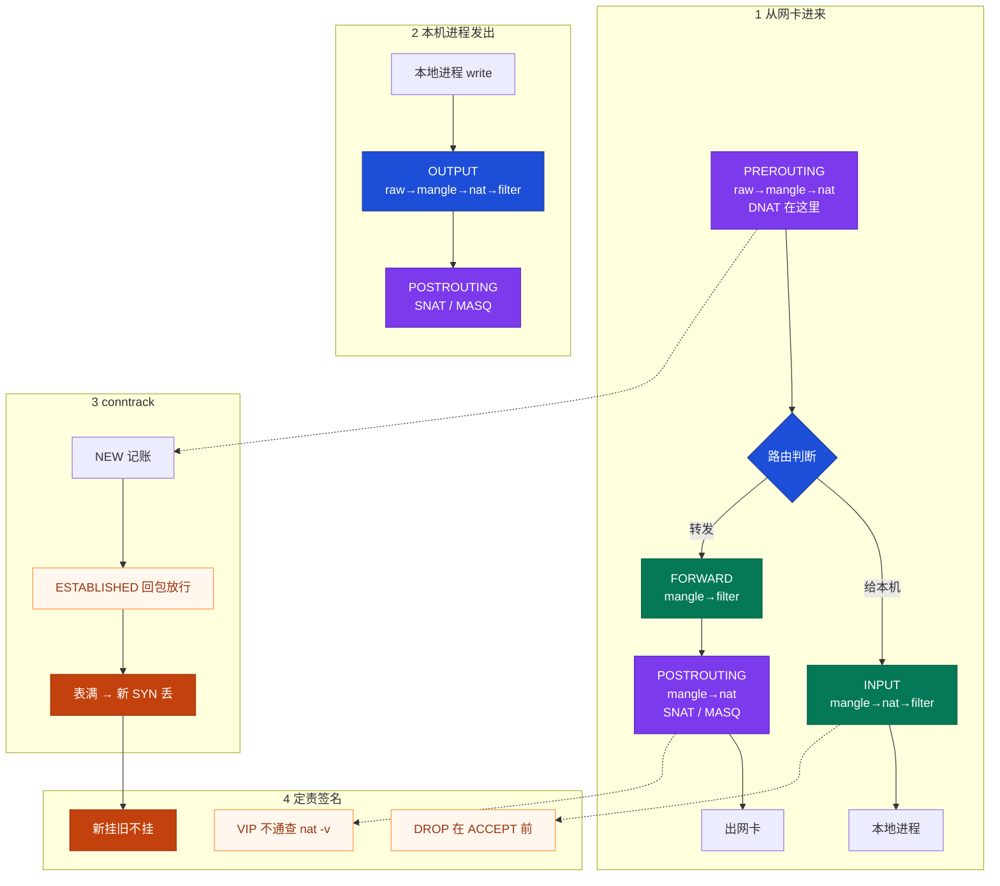
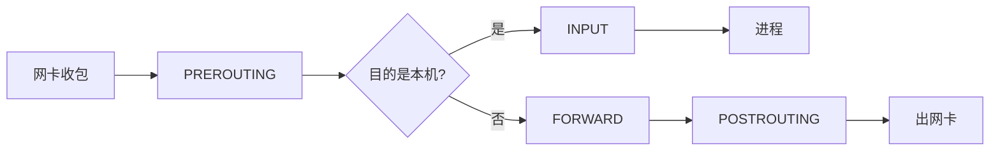
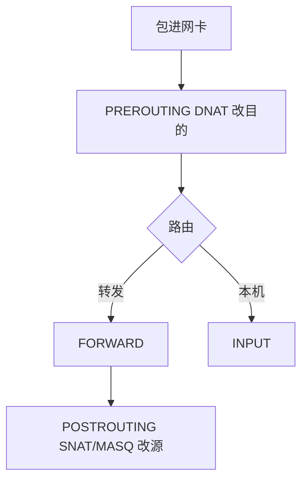
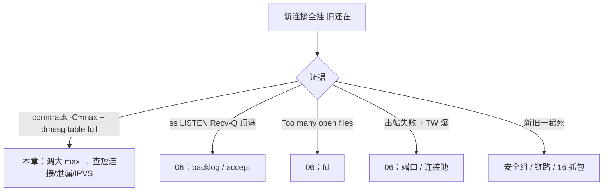
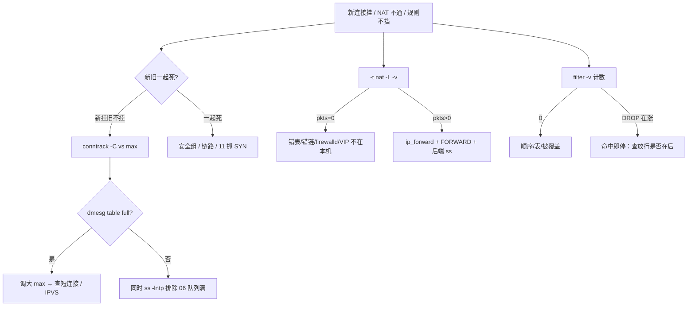

# iptables 与 conntrack

> **这章解决什么**：活动高峰「新玩家进不去、在线的还在打」——是安全组？是 filter？还是 **conntrack 表满 / NAT 链写错**？  
> **读法**：**先看总图（五链四表）** → **再认名词** → **再分节抠 NAT / 表满 / nft 备注**。  
> **刻意不展开**：Socket 队列、Recv-Q、半/全连接、四个「满」里的队列侧 → [12](../12-网络栈与Socket/)；抓包、SYN 黑洞、MTU/PMTUD → [16](../16-网络排障与抓包/)；sysctl 持久化 → [24](../24-内核参数与sysctl/)；kube-proxy / Cilium → [K8s 08](../../03-Kubernetes/08-Service与kube-proxy/) · [K8s 23](../../03-Kubernetes/23-eBPF与Cilium/)。

---

## 本章目录

1. [本章定位](#1-本章定位)
2. [先看总图：包怎么过五链四表](#2-先看总图包怎么过五链四表) ← **开篇必读**
   - [2.0 全章知识串图](#20-全章知识串图一张把细节串起来) ← **架构总览**
   - [2.3 走读本机 SSH](#23-完整走读外网-ssh--本机-sshd) · [2.4 VIP 转发](#24-完整走读外网--vip--后端) · [2.5 出站 SNAT](#25-完整走读本机发出--snatmasquerade)
3. [名词扫盲（对照总图认词）](#3-名词扫盲对照总图认词)
4. [规则匹配：命中即停](#4-规则匹配命中即停)
5. [NAT / SNAT / DNAT / MASQUERADE](#5-nat--snat--dnat--masquerade) ← **重点精读**
6. [conntrack：状态防火墙](#6-conntrack状态防火墙)
7. [table full：本章最易混](#7-nf_conntrack-table-full本章最易混) ← **重点精读**
8. [nftables 备注](#8-nftables备注)
9. [iptables vs IPVS](#9-iptables-vs-ipvs)
10. [落地、配置与命令](#10-落地配置与命令)
11. [定责决策树](#11-定责决策树)
12. [去哪章继续学](#12-去哪章继续学)
13. [面试 · 易错 · 数字](#13-面试--易错--数字)
14. [合上书](#合上书)

---

## 1. 本章定位

| 章 | 负责 |
|----|------|
| **12** | 包怎么进主机、Socket/队列、Recv-Q、半/全连接、「四个满」里的队列/fd/端口 |
| **17（本章）** | 五链四表、NAT/SNAT/DNAT、conntrack 记账与 **table full**、nft 兼容层、与 IPVS 怎么选 |
| **16** | 抓包验证 SYN 有没有出网卡、安全组/黑洞、MTU |
| **08（K8s）** | kube-proxy 把 Service 写成大量 nat/filter 规则；何时切 IPVS |

本章是**主机防火墙与连接跟踪主场**。12 告诉你「新挂旧不挂要先想四个满」；本章把其中 **conntrack 满** 钉死，并教你 **别在 filter 里找 NAT**。

🎯 **值班签名**：新登录全挂、战斗 ESTAB 还在——先 `conntrack -C` vs max + dmesg `table full`，**别先改安全组、别先重启战斗服**。

---

## 2. 先看总图：包怎么过五链四表

> **正确开篇顺序**：先有全局画面，再认词，再抠 NAT / 表满。  
> 先看 **§2.0 全章串图**，再看 **§2.1 坐标系**，再用 **§2.3～2.5 走读**把三条路径钉死。

### 2.0 全章知识串图（一张把细节串起来）

> 🎯 **合上书要能默画这张。** 蓝=进站链 · 紫=NAT · 绿=filter · 橙=表满/定责。  
> 若预览仍报错，以下面 **ASCII 一页板** 为准。



**读图路线：**

| 段 | 记住 |
|----|------|
| ① 上 | 进来先 PREROUTING；**DNAT 必须在路由前**改目的（§5） |
| ① 中 | 路由：给本机 → INPUT；转发 → FORWARD → POSTROUTING |
| ① 下 | **SNAT/MASQUERADE 在 POSTROUTING**，出接口前改源（§5） |
| ② | 本机发出：OUTPUT → POSTROUTING（没有 PREROUTING） |
| ③ | conntrack 记账；回包 ESTABLISHED；满了新 SYN 在跟踪阶段就丢（§6、§7） |
| ④ | 定责签名：表满 / nat 计数 / 规则顺序（§11） |

```text
┌──────────────────────────────────────────────────────────────────────────┐
│                     15 一张板：五链四表 + NAT + 表满                        │
├─────────────┬────────────────────┬───────────────────────────────────────┤
│  进来给本机  │  进来转发          │  本机发出                              │
│  PRE→路由   │  PRE→路由          │  OUTPUT → POST                        │
│  → INPUT    │  → FORWARD → POST  │  （无 PREROUTING）                     │
├─────────────┴────────────────────┴───────────────────────────────────────┤
│  四表优先级：raw → mangle → nat → filter                                  │
│  DNAT=PREROUTING 改目的 · SNAT/MASQ=POSTROUTING 改源 · 别在 filter 找 NAT │
│  conntrack：NEW/ESTAB；满 → dmesg table full；新挂旧不挂（队列侧见 12）     │
└──────────────────────────────────────────────────────────────────────────┘
```

### 2.1 坐标系：从网卡到进程 / 到转发

把「一个包从网卡进来」想成一条流水线——**先过钩子，再路由，再分叉**。



**读图三句话：**

1. **任何进站包**都先碰 PREROUTING——DNAT 只能写在这里，否则路由已经按「旧目的」判完了。  
2. **给本机**走 INPUT（外网 SSH、本机 API）；**要转发**走 FORWARD（VIP → 后端、K8s Service）。  
3. **出站改源**在 POSTROUTING——只开 INPUT 80 **救不了** VIP 转发。

> **别混**：外网打本机 22 ≠ 外网打 VIP 再转到后端——前者 INPUT，后者 FORWARD。安全组「开了 80」只覆盖进站到本机/VIP 的一层；本机 FORWARD policy 仍可能 DROP。

### 2.2 链 × 表矩阵（有 ✓ 才有钩子）

四表优先级（高 → 低）：**raw → mangle → nat → filter**。  
五链：**PREROUTING / INPUT / FORWARD / OUTPUT / POSTROUTING**。

| | raw | mangle | nat | filter |
|--|:---:|:------:|:---:|:------:|
| PREROUTING | ✓ | ✓ | ✓ | |
| INPUT | | ✓ | ✓¹ | ✓ |
| FORWARD | | ✓ | | ✓ |
| OUTPUT | ✓ | ✓ | ✓ | ✓ |
| POSTROUTING | | ✓ | ✓ | |

¹ 现代内核 nat 在 INPUT 也有钩子（本机目的的局部 NAT）；**游戏值班仍以「DNAT 看 PREROUTING、SNAT 看 POSTROUTING」为准**，别在 filter 翻 DNAT。

| 表 | 干什么 | 值班第一印象 |
|----|--------|--------------|
| **raw** | 连接跟踪**之前**；`NOTRACK` 豁免 | 减账手术刀，乱豁免会坏 NAT |
| **mangle** | 改 TOS/TTL/mark | 策略路由、TC 分流时才盯 |
| **nat** | DNAT / SNAT / MASQUERADE / REDIRECT | VIP 不通先看这张表 |
| **filter** | ACCEPT / DROP / REJECT | 「放不放行」；**不改地址** |

> **记住**：改地址看 **nat**；放行拒绝看 **filter**；减跟踪看 **raw**。

### 2.3 完整走读：外网 SSH → 本机 sshd

**场景**：跳板机 `ssh gateway`，包目的是网关自己的公网 IP:22。

```text
外网 Client
  → 网卡
  → PREROUTING（一般不改地址；raw 可能已建 NEW）
  → 路由：目的=本机
  → INPUT（filter：放行 tcp/22 + ESTABLISHED）
  → sshd accept / read
回包：
  → OUTPUT → POSTROUTING → 网卡
  （回包匹配 conntrack ESTABLISHED，不必再写「反向 22」规则）
```

**你在机器上认：**

```bash
iptables -L INPUT -n -v --line-numbers
ss -lntp | grep :22
```

- INPUT 里 22 的 `pkts` 在涨 → 包走到了本机防火墙。  
- 计数全 0 却连不上 → 可能安全组先挡、或错网卡、或 policy DROP 且前面没命中放行（§4、§11）。

🎯 **这条路径的锅在 INPUT / 安全组 / sshd**，不是 FORWARD，也不是「DNAT 没写」。

### 2.4 完整走读：外网 → VIP → 后端

**场景**：登录 VIP `203.0.113.10:443` DNAT 到 `10.0.0.5:8080`。本机 `curl 10.0.0.5:8080` 正常，外网打 VIP 超时。

```text
外网 Client → VIP:443
  → PREROUTING / nat：DNAT to 10.0.0.5:8080   ← 目的已改
  → 路由：目的变成内网机 → 要转发
  → FORWARD / filter：必须放行
  → POSTROUTING / nat：常再 SNAT/MASQ（视拓扑）
  → 出网卡 → 后端
回包按 conntrack 逆写，客户端仍以为在跟 VIP 说话
```

**现场第一刀：**

```bash
iptables -t nat -L PREROUTING -n -v --line-numbers
sysctl net.ipv4.ip_forward
iptables -L FORWARD -n -v | head
```

| 看到 | 说明 |
|------|------|
| DNAT `pkts` 涨 + `ip_forward=0` | 目的改了但内核不转发 |
| DNAT 涨 + FORWARD policy DROP / 计数 0 | 转发链扔了 |
| DNAT `pkts=0` | 规则没吃到包：错接口、错 VIP、firewalld 覆盖、VIP 不在这台 |
| 本机 curl 后端 OK、VIP 不通 | **几乎总是** NAT/转发问题，不是后端进程挂了 |

> **记住**：VIP 转发 = DNAT + `ip_forward=1` + FORWARD 放行；**只开 INPUT 80/443 不够**。

### 2.5 完整走读：本机发出 → SNAT/MASQUERADE

**场景**：Pod / 内网机要访问公网；或网关代后端回包需要统一出口 IP。

```text
本机进程 connect / send
  → OUTPUT（filter 可能拦出站）
  → POSTROUTING / nat：SNAT 成固定公网 IP
                 或 MASQUERADE 成「当前出口网卡 IP」
  → 网卡发出
```

| 动作 | 何时用 | 会话稳定性 |
|------|--------|------------|
| **SNAT** | 出口 IP **固定**（游戏网关公网） | 更好：目标 IP 写死 |
| **MASQUERADE** | 出口 IP **会变**（拨号、弹性 IP、Pod 出节点） | 接口 IP 变时规则仍可用，代价是每次查接口 |

K8s 里常见：集群外进 Service → **DNAT**；Pod 出网 → **MASQUERADE**（细节见 §5.4，kube-proxy 主责在 K8s 08）。

---

## 3. 名词扫盲（对照总图认词）

对照 §2.0：先对「值班里什么时候碰到」，再对定义。

| 你听到的 | 多半是什么 | 第一刀 | 详见 |
|----------|------------|--------|------|
| 「新登录全挂、老玩家还在」 | conntrack **表满** | `-C` vs max、dmesg | §7 |
| 「VIP 不通、本机 curl 后端行」 | DNAT / FORWARD / ip_forward | `-t nat -L -v` | §5 |
| 「加了放行还是登不进」 | 规则顺序反了 / 写错链 | `-L -v --line-numbers` | §4 |
| 「改完墙 ssh 断了」 | DROP 在 ACCEPT 前 / 没另开会话 | console | §4、§10 |
| 「昨天还通今天不通」 | 规则没 save、reboot 丢 | `iptables-save` | §10 |
| 「大厅通房间不通」 | 另一条端口 NAT / UDP 超时 | 房间 DNAT + udp_timeout | §5.3 |
| 「`-L` 卡死」 | K8s 规则爆炸 | 考虑 IPVS | §9 |
| 「LISTEN Recv-Q 顶满」 | **不是本章表满** | `ss -lntp` → **06** | [12 §6/§8](../12-网络栈与Socket/) |

### 必会名词（短定义）

| 名词 | 一句话 |
|------|--------|
| **链（chain）** | 包经过的检查点钩子；五条主链 + 可自定义链 |
| **表（table）** | 钩子上挂的规则集合；按职责分 raw/mangle/nat/filter |
| **规则** | match（匹配条件）+ target（动作）；**从上到下，命中即停** |
| **policy** | 链上所有规则都未命中时的默认动作（常 DROP/ACCEPT） |
| **DNAT** | 改**目的** IP/端口；路由前；PREROUTING |
| **SNAT** | 改**源** IP（常固定）；出接口前；POSTROUTING |
| **MASQUERADE** | 动态 SNAT，源改成当前出口网卡 IP |
| **conntrack** | 内核连接跟踪表：五元组 + 状态；NAT 与状态防火墙的地基 |
| **NEW / ESTABLISHED / RELATED / INVALID** | 连接状态；回包多走 ESTABLISHED |
| **NOTRACK** | raw 表声明「别记账」；减负载，也能弄坏 NAT |
| **nftables** | 现代后端；许多发行版 `iptables` 是兼容层（§8） |

> **记住**：链是「路过哪」，表是「这类规则挂哪」；DNAT≠SNAT；表满≠队列满（队列 → 12）。

---

## 4. 规则匹配：命中即停

### 4.1 一句话 + 钉死

**一句话：** 同一条链里规则**从上到下**匹配，**第一条命中就结束**——不是「最后一条说了算」。

```text
错误加固：
  1  DROP   tcp dpt:22          ← 所有 22 到此结束
  2  ACCEPT tcp dpt:22 -s 10/8  ← 永远走不到

正确加固：
  1  ACCEPT state ESTABLISHED,RELATED
  2  ACCEPT tcp dpt:22 -s 10/8
  3  DROP   tcp dpt:22
```

### 4.2 现场：锁死 SSH 怎么发生

**场景**：安全要求收紧 22。有人先 `-A DROP` 再 `-A ACCEPT`；当前唯一 ssh 还活着，以为「没问题」。

```bash
iptables -L INPUT -n -v --line-numbers
```

```text
Chain INPUT (policy DROP 0 packets, 0 bytes)
num   pkts bytes target     prot opt in     out     source               destination
1        0     0 DROP       tcp  --  *      *       0.0.0.0/0            0.0.0.0/0            tcp dpt:22
2        0     0 ACCEPT     tcp  --  *      *       10.0.0.0/8           0.0.0.0/0            tcp dpt:22
3    12M  800M ACCEPT     all  --  *      *       0.0.0.0/0            0.0.0.0/0            state RELATED,ESTABLISHED
```

| 列 | 含义 | 上面例子 |
|----|------|----------|
| `num` | 序号；`-D INPUT 1` 按它删 | DROP 是 1 |
| `pkts`/`bytes` | **`-v` 才有**的命中计数 | DROP=0 可能还没人撞 |
| `policy DROP` | 规则全未命中时的兜底 | 新 SYN 没明确放行就死 |
| 第 3 条 ESTABLISHED | 已建立会话回包 | **当前 ssh 靠它活着** |

🔥 **当前会话还在 ≠ DROP 没锁死你**：它已经是 ESTABLISHED。另开一条**新** ssh 验证；没有 console 就不要在唯一会话上加默认 DROP。

常见模板（顺序即安全）：

```bash
iptables -A INPUT -m conntrack --ctstate ESTABLISHED,RELATED -j ACCEPT
iptables -A INPUT -p tcp --dport 22 -s 10.0.0.0/8 -j ACCEPT
iptables -A INPUT -p tcp --dport 22 -j DROP
# 改完：另开新 ssh → 通了再 iptables-save
```

（`-m state` 与 `-m conntrack --ctstate` 同族；新稿优先 conntrack 写法。）

### 4.3 `-v` 计数怎么读

| 现象 | 含义 | 下一步 |
|------|------|--------|
| 目标规则 `pkts` 涨 | 包走到了这条 | 看 target：ACCEPT/DROP/DNAT |
| 规则在、`pkts=0` | 没人匹配：写错端口/网卡/表，或前面已 return | 对架构图查该走哪条链；查 firewalld 覆盖 |
| 整条链计数都稀 | 包根本没进这台 / 被安全组先挡 | → 16 / 云安全组 |
| K8s 上 `-L` 要数秒 | 规则爆炸信号 | §9，别高峰反复全量 `-L` |

> **记住**：不带 `-v` 只能「看见规则」，不能证明「吃到了包」。

### 4.4 DROP vs REJECT（值班怎么选）

| | DROP | REJECT |
|--|------|--------|
| 对端感受 | 像超时 / 黑洞 | 立刻收到 ICMP/TCP RST |
| 扫描探测 | 更「静默」 | 更快暴露「有台机器在拒」 |
| 排障 | 客户端 hang，要靠本机 `-v` | 客户端秒失败，好定位 |
| 生产习惯 | 外网默认 policy 常用 DROP | 内网误连可用 REJECT 加速反馈 |

🎯 游戏公网入口常见 **policy DROP + 明确放行**；别把「连不上」一律当业务挂——先分是 DROP 静默还是后端 RST（抓包认法 → [16](../16-网络排障与抓包/)）。

### 4.5 自定义链：别把 INPUT 写成一团浆糊

生产常把业务端口跳到自定义链，INPUT 只留「总闸」：

```bash
iptables -N GAME_IN
iptables -A GAME_IN -p tcp --dport 8080 -s 10.0.0.0/8 -j ACCEPT
iptables -A GAME_IN -p tcp --dport 10001:10010 -j ACCEPT
iptables -A GAME_IN -j RETURN
iptables -A INPUT -j GAME_IN
```

| 好处 | 说明 |
|------|------|
| 可读 | `-L GAME_IN -v` 只看业务口 |
| 可回滚 | `-F GAME_IN` 清业务，不动 ESTABLISHED 总闸 |
| K8s 对照 | kube-proxy 大量 `KUBE-*` 自定义链——`-L` 慢时用 `iptables -L KUBE-SERVICES -n -v \| head` 缩小范围 |

🔥 自定义链末尾用 `RETURN`（回到调用链继续）还是 `DROP`（在此终结）要想清楚；和 policy 不是一回事。

### 4.6 `-I` / `-A` / `-D` / `-R` 手感

| 操作 | 命令形态 | 什么时候用 |
|------|----------|------------|
| 追加尾部 | `-A INPUT ...` | 默认；注意排在已有 DROP **之后**就废了 |
| 插入头部/指定行 | `-I INPUT 1 ...` 或 `-I INPUT ...` | **紧急放行**自己的 IP、插到 DROP 前 |
| 按行号删 | `-D INPUT 3` | 配合 `--line-numbers` |
| 按规则文本删 | `-D INPUT -p tcp --dport 22 -j DROP` | 规则必须与写入时一致 |
| 替换 | `-R INPUT 2 ...` | 少用；改错行更痛 |

```bash
# 紧急：把自己管理 IP 插到最前（示例）
iptables -I INPUT 1 -p tcp --dport 22 -s 203.0.113.50 -j ACCEPT
```

**面试怎么说**：「命中即停，放行必须在拒绝前；ESTABLISHED 放最前；改墙另开新 ssh，当前会话不能当唯一证据；紧急放行用 `-I` 插到 DROP 前面。」

---

## 5. NAT / SNAT / DNAT / MASQUERADE

### 5.1 总表：改什么、在哪改

| 动作 | 表 / 链 | 改什么 | 游戏里 |
|------|---------|--------|--------|
| **DNAT** | nat / **PREROUTING** | 目的 IP:端口 | 登录/大厅 VIP → 后端 |
| **SNAT** | nat / **POSTROUTING** | 源 → **固定** IP | 出口 IP 固定的网关 |
| **MASQUERADE** | 同上 | 源 → **当前网卡** IP | 弹性 IP、拨号、Pod 出站 |
| **REDIRECT** | nat / PREROUTING 或 OUTPUT | 改到本机端口 | 透明代理，少用于游戏入口 |



**一句话：** DNAT 像中转站**改收件地址**（必须分拣前改）；SNAT/MASQ 像**改寄件人**（出站前贴公网 IP，回程才能找回来）。

> **别混**：filter 的 ACCEPT **不改地址**。在 filter 里翻「DNAT 规则」是白板上的常见翻车。

### 5.2 现场：VIP 超时，后端本机 curl 正常

```bash
iptables -t nat -L PREROUTING -n -v --line-numbers
sysctl net.ipv4.ip_forward
iptables -L FORWARD -n -v | head
```

```text
Chain PREROUTING (policy ACCEPT 0 packets, 0 bytes)
num   pkts bytes target     prot opt in     out     source               destination
1     8521  511K DNAT       tcp  --  eth0   *       0.0.0.0/0            203.0.113.10         tcp dpt:443 to:10.0.0.5:8080

net.ipv4.ip_forward = 0

Chain FORWARD (policy DROP 0 packets, 0 bytes)
```

**口算定责：**

1. DNAT 计数 **8521** → 包进了 PREROUTING，目的已是 `10.0.0.5:8080`。  
2. `ip_forward=0` → 内核拒绝转发。  
3. FORWARD policy DROP → 就算开了 forward，没放行也会扔。  

**修法顺序：** `sysctl -w net.ipv4.ip_forward=1` → FORWARD 放行相关网段 → 再从外网测 VIP（抓包手法 → 16）。  
若 DNAT **pkts=0**：先别怪后端——查 VIP 是否绑在这台、`-i` 是否写错、firewalld/nft 是否盖掉手写规则。

落地骨架：

```bash
# 示例：勿直接照抄生产网段
iptables -t nat -A PREROUTING -d 203.0.113.10 -p tcp --dport 443 \
  -j DNAT --to-destination 10.0.0.5:8080
iptables -A FORWARD -d 10.0.0.5 -p tcp --dport 8080 -j ACCEPT
iptables -t nat -A POSTROUTING -s 10.0.0.0/24 -o eth0 -j MASQUERADE
sysctl -w net.ipv4.ip_forward=1
```

### 5.3 游戏服 NAT 坑（一例钉死）

| 坑 | 现象 | 钉死口径 |
|----|------|----------|
| **大厅与房间两条 NAT** | HTTPS 大厅通、进房间超时 | 房间是**另一端口/另一 DNAT**；别只查 443 |
| **UDP 心跳 > udp_timeout** | 空闲一两分钟被踢 | 默认 timeout 常见 **30s**；心跳必须更短，或调超时（持久化 → 24） |
| **全体 UDP NOTRACK** | 「治表满」后房间更炸 | NAT 不记账 → 会话对不上；§7、§8 |
| **SNAT 后源 IP 全是网关** | 反外挂/风控失效 | 要真实 IP：少一层无脑 SNAT，或 TOA / Proxy Protocol |
| **hairpin** | 内网打自己 VIP 不通、外网通 | 内网回环/额外规则；别当「DNAT 坏了」唯一解释 |
| **固定 IP vs 弹性 IP** | 出口变了会话怪 | 固定用 SNAT；弹性用 MASQUERADE |

🎯 **大厅通房间不通**：先画两条连接——不是「防火墙坏了一半」，是**第二条路径**没通（端口/UDP/超时）。

### 5.4 K8s 里一眼认 DNAT / MASQUERADE

```text
集群外 → Service ClusterIP/NodePort     ≈ DNAT（PREROUTING）→ Pod
Pod → 外网 / 节点出站                   ≈ MASQUERADE（POSTROUTING）
```

两条都写 **conntrack**。表满 → 新 Service 连接 / 新出站失败，旧长连接可能还在（§7）。  
排障看 `iptables -t nat -L -n -v`（或 nft 兼容输出），**不要只看 filter**。  
规则条数爆炸 + 表满 → 切 IPVS / Cilium（§9；主责 K8s 08/23）。

### 5.5 回包怎么「改回去」（一例钉死）

**① 例子**：客户端连 `VIP:443`，网关 DNAT 到 `10.0.0.5:8080`，可能再 SNAT 成网关内网 IP。  
**② 定义**：conntrack 记了「原始五元组 ↔ 转换后五元组」；回程包按表**逆变换**，客户端始终以为在跟 VIP 说话。  
**③ 怎么认**：

```bash
conntrack -L -p tcp --dport 443 2>/dev/null | head -3
conntrack -L -p tcp --dst 10.0.0.5 --dport 8080 2>/dev/null | head -3
```

应能看到**两套**地址对（原始 / reply）。若只有半边、或表项转瞬消失 → 查超时、NOTRACK、表满。  
**④ 易错**：在后端抓包看到「源是网关」就骂业务没带真实 IP——先问清有没有 SNAT；要真实 IP 是架构问题（TOA/Proxy Protocol），不是「DNAT 写错」。

### 5.6 本机访问本机 VIP（hairpin）

```text
同机或同内网 Client → VIP（解析到本机/本网关）
  → 需要：DNAT 后回程还能回到 Client
  → 缺 hairpin / 路由绕行时：外网通、内网打 VIP 不通
```

定责：外网测通 + 内网不通 → **优先 hairpin/路由**，不是「偶发 DNAT 失效」。深路由 → [16](../16-网络排障与抓包/)。

### 5.7 命令速写（实验用，改网段）

```bash
# DNAT
iptables -t nat -A PREROUTING -i eth0 -d 203.0.113.10 -p tcp --dport 443 \
  -j DNAT --to-destination 10.0.0.5:8080

# 固定出口 SNAT
iptables -t nat -A POSTROUTING -s 10.0.0.0/24 -o eth0 \
  -j SNAT --to-source 203.0.113.10

# 弹性出口
iptables -t nat -A POSTROUTING -s 10.0.0.0/24 -o eth0 -j MASQUERADE

iptables -t nat -L -n -v --line-numbers
```

**面试怎么说**：「DNAT 在 PREROUTING 改目的，SNAT/MASQ 在 POSTROUTING 改源；VIP 不通先 nat `-v`；有计数再查 forward；游戏 UDP 对齐超时，不能全体 NOTRACK；回包靠 conntrack 逆写。」

> **记住**：NAT **不在** filter；登录和房间常是**两条** NAT。

---

## 6. conntrack：状态防火墙

### 6.1 一句话

**一句话：** conntrack 给每条流记五元组与状态；回包匹配 **ESTABLISHED** 直接过，不必为每个端口写反向规则。

像门卫访客登记表：记下「谁从哪来、去哪、什么状态」。回包对照表放行——表有**行数上限**，满了是 §7。

### 6.2 状态怎么认

```bash
# 需 conntrack-tools
conntrack -L -p tcp | head
```

```text
tcp  6 431999 ESTABLISHED src=10.0.0.1 dst=10.0.0.5 sport=52341 dport=8080 \
  packets=128 bytes=18432 src=10.0.0.5 dst=10.0.0.1 sport=8080 dport=52341 \
  [ASSURED] mark=0 zone=0 use=2
```

| 字段 / 状态 | 含义 |
|-------------|------|
| `NEW` | 未见过的方向；通常首包 |
| `ESTABLISHED` | 双向都见过；回包走状态匹配 |
| `RELATED` | 期望相关（如 FTP 数据通道类；游戏少碰） |
| `INVALID` | 对不上表；乱序/分片/PMTUD 边角易中招 |
| 前半 / 后半五元组 | 原始方向 vs 回复方向；**NAT 后可能和肉眼抓包不一致** |
| `[ASSURED]` | 更不易被早期淘汰 |
| `use=` | 引用计数 |

规则侧常见：

```bash
iptables -A INPUT -m conntrack --ctstate ESTABLISHED,RELATED -j ACCEPT
iptables -A INPUT -m conntrack --ctstate INVALID -j DROP
```

🔥 **DROP INVALID** 能加固，也可能误伤 PMTUD / 某些 NAT 边角 → 大包 HTTPS 偶发挂。加之前能回滚，并测大包（深挖 → [16](../16-网络排障与抓包/)）。

### 6.3 和 NAT 的关系

- DNAT/SNAT **依赖** conntrack 记住「改之前/改之后」，回程才能改回去。  
- `NOTRACK`（raw）= 这类包**不进表** → 状态防火墙失效，**做了 NAT 的流会坏**。  
- 短连接风暴、扫描、K8s 大量 DNAT → 表项暴涨 → §7。

### 6.4 和 06「队列满」怎么分工

| | conntrack 表满（本章） | LISTEN/全连接队列满（06） |
|--|------------------------|---------------------------|
| 签名 | 新挂旧不挂；dmesg `table full` | `ss -lntp` Recv-Q 顶满 Send-Q |
| 丢在哪 | 跟踪/NAT 阶段新建失败 | 握手完了进不了 accept |
| 第一刀 | `conntrack -C` vs max | `ss -lntp`、somaxconn |
| 详解 | **本章 §7** | **[12 §6 / §8](../12-网络栈与Socket/)** |

🎯 值班口述：「新挂旧不挂先分——是 **conntrack** 还是 **accept 队列**；一个看 `-C`，一个看 `ss`。」

### 6.5 超时：TCP / UDP 各盯什么

| 参数（常见名） | 默认量级 | 游戏含义 |
|----------------|----------|----------|
| `nf_conntrack_tcp_timeout_established` | 可达 **数天** | 长连接房间占坑久；短连接场景可缩短买表空间 |
| `nf_conntrack_tcp_timeout_time_wait` 等 | 较短 | 和 06 的 TIME_WAIT **不是同一层问题**；TW 多先看应用连接池 |
| `nf_conntrack_udp_timeout` | 常见 **30s** | 无流量后项过期；下一包变 NEW |
| `nf_conntrack_udp_timeout_stream` | 更长一档 | 被内核当成「流式 UDP」时 |

```bash
sysctl net.netfilter.nf_conntrack_tcp_timeout_established
sysctl net.netfilter.nf_conntrack_udp_timeout
sysctl net.netfilter.nf_conntrack_udp_timeout_stream
```

🔥 **心跳 40s + udp_timeout 30s** = 空闲玩家被踢的经典配方。先对齐数字，再谈「房间服有 bug」。

### 6.6 NOTRACK 现场：定点 vs 莽撞

```bash
# 错误示范：全体 UDP 不跟踪（游戏房易炸）
# iptables -t raw -A PREROUTING -p udp -j NOTRACK

# 相对可控：仅某探活网段、且确认不走 NAT 会话
iptables -t raw -A PREROUTING -s 10.0.0.0/24 -p tcp --dport 8080 -j CT --notrack
```

| 做法 | 结果 |
|------|------|
| 定点豁免无状态探活 | 减账，可能有益 |
| 全部 UDP NOTRACK | DNAT/状态对不上，房间更惨 |
| 先 NOTRACK 再调大 max | 顺序反了：先证满、先抬 max、先治短连接 |

### 6.7 `/proc` 里还能看什么

```bash
cat /proc/sys/net/netfilter/nf_conntrack_count   # 同 conntrack -C
cat /proc/sys/net/netfilter/nf_conntrack_max
# 部分内核：
# cat /proc/net/nf_conntrack | wc -l
ls /proc/sys/net/netfilter/ | grep conntrack | head
```

无 `conntrack` 命令时，用 `nf_conntrack_count` 一样能定表满。

**面试怎么说**：「状态防火墙靠 conntrack；回包 ESTABLISHED；NAT 也靠它；UDP 超时要对齐心跳；表有上限，满了是下一节；和 06 队列满用 ss 区分。」

---

## 7. nf_conntrack table full：本章最易混

> 🎯 **合上书验收**：能口述铁证两条命令 + 为何不是光纤/安全组 + 调大之后还干什么 + 和 06 队列满怎么分。

### 7.1 一例钉死（固定四步）

**① 最常见例子（游戏入口网关）**  
活动 5 万在线。新登录全超时，房间里还在打。群里有人要改安全组，有人要重启战斗服。

**② 一句话定义**  
conntrack 表行数顶到 `nf_conntrack_max` 后，**新**连接无法建跟踪项（常在 PREROUTING 阶段丢），**已有 ESTAB 项**的长连接还能转发——签名就是 **新挂旧不挂**。

**③ 对照命令怎么认**

```bash
conntrack -C
cat /proc/sys/net/netfilter/nf_conntrack_max
dmesg -T | grep -i conntrack | tail
```

```text
65512
65536
nf_conntrack: table full, dropping packet
nf_conntrack: table full, dropping packet
```

口算：`65512/65536 ≈ 0.999` → 顶满。dmesg **`table full`** = 内核主动丢包铁证。

**④ 易错一句钉死（只写一次）**  
光纤断 / 安全组误改通常是**新旧一起死**；**不对称优先表满（或 06 的队列满）**——别先改安全组、别先重启还活着的战斗服。

### 7.2 和「四个满」对齐（链到 12）

06 把本机「满」收成一张表；本章只把 **conntrack** 讲透，其余链回去：

| 满了谁 | 签名 | 第一刀 | 主责 |
|--------|------|--------|------|
| **conntrack** | 新挂旧不挂 + dmesg table full | `-C` vs max | **本章** |
| LISTEN 全连接队列 | LISTEN Recv-Q 顶满 Send-Q | `ss -lntp` | [12](../12-网络栈与Socket/) |
| fd | Too many open files | `/proc/pid/fd` vs limits | [12](../12-网络栈与Socket/) |
| 临时端口 | 出站失败、TW 多 | `ip_local_port_range` | [12](../12-网络栈与Socket/) |



### 7.3 处理顺序：止血 → 治本

| 步骤 | 做什么 | 说明 |
|------|--------|------|
| 1 止血 | `sysctl -w net.netfilter.nf_conntrack_max=1048576` | **买时间**；hashsize ≈ max/8；持久化 → [24](../24-内核参数与sysctl/) |
| 2 证明谁占满 | `conntrack -L` 按源 IP 聚合 | 扫描、短连接上游一眼可见 |
| 3 应用侧 | Keep-Alive / 连接池 | 登录短连接没复用最常见 |
| 4 超时 | 短连接缩短 ESTABLISHED；UDP 对齐心跳 | **别误伤房间长 UDP** |
| 5 定点 NOTRACK | raw 表豁免**明确不需要跟踪**的流量 | 禁止「全部 UDP」 |
| 6 架构 | kube-proxy → IPVS / Cilium | 治规则爆炸；**不自动消灭表满**（§9） |

聚合示例：

```bash
conntrack -L 2>/dev/null | awk '{for(i=1;i<=NF;i++) if($i~/^src=/) print $i}' \
  | sort | uniq -c | sort -rn | head
```

### 7.4 证据对照表

| 证据 | 说明 |
|------|------|
| `-C` 接近 `max` | >0.8 应告警；=1.0 新连接已挂 |
| dmesg `table full` | 铁证：内核丢包 |
| 光纤/整机断网 | **新旧一起死** |
| 安全组 drop | 通常也是新旧都死 |
| 只调大 max | 推迟爆炸，不是根治 |
| 重启战斗服 | 旧长连接还在；重启是砸还活着的人 |

### 7.5 容量口算（面试常追问）

粗算（数量级，不是精确公式）：

```text
活动在线 CCU ≈ 长连接占坑
+ 登录短连接并发 × 每连接存活秒数 / 平均寿命
+ 健康检查 / 扫描 / 重试风暴
≤ nf_conntrack_max × 安全系数(0.7~0.8)
```

例：max=65536，已有 4 万长连接房间，登录每秒 2k 短连且无 Keep-Alive、每连接占坑 10s → 短连 alone 就要 ~2万坑 → **几分钟顶满**。  
所以「长连接还在」和「表满」不矛盾——长连接已经占了大半行。

### 7.6 监控与告警怎么挂

| 指标 | 建议 |
|------|------|
| `nf_conntrack_count / nf_conntrack_max` | **>0.8** 告警；>0.95 严重 |
| dmesg / journal `table full` | 一出现就当事故信号 |
| 登录成功率 / 新连接错误率 | 和 count 曲线对齐，避免只盯业务 |
| K8s 节点 | 每节点都要采；别只采入口 LB |

伪告警表达式（示意）：

```text
conntrack_usage = count / max
alert if conntrack_usage > 0.8 for 2m
```

### 7.7 和「安全组误改」对照口述

| | 表满 | 安全组误删放行 |
|--|------|----------------|
| 新连接 | 挂 | 挂 |
| 旧长连接 | **常还在** | **通常也挂**（或下一包被挡） |
| dmesg | `table full` | 无此关键字 |
| 第一刀 | `-C` vs max | 云控制台 / 安全组变更记录 |

**面试怎么说**：「新挂旧不挂先 `-C` 对 max，dmesg 有 table full 就是铁证；调大是止血；根治 Keep-Alive、查泄漏、该切 IPVS 就切；和 06 的 accept 队列满用 `ss` 区分；口算 CCU+短连不要默认 65536。」

> **记住**：表满铁证 = **count vs max** + **dmesg table full**；队列满去 **06**。

---

## 8. nftables 备注

### 8.1 你要建立的画面

许多新发行版里，敲下去的 `iptables` **底层已经是 nftables**（`iptables-nft` 兼容层）。概念上你仍按 **五链四表** 排障；语法长期应学 `nft`。

```bash
# 认后端（输出因发行版而异）
iptables -V
# 常见：iptables v1.8.x (nf_tables)
nft list ruleset 2>/dev/null | head
```

| 点 | 口径 |
|----|------|
| 排障第一刀 | 仍可用 `iptables -t nat -L -v`（兼容层） |
| 规则「写了计数 0」 | 查是否 **firewalld / nft / kube-proxy** 另一套在盖 |
| 长期 | 学 `nft` 表/链/集合；集合比 iptables 线性规则更抗规模 |
| 与本章关系 | **不改**「DNAT 在路由前、表满看 conntrack」这些物理事实 |

### 8.2 firewalld 二选一

firewalld 是前端，背后是 nft/iptables。

| 要 | 不要 |
|----|------|
| 生产：**要么** firewalld，**要么** 手写 iptables/nft | `firewall-cmd` 和 `iptables -A` 对着改 |
| K8s 节点常关 firewalld，交给安全组 + NetworkPolicy | 本机墙再叠一层漏掉探活源 |
| 云主机优先改**安全组** | ECS 里再堆一套本地墙「更稳」 |

混改后果：重启后只剩一边；`-v` 计数为 0；「昨天还通」。

### 8.3 兼容层排障口诀

```text
1. iptables -V          → 是 nft 兼容还是 legacy？
2. nft list ruleset     → 真实规则集是否另一套？
3. systemctl status firewalld
4. 再决定用 iptables -t nat -L -v 还是 nft 语法改
```

两套工具同时改同一 hook = 经典「加了计数仍 0」。先统一管理面。

### 8.4 和本章主线的关系（不膨胀）

| 仍成立 | 可能变的只是「怎么写」 |
|--------|------------------------|
| DNAT 在路由前 | `nft` 里 iif/dnat to |
| SNAT 在出接口前 | `snat to` / `masquerade` |
| 表满看 conntrack | 命令不变 |
| 命中即停 | nft 也是链上依次匹配 |

> **记住**：nft 是继任者；值班先搞清**谁在写规则**，再谈语法新旧。

---

## 9. iptables vs IPVS

### 9.1 一句话

**一句话：** IPVS 用哈希治 **规则爆炸**；**多数 DNAT 路径仍吃 conntrack**——换 IPVS ≠ 不用管表满。

### 9.2 现场：`-L` 要 8 秒

```bash
time iptables -L -n 2>/dev/null | wc -l
conntrack -C
cat /proc/sys/net/netfilter/nf_conntrack_max
ipvsadm -Ln 2>/dev/null || echo "not ipvs mode"
```

```text
48231
real 0m8.200s
65508
65536
not ipvs mode
```

四万多行 + `-L` 数秒 → 规则爆炸；同时 count≈max → **表满与规则爆炸常同框**。

| | iptables（kube-proxy 经典模式） | IPVS 模式 |
|--|--------------------------------|-----------|
| 匹配 | 规则链表，近似 O(n) | 哈希，近似 O(1) |
| Service×Endpoint 多 | CPU/`-L` 卡、发布抖 | 规模明显更好 |
| conntrack | 每条连接一项 | **多数路径仍吃表** |
| 表满 | 更容易叠加上来 | 减轻规则侧，**不自动消灭表满** |
| 主机防火墙 | 就是 iptables/nft | filter 仍可能在；另有 `ipvsadm` |

主机四层 LVS 集群见 [18 负载均衡与LVS](../18-LVS与四层负载均衡/)。Cilium/eBPF 换数据面 → [K8s 23](../../03-Kubernetes/23-eBPF与Cilium/)。

### 9.3 什么时候该提「切 IPVS」

| 信号 | 解释 |
|------|------|
| `iptables -L` 经常数秒 | 规则集过大 |
| kube-proxy 同步抖 P99 | 刷规则成本高 |
| Service/Endpoint 上千 | 线性匹配撑不住 |
| 表满 + 规则爆炸同框 | 两边一起治 |

| 切了仍要做 | 说明 |
|------------|------|
| 监控 count/max | IPVS 不免疫表满 |
| 短连接 Keep-Alive | 泄漏两边都有 |
| 主机 filter/安全组 | 转发平面 ≠ 删掉防火墙 |

**面试怎么说**：「`-L` 慢是规则爆炸信号；切 IPVS 治匹配成本；切完仍监控 count/max；短连接泄漏两边都要治。」

> **记住**：IPVS ≠ 删除五链四表；IPVS ≠ 免疫 table full。

---

## 10. 落地、配置与命令

### 10.1 选型

| 项 | 选 | 不选 |
|----|----|------|
| 云主机 | 安全组 +（K8s）NetworkPolicy | 安全组 + firewalld + 手写三层叠 |
| RHEL/CentOS | firewalld **或** 关了写 iptables/nft | 混改 |
| 规则持久化 | `iptables-save` / iptables-persistent / netfilter-persistent | 只改内存 |
| 转发 / NAT | `ip_forward=1` + FORWARD 放行 | 只写 DNAT |
| 入口节点 conntrack | 显式抬 max + 监控占比 | 默认 65536 撞活动 |

验收：新 ssh 能登；nat `-v` 非 0；`conntrack -C` 远低于 max；**reboot 后规则还在**。

### 10.2 核心参数（只动有证据的）

| 参数 | 生产怎么用 | 改错会怎样 |
|------|------------|------------|
| `nf_conntrack_max` | 入口 **1048576** 量级常见 | 默认 65536 活动易满 |
| count/max | 监控 **>0.8** 告警 | 满了才知道 = 登录已挂 |
| hashsize | ≈ max/8 | 只加 max 查找变慢 |
| tcp ESTABLISHED 超时 | 短连接场景可缩短 | 误伤房间长连接 |
| `nf_conntrack_udp_timeout` | 对齐游戏心跳 | 默认 ~30s 踢空闲 UDP |
| `ip_forward` | NAT/转发必须 1 | DNAT 有计数仍不通 |
| NOTRACK | **定点**豁免 | 乱豁免坏 NAT |

持久化、落盘、发行版路径 → [24](../24-内核参数与sysctl/)。

### 10.3 命令速查

| 目的 | 命令 | 看什么 |
|------|------|--------|
| 规则是否吃到包 | `iptables -L -n -v --line-numbers` | `pkts`；0=没走到 |
| NAT | `iptables -t nat -L -n -v` | DNAT/SNAT 计数 |
| 表满 | `conntrack -C`；读 max；`dmesg` | table full |
| 谁占满 | `conntrack -L` 聚合 src | 扫描/短连接 |
| 转发 | `sysctl net.ipv4.ip_forward`；FORWARD `-v` | DNAT 之后 |
| IPVS | `ipvsadm -Ln` | 是否已切 |
| nft 规则集 | `nft list ruleset` | 谁在写 |

### 10.4 改墙不锁死 SSH（Checklist）

1. 留 **console** / 云厂商 VNC。  
2. 先放行 **ESTABLISHED,RELATED**。  
3. `-I` **INSERT** 放行你的管理网段，再写 DROP。  
4. **另开一条新 ssh** 验证（不信当前会话）。  
5. `iptables-save`（或发行版等价）持久化。  
6. 已锁死 → console 删错序 DROP / 临时 `iptables -P INPUT ACCEPT` 再收拾。

值班口诀：**新挂旧不挂先 `-C`；NAT 不生效先 nat 计数；规则不挡先 `-v` 和顺序。**

### 10.5 持久化示例（发行版不同，概念相同）

```bash
# 导出
iptables-save > /root/iptables.rules.$(date +%F)

# RHEL 系常见落盘（路径因版本而异，以发行版文档为准）
# iptables-save > /etc/sysconfig/iptables

# Debian/Ubuntu 常见
# apt install iptables-persistent
# netfilter-persistent save
```

验收 reboot：`iptables -t nat -L -n` 规则还在；`conntrack` max 若用 sysctl.d 也要在 [24](../24-内核参数与sysctl/) 落盘。

### 10.6 一次值班最小命令集（复制即用）

```bash
echo "=== conntrack ==="
conntrack -C 2>/dev/null || cat /proc/sys/net/netfilter/nf_conntrack_count
cat /proc/sys/net/netfilter/nf_conntrack_max
dmesg -T 2>/dev/null | grep -i 'conntrack.*full' | tail -5

echo "=== nat / forward ==="
iptables -t nat -L PREROUTING -n -v --line-numbers 2>/dev/null | head -40
sysctl net.ipv4.ip_forward
iptables -L FORWARD -n -v 2>/dev/null | head -20

echo "=== 排除 06 队列满 ==="
ss -lntp | head -20
```

先跑这三段，再决定是本章表满、本章 NAT，还是回 06 / 11。

---

## 11. 定责决策树

### 11.1 三问

1. **新旧是否一起死？** → 不对称优先表满（本章）或队列满（06）。  
2. **包该走哪条链？** → 本机 INPUT / 转发 FORWARD / 本机出 OUTPUT。  
3. **NAT 计数有没有涨？** → 0=没走到；有=查 forward/后端。

### 11.2 决策树



### 11.3 现象 | 先做 | 别做

| 现象 | 先做 | 别做 |
|------|------|------|
| 新挂旧不挂 | `-C` vs max、dmesg | 先改安全组、当光纤、重启战斗服 |
| VIP 不通、本机 curl 后端行 | nat `-v`；forward；ip_forward | 只在 filter 找 DNAT |
| 规则写了但不挡 | `-v`；顺序；firewalld/nft | 再 `-A` 一条相同的 |
| 大厅通房间不通 | 房间端口 DNAT / UDP 超时 | 只查 443 |
| UDP 房间被踢 | udp_timeout vs 心跳 | 全部 UDP NOTRACK |
| `-L` 卡死 | 规则爆炸 → IPVS | 高峰反复全量 `-L` |
| 探活间歇 502 | 安全组漏健康检查源 | 再叠本机墙 |
| 改墙后 ssh 没了 | console | 用当前 ESTAB 当唯一证据 |
| 昨天还通 | 规则没 save | 先怀疑业务代码 |
| LISTEN Recv-Q 顶满 | → **06** | 当成本章 table full |

活动高峰正确姿势：确认战斗进程还在 → `-C` → 表满就买时间 → **不要**重启还活着的长连接服。  
SYN 已出网卡对端不回 → [16](../16-网络排障与抓包/)；表满 → **本章**。

### 11.4 三分钟剧本（对着树走）

**剧本 A：活动开服，登录全红，战斗区还在**

1. `ss -s`：ESTAB 很多 → 不像整机断网。  
2. `-C` / max / dmesg → table full → 抬 max。  
3. 聚合 src → 发现登录服短连风暴 → 开 Keep-Alive / 限流。  
4. `ss -lntp` 登录口 Recv-Q **没有**顶满 → 不是 06 队列。  

**剧本 B：VIP 443 外网超时，跳板 curl 后端 8080 行**

1. nat PREROUTING `-v`：DNAT 有计数。  
2. `ip_forward=0` → 打开。  
3. FORWARD 放行后通。  
4. 若 DNAT 计数为 0 → 查 VIP 是否在本机、firewalld。  

**剧本 C：大厅 HTTPS 通，UDP 房间 1 分钟踢**

1. 确认房间端口另一条 DNAT 存在且 `-v` 涨。  
2. 比心跳与 `udp_timeout`。  
3. 禁止有人刚加的「全 UDP NOTRACK」。  

**剧本 D：改完墙自己 ssh 没了**

1. 云 console 上去。  
2. `-L INPUT -v --line-numbers` → DROP 在 ACCEPT 前。  
3. `-D` 错序规则或 `-I` 放行管理 IP。  
4. 另开新 ssh 验证再 save。  

---

## 12. 去哪章继续学

| 你想搞懂 | 章节 |
|----------|------|
| Recv-Q、半/全连接、四个满里的队列/fd/端口 | [12 网络栈与 Socket](../12-网络栈与Socket/) |
| 抓包、SYN 黑洞、MTU/PMTUD、路由深排障 | [16 网络排障与抓包](../16-网络排障与抓包/) |
| TCP 心跳 vs NAT 空闲、传输层 | [13 TCP 与 UDP](../13-TCP与UDP/) |
| conntrack / ip_forward 等 sysctl 落盘 | [24 内核参数与 sysctl](../24-内核参数与sysctl/) |
| 主机 LVS DR/NAT/TUN | [18 负载均衡与 LVS](../18-LVS与四层负载均衡/) |
| kube-proxy iptables/IPVS | [K8s 08 Service 与 kube-proxy](../../03-Kubernetes/08-Service与kube-proxy/) |
| eBPF / Cilium 换掉 iptables 数据面 | [K8s 23](../../03-Kubernetes/23-eBPF与Cilium/) |
| 云安全组 | [06 云网络与安全](../../06-云平台/01-云网络与安全/) |

---

## 13. 面试 · 易错 · 数字

| 问 | 30 秒答 |
|----|---------|
| 五链四表？ | 链：PRE/IN/FWD/OUT/POST；表：raw>mangle>nat>filter；DNAT 在 PRE，SNAT 在 POST。 |
| 包怎么进本机？ | PRE → 路由给本机 → INPUT；转发则 FORWARD → POST。 |
| DNAT/SNAT？ | DNAT 改目的在路由前；SNAT/MASQ 改源在出接口前；不在 filter。 |
| 为何只开 INPUT 80 不够？ | VIP 转发走 FORWARD，还要 ip_forward。 |
| 命中顺序？ | 从上到下命中即停；放行在拒绝前；ESTAB 常最前。 |
| 表满铁证？ | `-C`≈max + dmesg `table full`；新挂旧不挂。 |
| 调大 max？ | 止血；还要 Keep-Alive、查泄漏、考虑 IPVS。 |
| 和 06 队列满？ | 表满看 conntrack；队列满看 `ss` LISTEN Recv-Q → 12。 |
| IPVS？ | 治规则爆炸；仍可能吃 conntrack。 |
| nftables？ | 现代后端；iptables 常是兼容层；概念仍五链四表。 |
| 防锁 SSH？ | console；INSERT 放行；另开新 ssh；再 save。 |

| 易错说法 | 真相 |
|----------|------|
| NAT 规则在 filter | nat 表 |
| DROP 写在最前更安全 | 放行永远走不到 |
| 光纤断了只死新连接 | 新旧一起死；不对称先表满/队列 |
| 表满先改安全组 | 先 `-C` / dmesg |
| 调大 max 即根治 | 买时间 |
| IPVS 不用 conntrack | 多数 DNAT 仍吃表 |
| 全部 UDP NOTRACK 治表满 | 游戏 NAT/心跳会坏 |
| firewalld 和 iptables 一起改 | 互相覆盖 |
| 当前 ssh 在 = 没锁死 | 已是 ESTABLISHED |
| `-L` 不带 `-v` 能证生效 | 要看计数 |
| LISTEN 顶满 = table full | 前者 06，后者本章 |
| 云上再堆本机墙更稳 | 探活源易漏 |

**数字**：默认 max 常见 **65536** · 止血 **1048576** · 告警 count/max **>0.8** · UDP timeout 常见 **30s** · hashsize ≈ **max/8** · `-L` 数秒级 = 规则爆炸信号

---

## 合上书

1. **默画 §2.0**：进来给本机 / 转发 / 本机发出各走哪些链；DNAT、SNAT 标在哪；conntrack 满标在哪。  
2. **口述**：四表优先级？为何 DNAT 不能放在 filter？VIP 不通第一刀看哪张表？  
3. **定责 §11**：新挂旧不挂 / VIP 本机 curl 行外网不行 / 大厅通房间不通 / `-v` 为 0 —— 各走哪条？  
4. **一例钉死 §7**：铁证哪两条？为何不是光纤？调大之后还做什么？和 06 队列满怎么分？  
5. **边界**：Recv-Q 顶满、抓 SYN、sysctl 落盘、kube-proxy —— 分别去哪一章？  
6. **nft / IPVS**：兼容层怎么理解？换 IPVS 还要不要看 conntrack？

六题都能口述，这一章就过了。下一章把四层负载剖开：DR/NAT/TUN、会话保持——见 [18 负载均衡与 LVS](../18-LVS与四层负载均衡/)。地基队列侧回看 [12](../12-网络栈与Socket/)。
