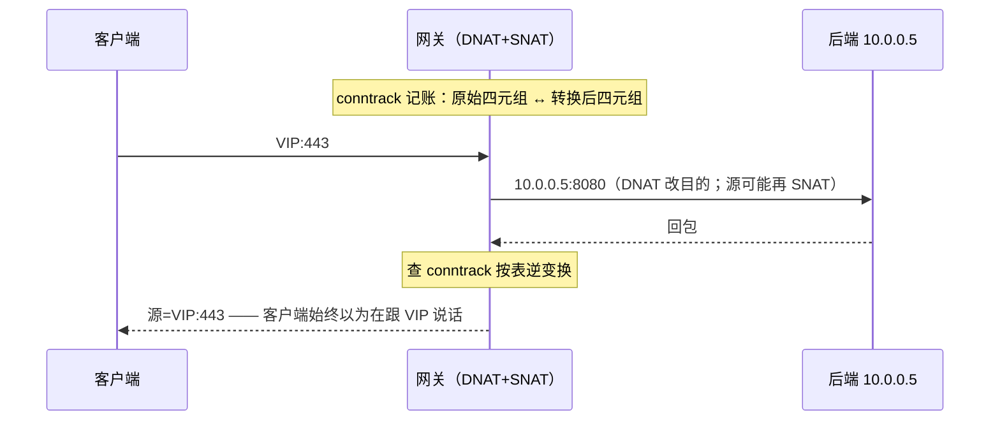
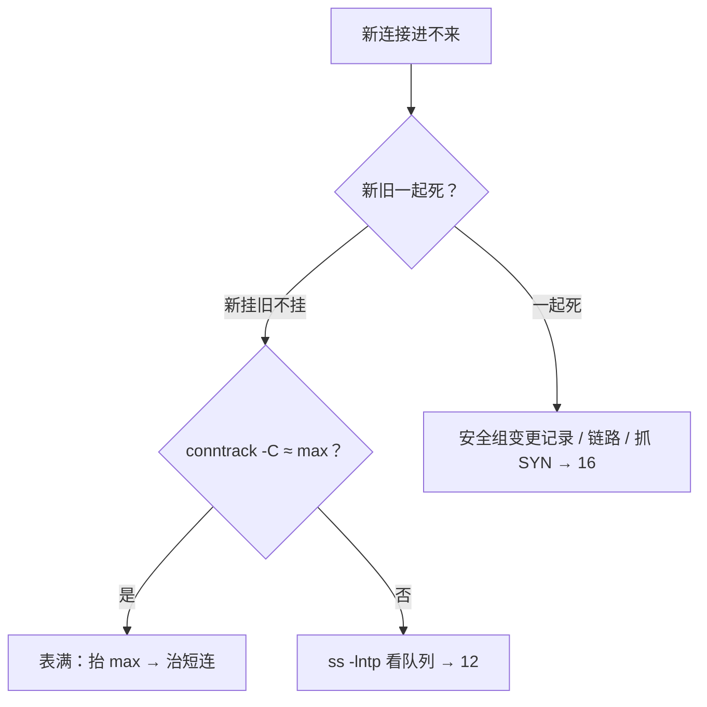

# 17｜iptables 与 conntrack · 练习题

先合上知识点，对着 **一节的主图** 把「一个包过墙的一生」口述一遍（进站 → 登记 → 改名 → 过闸 → 生病 → 换壳），再来做题。每题标了覆盖范围：

| 标记 | 含义 |
|------|------|
| **核心** | 不懂整章就没建立起来 |
| **必会** | 值班和面试都要能讲 |
| **常用** | 线上会反复碰到 |
| **常考** | 白板和追问的高频口径 |

## 本题目录

- [Q1 五链四表与包走哪条链](#q1)
- [Q2 规则顺序与锁死 SSH](#q2)
- [Q3 DROP vs REJECT](#q3)
- [Q4 VIP 不通第一刀](#q4)
- [Q5 SNAT、MASQUERADE 与回包逆写](#q5)
- [Q6 游戏双 NAT 与 UDP 心跳](#q6)
- [Q7 conntrack 表项与状态](#q7)
- [Q8 conntrack 表满：新挂旧不挂](#q8)
- [Q9 表满、队列满、安全组三分](#q9)
- [Q10 NOTRACK 与 INVALID](#q10)
- [Q11 SYN flood 与 limit 模块](#q11)
- [Q12 nftables 与 IPVS](#q12)
- [Q13 证据链拼装：60 秒剧本](#q13)
- [Q14 防火墙白板综合题](#q14)
- [合上书](#合上书)

---

## Q1

**★★★★★｜iptables 五链四表是什么关系？一个外网包打进来走哪条链？**

**覆盖**：核心 · 必会 · 常考

**对应**：知识点 [二、进站：包走哪条链，谁在链上收钱](知识点.md)

### 场景

面试开场题。追问准备：「DNAT 写在 filter 表行不行」「本机发出的包有 PREROUTING 吗」。

### 完整解答

> 🎯 **一句话**：链是包的检查点，表按职责挂上去；目的是本机走 INPUT，要转发走 FORWARD。

链（chain）是包路过内核网络栈的**检查点钩子**：`PREROUTING / INPUT / FORWARD / OUTPUT / POSTROUTING`。表（table）是挂在链上的规则集合，同一链上优先级 **raw → mangle → nat → filter**。四张表各管一件事：raw 管连接跟踪前的豁免（NOTRACK），mangle 改 TOS/TTL/mark，nat 只改地址，filter 只管放行。

```text
目的是本机：  网卡 → PREROUTING → INPUT → 进程          ← 外网 SSH 打本机 22
要转发：      网卡 → PREROUTING → FORWARD → POSTROUTING  ← 本机当网关/VIP 转发
本机发出：    进程 → OUTPUT → POSTROUTING                ← 没有 PREROUTING！
```

**读图**：DNAT 必须在 PREROUTING（路由判断前改目的），SNAT/MASQ 在 POSTROUTING（出接口前改源）；「放行 80」写进 nat 表不生效，在 filter 表翻 DNAT 也是白翻——**表写错等于规则不存在**。链×表矩阵上有 ✓ 才有钩子：PREROUTING 挂 raw/mangle/nat，INPUT/FORWARD 挂 filter，POSTROUTING 挂 nat。

> ⚠️ **别混**：外网连本机端口 ≠ 外网连 VIP 再转后端——前者 INPUT，后者 FORWARD；只开 INPUT 80 救不了 VIP 转发。

### 再追问

- 本机进程发出的包有 PREROUTING 吗？——**没有**，出站是 OUTPUT → POSTROUTING。
- 四表同挂一条链时谁先？——raw → mangle → nat → filter。

---

## Q2

**★★★★★｜规则加了 ACCEPT 为什么还登不上 SSH？当前会话为什么没断？**

**覆盖**：核心 · 必会 · 常考

**对应**：知识点 [五、过闸：filter，命中即停](知识点.md)

### 场景

安全收紧 22 端口：有人先 `-A INPUT -p tcp --dport 22 -j DROP`，再 `-A INPUT -p tcp -s 10.0.0.0/8 --dport 22 -j ACCEPT`。他自己的 ssh 还活着，以为没事，新开就连不上。

### 完整解答

> 🎯 **一句话**：命中即停——DROP 写在前面，后面的 ACCEPT 永远轮不到；老会话靠 ESTABLISHED 活着。

```bash
iptables -L INPUT -n -v --line-numbers
```

```text
Chain INPUT (policy DROP 0 packets, 0 bytes)
num   pkts bytes target  prot opt in  out  source       destination
1        3   180 DROP    tcp  --  *   *    0.0.0.0/0    0.0.0.0/0    tcp dpt:22
#       ↑ 新 SYN 全死在这条，pkts 在涨
2        0     0 ACCEPT  tcp  --  *   *    10.0.0.0/8   0.0.0.0/0    tcp dpt:22
#       ↑ pkts=0：永远轮不到
3     12M  800M ACCEPT  all  --  *   *    0.0.0.0/0    0.0.0.0/0    state RELATED,ESTABLISHED
#       ↑ 当前那条 ssh 靠它活着——「没锁死」是错觉
```

**读输出**：第 1 条 pkts 在涨、第 2 条恒 0，就是顺序反了的铁证。修法：`iptables -D INPUT 1` 删掉错序 DROP，或把放行 `-I INPUT 1` 插到最前。计数在涨但仍通也一样：对着链路图看这条包该走哪条链——可能命中的是别的 ACCEPT。

> ⚠️ **别混**：当前 ssh 还在 ≠ 没锁死——它已是 ESTABLISHED，走第 3 条总闸；**验证必须另开一条新 ssh**。`-I` 是插队、`-A` 是排队，「加了放行还是登不上」九成是 `-A` 排到了 DROP 后面。

### 再追问

- 改墙防锁死自己的顺序？——留 console → 先放 `ESTABLISHED,RELATED` → `-I` 放行管理段 → **另开新 ssh** 验证 → `iptables-save` 持久化（没 save 的规则 reboot 就丢，「昨天还通今天不通」先想这个）。
- 不带 `-v` 能证明规则生效吗？——不能，只能「看见规则」，要 pkts 计数才能证明「吃到了包」。

---

## Q3

**★★★★★｜DROP 和 REJECT 差在哪？客户端各是什么表现？**

**覆盖**：必会 · 常考

**对应**：知识点 [五、过闸：filter，命中即停](知识点.md)（与 [02](../02-网络排查命令/) 同口径）

### 场景

公网入口只对白名单开放，其余全 policy DROP；值班问：为什么用户反馈「卡 30 秒才失败」而不是「立刻拒绝」。

### 完整解答

> 🎯 **一句话**：DROP 静默丢包客户端超时，REJECT 回 RST 立刻 refused——超时查路，拒绝查口。

| 对比 | DROP | REJECT |
|------|------|--------|
| 对端感受 | 像超时/黑洞（hang 几十秒） | 立刻收到 TCP RST / ICMP（毫秒级 refused） |
| 排查方向 | **查路径**：哪段丢了、哪个源被丢 | **查端口**：谁在拒、哪条规则拒的 |
| 生产习惯 | 外网入口默认 policy 常用 DROP | 内网误连用 REJECT 加速反馈 |

「卡 30 秒才失败」就是 DROP 的静默超时——不是服务慢，是包被吞了、客户端在等重传超时。反过来，`curl` 秒回 `connection refused`，别查路径，直接查监听和墙规则里的 REJECT。

> 📝 **面试**：「drop 丢包不回应、客户端超时，排查方向是路径和源 IP；reject 回 RST、客户端立刻 refused，排查方向是对端监听和墙规则。一句『超时查路，拒绝查口』收尾。」

### 再追问

- 生产公网入口为什么偏爱 DROP？——不暴露「这有台机器在拒你」，扫描者拿不到信息。
- 抓包上怎么区分？——出站 SYN 没有任何回应 = DROP；秒回 RST = REJECT 或对端没监听（抓包定层 → [16](../16-网络排障与抓包/)）。

---

## Q4

**★★★★★｜VIP 443 超时，本机 curl 后端正常，第一刀查什么？**

**覆盖**：核心 · 必会 · 常考

**对应**：知识点 [四、改名：NAT，改收件人与寄件人](知识点.md)

### 场景

登录 VIP 203.0.113.10:443 超时，本机 `curl 10.0.0.5:8080` 正常。有人已经在重启后端进程了。

### 完整解答

> 🎯 **一句话**：本机 curl 正常说明后端活着——先看 DNAT 计数、ip_forward、FORWARD 三处。

```bash
iptables -t nat -L PREROUTING -n -v --line-numbers
sysctl net.ipv4.ip_forward
iptables -L FORWARD -n -v | head -3
```

```text
Chain PREROUTING (policy ACCEPT 0 packets, 0 bytes)
num   pkts bytes target  prot opt in   out  source      destination
1     8521  511K  DNAT    tcp  --  eth0 *    0.0.0.0/0  203.0.113.10  tcp dpt:443 to:10.0.0.5:8080
#       ↑ 计数在涨 = 包到了 PREROUTING、目的已改

net.ipv4.ip_forward = 0        ← 目的改了，内核却拒绝转发

Chain FORWARD (policy DROP 0 packets, 0 bytes)   ← 就算开了 forward，没放行也扔
```

**口算定责**：DNAT 涨 + `ip_forward=0` → `sysctl -w net.ipv4.ip_forward=1`；DNAT 涨 + FORWARD policy DROP → `iptables -A FORWARD -d 10.0.0.5 -p tcp --dport 8080 -j ACCEPT`；DNAT **pkts=0** → 规则没吃到包，查 VIP 绑没绑这台、`-i` 写错网卡、firewalld/nft 是否覆盖（Q12）。

> ⚠️ **别混**：只开 INPUT 443 救不了 VIP——转发走 FORWARD，和 INPUT 是两条链；DNAT、ip_forward、FORWARD 放行**三样缺一不可**。也不要在 filter 表里找 NAT。

### 再追问

- 回包为什么不用写反向 DNAT？——conntrack 记了「改前/改后」两套地址，回来自动逆写（Q5）。
- DNAT pkts=0 还查什么？——firewalld 和手写 iptables 是不是两套在互相覆盖（Q12）。

---

## Q5

**★★★★☆｜SNAT 和 MASQUERADE 怎么选？回包怎么「改回去」？**

**覆盖**：必会 · 常考

**对应**：知识点 [四、改名：NAT，改收件人与寄件人](知识点.md)

### 场景

自建机房出口 IP 固定；另一个场景是云上弹性 IP 会变。同事两处都写了 `--to-source`，弹性 IP 那台换 IP 后出网全断。

### 完整解答

> 🎯 **一句话**：出口固定用 SNAT，出口会变用 MASQUERADE；回包靠 conntrack 逆写。



**读图**：NAT 的「改回去」全靠 conntrack 那行账——**NAT 依赖 conntrack**，被 NOTRACK 的流做 NAT 会坏（Q10）。SNAT 写死 `--to-source`，出口 IP 变了规则就指空；MASQUERADE 每次取**当前出口网卡**的 IP，弹性 IP 变了仍工作，代价是每次查接口。K8s 同款：集群外进 Service ≈ DNAT（PREROUTING），Pod 出网 ≈ MASQUERADE（POSTROUTING），主责 [03-08](../../03-Kubernetes/08-Service与kube-proxy/)。

> 📝 **面试**：「DNAT 在 PREROUTING 改目的，必须在路由判断前；SNAT/MASQ 在 POSTROUTING 改源，必须在出接口前。回包逆写靠 conntrack 记的两套五元组。」

### 再追问

- 后端日志里全是网关 IP，风控要真实 IP？——这是 SNAT 的设计结果，不是 bug；要真实 IP 上 TOA / Proxy Protocol，属架构问题，不是再加一条 filter。
- 内网打自己 VIP 不通、外网通？——hairpin，回环路由问题，不是 DNAT 偶发失效。

---

## Q6

**★★★★☆｜游戏大厅通、进房间超时，防火墙侧怎么想？**

**覆盖**：必会 · 常用 · 常考

**对应**：知识点 [四、改名：NAT，改收件人与寄件人](知识点.md)（UDP 超时另见「三、登记」）

### 场景

HTTPS 大厅登录正常，进战斗房间 30 秒左右被踢；房间走 UDP，心跳 40s。有人怀疑房间服内存泄漏，有人只抓了 443。

### 完整解答

> 🎯 **一句话**：大厅和房间是两条 NAT；UDP 房间先对齐心跳和 udp_timeout。

排查顺序：① 房间是**另一端口的另一条 DNAT**，先确认 PREROUTING 里房间端口那条规则存在且有计数——只查 443 是白查；② FORWARD / 安全组是否放行房间端口；③ UDP 走 conntrack 的 `nf_conntrack_udp_timeout`（常见 **30s**）：心跳 40s > 30s，空闲项过期后下一包变 NEW，路径稍有不齐就断——「进房 30 秒左右被踢」就是这个数字的味道；④ 对齐办法：心跳 < udp_timeout，或按需调大 timeout（落盘 → [24](../24-内核参数与sysctl/)）。

```bash
sysctl net.netfilter.nf_conntrack_udp_timeout
iptables -t nat -L PREROUTING -n -v | grep -E '7777|1000[1-9]'
```

> ⚠️ **别混**：「大厅通房间不通」不是防火墙坏一半——两条 NAT 两条规则、TCP 和 UDP 两套超时，分开查。也**禁止全 UDP NOTRACK**——NAT 会话对不上，房间当场炸（Q10）。

### 再追问

- 为什么 SNAT 后反外挂只见网关 IP？——设计使然，要 TOA/Proxy Protocol，不是加 filter 规则能解决的。
- K8s 里同款机制是什么？——Service 外部流量 ≈ DNAT、Pod 出网 ≈ MASQUERADE，都写 conntrack，细节在 [03-08](../../03-Kubernetes/08-Service与kube-proxy/)。

---

## Q7

**★★★★☆｜conntrack 表里一行长什么样？NEW/ESTABLISHED/INVALID 各是什么？**

**覆盖**：必会 · 常考

**对应**：知识点 [三、登记：conntrack，先记账再放行](知识点.md)

### 场景

面试问「状态防火墙的状态从哪来」；值班时你想确认一条连接有没有被记账、有没有做过 NAT。

### 完整解答

> 🎯 **一句话**：conntrack 给每条流记五元组+状态；一行两套地址，前半原始、后半回复。

```bash
conntrack -L -p tcp --dport 443 2>/dev/null | head -2
```

```text
tcp  6 431999 ESTABLISHED src=10.0.0.1 dst=10.0.0.5 sport=52341 dport=443 \
  packets=128 bytes=18432 src=10.0.0.5 dst=10.0.0.1 sport=443 dport=52341 \
  [ASSURED] mark=0 zone=0 use=2
```

**读输出**：`src/dst/sport/dport` 出现两遍——前半是原始方向，后半是回复方向；做过 NAT 的流这两套与抓包看到的不一致属正常，可用它反查 NAT 落点。`[ASSURED]` 表示双向都通过流量、更不易被提前淘汰；`use=` 是引用计数。四态：**NEW** 首包建账、**ESTABLISHED** 双向都见过（回包靠它直过，不必写反向规则）、**RELATED** 关联连接（FTP 数据通道类）、**INVALID** 对不上账。

```bash
iptables -A INPUT -m conntrack --ctstate ESTABLISHED,RELATED -j ACCEPT
iptables -A INPUT -m conntrack --ctstate INVALID -j DROP
```

`-m state` 是老写法、同族；新稿统一 `-m conntrack --ctstate`。

> ⚠️ **别混**：conntrack 表项 ≠ Socket——`ss` 看进程手里的连接（[12](../12-网络栈与Socket/)），`conntrack` 看内核的流账；表满时 Socket 完全健康，这就是 Q8 的根源。

### 再追问

- DROP INVALID 有什么风险？——PMTUD 边角报文可能被误判 INVALID，表现为小包通、大包偶发挂；加了要能回滚（PMTUD 深挖 → [16](../16-网络排障与抓包/)）。
- tcp established 超时多久？——可达数天（如 432000s）；UDP 常见 30s——长短连接占坑能力差三个数量级。

---

## Q8

**★★★★★｜conntrack 表满什么现象？两条命令怎么钉死？处理顺序？**

**覆盖**：核心 · 必会 · 常考

**对应**：知识点 [六、生病：表满，新挂旧不挂](知识点.md)

### 场景

活动 5 万在线：新登录全部超时，房间里还在打。群里一半喊改安全组，一半喊重启战斗服。默认 max 65536，dmesg 还没看。

### 完整解答

> 🎯 **一句话**：账本写满，新建建不了、旧账还在转——新挂旧不挂；两条命令钉死，止血先抬 max。

```bash
conntrack -C; cat /proc/sys/net/netfilter/nf_conntrack_max
dmesg -T | grep -i conntrack | tail -2
```

```text
65512                        ← 当前行数
65536                        ← 上限：65512/65536 ≈ 顶满
nf_conntrack: table full, dropping packet    ← 内核丢包铁证
```

**为什么老连接不断**：已有 ESTABLISHED 表项还在表里照常转发；只有**新**连接建不了跟踪项（新 SYN 常在跟踪阶段就被丢）。所以签名是「新挂旧不挂」——光纤断、安全组误改通常**新旧一起死**。

处理顺序：① 止血 `sysctl -w net.netfilter.nf_conntrack_max=1048576`（hashsize ≈ max/8，落盘 → [24](../24-内核参数与sysctl/)）；② `conntrack -L` 按源 IP 聚合证明谁占满——`awk` 聚合 src 一眼看到短连风暴、扫描源；③ 应用侧 Keep-Alive / 连接池（登录短连接不复用是最常见根因）；④ 短连接场景缩短 ESTABLISHED 超时（**别误伤房间长连接**）；⑤ 定点 NOTRACK（Q10）；⑥ 规则爆炸再切 IPVS / Cilium（Q12）。

> 📝 **面试**：「铁证是 count ≈ max + dmesg table full；签名新挂旧不挂。调大 max 只是止血买时间，根治要治短连接和泄漏。容量口算：在线 CCU + 短连每秒数 × 存活秒数，留 20~30% 余量——2k 短连/s × 10s 存活就要 2 万坑，几分钟顶满。监控 count/max > 0.8 告警。」

### 再追问

- 为什么「长连接还在」和「表满」不矛盾？——长连接本来就占了大半行；爆表的是登录短连那一摊。
- 活动高峰能不能重启战斗服？——不能：老连接是唯一「还活着」的证据，重启全没了，现场被销毁。

---

## Q9

**★★★★☆｜conntrack 表满、LISTEN 队列满、安全组误删，三个怎么分？**

**覆盖**：核心 · 必会 · 常考

**对应**：知识点 [六、生病：表满，新挂旧不挂](知识点.md)（队列满主责 [12](../12-网络栈与Socket/)）

### 场景

「新连接进不来」报障，三个候选病因摆在面前；值班要在 60 秒内选对一个方向。

### 完整解答

> 🎯 **一句话**：表满看 conntrack 和 dmesg，队列满看 ss 的 Recv-Q，安全组错杀新旧一起死。



**读图**：左半边「不对称故障」先想表满或队列满，右半边「对称故障」想安全组和链路。三个第一刀：表满 `conntrack -C` vs max + dmesg `table full`；队列满 `ss -lntp` 看 LISTEN 的 Recv-Q 是否顶满 Send-Q（→ [12](../12-网络栈与Socket/)，握手完了进不了 accept 队列）；安全组云控制台看变更记录——本机敲命令查不出它。fd 满（`Too many open files`）、临时端口满（出站失败 + TIME_WAIT 多）也在 12 的「四个满」。

> ⚠️ **别混**：安全组误删放行，老连接下一包也会被挡（新旧一起死）且 dmesg 无 `table full`——先去控制台看变更，别在机器里翻 conntrack。

### 再追问

- 两边同时满可能吗？——可能。两条命令同时采，按证据分支，不要先重启。
- 云上探活间歇 502 和这有什么关系？——本机墙漏放健康检查源 / CDN 回源网段（[15](../15-DNS与CDN/) 的经典坑），也是「另一层在前面吃包」一族。

---

## Q10

**★★★★☆｜NOTRACK 什么时候能用？为什么禁止全 UDP NOTRACK？INVALID 什么时候不能 DROP？**

**覆盖**：必会 · 常用

**对应**：知识点 [三、登记：conntrack，先记账再放行](知识点.md)

### 场景

表满现场有人提议「UDP 全部 NOTRACK 一劳永逸」；另一个人顺势想在 INPUT 里加 `DROP INVALID` 加固。

### 完整解答

> 🎯 **一句话**：NOTRACK 只能定点豁免无状态流量；全 UDP 会弄坏 NAT；DROP INVALID 可能误伤 PMTUD。

NOTRACK 写在 raw 表（连接跟踪之前），被豁免的流**不记账**。而 NAT 靠 conntrack 记「改前/改后」来逆写回包——把全部 UDP 豁免，房间 NAT 会话对不上，当场炸；状态防火墙的 ESTABLISHED 总闸对它也失效。正确姿势：只豁免明确无状态、不走 NAT 的探活网段，且永远排在「抬 max、聚合找大头、Keep-Alive、缩超时」之后。

```bash
# 错误：iptables -t raw -A PREROUTING -p udp -j NOTRACK   ← 全 UDP，禁止
# 对：定点豁免探活流量
iptables -t raw -A PREROUTING -s 10.0.0.0/24 -p tcp --dport 8080 -j CT --notrack
```

DROP INVALID 同理是双刃：PMTUD 中间报文、部分 NAT 边角会被判 INVALID，表现为「小包通、大包 HTTPS 偶发挂」——加了必须能回滚、要测大包（`ping -M do -s 1472`，→ [16](../16-网络排障与抓包/)）。

> 📝 **面试**：「NOTRACK 是减账手术刀，只能定点；全 UDP NOTRACK 会坏 NAT 和状态防火墙。DROP INVALID 要防 PMTUD 误伤。」

### 再追问

- 表满时 NOTRACK 排第几步？——第五步，前面是抬 max、聚合找大头、Keep-Alive、缩超时。
- 为什么 NAT 依赖 conntrack？——回包逆写要查那行账（Q5 的图）。

---

## Q11

**★★★★☆｜SYN flood 墙侧怎么治？limit 模块怎么写？**

**覆盖**：必会 · 常用 · 常考

**对应**：知识点 [五、过闸：filter，命中即停](知识点.md)（syncookies/半连接队列 → [13](../13-TCP与UDP/)）

### 场景

公网战斗端口 7777 被打 SYN 风暴，`ss -ant state syn-recv` 飙高（队列侧 → [12](../12-网络栈与Socket/)），有人要在 iptables 上止血。

### 完整解答

> 🎯 **一句话**：limit 模块限速放行新 SYN、超速丢弃；限速 ACCEPT 必须写在兜底 DROP 前。

```bash
iptables -A INPUT -p tcp --syn --dport 7777 -m limit --limit 100/s --limit-burst 200 -j ACCEPT
iptables -A INPUT -p tcp --dport 7777 -m conntrack --ctstate ESTABLISHED -j ACCEPT
iptables -A INPUT -p tcp --dport 7777 -j DROP
```

**读命令**：`--limit 100/s` 是持续速率，`--limit-burst 200` 是突发桶容量——先放突发、再削平到平均速率。顺序是命中即停的应用：**限速 ACCEPT 在前、兜底 DROP 在后**，写反了就一条都不放。

墙侧只是半套：SYN 风暴打的是「每个 SYN 占一个半连接位」——syncookies（`net.ipv4.tcp_syncookies`）和 backlog 在内核侧（[12](../12-网络栈与Socket/)、[13](../13-TCP与UDP/)）；每秒几万 NEW 同时会把 conntrack 顶爆（Q8），两边要一起盯。

> ⚠️ **别混**：limit 限的是**新建 SYN**（`--syn`），ESTABLISHED 总闸放最前别被限速误伤。

### 再追问

- 为什么打了限速补丁还丢新连接？——看 `conntrack -C`：风暴的 NEW 也在吃表，表满照样「新挂旧不挂」。
- `--limit-burst` 是什么？——令牌桶容量，决定瞬时突发能放多少。

---

## Q12

**★★★★☆｜iptables -L 卡了好几秒；firewalld 和 iptables 是什么关系？kube-proxy 切 IPVS 能治什么？**

**覆盖**：必会 · 常用 · 常考

**对应**：知识点 [七、换壳：nftables 与 IPVS](知识点.md)

### 场景

K8s 节点上 `iptables -L` 要跑好几秒、一次走读 4 万多行规则；Service 通、节点上 Pod 出网却失败。同事说「切 IPVS 就都好了」。`iptables -V` 显示 `nf_tables`。

### 完整解答

> 🎯 **一句话**：iptables 规则链 O(n) 会爆炸，IPVS 哈希 O(1) 治规则爆炸——但治不了表满。

| 对比 | iptables（kube-proxy 经典模式） | IPVS 模式 |
|------|--------------------------------|-----------|
| 匹配 | 规则链近似 O(n)，线性扫 | 哈希近似 O(1) |
| Service×Endpoint 多 | 规则爆炸、`-L` 卡数秒、发布抖 | 大规模明显更好 |
| conntrack | 每条连接一行账 | **多数 DNAT 路径仍吃表** |

K8s 侧：集群外进 Service 是 DNAT、Pod 出网是 MASQUERADE（都写 conntrack，主责 [03-08](../../03-Kubernetes/08-Service与kube-proxy/)）；表满时新连接挂，NAT 失败——规则条数爆炸 + 表满同框就是切 IPVS 的信号。切完 conntrack 监控照旧：IPVS 治**规则规模**，不自动消灭表满，也不治短连接泄漏；主机 filter/安全组也仍在。

nftables 侧：新发行版敲的 `iptables` 底层常已是 nft 兼容层（`iptables -V` 显示 `(nf_tables)`）；firewalld 是前端。**firewalld 和手写规则二选一**，两边对着改互相覆盖，表现为「加了规则计数仍 0」「重启后只剩一边」。排障口诀：`iptables -V` 认后端 → `nft list ruleset` 看真实规则 → `systemctl status firewalld` → 再决定用哪套语法改。DNAT 在路由前、表满看 conntrack——这些不因语法改变。

> 📝 **面试**：「切 IPVS 的信号是规则爆炸——`-L` 卡数秒、Service 上千；切完 conntrack 监控照旧，IPVS 不免疫表满。」

### 再追问

- 切了 IPVS 还要看哪些表？——conntrack count/max、短连接 Keep-Alive、主机 filter/安全组——IPVS 是换转发平面，不是删掉五链四表（主机 LVS → [18](../18-LVS与四层负载均衡/)，eBPF → [03-25](../../03-Kubernetes/25-eBPF与Cilium/)）。
- 怎么快速认后端？——`iptables -V`：`(nf_tables)` 是兼容层，`legacy` 是老后端。

---

## Q13

**★★★★☆｜接到「连不上」报障，防火墙侧 60 秒怎么走？把证据链说出来。**

**覆盖**：核心 · 必会

**对应**：知识点 [八、作战：定责](知识点.md)

### 场景

值班群同时来三单：A「新登录全超时、老玩家还在打」、B「VIP 443 不通」、C「改了防火墙规则后 SSH 没了」。你只有一台跳板机。

### 完整解答

> 🎯 **一句话**：0–10s 查表满，10–30s 查 NAT 三件套，30–45s 查规则计数，45–60s 分流到 12/16。

```text
① 0–10s   conntrack -C；cat nf_conntrack_max；dmesg | grep -i conntrack
          —— 表满当场现形（新挂旧不挂的签名，答 A）
② 10–30s  iptables -t nat -L PREROUTING -n -v；sysctl net.ipv4.ip_forward；
          iptables -L FORWARD -n -v | head        —— VIP 类故障三件套（答 B）
③ 30–45s  iptables -L INPUT -n -v --line-numbers —— 顺序/计数/被另一套覆盖（答 C 的预防）
④ 45–60s  ss -lntp 排除队列满 → 12；不清就抓 SYN 看出没出网卡 → 16
```

**读剧本**：①②③分别对应「装不装得下的状态账」「写得对不对的地址账」「写得对不对的规则账」——三条各一条命令、各一种输出，每条结论挂一条命令输出，不给「感觉是」。C 单的修法是 console 上 `-D` 掉错序 DROP；预防是六步 checklist（console → ESTABLISHED 先放 → `-I` 放行 → **另开新 ssh** → save → 记录）。

> ⚠️ **别混**：60 秒里没有「重启进程」这一步——重启会销毁老连接这个唯一证据，也治不了三条账里的任何一条。

### 再追问

- 三单哪单最急？——C（管理通道锁死）先修：没人进得去，A/B 都没人处理。
- 证据链拼装的顺序为什么是「表满 → NAT → 规则 → 队列/抓包」？——前三条在本机有命令铁证且最快；队列满主责 12、出网卡验证主责 16，分层外包。

---

## Q14

**★★★★★｜白板：包过墙一生 + 三账（状态/地址/规则）+ 新挂旧不挂？**

**覆盖**：核心 · 必会 · 常考 ｜ **对应**：知识点 [一、一张图](知识点.md) · [九、收口](知识点.md)

### 场景

白板 90 秒：「画五链四表，说 conntrack 为什么新挂旧不挂。」

### 完整解答

> 🎯 **一句话**：**进站→登记(conntrack)→改名(NAT)→过闸(filter)→生病(表满)**；DNAT 在 PREROUTING，回包靠 conntrack 逆写。

```text
新挂旧不挂: count≈max → 新 SYN 建表失败
DROP vs REJECT: 超时 vs 立刻拒绝
NOTRACK: 弄坏回包逆写，别乱开
边界: 队列满→12  抓包→16  sysctl→24
```

> 📝 **面试**：60 秒剧本 C 单（SSH 锁死）最急——先恢复管理通道（Q13）。

### 再追问

- nftables/firewalld 二选一？——复述 Q12；`iptables -V` 认后端。

---

## 合上书

- [ ] 默画一节的图：进站 / 出站 / 记账三块，DNAT、SNAT、conntrack 各标在哪
- [ ] 五链四表：谁管什么、为何 NAT 不在 filter、外网 SSH 和 VIP 转发差在哪条链
- [ ] conntrack 表项：两套五元组、四态、[ASSURED]、use=；UDP 30s 和心跳怎么对齐
- [ ] 回包逆写：DNAT+SNAT 后客户端为何仍以为在跟 VIP 说话、NOTRACK 为什么弄坏它
- [ ] 命中即停：`-I` vs `-A`、`-v` 计数怎么读、DROP vs REJECT「超时查路拒绝查口」、limit 怎么限 SYN
- [ ] 表满一例钉死：铁证两条命令、为何不是安全组、止血→治本六步、和 12 的队列满怎么分
- [ ] 换壳：iptables-nft 怎么认、firewalld 为什么二选一、IPVS 治什么不治什么
- [ ] 定责：决策树三个入口各接什么报障、60 秒剧本怎么走
- [ ] 白板过墙一生综合（Q14）
- [ ] 边界：队列/fd/端口满去 12；心跳/syncookies 去 13；抓 SYN/MTU 去 16；sysctl 落盘去 24；kube-proxy 去 03-08

与知识点「合上书」逐条对齐；都能口述这一章就过了。下一章：[LVS 与四层负载均衡](../18-LVS与四层负载均衡/)。
