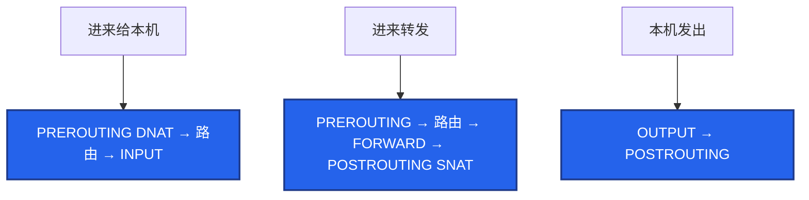
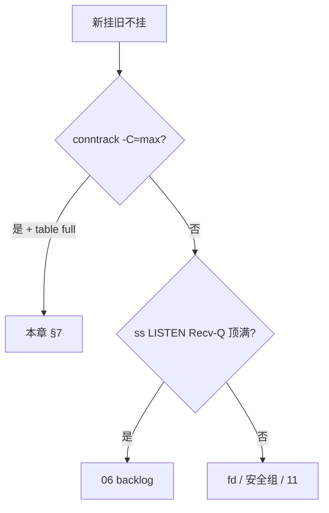

# 15｜iptables 与 conntrack · 练习题

先对照 [知识点](知识点.md)：**先 §2 总图，再 §3 名词，再 §5～§7**。能默画五链四表再谈 NAT/表满。每题标了覆盖范围：

| 标记 | 含义 |
|------|------|
| **核心** | 不懂整章就没建立起来 |
| **必会** | 值班和面试都要能讲 |
| **常用** | 线上会反复碰到 |
| **常考** | 白板和追问的高频口径 |

## 本题目录

- [Q1 五链四表](#q1)
- [Q2 规则顺序与锁 SSH](#q2)
- [Q3 NAT / DNAT / SNAT](#q3)
- [Q4 conntrack 表满](#q4)
- [Q5 表满 vs 06 队列满](#q5)
- [Q6 iptables vs IPVS](#q6)
- [Q7 K8s DNAT / MASQUERADE](#q7)
- [Q8 firewalld / nftables](#q8)
- [Q9 NOTRACK 与 INVALID](#q9)
- [Q10 `-v` 计数](#q10)
- [Q11 游戏 UDP / 双 NAT](#q11)
- [Q12 证据链拼装](#q12)
- [合上书](#合上书)

---

## Q1

**★★★★★｜iptables 的五链四表是什么？包怎么经过？**

**覆盖**：核心 · 必会 · 常考

**对应**：知识点 §2 · §3

### 场景

开场就让你画「一个包从网卡进到本机进程」。有人开始背 filter 的 ACCEPT。

### 完整解答

**一句话**：四表 raw>mangle>nat>filter，五链 PREROUTING/INPUT/FORWARD/OUTPUT/POSTROUTING；DNAT 在路由前，SNAT 在出接口前。

四表优先级：raw > mangle > nat > filter。五链：PREROUTING、INPUT、FORWARD、OUTPUT、POSTROUTING。



DNAT 必须在路由前改目的，SNAT 必须在出接口前改源——所以它们不在 filter。外网 SSH 走 INPUT；VIP 转发走 FORWARD，还要 `ip_forward=1`。只开 INPUT 80 不够。

链×表：PREROUTING 有 raw/mangle/nat；INPUT/FORWARD 有 filter；POSTROUTING 有 nat。有 ✓ 才有钩子（见知识点 §2.2）。

### 再追问

- DNAT 和 SNAT 分别在哪个链、改什么？——DNAT 在 PREROUTING 改目标 IP/端口。SNAT 在 POSTROUTING 改源 IP。MASQUERADE 是出口 IP 不固定时的动态 SNAT。

---

## Q2

**★★★★★｜只允许内网 10.0.0.0/8 访问 22，其他拒绝。顺序反了会怎样？怎么避免锁死？**

**覆盖**：核心 · 必会 · 常用

**对应**：知识点 §4

### 场景

安全要求收紧 SSH。有人先写了一条 DROP 再写 ACCEPT。只有当前这一条 ssh。准备加默认 DROP。

### 完整解答

**一句话**：规则从上到下命中即停，放行必须在拒绝前，ESTABLISHED 放最前；另开新 ssh 验证，留 console 防锁死。

从上到下匹配，命中即停。放行必须在拒绝前。

```bash
iptables -A INPUT -m conntrack --ctstate ESTABLISHED,RELATED -j ACCEPT
iptables -A INPUT -p tcp --dport 22 -s 10.0.0.0/8 -j ACCEPT
iptables -A INPUT -p tcp --dport 22 -j DROP
```

DROP 在前：所有 22 都被丢掉，ACCEPT 永远走不到。ESTABLISHED 通常放最前：回包不必写反向规则。这条丢了，SYN 放行了回包可能被 DROP。

防锁死：留 console；先 `-I` INSERT 放行你的 IP；**另开一条新 ssh** 验证——当前会话已是 ESTABLISHED，DROP 对它暂时无效；保存前再验证。云上能改安全组就改安全组。已经锁死走 console 删 DROP / 改 policy。INPUT policy DROP 时必须先放行 ESTABLISHED 和需要的端口。

### 再追问

- 保存错了 reboot？——也回不来。所以保存前验证；没有 console 就不要在唯一 ssh 上加默认 DROP。
- `-I` 和 `-A`？——紧急放行用 `-I` 插到 DROP 前；`-A` 追加到尾部可能排在拒绝之后。

---

## Q3

**★★★★★｜DNAT / SNAT / MASQUERADE 怎么讲？VIP 不通第一刀看哪？**

**覆盖**：核心 · 必会 · 常考

**对应**：知识点 §5

### 场景

外网打登录 VIP 超时。本机 `curl 10.0.0.5:8080` 正常。有人在 filter 里找 NAT。

### 完整解答

**一句话**：DNAT 在 PREROUTING 改目的，SNAT/MASQ 在 POSTROUTING 改源；第一刀 `iptables -t nat -L -n -v`，有计数再查 forward / ip_forward。

| 动作 | 链 | 改什么 |
|------|-----|--------|
| DNAT | PREROUTING | 目的 |
| SNAT | POSTROUTING | 源 → 固定 IP |
| MASQUERADE | POSTROUTING | 源 → 当前网卡 IP |

```bash
iptables -t nat -L PREROUTING -n -v --line-numbers
sysctl net.ipv4.ip_forward
iptables -L FORWARD -n -v | head
```

- DNAT `pkts` 涨 + `ip_forward=0` → 目的改了但不转发  
- DNAT `pkts=0` → 没走到：错接口 / 错 VIP / firewalld 覆盖  
- 只开 INPUT 80/443 **救不了** VIP 转发  

回包靠 conntrack 逆写；后端看到网关 IP 是 SNAT 的锅，要真实 IP 用 TOA/Proxy Protocol。

### 再追问

- MASQUERADE 和 SNAT 怎么选？——出口 IP 会变用 MASQUERADE；游戏网关公网 IP 固定用 SNAT。
- 为什么 NAT 不在 filter？——filter 只做放行/拒绝，改地址是 nat 表。

---

## Q4

**★★★★★｜conntrack 表满了怎么办？怎么证明？**

**覆盖**：核心 · 必会 · 常用 · 常考

**对应**：知识点 §7

### 场景

活动高峰新登录全失败，战斗长连接还在。有人要改安全组。dmesg 还没看。默认 max 65536。

### 完整解答

**一句话**：新挂旧不挂是表满签名——`conntrack -C` vs max + dmesg `table full`；调大 max 只是买时间。

新连接丢、旧连接在，优先表满，不是光纤、不是安全组（安全组通常新旧都死）。

```text
conntrack -C  vs  nf_conntrack_max
dmesg | grep conntrack
   nf_conntrack: table full, dropping packet
```

新 SYN 常在跟踪阶段就被丢。处理：

1. 调大 `nf_conntrack_max`（如 1048576）买时间；hashsize ≈ max/8  
2. 缩短短连接 ESTABLISHED 超时（别误伤房间）  
3. UDP 对齐心跳  
4. raw 表 NOTRACK **定点**豁免  
5. 换 IPVS / Cilium  
6. 查短连接泄漏、没开 Keep-Alive  

`conntrack -L` 按源 IP 聚合看谁占满。先证明满，再调大。只调大是推迟爆炸。sysctl 持久化在 [24](../24-内核参数与sysctl/)。告警建议 count/max **>0.8**。

### 再追问

- 调大之后还要做什么？——查谁占满、短连接是否能复用、K8s 是否该切 IPVS。
- 算术：5 万在线 + 登录重试、没 Keep-Alive，65536 几分钟顶满。长连接已在 ESTAB，所以旧玩家还在打。

---

## Q5

**★★★★★｜「新挂旧不挂」怎么区分本章表满和 06 队列满？**

**覆盖**：核心 · 必会 · 常考

**对应**：知识点 §6.4 · §7.2 · [06 §8](../12-网络栈与Socket/知识点.md)

### 场景

登录进不去、老连接还在。有人说「肯定是 conntrack」，有人说「肯定是 backlog」。两边都没敲命令。

### 完整解答

**一句话**：表满看 `conntrack -C`/dmesg；队列满看 `ss -lntp` LISTEN 的 Recv-Q 是否顶满 Send-Q——两套第一刀，不要混。

| | conntrack 表满（15） | 全连接队列满（06） |
|--|---------------------|-------------------|
| 第一刀 | `-C` vs max；dmesg `table full` | `ss -lntp` Recv-Q≈Send-Q |
| 丢在哪 | 跟踪/NAT 新建失败 | 握手完了进不了 accept |
| 治 | 抬 max、Keep-Alive、IPVS | backlog/somaxconn、加速 accept |



fd 满、临时端口满也在 06「四个满」里；本章只把 conntrack 钉死。

### 再追问

- 两边同时满可能吗？——可能。先用两条命令同时采，按证据分支，不要先重启。

---

## Q6

**★★★★★｜iptables 和 IPVS 差在哪？换 IPVS 还要看 conntrack 吗？**

**覆盖**：核心 · 必会 · 常考

**对应**：知识点 §9

### 场景

K8s 节点上千 Service。`iptables -L` 要数秒。活动高峰 conntrack 反复满。有人说「切 IPVS 就不用管表了」。

### 完整解答

**一句话**：iptables 规则 O(n) 会爆炸；IPVS 哈希快，但多数 DNAT 仍吃 conntrack，换 IPVS 不等于不管表满。

| | iptables | IPVS |
|--|----------|------|
| 匹配 | 规则条数线性 | 哈希 |
| 规模 | Service×Endpoint 爆炸；`-L` 慢 | 大规模更好 |
| conntrack | 每条连接一项 | **多数 DNAT 仍吃表** |

切换动机：规则爆炸、kube-proxy 刷规则抖 P99、表反复满。IPVS 治 **规则规模**，不自动消灭表满，也不治短连接泄漏。切完仍要监控 count/max。Cilium 见 K8s 23。主机 LVS 见 [18](../18-LVS与四层负载均衡/)。

### 再追问

- 主机防火墙还用 iptables 吗？——filter 仍可能在。IPVS 是转发平面，不是「删掉五链四表」。

---

## Q7

**★★★★☆｜K8s 里哪条是 DNAT、哪条是 MASQUERADE？表满会怎样？**

**覆盖**：必会 · 常用 · 常考

**对应**：知识点 §5.4 · §7

### 场景

Service 通，节点上新 Pod 访问外网失败。长连接还在。有人在 filter 表里找 K8s 规则。

### 完整解答

**一句话**：集群外进 Service 是 DNAT，Pod 出网是 MASQUERADE，都写 conntrack；表满则 NAT 失败。

```text
集群外 → Service VIP     DNAT（PREROUTING）→ Pod
Pod → 外网               MASQUERADE（POSTROUTING）改成节点 IP
```

都写 conntrack。表满则 NAT 失败，新连接挂。看 `iptables -t nat -L -n -v` 的命中，不要只看 filter。规则条数爆炸 + 表满 → IPVS / Cilium。kube-proxy 的大量规则在 nat 和 filter 都有，排查要带 `-t`。

### 再追问

- 为什么 NAT 不在 filter？——filter 只做放行/拒绝。改地址是 nat 表。

---

## Q8

**★★★★☆｜firewalld 和 iptables 一起改会怎样？nftables 怎么理解？**

**覆盖**：必会 · 常用

**对应**：知识点 §8 · §10

### 场景

CentOS 节点。有人 `firewall-cmd` 开了端口，你又 `iptables -A` 加了一条。重启后只剩一边。`iptables -V` 显示 `nf_tables`。探活间歇 502。

### 完整解答

**一句话**：firewalld 和 iptables 二选一；许多发行版 iptables 已是 nft 兼容层——概念仍是五链四表，先搞清谁在写规则。

firewalld 是前端，背后是 nft/iptables。两边对着改会互相覆盖。生产二选一。规则「写了但不挡」、`-v` 计数为 0，有可能是 firewalld 把你手写的冲掉了。

K8s 节点常关 firewalld，交给安全组 + NetworkPolicy。云上优先改安全组，不要在 ECS 再堆本地墙——健康检查源很容易漏，表现为间歇探活失败 / 502。

`iptables -V` 见 `(nf_tables)` → 兼容层。排障仍可用 `iptables -t nat -L -v`；长期学 `nft`。DNAT 在路由前、表满看 conntrack——这些不因语法改变。

### 再追问

- reboot 丢规则？——没 iptables-save / persistent。表现为「昨天还通」。

---

## Q9

**★★★★☆｜NOTRACK 什么时候用？乱豁免有什么风险？DROP INVALID 呢？**

**覆盖**：必会 · 常用

**对应**：知识点 §6.5 · §6.6 · §7

### 场景

表满之后有人要把全部 UDP 都 NOTRACK。战斗服心跳正好是 UDP。另一次加固 DROP INVALID，大包不通。

### 完整解答

**一句话**：NOTRACK 是 raw 表定点减账，乱豁免会让 NAT 和状态防火墙失效；DROP INVALID 可能误伤 PMTUD。

raw 表在 conntrack 之前。NOTRACK 让这类包不进表，能给短连接、不需要状态的流量减账。

乱豁免：状态防火墙失效，回包对不上，NAT 也不记账，DNAT 会话会坏。游戏 UDP 心跳如果还做 NAT，不能随便 NOTRACK。先调大 max、缩短超时、治短连接，豁免是定点手术。

INVALID：常见加固会 DROP。但 PMTUD、某些 NAT 边角会被误判 INVALID，表现为大包不通（[16](../16-网络排障与抓包/) MTU）。加这条要能回滚、要测大包。

### 再追问

- 定点豁免什么流量？——例如节点上不需要状态的健康检查网段、明确不走 NAT 的流量。不要「全部 UDP」。

---

## Q10

**★★★★☆｜`-L` 没有命中计数，规则「没生效」？**

**覆盖**：必会 · 常用

**对应**：知识点 §4.3 · §10.3

### 场景

加了 DROP，攻击还在。`iptables -L -n` 看得到规则。没加 `-v`。

### 完整解答

**一句话**：必须 `-v` 看计数；为 0 说明包没走到这条链，或写错表、被 firewalld/nft 覆盖。

必须 `-v` 看计数。计数为 0：包没走到这条链，或前面已经匹配返回。还有可能改错表（写在 filter，包在 nat 就被改走了），或 firewalld 覆盖了。

```bash
iptables -L -n -v --line-numbers
iptables -t nat -L -n -v
```

K8s 节点规则极多，`-L` 会很慢，这本身也是性能问题信号（Q6）。policy DROP 是链末兜底；规则是中间匹配。

### 再追问

- 计数在涨但仍通？——命中的是 ACCEPT，或 DNAT 之后走了别的链。对着 §2 架构图看这条包该走哪。

---

## Q11

**★★★★☆｜大厅 HTTPS 通、房间 UDP 进不去 / 被踢，怎么定责？**

**覆盖**：必会 · 常用 · 常考

**对应**：知识点 §5.3 · §6.5

### 场景

大厅 443 正常。进房间超时，或进得去空闲一分钟被踢。心跳 40s。有人只抓了 443。有人准备全 UDP NOTRACK。

### 完整解答

**一句话**：登录和房间是两条 NAT；UDP 也走 conntrack，心跳必须短于 `udp_timeout`；禁止全体 NOTRACK。

1. 确认房间端口另有 DNAT，且 `-t nat -v` 有计数。  
2. FORWARD / 安全组是否放行房间端口。  
3. `sysctl` 看 `nf_conntrack_udp_timeout`（常见 30s）vs 心跳 40s → 项过期，下包变 NEW，表现为踢人。  
4. 不要全 UDP NOTRACK——NAT 会话会坏。  

SNAT 后反外挂只见网关 IP → 架构要 TOA/Proxy Protocol，不是再加一条 filter。

### 再追问

- hairpin？——内网打自己 VIP 不通、外网通，优先查回环/路由，见 §5.6。

---

## Q12

**★★★★☆｜新连接失败，你怎么用本章和 06/11 拼成一条证据链？**

**覆盖**：必会 · 常用

**对应**：知识点 §11 · §10.6

### 场景

oncall：登录超时。`ss` 显示大量 ESTAB。安全组没人动过。

### 完整解答

**一句话**：旧 ESTAB 在、新建不了 → 先证 conntrack 表满，再排除 06 队列，再抓新 SYN，最后才查安全组。

```text
① ss：旧 ESTAB 在，新的建不起来     不像光纤
② conntrack -C vs max、dmesg table full     ← 本章
③ ss -lntp：LISTEN Recv-Q 是否顶满         ← 06
④ 抓新 SYN 有没有出网卡（11）
⑤ 才轮到安全组 / 对端
```

表满是本章的锅；队列满是 06 的锅；SYN 出了网卡对端不回是 [16](../16-网络排障与抓包/) 的锅。不要一上来改 iptables policy。大厅通房间不通：房间端口 / UDP 超时，不要只抓登录 443。

调大 max 之后：查谁占满、短连接是否能复用、K8s 是否该切 IPVS。只调大是推迟爆炸。活动高峰**不要**重启还活着的战斗服。

### 再追问

- 复制哪段命令？——知识点 §10.6 最小命令集：conntrack → nat/forward → `ss -lntp`。

---

## 合上书

- [ ] **§2 总图**：进来给本机 / 转发 / 本机发出各走哪些链；DNAT/SNAT 标在哪
- [ ] 命中即停；ESTABLISHED 最前；另开 ssh；`-I` 紧急放行
- [ ] DNAT/SNAT/MASQ；VIP 不通先 nat `-v`；大厅与房间两条 NAT
- [ ] 表满铁证：`-C` vs max + dmesg；调大之后还做什么
- [ ] 表满 vs 06 队列满：`-C` vs `ss -lntp`
- [ ] iptables vs IPVS；换 IPVS 仍看 conntrack
- [ ] firewalld/nft 二选一；`-v` 为 0 查什么；UDP 超时 vs 心跳
