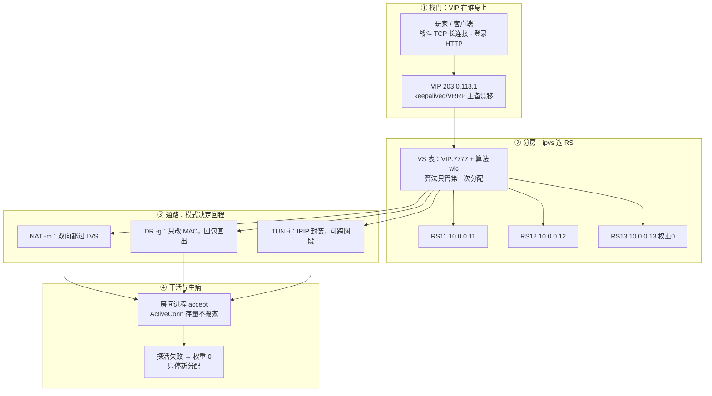
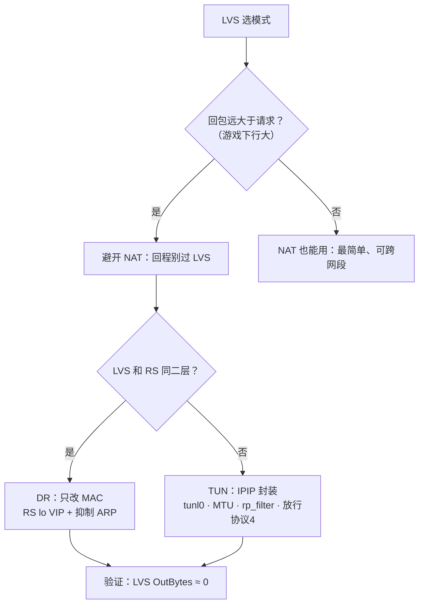
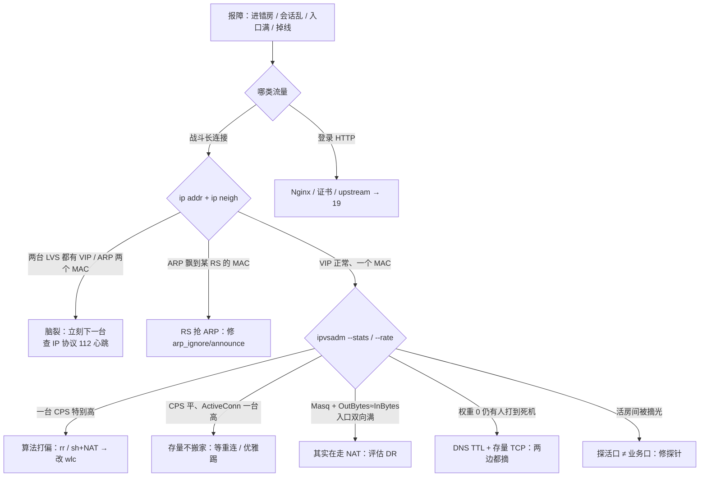

# LVS 与四层负载均衡

> 活动开闸，入口网卡双向打满、玩家进房超时；新人一看 `ipvsadm` 回包列 OutBytes 比 InBytes 还大，喊「加 RS」；另一次半数玩家「进错房、会话乱」——真凶一个是 NAT 回程挤入口，一个是 ARP 里 VIP 两个 MAC。
> **本章回答**：一条战斗连接的一生——VIP 怎么找到、ipvs 怎么分房、NAT/DR/TUN 差在回程、后端生病怎么摘、VIP 漂移断不断存量。
> **不讲**：Keepalived conf/notify → [20](../20-HAProxy与Keepalived/)；Nginx 七层与证书 → [19](../19-Nginx/)；kube-proxy IPVS → [03-08](../../03-Kubernetes/08-Service与kube-proxy/)；conntrack 表本身 → [17](../17-iptables与conntrack/)；脑裂总论 → [33](../33-高可用与容灾/)。

**标记**：🎯重点 · 🔥难点 · ⭐常考 · 🔧实操

---

## 一、一张图：一条战斗连接的一生

> 🎯 **一句话**：玩家连 VIP，ipvs 分房，模式定通路，回程定瓶颈——每一步都能卡死。



- 📖 **读图**
  - 🛤️ 主线四段：**找门**（VIP 漂在哪）→ **分房**（算法只管第一次）→ **通路**（回程过不过 LVS）→ **干活/生病**（存量不搬家、探活只停新分配）
  - ⭐ 分层纪律（练习题 Q1）：**战斗长连接四层直通**（LVS/云 NLB，只认 IP+端口）；**登录/支付 HTTP 可再进七层** Nginx；**公告/包体走 CDN**（[15](../15-DNS与CDN/)）。别为「统一入口」把战斗挂 Nginx
  - 🔭 照妖镜三件：`ipvsadm -L -n`（分到谁、模式、权重）、`--stats/--rate`（流量方向 / CPS）、`ip addr` + `ip neigh`（VIP 在谁身上、几个 MAC）

---

## 二、找门：VIP 与 keepalived ⭐

> 🎯 **一句话**：正常永远只有一台 LVS 持有 VIP；两台都有就是脑裂，立刻下一台。

半数玩家「进错房、会话乱」——真凶往往是 **ARP 里同一个 VIP 对应两个 MAC**。⭐ 双 VIP 比「加 RS」更急（练习题 Q3）。

### 🎭 先认四个角色

- **ipvs** = 内核四层转发模块（**IP Virtual Server**）——规则在内核里跑；**ipvsadm 挂了，正在转的连接通常还在**
- **ipvsadm** = 用户态下规则、看 stats 的工具
- **keepalived** = VIP 主备（VRRP）+ 常兼 RS 健康检查；conf 写法 → [20](../20-HAProxy与Keepalived/)
- **VIP / VS / RS**
  - **VIP（Virtual IP）** = 对外虚拟 IP，客户端永远连它
  - **VS（Virtual Server）** = 一条 `VIP:port + 算法 + 一堆 RS`
  - **RS（Real Server）** = 真正干活的后端

> 🔍 **现场**：玩家「一会儿能登、一会儿进错房」，两台 LVS 同时敲：

```bash
ip addr show | grep 203.0.113.1
#    inet 203.0.113.1/32 scope global lo    ← 这台持有 VIP
ip neigh show | grep 203.0.113.1
#    203.0.113.1 dev eth0 lladdr aa:bb:cc:01:02:03 REACHABLE
#    ↑ ARP 里 VIP 出现两个 MAC = 会话分裂的铁证
```

- 🧭 **判读**
  - 两台 LVS 都有 VIP / VIP 两个 MAC → **脑裂**，立刻下一台
  - VIP 不在任何一台 → keepalived/心跳问题
  - 只有一台有 VIP、一个 MAC → 正常，继续查分房

### 🔀 双 VIP 脑裂 vs RS 抢 ARP 🔥

「会话乱」有两个长得很像的病因，第一刀分清：

| 对比 | 双 VIP（脑裂） | RS 抢 ARP（DR 未抑制） |
|------|----------------|------------------------|
| 发生在哪 | 两台 **LVS** 都持 VIP | **RS** 物理口在答 VIP 的 ARP |
| `ip addr` | 两台 LVS 都有 VIP | LVS 一台有；RS lo 也有 VIP（DR **正常**） |
| `ip neigh` | VIP → **两个 LVS MAC** | VIP → 飘到某台 **RS** 的 MAC |
| 第一刀 | **立刻下一台 LVS** | 修 RS `arp_ignore`/`arp_announce`（四节） |
| 别做 | 先改算法、让玩家重连「试」 | 先加机器 |

#### ❓ 为什么双 VIP 比「加 RS」更急？

- ❌ 误会：会话乱 = 后端不够，先加机器 / 让玩家重连试
- ✅ **ARP 两个 MAC** = 流量一半一台、一半另一台，会话当场分裂——加 RS 治不了入口身份错乱
- 🫀 keepalived 两台**不算 quorum**，只是优先级 + 心跳；心跳一断，备机升主 → 双持 VIP
- 📡 **VRRP 是 IP 协议 112，不是 UDP 端口 112**——防火墙/安全组按**协议号**放行，这是心跳被吞的最常见原因
- 🪜 **处理六步**：两台 `ip addr` → 任意机 `ip neigh` 看 MAC 数 → 双主**立刻下一台**（选流量更乱的）→ 查是否丢了协议 112 → 修心跳、确认 `nopreempt` → 观察；**不要**先改算法 / 先重连试 / 先重启房间
- 🛡️ 防复发：心跳独立链路或单播、`nopreempt`（主恢复不立刻抢回）、监控「同时存在两个 VIP」

### ⚡ VIP 漂移会断存量 🔥

#### ❓ VIP 漂移为什么不是无感？

- ❌ 误会：VIP 漂到备机，存量 TCP 跟着「无感迁过去」
- ✅ 四层**不会** mid-flight 把连接搬到另一台（那是七层终结或应用自己的迁移）
- 💥 漂移瞬间打到旧 MAC 的帧会丢；**NAT 更狠**：conntrack 表在旧机，回包对不上，断得更「齐」
- 👀 旧主 `ActiveConn` 可能仍 >0 但 `ip addr` 已无 VIP；新主有 VIP、新 SYN 开始涨

> ⚠️ **别混**：VIP 漂移 ≠ 完全无感；双 VIP（两台 LVS）≠ RS lo 上有 VIP（DR 设计）。

> 📝 **面试**：「长连接建立后 LB 不会 mid-flight 换 RS；VIP 漂移会断存量，NAT 下 conntrack 在旧机断得更齐。Keepalived 两台不算 quorum，心跳断会双主；出现双主立刻下一台，VRRP 是 IP 协议 112 不是 UDP。」

本节对应练习题 Q3、Q9。VIP 在谁身上知道了——同一个玩家第二次来，还会分到同一台吗？

---

## 三、分房：调度算法只管第一次 ⭐

> 🎯 **一句话**：算法只管第一次把连接分到哪台 RS；建立后不切后端，改算法不搬存量。

> 💡 **打个比方**：ipvs 像餐厅**排位员**——只在你进门那一刻发一次号；落座之后哪怕邻桌全空，也不会连人带菜把你搬到另一桌。

🔥 很多人以为改 `-s` 会把已有连接搬到别的 RS——**错了**。⭐ 面试必考（练习题 Q4）。

| 算法 | 行为 | 何时用 | 坑 |
|------|------|--------|-----|
| **rr** | 严格轮询 | 短连接、规格相同 | **刚加回的机器瞬间被灌满** |
| **wrr** | 加权轮询 | 规格不同 | 同上，只是按比例 |
| **lc / wlc** | 最少连接 / 加权 | **长连接入口常用** | — |
| **sh** | 源 IP 哈希 | 想同 IP 粘同一 RS | **NAT 大出口后同 IP → 扎堆** |
| **dh** | 目的 IP 哈希 | 按目的粘 RS（如缓存层） | 目的侧打偏同样扎堆 |
| **-p persistent** | 持久化模板 | 短连接会话保持 | NAT 出口后同源 IP 同样扎堆 |

- 🧭 **选型口诀**
  - 长连接默认 **lc/wlc**：按当前连接数分，新机器权重正常时自然多接
  - `rr` 在「维护窗口摘机再加回」时会瞬间灌满刚回来的机器
  - `sh` / `-p` 想做「同一玩家粘同一台」时注意：NAT 出口后共享公网 IP → **大出口后面不要用**

#### ❓ 为什么改算法不搬存量？

- ❌ 误会：改 `-s wlc` 之后，满的那台 ActiveConn 会自动匀到闲机器
- ✅ ipvs 把「第一次 SYN 分到哪台」和「这条 TCP 后半辈子」分开——**连接表绑死 RS**，改算法只影响**新 SYN**
- 🧮 一台满两台闲要先分清：CPS 一台特别高 = **新连接打偏**；CPS 平而 ActiveConn 一台高 = **存量**，改算法帮不了

### 🔧 现场：一台满两台闲

> 🔍 **现场**：三台 RS 规格相同权重相同，一台 CPU 打满、两台很闲。有人要改算法重建 VS——先看数据再动手。

```bash
ipvsadm -L -n --rate
```

```text
Prot LocalAddress:Port   CPS   InPPS  OutPPS  InBPS    OutBPS
TCP  203.0.113.1:7777    120   8000   120     12M      18M
  -> 10.0.0.11:7777      95    7200   90      10M      2M    ← CPS 95：新连接全灌这台
  -> 10.0.0.12:7777      12    400    15      800K     8M    ← 另两台 12~13
  -> 10.0.0.13:7777      13    400    15      800K     8M
```

```bash
ipvsadm -E -t 203.0.113.1:7777 -s wlc    # -E 改调度器，不用重建 VS
```

- ⏱️ 改完等 **2～3 分钟**再看 `--rate`：新 CPS 应均匀；**11 号上的 ActiveConn 不会搬家**——要它消，只能等客户端重连、业务主动断、或进程重启

> ⚠️ **别混**：改算法 ≠ 踢存量；权重 `-w` 只影响**新分配**比例，权 0 = 停止新分配（存量仍在，见六节）。

> 📝 **面试**：「长连接入口用 wlc；算法只管第一次分配，改 `-s` 不搬已有 TCP。一台满两台闲先看 `--rate`：CPS 一台特别高是新连接打偏，CPS 平而 ActiveConn 一台高是存量。」

本节对应练习题 Q4。房间分好了——回包到底过不过 LVS？

---

## 四、通路：NAT、DR、TUN 三种模式 ⭐🔥

> 🎯 **一句话**：三模式差在 LVS↔RS 这一段怎么改包、回程过不过 LVS——回程决定瓶颈。

> 💡 **打个比方**：NAT 是**中转仓改地址**——去程改收件人、回程还得回仓改寄件人；DR 是**换门牌直达**——只换楼层门牌，回件直寄客户；TUN 是**套一层信封**——整封信装进新信封寄到 RS，回信也直寄客户。

🔥 新人一看 OutBytes 比 InBytes 还大就喊「加 RS」——**常常错了**：回包也从入口过，入口网卡被回程打满——这是 NAT 的签名。口诀：**「三模式差在回程过不过 LVS」**（练习题 Q1）。

### 📊 三模式对比 ⭐

| 对比 | NAT（`-m`，Masq） | DR（`-g`，Route） | TUN（`-i`，Tunnel） |
|------|-------------------|-------------------|---------------------|
| LVS 改什么 | **改目的 IP**（DNAT），回包再 SNAT | **只改目的 MAC**，IP 仍是 VIP | **IPIP 封装**（外层 RS 真实 IP，内层仍是 VIP） |
| 回程 | **必过 LVS** | **RS 直出客户端** | **RS 直出客户端** |
| 入口瓶颈 | **双向** | 仅入站（OutBytes ≈ 0） | 仅入站 |
| RS 要求 | 网关指 LVS；可跨网段 | **同二层**；lo VIP + 抑制 ARP | tunl0 解包；MTU / rp_filter |
| 场景 | 简单、端口映射 | **同二层最常用** | 跨网段又想直回 |

### 🚶 一条 SYN 在 DR 下的完整走读 🔥

**场景**：玩家 `198.51.100.8` 连 VIP `203.0.113.1:7777`，DR，RS `10.0.0.11~13`，VIP 在各 RS 的 `lo` 上。

```text
① 客户端 SYN → 目的 IP=VIP:7777
② 交换机按 VIP 的 MAC 送到「当前持有 VIP 的 LVS」
        （两台都答 ARP → 脑裂，二节；ARP 飘到某 RS → RS 抢 ARP）
③ LVS ipvs：按算法（wlc）选 RS，比如 10.0.0.11
        DR：只改 目的 MAC → RS11；IP 目的仍是 VIP
④ 同二层帧到达 RS11；本机 lo 上有 VIP → 收下
⑤ RS11 房间进程 accept / read（后续 ESTAB → 13）
⑥ 回包：源 IP=VIP、目的=玩家，从 RS11 直出
        不经过 LVS → LVS --stats 的 OutBytes ≈ 0
⑦ 客户端以为整条会话都在跟 VIP 说话
```

- 📖 **读图**：DR 七步里，**只有 ③⑥ 两步随模式变**——认准这两步，三模式就分清了。

**NAT 走读（③⑥ 都变）**：

```text
③ LVS：选 RS 后改的是 目的 IP（DNAT）
        conntrack 记「VIP:7777 ↔ 10.0.0.12:7777」（→ 17）
        RS 收到：目的=自己、源=玩家 —— IP 头被改过
⑥ 回包：RS 发给默认网关 = LVS
        LVS 查 conntrack 逆写，源 IP 改回 VIP 再发给玩家
        → InBytes 与 OutBytes 都在涨
```

- 📖 **读图**：NAT 的「改回去」全靠 conntrack——**表就长在 LVS 上**，长连接多了会表满（[17](../17-iptables与conntrack/)）；RS 网关必须指 LVS。代价全在 **⑥**：回包挤回同一台机器。

**TUN 走读（只有 ③ 变）**：

```text
③ LVS：原包（目的仍是 VIP）整个塞进外层 IP 包
        外层目的 = RS 真实 IP，外层源 = LVS
        可跨三层；RS 的 tunl0 解封装，内层 VIP 由 lo 认领
⑥ 回包：和 DR 一样用 VIP 直出，不经 LVS
```

- 📖 **读图**：TUN 和 DR 一样**不吃回程**；坑在信封上——MTU 少 ~20 字节、`rp_filter` 严格模式、防火墙要放行 **IPIP（IP 协议 4）**。

#### ❓ 为什么 OutBytes 大了加 RS 治不了？

- ❌ 误会：回包列很大 = 后端不够，加 RS / 加带宽
- ✅ NAT 下回包**必经 LVS**——瓶颈在入口机回程，不在 RS；RS CPU 闲就是铁证
- 📈 游戏下行常大于上行 → OutBytes 可以是 InBytes 的 2～3 倍；**加 RS 治不了根**，要评估改 DR/TUN

### 🔭 stats 怎么认模式 🔧

> 🔍 **现场**：入口双向打满，或怀疑「DR 其实配成了 NAT」：

```bash
ipvsadm -L -n; ipvsadm -L -n --stats
```

```text
# NAT 味道
  -> 10.0.0.12:7777             Masq    5     1200        80
Prot LocalAddress:Port          Conns   InPkts  OutPkts  InBytes  OutBytes
TCP  203.0.113.1:7777           50000   2.1M    2.0M     180G     420G
#                                              ↑ 进出都涨：回包过 LVS

# DR 味道
  -> 10.0.0.11:7777             Route   5     1200        80
TCP  203.0.113.1:7777           50000   2.1M    12K      180G     2G
#                                              ↑ OutBytes ≈ 0：回包直出
```

- 🧭 **判读**：`Masq` + OutBytes≈InBytes = NAT；`Route` + OutBytes≈0 = DR；`Tunnel` = TUN（接着查 tunl0、MTU、rp_filter）

### 🔧 DR 后端必须做的两件事

```bash
# 1) VIP 配在 lo（/32，不要配在对外物理网卡上抢 ARP）
ip addr add 203.0.113.1/32 dev lo

# 2) 抑制 ARP：all 和 lo 都设（落盘 → 24）
net.ipv4.conf.all.arp_ignore = 1
net.ipv4.conf.all.arp_announce = 2
net.ipv4.conf.lo.arp_ignore = 1
net.ipv4.conf.lo.arp_announce = 2
```

#### ❓ 为什么 DR 要把 VIP 配在 lo 还要抑制 ARP？

- 📥 RS 必须认「目的 IP=VIP」的包 → VIP 要在本机某接口上（通常 `lo`）
- 🙊 若不抑制 ARP：物理口会对外宣布「VIP 在我这」→ 和 LVS 抢地址 → 会话全乱
- ✅ `arp_ignore=1`：只在目标 IP 配在**入接口**上才答——VIP 在 lo、问包从物理口进 → 物理口闭嘴
- ✅ `arp_announce=2`：宣告时用更合适的源地址，避免拿 VIP 当源去喊
- ⚠️ 症状像脑裂，但 `ip neigh` 里 MAC 飘到的是 **RS**——对照二节表

### 📌 三个易错钉死 🔥

> ⚠️ **别混**：
> - **DR 抓包源 IP 是 VIP 是设计**，不是「NAT 没改干净」——排障看帧的**源 MAC 是 RS 不是 LVS**；别加 SNAT「修源 IP」
> - **跨网段不能硬 DR**——「改 MAC 送达」只在同二层成立；跨 VLAN/机房改 TUN 或 NAT
> - **TUN 三个额外坑**——封装 ~20 字节（MTU/MSS → [16](../16-网络排障与抓包/)）；`rp_filter` 过严会把「源是 VIP、从物理口出」当伪造；安全组放行 **IPIP（协议 4）**，不只是业务 TCP 口

### 🔧 NAT 入口打满与 NAT→DR 切换

- 🪜 **NAT 入口打满四步**：① `-L -n` 看 `Masq` → ② `--stats` 看 OutBytes≈InBytes → ③ 确认瓶颈是 LVS 不是 RS → ④ 评估改 DR
- 🌙 **低峰 NAT→DR 五步**：

```text
1. 所有 RS 先配好 lo VIP + arp_ignore/arp_announce
2. 验证：二层上只有 LVS 答 VIP 的 ARP
3. ipvsadm 把 RS 从 -m 改成 -g（或重建 VS）
4. --stats 看 LVS OutBytes 应掉下去；业务抽样连通
5. 活动中不做 NAT↔DR——只低峰、走变更窗口
```

### 🧩 收束：三模式一张可背清单 🎯⭐

面试问「怎么选」，答这张——**先回程、再拓扑、后配置**：



- 📖 **读图**：第一问回程（瓶颈在哪），第二问拓扑（DR 还是 TUN），验证统一看 `--stats` 出站——入站涨、出站几乎没有，DR 才算配对。NAT 不是错，是**回包大 + 双向挤入口**的场景错。

> ⚠️ **别混**：模式配对**不保证**万事大吉——DR 忘 ARP 抑制照样会话乱、TUN 忘协议 4 直接不通、NAT 下 conntrack 表满新连接挂（[17](../17-iptables与conntrack/)）。

> 📝 **面试**：「三模式差在回程过不过 LVS。同二层战斗入口选 DR：只改 MAC，回包 RS 用 VIP 直出；NAT 双向过 LVS，状态同步回包大先打满入口，加 RS 治不了根；跨网段要直回就 TUN。」

本节对应练习题 Q1、Q2、Q11、Q12。模式选对了——`ipvsadm` 进程挂了玩家会立刻掉吗？

---

## 五、干活：连接表与存量 ⭐

> 🎯 **一句话**：连接建立后绑死在 RS 上——存量不搬家，改算法、改权重、摘机都只动新连接。

### 📖 ipvsadm -L -n 怎么读 🔧

```bash
ipvsadm -L -n
```

```text
TCP  203.0.113.1:7777 wlc
  -> 10.0.0.11:7777             Route   5     1200        80
  -> 10.0.0.12:7777             Route   5     1180        75
  -> 10.0.0.13:7777             Route   0        0         0
```

- 🔑 **每列**
  - 第一行 = VS（VIP:port + 算法）
  - `Route/Masq/Tunnel` = 模式
  - 权重列 `5`/`0` = 新分配比例（**权 0 = 不再分新连接，行还在、存量还在**）
  - `ActiveConn` = 当前活跃连接（**存量**）
  - `InActConn` = 非活跃（辅助，别当唯一依据）

### ⚖️ 权重 0、-d 和存量 🔥

| 状态 | ipvsadm 里 | 存量 TCP | 新连接 |
|------|-----------|----------|--------|
| 权重 0（`-w 0`） | 行还在，权重列 0 | **仍在 RS 上** | 不再分配 |
| 从表删除（`-d`） | 无此行 | **仍在 RS 上** | 不再分配 |

#### ❓ 为什么权 0 / `-d` 不断存量？

- ❌ 误会：权重变 0 或 `-d` = 玩家全踢干净
- ✅ 四层**不会** mid-flight 搬 TCP——存量要消只有三条路：自己断、超时、进程没了
- 👀 验证到 **RS** 上看：`ss -ant | grep ':7777' | wc -l` 仍有几百条 = 存量还挂着

### 🪜 四层 vs 七层（值班怎么选）⭐

| 对比 | 四层（LVS/云 NLB） | 七层（[19](../19-Nginx/)） |
|------|-------------------|---------------------------|
| 看什么 | IP + 端口、五元组 | URL / Header / Host / Cookie |
| 适合 | 战斗长连接、高并发直通 | 登录、支付、按路径灰度 |
| 容量感 | 内核转发，量级高 | 解析+缓冲，差一个数量级常见 |
| 用户态挂了 | ipvsadm 挂，转发常仍在 | 进程挂，连接常断 |

- 🔥 长连接塞七层：超时、缓冲、连接重建会变成事故源——**不是**「Nginx 也能 stream 所以就统一入口」
- 灰度做在登录的七层，不要牺牲战斗口；证书/Host → [14](../14-HTTP与TLS/)、[19](../19-Nginx/)

> ⚠️ **别混**：`ipvsadm` 挂了 ≠ 玩家立刻掉——规则在内核；大面积掉线先查 VIP（没了/双了）。**VRRP 通 ≠ 房间进程活着**——还要探活和 `ss`。

> 📝 **面试**：「战斗长连接走 LVS 四层直通，登录 HTTP 可以四层后再进 Nginx；ipvsadm 挂不会立刻踢玩家，双 VIP 才要立刻下一台。」

本节对应练习题 Q6、Q10。探活失败摘掉一台，存量还在吗？

---

## 六、生病：探活摘除与误摘 🔥

> 🎯 **一句话**：探活摘的是新分配；存量 TCP 和 DNS TTL 内的流量不归探活管。

> 💡 **打个比方**：健康检查像餐厅**关掉取号机**——新客不再发号到那桌，已经坐着的客人不会被赶走。想立刻清场，只能服务员（进程）下班。

口诀：**「权 0 停新不断旧」**（练习题 Q5）。

### 🩺 探活失败之后发生什么


- 📖 **读图**：摘除只有一个效果——**停新分配**。若探活已摘、玩家仍「卡在 11」：RS 上 `ss` 数存量，同时 `dig +short fight.example.com` 看解析是否仍指旧 VIP。

#### ❓ 为什么探活摘了还有人打到死机？

- 🧩 **摘流量公式**（三件证据链要对齐）：

```text
摘流量 = ipvs 摘后端（权 0 / -d）
       + （如有）DNS / VIP 级摘
存量 TCP 还在旧后端，直到自己断、超时或进程没了
```

- ❌ 只改 DNS 不摘 ipvs：新解析用户仍打同一 VIP，LVS 还可能分到坏后端
- ❌ 只摘 ipvs 不动 DNS：TTL 内解析仍指旧入口
- ✅ **两边都要摘**（TTL 纪律 → [15](../15-DNS与CDN/)）
- 一例钉死：权重 0 + `dig` 仍旧 VIP + TTL 3600，三样都对上才是完整证据链

### 🧪 探针层级与误摘 🔥

| 层 | 例子 | 假活 / 误摘 |
|----|------|-------------|
| 进程 | `killall -0` | 进程在但不 accept |
| TCP | `TCP_CHECK` 连业务端口 | 端口开着、逻辑已死 |
| HTTP | `HTTP_GET /health` → 200 | 静态 200、房间已挂 |
| 外部脚本 | `MISC_CHECK` | **探活打 8080、战斗口 7777 → 活房间被误摘光** |

- 📋 **生产纪律四条**
  - 探针打**业务端口**（或业务 `/health`）
  - 连续失败 **3～5 次**再摘、间隔 **1～5s**——失败一次就切会在活动里抖动
  - 摘机走**先权 0、观察、再 `-d`**
  - 怀疑误摘自检：探活口是 7777 还是 8080、`/health` 是否静态 200、连续失败是否=1、`dig` 是否还指旧 IP、权重是否已 0

### ☁️ 云 NLB 侧 🔧

云上多数用 NLB 就够，但三件事仍是你的：

- 健康检查端口/路径（目标组 healthy，别只看实例 running）
- **空闲超时必须 ≥ 游戏心跳间隔**，否则云侧无故断（心跳 → [13](../13-TCP与UDP/)）
- 后端安全组/ARP（云网络 → [06-01](../../06-云平台/01-云网络与安全/)）

kube-proxy 的 IPVS 模式同属这章机制（→ [03-08](../../03-Kubernetes/08-Service与kube-proxy/)）。

> 📝 **面试**：「健康检查失败只停新分配；权重 0 后存量还在，要配合 DNS TTL 才算摘干净。探针必须打业务端口，连续失败 3～5 次再摘。云 NLB 空闲超时要 ≥ 心跳。」

本节对应练习题 Q5。加机、摘机、换模式怎么落地才不砸活动？

---

## 七、落地：加机、摘机与升级 🔧

> 🎯 **一句话**：加机先配 RS 侧再入表、摘机先权 0 再 -d，活动中不切模式。

### 🏗️ 建表与选型

```bash
ipvsadm -A -t 203.0.113.1:80 -s wlc                       # 建 VS，算法 wlc
ipvsadm -a -t 203.0.113.1:80 -r 10.0.0.1:80 -g -w 5      # -g = DR，权重 5
ipvsadm -a -t 203.0.113.1:80 -r 10.0.0.2:80 -g -w 3      # 规格低给 3
```

- 🧭 **选型口径**
  - 长连接入口 = 云 NLB 或自建 LVS+**DR**（同二层）/**TUN**（跨网段）
  - 算法 lc/wlc，不用默认 rr
  - HA = 两台 LVS + keepalived（心跳独立、nopreempt、监控双 VIP）
  - RS = lo VIP + 抑制 ARP + 探活打业务口
- ✅ **验收不是「进程在」**：`--stats` 入站在涨、权重符合预期、DR 下出站≈0、RS `lo` 有 VIP、**二层上只有 LVS 答 VIP 的 ARP**

### ➕ 加一台 RS（DR）五步

```bash
# 1) 新 RS 上：lo VIP + ARP 抑制
ip addr add 203.0.113.1/32 dev lo
sysctl -w net.ipv4.conf.all.arp_ignore=1
sysctl -w net.ipv4.conf.all.arp_announce=2
# 2) 确认业务口在听
ss -lnt | grep 7777
# 3) LVS 上：先低权重入表
ipvsadm -a -t 203.0.113.1:7777 -r 10.0.0.14:7777 -g -w 1
# 4) 看 stats/rate 确认有流量、观察正常
ipvsadm -L -n --rate | grep 10.0.0.14
# 5) 再提权重到与同伴一致；探活脚本覆盖新机器
```

### ➖ 摘一台（维护窗口）

```bash
ipvsadm -e -t 203.0.113.1:7777 -r 10.0.0.14:7777 -g -w 0   # 先权 0：停新分配
# 等 ActiveConn 自己消 / 业务侧优雅踢
ipvsadm -d -t 203.0.113.1:7777 -r 10.0.0.14:7777           # 再删行
```

直接 `-d` 只停新分配、存量仍在，且表项没了更难看清——**先权 0 再删**是纪律。高峰别用 rr 猛灌刚加回的机器：用 wlc 或先低权重观察。

### 🔄 VIP 切换、升级、回滚、迁移

- **VIP 切换**：主挂 → VRRP 漂移。切完验证：只有一台有 VIP、ARP 一个 MAC、`ipvsadm` 规则在新主上。双主按二节六步处理
- **升级滚动**：先把 VIP 赶到另一台或逐台权 0 → 升备验证 → 再切升原主；**不要两台同时换内核模块**；RS 逐台权 0 再升
- **回滚**：`ipvsadm`/keepalived.conf 回上一份 reload；VIP 已在备上且正常，**不要为「主必须是原机」再抢一次**；模式改错要**同时回滚 RS 侧**网关/ARP
- **迁移**：换 LVS 先备后切；NAT→DR 低峰按四节五步；跨网段不硬 DR；上云 NLB 对齐健康检查与空闲超时；**活动中不做**

> ⚠️ **别混**：**不要只 `ping VIP` 当验收**——ICMP 通 ≠ TCP 战斗口能建连；探活、`curl` 业务口、`--stats` 才是证据。keepalived 影响面本章到行为为止，conf → [20](../20-HAProxy与Keepalived/)。

本节对应练习题 Q7。现在再看群里那句「加 RS」——60 秒怎么定责？

---

## 八、作战：定责

> 🎯 **一句话**：三问定责——VIP 在不在？新连接能不能分？长连接通不通？



- 📖 **读图**：按流量类型分叉——战斗口三问：VIP 层（脑裂/抢 ARP）→ 分配层（算法/存量）→ 通路层（NAT 回程/探活误摘）。**ipvsadm 用户态挂了 ≠ 立刻踢玩家**——先看 VIP 和规则还在不在。

### 现象 · 先做 · 别做

| 现象 | 先做 | 别做 |
|------|------|------|
| 两台都有 VIP、ARP 两个 MAC | 立刻下一台，查 VRRP（IP 协议 112） | 让玩家重连试；先改算法 |
| DR 会话乱 | RS lo VIP 是否抑制 ARP | 先加机器 |
| 入口网卡双向满 | `--stats` 确认 Masq/OutBytes；评估 DR | 只加带宽 |
| 一台满两台闲 | `--rate` 看 CPS 打偏还是 ActiveConn 存量 | 改完算法指望旧连接搬家 |
| 探活已摘仍有人打到死机器 | DNS TTL + 存量 TCP；两边都摘 | 只改 DNS 不摘 ipvs |
| 健康检查把活房间摘了 | 探活端口是否等于业务端口 | 关掉健康检查当修复 |
| DR 抓包源 IP 是 VIP | **这是设计**，看源 MAC 是 RS | 当 NAT 没改干净去加 SNAT |
| 云 NLB 空闲掉线 | 空闲超时 vs 游戏心跳 | 先重启房间进程 |
| ipvsadm 进程没了 | 看 VIP/规则是否还在（内核在转） | 立刻重启所有房间 |
| 活动高峰入口事故 | 确认 VIP 唯一 → 停发版 → stats 看模式和打偏 | 把战斗切到 Nginx 顶 |

### 60 秒剧本 🔧

> 🔍 **现场**：接到「进错房 / 掉线 / 入口满」报障，60 秒走完再下结论。

```text
① 0–10s   两台 LVS：ip addr | grep VIP；任意机 ip neigh | grep VIP
          —— 双 VIP / 两个 MAC 当场现形（脑裂 → 立刻下一台）
② 10–30s  LVS：ipvsadm -L -n；ipvsadm -L -n --stats
          —— 模式（Masq/Route）· 回程方向（OutBytes）· 权重 0
③ 30–45s  ipvsadm -L -n --rate
          —— CPS 打偏 vs ActiveConn 存量
④ 45–60s  RS：ip addr show lo；sysctl arp_ignore/arp_announce；ss -ant | grep :7777 | wc -l
          —— DR 后端两件事 + 存量验证；还不清 → 抓包看回程 → 16
```

本节对应练习题 Q8、Q13、Q14。开头那两个现场——NAT 打满入口、ARP 两个 MAC——你已经知道该怎么拦住他了。

---

## 九、收口

### 命令速查 🔧

```bash
ipvsadm -L -n                      # VS/RS/模式/权重/ActiveConn
ipvsadm -L -n --stats              # 累计流量：认 Masq/Route、回程方向
ipvsadm -L -n --rate               # 实时速率：CPS 打偏 vs 存量
ipvsadm -E -t VIP:port -s wlc     # 改调度器（只影响新连接）
ipvsadm -e -t VIP:port -r RS:port -g -w 0    # 摘机先权 0
ipvsadm -d -t VIP:port -r RS:port            # 再删行
ip addr show                        # VIP 在谁身上（两台都敲）
ip neigh show | grep <VIP>          # VIP 几个 MAC、飘到谁
# RS 上
ip addr show lo                     # DR 的 VIP 在不在
sysctl net.ipv4.conf.all.arp_ignore net.ipv4.conf.all.arp_announce
ss -ant | grep ':7777' | wc -l      # 存量连接在不在
lsmod | grep ip_vs                  # 内核模块
conntrack -C                        # NAT 旧机表 → 17
```

### 面试锚点

| 问 | 30 秒答 |
|----|---------|
| 战斗长连接走四层还是七层？ | 四层直通；登录可再进七层；长连接别塞 Nginx。 |
| NAT/DR/TUN 差在哪？ | 回程过不过 LVS；DR 只改 MAC 回包直出；NAT 双向；TUN IPIP 跨网段。 |
| 游戏默认哪个模式？ | 同二层 DR；跨网段 TUN。 |
| 为什么 DR 要抑制 ARP？ | 否则 RS 抢 VIP 的 ARP；arp_ignore=1、arp_announce=2。 |
| DR 源 IP 是 VIP 坏了吗？ | 设计如此，看源 MAC；别加 SNAT。 |
| 跨网段能 DR 吗？ | 不能；改 TUN 或 NAT。 |
| 长连接用什么算法？ | lc/wlc；rr 会把刚加回的机器瞬间灌满。 |
| sh 在 NAT 后会怎样？ | 出口 IP 相同 → 全哈希到同一 RS；-p 同理。 |
| 改算法搬存量吗？ | 不搬；只影响新 SYN。 |
| 健康检查会踢存量吗？ | 不会，只停新分配；配 DNS TTL 才摘干净。 |
| 权重 0 和 -d 差在哪？ | 权 0 行还在；-d 表项没了；两者存量都还在。 |
| ipvsadm 挂了玩家立刻掉？ | 通常不会，规则在内核；VIP 没了/双了才大面积乱。 |
| VIP 漂移无感吗？ | 否，断存量；NAT 下 conntrack 在旧机断得更齐。 |
| VRRP 是 UDP 112 吗？ | 否，IP 协议 112。 |
| 双 VIP 和 RS 抢 ARP 怎么分？ | `ip addr` 两台 LVS 都有 = 脑裂；`ip neigh` MAC 飘到 RS = 修 ARP 抑制。 |
| 云 NLB 还要懂这些吗？ | 要：健康检查端口、空闲超时≥心跳、后端 ARP 仍是你的。 |

### 易错一句话对照

- 战斗挂 Nginx 统一入口 → 四层直通，灰度别牺牲长连接
- DR 最常用因为配置简单 → 因为回包直出；前提同二层 + 抑制 ARP
- NAT 适合游戏大回包 → 双向过 LVS，入口先满，加 RS 治不了根
- TUN 也要求同二层 → IPIP 可跨网段，坑是 MTU/rp_filter/协议 4
- DR 源 IP 是 VIP 要 SNAT 修 → 设计如此，加了会话更乱
- 健康检查失败会踢存量 → 只停新分配
- 改算法旧连接就均衡了 → 存量不搬家
- 只改 DNS 就摘干净 → 还要 ipvs 摘，TTL 内仍有人打
- 摘机直接 -d 最干净 → 先权 0 观察，表项留着好排查
- 探针打管理口就行 → 探活口必须=业务口，否则误摘活房间
- ipvsadm 挂了玩家全掉 → 规则在内核，通常还在转
- VIP 漂移完全无感 → 断存量，NAT 更齐
- VRRP 是 UDP 112 → 是 IP 协议 112
- ping 通 VIP 就是验收 → ICMP 和业务 TCP 不是一个规则
- keepalived 在就能打 → VRRP 通 ≠ 房间进程活着
- 上云就不用懂 ARP → 健康检查、超时、后端仍是你的

### 数字墙

> VIP 示例 **203.0.113.1** · `-g` DR / `-m` NAT / `-i` TUN · DR 抑制 **arp_ignore=1、arp_announce=2**（all 和 lo 都设） · 探活连续失败 **3~5 次**、间隔 **1~5s** · VRRP 是 **IP 协议 112** · 权重示例 **5 和 3**、新 RS 先 **-w 1** · 改算法后观察 **2~3 分钟** · TUN 封装 **~20 字节** · 云 NLB 空闲超时 **≥ 游戏心跳** · DR 验收 = OutBytes **≈ 0**

---

## 合上书

- [ ] **默画一节的图**：找门 → 分房 → 通路 → 干活/生病；战斗直通四层、登录可进七层、公告走 CDN。
- [ ] **口述找门**：四个角色、双 VIP vs RS 抢 ARP、脑裂六步、VRRP 是 IP 协议 112、漂移断存量。
- [ ] **口述分房**：算法只管第一次、rr/wlc/sh 各自的坑、`--rate` 用 CPS 还是 ActiveConn 分、改 `-s` 不搬存量。
- [ ] **默画四节走读**：同一条 SYN 在 DR 下七步；NAT / TUN 各差在哪两步。
- [ ] **口述通路**：三模式对比、stats 认 Masq/Route、DR 后端两件事、TUN 三个坑、NAT→DR 低峰五步。
- [ ] **口述干活**：`ipvsadm -L -n` 每列、权重 0 与 `-d`、四层 vs 七层、ipvsadm 挂了断不断。
- [ ] **一例钉死误摘**：权重 0 + dig 仍旧 VIP + TTL 3600、摘流量公式、探针层级、云 NLB 空闲超时。
- [ ] **口述落地**：加机五步、摘机先权 0 再 `-d`、升级怎么滚、活动中不做 NAT↔DR、不要只 ping VIP。
- [ ] **定责**：三问决策树、60 秒剧本、每个现象的「先做/别做」。
- [ ] **边界**：心跳/窗口 → [13](../13-TCP与UDP/)；conntrack → [17](../17-iptables与conntrack/)；DNS TTL → [15](../15-DNS与CDN/)；抓包/MTU → [16](../16-网络排障与抓包/)；Nginx → [19](../19-Nginx/)；Keepalived conf → [20](../20-HAProxy与Keepalived/)；脑裂总论 → [33](../33-高可用与容灾/)；kube-proxy IPVS → [03-08](../../03-Kubernetes/08-Service与kube-proxy/)。

下一章进入七层：[Nginx](../19-Nginx/)。四层转发回看 [17](../17-iptables与conntrack/)；高可用总论在 [33](../33-高可用与容灾/)。
