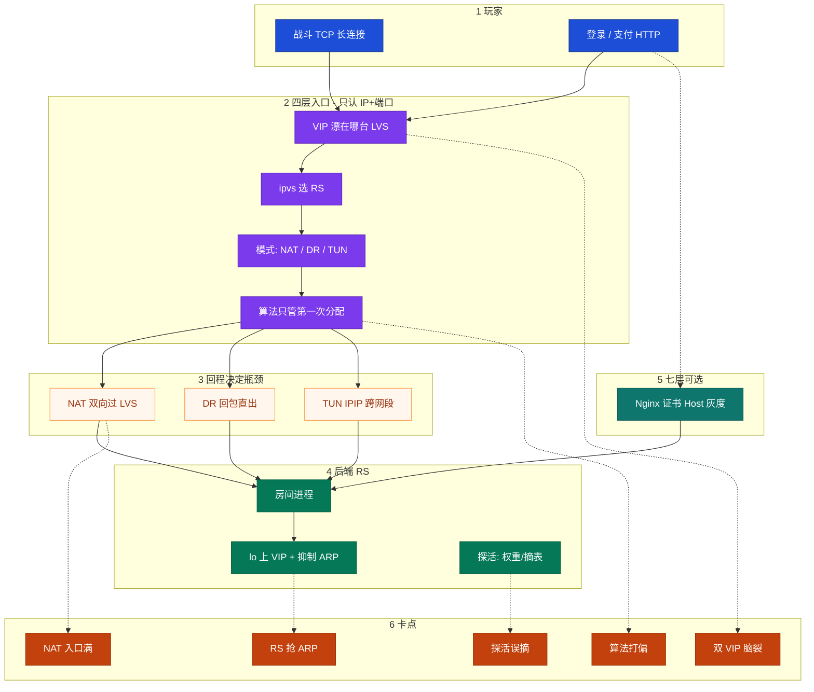
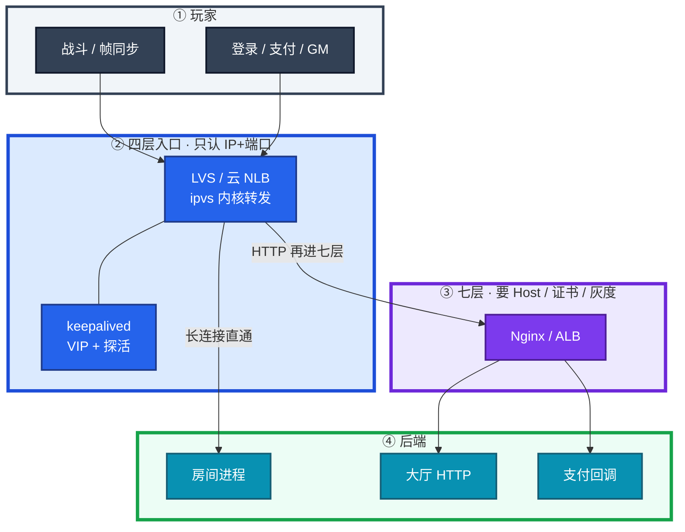
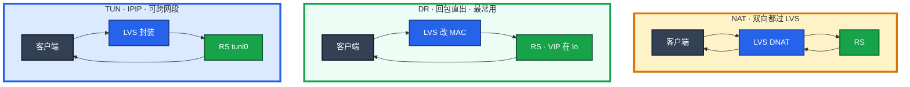
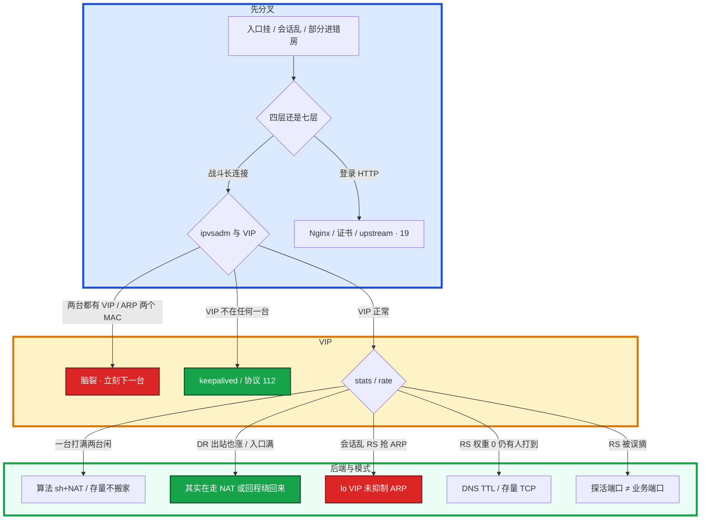

# LVS 与四层负载均衡

> **这章解决什么**：活动入口打满、部分玩家进错房、双 VIP、探活误摘、NAT 回包把网卡打爆——卡在**四层转发 / 模式 / VIP** 还是七层？  
> **读法**：**先看总图** → **再走读一次 SYN** → **再认名词** → **再抠 NAT/DR/TUN 与 VIP**。  
> **刻意不展开**：Keepalived conf / notify → [20](../20-HAProxy与Keepalived/)；Nginx 七层、证书 → [19](../19-Nginx/)；kube-proxy IPVS → [03-08](../../03-Kubernetes/08-Service与kube-proxy/)；脑裂总论 → [26](../26-高可用与容灾/)；DNS TTL → [15](../15-DNS与CDN/)。

---

## 本章目录

1. [本章定位](#1-本章定位)
2. [先看总图：四层入口怎么分流](#2-先看总图四层入口怎么分流) ← **开篇必读**
   - [2.0 全章知识串图](#20-全章知识串图一张把细节串起来) ← **架构总览**
   - [2.1 分层总图](#21-分层总图战斗直通--登录再进七层)
   - [2.2 三种模式回程](#22-三种模式回程nat--dr--tun)
   - [2.3 完整走读（DR）](#23-完整走读一条战斗-syn从玩家到房间)
   - [2.4 NAT 对照走读](#24-对照走读同一条-syn-在-nat-下) · [2.5 TUN](#25-对照走读同一条-syn-在-tun-下)
3. [名词扫盲（对照总图认词）](#3-名词扫盲对照总图认词)
4. [核心对象：VS / RS / VIP / 连接绑定](#4-核心对象vs--rs--vip--连接绑定)
5. [NAT / DR / TUN：本章最易混](#5-nat--dr--tun本章最易混) ← **重点精读**
6. [调度算法与长连接](#6-调度算法与长连接)
7. [RS 健康检查：摘的是新分配](#7-rs-健康检查摘的是新分配)
8. [VIP 与脑裂](#8-vip-与脑裂)
9. [落地与配置旋钮](#9-落地与配置旋钮)
10. [定责决策树与命令速查](#10-定责决策树与命令速查)
11. [去哪章继续学](#11-去哪章继续学)
12. [面试 · 易错 · 数字](#12-面试--易错--数字)
13. [合上书](#合上书)

---

## 1. 本章定位

| 章 | 负责 |
|----|------|
| **12** | 包怎么进主机、Socket/队列、本机「满」 |
| **13** | TCP 握手后慢/断/卡（窗口、重传） |
| **17** | iptables / conntrack 表与链 |
| **18（本章）** | **四层 LB**：NAT/DR/TUN、VIP、探活摘机、会话打偏 |
| **19 / 20** | 七层 Nginx；Keepalived 配置细节 |

本章是**入口四层主场**。12 告诉你「连没连上」；本章告诉你「连上了分到哪台、回程过不过 LVS、VIP 漂了会怎样」。

🎯 **值班签名**：战斗口会话乱 / 入口网卡双向满 / `ip neigh` 里 VIP 两个 MAC——先想本章，**别先把房间挂到 Nginx**。

**本章主线（排障就按这三步想）：**

1. **分层**：战斗长连接走四层直通；登录 HTTP 可再进七层。
2. **选模式**：同二层用 DR + 抑制 ARP；回包大别用 NAT。
3. **探活摘机**：只停新分配；双 VIP 先下一台。

**读完你能：** 默画 §2.0；白板上画出 NAT/DR/TUN 回程；会加/摘 RS、健康检查、VIP 切换；会话乱能分清双主、后端抢 VIP、算法打偏。

---

## 2. 先看总图：四层入口怎么分流

> **正确开篇顺序**：先有全局画面，再走读一条 SYN，再认词，再抠三种模式。  
> 先看 **§2.0 全章串图**，再看 **§2.1 分层**，再用 **§2.3 走读**把一次进房串起来。

### 2.0 全章知识串图（一张把细节串起来）

> 🎯 **合上书要能默画这张。** 蓝=玩家入口 · 紫=四层 · 绿=后端 · 橙=卡点。  
> 若预览仍报错，以下面 **ASCII 一页板** 为准。



**读图路线：**

| 段 | 记住 |
|----|------|
| ①→② | 战斗直通四层；登录可再进七层（§2.1） |
| ② | VIP 在谁身上 → ipvs 选 RS → 模式决定回程（§2.2、§5） |
| ③ | NAT 双向；DR 只改 MAC；TUN 封装跨段（§5） |
| ④ | lo VIP + ARP；探活只停新分配（§7） |
| ⑥ | 双 VIP / 抢 ARP / 入口满 / 误摘 / 打偏 → 定责树（§10） |

```text
┌──────────────────────────────────────────────────────────────────────────┐
│                     16 一张板：从 VIP 到 RS 到定责                          │
├─────────────┬────────────────────┬───────────────────────────────────────┤
│  Client     │  四层 LVS          │  RS                                   │
│  战斗 TCP   │  VIP + ipvs 选机   │  房间进程                              │
│  登录 HTTP  │  -g DR / -m NAT    │  lo:VIP + arp_ignore=1                │
│             │  -i TUN            │  探活 → 权 0 / -d（只停新连接）        │
├─────────────┴────────────────────┴───────────────────────────────────────┤
│  回程：NAT 过 LVS · DR/TUN 直回客户端                                      │
│  卡点：双 VIP · RS 抢 ARP · NAT 入口满 · 探活误摘 · 算法打偏 → 定责树      │
└──────────────────────────────────────────────────────────────────────────┘
```

---

### 2.1 分层总图（战斗直通 · 登录再进七层）

先把「该不该进 Nginx」钉死。后面排障都对着这张分层。



**读图三句话：**

1. **战斗长连接：玩家 → 四层 LB → 房间进程，不再进七层。**
2. **登录 / 支付：可以先过四层入口，再进 Nginx 做 Host、证书、灰度。**
3. **公告 / 包体走 CDN（10），不是 LVS。**

> **记住**：四层转发会话，七层理解请求。长连接没有「请求结束」，不要为了「统一入口」把战斗挂到 Nginx。

---

### 2.2 三种模式回程（NAT / DR / TUN）

装的时候选，挂的时候瓶颈不一样。细节钉死在 **§5**。



| 模式 | 入站 | 回程 | 一句话 |
|------|------|------|--------|
| **NAT** | 过 LVS | **再过 LVS** | 双向瓶颈，回包大先满入口 |
| **DR** | 过 LVS（改 MAC） | **RS 直回客户端** | 同二层 + 抑制 ARP |
| **TUN** | 过 LVS（IPIP） | **RS 直回客户端** | 跨网段又想直回 |

---

### 2.3 完整走读：一条战斗 SYN 从玩家到房间

**场景**：玩家 `198.51.100.8` 连战斗 VIP `203.0.113.1:7777`，LVS 用 **DR**，三台 RS `10.0.0.11~13`，VIP 配在各 RS 的 `lo` 上。

```text
① 客户端 SYN → 目的 IP=VIP:7777
        │
        ▼
② 交换机按 VIP 的 MAC 送到「当前持有 VIP 的 LVS」
        │  （若两台都答 ARP → 脑裂，见 §8）
        ▼
③ LVS ipvs：按算法（如 wlc）选 RS，比如 10.0.0.11
        │  DR：只改 目的 MAC → RS11；IP 目的仍是 VIP
        ▼
④ 同二层帧到达 RS11 物理网卡
        │  RS 看目的 IP=VIP，本机 lo 上有 VIP → 收下
        ▼
⑤ RS11 上房间进程 accept / read（后续 ESTAB 见 21/13）
        │
        ▼
⑥ 回包：源 IP=VIP，目的=玩家，从 RS11 直出
        │  不经过 LVS → 所以 LVS OutBytes ≈ 0
        ▼
⑦ 客户端以为整条会话都在跟 VIP 说话
```

**现场第一刀（对照走读）：**

```bash
# 在 LVS
ipvsadm -L -n
ip addr show | grep 203.0.113.1
ipvsadm -L -n --stats

# 在 RS
ip addr show lo
sysctl net.ipv4.conf.all.arp_ignore net.ipv4.conf.all.arp_announce
```

| 走到哪挂了 | 你多半看到 | 下一刀 |
|------------|------------|--------|
| ①→② VIP 无人答 | LVS 上没有 VIP | keepalived / §8 |
| ② 两个 MAC | `ip neigh` 两台 | **立刻下一台** |
| ③ 无 RS / 权 0 | `ipvsadm` 空或全 0 | 探活 / 表 |
| ④ RS 不收 | lo 无 VIP 或 ARP 乱 | §5.3 |
| ⑥ 回包绕回 LVS | stats OutBytes≈InBytes | 其实在走 NAT |

NAT 走读差在哪：**③ 改的是目的 IP（DNAT）**；**⑥ 回包必须再过 LVS 做 SNAT 逆写**——入口双向流量。TUN：③ 外包一层 IPIP 到 RS，RS `tunl0` 解包后同样直回。

### 2.4 对照走读：同一条 SYN 在 NAT 下

把 §2.3 的 VIP/端口不变，模式改成 **NAT（`-m`）**，只看差在哪几步：

```text
① 客户端 SYN → VIP:7777（同上）
② 帧到持有 VIP 的 LVS（同上）
③ LVS：DNAT —— 目的 IP 改成 RS 真实 IP（如 10.0.0.11:7777）
        │  内核 conntrack 记一张「原 VIP ↔ 内网 RS」的表
        ▼
④ 包按路由到 RS11；RS 看到目的是自己真实 IP，不需要 lo 上的 VIP
⑤ 房间进程处理（同上）
⑥ 回包：目的=玩家，源=RS 真实 IP
        │  必须再回到 LVS（RS 默认网关常指向 LVS）
        │  LVS 按 conntrack 逆写：源改回 VIP
        ▼
⑦ 客户端仍以为在跟 VIP 说话 —— 但 LVS 上 InBytes 与 OutBytes 都涨
```

| 和 DR 的差 | NAT | DR |
|------------|-----|-----|
| ③ 改什么 | 目的 **IP** | 目的 **MAC** |
| RS 要不要 lo VIP | 通常不要 | **要** |
| ⑥ 回程 | **必过 LVS** | 直出 |
| 入口瓶颈 | 双向 | 主要入站 |
| VIP 漂移时 | 旧机 conntrack 对不上，断得更「齐」 | 也断，但机制是 MAC/VIP 离开 |

### 2.5 对照走读：同一条 SYN 在 TUN 下

跨 VLAN / 跨机房，又想回程直出时用 **TUN（`-i`）**：

```text
①② 同上到 LVS
③ LVS：把原包塞进 IPIP 外层
        外层目的 = RS 真实 IP；内层目的仍是 VIP
        ▼
④ 包可跨三层路由到 RS；RS tunl0 解封装，看到内层 VIP
⑤ RS 本机仍要有 VIP（常在 tunl0/lo）才能认领内层
⑥ 回包：源=VIP，直出到客户端（不过 LVS）
```

| 注意点 | 说明 |
|--------|------|
| MTU | 外层多 ~20 字节；不分片就要调小 MTU / MSS（深排 → 16） |
| `rp_filter` | 过严会把「源是 VIP、从物理口出」的回包当伪造丢掉 |
| 安全组 | 要放行 IPIP（IP 协议 4），不只是业务 TCP 口 |

> **记住**：三种模式客户端侧都「只认 VIP」；差在 LVS↔RS 这一段怎么改包、回程过不过入口。

---

## 3. 名词扫盲（对照总图认词）

对照 §2.0：先对「值班里什么时候碰到」，再对定义。

| 你听到的 | 多半是什么 | 第一刀 | 详见 |
|----------|------------|--------|------|
| 「入口网卡双向打满」 | 多半在走 **NAT**，回包过 LVS | `ipvsadm -L -n` 看 Masq | §5 |
| 「部分进 A 房、部分直连某 RS」 | **双 VIP** 或 **RS 抢 ARP** | `ip addr` + `ip neigh` | §8 |
| 「探活已摘还有人卡在死房」 | 只停新分配 + DNS TTL | 权重/`-d` + dig | §7 |
| 「一台满两台闲」 | 算法打偏或**存量**不搬家 | `--rate` + ActiveConn | §6 |
| 「要把战斗挂 Nginx 统一入口」 | **分层错了** | 拉回四层 | §2.1 |
| 「ipvsadm 挂了玩家全掉」 | 通常**不会立刻断** | 看 VIP/规则还在不在 | §4 |
| 「DR 抓包源 IP 是 VIP」 | **设计如此**，不是 NAT 残留 | 看 MAC，别只看 IP | §5 |
| 「跨 VLAN 也能 DR」 | **不能**；改 TUN/NAT | 拓扑 | §5 |

### 必会名词（短定义）

| 名词 | 一句话 |
|------|--------|
| **LVS / ipvs** | 内核四层负载均衡；看 IP+端口，不解析 HTTP |
| **ipvsadm** | 用户态下规则、看 stats；它挂 ≠ 正在转的连接立刻断 |
| **keepalived** | 常兼 VIP（VRRP）+ RS 探活；conf 细节在 20 |
| **VIP** | 对外虚拟 IP；客户端永远连它 |
| **VS（Virtual Server）** | 一条 `VIP:port` + 算法 + 一堆 RS |
| **RS（Real Server）** | 真正干活的后端机器/进程 |
| **DR / NAT / TUN** | 三种转发模式；差在**回程过不过 LVS** |
| **调度算法** | 只管**第一次**把连接分到哪台 RS |
| **权重 `-w`** | 新分配比例；权 0 = 不再分新连接 |
| **ActiveConn** | 当前活跃连接数（存量），不随改算法搬家 |
| **arp_ignore / arp_announce** | DR 下 RS 抑制「我有 VIP」的 ARP 宣告 |
| **VRRP** | VIP 主备协议；是 **IP 协议 112**，不是 UDP 112 |

三个角色不要混：

| 角色 | 干什么 |
|------|--------|
| **ipvs** | 内核转发。规则在，进程挂了正在转的连接通常还在 |
| **ipvsadm** | 用户态下规则、看 stats |
| **keepalived** | VIP（VRRP）+ 常兼 RS 健康检查 |

| 在四层里 | 不在四层里 |
|----------|------------|
| IP、端口、TCP/UDP 五元组 | URL、Header、Cookie、Host |
| 第一次把连接分到哪台 RS | 按路径灰度、改响应、终结 TLS |
| DR 改 MAC、NAT 改 IP | 理解「这一帧是登录还是心跳」 |

> **记住**：规则在内核里转，`ipvsadm` 挂了不等于正在跑的连接立刻断——和 kube-proxy 同一类影响面。

---

## 4. 核心对象：VS / RS / VIP / 连接绑定

### 4.1 一句话

**一句话：** 客户端永远连 **VIP**；ipvs 在内核里记下「这条连接绑哪台 RS」；改算法、改权重、探活摘机，都只动**新连接**。

```text
客户端 ──► VIP:7777
              │
         ┌────┴────┐
         │  VS 表  │  算法 wlc · 模式 -g
         └────┬────┘
      ┌───────┼───────┐
      ▼       ▼       ▼
    RS11    RS12    RS13
   Active  Active  Active
   Conn…   Conn…   Conn…
```

### 4.2 命令怎么认

```bash
ipvsadm -L -n
```

```text
TCP  203.0.113.1:7777 wlc
  -> 10.0.0.11:7777             Route   5     1200        80
  -> 10.0.0.12:7777             Route   5     1180        75
  -> 10.0.0.13:7777             Route   0        0         0
```

| 列 | 含义 | 异常时怀疑 |
|----|------|------------|
| 第一行 `wlc` | 调度器 | 长连接别默认 rr |
| `Route` / `Masq` / `Tunnel` | DR / NAT / TUN | 模式错 → 回程错 |
| 权重列 `5` / `0` | 新分配比例；0=停新 | 探活摘了还是手改 |
| ActiveConn | 存量活跃 | 改算法也不会搬家 |
| InActConn | 非活跃（视实现/统计） | 辅助，别当唯一依据 |

### 4.3 四层 vs 七层（值班怎么选）

| | 四层（本章） | 七层（19） |
|--|-------------|-----------|
| 看什么 | IP + 端口 | URL / Header / Host / Cookie |
| 适合 | 战斗长连接、高并发直通 | 登录、支付、按路径灰度 |
| 容量感 | 内核转发，量级高 | 解析+缓冲，差一个数量级常见 |
| 挂了用户态 | ipvsadm 挂，转发常仍在 | 进程挂，连接常断 |

🔥 长连接塞七层：超时、缓冲、重建连接会变成事故源——**不是**「Nginx 也能 stream 所以就统一入口」。

**面试怎么说**：「战斗长连接走 LVS 四层直通，登录 HTTP 可以四层后再进 Nginx；ipvsadm 挂不会立刻踢玩家，双 VIP 才要立刻下一台。」

---

## 5. NAT / DR / TUN：本章最易混

> 🎯 **全章最易晕的一点单独钉死：差在回程过不过 LVS。**  
> 难概念四步：例子 → 定义 → 命令怎么认 → 易错一句。

### 5.1 最常见例子（先钉 DR）

**例子**：战斗状态同步，客户端小包上行、房间大包下行。

- 用 **NAT**：下行也挤进 LVS 网卡 → 活动开闸入口先满。  
- 用 **DR**：下行从 RS 直出 → LVS 只扛入站 SYN/小上行。

### 5.2 一句话定义

| 模式 | ipvsadm | 定义（钉死） |
|------|---------|--------------|
| **NAT** | `-m`（Masq） | LVS **DNAT** 到 RS；回包再经 LVS **SNAT** 回去；RS 网关常指向 LVS |
| **DR** | `-g`（Route） | LVS **只改目的 MAC**，IP 仍是 VIP；RS 在 lo 收 VIP；**回包直出** |
| **TUN** | `-i`（Tunnel） | LVS 用 **IPIP** 封装送到 RS；RS `tunl0` 解包；回包直出；**可跨网段** |

### 5.3 对照命令怎么认

```bash
ipvsadm -L -n
ipvsadm -L -n --stats
```

```text
# NAT 味道
  -> 10.0.0.12:7777             Masq    5     1200        80
Prot LocalAddress:Port               Conns   InPkts  OutPkts  InBytes OutBytes
TCP  203.0.113.1:7777              50000   2.1M    2.0M     180G    420G

# DR 味道
  -> 10.0.0.11:7777             Route   5     1200        80
TCP  203.0.113.1:7777              50000   2.1M    12K      180G    2G
```

| 看到 | 说明 | 下一步 |
|------|------|--------|
| `Masq` | NAT，双向过 LVS | 回包大 → 评估改 DR |
| `Route` + LVS OutBytes ≈ 0 | DR，回包直出 | 查 RS lo VIP、抑制 ARP |
| `Tunnel` | TUN | 查 tunl0、MTU、rp_filter |
| OutBytes 约为 InBytes 2～3 倍 | 游戏回包大于请求 | NAT 下入口先满，加 RS 治不了根 |

**DR 后端必须做的两件事：**

```bash
# VIP 配在 lo（不要配在对外物理网卡抢 ARP）
ip addr add 203.0.113.1/32 dev lo

net.ipv4.conf.all.arp_ignore = 1
net.ipv4.conf.all.arp_announce = 2
net.ipv4.conf.lo.arp_ignore = 1
net.ipv4.conf.lo.arp_announce = 2
```

| sysctl | 干什么 |
|--------|--------|
| `arp_ignore=1` | 只在目标 IP 配在**入接口**上才答 ARP；VIP 在 lo → 物理口不答 |
| `arp_announce=2` | 宣告用更合适的源，避免用 VIP 当源去喊 |

不抑制 ARP → RS 宣布「VIP 在我这」→ 和 LVS 抢 → 会话全乱（和脑裂症状像，但根因不同，见 §8）。

### 5.4 易错一句钉死

> **别混**：DR 抓包源 IP 是 VIP **是设计**，不是「NAT 没改干净」；跨网段**不能**硬 DR（没有「改 MAC 送达」），改 TUN 或 NAT。

| 模式 | LVS 瓶颈 | 后端要求 | 性能 | 场景 |
|------|----------|----------|------|------|
| NAT | 大（双向） | 网关指向 LVS；可跨网段 | 中 | 简单、端口映射、RS 不想改网卡 |
| DR | 小（仅入站） | **同二层**、lo VIP、抑制 ARP | 高 | **最常用** |
| TUN | 小（仅入站） | IPIP / tunl0、VIP、注意 MTU | 高 | 跨网段又想直回 |

TUN 额外：放行 IPIP、调小 MTU（封装开销），`rp_filter` 过严会丢解包。抓包/MTU 深排 → [16](../16-网络排障与抓包/)。

### 5.5 现场：怀疑 NAT 把入口打满

1. SSH 到 LVS，先看虚拟服务和 RS 模式：

```bash
ipvsadm -L -n
ipvsadm -L -n --stats
```

2. 若 `Route` 列是 **Masq** → 你在走 **NAT（`-m`）**。  
3. 若 LVS 虚拟服务行的 **OutBytes 接近或大于 InBytes** → 回包也过 LVS，入口网卡双向打满符合预期。  
4. 评估改 DR：应看到 `Route`，且 LVS 行 **OutBytes 远小于 InBytes**。下一步去 RS 确认 lo 上 VIP 和 ARP 抑制。

低峰改模式的最小步骤：

```text
1. 所有 RS 先配好 lo VIP + arp_ignore/arp_announce（或 TUN 的 tunl0）
2. 验证：二层上只有 LVS 答 VIP 的 ARP（ip neigh / 交换机 MAC 表）
3. ipvsadm 把 RS 从 -m 改成 -g（或重建 VS）
4. 看 --stats：LVS OutBytes 应掉下去；业务抽样连通
5. 活动中不做 NAT↔DR 切换
```

### 5.6 一例钉死：DR 抓包「源 IP 是 VIP」

① **例子**：在 RS 上 `tcpdump -ni eth0 host 203.0.113.1`，看到源 IP=VIP 的回包。  
② **定义**：DR 要求 RS 用 VIP 作源，客户端才能认「还是同一条会话」。  
③ **命令怎么认**：看帧的 **源 MAC 是 RS**，不是 LVS；LVS `--stats` OutBytes 仍接近 0。  
④ **易错**：有人立刻去加 SNAT「修源 IP」——会把 DR 打成四不像，会话更乱。

**面试怎么说**：「同二层战斗入口我选 DR：LVS 只改 MAC，回包 RS 用 VIP 直出；NAT 双向过 LVS，状态同步回包大会先把入口网卡打满。TUN 用 IPIP 跨网段，要调 MTU。」

---

## 6. 调度算法与长连接

### 6.1 一句话

**一句话：** 算法只管**第一次分配**；长连接建立后本身不切后端；改 `-s` 不会搬已有 TCP。

### 6.2 怎么选

| 算法 | 行为 | 何时用 | 坑 |
|------|------|--------|-----|
| **rr** | 严格轮询 | 短连接、规格相同 | 刚加回的机器瞬间被灌满 |
| **wrr** | 加权轮询 | 规格不同 | 同上，只是比例不同 |
| **lc / wlc** | 最少连接 / 加权 | **长连接入口常用** | — |
| **sh** | 源 IP 哈希 | 想同 IP 粘同一 RS | NAT 大出口后成千上万用户同 IP → **扎堆** |
| **`-p` persistent** | 持久化模板 | 短连接会话保持 | NAT 出口同样扎堆 |

### 6.3 现场：一台满两台闲

```bash
ipvsadm -L -n --rate
ipvsadm -L -n | grep -A5 203.0.113.1:7777
```

```text
Prot LocalAddress:Port  CPS   InPPS  OutPPS  InBPS   OutBPS
TCP  203.0.113.1:7777   120   8000   120     12M     18M
  -> 10.0.0.11:7777     95    7200   90      10M     2M
  -> 10.0.0.12:7777     12    400    15      800K    8M
  -> 10.0.0.13:7777     13    400    15      800K    8M
```

**口算**：11 号 CPS **95** vs 另两台 **12～13** → 新连接扎堆。

| 字段 | 含义 | 异常时怀疑 |
|------|------|------------|
| CPS | 每秒新连接 | 一台特别高 → rr / sh+NAT |
| ActiveConn | 当前活跃 | 一台特别高、CPS 已平 → **存量** |
| InBPS / OutBPS | 带宽 | DR 下 LVS 行 OutBPS 应远小于 RS |

改调度器只影响新连接：

```bash
ipvsadm -E -t 203.0.113.1:7777 -s wlc
```

等 2～3 分钟再看 `--rate`：新 CPS 应更均匀；**11 号上已有 ActiveConn 不会搬家**——存量靠客户端重连或进程重启。

> **别混**：改算法 ≠ 踢存量；权重 `-w` 只影响新分配比例。

**面试怎么说**：「长连接入口我用 wlc；改算法不会搬已有 TCP。一台满两台闲，先看 ActiveConn 是不是存量，再看是不是 rr 或 sh+NAT 打偏。」

---

## 7. RS 健康检查：摘的是新分配

### 7.1 一句话

**一句话：** 探活摘的是**新分配**；存量 TCP 还在旧 RS 上，四层不会 mid-flight 搬家。

### 7.2 探活失败之后发生什么


```bash
ipvsadm -L -n | grep -A10 203.0.113.1:7777
```

```text
  -> 10.0.0.11:7777             Route   0     0           0
  -> 10.0.0.12:7777             Route   5     890         12
  -> 10.0.0.13:7777             Route   5     910         10
```

11 号权重 **0**、ActiveConn **0** → 新连接不再分过去。若玩家仍报「卡在 11」：

```bash
# 在 RS11
ss -ant | grep ':7777' | wc -l
```

`ss` 仍有几百条 → **探活只停新分配**。要清只能停进程或应用层断连。同时查 DNS：`dig +short fight.example.com`——**摘流量要 LB 摘 + DNS**，不要只改 DNS（TTL 见 [15](../15-DNS与CDN/)）。

| 状态 | ipvsadm | 存量 TCP | 新连接 |
|------|---------|----------|--------|
| 权重 0 | `-w 0`，仍在表里 | 仍在 RS | 不再分配 |
| 从表删除 `-d` | 无此行 | 仍在 RS | 不再分配 |
| 探活口 ≠ 业务口 | 误摘活 RS | 玩家被踢去重连 | 错杀 |

### 7.3 探针层级（假活 / 误摘）

| 层 | 例子 | 假活 / 误摘 |
|----|------|-------------|
| 进程 | `killall -0` | 进程在但不 accept |
| TCP | `TCP_CHECK` 连业务端口 | 端口开着逻辑已死 |
| HTTP | `HTTP_GET` `/health` → 200 | 静态 200，房间已挂 |
| 外部脚本 | `MISC_CHECK` | 探活 **8080**、战斗 **7777** → **误摘** |

生产习惯：探针打**业务端口**（或业务 `/health`）；连续失败 **3～5** 次再摘，间隔 **1～5s**；失败一次就切会在活动里抖动。

云 NLB：改健康检查端口和路径，看目标组 healthy——不要只看实例「running」。空闲超时必须 **≥ 游戏心跳**，否则无故断（心跳机制见 [13](../13-TCP与UDP/)）。

### 7.4 一例钉死：探活已摘仍有人打到死机器

① **例子**：keepalived 已把坏 RS 从 ipvs 删掉；渠道日志仍显示连到该 RS IP；TTL=3600。  
② **定义**：LB 摘 = 停**新分配**；DNS 缓存与已 ESTAB 的 TCP 不归探活管。  
③ **命令怎么认**：

```bash
ipvsadm -L -n | grep 10.0.0.11    # 应无行或权 0
dig +short fight.example.com      # 是否仍旧 VIP / 旧 A 记录
ss -ant state established 'sport = :7777' | wc -l   # 在死 RS 上
```

④ **易错**：只改 DNS 不摘 ipvs → 新解析用户仍打同一 VIP，LVS 还可能分到坏后端。

**摘流量公式：**

```text
摘流量 = ipvs 摘后端（权 0 / -d）
       + （如有）DNS / VIP 级摘
存量 TCP 还在旧后端，直到自己断、超时或进程没了
```

**面试怎么说**：「健康检查失败只停新分配；权重 0 后存量还在，要配合 DNS TTL。探针必须打业务端口，连续失败 3～5 次再摘。」

---

## 8. VIP 与脑裂

### 8.1 一句话

**一句话：** 正常永远只有**一台**持有 VIP；两台都有 / ARP 两个 MAC = 脑裂，**立刻下一台**；VIP 漂移会断存量，不要答「完全无感」。

### 8.2 双 VIP vs RS 抢 ARP（易混）

| | 双 VIP（脑裂） | RS 抢 ARP（DR 未抑制） |
|--|----------------|------------------------|
| 发生在哪 | 两台 **LVS** | **RS** 与 LVS |
| `ip addr` | 两台 LVS 都有 VIP | LVS 一台有；RS lo 也有（正常）但物理口在答 ARP |
| `ip neigh` | VIP → **两个 LVS MAC** | VIP → 飘到某 RS MAC |
| 第一刀 | 立刻下一台 LVS | 修 RS `arp_ignore`/`arp_announce` |
| 别做 | 先改算法、让玩家重连试 | 先加机器 |

### 8.3 现场：主挂漂移

```bash
# 两台 LVS 同时
ip addr show | grep 203.0.113.1
ip neigh show | grep 203.0.113.1
```

| 现象 | 技术含义 | 口径 |
|------|----------|------|
| 两台都有 VIP | VRRP 脑裂 | 立刻下一台，查 IP 协议 **112** |
| 备机有 VIP、旧主 ActiveConn>0 | 存量绑在旧转发路径 | 四层不搬连接，等重连 |
| NAT + 漂移 | conntrack 在旧主 | 比 DR 断得更「齐」 |
| 只有一台 VIP，ARP 一个 MAC | 正常 | 再查 stats / RS |

Keepalived 心跳：VRRP 是 **IP 协议 112**（不是「UDP 端口 112」）。防火墙 / 安全组按协议号放行。心跳走独立链路或单播；`nopreempt` 避免主恢复来回抢；监控「同时存在两个 VIP」。

漂移瞬间：打到旧 MAC 的帧会丢；NAT 下旧机 conntrack 对不上回包。降低影响：客户端重连、`nopreempt` 少闪断、必要时 conntrack 同步（成本高，见 [26](../26-高可用与容灾/)）。

> **记住**：不要指望四层在 TCP 中途把连接搬到另一台——那是七层终止或应用自己的迁移。

### 8.4 现场顺序（怀疑脑裂）

```text
1. 两台 LVS：ip addr | grep VIP     → 是否两台都有？
2. 任意可达机：ip neigh / 交换机 MAC → VIP 几个 MAC？
3. 若双主：立刻下一台（选流量更乱或优先级错的那台）
4. 查安全组 / 防火墙是否丢了 IP 协议 112
5. 修心跳链路；确认 nopreempt；再观察是否再次双 VIP
6. 不要：先改算法、先让玩家重连「试」、先重启房间进程
```

### 8.5 VIP 漂移会断存量（一例）

① **例子**：主 LVS 掉电，VIP 漂到备机，监控显示「同时掉线尖刺」。  
② **定义**：四层不把旧机上的 ESTAB「搬家」；NAT 下 conntrack 在旧机，回包对不上。  
③ **命令怎么认**：旧主 `ipvsadm` ActiveConn 可能仍 >0，但 `ip addr` 已无 VIP；新主有 VIP、新 SYN 开始涨。  
④ **易错**：答「漂移完全无感」——面试/复盘都会被追问穿。

**面试怎么说**：「长连接建立后 LB 不会 mid-flight 换 RS；VIP 漂移会断存量。Keepalived 两台不算 quorum，心跳断会双主；出现双主立刻下一台。」

---

## 9. 落地与配置旋钮

### 9.1 选型

| 项 | 选 | 不选 |
|----|----|------|
| 长连接入口 | 云 NLB 或自建 LVS+**DR** | Nginx stream 硬扛百万连接 |
| HTTP 登录/支付 | 四层入口后再进七层 | 战斗和登录合成一个「入口」 |
| 模式 | 同二层用 DR；跨网段用 TUN 或 NAT | 游戏回包大还用 NAT |
| HA | 两台 LVS + keepalived | 单台 LVS；心跳和业务口混在一起还不监控双 VIP |
| 算法 | 长连接 lc/wlc | 默认 rr；NAT 后对海量用户用 sh |
| RS | lo 上 VIP + 抑制 ARP；探活打业务口 | 后端响应 VIP 的 ARP |

云上多数用 NLB 就够。本章的 NAT/DR/脑裂仍要会：健康检查、后端 ARP、连接耗尽还是你的。

| 位置 | 内容 |
|------|------|
| LVS 上 `ip_vs` 模块 | 内核转发 |
| `ipvsadm -L -n` | 虚拟服务、RS、权重、ActiveConn |
| `/etc/keepalived/keepalived.conf` | VRRP + `virtual_server` + 探活（写法 24） |
| RS `lo:0` / `tunl0` | VIP；DR 还要 ARP sysctl |
| 本机防火墙 | 放行业务口、VRRP 112；DR 不要把 VIP 的 ARP 放乱 |

验收：进程在不算数。必须 `ipvsadm -L -n --stats` 看到入站在涨、RS 权重符合预期；DR 下出站几乎为 0；RS 上 `ip addr` 能看到 lo 上的 VIP，且 **二层上只有 LVS 在答 VIP 的 ARP**。

### 9.2 核心配置（示意）

```bash
ipvsadm -A -t 203.0.113.1:80 -s wlc
ipvsadm -a -t 203.0.113.1:80 -r 10.0.0.1:80 -g -w 5   # -g = DR
ipvsadm -a -t 203.0.113.1:80 -r 10.0.0.2:80 -g -w 3
```

| 参数 | 含义 | 改错会怎样 |
|------|------|------------|
| `-s wlc` / `lc` | 长连接调度 | 默认 rr 会把刚加回的机器瞬间灌满 |
| `-g` / `-m` / `-i` | DR / NAT / TUN | 回包路径错，会话全乱或入口打满 |
| `-w` | 权重 | 规格不同却等权 → 小机器先炸 |
| `-p <秒>` | persistent | NAT 出口后同 IP 更扎堆 |

> **记住**：`-g -m -i` 和回包路径绑定。DR 后端不抑制 ARP = 和 LVS 抢 VIP。探活端口错 = 误摘还活着的房间。

### 9.3 加 / 摘 RS


1. 新 RS：DR 配 lo VIP + `arp_ignore=1` / `arp_announce=2`；TUN 配隧道；NAT 确认网关。  
2. `ipvsadm -a -t <VIP:port> -r <RS:port> -g -w <n>`。  
3. `--stats` / `--rate` 确认有流量。探活脚本覆盖新机器。  
4. 摘机：**先权 0**，等新连接不再来、存量自己消；再 `-d`。直接 delete 只停新分配，存量仍在，但表项没了更难看清。

维护窗口不要高峰 rr 把刚加回的机器打满——用 wlc 或先给低权重观察。

### 9.4 VIP 切换 · 升级 · 回滚

**VIP 切换**：主挂 → VRRP → VIP 到备。出现双主：立刻下一台、查心跳（协议 112）、修 ARP。切完验证：只有一台 `ip addr` 有 VIP，ARP 只有一个 MAC，`ipvsadm` 规则在新主上。`nopreempt`：主恢复不要立刻抢回。

**升级**：先摘流量（权 0 或 VIP 赶到备机）→ 升备验证 → 再切 VIP 升原主；不要两台同时换内核；不要活动中改 NAT↔DR。RS 逐台权 0 再升。

**回滚**：`ipvsadm` / keepalived.conf 回上一份 reload，看 stats；VIP 已在备上且正常，不要为「主必须是原机」再抢。模式改错须同时回滚 RS 网关/ARP。

**迁移**：换 LVS 先备后切；NAT→DR 低峰改 `-g` 看出站近 0；跨网段 DR 不行改 TUN/NAT；上云 NLB 对齐健康检查与空闲超时。Stacked 改架构走变更窗口，活动中不做。

不要只 `ping VIP`。ICMP 和 TCP 战斗口不是一条规则。

### 9.5 值班操作清单（加机 / 摘机 / 误摘自检）

**加一台房间（DR）：**

```bash
# 1) 新 RS 上
ip addr add 203.0.113.1/32 dev lo
sysctl -w net.ipv4.conf.all.arp_ignore=1
sysctl -w net.ipv4.conf.all.arp_announce=2
# 确认业务口在听
ss -lnt | grep 7777

# 2) LVS 上
ipvsadm -a -t 203.0.113.1:7777 -r 10.0.0.14:7777 -g -w 1   # 先低权重
ipvsadm -L -n --rate | grep 10.0.0.14
# 观察正常后再 -w 提到与同伴一致
```

**摘一台（维护窗口）：**

```bash
ipvsadm -e -t 203.0.113.1:7777 -r 10.0.0.14:7777 -g -w 0
# 等 ActiveConn 自己消 / 或业务侧优雅踢
ipvsadm -d -t 203.0.113.1:7777 -r 10.0.0.14:7777
```

**怀疑误摘时自检：**

| 检查 | 命令 / 看法 |
|------|-------------|
| 探活端口 | conf 里是 7777 还是 8080？ |
| `/health` | 是否静态 200、房间逻辑已死？ |
| 连续失败次数 | 是否 =1（活动抖动）？ |
| DNS | `dig` 是否还指旧 IP / 长 TTL？ |
| ipvs 表 | 权重是否已 0 / 行是否已删？ |

### 9.6 keepalived 影响面（配置细节去 24）

本章只收口**值班要会的影响面**，不展开 conf 语法：

| 能力 | 挂了会怎样 | 你先查 |
|------|------------|--------|
| VRRP 持 VIP | 没 VIP → 新连接进不来 | `ip addr` |
| 双主 | 会话分裂 | 两台 `ip addr` + `ip neigh` |
| `virtual_server` 探活 | 误摘 / 不摘 | `ipvsadm` 权重 |
| `nopreempt` | 主恢复二次闪断 | 是否抢回 VIP |
| notify 脚本 | 切 VIP 时附加动作失败 | 24 查脚本 |

> **别混**：VRRP 通只说明 VIP 漂得动；**不等于**后面房间进程活着——还要探活和 `ss`。

---

## 10. 定责决策树与命令速查

### 10.1 命令速查（值班先背这张）

| 目的 | 命令 |
|------|------|
| 虚拟服务和 RS | `ipvsadm -L -n` |
| 累计流量 | `ipvsadm -L -n --stats` |
| 实时速率 | `ipvsadm -L -n --rate` |
| 本机 VIP | `ip addr show` |
| ARP | `ip neigh show \| grep <VIP>` |
| RS 上 lo | `ip addr show lo` |
| ARP 抑制 | `sysctl net.ipv4.conf.all.arp_ignore net.ipv4.conf.all.arp_announce` |
| 模块 | `lsmod \| grep ip_vs` |
| NAT 旧机表 | `conntrack -C`（见 17） |

```bash
ipvsadm -L -n --stats
ipvsadm -L -n --rate
ip addr show
ip neigh show
# RS 上
ip addr show lo
sysctl net.ipv4.conf.all.arp_ignore net.ipv4.conf.all.arp_announce
```

### 10.2 决策树

和入口事故同一套三问：VIP 还在不在？新连接还能不能分出去？已有长连接还通不通？

**LVS 用户态挂了 ≠ 立刻踢玩家。** 内核 ipvs 规则还在，已有连接通常还在转。VIP 没了或双 VIP，才会大面积进错房。



| 现象 | 先做 | 别做 |
|------|------|------|
| 两台都有 VIP、ARP 两个 MAC | 立刻下一台，查 VRRP（IP 112） | 让玩家重连试；先改算法 |
| DR 会话乱 | RS lo VIP 是否抑制 ARP | 先加机器 |
| NAT 入口网卡满 | 确认回包过 LVS；评估改 DR | 只加带宽 |
| 一台 CPU 满两台闲 | `--stats` 看 ActiveConn；sh+NAT 或存量 | 改完算法指望旧连接搬家 |
| 探活已摘仍有人打到死机器 | DNS TTL + 存量 TCP | 只改 DNS 不摘 ipvs |
| 健康检查把活房间摘了 | 探活端口是否等于业务端口 | 关掉检查当修复 |
| DR 抓包源 IP 是 VIP | **这是设计** | 当 NAT 没改干净去 SNAT |
| 云 NLB 超时 | 空闲超时 vs 游戏心跳 | 先重启房间 |
| ipvsadm 用户态挂 | 看 VIP/规则是否还在 | 立刻重启所有房间 |

活动高峰：确认 VIP 唯一 → 停发版 → 看 stats 模式和打偏 → 误摘先修探针 → 双主先下一台。**不要把战斗切到 Nginx。**

---

## 11. 去哪章继续学

| 你想搞懂 | 去 |
|----------|-----|
| 包进主机、队列、Recv-Q | [12](../12-网络栈与Socket/) |
| TCP 心跳、空闲断连 | [13](../13-TCP与UDP/) |
| conntrack / iptables | [17](../17-iptables与conntrack/) |
| DNS TTL、「用户已切」 | [15](../15-DNS与CDN/) |
| 抓包、MTU、路由深排 | [16](../16-网络排障与抓包/) |
| Nginx 七层 | [19](../19-Nginx/) |
| Keepalived conf / notify | [20](../20-HAProxy与Keepalived/) |
| 脑裂 / RTO 总论 | [26](../26-高可用与容灾/) |
| kube-proxy IPVS | [03-08](../../03-Kubernetes/08-Service与kube-proxy/) |

---

## 12. 面试 · 易错 · 数字

| 问 | 答 |
|----|-----|
| 战斗长连接走四层还是七层？ | **四层直通**；登录可再进七层。 |
| ipvsadm 挂了玩家会立刻掉吗？ | **通常不会**；规则在内核。双 VIP 才会大面积乱。 |
| NAT / DR / TUN 差在哪？ | **回程过不过 LVS**；游戏默认 DR。 |
| 为什么 DR 要抑制 ARP？ | 否则 RS 抢 VIP，和 LVS 抢 ARP。 |
| 跨网段能 DR 吗？ | **不能**；改 TUN 或 NAT。 |
| 长连接用 rr 还是 lc？ | **lc/wlc**；rr 会把刚加回的机器灌满。 |
| sh 在 NAT 后怎样？ | 同出口 IP 打到同一 RS，扎堆。 |
| 健康检查会踢存量吗？ | **不会**；只停新分配。 |
| VIP 漂移无感吗？ | **否**；存量会断；NAT 下更齐。 |
| VRRP 是 UDP 112 吗？ | **否**；是 **IP 协议 112**。 |
| DR 源 IP 是 VIP 坏了吗？ | **否**；设计如此。 |

| 说法 | 对错 | 口径 |
|------|:----:|------|
| 战斗长连接挂 Nginx 方便按 Header 灰度 | 错 | 四层直通；灰度不要牺牲长连接 |
| DR 最常用是因为配置最简单 | 错 | 因为回包直出；要同二层和 ARP |
| NAT 适合游戏状态同步大回包 | 错 | 双向过 LVS，入口先满 |
| TUN 和 DR 一样要求同二层 | 错 | TUN 用 IPIP，可跨网段 |
| 健康检查失败会把存量 TCP 踢到别的机器 | 错 | 只停新分配 |
| VIP 漂移完全无感 | 错 | 存量会断 |
| 只改 DNS 就能摘流量 | 错 | 还要 ipvs 摘 RS；注意 TTL |
| 云 NLB 就不用懂 DR/ARP | 错 | 健康检查、超时、后端仍是你的 |
| Keepalived 配置在本章展开 | 错 | 影响面本章；conf 在 24 |

**数字**：VIP 示例 `203.0.113.1`；`-g` DR、`-m` NAT、`-i` TUN；ARP `arp_ignore=1`、`arp_announce=2`；探活连续失败常见 **3～5** 次、间隔 **1～5s**；VRRP **IP 112**；权重示例 5 和 3。

易混：NAT vs DR vs TUN（回程）；四层 vs 七层；算法只管新连接 vs 存量；健康检查摘机 vs DNS TTL；双 VIP 脑裂 vs RS 抢 ARP；ipvs 内核 vs ipvsadm 用户态；VRRP 通 vs 后面进程活着。

---

## 合上书

1. **默画 §2.0 串图 + §2.1 分层**：战斗直通还是进 Nginx？  
2. **口述 §2.3 走读**：一条 SYN 在 DR 下怎么到 RS、回程为什么不经 LVS。  
3. **讲清**：NAT / DR / TUN 回程；为什么默认 DR；跨网段怎么办。  
4. **讲清**：算法只管新连接；sh+NAT 为何打偏；一台满两台闲先看什么。  
5. **讲清**：探活只停新分配；探活口=业务口；DNS TTL 与存量 TCP。  
6. **定责**：双 VIP 先做什么；DR 会话乱 vs 脑裂；VIP 漂移断不断存量。  

六题都能口述，这一章就过了。下一章：安全加固与访问控制。Keepalived 深配：[20](../20-HAProxy与Keepalived/)。七层：[19](../19-Nginx/)。
