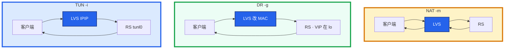
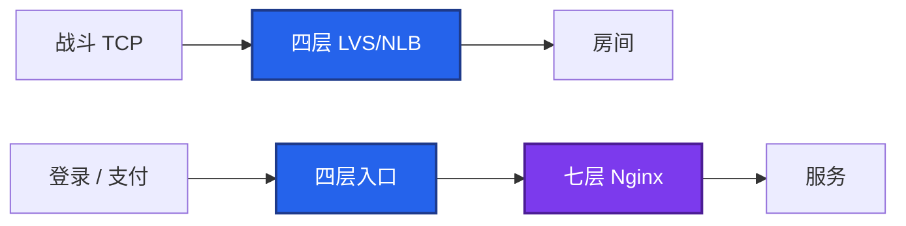

# 18｜LVS 与四层负载均衡 · 练习题

先对照 [知识点](知识点.md)：**先 §2 总图与走读，再 §3 名词，再 §5～§8**。能画出回程再谈 VIP/探活。每题标了覆盖范围：

| 标记 | 含义 |
|------|------|
| **核心** | 不懂整章就没建立起来 |
| **必会** | 值班和面试都要能讲 |
| **常用** | 线上会反复碰到 |
| **常考** | 白板和追问的高频口径 |

## 本题目录

- [Q1 NAT / DR / TUN](#q1)
- [Q2 四层 vs 七层](#q2)
- [Q3 VIP 与脑裂](#q3)
- [Q4 算法与打偏](#q4)
- [Q5 RS 健康检查](#q5)
- [Q6 值班命令](#q6)
- [Q7 加摘 RS / 升级](#q7)
- [Q8 排障分流](#q8)
- [Q9 生产怎么叠](#q9)
- [Q10 DR 源 IP / ARP](#q10)
- [合上书](#合上书)

---

## Q1

**★★★★★｜NAT、DR、TUN 回程差在哪？哪个最常用？**

**覆盖**：核心 · 必会 · 常考

**对应**：知识点 §2.2～§2.5 · §5

### 场景

入口要扛战斗长连接。有人按 NAT 上了两台 LVS，回包把入口网卡打满。另有人说跨 VLAN 也能 DR。

### 完整解答

**一句话**：差在回程过不过 LVS——游戏默认 DR，同二层 + 抑制 ARP；回包大别用 NAT。

**DR 最常用**。



- **NAT**：双向都过 LVS；RS 网关指向 LVS；可跨网段。游戏状态同步回包大，入口先满。
- **DR**：只改 MAC，IP 仍是 VIP；**同二层**；RS 把 VIP 放 lo 并抑制 ARP。入站涨、出站几乎没有。
- **TUN**：IPIP 封装，**可跨网段**；RS 解封装；注意 MTU、`rp_filter`。

`ipvsadm`：`-g` DR，`-m` NAT，`-i` TUN。配错回包路径就错。

对照走读：DR 改 MAC；NAT 改目的 IP 且回包再过 LVS；TUN 外包 IPIP。见知识点 §2.3～§2.5。

### 再追问

- DR 后端为什么要抑制 ARP？——VIP 在 lo 上若不抑制，RS 会宣布「VIP 在我这」，和 LVS 抢地址。`arp_ignore=1`、`arp_announce=2`。
- 跨网段能 DR 吗？——不能。没有「改 MAC 送达」。改 TUN 或 NAT。
- DR 抓包源 IP 是 VIP 坏了吗？——否。这是设计。排障看 MAC，不要只看 IP。

---

## Q2

**★★★★★｜四层和七层差在哪？游戏长连接走哪？**

**覆盖**：核心 · 必会 · 常考

**对应**：知识点 §2.1 · §4.3

### 场景

有人要把房间长连接进 Nginx，方便按 Header 灰度。登录 HTTP 也在同一层。

### 完整解答

**一句话**：战斗长连接走四层直通 LVS/NLB；登录 HTTP 可再进七层 Nginx 做证书和灰度。

四层看 IP+端口（LVS / 云 NLB），内核转发，不解析 HTTP，适合高并发和长连接。七层看 URL/Header/Host（Nginx / ALB / HAProxy），能灰度、改 Cookie，灵活但要解析、常重建连接。



七层不适合长驻 socket。不要用「Nginx 也能 stream 四层」硬扛百万连接——能，但不是这个量级的默认答案。HAProxy 怎么配见 [20](../20-HAProxy与Keepalived/)。

`ipvsadm` 挂了 ≠ 正在转的连接立刻断。规则在内核。

### 再追问

为什么长连接不走七层？——要解析/终止连接，延迟和缓冲都差。四层直通，DR 下源 IP 干净，延迟最低。灰度做在登录七层，不要牺牲战斗口。

---

## Q3

**★★★★★｜LVS + keepalived 怎么做高可用？脑裂是什么？双 VIP 和 RS 抢 ARP 怎么分？**

**覆盖**：核心 · 必会 · 常考

**对应**：知识点 §8

### 场景

两台 LVS 之间的心跳被安全组丢掉。玩家一会儿能登、一会儿进错房间。ARP 表里 VIP 对应两个 MAC。另一次是 DR 会话乱，但只有一台 LVS 有 VIP。

### 完整解答

**一句话**：双 VIP 先下一台——Keepalived 两台不算 quorum，心跳断会双主，VRRP 是 IP 协议 112；只有一台 VIP 却会话乱 → 查 RS 是否抢 ARP。

keepalived 用 VRRP 做主备：主持 VIP，主挂则漂移。同时健康检查后端，挂了从 ipvs 摘掉。配置细节在 [20](../20-HAProxy与Keepalived/)，本章要会影响面。

| | 双 VIP（脑裂） | RS 抢 ARP |
|--|----------------|-----------|
| 谁在答 | 两台 LVS | 某台 RS |
| 第一刀 | 立刻下一台 LVS | 修 `arp_ignore` / `arp_announce` |

脑裂：心跳不通 → 两台都是主 → 两个 VIP / 抢 ARP → 流量分裂。VRRP 是 **IP 协议 112**，不是 UDP 端口 112。

防：独立心跳或单播、`nopreempt`、防火墙放行协议 112、监控双 VIP。出现双主：**立刻下一台**，查心跳，修 ARP，不要让玩家「重连试试」。

VIP 漂移会断存量。NAT 下 conntrack 在旧 LVS。不要答完全无感。

### 再追问

- Keepalived 两台算不算 quorum？——不算。只是优先级 + 心跳。真分区防脑裂见 [26](../26-高可用与容灾/)。
- 主恢复会不会抢回来？——看 `nopreempt`。抢回是第二次闪断。

---

## Q4

**★★★★☆｜wrr、lc、sh 怎么选？长连接用哪个？一台满两台闲先看什么？**

**覆盖**：必会 · 常用 · 常考

**对应**：知识点 §6

### 场景

房间进程规格不同。有人用了 sh，NAT 出口后一台后端被打满。另一次改完 `wlc`，旧连接仍全在一台。

### 完整解答

**一句话**：长连接入口用 lc/wlc 按连接数分；sh 在 NAT 大出口后会扎堆；算法只管新连接，改 `-s` 不搬存量。

1. **wrr**：规格不同按权重。
2. **lc / wlc**：按当前连接数，**长连接入口常用**。
3. **sh**：同一源 IP 固定后端。NAT 后成千上万用户同一个出口 IP，会打到同一后端。

```bash
ipvsadm -L -n --rate
# CPS 一台特别高 → 新连接打偏
# CPS 已平、ActiveConn 一台特别高 → 存量，算法帮不了
```

长连接建立后不切。`-p` persistent 在 NAT 出口场景同样扎堆。`ipvsadm -E -t VIP:port -s wlc` 只影响新 SYN。

### 再追问

改算法要不要重建 VIP？——不用。`-E` 改调度器即可。存量要均衡只能等消亡、主动断、或扩容接新连接。

---

## Q5

**★★★★☆｜健康检查摘掉后端，为什么还有人打到死机器？探活口错了会怎样？**

**覆盖**：必会 · 常用

**对应**：知识点 §7

### 场景

keepalived 已经把坏掉的房间从 ipvs 删了。部分渠道还在连旧 IP。TTL 3600。另一次探针打在 8080，战斗口是 7777，活房间被摘光。

### 完整解答

**一句话**：LB 摘了只停新分配；存量 TCP 和 DNS TTL 内仍会打到旧后端，探活口必须等于业务口。

LB 摘了 ≠ 用户切了。DNS 还在 TTL 内（[15](../15-DNS与CDN/)）。存量长连接也不会被健康检查踢掉——检查管的是**新分配**。四层不会把一条 TCP 搬到另一台。

```text
摘流量 = ipvs 摘后端 + （如有）DNS / VIP 级摘
存量 TCP 还在旧后端上，直到自己断或超时
```

探活必须打 **业务端口**（或业务 `/health`）。探活口 ≠ 业务口 → 误摘。连续失败 3～5 次再摘，失败一次就切会在活动里抖动。

只改 DNS 不摘 ipvs：新解析的用户还可能打到同一 VIP，LVS 仍会分到坏后端。两边都要摘。

### 再追问

云 NLB 还要自建 LVS 吗？——多数云上用 NLB 就够。健康检查端口、空闲超时、后端 ARP 仍是你的。超时短于游戏心跳会无故断。

---

## Q6

**★★★★☆｜值班先跑哪几条？怎么证明流量打偏？怎么认 Masq vs Route？**

**覆盖**：必会 · 常用

**对应**：知识点 §4 · §5.3 · §10.1

### 场景

三台房间，一台 CPU 打满，另外两台很闲。权重一样。有人要先改算法重建 VIP。另一次入口网卡双向满。

### 完整解答

**一句话**：先 `ipvsadm --stats/--rate` 和 `ip addr`，双 VIP 是脑裂不是算法问题；Masq=NAT，Route+OutBytes≈0=DR。

先这几条：

```bash
ipvsadm -L -n --stats
ipvsadm -L -n --rate
ip addr show
ip neigh show
```

| 看到 | 结论 |
|------|------|
| 两台都有 VIP | 脑裂，先下一台 |
| `Masq` + OutBytes≈InBytes | NAT，回包过 LVS |
| `Route` + OutBytes≈0 | DR |
| 一台 CPS 特别高 | 新连接打偏（rr/sh） |
| CPS 平、ActiveConn 一台高 | 存量 |

DR 下 stats **入站涨、出站几乎没有**；NAT 进出都涨。

### 再追问

`-g -m -i` 是什么？——DR / NAT / TUN。和回包路径绑定。

---

## Q7

**★★★★☆｜怎么加摘 RS？升级怎么滚？模式从 NAT 改 DR？**

**覆盖**：必会 · 常用

**对应**：知识点 §9

### 场景

扩一台房间；下周要升 keepalived；有人想把 NAT 改成 DR 降入口带宽。

### 完整解答

**一句话**：加 RS 先配 lo VIP + ARP 抑制再 `-a`；活动中不要改 NAT↔DR，升级滚动保 VIP。

加：RS 先配好（DR：lo VIP + ARP 抑制）→ `ipvsadm -a ... -g -w n`（可先低权重）→ 看 stats。摘：先权 0，等新连接不再来，再 `-d`。

升级：先把 VIP 赶到另一台或权 0 → 升备 → 验证 → 再切。不要两台同时换内核模块。不要活动中改 NAT↔DR。

NAT → DR：RS 先配 lo 和 ARP → 低峰改 `-g` → stats 出站应接近 0。跨网段不要硬上 DR，走 TUN。

回滚：规则回到上一份；VIP 已在备上且业务正常，不要为了「主必须是原机」再抢一次。

### 再追问

Stacked 改云 NLB 活动中做吗？——不要。空闲超时、健康检查、安全组要对齐后再切，当项目做。

---

## Q8

**★★★★☆｜给出现象，你先走哪条排障路？**

**覆盖**：必会 · 常用

**对应**：知识点 §10

### 场景

五个工单：① ARP 里 VIP 两个 MAC ② DR 会话乱 ③ 入口网卡满 ④ 探活已摘仍有人打到死机器 ⑤ ipvsadm 进程没了有人要重启全部房间。

### 完整解答

**一句话**：双 VIP 下一台；DR 乱查 ARP 抑制；入口满查 NAT 回程；摘了仍有人打查 DNS TTL + 存量 TCP；用户态挂了先看 VIP/规则还在不在。

| # | 走哪条 | 不要做 |
|---|--------|--------|
| ① | 脑裂，立刻下一台，查 IP 112 | 改算法；让玩家重连试 |
| ② | RS lo VIP 是否抑制 ARP | 先加机器 |
| ③ | 是不是 NAT 回包过 LVS；评估 DR | 只加带宽 |
| ④ | DNS TTL + 存量 TCP；两边都要摘 | 只改 DNS |
| ⑤ | 看 `ipvsadm -L` / VIP 是否还在 | 立刻重启所有房间 |

先分四层还是七层：战斗走 LVS，登录走 Nginx。现场：`ipvsadm --stats/--rate` → `ip addr` → ARP → RS 上 lo 和 arp_ignore。

### 再追问

Keepalived conf、notify、单播去哪答？——**24**。本章收口：心跳不通会双主；出现双主立刻下一台；漂移会断存量。脑裂总论在 [26](../26-高可用与容灾/)。

---

## Q9

**★★★★☆｜新大区入口怎么叠四层和七层？**

**覆盖**：必会 · 常用 · 常考

**对应**：知识点 §2.0～§2.1 · §9.1

### 场景

登录 HTTP、公告静态、战斗 TCP，三个入口一起设计。老板说上云 NLB 就不用懂 LVS。

### 完整解答

**一句话**：战斗 TCP 走四层 LVS/NLB；登录 HTTP 四层后再进 Nginx 七层；静态走 CDN 不是 LVS。

```text
战斗 TCP     → 四层 LVS/NLB → 房间
登录 / 支付  → 四层 → Nginx 七层（证书、路由）→ 服务
公告 / 包体  → CDN（10），不是 LVS
```

证书、Host 路由、灰度在七层（[14](../14-HTTP与TLS/)、[19](../19-Nginx/)）。长连接不要塞进七层。Keepalived 只护四层 VIP；七层 Nginx 的 HA 在 19/20。

自建：两台 LVS + keepalived，心跳独立、nopreempt、监控双 VIP。同二层 DR；跨网段 TUN/NAT。长连接 lc/wlc。

云 NLB 多数够用。NAT/DR/脑裂、健康检查、后端 ARP、连接耗尽仍要会。

### 再追问

ipvs 内核转发挂了要不要重启逻辑服？——先看 VIP 和规则还在不在。用户态挂了连接通常还在。不要把还活着的房间当入口事故重启。

---

## Q10

**★★★★☆｜DR 下抓包源 IP 是 VIP；和脑裂怎么区分？**

**覆盖**：必会 · 常考

**对应**：知识点 §5.6 · §8.2

### 场景

新人在 RS 上抓包，看到源 IP=VIP，要加 SNAT「修干净」。同时有人报会话乱，怀疑脑裂。

### 完整解答

**一句话**：DR 源 IP=VIP 是设计；脑裂是两台 LVS 都有 VIP / 两个 MAC——先 `ip addr` 和 `ip neigh`，不要先加 SNAT。

| 现象 | 含义 | 动作 |
|------|------|------|
| RS 回包源 IP=VIP，源 MAC=RS，LVS OutBytes≈0 | DR 正常 | 别加 SNAT |
| 两台 LVS `ip addr` 都有 VIP | 脑裂 | 立刻下一台 |
| 一台 LVS 有 VIP，但 ARP 飘到 RS MAC | RS 未抑制 ARP | 修 arp_ignore/announce |

### 再追问

TUN 回包源 IP 也是 VIP 吗？——是，直回客户端侧同样用 VIP；差在入站用了 IPIP。

---

## 合上书

- [ ] 能默画 §2.0：战斗直通四层；登录可再进七层
- [ ] 能口述 §2.3～§2.5：同一条 SYN 在 DR/NAT/TUN 下差在哪
- [ ] 能画出 NAT/DR/TUN 回程；游戏默认 DR；arp_ignore/arp_announce
- [ ] 能说出长连接用 lc 不是 rr；sh+NAT 会打偏；改算法不搬存量
- [ ] 能说明健康检查只摘新分配；探活口=业务口；DNS TTL 和存量 TCP
- [ ] 能处理双 VIP：下一台、IP 112、nopreempt；能区分 RS 抢 ARP
- [ ] 能用 stats/rate + ARP + lo 分流；VIP 漂移会断存量；升级怎么滚
