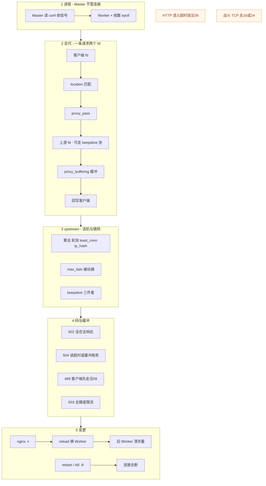
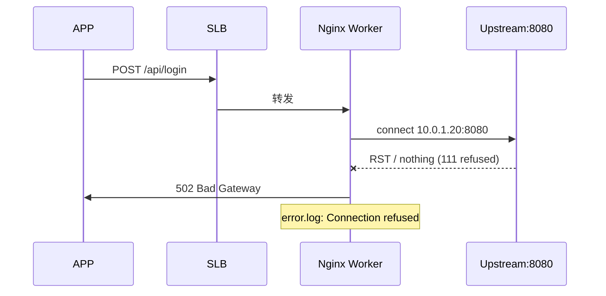
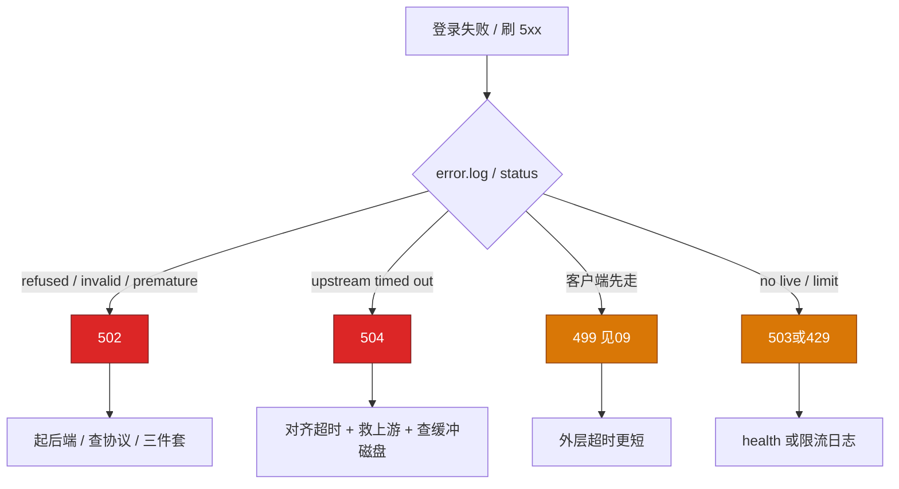
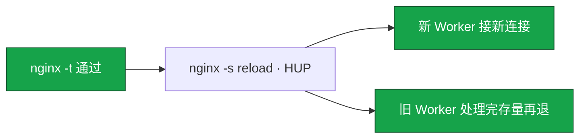
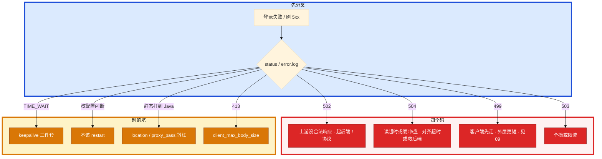

# Nginx

> **这章解决什么**：活动登录全 502——error.log 里其实是 `Connection refused`，有人却重启全部逻辑服；改个 header 有人 `systemctl restart nginx`，大厅 HTTP 长轮询全断；群里还有人要把战斗 TCP 挂到 Nginx「统一入口」。卡在**反代 / upstream / 缓冲 / reload**，还是 HTTP 语义本身？  
> **读法**：**先看总图** → **再认名词** → **再分节抠反代 / upstream / 502·504 / 缓冲 / reload**。  
> **刻意不展开**：HTTP 语义、超时链「外短内长」定责口径、TLS 握手与证书链 → [14 HTTP 与 TLS](../14-HTTP与TLS/)；包怎么进主机、Recv-Q/backlog → [12](../12-网络栈与Socket/)；TIME_WAIT 机制 → [13](../13-TCP与UDP/)；抓包 / `curl -w` → [16](../16-网络排障与抓包/)；APISIX 动态路由 → [02-04](../../02-中间件与数据库/04-接入网关/)；LVS / HAProxy 四层 → [18](../18-LVS与四层负载均衡/)、[20](../20-HAProxy与Keepalived/)。

---

## 本章目录

1. [本章定位](#1-本章定位)
2. [先看总图：请求在 Nginx 里怎么走](#2-先看总图请求在-nginx-里怎么走) ← **开篇必读**
   - [2.0 全章知识串图](#20-全章知识串图一张把细节串起来) ← **架构总览**
   - [2.1 四段坐标系](#21-四段坐标系客户端--nginx--upstream--业务)
   - [2.2 完整走读](#22-完整走读一次登录反代从-slb-到-502) ← **一例钉死**
   - [2.3 和邻章怎么接力](#23-和邻章怎么接力一张表)
3. [名词扫盲（对照总图认词）](#3-名词扫盲对照总图认词)
4. [反代与 location：路径怎么切](#4-反代与-location路径怎么切)
5. [upstream：算法、摘除、keepalive](#5-upstream算法摘除keepalive) ← **重点精读**
6. [502 / 504 / 缓冲：本章最易混](#6-502--504--缓冲本章最易混) ← **重点精读**
7. [reload：平滑换 Worker](#7-reload平滑换-worker)
8. [落地配置与限流](#8-落地配置与限流)
9. [命令：`-t` / error.log / 两列时间](#9-命令-t--errorlog--两列时间)
10. [定责决策树与命令速查](#10-定责决策树与命令速查)
11. [去哪章继续学](#11-去哪章继续学)
12. [面试 · 易错 · 数字](#12-面试--易错--数字)
13. [合上书](#合上书)

---

## 1. 本章定位

| 章 | 负责 |
|----|------|
| **06** | 包怎么走、怎么进主机、Socket/队列、本机「满」了怎么定责 |
| **08** | TCP/UDP：握手、窗口、重传、心跳；战斗长连接 |
| **09** | **HTTP 语义、超时链口径、Keep-Alive 两边、TLS/证书、499/502/504 语义定责** |
| **23（本章）** | **Nginx 反代指令、upstream、缓冲、reload、limit_req、error.log 关键字落地** |
| **16 / 24** | 四层 LVS / HAProxy TCP、Keepalived |
| **03-04** | APISIX、动态路由、插件、etcd 热更新 |

本章是 **Nginx 作战手册**。09 告诉你「码是什么意思、超时链怎么对齐」；本章告诉你「在 Nginx 上敲哪条指令、看哪行日志、reload 会不会闪断」。

🎯 **值班签名**：登录 5xx——先 `error.log` 关键字分 502 子类，**禁止**一看到 502 就重启战斗服；改配置——先 `-t` 再 reload，**禁止**生产 `systemctl restart nginx`。

**读完你能：** 白板上画出 Client → SLB → Master/Worker → upstream；用 error.log 分 refused / timed out / invalid header；默写 keepalive 三件套；讲清 buffer on/off 和 504 的关系；口述 reload 换代；活动接口配 limit_req。

---

## 2. 先看总图：请求在 Nginx 里怎么走

> **正确开篇顺序**：先有全局画面，再认词，再抠细节。  
> 先看 **§2.0 全章串图**，再看 **§2.1 四段坐标系**，再用 **§2.2 走读**把一次登录从 SLB 串到 502。

### 2.0 全章知识串图（一张把细节串起来）

> 🎯 **合上书要能默画这张。** 蓝=进程 · 绿=反代路径 · 橙=上游池 · 紫=定责/变更。  
> 若预览仍报错，以下面 **ASCII 一页板** 为准。



**读图路线：**

| 段 | 记住 |
|----|------|
| ① | Master 不接请求；Worker 接；反代 ×2 fd（§3、§4） |
| ② | location → proxy_pass → 上游；缓冲决定上游何时解放（§4、§6） |
| ③ | 算法 + max_fails + keepalive 三件套（§5） |
| ④ | 502/504/499/503；语义定责链 09，指令落地本章（§6、§10） |
| ⑤ | 先 `-t` 再 reload；restart 闪断（§7） |

```text
┌──────────────────────────────────────────────────────────────────────────┐
│                     23 一张板：从 SLB 到 upstream 到定责                   │
├─────────────┬────────────────────┬───────────────────────────────────────┤
│  Client/SLB │  Nginx             │  Upstream                             │
│  443/80     │  Master←HUP        │  server a/b + backup                  │
│  超时更短   │  Worker epoll      │  keepalive 池（三件套）                │
│             │  fd1 客户端        │  max_fails 被动摘                     │
│             │  fd2 上游          │  502 refused / 504 timed out          │
├─────────────┴────────────────────┴───────────────────────────────────────┤
│  缓冲：proxy_buffering on 先收齐再转；off 边收边转占 Worker               │
│  变更：-t → reload 平滑 ｜ restart 闪断 ｜ 战斗 TCP 不走 HTTP 反代         │
│  语义/超时链/TLS → 09   ｜ 四层 → 16/24   ｜ 动态网关 → 03-04               │
└──────────────────────────────────────────────────────────────────────────┘
```

### 2.1 四段坐标系（客户端 → Nginx → upstream → 业务）

**一句话：** 码写在 Nginx access.log，痛可能在 SLB、Worker、上游进程、或 DB——先定位段，再动刀。

```text
① 客户端 / APP          超时最短（常见 8～15s）
        │
② 边缘 / 云 SLB         略长于 APP；TLS 可能在此终结
        │
③ Nginx（本章主场）     Master + Worker；记 499/502/504/503
        │  proxy_connect / send / read
        │  proxy_buffering · keepalive 池
        ▼
④ upstream 业务进程     Java / Go 大厅；自己还要有硬超时
        │
⑤ DB / Redis            慢查询会把 ④ 拖死 → ③ 记 504（见 09）
```

| 段 | 你在 Nginx 上看到什么 | 第一刀不在 Nginx 时 |
|----|----------------------|---------------------|
| ① 客户端先走 | access **499**，上游时间仍大 | 对齐外层超时（09） |
| ② SLB | 玩家侧失败，本机 access 少 | 查 SLB 健康检查 / 超时 |
| ③ Worker | error.log 关键字、两列时间 | 本章定责树 |
| ④ 上游挂 | `connect refused` / `no live` | 起进程、查端口 |
| ⑤ 后端慢 | `upstream timed out` → **504** | 慢查询 / 扩容；别只调 timeout=300 |

> **记住**：09 负责「超时必须外短内长」的**口径**；本章负责把口径落成 `proxy_*_timeout`、access 两列时间、error.log 关键字。

### 2.2 完整走读：一次登录反代从 SLB 到 502

> 🎯 **一例钉死**：下面这条路径走通，后面所有节都是在抠其中一格。

**场景**：活动开服，登录接口全挂。玩家说「闪一下失败」。有人要重启战斗服。

| 步 | 你在哪 | 敲什么 / 看见什么 | 说明 |
|----|--------|-------------------|------|
| 1 | 跳板 | `tail error.log \| grep refused` | `connect() failed (111: Connection refused) ... upstream: "http://10.0.1.20:8080/api/login"` |
| 2 | 定责 | 111 = 对端没人听 | **502**，不是超时；不是战斗服的事 |
| 3 | 上游机 | `ss -tlnp \| grep 8080` | 没有 listen → 大厅进程没起来 |
| 4 | 验证 | `curl -v http://10.0.1.20:8080/health` | Connection refused 复现 |
| 5 | 修复 | 起大厅 / 修发布 | **不要** `systemctl restart nginx`，更不要重启战斗 |
| 6 | 对照 | 若日志是 `upstream timed out` | 那是 **504** → 对齐超时或救慢查询（09 + 本章 §6） |



若上游活着但 SQL 跑 40s，APP 15s 先走 → access **499**；Nginx `proxy_read_timeout 30s` 先到 → **504**。语义分工见 [09 §6](../14-HTTP与TLS/知识点.md)。

### 2.3 和邻章怎么接力（一张表）

| 现象 | 先想哪章 | 本章贡献什么 |
|------|----------|--------------|
| 新连接进不来、Listen 顶满 | 06 | Nginx `worker_connections` / backlog 对齐 |
| ESTAB 了还卡、retrans | 08 | 别在 Nginx 上调 TCP 窗口当第一刀 |
| 499/502/504 **语义**、超时链口径、TLS | **09** | 指令名、error.log、两列时间 |
| DNS/CDN 回源 502 | 10 | 回源证 / upstream 是否指错 |
| 要抓包确认首字节 | 11 | `curl -v` 不够时再上 tcpdump |
| 战斗帧同步 | 16/24 | **禁止**用 HTTP 反代扛 |
| 动态路由 / 插件 | 03-04 | 超时链、三件套在哪层网关都成立 |

---

## 3. 名词扫盲（对照总图认词）

对照 §2.0：先认进程，再认路径，再认池与码。

| 术语 | 值班里什么时候碰到 | 一句话 |
|------|-------------------|--------|
| Master | reload / 升级 | 读配置、收信号、拉起 Worker，**不接业务连接** |
| Worker | CPU 高、连接飙 | 单线程 epoll；一个进程扛大量连接 |
| location | 静态打到 Java、404 | URL 匹配；有优先级 |
| proxy_pass | 改 URI 后路径错 | 反代目标；**尾斜杠改路径** |
| upstream | 502/503、TW 爆 | 后端池 + 算法 + keepalive |
| keepalive（upstream） | TW 爆但「写了 keepalive」 | 必须三件套，见 §5 |
| proxy_buffering | P99 怪、磁盘满、504 | 是否先缓冲上游响应再回客户端 |
| max_fails / fail_timeout | 一台挂了还在打 / 全摘 503 | 开源 Nginx **被动**健康检查 |
| reload / HUP | 改配置怕闪断 | 新 Worker 接新连接；旧 Worker 清存量 |
| restart | 长轮询全断 | 先停后起，**连接全拆** |

**值班现象对照：**

| 玩家 / 监控说的 | 技术含义 | 你的第一刀 |
|-----------------|----------|------------|
| 「登录一直转圈」 | 504 或 ttfb 慢 | access 两列时间 + error.log |
| 「闪一下失败」 | 502 refused 或 503 | error.log `connect refused` |
| 「活动领奖刷不出来」 | 限流 429/503 或后端慢 | limit_req 日志 + 上游 health |
| 「改配置后全断」 | 用了 restart | 问是不是 `systemctl restart` |

游戏场景：**HTTP API / 登录 / 静态 / TLS 终结** 用 Nginx。战斗 TCP 长连接走 [18](../18-LVS与四层负载均衡/) / [20](../20-HAProxy与Keepalived/)。stream 模块能做四层——能，但不是这个量级的默认答案。

反代一条请求占 **2 个 fd**（客户端 + 上游）。上限约 `worker_processes × worker_connections`，还要 ≤ `worker_rlimit_nofile` ≤ 进程 `ulimit`（[24](../24-内核参数与sysctl/)）。反代按 **2 倍** 估 fd。

> **记住**：Master 管进程，Worker 接连接。reload 是换 Worker，不是重启整台机器。战斗长连接不要走 HTTP 反代。

**面试怎么说**：「Nginx 扛 HTTP 登录和静态，战斗 TCP 走四层 LB；反代按 2 fd 估上限；排障先 error.log 和 access 两列时间。」

---

## 4. 反代与 location：路径怎么切

### 4.1 七层反代在干什么

**一句话：** 反代 = Worker 同时握着客户端 fd 和上游 fd，在中间做 Host/路径/头/缓冲/超时——不是透明四层转发。

```text
客户端 ──fd1──► Worker ──fd2──► upstream
                 │
                 ├ location 选规则
                 ├ proxy_set_header 改头
                 ├ proxy_*_timeout 卡时间
                 └ proxy_buffering 决定何时回写
```

| 能力 | 七层 Nginx | 四层 LVS/HAProxy TCP |
|------|------------|----------------------|
| 认 Host / 路径 / Cookie | 能 | 不能（或很少） |
| TLS 终结、证书 | 能 | 看产品；常透传 |
| 缓冲、gzip、限流 | 能 | 不是主场 |
| 战斗长连接帧同步 | **不要** | **要** |

长连接没有「一次请求结束」——解析层会变成缓冲和超时的事故源。所以战斗走四层。

### 4.2 location 优先级

**一句话：** `=` > `^~` > 正则按文件顺序 > 最长前缀；配错会把 `.js` 打进 Java。

| 优先级 | 写法 | 行为 |
|--------|------|------|
| 最高 | `=` | 精确匹配，立刻定 |
| 高 | `^~` | 前缀命中后**不再走正则** |
| 中 | `~` / `~*` | 正则；**谁先写谁先赢** |
| 低 | 普通前缀 | 最长前缀获胜 |

```nginx
location = /health { return 200; }          # 精确
location ^~ /static/ { root /var/www; }     # 前缀，跳过正则
location ~* \.(js|css)$ { root /var/www; }  # 正则
location /api/ { proxy_pass http://backend; }
location / { proxy_pass http://backend; }   # 最长兜底
```

**现场走一遍**（所有 `.js` 都打到 Java，CPU 爆）：

1. `nginx -T | grep -n location` 看真实顺序。  
2. 发现 `location /` 的 `proxy_pass` 盖住了静态。  
3. 加 `location ^~ /static/` 或正则静态块，`-t` 后 reload。  
4. `curl -I https://cdn.game.com/static/app.js` 看是否还走 upstream。

### 4.3 proxy_pass 尾斜杠

**一句话：** 带不带尾 `/` 会改 URI——改完必须 `curl -v` 看真实路径。

| 写法 | 请求 `/api/login` | 上游实际路径（示意） |
|------|-------------------|----------------------|
| `proxy_pass http://backend;` | 保留 URI | `/api/login` |
| `proxy_pass http://backend/;` | location 前缀被替换 | 取决于 location 怎么写 |
| `proxy_pass http://backend/v2/;` | 换前缀 | 常变成 `/v2/...` |

> **别混**：URI 改错表现为上游 **404**，不是 502。502 是连不上或响应非法。

**面试怎么说**：「location 先认优先级；proxy_pass 斜杠会改路径；改完 -t、curl -v，不靠猜。」

### 4.4 反代头：真实 IP 与协议

**一句话：** 上游要认玩家 IP / 是否 HTTPS，靠你显式传 `X-Real-IP` / `X-Forwarded-*`；乱传或被客户端伪造会污染风控与限流。

| 头 | 常见用途 | 坑 |
|----|----------|-----|
| `Host` | 上游按域名路由 | 漏设变成 upstream IP，虚拟主机错乱 |
| `X-Real-IP` | 单跳真实 IP | 多级代理不够用 |
| `X-Forwarded-For` | 代理链 | 客户端可伪造；要配合 `set_real_ip_from` / realip 模块 |
| `X-Forwarded-Proto` | 告诉上游 http/https | 漏了上游可能生成 http 回调链接 |

```nginx
# 仅信任内网 SLB 写入的链路（示意）
set_real_ip_from 10.0.0.0/8;
real_ip_header X-Forwarded-For;
real_ip_recursive on;
```

活动限流若用 `$binary_remote_addr`，在「Nginx 直连玩家」和「前面还有 SLB」两种拓扑下看到的地址不同——**限流 key 要对着真实玩家口径调**，否则整栋 NAT 或整台 SLB 被当成一个 IP。

> **别混**：把客户端传来的 `X-Forwarded-For` 无脑信任 = 风控穿透。只信任你管控的上一跳。

### 4.5 完整反代最小可跑块

把 §4 + §5 拼成一块，值班改配置时对照：

```nginx
upstream lobby {
    least_conn;
    server 10.0.1.20:8080 max_fails=3 fail_timeout=30s;
    server 10.0.1.21:8080 max_fails=3 fail_timeout=30s;
    keepalive 32;
}

server {
    listen 443 ssl http2;
    server_name api.game.com;

    location = /health {
        access_log off;
        return 200 'ok';
        add_header Content-Type text/plain;
    }

    location /api/ {
        proxy_pass http://lobby;
        proxy_http_version 1.1;
        proxy_set_header Connection "";
        proxy_set_header Host $host;
        proxy_set_header X-Real-IP $remote_addr;
        proxy_set_header X-Forwarded-For $proxy_add_x_forwarded_for;
        proxy_set_header X-Forwarded-Proto $scheme;
        proxy_connect_timeout 5s;
        proxy_send_timeout 60s;
        proxy_read_timeout 60s;
        proxy_buffering on;
    }
}
```

验收：`nginx -t` → reload → `curl -vk https://api.game.com/health` → `curl -vk https://api.game.com/api/login` 看上游 access 是否带齐头。

---

## 5. upstream：算法、摘除、keepalive

> 🎯 合上书要能：**默写三件套**、**说清 max_fails 是被动摘**、**选算法不背书**。

### 5.1 算法怎么选

**一句话：** 无状态轮询；规格不一加 weight；会话粘滞 ip_hash（NAT 会破）；长连接/耗时不均 least_conn。

| 算法 | 何时用 | 坑 |
|------|--------|-----|
| 轮询（默认） | 后端差不多 | — |
| weight | 机器规格不一 | — |
| ip_hash | 有状态会话粘滞 | **换 NAT 出口就破功** |
| least_conn | 长连接、耗时不均 | 慢机可能吸走更多连接 |
| hash / consistent | 按 key 粘滞 | 看版本/模块 |
| random | 大规模 | — |

```nginx
upstream backend {
    least_conn;
    server 10.0.0.1:8080 weight=2 max_fails=3 fail_timeout=30s;
    server 10.0.0.2:8080 max_fails=3 fail_timeout=30s;
    server 10.0.0.3:8080 backup;
    keepalive 32;
}
```

`backup` 只在主池全挂时上——不是「热备轮询」。

### 5.2 被动摘除与 503

**一句话：** 开源 Nginx 健康检查偏被动：失败累计到 `max_fails`，在 `fail_timeout` 窗口内摘掉；全摘 → `no live upstreams` → **503**。

| 项 | 含义 |
|----|------|
| max_fails | 失败几次算挂 |
| fail_timeout | 窗口 + 摘除冷却时长 |
| 主动 HTTP 探活 | 开源弱；要模块/商业版，或前面挂 HAProxy（24） |

```text
一台真死 → 被动摘 → 流量挤到活的
全死 / 全摘 → 503 no live upstreams
只加大 max_fails 掩盖 → 玩家多打几次坏机 → 502 更多
```

> **别混**：503「无 live」vs 502「有上游但响应非法/拒连」——09 有语义表；本章用 error.log 关键字落地。

### 5.3 keepalive 三件套（缺一不可）

**一句话：** `keepalive N` + `proxy_http_version 1.1` + `proxy_set_header Connection ""`；少任一行等于没开池。

**打个比方**：keepalive 像出租车不熄火接下一单；少了 HTTP/1.1 或 Connection 空串，等于每单都重新打火——后端 TIME_WAIT 照样爆。

**现场走一遍**（upstream 写了 keepalive 32，后端 TW 仍爆）：

1. `nginx -T | grep -A20 'upstream backend'`  
2. 只见 `keepalive 32;`，location 里没有 1.1 / Connection ""  
3. 补全：

```nginx
upstream backend {
    least_conn;
    server 10.0.0.1:8080 max_fails=3 fail_timeout=30s;
    server 10.0.0.2:8080 max_fails=3 fail_timeout=30s;
    keepalive 32;
}

server {
    location /api/ {
        proxy_http_version 1.1;
        proxy_set_header Connection "";
        proxy_set_header Host $host;
        proxy_set_header X-Real-IP $remote_addr;
        proxy_set_header X-Forwarded-For $proxy_add_x_forwarded_for;
        proxy_set_header X-Forwarded-Proto $scheme;
        proxy_pass http://backend;
    }
}
```

4. `nginx -t && nginx -s reload`  
5. 上游机 `ss -s` 看 TIME_WAIT 是否下降  

| 缺哪行 | 后果 |
|--------|------|
| 无 `keepalive N` | 无池 |
| 无 HTTP/1.1 | 代理默认易走 close |
| 无 `Connection ""` | 可能带 Connection: close，池废 |
| keepalive 过大 | 占满上游 fd；**32～100** 常见 |

客户端 HTTP/2 到 Nginx，到上游仍常是 **1.1 池**——两段别混。入口 Keep-Alive 与上游池的**语义**见 [09 §4.4](../14-HTTP与TLS/知识点.md)；本章钉指令。

> **记住**：keepalive 必须三行。超时必须外短内长（口径见 09）。

**面试怎么说**：「三件套：upstream keepalive N、location HTTP/1.1、Connection 空串。开源探活靠 max_fails；精细主动探活放 HAProxy 或商业版。」

### 5.4 摘除后怎么恢复、灰一台怎么做

**一句话：** `fail_timeout` 过后再试；人工下线用 `down`，灰度用 `weight` 或临时摘出 conf。

| 操作 | 写法 / 做法 | 何时 |
|------|-------------|------|
| 被动摘 | max_fails 触发 | 自动 |
| 冷却后再试 | fail_timeout 到期 | 自动 |
| 人工摘死 | `server ... down;` | 发布/宕机确认 |
| 只接很少流量 | `weight=1` 对大 weight | 金丝雀 |
| backup | 主池全挂才上 | 兜底，不是灰度 |

```text
误区：以为 backup 会「热备分流」——不会，主池还有活机器时 backup 不接。
误区：发布时不 down 直接杀进程 → 短暂 502 雨，靠 max_fails  lag 一截。
正确：先 down 或从 conf 拿掉 → -t → reload → 再停进程。
```

### 5.5 keepalive 连接在 Worker 里

**一句话：** 池是 **每个 Worker 各一份**，不是 Master 全局共享——`keepalive 32` × Worker 数 ≈ 对上游的空闲连接上限量级。

```text
8 Worker × keepalive 32  ≈ 最多约 256 条空闲连接到该 upstream
上游 max connections 要按这个量级留余量
```

所以「把 keepalive 调到 2000」不仅没用，还会在多 Worker 下把上游 fd 打满。配合上游空闲超时：上游先关、Nginx 再用旧连接 → `prematurely closed` → 502。

> **别混**：客户端到 Nginx 的 `keepalive_timeout`（入口）≠ upstream 块里的 `keepalive N`（到后端的池大小）。

---

## 6. 502 / 504 / 缓冲：本章最易混

> 🎯 **本章最易混专节**：语义口径链 09；这里钉 **error.log 关键字 + 缓冲如何制造 504 假象**。  
> 499/超时链「谁先放手」的完整定责树 → [09 §6](../14-HTTP与TLS/知识点.md)。

### 6.1 四个码在 Nginx 上怎么认

**一句话：** 502 没合法上游响应；504 连上了但读超时（或缓冲/盘拖死）；499 客户端先走；503 无 live 或限流。

| status | error.log 关键字 | 含义 | 第一刀 |
|--------|------------------|------|--------|
| **502** | `connect refused` (111) | 没监听 | `ss -lntp`、起后端 |
| **502** | `connect timed out` (110) | 路由/安全组/丢包 | 网络路径（11） |
| **502** | `invalid header` | 不是 HTTP | `curl -v` 看首字节 |
| **502** | `prematurely closed` | 上游崩或 keepalive 错 | OOM/137、三件套 |
| **504** | `upstream timed out` | 读超时 | 超时链、慢查询 |
| **499** | 常无 error | 客户端先断 | 外层更短（09） |
| **503** | `no live upstreams` | 全摘 | 后端 health |
| **503/429** | limit_req | 限流 | zone 配置 |



**打个比方**：502 是快递到仓库门口没人签收；504 是签收员等太久走了；499 是买家取消订单；503 是仓库关门或限流闸落下。

### 6.2 现场：502 不要重启战斗服

```bash
tail -50 /var/log/nginx/error.log | grep -iE 'upstream|connect|timed out|refused|invalid'
```

典型输出：

```text
2026/08/28 14:02:11 [error] 1842#0: *9912 connect() failed (111: Connection refused)
while connecting to upstream, client: 10.0.0.5, server: api.game.com,
request: "POST /api/login HTTP/1.1", upstream: "http://10.0.1.20:8080/api/login"
```

| 片段 | 含义 |
|------|------|
| 111 Connection refused | 目标端口无 listen |
| upstream: `http://10.0.1.20:8080/...` | **打哪台**写得很清楚 |
| 不是 timed out | 所以不是 504 |

验证：

```bash
curl -v http://10.0.1.20:8080/health
ss -tlnp | grep 8080
```

### 6.3 缓冲：proxy_buffering 与 504

**一句话：** 一般 API 保持 `proxy_buffering on`，避免慢客户端拖死上游；`off` 边收边转，占 Worker 更久；缓冲落盘 / 盘满也可能拖出 504。

| 模式 | 行为 | 适合 | 风险 |
|------|------|------|------|
| **on**（默认常见） | 先收上游（可到缓冲/临时文件）再回客户端 | API、JSON | 盘满、缓冲过小反复调 |
| **off** | 边收边转 | 特殊流式 | Worker 被慢客户端拖住更久 |

相关旋钮（改之前先有证据）：

| 指令 | 作用 |
|------|------|
| `proxy_buffering` | 总开关 |
| `proxy_buffer_size` | 响应头缓冲 |
| `proxy_buffers` | 响应体缓冲个数×大小 |
| `proxy_busy_buffers_size` | 同时发给客户端的忙缓冲上限 |
| `proxy_max_temp_file_size` | 超出内存后临时文件；**0 可禁落盘** |
| `proxy_request_buffering` | 请求体是否先收齐再转上游 |

```nginx
location /api/ {
    proxy_pass http://backend;
    proxy_buffering on;
    proxy_buffer_size 4k;
    proxy_buffers 8 16k;
    proxy_busy_buffers_size 32k;
    # 大响应慎用落盘；盘满时先查 df
    # proxy_max_temp_file_size 0;
}
```

**现场走一遍**（上游 P99 正常，Nginx 却 504，磁盘 100%）：

1. access：`$upstream_response_time` 不大，但 `$request_time` 顶到 timeout。  
2. `df -h` → `/var` 满；error 里可能有 buffering 相关告警。  
3. 清日志 / 调 rotate（22）；或限制 temp file；再查是否慢客户端把 on 模式撑爆。  
4. **不要**一上来把 `proxy_read_timeout` 改成 300s 当修复（09 口径）。

> **别混**：504 **不等于**只有「上游慢」。缓冲落盘失败、写慢客户端、ssl 卡顿，都会让总时间顶满。两列时间见 §9。

### 6.4 超时指令落地（口径在 09）

**一句话：** 指令名在本章；**外短内长**的对齐逻辑以 09 为准，这里只给落表。

| 指令 | 管什么 |
|------|--------|
| `proxy_connect_timeout` | 连上游 TCP 多久放弃 → 常见进 502 |
| `proxy_send_timeout` | 向游发送请求体两段间隔 |
| `proxy_read_timeout` | 读上游响应两段间隔 → 常见 **504** |
| `keepalive_timeout` | 客户端侧空闲保活（入口） |
| `client_body_timeout` / `client_header_timeout` | 读客户端 |

示例对齐（数字按业务改；原则不变）：

```text
APP 15s  <  SLB 20s  <  Nginx proxy_read 25s  <  Java 硬超时 30s
```

只把 Nginx 调到 300、APP 仍 15 → **499** 照样飞。详见 [09 超时链](../14-HTTP与TLS/知识点.md)。

**面试怎么说**：「502 我对 error.log：refused 起后端，timed out 是 504。缓冲 on 防慢客户端拖上游；盘满也能拖出 504。499/外短内长口径我按 09 讲。」

### 6.5 一张表钉死：502 子类

| error.log / 现象 | errno 印象 | 第一刀 | 常见误操作 |
|------------------|------------|--------|------------|
| Connection refused | 111 | 起进程 / 对端口 | 重启 Nginx |
| Connection timed out | 110 | 安全组、路由、丢包（11） | 只加 proxy_connect |
| No route to host | 113 | 路由表 / 网卡 | 改业务代码 |
| invalid header | — | curl -v 首字节；是否 TLS 打明文 | 当网断 |
| prematurely closed connection | — | 上游崩溃、OOM、keepalive 错配 | 盲目加大 keepalive |
| SSL handshake failed（若 https 上游） | — | 回源证 / SNI（09、10） | 只查入口证 |

`proxy_next_upstream` 可对部分错误切下一台——**支付 POST 默认不要开大**（09 幂等）。登录 GET 类可谨慎，仍要防雪崩。

### 6.6 请求体缓冲

**一句话：** `proxy_request_buffering on`（常见默认）先收齐客户端 body 再转上游；大上传要同时看 `client_max_body_size`，不够是 **413** 不是 502。

| 场景 | 建议 |
|------|------|
| 普通 JSON API | 请求缓冲 on 即可 |
| 大热更包 / 上传 | 加大 `client_max_body_size`；注意磁盘与超时 |
| 需要上游尽早收到流式 body | 才考虑 request_buffering off（少用） |

```bash
# 413 时
nginx -T | grep client_max_body_size
```

---

## 7. reload：平滑换 Worker

> 🎯 改配置怕闪断——这一节钉死 **`-t` → reload**，以及 restart / kill -9 / reopen 的差别。

### 7.1 换代在干什么

**一句话：** reload = Master 收 HUP → 新 Worker 用新配置接新连接 → 旧 Worker 处理完存量再退；**不**等于 restart。



| 动作 | 连接命运 | 生产 |
|------|----------|------|
| `nginx -t` | 不动连接 | **必做** |
| `nginx -s reload` / HUP | 平滑换代 | **默认变更** |
| `nginx -s reopen` | 重新打开日志 fd | logrotate 后 |
| `systemctl restart` | **先停后起，连接全拆** | 禁止当常规变更 |
| `kill -9` | 立刻掐 | 事故 |

语法错：新 Worker **起不来**，旧配置继续服务——所以必须先 `-t`，否则你会以为「reload 了」其实没换上，或误以为「带错配置上线」（其实拒绝换代）。

### 7.2 worker_shutdown_timeout

长轮询 / 短 SSE 在旧 Worker 上可能拖很久。可设：

```nginx
worker_shutdown_timeout 30s;
```

到点仍未退的旧 Worker 会被结束——**有上限的平滑**，不是无限等。大厅 HTTP 长轮询依赖这点；战斗 TCP 仍不应挂在 HTTP 反代上。

### 7.3 现场：改 header 却 restart

**场景**：改 `X-Request-Id`，有人 `systemctl restart nginx`，大厅长轮询全断，客服炸锅。

| 步 | 正确做法 |
|----|----------|
| 1 | 改 conf |
| 2 | `nginx -t` |
| 3 | `nginx -s reload`（或 `systemctl reload nginx`） |
| 4 | `ps -ef \| grep nginx` 确认新旧 Worker 交替 |
| 5 | 抽查长轮询 / 登录仍 200 |

> **记住**：先 `-t` 再 reload。restart 会拆连接。kill -9 更粗。

**面试怎么说**：「变更先 -t 再 reload：新 Worker 接新、旧 Worker 清存量。restart 闪断。语法错则拒绝换代，旧 Worker 继续。」

### 7.4 信号速查（和 systemd 对齐）

| 信号 / 命令 | 作用 |
|-------------|------|
| HUP / `nginx -s reload` | 重新加载配置 |
| USR1 / `nginx -s reopen` | 重新打开日志文件 |
| QUIT | 优雅退出 Master（等 Worker） |
| TERM / INT | 快速关闭 |
| USR2 | 热升级二进制（换 Master，进阶；先在预发练） |

生产日常：**reload + reopen** 就够。热升级二进制前确认包来源与回滚路径，写进变更单，不在活动高峰赌。

```bash
# 确认 reload 后配置代际（示意）
ps -o pid,ppid,etime,cmd -C nginx
# Master 一个；Worker 的 etime 应出现「一批新、一批旧在退出」
```

### 7.5 变更检查单（可直接贴工单）

```text
1. 改 conf（最好 git / 备份旧文件）
2. nginx -t
3. 业务低峰或可承受窗口
4. nginx -s reload（或 systemctl reload nginx）
5. 看 error.log 有无启动报错
6. curl 健康检查 + 抽查登录
7. 观察 5xx / 连接数 5～10 分钟
回滚：还原 conf → -t → reload（不是 restart）
```

---

## 8. 落地配置与限流

### 8.1 选型一页

| 项 | 选 | 不选 |
|----|----|------|
| 场景 | HTTP API、静态、TLS 终结 | 战斗 TCP 长连接 |
| 进程数 | `worker_processes auto` | 多于核数 |
| 连接 | connections 10240+，rlimit 65535 | 不估 2 fd |
| 日志 | access 含两列时间 | 只有 status |
| 变更 | `-t` → reload | restart / kill -9 |
| 证书 | fullchain + blackbox 7 天（21） | 等玩家报 expired |
| 探活 | max_fails；精细主动 → 24 | 假装开源主动很强 |

### 8.2 全局骨架

```nginx
worker_processes auto;
worker_rlimit_nofile 65535;
worker_shutdown_timeout 30s;

events {
    worker_connections 10240;
    use epoll;
    multi_accept on;
}

http {
    sendfile on;
    tcp_nopush on;
    tcp_nodelay on;
    keepalive_timeout 65;
    keepalive_requests 1000;

    log_format main '$remote_addr - [$time_local] "$request" '
                    '$status $body_bytes_sent "$http_referer" '
                    '"$http_user_agent" rt=$request_time '
                    'urt=$upstream_response_time '
                    'ucs=$upstream_cache_status';

    access_log /var/log/nginx/access.log main;

    # gzip、upstream、server 见下
}
```

`tcp_nodelay on` 关 Nagle（传输细节 08）。高流量可 `access_log ... buffer=32k flush=5s`。systemd `LimitNOFILE=65535` 对齐 rlimit（18）。

### 8.3 反代 location 模板

```nginx
location /api/ {
    proxy_pass http://backend;
    proxy_connect_timeout 5s;
    proxy_send_timeout 60s;
    proxy_read_timeout 60s;
    proxy_http_version 1.1;
    proxy_set_header Connection "";
    proxy_set_header Host $host;
    proxy_set_header X-Real-IP $remote_addr;
    proxy_set_header X-Forwarded-For $proxy_add_x_forwarded_for;
    proxy_set_header X-Forwarded-Proto $scheme;
    proxy_buffering on;
}
```

支付等非幂等接口：慎用 `proxy_next_upstream` 对 502 盲目重试——口径见 [09](../14-HTTP与TLS/知识点.md)。

### 8.4 TLS（算法细节在 09）

```nginx
listen 443 ssl http2;
ssl_certificate     /etc/nginx/ssl/fullchain.pem;
ssl_certificate_key /etc/nginx/ssl/privkey.pem;
ssl_protocols TLSv1.2 TLSv1.3;
ssl_session_cache shared:SSL:10m;
ssl_stapling on;
add_header Strict-Transport-Security "max-age=63072000" always;
```

证书轮转：新 fullchain → `-t` → reload → blackbox 盯 `probe_ssl_earliest_cert_expiry`。**7 天 P1**（[22](../22-监控与告警/)）。握手/链/0-RTT → 09。

### 8.5 限流

活动领奖被刷，单 IP 把登录打满：

```nginx
limit_req_zone $binary_remote_addr zone=api_limit:10m rate=100r/s;
limit_conn_zone $binary_remote_addr zone=conn_limit:10m;

location /api/ {
    limit_req zone=api_limit burst=200 nodelay;
    limit_req_status 429;
    proxy_pass http://backend;
}

location /download/ {
    limit_conn conn_limit 10;
    limit_conn_status 503;
}
```

| 项 | 含义 |
|----|------|
| rate | 长期速率 |
| burst | 桶深 |
| nodelay | 突发立刻处理；超 burst 仍拒 |
| 无 nodelay | 排队匀速，延迟变差 |

活动出口 NAT 会让「按 IP」变成「按整栋楼」——换 key 或上 [02-04](../../02-中间件与数据库/04-接入网关/) 按玩家 ID。限流 429 进面板（21 RED）。

### 8.6 动静分离与 cache

静态 `root` + `expires`，可 `access_log off`。动态才 `proxy_pass`。`proxy_cache` 给可缓存接口；**玩家私有接口不要 cache**。资源版本 / CDN → [15](../15-DNS与CDN/)。

### 8.7 参数速查

| 参数 | 建议 | 改错会怎样 |
|------|------|------------|
| worker_processes | **auto** | 多于核数抢 CPU |
| worker_connections | **10240+** | 反代 ×2 fd |
| worker_rlimit_nofile | **65535** | 连接数上不去 |
| proxy_read_timeout | 外短内长对齐 | 499 或 504 满天飞 |
| keepalive 三件套 | 缺一不可 | TIME_WAIT 爆 |
| max_fails / fail_timeout | 被动摘 | 全摘 503 |
| proxy_buffering | API 常 on | off 拖 Worker；盘满拖 504 |
| gzip | API JSON 可开 | 已压缩的别再压 |
| ssl_protocols | **TLSv1.2 / 1.3** | 允许 1.0 = 扣分 |
| client_max_body_size | 按上传/热更包 | 太小 413 |
| ssl_certificate | **fullchain** | 缺中间证客户端失败 |
| stub_status | 仅监控网 | 对公网泄容量 |

> **记住**：先 `-t` 再 reload。access 必须有两列时间。

---

## 9. 命令：`-t` / error.log / 两列时间

值班第一刀：`-t`（若刚改过）、error.log、上游通不通、ss、upstream 真值。

```bash
nginx -t
nginx -T | grep -A20 upstream
nginx -s reload
tail -100 /var/log/nginx/error.log | grep -iE 'upstream|connect|timed out|refused'
curl -v http://10.0.1.20:8080/health
ss -tlnp | grep 8080
ss -s
awk '$9 ~ /^5/ {print $7}' /var/log/nginx/access.log | sort | uniq -c | sort -rn | head
```

| 目的 | 命令 | 看什么 |
|------|------|--------|
| 语法 | `nginx -t` | reload 前必过 |
| 生效配置 | `nginx -T` | location / upstream 真值 |
| 平滑 | `reload` / `reopen` | 换 Worker；切日志 |
| 502/504 | error.log 关键字 | refused / timed out / invalid |
| 慢在哪 | access 两列时间 | 上游 vs 总时间 |
| 5xx 路径 | awk 按 status | 哪个 URI |

### 9.1 两列时间怎么读

必须打进 log_format：`$request_time`、`$upstream_response_time`。

```bash
# 示意：status  request_time  upstream_response_time
tail -20 /var/log/nginx/access.log | awk '{print $9,$NF,$(NF-1)}'
```

```text
499 3.512 3.498
504 30.001 29.998
200 0.045 0.042
502 0.002 -
```

| 读法 | 含义 |
|------|------|
| urt ≈ rt 且大 | 后端慢 |
| rt ≫ urt | 卡在 Nginx：ssl、缓冲、写慢客户端、落盘 |
| 499 + urt 仍大 | 客户端先走（09） |
| 502 + urt `-` | 几乎没连上上游 |

**面试怎么说**：「慢不先优 gzip。先看两列时间：上游≈总时间就打后端；总时间远大于上游就查 Nginx 侧缓冲和客户端。」

### 9.2 stub_status（容量一眼）

```nginx
location /nginx_status {
    stub_status;
    allow 10.0.0.0/8;
    deny all;
}
```

```text
Active connections: 291
server accepts handled requests
 16630948 16630948 31070465
Reading: 6 Writing: 179 Waiting: 106
```

| 字段 | 含义 |
|------|------|
| Active | 当前活跃连接 |
| Reading / Writing / Waiting | 读请求头 / 写响应 / 空闲 keepalive |
| accepts ≈ handled | 正常；handled 明显小于 accepts → 曾达连接上限 |

只对监控网开放。公网暴露等于泄容量。

### 9.3 和 ss 一起看（链到 06）

```bash
ss -s
ss -lntp | grep -E ':80|:443|:8080'
# Worker 连接打满时：Active 顶着 worker_processes × worker_connections
# Listen 队列异常 → 回 06 看 backlog / somaxconn，不要只加 Nginx connections
```

Nginx connections 不够 → 新连接失败或排队；表现像「进不去」，但和「上游 refused 的 502」不同——先分清是 **入口 fd** 满还是 **上游** 挂。

---

## 10. 定责决策树与命令速查

三问：进程还在听吗？玩家看到的码是哪一个？超时链谁最短？



| 现象 | 先做什么 | 不要做什么 |
|------|----------|------------|
| 大量 502 + refused | 起后端 | 重启 Nginx / 战斗服 |
| 499 + 504 同时 | 对齐超时链（09） | 只把 Nginx 调到 300s |
| keepalive 写了仍 TW | 补 HTTP/1.1 和 Connection "" | 再加大 keepalive 到几千 |
| restart 后长轮询全断 | 改用 reload | kill -9 |
| 领奖被刷 | limit_req + burst | 先扩一倍机器当根因 |
| invalid header | curl -v 看首字节 | 当网断了乱重启 |
| P99 2s 去优 gzip | 先看两列时间 | 先动装饰项 |
| 504 + 磁盘满 | df、缓冲 temp、日志 | 只加 timeout |
| 证书玩家报 expired | 21 blackbox 7 天 | 等浏览器 |
| 支付 502 自动重试 | 查幂等（09） | `proxy_next_upstream` 盲试 |

活动高峰：先对码和超时链，**停止发版和重启战斗服**，再限流保登录。

**速查顺序：**

```text
error.log 关键字
  → ss/curl 上游端口
  → access 两列时间
  → nginx -T（upstream / timeout / 三件套）
  → df（缓冲落盘嫌疑）
  → 限流 zone / max_fails
```

---

## 11. 去哪章继续学

| 你想继续… | 去 |
|-----------|-----|
| 499/502/504 **语义**、超时链、TLS、证书链 | [14 HTTP 与 TLS](../14-HTTP与TLS/) |
| 包进主机、队列、conntrack | [12](../12-网络栈与Socket/) |
| TIME_WAIT、重传、心跳 | [13](../13-TCP与UDP/) |
| 抓包、`curl -w` | [16](../16-网络排障与抓包/) |
| DNS/CDN 回源 | [15](../15-DNS与CDN/) |
| 四层 LB、VIP | [18](../18-LVS与四层负载均衡/)、[20](../20-HAProxy与Keepalived/) |
| 动态网关 APISIX | [02-04](../../02-中间件与数据库/04-接入网关/) |
| nofile / somaxconn | [24](../24-内核参数与sysctl/) |
| 证书告警接到人 | [22](../22-监控与告警/) |
| 日志切割 | [23](../23-日志运维/) |

---

## 12. 面试 · 易错 · 数字

### 对错表

| 说法 | 对错 | 口径 |
|------|:----:|------|
| Master 接业务连接 | 错 | Worker 接；Master 管进程 |
| worker 数越多越快 | 错 | auto = 核数 |
| 战斗长连接走 Nginx HTTP 反代 | 错 | 四层 16/24 |
| 502 就是上游超时 | 错 | 502 没合法响应；超时是 504 |
| 499 是 Nginx 的锅 | 错 | 客户端先走（09） |
| 只加大 Nginx 超时能消 499 | 错 | 外层更短仍 499 |
| keepalive 只写 upstream 一行 | 错 | 必须三件套 |
| restart 和 reload 一样平滑 | 错 | restart 断连接 |
| 语法错 reload 会带着错误配置上 | 错 | 拒绝换代，旧 Worker 继续 |
| 开源 Nginx 主动 HTTP 探活很强 | 错 | 被动 max_fails；主动看 24 |
| ip_hash 换 NAT 出口还粘 | 错 | 破功 |
| limit_req 默认一定 429 | 错 | 要 `limit_req_status` |
| 客户端 HTTP/2 则上游也是 2 | 错 | 上游常仍 1.1 池 |
| 504 只可能是上游慢 | 错 | 缓冲/盘/写客户端也能拖 |
| proxy_buffering off 一定更快 | 错 | 慢客户端更易拖死 Worker |
| 证书等玩家报 | 错 | blackbox 7 天 |
| 平均值当延迟 SLA | 错 | P99 |
| APISIX 能让超时链作废 | 错 | 哪层网关都成立 |

### 数字

| 项 | 常见口径 |
|----|----------|
| 反代 fd | **×2** |
| worker_connections | **10240+** |
| rlimit / LimitNOFILE | **65535** |
| upstream keepalive | **32～100** |
| max_fails / fail_timeout | **3 / 30s** |
| 证书告警 | **7 天 P1** |
| HSTS | `max-age=63072000` |
| limit 例 | **100r/s burst 200** |
| worker_shutdown_timeout | **30s** 量级 |

### 易混一对

| A | B | 一句话分开 |
|---|---|------------|
| 502 | 504 | 没合法响应 vs 读超时 |
| 499 | 504 | 客户端先走 vs Nginx 先走 |
| 503 全摘 | 503/429 限流 | error `no live` vs limit 日志 |
| reload | restart | 平滑换代 vs 全拆 |
| reopen | reload | 只切日志 vs 换配置 |
| 三件套缺一行 | keepalive 过大 | 没开池 vs 占满上游 fd |
| buffering on | off | 防慢客户端 vs 流式占 Worker |
| 七层反代 | 四层 LB | HTTP 登录静态 vs 战斗 TCP |
| 本章指令 | 09 语义 | 怎么配 / 怎么认 vs 码与超时链口径 |

### 30 秒口述模板

「Nginx 我用来扛 HTTP 登录和静态，战斗走四层。反代两个 fd。排障先 error.log：refused 是 502 起后端，timed out 是 504。keepalive 必须三件套。变更先 -t 再 reload。超时外短内长和 499 口径按 09。」

---

## 合上书

验收对齐：**默画 §2.0** + **故障能指到 §10 树**。

1. Master / Worker 谁接连接？反代几个 fd？战斗为什么不走 Nginx HTTP 反代？  
2. 默画 Client → SLB → Worker → upstream；502 走读里 111 说明什么？  
3. location 优先级？proxy_pass 尾斜杠会怎样？  
4. keepalive 三件套是哪三行？少了为什么 TIME_WAIT 爆？max_fails 是主动还是被动？  
5. 502 / 504 / 499 / 503 怎么用 error.log 分？缓冲 on/off 和盘满如何搅进 504？  
6. reload 和 restart 差在哪？为什么必须先 `-t`？worker_shutdown_timeout 干什么？  
7. 两列时间怎么判断慢在上游还是 Nginx？活动接口 limit_req 的 burst/nodelay？  

七题都能口述，这一章就过了。语义与 TLS 回 [14](../14-HTTP与TLS/)；下一章把四层 LB 和 VIP 漂起来：[20 HAProxy 与 Keepalived](../20-HAProxy与Keepalived/)。
