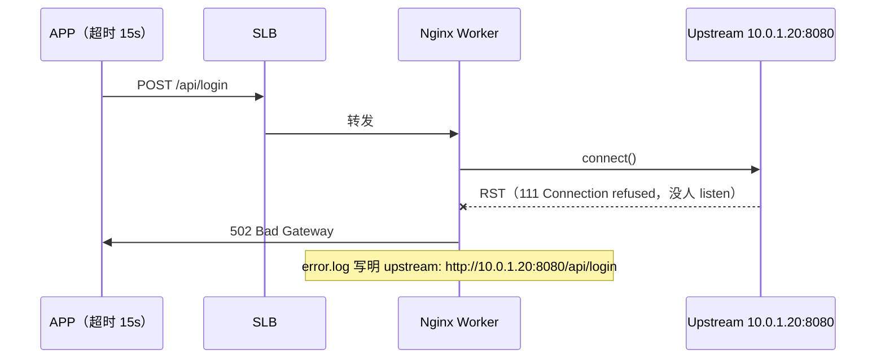
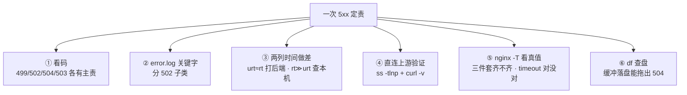
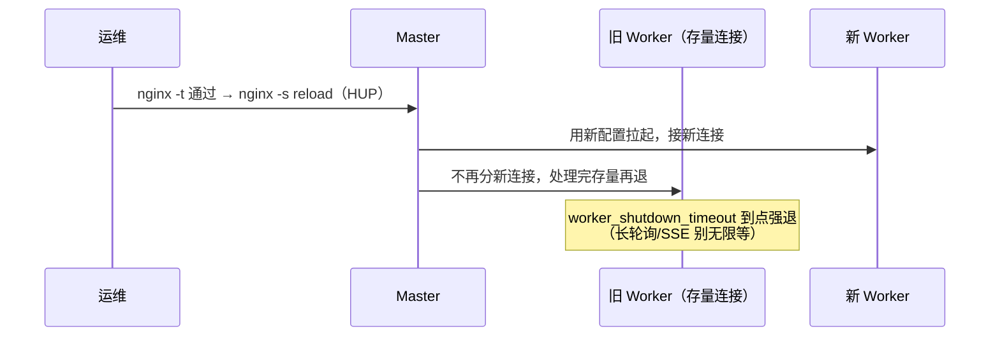
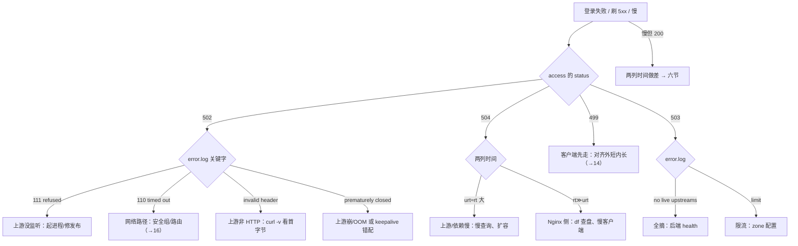

# Nginx

> 大家好，欢迎来到这次分享。开讲之前，先带大家回到一个很多值班同学都经历过的现场：
> 活动开服登录全 502——error.log 里其实是 `Connection refused`，有人已经把全部逻辑服重启了一遍；改一个 header，有人 `systemctl restart nginx`，大厅 HTTP 长轮询当场全断。
> 这一章讲完，你会知道当时那个人错在哪，以及 502/504/499 怎么一眼定责、为什么改配置必须 reload 不能 restart。
> **本章回答**：一个 HTTP 请求从被 Worker 接住到回到玩家手里的一生——每一段什么会坏、499/502/504/503 怎么一眼定责。
> **不讲**：499/502/504 的 HTTP 语义与超时链「外短内长」口径 → [14](../14-HTTP与TLS/)；包怎么进主机、backlog/Recv-Q → [12](../12-网络栈与Socket/)；TIME_WAIT 机制 → [13](../13-TCP与UDP/)；DNS/CDN 回源 → [15](../15-DNS与CDN/)；抓包 → [16](../16-网络排障与抓包/)；四层 LB → [18](../18-LVS与四层负载均衡/)、[20](../20-HAProxy与Keepalived/)。这些都有专门的章节，本章只在用到时点到为止。

**标记**：🎯重点 · 🔥难点 · ⭐常考 · 🔧实操

**怎么听这场分享**：咱们先看第一节的主图，把「一个请求在 Nginx 里的一生」装进脑子；第二到第七节顺着这条线一站一站往下走——出生、认路、搭桥、搬运、归宿、换岗；第八节专门讲定责，也就是开头那个现场的正确解法。每一节讲完都会提示对应练习题，学完就去练。

---

## 一、一张图：一个请求在 Nginx 里的一生

> 🎯 **一句话**：请求的一生五段——出生、认路、搭桥、搬运、归宿；坏了先问卡在哪一段。

咱们先不急着背配置项。学 Nginx 最怕的就是上来背一堆 directive，背完还是分不清 502 和 504。先看图，把「请求卡在哪一段」装进脑子里：


**读图**：带着三个问题看这张图，比背配置项有用得多：

- 主线是一个请求的五段人生，每节讲一段；「换岗」不在请求的生命里，它是这台 Nginx 自己的换代（七节）。
- 「归宿」是值班最常出入的一段：码写在 access.log，痛可能在 Worker、上游进程或 DB——先看码，再顺着 error.log 和两列时间往回定位段。
- 战斗 TCP 长连接**不在这条线上**——HTTP 反代没有「一次请求结束」，长连接挂上来解析/缓冲/超时全是事故源，走四层 [18](../18-LVS与四层负载均衡/)/[20](../20-HAProxy与Keepalived/)。

---

---

好，主图有了。咱们正式出发——第一站：请求是谁接住的。

---

## 二、出生：Master/Worker 进程模型与容量

大家想想：为什么 Nginx 能扛几万并发，而「每连接一线程」扛不住？大白话：**Master 管进程，Worker 用 epoll 事件驱动，一个 Worker 同时盯成千上万个连接，没有线程切换开销**。⭐ 面试必考（练习题 Q9）。

> 🎯 **一句话**：Master 管进程和配置、不接业务连接；每个 Worker 单线程事件驱动扛海量连接。

**Master 进程**读配置、收信号、拉起/回收 Worker——它是大堂经理，不端盘子。**Worker 进程**才是接连接干活的：`worker_processes auto` 时一个核一个 Worker，每个 Worker 是**单线程 + epoll 事件循环**。**epoll（事件通知机制）**让一个线程同时盯住成千上万个 socket：哪 个 fd 就绪了内核才叫醒它，不就绪的一个都不耗 CPU——这和 [12](../12-网络栈与Socket/) 的 epoll/fd 是同一个地基，本章只讲它怎么决定 Nginx 的容量。

> 💡 **打个比方**：老式餐厅一个服务员盯一桌（一连接一线程），Nginx 是一个服务员站在大堂中央，哪桌举手（fd 就绪）就先服务哪桌——桌子再多也不需要等量的人手。

### 容量：一条反代请求占 2 个 fd 🎯⭐🔧

Worker 同时握着**客户端 fd** 和**上游 fd**，所以反代按 **2 倍 fd** 估上限：

```text
反代并发上限 ≈ worker_processes × worker_connections ÷ 2（fd 成对占）
fd 硬顶链：worker_connections ≤ worker_rlimit_nofile ≤ systemd LimitNOFILE ≤ ulimit
```

- `worker_processes auto` = 核数。写多于核数 = 几个 Worker 抢同一颗 CPU，延迟反而变差。
- `worker_connections 10240+` 常见；`worker_rlimit_nofile 65535`，systemd 单元里 `LimitNOFILE=65535` 要对齐（[24](../24-内核参数与sysctl/)）。
- `multi_accept on`：一次事件循环 accept 多个新连接，高峰建连更快——它不是「多 Worker」。
- 新连接失败/排队（入口 fd 满）和「上游 refused 的 502」是两种病：前者玩家连 Nginx 都进不来，先分清再动刀。

> ⚠️ **别混**：Worker 多 ≠ 更快。多 Worker 只为用多核；`auto` 就是上限口径。Master 从不接业务连接——「Master 挂了但 Worker 还在」的窗口里，存量连接继续服务，只是没人收新配置和新 Worker。

### stub_status：容量一眼 🔧

> 🔍 **现场**：怀疑连接打满，先看这张小表再谈调参。

```nginx
location /nginx_status { stub_status; allow 10.0.0.0/8; deny all; }   # 只对监控网开放
```

```text
Active connections: 291
server accepts handled requests
 16630948 16630948 31070465
Reading: 6 Writing: 179 Waiting: 106
```

`Active` 顶着 `worker_processes × worker_connections` 就是入口 fd 满；`Reading/Writing/Waiting` 分别是读请求头 / 写响应 / 空闲 keepalive 挂着的连接；`accepts ≈ handled` 正常，`handled` 明显小于 `accepts` 说明曾经到达过连接上限。公网暴露 stub_status 等于泄露容量，必须 `allow/deny` 钉死。

> 📝 **面试**：Nginx 为什么能扛几万并发——「Master/Worker + 单线程 epoll 事件驱动，没有每连接一线程的切换开销；反代按 2 fd 估容量，上限是 `worker_processes × worker_connections` 且要和 nofile 对齐」。

---

---

出生段到这儿。本节对应练习题 Q9。好，Worker 会接了——大家想想：同一个 URI，location 怎么匹配？proxy_pass 带不带斜杠差在哪？

---

## 三、认路：location 匹配、proxy_pass 与头改写

> 🎯 **一句话**：URL 怎么切、发到哪台、带什么头，全在这一段定；配错表现为 404 或打偏，不是 502。

反代是**七层（应用层）**动作：Worker 认得 Host、路径、头，能改写、能缓冲、能终结 TLS。这决定了它和四层的分工：

| 对比 | 七层反代 Nginx | 四层转发 LVS / HAProxy mode tcp |
|------|----------------|--------------------------------|
| 认什么 | Host / 路径 / Cookie / 头 | 只认 IP:端口 |
| TLS 终结、改头、gzip、限流 | 能 | 不是主场 |
| 战斗 TCP 长连接 | **不要** | **要** |

### location 优先级 ⭐

```nginx
location = /health { return 200; }          # ① 精确匹配，命中即定
location ^~ /static/ { root /var/www; }     # ② 前缀命中后不再走正则
location ~* \.(js|css)$ { root /var/www; }  # ③ 正则，谁先写在配置里谁先赢
location /api/ { proxy_pass http://lobby; } # ④ 普通前缀，最长前缀获胜
location / { proxy_pass http://lobby; }     # ⑤ 兜底
```

经典事故：没写 ②③，所有 `.js` 被 ⑤ 的反代吃掉打进 Java，CPU 爆。查法是 `nginx -T | grep -n location` 看**生效顺序**，加静态块后 `-t` → reload → `curl -I` 验证不再走 upstream。

### proxy_pass 尾斜杠：改路径的隐形开关 ⭐

```nginx
proxy_pass http://lobby;      # 请求 /api/login → 上游收到 /api/login（原样带过）
proxy_pass http://lobby/;     # location /api/ 的前缀会被替换 → 上游收到 /login
proxy_pass http://lobby/v2/;  # 换前缀 → 上游收到 /v2/login
```

> ⚠️ **别混**：URI 改错表现为上游 **404**，不是 502——502 是连不上或响应非法。改完必须 `curl -v` 看上游 access 里的真实路径，不靠猜。

### 反代头：让上游看见玩家 🔧

上游要认玩家真实 IP 和协议，靠你显式传头：

```nginx
proxy_set_header Host $host;                              # 上游按域名路由虚拟主机
proxy_set_header X-Real-IP $remote_addr;                  # 单跳真实 IP
proxy_set_header X-Forwarded-For $proxy_add_x_forwarded_for;  # 代理链
proxy_set_header X-Forwarded-Proto $scheme;               # 告诉上游 http/https
```

`X-Forwarded-For` 客户端可以伪造，只信你管控的上一跳：`set_real_ip_from 10.0.0.0/8; real_ip_header X-Forwarded-For; real_ip_recursive on;`（realip 模块）。活动限流用 `$binary_remote_addr` 当 key 时要对着真实玩家口径调——前面还有 SLB 时它看到的是 SLB 地址，整台 SLB 会被当成「一个 IP」限死（NAT 出口同理，五节）。

### 进门前：TLS 终结落点

```nginx
listen 443 ssl http2;
ssl_certificate     /etc/nginx/ssl/fullchain.pem;   # 必须全链，缺中间证部分客户端失败
ssl_certificate_key /etc/nginx/ssl/privkey.pem;
ssl_protocols TLSv1.2 TLSv1.3;                      # 允许 1.0 = 面试扣分项
ssl_session_cache shared:SSL:10m;
ssl_stapling on;
add_header Strict-Transport-Security "max-age=63072000" always;
```

证书轮转 = 新 fullchain → `nginx -t` → reload。证书告警用 [22](../22-监控与告警/) blackbox 的 `probe_ssl_earliest_cert_expiry`，**7 天 P1**，不等玩家报 expired。握手、证书链、0-RTT 的语义全在 [14](../14-HTTP与TLS/)，本章只钉指令。

> ⚠️ **别混**：客户端到 Nginx 是 HTTP/2，Nginx 到上游仍常是 **HTTP/1.1**（keepalive 池那一段）——两段协议别混成一段。

---

---

认路段到这儿。本节对应练习题 Q11、Q12。好，路认对了——大家想想：上游挂了一台，怎么摘？keepalive 三件套缺一不可吗？

---

## 四、搭桥：upstream 池——选机、摘除与 keepalive

🔥 很多人以为开了 `keepalive` 就万事大吉——**未必**。大白话：**三件套缺一件都不算开成**——`upstream keepalive N` + `proxy_http_version 1.1` + `Connection ""`。⭐ 面试必考（练习题 Q5）。

> 🎯 **一句话**：upstream 块三件事——算法选谁、max_fails 摘谁、keepalive 复用到后端的连接。

```nginx
upstream lobby {
    least_conn;
    server 10.0.1.20:8080 max_fails=3 fail_timeout=30s;
    server 10.0.1.21:8080 max_fails=3 fail_timeout=30s;
    server 10.0.1.22:8080 backup;      # 主池全挂才上，不是「热备轮询」
    keepalive 32;
}
```

### 算法怎么选 ⭐

- **轮询（默认）**：后端无状态、规格相近。
- **weight**：机器规格不一，大的多扛。
- **ip_hash**：会话粘滞——按源 IP 哈希；玩家换 NAT 出口/换网就破功，粘不住。
- **least_conn**：长连接、单请求耗时不均时优先；慢机可能反而吸走更多连接（它最快「变闲」）。
- **hash / random**：按 key 粘滞 / 超大规模，按需。

### 被动摘除：max_fails / fail_timeout 🔥

开源 Nginx 的健康检查是**被动**的：失败累计到 `max_fails`（默认 1）就在 `fail_timeout`（默认 10s）窗口内摘掉，窗口过了再试。**主动** HTTP 探活开源版很弱——要模块或商业版，或前面挂 HAProxy httpchk（[20](../20-HAProxy与Keepalived/)）。

```text
一台真死 → 被动摘 → 流量挤到活的（正常的自愈）
全部死/全被摘 → error.log "no live upstreams" → 503
只加大 max_fails 掩盖 → 玩家多打几次死机 → 502 更多（掩盖不是修复）
```

发布摘机的正确顺序：先 `server ... down;`（人工确认摘除）→ `-t` → reload → 再停进程。直接杀进程会吃一段 max_fails 滞后的 502 雨。灰度用 `weight=1` 对大 weight。

### keepalive 三件套 🔥⭐

> 💡 **打个比方**：keepalive 池像出租车不熄火接下一单；少一行配置，等于每单都熄火重新打火——后端 TIME_WAIT 照样爆。

三件套**缺一不可**，少任一行等于没开池：

```nginx
upstream lobby { keepalive 32; }                 # ① 池大小（每 Worker 各一份）
location /api/ {
    proxy_http_version 1.1;                      # ② 代理到上游用 1.1
    proxy_set_header Connection "";              # ③ 清掉 hop-by-hop 的 Connection 头
}
```

- 缺 ②③：代理默认易带 `Connection: close`，每次请求新建 TCP → 后端 TIME_WAIT 爆、端口耗尽（[13](../13-TCP与UDP/) 的 TW 机制、[24](../24-内核参数与sysctl/) 的端口参数）。
- **池是每个 Worker 各一份**：`keepalive 32` × 8 Worker ≈ 最多 256 条空闲连接到该 upstream——调到 2000 不是优化，是把上游 fd 打满。
- 上游空闲超时比池更短时：上游先关、Nginx 拿旧连接去用 → `upstream prematurely closed connection` → **502**。

> ⚠️ **别混**：`keepalive_timeout`（http 块，客户端到 Nginx 的空闲保活，常 65s，配 `keepalive_requests 1000`）≠ upstream 块里的 `keepalive N`（Nginx 到后端的池大小）——一个管入口一个管出口，面试和配置里都别写串。

> 📝 **面试**：「keepalive 三件套：`upstream keepalive N` + `proxy_http_version 1.1` + `Connection ""`；开源探活是 max_fails 被动摘，主动探活上 HAProxy 或商业版」。

---

---

搭桥段到这儿。本节对应练习题 Q5、Q10。好，池会管了——大家想想：大响应、限流、静态资源各卡在哪？

---

## 五、搬运：缓冲、限流与静态

> 🎯 **一句话**：缓冲决定上游何时解放，限流决定谁先进门；静态文件走 sendfile 根本不过反代。

### proxy_buffering：上游的解放时刻 🔥

| 对比 | `proxy_buffering on`（默认） | `proxy_buffering off` |
|------|------------------------------|------------------------|
| 行为 | 先收齐上游响应（内存不够落临时文件）再回客户端 | 边收边转 |
| 上游 | 发完就走，不被慢客户端拖住 | 要陪客户端到底 |
| 风险 | 落盘/盘满拖时间 | 慢客户端把 Worker 拖住更久 |

一般 API **保持 on**：上游发完就解放，慢的是玩家侧。旋钮（改之前先有证据）：

```nginx
proxy_buffer_size 4k;                # 响应头缓冲
proxy_buffers 8 16k;                 # 响应体缓冲 个数×大小
proxy_busy_buffers_size 32k;         # 边收边转发的忙缓冲上限
proxy_max_temp_file_size 0;          # 禁止响应落盘（大响应慎用）
proxy_request_buffering on;          # 请求体先收齐再转上游（大上传才动它）
```

**盘满也能拖出 504**：上游 P99 正常、`$upstream_response_time` 不大，但 `$request_time` 顶到 timeout、`df -h` 显示 `/var` 100%——缓冲写不进临时文件。治日志和磁盘（[23](../23-日志运维/)），不是加大 timeout。

请求体侧的姐妹篇：`client_max_body_size` 太小时热更大包报 **413**，不是 502——`nginx -T | grep client_max_body_size` 一眼。

### 限流：limit_req 与 limit_conn ⭐🔧

```nginx
limit_req_zone $binary_remote_addr zone=api_limit:10m rate=100r/s;
limit_conn_zone $binary_remote_addr zone=conn_limit:10m;

location /api/activity/ {
    limit_req zone=api_limit burst=200 nodelay;   # rate=长期速率 burst=桶深 nodelay=突发立刻放行
    limit_req_status 429;                          # 默认 503，指定后超限返回 429
    proxy_pass http://lobby;
}
location /download/ { limit_conn conn_limit 10; limit_conn_status 503; }  # 按连接数限下载
```

`burst=200 nodelay`：前 200 个突发立刻处理、不排队；超了直接拒。不写 `nodelay` 则突发排队匀速放行，延迟变差。活动出口 NAT 会让「按 IP」变成「按整栋楼」——要么换 key，要么上 [02-09](../../02-中间件与数据库/09-API网关与服务治理/) 按玩家 ID 限。

> ⚠️ **别混**：限流的 503 和「上游全摘」的 503 是两回事——前者 error.log 是 limit 相关、来自本机规则；后者是 `no live upstreams`。看日志分，不看码猜。

### 静态：sendfile 与动静分离 ⭐

静态文件不过 proxy：`root` 直接由 Worker 让内核把文件页丢进 socket（**sendfile**，数据不进用户态来回拷贝），配 `tcp_nopush`（攒满一个报文再发，和 sendfile 成对）、`tcp_nodelay on`（关 Nagle，小包不等——Nagle 细节在 [13](../13-TCP与UDP/)）、`gzip` 压文本、长 `expires` + 可 `access_log off`。

```text
静态 /static/ → root + sendfile + expires 30d   ← 不占上游，不占 proxy 缓冲
动态 /api/   → proxy_pass                      ← 才有 502/504 那套故事
可缓存公共接口 → proxy_cache（看 X-Cache-Status）；玩家私有接口绝不 cache
```

资源版本与 CDN 分发纪律 → [15](../15-DNS与CDN/)。

---

---

搬运段到这儿。本节对应练习题 Q7、Q8、Q13。回到开头那个现场：登录全 502——码怎么一眼定责？

---

## 六、归宿：200，还是 499/502/504/503

🔥 登录全 502，有人已经把全部逻辑服重启了一遍——**常常错了**。大白话：**先看 error.log 里的字，再决定动谁**——`Connection refused` 是上游没在听，重启战斗服治不了「上游地址写错 / 进程没起来」。口诀：**「码 → 字 → 差 → 验」**（练习题 Q1）。

> 🎯 **一句话**：码是判决书——502 没拿到合法上游响应，504 连上了但读超时，499 客户端先走，503 池空或限流。

### 四个码在 Nginx 上怎么认 🎯⭐🔥

| 码 | error.log 关键字 | 含义 | 第一刀 |
|----|------------------|------|--------|
| **502** | `connect() failed (111: Connection refused)` | 没监听 | `ss -tlnp`、起后端 |
| **502** | `connect() failed (110: Connection timed out)` | 路由/安全组/丢包 | 网络路径（[16](../16-网络排障与抓包/)） |
| **502** | `upstream sent invalid header` | 上游不是 HTTP | `curl -v` 看首字节 |
| **502** | `upstream prematurely closed connection` | 上游崩/池错配 | OOM？三件套 |
| **504** | `upstream timed out` | 连上了读超时 | 超时链、慢查询 |
| **499** | 常无 error | 客户端先断 | 外层更短（[14](../14-HTTP与TLS/)） |
| **503** | `no live upstreams` | 全摘 | 后端 health |
| **503/429** | limit 相关 | 限流 | zone 配置 |

> 💡 **打个比方**：502 是快递到仓库门口没人签收（拒连/非 HTTP）；504 是签收员等太久放弃了（连上但读超时）；499 是买家等不及取消订单；503 是仓库整体关门或闸机限流。

一次 502 的完整时序（活动开服的实拍）：



**读图**：502 的走读第一步永远是 error.log——`upstream:` 字段写清了打哪台、errno 写清了为什么。`111` 说明这台端口没人听：去上游机 `ss -tlnp | grep 8080`、`curl -v http://10.0.1.20:8080/health` 复现，然后起进程/修发布——**不是**重启 Nginx，更不是重启战斗服。若同一批日志是 `upstream timed out`，那已经是 504 的故事（下文）。

> ⚠️ **别混**：**502 vs 504** 是本章最高频混答——502 = 没拿到合法上游响应（拒连、RST、非 HTTP、prematurely closed），504 = 连上了但 `proxy_read_timeout` 到点没读完。一句话「连没连上」分家。499 是**客户端**先走，锅不在 Nginx 也不在上游（语义全表 → [14](../14-HTTP与TLS/)）。

### 两列时间做差：慢在谁身上 🔧⭐🔥

排障 P99 之前，log_format 必须先打进这两列（没有它们等于蒙眼）：

```nginx
log_format main '$remote_addr [$time_local] "$request" $status $body_bytes_sent '
                'rt=$request_time urt=$upstream_response_time';
```

```bash
tail -20 /var/log/nginx/access.log | awk '{print $9, $(NF-1), $NF}'
```

```text
499 3.498 3.495      ← urt≈rt 且大 + 499：上游真慢，客户端 15s 不等了（→14 对齐外层）
504 30.001 29.998    ← urt≈rt 顶到 read_timeout：上游慢/依赖慢 → 打后端
200 0.045 0.042      ← 两列都小：正常
502 0.002 -          ← urt 为 -：根本没连上上游 → 502 子类那套
504 30.001 0.045     ← rt≫urt：上游早就回完，时间耗在 Nginx 侧——缓冲落盘、写慢客户端、TLS
```

**做差读法**（这一招是 [03](../03-文本三剑客/) 日志分析的看家本领，落在 Nginx 上就这两个字段）：

- **`$request_time`** = Nginx 从收到客户端第一个字节到发完最后一个字节的总时间（收请求体 + 等上游 + 写回客户端全在内）。
- **`$upstream_response_time`** = 花在上游身上的时间（建连 + 发请求 + 等响应）。
- **差值 `rt − urt`** = 耗在 Nginx 自己和客户端身上的时间：`urt ≈ rt 且都大` → 慢在上游，打后端/DB；`rt ≫ urt` → 慢在 Nginx 侧，查 `df`（缓冲落盘）、慢客户端、TLS。
- 502 的 `urt` 是 `-`（没连上就没时间）；499 的 `urt` 可以很大——「客户端不等了」和「上游慢」经常同时出现，先对齐超时链再优化。

> 📝 **面试**：「慢不先优 gzip。先看两列时间做差：`urt≈rt` 打后端，`rt≫urt` 查 Nginx 侧缓冲和客户端；502 的 urt 是 `-`，499 的 urt 可以很大。」

### 超时指令与外短内长

```nginx
proxy_connect_timeout 5s;    # 连上游 TCP 多久放弃 → 超了进 502
proxy_send_timeout 60s;      # 向上游两次写之间多久算死
proxy_read_timeout 60s;      # 读上游两次读之间多久算死 → 常见 504 的推手
client_header_timeout 60s;   # 客户端侧三兄弟：读头/读体/写回
client_body_timeout 60s;     # 客户端传得慢（弱网玩家）拖的是这一段
send_timeout 60s;
```

对齐原则只有一句「**外短内长**」（完整定责口径 → [14](../14-HTTP与TLS/)）：

```text
APP 15s  <  SLB 20s  <  Nginx proxy_read_timeout 25s  <  Java 硬超时 30s
```

只把 Nginx 调到 300s、APP 仍 15s → 499 照样飞；外长内短 → Nginx 先 504，玩家看到失败而 SLB 还没到自己的超时。`proxy_next_upstream` 可以对部分错误自动换下一台——**支付等非幂等 POST 默认不要开大**，重试即重复扣款风险（幂等口径 → [14](../14-HTTP与TLS/)）。

### 收束：一次 5xx 凭什么 60 秒定责 🎯⭐

到这里，定责的零件齐了。面试问「Nginx 5xx 你怎么查」，答这条链——**六件套，一步不跳**：



**读图**：①②定性质（谁先放手、连没连上），③定段（上游/Nginx 侧），④⑤⑥拿证据——进程在不在听、生效配置长什么样、磁盘满没满。六步走完还没结论，才轮到抓包（[16](../16-网络排障与抓包/)）和抓 DB 慢查询。

> ⚠️ **别混**：这条链只保证「定位到段」，**不保证**告诉你「为什么慢」——上游慢的根因在业务/DB/依赖，回到对应章去治；在 Nginx 上加大 timeout 是把判决书涂掉，不是治病人。

> 📝 **面试**：背法按「**码 → 字 → 差 → 验 → 真 → 盘**」六字诀：码定性质、字（error.log）定子类、差（两列时间）定段、验（curl/ss）定生死、真（-T）定配置、盘（df）定缓冲。

---

---

归宿段到这儿。本节对应练习题 Q1、Q2、Q3、Q4。好，码会认了——改一个 header，为什么不能 restart？

---

## 七、换岗：reload 平滑换代

🔥 改一个 header 就 `systemctl restart nginx`——**错了**。大白话：**restart 杀光 Worker，大厅 HTTP 长轮询当场全断；reload 是新 Worker 接新、旧 Worker 把存量请求做完再退**。口诀：**「改配置用 reload，别 restart」**（练习题 Q6）。

> 🎯 **一句话**：reload 换 Worker 不拆存量连接；restart 先停后起、连接全拆。



**读图**：reload 的「平滑」= 新旧 Worker 短暂并存的窗口——新连接全走新配置，旧连接在旧 Worker 里跑完最后一程。`ps -o pid,ppid,etime,cmd -C nginx` 能看到这批「一批新、一批旧在退出」的交替。

| 动作 | 连接命运 | 生产定位 |
|------|----------|----------|
| `nginx -t` | 不动连接 | **reload 前必做** |
| `nginx -s reload`（HUP） | 平滑换代 | 默认变更方式 |
| `nginx -s reopen`（USR1） | 只重开日志 fd | logrotate 之后 |
| `systemctl restart` | 先停后起，**连接全拆** | 禁止当常规变更 |
| `kill -9` | 立刻掐 | 事故级 |

两个纪律：

- **为什么必须先 `-t`**：语法错时新 Worker 起不来，Master **拒绝换代**、旧配置继续服务——你以为「reload 了」其实没换上；`-t` 让这个坑变成桌面上的一次报错。
- **改 header 闪断事故**：`systemctl restart nginx` 拆掉全部长轮询——正确是 `-t` → reload → `ps` 确认交替 → 抽查登录 200。回滚也是「还原 conf → `-t` → reload」，不是 restart。

其余信号备查：QUIT 优雅退 Master（等 Worker）、TERM/INT 快速关、USR2 热升级二进制（换 Master，进阶操作，先在预发练、写进变更单）。生产日常 **reload + reopen** 两个就够。

### 变更检查单 🔧⭐

> 🔍 **现场**：Nginx 变更窗口，五步一条不跳——第 ② 步没过，后面全部停。

```text
① 备份：cp -a /etc/nginx{,.$(date +%F)}      # 出问题 30 秒内可回滚
② nginx -t                                   # 语法+引用文件全过，报错即停
③ nginx -s reload                            # 平滑换代，绝不 restart
④ ps -o pid,ppid,etime -C nginx              # 确认新旧 Worker 交替完成
⑤ 验证：curl -sI https://login.game.com/health   # 200 + 新行为生效；盯 5xx 比例一个观察周期
```

**读数**：②是最重要的一步——`-t` 报错时 Master 拒绝换代、旧配置还在跑，「reload 了但没换上」的坑在这一步就被拦下。回滚 = `cp` 回旧配置 → `nginx -t` → reload，全程同样五步。

> ⚠️ **别混**：reload 平滑 ≠ 战斗 TCP 能挂上来。reload 只救「配置变更」，救不了「七层扛长连接」这个结构性错误——四层的事回 [18](../18-LVS与四层负载均衡/)/[20](../20-HAProxy与Keepalived/)。

---

---

换岗段到这儿。本节对应练习题 Q6。现在再看群里那句「重启全部逻辑服」——60 秒怎么定责？

---

## 八、作战：5xx 与慢的定责

> 🎯 **一句话**：三问——玩家看到的码是哪个？error.log 说的 errno 是谁？两列时间差在哪侧？

### 定责决策树



**读图**：入口永远是码，不是「重启试试」。502 往上游查、504 先做时间差再分上游还是本机、499 出本层（超时链在 [14](../14-HTTP与TLS/)）、503 看日志分「池空」还是「限流」。

### 现象 · 先做 · 别做

| 现象 | 先做 | 别做 |
|------|------|------|
| 大量 502 + refused | `ss -tlnp` + 起后端 | 重启 Nginx / 重启战斗服 |
| 499 与 504 同时飞 | 对齐超时链（外短内长） | 只把 Nginx 调到 300s |
| 上游不慢却 504 | `df` 查盘、缓冲 temp、慢客户端 | 加大 timeout 当修复 |
| 写了 keepalive 仍 TW 爆 | 补 1.1 + `Connection ""` | 再加大 keepalive 到几千 |
| restart 后长轮询全断 | 改用 reload | kill -9 |
| 领奖被刷 | limit_req + burst + nodelay | 先扩一倍机器当根因 |
| `.js` 打进 Java | location 优先级 + 静态块 | 骂 Java 慢 |
| 大热更包 413 | `client_max_body_size` | 当 502 查上游 |
| 支付 502 自动重试 | 先查幂等（→14） | `proxy_next_upstream` 盲开 |
| 证书快过期 | blackbox 7 天 P1（→22） | 等玩家报 expired |

### 60 秒剧本 🔧

> 🔍 **现场**：接到「登录失败/慢」报障，60 秒走完这条线再下结论。

```text
① 0–10s   刚改过配置先 nginx -t；error.log 关键字：refused / timed out / invalid / no live
② 10–30s  access 看 status 分布 + 两列时间：urt≈rt 还是 rt≫urt
③ 30–45s  按码分型：502 直连上游验证；504 做时间差分上游/本机；499 出本层；503 分池空/限流
④ 45–60s  定责 + 动作：起后端 / 对齐超时 / df 清盘 / 限流保登录；停止发版和「重启战斗服」
```

---

---

作战段到这儿。本节对应练习题 Q1、Q14。现在再看开头那个现场——502 就重启逻辑服、改配置就 restart——你已经知道该怎么拦住他了。

---

## 九、收口

### 命令速查 🔧

```bash
nginx -t                                  # 语法检查，reload 前必过
nginx -T | grep -A20 upstream             # 生效配置真值：三件套/timeout/location
nginx -s reload                           # 平滑换代（HUP）；reopen 切日志
ps -o pid,ppid,etime,cmd -C nginx         # 新旧 Worker 交替确认
tail -100 /var/log/nginx/error.log | grep -iE 'upstream|refused|timed out|invalid|no live'
tail -20 access.log | awk '{print $9, $(NF-1), $NF}'   # status + 两列时间
ss -tlnp | grep -E ':80|:443|:8080'       # 本机和上游在不在听
curl -v http://10.0.1.20:8080/health      # 直连上游复现 refused/慢
df -h /var                                # 缓冲落盘嫌疑（504 假象）
awk '$9 ~ /^5/ {print $7}' access.log | sort | uniq -c | sort -rn | head  # 5xx 聚在哪个 URI
```

### 面试锚点

遮住右列自问自答，卡壳的行回去重读对应小节——这张表就是本章的「30 秒口径速查」。

| 问 | 30 秒答 |
|----|---------|
| Nginx 为什么高并发？ | Master/Worker + 单线程 epoll 事件驱动；多 Worker 只为多核，`auto`=核数。 |
| 反代容量怎么估？ | 一条请求 2 个 fd；上限 `worker_processes × worker_connections`，对齐 rlimit/LimitNOFILE。 |
| Master 和 Worker 各干什么？ | Master 读配置收信号拉 Worker、不接连接；Worker 接连接干活。 |
| location 优先级？ | `=` > `^~`（跳过正则）> 正则按书写顺序 > 最长前缀。 |
| proxy_pass 尾斜杠？ | 带 `/` 会替换 location 前缀改写 URI；改错是 404 不是 502，curl -v 验证。 |
| keepalive 三件套？ | `keepalive N` + `proxy_http_version 1.1` + `Connection ""`，缺一行等于没开池。 |
| max_fails 是主动还是被动？ | 被动；主动探活开源弱，要 HAProxy/商业版。 |
| 502 和 504 怎么分？ | 502 没拿到合法上游响应（111/110/invalid/premature）；504 连上了读超时。 |
| 502 怎么查？ | error.log 关键字：111 起后端、110 查网络、invalid 看首字节、premature 查崩溃和三件套。 |
| 499 是谁的锅？ | 客户端先走；治法是对齐外短内长，不是加大 Nginx 超时（语义→14）。 |
| 慢在 Nginx 还是上游？ | 两列时间做差：urt≈rt 打后端；rt≫urt 查 Nginx 侧（缓冲/盘/客户端）。 |
| 504 但上游不慢？ | 缓冲落盘/盘满、写慢客户端都能拖满总时间；df 先查。 |
| reload 和 restart？ | reload 换 Worker 存量不断；restart 全拆；先 `-t`，语法错会拒绝换代。 |
| worker_shutdown_timeout？ | 旧 Worker 清存量的上限，长轮询/SSE 靠它兜底。 |
| 限流怎么配？ | limit_req zone rate + burst + nodelay，429 指定；下载 limit_conn；NAT 出口换 key。 |
| 战斗 TCP 走 Nginx？ | 不走；七层反代对长连接是事故源，四层去 18/20。 |
| 静态怎么优化？ | sendfile + tcp_nopush + gzip + expires，动静分离，私有接口不 cache。 |
| 证书怎么管？ | fullchain + TLS1.2/1.3；blackbox 盯过期 7 天 P1，轮转走 -t + reload。 |

### 易错一句话对照

- Master 接业务连接 → 错，Worker 接，Master 只管进程和信号
- Worker 越多越快 → 错，`auto`=核数，多了抢 CPU
- 502 就是上游超时 → 错，502 是没拿到合法响应，超时是 504
- 499 是 Nginx 的锅 → 错，客户端先走
- 加大 Nginx 超时能消 499 → 错，外层更短照样 499
- upstream 里写了 keepalive 就是开了池 → 错，三件套缺一不可
- keepalive 调越大越好 → 错，每 Worker 一池，大会占满上游 fd
- 客户端 HTTP/2 则上游也 2 → 错，上游常是 1.1 池
- 504 只有上游慢一种 → 错，缓冲落盘/盘满/慢客户端都拖得出 504
- proxy_buffering off 更快 → 错，慢客户端更易拖死 Worker
- reload 语法错会带病上线 → 错，拒绝换代，旧 Worker 继续
- restart 和 reload 一样平滑 → 错，restart 全拆连接
- 静态打到 Java 404/慢是 Java 的锅 → 错，先查 location 优先级
- 413 当 502 查 → 错，`client_max_body_size` 不够是 413
- 限流 503 和全摘 503 一回事 → 错，看 error.log：limit vs no live upstreams
- 支付 502 开 proxy_next_upstream 重试 → 错，非幂等重试=重复扣款风险
- 战斗 TCP 挂 Nginx 统一入口 → 错，长连接走四层 18/20

### 数字墙

> 反代 fd **×2** · `worker_processes` **auto**（=核数）· `worker_connections` **10240+** · `worker_rlimit_nofile`/LimitNOFILE **65535** · keepalive 池 **32~100**/Worker · `max_fails`/**`fail_timeout`** **3/30s** · `keepalive_timeout` **65s** · `keepalive_requests` **1000** · 限流例 **100r/s burst 200** · `client_max_body_size` 按热更包 · 证书告警 **7 天 P1** · HSTS `max-age=`**63072000** · `worker_shutdown_timeout` **30s** 量级 · 超时链示例 **15小于 20小于 25小于 30 秒** · errno **111/110/113**

---

## 合上书

对齐练习题「合上书」，逐条口述，卡住就回对应节 / 题号。现在再看开头那个现场——502 就重启逻辑服、改配置就 restart——你该知道先看 error.log、改配置用 reload 了。

- [ ] **默画一节的图**：出生 → 认路 → 搭桥 → 搬运 → 归宿，外加换岗（reload）和两件武器（error.log 关键字、两列时间）。
- [ ] **口述出生**：Master/Worker 分工、epoll 为什么扛并发、一条反代 2 fd、容量公式和 nofile 对齐、stub_status 三行看什么。
- [ ] **口述认路**：location 优先级、proxy_pass 尾斜杠改路径、四个反代头各干什么、X-Forwarded-For 谁可信、TLS 落点和证书告警。
- [ ] **口述搭桥**：算法怎么选、ip_hash 为什么破功、max_fails 被动摘的节奏、发布摘机顺序、keepalive 三件套和每 Worker 一池。
- [ ] **口述搬运**：buffering on/off 各保护谁、盘满怎么拖出 504、413 和 502 的分界、limit_req 的 rate/burst/nodelay、sendfile 动静分离。
- [ ] **默画六节收束图**：5xx 定责六件套（码→字→差→验→真→盘），502 四个子类的第一刀、两列时间做差四种读法、外短内长对齐。
- [ ] **口述换岗**：reload 时序（新 Worker 接新、旧清存量）、为什么先 `-t`、restart 为什么闪断、worker_shutdown_timeout 兜什么。
- [ ] **定责**：决策树四个码各走哪条；60 秒剧本四步各敲什么。

下一章把入口做成双机高可用：[20 HAProxy 与 Keepalived](../20-HAProxy与Keepalived/)。语义与超时链回 [14](../14-HTTP与TLS/)；四层 LVS 回 [18](../18-LVS与四层负载均衡/)。
