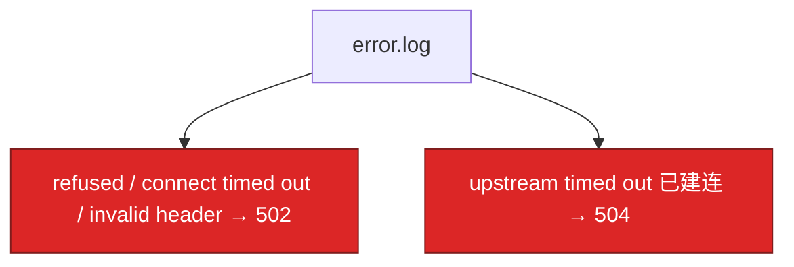
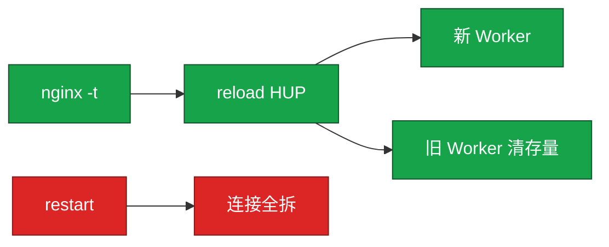

# 23｜Nginx · 练习题

先对照 [知识点](知识点.md)：**先 §2 总图，再 §5 upstream，再 §6 502/缓冲，再 §7 reload**。HTTP 语义 / 超时链口径不够时回 [14](../14-HTTP与TLS/)。每题标了覆盖范围：

| 标记 | 含义 |
|------|------|
| **核心** | 不懂整章就没建立起来 |
| **必会** | 值班和面试都要能讲 |
| **常用** | 线上会反复碰到 |
| **常考** | 白板和追问的高频口径 |

## 本题目录

- [Q1 502 / 504](#q1)
- [Q2 499 与超时链](#q2)
- [Q3 keepalive 三件套](#q3)
- [Q4 reload vs restart](#q4)
- [Q5 缓冲与 504](#q5)
- [Q6 限流](#q6)
- [Q7 worker 与连接](#q7)
- [Q8 upstream 算法](#q8)
- [Q9 两列时间](#q9)
- [Q10 location / proxy_pass](#q10)
- [Q11 证书](#q11)
- [Q12 动静分离](#q12)
- [合上书](#合上书)

---

## Q1

**★★★★★｜大量 502，怎么查？和 504 怎么分？**

**覆盖**：核心 · 必会 · 常考

**对应**：知识点 §6 · §10 · 语义见 09

### 场景

登录全 502。有人重启全部逻辑服。error.log 里其实是 `Connection refused`。

### 完整解答

**一句话**：502 是没拿到合法上游响应，504 是连上了读超时——先看 error.log，不要先重启逻辑服。

502 = **没拿到合法上游响应**（没起来、拒连、RST、非 HTTP）。504 = **连上了但读超时没回完**（也可被缓冲/盘拖出，见 Q5）。



链：error.log → 进程和端口 → `curl` 上游 → 连接数 → `nginx -T` upstream。111 refused：起后端，别先重启 Nginx。110：安全组/路由。prematurely closed：上游崩或 keepalive 配错。no live upstreams：全被 max_fails 摘了 → 常 503。不要重启还在跑的战斗进程。

### 再追问

upstream sent invalid header？——上游不是 HTTP（TLS 打到明文、打印了调试二进制）。`curl -v` 看首字节；不够再抓包（11）。

---

## Q2

**★★★★★｜499 和 504 同时出现，超时怎么配？**

**覆盖**：核心 · 必会 · 常考

**对应**：知识点 §6.4 · 口径主责 [14](../14-HTTP与TLS/)

### 场景

玩家 APP 超时 15s，Nginx `proxy_read_timeout 60s`，Java 120s。活动时 499 和 504 都有。

### 完整解答

**一句话**：超时必须外短内长——客户端 < Nginx < 应用；499 是客户端先走，504 是 Nginx 先走（语义见 09）。

必须 **客户端 < Nginx < 应用**。APP/SLB 15s 先断 → Nginx 记 499，Java 还在算。Nginx 先到 → 504。先对齐（例如 15 < 20 < 30），再优化慢查询。只加大 Nginx 到 300，玩家设备 15s 照样 499。

看 access 的 `$request_time` vs `$upstream_response_time`：上游已经很长、status 499 = 客户端不等了。

### 再追问

SLB 60s、Nginx 30s 会怎样？——Nginx 先 504，玩家看到失败，SLB 还没到自己的超时。外层更长、里层更短，504 为主。

---

## Q3

**★★★★★｜upstream 写了 keepalive 32，后端 TIME_WAIT 仍爆？**

**覆盖**：核心 · 必会 · 常用

**对应**：知识点 §5.3

### 场景

短连接打满逻辑端口（[24](../24-内核参数与sysctl/)）。upstream 里明明有 keepalive。

### 完整解答

**一句话**：keepalive 三件套缺一不可——`keepalive N` + HTTP/1.1 + `Connection ""`，少任一行等于没开池。

三件套：`upstream { keepalive 32; }` + `proxy_http_version 1.1` + `proxy_set_header Connection ""`。HTTP/1.0 代理默认易 `Connection: close`。少后两行等于没开池，每次新建 TCP。入口 Keep-Alive 与上游池的语义分工见 09；本章钉指令。

### 再追问

keepalive 太大有什么问题？——占满上游 fd、空闲连接过多。32～100 常见，配合后端超时。不是越大越好。客户端 HTTP/2 到 Nginx，上游仍常 1.1 池——两段别混。

---

## Q4

**★★★★★｜reload 会不会断现有连接？和 restart 呢？**

**覆盖**：核心 · 必会 · 常考

**对应**：知识点 §7

### 场景

改个 header 有人 `systemctl restart nginx`，大厅 HTTP 长轮询全断。

### 完整解答

**一句话**：先 `nginx -t` 再 reload 平滑接新、旧 Worker 清存量；restart 会拆全部连接。

`nginx -t` 再 `nginx -s reload`：Master HUP → 新 Worker 接新连接；旧 Worker 把存量处理完再退。**平滑。** restart：先停后起，连接全拆。`kill -9` 更粗。长连接再加 `worker_shutdown_timeout`。语法错误则新 Worker 起不来，旧配置继续——所以必须先 `-t`。



### 再追问

战斗 TCP 能靠 Nginx reload 平滑吗？——HTTP 反代不要扛战斗。四层走 [18](../18-LVS与四层负载均衡/)/[20](../20-HAProxy与Keepalived/)。reopen 只切日志 fd，不换配置。

---

## Q5

**★★★★★｜上游不慢，为什么还会 504？和 proxy_buffering 有关吗？**

**覆盖**：核心 · 必会 · 常用

**对应**：知识点 §6.3 · §9.1

### 场景

上游 P99 正常，Nginx 大量 504。有人要把 `proxy_read_timeout` 改成 300s。另有人把 `proxy_buffering` 改成 off「加速」。

### 完整解答

**一句话**：504 不只是上游慢——缓冲落盘/盘满、写慢客户端、ssl 卡顿都会让总时间顶满；API 默认 on，off 更易被慢客户端拖死 Worker。

先看两列时间：`rt ≫ urt` → 卡在 Nginx 侧。查 `df`（temp file）、慢客户端、缓冲配置。一般 API **保持 buffering on**，避免上游被慢客户端拖死；`off` 边收边转，占 Worker 更久，适合特殊流。不要用 timeout=300 当修复（09）。

### 再追问

`proxy_max_temp_file_size 0` 干什么？——禁止响应落盘；大响应可能直接失败或占更多内存，要按业务选，不是万能开关。

---

## Q6

**★★★★☆｜活动接口怎么限流？burst 和 nodelay？**

**覆盖**：必会 · 常用 · 常考

**对应**：知识点 §8.5

### 场景

领奖被刷。要保正经玩家短时高峰。

### 完整解答

**一句话**：`limit_req` 用 burst+nodelay 扛突发，超 burst 仍拒；下载用 limit_conn。

```nginx
limit_req_zone $binary_remote_addr zone=api:10m rate=100r/s;
location /api/activity/ {
    limit_req zone=api burst=200 nodelay;
    limit_req_status 429;
}
```

`rate` 长期速率；`burst` 桶深；`nodelay` 突发立刻处理，超 burst 仍拒。不 nodelay 则排队匀速，延迟变差。下载用 `limit_conn`。按玩家 ID 的动态网关在 [02-04](../../02-中间件与数据库/04-接入网关/)。NAT 出口会让「按 IP」变成「按整栋楼」。

### 再追问

503 和 429？——你指定 `limit_req_status 429` 就 429；默认可能 503。conn 限制常用 503。和「上游全死」的 503 要靠日志区分（`no live upstreams`）。

---

## Q7

**★★★★☆｜worker 数、最大连接怎么算？**

**覆盖**：必会 · 常用

**对应**：知识点 §3 · §8.7

### 场景

32 核机器 `worker_processes 64`，延迟变差。

### 完整解答

**一句话**：worker_processes 用 auto=核数；反代 fd 约 ×2，nofile 要更大。

`auto` = 核数。事件驱动单 Worker 已能高并发，多 Worker 是为了用多核。多于核数 = 抢同一 CPU。上限 ≈ 核数 × `worker_connections`。反代 ×2 fd。`worker_rlimit_nofile` 必须更大，否则连接数上不去（[24](../24-内核参数与sysctl/)）。

### 再追问

multi_accept 呢？——一次 accept 多个新连接，高峰建连快。不是「多 Worker」。Master 接业务连接吗？——不接，只管进程和信号。

---

## Q8

**★★★★☆｜ip_hash、least_conn 怎么选？max_fails 摘光了？**

**覆盖**：必会 · 常用 · 常考

**对应**：知识点 §5.1 · §5.2

### 场景

有状态购物车用轮询，用户乱跳。或一台慢机把 least_conn 全吸走。全摘后 access 503。

### 完整解答

**一句话**：无状态轮询；会话粘滞 ip_hash；长连接 least_conn；全摘先看后端是否真死。

无状态轮询/加权。会话粘滞 ip_hash（换 IP / NAT 出口会破功）。长连接、耗时不均 least_conn。backup 只在全挂时上。`max_fails` + `fail_timeout` **被动**摘。全摘 → `no live upstreams` 503。先看后端是不是真死，别只加大 fails 掩盖。主动探活开源 Nginx 弱，可前面加 HAProxy httpchk（[20](../20-HAProxy与Keepalived/)）。

### 再追问

502 和 503 怎么分？——502 有上游但响应非法/拒连；503 池里没有 live（或限流）。别对支付 POST 用 `proxy_next_upstream` 盲试 502（09 幂等）。

---

## Q9

**★★★★☆｜怎么从日志判断慢在 Nginx 还是上游？**

**覆盖**：必会 · 常用

**对应**：知识点 §9.1 · §10

### 场景

P99 2s。有人优化 Nginx gzip。

### 完整解答

**一句话**：日志必须有 `$request_time` 和 `$upstream_response_time`；上游≈总时间则后端慢。

上游时间≈总时间 → 后端慢。总时间远大于上游 → 卡在 Nginx（ssl、写客户端、缓冲、磁盘 log/temp）。499 时上游可能仍很大（客户端不等）。502 且 urt 为 `-` → 几乎没连上。

### 再追问

只有 status 没有两列时间怎么办？——先改 log_format，`-t` reload，再排障；没有两列时间等于蒙眼。

---

## Q10

**★★★★☆｜静态打到 Java、改完路径 404，怎么查？**

**覆盖**：必会 · 常用 · 常考

**对应**：知识点 §4.2 · §4.3

### 场景

所有 `.js` 都打到 Java。另一人改 `proxy_pass` 后上游全 404。

### 完整解答

**一句话**：location 优先级 `=` > `^~` > 正则顺序 > 最长前缀；`proxy_pass` 尾斜杠会改 URI——用 `nginx -T` 和 `curl -v` 验证。

静态用 `^~ /static/` 或正则，避免被 `location /` 的反代吃掉。`proxy_pass` 带不带尾 `/` 会替换路径；404 是 URI 问题，不是 502。改完 `-t`、reload、curl 看真实上游路径。

### 再追问

为什么战斗不能挂 HTTP 反代「统一入口」？——长连接没有一次请求结束，七层缓冲/超时会成事故源；战斗走四层 16/24。

---

## Q11

**★★★★☆｜HTTPS 要配哪些？证书过期谁告警？**

**覆盖**：必会 · 常用 · 常考

**对应**：知识点 §8.4 · 握手细节 [14](../14-HTTP与TLS/)

### 场景

只开了 443，协议还允许 TLSv1.0。

### 完整解答

**一句话**：TLS1.2/1.3 + HSTS + OCSP stapling；证书用 blackbox 盯 7 天，不要等玩家报。

TLS1.2/1.3、现代 cipher、session cache、OCSP stapling、HSTS、80 跳 443。证书监控用 [22](../22-监控与告警/) blackbox `probe_ssl_earliest_cert_expiry`，7 天 P1。全链缺中间证，部分客户端会失败。握手/链/0-RTT 细节在 09；本章负责 fullchain + reload 轮转。

### 再追问

http2 和上游 keepalive 关系？——客户端 HTTP/2 到 Nginx，到上游仍常是 1.1 池。两段别混。

---

## Q12

**★★★★☆｜动静分离和 cache 什么时候上？**

**覆盖**：常用 · 常考

**对应**：知识点 §8.6

### 场景

所有 `.js` 都打到 Java。活动静态更新靠清 CDN（[15](../15-DNS与CDN/)）。

### 完整解答

**一句话**：静态 root+长 expires；动态才反代；玩家私有接口不要 cache。

静态 `root` + 长 expires + 可不记 access_log。动态才反代。可缓存接口 `proxy_cache` + `X-Cache-Status`。玩家私有接口不要 cache。资源版本和 CDN 在 10 / [07-06](../../07-游戏运维专题/06-CDN与资源更新/)。

### 再追问

APISIX 能替代这章吗？——动态路由、插件、etcd 热更新在 [02-04](../../02-中间件与数据库/04-接入网关/)。超时链、502/504/499、keepalive 三件套在哪层网关都成立，先在 Nginx 上会讲。

---

## 合上书

与知识点「合上书」对齐：

- [ ] 能默画 §2.0：Master/Worker、双 fd、upstream、reload
- [ ] 能讲 502 vs 504（error.log 关键字）；不重启战斗服
- [ ] 能讲 499/超时外短内长（链到 09）
- [ ] 能默写 keepalive 三件套；说明少一行会怎样
- [ ] 能区分 buffering on/off 与盘满拖 504
- [ ] 能区分 reload / restart / reopen；必须先 `-t`
- [ ] 能配 limit_req + burst + nodelay；能读两列时间
- [ ] 能说 location 优先级与 proxy_pass 斜杠；战斗为什么不走 HTTP 反代
