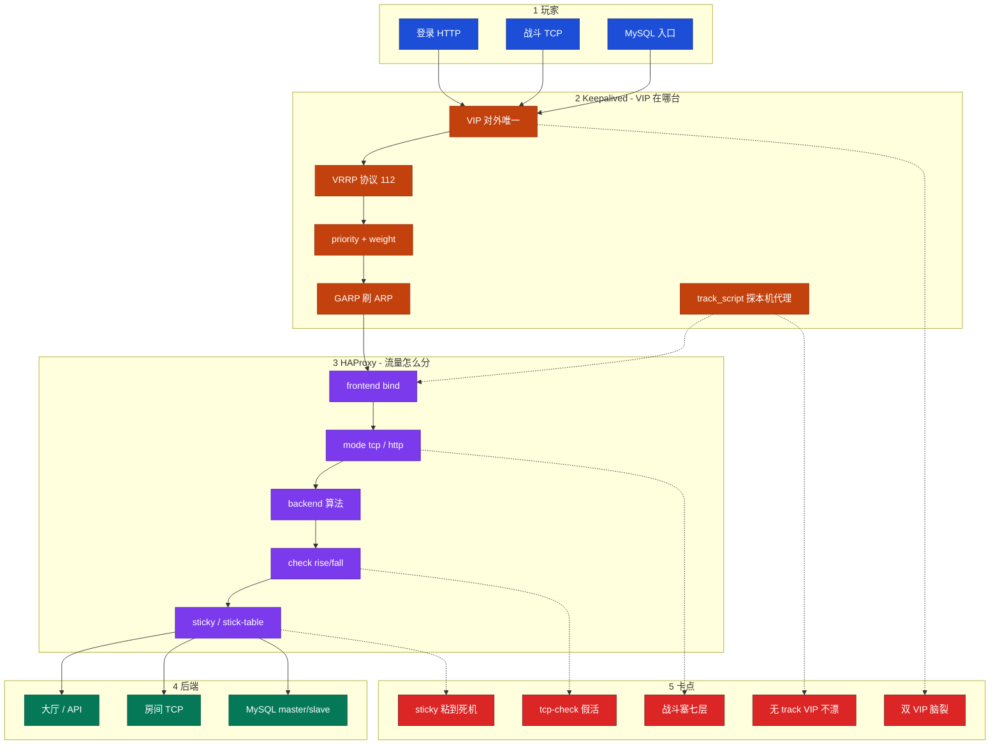
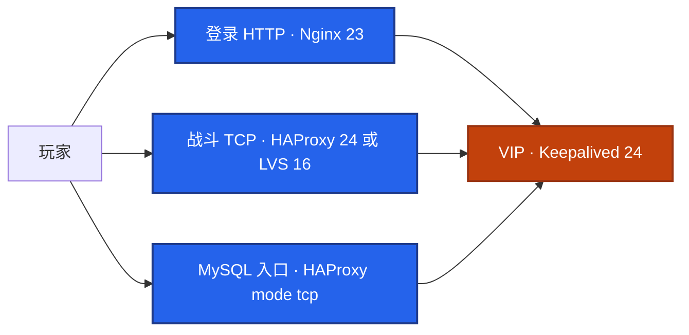
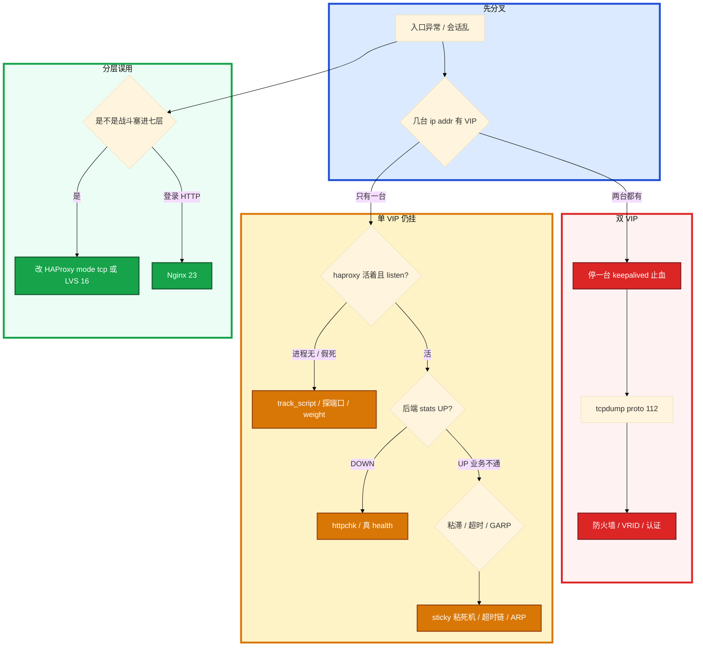

# HAProxy 与 Keepalived

> **这章解决什么**：防火墙改完两台都有 VIP，一半玩家打 A 一半打 B 会话乱；haproxy 进程没了 VIP 还在本机全超时；有人把战斗 TCP 和登录 HTTP 都塞进 Nginx「统一入口」——卡在 **VIP/VRRP**、**四层/七层分法**，还是 **探活假活**？  
> **读法**：**先看总图** → **再走读一次 VIP 漂 + 一次 TCP 转发** → **再认名词** → **再抠脑裂 / 探活 / sticky**。  
> **刻意不展开**：LVS NAT/DR/TUN、ipvsadm、RS ARP → [18](../18-LVS与四层负载均衡/)；Nginx 反代 / 502·504 / reload → [19](../19-Nginx/)；脑裂总论 / RTO → [26](../26-高可用与容灾/)；超时链语义 → [14](../14-HTTP与TLS/)；抓包手法 → [16](../16-网络排障与抓包/)；云 SLB / 专线 → [07](../../06-云平台/)；SSH 跳板 → [28](../28-堡垒机与跳板机/)。

---

## 本章目录

1. [本章定位](#1-本章定位)
2. [先看总图：VIP 与流量怎么分家](#2-先看总图vip-与流量怎么分家) ← **开篇必读**
   - [2.0 全章知识串图](#20-全章知识串图一张把细节串起来) ← **架构总览**
   - [2.1 两层坐标系](#21-两层坐标系keepalived-管-vip--haproxy-管流量)
   - [2.2 完整走读（切主）](#22-完整走读主挂了-vip-怎么漂到备机) ← **一例钉死**
   - [2.3 对照走读（TCP 转发）](#23-对照走读一条战斗-tcp-经-haproxy)
   - [2.4 和邻章怎么接力](#24-和邻章怎么接力一张表)
3. [名词扫盲（对照总图认词）](#3-名词扫盲对照总图认词)
4. [HAProxy：四层 / 七层 / 对象](#4-haproxy四层--七层--对象)
   - [4.5 ACL](#45-七层-acl够用就停别做成网关百科) · [4.6 平滑摘机](#46-平滑摘机disabled--weight-0--drain)
5. [VRRP 与脑裂：本章最易混](#5-vrrp-与脑裂本章最易混) ← **重点精读**
6. [健康检查与 sticky](#6-健康检查与-sticky) ← **重点精读**
7. [落地与配置旋钮](#7-落地与配置旋钮)
8. [命令与操作速查](#8-命令与操作速查)
9. [定责决策树](#9-定责决策树)
10. [去哪章继续学](#10-去哪章继续学)
11. [面试 · 易错 · 数字](#11-面试--易错--数字)
12. [合上书](#合上书)

---

## 1. 本章定位

| 章 | 负责 |
|----|------|
| **06** | 包怎么进主机、Socket/队列、本机「满」 |
| **08** | TCP 握手后慢/断/卡（窗口、重传、心跳） |
| **16** | **内核四层 LVS**：NAT/DR/TUN、ipvs、RS ARP |
| **23** | **Nginx 七层**：反代、upstream、502/504、reload |
| **24（本章）** | **用户态 LB + VIP**：HAProxy 四/七层、健康检查、sticky；Keepalived VRRP、脑裂、track_script |
| **20** | 高可用总论、脑裂概念、RTO |

本章是 **入口双机作战手册**。16 告诉你「内核怎么转」；23 告诉你「HTTP 反代怎么配」；本章告诉你「VIP 漂在哪台、HAProxy 怎么分流量、探活假活怎么认、会话粘住怎么配」。

🎯 **值班签名**：会话乱 / 一半进 A 一半进 B → 先两台 `ip addr` 看 VIP 几个；入口全超时但 keepalived 还在 → 先看 haproxy 是否 listen + track_script；**别先把战斗塞进 Nginx**。

**本章主线（排障就按这三步想）：**

1. **分层**：Keepalived 管 VIP 在哪台；HAProxy 管流量怎么分。两层别混。
2. **协议**：VRRP 是 **IP 协议 112**（不是 UDP 112）；双 VIP 先停一台。
3. **探活**：四层 `mode tcp` + `tcp-check`；七层 `httpchk` 要碰到依赖；sticky 只管「粘」，不管「活」。

**读完你能：** 默画 §2.0；白板上画出 Keepalived + HAProxy 双机；讲清 VRRP 112 / GARP / priority；双 VIP 止血；配 httpchk / tcp-check / stick-table；口述何时用 HAProxy、何时回 16/23。

---

## 2. 先看总图：VIP 与流量怎么分家

> **正确开篇顺序**：先有全局画面，再走读切主与一次 TCP 转发，再认词，再抠脑裂与探活。  
> 先看 **§2.0 全章串图**，再看 **§2.1 两层坐标系**，再用 **§2.2 / §2.3 走读**把 VIP 漂和流量分串起来。

### 2.0 全章知识串图（一张把细节串起来）

> 🎯 **合上书要能默画这张。** 蓝=玩家入口 · 橙=Keepalived/VIP · 紫=HAProxy · 绿=后端 · 红=卡点。  
> 若预览仍报错，以下面 **ASCII 一页板** 为准。



**读图路线：**

| 段 | 记住 |
|----|------|
| ①→② | 玩家只认 VIP；Keepalived 决定 VIP 在哪台（§2.1、§5） |
| ② | VRRP 112 + priority/weight + GARP；track_script 探本机 HAProxy（§5、§7） |
| ③ | frontend → mode → backend → check → sticky（§4、§6） |
| ④ | HTTP 可走 Nginx（23）；战斗/库常走 HAProxy mode tcp；超大入口看 LVS（16） |
| ⑤ | 双 VIP / 不漂 / 假活 / 粘死机 / 塞七层 → 定责树（§9） |

```text
┌──────────────────────────────────────────────────────────────────────────┐
│              24 一张板：Keepalived 管 VIP · HAProxy 管流量                │
├─────────────┬────────────────────┬───────────────────────────────────────┤
│  玩家只认    │  MASTER / BACKUP    │  backend                              │
│  一个 VIP   │  keepalived         │  web / 战斗 TCP / MySQL               │
│             │  VRRP 协议 112      │  mode tcp | http                      │
│             │  track_script       │  httpchk / tcp-check                  │
│             │  GARP 刷 ARP        │  sticky / stick-table                 │
├─────────────┴────────────────────┴───────────────────────────────────────┤
│  脑裂：双 VIP → 先停一台 · tcpdump proto 112 · 不是 UDP 112               │
│  分层：登录可 Nginx(23) · 战斗/库 HAProxy · 超大内核入口 LVS(16)           │
│  探活：进程在 ≠ 在接请求 · httpchk 要碰依赖 · sticky 不管活               │
└──────────────────────────────────────────────────────────────────────────┘
```

### 2.1 两层坐标系（Keepalived 管 VIP · HAProxy 管流量）

**一句话：** 入口故障先分「VIP 层」还是「代理层」——混在一起会停错东西。

```text
① 玩家 / APP / 办公客户端
        │  只认 VIP（例 192.168.1.100）
        ▼
② Keepalived（本章 · VIP 层）
        │  VRRP advert（IP 协议 112）
        │  priority / weight / nopreempt
        │  track_script → 本机 haproxy 活不活
        │  VIP 漂 → GARP（约 1～2s）
        ▼
③ HAProxy（本章 · 流量层）
        │  frontend bind *:80 / *:3306 / *:7777
        │  mode http | tcp
        │  backend balance + check + sticky
        ▼
④ 后端进程
        大厅 HTTP · 房间 TCP · MySQL
```

入口怎么和邻章叠：



可以说「LVS+Keepalived 做超大入口，后面再挂 HAProxy/Nginx」，但 **NAT/DR/TUN 细节留在 16**；本章钉死 **HAProxy 双机 + VRRP + 探脚本 + sticky**。

> **记住**：Keepalived 摘的是「这台还要不要 VIP」；HAProxy 摘的是「后端 server 还接不接新连接」。rise/fall 两层都要连续 N 次，抗抖（见 20）。

### 2.2 完整走读：主挂了 VIP 怎么漂到备机

**一句话：** 主上 haproxy 挂 → track_script 失败降权 → 备机 priority 更高 → 备机挂 VIP + 发 GARP → 玩家新连接打到备机。

场景：MASTER（prio 100）+ BACKUP（prio 90），`weight -30`，`advert_int 1`。

| 步 | 谁 | 发生什么 | 你怎么认 |
|----|-----|----------|----------|
| 1 | 主 | haproxy 进程没了 / 假死 | `killall -0 haproxy` 或 `ss -tlnp` |
| 2 | 主 keepalived | `chk_haproxy` 连续 fall 次失败 | 脚本 exit 1 |
| 3 | 主 | effective priority = 100−30 = **70** | 低于备机 90 |
| 4 | 备 | 收到低 prio advert（或超时）→ 升主 | keepalived 日志 Transition |
| 5 | 备 | `ip addr add VIP` + **GARP** | `ip addr`；`tcpdump arp` |
| 6 | 交换机/邻居 | ARP 表 VIP→备机 MAC | 同网段约 1～2s |
| 7 | 玩家 | 新连接打到备机 HAProxy | 旧 TCP 多半要重连 |

```bash
# 备机上看 VIP 是否出现
ip addr show eth0 | grep 192.168.1.100

# 抓 GARP（谁-has VIP tell VIP）
tcpdump -i eth0 arp -nn -c 5
```

```text
ARP, Request who-has 192.168.1.100 tell 192.168.1.100, length 28
```

**说明什么：** 这是 Gratuitous ARP——新 Master 强制刷「VIP 在我这」。HTTP 短请求常无感；战斗 TCP 存量连接通常断，要靠客户端重连。

**若主挂了 VIP 不漂：** 没 track_script；或 weight 太小（100−10=90 不够低于备机）；或只探 PID、假死脚本仍 exit 0；或 `nopreempt` 场景搞反。→ §5、§9。

### 2.3 对照走读：一条战斗 TCP 经 HAProxy

**一句话：** 四层 `mode tcp` 只转发字节流，不解析 HTTP；超时用分钟级，别继承 defaults 的 30s。

```text
玩家 SYN → VIP:7777
        → 当前持 VIP 的那台 HAProxy frontend
        → mode tcp · balance leastconn（或 sticky）
        → 选 backend server（check UP 的）
        → 与房间建立后端 TCP
        → 双向字节流转发（用户态代理，回程也过 HAProxy）
```

和 LVS DR 的差别（别混）：

| | HAProxy mode tcp（本章） | LVS DR（16） |
|--|--------------------------|--------------|
| 实现 | 用户态代理，两端各一条 TCP | 内核改 MAC，回包常直出 |
| 回程 | **过 HAProxy** | 多数 **不过** LVS |
| 探活 | httpchk / tcp-check 细 | 常 keepalived/外部探针 |
| 适用 | 库入口、中小规模 TCP、要 ACL/Stats | 超大战斗入口 |

```bash
grep -A8 'frontend.*fight\|mode tcp' /etc/haproxy/haproxy.cfg
```

应看到类似：

```text
frontend fight_tcp
    bind *:7777
    mode tcp
    default_backend fight_servers

backend fight_servers
    mode tcp
    balance leastconn
    option tcp-check
    timeout client  30m
    timeout server  30m
    server room1 10.0.0.11:7777 check inter 2s rise 2 fall 3
    server room2 10.0.0.12:7777 check inter 2s rise 2 fall 3
```

> **别混**：战斗长连接挂 Nginx `proxy_pass http://` 是七层事故源（23）。要四层就 HAProxy `mode tcp` 或 LVS（16）。

### 2.4 和邻章怎么接力（一张表）

| 现象 / 问题 | 先想哪章 |
|-------------|----------|
| NAT/DR/TUN、RS 抢 ARP、ipvsadm | [18](../18-LVS与四层负载均衡/) |
| 502/504、reload、upstream keepalive | [19](../19-Nginx/) |
| VIP 双主、VRRP 112、track_script、HAProxy sticky | **本章** |
| 脑裂概念、多数派、RPO | [26](../26-高可用与容灾/) |
| HTTP 超时链「外短内长」语义 | [14](../14-HTTP与TLS/) |
| 抓不到包、PMTUD | [16](../16-网络排障与抓包/) |
| 云 SLB 代替自建 VRRP | [07](../../06-云平台/) |

---

## 3. 名词扫盲（对照总图认词）

对照 §2.0：蓝/橙/紫/绿各一块，词只在首次出现处钉死，别处「见 §x」。

### 3.1 Keepalived / VIP / VRRP

| 名词 | 对照总图 | 一句话 |
|------|----------|--------|
| **VIP** | 段② | 对外宣告的虚拟 IP；玩家只认它 |
| **Keepalived** | 段② | 跑 VRRP、挂/摘 VIP、可跑 track_script |
| **VRRP** | 段② | Virtual Router Redundancy Protocol；**IP 协议号 112** |
| **advert** | 段② | Master 周期性「我还在」通告 |
| **priority** | 段② | 谁更愿意当主；真正谁主看它（不是 `state`） |
| **weight** | 段② | 脚本失败时加减 priority |
| **GARP** | 段② | Gratuitous ARP；新主刷邻居 ARP 缓存 |
| **VRID** | 段② | `virtual_router_id`；同网段撞 id 会乱跳 |
| **nopreempt** | 段② | 原主恢复不抢回，避免二次闪断 |
| **track_script** | 段② | 探本机代理；失败才可能让 VIP 漂 |

### 3.2 HAProxy frontend / backend / mode

| 名词 | 对照总图 | 一句话 |
|------|----------|--------|
| **frontend** | 段③ | 对外 listen；选哪个 backend |
| **backend** | 段③ | 一组 server + 算法 + 探活 |
| **mode tcp** | 段③ | 四层；只转字节流 |
| **mode http** | 段③ | 七层；能看 Host/Path/Cookie/ACL |
| **balance** | 段③ | roundrobin / leastconn / source … |
| **check** | 段③ | 给 server 开探活 |
| **rise / fall** | 段③ | 连续成功才 UP / 连续失败才 DOWN |
| **backup** | 段③ | 其它全挂才接新连接 |
| **Stats** | 段③ | 自带页面 / socket 看会话与 UP/DOWN |

### 3.3 探活 / sticky / 代理方向

| 名词 | 对照总图 | 一句话 |
|------|----------|--------|
| **tcp-check** | 段③④ | 四层探端口通不通；可能假活 |
| **httpchk** | 段③④ | 发 HTTP 探；要碰到业务依赖 |
| **sticky** | 段③ | 同一客户端/会话粘到同一后端 |
| **stick-table** | 段③ | HAProxy 内存表记粘滞键 |
| **正向代理** | （邻） | 代表**客户端**出网（Squid） |
| **反向代理** | 段③ | 代表**服务端**接用户（HAProxy/Nginx） |

值班里怎么认现象：

| 现场说的 | 技术含义 | 你的第一刀 |
|----------|----------|------------|
| 「一半玩家掉线一半正常」 | 双 VIP 脑裂 | 两台 `ip addr` |
| 「入口全超时但进程在」 | HAProxy 假死 / VIP 没漂 | track_script + `ss` |
| 「切主后还是打到旧机」 | GARP 没刷 / 跨三层 | `tcpdump` ARP |
| 「Java 卡死还在接」 | 探活假活 | stats 看 check 类型 |
| 「同一玩家进错房」 | sticky 丢 / 算法打偏 / 双 VIP | 先排除双 VIP |

> **记住**：VRRP 通 ≠ 后面的代理还活着。必须 track_script。sticky 粘住 ≠ 后端还活着——DOWN 后要靠 check 摘掉或重新选机。

---

## 4. HAProxy：四层 / 七层 / 对象

### 4.1 和 Nginx / LVS 怎么选

**一句话：** 库/战斗 TCP、精细探活、Stats → HAProxy；静态/复杂 HTTP → Nginx（23）；超大内核四层 → LVS（16）。

| | HAProxy（本章） | Nginx（23） | LVS（16） |
|--|-----------------|-------------|-----------|
| 定位 | 专业 LB | Web + 反代 + LB | 内核四层转发 |
| 四层 TCP | 原生 `mode tcp` 很强 | `stream` 有 | 本职 |
| 七层 | ACL/Cookie 够用 | 静态、缓存、更花 | 无 |
| 健康检查 | HTTP/TCP/自定义，rise/fall 细 | 开源偏被动 max_fails | 常外置/keepalived |
| Stats | 自带 | 要模块 | ipvsadm |
| 典型 | 库代理、游戏 TCP、纯 LB | 站点、API | 战斗超大入口 |

**现场走一遍**（有人要把游戏战斗 TCP 挂到 Nginx HTTP 反代）：

1. `nginx -T | grep -E 'proxy_pass|stream|listen'` —— 只有 `listen 443 ssl` + `proxy_pass http://`，没有 `stream {}`。
2. **说明**：这是七层 HTTP 反代；战斗帧同步走这里会变成解析、缓冲、超时事故源（23）。
3. 正确：登录 → Nginx；战斗 → HAProxy `mode tcp` 或 LVS。

**面试怎么说**：「战斗 TCP 和 MySQL 入口我用 HAProxy mode tcp；登录静态走 Nginx；超大入口内核转发看 LVS。不是为了统一入口把长连接塞七层。」

### 4.2 核心对象：frontend → backend → server

**一句话：** 请求先进 frontend（bind），再进 backend（算法+探活），最后落到 server。

```text
frontend web_frontend          # 对外门面
    bind *:80
    default_backend web_be

backend web_be                 # 池
    balance roundrobin
    option httpchk GET /health
    server w1 10.0.0.10:8080 check inter 2s rise 2 fall 3
    server w2 10.0.0.11:8080 check inter 2s rise 2 fall 3 backup
```

| 对象 | 管什么 | 挂了你会看到 |
|------|--------|--------------|
| frontend | 端口、ACL、选 backend | `ss` 无 listen；客户端连不上 VIP:port |
| backend | 算法、默认超时、httpchk | stats 里整池红 |
| server | 单机地址、权重、check | 单机 DOWN；流量打偏到剩下的 |

MySQL 读写拆端口（不是解析 SQL 的中间件）：

```text
frontend mysql_write
    bind *:3306
    mode tcp
    default_backend mysql_master

frontend mysql_read
    bind *:3307
    mode tcp
    default_backend mysql_slaves

backend mysql_master
    mode tcp
    server m1 10.0.0.20:3306 check

backend mysql_slaves
    mode tcp
    balance leastconn
    server s1 10.0.0.21:3306 check
    server s2 10.0.0.22:3306 check
```

应用写连 3306、读连 3307。复制本身见 [02-01](../../02-中间件与数据库/01-MySQL/)。

### 4.3 算法：只管「新分配」

**一句话：** 算法决定**下一次新连接**去哪；已有 TCP 不会因为你改 balance 就搬家。

| 算法 | 适用 | 坑 |
|------|------|-----|
| `roundrobin` | HTTP 短请求 | 长连接刚加回的机器易被灌 |
| `leastconn` | TCP 长连接、MySQL | 活动默认优先 |
| `source` | 简单源 IP 粘滞 | NAT 后同出口 IP 扎堆 |
| `uri` / `hdr` | 七层按路径/头 | 仅 mode http |

长连接池优先 `leastconn`。要会话粘住用 sticky（§6），不要指望 rr「碰巧粘住」。

### 4.4 超时：外短内长，长连接别抄 30s

**一句话：** defaults 里 30s 是 HTTP 短请求口径；战斗 TCP 要分钟级，必要时 `timeout tunnel`。

| 旋钮 | 常见 | 改错 |
|------|------|------|
| `timeout connect` | 3～5s | 太大掩盖后端挂 |
| `timeout client` / `server` | HTTP 15～60s；TCP 数分钟 | 战斗只抄 30s →  idle 被踢 |
| `timeout tunnel` | WebSocket / 隧道 | 漏配 → 隧道中途断 |
| `timeout check` | 探活超时 | 太短误摘 |

超时链语义（客户端 < 代理 < 应用）主责在 [14](../14-HTTP与TLS/)；Nginx 侧指令在 [19](../19-Nginx/)；本章钉 HAProxy 配置别抄错 mode。

### 4.5 七层 ACL：够用就停，别做成网关百科

**一句话：** HAProxy ACL 做 Host/Path/灰度分流够用；复杂插件化网关去 APISIX（03-04），静态/证书花活去 Nginx（23）。

```text
frontend api
    bind *:80
    acl is_pay  path_beg /pay
    acl is_gray hdr(X-Gray) -m str 1
    use_backend pay_be if is_pay
    use_backend gray_be if is_gray
    default_backend hall_be
```

| 能力 | 用 HAProxy | 别在这章膨胀 |
|------|------------|--------------|
| Host / Path / Header 分流 | ACL + `use_backend` | — |
| Cookie 粘滞 | §6.2 | — |
| 动态路由 / 插件热更 | — | [02-04](../../02-中间件与数据库/04-接入网关/) |
| 静态缓存、复杂 rewrite | — | [19](../19-Nginx/) |

战斗 TCP **没有** HTTP Header 可灰度——灰度别牺牲长连接四层直通。

### 4.6 平滑摘机：disabled / weight 0 / drain

**一句话：** 维护先停**新连接**，等 `scur` 降再停进程；别直接 `kill -9` 房间。

| 手法 | 效果 | 何时用 |
|------|------|--------|
| `server ... weight 0` | 不再分新连接；存量仍在 | 观察期、软摘 |
| `server ... disabled` | 配置层禁用 | 维护窗口 |
| Stats/`set weight` 运行时 | 临时调，reload 可能丢 | 急救 |
| 直接停后端进程 | 存量立刻断 | 最后手段 |

```bash
# 看某后端当前会话
echo "show stat" | socat stdio /run/haproxy/admin.sock | grep room1
# 等 scur→0 或可接受水位，再停进程 / 扩缩容
```

和 LVS「权重 0 只停新分配」同一值班直觉（16），实现一个在用户态、一个在 ipvs。

---

## 5. VRRP 与脑裂：本章最易混

> 🎯 **全章最易晕的一点单独钉死**：协议号、谁主、双 VIP 止血、和 etcd 的差别。

### 5.1 VRRP：协议 112，不是 UDP 112

**一句话：** VRRP 是 **IP 协议号 112**；防火墙按「UDP 端口 112」写规则会拦掉通告 → 双主。

**打个比方：** 两个人抢一个门牌号——Master 每隔 1 秒喊「我还在」；Backup 约三声没听见就挂上门牌并广播「换人了」（GARP）。

| 参数 | 含义 | 常见值 |
|------|------|--------|
| `advert_int` | 通告间隔 | 1s |
| 超时判定 | 约 `advert_int × 3` | 3s 无 advert 升主 |
| `priority` | 谁更愿意当主 | 100 vs 90 |
| `virtual_router_id` | 同组标识 | 51；撞 id 乱跳 |
| `nopreempt` | 主恢复不抢回 | 避免二次闪断 |
| `weight -30` | 脚本失败降权 | 100−30=70 < 90 才漂 |
| `unicast_peer` | 云上禁组播时 | 仍要放行协议 112 |

`state MASTER/BACKUP` 只是**开机意愿**；**真正谁主看 priority**（含 weight 加减后）。

VRRP 通常要 **二层互通**；跨三层 ARP/GARP 刷不到，表现为「漂了仍打到旧机」。云上组播常被禁：改单播 `unicast_src_ip` + `unicast_peer`，安全组仍放行 **协议 112**。

```bash
tcpdump -i eth0 proto 112 -nn -c 20
```

**面试怎么说**：「VRRP 是 IP 协议号 112，不是 UDP 端口 112。谁主看 priority 不是 state。VIP 切换靠 GARP，一般 1～2 秒，整段常 2～3 秒。」

### 5.2 脑裂：两节点没有 quorum

**一句话：** 双 VIP 先停一台 keepalived；两节点 VRRP **没有 quorum**，停不了写。

**打个比方：** 对讲机被墙隔开，各以为对方死了，同时自封队长。etcd 有多数派能停写；Keepalived 两台没有，只能尽量让通告通。

**现场走一遍**（改完防火墙后两台都有 VIP）：

1. 两台：`ip addr show | grep 192.168.1.100` → 都有 → **脑裂确认**。
2. **止血**：只停一台 `systemctl stop keepalived`（不要两台一起改 priority 对打）。
3. 确认只剩一个 VIP 后：`tcpdump -i eth0 proto 112 -nn`。
4. 抓不到双向 advert → 查防火墙是否把协议 112 当成「UDP 112」拦了（现场最高频）。
5. 若后端已双写 → 按 [26](../26-高可用与容灾/) 选真相、评估 RPO，不是只修 VIP。

**用 ARP 邻居二次确认双主（和 `ip addr` 互补）：**

```bash
# 在第三台同网段机器上
ip neigh show | grep 192.168.1.100
# 脑裂时常看到同一 VIP 对应两个 MAC，或 MAC 来回跳
```

```text
192.168.1.100 dev eth0 lladdr aa:bb:cc:dd:ee:01 REACHABLE
192.168.1.100 dev eth0 lladdr aa:bb:cc:dd:ee:02 STALE
```

**说明什么：** 邻居缓存里 VIP 映射不唯一——和「两台 `ip addr` 都有 VIP」是同一事故的两面。先止血再清邻居、再修 112。


| 现象 | 含义 | 下一步 |
|------|------|--------|
| 两台都有 VIP | 脑裂 | 先停一台 keepalived |
| `ip neigh` VIP 两个 MAC | 邻居看到双主 | 同上；清 stale 后再拨测 |
| `proto 112` 单向 | 通告被挡 | 改防火墙 / 安全组 |
| `virtual_router_id` 撞车 | 两组抢通告 | 规划 VRID |
| `auth_pass` 不一致 | 像看不见对方 | 对齐认证 |
| 漂了业务不通 | GARP / 新主 HAProxy | 查 listen 和本机防火墙 |
| 主恢复又闪一次 | 默认抢占 | 评估 `nopreempt` |

> **别混**：etcd 脑裂靠 quorum 停写；Keepalived 两台**停不了写**。重要数据不要指望 VRRP 当一致性协议。概念总论见 20；本章钉现场止血。

### 5.3 track_script：VRRP 通 ≠ 代理活

**一句话：** 没 track_script 时，keepalived 活着 VIP 就不漂——haproxy 死了玩家仍打到死机。

```bash
# /etc/keepalived/check_haproxy.sh
#!/bin/bash
if ! killall -0 haproxy 2>/dev/null; then
    systemctl start haproxy
    sleep 2
    if ! killall -0 haproxy 2>/dev/null; then
        exit 1
    fi
fi
exit 0
```

| 探法 | 能发现 | 发现不了 |
|------|--------|----------|
| `killall -0` | 进程没了 | 假死不 accept |
| 探端口 / HTTP | 不 listen、拒绝 | 端口活但业务卡死（要更深 health） |
| weight 太小 | — | 降完仍 ≥ 备机 → VIP 不漂 |

weight 算法钉死：**降完必须严格低于备机**。主 100、备 90 → `weight -30` → 70 < 90；`-10` → 90 不够。

两层 rise/fall 别混：

| 层 | 管什么 |
|----|--------|
| HAProxy `rise`/`fall` | 摘不摘 **后端 server** |
| Keepalived script `rise`/`fall` | 这台还要不要 **VIP** |

### 5.4 抢占 vs nopreempt

**一句话：** 默认抢占 = 原主恢复二次 GARP 闪断；生产常 `nopreempt`，把闪留在故障那一次。

| 策略 | 行为 | 何时用 |
|------|------|--------|
| 默认抢占 | 高 priority 回来就抢 | 实验室；要「主永远在指定机」 |
| `nopreempt` | 谁先主谁继续直到它挂 | 生产入口，少一次闪断 |
| 维护窗口 | 手动停备或降权切回 | 轮转升级 |

---

## 6. 健康检查与 sticky

### 6.1 httpchk vs tcp-check：假活长什么样

**一句话：** HTTP 业务用 `httpchk` 且 `/health` 要碰到依赖；纯 `tcp-check` 只证明端口开着。

| 探活 | 配置意图 | 假活画像 |
|------|----------|----------|
| `option tcp-check` | 四层端口 | Java 卡死、accept 队列满但端口仍 LISTEN |
| `option httpchk GET /health` | 七层业务 | `/health` 写死 return 200、不碰 DB/依赖 |
| 外部脚本 | 自定义 | 脚本权限/SELinux 导致总成功或总失败 |

推荐节奏：`inter 2s rise 2 fall 3` —— 两次成功才上、三次失败才下，抗抖。

```text
backend api
    balance roundrobin
    option httpchk GET /health HTTP/1.1\r\nHost:\ health.local
    http-check expect status 200
    server a 10.0.0.10:8080 check inter 2s rise 2 fall 3
    server b 10.0.0.11:8080 check inter 2s rise 2 fall 3
```

游戏 TCP 只能 tcp-check 时：必须有**应用层心跳**或独立探房间逻辑，否则假活进错房。LVS 侧「摘的是新分配、存量不断」口径见 [18](../18-LVS与四层负载均衡/)；HAProxy 用户态代理摘机后，**已建立的会话**是否踢取决于配置与连接是否还活——别和 ipvs 权重 0 混谈。

`option dontlognull`：探活连接不打进日志，否则 access 被淹没。

> **记住**：四层 mode tcp + tcp-check；七层 httpchk 要碰到业务。进程在 ≠ 在接请求。

### 6.2 sticky：粘住会话，不管活死

**一句话：** sticky 让同一客户端/会话打到同一后端；后端 DOWN 后要靠 check 摘除或重新选——sticky **不是**健康检查。

常见三种：

| 方式 | 适用 | 配置直觉 | 坑 |
|------|------|----------|-----|
| `balance source` | 四层简单粘 | 源 IP 哈希 | 经 NAT/SLB 后同出口扎堆 |
| `cookie` 插入/前缀 | 七层 HTTP | `cookie SERVERID insert indirect nocache` | 客户端禁 cookie；多域名 |
| `stick-table` + `stick on` | 四/七层灵活 | 按 src / hdr / cookie 记表 | 表大小、过期、主备表不同步 |

七层 cookie 例：

```text
backend hall
    balance roundrobin
    cookie SRV insert indirect nocache
    option httpchk GET /health
    server h1 10.0.0.10:8080 check cookie h1
    server h2 10.0.0.11:8080 check cookie h2
```

stick-table 例（源 IP 粘 30 分钟）：

```text
backend fight
    mode tcp
    balance leastconn
    stick-table type ip size 100k expire 30m
    stick on src
    option tcp-check
    server r1 10.0.0.11:7777 check
    server r2 10.0.0.12:7777 check
```

**现场易错：**

1. **粘到死机**：server 已逻辑死但 check 仍 UP → 假活问题，先修探活，不是加大 sticky 时间。  
2. **双 VIP 下 sticky 更乱**：一半连接进 A 的表、一半进 B ——先消脑裂。  
3. **主备切换后 stick-table 空了**：新主没有旧表，会话重绑；战斗侧要能重连。  
4. **和 LVS `sh` 搅**：LVS 持久化在 16；本章 sticky 是 HAProxy 用户态表/cookie。

**面试怎么说**：「sticky 解决会话粘滞，不解决探活。源 IP 粘在 NAT 后会扎堆；HTTP 用 cookie；TCP 用 stick-table。先保证 check 真、VIP 唯一，再谈粘。」

### 6.3 切主与 stick-table：表会空

**一句话：** stick-table 在**本机内存**；VIP 漂到备机后，新主没有旧表——会话要重绑，客户端必须能重连。

| 情况 | 结果 | 你怎么应对 |
|------|------|------------|
| VIP 切到备机 | 新主 stick-table 空 | 战斗侧重连；接受短暂打散 |
| 双 VIP | 两套表各粘一半 | **先消脑裂**，sticky 无解 |
| 表 `expire` 太短 | 粘不住 | 按会话时长调，别无限大 |
| 表 `size` 太小 | 新键挤掉旧键 | 看 Stats 表用量；按在线调 |

高阶可做 peers 同步 stick-table（多机共享粘滞），配置重、排障难——活动入口优先「能重连 + check 真」，不要一上来上 peers 百科。需要时查官方 peers 文档，本章不展开。

### 6.4 Stats：一眼看 UP/DOWN 与会话

**一句话：** Stats（页面或 admin socket）是值班第二双眼睛——谁 DOWN、谁打满、谁还在建立。

```bash
echo "show stat" | socat stdio /run/haproxy/admin.sock | column -t -s,
```

典型列怎么读：

| 列（节选） | 含义 | 异常画像 |
|------------|------|----------|
| `status` | UP / DOWN / MAINT | DOWN 却仍有业务投诉 → DNS/旧连接/双 VIP |
| `scur` | 当前会话 | 一台爆、两台 0 → 算法/sticky/权重 |
| `chkfail` | 探活失败次数 | 持续涨 → 真挂或探针误配 |
| `lastchg` | 状态变更多久 | 刚 DOWN 对齐发版窗口 |
| `weight` | 权重 | 0 = 软摘中 |

Stats 必须 **内网 + auth**，公网裸奔等于泄露后端拓扑。

```bash
# 运行时软摘（救急；仍要以 cfg 为准落盘）
echo "set weight fight_backend/room1 0" | socat stdio /run/haproxy/admin.sock
```

> **记住**：看 Stats 前先确认你连的是**持 VIP 那台**的 socket——备机没流量时 Stats 全绿也说明不了玩家侧。

---

## 7. 落地与配置旋钮

### 7.1 双机前置条件

- 两台同规格、**同二层网段**（VRRP/GARP）；安全组放行 **协议 112**（不要写成 UDP 112 端口）。
- HAProxy + keepalived `enable`；VIP 不要和业务 IP 抢 ARP。
- 云上先确认能否自建 VRRP；不行就用云 SLB（07），别硬上组播。
- 验收：单 VIP、`proto 112` 双向、停 haproxy 能漂、httpchk 能摘假活、Stats 鉴权。

### 7.2 HAProxy 最小可跑模板

```text
global
    maxconn 50000
    log /dev/log local0
    user haproxy
    group haproxy
    stats socket /run/haproxy/admin.sock mode 660 level admin

defaults
    mode http
    timeout connect 5s
    timeout client 30s
    timeout server 30s
    option httplog
    option dontlognull

frontend web_frontend
    bind *:80
    default_backend web_backend

backend web_backend
    balance roundrobin
    cookie SRV insert indirect nocache
    option httpchk GET /health
    http-check expect status 200
    server web1 192.168.1.10:8080 check cookie w1 inter 2s rise 2 fall 3
    server web2 192.168.1.11:8080 check cookie w2 inter 2s rise 2 fall 3

frontend mysql_frontend
    bind *:3306
    mode tcp
    default_backend mysql_backend

backend mysql_backend
    mode tcp
    balance leastconn
    option tcp-check
    server mysql-master 192.168.1.20:3306 check
    server mysql-slave  192.168.1.21:3306 check backup

frontend fight_frontend
    bind *:7777
    mode tcp
    default_backend fight_backend

backend fight_backend
    mode tcp
    balance leastconn
    stick-table type ip size 100k expire 30m
    stick on src
    option tcp-check
    timeout client 30m
    timeout server 30m
    server room1 192.168.1.31:7777 check inter 2s rise 2 fall 3
    server room2 192.168.1.32:7777 check inter 2s rise 2 fall 3

listen stats
    bind 127.0.0.1:8404
    mode http
    stats enable
    stats uri /stats
    stats auth admin:CHANGE_ME
```

改配置：`haproxy -c -f /etc/haproxy/haproxy.cfg` 通过后再 `systemctl reload haproxy`。生产避免无脑 restart 闪断存量（与 Nginx reload 口径同思路，见 23）。

### 7.3 Keepalived 最小可跑模板

```text
vrrp_script chk_haproxy {
    script "/etc/keepalived/check_haproxy.sh"
    interval 2
    weight -30
    fall 2
    rise 1
}

vrrp_instance VI_1 {
    state MASTER
    interface eth0
    virtual_router_id 51
    priority 100
    advert_int 1
    # nopreempt          # 生产常打开，避免主恢复二次闪
    authentication {
        auth_type PASS
        auth_pass yourpassword
    }
    virtual_ipaddress {
        192.168.1.100/24
    }
    track_script {
        chk_haproxy
    }
}
```

Backup：同 VRID/VIP/auth/track，`priority 90`，`state BACKUP`。云上禁组播时加：

```text
    unicast_src_ip 192.168.1.2
    unicast_peer {
        192.168.1.3
    }
```

### 7.4 notify：切 VIP 时顺手做事（可选）

**一句话：** `notify_master` / `notify_backup` / `notify_fault` 在角色变化时跑脚本——发飞书、拉起监控、写审计；**脚本失败不要拖死 VRRP**。

```text
vrrp_instance VI_1 {
    ...
    notify_master "/etc/keepalived/notify.sh master"
    notify_backup "/etc/keepalived/notify.sh backup"
    notify_fault  "/etc/keepalived/notify.sh fault"
}
```

| 要求 | 为什么 |
|------|--------|
| 短、可靠、自己写日志 | 卡住会拖切换体感 |
| 别在里面做重变更 | 发版、改 DNS 走变更窗口 |
| 权限与 SELinux 放行 | 和 track_script 同一类坑（17） |

LVS 章只收口「notify 挂了会怎样」；语法与脚本落本章。

### 7.5 旋钮速查（改错会怎样）

| 选项 | 含义 | 改错会怎样 |
|------|------|------------|
| `mode tcp` / `http` | 四层 / 七层 | 战斗走 http → 解析失败 |
| `check` | 开探活 | 不 check = 死后端仍打 |
| `inter 2s` | 间隔 | 太大切得慢 |
| `rise 2` / `fall 3` | 抗抖 | rise=1 抖动上下 |
| `backup` | 主全挂才用 | — |
| `httpchk` / `tcp-check` | 七层 / 四层探 | 假活见 §6.1 |
| `stick on` / `cookie` | 粘滞 | 粘死机；NAT 扎堆 |
| `timeout client/server` | 超时 | 长连接抄 30s 断 |
| `virtual_router_id` | 同组 | 撞 id → VIP 乱跳 |
| `priority` + `weight` | 谁主 | weight 太小不漂 |
| `nopreempt` | 不抢回 | 要不要二次闪断 |
| `advert_int` | 通告间隔 | 太大漂得慢 |
| `unicast_peer` | 单播 VRRP | 仍要协议 112 |
| `notify_*` | 切角色钩子 | 脚本挂不影响 VIP？要测 |
| stats auth | 鉴权 | 公网裸奔 |

### 7.6 上线验收清单（默念一遍）

| # | 验收 | 命令 / 看法 |
|---|------|-------------|
| 1 | 只有一台有 VIP | 两台 `ip addr` |
| 2 | VRRP 双向 | `tcpdump proto 112` |
| 3 | 停 haproxy 能漂 | track_script + weight 算过 |
| 4 | 新主有 GARP | `tcpdump arp` |
| 5 | 业务口在听 | `ss -tlnp` 对 VIP 机 |
| 6 | httpchk 能摘假活 | 故意让 /health 失败看 DOWN |
| 7 | 战斗超时非 30s | cfg 里 timeout 分钟级 |
| 8 | Stats 鉴权 | 仅内网 |
| 9 | 配置可 reload | `haproxy -c` 通过 |
| 10 | 回滚路径清楚 | 旧 cfg / 旧 keepalived.conf |

### 7.7 VPN 与正向代理（入口邻接，点到为止）

| 场景 | 选 |
|------|----|
| 运维进内网 | WireGuard（新）/ OpenVPN（老） |
| 跨云机房 | 云 IPSec / 专线（07） |
| 出海加速 | 云全球加速（GAAP），**不是**给玩家上办公 VPN |
| 构建机出网 | 正向代理 + **`no_proxy` 内网 CIDR** |

正向代理代表客户端出网；反向代理代表服务端接用户（本章/23）。Docker 代理要 systemd `Environment=`，只 `export` 当前 shell 不够。密钥进堡垒/密管（25、17）。

---

## 8. 命令与操作速查

值班四问：**VIP 几个？协议 112 通不通？haproxy 在不在听？stats 里 server 是否 UP？**

```bash
ip addr show
ip neigh show | grep 192.168.1.100
tcpdump -i eth0 proto 112 -nn -c 20
tcpdump -i eth0 arp -nn -c 5
killall -0 haproxy
ss -tlnp | grep -E '80|3306|7777|8080'
haproxy -c -f /etc/haproxy/haproxy.cfg
systemctl reload haproxy
systemctl stop keepalived   # 脑裂止血：只停一台
echo "show stat" | socat stdio /run/haproxy/admin.sock
echo "show table fight_backend" | socat stdio /run/haproxy/admin.sock
/etc/keepalived/check_haproxy.sh; echo $?
journalctl -u keepalived -u haproxy -n 50 --no-pager
```

| 目的 | 命令 | 看什么 |
|------|------|--------|
| VIP 在谁 | `ip addr` | 是否双主 |
| 邻居 MAC | `ip neigh` | VIP 是否两个 MAC |
| VRRP | `tcpdump proto 112` | 通告双向？ |
| GARP | `tcpdump arp` | 切主有没有刷 |
| 配置 | `haproxy -c` | reload 前 |
| 监听 | `ss -tlnp` | VIP 机是否在听业务口 |
| 后端 | stats / `show stat` | UP/DOWN、scur |
| 粘滞表 | `show table` | 键是否异常堆积 |
| 脚本 | 手工跑 check 脚本 | exit 码；权限 |
| 日志 | `journalctl -u keepalived` | Transition to MASTER |
| 止血 | 单台 `stop keepalived` | 只留一个 VIP |

### 8.1 典型输出怎么读

**keepalived 升主：**

```text
(VI_1) Entering MASTER STATE
(VI_1) setting VIP 192.168.1.100
```

**说明：** 本机认为自己是主并挂上 VIP；接着应能抓到 GARP。若日志升主但 `ip addr` 无 VIP → 权限/网卡名/`virtual_ipaddress` 配错。

**haproxy -c 失败：**

```text
[ALERT] parsing [/etc/haproxy/haproxy.cfg:88]: 'server' expects <name> ...
Configuration file is invalid
```

**说明：** 禁止 reload；修好再 `-c`。和 Nginx `-t` 同一纪律（23）。

**show stat 节选（CSV）：**

```text
fight_backend,room1,10.0.0.11:7777,...,UP,...
fight_backend,room2,10.0.0.12:7777,...,DOWN,...
```

**说明：** room2 DOWN → 新连接不应再去；若玩家仍进 room2 → 查 sticky 旧键、双 VIP、或客户端直连了实 IP。

### 8.2 值班操作清单

**加后端（低权重观察再拉满）：** 改 cfg → `-c` → reload → stats 看 UP → 再提 weight。  
**摘后端维护：** weight 0 或 disabled → reload → 等 scur 降再停进程。  
**切 VIP 演练：** 停主 haproxy（有 track）或降主 priority → 备机 `ip addr` + 业务拨测。  
**脑裂急救：** 选业务更完整的一台留下，另一台 `stop keepalived` → 抓 112 → 修防火墙 → 再启。

不要只 `ping VIP`。ICMP 通 ≠ 业务口在听。

更强探脚本（端口级，防假死）：

```bash
#!/bin/bash
# 进程在且 7777 在听才算成功（按实际口改）
killall -0 haproxy 2>/dev/null || exit 1
ss -tlnp | grep -q ':7777' || exit 1
exit 0
```

---

## 9. 定责决策树

三问：VIP 几个？协议 112 通不通？代理还在接请求吗？



| 现象 | 先做 | 别做 |
|------|------|------|
| 两台都是 MASTER、都有 VIP | 停一台；`tcpdump proto 112` | 两台同时调 priority 对打 |
| VIP 不漂 | priority/weight 算完；脚本 exit；`nopreempt` | 只重启业务 Pod |
| 漂了但业务不通 | 新主 HAProxy listen；防火墙；GARP | 当后端全死重启战斗服 |
| 漂得慢 | `advert_int` 太大 | — |
| Java 卡死仍 UP | httpchk 碰依赖 | 加大 timeout 掩盖 |
| 同一玩家进错房 / 粘死机 | 先排除双 VIP；再看 sticky+check | 先改算法碰运气 |
| 主恢复又闪一次 | 评估 nopreempt | 当成又一次故障切来切去 |
| 战斗长连接 502/缓冲怪 | 是否误走 Nginx 七层 | 在 Nginx 上加 proxy 超时硬扛 |
| 构建机设了代理连不上 Harbor | `no_proxy` 内网 CIDR | 只 export 当前 shell |

活动高峰入口：确认 **VIP 唯一** → HAProxy listen → 后端 health → sticky/算法。**不要把 VRRP 抖动当成要重启逻辑服；不要把战斗切到 Nginx。**

---

## 10. 去哪章继续学

| 你想搞懂 | 去 |
|----------|-----|
| LVS NAT/DR/TUN、ipvsadm、RS ARP | [18](../18-LVS与四层负载均衡/) |
| Nginx 反代、502/504、reload | [19](../19-Nginx/) |
| HTTP 超时链、TLS | [14](../14-HTTP与TLS/) |
| 包进主机、队列 | [12](../12-网络栈与Socket/) |
| TCP 心跳、空闲断连 | [13](../13-TCP与UDP/) |
| 抓包、路由深排 | [16](../16-网络排障与抓包/) |
| 脑裂 / RTO 总论 | [26](../26-高可用与容灾/) |
| 云 SLB、专线 | [07](../../06-云平台/) |
| 堡垒机、跳板 | [28](../28-堡垒机与跳板机/) |
| MySQL 复制 | [02-01](../../02-中间件与数据库/01-MySQL/) |

---

## 11. 面试 · 易错 · 数字

| 问 | 答 |
|----|-----|
| Keepalived 和 HAProxy 各管什么？ | Keepalived 管 **VIP 在哪台**；HAProxy 管 **流量怎么分**。 |
| 战斗 TCP 走哪？ | HAProxy `mode tcp` 或 LVS（16）；**不**走 Nginx HTTP 反代。 |
| VRRP 是 UDP 112 吗？ | **否**；是 **IP 协议 112**。 |
| 谁主看 state 还是 priority？ | **priority**（含 weight）；state 只是开机意愿。 |
| 双 VIP 先做什么？ | **停一台** keepalived，再抓 proto 112。 |
| 和 etcd 脑裂一样吗？ | **不一样**；两节点 VRRP 无 quorum，停不了写。 |
| HAProxy 挂了 VIP 不切？ | 无 track_script / weight 不够 / 只探 PID。 |
| httpchk 只 200 行吗？ | **不行**；health 要碰到依赖。 |
| sticky 能代替探活吗？ | **不能**；粘死机更惨。 |
| 主恢复要不要抢回？ | 生产常 **nopreempt**，少一次闪断。 |

| 说法 | 对错 | 口径 |
|------|:----:|------|
| 入口有 Nginx 就不必 HAProxy | 错 | 库/战斗 TCP/精细探活用 HAProxy |
| 战斗长连接和登录都塞七层 | 错 | 长连接走四层 |
| VRRP 是 UDP 端口 112 | 错 | **IP 协议号 112** |
| `state MASTER` 决定谁主 | 错 | 看 priority |
| 两节点 VRRP 有 quorum | 错 | 没有；会双 VIP |
| 脑裂和 etcd 一样停写 | 错 | Keepalived 停不了写 |
| 只探 PID 就等于代理活着 | 错 | 假死不 accept 要探端口 |
| weight -10 一定能切（主 100 备 90） | 错 | 100−10=90 不够；要低于备机 |
| httpchk 只 200 即可 | 错 | health 要碰到依赖 |
| sticky 坏了先改算法 | 错 | 先排除双 VIP 与假活 |
| 玩家加速走办公 VPN | 错 | GAAP / 云加速，不是 WireGuard 办公 |
| 正向代理不用 no_proxy | 错 | 内网会绕一圈失败 |
| 双 VIP 先两台一起改优先级 | 错 | 先停一台止血 |
| Keepalived 不能管 LVS | 错 | 能，那是 16；本章是 HAProxy 双机 |
| 主恢复必须抢回 VIP | 错 | nopreempt 可避免二次闪 |
| HAProxy 回程和 LVS DR 一样直出 | 错 | HAProxy 是用户态代理，回程过它 |

**数字**：协议 **112**；GARP **1～2s**；整段切 **2～3s**；`advert_int` 常见 **1s**，超时约 ×3；priority **100/90**，weight **-30**；`inter 2s rise 2 fall 3`；VRID 例 **51**；stick-table 例 `expire 30m`。

**易混**：HAProxy vs Nginx vs LVS；VIP 层 vs 流量层；协议 112 vs UDP 112；抢占 vs nopreempt；tcp-check vs httpchk；sticky vs 探活；balance source 扎堆 vs cookie；脑裂止血 vs 修数据；HAProxy 用户态回程 vs LVS DR 直出。

---

## 合上书

1. **默画 §2.0**：Keepalived 管 VIP、HAProxy 管流量；卡点五块是什么。  
2. **口述 §2.2 走读**：主挂 → track → 降权 → 备机 VIP + GARP。  
3. **讲清**：四层/七层怎么选 HAProxy / Nginx / LVS；战斗为何不走七层。  
4. **讲清**：VRRP 协议号；谁主看 priority；双 VIP 先停一台；和 etcd 差在哪。  
5. **讲清**：httpchk vs tcp-check 假活；sticky 三种做法与「粘死机」。  
6. **定责**：VIP 不漂 / 漂了不通 / 会话乱 —— 先走 §9 哪条分支。  

六题都能口述，这一章就过了。下一章把人怎么进生产焊死：堡垒机、审计、二次认证、最小权限 → [28](../28-堡垒机与跳板机/)。内核超大入口回 [18](../18-LVS与四层负载均衡/)；HTTP 反代回 [19](../19-Nginx/)。
