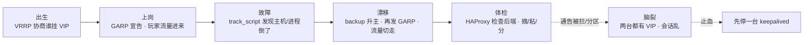
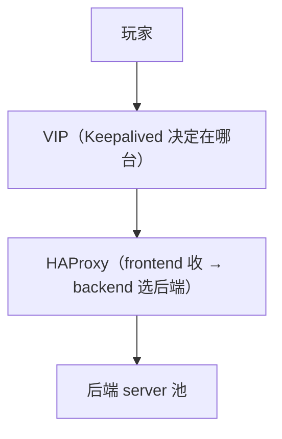
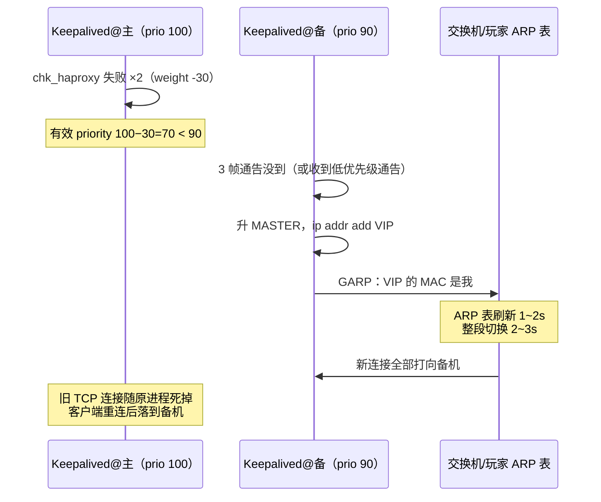
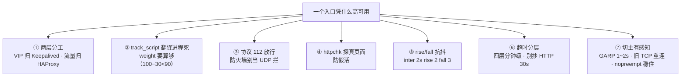
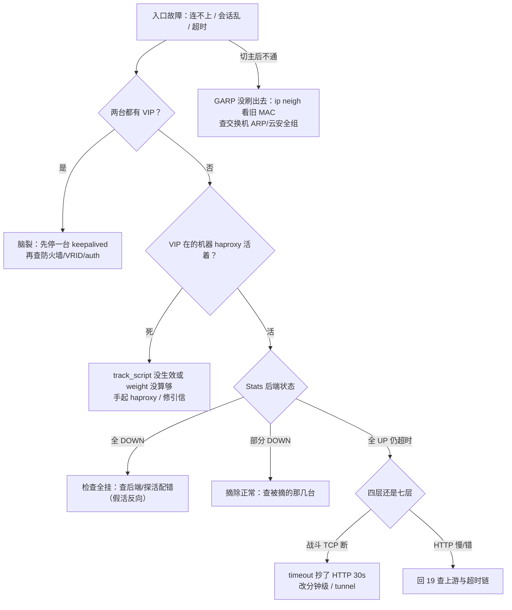

# HAProxy 与 Keepalived

> 防火墙一改两台都有 VIP，一半玩家打 A 一半打 B 会话全乱；haproxy 进程死了 VIP 还挂在本机，入口整段超时；还有人要把战斗 TCP 和登录 HTTP 一起塞进 Nginx「统一入口」。
> **本章回答**：一次故障里 VIP 的一生——平时谁挂它（VRRP）、主机倒了它怎么漂（GARP）、漂过去谁分流量（HAProxy）、后端坏了怎么摘（健康检查）、最坏时它怎么一分为二（脑裂）。
> **不讲**：LVS 的 NAT/DR/TUN 与 ipvsadm → [18](../18-LVS与四层负载均衡/)；Nginx 七层反代与 502/504 → [19](../19-Nginx/)；高可用总论与 RTO → [33](../33-高可用与容灾/)；超时链语义 → [14](../14-HTTP与TLS/)；抓包手法 → [16](../16-网络排障与抓包/)；云 SLB/专线 → [06](../../06-云平台/)。

**标记**：🎯重点 · 🔥难点 · ⭐常考 · 🔧实操

---

## 一、一张图：一次故障里 VIP 的一生

> 🎯 **一句话**：VIP 的一生六段——出生、上岗、故障、漂移、体检、脑裂；坏了先问它在哪一段。



**读图**：

- 主线是一条 VIP 在一次故障里的完整经历；Keepalived 管「VIP 在哪台」（出生/漂移/脑裂），HAProxy 管「流量怎么分」（体检这一段）——**两层各管一段，混了就查不动**。
- 「体检」是常态段：VIP 没故障时 HAProxy 也在持续检查后端、摘除、粘会话；值班大部分时间在管这一段。
- 脑裂不是新故障，是「漂移」这步被掐断后的坏结局：该发生的切换只发生了一半。

### 两层坐标系 🎯⭐



**读图**：Keepalived 的健康对象是「本机」（本机 HAProxy 活不活），HAProxy 的健康对象是「后端」（server 活不活）——**两层检查、两层摘除，节奏不同**：后端坏摘 server（秒级、多次发生），整机坏摘 VIP（切主、低频大动作）。

---

## 二、出生：VRRP 协商谁挂 VIP

> 🎯 **一句话**：VRRP 用优先级选主，谁的 priority 高谁挂 VIP；备机只在收不到通告时才上位。

**VRRP（Virtual Router Redundancy Protocol，虚拟路由器冗余协议）**是 Keepalived 的心脏：几台机器共用一个虚拟 IP，其中一台当 MASTER 挂着它，其余当 BACKUP 待命。两个硬事实先钉死：

- **VRRP 是 IP 协议号 112**，不是 UDP 也不是 TCP——`proto 112` 直接跟在 IP 头后面。防火墙放行写 `iptables -p vrrp` 或 `proto 112`；写成「放行 UDP 112」等于没放行，通告被拦 → 收不到对方心跳 → 双方都觉得自己是主（脑裂的常见引信，六节）。协议细节归 [17](../17-iptables与conntrack/)。
- **VRRP 通告走组播、只在二层**：主每 `advert_int 1s` 往 `224.0.0.18` 发一帧通告，**要求两台在同一个二层广播域**（同交换机/同 VPC 子网）。跨三层（不同子网、跨机房）标准组播模式不可用——云上常禁组播，改单播：

```text
    unicast_src_ip 10.0.0.2        # 自己的物理 IP
    unicast_peer { 10.0.0.3 }      # 对端的物理 IP：两台互指
```

- 配置成对出现：两台 keepalived.conf **几乎完全一样**，只差 `state`（MASTER/BACKUP）和 `priority`（100/90）两行——其他任何一行不一致（VRID、auth_pass、VIP、网卡名）都是「互相听不懂」的隐患。发布用配置管理工具下发同一份模板再改这两行，不要两台各手改各的。

> 💡 **打个比方**：两台机器像同一岗位的正值班和替补，靠班前会互相喊到（每秒一帧通告）。替补连续几秒没听到正值班喊到，才认为他倒了、自己顶上——**判定依据是「对方的声音」**，所以声音（通告）被捂住比人真倒下更危险。

### 最小模板与三个字段 🔧⭐

```text
/etc/keepalived/keepalived.conf
vrrp_script chk_haproxy {           # 健康脚本（三节漂移的引信）
    script "killall -0 haproxy"     # 进程在不在（只测进程，局限见三节）
    interval 2                      # 每 2s 查一次
    weight -30                      # 失败时 priority 减 30
}
vrrp_instance VI_1 {
    state MASTER                    # 初始姿态，不是权力
    interface eth0
    virtual_router_id 51            # VRID：同一二层内必须唯一
    priority 100                    # 真正的权力：100 > 90 者为主
    advert_int 1                    # 1s 一帧通告，失联判定 ≈ 3×advert
    authentication { auth_type PASS auth_pass 1111 }   # 两台必须一致
    virtual_ipaddress { 10.0.0.100/24 }                # VIP 本体
    track_script { chk_haproxy }    # 挂上引信
}
```

- **`priority` 决定一切**：100 与 90，高的当主；同优先级比 IP。**`state` 只是初始姿态**——配置写反了 state，开机后照样按 priority 重新选出主。
- **`virtual_router_id`（VRID）**：同一二层里的 VRRP 房间号。两套集群撞了 VRID（比如都是 51），互相能听见对方的通告，会误判「有人跟我抢」来回切主——**同网段多套 keepalived 必须错开 VRID**，这是经典撞车事故。
- **`auth_pass` 两台必须一致**，不一致=互相听不懂对方，等于失联。
- 失联判定 ≈ **3 个 advert 周期**（`advert_int 1s` 约 3s）：不是一帧没到就切。
- **通告帧里带着发送者的 priority**：备机「听帧比大小」，收到的比自己的高就继续当备，低就抢，收不到才计时——没有握手、没有协商，这就是 VRRP 全部的「民主」。
- **priority 取值 1~255**，越大越优先；版本上 VRRPv2 配 IPv4、VRRPv3 配 IPv6（通告间隔可细到毫秒）——两台的 keepalived 版本行为要一致，混了互相不认。

> ⚠️ **别混**：**priority ≠ state**。面试答「state MASTER 的当主」只对开机一瞬间；运行中谁主谁备永远由（叠加 weight 修正后的）priority 说了算。

> 📝 **面试**：「VRRP 是 IP 协议 112、组播、只在二层；priority 选主，advert_int 1s、约 3 帧失联判切；VRID 同二层必须唯一，撞了互相抢主。」

### 🔍 现场：双机状态一眼对齐

> 🔍 **现场**：怀疑两台「不是一个 VRRP 实例」，跑这三条对齐。

```bash
grep -E 'state|priority|virtual_router_id|auth_pass' /etc/keepalived/keepalived.conf
journalctl -u keepalived -n 20 | grep -iE 'MASTER|BACKUP|FAULT'
tcpdump -ni eth0 vrrp -c 5
```

```text
state MASTER; priority 100; virtual_router_id 51; auth_pass 1111   ← 这台自认为是主
Keepalived_vrrp[812]: (VI_1) Entering MASTER STATE                 ← 最近一次升主动作
10.0.0.2 > 224.0.0.18: VRRPv2, Advertisement, vrid 51, prio 100    ← 只有 prio 100 在飞=单主正常
```

**读数**：两台的 vrid/auth 必须完全一致、priority 必须错开；journalctl 里如果两台最近都有 `Entering MASTER STATE`，脑裂或抢主已经发生过——时间点直接就是排查的起点。

---

## 三、上岗与故障：GARP 宣告，以及通告怎么停

> 🎯 **一句话**：VIP 生效 = 挂 IP + 发 GARP 刷全网 ARP 表；故障 = 通告消失，备机按 3 帧超时判定。

**GARP（Gratuitous ARP，免费 ARP）**是 VIP 上岗的动作：机器对 VIP 发 ARP 应答（没人问也答），把「这个 IP 的 MAC 是我」刷进交换机和同网段所有机器的 ARP 缓存。没有 GARP，IP 挂上了也没人知道该把包发给谁。

> 💡 **打个比方**：GARP 像搬家后在小区门口贴告示——不等邻居来问「新住户是谁」，主动对全楼广播「这间房现在归我」。谁家通讯录（ARP 表）没刷新，就还把信投去旧地址。

```bash
tcpdump -ni eth0 vrrp              # 看通告（proto 112）在不在飞
ip addr show eth0 | grep 10.0.0.100   # VIP 挂没挂在本机
```

```text
10.0.0.2 > 224.0.0.18: vrrp 10.0.0.2 > 10.0.0.3: VRRPv2, Advertisement, vrid 51, prio 100
# ← 主机每秒一帧；备机不发，只听
```

**故障的样子**分两种：**整机挂**（通告戛然而止，备机 3 帧超时后升主——四节走读）和**进程挂**（机器活着、haproxy 死了，通告照发——这就是 `track_script` 存在的理由：Keepalived 自己不知道「同机的 HAProxy 死了」，要靠脚本把这件事翻译成 priority 下降，四节）。

> ⚠️ **别混**：`killall -0 haproxy` 只测**进程存在**——进程僵死不退出、listen 端口还在但应用不干活（假活），它测不出来。要测「真的能服务」得写端口级/HTTP 级脚本（`curl -sf http://127.0.0.1:8404/haproxy_health`），代价是脚本本身也要人管。

---

## 四、漂移：主机倒了，VIP 怎么搬到备机 🔥⭐

> 🎯 **一句话**：track_script 失败 → priority 100−30=70 < 90 → 备机升主挂 VIP 发 GARP → 流量整段切走。

一次完整切主的走读（本章的一例钉死）：



**读图**：三处最容易答错的细节——①**weight 的算术**：`weight -30` 让 100 变 70，**必须低于**对端的 90 才触发切换（100−30=70小于 90 成立；priority 200−30=170>90 就切不动，weight 没算够等于没配）；②**切换有感知**：GARP 刷 ARP 表要 1~2s，整段 2~3s，期间新建连接可能丢一两次重试；③**旧 TCP 不搬家**：VIP 漂移救的是「新连接有地方去」，玩家已建立的连接随原进程断开、靠客户端重连恢复——战斗 TCP 的重连风暴就是这么来的，所以切主要低频、要有预热。

### 切完之后：抢不抢回 ⭐

原主修好了重新加入，**默认抢占（preempt）**：priority 100 恢复 > 90，VIP 又切回来——刚稳定的会话再乱一次。低频会话的场景用 **`nopreempt`** 配在 BACKUP 上：不主动抢回，让现任继续干，避免二次抖动。代价：资源分布不再和 priority 对齐（比如原主配置更高却闲置），要靠人工窗口主动切回。

> ⚠️ **别混**：**抢占 vs nopreempt** 是「修好后抢不抢回」，不是「故障时切不切」——故障切换永远会发生，nopreempt 只管恢复后的归属。两台 priority 必须仍然错开，nopreempt 不是把双机改成对等。

切主的动作钩子：`notify_master` / `notify_backup` / `notify_fault`——升主时拉起本机服务、发告警、摘监控静默，都挂在这里（[22](../22-监控与告警/)）：

```text
    notify_master "/usr/local/bin/vip_takeover.sh master"   # 本机升主：发告警、检查 haproxy
    notify_backup "/usr/local/bin/vip_takeover.sh backup"   # 退回备机：恢复静默
    notify_fault  "/usr/local/bin/vip_takeover.sh fault"    # 进 FAULT 态（track 全挂）：P1 告警
```

HAProxy 侧的变更纪律（先 `haproxy -c` 再 reload，存量连接不拆）和 Nginx 同款，细则在五节。起不来先看 `journalctl -u haproxy -n 50`：最常见的死因是 bind 的端口被占（keepalived 抢先或旧进程没退干净），其次是 backend 引用了不存在的 server 名。

> 📝 **面试**：「切主链：脚本失败 weight −30 → 有效优先级 70小于 90 → 备机升主挂 VIP → GARP 刷 ARP 1~2s → 新连接切走、旧 TCP 重连；修好默认抢回，要稳就 nopreempt。」

### 上线验收：切换必须演练过才算有 🔧⭐

纸上配得再对，没演练过的切换等于没配。上线验收五步，一步不过不许收工：

```text
① tcpdump -ni eth0 vrrp -c 5        # 通告在飞、prio 是期望的那台、vrid 正确
② 两台 ip addr show eth0            # VIP 只在主上一台；vrid/auth 两配置一致、priority 错开
③ systemctl stop haproxy（主机）     # track_script 触发切主：watch ip addr 看 VIP 漂过去、计时 2~3s
④ systemctl start haproxy           # 恢复：观察抢回（或 nopreempt 不抢）是否符合预期
⑤ 从外部客户端 curl 入口 + 看 Stats  # 新旧连接都落到该落的机器上
```

**读数**：③ 是关键一跳——**手工制造故障、亲眼看着 VIP 漂走再漂回**，比任何配置评审都有说服力。演练放在低峰窗口，通知业务方（会有一次秒级抖动和重连）；演练结论（实际切换耗时、有无告警风暴）写进上线记录。

---

## 五、干活：HAProxy 怎么分流量

> 🎯 **一句话**：frontend 收流量、backend 选后端；mode tcp 管四层、mode http 管七层——入口的活都在这两个对象里。

```text
/etc/haproxy/haproxy.cfg
frontend lobby_fe
    bind *:443                       # 在 VIP 上听（VIP 在哪台由 Keepalived 决定）
    default_backend lobby_be
backend lobby_be
    balance roundrobin
    server s1 10.0.1.20:8080 check inter 2s rise 2 fall 3
    server s2 10.0.1.21:8080 check inter 2s rise 2 fall 3
```

`check inter 2s rise 2 fall 3`：每 2s 查一次，连续 2 次成功算活、连续 3 次失败摘除——**rise/fall 抗抖动**，一次网络抖动不会把好机器摘掉。数字连起来背：摘一台最快 2s×3=**6s**，认活要 2s×2=**4s**——「摘得快、放得慢」是故意的：坏机器尽快出局，回来必须多观察两拍，防它带病反复横跳。

global 段还差一行常被漏的：`stats socket /var/run/haproxy/admin.sock level admin`——不开运行时接口，摘机只能改配置 reload（全量抖一遍）。五节那套 socat 摘机命令，全部踩在这一行上。

### 四层还是七层：和 LVS、Nginx 的分界 ⭐🔥

| 对比 | HAProxy `mode tcp`（四层） | HAProxy `mode http`（七层） |
|------|----------------------------|------------------------------|
| 认什么 | 只认 IP:端口，转发字节流 | 认路径/头/Cookie，能改写、能粘会话 |
| 能扛 | 战斗 TCP、MySQL、Redis 等任意协议 | HTTP/HTTPS 卸载后 |
| 健康检查 | tcp-check（探端口） | httpchk（探真实接口） |

三家分工记一句话：**LVS 是内核态四层（转发不过用户态，DR 模式回程直出，性能最强但功能最少）→ [18](../18-LVS与四层负载均衡/)；HAProxy 是用户态 LB（四/七层都行，回程必过它）；Nginx 是七层反代（改头/缓冲/TLS 终结最顺手）→ [19](../19-Nginx/)**。战斗 TCP 和 MySQL 这类非 HTTP 协议不进 Nginx——那是把长连接塞进反代的事故源。

### 算法与超时 ⭐

- **balance roundrobin**：无状态同规格，默认。
- **balance leastconn**：长连接、耗时不均——战斗服首选。
- **balance source**：源 IP 哈希粘滞；玩家换 NAT 出口就破功（和 Nginx ip_hash 同病）。
- **sticky 的另两条路**（七层）：`cookie insert indirect nocache`（HAProxy 种 Cookie 认人）和 `stick-table` + `stick on src`（五节展开）。
- **maxconn**：并发连接上限，分三级给——global 段管整个进程、frontend/listen 段管单个入口、server 行管单台后端；到了上限新连接被拒（配合 `timeout queue` 可排队）。它是 HAProxy 版的「worker_connections + limit_conn 合体」，容量估算的锚点，对应关系 → [19](../19-Nginx/) 二节。

```text
timeout connect 3s~5s     # 连后端
timeout client  17s~60s   # 与客户端之间（HTTP 量级）
timeout server  17s~60s   # 与后端之间（HTTP 量级）
timeout tunnel  分钟级     # WebSocket/升级后的长连接
timeout check   2s        # 健康检查
```

四层长连接（战斗 TCP）client/server 要给**分钟级**，别抄 HTTP 的 30s——玩家打到一半被 LB 掐断就是这个。HAProxy 自己也在「外短内长」的链上：**客户端/SLB 的超时 < HAProxy 的 client/server < 后端应用的硬超时**（[19](../19-Nginx/) 的 Nginx 占的是同一条链的七层那一段），完整口径 → [14](../14-HTTP与TLS/)。

### ACL 与平滑摘机 🔧

七层按需分流（够用就停，别把 HAProxy 做成网关百科——动态路由、鉴权、灰度那是 [02-09](../../02-中间件与数据库/09-API网关与服务治理/) 的事）：

```text
acl is_pay path_beg /api/pay
use_backend pay_be if is_pay
```

发布摘机用运行时接口（不改配置、不 reload）：

```bash
echo "set server lobby_be/s1 state drain" | socat stdio /var/run/haproxy/admin.sock
# drain：存量连完、新流量不进；weight 0 / disabled 同族
echo "show stat" | socat stdio /var/run/haproxy/admin.sock | cut -d, -f1,2,18,19,24,25,34 | head
```

```text
lobby_be,s1,UP,1/3,2,1234,100        ← 后端/机器/状态/失败计数/检查号/最后变更秒/权重
```

server 行还有几个状态位和 `set server` 同族：`backup`（主池全摘才上）、`disabled`（配置态直接摘除、运维标记）、运行时 `state ready` 把摘除的机器放回来。**摘机的观察闭环**：drain 之后盯 Stats 的 `scur`（当前连接）归零再停进程——没归零就停，等于把存量玩家硬掐，比不摘还伤。

日志侧两个旋钮：`option httplog`（七层记完整 HTTP 行）和 `option dontlognull`（压掉健康检查和端口扫描产生的空连接日志）——不压的话四层入口的日志一半是 check 噪音，磁盘和采集双双白烧（日志治理 → [23](../23-日志运维/)）。

**变更纪律**（和 Nginx 同款思想，→ [19](../19-Nginx/) 七节）：`haproxy -c -f /etc/haproxy/haproxy.cfg` 过了再动。`systemctl reload haproxy` 的语义是**老进程把监听 socket 移交给新进程**（平滑启动），存量连接留在老进程里处理完、新配置只接新连接——改配置不拆玩家；`systemctl restart` 才是全拆。和「先摘机再停进程」一样，这是 HAProxy 变更的两条铁律。

MySQL 入口是四层经典用法：`mode tcp` 拆 3306（写，指主库）/ 3307（读，指从库池），应用按端口分流——读写拆分的策略层在 [02-01](../../02-中间件与数据库/01-MySQL/)，本章只管入口。

### 边界：正向代理与 VPN（点到为止）

HAProxy/Nginx 在这里是**反向代理（reverse proxy）**——**代表服务端**接收玩家流量；**正向代理（forward proxy）**代表客户端出网（公司出口、翻墙梯子），运维视角的坑是：配了正向代理的机器上，`curl` 会走代理，访问内网要设 `no_proxy`。跨机房互联走 WireGuard/GAAP 专线（[06](../../06-云平台/)），和 VIP 漂移是两套机制。

> ⚠️ **别混**：**正向 vs 反向**的区别是「代表谁」——代表服务端收流量是反向（本章主角），代表客户端出网是正向（`no_proxy` 那套）。别把「给客户端用的 VPN」叫反向代理。

---

## 六、体检：健康检查、摘除与 sticky

> 🎯 **一句话**：后端坏摘 server 是 HAProxy 层的事，整机坏摘 VIP 是 Keepalived 层的事——两层节奏别混。

### 两层摘除 🎯⭐

```text
后端进程死   → HAProxy：check 失败 ×fall → 摘这台 server（秒级，常发生）
本机 HAProxy 死 → Keepalived：track_script 失败 → weight -30 → 摘整个 VIP（切主，低频大动作）
```

**读图**：一台后端挂，流量在 backend 内部重分配，VIP 不动；HAProxy 本身挂，才触发 VIP 漂移。值班时先分清「摘的是 server 还是 VIP」——前者看 Stats 面板，后者看 `ip addr` 和 journalctl。

### tcp-check vs httpchk：假活是头号坑 🔥⭐

| 对比 | `option tcp-check` | `option httpchk GET /health` |
|------|--------------------|------------------------------|
| 测什么 | 端口能不能建连 | 路径返回对不对（配 `http-check expect status 200`） |
| 测不出 | 应用僵死（端口在、人没了）——**假活** | 探错页面（探了个恒 200 的静态页） |
| 适用 | MySQL/Redis/战斗 TCP | HTTP 后端 |

**假活（半死不活）**是四层检查的固有盲区：TCP 握手成功只证明端口有人听，不证明业务能处理。HTTP 后端尽量用 httpchk 并**探真实接口**；`/health` 返回 200 但内部线程池全卡死时，还需要应用自己做深度健康检查。反向坑：httpchk 探了个 nginx 默认页，后端 Java 全挂了检查照样绿——**探错页面 = 没检查**。

> 💡 **打个比方**：tcp-check 是**只看门牌号**——房子在、灯亮着就算有人；httpchk 是**敲门问一句**——真有人应答才算活。假活就是灯亮着但屋里的人已经昏迷。

### sticky：会话粘住的三条路 ⭐

战斗服、大厅这类有状态服务，同一玩家的连接要落到同一台后端：

```text
① balance source        源 IP 哈希——最粗，换出口 IP 就飞
② cookie insert indirect nocache   七层种 Cookie——认人不认 IP
③ stick-table + stick on src expire 30m size 200k   表驱动，可配过期和容量
```

③ 的表是**每台 HAProxy 自己一份、在内存里**——切主后新主没有旧表，玩家第一跳可能换机器：**VIP 漂移救的是「有地方去」，不保证「回到原机器」**。要跨机共享得上 peers 同步（两台互为 peer、表项互相推送，进阶功能，先记住「默认不共享」这个代价）。`expire 30m`：表项 30 分钟没更新就淘汰；`size` 是表容量上限，满了会挤掉最旧的。

> 💡 **打个比方**：stick-table 像健身房的前台登记本——认脸（源 IP）发柜钥匙（路由到某台后端）。换了个前台（VIP 漂到备机），登记本是新的，老会员来还得重新登记一次（第一跳可能换机器）。

### Stats：一块面板看全局 🔧

> 🔍 **现场**：入口异常，先开 Stats 面板（`stats enable` + 访问控制，**必须带鉴权**）再敲命令。

```text
listen stats
    bind *:8404
    stats enable
    stats uri /haproxy?stats
    stats auth admin:<强密码>          # 公网/内网都别裸奔，面板=你的拓扑图
```

看五列：**status**（UP/DOWN/MAINT）、**scur/scur max**（当前/历史峰连接）、**chkfail**（检查失败次数，一台的 chkfail 涨=它被针对）、**lastchg**（状态最后变更距秒，判断「什么时候开始坏」）、**weight**（当前权重）。`show stat` 的 socket 版本输出在上面五节；`show table` 看 stick-table 内容。日志里 `dontlognull` 压掉健康检查噪音。**MAINT 状态是人工摘除**（drain/disabled 的显示形态），不是故障——面板一片 MAINT 先问「谁在发布」，别按事故拉群；drain 的机器仍显示 UP，但 `scur` 不再涨（存量在耗、新流量不进）。

### 收束：一个入口凭什么高可用 🎯⭐

到这里，两层体系的零件齐了。面试问「你们的入口怎么做到高可用」，答这张清单——**七件套，一件不落**：



**读图**：①②是架构层（两层各管各的、引信算术要对），③是网络层（通告飞得过去），④⑤⑥是检查与参数层，⑦是切换行为层。入口事故十有八九是七件里缺一件：weight 没算够切不动、防火墙拦 112 脑裂、tcp-check 假活、30s 超时掐断战斗连接。

> ⚠️ **别混**：这套体系保证的是「入口不因单点故障不可用」，**不保证**：旧 TCP 连接不断（重连是客户端的事）、会话粘回原机（stick-table 不跨机）、后端应用真的健康（检查只到探的那个深度）。

> 📝 **面试**：背法按「**层 → 信 → 检 → 切**」四字诀：两层分工（Keepalived/HAProxy）、引信与通告（track_script/112）、检查节奏（httpchk/rise/fall）、切换行为（GARP/nopreempt/重连）。

---

## 七、病上加病：脑裂 🔥⭐

> 🎯 **一句话**：脑裂 = 两台都认为自己是主、都挂 VIP——通告被拦比主机真挂更常见。

### 成因：声音被捂住

VRRP 的判定依据是「听没听到对方通告」，所以**一切让通告到不了对端的情况都会造成脑裂**：防火墙把 proto 112 当 UDP 拦了（最常见）、中间交换机/线路分区、VRID 撞车互相干扰、auth_pass 不一致互相听不懂。主机真挂反而**不会**脑裂——通告停了、备机正常接管，这正是设计场景。

### 现象与确认 🔧

> 🔍 **现场**：会话乱、两个机房各服务一半玩家，先看两台是不是都有 VIP。

```bash
ip addr show eth0 | grep 10.0.0.100     # 两台都执行：都有 = 脑裂实锤
ip neigh | grep 10.0.0.100              # 同一 VIP 出现两个 MAC
tcpdump -ni eth0 vrrp                   # 看两台是不是都在发通告（prio 100 和 90 都在飞）
```

```text
10.0.0.100 dev eth0 lladdr aa:bb:cc:00:00:01 REACHABLE   ← MAC 是主机的
10.0.0.100 dev eth0 lladdr aa:bb:cc:00:00:02 STALE       ← 同一 VIP 又一个 MAC = 两台都在挂
```

**止血只有一条**：**先停一台 keepalived**（`systemctl stop keepalived`），让全网只剩一个 VIP 持有者——会话先稳住，再修根因。不要在两台都活着时调 priority「抢」，那是在脑裂状态下再加一次切换。

### 防御：仲裁、日志、双 VIP

- **预防**：放行 proto 112（改防火墙要过检查单 [17](../17-iptables与conntrack/)）；同二层规划 VRID 错开；auth 对齐。
- **发现**：监控「两台同时持有 VIP」直接 P1 告警（[22](../22-监控与告警/)）——脑裂靠日志和告警暴露，不靠玩家报障。
- **架构**：两节点的 VRRP **没有仲裁**——它只有「听没听到」，没有任何机制能阻止双方都升主。对比 etcd：多数派 quorum 会让少数派**停止服务**而不是继续写（[03-02](../../03-Kubernetes/02-etcd/)）；VRRP 做不到，所以要么加第三方仲裁/手动 fencing，要么用**双 VIP 主主**架构把爆炸半径减半——架构层的取舍归 [33](../33-高可用与容灾/)。

```text
双 VIP 主主（互为主备，各管一半）：
  VIP-A 10.0.0.100 → 主机持有（priority A=100/B=90）   ← 承担一半玩家
  VIP-B 10.0.0.101 → 备机持有（priority A=90/B=100）   ← 承担另一半
  任一台挂：对方把两个 VIP 都接住 → 最多影响一半 + 一次重连
```

**读图**：两套 vrrp_instance、VRID 必须不同（51/52）、priority 交叉——平时两台都干活（没有闲置的备机），故障时另一半接盘。脑裂时表现为「两台各有对方的 VIP」，告警条件同样成立。

> ⚠️ **别混**：**Keepalived 脑裂 ≠ etcd 脑裂**。etcd 有 quorum，少数派会停写保一致；VRRP 两节点没有仲裁，双方都会继续挂 VIP 服务流量——「脑裂自动停止服务」在 VRRP 这里**不成立**，只能靠监控+人工止血。

> 📝 **面试**：「脑裂最常见的根因是防火墙把 VRRP（IP 协议 112）当 UDP 拦了；确认看两台 `ip addr` 都有 VIP、`ip neigh` 同一 VIP 两个 MAC；止血先停一台；防御靠放行 112、双主告警、双 VIP 架构——VRRP 两节点没有仲裁，别拿 etcd quorum 套。」

---

## 八、作战：入口故障定责

> 🎯 **一句话**：三问——VIP 在哪台（Keepalived）？HAProxy 活着吗（track_script）？后端摘了几台（Stats）？

### 定责决策树



**读图**：入口永远先看 VIP 在哪、几台持有——这一个动作把 Keepalived 层（脑裂/漂移失败）和 HAProxy 层（进程/后端）切开，再往下走 HAProxy 的 Stats 和超时参数。切主后「VIP 在但不通」要看 GARP 有没有刷出去：

> 🔍 **现场**：切主完成但外部还是打不通——多半是 ARP 表里还是旧 MAC。

```bash
ip neigh | grep 10.0.0.100                     # 在「交换机视角」的邻机上执行
```

```text
10.0.0.100 lladdr aa:bb:cc:00:00:01 REACHABLE  ← 还是旧主的 MAC：GARP 没刷到这台
10.0.0.100 lladdr aa:bb:cc:00:00:02 REACHABLE  ← 新主 MAC：刷新成功
```

**读数**：邻机 ARP 表还是旧 MAC，说明 GARP 丢了或被中间设备拦了——让新主手动补发一次（`ip neigh` 无直接命令时，`arping -U -I eth0 10.0.0.100` 广播刷新），云上还要查安全组/虚拟交换机对免费 ARP 的处理。抓包确认 GARP 有没有发出来用 `tcpdump -ni eth0 arp`（→ [16](../16-网络排障与抓包/)）。

### 现象 · 先做 · 别做

| 现象 | 先做 | 别做 |
|------|------|------|
| 会话乱 / 一半进 A 一半进 B | 两台 `ip addr` 数 VIP | 调 priority 两边对抢 |
| 两台都有 VIP | 先停一台 keepalived | 修防火墙前先「切回主机」 |
| VIP 没漂 | 查 track_script 与 weight 算术 | 只看 keepalived 进程在不在 |
| VIP 漂了但不通 | `ip neigh` 看 VIP 的 MAC 换没换 | 反复 reload haproxy |
| 入口全超时、VIP 正常 | haproxy 进程 + `ss -tlnp` 端口 | 先动 keepalived |
| 后端全 DOWN | 后端本身 + 探活页面配错没 | 关 check 硬扛 |
| 一台 chkfail 涨 | 查那台（load/磁盘/假活） | 摘另一台「试试」 |
| 战斗 TCP 几十秒被掐 | timeout client/server/tunnel 分钟级 | 换成 HTTP 模式 |
| 切主后玩家飞服 | stick-table 不跨机，评估 peers | 以为 VIP 漂=会话不丢 |
| 修好主机抢回又抖 | nopreempt 或窗口期人工切回 | 反复重启 keepalived |
| 云上 VRRP 不工作 | 改 unicast_peer 单播 | 盯组播配置不放 |
| 代理机 curl 内网失败 | no_proxy 排除内网段 | 拆 HAProxy 配置 |

### 60 秒剧本 🔧

> 🔍 **现场**：接到「登录进不去/会话乱」报障，60 秒走完这条线再下结论。

```text
① 0–10s   两台 ip addr show | grep VIP：几个 VIP、在哪台——脑裂与否一票定方向
② 10–30s  VIP 在的机器：systemctl status haproxy + ss -tlnp ':443'
          journalctl -u keepalived -n 50 看最近有没有切主动作
③ 30–45s  Stats / show stat 看后端 status·chkfail·lastchg；战斗连接查 timeout 三件
④ 45–60s  定责 + 动作：停一台保脑裂止血 · 起 haproxy · 摘假活机 · 调超时；
          需要抓包时 tcpdump -ni eth0 vrrp（→16）
```

---

## 九、收口

### 命令速查 🔧

```bash
ip addr show eth0                          # VIP 挂没挂在本机（脑裂：两台都有）
ip neigh | grep <VIP>                      # VIP 的 MAC 换没换（GARP 刷没刷出去）
tcpdump -ni eth0 vrrp                      # 看 VRRP 通告（IP 协议 112）在不在飞
journalctl -u keepalived -n 50             # 切主记录：Entering MASTER/BACKUP STATE
systemctl status haproxy && ss -tlnp | grep -E ':443|:3306'
haproxy -c -f /etc/haproxy/haproxy.cfg     # 配置检查，reload 前必过
echo "show stat" | socat stdio /var/run/haproxy/admin.sock   # 后端状态
echo "show table lobby_be" | socat stdio /var/run/haproxy/admin.sock
echo "set server lobby_be/s1 state drain" | socat stdio /var/run/haproxy/admin.sock
systemctl reload haproxy                   # 平滑 reload 配置
```

### 面试锚点

| 问 | 30 秒答 |
|----|---------|
| Keepalived 和 HAProxy 各干什么？ | Keepalived 管 VIP 在哪台（VRRP）；HAProxy 管流量怎么分（frontend/backend）。 |
| VRRP 是什么协议？ | IP 协议 112，组播、只二层；云上改 unicast 单播。 |
| 谁当主谁当备？ | priority 高者主（100>90）；state 只是初始姿态。 |
| 切主怎么发生？ | 通告 3 帧超时或 track_script 失败 weight −30 → 有效优先级低于对端 → 备机升主挂 VIP 发 GARP。 |
| 切换要多久？玩家有感吗？ | GARP 刷 ARP 1~2s、整段 2~3s；新连接切走，旧 TCP 断开靠重连。 |
| track_script 为什么需要？ | Keepalived 不知道同机 haproxy 死活；脚本把进程死翻译成 priority 下降。 |
| killall -0 的局限？ | 只测进程在，测不出假活；要端口/HTTP 级脚本。 |
| 什么是假活？ | tcp-check 端口在但应用僵死；httpchk 探真页面 + expect status。 |
| 脑裂是什么、怎么防？ | 两台都挂 VIP，根因多是 112 被拦；止血先停一台；防御靠放行、双主告警、双 VIP；VRRP 两节点无仲裁。 |
| 怎么确认脑裂？ | 两台 ip addr 都有 VIP；ip neigh 同一 VIP 两个 MAC；tcpdump 看双方都在发通告。 |
| nopreempt 什么时候用？ | 修好原主不抢回，避免二次抖动；低频会话场景。 |
| HAProxy 和 LVS 怎么选？ | LVS 内核态四层性能最强、功能最少（DR 回程直出）；HAProxy 用户态四/七层、检查粘滞全；Nginx 七层最顺手。 |
| sticky 有几种？ | balance source / cookie insert / stick-table；表在内存不跨机，切主后可能换机。 |
| 平滑摘一台后端？ | `set server ... state drain`（存量连完新流量不进），Stats 看 scur 归零再停进程。 |
| MySQL 为什么用 mode tcp？ | 非 HTTP 协议；3306 写/3307 读按端口拆，四层只认 IP:端口。 |
| 正向和反向代理？ | 反向代表服务端收流量（本章）；正向代表客户端出网（no_proxy 那套）。 |
| maxconn 三级在哪给？ | global 管进程、frontend/listen 管入口、server 行管单台后端；超限排队或拒。 |
| haproxy reload 拆连接吗？ | 不拆：老进程把 listen socket 移交新进程，存量连完、新配置接新；restart 才全拆。 |

### 易错一句话对照

- VRRP 是 UDP 112 → 错，IP 协议 112，不封装在 UDP/TCP 里
- state MASTER 的当主 → 错，priority 决定，state 只是初始姿态
- 主机挂了会脑裂 → 错，通告正常停、备机正常接管；通告被拦才脑裂
- 脑裂了先修防火墙 → 错，先停一台止血，再修根因
- VIP 漂了 = 玩家连接不断 → 错，旧 TCP 断开靠重连，新连接才切走
- VIP 漂了 = 会话回到原机 → 错，stick-table 不跨机
- track_script 失败一定切主 → 错，weight 要算够（100−30=70小于 90 才切得动）
- killall -0 能测假活 → 错，只测进程存在
- httpchk 配了就不会假活 → 错，探错页面（恒 200 静态页）等于没检查
- 后端挂了要切 VIP → 错，后端归 HAProxy 摘 server；VIP 只管整机
- 战斗 TCP 超时抄 HTTP 的 30s → 错，四层长连接给分钟级
- 修好原主抢回是好事 → 错，刚稳的会话再乱一次；nopreempt 或窗口切回
- VRID 随便配 → 错，同二层撞车会互相抢主
- 云上组播不通是 Keepalived 坏了 → 错，云网络常禁组播，改 unicast_peer
- 把 HAProxy 当网关百科做路由鉴权 → 错，ACL 够用就停，那是 APISIX 的事
- VPN 是反向代理 → 错，正向（代表客户端出网）
- 两节点 VRRP 脑裂会自动停写 → 错，没有仲裁，只有监控+人工
- reload haproxy 会拆玩家连接 → 错，listen socket 移交、存量连完；restart 才全拆
- Stats 一片 MAINT 当事故 → 错，MAINT 是人工摘除的显示形态，先问谁在发布
- maxconn 只能在 global 配 → 错，三级都可给：global 进程 / frontend 入口 / server 单后端
- 检查 inter 调得越小越安全 → 错，检查自己也是流量，后端池大要放宽节奏

### 数字墙

> VRRP = IP 协议 **112** · advert **1s**（失联判定 ≈ **3** 帧）· priority **100 / 90** · weight **−30**（100−30=**70**小于 90）· GARP 刷 ARP **1~2s** · 整段切换 **2~3s** · VRID 例 **51**（同二层必须唯一）· check `inter **2s** rise **2** fall **3**` · timeout connect **3~5s** · HTTP client/server **17~60s** · 四层/战斗 **分钟级** · stick-table `expire **30m**` · MySQL **3306** 写 / **3307** 读 · 切主看 `journalctl` 的 Entering **MASTER STATE**

---

## 合上书

- [ ] **默画一节的图**：出生 → 上岗 → 故障 → 漂移 → 体检 → 脑裂，Keepalived 管哪几段、HAProxy 管哪一段。
- [ ] **口述出生**：VRRP 是什么（IP 协议 112、组播、二层）、priority vs state、VRID 撞车、auth 对齐、云上单播。
- [ ] **口述上岗**：GARP 干什么、tcpdump vrrp 看什么、整机挂 vs 进程挂两种故障的样子。
- [ ] **默画四节切主时序**：track_script 失败 → weight −30 → 70小于 90 → 备机升主 → GARP → ARP 刷新 1~2s → 旧 TCP 重连；weight 算术为什么必须低于对端。
- [ ] **口述干活**：frontend/backend 三行模板、mode tcp vs http、LVS/HAProxy/Nginx 三家分界、balance 三算法、四层超时分钟级、drain 摘机、MySQL 3306/3307。
- [ ] **口述体检**：两层摘除各摘什么、tcp-check vs httpchk 与假活、sticky 三条路和 stick-table 不跨机、Stats 五列各看什么。
- [ ] **默画六节收束图**：入口高可用七件套（层→信→检→切），脑裂的成因/确认/止血/防御，VRRP 无仲裁与 etcd quorum 的区别。
- [ ] **定责**：决策树三问的顺序；60 秒剧本四步各敲什么；GARP 没刷出去怎么确认。

上一章把七层反代讲透了（[19 Nginx](../19-Nginx/)），四层内核态见 [18 LVS](../18-LVS与四层负载均衡/)；入口的高可用架构取舍回 [33](../33-高可用与容灾/)。
