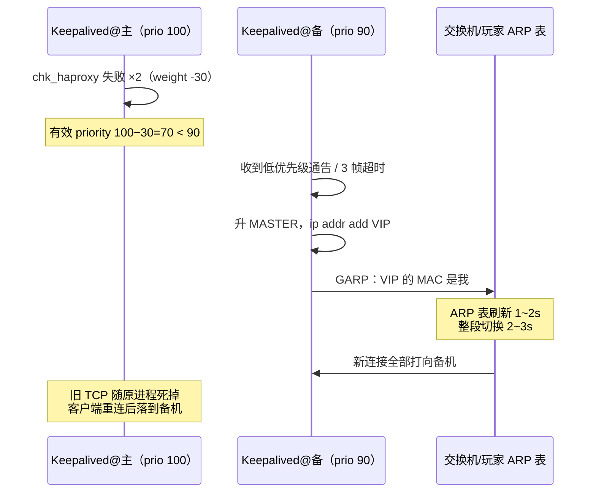

# 20｜HAProxy 与 Keepalived · 练习题

先合上知识点，对着 **一节的主图** 把「一次故障里 VIP 的一生」（出生 → 上岗 → 故障 → 漂移 → 体检 → 脑裂）口述一遍，再来做题。切主走读、脑裂止血、假活与 sticky 要能不假思索。LVS 回 [18](../18-LVS与四层负载均衡/)；Nginx 反代回 [19](../19-Nginx/)。

| 标记 | 含义 |
|------|------|
| **核心** | 不懂整章就没建立起来 |
| **必会** | 值班和面试都要能讲 |
| **常用** | 线上会反复碰到 |
| **常考** | 白板和追问的高频口径 |

## 本题目录

- [Q1 两层分工](#q1)
- [Q2 三家选型](#q2)
- [Q3 切主走读](#q3)
- [Q4 VIP 不漂](#q4)
- [Q5 脑裂](#q5)
- [Q6 track_script](#q6)
- [Q7 健康检查与假活](#q7)
- [Q8 sticky](#q8)
- [Q9 抢占与 nopreempt](#q9)
- [Q10 四层超时](#q10)
- [Q11 MySQL 入口](#q11)
- [Q12 正向代理与 VPN](#q12)
- [Q13 定责分流](#q13)
- [Q14 HAProxy 白板综合题](#q14)
- [合上书](#合上书)

---

## Q1

**★★★★★｜Keepalived 和 HAProxy 各负责什么？两层怎么分工？**

**覆盖**：核心 · 必会 · 常考 ｜ **对应**：知识点 [一、一张图：一次故障里 VIP 的一生](知识点.md)

### 场景

新人问：「都是做高可用的，Keepalived 和 HAProxy 是不是二选一？」他还想把后端摘除逻辑写进 keepalived.conf。

### 完整解答

> 🎯 **一句话**：Keepalived 管「VIP 在哪台」，HAProxy 管「流量怎么分」——两层各管一段，不是二选一。

```text
玩家 ──> VIP（Keepalived 决定在哪台）
              │
              ▼
        HAProxy（frontend 收 → backend 选后端）──> 后端 server 池
```

两层检查对象不同：Keepalived 的健康对象是**本机**（本机 haproxy 活不活，track_script）；HAProxy 的健康对象是**后端**（server 活不活，check）。两层摘除节奏不同：后端坏摘 server（秒级、常发生），整机坏摘 VIP（切主、低频大动作）。

> ⚠️ **别混**：「后端挂了要切 VIP」是错的——后端归 HAProxy 在 backend 里摘；VIP 只在整机/进程级故障时漂。

> 📝 **面试**：「Keepalived 管 VIP 归属（VRRP），HAProxy 管流量分发（frontend/backend）；一个管位置一个管分发，组合起来才是入口高可用。」

### 再追问

- 只有 HAProxy 没有 Keepalived 会怎样？——单点：HAProxy 所在机器一挂入口全丢。
- 只有 Keepalived 没有 HAProxy？——VIP 能漂，但漂过去没有东西分流量（除非后端直接对客户端），健康检查和粘滞都没有。

---

## Q2

**★★★★★｜HAProxy、Nginx、LVS 做 LB 差在哪？战斗 TCP 走哪个？**

**覆盖**：核心 · 必会 · 常考 ｜ **对应**：知识点 [五、干活：HAProxy 怎么分流量](知识点.md)

### 场景

「入口已经有 Nginx 了，为什么还要 HAProxy？」后面要挂 MySQL 和战斗 TCP。另有人说直接上 LVS 更快。

### 完整解答

> 🎯 **一句话**：LVS 内核态四层最快功能最少；HAProxy 用户态四/七层全能；Nginx 七层反代最顺手——按协议和功能需求选，不是按名气。

| 对比 | LVS（内核态） | HAProxy（用户态） | Nginx（七层） |
|------|---------------|-------------------|----------------|
| 层 | 四层，IP:端口 | 四层（tcp）+ 七层（http） | 七层 |
| 转发 | 内核 netfilter，不进用户态；DR 回程直出 | 进程收发，回程必过 HAProxy | 进程反代，改头/缓冲/TLS 终结 |
| 擅长 | 极致吞吐、超大规模 | 健康检查、sticky、四七层混合 | HTTP 改写、动静分离、限流 |
| 不适合 | 复杂检查/粘滞 | —— | 战斗 TCP、MySQL 等非 HTTP |

战斗 TCP 和 MySQL 走 HAProxy `mode tcp`（或 LVS）；塞进 Nginx 是把长连接压给反代的事故源（[19](../19-Nginx/)）。LVS 的 NAT/DR/TUN 细节回 [18](../18-LVS与四层负载均衡/)。

### 再追问

- DR 模式为什么性能最高？——回程由 RS 直接送回客户端、不过 LB；代价是 RS 要配 ARP 抑制（→ [18](../18-LVS与四层负载均衡/)）。
- HTTPS 在 HAProxy 怎么处理？——要么 TCP 透传到后端终结，要么 HAProxy 终结后走七层；证书语义 → [14](../14-HTTP与TLS/)。

---

## Q3

**★★★★★｜主机（或 HAProxy）挂了，VIP 漂移的完整过程走一遍？**

**覆盖**：核心 · 必会 · 常考 ｜ **对应**：知识点 [四、漂移：主机倒了，VIP 怎么搬到备机](知识点.md)

### 场景

面试官白板题：「画出来，主机上的 haproxy 进程死了，到玩家流量落到备机，中间每一步。」

### 完整解答

> 🎯 **一句话**：脚本失败 weight −30 → 有效优先级 70小于 90 → 备机升主挂 VIP 发 GARP → ARP 刷新 1~2s、流量整段切走。



三处易错：①weight 算术必须让有效优先级**低于对端**（100−30=70小于 90 成立；200−30=170>90 切不动）；②GARP 刷 ARP 1~2s，切换有感知；③**旧 TCP 不搬家**——玩家已建立的连接断开靠重连，战斗服的切主重连风暴由此而来。

> 📝 **面试**：「脚本失败 → weight −30 → 70小于 90 → 备机升主 → 挂 VIP 发 GARP → ARP 表刷新 1~2s → 新连接切走、旧 TCP 重连。」

### 再追问

- 整机断电和进程死了，走的路径一样吗？——判定入口不同（整机死=通告 3 帧超时；进程死=track_script），但升级和 GARP 这后半段完全一样。
- 切换窗口内的新连接呢？——可能丢一两次重试；客户端要有重连退避，不是靠 LB 消灭丢包。

---

## Q4

**★★★★☆｜主机明确挂了，VIP 却没漂过去，查什么？**

**覆盖**：必会 · 常用 · 常考 ｜ **对应**：知识点 [四、漂移：主机倒了，VIP 怎么搬到备机](知识点.md)

### 场景

主机宕机确认，但玩家还是打不通。备机上 `ip addr` 没有 VIP。

### 完整解答

> 🎯 **一句话**：VIP 不漂 = 备机没判「该我上」或不敢上——查通告、priority、track_script 三样。

```bash
tcpdump -ni eth0 vrrp                       # 备机上还收得到通告吗（不该收到了）
journalctl -u keepalived -n 50              # 有没有 Entering MASTER STATE
grep -E 'priority|weight|virtual_router_id|auth' /etc/keepalived/keepalived.conf
```

常见原因四类：①**通告还在飞**——主机其实活着（half-dead：机器在、只挂了别的服务），或**第三方也在发**这个 VRID 的通告（VRID 撞车）；②**weight 没算够**——主机 track_script 失败后有效优先级仍高于备机，切不动；③**VRID/auth 不匹配**——两台不在同一个 VRRP 实例里，互相听不懂；④**云网络禁组播**——通告根本到不了对端，改 `unicast_peer` 单播。

> ⚠️ **别混**：VIP 不漂 ≠ Keepalived 进程挂了——进程活着但「判定条件不满足」才是常态；先看 journalctl 的判定记录，别先 systemctl restart。

### 再追问

- 备机升主了但玩家还是不通？——查 GARP 有没有刷出去：`ip neigh | grep VIP` 看 MAC 是不是新主；没换就查交换机 ARP 和云安全组。
- 手工触发切换怎么做？—— `systemctl stop keepalived`（主机侧），让通告消失触发接管；比调 priority 干净。

---

## Q5

**★★★★★｜什么是脑裂？怎么确认、怎么止血、怎么防？**

**覆盖**：核心 · 必会 · 常用 · 常考 ｜ **对应**：知识点 [七、病上加病：脑裂](知识点.md)

### 场景

防火墙例行变更后，一半玩家打进 A 服一半打进 B 服，会话全乱。有人喊「主挂了没切干净」。

### 完整解答

> 🎯 **一句话**：脑裂 = 两台都认为自己是主、都挂 VIP；止血只有一条——先停一台 keepalived。

```bash
ip addr show eth0 | grep 10.0.0.100     # 两台都执行：都有 = 脑裂实锤
ip neigh | grep 10.0.0.100              # 同一 VIP 两个 MAC
tcpdump -ni eth0 vrrp                   # 两台都在发通告（prio 100/90 都在飞）
```

**成因**是「声音被捂住」：VRRP 靠听对方通告判活，**通告到不了对端的一切情况都会脑裂**——防火墙把 proto 112 当 UDP 拦（最常见）、交换机/线路分区、VRID 撞车、auth_pass 不一致。主机真挂反而不会脑裂（通告正常停、备机正常接管）。

**止血**：`systemctl stop keepalived`（停一台），全网只剩一个 VIP 持有者，会话先稳，再修根因。**防御**：放行 proto 112、VRID 错开、auth 对齐；监控「两台同时有 VIP」直接 P1（[22](../22-监控与告警/)）；架构上用双 VIP 主主（各持一个 VIP 各管一半流量）减半爆炸半径——取舍归 [33](../33-高可用与容灾/)。

> ⚠️ **别混**：VRRP 两节点**没有仲裁**——双方都会继续挂 VIP 服务流量，做不到 etcd quorum 那样少数派停写（[03-02](../../03-Kubernetes/02-etcd/)）；「脑裂会自动停止服务」在这不成立。

> 📝 **面试**：「脑裂根因多是防火墙把 VRRP（IP 协议 112）当 UDP 拦了；确认看两台都有 VIP、ip neigh 双 MAC；止血先停一台；VRRP 没有仲裁，靠监控和双 VIP 架构兜。」

### 再追问

- 为什么不调 priority 让主机抢回？——脑裂状态下再切一次是加事故；先止血（停一台）再谈归属。
- etcd 为什么不怕两节点分区？——quorum 要求多数派；2 节点集群没有多数派可失去时干脆不可用（这也是 etcd 推荐 3/5 节点的原因）。

---

## Q6

**★★★★☆｜track_script 为什么必要？killall -0 有什么局限？**

**覆盖**：必会 · 常用 ｜ **对应**：知识点 [三、上岗与故障：GARP 宣告，以及通告怎么停](知识点.md) · [四、漂移：主机倒了，VIP 怎么搬到备机](知识点.md)

### 场景

主机上的 haproxy 进程死了，但 VIP 迟迟不漂——keepalived 进程本身好好的。

### 完整解答

> 🎯 **一句话**：Keepalived 只懂「本机活不活」，不知道同机 haproxy 死活；track_script 把进程死翻译成 priority 下降。

```text
vrrp_script chk_haproxy {
    script "killall -0 haproxy"    # 进程存在性探测（0 号信号=不发送，只探测）
    interval 2                     # 每 2s 一次
    weight -30                     # 失败 → priority 100-30=70 < 90 → 触发切换
}
```

没有 track_script：haproxy 死了、Keepalived 还在发通告、VIP 稳稳挂在「没有服务能力」的机器上——入口整段超时。**killall -0 的局限**：只测进程存在，测不出**假活**（进程僵死不退出、端口在但应用不干活）；要测「真的能服务」得端口级/HTTP 级脚本（`curl -sf http://127.0.0.1:8404/haproxy_health`），代价是脚本本身也要维护。

### 再追问

- weight 该设多少？——必须让失败后的有效优先级**低于对端**：对端 90，自己 100，weight −30 够；自己 200 就要 −120 以上。配完要能口算验证。
- 脚本里的检查命令挂了会怎样？——脚本超时/出错也按失败算，切主；所以脚本要简单、快、无依赖。

---

## Q7

**★★★★☆｜tcp-check 和 httpchk 差在哪？什么是假活？**

**覆盖**：必会 · 常用 · 常考 ｜ **对应**：知识点 [六、体检：健康检查、摘除与 sticky](知识点.md)

### 场景

后端 Java 全卡死了，HAProxy 却一台都没摘。配置里是 `option tcp-check`。

### 完整解答

> 🎯 **一句话**：tcp-check 只测端口能建连，测不出应用僵死（假活）；HTTP 后端用 httpchk 探真实接口。

| 对比 | `option tcp-check` | `option httpchk GET /health` |
|------|--------------------|------------------------------|
| 测什么 | TCP 握手能不能成 | 路径返回对不对（`http-check expect status 200`） |
| 测不出 | 假活：端口在、人没了 | 探错页面（恒 200 的静态页） |
| 适用 | MySQL/Redis/战斗 TCP | HTTP 后端 |

```text
server s1 10.0.1.20:8080 check inter 2s rise 2 fall 3
                                    ← 每 2s 查；连成 2 次算活；败 3 次才摘（抗抖动）
```

反向坑同样致命：httpchk 探了个 nginx 默认页，Java 全挂了检查照样绿——**探错页面 = 没检查**。`/health` 返回 200 但内部线程池全卡死，还需要应用自己做深度健康检查。`rise 2 fall 3` 的意义是抗抖：一次网络抖动摘掉好机器，流量挤爆其余的。

> ⚠️ **别混**：后端被摘是 HAProxy 层（check ×fall 摘 server）；本机 HAProxy 死才是 Keepalived 层（track_script 摘 VIP）——两层检查对象不同。

### 再追问

- 一台的 chkfail 在涨说明什么？——它被针对性检查失败（负载高/磁盘满/假活），先查那台，别摘好机器「试试」。
- check 关掉硬扛行不行？——死机永远打给玩家；宁可慢摘（fall 调大）也不能不摘。

---

## Q8

**★★★★☆｜sticky 会话粘滞有哪几种？切主后会怎样？**

**覆盖**：必会 · 常用 ｜ **对应**：知识点 [六、体检：健康检查、摘除与 sticky](知识点.md)

### 场景

战斗服有状态，玩家连接必须落回同一台后端。切主之后有玩家反馈「进了另一台服」。

### 完整解答

> 🎯 **一句话**：粘滞三条路——balance source（源 IP 哈希）、cookie insert（种 Cookie 认人）、stick-table（表驱动可过期）；表在每台 HAProxy 内存里，切主后不带走。

```text
① balance source                   ← 最粗：换出口 IP 就飞（NAT 破功）
② cookie insert indirect nocache   ← 七层种 Cookie，认人不认 IP
③ stick-table type ip size 200k expire 30m
   stick on src                    ← 表项 30 分钟不更新就淘汰
```

**切主后 stick-table 空**：新主没有旧表的映射，玩家第一跳可能换机器——VIP 漂移救的是「有地方去」，不保证「回到原机器」。要跨机共享上 peers 同步（进阶）。有状态服务更稳的做法是把状态外置（Redis/DB），让后端无状态化（[02-02](../../02-中间件与数据库/02-Redis/)）。

> ⚠️ **别混**：VIP 漂移 ≠ 会话不丢——旧 TCP 断开靠重连（四节），粘滞表不跨机（本节）；漂移只保证「有人接」。

### 再追问

- expire 30m 和 size 200k 怎么定？——按玩家会话时长和峰值在线估；满了挤掉最旧表项，粘滞开始抖。
- 四层战斗 TCP 需要粘滞吗？——长连接天然粘（一条连接一台后端直到断开）；怕的是断线重连换机，那才是 sticky 表要接的位置。

---

## Q9

**★★★☆☆｜抢占和 nopreempt 怎么选？修好原主要不要切回？**

**覆盖**：必会 · 常考 ｜ **对应**：知识点 [四、漂移：主机倒了，VIP 怎么搬到备机](知识点.md)

### 场景

主机修好重新上线，VIP 自动切了回去——刚稳定的会话又乱了一次。有人提议把两台 priority 改成一样。

### 完整解答

> 🎯 **一句话**：默认抢占，原主修好会抢回造成二次抖动；低频会话场景用 nopreempt 让现任继续干。

`nopreempt` 配在 BACKUP 上：原主恢复后不抢回，避免刚稳定的会话再切一次。代价：资源分布不再和 priority 对齐（原主配置更高却闲置），要靠人工窗口主动切回（`systemctl stop keepalived` 当前主一次，或调整 priority）。

> ⚠️ **别混**：nopreempt 是「修好后抢不抢回」，**不是**「故障时切不切」——故障切换永远发生；两台 priority 仍必须错开，改成一样等于把选举变成掷硬币。

### 再追问

- 什么时候应该切回原主？——低峰窗口、评估过会话影响后人工切；不是自动抢。
- notify_master 能干什么？——升主钩子：拉起本机服务、发告警、调整监控静默（→ [22](../22-监控与告警/)）。

---

## Q10

**★★★☆☆｜四层 mode tcp 的超时怎么配？战斗连接为什么被掐？**

**覆盖**：必会 · 常用 ｜ **对应**：知识点 [五、干活：HAProxy 怎么分流量](知识点.md)

### 场景

战斗 TCP 玩家每 30 秒集体掉线重连。HAProxy 配置里 `timeout client 30s` `timeout server 30s`。

### 完整解答

> 🎯 **一句话**：四层长连接的 client/server/tunnel 给分钟级，别抄 HTTP 的 30s。

```text
timeout connect 3s~5s      # 连后端
timeout client  17s~60s    # HTTP 量级；战斗 TCP 改分钟级
timeout server  17s~60s    # 同上
timeout tunnel  10m        # WebSocket / 升级后的长连接
timeout check   2s         # 健康检查
```

30s 内连接上没有字节流动，HAProxy 就按空闲掐断——战斗对局中安静的半分钟（跑图、读条）足够触发。修法：四层 backend 的 client/server 给分钟级；应用层心跳和应用层超时（[13](../13-TCP与UDP/)）是正道，LB 超时只是兜底。整条超时链「外短内长」的语义 → [14](../14-HTTP与TLS/)。

### 再追问

- 为什么 HTTP 可以短？——请求-响应模式，一个事务秒级完成；空闲即异常。长轮询/SSE 例外，归 tunnel 管。
- timeout check 影响什么？——健康检查自身的超时，和流量超时无关，别混着调。

---

## Q11

**★★★☆☆｜MySQL 的入口为什么用 mode tcp？读写怎么拆？**

**覆盖**：必会 · 常用 ｜ **对应**：知识点 [五、干活：HAProxy 怎么分流量](知识点.md)

### 场景

应用直连主库 IP，主库一挂要改全部配置。有人想让 MySQL 也走「Nginx 统一入口」。

### 完整解答

> 🎯 **一句话**：MySQL 是非 HTTP 协议，走 HAProxy `mode tcp` 按端口拆：3306 写指主库、3307 读指从库池。

```text
frontend mysql_write  bind *:3306  default_backend mysql_master
frontend mysql_read   bind *:3307  default_backend mysql_slaves
backend mysql_slaves  balance leastconn
    server db2 10.0.2.12:3306 check inter 2s rise 2 fall 3
```

好处：主库 IP 变更/切换只改 HAProxy 配置；从库池摘除自动完成。注意：MySQL 主从切换的**数据层**一致性（复制延迟、半同步）不归 LB 管——策略层在 [02-01](../../02-中间件与数据库/01-MySQL/)。健康检查别用裸 tcp-check（假活），用 mysql 检查或 agent 检查探真实可服务。

> ⚠️ **别混**：「Nginx 统一入口」对 MySQL 不成立——七层反代不认 MySQL 协议；四层才管非 HTTP。

### 再追问

- 从库复制延迟大怎么办？——HAProxy 不感知延迟；要么应用侧分流（延迟大走主库读），要么上读写分离中间件（→ [02-01](../../02-中间件与数据库/01-MySQL/)）。
- 摘一台从库应用有感知吗？——新建连接走其余从库，存量连接断开重连；连接池要配重试。

---

## Q12

**★★★☆☆｜正向代理和反向代理差在哪？no_proxy 是干什么的？**

**覆盖**：必会 · 常考 ｜ **对应**：知识点 [五、干活：HAProxy 怎么分流量](知识点.md)

### 场景

内网机器配了公司出口代理后，`curl` 访问内网服务全报 403/超时。有人怀疑是 HAProxy 配错了。

### 完整解答

> 🎯 **一句话**：反向代理代表服务端收流量（本章主角），正向代理代表客户端出网；配了正向代理要给内网设 no_proxy。

- **反向代理（reverse proxy）**：站在**服务端**前面收玩家的流量——HAProxy/Nginx 在入口干的就是这个。
- **正向代理（forward proxy）**：站在**客户端**旁边替它出网——公司出口代理、科学上网梯子。配了它之后 `curl`/应用出网都走代理，访问**内网地址**也会被丢给代理——所以要 `export no_proxy=10.0.0.0/8,.internal` 排除内网段。

跨机房互联的 WireGuard/GAAP 专线是**组网**（隧道），不是代理（[06](../../06-云平台/)）；运维自己跳机器走堡垒机（[28](../28-堡垒机与跳板机/)）。

> ⚠️ **别混**：别把「给客户端用的 VPN」叫反向代理——按「代表谁」分：代表服务端收=反向，代表客户端出=正向。

### 再追问

- curl 报 `Received HTTP code 403 from proxy` 是谁说的？——正向代理拒绝了你这个目标/认证，问题在代理侧，不是目标服务。
- HAProxy 能做正向代理吗？——能配但不是主业；正向代理的坑（PAC、no_proxy、认证）它不解决。

---

## Q13

**★★★★☆｜入口故障值班：VIP、HAProxy、后端三层怎么分流定责？**

**覆盖**：核心 · 必会 · 常用 ｜ **对应**：知识点 [八、作战：入口故障定责](知识点.md)

### 场景

值班接到「登录进不去」。同时有三个人在喊：一个要重启 keepalived，一个要重启 haproxy，一个要扩容后端。

### 完整解答

> 🎯 **一句话**：三问定层——VIP 在哪台（Keepalived）？HAProxy 活着吗？后端摘了几台（Stats）？

```text
① 0–10s   两台 ip addr show | grep VIP：几个 VIP、在哪台
          —— 两个 = 脑裂（先停一台）；零个/不在服务机 = 漂移问题
② 10–30s  VIP 所在机：systemctl status haproxy + ss -tlnp ':443'
          journalctl -u keepalived -n 50 看切主记录
③ 30–45s  Stats / show stat：后端 status·chkfail·lastchg
          战斗连接查 timeout；HTTP 慢回 [19](../19-Nginx/) 的两列时间
④ 45–60s  动作：停一台保脑裂 · 起 haproxy · drain 摘假活机 · 调超时
```

原则：**先看再动**——三个「重启一下试试」分别对应三层，但没定位就动手，等于把三层全抖一遍。切主后「VIP 在但不通」查 GARP：`ip neigh | grep VIP` 看 MAC 换没换。

> 📝 **面试**：「入口故障我按 VIP→HAProxy→后端 三层收敛：ip addr 定脑裂/漂移，进程+端口定 HAProxy，Stats 定后端；GARP 没刷出去查 ip neigh 的 MAC。」

### 再追问

- Stats 里 lastchg 很大说明什么？——状态很久没变（一直是 UP 或一直 DOWN），不是新故障；配合 chkfail 看历史。
- 一台后端 chkfail 涨但 status 还是 UP？——在 rise/fall 窗口内抖动，快查那台（负载/磁盘/假活），别等它真 DOWN。

---

## Q14

**★★★★★｜白板：VIP 一生 + 脑裂止血 + GARP + 三层 60 秒定责？**

**覆盖**：核心 · 必会 · 常考 ｜ **对应**：知识点 [一、一张图](知识点.md) · [九、收口](知识点.md)

### 场景

白板：「入口全挂，画 Keepalived+HAProxy 分工并说脑裂怎么止血。」

### 完整解答

> 🎯 **一句话**：**VRRP 争 VIP → GARP 刷新 → HAProxy 分流量 → 健康检查摘流**；双 VIP=fence 停写；假活查 httpchk 深度。

```text
ip addr: 几个 VIP、在哪台
VIP在不通: haproxy进程 + ss + ip neigh MAC
脑裂: 先停一台写路径
sticky: 表不跨机，扩缩容要知会
```

> 📝 **面试**：两台 Keepalived ≠ quorum（→ 33 Q5）。

### 再追问

- 四层超时分钟级？——战斗长连接 vs HTTP 入口（Q10）。

---

## 合上书

- [ ] 默画一节主图：出生 → 上岗 → 故障 → 漂移 → 体检 → 脑裂，Keepalived 管哪几段、HAProxy 管哪一段
- [ ] VRRP 的协议号/层/priority/state/VRID/auth 六个硬事实逐个口述
- [ ] 默画切主时序：track_script → weight −30 → 70小于 90 → 升主 → GARP → ARP 刷新 → 旧 TCP 重连
- [ ] VIP 不漂的四类原因、VIP 漂了但不通查什么
- [ ] 脑裂的成因/确认三条命令/止血一条/防御三层，以及 VRRP 无仲裁和 etcd quorum 的区别
- [ ] 假活的两个方向（tcp-check 测不出、httpchk 探错页面），rise/fall 抗抖的意义
- [ ] sticky 三条路、stick-table 不跨机的代价
- [ ] 四层超时分钟级、MySQL 3306/3307、正向 vs 反向代理
- [ ] 三层定责的 60 秒剧本，三层各自的「先做/别做」
- [ ] 白板 VIP 一生综合（Q14）

与知识点「合上书」对齐；都能口述这一章就过了。
