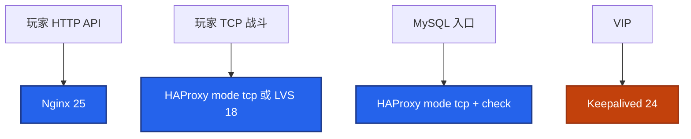
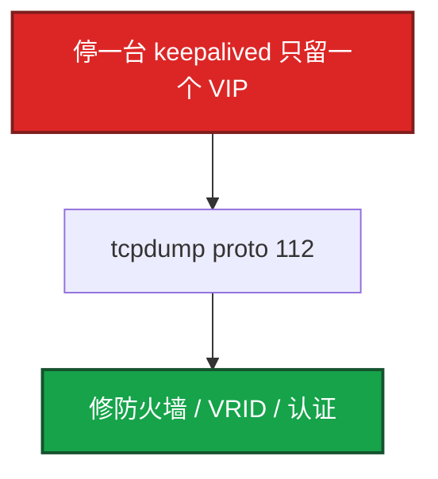

# 20｜HAProxy 与 Keepalived · 练习题

先对照 [知识点](知识点.md)：**先 §2 总图与走读，再 §3 名词，再 §5 脑裂、§6 探活/sticky，再 §9 定责**。LVS 模式回 [18](../18-LVS与四层负载均衡/)；Nginx 反代回 [19](../19-Nginx/)。每题标了覆盖范围：

| 标记 | 含义 |
|------|------|
| **核心** | 不懂整章就没建立起来 |
| **必会** | 值班和面试都要能讲 |
| **常用** | 线上会反复碰到 |
| **常考** | 白板和追问的高频口径 |

## 本题目录

- [Q1 HAProxy vs Nginx vs LVS](#q1)
- [Q2 双机与 VIP 走读](#q2)
- [Q3 脑裂](#q3)
- [Q4 VIP 不切](#q4)
- [Q5 健康检查](#q5)
- [Q6 sticky](#q6)
- [Q7 抢占与 nopreempt](#q7)
- [Q8 别和 LVS 搅](#q8)
- [Q9 VPN / 正向代理](#q9)
- [Q10 定责分流](#q10)
- [Q11 MySQL 入口](#q11)
- [Q12 四层超时](#q12)
- [合上书](#合上书)

---

## Q1

**★★★★★｜HAProxy、Nginx、LVS 做 LB 差在哪？战斗 TCP 走哪？**

**覆盖**：核心 · 必会 · 常考

**对应**：知识点 §2.1 · §2.4 · §4.1

### 场景

「入口已经有 Nginx 了，为什么还要 HAProxy？」后面要挂 MySQL 和战斗 TCP。另有人说直接上 LVS。

### 完整解答

**一句话：** HAProxy 是用户态 LB 本职（四层/TCP/精细探活）；Nginx 是 Web 全能；超大入口内核转发看 LVS（18）。



- **Nginx（19）**：静态、证书、复杂 HTTP、reload。
- **HAProxy（本章）**：`mode tcp`、rise/fall、Stats、库端口、sticky。
- **LVS（18）**：内核 NAT/DR/TUN，超大战斗入口；回程路径与本章用户态代理不同。

不要「统一入口」把战斗塞进 Nginx `proxy_pass http://`。

### 再追问

HAProxy 回程和 LVS DR 一样吗？——不一样。HAProxy 是用户态代理，回程过它；DR 回包常直出 RS（见 18）。

---

## Q2

**★★★★★｜画 Keepalived + HAProxy 双机。VIP 怎么漂？口述 §2.2。**

**覆盖**：核心 · 必会 · 常考

**对应**：知识点 §2.0～§2.2 · §5.1 · §5.3

### 场景

系统设计起手：两台入口怎么避免单点。

### 完整解答

**一句话：** Keepalived 管 VIP（VRRP 协议 112），HAProxy 管流量；track_script 失败降 priority，备机抢 VIP 并发 GARP。

VIP → MASTER prio 100（haproxy+keepalived）与 BACKUP 90 → 后端们。Master 发 VRRP（协议 **112**）。脚本失败 `weight -30` → 70 < 90 → Backup 升主 → GARP → 邻居改 ARP。整段常 2～3 秒。`state` 只是开机意愿，谁主看 priority。

走读口令：主挂 → track fall → 降权 → 备机 VIP + GARP → 新连接打备机；旧 TCP 多半重连。

### 再追问

GARP 是什么？仍打到旧机？——免费 ARP 刷 VIP→新 MAC。抓 `tcpdump arp`；跨三层 GARP 刷不到，VRRP 通常要二层互通。

---

## Q3

**★★★★★｜两台都变成 MASTER（脑裂），怎么处理？**

**覆盖**：核心 · 必会 · 常考

**对应**：知识点 §5.2 · §9

### 场景

防火墙策略改完，两台 `ip a` 都有 VIP。玩家连上时而 A 时而 B，会话错乱。

### 完整解答

**一句话：** 双 VIP 先停一台；VRRP 没有 quorum，和 etcd 不同——抓 `proto 112` 修防火墙。

两节点 VRRP **没有多数派**（[26](../26-高可用与容灾/)）。防火墙常把 112 当「UDP 112 端口」丢掉。



1. 两台 `ip addr` 确认双 VIP。  
2. 只停一台 keepalived 止血。  
3. `tcpdump -i eth0 proto 112` 看双向 advert。  
4. 修规则 / VRID / auth。后端已双写 → 按 20 收数据，不是只修 VIP。

### 再追问

和 etcd 脑裂一样吗？——不一样。etcd 靠 quorum 停写。Keepalived 两台停不了写。重要数据不要指望 VRRP 当一致性协议。

---

## Q4

**★★★★☆｜HAProxy 挂了 VIP 不切换，可能原因？**

**覆盖**：必会 · 常用 · 常考

**对应**：知识点 §5.3 · §7.3 · §9

### 场景

haproxy 进程没了，VIP 还在这台，玩家全超时。

### 完整解答

**一句话：** 没配 track_script 或 weight 降不够——VRRP 只保证 keepalived 活着，不保证 haproxy 活着。

1. 没 `track_script`。  
2. `weight` 太小：100−10 仍 ≥ 备机 90；要 100−30=70 < 90。  
3. 脚本只 `killall -0`，假死/残留仍 exit 0。  
4. 脚本无执行权限、SELinux 拦（[27](../27-Linux安全加固/)）。  
5. 少见：`nopreempt` 与角色预期搞反。

进程在但不 listen：要探端口/HTTP，不要只探 PID。

### 再追问

rise/fall 在两层各管什么？——HAProxy：摘不摘 **后端 server**。Keepalived：这台还要不要 **VIP**。两层都要连续 N 次抗抖（20）。

---

## Q5

**★★★★☆｜HAProxy 健康检查怎么配？/health 只 200？**

**覆盖**：必会 · 常用 · 常考

**对应**：知识点 §6.1 · §7.2

### 场景

后端 Java 卡死但端口还在。tcp-check 仍 UP，玩家超时/进错房。

### 完整解答

**一句话：** HTTP 用 httpchk 且 health 碰到依赖；纯 TCP 端口探会假活；游戏 TCP 要应用心跳。

- HTTP：`option httpchk GET /health` + expect 200；**禁止**写死静态 200 不碰 DB。  
- TCP：`option tcp-check` 只证明端口；假活常见。  
- 节奏：`inter 2s rise 2 fall 3`。  
- `dontlognull`：探活别灌爆 access 日志。

### 再追问

和 LVS「探活只停新分配」一样吗？——口径相近但实现不同：LVS 改权重/摘表（16）；HAProxy 用户态标记 DOWN。别把 ipvs 权重 0 和 HAProxy check 混成一句。

---

## Q6

**★★★★☆｜sticky 怎么配？粘到死机怎么办？**

**覆盖**：必会 · 常用 · 常考

**对应**：知识点 §6.2 · §4.3

### 场景

大厅要会话粘滞；战斗 TCP 也要尽量进同一房间。上线后有人一直打到一台已卡死的 Java。

### 完整解答

**一句话：** sticky 只管粘不管活——先保证 check 真、VIP 唯一；HTTP 用 cookie，TCP 用 stick-table，简单源 IP 粘小心 NAT 扎堆。

| 方式 | 场景 | 坑 |
|------|------|-----|
| `balance source` | 四层简单粘 | NAT 后同出口扎堆 |
| `cookie ... insert` | 七层 HTTP | 禁 cookie；多域名 |
| `stick-table` + `stick on src` | TCP/灵活 | 切主后表空；表满/过期 |

粘到死机：先看 stats 是否仍 UP → 假活（Q5），不是加大 expire。双 VIP 时 sticky 更乱——先消脑裂（Q3）。

### 再追问

和 LVS `sh` 一样吗？——都是粘滞思路，但 LVS 持久化在 16；本章是 HAProxy 用户态表/cookie。面试分开讲。

---

## Q7

**★★★★☆｜主恢复后 VIP 抢不抢回来？**

**覆盖**：常用 · 常考

**对应**：知识点 §5.4 · §7.3

### 场景

主修完 keepalived 回来，流量又闪一次。

### 完整解答

**一句话：** 默认抢占会二次 GARP 闪断；生产常选 nopreempt，把闪留在故障那一次。

默认：高 priority 回来就抢。`nopreempt`：谁先主谁继续直到它挂。轮转维护再手动切。

### 再追问

virtual_router_id 冲突？——同网段两组用同一 id 会抢通告，VIP 乱跳。规划 VRID 像规划 VLAN。

---

## Q8

**★★★★☆｜LVS 和 HAProxy 怎么同时出现在答案里而不混？**

**覆盖**：必会 · 常考

**对应**：知识点 §2.3 · §2.4 · §4.1 · §10

### 场景

「四层负载均衡讲一下」，有人把 DR 和 HAProxy roundrobin 搅在一起。

### 完整解答

**一句话：** LVS 讲 NAT/DR/TUN 内核转发（16）；HAProxy 讲用户态代理和 httpchk（本章）；VIP/VRRP conf 在本章 Keepalived。

可以说「LVS+Keepalived 做入口，后面 HAProxy 做七层/库代理」，但 **NAT/DR 细节留在 16**；本章要求会 **HAProxy 双机 + 探脚本 + sticky**。

### 再追问

Keepalived 能不能只做 LVS 不做 HAProxy？——能。那是 16 的经典图。本章钉 HAProxy 双机这一套。

---

## Q9

**★★★★☆｜WireGuard 还是 OpenVPN？正向代理为什么要 no_proxy？**

**覆盖**：必会 · 常用

**对应**：知识点 §7.5

### 场景

给运维进生产网。另有人要把玩家流量走办公 VPN 加速。构建机设了 `https_proxy` 后连不上内网 Harbor。

### 完整解答

**一句话：** 办公隧道新建 WireGuard；玩家加速用云 GAAP；正向代理必须 `no_proxy` 含 localhost 与内网 CIDR。

正向：代表客户端出网。反向：代表服务端接用户（本章/23）。Docker 还要 systemd `Environment=`，只 export 当前 shell 不够。密钥进堡垒/密管（25、17）。

### 再追问

SOCKS 和 HTTP 代理？——HTTP 管 HTTP(S)；SOCKS5 更通用；SSH `-D` 临时排障可以，不是生产出网方案（25）。

---

## Q10

**★★★★☆｜给出现象，你先走哪条：双 VIP、不漂、假活、粘死机？**

**覆盖**：必会 · 常用 · 常考

**对应**：知识点 §9

### 场景

四个工单：① 两台都有 VIP ② haproxy 死了 VIP 还在 ③ Java 卡死 tcp-check 仍 UP ④ sticky 一直打到死机。

### 完整解答

**一句话：** 双 VIP→停一台抓 112；不漂→track/weight；假活→httpchk；粘死机→先修 check 再谈 sticky。

| # | 走哪条 | 不要做 |
|---|--------|--------|
| ① | 停一台；`tcpdump proto 112` | 两台改 priority 对打 |
| ② | track_script、weight 算完备机更高 | 只重启业务 Pod |
| ③ | httpchk 碰依赖；游戏要应用心跳 | 加大 timeout 掩盖 |
| ④ | stats 是否 UP；假活优先 | 先改算法碰运气 |

现场口令：`ip addr` → proto 112 → haproxy listen → stats UP → sticky。

### 再追问

战斗长连接在 Nginx 上出现缓冲/超时怪象？——先确认是否误走七层；应改 HAProxy `mode tcp` 或 LVS（18），别在 Nginx 上硬加 timeout。

---

## Q11

**★★★★☆｜HAProxy 怎么做 MySQL 读写入口？**

**覆盖**：必会 · 常用

**对应**：知识点 §4.2 · §7.2

### 场景

应用要写主读从，不想上复杂中间件，只要入口层拆开。

### 完整解答

**一句话：** 两个 frontend：3306 打 master；3307 `leastconn` 打从库——不是解析 SQL 的中间件。

```text
frontend mysql_write   bind *:3306 → backend master
frontend mysql_read    bind *:3307 → backend slaves (leastconn + check)
```

应用写读分开连。复制延迟与只读口径见 [02-01](../../02-中间件与数据库/01-MySQL/)。`mode tcp` + `tcp-check`；从库挂了靠 check 摘。

### 再追问

slave 加 `backup` 行不行？——读写拆开时从库是正规读池，一般不用 backup；backup 更适合「主全挂才上」的冷备。

---

## Q12

**★★★★☆｜战斗 TCP 超时只抄 defaults 30s 行不行？**

**覆盖**：必会 · 常用

**对应**：知识点 §4.4 · §2.3

### 场景

战斗 frontend 继承了 `defaults` 的 `timeout client/server 30s`，玩家挂机几分钟就断。

### 完整解答

**一句话：** 不行——长连接要分钟级 timeout，必要时 `timeout tunnel`；外短内长语义见 14，Nginx 侧见 19。

战斗 backend 显式：

```text
timeout client 30m
timeout server 30m
```

HTTP 短请求可以 15～60s。只加大超时不修假活/双 VIP，是掩盖。

### 再追问

切主后战斗一定无感吗？——否。VIP 漂靠 GARP，存量 TCP 通常要重连；HTTP 短请求更易无感。

---

## 合上书

- [ ] 能默画 §2.0：Keepalived 管 VIP、HAProxy 管流量；与 16/23 怎么接力  
- [ ] 能口述 §2.2：track → 降权 → VIP + GARP  
- [ ] 能说出 VRRP 协议号；谁主看 priority；双 VIP 先停一台；和 etcd 差在哪  
- [ ] 能解释 VIP 不漂的常见原因；weight 怎么算  
- [ ] 能配 httpchk/tcp-check；讲清 sticky 三种做法与粘死机  
- [ ] 能按 §9 分流：双 VIP / 不漂 / 假活 / 粘死机 / 误走七层  
- [ ] 能拆 MySQL 读写端口；战斗超时不抄 30s  
