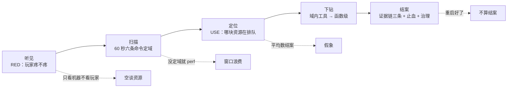
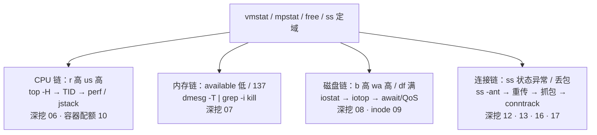
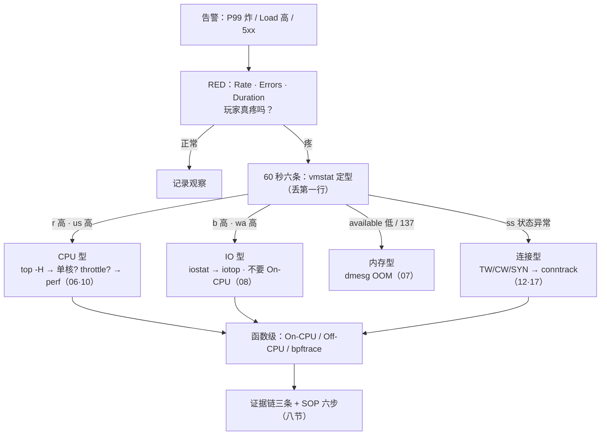

# 性能方法论：USE 与 RED

> 活动开服，登录 P99 从 50ms 飙到 800ms——有人在 `top` 里来回按 P/M，有人对战斗服敲 `perf record -a`，还有一单写好结论：「平均 CPU 才 40%，机器没问题」。
> **本章回答**：一次性能故障从告警到结案的一生——RED 确认玩家疼、60 秒定域、USE 定资源、profiling 边界、证据链收尾。
> **不讲**：Load / 软中断 → [06](../06-CPU与Load/)；换页与 OOM → [07](../07-内存与OOM/)；await / %util → [08](../08-磁盘与IO/)；队列与 Socket → [12](../12-网络栈与Socket/)；TCP 重传 → [13](../13-TCP与UDP/)；抓包 → [16](../16-网络排障与抓包/)；conntrack → [17](../17-iptables与conntrack/)；告警规则 → [22](../22-监控与告警/)。

**标记**：🎯重点 · 🔥难点 · ⭐常考 · 🔧实操

---

## 一、一张图：一次性能故障的一生

> 🎯 **一句话**：听见 → 扫描 → 定位 → 下钻 → 结案；跳步就是翻车。



- 📖 **读图**
  - 🛤️ 主线五段：RED（二）→ 六条命令（三）→ USE（四、五）→ profiling（六、七）→ 证据链（八）
  - 虚线四个翻车点：跳 RED、跳定域、拿平均结案、停在「重启好了」
  - 本章是**方法论章**：每资源只给「U/S/E 看什么、下一刀去哪章」，刀法在资源专章

- 🧭 **坐标系**：横轴 RED（玩家疼不疼）· 纵轴 USE（哪块资源饱和）——两个都成立，才值得往下查

---

## 二、听见：RED——玩家疼不疼

> 🎯 **一句话**：RED 看入口的速率、错误、耗时——先证明玩家疼，再谈机器。

**RED**（服务 / 入口视角）：

- **Rate（速率）**：QPS / RPS——流量涨没涨？活动还是被扫？
- **Errors（错误）**：5xx / 业务失败码——错了多少、错在哪类
- **Duration（耗时）**：必须看 **P99 / P95**，不是平均值

```text
10 个请求：9 个 10ms + 1 个 800ms
平均 ≈ 89ms    ← 平均数说「一切正常」
P99  = 800ms   ← 每 100 个玩家就有 1 个在等 800ms
```

- 📖 **读图**：1% 的 800ms 被 99% 正常请求稀释——平均值天然护短；面板 / 告警 Duration 一律分位数口径

> 💡 **打个比方**：RED 是**前台三张表**——进了多少客（R）、砸了多少单（E）、一桌等多久（D）；USE 是**后厨仪表**——哪口灶满了。客人没投诉（RED 正常），翻后厨是白忙。

#### ❓ 为什么先 RED 再登机器？

- ❌ **先 top / perf**：机器忙不忙和玩家疼不疼可以脱节——本机全绿、疼在下游；本机很忙、玩家其实没感觉
- ✅ **先 RED**：证明入口 Rate / Errors / Duration 真炸，再决定进不进后厨
- 🎯 **两个都成立才是真故障**：RED 疼 + USE 某资源 S 高 → 下钻；RED 正常 + USE 高 → 记录观察；RED 疼 + USE 全绿 → 查下游 / 依赖 / 客户端

> 🔍 **现场**：登录网关报「P99 高」，两条 `awk` 先把 RED 拉出来：

```bash
# 5xx 数 / 总数 / 错误率（$9=状态码，先看一行再改字段号）
awk '{c++; if($9~/^5/) s++} END{print "5xx",s+0,"total",c,"pct",(c?100*s/c:0)}' /var/log/nginx/access.log
# TOP IP：集中少数 IP（被扫）还是全网（自己的问题）
awk '{print $1}' /var/log/nginx/access.log | sort | uniq -c | sort -rn | head
```

```text
5xx 2480 total 99968 pct 2.48        ← E：错误率 2.48%，疼
     8234 1.2.3.4                    ← Rate：单 IP 8234 次 → 被扫 / 重试风暴
      302 5.6.7.8                    ← 正常玩家量级 ~300
```

- 🔍 **读数**：P99 50→800（D）+ 错误率 2.48%（E）+ TOP IP 异常（R）→ 玩家确实疼，怀疑被扫 / 重试风暴。**这一步没走，后面全是瞎查。**

- 📡 **黄金四信号**（Google SRE）：Latency · Traffic · Errors · Saturation。RED = 服务侧投影（R=Traffic、D=Latency、E=Errors）；Saturation 接上 USE（四节）。告警怎么配 → [22](../22-监控与告警/)

> ⚠️ **别混**：**RED 只对服务 / 入口，USE 只对资源**。「CPU 的 RED」「网关的 Utilization」都是错口径——CPU 没有请求耗时，网关没有队列长度可一眼看。

> 📝 **面试**：问「RED 和 USE 区别」，答「RED 服务视角——速率、错误、耗时，回答玩家疼不疼；USE 资源视角——利用率、饱和度、错误，回答哪块在排队。先 RED 再 USE」。⭐（练习题 Q3、Q7）

本节对应练习题 Q3、Q7。RED 证明疼了——ssh 刚上去，第一分钟敲什么？

---

## 三、扫描：60 秒全景定域

> 🎯 **一句话**：六条命令 60 秒定「域」，不定「根因」——定域决定进哪一章。

### 🧰 六条命令 🔧

> 🔍 **现场**：ssh 刚上去，别开 `top` 来回排序，按顺序跑完：

```bash
uptime                          # Load 1/5/15：恶化还是恢复；1m>>15m = 正在出事
vmstat 1 5                      # r/b/wa/cs/st —— 定域核心；第一行开机均值，丢掉
free -h                         # 看 available，不是 free 列
df -h && df -i                  # 块满 vs inode 满，两种病
mpstat -P ALL 1 2               # 单核热点 / %steal —— 平均值的照妖镜
ss -s                           # ESTAB / TW / CW / SYN-RECV 分布
```

- 🎯 每条只答一问：Load 趋势 · CPU 还是 IO · 内存水位 · 盘满没 · 单核还是全局 · 连接正常不
- ⏱️ **30~60 秒目的是归域，不是找根因**

### 📟 vmstat：一屏定 CPU 型还是 IO 型 ⭐

```bash
vmstat 1 5
procs -----------memory---------- ---swap-- -----io---- -system-- ------cpu-----
 r  b   swpd   free  ...         si   so    bi    bo   in    cs  us sy id wa st
 2 18      0  210000 ...          0    0    42  18024  9800 12000 15  5 30 50  0
```

| 字段 | 含义 | 高了指向 |
|------|------|----------|
| r | 运行队列等 CPU | r 持续 > 核数 → CPU 饱和 → [06](../06-CPU与Load/) |
| b | 不可中断睡眠（D，多半等 IO） | b 高 → IO 型 → [08](../08-磁盘与IO/) |
| wa | 等 IO 的 CPU 时间 | wa 高 → 磁盘慢 → [08](../08-磁盘与IO/) |
| si/so | 换入换出 | 持续 > 0 → 内存吃紧 → [07](../07-内存与OOM/) |
| cs | 上下文切换 | >10 万/s 且延迟涨 → 线程模型 → [06](../06-CPU与Load/) |
| st | 宿主机偷走的时间 | >10% 持续 → 云超卖 → [06](../06-CPU与Load/) |

### 🔬 三个样本：一屏三种病 🔥

```text
样本A IO 型：  r  b  us sy id wa st      样本B CPU 型： r  b  us sy id wa st
              2 18  15  5 30 50  0                    25  0  82 10  3  0  0
→ b 高 wa 高，Load 是等盘堆出来的          → r 高 us 高，真在烧 CPU

样本C 单核骗平均：mpstat -P ALL
  all   40%        CPU0  98%        CPU1~15  3~6%
→ 平均 40% 结不了案：一颗核打满，P99 早炸（五节）
```

- 📖 **读图**：同样「Load 40 / 延迟涨」——A 进磁盘章、B 上 perf、C 拆单核。**先 vmstat / mpstat，再选工具，顺序不能反。**

### ⏪ 历史回放：sar

`top` 只代表现在。老板问「昨天凌晨 3 点为什么打满」：

```bash
sar -u -f /var/log/sa/sa$(date -d yesterday +%d)   # 昨天 CPU 历史
sar -q -f /var/log/sa/saDD                          # Load 历史
```

```text
Linux 3:10:01  CPU  %usr  %sys  %idle  %iowait
     03:20:01  all   82.3   6.1    5.2     4.1    ← 3 点档 %usr 82：CPU 型实锤
     03:30:01  all   12.0   3.0   80.1     2.5    ← 恢复：对上变更时间线
```

- 🔍 **读数**：不只「昨天高过」，而是**几点起、几点止、哪一列高**——和发版 / 活动曲线对表
- 📭 sar 没开、监控也没有 → 承认**没证据**，别用现在的空闲 top 编故事；治理补监控（[22](../22-监控与告警/)）

> 📝 **面试**：问「机器异常先跑什么」，答「60 秒六条：uptime、vmstat、free、df -h+df -i、mpstat -P ALL、ss -s——定域不是定根因。没定域就 perf record -a 是最大减分项」。⭐（练习题 Q1）

本节对应练习题 Q1。域定了——利用率 40% 就算没问题吗？

---

## 四、定位：USE——哪块资源在排队

> 🎯 **一句话**：USE 三步法——列资源清单，逐个查利用率、饱和度、错误。

🔥 **Saturation（饱和度）**：利用率是资源忙不忙，饱和度是门口还排不排队——座位 40% 但队伍排到街上，照样「饱和」。⭐（练习题 Q2）

**USE**（Brendan Gregg，资源视角）——对**每一种资源**查三件事：

- **Utilization（利用率）**：忙着的时间占比
- **Saturation（饱和度）**：忙不过来、**排队**——运行队列、IO 队列、等待任务数
- **Errors（错误）**：资源自己报错——OOM、IO error、丢包重传、table full

**三步法** ⭐：

1. **列资源清单**：CPU、内存、磁盘、网卡、conntrack……别漏
2. **每个资源查 U/S/E**：尤其 S 和 E，最容易被「平均利用率不高」掩盖
3. **逐个排查可疑项**，刀法交给资源专章

> 💡 **打个比方**：利用率是**坐满的座位比例**，饱和度是**门口等位队伍**。U 高不高只说明忙不忙，**S 高才说明疼**；座位 95% 但没人排队，还在正常吞吐。

#### ❓ 为什么利用率高不算瓶颈？

- ❌ **只看 U**：座位满 90% 但没人排队 → 还能吃，先看错误和 RED
- ✅ **瓶颈 = U 高且 S 高**：队列在涨（Load / await / r）才是玩家延迟的直接来源
- ☁️ **云盘 QoS 陷阱**：限流打满时 await 已几百 ms，`%util` 却「还能吃」——**饱和度听队列（await），别只听 %util**（[08](../08-磁盘与IO/)）

### 🗺️ 资源 × USE 作战地图 ⭐

| 资源 | U | S ⭐ | E | 深挖 |
|------|---|------|---|------|
| CPU | %us+%sy | r / Load / 单核满 / throttle | —（CPU 不报错） | [06](../06-CPU与Load/) |
| 内存 | used / working_set | si/so、available≈0 | OOM（退出码 137） | [07](../07-内存与OOM/) |
| 磁盘 | %util | await、avgqu-sz | IO error、云盘 QoS | [08](../08-磁盘与IO/) · [09](../09-文件系统与inode/) |
| 网卡 | 带宽占比 | 队列堆积 / drop | 重传 | [12](../12-网络栈与Socket/) · [13](../13-TCP与UDP/) |
| 连接表 | count/max | 接近满时新 SYN 丢 | dmesg `table full` | [17](../17-iptables与conntrack/) |
| 容器配额 | cgroup 内用量 | nr_throttled | memory.events OOM | [10](../10-cgroup与容器/) |

> ⚠️ **别混**：**Load 是 Saturation，不是 Utilization**。Load 数的是「排队人数」（R+D，见 [06](../06-CPU与Load/)），CPU% 才是利用率。「Load 40」≠「CPU 40%」≠「需要加核」——Load 高 CPU 闲，先查 D 和 IO。

### 收束：方法论一张板

```text
横轴 RED（玩家疼不疼）：Rate · Errors · Duration(P99)
纵轴 USE（资源堵没堵）：每资源 × Utilization · Saturation · Errors
        ↓
RED 疼 + USE 某资源 S 高 → 真故障 → 进对应资源章
RED 正常 + USE 高       → 忙但玩家没感觉 → 记录观察
RED 疼 + USE 全绿       → 不在这台机：下游 / 依赖 / 客户端
```

- 📖 **读图**：两轴交叉才下钻；任一轴不成立就换方向，别在错域里采火焰图

> 📝 **面试**：问「只有利用率高算瓶颈吗」，答「不算——U 和 S 一起看；只有 U 高还能吃。Load 是饱和度不是利用率」。⭐（练习题 Q2）

本节对应练习题 Q2。回到那单「平均 CPU 才 40%」——为什么几乎永远错？

---

## 五、假象：平均 CPU 40% 为什么结不了案 🔥

> 🎯 **一句话**：平均数会把单核打满平均成岁月静好——五种假象逐个点名。

口诀：**「平均骗人，先拆单核」**（练习题 Q4）。

```text
平均 CPU 40% 的五种可能（按验证顺序）：
  ① 单核热点       → mpstat -P ALL：一颗核 100%，其他围观
  ② cgroup throttle → 配额用完被踢；宿主机利用率看不出（10 章 cpu.stat）
  ③ IO 饱和        → b/wa 高，Load 是 D 堆的，CPU 不是主角
  ④ 锁竞争         → 线程等锁，CPU 空转，延迟照样涨（Off-CPU）
  ⑤ 下游 RT        → 瓶颈在 DB / 支付网关，本机 CPU 低是应该的
验证：mpstat 单核？ → cpu.stat throttle？ → vmstat b/wa？
      → Off-CPU 在等什么？ → curl 五段查下游（[02](../02-网络排查命令/)）
```

#### ❓ 平均 40% 为什么几乎永远结不了案？

- 🧮 **平均抹掉分布**：16 核里 1 核 98%、其余闲着 → `all` 仍可显示 ~40%
- 🧵 **单线程 / 绑核逻辑**吃不了多核——水平扩容无效，包还进同一条队列
- 🚫 **结案要分布证据**：至少 `mpstat -P ALL` 一屏；容器再补 `cpu.stat` 的 `nr_throttled`

> 🔍 **现场**：认「骗人输出」：

```text
CPU     %usr   %sys   %idle
all     38.5    4.2    55.0          ← 平均 40%：容量同学说没问题
CPU0    97.1    2.5     0.0          ← 这颗核 100%：P99 就是它炸的
CPU1    12.3    1.0    86.0          ← 其他核在围观
```

> 💡 **打个比方**：平均 CPU 是**全公司平均工资**——平均出一个「大家都过得不错」，分布才知道多数人月薪三千。单核打满就是那个高管。

- 🔧 **单核热点处置**（细节 [06](../06-CPU与Load/)）：拆热点函数 / 并行化主循环；**水平扩容无效**
- 📦 容器节点：`nr_throttled` 增量 > 5% 当 throttle（[10](../10-cgroup与容器/)）

> 📝 **面试**：被问「CPU 40% 为什么 P99 800ms」，按五种假象背——答得全，方法论就算立住了。⭐

本节对应练习题 Q4。四条资源链第一刀各砍哪？

---

## 六、分叉：定域之后，四条资源链进哪一章

> 🎯 **一句话**：CPU 链、内存链、磁盘链、连接链——每条链第一刀固定。

### 🔀 四条资源链 ⭐



- 📖 **读图**：定域输出决定进哪条链；链内第一刀固定，别跳到函数级

### ☠️ 退出码：进程怎么死的 🔥

| 退出码 | 信号 | 含义 | 下一刀 |
|--------|------|------|--------|
| 137 | SIGKILL（128+9） | 被强杀——先猜 OOM | `dmesg -T \| grep -i kill` → [07](../07-内存与OOM/) |
| 139 | SIGSEGV（128+11） | 段错误 | core / 日志，别再查资源 |
| 143 | SIGTERM（128+15） | 正常停止——发版 / 编排 | 查变更时间线（[11](../11-Systemd与服务管理/)） |

- 🧷 **137 纪律**：先证明是 OOM（dmesg / `memory.events`）再止血——「进程没了」≠「被 OOM 杀了」
- 👀 退出码在哪看：`echo $?` · `journalctl -u` · K8s `Exit Code: 137` + `Reason: OOMKilled`

### 💾 磁盘满：止血是截断，不是 rm

```bash
df -h && df -i                       # 先分清：块满还是 inode 满
lsof +L1 | head                      # 已删但仍被持有：rm 了也不释放
: > /var/log/app.log                 # 截断止血；rm 正在被写的文件是坑
```

- ⚠️ `rm` 正被持有的日志 → 空间**不释放**（fd 还开着）。块满 vs inode、轮转 → [09](../09-文件系统与inode/)、[23](../23-日志运维/)

### 🔌 连接链：ss 状态分流

```bash
ss -ant | awk '{print $1}' | sort | uniq -c | sort -rn
```

```text
  45326 ESTAB      → 活动高峰或连接泄漏：对得上在线量级吗
   8210 TIME-WAIT  → 短连接太多：Keep-Alive / 连接池（12）
   4100 CLOSE-WAIT → 应用没 close：对端早关，这端漏 fd（12）
    900 SYN-RECV   → backlog / SYN 攻击：somaxconn / 防火墙（17）
```

- 🆕 新连接建不起、老 ESTAB 还在 → 先查 **conntrack 水位**（`table full` 时新 SYN 直接丢，见 [17](../17-iptables与conntrack/)），别先怀疑光纤

本节对应练习题 Q5、Q6。什么时候该上火焰图？

---

## 七、下钻：profiling 的边界——何时要图，何时不要图 🔥

> 🎯 **一句话**：先定域再下钻——IO 型上 On-CPU 火焰图，采了也白采。

开头那位对战斗服敲 `perf record -a`——**最大减分项**。口诀：**「先定域，再下钻」**（练习题 Q9、Q13）。

### 🪜 工具按阶段上场

```text
定域（60秒）   ：uptime / vmstat / free / df / mpstat / ss —— 三节
域内（谁干的） ：top -H / pidstat -w -d / iotop / ss -antp / cgroup cpu.stat
函数级（为什么）：perf On-CPU 火焰图 / Off-CPU offcputime / bpftrace 计数
```

- 🚫 **上一阶段没出结论，不进下一阶段**

#### ❓ 为什么 IO 型不上 On-CPU 火焰图？

- ❌ **On-CPU 只看见「在 CPU 上烧」的时间**——等盘、等锁、等下游都不在图里
- ✅ **IO 型（b/wa 高）**：去 iostat / iotop / await（[08](../08-磁盘与IO/)）；CPU 闲但请求慢 → **Off-CPU**
- 🎯 **On-CPU 准入**：CPU 型、%us 高、要函数占比——采 **30 秒**；还没定域 / 生产一直 `-a` → 伤高峰且图没用

| 工具 | 用 | 别用 |
|------|----|------|
| perf On-CPU | CPU 型、要函数占比 | IO 型；CPU 不高延迟高；未定域 |
| Off-CPU | CPU 闲但慢：等 IO / 锁 / 下游 | CPU 已打满（先 On-CPU） |
| bpftrace | 按进程统计 syscall，替代长 strace | 高峰写内核探针 |
| strace | 单进程卡在哪个 syscall，几秒即可 | 高峰长时间跟——ptrace 拖死进程 |
| perf record -a | 要全机视角时，**短窗口** | 生产一直开 |

> 💡 **打个比方**：IO 型上 On-CPU 图，像**给骨折病人做心电图**——仪器没错，病人不对。

### 🔥 On-CPU 火焰图 🔧

> 🔍 **现场**：`%us` 打满、定了 CPU 型，采 30 秒：

```bash
perf record -g -p {PID} sleep 30
perf script -i perf.data | stackcollapse-perf.pl > out.folded
flamegraph.pl out.folded > flamegraph.svg

# bpftrace 短窗口：谁在狂 write（Ctrl-C 停）
bpftrace -e 'tracepoint:syscalls:sys_enter_write /pid==28451/ { @[comm]=count(); }'
```

**读图五条** ⭐：

1. X 轴越宽 = 样本占比越高 = 越热
2. 找顶部「宽而平」的框——叶子热点
3. 底层宽、顶层细 = 被多路径调用，逐层看调用方
4. 颜色通常**无含义**，别按颜色找热点
5. 采 10~30 秒足够；挂一小时不会更准

- 📦 容器：宿主机 `docker inspect -f '{{.State.Pid}}' <容器>` 拿主进程 PID，再 `perf -p`；K8s 可起 privileged 调试 Pod（权限大，慎用）

### 🐝 eBPF：被问到怎么答 🔥

30 秒三层：

- **主机排障**：bpftrace / BCC（offcputime）
- **网络可观测**：Cilium 属 K8s（→ [K8s 25](../../03-Kubernetes/25-eBPF与Cilium/)）
- **对比 strace**：bpftrace 是统计计数不是逐次跟踪，开销小一个量级

背板四句：**短窗口、指定 PID/comm、Ctrl-C 能停、不写内核模块**。

### 🧭 观测工具地图 ⭐

- 定域 / 历史：vmstat · mpstat · pidstat · sar → [06](../06-CPU与Load/)
- 内存：free · smaps · dmesg OOM → [07](../07-内存与OOM/)
- 磁盘：iostat · iotop · await → [08](../08-磁盘与IO/)
- inode / 持有：df -i · lsof +L1 → [09](../09-文件系统与inode/)
- 容器配额：cpu.stat · memory.events → [10](../10-cgroup与容器/)
- Socket / TCP：ss · Recv-Q · 重传 → [12](../12-网络栈与Socket/) · [13](../13-TCP与UDP/)
- 抓包 / 分段：tcpdump · curl 五段 → [16](../16-网络排障与抓包/)
- 连接表：conntrack · table full → [17](../17-iptables与conntrack/)
- 日志统计：awk / sort / uniq → [03](../03-文本三剑客/)
- 函数级：perf / bpftrace / 火焰图 → **本章**
- 持续监控：node_exporter / 面板 → [22](../22-监控与告警/)

> 📝 **面试**：问「何时上火焰图」，答「先 60 秒定域：CPU 型、%us 高才上 On-CPU 采 30 秒；IO 型不上；CPU 闲延迟高用 Off-CPU；bpftrace 按 PID 计 syscall；strace 只盯几秒」。⭐（练习题 Q9、Q10、Q13）

本节对应练习题 Q9、Q10、Q13。停在「重启好了」为什么不算结案？

---

## 八、结案：证据链、止血与重启纪律

> 🎯 **一句话**：三条证据 + 六步 SOP——停在「重启好了」的都不叫结案。

### 📎 证据链最低标准 ⭐

```text
① 同一时刻的现场片段（vmstat / mpstat 一屏）
② 一张监控图（P99 / await / conntrack，粒度 1s）
③ 一条 error 日志（OOM / 5xx / table full）
```

- ❌ 缺任何一条都是猜测
- ⏱️ 监控粒度必须 **1s**——15s 采样会把 3 秒尖峰平均掉（[22](../22-监控与告警/)）

### 📋 排障 SOP 六步 🔧


- 📖 **读图**：有变更先怀疑变更——回滚合法且便宜；**影响面没问清就扩容**排第 0 号错误

#### ❓ 「重启好了」为什么不算结案？

- 🧨 **重启抹掉现场**：dmesg / 队列 / 泄漏现场一重启就没——先留证再动手
- 📝 **结案三件套**：数字（证据链）+ 根因 + 预防；缺一就是把事故推给下一班
- ✅ **可以当止血**的前提：证据已留 · 窗口允许 · 有状态服当**变更**走流程

| 可以重启 | 不可以 / 先别 |
|----------|----------------|
| 已有监控证据 + 止血窗口 + 可复现环境 | dmesg / ss / 日志还没留 |
| 确认泄漏，重启止血 + 留 dump | 未知是否泄漏 |
| 无状态服务 | 有状态游戏逻辑服：重启 = 踢人 |

- 🤝 **交接格式**：当前状态 + 未验证假设 + 下一步命令——不是三个字「重启好了」

### 🚦 开服前监控红线

至少五条：`df -h` / `df -i` · conntrack 水位（告警线 **80%**）· 证书有效期 · DNS TTL（[15](../15-DNS与CDN/)）· 日志轮转（[23](../23-日志运维/)）。缺 working_set / await / conntrack / throttle——**先补监控再谈排障**。

> 📝 **面试**：问「先重启可不可以」，答「可当止血，三前提：证据已留、窗口允许、有状态服当变更。结案要数字+根因+预防」。⭐（练习题 Q8、Q11）

本节对应练习题 Q8、Q11。群里那三个人——60 秒怎么定责？

---

## 九、作战：60 秒定责剧本

> 🎯 **一句话**：RED 先确认疼，六条命令定域，四条链分刀——一气呵成。

### 🌳 定责决策树 ⭐



- 📖 **读图**：先 RED 分流，再 vmstat 四型；IO 型明确绕开 On-CPU

### 现象 · 先做 · 别做

| 现象 | 先做 | 别做 |
|------|------|------|
| P99 800ms、平均 CPU 40% | mpstat -P ALL；cpu.stat 查 throttle | 平均数结案「机器没问题」 |
| Load 40、idle 还有一半 | vmstat 看 b/wa：IO 型不加核 | 加 8 核 |
| IO 型 Load（b=18 wa=50） | iostat / iotop → 08 | 上 On-CPU 火焰图 |
| 退出码 137 | dmesg -T \| grep -i kill | 直接再拉起来 |
| /var 100% | `: > file` + lsof +L1 | rm 正在写的日志 |
| 5xx 涨、单 IP 8000+ | awk TOP IP + 封禁 / 限流（[01](../01-主机排查命令/)） | 先调后端代码 |
| 新玩家连不上、老连接正常 | conntrack 水位 + dmesg | 怀疑光纤 |
| 昨天凌晨的尖峰 | sar -u -f 回放 | 用现在的 top 编故事 |

### 60 秒剧本 🔧

> 🔍 **现场**：接告警后边说边跑：

```text
0–10s   RED：P99、5xx 率、QPS 有没有翻倍 → 玩家疼 + 怀疑方向
10–30s  vmstat 1 5：r/b/wa/st → CPU 型 / IO 型 / 被偷
30–45s  free · df -h -i · ss -s：内存、盘满、连接分布
45–60s  定链：CPU→06 · IO→08 · 内存→07 · 连接→12/17；
        容器补 cpu.stat / memory.events（10）
```

- 🗣️ **两分钟追问**：「最可疑资源？证据三条？止血和根因？恢复到什么程度？」——答不上任一题 = 还没定域完

本节对应练习题 Q12、Q14。

---

## 十、收口

### 命令速查 🔧

```bash
# 60 秒六条
uptime; vmstat 1 5; free -h; df -h && df -i; mpstat -P ALL 1 2; ss -s
# RED 现场统计
awk '{c++; if($9~/^5/) s++} END{print "5xx",s+0,"total",c,"pct",(c?100*s/c:0)}' access.log
awk '{print $1}' access.log | sort | uniq -c | sort -rn | head
ss -ant | awk '{print $1}' | sort | uniq -c | sort -rn
# 域内收窄
pidstat -w 1 3; pidstat -d 1 3; iostat -x 1 3
cat /sys/fs/cgroup/<path>/cpu.stat
# 函数级（CPU 型专用）
perf record -g -p {PID} sleep 30
perf script -i perf.data | stackcollapse-perf.pl | flamegraph.pl > cpu.svg
bpftrace -e 'tracepoint:syscalls:sys_enter_write /pid=={PID}/ { @[comm]=count(); }'
# 历史回放 / 结案留证
sar -u -f /var/log/sa/sa$(date -d yesterday +%d)
dmesg -T | grep -i kill; lsof +L1 | head
```

### 面试锚点

| 问 | 30 秒答 |
|----|---------|
| RED 是什么？ | Rate / Errors / Duration——入口视角，玩家疼不疼；Duration 看 P99。 |
| USE 是什么？ | 每资源查 U/S/E；三步：列清单 → 逐资源三指标 → 逐个排查。 |
| USE 和 RED 怎么配？ | 先 RED 确认影响面，再 USE 定责资源；入口用 RED、资源用 USE。 |
| 只有利用率高是瓶颈吗？ | 不是；U 高且 S 高才是；云盘 QoS 时 %util 不高但 await 爆。 |
| Load 是 U 还是 S？ | Saturation；Load 40 ≠ CPU 40%。 |
| 平均 CPU 40% 结案？ | 不能：单核 / throttle / IO / 锁 / 下游五种假象。 |
| 60 秒跑什么？ | uptime / vmstat / free / df-h+i / mpstat -P ALL / ss -s——定域。 |
| vmstat 第一行？ | 开机均值，丢掉；看第 2 行起。 |
| 何时上火焰图？ | CPU 型、%us 高：采 30s；IO 型不上；闲而慢用 Off-CPU。 |
| 火焰图怎么读？ | X 越宽越热；顶部宽平=叶子热点；颜色无含义。 |
| eBPF 用过吗？ | bpftrace/BCC 短窗口统计；Cilium 归 K8s；不写内核模块。 |
| 137 / 139 / 143？ | 137=SIGKILL 先猜 OOM；139=段错误；143=SIGTERM 查变更。 |
| 磁盘满第一步？ | df -h+i；截断 `: > file`；lsof +L1；别 rm 正写的文件。 |
| 重启可以吗？ | 可止血：证据已留+窗口允许+有状态当变更；结案要三件套。 |
| 证据链是什么？ | 同时刻片段 + 1s 粒度监控图 + 一条 error 日志。 |

### 易错一句话对照

- 「CPU 的 RED」→ RED 只对入口，资源用 USE
- Load 高就加核 → Load 是 S 含 D，先 vmstat 分型
- 平均 40% 没问题 → 单核 / throttle / IO / 锁 / 下游五种假象
- IO 型 Load 上火焰图 → 等盘时间不在 CPU 上，采了白采
- 没定域就 perf record -a → 伤生产且图没用
- strace 挂半小时 → ptrace 拖死进程，改 bpftrace 计数
- 火焰图按颜色找热点 → 颜色随机无含义，看宽度
- rm 大日志释放空间 → 正被持有的 rm 不释放，先 lsof +L1 再截断
- 137 直接拉起 → 先 dmesg 定责 OOM
- 重启好了 = 结案 → 没数字没根因
- CPU 闲 = 机器没问题 → 等 IO / 锁 / 下游都不烧 CPU
- 用现在的 top 讲昨天 → 只能 sar / 监控回放
- 告警响了直接登机器 → 先 RED 看影响面
- eBPF 就是 Cilium → bpftrace/BCC 是主机排障
- P99 高先查 CPU → 先 60 秒定域

### 数字墙

> 60 秒全景 **6 条命令** · 火焰图采样 **10–30s** · bpftrace **短窗口 + Ctrl-C** · 监控粒度 **1s** · 证据链 **3 条** · conntrack 告警线 **80%** · throttle 当故障 **nr_throttled / nr_periods > 5%（增量）** · cs 查 **> 10 万/s** · 退出码 **137 / 139 / 143** · P99 看分位数**不看平均** · USE 判瓶颈 **U 高 且 S 高**

---

## 合上书

- [ ] **默画一节主图**：听见 → 扫描 → 定位 → 下钻 → 结案，旁标四个翻车点
- [ ] **口述 RED**：三字母、为何 Duration 看 P99、awk 两行拿 5xx 与 TOP IP
- [ ] **口述 USE 三步法**：列清单 → 查 U/S/E → 排查；矩阵每格指向哪章；为何 U 高≠瓶颈
- [ ] **口述假象题**：平均 40% 五种可能与验证顺序；mpstat 骗人输出长什么样
- [ ] **口述四条链**：CPU / 内存 / 磁盘 / 连接各看什么、第一刀、深挖章；137/139/143 下一刀
- [ ] **口述 profiling 边界**：On-CPU / Off-CPU / bpftrace / strace / perf -a 用与不用；读图五条；eBPF 四句背板；为何 IO 型不上图
- [ ] **口述结案**：证据链三条、SOP 六步、重启三前提、交接格式；为何「重启好了」不算结案
- [ ] **跑一遍 60 秒剧本**：对着决策树从 P99 告警口述到进哪章、上什么工具
- [ ] **口述现场统计**：awk 两行；`ss -ant | uniq -c` 四状态；sar 怎么和变更对表

下一章：[监控与告警](../22-监控与告警/)——RED / USE 指标怎么变成告警规则。工具深挖：[06](../06-CPU与Load/) · [07](../07-内存与OOM/) · [08](../08-磁盘与IO/) · [09](../09-文件系统与inode/) · [12](../12-网络栈与Socket/) · [16](../16-网络排障与抓包/) · [17](../17-iptables与conntrack/)。
