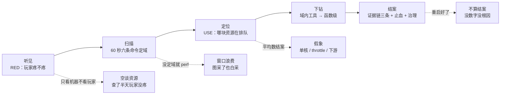
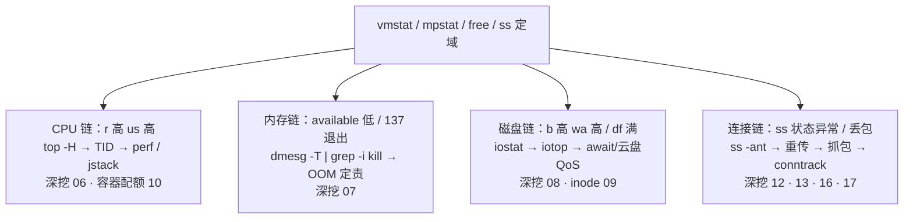
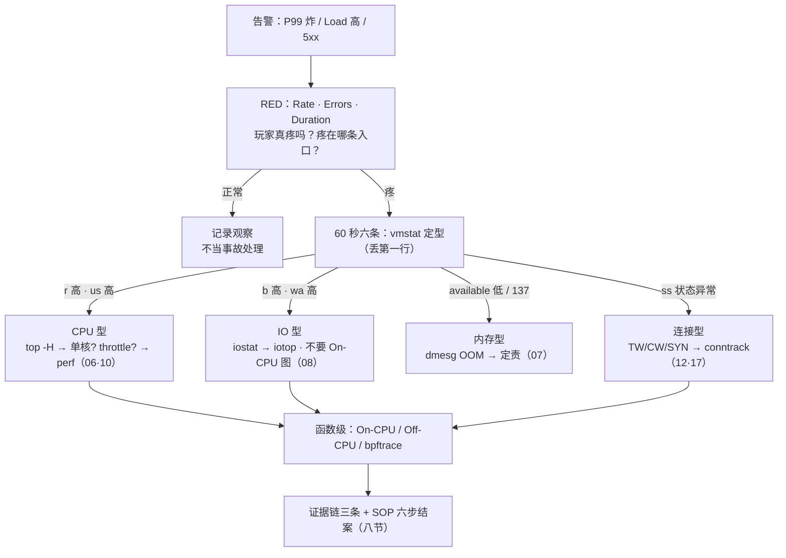

# 性能方法论：USE 与 RED

> 大家好，欢迎来到这次分享。开讲之前，先带大家回到一个很多值班同学都经历过的现场：
> 活动开服，登录 P99 从 50ms 飙到 800ms——群里有人已经在 `top` 里来回按 P/M，有人对战斗服敲 `perf record -a`，还有一单已经写好结论：「平均 CPU 才 40%，机器没问题」。
> 这一章讲完，你会知道当时那三个人各自错在哪，以及正确的顺序是什么。
> **本章回答**：一次性能故障从告警到结案的一生——RED 确认玩家疼、60 秒定域、USE 定资源、profiling 到函数级的边界、证据链收尾。
> **不讲**：Load 算法与软中断 → [06](../06-CPU与Load/)；换页与 OOM → [07](../07-内存与OOM/)；await / %util / 脏页 → [08](../08-磁盘与IO/)；队列与 Socket → [12](../12-网络栈与Socket/)；TCP 重传 → [13](../13-TCP与UDP/)；抓包与 MTU → [16](../16-网络排障与抓包/)；conntrack → [17](../17-iptables与conntrack/)；指标怎么变成告警规则 → [22](../22-监控与告警/)。这些都有专门的章节，本章只在用到时点到为止。

**标记**：🎯重点 · 🔥难点 · ⭐常考 · 🔧实操

**怎么听这场分享**：咱们先看第一节的主图，把「一次性能故障的一生」装进脑子；第二到第八节顺着听见 → 扫描 → 定位 → 假象 → 分叉 → 下钻 → 结案往下走；第九节专门讲定责，也就是开头那个现场的正确解法。每一节讲完都会提示对应练习题，学完就去练。

---

## 一、一张图：一次性能故障的一生

> 🎯 **一句话**：故障的一生是听见 → 扫描 → 定位 → 下钻 → 结案；跳步就是翻车。

咱们先不急着背命令。学性能方法论最怕的就是上来就 `top` / `perf`，背完工具还是不会定域。先看图，把「故障卡在哪一段」装进脑子里：



**读图**：带着三个问题看这张图，比背工具名有用得多：

- 主线四步是本章骨架：RED 看入口（二节）、六条命令定域（三节）、USE 定资源（四、五节）、profiling 到函数（六、七节）、证据链结案（八节）。
- 四条虚线是四个经典翻车点——每一个都是「跳过了一步」：跳过 RED 空谈资源、跳过定域直接 perf、拿平均数结案、停在「重启好了」。
- 本章是**方法论章**：每块资源只给「U/S/E 该看什么、下一刀去哪一章」，刀法细节全在资源专章。

方法论坐标系一句话：**横轴 RED——玩家疼不疼；纵轴 USE——哪块资源饱和；两个都成立，才是真故障，才值得往下查。**

---

---

好，主图有了。咱们正式出发——第一站：玩家到底疼不疼？

---

## 二、听见：RED——玩家疼不疼

> 🎯 **一句话**：RED 看入口的速率、错误、耗时——先证明玩家疼，再谈机器。

**RED 方法**（服务 / 入口视角的三指标）：

- **Rate（速率）**：请求量，QPS / RPS——流量涨没涨？是活动还是被扫？
- **Errors（错误）**：错误数与错误率——5xx 比例、业务失败码。
- **Duration（耗时）**：延迟——并且要看 **P99 / P95 分位数**，不是平均值。平均值会把 1% 玩家的 800ms 平均成「一切正常」。

**Duration 为什么必须是分位数**：

```text
10 个请求：9 个 10ms + 1 个 800ms
平均 = (9×10 + 800) / 10 ≈ 89ms   ← 平均数说「一切正常」
P99  = 800ms                       ← 每 100 个玩家就有 1 个在等 800ms
```

活动高峰 P99 会先于平均数崩——1% 玩家的等待被 99% 的正常请求稀释，平均值天然护短；所以面板和告警的 Duration 一律 P95 / P99 口径。

> 💡 **打个比方**：RED 是**餐厅前台的三张表**——今天进了多少客人（Rate）、多少单做砸了（Errors）、一桌等了多久才上菜（Duration）；USE 是**后厨仪表盘**——哪个灶眼满了、哪个水池堵了。客人没投诉（RED 正常），你把后厨翻个底朝天是白忙；客人在投诉（RED 异常），才值得进后厨找那口堵住的池子。

> 🔍 **现场**：登录网关报「P99 高」，先两条 `awk` 把 RED 拉出来——机器上没有 Python，管道最快：

```bash
# 5xx 数 / 总数 / 错误率（Nginx 组合日志 $1=IP $9=状态码，先看一行再改字段号）
awk '{c++; if($9~/^5/) s++} END{print "5xx",s+0,"total",c,"pct",(c?100*s/c:0)}' /var/log/nginx/access.log
# TOP IP：错误是集中在少数 IP（被扫）还是全网（自己的问题）
awk '{print $1}' /var/log/nginx/access.log | sort | uniq -c | sort -rn | head
```

```text
5xx 2480 total 99968 pct 2.48        ← E：错误率 2.48%，疼
     8234 1.2.3.4                    ← Rate：一个 IP 8234 次 → 被扫 / 重试风暴
      302 5.6.7.8                    ← 正常玩家量级 300 左右
```

**读数**：P99 50ms→800ms（D 涨）、错误率 2.48%（E 涨）、TOP IP 8234 次（R 异常集中）——三条线拼出「玩家确实在疼，且怀疑方向是被扫或重试风暴」。**这一步没走，后面所有命令都是瞎查。**

**黄金四信号**（Google SRE 的 four golden signals）：**Latency（延迟）、Traffic（流量）、Errors（错误）、Saturation（饱和度）**。RED 是它在服务侧的投影——Rate=Traffic、Duration=Latency、Errors=Errors；把 Saturation 接上（四、五节），就是完整的四信号。深讲告警怎么配 → [22](../22-监控与告警/)。

> ⚠️ **别混**：**RED 只对服务 / 入口，USE 只对资源**。「CPU 的 RED」「网关的 Utilization」都是错的口径——CPU 没有请求也没有耗时，网关没有队列长度可以一眼看。游戏网关、登录服用 RED；机器、磁盘、网卡用 USE。

> 📝 **面试**：问「RED 和 USE 区别」，答「RED 是服务视角——速率、错误、耗时，回答玩家疼不疼；USE 是资源视角——利用率、饱和度、错误，回答哪块硬件在排队。故障定位先 RED 确认影响面，再 USE 定责资源，两者配合着讲」。

---

---

听见段到这儿。本节对应练习题 Q3、Q7。好，RED 证明玩家在疼——大家想想：ssh 刚上去，第一分钟该敲什么？为什么不能先 `perf`？

---

## 三、扫描：60 秒全景定域

> 🎯 **一句话**：六条命令 60 秒定「域」，不定「根因」——定域决定进哪一章。

### 3.1 六条命令 🔧

> 🔍 **现场**：ssh 刚上去，别开 `top` 来回排序，按顺序跑完这六条：

```bash
uptime                          # Load 1/5/15 趋势：恶化还是恢复；1m>>15m 是正在出事
vmstat 1 5                      # r/b/wa/cs/st —— 定域核心，第一行是开机均值，丢掉
free -h                         # 看 available，不是 free 列
df -h && df -i                  # 块满还是 inode 满，是两种病
mpstat -P ALL 1 2               # 单核热点 / %steal —— 平均值骗人时的照妖镜
ss -s                           # 连接分布：ESTAB/TW/CW/SYN-RECV
```

每条只回答一个问题：Load 趋势、CPU 还是 IO、内存水位、磁盘满没满、单核还是全局、连接正常不正常。**30~60 秒的目的是把故障归到某一域，不是当场找根因。**

### 3.2 vmstat：一屏定 CPU 型还是 IO 型 ⭐

```bash
vmstat 1 5
procs -----------memory---------- ---swap-- -----io---- -system-- ------cpu-----
 r  b   swpd   free  ...         si   so    bi    bo   in    cs  us sy id wa st
 2 18      0  210000 ...          0    0    42  18024  9800 12000 15  5 30 50  0
```

字段签名单（细节在 [06](../06-CPU与Load/)、[08](../08-磁盘与IO/)）：

| 字段 | 含义 | 高了指向 |
|------|------|----------|
| r | 运行队列里等 CPU 的任务数 | r 持续 > 核数 → CPU 饱和 → [06](../06-CPU与Load/) |
| b | 不可中断睡眠（D，多半等 IO） | b 高 → IO 型 → [08](../08-磁盘与IO/) |
| wa | 等 IO 的 CPU 时间 | wa 高 → 磁盘慢 → [08](../08-磁盘与IO/) |
| si/so | 换入换出 | 持续 > 0 → 内存吃紧 → [07](../07-内存与OOM/) |
| cs | 上下文切换 | >10 万/s 且延迟涨 → 线程模型问题 → [06](../06-CPU与Load/) |
| st | 被宿主机偷走的时间 | >10% 持续 → 云超卖 → [06](../06-CPU与Load/) |

### 3.3 三个样本：一屏读出三种病 🔥

```text
样本A IO 型：  r  b  us sy id wa st      样本B CPU 型： r  b  us sy id wa st
              2 18  15  5 30 50  0                    25  0  82 10  3  0  0
→ b 高 wa 高，Load 是等盘堆出来的          → r 高 us 高，真在烧 CPU

样本C 单核骗平均：mpstat -P ALL
  all   40%        CPU0  98%        CPU1~15  3~6%
→ 平均 40% 结不了案：一颗核已经打满，P99 早就炸了（五节）
```

同样是「Load 40 / 延迟涨」，样本 A 进磁盘章、样本 B 上 perf、样本 C 拆单核热点——**先 vmstat / mpstat，再决定用什么工具，顺序不能反。**

### 3.4 历史回放：sar

现在的 `top` 只代表现在。老板问「昨天凌晨 3 点为什么打满」，用 sar 回放：

```bash
sar -u -f /var/log/sa/sa$(date -d yesterday +%d)   # 昨天的 CPU 历史
sar -q -f /var/log/sa/saDD                          # Load 历史
```

```text
Linux 3:10:01  CPU  %usr  %sys  %idle  %iowait
     03:20:01  all   82.3   6.1    5.2     4.1    ← 3 点档 %usr 82：CPU 型实锤
     03:30:01  all   12.0   3.0   80.1     2.5    ← 3:20 后恢复：对上变更时间线
```

**读数**：sar 拿到的不只是「昨天高过」，而是**几点开始、几点结束、哪一列高**——三点档 %usr 82 且持续 10 分钟，就能和发版记录、活动曲线对时间线；%iowait 高则是另一种病（进 08）。回放的目的就是把「传说」变成「带时刻的数字」。

sar 没开、监控也没有 → 先承认**没有证据**，别用现在的空闲 top 编故事；治理动作是补监控（[22](../22-监控与告警/)）。

> 📝 **面试**：问「机器异常你先跑什么」，答「60 秒六条：uptime、vmstat、free、df -h 加 df -i、mpstat -P ALL、ss -s——目的是定域不是定根因。CPU 型进 06、IO 型进 08、内存进 07、连接进 12/13。没定域就 perf record -a 是最大减分项」。

---

---

扫描段到这儿。本节对应练习题 Q1。好，域定下来了——大家想想：利用率 40% 就算没问题吗？什么叫饱和度？

---

## 四、定位：USE——哪块资源在排队

🔥 **Saturation（饱和度）**第一次见容易和利用率搅在一起。大白话：**利用率是资源忙不忙，饱和度是门口还排不排队**——座位坐满 40% 但队伍排到街上，照样「饱和」。⭐ 面试必考（练习题 Q2）。

> 🎯 **一句话**：USE 三步法——列资源清单，逐个查利用率、饱和度、错误。

**USE 方法**（Brendan Gregg，资源视角）：对**每一种资源**，依次检查三件事——

- **Utilization（利用率）**：资源忙着的时间占比。
- **Saturation（饱和度）**：资源忙不过来、**排队的程度**——运行队列、IO 队列、等待任务数。
- **Errors（错误）**：资源自己报错——OOM、IO error、丢包重传、table full。

**USE 三步法** ⭐：

1. **列资源清单**：CPU、内存、磁盘、网卡、连接表（conntrack）……先把这台机器上有的资源列全，别漏。
2. **每个资源查 U/S/E 三个指标**：一条都不跳——尤其 S 和 E，最容易被「平均利用率不高」掩盖。
3. **逐个排查可疑项**，下钻工具收窄到具体进程 / 设备，刀法交给资源专章。

> 💡 **打个比方**：利用率是**餐厅里坐满的座位比例**，饱和度是**门口排队的等位队伍**。座位坐满 40%（U 不高）但队伍排到街上（S 爆表），这家店照样「饱和」——**U 高不高只说明忙不忙，S 高才说明疼**。反过来座位 95% 但没人排队，它还在正常吞吐。

### 4.1 资源 × USE 作战地图 ⭐

| 资源 | U（利用率） | S（饱和度）⭐ | E（错误） | 深挖 |
|------|-------------|----------------|-----------|------|
| CPU | %us + %sy | r / Load / 单核满 / throttle | —（CPU 不报错） | [06](../06-CPU与Load/) |
| 内存 | used / working_set | si/so 换页、available≈0 | OOM kill（退出码 137） | [07](../07-内存与OOM/) |
| 磁盘 | %util | await、avgqu-sz | IO error、云盘 QoS | [08](../08-磁盘与IO/) · [09](../09-文件系统与inode/) |
| 网卡 | 带宽占比 | 队列堆积 / drop | 重传 | [12](../12-网络栈与Socket/) · [13](../13-TCP与UDP/) |
| 连接表 | conntrack count/max | 接近满时新 SYN 被丢 | dmesg `table full` | [17](../17-iptables与conntrack/) |
| 容器配额 | cgroup 内用量 | cpu.stat 的 nr_throttled | memory.events 的 OOM | [10](../10-cgroup与容器/) |

**两条判读纪律**：

- **要 U 高且 S 高，才是瓶颈**：只有 U 高、队列空，说明还能吃，先看错误和 RED；S 高（排队）才是玩家延迟的直接来源。
- **云盘 QoS 陷阱**：限流打满时 await 已经几百毫秒，`%util` 看起来却「还能吃」——**饱和度听队列（await），别只听 %util**（[08](../08-磁盘与IO/)）。

> ⚠️ **别混**：**Load 是 Saturation，不是 Utilization**。Load 数的是「排队的人数」（R+D，见 [06](../06-CPU与Load/)），CPU% 才是利用率。「Load 40」不等于「CPU 40%」，也不等于「需要加核」——Load 高 CPU 闲，先查 D 状态和 IO。

### 收束：方法论一张板

```text
横轴 RED（玩家疼不疼）：Rate · Errors · Duration(P99)
纵轴 USE（资源堵没堵）：每资源 × Utilization · Saturation · Errors
        ↓
RED 疼 + USE 某资源 S 高 → 真故障 → 进对应资源章下钻
RED 正常 + USE 高       → 资源忙但玩家没感觉 → 记录观察，别当事故
RED 疼 + USE 全绿       → 不在这台机器：查下游 / 依赖 / 客户端
```

> 📝 **面试**：问「只有利用率高算瓶颈吗」，答「不算——USE 要 U 和 S 一起看：利用率高且队列排队（Load、await、r）才是瓶颈；只有 U 高还能吃。另外 Load 是饱和度不是利用率，这是最常见的口径错误」。

---

---

定位段到这儿。本节对应练习题 Q2。回到开头那单「平均 CPU 才 40%」——这句话为什么几乎永远是错的？

---

## 五、假象：平均 CPU 40% 为什么结不了案 🔥

🔥 群里那句「平均 CPU 才 40%，机器没问题」——**高频错答**。大白话：**平均数会把单核打满平均成岁月静好**。口诀：**「平均骗人，先拆单核」**（练习题 Q4）。

> 🎯 **一句话**：平均数会把单核打满平均成岁月静好——五种假象逐个点名。

「平均 CPU 40%、还有余量、机器没问题」——**这句话在性能事故里几乎永远是错的**。平均之前的分布，至少有五种可能：

```text
平均 CPU 40% 的五种可能（按验证顺序自上而下）：
  ① 单核热点       → mpstat -P ALL：一颗核 100%，其他核围观
  ② cgroup throttle → 配额用完被踢出队列，宿主机利用率看不出（10 章 cpu.stat）
  ③ IO 饱和        → b/wa 高，Load 是 D 堆的，CPU 根本不是主角
  ④ 锁竞争         → 线程都在等锁，CPU 空转，延迟照样涨（Off-CPU）
  ⑤ 下游 RT        → 瓶颈在依赖（DB / 支付网关），本机 CPU 低是应该的
验证顺序：mpstat 单核？ → cpu.stat throttle？ → vmstat b/wa？
          → Off-CPU 看在等什么？ → curl 五段查下游（02 章网络排查命令）
```

> 🔍 **现场**：`mpstat -P ALL 1 2`，认「骗人输出」：

```text
CPU     %usr   %sys   %idle   ...
all     38.5    4.2    55.0          ← 平均 40%：容量同学说没问题
CPU0    97.1    2.5     0.0          ← 这颗核已经 100%：P99 就是它炸的
CPU1    12.3    1.0    86.0          ← 其他核在围观
```

> 💡 **打个比方**：平均 CPU 是**全公司平均工资**——老板和高管加起来平均出一个「大家都过得不错」，但看分布才知道 90% 的人月薪三千。单核打满就是那个高管：平均 40%，一颗核已经 98%。

**单核热点的标准处置**（细节在 [06](../06-CPU与Load/)）：拆热点函数 / 并行化主循环；**水平扩容无效**——包还是进同一条队列、同一个单线程逻辑。容器节点还要补 cgroup 视角：`cpu.stat` 的 `nr_throttled` 增量 > 5% 当 throttle 处理（[10](../10-cgroup与容器/)）。

> 📝 **面试**：被问「CPU 才 40% 为什么 P99 到 800ms」，按五种假象背：「单核热点看 mpstat、throttle 看 cpu.stat、IO 看 vmstat b/wa、锁看 Off-CPU、下游看 curl 五段——平均数在分布式和单核场景都会骗人」。这一题答得全，方法论就算立住了。

---

---

假象段到这儿。本节对应练习题 Q4。好，平均数拆穿了——四条资源链第一刀各砍哪？

---

## 六、分叉：定域之后，四条资源链进哪一章

> 🎯 **一句话**：CPU 链、内存链、磁盘链、连接链——每条链第一刀固定。

### 6.1 四条资源链 ⭐



### 6.2 退出码：进程怎么死的 🔥

| 退出码 | 信号 | 含义 | 下一刀 |
|--------|------|------|--------|
| 137 | SIGKILL（128+9） | 被强杀——先猜 OOM | `dmesg -T | grep -i kill`，OOM 定责 → [07](../07-内存与OOM/) |
| 139 | SIGSEGV（128+11） | 段错误，代码崩了 | core dump / 日志，别再查资源 |
| 143 | SIGTERM（128+15） | 被正常停止——发版 / 编排杀的 | 查变更时间线（[11](../11-Systemd与服务管理/)） |

**137 的纪律**：先证明是 OOM（dmesg / cgroup memory.events）再谈止血——「进程没了」和「被 OOM 杀了」差一次 dmesg。

**退出码在哪看**：`echo $?`、`journalctl -u <服务>` 的 Failed result、K8s 里 `kubectl describe pod` 的 `Last State: Terminated, Exit Code: 137`——三个口径同一个数；容器场景再配 `Reason: OOMKilled` 双确认。

### 6.3 磁盘满：止血是截断，不是 rm

```bash
df -h && df -i                       # 先分清：块满还是 inode 满
lsof +L1 | head                      # 已删但仍被持有的文件：rm 了也不释放空间
: > /var/log/app.log                 # 截断止血，安全；rm 正在被写的文件是坑
```

`rm` 一个正被进程持有的日志，空间**不释放**（fd 还开着），磁盘照样 100%——这是磁盘满处置的第一翻车点。块满 vs inode 满、轮转治理 → [09](../09-文件系统与inode/)、[23](../23-日志运维/)。

### 6.4 连接链：ss 状态分流

```bash
ss -ant | awk '{print $1}' | sort | uniq -c | sort -rn
```

```text
  45326 ESTAB      → 活动高峰或连接泄漏：对得上在线量级吗
   8210 TIME-WAIT  → 短连接太多：查 Keep-Alive / 连接池（12 章）
   4100 CLOSE-WAIT → 应用没 close：对端早关了，这端漏 fd（12 章）
    900 SYN-RECV   → backlog 不够或 SYN 攻击：somaxconn / 防火墙（17 章）
```

**新连接建不起来、老 ESTAB 还在 → 先查 conntrack 水位**（`table full` 时新 SYN 直接丢，表现为「部分玩家进不来」，见 [17](../17-iptables与conntrack/)），不是先怀疑光纤。

---

---

分叉段到这儿。本节对应练习题 Q5、Q6。好，域内数字有了——大家想想：什么时候该上火焰图？IO 型上 On-CPU 图会怎样？

---

## 七、下钻：profiling 的边界——何时要图，何时不要图 🔥

🔥 开头那位同学对战斗服敲 `perf record -a`——**最大减分项**。大白话：**还没定域就全机采样，图采了也白采，还伤高峰性能**。口诀：**「先定域，再下钻」**（练习题 Q9、Q13）。

> 🎯 **一句话**：先定域再下钻——IO 型上 On-CPU 火焰图，采了也白采。

### 7.1 工具按阶段上场

```text
定域（60秒）   ：uptime / vmstat / free / df / mpstat / ss —— 本章三节
域内（谁干的） ：top -H / pidstat -w -d / iotop / ss -antp / cgroup cpu.stat
函数级（为什么）：perf On-CPU 火焰图 / Off-CPU offcputime / bpftrace 计数
```

**上一阶段没出结论，不进下一阶段**——「还没定域就对战斗服 `perf record -a`」是本章最大的反面教材。

### 7.1b 边界表 ⭐

| 工具 | 什么时候用 | 什么时候别用 |
|------|------------|--------------|
| perf On-CPU 火焰图 | CPU 型：r 高、%us 高，要函数占比 | IO 型（b/wa 高）；CPU 不高延迟高（该 Off-CPU）；还没定域 |
| Off-CPU（offcputime） | CPU 闲但请求慢：等 IO / 等锁 / 等下游 | CPU 已经打满时（先采 On-CPU） |
| bpftrace | 按进程统计 syscall 次数，替代长时间 strace | 高峰长时间挂战斗服；写内核探针 |
| strace | 单进程卡在哪个 syscall，几秒即可 | 高峰长时间跟——ptrace 会把进程拖死 |
| perf record -a | 要全机视角时，**短窗口** | 生产一直开：-a 是全 CPU，高峰伤性能、文件巨大 |

> 💡 **打个比方**：IO 型 Load 上 On-CPU 火焰图，像**给骨折病人做心电图**——仪器没错，病人不对：他疼的地方根本不在你贴的电极上。CPU 型（%us 高）和等待型（b/wa 高、Off-CPU）要用不同的仪器。

### 7.2 On-CPU 火焰图 🔧

> 🔍 **现场**：`%us` 打满、定了 CPU 型，采 30 秒出图：

```bash
# 生产只做短窗口采样；绘图管道在分析机上跑
perf record -g -p {PID} sleep 30
perf script -i perf.data | stackcollapse-perf.pl > out.folded
flamegraph.pl out.folded > flamegraph.svg

# bpftrace 短窗口计数：谁在狂 write（Ctrl-C 停，输出 @[comm] 统计）
bpftrace -e 'tracepoint:syscalls:sys_enter_write /pid==28451/ { @[comm]=count(); }'
```

**读图五条** ⭐：

1. X 轴越宽 = 样本占比越高 = 越热。
2. **找顶部「宽而平」的框**——叶子热点，自身耗时的主犯。
3. 底层宽、顶层细 = 被很多路径调用，要逐层看调用方。
4. 颜色通常**无含义**（随机暖色只为好看），别按颜色找热点。
5. 采样 10~30 秒足够，挂一小时不会更准，只会更慢。

**容器里的采法**：宿主机上 `docker inspect -f '{{.State.Pid}}' <容器>` 拿主进程 PID，再 `perf -p` 采它；K8s 场景可起 privileged 调试 Pod，但生产要谨慎（权限大、易滥用）。

### 7.3 eBPF：被问到怎么答 🔥

30 秒口径分三层：**主机排障**用 bpftrace / BCC（offcputime 就是 BCC 工具）；**网络可观测**的 Cilium 属于 K8s 生态（→ [K8s 25](../../03-Kubernetes/25-eBPF与Cilium/)）；对比 strace，bpftrace 是统计计数不是逐次跟踪，开销小一个量级。三句背板：**短窗口、指定 PID / comm、Ctrl-C 能停；不写内核模块**——能安全地把这四句讲全，eBPF 这关就过了。

### 7.4 观测工具地图：什么工具看什么、深讲在哪章 ⭐

| 工具 | 观测什么 | 深讲 |
|------|----------|------|
| vmstat / mpstat / pidstat / sar | 定域与历史回放 | [06](../06-CPU与Load/) |
| free / smaps / dmesg OOM | 内存与换页 | [07](../07-内存与OOM/) |
| iostat / iotop / await | 磁盘 IO 与 QoS | [08](../08-磁盘与IO/) |
| df -i / lsof +L1 / 轮转 | inode、文件持有 | [09](../09-文件系统与inode/) |
| cpu.stat / memory.events | 容器配额与 throttle | [10](../10-cgroup与容器/) |
| ss / Recv-Q / fd | Socket 与队列 | [12](../12-网络栈与Socket/) |
| ss -i 重传 / RTT | TCP 层质量 | [13](../13-TCP与UDP/) |
| tcpdump / curl 五段 / MTU | 抓包与分段定层 | [16](../16-网络排障与抓包/) |
| conntrack 水位 / table full | 连接跟踪表 | [17](../17-iptables与conntrack/) |
| awk / sort / uniq 管道 | 日志现场统计 | [03](../03-文本三剑客/) |
| perf / bpftrace / 火焰图 | 函数级 profiling | 本章 |
| node_exporter / 面板 | 持续监控与告警 | [22](../22-监控与告警/) |

> 📝 **面试**：问「什么时候上火焰图」，答「先 60 秒定域：CPU 型、%us 高、要函数占比才上 On-CPU，采 30 秒；IO 型不上——等 IO 的时间不在 CPU 上，采出来全是空闲；CPU 闲延迟高用 Off-CPU；bpftrace 用来按 PID 统计 syscall；strace 只盯几秒」。

---

---

下钻段到这儿。本节对应练习题 Q9、Q10、Q13。好，函数级证据到手——大家想想：停在「重启好了」为什么不算结案？

---

## 八、结案：证据链、止血与重启纪律

> 🎯 **一句话**：三条证据 + 六步 SOP——停在「重启好了」的都不叫结案。

### 8.1 证据链最低标准 ⭐

```text
① 同一时刻的现场片段（vmstat / mpstat 一屏）
② 一张监控图（P99 / await / conntrack 曲线，粒度 1s）
③ 一条 error 日志（OOM / 5xx / table full）
```

**缺任何一条都是猜测**。监控粒度必须 **1s**——15s 采样的曲线会把 3 秒的尖峰平均掉，P99 和 CPU 图对不上号，等于没证据（配法 → [22](../22-监控与告警/)）。

### 8.2 排障 SOP 六步 🔧


**有变更先怀疑变更**——回滚是合法且最便宜的止血。「影响面没问清就扩容」排第 0 号错误：先问谁、何时、发版没、活动没。

### 8.3 重启什么时候可以 ⭐

| 可以重启 | 不可以 / 先别 |
|----------|----------------|
| 已有监控证据 + 止血窗口 + 可复现环境 | dmesg / ss / 日志还没留——证据一重启就没 |
| 确认泄漏类问题，重启止血 + 留 dump | 未知是否泄漏，重启把现场毁了 |
| 无状态服务 | 有状态游戏逻辑服：重启 = 踢人，要当**变更**走流程 |

**交接格式**：当前状态 + 未验证的假设 + 下一步命令。「重启好了」三个字不是交接，是把事故推给下一班。

### 8.4 开服前监控红线

开服 checklist 至少五条：`df -h / df -i`、conntrack 水位（告警线 **80%**）、证书有效期、DNS TTL（[15](../15-DNS与CDN/)）、日志轮转（[23](../23-日志运维/)）。监控里缺 working_set / await / conntrack / throttle 这几个字段的，**先补监控再谈排障**——它们是四个最常缺、又最常在开服夜出事的指标。

> 📝 **面试**：问「先重启可不可以」，答「重启可以当止血，但三个前提：证据已留（dmesg/日志/监控图）、窗口允许、有状态服当变更走流程。结案要数字 + 根因 + 预防三条，停在『重启好了』不算结案」。

---

---

结案段到这儿。本节对应练习题 Q8、Q11。现在再看群里那三个人——60 秒怎么定责？

---

## 九、作战：60 秒定责剧本

> 🎯 **一句话**：RED 先确认疼，六条命令定域，四条链分刀——一气呵成。

### 定责决策树 ⭐



### 现象 · 先做 · 别做

| 现象 | 先做 | 别做 |
|------|------|------|
| P99 800ms、平均 CPU 40% | mpstat -P ALL 查单核；cpu.stat 查 throttle | 拿平均数结案「机器没问题」 |
| Load 40、idle 还有一半 | vmstat 看 b/wa：IO 型 Load 不加核 | 加 8 核 |
| IO 型 Load（b=18 wa=50） | iostat / iotop → 08 | 上 On-CPU 火焰图 |
| 退出码 137 | dmesg -T \| grep -i kill 定 OOM | 直接再拉起来完事 |
| /var 100% | `: > file` 截断 + lsof +L1 | rm 正在写的日志 |
| 5xx 涨、单 IP 8000+ 次 | awk TOP IP + 封禁 / 限流（[01](../01-主机排查命令/)） | 先调后端代码 |
| 新玩家连不上、老连接正常 | conntrack 水位 + dmesg | 怀疑光纤 / 换网卡 |
| 昨天凌晨的尖峰 | sar -u -f 回放 | 用现在的 top 编故事 |

### 60 秒剧本 🔧

> 🔍 **现场**：接告警后 60 秒口述这条线，边说边跑：

```text
0–10s   RED：P99 多少、5xx 率多少、QPS 有没有翻倍 → 玩家疼 + 怀疑方向
10–30s  vmstat 1 5：r/b/wa/st → CPU 型 / IO 型 / 被偷
30–45s  free · df -h -i · ss -s：内存水位、盘满、连接分布
45–60s  定链：CPU→06 · IO→08 · 内存→07 · 连接→12/17；
        容器节点补 cpu.stat / memory.events（10）
```

**两分钟版追问口径**：「最可疑的资源是什么？证据是哪三条？止血和根因各是什么？现在恢复到什么程度？」——四个问题答不上任何一个，都说明还没定域完。

---

---

作战段到这儿。本节对应练习题 Q12、Q14。现在再看开头那个现场——P99 炸、有人 top、有人 perf、有人写「平均 40%」——你已经知道该怎么拦住他们了。

---

## 十、收口

### 命令速查 🔧

```bash
# 60 秒六条
uptime; vmstat 1 5; free -h; df -h && df -i; mpstat -P ALL 1 2; ss -s
# RED 现场统计
awk '{c++; if($9~/^5/) s++} END{print "5xx",s+0,"total",c,"pct",(c?100*s/c:0)}' access.log
awk '{print $1}' access.log | sort | uniq -c | sort -rn | head
ss -ant | awk '{print $1}' | sort | uniq -c | sort -rn
# 域内收窄
pidstat -w 1 3                      # 谁在切（cswch/nvcswch）
pidstat -d 1 3                      # 谁在读写 IO
iostat -x 1 3                       # await / %util
cat /sys/fs/cgroup/<path>/cpu.stat  # throttle 增量
# 函数级（CPU 型专用）
perf record -g -p {PID} sleep 30
perf script -i perf.data | stackcollapse-perf.pl | flamegraph.pl > cpu.svg
bpftrace -e 'tracepoint:syscalls:sys_enter_write /pid=={PID}/ { @[comm]=count(); }'
# 历史回放
sar -u -f /var/log/sa/sa$(date -d yesterday +%d)
# 结案留证
dmesg -T | grep -i kill             # OOM 定责；lsof +L1 截断前查持有
```

### 面试锚点

遮住右列自问自答，卡壳的行回去重读对应小节——这张表就是本章的「30 秒口径速查」。

| 问 | 30 秒答 |
|----|---------|
| RED 是什么？ | Rate / Errors / Duration——服务入口视角，回答玩家疼不疼；Duration 看 P99 不看平均。 |
| USE 是什么？ | 每种资源查 Utilization / Saturation / Errors；三步法：列资源清单 → 逐资源查三指标 → 逐个排查。 |
| USE 和 RED 怎么配？ | 先 RED 确认影响面（玩家真疼），再 USE 定责资源（哪块排队）；入口用 RED、资源用 USE，口径不能串。 |
| 只有利用率高是瓶颈吗？ | 不是；U 高且 S 高（排队：Load/await/r）才是瓶颈；云盘 QoS 打满时 %util 不高但 await 爆。 |
| Load 是 U 还是 S？ | Saturation（排队长度），不是利用率；Load 40 ≠ CPU 40%。 |
| 平均 CPU 40% 结案？ | 不能：单核热点 / throttle / IO 饱和 / 锁 / 下游 RT 五种假象，mpstat + cpu.stat + vmstat 逐个点名。 |
| 60 秒跑什么？ | uptime / vmstat / free / df -h+df -i / mpstat -P ALL / ss -s——定域不是定根因。 |
| vmstat 第一行？ | 开机以来平均，丢掉；看第 2 行起的实时值。 |
| 何时上火焰图？ | CPU 型、%us 高、要函数占比：采 30 秒；IO 型不上；CPU 闲延迟高用 Off-CPU。 |
| 火焰图怎么读？ | X 越宽越热；找顶部宽平的叶子热点；底层宽=被多处调用；颜色无含义。 |
| eBPF 用过吗？ | bpftrace/BCC 做短窗口 syscall 统计与 offcputime；短窗口、指定 PID、Ctrl-C 能停、不写内核模块；Cilium 归 K8s。 |
| 137 / 139 / 143？ | 137=SIGKILL 先猜 OOM 查 dmesg；139=段错误查 core；143=SIGTERM 查变更时间线。 |
| 磁盘满第一步？ | df -h+df -i 分块满/inode 满；截断止血 `: > file`；lsof +L1 查已删持有；别 rm 正在写的文件。 |
| 重启可以吗？ | 可当止血：证据已留 + 窗口允许 + 有状态服当变更；结案要数字+根因+预防。 |
| 证据链是什么？ | 同时刻 vmstat 片段 + 一张监控图（1s 粒度）+ 一条 error 日志，缺一是猜测。 |

### 易错一句话对照

- 「CPU 的 RED」→ RED 只对入口，资源用 USE
- Load 高就加核 → Load 是 S 含 D，先 vmstat 分型
- 平均 40% 没问题 → 单核 / throttle / IO / 锁 / 下游五种假象
- IO 型 Load 上火焰图 → 等盘时间不在 CPU 上，采了白采
- 没定域就 perf record -a → 全 CPU 采样伤生产且图没用
- strace 挂半小时 → ptrace 拖死进程，改 bpftrace 计数
- 火焰图按颜色找热点 → 颜色随机无含义，看宽度
- rm 大日志释放空间 → 正被持有的文件 rm 不释放，先 lsof +L1 再截断
- 137 直接拉起完事 → 先 dmesg 定责 OOM，不然现场就没了
- 重启好了 = 结案 → 没数字没根因，只是把事故推给下一班
- CPU 闲 = 机器没问题 → 等 IO / 等锁 / 等下游都不烧 CPU
- 用现在的 top 讲昨天的故障 → 只能 sar / 监控历史回放
- 告警响了直接登机器 → 先 RED 看影响面，机器可能不是主角
- eBPF 就是 Cilium → bpftrace/BCC 是主机排障，Cilium 归 K8s 网络层
- P99 高先查 CPU → 先 60 秒定域，IO / 锁 / 下游都可能是主角

### 数字墙

> 60 秒全景 **6 条命令** · 火焰图采样 **10–30s** · bpftrace **短窗口 + Ctrl-C** · 监控粒度 **1s** · 证据链 **3 条** · conntrack 告警线 **80%** · throttle 当故障 **nr_throttled / nr_periods > 5%（增量）** · cs 查 **> 10 万/s** · 退出码 **137 / 139 / 143** · P99 看分位数**不看平均** · USE 判瓶颈 **U 高 且 S 高**

---

## 合上书

对齐练习题「合上书」，逐条口述，卡住就回对应节 / 题号。现在再看开头那三个人——乱翻 top、未定域 perf、「平均 40% 没问题」——你该知道先查什么了。

- [ ] **默画一节的图**：听见 → 扫描 → 定位 → 下钻 → 结案，旁边标四个翻车点（空谈资源 / 未定域 perf / 平均数结案 / 重启好了）。
- [ ] **口述 RED**：三字母各是什么、为什么 Duration 看 P99 不看平均、awk 两行怎么现场拿 5xx 率和 TOP IP。
- [ ] **口述 USE 三步法**：列资源清单 → 逐资源查 U/S/E → 逐个排查；资源 × USE 矩阵每格指向哪一章。
- [ ] **口述假象题**：平均 CPU 40% 的五种可能和验证顺序；mpstat 骗人输出长什么样。
- [ ] **口述四条链**：CPU / 内存 / 磁盘 / 连接各看什么字段、第一刀是什么、深挖在哪章；137/139/143 各自的下一刀。
- [ ] **口述 profiling 边界**：On-CPU / Off-CPU / bpftrace / strace / perf -a 各自的用与不用；火焰图读图五条；eBPF 三句背板。
- [ ] **口述结案**：证据链三条、SOP 六步、重启的三个前提、交接格式；开服监控红线有哪五条。
- [ ] **跑一遍 60 秒剧本**：对着决策树，从 P99 告警口述到进哪一章、上什么工具。
- [ ] **口述现场统计**：awk 两行拿 5xx 率与 TOP IP；`ss -ant | uniq -c` 四种状态各指向什么；sar 回放怎么和变更时间线对表。

下一章：[监控与告警](../22-监控与告警/)——本章的 RED / USE 指标怎么变成告警规则。工具深挖：[06](../06-CPU与Load/) · [07](../07-内存与OOM/) · [08](../08-磁盘与IO/) · [09](../09-文件系统与inode/) · [12](../12-网络栈与Socket/) · [16](../16-网络排障与抓包/) · [17](../17-iptables与conntrack/)。
