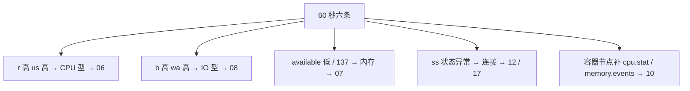
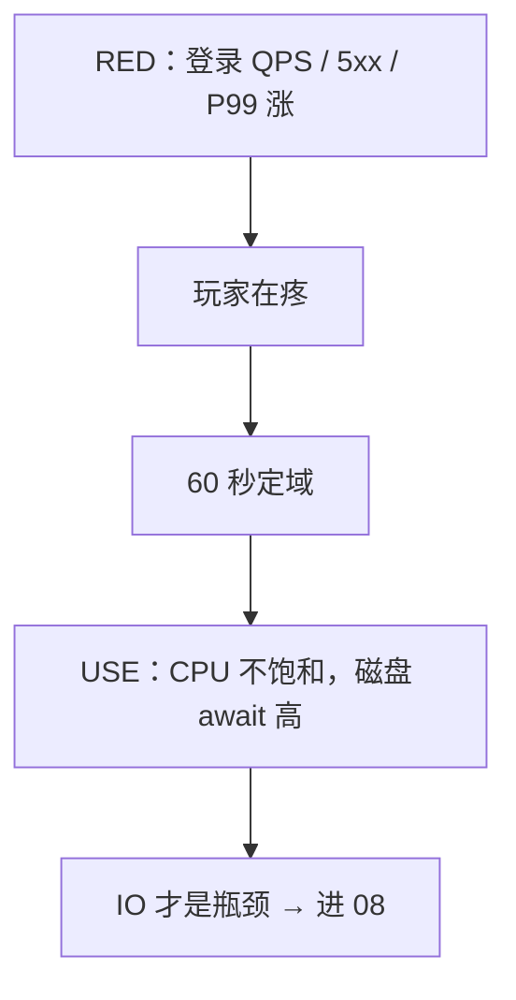
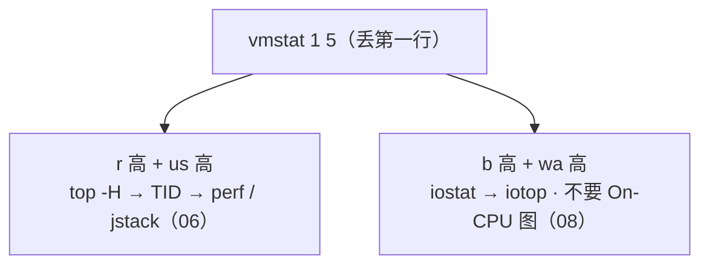

# 21｜性能方法论：USE 与 RED · 练习题

先对照 [知识点](知识点.md) **「一」总图 + 「三」60 秒定域 + 「七」profiling 边界** 自己口述，再对答案。关键字（60 秒六条、USE 三步法、平均 CPU 40%、火焰图边界、证据链）要能定域。

| 标记 | 含义 |
|------|------|
| **核心** | 不懂整章就没建立起来 |
| **必会** | 值班和面试都要能讲 |
| **常用** | 线上会反复碰到 |
| **常考** | 白板和追问的高频口径 |

## 本题目录

- [Q1 60 秒全景](#q1)
- [Q2 USE 三步法](#q2)
- [Q3 RED 与一次故障](#q3)
- [Q4 平均 CPU 40%](#q4)
- [Q5 CPU 链 vs IO 型 Load](#q5)
- [Q6 OOM 137 / 磁盘满](#q6)
- [Q7 awk 与 ss 状态](#q7)
- [Q8 历史回放与证据链](#q8)
- [Q9 perf / bpftrace 边界](#q9)
- [Q10 工具地图](#q10)
- [Q11 SOP 与重启](#q11)
- [Q12 默画总图](#q12)
- [Q13 profiling 选型三问](#q13)
- [Q14 USE/RED 白板综合题](#q14)
- [合上书](#合上书)

---

## Q1

**★★★★★｜机器异常，你 60 秒跑哪些命令？每条看什么？**

**覆盖**：核心 · 必会 · 常考

**对应**：知识点 [三、扫描：60 秒全景定域](知识点.md)（分型另见「四、定位」）

### 场景

登录延迟告警。你刚 ssh 上去。旁边有人已经在 `top` 里来回排序，另有人要对战斗服 `perf record -a`。

### 完整解答

**一句话**：六条命令 60 秒定域不是定根因：uptime / vmstat / free / df / mpstat / ss -s 决定进哪一章。

```bash
uptime                          # Load 1/5/15 趋势
vmstat 1 5                      # r/b/wa/cs/st —— 定域核心，丢第一行
free -h                         # available，不是 free 列
df -h && df -i                  # 块满还是 inode 满
mpstat -P ALL 1 2               # 单核热点 / %steal
ss -s                           # 连接分布
```



三个样本要能一屏读出三种病：IO 型（r=2 b=18 wa=50）、CPU 型（r=25 us=82）、单核骗平均（all 40% / CPU0 98%）。Load 高先 vmstat 分型；没有这套开口就 top 乱翻是减分项。

### 再追问

- 容器节点还要补什么？——`cpu.stat` 看 throttle、`memory.events` 看 OOM（[10](../10-cgroup与容器/)）；宿主机利用率低也可能是 throttle。
- 为什么不先 top？——top 只看「现在谁占 CPU」，定不了 r vs b、inode、连接分布，更定不了单核和 steal。

---

## Q2

**★★★★★｜USE 三个字母是什么？三步法怎么走？只有利用率高是瓶颈吗？**

**覆盖**：核心 · 必会 · 常考

**对应**：知识点 [四、定位：USE——哪块资源在排队](知识点.md)

### 场景

白板：「讲 USE」。有人开始背 CPU 百分比。

### 完整解答

**一句话**：USE 对每种资源查 Utilization / Saturation / Errors，三步法列清单→查三指标→逐个排；U 高且 S 高才是瓶颈。

三步法：**① 列资源清单**（CPU、内存、磁盘、网卡、连接表）→ **② 每资源查 U/S/E 三个指标，一条不跳** → **③ 逐个排查**，刀法交资源专章。利用率是座位坐满率，饱和度是门口的等位队伍——U 高只说明忙，S 高才说明疼。Load 是 S 不是 U。

| 资源 | U | S | E |
|------|---|---|---|
| CPU | %us+%sy | r / Load / 单核满 / throttle | — |
| 内存 | used / working_set | 换页、available≈0 | OOM（137） |
| 磁盘 | %util | await、avgqu-sz | IO error、云盘 QoS |
| 网卡 | 带宽占比 | 队列 / drop | 重传 |
| 连接表 | count/max | 接近满丢新 SYN | dmesg table full |

### 再追问

- 只有利用率高、没有队列，是瓶颈吗？——不一定。还能吃就先看错误和 RED；要 U 高且 S 高才是瓶颈。
- 云盘 QoS 打满时 %util 一定高吗？——不一定。await 已经几百毫秒，%util 看起来还能吃；饱和度听 await（[08](../08-磁盘与IO/)）。

---

## Q3

**★★★★★｜USE 和 RED 怎么结合讲一次故障？**

**覆盖**：核心 · 必会 · 常考

**对应**：知识点 [二、听见：RED——玩家疼不疼](知识点.md)（坐标系另见「一、一张图」）

### 场景

活动开始 P99 从 50ms 到 800ms。有人甩一张「CPU 平均 40%」的图说没问题。

### 完整解答

**一句话**：RED 看玩家疼不疼（Rate/Errors/Duration），USE 看哪块资源饱和——坐标系两个轴都成立才是真故障。

RED 是前台三张表：进了多少客人（Rate）、砸了多少单（Errors）、等了多久（Duration，看 P99 不看平均）；USE 是后厨仪表盘。先 RED 确认影响面，再 USE 定资源。黄金四信号 = Latency / Traffic / Errors / Saturation——RED 是服务侧投影，把 Saturation 接上就齐了。



### 再追问

- 只有 RED 没有 USE 会怎样？——知道疼，不知道打哪块硬件 / 依赖，下一步会乱刀。
- 「CPU 的 RED」这种说法对吗？——不对。RED 只对服务 / 入口，资源用 USE，口径不能串。

---

## Q4

**★★★★★｜平均 CPU 40%、P99 从 50ms 到 800ms，还查什么？**

**覆盖**：核心 · 必会 · 常考

**对应**：知识点 [五、假象：平均 CPU 40% 为什么结不了案](知识点.md)

### 场景

容量规划同学说 CPU 还有余量。玩家已经在排队。有人要直接结案「机器没问题」。

### 完整解答

**一句话**：平均 CPU 40% 结不了案：查单核热点、throttle、IO 饱和、锁、下游 RT，逐个点名。

```text
平均 CPU 40% 的五种可能（按验证顺序）：
  ① 单核热点       → mpstat -P ALL —— all 40% · CPU0 98% · 其他核围观
  ② cgroup throttle → cpu.stat 的 nr_throttled 增量 > 5%
  ③ IO 饱和        → vmstat 的 b/wa —— Load 是 D 堆的
  ④ 锁竞争         → CPU 闲延迟涨 → Off-CPU
  ⑤ 下游 RT        → curl 五段 / 依赖 P99（02 章网络排查命令）
```

单核热点的处置是拆热点 / 并行化主循环，**水平扩容无效**——包还是进同一条队列。平均 CPU 是全公司平均工资：平均 40%，一颗核已经 98%。这题答得全，方法论就立住了。

### 再追问

- Load 40 和平均 CPU 40% 是一回事吗？——不是。Load 是队列（S，含 D），平均 CPU 是利用率均值（U 的平均）。
- CPU 闲就一定没瓶颈？——等 IO / 等锁 / 等下游都不烧 CPU，用 Off-CPU 和 curl 五段验证。

---

## Q5

**★★★★★｜CPU 高完整链，和 Load 高但 CPU 低有什么分叉？**

**覆盖**：核心 · 必会 · 常用

**对应**：知识点 [六、分叉：定域之后，四条资源链进哪一章](知识点.md)（分型签名另见「三、扫描」）

### 场景

Load 到 40。有人要上 perf 出火焰图。vmstat 还没跑。

### 完整解答

**一句话**：CPU 型和 IO 型 Load 分叉：都先 vmstat；IO 型不上 On-CPU 火焰图。



**IO 型典型读数**：`r=2 b=18 us=15 id=30 wa=50` → b 高 wa 高 → 进 [08](../08-磁盘与IO/)。单核打满用 mpstat；throttle 读 cgroup `cpu.stat`；`pidstat -w`/`-d` 找谁在切谁在 IO；iotop 确认写什么；perf 仅 CPU 型函数级。还没定域就开 perf，窗口全浪费。

### 再追问

- CPU 不高但请求延迟大？——Off-CPU：等 IO / 锁 / 网络，BCC `offcputime`（[七、下钻](知识点.md)）。
- 火焰图怎么读？——X 轴越宽越热；顶部宽平 = 叶子热点；底层宽 = 被多处调用；颜色通常无含义。

---

## Q6

**★★★★☆｜OOM 和磁盘满的止血各自第一步是什么？**

**覆盖**：必会 · 常用

**对应**：知识点 [六、分叉：定域之后，四条资源链进哪一章](知识点.md)（重启纪律另见「八、结案」）

### 场景

逻辑服 137 退出；另一台 `/var` 100%。有人准备 `rm -rf` 日志，有人准备立刻重启所有 Pod。

### 完整解答

**一句话**：OOM 先 137/dmesg 留证定责，磁盘满先截断 / 清 deleted fd，不要先 rm 或无脑重启。

OOM：退出码 137 = 128+9（SIGKILL），先 `dmesg -T | grep -i kill` 或 cgroup `memory.events` 证明是 OOM——「进程没了」和「被 OOM 杀了」差一次 dmesg。泄漏则重启止血并留 dump；打满则扩容 / 限流。深挖 → [07](../07-内存与OOM/)。

磁盘满：`df -h` / `df -i` 先分块满还是 inode 满，**截断**（`: > file`）止血，`lsof +L1` 查已删仍被持有的 fd——rm 正被持有的文件不释放空间。深挖 → [09](../09-文件系统与inode/)。

```bash
df -h && df -i
lsof +L1 | head
# : > /var/log/app.log   或  truncate -s 0 ...
```

游戏逻辑服不能当止血直接重启：踢人成本高，要当变更走流程。139 段错误查 core；143 SIGTERM 查变更时间线——别和 137 混。

### 再追问

- inode 满和块满命令一样吗？——都先 `df -h && df -i`。按请求切小文件会 inode 满；stdout 单文件重定向会块满。
- 新玩家连不上、老 ESTAB 正常？——先查 conntrack 水位和 `table full`（[17](../17-iptables与conntrack/)），不是怀疑光纤。

---

## Q7

**★★★★☆｜现场怎么用 awk 拿 TOP IP 和 5xx？ss 状态怎么分流？**

**覆盖**：必会 · 常用

**对应**：知识点 [二、听见：RED——玩家疼不疼](知识点.md)（ss 状态分流另见「六、分叉」）

### 场景

网关 5xx 涨。要立刻判断是被扫还是错误集中。机器上没有 Python。

### 完整解答

**一句话**：现场 awk 拿 TOP IP 和 5xx 率（RED 的 R 和 E），ss 状态分流决定进 12 还是 17。

```bash
awk '{print $1}' access.log | sort | uniq -c | sort -rn | head
awk '{c++; if($9~/^5/) s++} END{print "5xx",s+0,"total",c,"pct",(c?100*s/c:0)}' access.log
ss -ant | awk '{print $1}' | sort | uniq -c | sort -rn
```

Nginx 组合日志常见 `$1=IP $9=状态码`，先看一行再改字段号。读数示例：`5xx 2480 total 99968 pct 2.48` + 一个 IP 8234 次 → 被扫 / 重试风暴。

ss 状态分流：**TIME-WAIT** → 短连接 / 池子；**CLOSE-WAIT** → 应用没 close（漏 fd）；**SYN-RECV** → backlog / 攻击；**ESTAB 猛涨** → 活动或泄漏。一条 `uniq -c` 决定进哪章（[12](../12-网络栈与Socket/) · [17](../17-iptables与conntrack/)）。

### 再追问

- 为什么不写 Python？——当下要快，管道最快；长期统计上面板（[22](../22-监控与告警/)）。awk 深挖 → [03](../03-文本三剑客/)。
- RED 里 E 和 ss 状态什么关系？——5xx 是入口 Errors；ss 状态是连接侧线索，两边要对上时间线。

---

## Q8

**★★★★☆｜昨天凌晨的 CPU 尖峰，现在 top 是空闲，怎么办？采样粒度多少才够？**

**覆盖**：必会 · 常用 · 常考

**对应**：知识点 [三、扫描：60 秒全景定域](知识点.md)（证据链另见「八、结案」）

### 场景

老板问昨天凌晨 3 点 CPU 为什么打满。现在 ssh 上去 top 全是闲。

### 完整解答

**一句话**：昨天尖峰现在 top 空闲，用 sar 或监控历史回放，不要用现在的 top 编故事。

```bash
sar -u -f /var/log/sa/sa$(date -d yesterday +%d)   # 昨天 CPU
sar -q -f /var/log/sa/saDD                          # Load 历史
```

或监控曲线（node_exporter，**1s** 粒度——15s 采样会把 3 秒尖峰平均掉，P99 和 CPU 图对不上号）。sar 也没有：先承认没有证据，补监控（[22](../22-监控与告警/)）。证据链最低标准：**同一时刻 vmstat 片段 + 一张监控图 + 一条 error 日志**，缺一就是猜测。

### 再追问

- 生产没有 1s 粒度会怎样？——尖峰被平均掉，事后无法定责；开服前先把采样粒度和保留期钉进监控规范。
- 补哪几个指标最值钱？——working_set / await / conntrack / throttle——最常缺、又最常在开服夜出事。

---

## Q9

**★★★★★｜perf 和 bpftrace 何时用、何时不用？被问「用过 eBPF 吗」怎么答？**

**覆盖**：核心 · 必会 · 常考

**对应**：知识点 [七、下钻：profiling 的边界——何时要图，何时不要图](知识点.md)

### 场景

逻辑服 `%us` 打满。有人在 IO wait 很高的另一台机器上也要出一张火焰图。会 perf 之后被追问 eBPF。

### 完整解答

**一句话**：perf 在 CPU 型 `%us` 高时采 30 秒出图；IO 型 / Off-CPU 不上 On-CPU 图；bpftrace 短窗口指定 PID。

| 用 | 不用 |
|----|------|
| `%us` 高 → `perf record -g -p PID sleep 30`，找顶部宽平的叶子 | IO 型 Load（b+wa 高）；CPU 不高延迟高（该 Off-CPU）；还没定域 |
| bpftrace：按 PID 统计 write / openat，替代长时间 strace | 写内核探针；Cilium 网络（归 K8s 25）；高峰长时间挂战斗服 |
| Off-CPU：`offcputime` 看等 IO / 锁 / 下游 | 对着空闲 CPU 采 On-CPU |

```bash
perf record -g -p PID sleep 30
perf script -i perf.data | stackcollapse-perf.pl | flamegraph.pl > cpu.svg
bpftrace -e 'tracepoint:syscalls:sys_enter_write /pid==PID/ { @[comm]=count(); }'
```

eBPF 30 秒口径分三层：主机排障用 bpftrace / BCC（offcputime）；网络可观测的 Cilium 属 K8s（[K8s 25](../../03-Kubernetes/25-eBPF与Cilium/)）；对比 strace 是统计计数、开销小一个量级。背板四句：**短窗口、指定 PID/comm、Ctrl-C 能停、不写内核模块**。容器：宿主机 `docker inspect -f '{{.State.Pid}}'` 拿主 PID 再采；`perf record -a` 不能生产一直开。

### 再追问

- strace 呢？——单进程卡某个 syscall，几秒即可；ptrace 挂久会把进程拖死，改 bpftrace。
- 顶层宽 vs 底层宽？——顶层宽 = 自身耗时（叶子热点）；底层宽顶层细 = 被多处调用，要看调用方。

---

## Q10

**★★★★☆｜值班工单：这些现象各用什么工具、深挖去哪章？**

**覆盖**：必会 · 常用

**对应**：知识点 [七、下钻：profiling 的边界——何时要图，何时不要图](知识点.md)（观测工具地图表）

### 场景

带你值班的老员工丢来一串现象，考你「什么工具观测什么、细节在哪章」。

### 完整解答

**一句话**：工具按阶段上场（定域→域内→函数级），每个工单先报工具再报章节。

| 现象 | 工具 | 深挖 |
|------|------|------|
| Load 高要分型 | vmstat / mpstat / sar | [06](../06-CPU与Load/) |
| 谁在换页、谁被 OOM | free / dmesg | [07](../07-内存与OOM/) |
| await 高、谁在狂写盘 | iostat / iotop | [08](../08-磁盘与IO/) |
| df 满、已删文件占空间 | df -i / lsof +L1 | [09](../09-文件系统与inode/) |
| 容器配额被 throttle | cpu.stat / memory.events | [10](../10-cgroup与容器/) |
| CLOSE-WAIT 堆积 | ss / fd | [12](../12-网络栈与Socket/) |
| 重传高、RTT 差 | ss -i | [13](../13-TCP与UDP/) |
| 要看包到底丢哪 | tcpdump / curl 五段 | [16](../16-网络排障与抓包/) |
| table full 丢新 SYN | conntrack 水位 | [17](../17-iptables与conntrack/) |
| 要函数占比 | perf / 火焰图 | 本章 |
| 要持续看曲线和告警 | node_exporter / 面板 | [22](../22-监控与告警/) |

工具按阶段上场：定域（六条）→ 域内（pidstat / iotop / ss -antp / cgroup）→ 函数级（perf / Off-CPU / bpftrace）；上一阶段没出结论，不进下一阶段。

### 再追问

- 三个阶段顺序能反吗？——不能。没定域就 perf record -a，图采了也白采还伤生产。
- 日志现场统计用什么？——awk / sort / uniq 管道（[03](../03-文本三剑客/)），比临时 Python 快。

---

## Q11

**★★★★☆｜先重启什么情况下可以？SOP 六步怎么走？**

**覆盖**：必会 · 常用

**对应**：知识点 [八、结案：证据链、止血与重启纪律](知识点.md)

### 场景

群里已经有人在敲 `systemctl restart`。战斗服还挂着长连接。这次是你半夜敲命令救回来的，下周轮到别人值班。

### 完整解答

**一句话**：重启可以止血但要有证据链；停在「重启好了」不算结案。

可以：证据已留（dmesg / ss / 日志 / 监控图）+ 止血窗口 + 可复现环境；确认泄漏重启止血并留 dump；无状态服务。不行：证据没留就重启（现场毁了）；未知是否泄漏；有状态游戏逻辑服——重启 = 踢人，要当**变更**走流程。有变更先怀疑变更，回滚是合法止血。


交接格式：当前状态 + 未验证的假设 + 下一步命令。结案三件：数字、根因、预防。证据链三条：同时刻 vmstat 片段 + 一张监控图（1s 粒度）+ 一条 error 日志。开服红线五条：df / inode、conntrack 80%、证书、DNS TTL、日志轮转。工程化：runbook 写成 60 秒全景 + 分域链接，告警带红线——不是个人英雄敲命令（[Oncall](../../04-工程化与自动化/08-运维平台与Oncall/)）。

### 再追问

- 影响面还没问清就扩容？——先问谁、何时、是否发版 / 活动，再决定回滚还是扩容。
- 活动高峰正确顺序？——RED 确认失败率 → 60 秒定域 → 常是 SQL / await / conntrack → 先限流 / 扩容 / 回滚，再函数级。

---

## Q12

**★★★★★｜合上书默画：从告警到定责的一张板画什么？**

**覆盖**：核心 · 常考

**对应**：知识点 [一、一张图：一次性能故障的一生](知识点.md)（决策树另见「九、作战」）

### 场景

面试官：「别讲细节，先画你排障的总图。」给你 90 秒白板。

### 完整解答

**一句话**：RED（入口）→ 60 秒六条（定域）→ 四条资源链 → profiling 边界；旁边标四个翻车点。

```text
RED: QPS / 5xx / P99 —— 玩家疼不疼
        ↓
60秒: uptime → vmstat → free → df(-i) → mpstat → ss —— 定域
        ↓
四链: CPU→06 | 内存/137→07 | 磁盘→08/09 | 连接→12/17
        ↓
profiling: CPU型→On-CPU火焰图 | 等待→Off-CPU | 计数→bpftrace | IO型→不要图
结案: 证据链三条 + SOP 六步 + 重启纪律
翻车: 空谈资源 · 未定域perf · 平均数结案 · 重启好了
```

坐标系一句话：横轴 RED 疼不疼，纵轴 USE 哪块资源饱和；两个轴都成立才是真故障——RED 疼 + USE 全绿，说明不在这台机器，查下游。

### 再追问

- 刻意不展开的章有哪些？——机制细节甩给 06~10 / 12 / 16 / 17；监控面板与告警规则甩给 [22](../22-监控与告警/)；本章只管定域与边界。
- 「平均数结案」为什么排进翻车点？——五种假象（单核 / throttle / IO / 锁 / 下游）任何一种都能让平均 40% 和 P99 800ms 同时成立。

---

## Q13

**★★★★☆｜On-CPU / Off-CPU / bpftrace / 不上图——四个边界案例怎么选？**

**覆盖**：必会 · 常考 ｜ **对应**：知识点 [七、下钻：profiling 的边界](知识点.md)

### 场景

三个工单：① CPU 90% 热点函数；② 线程全在 futex 等锁；③ await 200ms。

### 完整解答

> 🎯 **一句话**：**CPU 型且 us 高 → On-CPU 火焰图；等锁/等 IO → Off-CPU 或 bpftrace；纯 IO 型 → 不要火焰图**。

| 案例 | 工具 | 别用 |
|------|------|------|
| ① 算伤害热点 | perf 火焰图 | strace 长期挂 |
| ② futex 一片 | Off-CPU / bpftrace | 只看 On-CPU |
| ③ await 高 | iostat → 08 | perf 找「慢盘」 |

先 USE 定域，再 profiling；未定域就 perf = 翻车点之一。

### 再追问

- eBPF 四句背板？——复述 Q9；生产权限与开销纪律。

---

## Q14

**★★★★★｜白板：RED→60秒→四链→结案，附四个翻车点？**

**覆盖**：核心 · 必会 · 常考 ｜ **对应**：知识点 [九、作战](知识点.md) · [十、收口](知识点.md)

### 场景

白板综合：「活动高峰 P99 爆，从告警到证据链，完整走读。」

### 完整解答

> 🎯 **一句话**：**RED 确认疼 → 六条定域 → 四链下钻 → 证据三条 → 重启纪律**；翻车：平均数、未定域 perf、空谈资源、重启好了。

```text
RED: 5xx/P99/QPS
60s: uptime vmstat free df mpstat ss
四链: 06 CPU | 07 内存 | 08/09 盘 | 12/17 连接
结案: vmstat片段 + 1s监控图 + error一行
禁止: 先重启、只扩副本不修 throttle、IO型加核
```

坐标系：横轴 RED，纵轴 USE；两轴都成立才是真单机故障。

> 📝 **面试**：RED 疼 + USE 全绿 → 查下游/网络，别在本机耗死。

### 再追问

- 和 22 章分工？——22 看见信号，21 定域下钻。

---

## 合上书

- [ ] 默画「一」的图：听见 → 扫描 → 定位 → 下钻 → 结案；四个翻车点能点名吗？
- [ ] 60 秒六条命令是哪六条？各看什么？三个 vmstat 样本怎么分型？容器还补什么？
- [ ] USE 三步法怎么走？U 和 S 一起看才是瓶颈？Load 为什么是 S 不是 U？
- [ ] RED 三字母？黄金四信号？和 USE 怎么配一次登录故障？
- [ ] 平均 CPU 40%、P99 到 800ms 还查什么？五种假象和验证顺序？
- [ ] 137 / 139 / 143 各自的下一刀？磁盘满为什么截断不 rm？
- [ ] 什么时候上 On-CPU 火焰图？什么时候 Off-CPU / bpftrace？什么时候根本不要图？eBPF 四句背板？
- [ ] 现场 TOP IP / 5xx 两行 awk？昨天尖峰现在 top 空闲怎么办？采样粒度多少？
- [ ] 先重启何时可以？证据链最低标准？SOP 六步？停在「重启好了」差什么？
- [ ] profiling 四案例选型（Q13）
- [ ] 白板 RED→结案全链（Q14）

与知识点「合上书」对齐。下一章：[监控与告警](../22-监控与告警/)。
