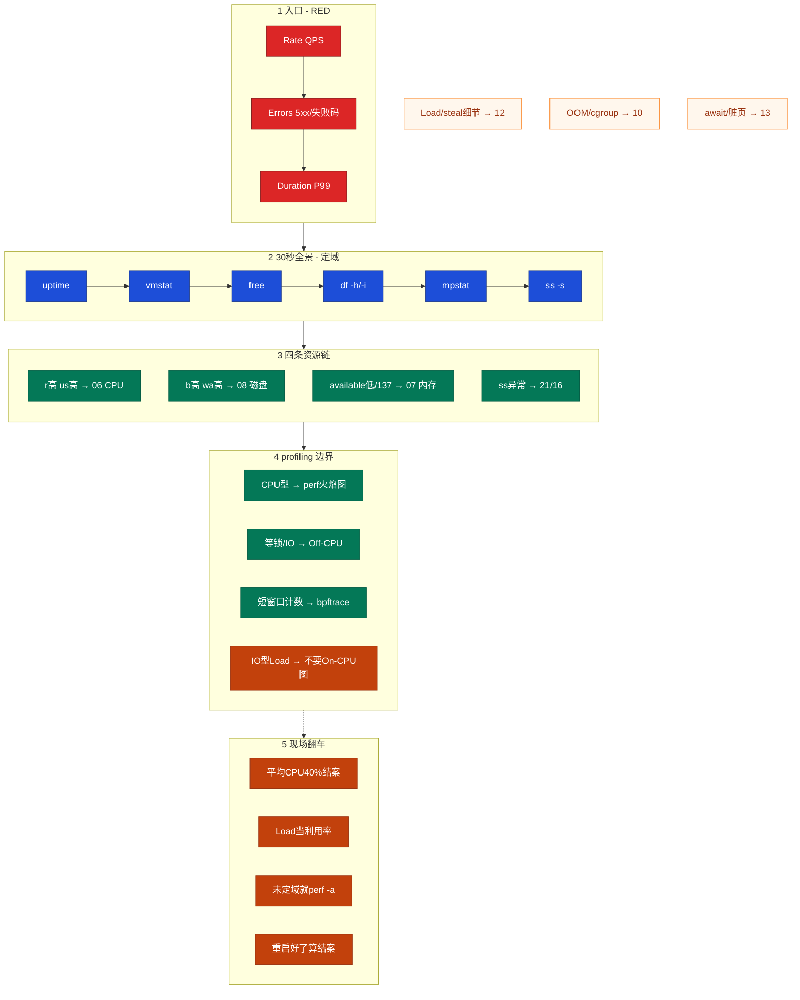
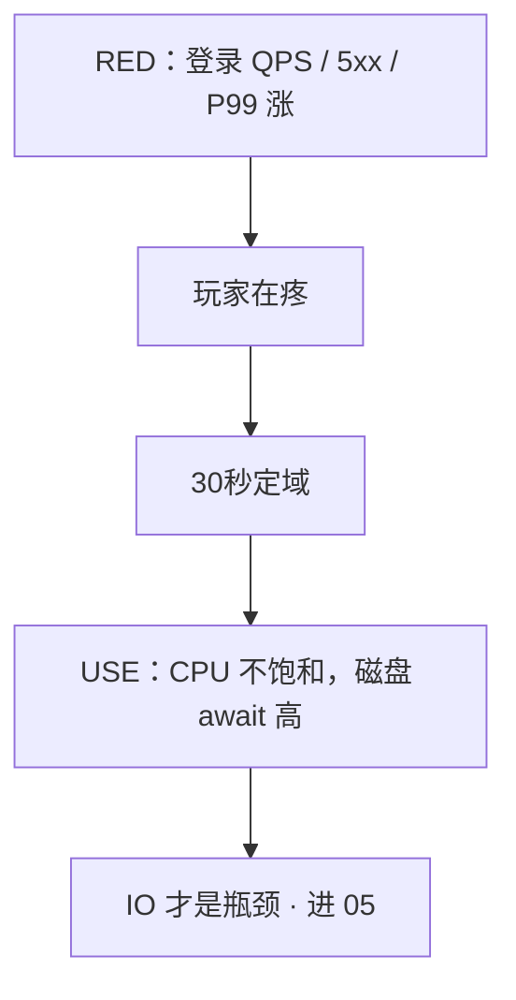
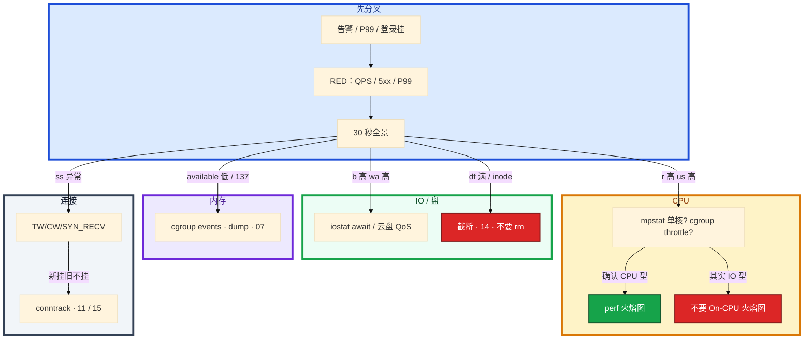

# 性能观测与排障

> **这章解决什么**：活动开始登录 P99 从 50ms 飙到 800ms——机器「看起来没事」，旁人已经在 top 乱翻或对战斗服 `perf record -a`。卡在定域、定资源、还是 profiling 边界？  
> **读法**：**先看总图** → **再走读一次告警** → **再认名词** → **再抠 USE/RED / 30 秒 / 火焰图边界** → **定责树**。  
> **刻意不展开**：Load vs util、软中断、steal 细节 → [06](../06-CPU与Load/)；OOM / cgroup memory → [07](../07-内存与OOM/)；await / 脏页 → [08](../08-磁盘与IO/)；TW/CW / fd / conntrack → [12](../12-网络栈与Socket/)；curl 五段 / 抓包 → [16](../16-网络排障与抓包/)；主机黄金指标 / 告警分级 → [22](../22-监控与告警/)；PromQL / SLO → [K8s 18](../../03-Kubernetes/18-监控与可观测性/)；Cilium / 内核探针 → [K8s 23](../../03-Kubernetes/23-eBPF与Cilium/)。

---

## 本章目录

1. [本章定位](#1-本章定位)
2. [先看总图：告警怎么走到定责](#2-先看总图告警怎么走到定责) ← **开篇必读**
   - [2.0 全章知识串图](#20-全章知识串图一张把细节串起来) ← **架构总览**
   - [2.1 坐标系：入口 RED × 资源 USE](#21-坐标系入口-red--资源-use)
   - [2.2 完整走读](#22-完整走读登录-p99-飙了从电话到定域)
3. [名词扫盲（对照总图认词）](#3-名词扫盲对照总图认词)
4. [USE：资源哪块在排队](#4-use资源哪块在排队)
5. [RED：玩家疼不疼](#5-red玩家疼不疼)
6. [平均 CPU 40%：本章最易混](#6-平均-cpu-40本章最易混) ← **重点精读**
7. [30 秒全景：定域六条命令](#7-30-秒全景定域六条命令)
8. [四条资源链：定域后进哪一章](#8-四条资源链定域后进哪一章)
9. [profiling 边界：何时图、何时不要图](#9-profiling-边界何时图何时不要图) ← **重点精读**
10. [定责决策树与命令速查](#10-定责决策树与命令速查)
11. [去哪章继续学](#11-去哪章继续学)
12. [面试 · 易错 · 数字](#12-面试--易错--数字)
13. [合上书](#合上书)

---

## 1. 本章定位

| 章 | 负责 |
|----|------|
| **03～07 / 11** | 各资源域的机制与深排障 |
| **21（本章）** | **先定域、再下钻**：USE/RED、30 秒全景、profiling 边界、证据链 |
| **21 / K8s 18** | 监控面板、告警分级、PromQL |

本章是**性能排障入口**。后面所有「进 03 还是 05」「要不要火焰图」，都建立在「RED 确认疼 → 30 秒定域 → USE 指资源」这张图上。

🎯 **值班签名**：P99 飙了、平均 CPU 40%——先 30 秒六条命令定域，**禁止**开口就 top 乱翻或 `perf record -a`。

活动开始，登录 P99 从 50ms 飙到 800ms，告警群炸了。旁边有人已经在 top 里来回按 P/M/T，另有人对战斗服上 `perf record -a`。你看一眼 CPU 平均 40%，有人宣布「机器没问题」——其实单核打满、cgroup throttle、盘 await 200ms，平均 CPU 在骗人。

**本章主线（排障就按这三步想）：**

1. **定域**：30 秒六条命令 + RED 确认玩家疼不疼，决定进哪一章（03～07 / 11）。
2. **下钻**：USE 看哪块资源饱和——Load 是队列不是利用率；平均 CPU 40% 结不了案。
3. **留证**：同一时刻 vmstat 片段 + 监控图 + error 日志；先止血再根因，不停在「重启好了」。

**读完你能：** 开口 30 秒全景定域；用 USE 讲资源、用 RED 讲入口；CPU 链和 IO 链能分叉；知道何时火焰图、何时 bpftrace、何时根本不要图。

---

## 2. 先看总图：告警怎么走到定责

> **正确开篇顺序**：先有全局画面，再认词，再抠细节。  
> 先看 **§2.0 全章串图**（考点挂一张板上），再看 **§2.1 坐标系**，再用 **§2.2 走读**把一次登录告警串起来。

### 2.0 全章知识串图（一张把细节串起来）

> 🎯 **合上书要能默画这张。** 红=入口疼 · 蓝=30 秒定域 · 绿=资源链 · 橙=profiling 翻车。  
> 若预览仍报错，以下面 **ASCII 一页板** 为准。



**读图路线：**

| 段 | 记住 |
|----|------|
| ① RED | 谁失败、失败多少、多慢——玩家疼不疼（§5） |
| ② 30 秒 | uptime→vmstat→free→df→mpstat→ss，按序扫（§7） |
| ③ 四链 | r/us→06；b/wa→08；available/137→07；ss→21/16（§8） |
| ④ 图 | 只给 CPU 型上 On-CPU；IO 型不要图（§9） |
| ⑤ 翻车 | 平均 CPU、Load≠util、未定域 perf、重启结案（§6、§10） |

```text
┌──────────────────────────────────────────────────────────────────────────┐
│                     12 一张板：从告警到定域到定责                          │
├─────────────┬────────────────────┬───────────────────────────────────────┤
│  RED 入口   │  30 秒全景         │  USE 资源 / 定责                      │
│  QPS        │  uptime Load趋势   │  U 利用率 · S 饱和(队列) · E 错误     │
│  5xx/失败码 │  vmstat r/b/wa/st  │  CPU链 / 磁盘链 / 内存链 / 连接链     │
│  P99        │  free available    │  容器再补 cpu.stat / memory.events    │
│             │  df -h/-i · mpstat │                                       │
│             │  ss -s             │                                       │
├─────────────┴────────────────────┴───────────────────────────────────────┤
│  profiling：CPU型→火焰图 · 等锁/IO→Off-CPU · 计数→bpftrace · IO型→不要图 │
│  翻车：平均40%结案 · Load当util · perf -a一直开 · 「重启好了」当结案      │
└──────────────────────────────────────────────────────────────────────────┘
```

---

### 2.1 坐标系：入口 RED × 资源 USE

假设：登录网关告警「P99 > 500ms」，战斗服机器 CPU 平均 40%。

**怎么读这张坐标系：**

- **横轴 = 入口（RED）**：玩家疼不疼——QPS / 失败率 / P99  
- **纵轴 = 资源（USE）**：哪块仪器报警——CPU / 盘 / 内存 / 网 / 连接表  
- **交点 = 你今晚要钉的根因方向**：先确认横轴有疼，再在纵轴找饱和

```text
                    USE 资源饱和 ↑
                         │
              空谈资源    │    ★ 真故障区
         （有 U/S，无疼） │   （RED 疼 + USE 饱和）
                         │
        ─────────────────┼─────────────────→ RED 入口疼
                         │
              没事/噪声   │    知道疼、打不准
                         │   （只有 RED，下一步乱）
                         │
```


**读图三句话（先背这三句）：**

1. **RED 先于 USE**：先确认玩家疼，再查哪块资源炸——别用「CPU 还有余量」盖住 P99。  
2. **USE 要 U 且 S**：只有利用率高、没有队列，不一定是瓶颈；Load 是 S，不是 U。  
3. **30 秒在中间**：RED 确认疼之后，六条命令定域；不够定域，不上火焰图。

> **记住**：游戏网关用 RED，机器用 USE；两个框架配着讲，才是一次完整故障口述。

---

### 2.2 完整走读：登录 P99 飙了，从电话到定域

> 🎯 **只保留这一版走读。** 角色：你（值班）、登录网关、战斗服节点、告警群。

**场景**：活动 20:00 开。飞书：「登录 P99 800ms，玩家喊慢」。群里已有人贴「CPU 平均 38%」。

#### 第 1 步 · RED 确认疼（约 30 秒看面板 / 两行 awk）

```bash
# 网关 access（组合日志常见 $1=IP $9=状态码；先看一行再改字段）
awk '{c++; if($9~/^5/) s++} END{print "5xx",s+0,"total",c,"pct",(c?100*s/c:0)}' /var/log/nginx/access.log
awk '{print $1}' /var/log/nginx/access.log | sort | uniq -c | sort -rn | head -5
```

```text
5xx 1240 total 50000 pct 2.48

   8234 203.0.113.88
   1203 10.0.0.15
    890 10.0.0.22
```

| 读数 | 说明 |
|------|------|
| 5xx ≈ 2.5% | 不是全挂，但已经疼 |
| TOP IP 8234 | 可能单渠道/攻击，也可能下游超时集中在这路 |
| 监控 P99 | 50ms → 800ms，Duration 确认 |

→ **结论**：RED 三件套齐了——疼。下一步 30 秒全景，不是立刻 perf。

#### 第 2 步 · 30 秒全景（ssh 战斗服 / 登录相关机）

```bash
uptime
vmstat 1 5
free -h
df -h && df -i
mpstat -P ALL 1 2
ss -s
```

**分支 A · IO 型 Load（今晚常见）：**

```text
# uptime
 20:03:01 up 45 days, load average: 38.20, 35.10, 28.50

# vmstat 一行典型
 r  b   swpd   free   buff  cache   si   so    bi    bo   in   cs us sy id wa st
 2 18      0 123456  12345 456789    0    0  8500  1200 5000 8000 15  5 30 50  0
```

| 字母 | 值 | 含义 |
|------|----|------|
| r | 2 | CPU 可运行队列短 |
| b | 18 | **IO 阻塞队列很长** |
| wa | 50% | 大量时间在等盘 |
| us | 15% | CPU 不算忙 |

→ **定域：磁盘链（05）**。下一步 `iostat -x 1 3` 看 await。**不要上 On-CPU 火焰图。**

**分支 B · CPU 型：**

```text
 r  b  ... us sy id wa st
25  0  ... 80  5 10  2  0
```

→ **定域：CPU 链（03）**。再 mpstat 看单核 / throttle，确认后才 `perf -p PID`。

**分支 C · 平均 40% 但 P99 仍高：**

```text
# mpstat -P ALL
CPU    %usr   %sys  %iowait  %idle
all    40.0    5.0     2.0    53.0
  0    98.0    1.0     0.0     1.0
  1     5.0    2.0     1.0    92.0
  ...
```

→ 平均骗人：一核打满。继续查锁 / 单线程热点 / cgroup throttle（§6）。

#### 第 3 步 · 留证再止血

同一时刻留三样：

1. 上面那段 `vmstat` / `mpstat` 文本  
2. 监控图（登录 QPS、P99、await 或 CPU）  
3. 一条 error / 5xx 日志  

然后：限流 / 扩 / 回滚 / 截断日志——**先止血**，函数级根因可以后做。

```text
电话/告警
   │
   ▼
 RED：QPS / 5xx / P99 ──疼？──否──▶ 降级观察 / 查误报
   │是
   ▼
 30秒：uptime → vmstat → free → df → mpstat → ss
   │
   ├── r高 us高 ──────────▶ CPU链 →（确认后）火焰图
   ├── b高 wa高 ──────────▶ 磁盘链 → iostat · 不要On-CPU图
   ├── available低 / 137 ─▶ 内存链 → events · dump
   └── ss 异常 ───────────▶ 连接链 → TW/CW/conntrack
```

> **记住**：走读验收——合上书能按「RED → 六条命令 → 四链分叉」口述一遍，且能说出「今晚为什么不上火焰图」。

#### 第 4 步 · 若定域是 CPU 型，函数级怎么收尾（对照用）

同夜另一台战斗服：`r=22`、`us=78%`、`wa=1%`。才允许进 profiling：

```bash
pidstat -u 1 3 | head
perf top -g -p $(pgrep -n game-server)
# 确认热点后短窗口：
perf record -g -p $(pgrep -n game-server) sleep 30
```

读图找宽而平的叶子；若平顶在 `pthread_mutex` / 业务单线程函数 → 锁或单核逻辑，不是「再加机器平均 CPU」。细节边界见 §9。

#### 走读对照表（今晚两台机器）

| 机器 | vmstat 要点 | 定域 | 今晚要不要 On-CPU 图 |
|------|-------------|------|----------------------|
| 登录相关 A | r=2 b=18 wa=50% | 磁盘链 05 | **不要** |
| 战斗服 B | r=22 b=0 us=78% wa=1% | CPU 链 03 | **要**（短窗口 -p PID） |
| 容器节点 C | 宿主机 idle 高，P99 仍差 | 先看 throttle | 可能要，但先 `cpu.stat` |

---

## 3. 名词扫盲（对照总图认词）

对照 §2.0：左边 RED、中间 30 秒、右边 USE。词不够用时再翻各资源章，本章只建**位置感**。

| 词 | 总图上在哪 | 一句话 | 主责章 |
|----|------------|--------|--------|
| **RED** | 段① | Rate / Errors / Duration——入口疼不疼 | 本章 |
| **USE** | 段③ | Utilization / Saturation / Errors——资源炸不炸 | 本章 |
| **Load** | uptime / vmstat | **队列长度（饱和）**，不是 CPU 百分比 | [06](../06-CPU与Load/) |
| **r / b** | vmstat | r=可运行排队；b=不可中断（多等 IO） | [06](../06-CPU与Load/)、[08](../08-磁盘与IO/) |
| **wa / st** | vmstat / mpstat | wa=等 IO；st=被宿主机偷走的时间 | [06](../06-CPU与Load/) |
| **available** | free | 应用还能要的内存，比 free 更有用 | [07](../07-内存与OOM/) |
| **throttle** | cgroup cpu.stat | 配额打满被限速；宿主机 CPU 可以低 | [10](../10-cgroup与容器/) |
| **On-CPU 火焰图** | 段④ | 采样「谁在跑」——只给 CPU 型 | 本章 §9 |
| **Off-CPU** | 段④ | 采样「谁在等」——锁 / IO / 网络 | 本章 §9 |
| **bpftrace** | 段④ | 短窗口计数，不是长时间 strace | 本章 §9 |
| **证据链** | 翻车旁 | 同一时刻 vmstat + 图 + error 日志 | 本章 §10 |

**值班里怎么认现象**（先听告警/玩家怎么说，再对表）：

| 告警/玩家说的 | 技术含义 | 你的第一刀 |
|---------------|----------|------------|
| 「P99 飙了」「登录慢」 | 入口 RED 异常 | 30 秒全景 + RED |
| 「Load 40 了」 | 可能是 CPU 队列或 IO 队列 | vmstat 看 r 还是 b |
| 「CPU 才 40% 啊」 | 平均在骗人 | mpstat 单核 / throttle / await |
| 「磁盘满了」 | 块满还是 inode 满 | `df -h && df -i` |
| 「进程没了 / 137」 | OOM 或 cgroup kill | dmesg + cgroup events |

> **记住**：30 秒全景用来**定域**，不是根因；RED 回答疼不疼，USE 回答哪块资源炸；没有当时的图，现在的 top 不能结案。

---

## 4. USE：资源哪块在排队

> **一句话**：USE 要求利用率高 **且饱和** 才是瓶颈；Load 是队列，不是利用率。

### 4.1 三个字母钉死

| 字母 | 含义 | 你在机器上对应什么 |
|------|------|-------------------|
| **U** Utilization | 忙碌的比例 | CPU `%us+%sy`；盘 `%util`；网卡带宽占比；内存 used |
| **S** Saturation | 排队 / 等待 | Load / run queue；盘 await、avgqu-sz；steal、cgroup throttle；换页 |
| **E** Errors | 出错次数 | 重传、OOM、磁盘 error、网卡 drop、cgroup oom_kill |

```text
每种资源都问三遍：
  U  忙了百分之几？
  S  门外排了多长队？
  E  有没有报警器在响？

只有 U 高、S 也长 → 真瓶颈
只有 U 高、S 很短 → 可能还能吃，先看 E 和 RED
```

### 4.2 按资源套 USE

| 资源 | U | S | E |
|------|---|---|---|
| CPU | `mpstat` %us/%sy | `vmstat` r、Load、steal、`cpu.stat` throttled | 少见；软锁 / MCE 另说 |
| 内存 | used / working_set | si/so 换页、available 逼近 0 | OOM、`memory.events` |
| 磁盘 | `%util` | await、avgqu-sz、`b`/`wa` | iostat 错误、云盘 QoS 打满 |
| 网卡 | 带宽 / pps | 队列溢出、丢包 | 重传、`ethtool -S` drop |
| 连接表 | conntrack count/max | 表接近满时新 SYN 排队/丢 | `table full, dropping packet` |

### 4.3 现场一例：Load 40，有人喊 CPU 不高

```bash
uptime
vmstat 1 5
mpstat -P ALL 1 2
```

```text
load average: 38.20, 35.10, 28.50
 r  b  ... us sy id wa st
 2 18  ... 15  5 30 50  0
```

**读数**：`r=2` 不高，`b=18` 很高，`wa=50%` → **IO 型 Load**。Load 40 来自磁盘排队，不是 CPU 打满。下一步进 05，**不要 On-CPU 火焰图**。

若 `r=25`、`us=80%`、`wa=2%` → CPU 型，才考虑 perf。

> **别混**：Load 高 ≠ CPU 利用率高。Load 是 **S**；`%us` 才是 CPU 的 **U**。见 §6。

**面试怎么说**：「USE 要 U 和 S 同时高才是瓶颈；Load 40 我先 vmstat 看 r 还是 b，b 高 wa 高走 IO 链，r 高 us 高走 CPU 链。」

---

## 5. RED：玩家疼不疼

> **一句话**：RED 回答疼不疼，USE 回答哪块资源炸；游戏网关用 RED，机器用 USE。

### 5.1 三个字母钉死

| 字母 | 含义 | 游戏入口怎么看 |
|------|------|----------------|
| **R** Rate | QPS / 登录尝试 | 网关 access / 面板请求速率 |
| **E** Errors | 失败比例 | 5xx、499、业务失败码 |
| **D** Duration | 耗时 | **P99 / P50**，不要只看平均 |

```text
前台三张表（RED）          后厨仪表（USE）
  每小时多少桌客人    ←→    哪口锅、哪个冰箱报警
  退菜比例
  等位时间 P99
```

### 5.2 现场一例：登录 P99 告警

先确认影响面，再定域：

```bash
awk '{c++; if($9~/^5/) s++} END{print "5xx",s+0,"total",c,"pct",(c?100*s/c:0)}' /var/log/nginx/access.log
awk '{print $1}' /var/log/nginx/access.log | sort | uniq -c | sort -rn | head -5
```

对照监控：登录 QPS、P99 曲线、5xx 率——**RED 三件套齐了再跑 30 秒全景找 USE**。

### 5.3 和 USE 怎么配一次故障



| 只有… | 后果 |
|-------|------|
| 只有 USE、没有 RED | 空谈资源，不知道玩家疼不疼 |
| 只有 RED、没有 USE | 知道疼，下一步乱——不知道打哪块硬件/依赖 |

> **别混**：两个框架不要混着用词——「CPU RED」这种说法是错的。入口 RED，资源 USE。

**面试怎么说**：「入口我先 RED：谁失败、失败多少、多慢；确认影响面后再 USE 定资源。」

---

## 6. 平均 CPU 40%：本章最易混

> 🔥 **全章最易晕的一点单独钉死。**  
> ① 最常见例子 → ② 一句话定义 → ③ 命令怎么认 → ④ 易错一句。

### 6.1 最常见例子（先客户端/服务端场景）

活动开服。容量规划同学甩图：「全机 CPU 平均 40%，还有余量。」玩家登录队列已经排到炸。真相可能是：

| 可能 | 平均 40% 时实际发生了什么 |
|------|---------------------------|
| 单核热点 | 一核 100%，其他核闲着——锁 / 单线程逻辑 |
| cgroup throttle | 容器配额打满；**宿主机**利用率可以低 |
| IO 饱和 | `%us` 不高，但 await 200ms，P99 全毁 |
| 下游 RT | 本机不忙，等 MySQL / 大厅 / 第三方 |
| 丢包 / 重传 | 网络在疼，CPU 图 greenery |

### 6.2 一句话定义

> **平均 CPU = 所有核、一段时间的均值；它掩盖单核、短尖峰、配额和「等」出来的延迟。**

P99 从 50ms 到 800ms 时，「平均 40% 所以没问题」**结不了案**。

### 6.3 对照命令怎么认

```bash
mpstat -P ALL 1 2
# 容器节点再补：
# cat /sys/fs/cgroup/.../cpu.stat          # throttled
# cat /sys/fs/cgroup/.../memory.events     # oom
vmstat 1 5                                  # 顺手看 wa / b
```

```text
平均 40% 时你要拆开的树：
平均 40%
   ├── mpstat：是不是一核 100%、其他核闲
   ├── cgroup cpu.stat：有没有 nr_throttled 在涨
   ├── vmstat：b/wa 是不是其实 IO 型
   ├── 锁 / 下游 RT / 丢包
   └── curl 五段、依赖 P99（→ 16）
```

**典型 mpstat（单核骗平均）：**

```text
CPU    %usr   %sys  %iowait  %idle
all    40.0    5.0     2.0    53.0
  0    98.0    1.0     0.0     1.0
  1     5.0    2.0     1.0    92.0
  2     8.0    3.0     2.0    87.0
```

`all=40%` 看起来舒服；`CPU0=98%` 才是真相。

### 6.4 易错一句钉死

> **别混**：平均 CPU 低 ≠ 没瓶颈；Load 高 ≠ CPU 利用率高。  
> 别处再说「平均骗人」时，**回指本节**，不重复展开。

**面试怎么说**：「平均 CPU 40% 我会查单核、throttle 和 await；Load 是队列不是利用率。」

---

## 7. 30 秒全景：定域六条命令

> **一句话**：六条命令回答「进哪一章」，不是根因；工具按阶段上场，不一次开齐。

### 7.1 六条命令（背这张）

```bash
uptime                          # Load 趋势：1/5/15 是否在涨
vmstat 1 5                      # r/b/wa/st/cs —— 定域核心
free -h                         # available，不是 free
df -h && df -i                  # 块满还是 inode 满
mpstat -P ALL 1 2               # 单核 / steal
ss -s                           # 连接分布；细看再 ss -ant | awk
```

容器节点再补：

```bash
# 路径随 cgroup v1/v2 变，先找到容器对应 cgroup
cat .../cpu.stat                # nr_throttled / throttled_time
cat .../memory.events           # oom / oom_kill
```

### 7.2 典型 vmstat 怎么读

```text
procs -----------memory---------- ---swap-- -----io---- -system-- ------cpu-----
 r  b   swpd   free   buff  cache   si   so    bi    bo   in   cs us sy id wa st
 8  2      0 123456  12345 456789    0    0   120    80 5000 8000 35  5 50 10  0
```

| 列 | 看什么 | 偏哪条链 |
|----|--------|----------|
| **r** | 可运行队列 | 持续 ≫ CPU 核数 → CPU 链 |
| **b** | 不可中断（多等盘） | 高 → 磁盘链 |
| **si/so** | 换页 | 非 0 要警惕内存压力 |
| **bi/bo** | 块设备进出 | 配合 iostat |
| **cs** | 上下文切换 | 异常高 → 再 pidstat -w |
| **us/sy** | 用户/内核 CPU | 高 → CPU 链 |
| **wa** | IO wait | 高 → 磁盘链 |
| **st** | steal | 高 → 云宿主机超卖 |

### 7.3 目的 / 命令 / 正常异常

| 目的 | 命令 | 看什么 | 正常/异常 |
|------|------|--------|-----------|
| Load 趋势 | `uptime` | 1/5/15 是否在涨 | 15 分钟还在涨 → 没自愈 |
| 队列 / IO | `vmstat 1 5` | r/b/wa/st/cs | b 高 wa 高 → IO 链 |
| 内存 | `free -h` | **available** | available 逼近 0 → 07 |
| 盘 / inode | `df -h && df -i` | 块满还是 inode 满 | 100% 任一 → 08/09 |
| 单核 / steal | `mpstat -P ALL 1 2` | 一核 100% 其他闲；云 steal | steal 高 → 宿主机超卖 |
| 连接分布 | `ss -s`；状态 awk | TW/CW/SYN_RECV/ESTAB | TW 猛涨 → 12 |
| 谁在切 / IO | `pidstat -w 1`、`pidstat -d 1` | 全景**之后** | 定域后再用 |
| 谁在写盘 | `iotop` | 确认文件 | b 高时 |
| On-CPU | `perf top -g -p PID` | `%us` 高才上 | IO 型别上 |
| 昨天 | `sar -u -f /var/log/sa/saDD` | 当时 CPU | 现在 top 不能解释昨天 |

### 7.4 工具按阶段，不一次开齐

```text
阶段1  定域     uptime vmstat free df mpstat ss        ← 30秒
阶段2  域内     pidstat / iotop / ss -antp / cgroup
阶段3  函数级   perf / Off-CPU / bpftrace              ← 确认类型后
禁止    未定域就 perf record -a；IO型Load上On-CPU图
```

> **记住**：30 秒不够做火焰图；火焰图是阶段 3，不是阶段 1。

### 7.5 现场完整输出对照（定域口算）

把下面两段贴进笔记，值班时做差 / 对比：

**样本甲 · IO 型（进 05）：**

```text
$ uptime
 20:03:01 up 45 days,  3:12,  1 user,  load average: 38.20, 35.10, 28.50

$ vmstat 1 3
procs -----------memory---------- ---swap-- -----io---- -system-- ------cpu-----
 r  b   swpd   free   buff  cache   si   so    bi    bo   in   cs us sy id wa st
 2 17      0 198234  18200 891002    0    0  9200  2100 6100 9200 12  4 28 55  1
 3 19      0 197100  18200 891100    0    0  8800  2400 6000 9100 14  5 26 54  1
 2 18      0 196800  18220 891200    0    0  9100  2000 6050 9000 13  5 27 54  1
```

口算：Load≈38，r≈2～3（相对 16～32 核很低），b≈18，wa≈54% → **排队在盘，不在 CPU**。

**样本乙 · CPU 型（进 03，可考虑火焰图）：**

```text
$ vmstat 1 3
 r  b   ...   us sy id wa st
24  0   ...   82  6 10  1  1
22  1   ...   79  7 12  1  1
25  0   ...   81  5 11  2  1
```

口算：r 持续 ≫ 合理核数占用，wa 几乎没有 → **CPU 型**。下一步 mpstat 看是否单核，再 `-p PID`。

**样本丙 · 平均好看、单核难看（§6）：**

```text
$ mpstat -P ALL 1 1
Average:  CPU    %usr   %sys  %iowait  %idle
Average:  all    41.00   4.00     2.00   53.00
Average:    0    97.00   2.00     0.00    1.00
Average:    1     6.00   3.00     1.00   90.00
```

口算：`all` 不能结案；盯 CPU0。

**面试怎么说**：「告警我先 RED 看影响面，再 30 秒六条命令定域；容器再补 cpu.stat / memory.events。」

---

## 8. 四条资源链：定域后进哪一章

> **一句话**：CPU 链先排除 IO Load；OOM 先看 137/cgroup；盘先截断不要 rm；连接先看 ss 状态分布。

### 8.1 CPU 链（r 高、%us 高）

```bash
top -bn1 | head -20
top -H -p $(pgrep -f game-server | head -1) -bn1 | head -15
mpstat -P ALL 1 2
# 容器：cat .../cpu.stat
```

| 现象 | 怀疑 | 下一刀 |
|------|------|--------|
| 单核 100%、其他闲 | 锁 / 单线程热点 | perf / jstack（确认 CPU 型后） |
| throttled 涨 | cgroup 配额 | [10](../10-cgroup与容器/)，宿主机 CPU 可以低 |
| us 高且多核忙 | 算力/业务热点 | perf 短窗口 |
| r 高但 wa 也高 | **先当 IO 嫌疑** | 回去看 b/wa，别急着火焰图 |

细节（软中断、steal、Load 算法）→ [06](../06-CPU与Load/)。

### 8.2 内存 / OOM 链（available 低、137）

```bash
free -h
dmesg | tail -50 | grep -iE 'oom|killed'
# 容器：cat .../memory.events
```

| 退出码 | 含义 | 先做什么 |
|--------|------|----------|
| **137** | 128+9 = 被 SIGKILL | 先 OOM / cgroup，再谈「谁 kill」 |
| 139 | 段错误 | journal + core |
| 143 | SIGTERM | 正常停服 / 编排驱逐？ |

泄漏：重启**单实例**止血并留 dump；打满则扩 / 限流。细节 → [07](../07-内存与OOM/)。

### 8.3 磁盘链（b 高、wa 高、df 满）

```bash
df -h && df -i
iostat -x 1 3
lsof +L1 | head          # deleted 仍占空间
# 截断日志，不要 rm：
# : > /var/log/app.log
# truncate -s 0 /var/log/app.log
```

| 现象 | 先做 | 别做 |
|------|------|------|
| `/var` 100% | 截断 / 清 deleted fd | `rm -rf`、杀逻辑服 |
| inode 100% | 找碎文件（活动按请求切文件） | 只看 `df -h` |
| await 高、%util 一般 | 云盘 QoS / 网络盘 | 以为「还能吃」 |

> 远程盘 iostat 可能干净，但 vmstat 的 b/wa 仍高——云盘 QoS 或网络盘延迟。细节 → [08](../08-磁盘与IO/)。

### 8.4 连接链（ss 异常）

```bash
ss -s
ss -ant | awk '{print $1}' | sort | uniq -c | sort -rn
```

| 状态猛涨 | 怀疑 | 去哪 |
|----------|------|------|
| TIME-WAIT | 短连接 / 池子 | [12](../12-网络栈与Socket/)、[13](../13-TCP与UDP/) |
| CLOSE-WAIT | 应用没 close | [12](../12-网络栈与Socket/) |
| SYN-RECV | 攻击或 backlog 满 | [12](../12-网络栈与Socket/) |
| ESTAB 猛涨 | 活动流量或泄漏 | 看业务 + fd |
| 新挂旧不挂 | conntrack | [16](../16-网络排障与抓包/)、[17](../17-iptables与conntrack/) |

**面试怎么说**：「定域后我按链分叉：CPU 链先排除 IO Load；137 先 OOM；磁盘满截断不 rm；连接看 ss 状态分布。」

---

## 9. profiling 边界：何时图、何时不要图

> 🔥 **第二易翻车点。**  
> ① 例子 → ② 定义 → ③ 命令认法 → ④ 易错钉死。

### 9.1 最常见例子

逻辑服 `%us` 打满 → 出 On-CPU 火焰图，合理。  
另一台 `b` 高、`wa` 高，有人同样要出一张 CPU 火焰图 → **浪费窗口**，图上没有平顶，根因在盘。

### 9.2 一句话定义

> **On-CPU 火焰图回答「谁在烧 CPU」；IO 型 Load / 锁等待要 Off-CPU 或根本不要图；bpftrace 是短窗口计数，不是长时间 strace。**

### 9.3 对照：何时用 / 不用

| 工具 | 何时用 | 何时不用 |
|------|--------|----------|
| **perf top / On-CPU 火焰图** | `r` 高、`%us` 高，要函数级热点 | IO 型 Load；`%us` 不高；还没跑 30 秒全景 |
| **Off-CPU（offcputime）** | CPU 不高但延迟大：等 IO / 锁 / 网络 | 已经确认是 CPU 忙 |
| **bpftrace** | 短窗口计数：谁在 write、谁在 openat | 写内核探针；Cilium（K8s 23）；高峰长时间跟战斗服 |
| **strace** | 单进程怀疑卡在某个 syscall，**几秒**即可 | 高峰长时间跟（拖死进程）→ 改 bpftrace |
| **perf record -a** | 不知道 PID、**短窗口**全机采样 | 开服高峰一直开 |

### 9.4 确认 CPU 型后再采（现场走一遍）

```bash
# 1) 已确认 r 高、us 高、wa 低
perf top -g -p 28451
perf record -g -p 28451 sleep 30
perf script -i perf.data | stackcollapse-perf.pl > out.folded
flamegraph.pl out.folded > flamegraph.svg
```

**读 On-CPU 图：**

| 看 | 含义 |
|----|------|
| X 轴宽 | 该栈在采样中占比高（越宽越热） |
| Y 轴 | 调用栈深度 |
| 顶层宽而平 | 叶子热点（自身耗时） |
| 底层宽、顶层细 | 被多处调用的公共函数 |
| 颜色 | 通常**无含义**（别当严重等级） |

**CPU 不高但延迟大 → Off-CPU：**

```bash
/usr/share/bcc/tools/offcputime -p 28451 30 > out.txt
flamegraph.pl --color=io --title="Off-CPU" < out.txt > offcpu.svg
```

**短窗口计数 → bpftrace：**

```bash
bpftrace -e 'tracepoint:syscalls:sys_enter_write /pid==28451/ { @[comm]=count(); }'
# Ctrl-C 停；不要活动高峰对战斗服长时间 trace
```

**容器：**

```bash
PID=$(docker inspect --format '{{.State.Pid}}' container_id)
perf record -g -p $PID sleep 30
# 或 privileged debug Pod（生产谨慎）
```

### 9.5 落地选型（分析机 vs 生产）

| 项 | 选 | 不选 |
|----|----|------|
| 历史 | node_exporter **1s** 粒度 + 面板；sar 备用 | 只有现在的 top |
| 全景工具 | procps、sysstat | 没有 sysstat 的精简镜像当生产 |
| 火焰图 | 分析机装 FlameGraph；生产只 `perf record` 短窗口 | 生产机出 SVG 开浏览器 |
| eBPF | 发行版 bcc / bpftrace；内核支持 BTF | 活动中现场编译内核 |
| 容器 | 宿主机用容器主 PID 采 | 默认 Pod 里以为能看宿主机 CPU |

```bash
yum install -y sysstat perf
# 分析机：FlameGraph https://github.com/brendangregg/FlameGraph
```

### 9.6 易错一句钉死

> **别混**：IO 型 Load 上 On-CPU 火焰图 = 给骨折病人做心电图。  
> `perf record -a` 生产一直开 = 伤性能 + 文件巨大。先缩到 PID、短窗口。

### 9.7 「用过 eBPF 吗」30 秒口径

面试常把 bpftrace / BCC / Cilium 搅在一起。本章边界：

| 层级 | 你答什么 | 别吹成 |
|------|----------|--------|
| 主机排障 | bpftrace 短窗口计数；BCC 的 `offcputime` | 「我写过内核探针」 |
| 网络可观测 | 知道 Cilium / Hubble 在 K8s 侧 | 本章现场现配 Cilium |
| 跟 strace 比 | 高峰用 bpftrace 替代长时间 strace | bpftrace = 无开销随便挂全机 |

**三句背板**：「短窗口、指定 PID/comm、Ctrl-C 能停。不写内核模块。Cilium 归 K8s 23。」

**面试怎么说**：「火焰图只给 CPU 型；IO 型走 iostat 或 Off-CPU；bpftrace 三句：短窗口、指定 PID、Ctrl-C 能停；不写内核探针。」

---

## 10. 定责决策树与命令速查

### 10.1 命令速查（值班先背这张）

| 目的 | 命令 |
|------|------|
| 30 秒定域 | `uptime` · `vmstat 1 5` · `free -h` · `df -h && df -i` · `mpstat -P ALL 1 2` · `ss -s` |
| 单核 / steal | `mpstat -P ALL 1 3` |
| 谁在切 / 谁在 IO | `pidstat -w 1` · `pidstat -d 1` · `iotop` |
| 磁盘延迟 | `iostat -x 1 3` |
| 连接状态分布 | `ss -ant \| awk '{print $1}' \| sort \| uniq -c \| sort -rn` |
| 5xx / TOP IP | 两行 awk（§5） |
| 昨天尖峰 | `sar -u -f /var/log/sa/saDD` |
| cgroup | `cpu.stat` · `memory.events` |
| On-CPU | `perf top -g -p PID` · `perf record -g -p PID sleep 30` |
| Off-CPU | `offcputime -p PID 30` |
| 短窗口计数 | `bpftrace -e '...'`（带 pid 过滤） |

### 10.2 决策树



### 10.3 现象｜先做｜别做

| 现象 | 先做什么 | 不要做什么 |
|------|----------|------------|
| P99 涨、CPU 平均 40% | RED 影响面；mpstat / throttle / await | 「还有余量」结案 |
| Load 40，vmstat 还没跑 | 先 vmstat 分 r 还是 b | 直接 perf 出图 |
| `%us` 打满 | `perf -p PID` 短窗口 | `perf record -a` 一直开 |
| `%wa` 高 | iostat / iotop | On-CPU 火焰图 |
| 137 | events / dmesg，留 dump 再重启单实例 | 立刻重启全部 Pod |
| `/var` 100% | 截断 / lsof deleted | `rm -rf`、杀逻辑服 |
| 昨天凌晨尖峰 | sar / 当时监控 | 现在的 top |
| 网关 5xx | TOP IP / 5xx 占比 awk | 生产机现写 Python 报表 |
| 群里要 restart | 证据、窗口、有状态服成本 | 未留日志就重启战斗服 |

### 10.4 SOP：先止血，三条证据，再根因


1. **影响面**：谁、何时、是否发版/活动  
2. **止血**：回滚、限流、扩容、摘故障机  
3. **30 秒全景定域**  
4. **域内链条拿数字**（await、throttled、oom、五段）  
5. **根因**：变更、容量、代码、依赖  
6. **治理**：监控告警、限流、checklist  

**证据链最低标准**：同一时刻的 `vmstat` 片段、一张监控图、一条 error 日志。缺一就只是猜测。

**重启何时可以：**

| 可以 | 不行 |
|------|------|
| 已有监控证据、止血窗口、能复现环境 | 未留 dmesg/ss/日志、未知是否泄漏 |
| 单实例、变更窗口清楚 | 有状态战斗服未评估踢人成本就全量重启 |

交接不要只写「重启好了」：当前状态 + 未验证假设 + 下一步命令。停在「重启好了」不算结案——要有数字、根因、预防。

### 10.5 核心配置（监控侧最低要求）

| 项 | 生产怎么用 | 缺了会怎样 |
|----|------------|------------|
| 采样粒度 | 主机 **1s**；容器 cAdvisor 不要 30s 糊过去 | 尖峰被平均掉，P99 对不上 |
| 告警红线 | available、await、conntrack%、throttle | 只有 CPU 平均，平均 40% 结不了案 |
| sar 保留 | `/var/log/sa/` 按天 | 老板问昨天凌晨，现在 top 是空闲 |
| perf | 短窗口、`-p PID`；`-a` 只偶尔 | 高峰 `-a` 一直开 |
| bpftrace | 指定 pid / comm，Ctrl-C 能停 | 无过滤全机 trace |

开服 checklist：df / inode、conntrack 水位、证书有效期、DNS TTL、日志轮转。runbook 写成 30 秒全景 + 分域链接。

> **记住**：监控缺 working_set / conntrack / await，补监控比背更多命令值钱。

### 10.6 活动高峰口述模板（可直接背）

**【30 秒】**  
「先 RED：登录 QPS、5xx、P99。再 30 秒六条定域。Load 看 vmstat 的 r 还是 b——IO 型不上 CPU 火焰图。平均 CPU 40% 我查单核和 throttle。」

**【2 分钟】**  
「USE 看资源 U/S/E，RED 看入口。定域后四链：CPU→06，盘→08，内存/137→07，连接→21/16。profiling 只给确认过的 CPU 型，短窗口 `-p PID`；bpftrace 短窗口计数。证据链三条：当时 vmstat、监控图、error 日志。止血可以重启单实例，结案要根因和预防。」

**【常见追问】**  
- 只有利用率？→ 还要饱和。  
- 为什么 perf -a 不行？→ 高峰伤性能，先缩 PID。  
- 昨天尖峰？→ sar / 当时图，不用现在的 top。

```bash
uptime && vmstat 1 5 && free -h && df -h && df -i && mpstat -P ALL 1 2 && ss -s
```

---

## 11. 去哪章继续学

| 你想搞懂 | 去 |
|----------|-----|
| **主机排查命令刀法（30 秒套餐）** | [01](../01-主机排查命令/) |
| **网络排查命令刀法** | [02](../02-网络排查命令/) |
| Load vs util、软中断、steal、CPU 深排障 | [06](../06-CPU与Load/) |
| OOM、cgroup memory、working_set | [07](../07-内存与OOM/) |
| await、脏页、IO 调度 | [08](../08-磁盘与IO/) |
| TW/CW、Recv-Q、fd、conntrack 入口 | [12](../12-网络栈与Socket/) |
| cgroup CPU 配额 / throttle | [10](../10-cgroup与容器/) |
| curl 五段、抓包、路由深排障 | [16](../16-网络排障与抓包/) |
| Systemd、Restart、LimitNOFILE | [11](../11-Systemd与服务管理/) |
| 文件系统 / inode / deleted fd | [09](../09-文件系统与inode/) |
| conntrack 表满细节 | [17](../17-iptables与conntrack/) |
| 主机黄金指标、告警分级 | [22](../22-监控与告警/) |
| 日志过滤三剑客 | [03](../03-文本三剑客/) |
| PromQL、kube-prometheus、SLO | [K8s 18](../../03-Kubernetes/18-监控与可观测性/) |
| Cilium / 内核探针 | [K8s 23](../../03-Kubernetes/23-eBPF与Cilium/) |

---

## 12. 面试 · 易错 · 数字

| 问 | 答 |
|----|-----|
| 机器异常 30 秒跑哪些？ | uptime / vmstat / free / df / mpstat / ss -s；容器再补 cpu.stat、memory.events |
| USE 三个字母？只有 U 高是瓶颈吗？ | Utilization / Saturation / Errors；要 U **且** S |
| Load 是利用率吗？ | **否**，Load 是饱和 / 队列（S） |
| 平均 CPU 40%、P99 到 800ms？ | 查单核、throttle、await、锁、下游 RT——平均结不了案 |
| RED 怎么讲？和 USE 怎么配？ | Rate/Errors/Duration 看入口疼；再 USE 定资源 |
| 何时火焰图？ | 确认 CPU 型（r 高 us 高 wa 低）后短窗口；IO 型不要 On-CPU 图 |
| 何时 bpftrace？ | 短窗口计数、指定 PID、Ctrl-C；≠ 写内核 / Cilium |
| 昨天尖峰现在 top 空闲？ | sar 或当时监控图；不要用现在的 top 编故事 |
| 重启好了算结案吗？ | 否；要数字、根因、预防；证据链三条 |
| 磁盘满第一步？ | 截断 / deleted fd；不要先 `rm -rf` |

| 说法 | 对错 | 口径 |
|------|:----:|------|
| 30 秒全景就是根因 | 错 | 只定域，进哪一章 |
| Load 高 = CPU 利用率高 | 错 | Load 是饱和 / 队列 |
| 平均 CPU 40% 所以没问题 | 错 | 单核、throttle、锁、下游、await |
| 只有利用率高就是瓶颈 | 错 | USE 还要饱和（队列） |
| 游戏入口只看机器 CPU | 错 | 入口用 RED |
| IO 型 Load 上 On-CPU 火焰图 | 错 | 走 iostat；或 Off-CPU |
| 还没定域就 perf | 错 | 先 30 秒 |
| `perf record -a` 生产一直开 | 错 | 短窗口，先缩到 PID |
| bpftrace 等于改内核 / Cilium | 错 | 主机排障三句短窗口即可 |
| 重启好了算结案 | 错 | 要数字、根因、预防 |
| 现在的 top 能解释昨天尖峰 | 错 | sar / 当时的图 |
| 磁盘满先 rm -rf 日志 | 错 | 截断；deleted fd |
| 逻辑服随便重启止血 | 错 | 当变更，有踢人成本 |

**数字**：全景 **6** 条命令 · 火焰图采样常见 **30s** · 监控粒度 **1s** · 证据链 **3** 条（vmstat 片段、监控图、error 日志）· conntrack 告警常看 **80%** 水位（细表 → 17）

**易混对照（一页）：**

| A | B | 别混成 |
|---|---|--------|
| U | S | Load 当利用率 |
| RED | USE | 入口指标当资源指标 |
| On-CPU | Off-CPU | 等锁还去采「谁在跑」 |
| perf | bpftrace / strace | 全当「profiling 随便上」 |
| 定域 | 根因 | 30 秒输出当结案报告 |
| 137 | 自己 exit | 没查 OOM 就说「进程崩了」 |

---

## 合上书

1. **默画 §2.0 串图 + §2.1 坐标系**：RED 在哪、30 秒在哪、四条链怎么分叉？  
2. **口述走读**：登录 P99 飙了，从 RED → 六条命令 → IO 型为什么不上火焰图。  
3. **讲清 USE**：三个字母；Load 为什么不是利用率；按 CPU/内存/盘/网/连接表套一遍。  
4. **讲清 RED**：三个字母；和 USE 怎么配一次登录故障；只有一边会怎样。  
5. **钉死 §6**：平均 CPU 40% 还查什么？mpstat 单核长什么样？  
6. **钉死 §9**：何时 perf / Off-CPU / bpftrace / 根本不要图？`perf -a` 为什么不能一直开？  
7. **定责**：137、磁盘满、昨天尖峰、群里要 restart——先做 / 别做；证据链最低标准。

六～七题都能口述，这一章就过了。下一章把 Systemd 剖开：unit、Restart 死亡螺旋、LimitNOFILE、journal 和 timer → [11 Systemd与服务管理](../11-Systemd与服务管理/)。
