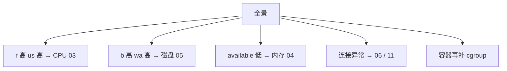
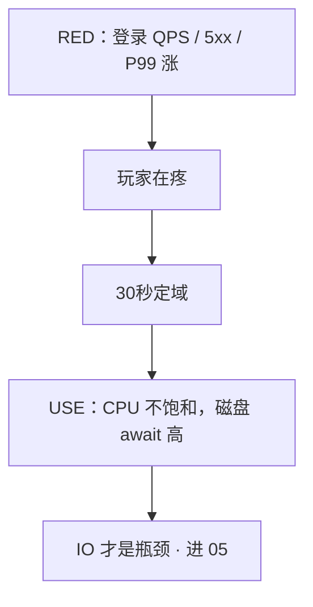
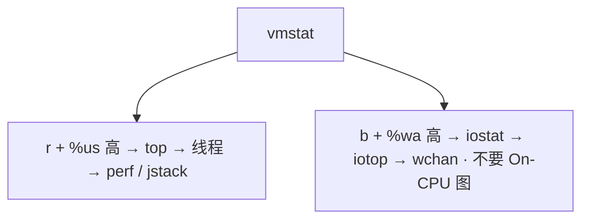

# 12｜性能观测与排障 · 练习题

先对照 [知识点](知识点.md) **§2 总图 + §7 三十秒 + §9 profiling 边界** 自己口述，再对答案。关键字（30 秒全景、USE/RED、平均 CPU、perf/bpftrace、证据链）要能定域。

| 标记 | 含义 |
|------|------|
| **核心** | 不懂整章就没建立起来 |
| **必会** | 值班和面试都要能讲 |
| **常用** | 线上会反复碰到 |
| **常考** | 白板和追问的高频口径 |

## 本题目录

- [Q1 30 秒全景](#q1)
- [Q2 USE](#q2)
- [Q3 RED 与一次故障](#q3)
- [Q4 平均 CPU 40%](#q4)
- [Q5 CPU 链 vs IO Load](#q5)
- [Q6 OOM / 磁盘满](#q6)
- [Q7 awk 与 ss 状态](#q7)
- [Q8 历史 sar](#q8)
- [Q9 perf / bpftrace 边界](#q9)
- [Q10 SOP 与重启](#q10)
- [Q11 默画总图](#q11)
- [合上书](#合上书)

---

## Q1

**★★★★★｜机器异常你 30 秒跑哪些命令？每条看什么？**

**覆盖**：核心 · 必会 · 常考

**对应**：知识点 §7 · 串图 §2.0

### 场景

登录延迟告警。你刚 ssh 上去。旁边有人已经在 top 里来回排序，另有人要对战斗服 `perf record -a`。

### 完整解答

**一句话**：30 秒六条命令定域不是根因：uptime / vmstat / free / df / mpstat / ss -s 决定进哪一章。

```bash
uptime                          # Load 趋势：1/5/15
vmstat 1 5                      # r/b/wa/cs/st —— 定域核心
free -h                         # available，不是 free
df -h && df -i                  # 块满还是 inode 满
mpstat -P ALL 1 2               # 单核 / steal
ss -s                           # 连接分布
```



Load 高先看 vmstat 是 CPU 还是 IO。没有这套开口就 top 乱翻。30 秒不够做火焰图；工具按阶段：全景 → 域内 → 函数级。

### 再追问

- 容器节点还要补什么？——`cpu.stat` / `memory.events`（07）。宿主机利用率低也可能是 throttle。
- 为什么不是先 top？——top 只看「现在谁占 CPU」，定不了 r vs b、inode、连接分布。

---

## Q2

**★★★★★｜USE 三个字母是什么？只有利用率高是瓶颈吗？**

**覆盖**：核心 · 必会 · 常考

**对应**：知识点 §4

### 场景

白板：「讲 USE」。有人开始背 CPU 百分比。

### 完整解答

**一句话**：USE 对每种资源看 Utilization / Saturation / Errors，Load 是 S 不是 U；要 U 且 S 才是瓶颈。

对 **每一种资源**：Utilization、Saturation、Errors。利用率高 **且饱和**（队列）才是瓶颈；只有 U 高可能还能吃。Load 是 S，不是 U。

| 资源 | U | S | E |
|------|---|---|---|
| CPU | %us+%sy | r / Load / steal / throttle | — |
| 内存 | used / working_set | 换页、available≈0 | OOM |
| 磁盘 | %util | await、avgqu-sz | IO error、云盘 QoS |
| 网卡 | 带宽 | 队列、drop | 重传 |
| 连接表 | count/max | 接近满 | table full |

错误：重传、OOM、磁盘 error。不要把「CPU 挺高的」当成完整答案。

### 再追问

- 只有利用率高、没有队列，是瓶颈吗？——不一定。还能吃就先看错误数和 RED。
- conntrack 怎么套 USE？——U = count/max；S = 接近满时新 SYN 丢；E = dmesg `table full`。

---

## Q3

**★★★★★｜USE 和 RED 怎么结合讲一次故障？**

**覆盖**：核心 · 必会 · 常考

**对应**：知识点 §5 · 坐标系 §2.1

### 场景

活动开始 P99 从 50ms 到 800ms。有人甩一张「CPU 平均 40%」的图说没问题。

### 完整解答

**一句话**：RED 看玩家疼不疼（Rate/Errors/Duration），USE 看哪块资源饱和——要配着讲。

RED 说明用户疼不疼（Rate / Errors / Duration）。USE 说明哪块资源饱和。只有 USE 没有 RED 会空谈资源。游戏网关用 RED；机器用 USE。



1. Load 是饱和不是利用率。  
2. throttle 是 CPU 配额饱和，宿主机利用率可以低。  
3. 平均 CPU 40% 不能结案：单核热点、cgroup、锁、下游 RT（见 Q4）。  
4. 常是登录 SQL 或 conntrack。单核、throttle、云盘 QoS 都要点名。

P99 涨先 RED 确认影响面，再用 USE 定资源。

### 再追问

- 只有 RED 没有 USE 会怎样？——知道疼，不知道打哪块硬件 / 依赖，下一步会乱。
- 「CPU 的 RED」这种说法对吗？——不对。入口 RED，资源 USE。

---

## Q4

**★★★★★｜平均 CPU 40%、P99 从 50ms 到 800ms，还查什么？**

**覆盖**：核心 · 必会 · 常考

**对应**：知识点 §6 ← **最易混**

### 场景

容量规划同学说 CPU 还有余量。玩家已经在排队。有人要直接结案「机器没问题」。

### 完整解答

**一句话**：平均 CPU 40% 结不了案：查单核热点、throttle、await、锁、下游 RT。

平均 CPU 会骗人。

```text
平均 40%
   ├── mpstat：是不是一核 100%、其他核闲
   ├── cgroup cpu.stat：有没有 throttle
   ├── vmstat：b/wa 是不是其实 IO 型
   ├── 锁 / 下游 RT / 丢包
   └── curl 五段、依赖 P99
```

```bash
mpstat -P ALL 1 2
# 典型骗人输出：
# all 40% · CPU0 98% · CPU1 5%
```

USE 看饱和和错误，RED 看入口。这时候上 On-CPU 火焰图：先 vmstat / mpstat。如果 `%us` 不高，On-CPU 没有平顶，该看 Off-CPU 或下游。

### 再追问

- 云盘 QoS 打满时 `%util` 一定高吗？——不一定。await 已经几百毫秒，`%util` 看起来还能吃（05）。
- Load 40 和平均 CPU 40% 是一回事吗？——不是。Load 是队列（S），平均 CPU 是利用率均值（U 的平均）。

---

## Q5

**★★★★★｜CPU 高完整链，和 Load 高但 CPU 低有什么分叉？**

**覆盖**：核心 · 必会 · 常用

**对应**：知识点 §8 · 走读 §2.2

### 场景

Load 到 40。有人要上 perf 出火焰图。vmstat 还没跑。

### 完整解答

**一句话**：CPU 型和 IO 型 Load 分叉：都先 vmstat；IO 型不要上 On-CPU 火焰图。

都先 vmstat。**不要在 IO 型 Load 上做火焰图。**



**IO 型典型读数：**

```text
 r  b  ... us sy id wa st
 2 18  ... 15  5 30 50  0
```

→ b 高 wa 高 → 进 05。单核打满用 mpstat。throttle 读 cgroup。pidstat `-w`/`-d` 找谁在切谁在 IO；iotop 确认写什么；perf 仅 CPU 型函数级。还没定域就开 perf，窗口浪费掉。

### 再追问

- CPU 不高但请求延迟大？——Off-CPU：等 IO / 锁 / 网络。BCC `offcputime`。不要对着空闲 CPU 采 On-CPU。
- 火焰图怎么读？——X 轴越宽越热；找顶部平顶 = 叶子热点；颜色通常无含义。

---

## Q6

**★★★★☆｜OOM 和磁盘满的止血各自第一步是什么？**

**覆盖**：必会 · 常用

**对应**：知识点 §8.2 · §8.3 · §10.3

### 场景

逻辑服 137 退出；另一台 `/var` 100%。有人准备 `rm -rf` 日志，有人准备立刻重启所有 Pod。

### 完整解答

**一句话**：OOM 先 137/events 留证，磁盘满先截断 deleted fd，不要先 rm 或无脑重启。

OOM：确认 137 / cgroup events，泄漏重启止血并留 dump；打满则扩 / 限流。根因是泄漏或容量。137 先 OOM 后谈 kill。

磁盘满：`df -h` / `-i` 定位，**截断**日志或清 deleted fd，不要先 rm。根因是轮转 / inode。进程持有已删文件时 rm 不释放空间，见 14。

```bash
df -h && df -i
lsof +L1 | head
# : > /var/log/app.log   或  truncate -s 0 ...
```

游戏逻辑服不能当止血直接重启：要当变更，有踢人成本。已有证据、窗口允许可以；未知是否泄漏、没留 dmesg/ss/日志不行。

### 再追问

- inode 满和块满命令一样吗？——都先 `df -h && df -i`。活动日志按请求切文件会 inode 满；stdout 重定向单文件会块满。
- 139 / 143？——139 段错误；143 TERM。别和 137 混。

---

## Q7

**★★★★☆｜现场怎么用 awk 拿 TOP IP 和 5xx？ss 状态怎么分流？**

**覆盖**：必会 · 常用

**对应**：知识点 §5.2 · §8.4

### 场景

网关 5xx 涨。要立刻判断是被扫还是错误集中。机器上没有 Python。`ss -s` 里数字也难看。

### 完整解答

**一句话**：现场 awk TOP IP 和 5xx 百分比，ss 状态分流决定进 06/08/15 哪章。

Nginx 组合日志常见 `$1=IP $9=状态码`。先看一行再改字段号。

```bash
awk '{print $1}' access.log | sort | uniq -c | sort -rn | head
awk '{c++; if($9~/^5/) s++} END{print "5xx",s+0,"total",c,"pct",(c?100*s/c:0)}' access.log
ss -ant | awk '{print $1}' | sort | uniq -c | sort -rn
```

1. **TIME_WAIT** → 短连接 / 池子（08、09 Keep-Alive）  
2. **CLOSE_WAIT** → 应用没 close（06）  
3. **SYN_RECV** → backlog / 攻击（06、18 somaxconn）  
4. **ESTAB 猛涨** → 活动或泄漏  

一条 uniq -c 决定进哪章。机器上最快的是管道。离线复杂统计再 Python。新连接失败、ESTAB 还在 → 先 conntrack（11、15），不是光纤。

### 再追问

- 为什么不写 Python？——当下要快。长期看面板（21，K8s 18）。
- RED 里 E 和 ss 状态什么关系？——5xx 是入口 Errors；ss 状态是连接侧线索，两边要对上时间线。

---

## Q8

**★★★★☆｜昨天凌晨的 CPU 尖峰，现在 top 是空闲，怎么办？**

**覆盖**：必会 · 常用 · 常考

**对应**：知识点 §7.3 · §10.5

### 场景

老板问昨天凌晨 3 点 CPU 为什么打满。现在 ssh 上去 top 全是闲。

### 完整解答

**一句话**：昨天尖峰现在 top 空闲，用 sar 或监控历史，不要用现在的 top 编故事。

现场 top 只代表现在。没有历史等于无法结案。

```bash
sar -u -f /var/log/sa/sa$(date -d yesterday +%d)
```

或监控曲线（node_exporter，**1s** 粒度）。证明要靠当时采样。PromQL 怎么写在 K8s 18，本章答到「要当时的图，不要现在的 top」就够。sar 也没有：先承认没有证据，补监控。不要用现在的 top 编故事。补 working_set / conntrack / await 比背更多命令值钱。

### 再追问

- 生产没有 1s 粒度会怎样？——尖峰被平均掉，P99 对不上 CPU 图。
- 证据链最低标准？——同一时刻 vmstat 片段 + 监控图 + error 日志。

---

## Q9

**★★★★★｜perf 和 bpftrace 何时用、何时不用？被问「用过 eBPF 吗」怎么答？**

**覆盖**：核心 · 必会 · 常考

**对应**：知识点 §9 ← **profiling 边界**

### 场景

逻辑服 `%us` 打满。有人在 IO wait 很高的另一台机器上也要出一张火焰图。会 perf 之后被追问 eBPF。

### 完整解答

**一句话**：perf 在 CPU 型 `%us` 高时用 30s 采样；IO 型 / Off-CPU 不要 On-CPU 图；bpftrace 短窗口指定 PID。

| 用 | 不用 |
|----|------|
| `%us` 高 → `perf top -g -p PID`；采 30 秒出图，找宽而平的叶子 | Load 是 IO（`b`+`wa`）；CPU 不高但延迟大（该 Off-CPU）；还没 30 秒全景 |
| bpftrace：按 PID 统计 write / openat、替代长时间 strace | 写内核探针；Cilium 网络（K8s 23）；高峰长时间跟踪战斗服 |
| Off-CPU：`offcputime` | 对着空闲 CPU 采 On-CPU |

```bash
perf record -g -p PID sleep 30
perf script | stackcollapse-perf.pl | flamegraph.pl > cpu.svg
bpftrace -e 'tracepoint:syscalls:sys_enter_write /pid==PID/ { @[comm]=count(); }'
```

会 perf 就能把 CPU 型讲完。补三句 bpftrace：短窗口、指定 PID、Ctrl-C 能停。不写内核探针。容器：宿主机用容器主进程 PID 采；或 privileged Pod（生产谨慎）。

`perf record -a` 不能生产一直开：`-a` 是全 CPU，开服高峰伤性能、文件也大。先缩到 PID。

### 再追问

- strace 呢？——单进程卡某个 syscall，几秒即可。高峰长时间跟会把进程拖死，改 bpftrace。
- 顶层宽 vs 底层宽？——顶层宽=自身耗时；底层宽顶层细=被多处调用。

---

## Q10

**★★★★☆｜先重启什么情况下可以？怎么把 SOP 变成团队能力？**

**覆盖**：必会 · 常用

**对应**：知识点 §10.4

### 场景

群里已经有人在敲 `systemctl restart`。战斗服还挂着长连接。这次是你半夜敲命令救回来的，下周轮到别人值班。

### 完整解答

**一句话**：重启可以止血但要有证据链；停在「重启好了」不算结案。

可以：已有监控证据、止血窗口、能复现环境。不行：未留 dmesg / ss / 日志、未知是否泄漏、有状态服会丢内存态。游戏逻辑服重启要当变更。有变更先怀疑变更，回滚是合法止血。

交接不要只写「重启好了」：当前状态 + 未验证假设 + 下一步命令。重启好了不算结案：要有数字、根因、预防。

工程化：runbook 写成 30 秒全景 + 分域链接；告警带红线（available、await、conntrack%、throttle）；开服 checklist：df / inode、conntrack、证书、DNS TTL、日志轮转。监控缺 working_set / conntrack / await 就先补监控。不是个人英雄敲命令。

证据链最低标准：同一时刻的 vmstat 片段、一张监控图、一条 error 日志。缺一就是猜测。变更窗口写进时间线。


### 再追问

- 影响面还没问清就扩容？——先问谁、何时、是否发版/活动，再决定回滚还是扩容。
- 活动高峰正确顺序？——RED 确认失败率 → 30 秒定域 → 常是 SQL / await / conntrack → 先限流/扩/回滚，再函数级。

---

## Q11

**★★★★☆｜合上书默画：从告警到定责的一张板画什么？**

**覆盖**：核心 · 常考

**对应**：知识点 §2.0 · §2.1 · 合上书

### 场景

面试官：「别讲细节，先画你排障的总图。」给你 90 秒白板。

### 完整解答

**一句话**：RED（入口）→ 30 秒六条（定域）→ 四条资源链 → profiling 边界；旁边标翻车点。

默画要点（对照 §2.0 ASCII 板）：

```text
RED: QPS / 5xx / P99
        ↓
30秒: uptime → vmstat → free → df → mpstat → ss
        ↓
四链: CPU03 | 磁盘05 | 内存04 | 连接06/11
        ↓
profiling: CPU型→火焰图 | 等→Off-CPU | 计数→bpftrace | IO型→不要图
翻车: 平均40%结案 · Load当util · perf -a一直开 · 重启好了算结案
```

坐标系一句话：横轴 RED 疼不疼，纵轴 USE 哪块饱和；交点才是真故障区。

### 再追问

- 刻意不展开的章有哪些？——机制细节甩给 03～07 / 11；监控面板甩给 21 / K8s 18；本章只定域与边界。

---

## 合上书

- [ ] 默画 §2.0：RED → 30 秒 → 四链 → profiling；翻车四点能点名吗？
- [ ] 30 秒六条命令是哪六条？各看什么？容器还补什么？
- [ ] USE 三个字母？Load 为什么不是利用率？平均 CPU 40%、P99 到 800ms 还查什么？
- [ ] RED 三个字母？和 USE 怎么配一次登录故障？
- [ ] 什么时候上 perf 火焰图？什么时候 bpftrace？什么时候根本不要图？
- [ ] 现场 TOP IP / 5xx 两行 awk？昨天尖峰现在 top 空闲怎么办？
- [ ] 先重启何时可以？证据链最低标准？停在「重启好了」差什么？

与知识点「合上书」对齐。下一章：[11 Systemd与服务管理](../11-Systemd与服务管理/)。
