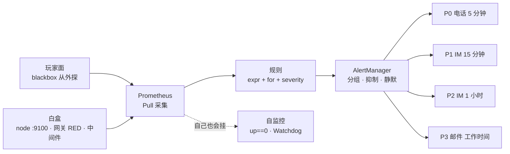
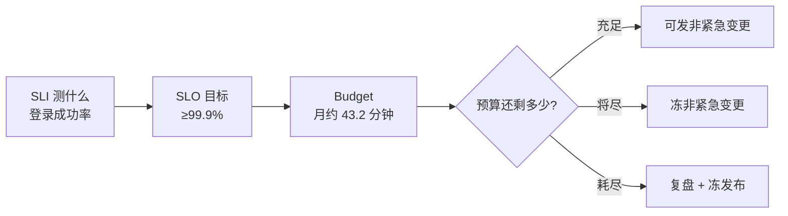
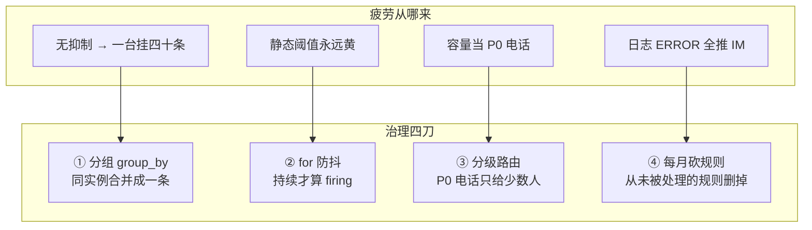
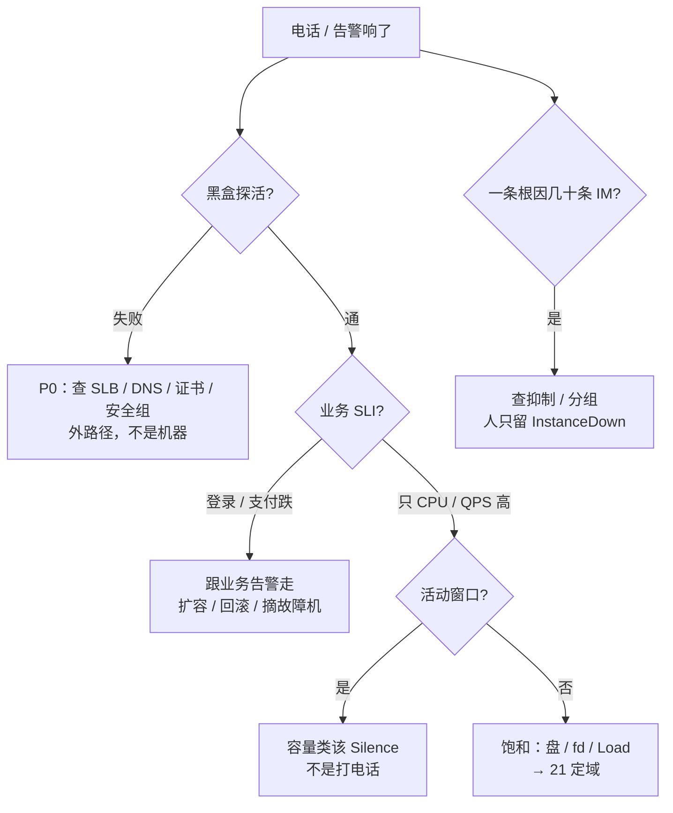

# 监控与告警

> 活动开场 3 分钟，电话被 CPU、连接数、QPS 打爆——登录入口其实已经 5xx，黑盒探活夹在四十条「机器黄了」里没人点；另一头 Grafana 全绿、玩家进不去。
> **本章回答**：一条告警的一生——信号怎么采（白盒 / 黑盒）、怎么算（PromQL）、怎么变成规则和分级（P0–P3）、怎么降噪（分组 / 抑制 / 静默）、最后怎么把正确的人在正确的时间叫醒。
> **不讲**：告警响了之后怎么定域排障 → [21](../21-性能方法论-USE与RED/)；日志采集与轮转 → [23](../23-日志运维/)；PromQL 深水与高基数 → [K8s 19](../../03-Kubernetes/19-监控与可观测性/) · [SRE 02](../../09-可观测性与SRE方法论/02-Prometheus与PromQL/)；告警体系化设计 → [SRE 03](../../09-可观测性与SRE方法论/03-告警设计与降噪/)；SLO 细算 → [SRE 06](../../09-可观测性与SRE方法论/06-SLI-SLO与错误预算/)；Oncall 排班 → [工程 08](../../04-工程化与自动化/08-运维平台与Oncall/)。

**标记**：🎯重点 · 🔥难点 · ⭐常考 · 🔧实操

---

## 一、一张图：一条告警的一生

> 🎯 **一句话**：信号从采集到叫人要过五站：采、算、规、降、人。



**读图**：

- 左边两个信号源：**黑盒**从玩家角度探「通不通」，**白盒**是进程自报内部状态——缺黑盒，内部全绿也能入口挂（三节）。
- 中间是机器的判断：规则给**持续性**（`for`）和**级别**（severity），AlertManager 给**降噪**（分组 / 抑制 / 静默，七节）。
- 右边才是人：**只有 P0 打电话**——叫醒线对齐玩家体验（SLI），不对齐「CPU 圆不圆」（五、六节）。
- 虚线是监控自己的命：Prometheus 挂了会「全绿」，要靠 `up==0` 和 Watchdog 兜底（八节）。

本章与 [21](../21-性能方法论-USE与RED/) 的分界：**21 讲告警响了之后怎么分析，22 讲信号怎么持续地被看见、被治理。**

---

## 二、选材：三支柱各答一问

> 🎯 **一句话**：Metrics 看现在、Logs 查过去、Traces 跟一次——告警主战场是 Metrics。

| 支柱 | 回答什么 | 擅长 | 不擅长 |
|------|----------|------|--------|
| **Metrics（指标）** | 现在怎样、趋势怎样 | 聚合、阈值、对比、预测，长期存储便宜 | 「这个用户这次为什么失败」的原文 |
| **Logs（日志）** | 发生过什么 | 上下文、错误栈、审计、按订单号检索 | 高基数全量当实时告警（贵、吵） |
| **Traces（链路）** | 这一次请求走了哪 | 跨服务延迟拆分、依赖定责 | 替代主机 USE；替代全局 QPS |

> 💡 **打个比方**：三支柱是**开车三样东西**——Metrics 是仪表盘转速表（扫一眼就知道现在怎么样），Logs 是行车记录仪（出事了逐帧回放），Traces 是快递单（查这一单经过了哪些中转站）。半夜决定要不要停车看仪表盘；修车才看记录仪和快递单。

**值班四个场景怎么选**：

1. 登录成功率跌破 SLO → **Metrics**（SLI 曲线）+ 黑盒；别先 grep 全量日志当告警源。
2. 某玩家订单号失败 → **Logs**（按 request_id 检索 → [23](../23-日志运维/)）；别指望 Metrics 标签里塞订单号。
3. 支付 P99 高、跨网关与支付 → **Traces** 看哪一跳慢；别只看单机 CPU。
4. 磁盘将满 → **Metrics** `predict_linear`；别等日志写失败再叫。

**高基数红线** ⭐：`http_requests_total{user_id="u182937"}` 是错的——标签基数爆炸，存储先死。正确姿势：Metrics 聚合（`rate(http_requests_total{code=~"5.."}[5m])`）做告警，日志里带 request_id / trace_id 下钻细节。「有 Metrics 就不需要 Logs」「有 Traces 就不需要黑盒」「三支柱必须同一厂商」同样都是错的——Trace 根本采不到「连不上」这种故障。

> ⚠️ **别混**：**告警主战场是 Metrics，不是 Logs**。每个 ERROR 行都推 IM，等于没有分级——疲劳经常来自「把 Logs 当 Metrics 用」。日志告警只做少量致命关键字。

> 📝 **面试**：问「三支柱怎么选」，答「Metrics 定叫不叫、趋势和 SLO；Logs 定这一次为什么；Traces 定跨服务哪一跳。主机值班主战场是 Metrics 加黑盒，日志告警只做少量致命关键字」。

---

## 三、出生：采集——白盒、黑盒与 Pull

> 🎯 **一句话**：白盒进程自报、黑盒从外往里探——两盒都要有，缺一个都有盲区。

### 3.1 白盒与黑盒

- **白盒监控**：进程自己暴露 `/metrics`，回答「内部怎么样」——节点资源（node_exporter）、入口 RED（网关 exporter）、中间件（mysqld / redis exporter）、进程在不在。
- **黑盒监控**：blackbox_exporter 从「玩家能碰到的地方」往里探，回答「外面通不通」——**DNS、证书、安全组、LB 配错时，白盒全部不知道，白盒照样全绿**。这是黑盒存在的全部理由 ⭐。

**监控四层分层** ⭐（从下往上）：

```text
① 探活层：blackbox —— 玩家 URL 通不通（唯一从外看的层）
② 资源层：node_exporter —— 节点 USE（CPU / 内存 / 盘 / 连接表）
③ 中间件层：mysqld / redis / nginx exporter —— 组件自身的指标
④ 业务层：网关 / 服务自带 metrics —— 入口 RED（QPS / 5xx / P99）
```

叫醒线主要钉在 ① 和 ④；②③ 是饱和信号，最多 P2（六节）。

### 3.2 Pull、Push 与 Pushgateway

| 模式 | 谁主动 | 优点 | 坑 |
|------|--------|------|-----|
| **Pull（Prometheus）** | Server 来 scrape | `curl` 即排障；服务发现自然 | 目标入站要开端口，防火墙难时别硬上 |
| **Push（Zabbix Agent 等）** | Agent 上报 | 出站好做、防火墙友好 | 发现与标签能力弱 |
| **Pushgateway** | 短命 Job 推一下 | 批任务 / CI 跑完就退场也来得及报 | 序列**不过期**，Job 结束必须删掉 |

> 🔍 **现场**：面板没数据，第一刀先证明「采到没有」，不是刷新 Grafana：

```bash
curl -sS localhost:9100/metrics | grep -E '^node_(cpu|memory|filesystem)' | head
```

```text
node_cpu_seconds_total{cpu="0",mode="idle"} 1.234e7
node_memory_MemAvailable_bytes 8.5e9
node_filesystem_avail_bytes{mountpoint="/var"} 2.1e10
```

`curl` 不通 = 没采到。「Grafana 有旧图」不代表还在采。blackbox 同理：`curl 'http://blackbox:9115/probe?target=<URL>&module=http_2xx'` 直接看 `probe_success`。

### 3.3 四种指标类型

- **Counter（计数器）**：只增不减——请求总数、错误总数。**必须 `rate()` 取增速**再比阈值；直接 `> 1e8` 会永远 firing。
- **Gauge（仪表值）**：可上可下——内存、在线人数、队列长度，直接比。
- **Histogram（直方图）**：把观测值**分桶**存（le 标签），服务端可聚合出 P95 / P99——**跨实例算分位数只能用它**。
- **Summary（摘要）**：客户端预先算好分位数——单实例方便，**跨实例加不起来**（0.9 分位的分位数没有可加性）。

> 💡 **打个比方**：Counter 是**水表**——只记录累计流过多少吨，不能说「读数大于一亿就漏水」，要看每小时流了多少（rate）；Gauge 是**油箱指针**，随时 readable。

落地最小集：node_exporter **:9100** 每台都装、blackbox_exporter **:9115** 放在用户侧路径上、Prometheus 能访问全部 target、AlertManager 电话网关**单独演练**过、Pushgateway 只给短任务。`scrape_interval` 主机 **15s~30s**——过短打爆 exporter。

> ⚠️ **别混**：**白盒绿 ≠ 玩家能进**。白盒只证明「进程自己觉得自己健康」；LB 摘了、DNS 错了、证书换了、安全组没放行，都只有黑盒能看见。反过来黑盒挂了白盒全绿，也说明问题在路径不在机器。

> 📝 **面试**：问「为什么内部全绿玩家还是进不去」，答「白盒看不见 LB / DNS / 证书 / 安全组这四样——它们在进程外面。必须有 blackbox 从玩家路径探活，探的还是玩家点的那个 URL，不是静态 /health」。

---

## 四、成形：PromQL 把指标算成信号

> 🎯 **一句话**：Counter 必须 rate，分位数用 Histogram 聚合，盘满用斜率预测。

### 4.1 rate 与 irate

- **`rate(x[5m])`**：窗口内**平均每秒增速**，自动处理 Counter 重置——告警规则的标准选择，平滑、抗抖动。
- **`irate(x[5m])`**：只取窗口内**最后两个样本**算瞬时速率——尖峰敏感，画短面板看瞬时毛刺用；做告警会被两个样本的抖动骗 firing。

一句背板：**面板毛刺看 irate，告警阈值用 rate。** 共同纪律：两者都**只能用于 Counter**，Gauge 上用是错的。

### 4.2 分位数：histogram_quantile 的 P95/P99 🔥

```promql
# 跨所有网关实例聚合的登录 P99（Histogram 才能这么加）
histogram_quantile(0.99,
  sum(rate(http_request_duration_seconds_bucket[5m])) by (le)
)

# 单实例 P95
histogram_quantile(0.95,
  sum by (le) (rate(http_request_duration_seconds_bucket{job="gateway"}[5m]))
)
```

**原理一句话** ⭐：Histogram 把每个延迟区间各存一个 `_bucket` 计数器（`le` 标签是「小于等于」边界），`histogram_quantile` 在桶间**线性插值**还原分位数——所以分位数是**估算**，桶边界设太粗就不准。跨实例聚合时先把各实例的桶 `sum by (le)` 加起来再取分位——**Summary 在客户端算死了，加不起来**。

### 4.3 主机侧速查 🔧

```promql
# CPU 使用率（去掉 idle 的平均）
1 - avg(rate(node_cpu_seconds_total{mode="idle"}[5m])) by (instance)
# 内存：看 MemAvailable，不是 MemFree
1 - node_memory_MemAvailable_bytes / node_memory_MemTotal_bytes
# 磁盘使用率
1 - node_filesystem_avail_bytes / node_filesystem_size_bytes
# 24h 内将满（斜率外推，不是静态阈值）
predict_linear(node_filesystem_avail_bytes[6h], 24*3600) < 0
# 证书剩余寿命（blackbox 探出来的）
probe_ssl_earliest_cert_expiry - time() < 7 * 24 * 3600
```

**为什么斜率不是阈值** ⭐：静态 70% 在大盘上会**永远黄**——喊两周没人理，真的快满也没人信了。`predict_linear` 用过去 6h 的增速外推「24h 后还剩多少」，**比阈值告警早半步**：70% 但增速为零不叫，40% 但增速凶猛要叫。活动服可加紧：`[6h] → 20h` 预测 + `[1h] → 5h` 紧急线。

> ⚠️ **别混**：**Histogram vs Summary**——都要分位数时，跨实例（多副本网关、多节点）只能 Histogram（桶可加）；单进程、客户端算好就够，才用 Summary。**rate vs irate**——告警用 rate 抗抖，面板看毛刺用 irate；两者都只对 Counter。

> 📝 **面试**：问「跨三个网关副本算 P99」，答「服务端用 Histogram 暴露 bucket，PromQL 里 sum by (le) rate 之后 histogram_quantile(0.99, ...)；Summary 的分位数是客户端算的，跨实例加不起来」。再补一句「分位数是桶间插值的估算，桶边界要按业务延迟量级设」。

---

## 五、定标：SLI / SLO / Error Budget——叫醒线的数学

> 🎯 **一句话**：SLI 测什么、SLO 目标多少、Budget 还能失败多久。

| 词 | 例子（登录） | 谁用 |
|----|--------------|------|
| **SLI**（Service Level Indicator） | 成功登录数 / 总尝试数；或登录 P99 | 监控表达式、面板 |
| **SLO**（Service Level Objective） | 月成功比例 ≥ 99.9% | 团队**内部**目标 |
| **SLA**（Service Level Agreement） | 合同写 99.5% 可用 | 对外承诺，通常**松于** SLO |
| **Error Budget（错误预算）** | 1 − 99.9% = 0.1% | 发布闸门、复盘 |

**口算** ⭐：SLO 99.9%，一个月 30 天 = 43200 分钟，Budget = 43200 × 0.1% ≈ **43.2 分钟**——这台服务一个月最多「不可用」43 分钟。今晚登录失败率 20% 持续 10 分钟，就是在猛吃 Budget：该叫人、该冻非紧急发布。



**游戏服常见 SLI**：登录——成功率、P99、blackbox 成功率（别拿单机 CPU% 当 SLI）；支付——成功率、耗时分位（别拿连接数绝对值）；大厅入口——探活成功率、5xx 率（别拿 Load 平均值）；战斗长连接——掉线率、心跳超时率（别拿单进程 RSS）。

**用 SLI 判该不该叫** ⭐：CPU 70% 但登录成功率 99.95% → IM 即可（活动则静默）；登录成功率 80% → **P0/P1** 跟业务；磁盘 60% 且 predict 不满 → 不叫；predict 24h 内满 → P1，95%+ 或 inode 满 → P0；证书剩 3 天 → P1/P0。**主机 CPU 是饱和信号，最多 P2，永远不能当玩家体验 SLO。**

> 📝 **面试**：问「半夜哪些指标能叫醒你」，答「对齐 SLI 的才能叫：登录 / 支付成功率破了 SLO、探活连续失败、盘 predict 将满、OOM 风暴、证书临期。CPU 70% 不是——它是饱和信号，先看登录曲线正不正常」。Budget 细算与 burn rate → [SRE 06](../../09-可观测性与SRE方法论/06-SLI-SLO与错误预算/)。

---

## 六、变规：黄金信号怎么写成告警规则

> 🎯 **一句话**：四信号落到入口是 RED、落到主机是 USE；规则=expr + for + severity。

**黄金四信号**（Google SRE）：**Latency（多慢，看 P99 不看平均）、Traffic（多忙，QPS / CCU）、Errors（多错，5xx / 失败 / drop）、Saturation（多满，CPU / 盘 / 连接表）**。RED 是它在服务侧的投影（Rate=Traffic、Errors、Duration=Latency）；USE 是资源侧投影（方法论详见 [21](../21-性能方法论-USE与RED/)）。

**dashboards 三板斧** ⭐（一张值班主面板怎么摆）：

1. **第一行 RED**：登录 / 支付 URL 的 QPS、5xx 率、P99——玩家疼不疼，一眼定级。
2. **第二行 USE / 饱和**：CPU、Load vs 核数、MemAvailable、磁盘 %、inode、fd、conntrack 水位。
3. **Annotation**：发布 / 变更标记打在时间轴上——「红之前 10 分钟有没有发版」是第一问。

```text
登录 P99:  120ms          ← 正常
网关 5xx:  12%            ← P0：玩家进不来，跟 CPU 无关
node CPU:  72%            ← 饱和 P2/P3：今晚活动预期容量
MemAvailable/Total: 18%   ← 还可；只看 MemFree 会误判
```

### 6.1 规则怎么写：三条样板 🔧

> 🔍 **现场**：改完先 `promtool check rules`，再 reload——语法错了整组规则不加载：

```yaml
- alert: HighCPUUsage          # USE 侧：饱和但不是叫醒线
  expr: 1 - avg(rate(node_cpu_seconds_total{mode="idle"}[5m])) by (instance) > 0.85
  for: 5m                      # 持续 5 分钟才算 —— 防抖
  labels:
    severity: warning          # P2：IM，不电话

- alert: DiskWillFull          # 容量：比阈值早半步
  expr: predict_linear(node_filesystem_avail_bytes[6h], 24*3600) < 0
  for: 10m
  labels:
    severity: critical         # P1；95%+/inode 满 直接 P0

- alert: ProbeFail             # 黑盒：唯一真叫醒线
  expr: probe_success == 0
  for: 2m
  labels:
    severity: critical         # P0：电话

- alert: LoginErrorRateHigh    # RED 侧：业务叫醒线
  expr: sum(rate(http_requests_total{job="gateway",code=~"5.."}[5m]))
        / sum(rate(http_requests_total{job="gateway"}[5m])) > 0.01
  for: 5m
  labels:
    severity: critical
```

**for 的取值口径** ⭐：探活 **1~2m**（挂了要快知道）、CPU **5m**（瞬时毛刺不该叫）、盘 **10m**（增速预测要稳）。一事一级：同一件事不能既是 P0 又是 P2。

### 6.2 分级与响应时限 ⭐

| 级 | 含义 | 响应时限 | 通知 |
|----|------|----------|------|
| **P0** | 不可用、丢数据风险 | **5 分钟** | 电话 + IM |
| **P1** | 明显损伤 | **15 分钟** | IM + 邮件 |
| **P2** | 水位高 | **1 小时** | IM |
| **P3** | 巡检项 | 工作时间 | 邮件 |

| 该半夜叫醒 | 不该叫醒 |
|------------|----------|
| 探活失败（入口 / 登录 / 支付） | 单机 CPU 70% 且 SLI 曲线正常 |
| 登录 / 支付破 SLO | 已被 InstanceDown 抑制的子告警 |
| 磁盘 predict 24h 内打满 | 磁盘 60%、inode 还早 |
| OOM 风暴（不是单进程一次） | 已知维护窗口（没静默是流程问题） |
| 证书 7 天内过期 | 活动预期内的容量类 P2（没静默是流程问题） |

> 📝 **面试**：问「面板怎么摆」，答「第一行 RED——QPS、5xx、P99；第二行 USE——CPU、Load、MemAvailable、盘、inode、fd；时间轴打发布 Annotation。规则三要素 expr + for + severity，for 探活 2 分钟、CPU 5 分钟、盘 10 分钟；P0 才电话」。

---

## 七、降噪：告警疲劳治理 🔥

> 🎯 **一句话**：疲劳是不该叫的天天叫、该叫的被淹没——治理靠四刀，不是删规则。

**疲劳从哪来**：静态阈值永远黄；一台机器挂了没抑制，四十条 IM 一起推；容量类当 P0 电话；每个 ERROR 日志行都推 IM；长期静默等于删规则。**四刀**：



### 7.1 四个机制别混 ⭐

| 机制 | 干什么 | 典型 | 别当成 |
|------|--------|------|--------|
| **`for`（持续时间）** | 条件持续多久才 firing | CPU `for: 5m` | 把阈值从 70 改到 95（那是改灵敏度） |
| **分组（group_by）** | 同类告警合并成更少通知 | 按 instance / cluster 分组 | 删除规则 |
| **抑制（inhibition）** | 父告警在时不发子告警 | InstanceDown 压同机 ProcessDown / CPU / Disk | 维护窗口 |
| **静默（Silence）** | 计划内临时不通知 | 活动容量 P2、变更窗口 | 长期关监控 |

```yaml
# 抑制：机器都没了，别再报它上面的子症状
inhibit_rules:
  - source_match:
      alertname: InstanceDown
    target_match_re:
      alertname: .+
    equal: ['instance']
```

配了这条，一台机器 hang 死时，人**只收到一条 InstanceDown**——同 instance 的 CPU / 进程 / 磁盘子告警全部标 suppressed。这是「故障越大噪音越小」的关键配置 ⭐。

> 💡 **打个比方**：AlertManager 是**大楼前台分拣**——同一栋楼着火（InstanceDown），不要给每个房间再打四十通电话，先广播一次「楼没了」；**静默**是「今晚这层装修，烟感暂时屏蔽」——明天必须恢复，装完不恢复等于把烟感拆了。

### 7.2 活动窗口红线 ⭐

活动中：容量类 P2（CPU、QPS 绝对值）**Silence**；登录、支付、blackbox、盘 predict、证书**死也不静默**；发布打 Annotation。

```bash
amtool silence add \
  alertname="HighCPUUsage" \
  --comment "activity window 20:00-22:00" \
  --duration 2h
amtool silence query        # 到期必须确认已解除
```

**长期 Silence = 删规则**。漏报是另一头的病：没黑盒、没 Watchdog、阈值太宽——疲劳和漏报要一起治，只砍规则会漏报。

### 收束：一条告警要过五道关

```text
采集关：curl 得到指标（黑盒 + 白盒都在）   —— 没采到 = 全绿假象
规则关：expr 对吗 · for 够吗 · 一事一级     —— 静态阈值永远黄
分级关：P0 对齐 SLI 吗                     —— CPU 不配电话
降噪关：分组了吗 · 抑制配了吗               —— 一台挂四十条
到人关：电话真响吗 · Silence 到期解除了吗   —— Watchdog 在吗
```

> ⚠️ **别混**：**抑制 ≠ 静默**——抑制是「故障发生时自动少吵」（父压子），静默是「计划内手动不吵」（窗口）。一个是机器的应激反应，一个是人的排期决定。

> 📝 **面试**：问「告警风暴怎么治」，答「一台挂了我配 InstanceDown 抑制同 instance 子告警，人只收一条；活动只 Silence 容量类，SLO 和探活死也不静默；疲劳四步——分组、for、分级路由、每月砍从未被处理的规则」。

---

## 八、兜底：饱和度、容量与监控自监控

> 🎯 **一句话**：饱和度告警比阈值早半步；监控系统自己也要被监控。

**饱和度与容量清单** ⭐（比「CPU 高」更值得配的告警）：

- **盘**：`predict_linear` 斜率（六节）；已 95%+ 或 inode 满 → P0——`df -h` 看着空、inode 满，日志和 Nginx 照样写挂（[09](../09-文件系统与inode/)）。
- **conntrack**：水位 80% 告警——`table full` 时新 SYN 直接丢，「部分玩家进不来」（[17](../17-iptables与conntrack/)）。
- **fd / inode**：进程打开数逼近上限。
- **throttle**：cgroup `nr_throttled` 增量——宿主机闲、容器被限流（[10](../10-cgroup与容器/)）。
- **证书**：`probe_ssl_earliest_cert_expiry - time() < 7 天` → P1，更短 P0——别等玩家报 expired。

**容量思维**：阈值告警说「已经满了」，饱和度告警说「正在满的路上」。开服前按 [07 游戏压测](../../07-游戏运维专题/04-全链路压测与容量模型/) 验过容量上限，活动窗口把容量类静默成 P2 才有底气。

### 监控自监控 🔥

Prometheus 自己挂了，所有面板停在最后一帧、告警全部消失——**「没有告警」不等于「一切正常」**。三层兜底：

1. **`up == 0`**：每个 scrape job 自带的目标存活指标，exporter 挂了必须告警——「node_exporter 挂了业务告警会顶上」是错觉。
2. **Watchdog（心跳告警）**：一条**永远 firing** 的规则，由外部的 Deadman 检查器确认「它还在响」——它不响了，就是 Prometheus / 告警链路死了。
3. **外层黑盒**：用另一套独立通道（云监控 / 第三方拨测）探监控体系本身——不能自己监控自己。

**验收五条** ⭐：`curl :9100` 有 `node_`；targets 全 UP 且 `up==0` 有告警；对登录 URL 故意断安全组能触发 P0；测试 firing 时电话 / IM 真的响；Watchdog 在、停掉 Prometheus 外层能叫人。**图和告警同源**：面板和规则用同一条 PromQL，否则「图上红了脚本还没叫」各说各话。

> 📝 **面试**：问「监控系统自己挂了怎么办」，答「三件事：up 指标盯 scrape 目标；Watchdog 永远 firing 的心跳由外部 Deadman 确认；再用独立的外部拨测探监控自己。核心口径是『没告警 ≠ 没故障』」。

---

## 九、作战：值班电话响了怎么办

> 🎯 **一句话**：黑盒 → SLI → AM 降噪 → 容量 vs 入口——四步走完再动手。

### 9.1 oncall 响应 SOP



### 9.2 走读：活动开场的一次告警风暴 🔧

> 🔍 **现场**：活动 20:00 开，飞书电话连响，群里四十条：CPU 85%、连接数破阈、QPS 高、进程 Down、磁盘 72%，还有一条被淹没的 `probe_success == 0`。

**第 1 步 · 先问黑盒，不问 CPU（30 秒）**：

```bash
curl -sS 'http://blackbox:9115/probe?target=https://game-api.example.com/login/health&module=http_2xx' \
  | grep -E 'probe_success|probe_duration|probe_ssl'
```

```text
probe_success 0                     ← 探活失败：外面不通，P0
probe_duration_seconds 0.81
probe_ssl_earliest_cert_expiry 1.735e+09   ← 证书还远，今晚不是它
```

**第 2 步 · RED + SLI（面板 1 分钟）**：登录 QPS 12000（活动预期）；网关 5xx 0.1%→**21%**（破 SLO）；登录成功率 99.95%→**78%**（SLI 崩）；P99 80ms→**900ms**；多台 CPU 80%+（饱和，但今晚是预期容量）。→ 定责入口 / 登录链：扩容、回滚、摘故障机，**不是**再加 CPU 规则。

**第 3 步 · 打开 AM：人该看到几条？**

```bash
amtool alert query
amtool silence query
```

```text
Alertname          Severity  Instance   State
InstanceDown       critical  game-03    active        ← 该响
HighCPUUsage       warning   game-03    suppressed    ← 被 InstanceDown 抑制
ProcessDown        warning   game-03    suppressed
LoginSLOBreach     critical  gateway    active        ← 该响
ProbeFail          critical  blackbox   active        ← 该响
HighCPUUsage       warning   game-07    active        ← 活动容量，该 Silence
```

人只收到 ProbeFail + LoginSLOBreach + 一条 InstanceDown——这是抑制配对、Silence 开了的正确形态。没配抑制就是四十条 IM 淹死人；Silence 忘开就是容量电话疲劳。

**第 4 步 · 留证再止血**：同一时刻留三样——blackbox / curl 出口码、登录成功率 / 5xx 图、AM 截图（active / suppressed / silenced）——然后先止血（扩登录 / 回滚 / 摘故障机），CPU 规则治理明天做。定域手法 → [21](../21-性能方法论-USE与RED/)。

### 9.3 现象 · 先做 · 别做

| 现象 | 先做 | 别做 |
|------|------|------|
| 机器全绿、玩家进不去 | blackbox；查 SLB / DNS / 证书 / 安全组 | 再加 node 规则 |
| 一台 hang、四十条 IM | 查抑制：人只留 InstanceDown | 关通知 / 逐条回 |
| 活动开场全员「P0」 | Silence 容量类；SLO / 探活不静默 | 关掉整个监控 |
| 磁盘告了两周没人理 | 改 predict_linear；95% 升 P0 | 继续静态 70% |
| 图上红了、告警没叫 | 图和告警改同源 PromQL | 两套阈值各说各话 |
| Prom 挂了、面板全绿停帧 | Watchdog / 外层拨测 | 相信「没告警就好」 |
| ERROR 日志刷屏 IM | 改回 Metrics 阈值 + 少量致命关键字 | 继续「有 ERROR 就叫」 |
| CPU 70% 要不要叫老板 | 看登录 / 支付 SLI | 对齐「数字不圆」 |

### 9.4 口述模板 🔧

**30 秒版**：「先黑盒和登录 SLI，再看 CPU。活动只 Silence 容量 P2，探活和支付死也不静默。一台挂了人只该收到一条 InstanceDown。」

**2 分钟版**：「三支柱：Metrics 定叫不叫，Logs 定这一次为什么，Traces 定跨服务哪一跳。叫醒线对齐 SLI，99.9% 的 Budget 每月约 43 分钟。规则 expr + for + severity，for 探活 2 分钟、CPU 5 分钟。疲劳四刀：分组、for、分级、砍规则。盘用 predict_linear，证书用 7 天倒计时，P99 用 histogram_quantile 聚合 Histogram。监控自己挂了靠 up==0 和 Watchdog。」

---

## 十、收口

### 命令速查 🔧

```bash
# 采到没有（排障第一刀）
curl -sS localhost:9100/metrics | grep -E '^node_(cpu|memory|filesystem)' | head
# 黑盒探活 + 证书
curl -sS 'http://blackbox:9115/probe?target=https://game-api.example.com/login/health&module=http_2xx' \
  | grep -E 'probe_success|probe_ssl'
# 规则语法（reload 前必跑）
promtool check rules /etc/prometheus/rules.yml
# 正在响什么 / 静默了什么
amtool alert query
amtool silence query
# 活动窗口静默容量类（到期要解除）
amtool silence add alertname="HighCPUUsage" --comment "activity 20:00-22:00" --duration 2h
```

```promql
# 常用五条
1 - avg(rate(node_cpu_seconds_total{mode="idle"}[5m])) by (instance)
1 - node_memory_MemAvailable_bytes / node_memory_MemTotal_bytes
predict_linear(node_filesystem_avail_bytes[6h], 24*3600) < 0
probe_ssl_earliest_cert_expiry - time() < 7 * 24 * 3600
histogram_quantile(0.99, sum(rate(http_request_duration_seconds_bucket[5m])) by (le))
```

### 面试锚点

| 问 | 30 秒答 |
|----|---------|
| 三支柱各答什么？ | Metrics 现在怎样 / Logs 发生过什么 / Traces 这一次走哪；告警主战场是 Metrics。 |
| 为什么必须有黑盒？ | LB / DNS / 证书 / 安全组配错时白盒照样全绿；要探玩家点的 URL，不是静态 /health。 |
| 哪些该半夜打电话？ | 探活失败、登录 / 支付破 SLI、盘 predict 满、OOM 风暴、证书临期；CPU 70% 不配电话。 |
| SLI / SLO / Budget？ | 测什么 / 内部目标 / 1−SLO；99.9% ≈ 每月 43.2 分钟。 |
| Counter 怎么用？ | 必须 rate() 取增速；跨实例分位数用 Histogram + histogram_quantile，Summary 加不起来。 |
| rate 和 irate？ | rate 是窗口平均增速、告警用；irate 取最后两个样本、看瞬时毛刺；都只对 Counter。 |
| 盘告警怎么配？ | predict_linear 斜率外推 24h，静态 70% 会永远黄；95%+ / inode 满才是 P0。 |
| 一台挂了人该看到几条？ | 一条 InstanceDown——inhibit_rules 按同 instance 抑制全部子告警。 |
| 抑制和静默？ | 抑制是故障时父压子（自动）；静默是计划内窗口（手动，到期必须解除）。 |
| for 是什么？ | 持续多久才 firing，防抖；不是把阈值改松——探活 2m、CPU 5m、盘 10m。 |
| 告警疲劳怎么治？ | 四刀：分组、for、分级路由、每月砍从未处理的规则；疲劳和漏报一起治。 |
| 活动高峰监控怎么办？ | Silence 容量类 P2；登录 / 支付 / 探活 / 盘 / 证书死也不静默；发布打 Annotation。 |
| 监控自己挂了？ | up==0 盯 scrape；Watchdog 永远 firing 由外部 Deadman 确认；外层独立拨测。 |
| 面板怎么摆？ | 第一行 RED（QPS / 5xx / P99），第二行 USE / 饱和，时间轴打发布 Annotation。 |

### 易错一句话对照

- CPU 70% 半夜打电话 → 饱和信号最多 P2，先看 SLI
- 内部指标绿 = 玩家能进 → 白盒看不见 LB / DNS / 证书 / 安全组
- Counter 直接比阈值 → 必须 rate()
- 跨实例 P99 用 Summary → 分位数加不起来，用 Histogram
- 内存看 MemFree → 看 MemAvailable
- 磁盘静态 70% 告警 → 永远黄造疲劳，用 predict_linear
- `for` 是把规则写松 → 是防抖，不是改灵敏度
- 一台挂了报 40 条才算全面 → 要抑制，人只留一条
- 抑制 = 静默 → 故障时自动少吵 vs 计划内手动不吵
- 活动高峰关掉监控 → 只静默容量类，SLO / 探活不静默
- Pushgateway 推完不用管 → 序列不过期，Job 结束要删
- 长期 Silence 没人管 → 等于删规则，到期必须解除
- 没有告警 = 没有故障 → 监控自己也会挂，Watchdog 兜底
- 探 `/health` 200 = 登录通 → 要探玩家点的那个 URL
- 日志 ERROR 全量推 IM 当告警 → 没有分级，主叫醒线用 Metrics
- Metrics 标签塞 user_id → 高基数炸存储，细节去 Logs
- Grafana 一套阈值、告警另一套 → 图和告警必须同源

### 数字墙

> P0 响应 **5 分钟** · P1 **15 分钟** · P2 **1 小时** · 证书告警线 **7 天** · 盘预测 **[6h] → 24h**（活动紧线 [1h] → 5h）· Error Budget 99.9% ≈ 月 **43.2 分钟** · node_exporter **:9100** · blackbox **:9115** · `for`：探活 **1~2m** / CPU **5m** / 盘 **10m** · scrape_interval **15~30s** · 分位数 **P95 / P99 看分位不看平均**

---

## 合上书

- [ ] **默画一节的图**：黑盒 / 白盒 → Prometheus → 规则 → AlertManager → P0~P3，五站各干什么；监控自监控的虚线画上。
- [ ] **口述三支柱**：各答哪一问；四个值班场景怎么选；为什么日志 ERROR 全量当告警是错的；高基数红线是什么。
- [ ] **口述采集**：白盒 vs 黑盒各补什么盲区；监控四层分层；Pull / Push / Pushgateway 的坑；Counter 为什么必须 rate。
- [ ] **口述 PromQL**：rate vs irate；跨实例 P99 怎么写（Histogram + histogram_quantile）；盘为什么用 predict_linear 不用静态阈值。
- [ ] **口述 SLI**：SLI / SLO / SLA / Budget 四个词；99.9% 一个月多少分钟；CPU 为什么不能当玩家 SLO。
- [ ] **口述规则与分级**：expr + for + severity 三要素；for 的三档取值；P0~P3 响应时限；该叫 / 不该叫名单；面板三板斧。
- [ ] **口述降噪**：疲劳四刀；抑制 vs 静默 vs for vs 分组；inhibit_rules 怎么配；活动窗口红线；amtool 怎么加静默。
- [ ] **口述兜底**：饱和度清单（盘 / conntrack / fd / inode / throttle / 证书）；Watchdog 三层自监控；验收五条。
- [ ] **走读一遍**：活动开场告警风暴，从黑盒 → SLI → AM → 容量 vs 入口，口述四步和留证三样。

下一章：[日志运维](../23-日志运维/)——机器别被自己的日志写死。方法论上游：[21 性能方法论](../21-性能方法论-USE与RED/) · 深挖：[K8s 19](../../03-Kubernetes/19-监控与可观测性/) · [SRE 02](../../09-可观测性与SRE方法论/02-Prometheus与PromQL/) · [SRE 03](../../09-可观测性与SRE方法论/03-告警设计与降噪/) · [SRE 06](../../09-可观测性与SRE方法论/06-SLI-SLO与错误预算/)。
