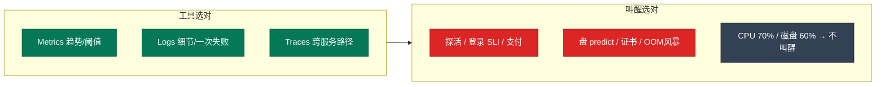
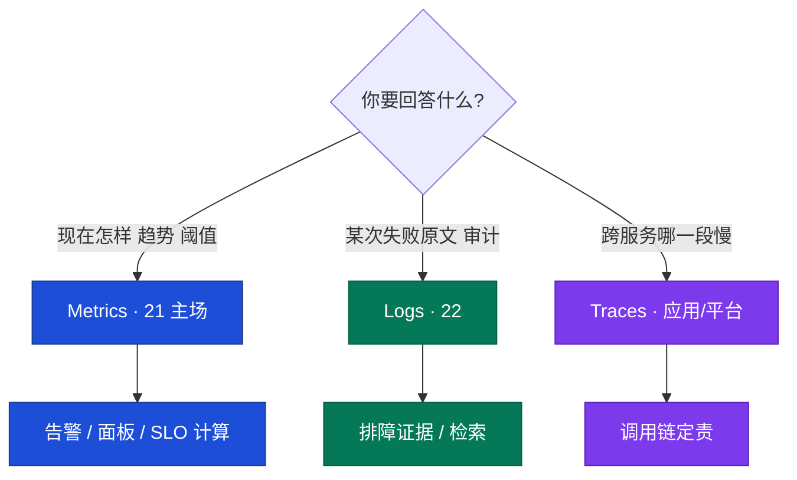
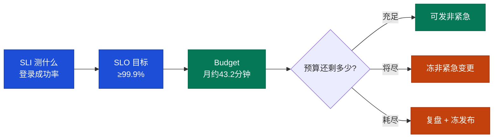
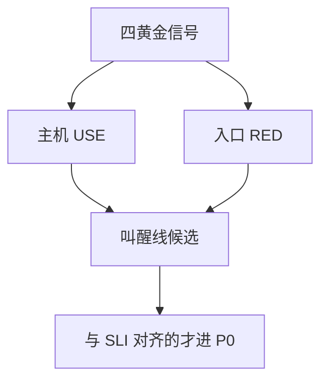
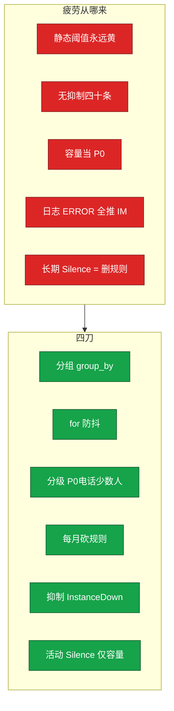
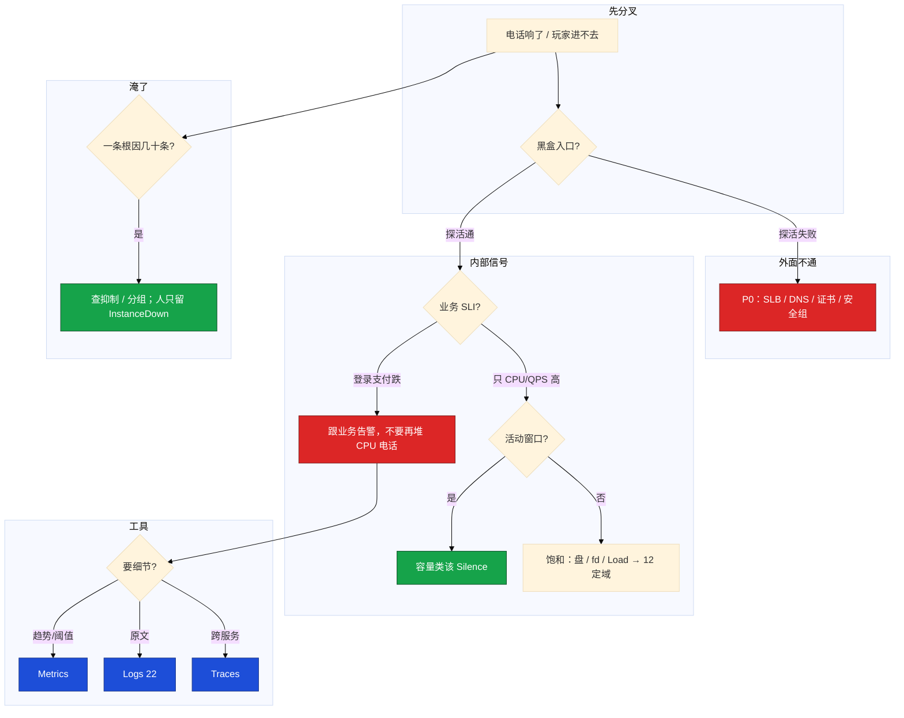

# 监控与告警

> **这章解决什么**：活动开场电话被 CPU、连接数、QPS 打爆——登录入口其实已经 5xx，黑盒探活夹在四十条「机器黄了」里没人点。缺的是**叫醒线、降噪、三支柱边界**，不是再加一条 CPU 规则。  
> **读法**：**先看总图** → **再走读一次告警风暴** → **再认名词** → **再抠三支柱 / SLI / 疲劳** → **定责树**。  
> **刻意不展开**：PromQL 向量匹配、高基数、kube-prometheus → [K8s 18](../../03-Kubernetes/18-监控与可观测性/)；USE/RED 定域排障 → [21](../21-性能观测与排障/)；日志采集/轮转 → [23](../23-日志运维/)；游戏 SLO 窗口与发布闸门 → [08 游戏](../../07-游戏运维专题/)；Oncall 排班 → [04-06](../../04-工程化与自动化/06-运维平台与Oncall/)。

---

## 本章目录

1. [本章定位](#1-本章定位)
2. [先看总图：信号怎么走到人](#2-先看总图信号怎么走到人) ← **开篇必读**
   - [2.0 全章知识串图](#20-全章知识串图一张把细节串起来) ← **架构总览**
   - [2.1 坐标系：三支柱 × 叫醒线](#21-坐标系三支柱--叫醒线)
   - [2.2 完整走读](#22-完整走读活动开场告警风暴从电话到定责)
3. [名词扫盲（对照总图认词）](#3-名词扫盲对照总图认词)
4. [Metrics / Logs / Traces：边界钉死](#4-metrics--logs--traces边界钉死) ← **重点精读**
5. [SLI / SLO / Error Budget](#5-sli--slo--error-budget) ← **重点精读**
6. [黄金信号：USE + RED](#6-黄金信号use--red)
7. [采集：Pull / 类型 / rate](#7-采集pull--类型--rate)
8. [告警疲劳：本章最易混](#8-告警疲劳本章最易混) ← **重点精读**
9. [黑盒、证书、盘预测](#9-黑盒证书盘预测)
10. [定责决策树与命令速查](#10-定责决策树与命令速查)
11. [去哪章继续学](#11-去哪章继续学)
12. [面试 · 易错 · 数字](#12-面试--易错--数字)
13. [合上书](#合上书)

---

## 1. 本章定位

| 章 | 负责 |
|----|------|
| **12** | 告警响了之后怎么定域（30 秒 / USE·RED） |
| **21（本章）** | **信号怎么采、怎么告、怎么降噪、叫醒谁**；三支柱边界；SLI 对齐 |
| **22** | 日志落地、轮转、盘被日志写死 |
| **K8s 18** | PromQL 深水、ServiceMonitor、高基数、滚动 SLO 窗口 |

本章是**主机侧可观测性入口**。后面所有「该不该半夜打电话」「为什么内部全绿外面挂」「为什么四十条 IM 没人看」，都建立在「黑盒+白盒 → Prometheus → AlertManager → 人」这张图上。

🎯 **值班签名**：电话响了——先看 blackbox 和登录 SLI，**禁止**用「CPU 70%」当叫醒线；一台挂了人只该收到 InstanceDown。

活动开场 3 分钟，电话被 CPU、连接数、QPS 打爆。登录入口其实已经 5xx，黑盒探活夹在四十条「机器黄了」里没人点。群里有人要重启大厅，另有人说 Grafana 全绿不用管——内部全绿、外面不通，缺的是黑盒，不是再加一条 CPU 规则。

**本章主线（排障就按这三步想）：**

1. **黑盒 + 白盒**：没有 blackbox，内部全绿也能入口挂。
2. **抑制风暴**：InstanceDown 抑制同 instance 子告警；疲劳靠分级 + `for` + 砍规则。
3. **活动 Silence 容量类**，SLO / 探活 / 盘 / 证书不静默。

**读完你能：** 白板上画出白盒 / 黑盒 / AlertManager / 三支柱边界；半夜能判断该不该叫醒；会配 `for`、抑制、活动窗口 Silence；会用 SLI 对齐叫醒线，用 predict 盘满和证书倒计时，而不是等玩家报。

---

## 2. 先看总图：信号怎么走到人

> **正确开篇顺序**：先有全局画面，再认词，再抠细节。  
> 先看 **§2.0 全章串图**（考点挂一张板上），再看 **§2.1 坐标系**，再用 **§2.2 走读**把一次告警风暴串起来。

### 2.0 全章知识串图（一张把细节串起来）

> 🎯 **合上书要能默画这张。** 青=黑盒 · 紫=白盒 · 蓝=采集 · 橙=降噪 · 红=叫醒。  
> 若预览仍报错，以下面 **ASCII 一页板** 为准。

```mermaid
flowchart TB
    classDef box fill:#0891B2,stroke:#155E75,color:#fff
    classDef white fill:#7C3AED,stroke:#4C1D95,color:#fff
    classDef prom fill:#1D4ED8,stroke:#1E3A8A,color:#fff
    classDef am fill:#C2410C,stroke:#9A3412,color:#fff
    classDef call fill:#DC2626,stroke:#7F1D1D,color:#fff
    classDef note fill:#FFF7ED,stroke:#FB923C,color:#9A3412
    classDef pillar fill:#047857,stroke:#065F46,color:#fff

    subgraph PILLAR["0 三支柱 - 各答一问"]
        direction LR
        M["Metrics 现在怎样"] --> L["Logs 发生过什么"]
        L --> T["Traces 这一次走哪"]
    end

    subgraph USERS["1 玩家碰到的面"]
        direction LR
        player[玩家 / APP] --> bb["blackbox<br/>HTTP TCP 证书"]
    end

    subgraph WHITE["2 白盒 - 进程自己报"]
        direction LR
        use["主机 USE<br/>node :9100"]
        red["入口 RED<br/>网关 exporter"]
        mid[mysqld / redis]
        proc[进程在不在]
    end

    subgraph PIPE["3 采集与规则"]
        direction TB
        prom[Prometheus Pull] --> rule["规则 expr + for"]
        rule --> am["AlertManager<br/>分组 抑制 静默"]
    end

    subgraph HUMAN["4 人 - 叫醒线"]
        direction LR
        p0[P0 电话]
        p1[P1 IM]
        p2[P2 IM]
        p3[P3 邮件]
    end

    subgraph FATIGUE["5 疲劳四刀"]
        direction LR
        F1["分组"]
        F2["for 防抖"]
        F3["抑制"]
        F4["砍规则"]
    end

    player -.->|通不通| bb
    bb --> prom
    use --> prom
    red --> prom
    mid --> prom
    proc --> prom
    am --> p0
    am --> p1
    am --> p2
    am --> p3
    am -.-> F1
    am -.-> F2
    am -.-> F3
    am -.-> F4

    class bb box
    class use,red,mid,proc white
    class prom,rule prom
    class am am
    class p0 call
    class p1,p2,p3 note
    class M,L,T pillar
    class F1,F2,F3,F4 am
```

**读图路线：**

| 段 | 记住 |
|----|------|
| ⓪ | Metrics 定趋势；Logs 定细节；Traces 定一次请求——**别用错工具**（§4） |
| ① | 没有黑盒箭头，内部全绿也可以入口挂（§9） |
| ② | 白盒：USE / RED / 中间件 / 进程；`up==0` 自己也要盯 |
| ③ | Pull 采 → 规则 `for` → AM 才对人（§7、§8） |
| ④ | P0 才电话；叫醒线对齐 SLI，不是 CPU（§5） |
| ⑤ | 风暴四刀：分组 → `for` → 抑制 → 每月砍规则（§8） |

```text
┌──────────────────────────────────────────────────────────────────────────┐
│                     21 一张板：从信号到人到定责                            │
├─────────────┬────────────────────┬───────────────────────────────────────┤
│  三支柱     │  采集面            │  对人                                  │
│  M 现在怎样 │  黑盒 blackbox     │  P0 电话 = 玩家玩不了 / 丢数据 / 不可恢复│
│  L 发生过啥 │  白盒 node/网关    │  P1 IM · P2 水位 · P3 巡检              │
│  T 这一次   │  Prom Pull → 规则  │  AM：分组 / for / 抑制 / Silence        │
├─────────────┴────────────────────┴───────────────────────────────────────┤
│  SLI=测什么  SLO=内部目标  Budget=1−SLO                                   │
│  疲劳：静态阈值永远黄 · 无抑制四十条 · 活动容量当 P0 → 人就不看了          │
│  活动：Silence 容量 P2；登录/支付/探活/盘/证书 死也不静默                  │
└──────────────────────────────────────────────────────────────────────────┘
```

### 2.1 坐标系：三支柱 × 叫醒线

> 值班脑子里要有这张二维图：**横轴是工具（M/L/T），纵轴是要不要叫醒**。



**读图三句话（先背这三句）：**

1. **Metrics 定「要不要叫」；Logs/Traces 定「叫了之后往哪查」**——别拿日志告警洪水替代 Metrics 阈值。  
2. **叫醒线对齐 SLI（登录成功率、探活）**，不对齐「数字圆不圆」。  
3. **疲劳不是「规则太少」**——是该叫的被淹没、不该叫的天天叫。

> **记住**：游戏入口用 RED + 黑盒，机器用 USE；叫醒用人能不能玩，不用 CPU%。

---

### 2.2 完整走读：活动开场告警风暴，从电话到定责

> 🎯 **只保留这一版走读。** 角色：你（值班）、登录网关、战斗服节点、AlertManager、告警群。

**场景**：活动 20:00 开。飞书电话连响。群里四十条：CPU 85%、连接数破阈、QPS 高、某进程 Down、磁盘 72%、以及一条被淹没的 `probe_success == 0`。有人喊「全员重启大厅」。

#### 第 1 步 · 先问黑盒，不问 CPU（约 30 秒）

```bash
# 从能代表「玩家路径」的机器 / 监控网 curl
curl -sS -o /dev/null -w '%{http_code} time=%{time_total}\n' https://game-api.example.com/login/health
curl -sS 'http://blackbox:9115/probe?target=https://game-api.example.com/login/health&module=http_2xx' \
  | grep -E 'probe_success|probe_duration|probe_ssl'
```

```text
503 time=0.812

probe_success 0
probe_duration_seconds 0.81
probe_ssl_earliest_cert_expiry 1.735e+09
```

| 读数 | 说明 |
|------|------|
| HTTP 503 | 入口已经挂，P0 |
| `probe_success 0` | 黑盒确认：不是「感觉慢」，是探活失败 |
| 证书 expiry 仍远 | 今晚不是证书问题 |

→ **结论**：外面不通。下一步看 RED / SLI，**不要**先回那四十条 CPU IM。

#### 第 2 步 · RED + 登录 SLI（面板 1 分钟）

Grafana 第一行：

```text
登录 QPS:     12000 → 正常偏高（活动预期）
网关 5xx:     0.1% → 12%     ← 破 SLO
登录成功率:   99.95% → 78%    ← SLI 崩了
登录 P99:     80ms → 900ms
node CPU:     多台 80%+       ← 饱和，但是今晚预期容量
```

| 信号 | 今晚含义 |
|------|----------|
| 5xx / 成功率 | **叫醒线**：玩家进不去 |
| CPU / QPS 绝对值 | 活动预期；该 Silence 的 P2，不是再打电话 |
| 四十条进程 Down | 若同源 InstanceDown → 该被抑制 |

→ **定责**：入口 / 登录链（扩容、回滚、摘故障机），不是「再加 CPU 规则」。

#### 第 3 步 · 打开 AM：人该看到几条？

```bash
amtool alert query
amtool silence query
```

```text
Alertname          Severity  Instance     State
InstanceDown       critical  game-03      active
HighCPUUsage       warning   game-03      suppressed   ← 应被抑制
ProcessDown        warning   game-03      suppressed
DiskHigh           warning   game-03      suppressed
LoginSLOBreach     critical  gateway      active       ← 该响
ProbeFail          critical  blackbox     active       ← 该响
HighCPUUsage       warning   game-07      active       ← 活动容量，该 Silence
```

**分支 A · 抑制没配（常见翻车）：**

同 instance 下 InstanceDown + 三十条子告警全部推 IM → 人淹死 → 登录 SLI 没人点。

**分支 B · 抑制对、Silence 忘了开：**

容量类 P2 全员电话 → 疲劳 → 真正的 ProbeFail 被当成「又是活动噪音」。

**分支 C · 今晚正确形态：**

人只收到：`ProbeFail` + `LoginSLOBreach` +（若机器真挂）一条 `InstanceDown`。容量 CPU 在 Silence 窗口里。

#### 第 4 步 · 留证再止血

同一时刻留三样：

1. blackbox / curl 出口码  
2. 登录成功率 / 5xx 图（SLI）  
3. AM 截图（哪些 active / suppressed / silenced）  

然后：扩登录 / 回滚发布 / 摘故障机——**先止血**。CPU 规则治理可以明天做。

```text
电话/告警
   │
   ▼
 黑盒探活 ──失败──▶ P0：SLB / DNS / 证书 / 安全组 / 上游挂
   │成功
   ▼
 登录/支付 SLI ──破──▶ 跟业务告警，别堆 CPU 电话
   │正常
   ▼
 只 CPU/QPS 高 ──活动?──是──▶ Silence 容量 P2
                 └──否──▶ 饱和：盘 predict / fd / Load → 12 定域
   │
   ▼
 四十条同机 ──▶ 查抑制；人只留 InstanceDown
```

> **记住**：走读验收——合上书能按「黑盒 → SLI → AM 抑制/静默 → 容量 vs 入口」口述一遍。

#### 走读对照表（今晚三种电话）

| 电话内容 | 先做 | 别做 |
|----------|------|------|
| 四十条 CPU + 一条探活失败 | 先点探活 / 登录 SLI | 逐条回 CPU |
| 只有 CPU 85%、登录曲线正常 | 确认活动窗口 Silence | 拉全员电话 |
| Grafana 全绿、玩家进不去 | blackbox；查 SLB/DNS | 再加 node 规则 |

---

## 3. 名词扫盲（对照总图认词）

对照 §2.0：每个词先「值班里什么时候碰到」，再定义。

| 词 | 值班里何时碰到 | 一句话 |
|----|----------------|--------|
| **白盒** | node / 进程 exporter 全绿 | 进程自己报内部状态 |
| **黑盒** | 内部绿、玩家进不去 | 从外往里探「通不通」 |
| **Metrics** | 阈值、趋势、面板 | 聚合数值：现在怎样、趋势怎样 |
| **Logs** | 要看某次 5xx 原因 | 事件记录：发生过什么 |
| **Traces** | 跨网关→大厅→支付慢 | 一次请求的调用链 |
| **SLI** | 「测什么当体验」 | 服务水平**指标**（成功率、P99） |
| **SLO** | 「内部目标多少」 | 服务水平**目标**（≥99.9%） |
| **SLA** | 合同 / 对外承诺 | 通常松于 SLO |
| **Error Budget** | 「还能失败多久」 | 1−SLO；99.9% ≈ 月 43.2 分钟 |
| **Pull** | Prom scrape `/metrics` | Server 来拉；目标必须可达 |
| **Push** | Zabbix Agent | Agent 上报；防火墙友好 |
| **Pushgateway** | CI / 批任务跑完就没 | 短命 Job 中转；推完要删 |
| **`for`** | CPU 冲 5 秒就响 | 持续多久才 firing；防抖 |
| **抑制 inhibit** | 一台挂四十条 | 父告警压制同范围子告警 |
| **静默 Silence** | 维护 / 活动窗口 | 临时不通知；到期必须解除 |
| **分组 group** | 同实例刷屏 | 合并成更少通知 |
| **Watchdog** | Prom 自己挂了全绿 | 规则引擎心跳；外层另通道叫人 |
| **黄金信号** | 面板怎么摆 | Latency / Traffic / Errors / Saturation |
| **USE** | 主机面板 | Utilization / Saturation / Errors |
| **RED** | 入口面板 | Rate / Errors / Duration |

> **记住**：名词验收——能指着串图说出「黑盒在哪、AM 在哪、三支柱各答哪一问」。

**易混三组（此处只点名，钉死见后文）：**

| 别混 | 见 |
|------|-----|
| Metrics vs Logs vs Traces | §4 |
| SLI vs SLO vs SLA | §5 |
| 抑制 vs 静默 vs `for` | §8 |

---

## 4. Metrics / Logs / Traces：边界钉死

> 🎯 **本章最易用错工具的一节。** 合上书要能用一句话选对支柱。

### 4.1 一句话 + 对照表

**一句话：** Metrics 回答「现在/趋势怎样」；Logs 回答「发生过什么」；Traces 回答「这一次请求走了哪」——告警主战场是 Metrics，细节下钻才 Logs/Traces。



| 支柱 | 擅长 | 不擅长 | 本章怎么用 |
|------|------|--------|------------|
| **Metrics** | 聚合、对比、阈值、预测、低成本长期存 | 「这个用户为什么失败」的原文 | 告警、面板、SLI 计算 |
| **Logs** | 上下文、错误栈、审计、一次请求细节 | 高基数全量当实时阈值（贵、吵） | 告警响了之后取证 → [23](../23-日志运维/) |
| **Traces** | 跨进程延迟拆分、依赖定位 | 替代主机 USE；替代全局 QPS | 入口慢且跨服务时用；深水在应用侧 / K8s 18 |

### 4.2 值班选型：四个场景钉死

| 场景 | 先看 | 别先做 |
|------|------|--------|
| 登录成功率跌破 SLO | Metrics（SLI 曲线）+ 黑盒 | 先 grep 全量日志当告警源 |
| 某玩家订单号失败 | Logs（按 request_id） | 指望 Metrics 标签里塞订单号 |
| 支付 P99 高、网关与支付都慢 | Traces 看哪一跳 | 只看单机 CPU |
| 磁盘将满 | Metrics `predict_linear` | 等日志写失败再叫 |

**打个比方**：Metrics 是仪表盘转速表；Logs 是行车记录仪逐帧；Traces 是「这一单快递经过了哪些中转站」。半夜叫醒看仪表盘；修车看记录仪和快递单。

### 4.3 边界红线（面试高频）

| 说法 | 对错 | 口径 |
|------|:----:|------|
| 用日志关键字告警替代所有 Metrics | 错 | 日志告警易风暴、难 SLO；主叫醒线用 Metrics |
| Metrics 标签塞 user_id / 订单号 | 错 | 高基数炸存储；细节去 Logs |
| 有 Traces 就不需要黑盒 | 错 | Trace 采不到「根本连不上」 |
| 有 Metrics 就不需要 Logs | 错 | 定责要原文；Metrics 只说「错了多少」 |
| 三支柱必须同一套厂商 | 错 | 边界比品牌重要；主机章先把 M 做好 |

```text
# 错：把高基数当 Metrics
http_requests_total{user_id="u182937",order="o99..."}  → 基数爆炸

# 对：Metrics 聚合 + Logs 关联
rate(http_requests_total{code=~"5.."}[5m])             → 告警
# 日志里带 request_id / trace_id 下钻
```

> **别混**：告警疲劳经常来自「把 Logs 当 Metrics 用」——每个 ERROR 行推 IM，等于没有分级。

**面试怎么说**：「Metrics 定叫不叫、趋势和 SLO；Logs 定这一次为什么；Traces 定跨服务哪一跳。主机值班主战场是 Metrics + 黑盒，日志告警只做少量致命关键字。」

---

## 5. SLI / SLO / Error Budget

> 🎯 **叫醒线的数学。** 不懂 SLI，就会用 CPU 70% 叫醒人。

### 5.1 一句话定义

**一句话：** SLI 是测什么；SLO 是内部目标；Error Budget 是还能失败多久；叫醒线对齐 SLI，不对齐主机饱和。

| 词 | 例子（登录） | 谁用 |
|----|--------------|------|
| **SLI** | 成功登录数 / 总尝试数；或登录 P99 | 监控表达式、面板 |
| **SLO** | 月成功比例 ≥ 99.9% | 团队内部目标 |
| **SLA** | 合同 99.5% 可用性 | 对外；通常松于 SLO |
| **Budget** | 1−99.9% = 0.1% ≈ **43.2 分钟**/月 | 发布闸门、复盘 |



### 5.2 游戏服常见 SLI（主机章点到为止）

| 服务面 | 推荐 SLI | 别当成 SLI |
|--------|----------|------------|
| 登录 | 成功率、P99、blackbox 成功率 | 单机 CPU% |
| 支付 | 成功率、耗时分位 | 连接数绝对值 |
| 大厅入口 | 探活成功率、5xx 率 | Load 平均值 |
| 战斗长连接 | 在线掉线率、心跳超时率 | 单进程 RSS |

滚动窗口、多窗口 burn rate、和 HPA/发布闸门的细算 → [K8s 18](../../03-Kubernetes/18-监控与可观测性/) / [08 游戏](../../07-游戏运维专题/)。本章只要求：**叫醒线能指到一条 SLI**。

### 5.3 现场：用 SLI 判该不该叫

**场景**：群里四条消息同时来。

| 消息 | 对齐 SLI？ | 动作 |
|------|:----------:|------|
| CPU 70%，登录成功率 99.95% | 否 | IM 即可 / 活动则 Silence |
| 登录成功率 80% | 是 | **P0/P1**，跟业务 |
| 磁盘 60%，predict 24h 未满 | 否 | 不叫 |
| 磁盘 predict 24h 内满 | 是（可用性风险） | P1；95%+ / inode 满 P0 |
| 证书 3 天过期 | 是（即将不可用） | P1/P0 |

**输出解读（口算 Budget）：**

```text
SLO 99.9% → 一个月按 30 天 = 43200 分钟
Budget = 43200 × 0.1% = 43.2 分钟

今晚登录失败持续 10 分钟、失败率从 0.05% 升到 20%
→ 不是「吃了 10 分钟 Budget」这么简单，但方向对：
  高失败率在吃 Budget；该叫人、该冻非紧急发布
```

> **记住**：主机 CPU 是饱和信号，最多 P2；**不能**当玩家体验 SLO。

**面试怎么说**：「我先定义登录成功率当 SLI，SLO 99.9%，Budget 大约每月 43 分钟。半夜电话对齐 SLI 和探活，不对齐 CPU 70%。」

---

## 6. 黄金信号：USE + RED

**一句话：** 四黄金信号落到主机用 USE、落到入口用 RED；面板第一行 RED，第二行 USE。

Google SRE 四信号：

| 信号 | 问什么 | 主机/入口上对应 |
|------|--------|-----------------|
| **Latency** | 多慢 | 入口 P99；不要用平均值当 SLA |
| **Traffic** | 多忙 | QPS、CCU、网关连接数 |
| **Errors** | 多错 | 5xx、登录失败、探活失败、网卡 drop |
| **Saturation** | 多满 | CPU/Load、MemAvailable、磁盘%/inode/fd |



| 层级 | 必看 | 典型告警 |
|------|------|----------|
| 探活 | blackbox HTTP/TCP | 连续失败 **P0** |
| 饱和 | CPU、Load、磁盘%、inode | predict 满盘 P1，打满 P0 |
| 错误 | 网卡 drop、OOM、IO error | P1 |
| 业务 | 登录成功率、网关 5xx | 按 SLO |

**现场走一遍**（活动开场，电话响了，你先开 Grafana）：

1. **第一行 RED**：QPS、5xx 率、P99——登录/支付 URL。  
2. **第二行 USE**：CPU、Load vs 核、MemAvailable、磁盘%、inode、fd。  
3. 看有没有 **Annotation**（刚发版？）。  
4. RED 正常、只有 USE 黄 → 容量类，活动窗口可能该 Silence。  
5. RED 5xx 飙 → 先救入口/SLI，不要先重启战斗服。

```text
登录 P99: 120ms → 正常
网关 5xx rate: 12% → P0，跟 CPU 无关
node_cpu: 72% → 饱和 P2/P3，不对齐玩家 SLO
MemAvailable / MemTotal: 18% → 还可；勿只看 MemFree
```

Load 和 CPU% 不是一回事（→ [06](../06-CPU与Load/)）。磁盘 60% 不叫人；**predict 24h 内打满** 要叫。inode 满、fd 打满，`df -h` 还很空，一样能把日志和 Nginx 写挂（→ [09](../09-文件系统与inode/)、[23](../23-日志运维/)）。定域手法 → [21](../21-性能观测与排障/)。

> **记住**：平均值会撒谎，延迟看 P99。面板第一行 RED，第二行 USE。

**面试怎么说**：「主机 CPU 是饱和信号，最多 P2；叫醒线对齐登录 SLI。面板第一行 RED，第二行 USE。」

---

## 7. 采集：Pull / 类型 / rate

**一句话：** Prom 拉取目标活着才能采到；Counter 必须 `rate()`；磁盘用 `predict_linear` 斜率告警。

### 7.1 Pull vs Push vs Pushgateway

| 模式 | 谁主动 | 优点 | 坑 |
|------|--------|------|-----|
| **Pull（Prom）** | Server scrape | `curl` 即排障；服务发现自然 | 目标入站要开；防火墙难时别硬上 |
| **Push（Zabbix 等）** | Agent 上报 | 出站好做 | 发现/标签弱一些 |
| **Pushgateway** | 短命 Job 推一下 | 批任务来得及 | 序列**不过期**，推完要删 |

```bash
# 排障第一刀：采到没有？
curl -sS localhost:9100/metrics | grep -E '^node_(cpu|memory|filesystem)' | head
```

```text
node_cpu_seconds_total{cpu="0",mode="idle"} 1.234e7
node_memory_MemAvailable_bytes 8.5e9
node_filesystem_avail_bytes{mountpoint="/var"} 2.1e10
```

`curl` 不通 = 没采到。不是「Grafana 有旧图所以还行」。

### 7.2 四种类型

| 类型 | 行为 | 错误用法 |
|------|------|----------|
| **Counter** | 只增 | `http_requests_total > 1e8` 永远 firing |
| **Gauge** | 可上可下 | —（内存、在线人数直接比） |
| **Histogram** | 分桶 | —；**跨实例聚合 P99 用这个** |
| **Summary** | 客户端分位数 | 跨实例 P99 **加不起来** |

```promql
# CPU（节点）
1 - avg(rate(node_cpu_seconds_total{mode="idle"}[5m])) by (instance)

# 内存
1 - node_memory_MemAvailable_bytes / node_memory_MemTotal_bytes

# 磁盘使用率
1 - node_filesystem_avail_bytes / node_filesystem_size_bytes

# 24h 内将满（斜率）
predict_linear(node_filesystem_avail_bytes[6h], 24*3600) < 0

# 证书剩余
probe_ssl_earliest_cert_expiry - time() < 7 * 24 * 3600
```

**打个比方**：Counter 像水表累计——不能说「读数大于 1 亿就漏水」，要看每小时流了多少（rate）。Gauge 像油箱指针。

活动服用 **6h → 24h** 预测；可加 **1h → 2h** 紧急线。已经 95%+ 或 inode 满 → P0。

> **记住**：Counter 直接比阈值是错的。Histogram / Summary 看跨实例 P99 不一样。

**面试怎么说**：「Counter 必须 rate。盘告警我看斜率 predict_linear，不是静态 70%。延迟跨实例用 Histogram。」

### 7.3 落地最小集（主机版）

| 组件 | 端口 / 路径 | 生产怎么放 |
|------|-------------|------------|
| node_exporter | **:9100**/metrics | 每台；systemd；监控网可达 |
| blackbox_exporter | **:9115**/probe | 从「用户能碰到的地方」探 |
| Prometheus | scrape + 规则 | 能访问全部 target |
| AlertManager | 通知 | 电话网关单独测 |
| Pushgateway | 仅短任务 | 推完删除 |

验收五条：

1. `curl :9100/metrics` 有 `node_`。  
2. targets 全 UP；`up{job="node"} == 0` 有告警。  
3. 对登录 URL 故意断安全组能 P0。  
4. 测试 firing，电话/IM 真响。  
5. Watchdog 在；Prom 停掉外层能叫人。

K8s 版 ServiceMonitor / cAdvisor → [K8s 18](../../03-Kubernetes/18-监控与可观测性/)。

---

## 8. 告警疲劳：本章最易混

> 🎯 **合上书最容易答飘的一节。** 疲劳 ≠ 规则太少；抑制 ≠ 静默 ≠ 把阈值放宽。

### 8.1 一句话 + 四步治理

**一句话：** 告警疲劳 = 不该叫的天天叫 + 该叫的被淹没；治理四步：分组 → `for` → 分级路由 → 每月砍从未处理的规则；一台挂了靠 **抑制**，维护窗口靠 **静默**。



### 8.2 抑制 vs 静默 vs `for` vs 去重

| 机制 | 干什么 | 典型 | 别当成 |
|------|--------|------|--------|
| **`for`** | 持续多久才算 firing | CPU `for: 5m` | 把阈值从 70 改成 95 |
| **去重/分组** | 同类合并成更少通知 | group_by instance | 删除规则 |
| **抑制 inhibit** | 父告警在时不发子告警 | InstanceDown ⊃ ProcessDown | 维护窗口 |
| **静默 Silence** | 临时不通知 | 活动容量 P2、变更窗 | 长期关监控 |

```yaml
# 抑制示意：机器没了，别报它上面的子症状
inhibit_rules:
  - source_match:
      alertname: InstanceDown
    target_match_re:
      alertname: .+
    equal: ['instance']
```

**打个比方**：AlertManager 像前台分拣——同一栋楼着火（InstanceDown），不要给每个房间单独打四十通电话；先广播「楼没了」。静默像「今晚装修，烟感暂时屏蔽」，明天必须恢复。

### 8.3 分级：P0 才打电话

| 级 | 含义 | 响应 | 通知 |
|----|------|------|------|
| **P0** | 不可用、丢数据风险 | **5 分钟** | 电话 + IM |
| **P1** | 明显损伤 | **15 分钟** | IM + 邮件 |
| **P2** | 水位高 | **1 小时** | IM |
| **P3** | 巡检 | 工作时间 | 邮件 |

| 该半夜叫醒 | 不该叫醒 |
|------------|----------|
| 探活失败（入口 / 登录 / 支付） | 单机 CPU 70%，登录/支付曲线正常 |
| 登录跌、支付失败（破 SLI） | 已被 InstanceDown 抑制的进程/CPU/disk |
| 磁盘 **predict 24h 内打满** | 磁盘 60%、inode 还早 |
| OOM **风暴**（不是一次单进程） | 已知维护窗口（该静默却没静默是流程问题） |
| 证书 **7 天内**过期 | 活动预期内的容量类 P2（该 Silence 却没 Silence） |

### 8.4 活动窗口红线

| 活动中 | 做 | 不做 |
|--------|----|------|
| 容量类 P2（CPU、QPS 绝对值） | **Silence** | 全员电话 |
| 登录、支付、blackbox、盘、证书 | **不静默** | 用「忙」当借口 |
| 发布 | Annotation | 事后靠回忆 |

```bash
amtool silence add \
  alertname="HighCPUUsage" \
  --comment "activity window 20:00-22:00" \
  --duration 2h
amtool silence query
```

长期 Silence 等于删规则。漏报另一头：没黑盒、没心跳、阈值太宽——覆盖率要 review。

> **别混**：  
> - 抑制 = 故障时少吵；静默 = 计划内不吵。  
> - `for` = 防抖；放宽阈值 = 改灵敏度——两件事。  
> - 疲劳和漏报要一起治；只删规则会漏报。

**面试怎么说**：「一台挂了我配 InstanceDown 抑制同 instance 子告警；P0 才电话。活动只 Silence 容量类，SLO 和探活死也不静默。疲劳四步：分组、for、分级、砍规则。」

---

## 9. 黑盒、证书、盘预测

**一句话：** 没有 blackbox，DNS/LB/证书配错时内部指标仍可能全绿；证书看倒计时；盘看斜率。

### 9.1 黑盒补哪块盲区

白盒看进程自报；**黑盒从外往里探**。DNS、证书、安全组、LB 配错，Exporter 不知道。

```yaml
- job_name: http_probe
  metrics_path: /probe
  params:
    module: [http_2xx]
  static_configs:
    - targets:
        - https://game-api.example.com/login/health
  relabel_configs:
    - source_labels: [__address__]
      target_label: __param_target
    - target_label: __address__
      replacement: blackbox-exporter:9115
```

探 **玩家点的那个 URL**，不要只探静态 `/health` 若没碰到登录依赖。

```promql
probe_success == 0
probe_ssl_earliest_cert_expiry - time() < 7 * 24 * 3600
```

连续失败 → **P0**。证书 7 天 → P1；更短 → P0。

### 9.2 盘：为什么静态 70% 会疲劳

静态 70% 在大盘上会永远黄。活动服更该用斜率：

```promql
predict_linear(node_filesystem_avail_bytes[6h], 24*3600) < 0
```

| 条件 | 级别 |
|------|------|
| predict 24h 内满 | P1 |
| 已 95%+ 或 inode 满 | P0 |
| 静态 60%～70% 长期黄 | 改规则，别继续叫 |

日志盘满止血 → [23](../23-日志运维/)。监控负责提前叫。

### 9.3 核心配置速查

改完 `promtool check rules`，再 reload。

```yaml
- alert: HighCPUUsage
  expr: 1 - avg(rate(node_cpu_seconds_total{mode="idle"}[5m])) by (instance) > 0.85
  for: 5m
  labels:
    severity: warning
- alert: DiskWillFull
  expr: predict_linear(node_filesystem_avail_bytes[6h], 24*3600) < 0
  for: 10m
  labels:
    severity: critical
- alert: ProbeFail
  expr: probe_success == 0
  for: 2m
  labels:
    severity: critical
```

| 参数 | 生产怎么用 | 改错会怎样 |
|------|------------|------------|
| scrape_interval | 主机 15s～30s | 过短打爆 exporter |
| `for` | CPU 5m；盘 10m；探活 1～2m | 过短风暴 |
| severity | 一事一级 | 同一事既 P0 又 P2 |
| inhibit_rules | InstanceDown 抑制子告警 | 故障越大噪音越大 |
| Silence | 维护 / 活动容量；**到期解除** | 忘了关 = 删规则 |
| 证书阈值 | **7 天 P1** | 等浏览器 expired |

> **记住**：证书用 expiry 倒计时。Pushgateway 序列不会自动过期，Job 结束要删。图和告警最好同源 PromQL。

---

## 10. 定责决策树与命令速查

### 10.1 决策树

三问：玩家还能不能进？告警是不是一个人能看完？漏的是不是入口？



### 10.2 现象｜先做｜别做

| 现象 | 先做什么 | 不要做什么 |
|------|----------|------------|
| 机器全绿，玩家进不去 | blackbox；SLB/DNS/证书/安全组 | 再加 CPU 规则 |
| 一台 hang，四十条 IM | 抑制 InstanceDown | 关通知 / 逐条回 |
| 活动开场全员 P0 | Silence 容量类；SLO 不静默 | 关掉整个监控 |
| 磁盘告了两周没人理 | predict_linear；95% 升级 P0 | 继续静态 70% |
| 图上红了脚本还没叫 | 告警与图同源 | 两套阈值各说各的 |
| Prom 自己挂了全绿 | Watchdog / 外层探活 | 相信「没告警就好」 |
| ERROR 日志刷屏 IM | 改回 Metrics 阈值 + 少量致命关键字 | 继续「有 ERROR 就叫」 |
| CPU 70% 要不要叫老板 | 看登录/支付 SLI | 对齐「数字不圆」 |

### 10.3 命令速查

```bash
curl -sS localhost:9100/metrics | grep -E '^node_(cpu|memory|filesystem)' | head
curl -sS 'http://blackbox:9115/probe?target=https://game-api.example.com/login/health&module=http_2xx' \
  | grep -E 'probe_success|probe_ssl'
promtool check rules /etc/prometheus/rules.yml
amtool alert query
amtool silence query
```

| 目的 | 命令 / 指标 | 看什么 |
|------|-------------|--------|
| 采到没有 | `curl :9100/metrics` | 通、有 `node_` |
| 探活 | blackbox `/probe` | `probe_success`、证书剩余 |
| 规则语法 | `promtool check rules` | reload 前 |
| 正在响 | AM UI / `amtool alert` | inhibit / silenced |
| scrape 死 | `up == 0` | exporter 自己挂了 |
| 盘将满 | `predict_linear(...) < 0` | 斜率 |
| 主机现场 | `df -h && df -i` | 块 vs inode |

### 10.4 指标阈值（主机）

| 指标 | 阈值 | 级别 |
|------|------|------|
| blackbox 连续失败 | 失败 | **P0** |
| 登录 / 支付破 SLO | 按 SLI | **P0/P1** |
| WAL/盘 predict 24h | `< 0` | P1；95%+ / inode 满 = P0 |
| 证书剩余 | **< 7 天** | P1；更短 P0 |
| OOM 风暴 | 多进程 | P1 |
| `up == 0` | scrape 失败 | 按 job 重要度 |
| 单机 CPU 高且 SLI 正常 | — | ≤P2；活动可 Silence |

### 10.5 活动高峰口述模板（可直接背）

**【30 秒】**  
「先黑盒和登录 SLI，再看 CPU。活动只 Silence 容量 P2，探活和支付死也不静默。一台挂了人只该收到 InstanceDown。」

**【2 分钟】**  
「三支柱：Metrics 定叫不叫，Logs 定这一次为什么，Traces 定跨服务哪一跳。叫醒线对齐 SLI，Budget 99.9% 大约每月 43 分钟。疲劳四步：分组、for、分级、砍规则。盘用 predict_linear，证书用 7 天倒计时。监控自己挂了靠 up==0 和 Watchdog。」

**【常见追问】**  
- CPU 70% 叫不叫？→ 看 SLI；正常就不叫。  
- 抑制和静默？→ 故障时少吵 vs 计划内不吵。  
- 为什么要黑盒？→ LB/DNS/证书配错时白盒仍绿。

---

## 11. 去哪章继续学

| 你想搞懂 | 去 |
|----------|-----|
| 告警响了怎么定域（30 秒 / USE·RED） | [21](../21-性能观测与排障/) |
| Load vs util、CPU 深排障 | [06](../06-CPU与Load/) |
| OOM、内存 | [07](../07-内存与OOM/) |
| 磁盘 IO、await | [08](../08-磁盘与IO/) |
| 连接/队列满 | [12](../12-网络栈与Socket/) |
| 日志轮转、盘被日志写死 | [23](../23-日志运维/) |
| inode / 文件系统 | [09](../09-文件系统与inode/) |
| 高可用探活设计 | [26](../26-高可用与容灾/) |
| PromQL、kube-prometheus、高基数、滚动 SLO | [K8s 18](../../03-Kubernetes/18-监控与可观测性/) |
| 游戏 SLO 窗口、发布闸门 | [08 游戏](../../07-游戏运维专题/) |
| Oncall 排班、事故复盘 | [04-06](../../04-工程化与自动化/06-运维平台与Oncall/) |
| 云监控产品 | [07 云](../../06-云平台/) |

---

## 12. 面试 · 易错 · 数字

| 问 | 答 |
|----|-----|
| 监控三支柱各答什么？ | Metrics 现在/趋势；Logs 发生过什么；Traces 这一次走哪 |
| 哪些该半夜打电话？ | 探活失败、登录/支付破 SLI、盘 predict 满、OOM 风暴、证书将过期 |
| CPU 70%、磁盘 60%？ | 不对齐玩家体验就不叫；盘看斜率 |
| 四黄金信号？USE/RED？ | L/T/E/S；主机 USE，入口 RED；面板第一行 RED |
| Pull / Push / Pushgateway？ | Prom 拉；Zabbix 推；短命 Job 推网关且要删 |
| AlertManager 四件套？ | 分组、`for`、抑制、静默；P0 才电话 |
| 一台挂了人该看到几条？ | 一条 InstanceDown（抑制子告警） |
| blackbox 补什么？ | 白盒看不见的 LB/DNS/证书/安全组 |
| SLI/SLO/Budget？ | 测什么 / 内部目标 / 1−SLO；99.9%≈月 43.2 分钟 |
| 活动高峰怎么做？ | Silence 容量 P2；探活/登录/支付/盘/证书不静默 |
| 监控自己挂了？ | `up==0` + Watchdog / 外层探活 |
| 图和告警？ | 最好同源 PromQL |

| 说法 | 对错 | 口径 |
|------|:----:|------|
| CPU 70% 该半夜打电话 | 错 | 对齐入口和 SLI |
| 内部指标绿就等于玩家能进 | 错 | 要黑盒 |
| 所有人电话更保险 | 错 | 等于没人接 |
| Counter 可以直接比阈值 | 错 | 必须 `rate()` |
| 内存看 MemFree 就行 | 错 | 看 MemAvailable |
| 磁盘 70% 静态告警最稳 | 错 | 疲劳；用 predict |
| `for` 是把规则写松 | 错 | 防抖 |
| 一台挂了报 40 条才叫全面 | 错 | 要抑制 |
| 抑制 = 静默 | 错 | 故障时 vs 计划内 |
| Histogram / Summary 看 P99 一样 | 错 | 跨实例用 Histogram |
| 主机 CPU 能当玩家 SLO | 错 | 饱和信号，最多 P2 |
| 活动高峰该关掉监控 | 错 | 只静默容量类 |
| Pushgateway 推完不用管 | 错 | 序列不过期，要删 |
| node_exporter 挂了业务告警会顶上 | 错 | 要 `up == 0` |
| 证书等玩家报 expired | 错 | 7 天 P1 |
| Grafana 好看、告警用 SSH 扫盘 | 错 | 图和告警最好同源 |
| 探 `/health` 200 就等于登录通 | 错 | 要探玩家点的 URL |
| 用日志 ERROR 全量替代 Metrics 告警 | 错 | 主叫醒线用 Metrics |
| Metrics 标签塞 user_id | 错 | 高基数；细节去 Logs |
| 有 Traces 就不需要黑盒 | 错 | 连不上时 Trace 也没有 |
| 疲劳就是规则太少 | 错 | 是噪音淹没信号 |
| 托管云监控这章能跳过 | 错 | 叫醒线、抑制、活动红线仍是你的 |

**数字**：P0 **5 分钟** / P1 **15 分钟** / P2 **1 小时**；证书 **7 天**；盘预测 **6h → 24h**（可加 1h → 2h）；Error Budget 99.9% ≈ 月 **43.2 分钟**；node **:9100**、blackbox **:9115**；探活 `for` 常见 **1～2m**；CPU `for` 常见 **5m**。

**易混对照（一页）：**

| A | B | 别混成 |
|---|---|--------|
| Metrics | Logs / Traces | 工具万能 / 互相替代 |
| SLI | SLO / SLA | 三个词一个意思 |
| USE | RED | 入口指标当资源指标 |
| 抑制 | 静默 | 故障时少吵 = 计划内不吵 |
| `for` | 放宽阈值 | 防抖 = 改灵敏度 |
| 白盒 | 黑盒 | 内部绿 = 玩家能进 |
| Pull | Push / Pushgateway | 三种采集混为一谈 |
| P0 业务 | P2 容量 | 活动 CPU = 该打电话 |
| scrape `up` | 业务探活 | exporter 活 = 登录通 |
| 疲劳 | 漏报 | 只治一边 |

---

## 合上书

1. **默画 §2.0 串图 + §2.1 坐标系**：黑盒/白盒/Prom/AM 在哪？三支柱各答哪一问？叫醒线怎么画？  
2. **口述走读**：活动开场四十条 IM，从黑盒 → 登录 SLI → AM 抑制/静默 → 容量 vs 入口。  
3. **钉死 §4**：Metrics/Logs/Traces 边界；什么场景选哪个；为什么不能用日志 ERROR 全量当叫醒线？  
4. **钉死 §5**：SLI/SLO/Budget；99.9% 一个月大约多少分钟？CPU 能当玩家 SLO 吗？  
5. **钉死 §8**：疲劳四步；抑制 vs 静默 vs `for`；一台挂了人该看到几条？  
6. **黑盒 / 盘 / 证书**：补哪块盲区？predict 怎么写？证书看哪条指标？  
7. **定责**：全绿进不去、活动全员 P0、Prom 自己挂——先做 / 别做。

六～七题都能口述，这一章就过了。下一章先让机器别被自己的日志写死：journal、rotate、采集 → [23 日志运维](../23-日志运维/)。
