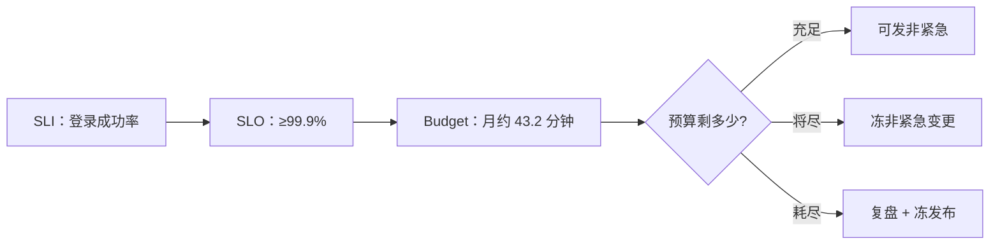

# 22｜监控与告警 · 练习题

先对照 [知识点](知识点.md) **「一」总图 + 「五」SLI 叫醒线 + 「七」降噪** 自己口述，再对答案。关键字（黑盒、SLI、predict_linear、抑制 vs 静默、疲劳四刀、Watchdog）要能张口就来。

| 标记 | 含义 |
|------|------|
| **核心** | 不懂整章就没建立起来 |
| **必会** | 值班和面试都要能讲 |
| **常用** | 线上会反复碰到 |
| **常考** | 白板和追问的高频口径 |

## 本题目录

- [Q1 叫醒线](#q1)
- [Q2 三支柱](#q2)
- [Q3 SLI / SLO / Budget](#q3)
- [Q4 黄金信号与面板三板斧](#q4)
- [Q5 rate / irate / histogram_quantile](#q5)
- [Q6 Pull / Push / 四种类型](#q6)
- [Q7 黑盒与证书](#q7)
- [Q8 抑制 vs 静默 vs for](#q8)
- [Q9 告警疲劳四刀](#q9)
- [Q10 盘满预测与饱和度](#q10)
- [Q11 监控自监控](#q11)
- [Q12 活动高峰红线](#q12)
- [Q13 默画总图与走读](#q13)
- [Q14 监控告警白板综合题](#q14)
- [合上书](#合上书)

---

## Q1

**★★★★★｜哪些告警该半夜打电话？哪些不该？**

**覆盖**：核心 · 必会 · 常考

**对应**：知识点 [五、定标：SLI / SLO / Error Budget——叫醒线的数学](知识点.md)（分级表另见「六、变规」）

### 场景

群里 CPU 70%、磁盘 60%、某从库延迟 200ms、登录成功率从 99.9% 掉到 80%。值班不知道该不该打给老板。

### 完整解答

**一句话**：叫醒线对齐玩家能不能玩、数据会不会丢、会不会很快不可恢复——对齐 SLI，不是对齐数字圆不圆。

| 该半夜叫醒（P0/P1） | 不该叫醒 |
|---------------------|----------|
| 探活失败（入口 / 登录 / 支付） | 单机 CPU 70% 且登录 / 支付曲线正常 |
| 登录、支付破 SLI | 磁盘 60% 且 predict 不满 |
| 磁盘 predict 24h 内打满 | 已被 InstanceDown 抑制的子告警 |
| OOM 风暴（不是单进程一次） | 已知维护窗口（没静默是流程问题） |
| 证书 7 天内过期 | 活动预期内的容量类 P2 |

主机 CPU 是**饱和信号，最多 P2**，永远不能当玩家体验 SLO。分级响应时限：P0 电话 **5 分钟**、P1 IM **15 分钟**、P2 **1 小时**、P3 邮件工作时间。

### 再追问

- CPU 70% 什么时候升级？——伴随登录 / 支付 SLI 掉，或 Load/盘/conntrack 同涨形成趋势；单独的 70% 只值一条 IM。
- 从库延迟 200ms 算吗？——看它是否影响玩家读数据的一致性窗口；对齐的是业务后果，不是毫秒数本身。

---

## Q2

**★★★★★｜Metrics / Logs / Traces 三支柱边界？值班怎么选？**

**覆盖**：核心 · 必会 · 常考

**对应**：知识点 [二、选材：三支柱各答一问](知识点.md)

### 场景

新同事要把「每个 ERROR 日志行都推 IM」当监控，还问能不能把订单号塞进 Metrics 标签。

### 完整解答

**一句话**：Metrics 看现在 / 趋势，Logs 查发生过什么，Traces 跟这一次请求——告警主战场是 Metrics。

| 支柱 | 回答什么 | 不擅长 |
|------|----------|--------|
| Metrics | 现在怎样、趋势、阈值、SLO | 某用户某次失败的原文 |
| Logs | 上下文、错误栈、审计 | 高基数全量当实时告警 |
| Traces | 跨服务哪一跳慢 | 替代主机 USE、替代黑盒 |

四个场景：登录成功率跌 → Metrics + 黑盒；某订单号失败 → Logs 按 request_id；支付 P99 跨服务 → Traces；盘将满 → predict_linear。高基数红线：`http_requests_total{user_id=...}` 炸存储——Metrics 聚合做告警，日志带 trace_id 下钻。三个错误说法要能反驳：日志关键字替代 Metrics 告警（易风暴）、有 Traces 不需要黑盒（连不上时 Trace 也没有）、三支柱必须同一厂商（边界比品牌重要）。

### 再追问

- 为什么日志告警易风暴？——一行一个事件，没有聚合和分级；只能做少量致命关键字。
- 三支柱的比方？——仪表盘转速表（M）、行车记录仪（L）、快递中转单（T）；半夜看仪表盘，修车看记录仪。

---

## Q3

**★★★★★｜SLI / SLO / SLA / Error Budget 各是什么？99.9% 一个月能坏多久？**

**覆盖**：核心 · 必会 · 常考

**对应**：知识点 [五、定标：SLI / SLO / Error Budget——叫醒线的数学](知识点.md)

### 场景

面试白板：「你们游戏登录的 SLO 怎么定？」有人答「CPU 不超过 70%」。

### 完整解答

**一句话**：SLI 测什么（登录成功率）、SLO 内部目标（≥99.9%）、SLA 对外合同（更松）、Budget 是 1−SLO。

口算：30 天 = 43200 分钟，Budget = 43200 × 0.1% ≈ **43.2 分钟**/月。今晚失败率 20% 持续 10 分钟就是在猛吃 Budget——该叫人、该冻非紧急发布。



游戏服 SLI 选法：登录——成功率 / P99 / blackbox 成功率；支付——成功率 / 耗时分位；战斗长连接——掉线率 / 心跳超时率。**别当 SLI**：单机 CPU%、连接数绝对值、Load 平均值、单进程 RSS。

### 再追问

- SLA 和 SLO 谁松？——SLA 是对外合同，通常**松于**内部 SLO，给违约留缓冲。
- Budget 烧完怎么办？——冻非紧急发布、复盘、把可靠性欠债还上再恢复（细算见 [SRE 06](../../09-可观测性与SRE方法论/06-SLI-SLO与错误预算/)）。

---

## Q4

**★★★★★｜四大黄金信号？值班面板怎么摆？一条告警规则有哪些要素？**

**覆盖**：核心 · 必会 · 常考

**对应**：知识点 [六、变规：黄金信号怎么写成告警规则](知识点.md)

### 场景

让你给登录链路设计值班主面板，并写出三条告警规则。有人第一行摆了十二个 CPU 小图。

### 完整解答

**一句话**：四信号 = Latency / Traffic / Errors / Saturation；面板第一行 RED、第二行 USE；规则 = expr + for + severity。

**面板三板斧**：① 第一行 RED——登录 / 支付 URL 的 QPS、5xx 率、P99；② 第二行 USE / 饱和——CPU、Load vs 核、MemAvailable、磁盘 %、inode、fd、conntrack；③ 时间轴打发布 Annotation——「红之前 10 分钟有没有发版」是第一问。平均延迟会撒谎，**看 P99**。

```yaml
- alert: ProbeFail          # 黑盒：真叫醒线
  expr: probe_success == 0
  for: 2m
  labels: { severity: critical }
- alert: HighCPUUsage       # USE 饱和：P2
  expr: 1 - avg(rate(node_cpu_seconds_total{mode="idle"}[5m])) by (instance) > 0.85
  for: 5m
  labels: { severity: warning }
- alert: DiskWillFull       # 容量：早半步
  expr: predict_linear(node_filesystem_avail_bytes[6h], 24*3600) < 0
  for: 10m
  labels: { severity: critical }
```

`for` 三档口径：**探活 1~2m、CPU 5m、盘 10m**；一事一级，同一件事不能既 P0 又 P2。改完先 `promtool check rules` 再 reload。

### 再追问

- 红之前 10 分钟发过版，第一反应？——先怀疑变更，回滚是合法止血（[21](../21-性能方法论-USE与RED/)）。
- 5xx 告警的 expr 怎么写？——`sum(rate(http_requests_total{code=~"5.."}[5m])) / sum(rate(http_requests_total[5m]))` 比率型，比绝对数稳。

---

## Q5

**★★★★★｜rate 和 irate 差在哪？跨三个网关副本的 P99 怎么算？**

**覆盖**：核心 · 必会 · 常考

**对应**：知识点 [四、成形：PromQL 把指标算成信号](知识点.md)

### 场景

网关有三副本。监控里 P99 显示 100ms，玩家却说卡；有人用 Summary 上报分位数，还想把三个 0.99 加起来除以三。

### 完整解答

**一句话**：告警用 rate（窗口平均增速、抗抖），面板毛刺看 irate（最后两个样本）；跨实例分位数只能 Histogram + histogram_quantile。

```promql
histogram_quantile(0.99,
  sum(rate(http_request_duration_seconds_bucket[5m])) by (le)
)
```

**为什么 Summary 加不起来**：分位数是在客户端算好的一条数，0.99 的分位对分位没有可加性——三个副本各自的 P99 平均出来不是全局 P99。Histogram 把每个延迟区间各存一个 `_bucket`（`le` = 小于等于边界），先把桶 `sum by (le)` 加起来再 `histogram_quantile` 插值。代价：分位数是**桶间插值的估算**，桶边界设太粗就不准。另：rate / irate **都只能用于 Counter**，Gauge 上用是错的。

### 再追问

- 为什么监控里 100ms 玩家却卡？——量级错了就查单位（秒 vs 毫秒）、桶边界太粗、或只采到一个副本；P99 还受最慢副本拖累，看 max by (instance)。
- Counter 重置怎么办？——rate 自动处理进程重启计数归零，这是必须用 rate 不用裸除法的另一原因。

---

## Q6

**★★★★☆｜Pull / Push / Pushgateway 怎么选？四种指标类型各是什么？**

**覆盖**：必会 · 常用 · 常考

**对应**：知识点 [三、出生：采集——白盒、黑盒与 Pull](知识点.md)

### 场景

面板没数据。同事说「Grafana 还有昨天的图，应该没事」。另有个 CI 批任务想报指标，不知道走哪条路。

### 场景补充

CI Job 跑完 5 秒就退场，直接被 Prometheus scrape 采不到。

### 完整解答

**一句话**：Prom 是 Pull（curl 即排障）；Zabbix 类是 Push；短命 Job 走 Pushgateway，推完要删。

| 模式 | 谁主动 | 坑 |
|------|--------|-----|
| Pull | Server scrape | 目标入站要开端口 |
| Push | Agent 上报 | 发现与标签弱 |
| Pushgateway | 短命 Job 推 | **序列不过期**，Job 结束要删 |

排障第一刀：`curl -sS localhost:9100/metrics | grep '^node_'`——不通就是没采到，旧图不算数。四种类型：**Counter** 只增必须 rate（像水表，看每小时流了多少）；**Gauge** 可上可下直接比（油箱指针）；**Histogram** 分桶、跨实例分位数用它；**Summary** 客户端分位、加不起来。`scrape_interval` 主机 **15~30s**。

### 再追问

- Pushgateway 为什么推完要删？——序列不会自动过期，不删就会在面板上永远「活着」，误导定责。
- node_exporter 挂了业务告警会顶上吗？——不一定，所以要有 `up == 0` 告警。

---

## Q7

**★★★★☆｜为什么内部全绿玩家还是进不去？黑盒补哪块盲区？**

**覆盖**：必会 · 常用 · 常考

**对应**：知识点 [三、出生：采集——白盒、黑盒与 Pull](知识点.md)（证书倒计时另见「八、兜底」）

### 场景

Grafana 全绿，客服说大量玩家登录转圈。有人提议「再加几条 node 规则」。

### 完整解答

**一句话**：白盒看不见 LB / DNS / 证书 / 安全组——它们在进程外面；黑盒从玩家路径往里探。

```bash
curl -sS 'http://blackbox:9115/probe?target=https://game-api.example.com/login/health&module=http_2xx' \
  | grep -E 'probe_success|probe_ssl'
```

```text
probe_success 0                             ← 外面不通，P0
probe_ssl_earliest_cert_expiry 1.735e+09    ← 证书还远，排除一项
```

要探**玩家点的那个 URL**——静态 `/health` 不经过登录依赖，200 不等于登录通。连续失败 → P0；证书 `probe_ssl_earliest_cert_expiry - time() < 7*24*3600` → P1，更短 P0。监控四层分层里，探活层是唯一从外看的层；资源 / 中间件 / 业务三层都是白盒。

### 再追问

- 白盒全绿 + 黑盒失败，先查什么？——外路径四件套：SLB / DNS / 证书 / 安全组，不是登机器。
- 探活规则 for 设多久？——1~2m：连续失败才算，单次抖动不算。

---

## Q8

**★★★★★｜一台机器挂了为什么会来四十条 IM？抑制、静默、for、分组怎么分？**

**覆盖**：核心 · 必会 · 常考

**对应**：知识点 [七、降噪：告警疲劳治理](知识点.md)

### 场景

game-03 hang 死。群里瞬间四十条：CPU、进程 Down、磁盘、fd……真正的 LoginSLOBreach 被淹没。

### 完整解答

**一句话**：配 InstanceDown 抑制同 instance 子告警，人只该收到一条。

```yaml
inhibit_rules:
  - source_match:
      alertname: InstanceDown
    target_match_re:
      alertname: .+
    equal: ['instance']
```

| 机制 | 干什么 | 别当成 |
|------|--------|--------|
| `for` | 持续多久才 firing（防抖） | 把阈值 70 改 95（那是改灵敏度） |
| 分组 group_by | 同类合并成更少通知 | 删除规则 |
| 抑制 inhibit | 父告警在时不发子告警（自动） | 维护窗口 |
| 静默 Silence | 计划内临时不通知（手动，到期解除） | 长期关监控 |

比方：AlertManager 是大楼前台——楼着火了先广播一次「楼没了」，别给每个房间打四十通电话；静默是「今晚装修屏蔽烟感」，明天必须恢复。

### 再追问

- 抑制和静默一句话分？——抑制是故障时自动少吵（父压子）；静默是计划内手动不吵（窗口）。
- `amtool` 怎么看现在谁被压住了？——`amtool alert query`，看 State 列的 active / suppressed。

---

## Q9

**★★★★☆｜告警疲劳怎么治？是不是规则太多删掉就行？**

**覆盖**：必会 · 常用 · 常考

**对应**：知识点 [七、降噪：告警疲劳治理](知识点.md)

### 场景

团队月均 2000 条告警，没人看。有人提议「删掉一半规则」。

### 完整解答

**一句话**：疲劳是不该叫的天天叫 + 该叫的被淹没；四刀：分组 → for → 分级路由 → 每月砍从未处理的规则。

疲劳根子：静态阈值永远黄、无抑制四十条、容量当 P0 电话、日志 ERROR 全推 IM。四刀各自对症：分组治刷屏、for 治毛刺、分级治「全是电话」、砍规则治「从未被处理」。**疲劳和漏报要一起治**——只删规则会漏报：漏报的另一头是没黑盒、没 Watchdog、阈值太宽，覆盖率要 review。长期 Silence 等于删规则，到期必须解除。

### 再追问

- 哪些规则该砍？——一个月内 firing 过但没人点开、或点开了从没产生动作的——它们只是噪音。
- 砍完怎么验证没漏？——对照验收五条跑一遍：故意断安全组能 P0、Watchdog 在、电话真响。

---

## Q10

**★★★★☆｜磁盘 60% 告了两周没人理，怎么改？饱和度告警比阈值好在哪？**

**覆盖**：必会 · 常用 · 常考

**对应**：知识点 [八、兜底：饱和度、容量与监控自监控](知识点.md)（predict 写法另见「四、成形」）

### 场景

静态 70% 的磁盘告警在大盘上永远黄。今早真的快满了，也没人当真。

### 完整解答

**一句话**：静态阈值说「已经满了」，饱和度 / 容量告警说「正在满的路上」——比阈值早半步。

```promql
predict_linear(node_filesystem_avail_bytes[6h], 24*3600) < 0   # 24h 内将满 → P1
```

活动服紧线：`[6h] → 20h` + `[1h] → 5h` 紧急线；已 **95%+ 或 inode 满 → P0**（`df -h` 很空、inode 满，日志和 Nginx 照样写挂）。饱和度清单还有：conntrack 水位 **80%**（table full 丢新 SYN）、fd / inode 逼近上限、cgroup throttle 增量、证书 **7 天**倒计时。

### 再追问

- 60% 但增速为零叫不叫？——不叫；predict_linear 外推不满就不 firing，这正是它治疲劳的原理。
- 盘真满了现场怎么止血？——截断 / 清 deleted fd，`lsof +L1` 先查持有（[21](../21-性能方法论-USE与RED/)、[23](../23-日志运维/)）。

---

## Q11

**★★★★☆｜Prometheus 自己挂了怎么办？「没有告警」等于没事吗？**

**覆盖**：必会 · 常用 · 常考

**对应**：知识点 [八、兜底：饱和度、容量与监控自监控](知识点.md)

### 场景

凌晨面板全部停在最后一帧、告警一条没有。值班说「没告警，睡觉」。

### 完整解答

**一句话**：监控挂了会「全绿假象」——三层兜底：up==0、Watchdog、外层独立拨测。

1. **`up == 0`**：每个 scrape job 自带目标存活指标——exporter 挂了必须告警，别指望「业务告警会顶上」。
2. **Watchdog（心跳告警）**：一条**永远 firing** 的规则，由外部 Deadman 检查器确认它还在响——它停了就是告警链路死了。
3. **外层黑盒**：云监控 / 第三方拨测独立通道探监控体系本身——不能自己监控自己。

配套纪律：**图和告警同源**——面板和规则用同一条 PromQL，否则「图上红了脚本还没叫」各说各话。验收五条：curl :9100 有 `node_`、targets 全 UP、故意断安全组能 P0、电话真响、Watchdog 停掉外层能叫人。

### 再追问

- 为什么 Watchdog 要外部检查器？——心跳规则在 Prometheus 里，Prom 死了它也死；必须由另一条通道确认「还在响」。
- 「没告警」的正确翻译？——「没告警」或「监控死了」，两种都要排查。

---

## Q12

**★★★★☆｜活动高峰监控上有什么红线？哪些能静默、哪些死也不能？**

**覆盖**：必会 · 常用 · 常考

**对应**：知识点 [七、降噪：告警疲劳治理](知识点.md)（值班口径另见「九、作战」）

### 场景

20:00 活动开场，容量类告警把值班电话打爆。有人喊「把监控整个关了」。

### 完整解答

**一句话**：活动只 Silence 容量类 P2；登录、支付、blackbox、盘 predict、证书死也不静默。

```bash
amtool silence add \
  alertname="HighCPUUsage" \
  --comment "activity window 20:00-22:00" \
  --duration 2h
amtool silence query     # 到期必须确认已解除
```

能静默：容量类 P2（CPU、QPS 绝对值——活动预期内）。不能静默：SLO 类、探活、盘预测、证书——「忙」不是入口挂的借口。发布要打 Annotation 在时间轴上。**长期 Silence = 删规则**；活动静默要有 duration 和 comment，到期解除是流程纪律。敢静默的前提是开服前按 [压测容量模型](../../07-游戏运维专题/04-全链路压测与容量模型/) 验过容量上限。

### 再追问

- 活动中 CPU 85% 且登录正常，处理？——确认在静默窗口内，看趋势不动它；若 SLI 同时掉，立刻按 [21](../21-性能方法论-USE与RED/) 定域。
- 为什么不能关掉整个监控？——活动正是最需要探活和 SLO 的时候；关监控等于把叫醒线拔了。

---

## Q13

**★★★★★｜合上书默画：一条告警的一生；活动风暴从电话到定责怎么走？**

**覆盖**：核心 · 常考

**对应**：知识点 [一、一张图：一条告警的一生](知识点.md)（走读另见「九、作战」）

### 场景

面试官：「画你们监控告警的总图。」随后追问：「活动开场四十条 IM，你现在做什么？」

### 完整解答

**一句话**：黑盒 / 白盒 → Prometheus Pull → 规则（expr + for + severity）→ AlertManager（分组 / 抑制 / 静默）→ P0 电话 5 分钟；旁边画自监控虚线。

```text
玩家面 blackbox :9115 + 白盒 node :9100 / 网关 RED / 中间件
        ↓ Prom Pull
规则：expr + for + severity
        ↓
AM 降噪：分组 / 抑制 / 静默
        ↓
P0 电话 5m · P1 IM 15m · P2 IM 1h · P3 邮件
自监控：up==0 · Watchdog 永远 firing · 外层独立拨测
```

风暴走读四步：**① 先问黑盒**（probe_success 0 → 外面不通 P0，别回四十条 CPU）；**② RED + SLI**（5xx 21%、成功率 78%、P99 900ms → 定责登录链）；**③ 打开 AM**（`amtool alert query` 看谁 active / suppressed——正确形态是人只收 ProbeFail + LoginSLOBreach + 一条 InstanceDown）；**④ 留证再止血**（出口码 + SLI 图 + AM 截图，然后扩容 / 回滚 / 摘故障机）。

### 再追问

- 三个电话场景对照？——四十条 CPU 加一条探活失败：先点探活；只有 CPU 85% 登录正常：确认静默窗口；全绿进不去：blackbox 查 SLB / DNS。
- 和 21 章的分工？——22 管信号怎么被看见和治理（采、规、降、人）；21 管告警响了之后怎么定域下钻。

---

## Q14

**★★★★★｜白板：告警一生 + SLI/SLO + 活动风暴四步走读？**

**覆盖**：核心 · 必会 · 常考 ｜ **对应**：知识点 [一、一张图](知识点.md) · [九、收口](知识点.md)

### 场景

白板综合：「画 Prom→AM→OnCall，说四十条 CPU 告警为什么先点探活。」

### 完整解答

> 🎯 **一句话**：**黑盒+白盒→Pull→规则(for)→AM(分组/抑制/静默)→分级通知**；自监控虚线必画。

```text
风暴四步: ①黑盒 ②RED/SLI ③AM状态 ④留证再止血
能静默: 容量P2  不能: 探活/SLO/证书/盘预测
for三档: 急0-1m  中5-15m  慢30m+
```

| 概念 | 一句 |
|------|------|
| SLI | 测什么 |
| SLO | 目标 |
| Error Budget | 还能烧多少 |

> 📝 **面试**：一台挂人该看几条？——抑制后 1 条（Q12）。

### 再追问

- Watchdog 为什么永远 firing？——外层拨测 Prom 自己（Q12 合上书）。

---

## 合上书

- [ ] 默画「一」的图：黑盒 / 白盒 → Prom → 规则 → AM → P0~P3，五站各干什么？自监控虚线画了吗？
- [ ] 哪些该半夜打电话？CPU 70% 叫不叫？P0/P1/P2 时限各多少？
- [ ] 三支柱各答哪一问？四个场景怎么选？高基数红线是什么？
- [ ] SLI / SLO / SLA / Budget 四个词？99.9% 一个月多少分钟？什么不能当 SLI？
- [ ] 面板三板斧怎么摆？规则三要素？for 三档取值？
- [ ] rate vs irate？跨实例 P99 为什么只能 Histogram？桶边界粗了会怎样？
- [ ] Pull / Push / Pushgateway 的坑？四种类型？Counter 为什么必须 rate？
- [ ] 为什么必须有黑盒？探哪个 URL？证书看哪条指标、几天告警？
- [ ] 一台挂了人该看到几条？inhibit_rules 怎么写？抑制和静默一句话分？
- [ ] 疲劳四刀？哪些规则该砍？疲劳和漏报怎么一起治？
- [ ] 盘告警为什么用 predict_linear？饱和度清单有哪几项？
- [ ] Prom 自己挂了怎么办？Watchdog 为什么要外部检查器？验收五条？
- [ ] 活动窗口哪些能静默、哪些死也不能？amtool 怎么加静默？
- [ ] 白板告警一生与风暴走读（Q14）

与知识点「合上书」对齐。下一章：[日志运维](../23-日志运维/)。
