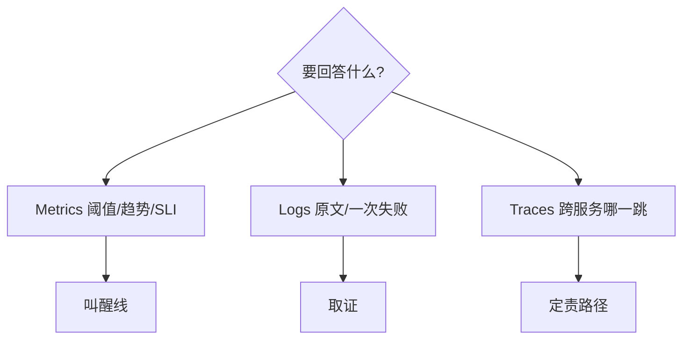
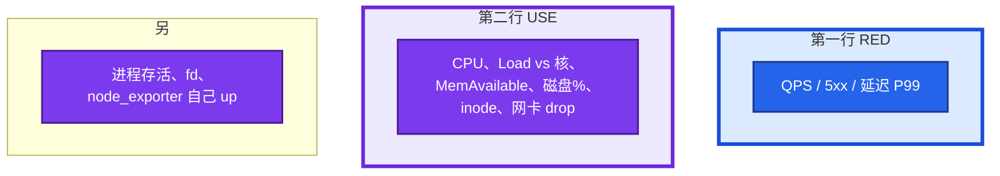
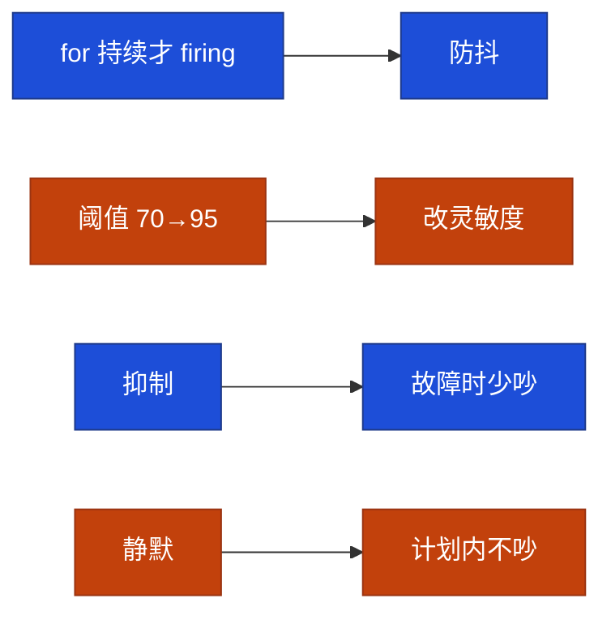

# 21｜监控与告警 · 练习题

先对照 [知识点](知识点.md)：**先 §2 总图，再 §4 三支柱，再 §5 SLI，再 §8 疲劳**。能讲清「叫不叫 / 用哪根支柱」再谈规则细节。每题标了覆盖范围：

| 标记 | 含义 |
|------|------|
| **核心** | 不懂整章就没建立起来 |
| **必会** | 值班和面试都要能讲 |
| **常用** | 线上会反复碰到 |
| **常考** | 白板和追问的高频口径 |

## 本题目录

- [Q1 叫醒线](#q1)
- [Q2 Metrics / Logs / Traces](#q2)
- [Q3 SLI / SLO / Budget](#q3)
- [Q4 黄金信号 / 面板](#q4)
- [Q5 风暴与降噪](#q5)
- [Q6 告警疲劳专钉](#q6)
- [Q7 黑盒](#q7)
- [Q8 Pull / Push / Pushgateway](#q8)
- [Q9 盘满预测与 Counter](#q9)
- [Q10 图与告警同源](#q10)
- [Q11 活动高峰红线](#q11)
- [Q12 默画总图](#q12)
- [合上书](#合上书)

---

## Q1

**★★★★★｜哪些告警该半夜打电话？哪些不该？**

**覆盖**：核心 · 必会 · 常考

**对应**：知识点 §5 · §8 · §10

### 场景

群里 CPU 70%、磁盘 60%、某从库延迟 200ms、登录成功率从 99.9% 掉到 80%。值班不知该不该打给老板。

### 完整解答

**一句话**：叫醒线对齐玩家能不能玩、数据会不会丢、会不会很快不可恢复——对齐 SLI，不是对齐数字圆不圆。

```mermaid
flowchart TB
    subgraph call ["叫醒 P0/P1"]
        a[探活失败：登录/支付/入口]
        b[登录、支付跌破 SLI]
        c[磁盘 predict 24h 内满]
        d[OOM 风暴]
        e[证书 ≤7 天]
    end
    subgraph nocall ["不叫醒"]
        f[单机 CPU 70% 且业务曲线正常]
        g[磁盘 60%]
        h[已被 InstanceDown 抑制的进程告警]
    end
    classDef bad fill:#DC2626,stroke:#7F1D1D,stroke-width:2px,color:#fff
    classDef ok fill:#334155,stroke:#0F172A,stroke-width:2px,color:#fff
    class a,b,c,d,e bad
    class f,g,h ok
    style call fill:#FEF2F2,stroke:#DC2626,stroke-width:4px
    style nocall fill:#F1F5F9,stroke:#334155,stroke-width:4px
```

从库 200ms：看是不是同步要求 RPO=0、玩家读是否打到从。有 SLO 跟 SLO，没有就不要发明 P0。靠 AlertManager 分级，不靠群。

### 再追问

- CPU 85% 持续 5 分钟？——有 `for: 5m` 的 warning 可以 IM；没有业务损伤仍不必电话。登录已经跌了就走业务告警，不要两条都打电话。
- 磁盘 60%？——不叫；看 predict 和 inode。

---

## Q2

**★★★★★｜Metrics / Logs / Traces 各回答什么？告警主战场是谁？**

**覆盖**：核心 · 必会 · 常考

**对应**：知识点 §4

### 场景

有人要把所有 ERROR 日志推 IM 当告警；另有人要把 `user_id` 打进 Prometheus 标签以便「精确定位」。支付 P99 高，有人只盯单机 CPU。

### 完整解答

**一句话**：Metrics 定现在/趋势和叫不叫；Logs 定发生过什么；Traces 定这一次走了哪——告警主战场是 Metrics。



| 错法 | 后果 | 正法 |
|------|------|------|
| ERROR 全量推 IM | 疲劳风暴 | Metrics 阈值 + 少量致命关键字 |
| Metrics 标签塞 user_id | 高基数炸存储 | 聚合指标 + Logs 按 request_id |
| 有 Traces 就不做黑盒 | 连不上时 Trace 也没有 | 黑盒仍要 |
| 只看单机 CPU 解支付慢 | 定不了哪一跳 | Traces / 下游 RED |

### 再追问

- 登录成功率跌了第一步？——先 Metrics（SLI 曲线）+ 黑盒，再按 request_id 下钻 Logs。
- 三支柱必须同一厂商吗？——不必；边界比品牌重要。

---

## Q3

**★★★★★｜SLI / SLO / Error Budget 怎么讲？叫醒线怎么对齐？**

**覆盖**：核心 · 必会 · 常考

**对应**：知识点 §5

### 场景

被问 Error Budget。有人说「主机 CPU SLO 99%」。这章不要讲成 K8s 可观测专题。

### 完整解答

**一句话**：SLI 测什么，SLO 内部目标，Budget=1−SLO；叫醒线对齐登录成功率这类 SLI，不是 CPU。

| 词 | 登录例子 |
|----|----------|
| SLI | 成功登录 / 总尝试；或登录 P99 |
| SLO | ≥99.9% |
| Budget | 约每月 **43.2 分钟** |
| SLA | 对外合同，通常更松 |

```text
99.9% → 一个月 43200 分钟 × 0.1% = 43.2 分钟
预算充足可发；将尽冻非紧急；耗尽复盘
```

主机 CPU 是饱和信号，最多 P2，**不能**当玩家体验 SLO。滚动窗口 / burn rate / 发布闸门细算 → K8s 18 / 游戏 08。

### 再追问

- 支付该用什么 SLI？——成功率 + 耗时分位，不是连接数绝对值。
- Budget 和今晚失败 10 分钟？——高失败率在吃 Budget；该叫人、该考虑冻非紧急发布。

---

## Q4

**★★★★★｜黄金信号是什么？主机先看什么？面板怎么摆？**

**覆盖**：核心 · 必会 · 常考

**对应**：知识点 §6 · §2

### 场景

新环境只接了 Prometheus，Grafana 空的。问「机器先看什么」，另有人要你背四黄金信号。

### 完整解答

**一句话**：入口看 RED（QPS/5xx/延迟），主机看 USE（CPU/Load/MemAvailable/磁盘/inode），另盯 fd 和 exporter up；面板第一行 RED，第二行 USE。

四信号：Latency、Traffic、Errors、Saturation。主机对 USE，入口对 RED。



告警：探活连续失败 P0；盘将满 P1/P0；OOM、磁盘 IO error P1。Load 高 CPU 不高先看 [06](../06-CPU与Load/)。内存看 **MemAvailable**。发布打 Annotation。平均值不当延迟 SLA。定域手法见 [21](../21-性能观测与排障/)。

### 再追问

- inode 和 fd 为什么进黄金？——`df -h` 还有空间，inode 满或 fd 满，日志和 Nginx 照样写失败。
- RED 正常 USE 黄？——容量类；活动窗口可能该 Silence。

---

## Q5

**★★★★★｜告警太多没人看了，怎么治？抑制怎么用？**

**覆盖**：核心 · 必会 · 常考

**对应**：知识点 §8 · §10

### 场景

一台宿主机内核 hang，四十条 IM。之后支付失败混在里面没人点。

### 完整解答

**一句话**：分组 + `for` 防抖 + 分级路由 + 抑制；InstanceDown 应抑制同 instance 子告警；人只该看到「机器没了」。

四步：① 分组 group_by instance/alertname；② `for` 防抖；③ 分级路由，P0 电话少数人，P3 邮件；④ 每月删从未处理的规则。

抑制：父告警触发时不发子告警。`InstanceDown` 抑制同 instance 的进程 down、CPU、disk。

```yaml
inhibit_rules:
  - source_match:
      alertname: InstanceDown
    target_match_re:
      alertname: .+
    equal: ['instance']
```

静默是维护窗口，不是抑制。长期 Silence = 删规则。

### 再追问

- 漏报怎么办？——补黑盒、补心跳、review 覆盖（登录/支付/证书/盘/OOM）。疲劳和漏报要一起治。
- 没有抑制会怎样？——故障越大噪音越大。

---

## Q6

**★★★★★｜告警疲劳是什么？抑制、静默、`for`、放宽阈值差在哪？**

**覆盖**：核心 · 必会 · 常考

**对应**：知识点 §8（最易混）

### 场景

面试官追问：「你们告警太多，是不是规则写少了？把 CPU 阈值改成 95% 算不算治理疲劳？」另有人把活动窗口 Silence 开了一周忘关。

### 完整解答

**一句话**：疲劳 = 不该叫的天天叫 + 该叫的被淹没；不是规则太少。`for` 是防抖，放宽阈值是改灵敏度；抑制是故障时少吵，静默是计划内不吵。



| 来源 | 治法 |
|------|------|
| 静态磁盘 70% 永远黄 | predict_linear |
| 无抑制四十条 | InstanceDown 抑制 |
| 活动容量当 P0 | Silence 仅容量 P2 |
| 日志 ERROR 全推 IM | 回到 Metrics 叫醒线 |
| Silence 开一周 | 到期自动解除；长期=删规则 |

### 再追问

- 只删规则行不行？——会漏报；覆盖率要一起 review。
- 所有人电话更保险吗？——等于没人接。

---

## Q7

**★★★★★｜blackbox 干什么？机器指标很绿入口却挂了？**

**覆盖**：核心 · 必会 · 常用

**对应**：知识点 §9 · §2.2

### 场景

node_exporter 全绿。玩家打不开登录页。SLB 后端指向了旧 IP。

### 完整解答

**一句话**：没有 blackbox，DNS/LB/证书配错时内部指标仍可能全绿。

白盒看进程自报；**黑盒从外往里探**。用途：登录 URL、TCP 端口、DNS、TLS 剩余天数。

```promql
probe_success == 0
probe_ssl_earliest_cert_expiry - time() < 7 * 24 * 3600
```

配置：job 的 target 是 URL，relabel 打到 blackbox:9115。连续失败 P0。7 天 P1，更短 P0。

### 再追问

- 探 `/health` 返回 200 但登录仍失败？——health 没走到登录依赖。黑盒要对「玩家点的那个 URL」。
- 有 Traces 还要黑盒吗？——要；连不上时没有 Trace。

---

## Q8

**★★★★☆｜Prometheus 拉取和 Zabbix 推送差在哪？Pushgateway 何时用？**

**覆盖**：必会 · 常用 · 常考

**对应**：知识点 §7

### 场景

「为什么不用 Zabbix，我们机房防火墙入站很难开。」

### 完整解答

**一句话**：Prom 拉取目标活着才能采到；短任务用 Pushgateway，Job 结束要删序列。

Prom **拉**：Server 访问 `/metrics`，`curl` 即排障，服务发现自然。目标必须可达。  
Zabbix **推**：Agent 出站上报，防火墙好做，发现和标签模型弱一些。

短任务（CI、批处理）跑完就没了 → 推到 **Pushgateway**，Prom 再拉网关。序列 **不会自动过期**，Job 结束要删，否则「永远成功」。

### 再追问

- `curl :9100` 不通算采到了吗？——不算。
- 能不能全部改 Push？——能，但失去「目标活着才能被拉到」这份探活。主机标配仍是 node_exporter + 拉。

---

## Q9

**★★★★☆｜磁盘告警该用使用率还是 predict_linear？Counter 为什么不能直接阈值？**

**覆盖**：必会 · 常用

**对应**：知识点 §7 · §9

### 场景

磁盘 70% 告了两周没人理。某天活动日志把盘 2 小时打满。另有人告警 `http_requests_total > 100000000`，一直 firing。

### 完整解答

**一句话**：静态 70% 会疲劳，用 predict_linear 预测 24h 内满；Counter 只增，必须 `rate()`。

```promql
predict_linear(node_filesystem_avail_bytes[6h], 24*3600) < 0
1 - avg(rate(node_cpu_seconds_total{mode="idle"}[5m])) by (instance)
```

24h 内满 → P1。已经 95%+ 或 inode 满 → P0。日志盘满止血在 [23](../23-日志运维/)。

Counter 是累计值，阈值永远会破。重启归零 `rate()` 也能接上。跨实例 P99 用 Histogram，Summary 加不起来。

### 再追问

- 6h 窗口？——太短脉冲误报；太长突发来不及。可 6h→24h，再加 1h→2h 紧急线。
- 内存看 MemFree？——错，看 MemAvailable。

---

## Q10

**★★★★☆｜Grafana 只给领导看图，告警却在另一个系统，行不行？**

**覆盖**：常用 · 常考

**对应**：知识点 §9 · §10

### 场景

漂亮 Dashboard，告警还是脚本 SSH 扫磁盘。另有人问 node_exporter 挂了谁告警。

### 完整解答

**一句话**：图和告警最好同源 PromQL；监控自己挂了靠 `up==0` 和外层 Watchdog。

图和告警最好同源：同一 PromQL，避免「图上已经红了脚本还没跑」。领导看板可以糙；值班必须：RED+USE、Annotation、跳得回这条时序。

node_exporter 挂了：Prometheus 对 scrape 失败本身要有 `up == 0`。监控系统挂了要有外层探活（另一套 blackbox 或云监控），否则全员虚假绿色。Watchdog / Deadman's Snitch。

### 再追问

- Grafana 告警可以吗？——可以；主机环境更常见 Prom rule + AlertManager。
- 为什么要 Watchdog？——规则引擎挂了，业务告警也不会响。

---

## Q11

**★★★★☆｜活动高峰 CCU 涨，告警怎么避免「全员 P0」？红线是什么？**

**覆盖**：必会 · 常用 · 常考

**对应**：知识点 §8.4 · §10.5

### 场景

活动开始 CPU、连接数、QPS 一起破静态阈值，电话打爆，全是预期负载。登录入口其实已经在 5xx。

### 完整解答

**一句话**：活动 Silence 容量类 P2，探活/登录/支付/盘/证书/OOM 不静默。

静态阈值按日常定，活动必炸。做法：活动窗口 **Silence** 容量类 P2；业务 SLI（登录成功率、支付、错误率、blackbox）**不静默**；发布和活动开关打 Annotation。

红线：探活、登录、支付、盘将满、证书、OOM。CPU 和 CCU 涨不是红线，除非伴随错误率和延迟破 SLO。

预期高峰不是关掉监控，是关掉「我们知道会高」的那些，留下「不该坏」的那些。

### 再追问

- Silence 忘了打开？——日历 + 工单到期自动解除。长期 Silence 等于删除规则。
- 忘了开 Silence？——全员电话，和没降噪一样。

---

## Q12

**★★★★★｜合上书默画：信号怎么走到人？疲劳四刀挂在哪？**

**覆盖**：核心 · 必会 · 常考

**对应**：知识点 §2.0 · §2.1

### 场景

白板面试：画监控架构，并指出三支柱、叫醒线、降噪落在哪一段。

### 完整解答

**一句话**：玩家→黑盒+白盒→Prom 规则→AM（分组/for/抑制/静默）→P0～P3；三支柱横贯选型；疲劳四刀在 AM 段。

```text
三支柱 M/L/T
    │
玩家 ──黑盒──┐
白盒 USE/RED ┼─▶ Prom Pull + for ─▶ AM ─▶ P0电话 / P1IM / P2 / P3
中间件/进程 ─┘         │
                       └─ 分组 · 抑制 · Silence · 砍规则
叫醒线：对齐 SLI（登录/探活），不对齐 CPU%
```

验收：能指出「没有黑盒箭头会怎样」「一台挂了抑制在哪发生」「活动 Silence 挂在哪、什么不能挂」。

### 再追问

- 定域排障去哪章？——[21](../21-性能观测与排障/)。
- PromQL 深水去哪？——K8s 18。

---

## 合上书

- [ ] 能默画 §2.0：黑盒/白盒/Prom/AM/叫醒线；疲劳四刀在哪
- [ ] 能讲清 Metrics/Logs/Traces 边界；告警主战场是谁
- [ ] 能讲 SLI/SLO/Budget；99.9%≈月 43.2 分钟；CPU 不当玩家 SLO
- [ ] 能判断哪些该半夜叫醒；CPU 70%、磁盘 60% 呢
- [ ] 能讲疲劳四步；抑制 vs 静默 vs `for`；一台挂了人该看到几条
- [ ] 能说明 blackbox 补哪块盲区；证书用 expiry 倒计时
- [ ] 活动高峰哪些 Silence、哪些死也不静默；监控自己挂了谁叫人

七条都能口述，这一章练习就过了。下一章：[23 日志运维](../23-日志运维/)。
