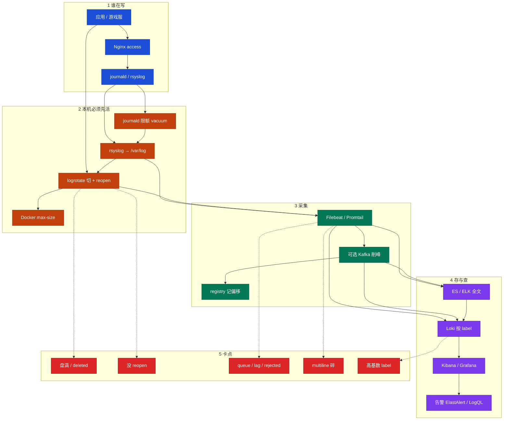
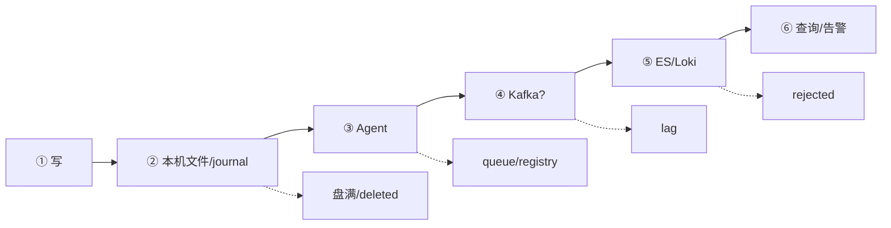
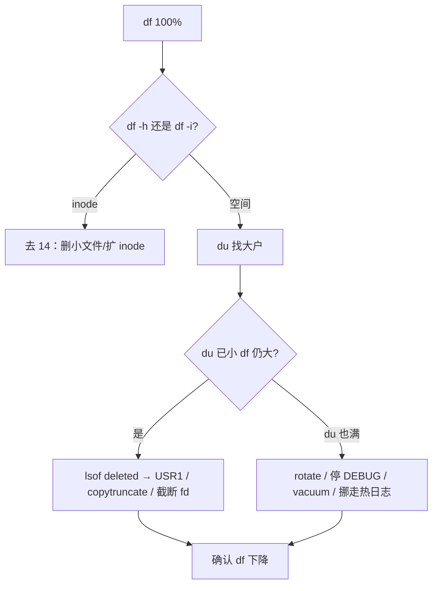
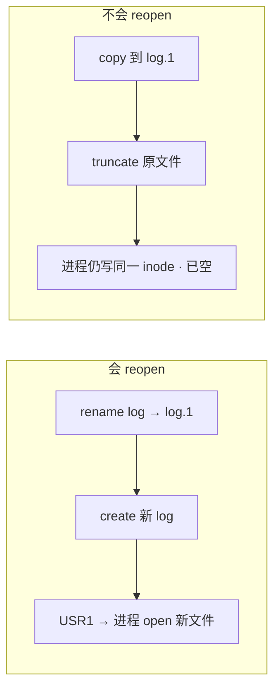
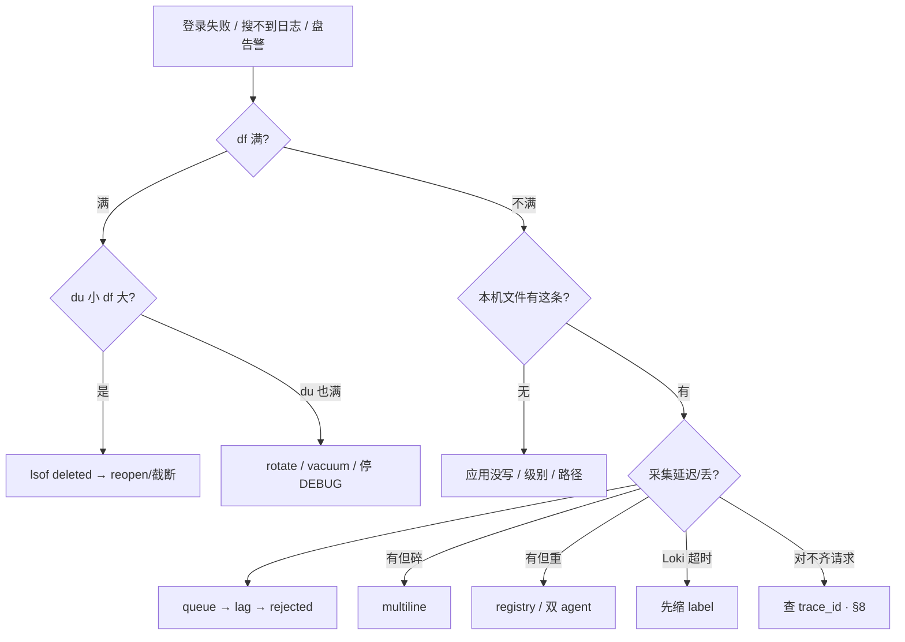

# 日志运维

> **这章解决什么**：活动两小时 `/var` 100%、登录失败；有人 `rm` 大日志，`du` 立刻小了，`df` 纹丝不动；Kibana 缺最近十分钟 ERROR，有人喊「ES 慢」——本机死了、轮转没 reopen、还是采集管道某段堵？  
> **读法**：**先看总图** → **再认名词** → **再分节抠盘满三步 / rotate+reopen / 采集按段 / JSON 关联**。  
> **刻意不展开**：块满 / inode / deleted 的 inode 原理 → [09](../09-文件系统与inode/)；await / 脏页 → [08](../08-磁盘与IO/)；探活与主机告警分级 → [22](../22-监控与告警/)；DaemonSet vs Sidecar、kubelet 轮转 → [03-19 日志管理](../../03-Kubernetes/19-日志管理/)；ES 分片 / ILM 深调 → [02-09](../../02-中间件与数据库/09-Elasticsearch/)；审计规则本身 → [27](../27-Linux安全加固/)；校时 → [25](../25-NTP与时间同步/)。

---

## 本章目录

1. [本章定位](#1-本章定位)
2. [先看总图：一条日志从写到查](#2-先看总图一条日志从写到查) ← **开篇必读**
   - [2.0 全章知识串图](#20-全章知识串图一张把细节串起来) ← **架构总览**
   - [2.1 坐标系](#21-一张总图本机先活--采集--检索)
   - [2.6 完整走读：盘满](#26-完整走读活动高峰盘满登录失败)
   - [2.7 完整走读：搜不到](#27-完整走读kibana-缺十分钟-error)
3. [名词扫盲（对照总图认词）](#3-名词扫盲对照总图认词)
4. [三源：journald / rsyslog / 应用文件](#4-三源journald--rsyslog--应用文件)
5. [du 变小 df 不降：本章最易混](#5-du-变小-df-不降本章最易混) ← **重点精读**
6. [rotate + reopen：切割怎么真正生效](#6-rotate--reopen切割怎么真正生效)
7. [采集管道：queue → lag → rejected](#7-采集管道queue--lag--rejected)
8. [结构化日志与关联：trace_id 怎么串](#8-结构化日志与关联trace_id-怎么串) ← **重点**
9. [ELK vs Loki：谁搜玩家 ID](#9-elk-vs-loki谁搜玩家-id)
10. [定责决策树与命令速查](#10-定责决策树与命令速查)
11. [落地：限额 · rotate · agent · Docker](#11-落地限额--rotate--agent--docker)
12. [去哪章继续学](#12-去哪章继续学)
13. [面试 · 易错 · 数字](#13-面试--易错--数字)
14. [合上书](#合上书)

---

## 1. 本章定位

| 章 | 负责 |
|----|------|
| **23（本章）** | 本机限额 / 轮转 reopen / 盘满止血、采集按段定责、JSON 字段与 trace 关联、ELK vs Loki 选型 |
| **09** | deleted fd、`df≠du` 的 inode 账本细节 |
| **08** | 盘慢、await、脏页（「写不动」若是 IO 慢，回 08） |
| **22** | 探活 / SLO / 主机告警——**叫不叫人**看探活，日志解释**为什么** |
| **04-19** | K8s 集群日志形态（DaemonSet / Sidecar / kubelet 轮转） |

本章是**日志线入口**。后面所有「rm 了还满」「堆栈碎成 40 行」「搜玩家 ID 用谁」，都建立在「一条日志从应用到检索」这张图上。

🎯 **值班签名**：磁盘 100% / 搜不到刚才 ERROR——**先本机活**（`df → du → lsof deleted`），再 `queue → lag → rejected`，**别先装 Filebeat、别先猜 ES 慢**。

**本章主线（排障就按这三步想）：**

1. **本机先活**：journald 限额、logrotate + reopen、Docker `max-size`。
2. **盘满三步**：`df` → `du` → `lsof deleted`。
3. **采集按段查**：Filebeat queue → Kafka lag → ES rejected；结构化用 `trace_id` 串请求。

**读完你能：**

- 合上书默画 §2.0：谁在写 → 本机先活 → 采集 → 存查。
- 盘满按三步止血；会配 USR1 vs copytruncate；Docker 必设上限。
- 丢失按段定责；JSON 必备字段 + `trace_id` 关联讲得清。
- 搜玩家 ID 走 ELK；Loki 先缩 label，禁止 `player_id` 当 label。

---

## 2. 先看总图：一条日志从写到查

> **正确开篇顺序**：先有全局画面，再认词，再抠细节。  
> 先看 **§2.0 全章串图**（考点挂一张板上），再看 **§2.1 坐标系**，再用 **§2.6 / §2.7 走读**把现场串起来。

### 2.0 全章知识串图（一张把细节串起来）

> 🎯 **合上书要能默画这张。** 蓝=谁在写 · 橙=本机必须先活 · 绿=采集 · 紫=存查 · 红=卡点。  
> 若预览仍报错，以下面 **ASCII 一页板** 为准。



**读图路线：**

| 段 | 记住 |
|----|------|
| ① | 系统日志与业务日志**分目录**，别挤 `messages`（§4） |
| ② | **没有「先上采集」越过本机限额**——盘满了 Filebeat 也写不动（§5、§6） |
| ③ | 一台一个 agent；registry 别删；轮转后 inode 变（§7） |
| ④ | 搜玩家 ID → ELK；按 service/level → Loki（§9） |
| ⑤ | 满 / 没 reopen / 管道堵 / 多行碎 / 高基数 → 定责树（§10） |

```text
┌──────────────────────────────────────────────────────────────────────────┐
│                     22 一张板：从写到查到定责                              │
├─────────────┬────────────────────┬───────────────────────────────────────┤
│  谁在写     │  本机先活          │  采集 → 存查                          │
│  应用/Nginx │  journal 限额      │  Filebeat/Promtail → Kafka?           │
│  journald   │  rsyslog /var/log  │  → ES 全文 / Loki label               │
│  rsyslog    │  rotate+reopen     │  → UI / 告警                          │
│             │  Docker max-size   │                                       │
├─────────────┴────────────────────┴───────────────────────────────────────┤
│  卡点：盘满·deleted · 没reopen · queue/lag/rejected · multiline · 高基数 │
│  关联：JSON + UTC + trace_id 串 Metrics/Traces（§8）                     │
└──────────────────────────────────────────────────────────────────────────┘
```

---

### 2.1 一张总图（本机先活 → 采集 → 检索）

假设：逻辑服往 `/var/log/game/server.log` 写一行 JSON；Filebeat 读走；进 ES；客服在 Kibana 搜 `player_id`。

**怎么读这张路径：**

- **左段**：本机——限额、切割、reopen；这里挂了，右边全白扯
- **中段**：agent 按偏移读文件；卡在 queue / 网络 / 下游
- **右段**：倒排或 label 索引；关联靠字段，不靠「人肉对时间」

```text
应用 / Nginx / systemd
═══════════════════════════════════════════════════════════════

 ① write / stdout
        │
        ▼
 ② 本机文件 / journal（必须有限额）
        │  logrotate：rename + reopen 或 copytruncate
        │  进程还握旧 inode → df 不降（§5）
        ▼
 ③ Filebeat / Promtail（registry 记「读到哪」）
        │  multiline 合成堆栈
        │  queue 满 → 背压 / 丢（看策略）
        ▼
 ④ （可选）Kafka 削峰 —— lag 涨 = 消费跟不上
        ▼
 ⑤ ES（全文）或 Loki（label）
        │  rejected / 磁盘 / 映射冲突
        ▼
 ⑥ Kibana / Grafana 查询 · 告警
        │  关联：同一 trace_id 串日志 + 指标 + 链路（§8）
```



> **记住**：排障顺序永远是 **本机 → agent → 中间件 → 存储**，不要从 Kibana「搜不到」直接跳到「扩 ES」。

---

### 2.6 完整走读：活动高峰盘满，登录失败

> 用现网角色串一遍。**只保留这一版盘满走读。**

**现场**：活动开服 2 小时。监控报游戏服 `/var` 100%。登录超时。群里有人已经 `rm /var/log/game/*.log`，喊「du 小了怎么还满」。另有人说「先把 Filebeat 装上好查」。

| 步 | 你在哪 | 敲什么 | 屏幕说明什么 | 下一步 |
|----|--------|--------|--------------|--------|
| 1 | 故障机 | `df -h /var && df -i /var` | 空间满还是 inode 满 | 空间满继续；inode 满去 14 |
| 2 | 同上 | `du -sh /var/log/* \| sort -h \| tail` | 哪个目录最大 | 对上游戏日志 |
| 3 | 同上 | `lsof \| grep deleted \| head` | 进程是否还握已删大文件 | 有 → reopen / 截断 fd |
| 4 | 同上 | 会 reopen：`nginx -s reopen` 或 `kill -USR1 $(pid)` | 新文件开始长，`df` 应降 | 不会 reopen → copytruncate |
| 5 | 同上 | journal：`journalctl --disk-usage` | journal 是否吃光 | vacuum + 改 `SystemMaxUse` |
| 6 | **别做** | 先 kill 逻辑服；先加盘当根因；先装 Filebeat | 机器写不动，采集也挂 | 本机活了再谈采集 |

**输出长什么样（deleted）：**

```text
game-serv 12345  moonton  3w  REG  8,1  8589934592  1234567 /var/log/game/server.log (deleted)
#                 ↑写fd              ↑仍占 ~8GB —— 所以 df 不降
```

**走读验收**：能口述「`rm` 只拆目录项，inode 还在；释放靠 reopen 或截断握着的 fd」。原理细节挂 [09](../09-文件系统与inode/)，本章负责**止血动作**。

---

### 2.7 完整走读：Kibana 缺十分钟 ERROR

**现场**：客服要查某玩家刚才登录失败。Kibana 里最近 10 分钟没有对应 ERROR。有人猜「ES 慢」。本机 `df` 正常。

| 步 | 查哪段 | 看什么 | 定责 |
|----|--------|--------|------|
| 1 | 本机文件 | `tail` 文件里**有没有**这条 ERROR | 没有 → 应用没打 / 级别关了 / 写错路径 |
| 2 | Filebeat | `systemctl status filebeat`；registry；queue 指标 | agent 挂 / 没读到 / queue 满 |
| 3 | Kafka | `consumer-groups --describe` 的 **lag** | 消费跟不上 |
| 4 | Logstash / ES | rejected、磁盘、线程池 | 存储拒收 |
| 5 | 查询侧 | 时间范围、时区、index 名、字段名 | 人查错（UTC vs 本地，见 25） |
| 6 | 关联 | 有 `trace_id` 吗？网关 access 有没有同 ID | 见 §8 |

```text
本机文件有 ──► agent 没走 ──► queue 满？ registry？ 路径？
本机文件无 ──► 应用没写 / DEBUG 关错成全关 / 打到别的目录
文件有且 agent 正常 ──► Kafka lag / ES rejected
全都正常 ──► 查错 index / 时区 / 字段
```

> **别混**：缺日志 ≠ 一定 ES 慢。先证明「文件里有、哪一段丢了」。

---

## 3. 名词扫盲（对照总图认词）

对照 §2 总图，值班里听到这些词时对上位置。

| 词 | 在图上哪 | 一句话 |
|----|----------|--------|
| **journald** | ①→② | systemd 服务 stdout/日志；生产必须 `SystemMaxUse` |
| **rsyslog** | ①→② | 系统 `messages`/`secure`/`cron`；业务别挤进来 |
| **logrotate** | ② | 按日/按大小切文件；切完必须 **reopen** 或 copytruncate |
| **reopen / USR1** | ② | 让进程关掉旧 inode、打开新路径——空间才能真正还 |
| **copytruncate** | ② | 不会 reopen 时：拷贝再清空原文件；可能丢/重复一行 |
| **deleted fd** | ② 卡点 | 目录项没了，进程还握着写 fd → `du`↓`df` 不降 |
| **Filebeat / Promtail** | ③ | 读文件往外送；一台一个；靠 registry 记偏移 |
| **registry** | ③ | 删了 = 重启从头读 =「昨天又进一遍」 |
| **multiline** | ③ | 把堆栈多行合成一条事件 |
| **queue / lag / rejected** | ③→⑤ | 丢失定责三段：agent 积压、Kafka 落后、ES 拒收 |
| **label（Loki）** | ⑤ | Loki **只索引** label；高基数（player_id）禁止 |
| **trace_id** | ⑥ 关联 | 同一次请求在网关/逻辑/DB 日志里的共同钥匙 |
| **热温冷** | ⑤ | 保留策略：热可查、温便宜、冷归档/删 |

**值班现象对照：**

| 群里说的 | 技术含义 | 第一刀 |
|----------|----------|--------|
| 「rm 了还满」 | deleted fd | `lsof \| grep deleted` |
| 「搜不到刚才的 ERROR」 | 采集延迟/丢或查错 | 本机文件 → queue → lag → rejected |
| 「堆栈碎成 40 条」 | multiline 没配 | 行首 pattern |
| 「/run 满了 ssh 卡」 | journal 没限额 | vacuum + `SystemMaxUse` |
| 「活动缺 10 分钟日志」 | 管道某段堵 | 按段查，不猜 ES |
| 「同一请求对不上」 | 缺 `trace_id` / 时区乱 | §8 结构化关联 |

三件事不要混：

| 事 | 干什么 |
|----|--------|
| **本机先活** | journald 限额、rsyslog、logrotate 切 + reopen |
| **采集** | Filebeat / Promtail 把文件交出去 |
| **检索与告警** | ELK 全文 / Loki 按 label；日志解释为什么，探活决定叫不叫人（21） |

> **记住**：本机先活，再谈采集。`du` 变小、`df` 不降，先找 deleted fd，不要加盘。

---

## 4. 三源：journald / rsyslog / 应用文件

**一句话：** systemd 服务进 journald（必限额）；认证/cron 进 rsyslog；游戏业务独立目录 + logrotate——三套别抢一个文件。

### 4.1 谁写到哪

| 来源 | 典型路径 | 谁管轮转/限额 |
|------|----------|----------------|
| systemd 单元 stdout | journal | `SystemMaxUse` / vacuum |
| 认证 / cron / 内核 | `/var/log/secure`、`cron`、`messages` | rsyslog + logrotate |
| 游戏 / 自研 | `/var/log/game/`、`/data/logs/` | **应用自己的** logrotate |
| Nginx | `access.log` / `error.log` | create + `postrotate` USR1 |
| Docker json-file | overlay 下容器日志 | daemon `max-size`/`max-file` |

**打个比方**：本机日志像厨房下水——先通管道（rotate/reopen），再谈装净水器（Filebeat）；下水道堵了，净水器也转不动。

### 4.2 journald 必做

```ini
# /etc/systemd/journald.conf
[Journal]
Storage=persistent
SystemMaxUse=1G
SystemKeepFree=500M
MaxRetentionSec=7day
```

```bash
journalctl --disk-usage
journalctl --vacuum-size=500M
journalctl -u nginx -n 100 --no-pager
```

| 参数 | 生产怎么用 | 改错会怎样 |
|------|------------|------------|
| `Storage=persistent` | 落盘可查历史 | volatile 重启丢、占 tmpfs |
| `SystemMaxUse` | 按盘封顶，常见 04G | 吃光 `/var` 或 `/run` |
| 只 vacuum 不改限额 | **不够** | 还会满（compact 式翻车） |

> **别混**：`journalctl -f` 是排障，不是长期采集方案。无限 `-f` + 无限额 = 把自己写挂。

### 4.3 rsyslog 与业务隔离

系统日志可以离机：`*.* @@logserver:514`（TCP 双 `@`）。  
**应用不要 `print` 进 syslog 挤 `messages`**——一天 50G 的现场几乎都是这。游戏业务 → 独立目录。

两套 agent / 两套 rotate 盯同一个文件会打架：一边 rename，一边还在写旧 inode。

### 4.4 面试怎么说

「systemd 走 journald，必须 SystemMaxUse；认证 cron 走 rsyslog；游戏独立目录加 logrotate。业务绝不挤 messages。」

---

## 5. du 变小 df 不降：本章最易混

> 🎯 **本章最难、必须懂。** 合上书要能默画：`rm` → 目录项没了 → 进程仍握 fd → inode 占盘 → `lsof deleted` → reopen / 截断。

### 5.1 一例钉死

① **最常见例子**：活动服 `server.log` 长到 20G。有人 `rm`。`du -sh /var/log/game` 立刻变小。`df -h /var` 仍 100%。登录继续失败。

② **一句话定义**：删的是**目录项（名字）**；进程打开的 **inode + 数据块还在**，直到最后一个 fd close（或 truncate 该 fd）。

③ **对照命令怎么认：**

```bash
df -h /var
du -sh /var/log/game
lsof | grep deleted
# 或：lsof +D /var/log/game 2>/dev/null | grep -i deleted
```

```text
COMMAND   PID    USER   FD   TYPE DEVICE    SIZE/OFF NODE NAME
game-serv 12345  run    3w   REG  8,1     21474836480 884521 /var/log/game/server.log (deleted)
```

| 你看到 | 说明 |
|--------|------|
| `du` 小、`df` 大 | 高度疑似 deleted 或别的隐藏占用（对账四条路见 09） |
| `(deleted)` + 巨大 SIZE | **就是它**；PID 是谁在握 |
| `df -i` 100% 而 `df -h` 还有空 | inode 满，不是本章 deleted 主路径 → 09 |

④ **易错一句钉死（只写一次）：**  
> **别混**：`du` 看目录树还「看得见」的名字；`df` 看文件系统已分配块。`rm` 只骗过 `du`，骗不过还握着 fd 的 `df`。

### 5.2 止血顺序（本机）



紧急截断（确认 FD 号后）：

```bash
# 例：fd=3 仍指向已删大文件
> /proc/12345/fd/3
# 或 truncate -s 0 /proc/12345/fd/3
```

**最后才**重启该进程——游戏逻辑服优先 reopen/截断，避免活动中杀进程。

### 5.3 和 14 / 05 的边界

| 问题 | 去哪 |
|------|------|
| 为什么名字没了块还在（inode 账） | [09](../09-文件系统与inode/) |
| 盘很慢、await 高、脏页 | [08](../08-磁盘与IO/) |
| 日志怎么轮转、USR1、copytruncate、采集 | **本章** |

### 5.4 现场口算：看 SIZE 知还了多少

```text
# 止血前
df -h /var
# /dev/sda3  50G  50G  0  100% /var

lsof | grep 'server.log (deleted)'
# game-serv 12345 ... 3w ... 21474836480 ... (deleted)   ← 约 20G

# reopen 或截断 fd 后
df -h /var
# /dev/sda3  50G  30G  20G  60% /var   ← 约还回 20G，对上 SIZE
```

若 `lsof` 显示 20G deleted，但 `df` 只降了 2G——还有别的 deleted、或别的大户（容器 overlay、journal、core 文件）。继续 `lsof | grep deleted` 和 `du`，别宣布胜利。

容器场景：在**宿主机**看容器进程的 deleted；只进容器里 `df` 可能看到的是另一层文件系统。细节挂 07 / 04-19，本章记住「谁写文件就在谁的命名空间查」。

**面试怎么说**：「rm 后 df 不降我先 lsof deleted；释放靠 reopen 或截断 fd，不先加盘、不先杀逻辑服。还了多少要对上 SIZE。」

---

## 6. rotate + reopen：切割怎么真正生效

**一句话：** 会 reopen 用 USR1/`nginx -s reopen`；不会就 copytruncate——**有配置 ≠ 切了**。

### 6.1 两种合法策略

| 策略 | 机制 | 何时用 | 代价 |
|------|------|--------|------|
| `create` + `postrotate` 发 USR1 | rename 旧文件 → 建新空文件 → 进程重新 open | nginx、rsyslog、会处理信号的服务 | 标准、几乎不丢行 |
| `copytruncate` | 把内容拷走 → **原地 truncate 原 inode** | 自研游戏服不懂 USR1 | 拷贝窗口可能丢/重复一行 |



> **记住**：会 reopen 就不要用 copytruncate。「图省事全 copytruncate」会在高峰多丢行。

### 6.2 自研服示例（copytruncate）

```
/var/log/game/*.log {
    daily
    rotate 7
    missingok
    compress
    delaycompress
    copytruncate
    notifempty
    dateext
}
```

| 项 | 含义 |
|----|------|
| `daily` / `rotate 7` | 每天切，留 7 份 |
| `delaycompress` | 今天切的先不压，避免 reopen 窗口 gzip |
| `copytruncate` | 不会信号就靠它 |
| `dateext` | 后缀带日期，好找 |

### 6.3 nginx / rsyslog（USR1）

```
/var/log/nginx/*.log {
    daily
    rotate 14
    missingok
    compress
    delaycompress
    notifempty
    create 0640 nginx adm
    sharedscripts
    postrotate
        [ -f /var/run/nginx.pid ] && kill -USR1 `cat /var/run/nginx.pid`
    endscript
}
```

```bash
nginx -s reopen
logrotate -d /etc/logrotate.conf    # 调试：路径、权限、是否真会切
logrotate -f /etc/logrotate.d/nginx # 强制跑一次（慎用生产）
```

### 6.4 「配了但没切」检查单

1. cron / timer 是否在跑 logrotate？  
2. `logrotate -d`：路径通配是否匹配到文件？  
3. 权限能否 rename？SELinux AVC？（17）  
4. **进程是否 USR1？** 没 reopen → 继续写旧 inode，看起来「access.log 还在长、日期文件没有」。  
5. `notifempty` / `missingok` 会跳过空文件——对「10G 还在长」不是根因。

### 6.5 Docker json-file

```json
{
  "log-driver": "json-file",
  "log-opts": {
    "max-size": "100m",
    "max-file": "3"
  }
}
```

不设上限，活动 access 能把节点 **overlay 写死**。K8s 上 kubelet 轮转见 07-19；**裸 Docker 主机**必须自己在 `daemon.json` 设——别用 K8s 章代替。

### 6.6 按大小切 vs 按天切

| 方式 | 适合 | 注意 |
|------|------|------|
| `daily` | 访问量平稳 | 活动日单文件仍可能极大 |
| `size 100M` | 突发流量、单文件易爆 | 一天可能切很多次，注意 `rotate` 份数与盘 |
| 两者结合（部分配置支持） | 生产常见 | 以你发行版 logrotate 文档为准 |

游戏服活动日：**只靠 daily 不够**——上午就可能写满。活动前把 DEBUG 关干净，并确认 rotate 真在跑。

热日志、录屏、堡垒审计、etcd WAL **分盘**——日志把数据盘写满会次生故障（05 / 21）。

**面试怎么说**：「nginx 用 create+USR1；自研用 copytruncate。有配置还要看 cron 和 reopen。Docker 必须 max-size。活动日别只靠 daily。」

---

## 7. 采集管道：queue → lag → rejected

**一句话：** 丢失按 Filebeat queue → Kafka lag → ES rejected **逐段查**，不要猜。

### 7.1 管道长什么样

```text
文件 ──► Filebeat(queue + registry)
              │
              ▼
         Kafka? (lag)
              │
              ▼
         Logstash? 
              │
              ▼
         ES (rejected / 盘 / 映射)
```

| 段 | 现象 | 下一步 |
|----|------|--------|
| Filebeat queue 满 | 下游慢或网络断 | 调 bulk/背压；修 ES/网络 |
| Kafka lag 涨 | 消费跟不上 | 扩 consumer；查 Logstash |
| ES rejected | 映射冲突/磁盘/线程池 | ILM；修模板（03-09） |
| multiline 碎 | pattern 不对 | 对齐真实行首 |
| 重启重放昨天 | registry 删了 | 别删 registry |
| 双份日志 | 两 agent 盯同一路径 | 一台一个 |

### 7.2 Filebeat 要点

```yaml
filebeat.inputs:
- type: log
  paths:
    - /var/log/nginx/access.log
    - /var/log/app/*.log
  multiline.pattern: '^[0-9]{4}-[0-9]{2}-[0-9]{2}'
  multiline.negate: true
  multiline.match: after
  fields:
    service: game-server
    env: production
processors:
  - add_host_metadata: ~
output.elasticsearch:
  hosts: ["es-cluster:9200"]
  index: "logs-%{[fields.service]}-%{+yyyy.MM.dd}"
queue.mem.events: 4096
bulk_max_size: 2048
```

| 点 | 记住 |
|----|------|
| multiline | 行首是新事件；否则 after 追加——**pattern 对齐真实行首** |
| registry | `/var/lib/filebeat/registry` 持久化；删 = 重读历史 |
| close_renamed | 轮转后 inode 变，要正确关闭旧文件 |
| 一台一个 agent | 两套 Filebeat 同路径 = 重复 |

```bash
systemctl status filebeat
ls -la /var/lib/filebeat/registry
```

### 7.3 Kafka 削峰不是无限水坝

活动洪峰加 Kafka 挡尖刺合理。但：

- lag 持续涨 = 下游慢，不是「有 Kafka 就没事」
- 队列满要有策略：阻塞、丢弃、死信——**加 Kafka ≠ 一定不丢**

```bash
kafka-consumer-groups.sh --bootstrap-server kafka:9092 \
  --describe --group logstash-logs
```

### 7.4 Logstash 示意（JSON 少 grok）

```ruby
input {
  kafka {
    bootstrap_servers => "kafka:9092"
    topics => ["logs"]
    codec => "json"
  }
}
filter {
  date {
    match => ["@timestamp", "ISO8601"]
    target => "@timestamp"
  }
}
output {
  elasticsearch {
    hosts => ["es-cluster:9200"]
    index => "logs-%{[fields.service]}-%{+YYYY.MM.dd}"
  }
}
```

应用直接打 JSON → 少 grok。grok 失败进 `_grokparsefailure`——先改应用输出，再堆滤镜。

### 7.5 监控采集本身（别等客服喊）

采集挂了业务可能还「看起来正常」——直到有人要查日志。至少盯：

| 指标 | 正常感 | 异常动作 |
|------|--------|----------|
| Filebeat 进程 / 发往下游成功率 | up、成功率高 | 查输出、证书、ES 地址 |
| queue 占用 | 远低于上限 | 下游慢或网络；背压 |
| Kafka lag | 接近 0 或稳定小值 | 扩消费或查 Logstash/ES |
| ES indexing rejected | 0 | 映射/磁盘/线程池 |
| 本机日志目录增长率 | 有 rotate 后锯齿状 | 持续单文件暴涨 → rotate 失效 |

活动前演练：人为停 Filebeat 5 分钟，看告警是否响、恢复后是否补齐（取决 ack 与下游）。

> **记住**：一台一个 agent；删 registry = 从头重读。加 Kafka 不保证不丢。

**面试怎么说**：「丢了按 Filebeat queue、Kafka lag、ES rejected 查。堆栈用 multiline 行首日期。采集自己也要有指标，别等客服发现。」

---

## 8. 结构化日志与关联：trace_id 怎么串

> 🎯 **生产能不能搜、能不能串请求，看这节。** 合上书要能背必备字段 + 关联一句。

### 8.1 一例钉死（结构化）

① **最常见例子**：客服给一个 `player_id` 和大概时间。明文日志每行格式随版本变，Logstash grok 一直炸。另一边网关有 access，逻辑服有 ERROR，对不上是不是同一次登录。

② **一句话定义**：**结构化** = 一行一个 JSON 事件、字段稳定；**关联** = 同一次请求共用 `trace_id`（或 `request_id`），在网关 / 逻辑 / 下游日志里能搜到同一把钥匙。

③ **对照怎么认：**

```json
{
  "@timestamp": "2026-08-26T10:00:00.000Z",
  "level": "ERROR",
  "service": "game-server",
  "trace_id": "abc123",
  "span_id": "s9f3",
  "player_id": "12345",
  "message": "登录失败：token 过期",
  "error": "TokenExpiredError",
  "duration_ms": 42
}
```

| 字段 | 没有会怎样 |
|------|------------|
| `@timestamp` **UTC** | Kibana 按收割时间排，跨机房时间线错（校时见 25） |
| `level` | 告警无法按级别滤 |
| `service` | 索引/过滤拆不开 |
| `trace_id` | 和 Metrics/Traces、网关 access **串不起来** |
| `player_id` | 客服搜不到（注意脱敏） |
| `message` / `error` | 只有壳，没有因 |

④ **易错一句钉死：**  
> **别混**：结构化解决「好搜、好滤」；关联解决「同一次请求跨组件」。有 JSON 没有 `trace_id`，照样对不齐。

### 8.2 级别当开关

| 环境 | 做法 |
|------|------|
| 生产 | **DEBUG 关**；INFO 有节制；ERROR/FATAL 可告警 |
| 排障临时 | 按服务/玩家采样开 DEBUG，有过期时间 |
| 错误做法 | 全开 DEBUG 靠 ES 过滤——活动期间盘和 ES 一起爆 |

**打个比方**：级别像广播音量——生产把 DEBUG 关小声，不然活动像全场喇叭，值班耳朵和磁盘一起聋。

### 8.3 保留：热 / 温 / 冷

| 类型 | 热 | 温 | 冷 |
|------|----|----|-----|
| 应用 | **7d** | 30d | 90d |
| 访问 | **3d** | 15d | 30d |
| 安全审计 | **30d** | 90d | **1y+** |
| 慢查询 | 7d | 30d | — |

审计与访问日志**不要同一套 7 天**。合规审计独立索引、更严权限、更长保留（离机见 27）。

### 8.4 关联怎么串（correlation）

```text
玩家点登录
    │
    ▼
网关 access：trace_id=abc123  status=502  latency=...
    │
    ▼
逻辑服 ERROR：trace_id=abc123  player_id=12345  TokenExpired
    │
    ▼
（可选）Trace 系统同一 abc123；Metrics 上该接口 error rate 尖刺
```

| 层 | 带什么 | 用途 |
|----|--------|------|
| 入口网关 | `trace_id` + 路由 + status | 证明请求进了哪 |
| 逻辑服 | 同 `trace_id` + `player_id` + error | 证明业务因 |
| DB / 下游 | 同 `trace_id` + 耗时 | 证明慢在哪 |
| 指标 / 探活 | 接口 RED（21） | 证明「疼不疼」；日志解释「为什么」 |

**现场走一遍（客服单）：**

1. 要到大概时间 + `player_id`（或订单号）。  
2. ES：`player_id:12345 AND level:ERROR`（时间窗先放大再收）。  
3. 取出 `trace_id`，反查网关 access、下游。  
4. 没有 `trace_id`：只能对时间+机器+玩家——合服、多副本时极易对错。

**网关注入示意（概念，框架各异）：**

```text
请求进网关
  → 若无 X-Trace-Id 则生成 trace_id
  → 写入 access 日志字段
  → 转发时带上 header / context
逻辑服
  → 从 context 取 trace_id 写入每条业务日志
  → 调 DB/RPC 继续透传
```

没有入口注入，后面组件「各自生成 UUID」= **假关联**，搜不到同一条链。

| 反模式 | 后果 |
|--------|------|
| 每层自己 `uuid()` | 看起来都有 id，串不动 |
| 只打到 ERROR 才带 trace | 成功路径对不上，排障缺对照 |
| trace 放非结构化 message 里 | 偶发能 grep，字段过滤不稳 |
| 多机 localtime | 同一秒对不齐，关联靠猜 |

### 8.5 日志告警 vs 探活

| | 日志告警 | 探活 / SLO（21） |
|--|----------|-----------------|
| 回答 | **为什么**（错误模式、栈、玩家） | **死没死 / 达不达标** |
| 典型 | 5 分钟 ERROR **>100**；FATAL/支付 ERROR → P0 | blackbox、进程、成功率 |
| 别做 | 活动 INFO 也电话；单条 DEBUG P0 | 用日志替代入口探活 |

入口挂了但进程还在打 INFO → **探活该响**；只靠 ERROR 计数会漏。

ElastAlert 示意：

```yaml
name: game-server-error-spike
type: frequency
index: logs-game-*
num_events: 100
timeframe:
  minutes: 5
filter:
  - term: { level: "ERROR" }
alert:
  - feishu
```

**面试怎么说**：「生产 JSON+UTC；必备 service/level/trace_id；关联靠 trace_id。日志讲为什么，叫不叫人看探活。DEBUG 生产关。」

> **记住**：JSON 少 grok；`@timestamp` 必须 UTC；关联钥匙是 `trace_id`。

---

## 9. ELK vs Loki：谁搜玩家 ID

**一句话：** 搜正文关键词 / 玩家 ID → **ELK**；按 service/level/pod + 成本敏感 → **Loki**；禁止 `player_id` 当 Loki label。

### 9.1 选型表

| | ELK / EFK | Loki |
|--|-----------|------|
| 索引 | 全文倒排 | 只索引 **label** |
| 成本 | 高 | 低 |
| 查询 | 任意关键词快 | label 缩流 + 正则扫内容 |
| 适合 | **搜玩家 ID**、任意字段 | 按 service/level/pod 查 |
| 关联 | 字段查询 `trace_id` | 同样靠行内字段，先缩 label |

可以拆：平台 / K8s 日志 Loki（集群形态 04-19）；客服搜角色行为 ELK。**不是信仰站队。**

### 9.2 Loki 查询思维

```logql
{service="game-server"} |= "ERROR"
{service="game-server"} | json | level="error"
{service="game-server"} | json | player_id="12345"
rate({service="game-server"} |= "ERROR" [5m])
```

| 可以当 label | 禁止当 label |
|--------------|--------------|
| `service` / `env` / `level` / `pod` | `player_id` / URL path / `trace_id`（高基数） |
| HTTP `status`（基数低） | 任意用户输入 |

有人在 Loki 里当谷歌搜「任意一句话」→ 全表扫超时。正确：**先 `{service=...}` 缩流，再 `|=` 或 `| json`**。

### 9.3 Promtail 示意

```yaml
clients:
  - url: http://loki:3100/loki/api/v1/push
scrape_configs:
  - job_name: nginx
    static_configs:
      - targets: [localhost]
        labels:
          service: nginx
          __path__: /var/log/nginx/access.log
```

### 9.4 ES 撑不住时（降本，不展开分片）

- ILM：热 → 温 → 冷 → 删（细调 03-09）  
- 访问日志 200 采样、4xx/5xx 全留  
- Kafka 挡洪峰  
- 冷数据进 OSS  
- 审计单独留，不跟访问日志 7 天一锅炖  

**面试怎么说**：「搜玩家 ID 用 ELK；Loki 不能把 player_id 当 label，先缩 service 再扫。」

---

## 10. 定责决策树与命令速查

### 10.1 命令速查（值班先背这张）

| 目的 | 命令 | 看什么 |
|------|------|--------|
| 空间还是 inode | `df -h` / `df -i` | Use% |
| 谁大 | `du -sh /var/log/* \| sort -h` | 大户目录 |
| rm 后不降 | `lsof \| grep deleted` | PID + SIZE |
| journal | `journalctl --disk-usage` / `-u` / `--vacuum-size=` | 限额、最近行 |
| rotate 调试 | `logrotate -d /etc/logrotate.conf` | 路径、权限 |
| nginx 切 | `nginx -s reopen` | 新文件开始长 |
| Filebeat | `systemctl status filebeat`；registry 目录 | 是否在跑、偏移是否在 |
| 管道 | queue 指标 / Kafka lag / ES rejected | 哪一段 |

```bash
df -h && df -i
du -sh /var/log/* | sort -h | tail
lsof | grep deleted | head
journalctl --disk-usage
journalctl --vacuum-size=500M
logrotate -d /etc/logrotate.conf
nginx -s reopen
```

### 10.2 决策树



| 现象 | 先做 | 别做 |
|------|------|------|
| rm 了 `df` 仍 100% | `lsof deleted`，USR1 / copytruncate / 截断 fd | 先加盘；先杀逻辑服 |
| /run 或 ssh 诡异卡 | journal vacuum + `SystemMaxUse` | 无限 `journalctl -f`；只 vacuum 不改限额 |
| messages 一天 50G | 应用改独立目录 | print 进 syslog |
| 堆栈碎 40 行 | multiline 行首日期 | 加大 ES |
| 重启 Filebeat 重放昨天 | 查 registry | 当「ES 重复」删索引 |
| 活动缺 10 分钟日志 | queue / lag / rejected | 猜 ES 慢 |
| Loki 搜一句话超时 | 先 `{service=}` 再 `|=` | 当 ES 倒排用 |
| ERROR 一多就电话 | 速率 + 级别；探活归 21 | 活动 INFO 也 P0 |
| access.log 10G 没切 | `logrotate -d`、USR1、SELinux | 只改 rotate 天数 |
| 容器 overlay 满 | daemon `max-size` | 用 04-19 代替裸 Docker |
| 同请求对不上 | 要 `trace_id`；统一 UTC | 只靠大概时间人肉对 |

活动高峰日志和 etcd 同盘：先让本机活（rotate、停 DEBUG、vacuum），再救采集。盘预测提前叫 → 22。

---

## 11. 落地：限额 · rotate · agent · Docker

**一句话：** 本机先配限额和 rotate，再上 agent；验收对着「切完 df 降、堆栈一条、重启不重放」。

### 11.1 分层落地表

| 层 | 落地 | 验收 |
|----|------|------|
| journald | `Storage=`、`SystemMaxUse=` | `journalctl --disk-usage` 不超限 |
| rsyslog | 系统文件；业务不进 messages | 业务不在 messages 膨胀 |
| logrotate | `/etc/logrotate.d/` + cron | 切完 `df` 降；nginx 有 USR1 |
| Docker | `max-size` / `max-file` | overlay 活动打不满 |
| Filebeat | 每台一个；registry 持久；multiline | 堆栈一条；重启不重放昨天 |
| 字段 | JSON + UTC + `trace_id` | 客服能按玩家/trace 串 |
| 中心 | Kafka / ES 或 Loki | queue/lag/rejected 有指标 |
| 告警 | 错误速率；探活归 21 | 不拿 INFO 刷电话 |

录屏、堡垒审计、游戏热日志不要同一块盘（25；盘预测 21）。

### 11.2 参数速查

| 参数 | 生产怎么用 | 改错会怎样 |
|------|------------|------------|
| `SystemMaxUse` | 按盘封顶，常见 04G | 吃光 /run 或 /var |
| copytruncate vs USR1 | 会 reopen 就 USR1 | 只会 rm → df 不降 |
| Docker `max-size` | 必须有 | overlay 写死节点 |
| multiline | 行首时间戳 | 堆栈碎成几十条 |
| registry | 盘持久，别删 | 重启重读历史 |
| Loki label | service/level/env | player_id = 高基数 |
| `@timestamp` | UTC | 跨区时间线错 |
| `trace_id` | 入口注入、全程透传 | 关联靠人肉对时间 |

### 11.3 盘满止血清单（可直接贴值班文档）

1. `df -h` / `df -i`  
2. `du -sh /var/log/* \| sort -h`  
3. `lsof \| grep deleted` → USR1 / copytruncate / `> /proc/PID/fd/N`  
4. journal：`vacuum` + 改 `SystemMaxUse`  
5. 停生产 DEBUG；确认 logrotate cron  
6. **不要先 kill 游戏逻辑服；不要先加盘当根因；本机活了再查采集**

---

## 12. 去哪章继续学

| 你想搞懂 | 去 |
|----------|-----|
| deleted / `df≠du` / inode 满原理 | [09](../09-文件系统与inode/) |
| 盘慢、await、脏页 | [08](../08-磁盘与IO/) |
| 探活、SLO、主机盘告警 | [22](../22-监控与告警/) |
| K8s 日志 DaemonSet / kubelet 轮转 | [03-19](../../03-Kubernetes/19-日志管理/) |
| ES 分片、ILM 深调 | [02-09](../../02-中间件与数据库/09-Elasticsearch/) |
| 审计规则、离机 | [27](../27-Linux安全加固/) |
| 时间戳 UTC、校时 | [25](../25-NTP与时间同步/) |
| systemd 单元与 journal 基础 | [11](../11-Systemd与服务管理/) |

---

## 13. 面试 · 易错 · 数字

| 问 | 答 |
|----|-----|
| 盘满三步？ | `df` → `du` → `lsof deleted`。 |
| rm 后空间不回来？ | 进程握 deleted fd；USR1/copytruncate/截断 fd。 |
| journald / rsyslog / 应用？ | journal 必限额；系统走 rsyslog；业务独立目录。 |
| 会 reopen vs 不会？ | USR1 vs copytruncate；Docker 必须 max-size。 |
| 丢失怎么查？ | queue → lag → rejected。 |
| 搜玩家 ID？ | ELK；Loki 禁止 player_id 当 label。 |
| 怎么关联一次请求？ | 全程同一 `trace_id`；UTC；JSON 字段。 |
| 日志告警 vs 探活？ | 日志解释为什么；叫不叫人看探活（21）。 |

| 说法 | 对错 | 口径 |
|------|:----:|------|
| 盘满先加盘 / 先装 Filebeat | 错 | 先 rotate / reopen |
| `rm` 后 `df` 一定下降 | 错 | 进程握 fd 则 inode 还在 |
| 会 reopen 也该 copytruncate | 错 | 能 USR1 就 USR1 |
| journal 可以不限额 | 错 | 吃光 /run 或 /var |
| 只 vacuum 不改限额 | 错 | 还会满 |
| 业务 print 进 messages | 错 | 独立目录 |
| Docker json-file 不设上限 | 错 | overlay 写死节点 |
| 搜玩家 ID 用 Loki 当谷歌 | 错 | 全文走 ELK；Loki 先缩 label |
| player_id 当 Loki label | 错 | 高基数；放行内 |
| 时间戳用本机 localtime | 错 | 存 UTC |
| 生产全开 DEBUG 靠 ES 滤 | 错 | 级别当开关 |
| 有 JSON 就等于能关联 | 错 | 还要 `trace_id` 透传 |
| 日志告警替代探活 | 错 | 探活 21，日志解释为什么 |
| 加 Kafka 就一定不丢 | 错 | 队列也会满 |
| 审计和访问日志同一套 7 天 | 错 | 审计 1y+、独立索引 |
| logrotate 有配置就等于切了 | 错 | 要 cron、权限、USR1 |
| K8s 轮转能代替裸 Docker 主机 | 错 | daemon.json 必须设 |

**数字**：应用热 **7d** / 访问热 **3d** / 审计 **1y+**；ERROR 频率例 **5 分钟 >100**；journal `SystemMaxUse` 常见 **1G**；rsyslog TCP **@@:514**；Filebeat registry `/var/lib/filebeat/registry`；Docker `max-size` 例 **100m** × **3**。

**易混清单（合上书对着默）：** copytruncate vs USR1；`du` vs `df`；ELK vs Loki；label vs 行内过滤；日志告警 vs blackbox；结构化 vs 关联（JSON vs `trace_id`）；宿主机 lsof vs 容器 df；热温冷 vs 合规审计；queue vs lag vs rejected。

---

## 合上书

1. **默画 §2.0**：谁在写 → 本机先活 → 采集 → 存查；五个卡点是什么？  
2. **盘满三步**？`rm` 后空间不回来先找什么？会 reopen / 不会各怎么办？  
3. **三源分工**：journald / rsyslog / 应用；`SystemMaxUse` 不设会怎样？  
4. **采集**：multiline、registry 各解决什么？丢失按哪几段查？  
5. **结构化与关联**：JSON 必备字段？`trace_id` 怎么串网关和逻辑服？UTC 为什么？  
6. **选型**：搜玩家 ID 用谁？Loki 为什么不能把 `player_id` 当 label？  
7. **定责**：日志告警和探活怎么分工？Docker overlay 满谁的责任？

七题都能口述，这一章就过了。下一章把入口 HTTP 反代剖开：超时链、502/504/499、keepalive → [19 Nginx](../19-Nginx/)。
