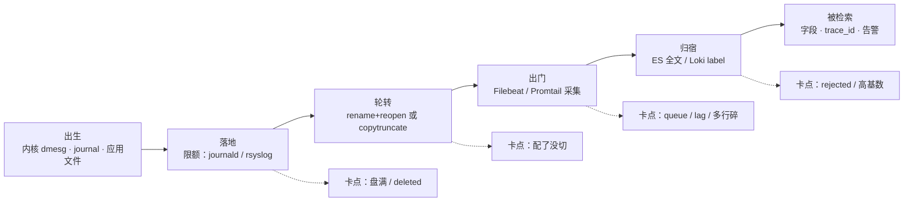
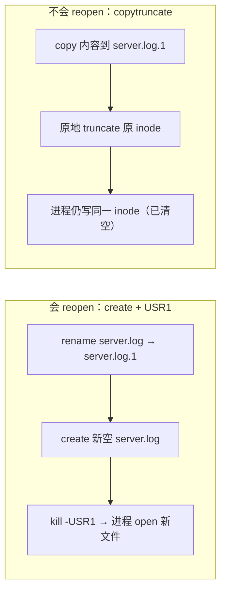
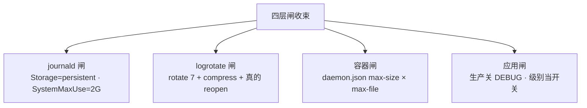
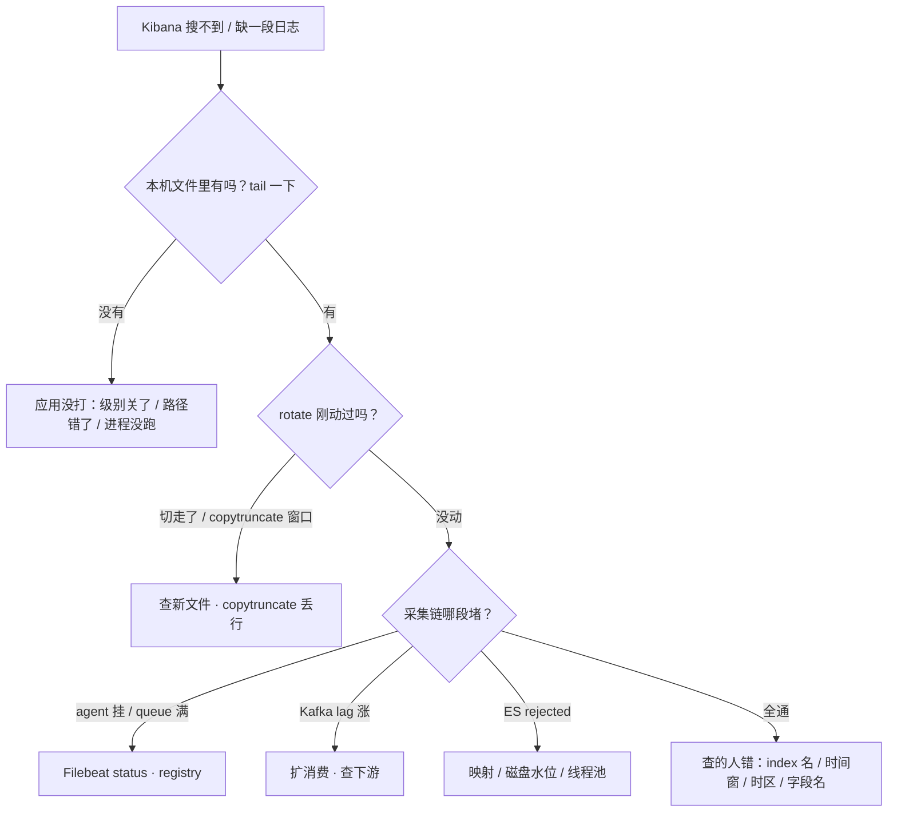

# 日志运维

> 活动开服两小时 `/var` 100%、登录失败；有人 `rm` 掉大日志，`du` 立刻小了、`df` 纹丝不动；Kibana 缺最近十分钟 ERROR，群里喊「ES 慢了」——三个都是同一件事：一行日志从产生到被检索的路上，某一段断了。
> **本章回答**：一行日志从「应用写下第一笔」到「客服在 Kibana 搜到它」的一生，每一段会怎么坏、值班第一刀砍哪。
> **不讲**：deleted inode 的账本原理 → [09](../09-文件系统与inode/)；await、脏页等盘慢 → [08](../08-磁盘与IO/)；探活与告警分级 → [22](../22-监控与告警/)；K8s 集群日志形态 → [03-20](../../03-Kubernetes/20-日志管理/)；ES 分片与 ILM 深调 → [02-04](../../02-中间件与数据库/04-Elasticsearch/)。

**标记**：🎯重点 · 🔥难点 · ⭐常考 · 🔧实操

---

## 一、一张图：一行日志的一生

> 🎯 **一句话**：日志走「出生 → 落地 → 轮转 → 出门 → 归宿 → 被检索」六段，每段各有各的坏法。



**读图**：

- 主线六段从左到右；下排四个卡点对应值班的四种真实现象——盘满（`df` 100%）、没切（文件一直长）、缺日志（Kibana 少一段）、搜不动（Loki 超时）。
- 排障顺序永远**顺着主线从左往右**：先本机活着，再谈采集与存储。机器盘满了，Filebeat 也写不动——从「搜不到」直接跳「扩 ES」是最常见的弯路。
- `df`/`du`/`lsof` 照「落地 / 轮转」两段，`journalctl --disk-usage` 照 journal，Filebeat / Kafka / ES 的指标照「出门 / 归宿」两段。
- 开场三个事故对号入座：「盘满 + rm 不降」卡在**落地/轮转**（四节），「Kibana 缺十分钟」卡在**出门/归宿**（五节），「日志在但拼不出因果」卡在**被检索**——缺 trace_id（六节）。同一张图、三段病史，第一刀砍的位置完全不同；这张图就是值班地图，七节的决策树只是它的展开。

---

## 二、出生：三层日志体系，一行日志生在哪

> 🎯 **一句话**：一行日志只有三个出生地——内核 ring buffer、journald、应用文件；出生地决定了你去哪查它。

### 三层各是谁 🎯⭐

- **内核层——dmesg（kernel ring buffer，内核环形缓冲区）**：内核自己说的话（OOM 杀进程、TCP 报错、驱动异常）先写进一块固定大小的环形内存，`dmesg` 或 `journalctl -k` 看；**不落盘、装满新话覆盖旧话**。内核行也会被收进 journal，所以 `journalctl -k --since "10:00"` 比 `dmesg` 多了时间过滤。`status=9/KILL` 的死亡原因在这里查（OOM → [07](../07-内存与OOM/)）。
- **系统层——journald（systemd-journald）**：systemd 拉起的服务，stdout/stderr 全部进 journal。systemd 记的「谁被重启了几次、什么退出码」和业务打的 ERROR 在同一条时间线上天然对齐——这是 nohup.out 永远做不到的（systemd 侧交接 → [11](../11-Systemd与服务管理/)）。
- **应用层——应用文件**：游戏服、Nginx 自己往 `/var/log/game/`、`/var/log/nginx/` 写文件。**谁生的谁负责养**：限额、轮转、采集配置都是这条线的事。

另两个特殊形态一句话带过：rsyslog 把系统事件落成 `/var/log/messages`、`secure`、`cron`；容器里 `kubectl logs <pod>` 看的是容器 stdout（深讲在 [03-20](../../03-Kubernetes/20-日志管理/)，本章只记住「容器日志先想到它」）。

> ⚠️ **别混**：journal 和应用自写的 `*.log` 是**两路日志**——重定向到文件的输出不再进 journal（systemd 只收 stdout/stderr）。还原一次事故常常两边都要看；`journalctl -u` 查一个 nohup 拉的进程几乎是空的，这本身就是该迁到 systemd 的证据。

> 📝 **面试**：「生产机器日志分几层？」——内核层 dmesg 查 OOM/驱动，系统层 `journalctl -u` 查服务和 systemd 事件，应用层查 `/var/log` 下的业务文件。先按「这句话是谁说的」选工具，不是逮着一个文件 grep 到底。

### journalctl 值班全套 🔧

> 🔍 **现场**：接手一台陌生机器或一个陌生服务，journalctl 的用法就这一屏：

```bash
journalctl -u game-server -n 100 --no-pager   # 最近 100 行，不分页
journalctl -u game-server -f                   # 跟踪（发版时挂着看）
journalctl -u game-server --since "18:00" --until "19:00"   # 时间窗
journalctl -u game-server -p err -n 50         # 只要 err 及更严重（-p 过滤级别）
journalctl -k                                  # 只看内核行（≈ dmesg，但能配 --since）
journalctl -b -1                               # 上一次开机的日志（前提：已持久化）
journalctl --disk-usage                        # journal 吃了多少盘
# ← Archived and active journals currently take up 3.9G ← 限额没设/失效的典型读数
```

```text
-- Logs begin at Tue 2026-08-25 10:12:34 ...   ← begin 早于上次 reboot = 已经持久化了
18:42:10 logic-01 game-server[28451]: ERROR: config not found    ← 根因常就是这一句
18:42:10 logic-01 systemd[1]: Scheduled restart job, counter is at 847
# ← 业务 ERROR 与 systemd 重启记录同一秒：一边是病，一边是症状
```

### 三个进阶过滤，排障省一半时间 🔧

```bash
journalctl -u game-server --since today -g "timeout|refused"   # -g 相当于内置 grep（比管道 grep 快）
journalctl _PID=28451 -n 20                                    # 只看这个 PID 说的话
journalctl -u game-server --since "18:42:00" --until "18:43:00" -o short-precise
#                                                              # -o short-precise：毫秒级时间戳，对齐多机时间线必用
```

```text
18:42:10.123 logic-01 game-server[28451]: ERROR: config not found     ← 42.123
18:42:10.124 logic-01 game-server[28451]: WARN: fallback to default   ← 42.124，间隔 1ms = 代码里紧挨着
# ← 秒级时间戳看不出这两行的先后因果；对时间线时永远 short-precise
```

排障套路固定三步：**先锁时间窗（--since/--until）→ 再压级别（-p err）→ 最后抓关键词（-g）**。三步下来几万行变成几十行，比把整个 journal dump 出来 grep 体面得多。

### journald 持久化与限额 ⭐

journal 默认 `Storage=auto`：`/var/log/journal` 不存在就落 `/run/log/journal`（tmpfs），**reboot 全丢**。要跨 reboot 排障（「昨晚 3 点那次重启发生了什么」），先做一次持久化 + 限额：

```ini
# /etc/systemd/journald.conf
[Journal]
Storage=persistent        # 落盘可查历史（先 mkdir -p /var/log/journal）
SystemMaxUse=2G           # journal 占盘硬顶
SystemKeepFree=500M       # 给盘上至少留这么多
MaxRetentionSec=7day      # 再按时间收一次
```

改完 `systemctl restart systemd-journald`。

磁盘已经红了时的两条急救命令（与 [11](../11-Systemd与服务管理/) 的交接口径一致）：

```bash
journalctl --vacuum-size=500M   # 立刻把 journal 压到 500M 以内
journalctl --vacuum-time=2d     # 只留最近两天
```

> ⚠️ **别混**：**vacuum 是一次性止血，`SystemMaxUse` 才是根治**——只 vacuum 不改限额，下周同一个告警还会来。两条命令救完急，必须回 journald.conf 把限额补上。

### rsyslog 与「业务别挤 messages」

`/var/log/messages` 收系统事件，认证进 `secure`、定时任务进 `cron`。系统日志可离机集中：`*.* @@logserver:514`（rsyslog 转发，TCP 双 `@`、UDP 单 `@`）。**应用不要 print 进 syslog**——「messages 一天 50G」的现场几乎都是这么来的；游戏业务写自己的独立目录 + 自己的 logrotate（三节），系统日志的清静和业务日志的弹性两头都保住。

---

## 三、落地与轮转：logrotate 全套与 reopen

> 🎯 **一句话**：切割 = rename 旧文件 + 让进程重新 open 新文件；进程不 reopen 就一直写旧 inode——「有配置」不等于「切了」。

### 为什么必须轮转

日志不切就会一直长。活动高峰单文件 20G 是常态，写日志打满磁盘的事故链是：**应用疯狂打日志（DEBUG 忘关）→ 没轮转/轮转没生效 → 盘满 → 所有写盘调用失败（存档写不了、journal 写不进、登录卡死）**。轮转（logrotate）就是给这件事上的闸：按时间或大小切块、压缩旧块、删掉更旧的块。

### 两种合法策略：create+reopen vs copytruncate 🔥⭐

> 💡 **打个比方**：logrotate 切文件像给记账的人换账本。`create` + `USR1` 是「收走旧本子、放一本新本子、拍拍记账人的肩让他换到新本子上写」；`copytruncate` 是「把旧本子整本复印一份拿走、把原页**当场擦掉**——记账的人还蒙着头往原页写」，擦的那一瞬间写的字就丢了。

| 对比 | `create` + `postrotate` 发 USR1 | `copytruncate` |
|------|------|------|
| 机制 | rename 旧文件 → 建新空文件 → 信号让进程 open 新文件 | 内容拷走 → **原地 truncate 原 inode** |
| 适用 | nginx、rsyslog 等会处理信号的服务 | 不懂信号的自研游戏服 |
| 代价 | 几乎不丢行 | 拷贝窗口可能丢/重复一行 |



**读图**：上半区进程换到了新 inode，旧文件从此可以压缩、删除；下半区进程手里的 fd 没变，靠清空原 inode 腾空间。**会 reopen 就不要用 copytruncate**——全机图省事 copytruncate，活动高峰会多丢行；反过来，自研服不懂 USR1 时硬上 `create`，进程会一直写那个已被 rename 走的旧 inode。

### 一份能过评审的 logrotate 配置 🔧

```text
/var/log/game/*.log {
    weekly                  # 每周切（活动服用 daily 甚至 size）
    rotate 7                # 留 7 份，第 8 份删除 ← 占盘上限 = 份数 × 单份大小
    missingok               # 文件不存在不报错
    notifempty              # 空文件不切
    compress                # 旧块压 gzip
    delaycompress           # 最近一份先不压（避开还在写的窗口）
    dateext                 # 后缀带日期，好找
    copytruncate            # 自研服不懂 USR1 时用；会 reopen 的服务删掉这行
    su root root            # 目录属主与运行身份不一致时的保命行（权限 → 03 文本三剑客链）
}
```

逐条对账：`weekly`/`daily` 按天切适合平稳流量，**活动日只靠 daily 不够**——上午就可能写满，配 `size 100M` 按大小切，代价是一天可能切很多次、注意份数与盘；`su root root` 解决「日志目录属主是非 root 服务、logrotate 读不了配置」的权限报错。

nginx 版对照（会 reopen 的服务长什么样）：

```text
/var/log/nginx/*.log {
    daily
    rotate 7
    missingok
    notifempty
    compress
    delaycompress
    dateext
    create 0640 nginx adm                          # 新文件属主属组 + 权限
    sharedscripts                                  # 通配匹配多个文件，脚本只跑一次
    postrotate                                     # 切完立刻通知 nginx
        [ -f /var/run/nginx.pid ] && kill -USR1 $(cat /var/run/nginx.pid)
    endscript
}
```

**谁在驱动 logrotate 跑**：cron.daily 里的 `/etc/cron.daily/logrotate`（或 systemd timer）每天调一次 `logrotate /etc/logrotate.conf`；它在 `/var/lib/logrotate/logrotate.status` 记「每个文件上次切的日期」，`weekly` 判断就靠这份账——**删了 status 或换了机器时间，轮转节奏会乱**。所以「配了但没切」除了查配置，还要确认 cron/timer 在跑（下面现场第一刀）。

> 🔍 **现场**：「配了但没切」四步检查单：
>
> ```bash
> logrotate -d /etc/logrotate.conf          # dry-run：路径通配匹配到文件吗？权限能 rename 吗？
> systemctl list-timers | grep -i logrotate # cron/timer 真在跑吗？
> ls -la /var/log/game/                     # 日期后缀的文件生成了吗？
> nginx -s reopen                           # 会 reopen 的服务手动补一刀，看新文件开始长
> ```

> ⚠️ **别混**：`logrotate -d` 是 dry-run 只打印不执行；`-f` 是强制立刻切一次（生产慎用）。有配置 ≠ 切了——**配置、cron、reopen 三件事都成立，切割才真发生**；`missingok`/`notifempty` 只是跳过空文件，不是「10G 还在长」的根因。

### Docker json-file：容器侧一句话

容器 stdout 由 runtime 落成 json-file，**裸 Docker 主机必须在 `daemon.json` 设 `max-size`/`max-file`**（如 `100m` × `3`），否则活动 access 日志能把节点 overlay 写死；上了 K8s 由 kubelet 轮转兜底（→ [03-20](../../03-Kubernetes/20-日志管理/)）——但「以后上 K8s 就好了」不能当作今天不配 `daemon.json` 的理由。

---

## 四、生病：写满磁盘——du、df 与 deleted

> 🎯 **一句话**：`rm` 只删目录项，进程握着的 inode 还占着盘——止血靠 reopen 或截断 fd，不靠加盘、不靠先装采集。

### 事故链复盘 🔥

活动开服 2 小时的完整链条：活动高峰 DEBUG 忘关 → 日志速率暴涨 → 轮转没配/没生效 → `/var` 100% → 所有写盘调用失败（登录写不了存档、journal 写不进、ssh 卡死）→ 有人 `rm /var/log/game/*.log` → `du` 立刻小了、`df` 还是 100% → 登录继续失败。每一环单看都「有道理」，连起来就是 P0。群里的两个错误处方——「先加盘」（把根因盖住）、「先装 Filebeat」（本机都写不动了装什么）——都不要听。

### du 变小、df 不降 🔥⭐

> 💡 **打个比方**：`rm` 像把房子的门牌摘了——住户（进程的写 fd）还住在里面，物业（`df`）照样按面积收费。要真腾出房子，得让住户搬家（reopen 到新文件）或把屋里清空（truncate 这个 fd）；摘门牌本身腾不出一平米。

**du（disk usage）** 顺着目录树统计「还看得见名字」的文件；**df（disk free）** 看文件系统**已分配的块**。`rm` 删的是**目录项（名字）**，进程打开的 **inode + 数据块还在**，直到最后一个 fd close（或这个 fd 被 truncate）——账本细节（硬链接、inode）→ [09](../09-文件系统与inode/)，本章只管止血动作。

| 对比 | `du` | `df` |
|------|------|------|
| 数的是什么 | 目录树里**还看得见名字**的文件 | 文件系统**已分配的块** |
| `rm` 之后 | 立刻变小 | 进程握着 fd 就**不降** |
| 用来干什么 | 找大户 | 看真实余量 |

```bash
df -h /var && df -i /var             # 先分：空间满还是 inode 满（inode 满另走 09）
du -sh /var/log/* | sort -h | tail   # 再找大户
lsof | grep deleted                  # 最后抓「握着已删文件」的进程
```

```text
COMMAND    PID   USER  FD  TYPE  DEVICE  SIZE/OFF  NODE  NAME
game-serv  12345 run   3w  REG   8,1     21474836480 884521 /var/log/game/server.log (deleted)
#                        ↑写 fd            ↑约 20G —— df 不降的就是它；PID 就是握着它的人
```

止血三选一（按对业务伤害从小到大）：

```bash
kill -USR1 $(pidof game-serv)     # ① 会 reopen：进程换到新文件，旧 inode 释放（最干净）
nginx -s reopen                   #    nginx 的等价写法
> /proc/12345/fd/3                # ② 不会 reopen：直接清空这个 fd（先确认 fd 号是写日志那个）
journalctl --vacuum-size=500M     # ③ journal 吃的份单独压
```

**最后才**重启进程——活动中杀逻辑服比磁盘满更伤。止血后 `df` 降了多少要对上 `lsof` 的 SIZE：显示 20G deleted 但只降了 2G，说明还有别的 deleted 或别的大户（容器 overlay、core 文件），继续查，别宣布胜利。容器场景在**宿主机** `lsof` 看容器进程握着的已删文件——只进容器里 `df` 看到的是另一层文件系统。

> 🔍 **现场**：一次完整的「rm 后 df 不降」救援，五分钟内敲完：
>
> ```bash
> df -h /var                     # /dev/sdb1  50G   50G   0  100% /var      ← 满了
> rm /var/log/game/server.log    # 同事已经 rm 了，du 立刻"好转"
> df -h /var                     # 仍 100% —— 空间没回来
> lsof | grep deleted            # game-serv 12345 ... 3w ... server.log (deleted)
> ls -l /proc/12345/fd/ | grep server.log   # 3 -> /var/log/game/server.log (deleted)
> > /proc/12345/fd/3             # 自研服不会 reopen：截断这个 fd（先确认 3 是写日志那个）
> df -h /var                     # /dev/sdb1  50G   31G  19G  63% /var     ← 空间回来了
> # ← 若进程会 reopen（nginx），上一行换成 kill -USR1，更干净
> ```

> ⚠️ **别混**：`/proc/12345/fd/3` 截断的是**那一个 fd**，不是让进程以后都不写日志——进程下一次还是写这个（已清空的）文件。截断是争取时间，**轮转配置和 DEBUG 开关才是收尾**；截完不收尾，明天同一时间再来一次。

> 📝 **面试**：「rm 后空间不回来怎么办？」——先 `lsof | grep deleted` 找到握 fd 的进程；会 reopen 的发 USR1，不会的 `> /proc/PID/fd/N` 截断；还了多少对上 SIZE；不先加盘、不先杀逻辑服。

### 收束：日志凭什么淹不死机器 🎯⭐

一层一个闸。四个闸门全配齐，日志才淹不死机器：



**读图**：四层闸各管一段——journald 管 journal、logrotate 管应用文件、`daemon.json` 管容器 stdout、级别开关管**源头速率**。前三个管「最多占多少盘」，最后一个管「产生多少」；活动前把 DEBUG 关干净，比活动中 vacuum 便宜一百倍。

不保证什么：闸门全配齐 ≠ 盘一定不满——盘本身太小、别的进程乱写、日志目录和数据盘混盘都会翻车；分盘与容量预测 → [08](../08-磁盘与IO/)、[22](../22-监控与告警/)。

> 📝 **面试**：按「四层闸」背：journald `SystemMaxUse`、logrotate `rotate+compress`、Docker `max-size`、应用级别开关；再补一句「vacuum 和 rm 都是止血不是根治，根治是限额」。

---

## 五、出门：采集管道与丢失按段定责

> 🎯 **一句话**：日志丢没丢，按「本机文件 → Filebeat queue → Kafka lag → ES rejected」逐段查——先证明丢在哪段，再动手。

### 管道与逐段签名 🔥

> 💡 **打个比方**：采集链像快递链——Filebeat 是揽收员（registry 是他的签收底单）、Kafka 是分拣干线（lag 是积压单量）、ES 是目的仓（rejected 是仓库拒收）。包裹没到，别先骂仓库——先看揽收员手里到底有没有这件货。

```text
本机文件 ──► Filebeat（queue + registry）──► Kafka?（lag）──► Logstash? ──► ES（rejected）
  ↑没打           ↑没读到 / queue 满            ↑消费跟不上          ↑拒收
```

- **本机文件没有**：应用没打 / 级别关了 / 写错路径——采集层空转，回应用查。
- **Filebeat 段**：agent 挂了（`systemctl status filebeat`）、queue 满（下游慢或网络断，看背压策略）、registry 出问题。
- **Kafka 段**：`kafka-consumer-groups.sh --describe --group logstash-logs` 里的 **lag（消费滞后量）** 持续涨 = 消费跟不上，扩消费或查下游。

```text
GROUP        TOPIC           PARTITION  CURRENT-OFFSET  LOG-END-OFFSET  LAG
logstash-logs game-logs      0          8123456         8125456         1000
logstash-logs game-logs      1          8098765         8103765         5000
#                                                              ↑ LAG 持续涨且不回落 = 下游（ES 写入）慢，不是生产端的问题
```
- **ES 段**：indexing **rejected（拒收）**——映射冲突、磁盘水位、线程池打满，存储侧的事（→ [02-04](../../02-中间件与数据库/04-Elasticsearch/)）。

**丢失排查顺序**：先查 rotate（刚切走？copytruncate 窗口丢的？）→ 再查采集（agent 活着吗、queue、lag）→ 最后才怀疑应用没打。三段都有签名，不猜。

### Filebeat 侧的两个经典坑 ⭐

```yaml
filebeat.inputs:
- type: log
  paths: ["/var/log/game/*.log"]
  multiline.pattern: '^[0-9]{4}-[0-9]{2}-[0-9]{2}'   # 行首是日期才算新事件
  multiline.negate: true                              # 不匹配 pattern 的行……
  multiline.match: after                               # ……追加到上一条后面
```

- **多行日志（multiline）**：Java 堆栈在 Kibana 里碎成 40 条，就是 multiline 没配或 pattern 不对——pattern 要对齐「**新事件的第一行**长什么样」（如行首日期），不是对齐「错误行长什么样」。
- **registry（采集偏移账本）**：Filebeat 在 `/var/lib/filebeat/registry` 记「每个文件读到哪个偏移」；**删了它 = 重启从头读 = 昨天的日志又进一遍**。轮转后 inode 变化，配置要正确处理 renamed 的旧文件。
- **一台一个 agent**：两套 agent 盯同一路径 = 双份日志；两套 rotate 方案盯同一个文件 = 轮转打架。

生产 filebeat.yml 还差两行常被漏的（配合上面的 multiline）：

```yaml
  close_renamed: true        # rename 走的旧文件及时关闭（配合 logrotate，否则句柄/内存白挂）
  tags: ["game", "prod"]     # 打上标签，Logstash/ES 侧按 tag 分流到不同索引
```

如果应用输出**不是** JSON，才在 Logstash 补 grok；grok 写不好，解析失败全进 `_grokparsefailure`——**指标里它一冒头就该回应用改输出**，而不是继续堆正则：

```ruby
filter {
  grok {
    match => { "message" => "%{TIMESTAMP_ISO8601:ts} %{LOGLEVEL:level} %{GREEDYDATA:msg}" }
  }
  date { match => ["ts", "ISO8601"] }   # 用日志自带时间当 @timestamp，不是采集时间
}
```

> ⚠️ **别混**：`@timestamp` 用**日志事件发生时间**（date 插件解析日志里的时间字段），不是 Filebeat 采集时间——采集有延迟时两者差几十秒，排障时间线会对不上。

> 🔍 **现场**：Kibana 缺最近 10 分钟 ERROR、本机 `df` 正常时，四刀按顺序：
>
> ```bash
> tail -100 /var/log/game/server.log | grep ERROR   # ① 本机文件里有没有
> systemctl status filebeat                          # ② agent 活着吗
> kafka-consumer-groups.sh --bootstrap-server kafka:9092 --describe --group logstash-logs
> #                                                   ③ lag 在涨吗
> # ④ ES：看 indexing rejected 指标（是否拒收）
> ```

**采集延迟 ≠ 丢了**：queue 积压、网络抖动会造成「搜不到刚才的」。对比 Filebeat 的读取偏移和文件大小——差值在缩小就是在追，不动才是真堵。**采集自己也要被监控**：Filebeat up、queue 占用、Kafka lag、ES rejected、本机日志目录增长率（健康曲线是 rotate 的锯齿状，持续单文件暴涨 = rotate 失效）——别等客服喊「搜不到」才发现 agent 上周就挂了。

**Kafka 削峰不是无限水坝**：活动洪峰前加 Kafka 挡尖刺合理，但队列满仍要有策略（阻塞 / 丢弃 / 死信）；**加 Kafka ≠ 一定不丢**。

---

## 六、归宿：结构化、trace_id 与 ELK/Loki

> 🎯 **一句话**：能不能搜玩家 ID 看 ELK；能不能串起一次请求看 trace_id；Loki 只索引 label，高基数字段禁止当 label。

### 结构化与关联 🔥⭐

**结构化（structured logging）** = 一行一个 JSON 事件、字段稳定；**关联（correlation）** = 同一次请求全程共用一个 `trace_id`。两件事是两码事：有 JSON 没有 trace_id 透传，照样对不齐。

```json
{"@timestamp":"2026-08-26T10:00:00.000Z","level":"ERROR","service":"game-server",
 "trace_id":"abc123","player_id":"12345","message":"登录失败：token 过期","duration_ms":42}
```

必备字段口径：`@timestamp` **存 UTC**（跨机房时间线才对得齐，校时 → [32](../32-NTP与时间同步/)）、`level`（告警按级别滤）、`service`（索引拆得开）、`trace_id`（串请求的钥匙）、`player_id`（客服搜得到，注意脱敏）。应用直接打 JSON，Logstash 就少一层 grok——grok 失败进 `_grokparsefailure`，**先改应用输出，别堆滤镜**。

trace_id 的做法是**入口注入 + 全程透传**：网关收到请求时生成（或透传 `X-Trace-Id`）写进自己的 access 日志，转发时带上；逻辑服从 context 取出写进每条业务日志；调 DB/RPC 继续传。反模式四条：每层自己 `uuid()`（看着都有 id，串不动）、只在 ERROR 才带（成功路径没对照）、trace 放非结构化 message 里（偶发能 grep，字段过滤不稳）、各机 localtime（同一秒对不齐）。

> ⚠️ **别混**：结构化解决「好搜好滤」，关联解决「跨组件对上同一次请求」——JSON 保证字段稳定，`trace_id` 才是钥匙。

### ELK vs Loki ⭐

| 对比 | ELK / EFK | Loki |
|------|------|------|
| 索引什么 | 全文倒排索引 | **只索引 label** |
| 成本 | 高 | 低 |
| 适合 | **搜玩家 ID / 任意关键词** | 按 service/level/pod 查 + 成本敏感 |
| 查询思维 | 字段过滤 | **先 label 缩流，再 `\|=` 或 `\| json` 扫内容** |

可以拆着用：平台 / K8s 日志走 Loki（Promtail 采集），客服搜角色行为走 ELK——不是信仰站队。Loki 的红线：`player_id`、URL path、`trace_id` 这类**高基数（high cardinality）**字段**禁止当 label**（每种取值组合都是一条新索引流，直接爆炸）——放行内，先缩流再过滤：

```logql
{service="game-server"} | json | player_id="12345"    # 对：label 缩流 + 行内过滤
rate({service="game-server"} |= "ERROR" [5m])          # 告警：错误速率
```

在 Loki 里当谷歌搜「任意一句话」= 全表扫描超时，这是把 ELK 的用法硬塞给 Loki。

### 级别、保留与告警

- **级别当开关**：生产 DEBUG 关、INFO 有节制、ERROR/FATAL 才进告警；全开 DEBUG「靠 ES 过滤」会在活动期间把本机盘和 ES 写入一起打爆。临时排障按服务/玩家采样开 DEBUG，**带过期时间**。
- **保留分层**：应用热 7d / 温 30d / 冷 90d，访问热 3d，安全审计 1y+——审计和访问日志**不要同一套 7 天**：审计独立索引、更严权限、更长保留（→ [27](../27-Linux安全加固/)）。ES 侧落地用 ILM（热→温→冷→删）、访问日志 200 采样 4xx/5xx 全留，深调 → [02-04](../../02-中间件与数据库/04-Elasticsearch/)。
- **日志告警 vs 探活**：日志解释**为什么**，探活决定**叫不叫人**——入口挂了进程还在打 INFO，ERROR 计数不会响，探活会（→ [22](../22-监控与告警/)）。告警看**速率不是单条**：5 分钟 ERROR > 100 才值得打电话，活动期 INFO 刷屏不叫人。

保留分层在 ES 侧的落地（ILM，hot → warm → cold → delete）：

```json
PUT _ilm/policy/game-logs
{ "policy": { "phases": {
    "hot":  { "actions": { "rollover": { "max_size": "50gb", "max_age": "1d" } } },
    "warm": { "min_age": "7d",  "actions": { "shrink": { "number_of_shards": 1 } } },
    "delete": { "min_age": "90d", "actions": { "delete": {} } }
} } }
```

日志告警的两条常用规则（ElastAlert / 告警平台同理）：**frequency 型**（5 分钟 ERROR > 100 打电话）、**spike 型**（错误率相对基线突增 5 倍叫人）——都是看**速率曲线**，不是 grep 到一条 ERROR 就广播。容器侧补一句值班口令：`kubectl logs <pod> --tail=100 -f`（当前容器）、`kubectl logs <pod> --previous`（**上一次崩掉前**的日志，CrashLoopBackOff 定位全靠它），形态与持久化深讲 → [03-20](../../03-Kubernetes/20-日志管理/)。

> 📝 **面试**：「生产日志怎么治理？」——三层出生地分而治之、四层闸限额、JSON+UTC+trace_id、ELK/Loki 按场景拆、告警看速率探活管死活，五个短语说完就是完整答案。

---

## 七、作战：丢日志定责与止血

> 🎯 **一句话**：搜不到日志只有四个方向——本机没打、被轮转切走、采集堵了、查的人查错了；按主线从左往右砍。



**读图**：入口只有一个——先 `tail` 本机文件。文件里没有就回应用查，别在采集层空转；文件里有就顺着「rotate → 采集三段 → 查询侧」往下砍，每一层都有验收命令，砍到哪层停就修哪层。

| 现象 | 先做 | 别做 |
|------|------|------|
| rm 了 `df` 仍 100% | `lsof \| grep deleted` → reopen / 截断 fd | 先加盘；先杀逻辑服 |
| /run 满、ssh 卡 | vacuum + 改 `SystemMaxUse` | 只 vacuum 不改限额 |
| messages 一天 50G | 应用改独立目录 | print 进 syslog |
| 堆栈碎成 40 条 | multiline 对齐真实行首 | 加大 ES |
| 重启 Filebeat 重放昨天 | 查 registry | 当「ES 重复」删索引 |
| 活动缺 10 分钟 | queue → lag → rejected 逐段 | 猜「ES 慢」直接扩容 |
| Loki 搜一句话超时 | 先 `{service=}` 缩流 | 当谷歌全文搜 |
| access.log 10G 没切 | `logrotate -d` + USR1 | 只把 rotate 7 改成 30 |
| 容器 overlay 写满 | `daemon.json` 设 max-size | 「等上 K8s 再说」 |

🔧 **60 秒剧本**（接到「日志搜不到 / 盘告警」的第一分钟）：

```text
① 0–10s  df -h /var && df -i /var        # 满了吗？空间还是 inode？
② 10–30s du -sh /var/log/* | sort -h | tail; lsof | grep deleted   # 大户 / deleted
③ 30–45s journalctl --disk-usage         # journal 吃了多少；要救就 --vacuum-size=
④ 45–60s tail 目标文件 + systemctl status filebeat   # 本机有没有 / agent 活着吗
# ← 全程不动业务进程、不删索引、不改 ES——先定型，再定责
```

---

## 八、收口

### 命令速查 🔧

```bash
# 三层看日志
dmesg -T | tail -50; journalctl -k --since "10:00"        # 内核层
journalctl -u game-server -n 100 -f --since "18:00" -p err -b -1   # 系统层
tail -f /var/log/game/server.log                          # 应用层
# 盘与限额
df -h /var; df -i /var
du -sh /var/log/* | sort -h | tail
lsof | grep deleted
> /proc/{PID}/fd/<N>                                       # 截断已删大文件的 fd（先确认 fd 号）
journalctl --disk-usage
journalctl --vacuum-size=500M; journalctl --vacuum-time=2d # 急救；根治是 SystemMaxUse
# 轮转
logrotate -d /etc/logrotate.conf                           # dry-run
nginx -s reopen                                            # 补一刀 reopen
# 采集
systemctl status filebeat; ls -la /var/lib/filebeat/registry
kafka-consumer-groups.sh --describe --group logstash-logs  # 看 lag
kubectl logs {pod} --tail=100                              # 容器侧（深讲 03-20）
```

### 面试锚点

| 问 | 30 秒答 |
|----|---------|
| 生产日志分几层？ | 内核 dmesg、系统 journalctl -u、应用 /var/log 文件；按「谁说的这话」选工具。 |
| rm 后 df 不降？ | 进程握 deleted fd；USR1 reopen 或 `> /proc/PID/fd/N`；还了多少对上 SIZE。 |
| journalctl 常用哪几个？ | -u -n -f --since -p err -k -b -1 --disk-usage；跨 reboot 先 Storage=persistent。 |
| journal 打满盘？ | --vacuum-size / --vacuum-time 急救；根治是 SystemMaxUse，只 vacuum 还会满。 |
| copytruncate 和 USR1 怎么选？ | 会 reopen 用 create+USR1；不会才 copytruncate，代价是拷贝窗口丢行。 |
| logrotate 有配置就是切了吗？ | 不是；配置 + cron 真跑 + 进程真 reopen 三件都成立才切。 |
| 日志丢了怎么查？ | 先 rotate 再采集再应用：文件 → Filebeat queue → Kafka lag → ES rejected。 |
| 多行堆栈怎么合一条？ | multiline pattern 对齐真实行首（如日期），negate+match after。 |
| 为什么重启 Filebeat 重放昨天？ | registry 丢了从头读；别当 ES 重复删索引。 |
| JSON 就等于能关联？ | 不；还要 trace_id 入口注入全程透传；时间戳存 UTC。 |
| ELK 还是 Loki？ | 搜玩家 ID 用 ELK；Loki 只索引 label、成本低、先缩流再扫；player_id 禁止当 label。 |
| 日志告警和探活的分工？ | 日志解释为什么、看速率；探活管死活叫不叫人（22）。 |

### 易错一句话对照

- `rm` 之后空间就释放了 → 进程握着 fd 就不释放，`lsof | grep deleted`
- `du` 小了就是清理成功 → `df` 才是真实余量，两者对不上找 deleted
- journal 打满只 vacuum → 根治是 SystemMaxUse 限额
- 有 logrotate 配置就是切了 → 还要 cron 真跑、进程真 reopen
- 会 reopen 的服务也用 copytruncate → 能 USR1 就 USR1，copytruncate 高峰丢行
- 盘满了先加盘 / 先装 Filebeat → 先 rotate / reopen / vacuum 让本机活
- 堆栈碎是 ES 的锅 → multiline pattern 没对齐真实行首
- 重启后日志重复是 ES 重复 → registry 丢了重读
- 有 JSON 就能关联 → 没有 trace_id 透传照样对不齐
- 时间戳存本机时间 → 存 UTC，展示层再转
- 搜玩家 ID 用 Loki 当谷歌 → Loki 先 label 缩流；全文检索走 ELK
- player_id 做成 Loki label → 高基数爆炸，放行内过滤
- 业务 print 进 messages 挺方便 → 独立目录，messages 只留系统事件
- 审计和访问日志同一套保留 → 审计 1y+ 独立索引
- 加了 Kafka 日志就不会丢 → 队列满仍要有策略，lag 涨就是堵
- Docker 日志等上了 K8s 再管 → 裸 Docker 主机今天就要 max-size

### 数字墙

> journal `SystemMaxUse` 常见 **2G** · vacuum 口径 **--vacuum-size=500M / --vacuum-time=2d** · logrotate **weekly/daily · rotate 7 · compress + delaycompress** · Docker **max-size 100m × max-file 3** · rsyslog 转发 **@@:514**（TCP 双 @）· Filebeat registry **/var/lib/filebeat/registry** · 应用热 **7d** / 访问热 **3d** / 审计 **1y+** · ERROR 告警 **5 分钟 >100** · 活动高峰单文件可到 **20G**

---

## 合上书

- [ ] **默画主图**：出生 → 落地 → 轮转 → 出门 → 归宿 → 被检索，六个阶段各配一个卡点。
- [ ] **口述三层**：内核 dmesg / 系统 journal / 应用文件各收谁的话、各用什么命令查；journalctl 值班全套默写。
- [ ] **口述 journald 治理**：Storage=persistent、SystemMaxUse、两条 vacuum 急救命令与「止血 vs 根治」口径。
- [ ] **默画轮转两策略**：create+USR1 与 copytruncate 各自的机制、适用、代价；logrotate 配置逐条对账（weekly/rotate 7/compress/missingok/su root root）。
- [ ] **口述盘满事故链**：DEBUG 忘关 → 没轮转 → 盘满 → rm → df 不降；止血三选一与验收。
- [ ] **口述采集定责**：queue → lag → rejected 逐段查；multiline 与 registry 两个坑。
- [ ] **口述关联**：JSON 必备字段、trace_id 入口注入 + 全程透传、UTC 为什么。
- [ ] **口述选型**：ELK vs Loki 谁搜玩家 ID；Loki label 高基数红线。
- [ ] **定责**：丢日志四方向决策树；「日志告警 vs 探活」分工。

下一章：[内核参数与 sysctl](../24-内核参数与sysctl/)。deleted 深挖 → [09](../09-文件系统与inode/) · ES 深调 → [02-04](../../02-中间件与数据库/04-Elasticsearch/) · K8s 日志 → [03-20](../../03-Kubernetes/20-日志管理/)。
