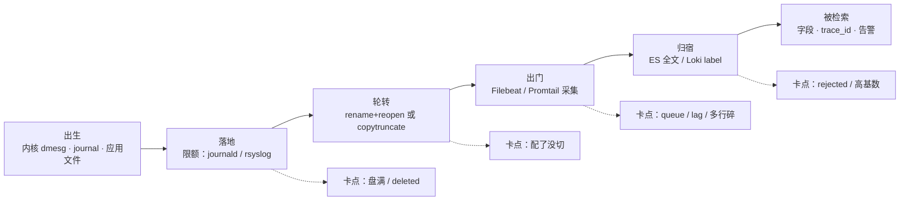
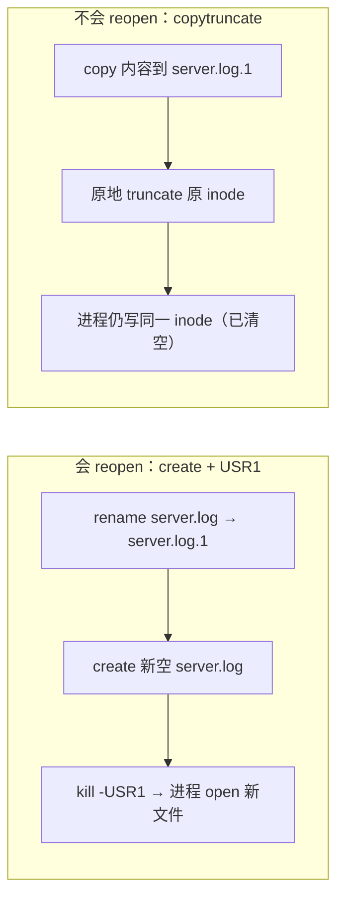
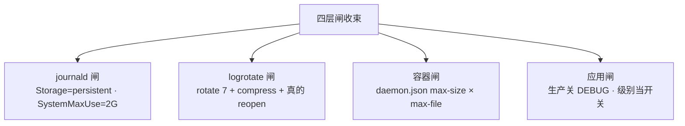
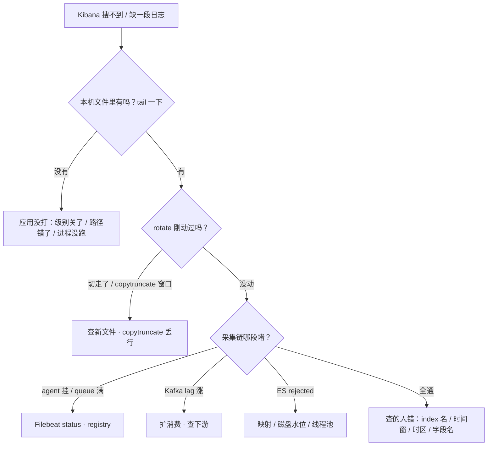

# 日志运维

> 活动开服两小时 `/var` 100%、登录失败；有人 `rm` 掉大日志，`du` 立刻小了、`df` 纹丝不动；Kibana 缺最近十分钟 ERROR，群里喊「ES 慢了」——三个都是同一件事：一行日志从产生到被检索的路上，某一段断了。
> **本章回答**：一行日志从「应用写下第一笔」到「客服在 Kibana 搜到它」的一生，每一段会怎么坏、值班第一刀砍哪。
> **不讲**：deleted inode 账本 → [09](../09-文件系统与inode/)；await、脏页 → [08](../08-磁盘与IO/)；探活与告警分级 → [22](../22-监控与告警/)；K8s 集群日志形态 → [03-20](../../03-Kubernetes/20-日志管理/)；ES 分片与 ILM 深调 → [02-04](../../02-中间件与数据库/04-Elasticsearch/)。

**标记**：🎯重点 · 🔥难点 · ⭐常考 · 🔧实操

---

## 一、一张图：一行日志的一生

> 🎯 **一句话**：日志走「出生 → 落地 → 轮转 → 出门 → 归宿 → 被检索」六段，每段各有各的坏法。



- 📖 **读图**
  - 🛤️ 主线六段从左到右；下排四个卡点对应四种真实现象——盘满、没切、缺日志、搜不动
  - 🔭 排障永远**顺着主线从左往右**：先本机活着，再谈采集与存储；`df`/`du`/`lsof` 照落地/轮转，Filebeat/Kafka/ES 照出门/归宿
  - ⭐ 开场三事故对号：盘满+rm 不降 → 落地/轮转；Kibana 缺十分钟 → 出门/归宿；拼不出因果 → 被检索缺 trace_id

---

## 二、出生：三层日志体系，一行日志生在哪

> 🎯 **一句话**：一行日志只有三个出生地——内核 ring buffer、journald、应用文件；出生地决定了你去哪查它。

### 🏷️ 三层各是谁 🎯⭐

- **内核层——dmesg（kernel ring buffer）**：OOM、TCP 报错、驱动异常先写进固定大小环形内存
  - `dmesg` / `journalctl -k` 看；**不落盘、装满覆盖旧话**
  - 内核行也会进 journal → `journalctl -k --since "10:00"` 比裸 `dmesg` 多时间过滤
  - `status=9/KILL` 的死亡原因在这里查（OOM → [07](../07-内存与OOM/)）

- **系统层——journald（systemd-journald）**：systemd 拉起的服务，stdout/stderr 全部进 journal
  - 「谁被重启了几次、什么退出码」和业务 ERROR 同一时间线对齐——nohup.out 做不到（→ [11](../11-Systemd与服务管理/)）

- **应用层——应用文件**：游戏服、Nginx 自己往 `/var/log/game/`、`/var/log/nginx/` 写
  - **谁生的谁负责养**：限额、轮转、采集都是这条线的事

- 📎 **另两个形态一句话**：rsyslog 落 `/var/log/messages`、`secure`、`cron`；容器 `kubectl logs <pod>` 看 stdout（深讲 → [03-20](../../03-Kubernetes/20-日志管理/)）

#### ❓ 为什么 journal 和应用 `*.log` 是两路？

- ❌ **以为** `journalctl -u` 能看见所有业务日志
- ✅ systemd **只收 stdout/stderr**；重定向到文件的输出**不再进 journal**
- 🔍 `journalctl -u` 查一个 nohup 拉的进程几乎是空的——这本身就是该迁到 systemd 的证据
- 🩺 还原事故常常**两边都要看**

> ⚠️ **别混**：journal 与应用自写 `*.log` 是两路；先按「这句话是谁说的」选工具，不是逮着一个文件 grep 到底。

> 📝 **面试**：「生产机器日志分几层？」——内核 dmesg 查 OOM/驱动，系统 `journalctl -u` 查服务，应用查 `/var/log` 业务文件。⭐（练习题 Q1、Q2）

### 🔧 journalctl 值班全套 🔧

> 🔍 **现场**：接手陌生机器/服务，就这一屏：

```bash
journalctl -u game-server -n 100 --no-pager   # 最近 100 行，不分页
journalctl -u game-server -f                   # 跟踪（发版时挂着看）
journalctl -u game-server --since "18:00" --until "19:00"
journalctl -u game-server -p err -n 50         # 只要 err 及更严重
journalctl -k                                  # 只看内核行（≈ dmesg，能配 --since）
journalctl -b -1                               # 上一次开机（前提：已持久化）
journalctl --disk-usage                        # journal 吃了多少盘
# ← Archived and active journals take up 3.9G ← 限额没设/失效的典型读数
```

```text
-- Logs begin at Tue 2026-08-25 10:12:34 ...   ← begin 早于上次 reboot = 已持久化
18:42:10 logic-01 game-server[28451]: ERROR: config not found
18:42:10 logic-01 systemd[1]: Scheduled restart job, counter is at 847
# ← 业务 ERROR 与 systemd 重启同一秒：一边是病，一边是症状
```

- 🔑 **进阶三刀**（排障省一半时间）

```bash
journalctl -u game-server --since today -g "timeout|refused"   # -g ≈ 内置 grep
journalctl _PID=28451 -n 20                                    # 只看这个 PID
journalctl -u game-server --since "18:42:00" --until "18:43:00" -o short-precise
# ← 毫秒时间戳；对多机时间线永远 short-precise
```

- 🧭 **固定三步**：锁时间窗（`--since`/`--until`）→ 压级别（`-p err`）→ 抓关键词（`-g`）

### 💾 journald 持久化与限额 ⭐

- 默认 `Storage=auto`：`/var/log/journal` 不存在就落 `/run/log/journal`（tmpfs）→ **reboot 全丢**
- 要跨 reboot 排障，先持久化 + 限额：

```ini
# /etc/systemd/journald.conf
[Journal]
Storage=persistent        # 先 mkdir -p /var/log/journal
SystemMaxUse=2G           # journal 占盘硬顶
SystemKeepFree=500M       # 给盘至少留这么多
MaxRetentionSec=7day
```

改完 `systemctl restart systemd-journald`。

#### ❓ 为什么只 vacuum 不够？

- 🩸 **vacuum 是一次性止血**：立刻压体积
- 🧱 **`SystemMaxUse` 才是根治**：限额在 conf 里
- ❌ 只 vacuum 不改限额 → 下周同一告警再来

```bash
journalctl --vacuum-size=500M   # 立刻压到 500M 以内
journalctl --vacuum-time=2d     # 只留最近两天
```

> ⚠️ **别混**：vacuum ≠ 限额；救完急必须回 `journald.conf` 把 `SystemMaxUse` 补上（与 [11](../11-Systemd与服务管理/) 交接口径一致）。

### 📮 rsyslog 与「业务别挤 messages」

- `/var/log/messages` 收系统事件；认证进 `secure`、定时进 `cron`
- 系统日志可离机：`*.* @@logserver:514`（TCP 双 `@`、UDP 单 `@`）
- 🚫 **应用不要 print 进 syslog**——「messages 一天 50G」几乎都是这么来的
- ✅ 业务写独立目录 + 自己的 logrotate（三节）

本节对应练习题 Q1、Q2。知道去哪查了——配了 logrotate 为什么文件还在疯长？

---

## 三、落地与轮转：logrotate 全套与 reopen

> 🎯 **一句话**：切割 = rename 旧文件 + 让进程重新 open 新文件；进程不 reopen 就一直写旧 inode——「有配置」不等于「切了」。

### 🌊 为什么必须轮转

事故链固定：**DEBUG 忘关 → 没轮转/没生效 → 盘满 → 存档写不了、journal 写不进、登录卡死**。

- logrotate = 按时间或大小切块、压缩旧块、删更旧块
- 活动高峰单文件 **20G** 是常态——闸门不是可选项

### 🔄 两种合法策略：create+reopen vs copytruncate 🔥⭐

> 💡 **打个比方**：`create` + `USR1` = 收走旧账本、放新本子、拍拍记账人换本写；`copytruncate` = 整本复印拿走、把原页**当场擦掉**——记账人还往原页写，擦的那一瞬字就丢了。

| 对比 | `create` + `postrotate` 发 USR1 | `copytruncate` |
|------|------|------|
| 机制 | rename → 建新空文件 → 信号让进程 open 新文件 | 内容拷走 → **原地 truncate 原 inode** |
| 适用 | nginx、rsyslog 等会处理信号的服务 | 不懂信号的自研游戏服 |
| 代价 | 几乎不丢行 | 拷贝窗口可能丢/重复一行 |



- 📖 **读图**
  - 上半区进程换到新 inode，旧文件可压缩删除
  - 下半区 fd 没变，靠清空原 inode 腾空间
  - 口诀：**「能 reopen 就别 copytruncate」**（练习题 Q3、Q4）

#### ❓ 为什么会 reopen 还用 copytruncate 会出事？

- ❌ 全机图省事统一 `copytruncate` → 活动高峰**多丢行**
- ❌ 自研服不懂 USR1 却硬上 `create` → 进程一直写已被 rename 走的旧 inode，新文件空、盘继续涨
- ✅ 会 reopen → `create` + 信号；不会 → 才 `copytruncate`

### 🧾 一份能过评审的 logrotate 配置 🔧

```text
/var/log/game/*.log {
    weekly                  # 活动服用 daily 甚至 size
    rotate 7                # 留 7 份；占盘上限 ≈ 份数 × 单份大小
    missingok
    notifempty
    compress
    delaycompress           # 最近一份先不压
    dateext
    copytruncate            # 会 reopen 的服务删掉这行
    su root root            # 目录属主与运行身份不一致时保命
}
```

- 📅 `weekly`/`daily` 适合平稳流量；**活动日只靠 daily 不够** → 配 `size 100M`，注意份数与盘
- 👤 `su root root` 解「logrotate 读不了配置」的权限报错

nginx 版（会 reopen）：

```text
/var/log/nginx/*.log {
    daily
    rotate 7
    missingok
    notifempty
    compress
    delaycompress
    dateext
    create 0640 nginx adm
    sharedscripts
    postrotate
        [ -f /var/run/nginx.pid ] && kill -USR1 $(cat /var/run/nginx.pid)
    endscript
}
```

- ⏰ **谁在驱动**：`/etc/cron.daily/logrotate`（或 systemd timer）每天调一次
- 📒 状态账在 `/var/lib/logrotate/logrotate.status`——**删了 status 或换机器时间，轮转节奏会乱**

#### ❓ 为什么「有配置」不等于「切了」？

- 三件事都要成立：**配置对** + **cron/timer 真跑** + **进程真 reopen**
- `missingok`/`notifempty` 只跳过空文件，不是「10G 还在长」的根因

> 🔍 **现场**：「配了但没切」四步：

```bash
logrotate -d /etc/logrotate.conf          # dry-run：通配匹配？权限能 rename？
systemctl list-timers | grep -i logrotate # cron/timer 真在跑吗？
ls -la /var/log/game/                     # 日期后缀生成了吗？
nginx -s reopen                           # 会 reopen 的服务手动补一刀
```

> ⚠️ **别混**：`logrotate -d` = dry-run 只打印；`-f` = 强制立刻切（生产慎用）。

### 🐳 Docker json-file：容器侧一句话

- 裸 Docker 主机必须在 `daemon.json` 设 `max-size`/`max-file`（如 `100m` × `3`），否则 access 日志能写死 overlay
- 上了 K8s 由 kubelet 轮转兜底（→ [03-20](../../03-Kubernetes/20-日志管理/)）——**「以后上 K8s」不能当今天不配的理由**

本节对应练习题 Q3、Q4、Q5。回到开头那个 `rm` 现场——为什么 du 小了 df 不动？

---

## 四、生病：写满磁盘——du、df 与 deleted

> 🎯 **一句话**：`rm` 只删目录项，进程握着的 inode 还占着盘——止血靠 reopen 或截断 fd，不靠加盘、不靠先装采集。

### 🔗 事故链复盘 🔥

活动开服 2 小时完整链：

1. DEBUG 忘关 → 日志速率暴涨
2. 轮转没配/没生效 → `/var` 100%
3. 写盘失败（登录写不了存档、journal 写不进、ssh 卡死）
4. 有人 `rm /var/log/game/*.log` → `du` 立刻小、`df` 仍 100%
5. 登录继续失败

- 🚫 别听两个错误处方：**先加盘**（盖住根因）、**先装 Filebeat**（本机写不动装什么）
- 口诀：**「先 lsof +L1，再截断」**（练习题 Q6、Q7）

### 🏚️ du 变小、df 不降 🔥⭐

> 💡 **打个比方**：`rm` 像摘门牌——住户（写 fd）还住里面，物业（`df`）照样按面积收费。要腾房：让住户搬家（reopen）或清空屋里（truncate fd）。

- **du**：顺着目录树数「还看得见名字」的文件
- **df**：看文件系统**已分配的块**
- `rm` 删的是**目录项**；inode + 数据块直到最后一个 fd close（或 truncate）才释放（账本 → [09](../09-文件系统与inode/)）

| 对比 | `du` | `df` |
|------|------|------|
| 数的是什么 | 目录树里**还看得见名字**的文件 | 文件系统**已分配的块** |
| `rm` 之后 | 立刻变小 | 进程握着 fd 就**不降** |
| 用来干什么 | 找大户 | 看真实余量 |

#### ❓ 为什么 rm 了日志 df 还不降？

- ❌ 以为 rm = 立刻腾空间
- ✅ 进程还握着 fd → 块不释放
- 🩺 `lsof | grep deleted` → 会 reopen 发 USR1；不会 → `> /proc/PID/fd/N` 截断

```bash
df -h /var && df -i /var             # 先分：空间满还是 inode 满（inode → 09）
du -sh /var/log/* | sort -h | tail
lsof | grep deleted
```

```text
COMMAND    PID   USER  FD  TYPE  DEVICE  SIZE/OFF  NODE  NAME
game-serv  12345 run   3w  REG   8,1     21474836480 884521 /var/log/game/server.log (deleted)
#                        ↑写 fd            ↑约 20G —— df 不降的就是它
```

止血三选一（对业务伤害从小到大）：

```bash
kill -USR1 $(pidof game-serv)     # ① 会 reopen：最干净
nginx -s reopen
> /proc/12345/fd/3                # ② 不会 reopen：截断写日志那个 fd
journalctl --vacuum-size=500M     # ③ journal 份单独压
```

- 🛑 **最后才**重启进程——活动中杀逻辑服比磁盘满更伤
- ✅ 止血后 `df` 降了多少要对上 `lsof` 的 SIZE；只降 2G 说明还有别的 deleted/大户
- 🐳 容器场景在**宿主机** `lsof`；进容器里 `df` 是另一层文件系统

> 🔍 **现场**：五分钟内敲完：

```bash
df -h /var                     # 100% ← 满了
# 同事已 rm；du「好转」、df 仍 100%
lsof | grep deleted            # game-serv 12345 ... 3w ... (deleted)
ls -l /proc/12345/fd/ | grep server.log   # 3 -> ... (deleted)
> /proc/12345/fd/3             # 自研服不会 reopen
df -h /var                     # 63% ← 空间回来了
# ← 会 reopen（nginx）换成 kill -USR1 更干净
```

> ⚠️ **别混**：截断那个 fd ≠ 以后不写日志——进程继续写已清空的文件。截断是争取时间，**轮转配置和 DEBUG 开关才是收尾**。

> 📝 **面试**：「rm 后空间不回来？」——`lsof | grep deleted`；会 reopen 发 USR1，不会 `> /proc/PID/fd/N`；还了多少对上 SIZE；不先加盘、不先杀逻辑服。⭐

### 🧩 收束：日志凭什么淹不死机器 🎯⭐



- 📖 **读图**
  - 前三个管「最多占多少盘」，最后一个管「产生多少」
  - 活动前关干净 DEBUG，比活动中 vacuum 便宜一百倍
  - 闸门全配齐 ≠ 盘一定不满——盘太小、混盘、别的进程乱写都会翻车（→ [08](../08-磁盘与IO/)、[22](../22-监控与告警/)）

> 📝 **面试**：按「四层闸」背：`SystemMaxUse`、logrotate `rotate+compress`、Docker `max-size`、应用级别；再补「vacuum 和 rm 都是止血，根治是限额」。

本节对应练习题 Q6、Q7。本机盘救回来了——Kibana 缺十分钟，第一刀查 Filebeat 还是扩 ES？

---

## 五、出门：采集管道与丢失按段定责

> 🎯 **一句话**：日志丢没丢，按「本机文件 → Filebeat queue → Kafka lag → ES rejected」逐段查——先证明丢在哪段，再动手。

### 🚚 管道与逐段签名 🔥

> 💡 **打个比方**：Filebeat 是揽收员（registry = 签收底单）、Kafka 是分拣干线（lag = 积压单量）、ES 是目的仓（rejected = 拒收）。包裹没到，别先骂仓库——先看揽收员手里有没有货。

```text
本机文件 ──► Filebeat（queue + registry）──► Kafka?（lag）──► Logstash? ──► ES（rejected）
  ↑没打           ↑没读到 / queue 满            ↑消费跟不上          ↑拒收
```

- **本机没有**：应用没打 / 级别关了 / 写错路径 → 回应用
- **Filebeat**：agent 挂、queue 满（下游慢/网络断）、registry 坏
- **Kafka**：`kafka-consumer-groups.sh --describe` 里 **lag 持续涨** = 消费跟不上

```text
GROUP        TOPIC           PARTITION  CURRENT-OFFSET  LOG-END-OFFSET  LAG
logstash-logs game-logs      0          8123456         8125456         1000
logstash-logs game-logs      1          8098765         8103765         5000
#                                                              ↑ LAG 持续涨 = 下游慢
```

- **ES**：indexing **rejected**——映射冲突、磁盘水位、线程池满（→ [02-04](../../02-中间件与数据库/04-Elasticsearch/)）

#### ❓ 为什么缺十分钟不能先扩 ES？

- ❌ 从「搜不到」直接跳「扩 ES」= 最常见弯路
- ✅ 顺序：先 **rotate**（刚切走？copytruncate 窗口？）→ 再 **采集**（agent / queue / lag）→ 最后才怀疑应用没打
- 🔍 本机 `df` 正常时四刀：`tail` 本机 → `systemctl status filebeat` → Kafka lag → ES rejected

### 📦 Filebeat 侧两个经典坑 ⭐

```yaml
filebeat.inputs:
- type: log
  paths: ["/var/log/game/*.log"]
  multiline.pattern: '^[0-9]{4}-[0-9]{2}-[0-9]{2}'   # 行首日期 = 新事件
  multiline.negate: true
  multiline.match: after
  close_renamed: true        # rename 走的旧文件及时关
  tags: ["game", "prod"]
```

- **多行（multiline）**：Java 堆栈碎成 40 条 = pattern 没对齐「**新事件第一行**长什么样」
- **registry**：`/var/lib/filebeat/registry` 记偏移；**删了 = 从头读 = 昨天又进一遍**
- 🚫 一台一个 agent；两套 agent 盯同一路径 = 双份；两套 rotate 盯同一文件 = 打架

应用不是 JSON 才在 Logstash 补 grok；失败进 `_grokparsefailure` → **先改应用输出，别堆正则**：

```ruby
filter {
  grok {
    match => { "message" => "%{TIMESTAMP_ISO8601:ts} %{LOGLEVEL:level} %{GREEDYDATA:msg}" }
  }
  date { match => ["ts", "ISO8601"] }   # 用日志自带时间当 @timestamp
}
```

> ⚠️ **别混**：`@timestamp` = **事件发生时间**，不是 Filebeat 采集时间——延迟时差几十秒，时间线对不上。

> 🔍 **现场**：Kibana 缺最近 10 分钟、本机 `df` 正常：

```bash
tail -100 /var/log/game/server.log | grep ERROR   # ① 本机有没有
systemctl status filebeat                          # ② agent 活着吗
kafka-consumer-groups.sh --bootstrap-server kafka:9092 --describe --group logstash-logs
#                                                   ③ lag 在涨吗
# ④ ES：看 indexing rejected
```

- 📡 **采集延迟 ≠ 丢了**：对比读取偏移与文件大小——差值缩小 = 在追，不动 = 真堵
- 📊 采集自己也要被监控：Filebeat up、queue、lag、rejected、本机日志目录增长率（健康 = rotate 锯齿；单文件暴涨 = rotate 失效）
- 🌊 **Kafka 削峰不是无限水坝**：队列满仍要策略（阻塞/丢弃/死信）；**加 Kafka ≠ 一定不丢**

本节对应练习题 Q8、Q9。采集通了——有 JSON 为什么还对不上因果？

---

## 六、归宿：结构化、trace_id 与 ELK/Loki

> 🎯 **一句话**：能不能搜玩家 ID 看 ELK；能不能串起一次请求看 trace_id；Loki 只索引 label，高基数字段禁止当 label。

### 🔑 结构化与关联 🔥⭐

- **结构化** = 一行一个 JSON、字段稳定
- **关联** = 同一次请求全程共用一个 `trace_id`
- 两件事是两码事：有 JSON 没有 trace_id 透传，照样对不齐

```json
{"@timestamp":"2026-08-26T10:00:00.000Z","level":"ERROR","service":"game-server",
 "trace_id":"abc123","player_id":"12345","message":"登录失败：token 过期","duration_ms":42}
```

- 必备：`@timestamp` **存 UTC**（校时 → [32](../32-NTP与时间同步/)）、`level`、`service`、`trace_id`、`player_id`（脱敏）
- 应用直接打 JSON → Logstash 少一层 grok

#### ❓ 为什么有 JSON 还对不上一次请求？

- ❌ 每层自己 `uuid()`——看着都有 id，串不动
- ❌ 只在 ERROR 才带——成功路径没对照
- ❌ trace 塞非结构化 message——字段过滤不稳
- ❌ 各机 localtime——同一秒对不齐
- ✅ **入口注入 + 全程透传**：网关生成/透传 `X-Trace-Id` → 逻辑服从 context 写入每条日志 → 调 DB/RPC 继续传

> ⚠️ **别混**：结构化解决「好搜好滤」，关联解决「跨组件对上同一次请求」——JSON 保证字段稳定，`trace_id` 才是钥匙。⭐（练习题 Q10）

### ⚖️ ELK vs Loki ⭐

| 对比 | ELK / EFK | Loki |
|------|------|------|
| 索引什么 | 全文倒排索引 | **只索引 label** |
| 成本 | 高 | 低 |
| 适合 | **搜玩家 ID / 任意关键词** | 按 service/level/pod 查 + 成本敏感 |
| 查询思维 | 字段过滤 | **先 label 缩流，再 `\|=` / `\| json` 扫内容** |

- 可以拆着用：平台/K8s 走 Loki，客服搜角色行为走 ELK——不是信仰站队

#### ❓ 为什么 `player_id` 不能当 Loki label？

- 🔥 `player_id` / URL path / `trace_id` = **高基数（high cardinality）**
- 每种取值组合 = 一条新索引流 → 直接爆炸
- ✅ 放行内，先 `{service=}` 缩流再过滤：

```logql
{service="game-server"} | json | player_id="12345"    # 对
rate({service="game-server"} |= "ERROR" [5m])          # 告警：错误速率
```

- 在 Loki 里当谷歌搜「任意一句话」= 全表扫描超时——把 ELK 用法硬塞给 Loki

### 🎚️ 级别、保留与告警

- **级别当开关**：生产 DEBUG 关、INFO 有节制、ERROR/FATAL 才进告警；临时 DEBUG **带过期时间**
- **保留分层**：应用热 7d / 温 30d / 冷 90d；访问热 3d；安全审计 **1y+** 独立索引更严权限（→ [27](../27-Linux安全加固/)）
- **日志告警 vs 探活**：日志解释**为什么**，探活决定**叫不叫人**——入口挂了进程还在打 INFO，ERROR 计数不响，探活会（→ [22](../22-监控与告警/)）
- 告警看**速率不是单条**：5 分钟 ERROR > 100 才打电话

```json
PUT _ilm/policy/game-logs
{ "policy": { "phases": {
    "hot":  { "actions": { "rollover": { "max_size": "50gb", "max_age": "1d" } } },
    "warm": { "min_age": "7d",  "actions": { "shrink": { "number_of_shards": 1 } } },
    "delete": { "min_age": "90d", "actions": { "delete": {} } }
} } }
```

- 容器值班口令：`kubectl logs <pod> --tail=100 -f`；`kubectl logs <pod> --previous`（CrashLoop 全靠它）→ [03-20](../../03-Kubernetes/20-日志管理/)

> 📝 **面试**：「生产日志怎么治理？」——三层出生地、四层闸、JSON+UTC+trace_id、ELK/Loki 按场景拆、告警看速率探活管死活。

本节对应练习题 Q10、Q11、Q12。开头三个现场——60 秒怎么定责？

---

## 七、作战：丢日志定责与止血

> 🎯 **一句话**：搜不到日志只有四个方向——本机没打、被轮转切走、采集堵了、查的人查错了；按主线从左往右砍。



- 📖 **读图**
  - 入口只有一个——先 `tail` 本机文件
  - 文件没有 → 回应用；有 → 顺着「rotate → 采集三段 → 查询侧」砍，砍到哪层停就修哪层

| 现象 | 先做 | 别做 |
|------|------|------|
| rm 了 `df` 仍 100% | `lsof \| grep deleted` → reopen / 截断 fd | 先加盘；先杀逻辑服 |
| /run 满、ssh 卡 | vacuum + 改 `SystemMaxUse` | 只 vacuum 不改限额 |
| messages 一天 50G | 应用改独立目录 | print 进 syslog |
| 堆栈碎成 40 条 | multiline 对齐真实行首 | 加大 ES |
| 重启 Filebeat 重放昨天 | 查 registry | 当「ES 重复」删索引 |
| 活动缺 10 分钟 | queue → lag → rejected 逐段 | 猜「ES 慢」直接扩容 |
| Loki 搜一句话超时 | 先 `{service=}` 缩流 | 当谷歌全文搜 |
| access.log 10G 没切 | `logrotate -d` + USR1 | 只把 rotate 7 改成 30 |
| 容器 overlay 写满 | `daemon.json` 设 max-size | 「等上 K8s 再说」 |

🔧 **60 秒剧本**（接到「日志搜不到 / 盘告警」的第一分钟）：

```text
① 0–10s  df -h /var && df -i /var        # 满了吗？空间还是 inode？
② 10–30s du -sh /var/log/* | sort -h | tail; lsof | grep deleted
③ 30–45s journalctl --disk-usage         # 要救就 --vacuum-size=
④ 45–60s tail 目标文件 + systemctl status filebeat
# ← 全程不动业务进程、不删索引、不改 ES——先定型，再定责
```

本节对应练习题 Q13、Q14。

---

## 八、收口

### 命令速查 🔧

```bash
# 三层看日志
dmesg -T | tail -50; journalctl -k --since "10:00"
journalctl -u game-server -n 100 -f --since "18:00" -p err -b -1
tail -f /var/log/game/server.log
# 盘与限额
df -h /var; df -i /var
du -sh /var/log/* | sort -h | tail
lsof | grep deleted
> /proc/{PID}/fd/<N>                                       # 先确认 fd 号
journalctl --disk-usage
journalctl --vacuum-size=500M; journalctl --vacuum-time=2d # 急救；根治 SystemMaxUse
# 轮转
logrotate -d /etc/logrotate.conf
nginx -s reopen
# 采集
systemctl status filebeat; ls -la /var/lib/filebeat/registry
kafka-consumer-groups.sh --describe --group logstash-logs
kubectl logs {pod} --tail=100                              # 深讲 03-20
```

### 面试锚点

| 问 | 30 秒答 |
|----|---------|
| 生产日志分几层？ | 内核 dmesg、系统 journalctl -u、应用 /var/log；按「谁说的」选工具。 |
| rm 后 df 不降？ | 进程握 deleted fd；USR1 reopen 或 `> /proc/PID/fd/N`；还了多少对上 SIZE。 |
| journalctl 常用哪几个？ | -u -n -f --since -p err -k -b -1 --disk-usage；跨 reboot 先 Storage=persistent。 |
| journal 打满盘？ | --vacuum-size / --vacuum-time 急救；根治 SystemMaxUse。 |
| copytruncate 和 USR1 怎么选？ | 会 reopen 用 create+USR1；不会才 copytruncate，代价是拷贝窗口丢行。 |
| logrotate 有配置就是切了吗？ | 不是；配置 + cron 真跑 + 进程真 reopen 三件都成立。 |
| 日志丢了怎么查？ | 文件 → Filebeat queue → Kafka lag → ES rejected。 |
| 多行堆栈怎么合一条？ | multiline pattern 对齐真实行首（如日期），negate+match after。 |
| 为什么重启 Filebeat 重放昨天？ | registry 丢了从头读；别当 ES 重复删索引。 |
| JSON 就等于能关联？ | 不；还要 trace_id 入口注入全程透传；时间戳存 UTC。 |
| ELK 还是 Loki？ | 搜玩家 ID 用 ELK；Loki 只索引 label、先缩流再扫；player_id 禁止当 label。 |
| 日志告警和探活的分工？ | 日志解释为什么、看速率；探活管死活（22）。 |

### 易错一句话对照

- `rm` 之后空间就释放了 → 进程握着 fd 就不释放，`lsof | grep deleted`
- `du` 小了就是清理成功 → `df` 才是真实余量，两者对不上找 deleted
- journal 打满只 vacuum → 根治是 SystemMaxUse 限额
- 有 logrotate 配置就是切了 → 还要 cron 真跑、进程真 reopen
- 会 reopen 的服务也用 copytruncate → 能 USR1 就 USR1，copytruncate 高峰丢行
- 盘满了先加盘 / 先装 Filebeat → 先 rotate / reopen / vacuum 让本机活
- 堆栈碎是 ES 的锅 → multiline pattern 没对齐真实行首
- 重启后日志重复是 ES 重复 → registry 丢了重读
- 有 JSON 就能关联 → 没有 trace_id 透传照样对不齐
- 时间戳存本机时间 → 存 UTC，展示层再转
- 搜玩家 ID 用 Loki 当谷歌 → Loki 先 label 缩流；全文检索走 ELK
- player_id 做成 Loki label → 高基数爆炸，放行内过滤
- 业务 print 进 messages 挺方便 → 独立目录，messages 只留系统事件
- 审计和访问日志同一套保留 → 审计 1y+ 独立索引
- 加了 Kafka 日志就不会丢 → 队列满仍要有策略，lag 涨就是堵
- Docker 日志等上了 K8s 再管 → 裸 Docker 主机今天就要 max-size

### 数字墙

> journal `SystemMaxUse` 常见 **2G** · vacuum **--vacuum-size=500M / --vacuum-time=2d** · logrotate **weekly/daily · rotate 7 · compress + delaycompress** · Docker **max-size 100m × max-file 3** · rsyslog 转发 **@@:514**（TCP 双 @）· Filebeat registry **/var/lib/filebeat/registry** · 应用热 **7d** / 访问热 **3d** / 审计 **1y+** · ERROR 告警 **5 分钟 >100** · 活动高峰单文件可到 **20G**

---

## 合上书

- [ ] **默画主图**：出生 → 落地 → 轮转 → 出门 → 归宿 → 被检索，六个阶段各配一个卡点
- [ ] **口述三层**：内核 dmesg / 系统 journal / 应用文件各收谁、各用什么命令；journalctl 值班全套默写
- [ ] **口述 journald 治理**：Storage=persistent、SystemMaxUse、两条 vacuum 与「止血 vs 根治」
- [ ] **默画轮转两策略**：create+USR1 与 copytruncate 的机制、适用、代价；配置逐条对账
- [ ] **口述盘满事故链**：DEBUG 忘关 → 没轮转 → 盘满 → rm → df 不降；止血三选一与验收
- [ ] **口述采集定责**：queue → lag → rejected 逐段查；multiline 与 registry 两个坑
- [ ] **口述关联**：JSON 必备字段、trace_id 入口注入 + 全程透传、UTC 为什么
- [ ] **口述选型**：ELK vs Loki 谁搜玩家 ID；Loki label 高基数红线
- [ ] **定责**：丢日志四方向决策树；「日志告警 vs 探活」分工

下一章：[内核参数与 sysctl](../24-内核参数与sysctl/)。deleted 深挖 → [09](../09-文件系统与inode/) · ES 深调 → [02-04](../../02-中间件与数据库/04-Elasticsearch/) · K8s 日志 → [03-20](../../03-Kubernetes/20-日志管理/)。
