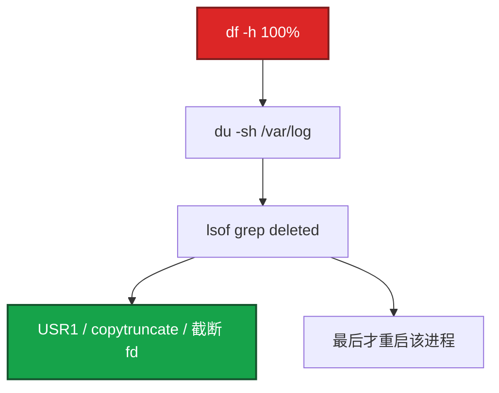

# 22｜日志运维 · 练习题

先对照 [知识点](知识点.md)：**先 §2 总图，再 §3 名词，再 §5～§10**。能讲清「本机先活」再谈采集与关联。每题标了覆盖范围：

| 标记 | 含义 |
|------|------|
| **核心** | 不懂整章就没建立起来 |
| **必会** | 值班和面试都要能讲 |
| **常用** | 线上会反复碰到 |
| **常考** | 白板和追问的高频口径 |

## 本题目录

- [Q1 盘满三步 / deleted](#q1)
- [Q2 rotate + reopen](#q2)
- [Q3 journald / rsyslog 分工](#q3)
- [Q4 采集丢失按段查](#q4)
- [Q5 Filebeat multiline / registry](#q5)
- [Q6 结构化与 trace_id 关联](#q6)
- [Q7 ELK vs Loki](#q7)
- [Q8 Loki 查询与高基数](#q8)
- [Q9 日志告警 vs 探活](#q9)
- [Q10 Docker overlay](#q10)
- [Q11 rotate 配了却没切](#q11)
- [Q12 JSON 级别与保留](#q12)
- [合上书](#合上书)

---

## Q1

**★★★★★｜日志把磁盘写满了怎么处理？rm 后 df 仍 100% 先找什么？**

**覆盖**：核心 · 必会 · 常考

**对应**：知识点 §5（兼 §2.6、§10）

### 场景

活动开始 2 小时，游戏服磁盘 100%，登录失败。有人 `rm /var/log/game/*.log`，`du` 立刻变小，`df` 还是 100%。另有人要先装 Filebeat「好排查」。

### 完整解答

**一句话**：盘满先 `df`→`du`→`lsof deleted`；`rm` 不释放空间时进程还握着 inode，会 reopen 用 USR1，不会用 copytruncate——别先装采集、别先加盘。



空间不释放是 [09](../09-文件系统与inode/) 的经典：删的是目录项，inode 还在。本章止血动作是 **轮转 + reopen / 截断 fd**。不要先 kill 逻辑服；机器写不动时先装 Filebeat 也白搭。

同时看 `df -i`：inode 满是另一条路，去 14。

### 再追问

- 紧急能不能 `> /proc/PID/fd/N`？——能，确认是写日志的 fd 后可止血；仍要补上长期 rotate。
- 只 vacuum journal 够不够？——不够，必须改 `SystemMaxUse`，否则还会满。

---

## Q2

**★★★★★｜logrotate 怎么配？copytruncate 和 USR1 怎么选？**

**覆盖**：核心 · 必会 · 常考

**对应**：知识点 §6

### 场景

自研游戏服不懂 USR1。nginx access 有人一律 copytruncate。有人说「有 `/etc/logrotate.d/` 就等于切了」。

### 完整解答

**一句话**：会 reopen 用 `create`+`postrotate` USR1；不会 reopen 的自研用 copytruncate；有配置还要 cron 真跑且进程真 reopen。

自研示例要点：`daily / rotate 7 / copytruncate / compress / delaycompress / missingok / notifempty / dateext`。

nginx/rsyslog：`create` + `postrotate` 里 `kill -USR1`，**去掉** copytruncate。Docker json-file：必须 `max-size`/`max-file`。

copytruncate 缺点：拷贝时仍在写，可能丢或重复一行。比盘满值得；能 USR1 就不要用它。

### 再追问

- `delaycompress` 是什么？——今天切的先不压，明天再压昨天的，避免还在 reopen 窗口的文件被 gzip。

---

## Q3

**★★★★☆｜journald / rsyslog / 应用文件怎么分工？**

**覆盖**：核心 · 必会 · 常用

**对应**：知识点 §4

### 场景

所有业务 `print` 打到 syslog，messages 一天 50G。journal 没限额，/run 也爆，ssh 诡异卡。

### 完整解答

**一句话**：systemd 服务→journald（必设 `SystemMaxUse`）；认证/cron→rsyslog；游戏业务→独立目录+logrotate，不要挤 messages。

```text
systemd stdout  → journald（Storage + SystemMaxUse）
auth/cron/kern  → rsyslog → /var/log/secure|cron|messages
游戏业务        → /var/log/game + 自己的 rotate
```

转发：`*.* @@logserver:514` 把系统日志离机（审计离机见 [27](../27-Linux安全加固/)）。应用更常用 Filebeat 直读文件。两套抢一个文件会轮转打架。

journal 只放内存：重启丢、占 tmpfs。生产持久化并封顶。排障用 `journalctl -u`，采集不要无限 `-f`。

### 再追问

- 只 `journalctl --vacuum-size` 不改配置？——应急可以，根治必须改 `SystemMaxUse`，否则还会满。

---

## Q4

**★★★★☆｜Kibana 缺最近 10 分钟 ERROR，怎么查？加 Kafka 一定不丢吗？**

**覆盖**：必会 · 常用 · 常考

**对应**：知识点 §7（兼 §2.7、§10）

### 场景

活动日志洪峰，Kibana 缺 10 分钟。有人猜「ES 慢」。本机 `df` 正常。另有人说「前面加了 Kafka 不可能丢」。

### 完整解答

**一句话**：先确认本机文件有没有这条；有则按 queue→lag→rejected 分段查；Kafka 是削峰不是无限水坝，队列满仍可能丢。

| 段 | 看什么 |
|----|--------|
| 本机文件 | `tail` 是否有 ERROR |
| Filebeat | status、registry、queue |
| Kafka | consumer **lag** |
| ES | rejected、磁盘、线程池 |

降本：ILM 热温冷删；200 采样、错误全留；冷进 OSS。审计按合规留 1y+，不和访问日志同一套 7 天。细调 ES 去 [02-09](../../02-中间件与数据库/09-Elasticsearch/)。

### 再追问

- 文件里没有这条？——先查应用级别/路径/是否写成功，别在采集层空转。

---

## Q5

**★★★★☆｜Java 堆栈 Filebeat 怎么合成一条？重复采集呢？**

**覆盖**：必会 · 常用

**对应**：知识点 §7.2

### 场景

异常在 Kibana 里碎成 40 行，grep 不全。重启 Filebeat 后昨天的日志又进了一遍。

### 完整解答

**一句话**：multiline 按行首日期合并堆栈；重复采集常是 registry 丢了或两 agent 盯同一路径。

```yaml
multiline.pattern: '^[0-9]{4}-[0-9]{2}-[0-9]{2}'
multiline.negate: true
multiline.match: after
```

行首是日期的是新事件；否则追加。pattern 要和真实行首一致。

重复：`/var/lib/filebeat/registry` 丢了会从头读；两个 Filebeat 盯同一路径；rotate 后 inode 变，配置没处理 renamed。

### 再追问

- Logstash grok 失败会怎样？——进 `_grokparsefailure` 或原样。JSON 日志少 grok。先改应用输出。

---

## Q6

**★★★★★｜为什么要 JSON？trace_id 怎么做请求关联？**

**覆盖**：核心 · 必会 · 常考

**对应**：知识点 §8

### 场景

明文日志 grok 随版本炸。客服给了 `player_id` 和大概时间；网关有 502，逻辑服有 ERROR，对不上是不是同一次登录。有人说「已经是 JSON 了，关联没问题」。

### 完整解答

**一句话**：生产 JSON + UTC + 必备字段；关联靠全程同一 `trace_id`——有 JSON 没有透传 trace，照样对不齐。

必备：`@timestamp`（UTC）、`level`、`service`、`message`；尽量 `trace_id`、`player_id`（脱敏）、`error`、`duration_ms`。

```text
网关 access  trace_id=abc123
逻辑 ERROR   trace_id=abc123  player_id=12345
下游         trace_id=abc123
```

现场：先按 `player_id`+时间窗找到 ERROR → 取出 `trace_id` → 反查网关与下游。没有 `trace_id` 只能人肉对时间，多副本极易对错。

时间戳用本机 localtime 不行——存 UTC（[25](../25-NTP与时间同步/)），Kibana 再转。

### 再追问

- 结构化 vs 关联差在哪？——结构化=字段稳定好搜；关联=跨组件同一把钥匙（`trace_id`）。

---

## Q7

**★★★★★｜ELK 和 Loki 怎么选？**

**覆盖**：核心 · 必会 · 常考

**对应**：知识点 §9

### 场景

老板要「像搜谷歌一样搜日志」，也要「别那么贵」。有人主张 Loki 全面替换 ELK，并把 `player_id` 做成 label。

### 完整解答

**一句话**：搜正文关键词/玩家 ID 用 ELK；只要 label+时间、成本敏感用 Loki；禁止 `player_id` 当 label。

可以拆：平台 / K8s 日志 Loki（形态见 04-19）；客服搜角色行为 ELK。不是信仰。Loki 把 `player_id` 当 label = 高基数爆炸；ID 放行内过滤。

### 再追问

- 你们生产用哪个？——按场景答拆分，不要只站队。

---

## Q8

**★★★★☆｜Loki 查询怎么写？和 ES 思维差在哪？**

**覆盖**：必会 · 常用

**对应**：知识点 §9.2

### 场景

有人在 Loki 里搜「任意一句话」，扫半天超时。另有人把 URL path 也抽成 label。

### 完整解答

**一句话**：Loki 先缩 label 再扫内容，高基数 label 禁止，思维不同于 ES 倒排。

```logql
{service="game-server"} |= "ERROR"
{service="game-server"} | json | level="error"
{service="game-server"} | json | player_id="12345"
rate({service="game-server"} |= "ERROR" [5m])
```

`status` 可抽 label（基数低）；URL path、玩家 ID、`trace_id` 不行。

### 再追问

- `trace_id` 能当 Loki label 吗？——不能，基数爆炸；放行内，先用 service 缩流再过滤。

---

## Q9

**★★★★☆｜日志告警和探活告警怎么分工？**

**覆盖**：必会 · 常考

**对应**：知识点 §8.5（兼 §10）

### 场景

ERROR 一多就打电话，活动正常刷错误也打。入口挂了却没人知道，因为进程还在打 INFO。

### 完整解答

**一句话**：入口死活用 blackbox/SLO（21）；日志告警看错误速率与模式，解释为什么——不能替代探活。

FATAL、支付 ERROR 可以 P0；DEBUG 泄漏不能进生产。ElastAlert frequency、Grafana LogQL、日志抽指标进 Prom，都是同一思想：**速率，不是单条**。

例：5 分钟 ERROR **>100** 可 IM；活动 INFO/WARN 不要电话。

### 再追问

- audit.log 要不要进 ES？——要离机（17）。独立索引、更长保留、更严权限。不要和游戏 DEBUG 混一个 index。

---

## Q10

**★★★★☆｜Docker 把节点 overlay 写满，谁的责任？**

**覆盖**：必会 · 常用

**对应**：知识点 §6.5、§11

### 场景

容器 json-file 无上限，活动 access 日志在容器里打满节点。K8s 还没上。有人说「以后上 K8s 就好了，现在不用管」。

### 完整解答

**一句话**：裸 Docker 主机要在 `daemon.json` 设 json-file `max-size`/`max-file`；上 K8s 前不能用 04-19 代替主机配置。

应用仍应打 stdout 有节制或挂卷 + logrotate。`lsof deleted` 在**实际写文件的 mount 命名空间**看；宿主机 `lsof` 能看到容器进程握着的已删文件，别只进容器 `df`。

### 再追问

- kubelet 轮转能覆盖今天这台裸 Docker 吗？——不能。那是 04-19 的事；今天先改 daemon.json。

---

## Q11

**★★★★☆｜logrotate 跑了但 access.log 还在长，nginx 没切？**

**覆盖**：常用 · 常考

**对应**：知识点 §6.4、§10

### 场景

`/etc/logrotate.d/nginx` 有了，access.log 10G。日期文件没生成。有人只把 `rotate` 从 7 改成 30。

### 完整解答

**一句话**：rotate 了但 nginx 没 USR1 reopen，会继续写旧 inode，看起来「没切」。

1. cron/timer 是否真调了：`logrotate -d /etc/logrotate.conf`。  
2. 路径是否匹配、权限能否 rename。  
3. nginx 是否 USR1：`nginx -s reopen` / postrotate。  
4. `missingok`/`notifempty` 跳过空文件——不是 10G 还在长的根因。  
5. SELinux 拦 rename（[27](../27-Linux安全加固/) AVC）。

### 再追问

- 只改 rotate 天数能治「没切」吗？——不能。没切是 reopen/cron/权限问题，不是保留份数问题。

---

## Q12

**★★★★☆｜生产为什么关 DEBUG？热温冷怎么定？**

**覆盖**：必会 · 常用 · 常考

**对应**：知识点 §8.2、§8.3

### 场景

有人生产全开 DEBUG「ES 里滤就行」。访问日志和审计日志同一套 7 天删除。

### 完整解答

**一句话**：级别当开关，生产 DEBUG 关；应用热约 7d、访问更短、审计 1y+ 且独立，不和访问日志一锅炖。

| 类型 | 热 | 备注 |
|------|----|------|
| 应用 | **7d** | 温 30d / 冷 90d 常见 |
| 访问 | **3d** | 可对 200 采样 |
| 审计 | 更长，冷 **1y+** | 独立索引与权限 |

临时排障开 DEBUG 要有服务范围和过期时间。

### 再追问

- 全开 DEBUG 靠 ES 滤的代价？——活动期间本机盘与 ES 写入一起爆，采集 lag，排障反而瞎。

---

## 合上书

- [ ] **§2 总图**：谁在写 → 本机先活 → 采集 → 存查；五个卡点说得出
- [ ] **盘满三步**：`df`→`du`→`lsof deleted`；`rm` 后空间不回来先找什么
- [ ] **三源**：journald / rsyslog / 应用；`SystemMaxUse` 不设会怎样
- [ ] **rotate**：USR1 vs copytruncate；Docker `max-size`；有配置≠切了
- [ ] **采集**：multiline、registry；丢失 queue→lag→rejected
- [ ] **关联**：JSON 必备字段；`trace_id` 怎么串；UTC
- [ ] **选型**：搜玩家 ID 用谁；Loki 禁止高基数 label；告警 vs 探活
