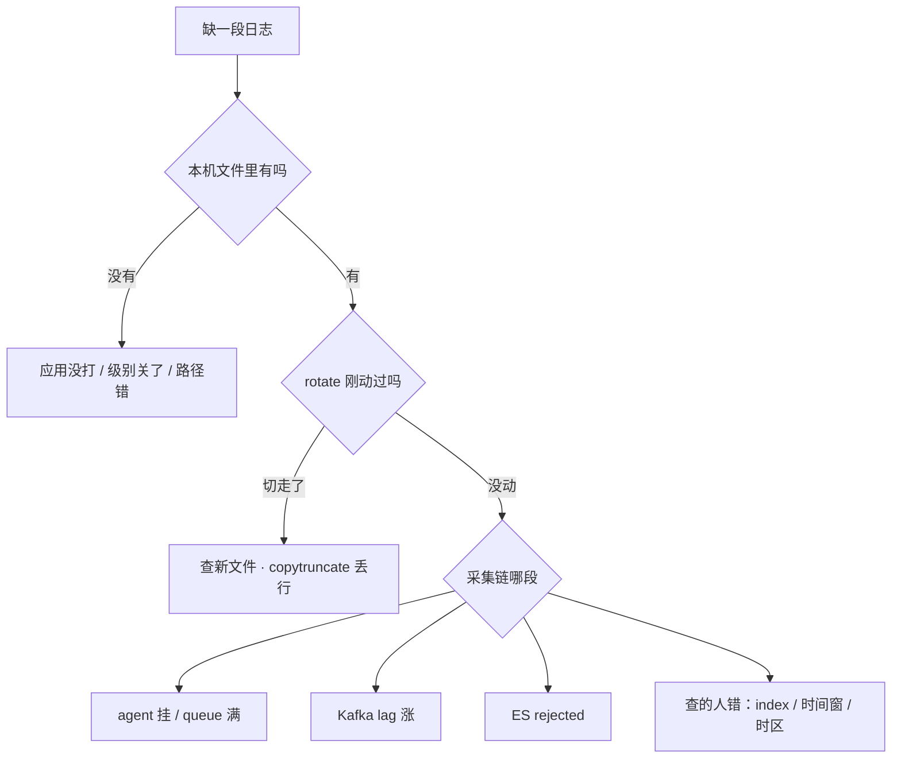

# 23｜日志运维 · 练习题

开始做题前，先给大家一个小建议：合上知识点，对着**第一节的主图**，把「一行日志的一生（出生 → 落地 → 轮转 → 出门 → 归宿 → 被检索）」口述一遍。能顺下来，下面这些题你会发现大半都会了；卡壳的地方，就是你该回去重读的那一节。

做题的方式也建议改一下：每道题**先看标题和场景，自己口述一遍答案，再往下看「完整解答」对答案**。直接看解答，容易产生「我会了」的错觉——能讲出来才是真的会。

| 标记 | 含义 |
|------|------|
| **核心** | 不懂整章就没建立起来 |
| **必会** | 值班和面试都要能讲 |
| **常用** | 线上会反复碰到 |
| **常考** | 白板和追问的高频口径 |

题目的顺序也是有意排的：Q1～Q2 先钉三层与 journal；Q3～Q7 轮转与盘满；Q8～Q12 采集与归宿；Q13～Q14 定责与白板收口。

## 本题目录

- [Q1 生产日志分几层](#q1)
- [Q2 journal 把盘打满](#q2)
- [Q3 copytruncate 还是 USR1](#q3)
- [Q4 logrotate 配了但没切](#q4)
- [Q5 Docker 节点被日志写满](#q5)
- [Q6 rm 之后 df 不降](#q6)
- [Q7 活动盘满事故链复盘](#q7)
- [Q8 Kibana 缺最近十分钟](#q8)
- [Q9 堆栈碎成 40 条 / 重启重放](#q9)
- [Q10 有 JSON 为什么还对不上](#q10)
- [Q11 ELK 还是 Loki](#q11)
- [Q12 日志保留与告警](#q12)
- [Q13 丢日志总定责](#q13)
- [Q14 日志运维白板综合题](#q14)
- [合上书](#合上书)

---

## Q1

**★★★★★｜生产机器日志分几层？排障时各用什么查？**

**覆盖**：核心 · 必会 · 常考 ｜ **对应**：知识点 [二、出生：三层日志体系，一行日志生在哪](知识点.md)

### 场景

面试官开场就问：「进程被杀了，你去哪看是谁干的？登录超时的报错你又去哪找？」

整章地基——三层日志体系。

先自己试试：内核/journal/应用文件各去哪查？

### 完整解答

> 🎯 **一句话**：内核层 dmesg、系统层 journalctl -u、应用层业务文件——按「这句话是谁说的」选工具。

- **内核层**：`dmesg` / `journalctl -k` 查 OOM、驱动、TCP 内核报错；环形缓冲，不落盘、新盖旧。
- **系统层**：`journalctl -u game-server -n 100 --since -p err`——systemd 事件与业务 ERROR 同一时间线。
- **应用层**：`tail -f /var/log/game/server.log`，业务自己写的文件；**谁生的谁负责养**（限额、轮转）。
- 排障套路三步：锁时间窗（`--since/--until`）→ 压级别（`-p err`）→ 抓关键词（`-g`），对时间线用 `-o short-precise` 拿毫秒级时间戳。

「进程被杀」先 `journalctl -k` 看 OOM、`journalctl -u` 看退出码与重启计数（→ [07](../07-内存与OOM/)、[11](../11-Systemd与服务管理/)）。

> ⚠️ **别混**：journal 和应用自写 `*.log` 是两路日志——重定向到文件的输出不进 journal；`journalctl -u` 查 nohup 拉的进程几乎是空的，这本身就是该迁到 systemd 的证据。

### 再追问

- `journalctl -b -1` 报「无旧日志」？——journal 没持久化，`/var/log/journal` 不存在就落 `/run/log/journal`（tmpfs），reboot 全丢；先 `Storage=persistent`。
- 应用 print 进 syslog 行不行？——不行，「messages 一天 50G」就是这么来的；业务写独立目录 + 自己的 logrotate，系统日志要离机可 `*.* @@logserver:514`（TCP 双 @）转发。
- 容器里看日志用什么？——`kubectl logs <pod>`（stdout），CrashLoop 用 `--previous` 看上一次崩前的（→ [03-20](../../03-Kubernetes/20-日志管理/)）。

---

## Q2

**★★★★☆｜journal 把 /var 吃满了，怎么救？怎么让它不再犯？**

**覆盖**：核心 · 必会 · 常考 ｜ **对应**：知识点 [二、出生：三层日志体系，一行日志生在哪](知识点.md)

### 场景

告警 `/var` 95%，`journalctl --disk-usage` 显示 3.9G。有人提议马上加盘，有人开始 rm journal 目录里的文件。

出生细考——journal 打满盘。

先自己试试：限额怎么设？SystemMaxUse 写了为什么还涨？

### 完整解答

> 🎯 **一句话**：--vacuum-size / --vacuum-time 止血，SystemMaxUse 限额根治——不加盘、不 rm。

```bash
journalctl --disk-usage        # 先看 journal 占多少
journalctl --vacuum-size=500M  # 立刻压到 500M 以内
journalctl --vacuum-time=2d    # 或只留最近两天
```

止血后必须补限额，否则下周同一告警再来：

```ini
# /etc/systemd/journald.conf
[Journal]
Storage=persistent
SystemMaxUse=2G
SystemKeepFree=500M
MaxRetentionSec=7day
```

改完 `systemctl restart systemd-journald`。

> ⚠️ **别混**：vacuum 是一次性止血，SystemMaxUse 才是根治；只 vacuum 不改限额 = 还会满。

### 再追问

- 为什么 rm journal 目录里的文件不行？——journald 握着这些文件的 fd，空间不释放，还可能损坏 journal；只能用 vacuum。
- /run 满、ssh 卡是什么组合？——journal 落 tmpfs（`/run/log/journal`）没限额，把 tmpfs 吃满，sshd 写不动；vacuum + Storage=persistent 一起改。

---

## Q3

**★★★★★｜copytruncate 和 create+USR1 怎么选？各自丢不丢日志？**

**覆盖**：核心 · 必会 · 常考 ｜ **对应**：知识点 [三、落地与轮转：logrotate 全套与 reopen](知识点.md)

### 场景

自研游戏服日志轮转方案评审。服务是 C++ 写的，没人确认过它会不会处理 USR1。有人直接抄了 nginx 的配置给所有服务用。

轮转选型——copytruncate vs USR1。

先自己试试：两种方式差在哪？什么时候不得已用 copytruncate？

### 完整解答

> 🎯 **一句话**：会 reopen 用 create+USR1 几乎不丢行；不会才 copytruncate，代价是拷贝窗口丢行。

- `create + postrotate`：rename 旧文件 → 建新空文件 → `kill -USR1` 让进程重新 open 新文件。nginx、rsyslog 这类会处理信号的服务用它。
- `copytruncate`：内容拷走 → 原地 truncate 原 inode。进程不需要懂信号，但拷贝瞬间正在写的行会丢/重。

抄 nginx 配置给一个不懂 USR1 的自研服 = 进程一直写被 rename 走的旧 inode，新文件永远空——比丢一行严重得多；反过来给 nginx 硬上 copytruncate，是拿能不丢的方案换成会丢的。

> 📝 **面试**：「切割 = rename + reopen，两件事缺一不可；copytruncate 是用丢行换兼容性，能 reopen 就不用它。」

### 再追问

- 怎么确认服务会不会 reopen？——测试环境 `kill -USR1` + `ls -l /proc/$(pidof svc)/fd`，看写日志的 fd 是否指向新文件。
- `delaycompress` 是干嘛的？——今天切的先不压、明天再压，避开还在写/reopen 窗口的文件被 gzip；配了 compress 一般都带上它。
- nginx 手动补一刀用什么？——`nginx -s reopen`。

---

## Q4

**★★★★☆｜logrotate 配置写了半个月，文件一直是同一个还在长，查什么？**

**覆盖**：必会 · 常用 ｜ **对应**：知识点 [三、落地与轮转：logrotate 全套与 reopen](知识点.md)

### 场景

`/var/log/game/server.log` 已经 10G，`/etc/logrotate.d/game` 两周前就上了。有人怀疑 logrotate 有 bug，有人只把 `rotate 7` 改成 `rotate 30`。

轮转故障——配了没切。

先自己试试：crontab / 信号 / 路径，先查哪三样？

### 完整解答

> 🎯 **一句话**：有配置 ≠ 切了——配置、cron/timer、reopen 三件事都成立才真切。

```bash
logrotate -d /etc/logrotate.conf           # ① dry-run：通配匹配到文件吗？权限能 rename 吗？
systemctl list-timers | grep -i logrotate  # ② cron/timer 真在跑吗？
ls -la /var/log/game/                      # ③ 日期后缀的新文件生成了吗？
nginx -s reopen                            # ④ 会 reopen 的服务手动补一刀验证
```

常见根因：路径通配没匹配到（配 `*.log` 但文件叫 `server.log.2026`）；目录属主是非 root 服务、缺 `su root root` 导致 rename 失败；cron 没跑（state 文件 `/var/lib/logrotate/logrotate.status` 记上次切割日期，weekly 靠它判断）；SELinux 拦 rename（查 AVC，→ [27](../27-Linux安全加固/)）。

> ⚠️ **别混**：`logrotate -d` 是 dry-run 只打印不执行；`-f` 才是强制切。`rotate 7 → 30` 改的是保留份数，治不了「没切」——没切是 cron/权限/reopen 的问题。

### 再追问

- 活动日 daily 也不够怎么办？——加 `size 100M` 按大小切，代价是一天可能切很多次，检查 rotate 份数与盘。
- `missingok`/`notifempty` 是干嘛的？——前者文件不存在不报错，后者空文件不切；它们不是「10G 还在长」的根因。

---

## Q5

**★★★☆☆｜裸 Docker 主机被容器日志写满，怎么治理？**

**覆盖**：必会 · 常用 ｜ **对应**：知识点 [三、落地与轮转：logrotate 全套与 reopen](知识点.md)

### 场景

一台没上 K8s 的活动节点 `/var/lib/docker/containers` 涨到 40G，单个容器的 json-file 日志占 38G。有人说「以后上 K8s 就好了，现在不用管」。

Docker 节点被日志写满。

先自己试试：json-file 限额怎么配？和 logrotate 谁管谁？

### 完整解答

> 🎯 **一句话**：daemon.json 给 json-file 设 max-size × max-file，别裸奔；上 K8s 不等于今天不用配。

```json
{
  "log-driver": "json-file",
  "log-opts": { "max-size": "100m", "max-file": "3" }
}
```

改完要重启 docker daemon，存量容器不追溯、需重建才生效。上了 K8s 由 kubelet 轮转兜底（→ [03-20](../../03-Kubernetes/20-日志管理/)），但那是集群侧的事，不能替今天的这台裸主机。

止血（不改配置先腾地方）：`truncate -s 0 /var/lib/docker/containers/<id>/<id>-json.log`——**别 rm**，daemon 握着 fd，`df` 不会降，和 Q6 同一个道理；查容器进程握着的已删文件要在**宿主机** `lsof`，别只进容器里 `df`。

### 再追问

- 为什么 rm 这个 json.log 没用？——dockerd 握着 fd，deleted inode 仍占盘；truncate 或重启容器才释放。
- max-file 3 是什么意思？——最多留 3 份轮转块，该容器日志上限约 100m × 3 = 300m。

---

## Q6

**★★★★★｜rm 了一个 20G 的日志，du 小了 df 没变，为什么？怎么救？**

**覆盖**：核心 · 必会 · 常考 ｜ **对应**：知识点 [四、生病：写满磁盘——du、df 与 deleted](知识点.md)

### 场景

盘中告警，同事 `rm` 掉大日志后 `du -sh /var/log` 显示正常，但 `df` 仍然 100%，登录继续失败。有人提议加盘、有人提议装 Filebeat。

就是开头「rm 之后 df 不降」。

先自己试试：为什么不降？第一刀敲什么？

### 完整解答

> 🎯 **一句话**：rm 只删目录项，进程握着的 inode 还占盘；reopen 或截断 fd 才能止血。

`rm` 删的是**目录项（名字）**；进程打开的 **inode + 数据块还在**，直到最后一个 fd close（账本原理 → [09](../09-文件系统与inode/)）。`du` 数「还看得见名字」的文件所以变小，`df` 看**已分配的块**所以不降。

```bash
lsof | grep deleted                        # game-serv 12345 3w ... server.log (deleted)
ls -l /proc/12345/fd/ | grep server.log    # 确认 fd 号
kill -USR1 $(pidof game-serv)              # ① 会 reopen：换新文件，最干净（nginx 用 nginx -s reopen）
> /proc/12345/fd/3                         # ② 不会 reopen：直接清空这个 fd
df -h /var                                 # 验收：降的量要对上 lsof 显示的 SIZE
```

两个错误处方都不听：加盘把根因盖住；本机都写不动了装 Filebeat 没意义。

> 📝 **面试**：先 `lsof | grep deleted` 定位握 fd 的进程 → 会 reopen 发 USR1，不会的截断 `/proc/PID/fd/N` → 对账 SIZE → 最后才考虑重启进程。

### 再追问

- 截断之后完事了吗？——没有；截断只清那一个 fd 的内容，进程还继续写它。收尾是补轮转配置和关 DEBUG，否则明天同一时间再来一次。
- df 降了但只降了一部分？——还有别的 deleted 或别的大户（容器 overlay、core 文件），继续查别宣布胜利。
- df -h 没满但 df -i 满了？——inode 满，小文件海量（另一条路，→ [09](../09-文件系统与inode/)）。

---

## Q7

**★★★★☆｜复述「写日志打满磁盘」的完整事故链，并给出止血顺序。**

**覆盖**：核心 · 常考 ｜ **对应**：知识点 [四、生病：写满磁盘——du、df 与 deleted](知识点.md)

### 场景

面试官：「活动开服两小时把盘写满了，从头到尾发生了什么？如果你当时在场，前五分钟做什么？」

活动盘满事故链复盘。

先自己试试：从轮转到 deleted，整条链怎么讲？

### 完整解答

> 🎯 **一句话**：DEBUG 忘关 → 没轮转 → 盘满 → rm 无效；止血 vacuum/reopen/截断，不动业务进程。

事故链逐环：活动高峰 DEBUG 忘关 → 日志速率暴涨 → 轮转没配/没生效 → `/var` 100% → 所有写盘调用失败（存档写不了、journal 写不进、ssh 卡）→ rm 大日志 → du 小 df 不降 → 登录继续失败。每一环单看都「有道理」，连起来就是 P0。

前五分钟（60 秒剧本展开）：

```bash
df -h /var && df -i /var          # ① 空间满还是 inode 满
du -sh /var/log/* | sort -h | tail # ② 找大户
lsof | grep deleted               # ③ 抓握 fd 的进程
journalctl --disk-usage           # ④ journal 的份；要救就 --vacuum-size=
tail 目标文件                      # ⑤ 本机有没有这条日志（兼看采集定责的入口）
```

根治是「四层闸」：journald `SystemMaxUse`、logrotate `rotate+compress`、Docker `max-size`、应用**关 DEBUG**——前三个管最多占多少盘，最后一个管产生多少。

### 再追问

- 为什么 DEBUG 全开靠 ES 过滤不行？——本机盘和 ES 写入会先被打爆；要滤也是采集端丢 DEBUG，不是源头猛打。
- 活动前应该做什么？——压测日志速率、按大小配轮转、临时 DEBUG 带过期时间。

---

## Q8

**★★★★★｜Kibana 缺最近十分钟 ERROR，怎么逐段定责？加 Kafka 一定不丢吗？**

**覆盖**：核心 · 必会 · 常考 ｜ **对应**：知识点 [五、出门：采集管道与丢失按段定责](知识点.md)

### 场景

活动日志洪峰，Kibana 缺 10 分钟。有人猜「ES 慢」开始重启 ES，有人说「前面加了 Kafka 不可能丢」。

就是开头「Kibana 缺十分钟」。

先自己试试：顺着主线从左往右，第一刀砍哪？

### 完整解答

> 🎯 **一句话**：按「本机文件 → Filebeat queue → Kafka lag → ES rejected」逐段查，先证明丢在哪段再动手。



四刀：`tail` 本机文件 → `systemctl status filebeat` → consumer group 的 LAG → ES indexing rejected。**先查 rotate 再查采集最后怀疑应用**；采集延迟（偏移差值在缩小）≠ 丢了。Kafka 是削峰不是无限水坝——队列满仍要有策略（阻塞/丢弃/死信），**加 Kafka ≠ 一定不丢**。重启 ES 是最后才轮到的动作，且通常不对——rejected 的根因常在映射冲突和磁盘水位（→ [02-04](../../02-中间件与数据库/04-Elasticsearch/)）。

### 再追问

- 什么情况是「查的人错」？——index 名按日期变了、时间窗写错、浏览器时区差 8 小时、字段名拼错；都是真实事故。
- Kafka lag 涨说明什么？——消费跟不上，问题在下游（ES 写入慢），扩消费或修下游；不是加分区就完事。
- 采集组件自身怎么被监控？——Filebeat up、queue 占用、lag、rejected、日志目录增长率（rotate 健康曲线是锯齿状）。

---

## Q9

**★★★★☆｜堆栈在 Kibana 碎成 40 条；重启 Filebeat 后昨天的日志又进来一遍。分别什么原因？**

**覆盖**：必会 · 常用 · 常考 ｜ **对应**：知识点 [五、出门：采集管道与丢失按段定责](知识点.md)

### 场景

两件事同一天发生：Java 异常的每一行堆栈变成独立文档；有人清理磁盘顺手删了 Filebeat 的数据目录，之后昨天的日志重复了。

出门细考——多行碎与重放。

先自己试试：堆栈碎成 40 条怎么治？重启会重放吗？

### 完整解答

> 🎯 **一句话**：multiline 没对齐真实行首；registry 丢了从头重读——都不是 ES 的锅。

```yaml
multiline.pattern: '^[0-9]{4}-[0-9]{2}-[0-9]{2}'   # 行首是日期才算新事件
multiline.negate: true
multiline.match: after
```

pattern 要对齐「**新事件的第一行**长什么样」（如行首日期），不是「错误行长什么样」；`negate + match after` = 不匹配的行追加到上一条后面。

重复的根因：Filebeat 在 `/var/lib/filebeat/registry` 记每个文件的读取偏移，删了它 = 从头读 = 全部重放。处理是按时间去重/清重复文档，**别当「ES 重复索引」病急乱投医**。

> ⚠️ **别混**：碎行是 multiline 的事、重放是 registry 的事；两个都修在 Filebeat 侧，加 ES 资源一个都治不了。

### 再追问

- 轮转和 registry 怎么配合？——rename 后 inode 变，配 `close_renamed: true` 及时关闭旧文件句柄，避免句柄泄漏和重复采集。
- 两套 agent 盯同一路径会怎样？——双份日志；两套 rotate 方案盯同一个文件会打架。
- Logstash grok 失败会怎样？——进 `_grokparsefailure`；它一冒头就该回应用改 JSON 输出，而不是继续堆正则。

---

## Q10

**★★★★★｜日志都打成 JSON 了，为什么还是对不上一次请求？**

**覆盖**：核心 · 必会 · 常考 ｜ **对应**：知识点 [六、归宿：结构化、trace_id 与 ELK/Loki](知识点.md)

### 场景

各服务都上了 JSON 日志。玩家反馈「支付失败」，你搜 player_id 搜到几十条，但拼不出这次请求跨网关、逻辑服、DB 的完整链路。

归宿——有 JSON 为何对不上。

先自己试试：缺什么字段？trace_id 放哪？

### 完整解答

> 🎯 **一句话**：结构化解决好搜好滤，关联靠 trace_id 入口注入 + 全程透传——JSON 不等于关联。

正确做法：网关收到请求时生成（或透传 `X-Trace-Id`）写进 access 日志并随转发带上；逻辑服从 context 取出写进每条业务日志；调 DB/RPC 继续传。之后 `trace_id="abc123"` 一搜，整条链路按时间排好。

```json
{"@timestamp":"2026-08-26T10:00:00.000Z","level":"ERROR","service":"game-server",
 "trace_id":"abc123","player_id":"12345","message":"登录失败","duration_ms":42}
```

反模式四条：每层自己 `uuid()`（都有 id 但串不动）、只在 ERROR 带（成功路径没对照）、trace 放非结构化 message 里（字段过滤不稳）、各机 localtime（同一秒对不齐）。

> ⚠️ **别混**：`@timestamp` 存 UTC（跨机房对得齐，校时 → [32](../32-NTP与时间同步/)）；Logstash 的 date 插件用**日志事件时间**不是采集时间，否则延迟几十秒时间线就错位。

### 再追问

- 采样还是全量？——ERROR 全留、访问日志 200 采样 4xx/5xx 全留；trace_id 全链路都要有，不然断链。
- player_id 要脱敏吗？——展示层脱敏；索引层保留才能搜。

---

## Q11

**★★★★☆｜ELK 和 Loki 怎么选？Loki 里 player_id 能不能当 label？**

**覆盖**：核心 · 必会 · 常考 ｜ **对应**：知识点 [六、归宿：结构化、trace_id 与 ELK/Loki](知识点.md)

### 场景

老板嫌 ELK 贵，要求全迁 Loki。客服的日常是「按玩家 ID 搜操作记录」，有人还把 `player_id` 和 URL path 抽成了 label。

选型——ELK 还是 Loki。

先自己试试：全文检索 vs label，怎么选？

### 完整解答

> 🎯 **一句话**：搜玩家 ID 用 ELK；Loki 只索引 label、先缩流再扫——高基数字段禁止当 label。

| 对比 | ELK / EFK | Loki |
|------|------|------|
| 索引什么 | 全文倒排索引 | 只索引 label |
| 成本 | 高 | 低 |
| 适合 | 搜玩家 ID / 任意关键词 | 按 service/level/pod 查 + 成本敏感 |

`player_id`、URL path、`trace_id` 是**高基数（high cardinality）**字段——每种取值组合都是一条新索引流，当 label 直接爆炸。正确写法放行内：

```logql
{service="game-server"} | json | player_id="12345"    # label 缩流 + 行内过滤
rate({service="game-server"} |= "ERROR" [5m])          # 错误速率告警
```

落地建议：平台/K8s 日志走 Loki（Promtail 采集），客服搜角色行为留 ELK——按场景拆，不是信仰站队。`status` 这类几十种取值封顶的低基数字段才可以抽 label。

### 再追问

- 在 Loki 里搜任意一句话会怎样？——全表扫描超时；那是 ELK 的用法。
- 你们生产用哪个？——按场景答拆分（平台 Loki + 客服 ELK），不要只站队。

---

## Q12

**★★★☆☆｜日志保留策略怎么分层？日志告警和探活有什么分工？**

**覆盖**：必会 · 常用 ｜ **对应**：知识点 [六、归宿：结构化、trace_id 与 ELK/Loki](知识点.md)

### 场景

审计说「安全日志要留一年」，老板说「存储太贵都留 7 天」。另外上周入口挂了半小时才有人发现，因为「没有 ERROR 日志」；而活动期 ERROR 刷屏又天天误打电话。

保留与告警。

先自己试试：保留多久？哪条告警必须有？

### 完整解答

> 🎯 **一句话**：按日志类型分层保留，审计独立；探活管叫人，日志解释为什么。

- 应用：热 7d / 温 30d / 冷 90d；访问：热 3d、200 采样 4xx/5xx 全留；安全审计：**1y+、独立索引、更严权限、离机保存**（→ [27](../27-Linux安全加固/)）。
- ES 落地用 ILM：hot rollover（50gb/1d）→ warm 7d shrink → delete 90d。
- 告警看**速率不是单条**：frequency（5 分钟 ERROR > 100 打 IM）、spike（相对基线突增 5 倍才电话）；活动期 INFO/WARN 刷屏不叫人。
- 入口挂了进程还在打 INFO——ERROR 计数不会响，**探活会**（→ [22](../22-监控与告警/)）；FATAL、支付 ERROR 可以 P0。

### 再追问

- 为什么审计和访问不能同一套 7 天？——审计的事后追溯以月/年计；同套策略等于毁证。
- 什么时候日志告警先响？——错误暴涨但探活还绿（半死不活）的时候；两套都要有。

---

## Q13

**★★★★☆｜把「丢日志」的四个方向和排查顺序一口气说完。**

**覆盖**：核心 · 常考 ｜ **对应**：知识点 [七、作战：丢日志定责与止血](知识点.md)（主图见 [一、一张图：一行日志的一生](知识点.md)）

### 场景

面试收尾题：「别管细节，给我一套丢日志的定责框架，30 秒。」

定责收口——丢日志总图。

先自己试试：六段各有什么坏法？60 秒怎么走？

### 完整解答

> 🎯 **一句话**：搜不到只有四方向——本机没打、被轮转切走、采集堵了、查的人查错了；按主线从左往右砍。

1. **本机没打**：级别关了 / 路径错了 / 进程没跑——`tail` 文件见分晓。
2. **被切走**：rotate 刚切、copytruncate 窗口丢行——看新文件和轮转日志。
3. **采集堵**：agent 挂 / queue 满 → Kafka lag 涨 → ES rejected——逐段有签名。
4. **查的人错**：index 名、时间窗、时区、字段名。

顺序纪律：**先 rotate 再采集最后怀疑应用**；本机盘满先救本机（vacuum/reopen/截断），不动业务进程、不删索引、不先扩 ES。

### 再追问

- 为什么不先查 ES？——ES 在链路最右，概率最低、代价最高；顺着主线砍最快。
- 一句话总结全章？——一行日志的一生六段，每段有闸门有签名；止血靠 vacuum/reopen/截断，根治靠限额与 trace_id。

---

## Q14

**★★★★★｜白板：日志一生六段 + 盘满事故链 + 丢日志四方向？**

**覆盖**：核心 · 必会 · 常考 ｜ **对应**：知识点 [一、一张图](知识点.md) · [九、收口](知识点.md)

### 场景

白板：「活动盘满，从 journal 到 logrotate 到 agent 到 ES，画主线。」

白板综合——整章收口。

先自己试试：一行日志的一生 + 三个现场，90 秒怎么讲？

### 完整解答

> 🎯 **一句话**：**出生→落地→轮转→出门→归宿→检索**；盘满先本机 vacuum/截断；丢日志四方向（Q13）。

```text
止血: journalctl --vacuum-size · nginx reopen · >file 截断
轮转: create+USR1 优于 copytruncate（在线）
采集堵: lag/rejected 分段定责
trace_id: 贯穿排障
```

> 📝 **面试**：rm 后 df 不降 → lsof +L1（Q6）。

### 再追问

- ELK vs Loki 谁搜玩家 ID？——Loki 标签低基数（Q11）。

---

## 合上书

对齐知识点「合上书」，逐条口述，卡住就回对应节 / 题号。现在再看开头那三个现场——盘满、rm 不降、缺十分钟——你该知道先查哪一段了。

- [ ] 默画主图：出生 → 落地 → 轮转 → 出门 → 归宿 → 被检索，六个卡点各是什么
- [ ] 三层日志体系各收谁的话、各用什么命令查？journalctl 值班全套能默写吗
- [ ] journal 打满盘的两条急救命令？为什么 vacuum 不是根治？
- [ ] copytruncate 和 create+USR1 各自机制与代价？「配了没切」查哪三件事？
- [ ] rm 后 df 为什么不降？止血三选一的顺序和验收对账怎么做？
- [ ] 采集链按段定责：queue → lag → rejected 各看什么指标？multiline 和 registry 的坑？
- [ ] trace_id 怎么注入透传？@timestamp 为什么存 UTC？
- [ ] ELK vs Loki 谁搜玩家 ID？Loki label 的高基数红线？
- [ ] 保留怎么分层？日志告警和探活怎么分工？
- [ ] 白板日志一生综合（Q14）

与知识点「合上书」对齐；都能口述这一章就过了。
