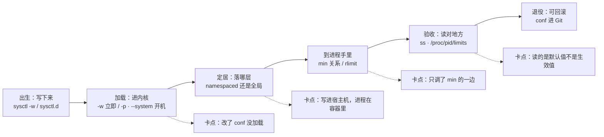
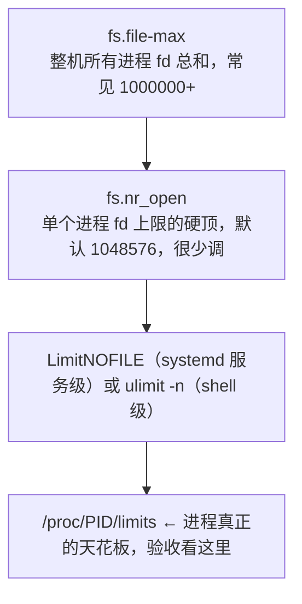
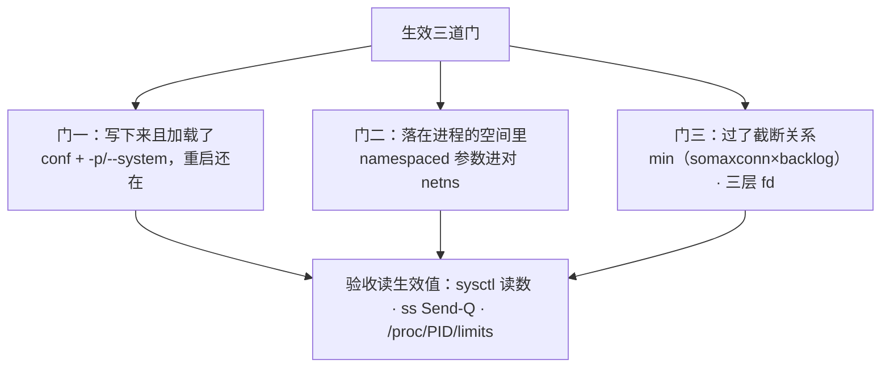
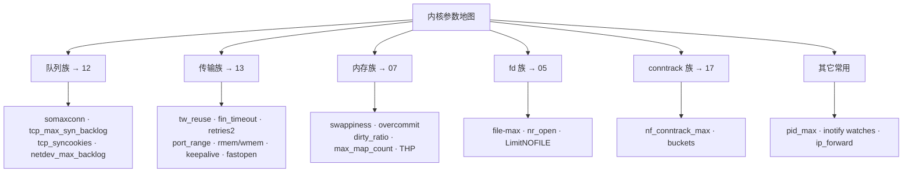
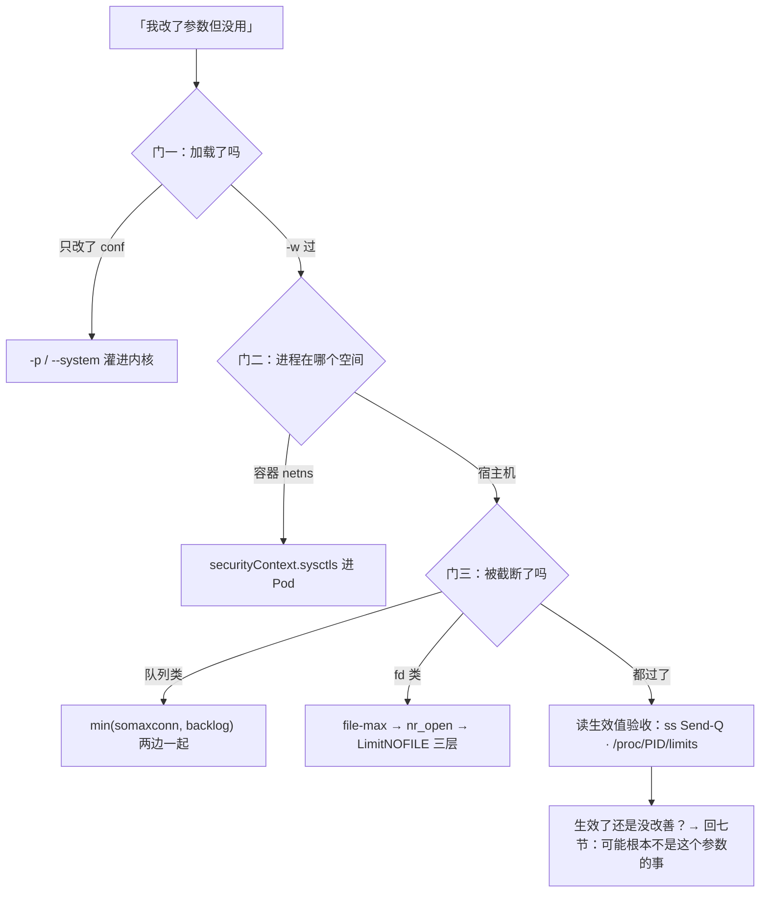

# 内核参数与 sysctl

> 大家好，欢迎来到这次分享。开讲之前，先带大家回到一个很多值班同学都经历过的现场：
> 活动开闸瞬间登录超时。有人把群里传的「生产 sysctl 万能优化清单」整份糊上机器，`somaxconn` 写了 32768，`ss -lnt` 的 Send-Q 还是 128；下一台 Redis 又糊同一份，延迟反而出现毛刺——参数写进去了，进程却没用上，或者写错了层。
> 这一章讲完，你会知道当时那个人错在哪，以及三道门怎么逐道验收。
> **本章回答**：一个内核参数从写进配置到真正被进程用上的一生（三道门），以及常调参数的全景地图与调参纪律。
> **不讲**：各参数的机制深挖——somaxconn/半连接全连接队列 → [12](../12-网络栈与Socket/)，TIME_WAIT/窗口/内核心跳 → [13](../13-TCP与UDP/)，swappiness/overcommit/OOM → [07](../07-内存与OOM/)，fd 与 rlimit 原理 → [05](../05-进程与信号/)，conntrack 表与 NAT → [17](../17-iptables与conntrack/)，安全向 sysctl（redirects/rp_filter）→ [27](../27-Linux安全加固/)，cgroup 限额与 sysctl 的分工 → [10](../10-cgroup与容器/)。这些都有专门的章节，本章只在用到时点到为止。

**标记**：🎯重点 · 🔥难点 · ⭐常考 · 🔧实操

**怎么听这场分享**：咱们先看第一节的主图，把「一个内核参数的一生」装进脑子；第二到第七节顺着写下来 → 定居 → 到进程 → 地图 → 罪状 → 纪律往下走；第八节专门讲定责，也就是开头那个现场的正确解法。每一节讲完都会提示对应练习题，学完就去练。

---

## 一、一张图：一个内核参数的一生

> 🎯 **一句话**：参数要过三道门才算生效——写下来、加载对地方、到得了进程手里；每道门都有「写了没用」的翻法。

咱们先不急着背参数清单。学 sysctl 最怕的就是「改了 conf 就以为生效了」。先看图，把「卡在哪道门」装进脑子里：



**读图**：带着三个问题看这张图，比背参数名有用得多：

- 主线六段：写下来 → 加载 → 定居（哪个 namespace）→ 到进程手里（被 min/rlimit 截一刀）→ 验收 → 可回滚；下排四个卡点就是「我明明改了」的四种真实翻车。
- 排障顺序顺着主线从左往右：先证明「写了吗、加载了吗」，再查「落在哪层、到没到进程」，最后才谈参数值本身合不合理。
- `sysctl`/`cat /proc/sys` 照前两段，容器内读数照「定居」，`ss -lnt` 的 Send-Q 与 `/proc/pid/limits` 照「到进程手里」——三处读数对不上，就卡在中间某道门。
- 开场三个现象各卡在哪：Send-Q 仍 128 → 门三（min 只调一边）或门二（参数进了宿主机 netns）；Redis 毛刺 → 不是门的问题，是清单打错了角色（六节）；「重启后回旧值」→ 门一（conf 没加载或被覆盖）。

---

---

好，主图有了。咱们正式出发——第一站：怎么写下来、怎么持久化？

---

## 二、出生：写下来——sysctl 读写机制与持久化三件套

> 🎯 **一句话**：/proc/sys 是内核参数的开关面板，sysctl 是拧它的手；-w 只管这一次，落盘 + 加载才管一辈子。

### /proc/sys 与 sysctl 是什么

**sysctl（system control）** = 内核暴露在 `/proc/sys/` 下的**运行时可调参数**：目录结构即参数名（`net/ipv4/tcp_tw_reuse` ⇄ `net.ipv4.tcp_tw_reuse`，点分隔与斜杠分隔是同一个东西的两种写法）。读写有两种等价方式：`sysctl -w net.ipv4.tcp_tw_reuse=1` 和 `echo 1 > /proc/sys/net/ipv4/tcp_tw_reuse`。

### 持久化三件套 ⭐

> 💡 **打个比方**：`sysctl -w` 像现场把音量拧小——立刻生效，但重启后机器只认说明书；写进 `/etc/sysctl.d/*.conf` 像把默认音量写进说明书——重启后还是你调过的值。只拧不写，改了等于白改；只写不加载，写了等于没写。

```bash
sysctl -w net.core.somaxconn=32768      # ① 立即生效，重启即丢（临时验证/紧急止血用）
```

```ini
# /etc/sysctl.d/99-game.conf            # ② 持久化：按角色拆文件，别全堆一个
net.core.somaxconn = 32768
net.ipv4.tcp_max_syn_backlog = 8192
net.ipv4.ip_local_port_range = 1024 65535
```

```bash
sysctl -p                                # ③ 只重读 /etc/sysctl.conf 这一份
sysctl --system                          # ③' 按文件名顺序读所有 sysctl.d/*.conf + sysctl.conf
```

**加载顺序是面试常客**：`--system` 按文件名字典序逐个读，**后读的覆盖先读的**——`99-game.conf` 覆盖 `50-default.conf` 的同名项；两份 `99-*.conf` 撞了同名参数，字典序大的赢。所以按角色拆文件（`99-web.conf`、`99-redis.conf`、`99-k8s-node.conf`，安全向另放 `99-security.conf` → [27](../27-Linux安全加固/)）既好回滚又能一眼看出这台机器「为谁调过参」。舰队级落地用云镜像 / Ansible / 节点 DaemonSet 下发，**禁止登录手糊当唯一真相**——conf 必须进 Git。

> ⚠️ **别混**：改了 conf ≠ 生效——conf 只是纸面，`-p`/`--system` 或重启才把它灌进内核。反过来 `sysctl -w` 过的值也不写回 conf；`sysctl` 读到的是**当前生效值**，不是「配置里写了什么」。

> 🔍 **现场**：验收三连，任何一次调参后的固定动作 🔧：
>
> ```bash
> ls /etc/sysctl.d/99-web.conf                  # ① conf 在不在、哪份是真相
> sysctl net.core.somaxconn                     # ② 当前生效值
> # net.core.somaxconn = 32768                  ← 改对了
> sysctl --system 2>&1 | grep -i somaxconn      # ③ 从哪个文件加载、有没有被后面覆盖
> # * Applying /etc/sysctl.d/99-web.conf ...
> # net.core.somaxconn = 32768                  ← 纸面与运行时对上了，这道门才算过
> ```

三个低级但高频的坑：conf 里 key 拼错**不报错也不生效**（`--system` 输出里它根本不出现，逐行对一遍）；两台「同角色」机器 conf 不同步时，**以机器活值为准**去追配置管理；`=` 两边有没有空格都行，但每条参数要带一行注释写清**为什么调、哪条工单**——半年后没人记得哪条是止血、哪条是跟风。

---

---

出生段到这儿。本节对应练习题 Q1、Q2。好，会写了——大家想想：宿主机改了，容器里进程为什么还是旧值？

---

## 三、定居：namespaced 还是全局——内核听谁的

🔥 容器里读数还是 128——真凶往往是**写错了 netns**。大白话：**有的参数跟网络命名空间走，改宿主机改不到容器里的那份**。⭐ 面试必考（练习题 Q4）。

> 🎯 **一句话**：多数 net.* 参数每个网络命名空间一份，fs/vm/kernel 是全机一份；进程在哪个 namespace，就听哪份的。

### 两类参数 ⭐

> 💡 **打个比方**：namespaced 参数像每间宿舍自己的电闸——你房间跳闸不影响隔壁，你在自己房间也修不了全楼的总闸；全局参数（vm.*、fs.*、kernel.*）就是那把全楼总闸，只有物业（宿主机 root）能动。

| 对比 | namespaced（每 netns 一份） | 全局（全机一份） |
|------|------|------|
| 典型参数 | 多数 `net.ipv4.*`、`net.core.*`（somaxconn、tw_reuse、ip_local_port_range） | `vm.swappiness`、`vm.overcommit_memory`、`fs.file-max`、`kernel.pid_max` |
| 改宿主机影响容器吗 | 不影响已有 netns（容器各有一份） | 直接影响全机（含容器） |
| 容器里能改吗 | 可以（Pod securityContext.sysctls / docker --sysctl） | 一般不行（需特权，生产禁止） |

注意内核版本差异：`net.core.somaxconn` 在较新内核才 namespaced，旧内核只能改宿主机；`nf_conntrack_*` 是模块/节点级，走宿主机。**不确定就两边都读一遍对账**。

哪个参数是不是 namespaced 不用背，三招现场判断：① 改宿主机前后到容器里读一遍——变了就是全局、没变就是 namespaced（或这版内核里是）；② 看 kubelet 的 safe sysctls 白名单，在列的（`net.ipv4.ip_local_port_range`、`tcp_keepalive_time` 等）都能走 securityContext；③ 拿不准就两边读数对账——对账永远比记忆可靠。不在白名单的 unsafe sysctls 要 kubelet `--allowed-unsafe-sysctls` 显式放开，生产放开必须过变更评审——「safe/unsafe」的分界就是内核认为它**跨命名空间是否安全**。

**容器的正确写法**（以 somaxconn 为例）：

```yaml
spec:
  securityContext:
    sysctls:
    - name: net.core.somaxconn      # safe sysctl 白名单内的名字
      value: "32768"                 # 写进这个 Pod 的 netns，不影响宿主机和别的 Pod
```

**经典坑**：在宿主机 `sysctl -w net.core.somaxconn=32768`，Pod 里 `cat /proc/sys/net/core/somaxconn` 还是 128——Pod 的 netns 是 CNI 另建的一份，宿主机那份和它无关。反过来想在 Pod 里改 `vm.swappiness` 会直接被拒——全局参数不 namespaced；**特权 initContainer 悄悄改整节点 sysctl 也是红线**（无变更单、无回滚、影响同节点所有 Pod），节点级参数走镜像/DaemonSet，有审计。

> 🔍 **现场**：判断「这个参数对这个进程生效没有」，进到进程所在的空间里读：
>
> ```bash
> kubectl exec {pod} -- cat /proc/sys/net/core/somaxconn   # 容器视角，读到 128 = 没生效
> nsenter -t {PID} -n cat /proc/sys/net/core/somaxconn     # 宿主机上按进程的 netns 读
> sysctl net.core.somaxconn                                # 这是宿主机 netns 的值，别拿它当容器的
> ```

> ⚠️ **别混**：宿主机敲 `sysctl` 读的是**宿主机 netns**；进程在容器 netns 里，两边是两份独立的参数。验收永远在**进程所在的 namespace** 里读（`nsenter -n` 或 kubectl exec）——「宿主机改了容器没变」不是 bug，是定居那道门没过。

---

---

定居段到这儿。本节对应练习题 Q4。回到开头 Send-Q 还是 128——只调 somaxconn 为什么不够？

---

## 四、到进程手里：min 关系与 fd 三层

🔥 `somaxconn` 写了 32768，Send-Q 还是 128——**高频错答是「内核坏了」**。大白话：**生效值 = min(somaxconn, 进程 listen backlog)**，只调一边等于没调。口诀：**「min 两边都要够」**（练习题 Q3）。

> 🎯 **一句话**：内核上限和应用自己的上限取 min 才是生效值；fd 还有第三层 rlimit——多层里最低的那个说了算。

### somaxconn × listen backlog：只调一边无效 🔥⭐

**somaxconn** 是内核给「全连接队列」设的上限；应用 `listen(fd, backlog)` 也会报一个数。**生效队列长度 = min(应用 backlog, somaxconn)**——这是本章最经典的一道门。

> 💡 **打个比方**：内核和应用各拿一节水管接在一起，实际流量由**最细的那节**决定——somaxconn 拧到 32768 而应用还 listen(128)，水流卡在应用那节，内核那节再粗也白搭；调参先找最细的那节在哪。

默认 128 的机器上，应用写 `listen(fd, 65535)`：生效 128。开服洪峰握手完了也进不了 accept 队列，客户端看到超时——队列机制（半连接/全连接/Recv-Q）→ [12](../12-网络栈与Socket/)，本章只管调参侧的纪律：

- **两边一起调**：应用侧 backlog 调大 **和** `somaxconn=32768`，缺一边都是白调。
- 验收看 `ss -lnt` 的 **Send-Q**（LISTEN 状态下显示的是实际 backlog），不是看 conf 里写了什么：

```bash
ss -lnt | grep 443
# LISTEN 0  128  0.0.0.0:443   ← Send-Q=128：somaxconn 或 backlog 还有一边没调到
```

- 容器里还有第三重：**Pod 的 netns 里也要有这份 somaxconn**（三节），三层全过 Send-Q 才会变。

> 🔍 **现场**：somaxconn 调完的验收（应用 backlog 已一起调到 65535）🔧：
>
> ```bash
> ss -lnt | grep ':443'
> # LISTEN 0  128    0.0.0.0:443    ← 改之前：Send-Q=128
> # LISTEN 0  32768  0.0.0.0:443    ← 改之后：Send-Q 变了才算「生效」
> nstat -az | grep -i ListenOverflows ; sleep 60 ; nstat -az | grep -i ListenOverflows
> # TcpExt: ListenOverflows  1234 ...  →  1235 ...   ← 洪峰中差值不再涨才算「有效」
> ```
>
> 两个读数证明两件事：Send-Q 变了证明**生效**（过了三道门），溢出计数停涨证明**有效**（值调对了）——生效和有效是两次独立的验收，别混成一次。

> ⚠️ **别混**：`somaxconn` 卡**全连接队列**（握手完成等 accept），`tcp_max_syn_backlog` 卡**半连接队列**（握手中）——两个队列两个参数：洪峰时 `nstat` 的 `ListenOverflows` 涨是前者，SYN 丢弃是后者；队列与四个「满」的定责 → [12](../12-网络栈与Socket/)。

### fd 三层：file-max → nr_open → LimitNOFILE ⭐

打开文件数（fd）上限是三层套娃，**最低的那层说了算**：



- 报 `Too many open files` 十次九次卡在进程 soft 仍是 1024，不是 `file-max`：先 `cat /proc/<PID>/limits` 看进程天花板，再对照 `cat /proc/sys/fs/file-nr`（已分配/未用/上限）看整机水位——**先定位是哪一层顶住**，再调那一层（fd 与 rlimit 原理 → [05](../05-进程与信号/)）。
- systemd 服务改 LimitNOFILE 要写 unit drop-in（`systemctl edit`），**`/etc/security/limits.conf` 对 systemd 服务不生效**（那是 PAM 给登录 shell 的），改完 `daemon-reload` + **重启进程**（→ [11](../11-Systemd与服务管理/)）。
- `ulimit -n` 只影响**当前 shell 及其子进程**；你在 SSH 里调它，**不会**改变已启动的 Nginx。容器另有 runtime ulimits / 入口 setrlimit 一路，验收同看 `/proc/PID/limits`。

> ⚠️ **别混**：`limits.conf` 和 `LimitNOFILE` 是两套体系——前者走 PAM，只管**登录会话**；后者是 systemd 的，管**服务进程**。你在 SSH 里 `ulimit -n` 成功只证明你改了自己的 shell，已启动的服务一点没变；验收只认 `/proc/<服务PID>/limits`。

> 🔍 **现场**：网关报 `Too many open files`，三层各读一眼再动手 🔧：
>
> ```bash
> cat /proc/$(pidof nginx)/limits | grep -i 'open files'
> # Max open files   1024   524288   files      ← Soft 1024：卡在 LimitNOFILE 这层
> cat /proc/sys/fs/file-nr
> # 32768    0    1000000                      ← 整机才用 3 万，file-max 远没满
> cat /proc/sys/fs/nr_open                     # 1048576：单进程硬顶，不用动
> systemctl edit nginx                         # drop-in 写 [Service] LimitNOFILE=65535
> systemctl daemon-reload && systemctl restart nginx   # 必须重启进程才吃新 limits
> ```
>
> 读数结论先行：整机没满、硬顶够用、就是进程 soft 1024——**只修第三层**，前两层一动不动。

> 📝 **面试**：「调 fd 上限调哪？」——分三层答：整机 `fs.file-max`、单进程硬顶 `fs.nr_open`、进程实际 `LimitNOFILE`（systemd）/`ulimit -n`（shell）；验收 `/proc/PID/limits`；limits.conf 管不了 systemd 服务；改了要重启进程。

### 收束：一个参数凭什么算「生效了」🎯⭐

三道门，缺一道都是「我明明改了」：



**读图**：门一是「纸面→内核」，门二是「内核的哪一份」，门三是「内核那份还要和应用侧取 min/rlimit」；三道门全过，才轮到**读数验收**——四步各有一个命令，一步都不能省。把这张图背下来，「调了没生效」类工单八成照着走完就定位了。

不保证什么：过了三道门只代表「参数生效了」，不代表「参数调对了」——值合不合理（该不该调、调多大）是五、六、七节的事；先证明生效，再讨论正确。

> 📝 **面试**：「为什么 somaxconn 改了没用？」——按三道门答：conf 加载了吗（-p/--system）；进程在容器 netns 里吗（securityContext.sysctls）；应用 listen backlog 调了吗（min 关系）；最后 `ss -lnt` 看 Send-Q 验收。

---

---

到进程段到这儿。本节对应练习题 Q3、Q9。好，三道门懂了——常调参数地图怎么按角色用？

---

## 五、地图：常调参数全景——是什么/默认值/什么时候动/动了出什么事

> 🎯 **一句话**：每个参数记四件事——是什么、默认多少、什么证据才动它、动了会出什么事；机制归专章，本章管地图和纪律。



**读图**：六族按**主责章**分组——机制「为什么是这个数」去对应章查，本章给「是什么/默认/何时动/动了出什么事」四件套。值班时反过来用：先有现象（队列溢出/端口耗尽/表满），到图里找族，再回专章定位。读完每个参数自检四问：它管什么？默认多少？**什么读数出现我才动它**？动错了出什么事？——四问答不上来的参数，就不该出现在你的 conf 里。

> 🔍 **现场**：接到「开闸登录超时」，从现象到族走一遍地图 🔧：
>
> ```bash
> nstat -az | grep -iE 'ListenOverflows|ListenDrops'
> # TcpExt: ListenOverflows           1234    0.0   ← 有计数且二次采样在涨 → 队列族
> ss -s | grep -E 'TCP:'
> # TCP:   55 (estab 40, closed 10, orphaned 0, timewait 8) ← closed 异常多查 CLOSE_WAIT（05）
> grep -i 'table full' /var/log/messages
> # kernel: nf_conntrack: table full, dropping packet        → conntrack 族
> ```
>
> 三条命令、三个现象、三种去向——**先让读数说话，再打开地图**，而不是对着参数表猜哪个「听说能优化」。

### 队列族（机制 → [12](../12-网络栈与Socket/)）⭐

- **net.core.somaxconn**：全连接队列上限。默认 128（新内核 4096）。**何时动**：`ListenOverflows` 涨、开服握手完进不了队。**动了出什么事**：本身几乎无代价，但**不调应用 backlog 就是白调**（min 关系）。
- **net.ipv4.tcp_max_syn_backlog**：半连接队列上限，默认 1024，常用 8192+。和 somaxconn **成对**看，别只改一边。
- **net.ipv4.tcp_syncookies**：SYN 洪水时用 cookie 替代半连接占位。**保持 1**，别为了「干净」关掉，也不是加大 backlog 的替代品；关了遇到 SYN flood 半连接直接被打穿。
- **net.core.netdev_max_backlog**：网卡→协议栈的排队。**何时动**：软中断 `%si` 打满（→ [06](../06-CPU与Load/)）再考虑，不是第一刀。

### 传输族（机制 → [13](../13-TCP与UDP/)）

- **net.ipv4.tcp_tw_reuse**：复用 TIME_WAIT 做出站连接（需 tcp_timestamps=1，默认开）。默认 0 → 出站短连接多的机器（网关调下游、爬虫）设 1。**只帮出站**，治本是连接池（Nginx upstream keepalive → [19](../19-Nginx/)）。
- **tcp_tw_recycle**：**禁止**——4.12 起内核已删除；3.x 上开启 + NAT 环境（云上全是）= 随机丢连接。六节罪状一号。
- **net.ipv4.tcp_fin_timeout**：本端 FIN_WAIT_2 超时（默认 60s）。**别乱降**——大量 CLOSE_WAIT 是应用不调 close（fd 泄漏），降 fin_timeout 只盖症状、泄漏照旧（→ [13](../13-TCP与UDP/)）。
- **net.ipv4.ip_local_port_range**：出站连接源端口池，默认 32768-60999（约 2.8 万）。**何时动**：本机当客户端发起大量短连接，出现 `Cannot assign requested address`。扩到 1024 65535 是**买时间**（注意别和本机监听端口撞段），治本还是连接池。
- **net.ipv4.tcp_rmem / tcp_wmem**：收发缓冲「min/default/max」三元组（如 `4096 87380 4194304`）。**何时动**：BDP 场景（高带宽×高延迟）窗口顶住吞吐上不去，且有 `ss -ti` 证据；ZeroWindow/对端不收时加本端 wmem 治不好对端。**动了出什么事**：max 调大是**允许**用更多内存不是**必然**；全机无脑拉大，几万连接 × 大缓冲会被 OOM 点名（→ [07](../07-内存与OOM/)）。

> ⚠️ **别混**：把 max 调大 ≠ 内核马上吃这么多内存——max 是「允许用到」的上限，实际按需增长；但每个连接都「被允许」用到 max，几万连接乘出来就是 OOM 的账单。「一个连接用多少」和「全机最多被用走多少」是两笔账。
- **net.ipv4.tcp_keepalive_*（7200/75/9）**：**内核层** TCP 保活——默认 2 小时才开始探测。改 600/30/3 让死连接几小时内被清。量级尺子：**应用心跳 15-45s < NAT/LB 空闲超时 ~5min < 内核 keepalive（默认 2h）**——内核 keepalive 是清僵尸 TCP 的兜底，**不是探活**（→ [13](../13-TCP与UDP/)、[22](../22-监控与告警/)）。
- **net.ipv4.tcp_retries2 / tcp_fastopen**：前者乱加大 = 故障检测变慢、雪崩更晚发现；后者要双端支持才有意义——都不是排障第一刀，知道名字即可。

### 内存族（机制 → [07](../07-内存与OOM/)）⭐

- **vm.swappiness**：换页倾向，默认 60。数据库/Redis 机器收到 1-10。**Redis 用 1 不是 0**——0 在旧内核语义是「尽量不换直到快 OOM」，流量尖峰反而更容易被 OOM killer 直接杀（进程直接死 vs 性能下降，你选哪个）。普通业务机调太低，匿名页无处可去，内存压力提前 OOM。
- **vm.overcommit_memory**：分配策略 0（启发式，默认）/1（从不拒绝）/2（按比例）。**Redis 建议 1**——fork 做 RDB 时一次性要大块内存，策略 0 可能拒绝导致 fork 失败；**对 Web 是风险**：允许超卖，真用超了就是 OOM 随机杀进程。参数有没有「场景」这一栏，就是模板和配置管理的区别。
- **vm.dirty_ratio / dirty_background_ratio**：脏页占内存比例，默认常见 20/10。DB/大写入机器收到 15/5 或 10/5，让刷盘平滑、避免攒一大坨后 IO 长尾卡顿（真盘慢另查 → [08](../08-磁盘与IO/)）。
- **vm.max_map_count**：进程内存映射区上限，默认 65530。**Elasticsearch 要求 ≥ 262144**，否则 mmapfs 起不来；纯网关不用动（无害但别假装「优化」）。
- **THP（透明大页）**：Redis/数据库机器**关闭**（never）——THP 合并/拆分造成延迟毛刺，Redis 官方明确要求禁用；持久化用 tuned/服务方式钉住，不是 sysctl 一行。

### fd 族（机制 → [05](../05-进程与信号/)）

- **fs.file-max**：整机 fd 总上限，生产 1000000+；顶到 `Too many open files` 全机报错先看 `/proc/sys/fs/file-nr` 已分配数。
- **fs.nr_open**：单进程 fd 硬顶（默认 1048576）。`LimitNOFILE` 想超过它得先抬它，否则 systemd 服务起不来。
- **LimitNOFILE / ulimit -n**：进程实际天花板（1024 → 65535+），验收 `/proc/PID/limits`（四节三层图）。

### conntrack 族（机制 → [17](../17-iptables与conntrack/)）⭐🔥

- **net.netfilter.nf_conntrack_max**：连接跟踪表容量，默认 65536——对 NAT/iptables kube-proxy 节点远远不够。**K8s node 常见事故**：`kernel: nf_conntrack: table full, dropping packet`，Pod 间流量**间歇性丢新连接**（不是机器死）。调到 1048576 并**配监控告警 >80%**（表满了再调，丢的包找不回来）；没开 conntrack 的机器空调它就是「优化氛围组」。治本（少短连接/IPVS）与排障 → [17](../17-iptables与conntrack/)。

### 其它常用

- **kernel.pid_max**：PID 上限，默认 32768。高密度 K8s 节点（每 Pod 一坨进程）可能耗尽，报 `fork: retry: Resource temporarily unavailable`，调到 4194304。
- **fs.inotify.max_user_watches**：inotify 监视数，默认 8192。kube-proxy/calico 盯文件多，CI 报 `ENOSPC` 不一定是盘满——也可能是 inotify watches 用光，调到 524288。
- **net.ipv4.ip_forward**：只有路由器/K8s 节点角色该开 1；普通应用机打开扩大攻击面（归 [27](../27-Linux安全加固/) 的安全清单管）。

> 📝 **面试**：「你常调哪些内核参数？」——按族报四件套各举一个：somaxconn（默认 128，队列溢出才动，min 关系）、swappiness（60 → 数据库 1-10，Redis 用 1）、nf_conntrack_max（65536 → 1048576，K8s 节点表满丢包）、file-max/LimitNOFILE（三层）。每个补一句「动了出什么事」，这就是和背模板的人的差距。

---

---

地图段到这儿。本节对应练习题 Q5～Q10。回到开头那份「万能清单」——为什么 Redis 糊同一份会毛刺？

---

## 六、事故：抄来的「万能调优模板」罪状清单

🔥 「生产 sysctl 万能优化清单」整份糊上——**本章最大反面教材**。大白话：**网关参数和 DB 参数不是同一套衣服，抄错角色比不调更危险**。口诀：**「按角色给清单，不按网帖」**（练习题 Q11、Q12）。

> 🎯 **一句话**：模板的罪不在参数本身，在于「无证据、无场景、无回滚」——三条全占的清单贴上来就是事故预定。

### 罪状逐条 🔥

**罪状一：`tcp_tw_recycle=1`**。4.12 起内核已删除；3.x 上开启 + NAT 环境 = 随机丢连接，客户端「时好时坏」。**模板还在传，参数已进坟**——抄之前先 `ls /proc/sys/net/ipv4/ | grep recycle`（新内核没有这个文件）。

**罪状二：`vm.swappiness=0`**。Redis 场景要的是 1：0 在部分内核语义是「尽量不换直到内存耗尽」，反而更容易被 OOM killer 直接杀。

**罪状三：大降 `tcp_fin_timeout`（或砍 2MSL 当常规操作）**。大量 CLOSE_WAIT 是**应用不调 close**（fd 泄漏）；降 fin_timeout 只影响本端 FIN_WAIT_2，把症状盖住、泄漏照旧——正确动作是修代码 close（→ [05](../05-进程与信号/)、[13](../13-TCP与UDP/)）。

**罪状四：一份清单打全球**。`overcommit_memory=1` 对 Redis 是救星（fork 不被拒），对 Web 机器是允许内存超卖、真超了就 OOM 随机杀进程。Web 的瓶颈在队列和 fd，Redis 的在换页和 fork——两份清单长得完全不一样。

**罪状五：关 `tcp_syncookies` 只堆天文 backlog**。SYN flood 来了半连接照样被打穿；syncookies 保持 1，backlog 合理加大。

**罪状六：拿 `tcp_rmem/wmem` 治队列溢出**。队列溢出是**连接个数**问题（somaxconn/backlog），缓冲区是**字节**问题——拿字节参数治个数问题，min 那道门还是没过。

**罪状七：无证据全调 + 不留回滚**。没有 `nstat`/`ss`/监控曲线就整份套用；conf 不进 Git、没有基线读数，出问题连「改了什么」都答不上。

### 三档口径 ⭐

- **禁止**：`tcp_tw_recycle`（已删/危险）、THP 开启给 Redis/数据库、特权 initContainer 悄悄改整节点、把 fin/2MSL 砍到几秒当常规操作。
- **慎用**：`swappiness=0`（用 1）、大降 `fin_timeout`（先排除泄漏）、无脑拉大 rmem/wmem、乱加大 `tcp_retries2`（故障检测变慢）。
- **场景项（有证据才调）**：somaxconn/syn_backlog（队列溢出读数）、ip_local_port_range（源端口耗尽）、nf_conntrack_max（表用量 >80%）、max_map_count（ES 部署要求）、overcommit=1（仅 Redis/fork 类）、ip_forward（仅路由/节点角色）。

> 📝 **面试**：「看过哪些危险的 sysctl 模板？」——背三条最硬的：recycle 已删且 NAT 断连、swappiness=0 反而 OOM、一份清单打全球（overcommit 场景论）；再补一句正解「观测 → 定位 → 单参小步改」，六节+七节连起来就是完整答案。

### 两起事故复盘

- **事故 A（recycle）**：某 3.x 集群套用模板后，NAT 后的办公网用户「随机登不上」，直连机房正常。排障被「时好时坏」带偏三天——根因是 tw_recycle + NAT 丢弃同源时间戳错乱的包。教训：**先查模板里有没有已废弃参数**。
- **事故 B（一份清单打全球）**：Redis 专用 conf 被顺手发布到 Web 集群，overcommit=1 + swappiness=1 + THP never；两周后 Web 机器内存超卖被 OOM 随机杀进程。教训：**conf 按角色拆文件、按角色下发**（二节），不是「反正都是优化」。
- **事故 C（conntrack 当机器死）**：K8s 节点间歇丢连接，值班重启节点「恢复」了——其实是重启顺手清空了 conntrack 表，一周后流量上来复发。真正的修法是 max 1048576 + 水位告警。教训：**重启能「治好」的病，先想清楚重启清掉了什么**，别把清症状当治愈。

拿到任何一份模板的评审动作，四步：① 逐条过三档口径（禁止/慎用/场景项），命中禁止的直接划掉；② 查废参数——`ls /proc/sys/net/ipv4/` 对一遍每条还存在吗；③ 对着监控问「这条治我哪个现象」，说不出现象的删；④ 活下来的逐条按七节三步走（观测→定位→小步改）再落盘。模板当**候选清单**用，不当答案抄。

---

---

罪状段到这儿。本节对应练习题 Q11、Q12。好，知道不能乱抄了——调参三步怎么走？怎么回滚？

---

## 七、纪律：调参三步——观测、定位、小步改

> 🎯 **一句话**：先有证据再动参数，一次只动一个，改完能回滚——三步缺一就是赌博。

> 💡 **打个比方**：调参像调药量——先验血（观测）、再确诊（定位）、一次只换一种药、观察一个疗程再换下一种；一次换五种药，好了不知道谁的功劳，坏了不知道是谁的副作用。

### 第一步：观测（拿证据）🔧

调参前必须有「它确实顶住了」的读数，没有读数就没有调参资格：

```bash
nstat -az | grep -iE 'ListenOverflows|ListenDrops'   # 队列溢出（连采两次看差值，口径同 12 章）
ss -s                                                 # TIME_WAIT / CLOSE_WAIT 总量
cat /proc/sys/fs/file-nr                              # 32768  0  1000000 ← 已分配/未用/上限
cat /proc/sys/net/netfilter/nf_conntrack_count        # 对照 max 算水位（>80% 告警）
vmstat 1 5                                            # si/so 换页证据（swappiness 用）
```

### 第二步：定位（瓶颈是哪一个）

把现象对到五节的地图，定位速查（现象 → 族 → 第一读数）：

- 队列溢出（`ListenOverflows` 涨）→ 队列族 → `ss -lnt` Send-Q
- 端口耗尽（`Cannot assign requested address`）→ 传输族 → `ss -s` 看 TIME_WAIT
- 表满（`table full, dropping packet`）→ conntrack 族 → `nf_conntrack_count / max`
- `Too many open files` → fd 族 → `/proc/PID/limits` 分层
- Redis 延迟毛刺 → 内存族 → `vmstat` si/so + THP 状态
- 写集体卡住 → dirty → `/proc/vmstat` 的 nr_dirty（真盘慢再查 [08](../08-磁盘与IO/)）

**现象对不上任何一族 = 大概率不是内核参数的问题**，回监控和代码查，别硬调——「调了没坏」和「调了有用」是两回事，前者只是还没到你背锅的时候。

### 第三步：小步改（一次一个，可回滚）

```bash
sysctl -w net.core.somaxconn=32768    # ① 先 -w 临时改，立刻按四节三道门验收
# ② 观察一个洪峰/一个交易日：指标改善吗？有新告警吗？
# ③ 有效才写进 /etc/sysctl.d/99-web.conf（conf 进 Git，注明谁、为什么、哪条工单）
sysctl --system                       # ④ 加载纸面，再验收一遍
```

- **一次只动一个参数**（或一对 min 关系的两个）：两个一起改，指标变好了不知道是谁的功劳，出问题不知道是谁的锅。
- **回滚成本心里有数**：sysctl 回滚多半即时（-w 改回 + 改 conf）；**LimitNOFILE 回滚要重启进程**（趁低峰做）；`nf_conntrack_buckets` 缩表更麻烦——回滚成本越高越要小步。
- **升级注意**：大版本内核升级后，老模板参数可能已删除（recycle）或改了默认值（somaxconn 新默认 4096）、namespaced 行为可能变——升级前重放一遍「模板里每条参数还存在吗」，别把 2016 年的清单带进 2026 年的内核。

> 📝 **面试**：「你的调参流程？」——观测拿读数（nstat/ss/file-nr/conntrack 水位/vmstat）→ 定位到族（五节地图）→ -w 小步改一个 → 按洪峰观察 → 有效才落盘进 Git → --system 后再验收；回滚成本先想好。

---

---

纪律段到这儿。本节对应练习题 Q13。现在再看开头那个现场——Send-Q 仍 128、Redis 毛刺——三道门怎么逐道验？

---

## 八、作战：「调了没生效」与「该不该调」定责

> 🎯 **一句话**：调了没生效查三道门，该不该调查有没有证据——两类工单的树长得不一样。



**读图**：左边三道门是「生效」问题，走完仍没改善就换嫌疑——那是「该不该调」问题，回七节第一步重新拿证据。最常见的两个出口：门三 min 关系只调了一边；进程在容器 netns 里而参数写进了宿主机。

| 现象 | 先做 | 别做 |
|------|------|------|
| Send-Q 还是 128 | 查 min 两边 + 容器 netns | 只把 32768 改成 65536；先加机器 |
| `Too many open files` | `cat /proc/PID/limits` 分层 | 只调全局 file-max |
| `table full, dropping packet` | conntrack 水位 + 调 max + 告警 | 当机器死了重启战斗服 |
| `Cannot assign requested address` | 查 port_range 与 TIME_WAIT 数，治本连接池 | 开 recycle；乱砍 2MSL |
| 重启后参数回到旧值 | `--system` 看从哪个文件加载 | 只改 conf 不加载 |
| 模板糊完随机断连 | `ls /proc/sys/net/ipv4/` 查废参数 | 逐条试参数碰运气 |
| Redis 延迟毛刺 | swappiness=1 + THP never | swappiness=0 赌 OOM |
| CLOSE_WAIT 涨 | 修代码 close | 只调 fin_timeout |
| CI 报 ENOSPC | 先分盘满还是 inotify watches 满 | 直接扩盘 |
| 升内核后模板失效 | 逐条重放「参数还存在吗、默认变了吗」 | 原样照搬老 conf |

🔧 **60 秒剧本**（接到「调了没生效/该不该调」的第一分钟）：

```text
① 0–10s  sysctl <参数>                     # 当前生效值是多少
② 10–30s 确认加载来源                       # --system 输出：哪个文件、有没有被覆盖
③ 30–45s 定空间                            # 进程宿主机还是容器 netns？nsenter/kubectl exec 里读
④ 45–60s 读生效值                          # ss Send-Q / /proc/PID/limits / nstat 差值
# ← 三道门各验一遍，哪道门读数对不上，问题就在哪道门
```

---

---

作战段到这儿。本节对应练习题 Q1、Q14。现在再看开头那个人——万能清单、只调一边、写错层——你已经知道该怎么拦住他了。

---

## 九、收口

### 命令速查 🔧

```bash
# 读写与持久化
sysctl net.core.somaxconn                     # 读单个
sysctl -a | grep somaxconn                    # 搜
sysctl -w net.core.somaxconn=32768            # 临时改（重启丢）
sysctl -p                                     # 重读 /etc/sysctl.conf
sysctl --system                               # 按序读全部 sysctl.d（后读覆盖先读）
sysctl -w net.core.somaxconn=128              # 回滚也是 -w：改回旧值 + 同步改 conf
# 定居与验收
kubectl exec {pod} -- cat /proc/sys/net/core/somaxconn   # 容器 netns 视角
nsenter -t {PID} -n cat /proc/sys/net/core/somaxconn     # 按进程 netns 读
ss -lnt | grep <port>                         # LISTEN 的 Send-Q = 实际 backlog
cat /proc/{PID}/limits                        # 进程 fd/rlimit 天花板
cat /proc/sys/fs/file-nr                      # 整机 fd 水位（已分配/未用/上限）
# 证据类（调参前三读）
nstat -az | grep -iE 'ListenOverflows|ListenDrops'
ss -s                                          # TIME_WAIT / CLOSE_WAIT 总量
cat /proc/sys/net/netfilter/nf_conntrack_count # 对照 max 算水位
vmstat 1 5                                     # si/so 换页
cat /sys/kernel/mm/transparent_hugepage/enabled # Redis 要 never
ls /proc/sys/net/ipv4/ | grep -E 'tw_reuse|syncookies'  # 模板参数还存在吗
```

### 按角色起手 conf（复制后按证据裁剪）

```bash
# /etc/sysctl.d/99-web.conf —— 网关：队列 + fd + 出站
net.core.somaxconn = 32768
net.ipv4.tcp_max_syn_backlog = 8192
net.ipv4.tcp_syncookies = 1
net.ipv4.tcp_tw_reuse = 1
net.ipv4.ip_local_port_range = 1024 65535
net.ipv4.tcp_keepalive_time = 600
net.ipv4.tcp_keepalive_intvl = 30
net.ipv4.tcp_keepalive_probes = 3
fs.file-max = 1000000
```

```bash
# /etc/sysctl.d/99-redis.conf —— DB/Redis：内存路径
vm.swappiness = 1
vm.overcommit_memory = 1
vm.dirty_ratio = 10
vm.dirty_background_ratio = 5
# THP never 另用 tuned/服务钉住
```

```bash
# /etc/sysctl.d/99-k8s-node.conf —— 节点：表 + pid + inotify
net.netfilter.nf_conntrack_max = 1048576
kernel.pid_max = 4194304
fs.inotify.max_user_watches = 524288
fs.file-max = 1000000
vm.max_map_count = 262144
```

```ini
# systemd drop-in（网关进程）
[Service]
LimitNOFILE=65535
```

### 面试锚点

遮住右列自问自答，卡壳的行回去重读对应小节——这张表就是本章的「30 秒口径速查」。

| 问 | 30 秒答 |
|----|---------|
| sysctl 怎么持久化？ | /etc/sysctl.d/*.conf 按角色拆文件；-p 只读 sysctl.conf，--system 按文件名序读全部、后读覆盖先读。 |
| 改了没生效查什么？ | 三道门：加载了吗 → 落在进程的 namespace 吗 → 被 min/rlimit 截了吗；读生效值验收。 |
| somaxconn 为什么调了没用？ | 生效 = min(listen backlog, somaxconn)；容器还要过 Pod netns；ss -lnt Send-Q 验收。 |
| namespaced 和全局参数区别？ | 多数 net.* 每 netns 一份（容器独立）；vm/fs/kernel 全机一份；Pod 用 securityContext.sysctls。 |
| fd 上限调哪层？ | file-max（整机）→ nr_open（单进程硬顶）→ LimitNOFILE（进程）；limits.conf 管不了 systemd 服务。 |
| tw_reuse 和 tw_recycle？ | reuse=1 只帮出站、需 timestamps，可用；recycle 已删且 NAT 断连，禁止。 |
| swappiness 该设多少？ | 默认 60；数据库 1-10；Redis 用 1 不是 0——0 更容易直接 OOM。 |
| conntrack 满了怎么办？ | table full dropping packet → max 调 1048576 + 告警 >80%；治本在 17。 |
| 为什么反对调优模板？ | 无证据、无场景（overcommit=1 糊 Web）、含废参数（recycle）、无回滚；三步纪律才是正解。 |
| 你的调参流程？ | 观测拿读数 → 定位到族 → -w 小步改一个 → 观察一个洪峰 → 落盘进 Git → 验收。 |
| 内核 keepalive 调过吗？ | 7200/75/9 太迟钝，改 600/30/3；它是清僵尸的兜底，探活是应用心跳 15-45s。 |
| pid_max/inotify 什么时候动？ | 高密度节点 fork 报错 → pid_max 4194304；CI ENOSPC 查 inotify watches → 524288。 |

### 易错一句话对照

- 改了 conf 就生效了 → 要 -p/--system 或重启，conf 只是纸面
- `sysctl -w` 会写回配置文件 → 不会，重启即丢
- 宿主机改了容器就跟着变 → namespaced 参数每个 netns 一份，容器各用各的
- 容器里 `sysctl -w` 打印成功 = 进程用上了 → 不等于，读容器内 /proc/sys + limits
- somaxconn 调大就行 → min(应用 backlog, somaxconn)，只调一边无效
- Send-Q 是发送队列 → LISTEN 状态下是实际 backlog，验收全靠它
- fd 报错就调 file-max → 先 /proc/PID/limits 分层，多半卡 LimitNOFILE 1024
- limits.conf 万能 → 对 systemd 服务不生效，要 LimitNOFILE 并重启
- tw_reuse 能治服务端 TIME_WAIT → 只帮出站；入站堆积看 13
- fin_timeout 降了 CLOSE_WAIT 就少 → CLOSE_WAIT 是应用不 close，盖症状
- swappiness=0 最安全 → 0 更容易直接 OOM，数据库用 1-10
- overcommit=1 是优化 → 只对 Redis 这类 fork 场景是；对 Web 是超卖风险
- rmem 调大治队列溢出 → 个数问题和字节问题两码事
- conntrack 满了再调也来得及 → 丢的包找不回来，>80% 就要动 + 告警
- 内核 keepalive 当探活 → 7200s 才启动的兜底，探活是应用心跳（22）
- ENOSPC 一定是盘满 → 也可能是 inotify watches 用光
- ES 起不来先加内存 → 先看 max_map_count ≥ 262144
- 模板是前人经验直接抄 → 先查废参数和场景，无证据不落地

### 数字墙

> somaxconn **128 → 32768**（新内核默认 4096）· tcp_max_syn_backlog **1024 → 8192+** · syncookies **保持 1** · tw_reuse **0 → 1**（出站）· fin_timeout **60 别乱降** · ip_local_port_range **32768-60999 → 1024 65535** · keepalive **7200/75/9 → 600/30/3** · 应用心跳 **15-45s** · NAT 空闲 **~5min** · swappiness **60 → 1-10**（Redis 1）· overcommit **Redis=1** · dirty_ratio/background **20/10 → 15/5 或 10/5** · max_map_count **65530 → ≥262144**（ES）· file-max **1000000+** · LimitNOFILE **1024 → 65535+** · nr_open **1048576** · nf_conntrack_max **65536 → 1048576 · 告警 >80%** · pid_max **32768 → 4194304** · inotify watches **8192 → 524288**

---

## 合上书

对齐练习题「合上书」，逐条口述，卡住就回对应节 / 题号。现在再看开头那个现场——万能清单、Send-Q 仍 128、Redis 毛刺——你该知道先验哪道门了。

- [ ] **默画主图**：出生 → 加载 → 定居 → 到进程手里 → 验收 → 退役；四个「写了没用」卡点各挂在哪段。
- [ ] **口述持久化三件套**：-w 临时、sysctl.d 按角色拆文件、-p 与 --system 的区别；--system 后读覆盖先读。
- [ ] **口述 namespaced vs 全局**：哪族参数每 netns 一份、容器怎么写（securityContext.sysctls）、验收在进程的空间里读。
- [ ] **默画三道门**：为什么 somaxconn 改了没用（min 关系）+ fd 三层（file-max → nr_open → LimitNOFILE）+ 验收命令各是哪个。
- [ ] **口述参数地图六族**：每族报 1-2 个参数的四件套（是什么/默认/何时动/动了出什么事），并说出主责章。
- [ ] **背罪状清单**：禁止四件（recycle / THP 给 Redis / initContainer 改整节点 / 砍 fin 当常规）、慎用三件、场景项怎么界定。
- [ ] **口述调参三步**：观测拿什么读数、定位怎么对地图、小步改的顺序与回滚成本（LimitNOFILE 回滚要重启进程）。
- [ ] **定责**：「调了没生效」的决策树从哪道门进；「生效了没改善」之后去哪。

上一章：[日志运维](../23-日志运维/)。队列机制 → [12](../12-网络栈与Socket/) · 传输层 → [13](../13-TCP与UDP/) · 内存与 OOM → [07](../07-内存与OOM/) · fd 原理 → [05](../05-进程与信号/) · conntrack → [17](../17-iptables与conntrack/) · 软中断 → [06](../06-CPU与Load/) · 安全向 sysctl → [27](../27-Linux安全加固/)。
