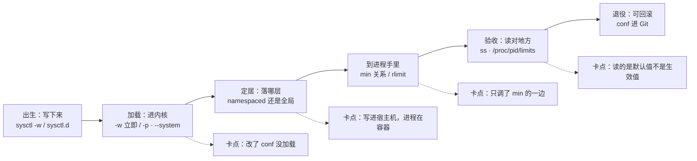
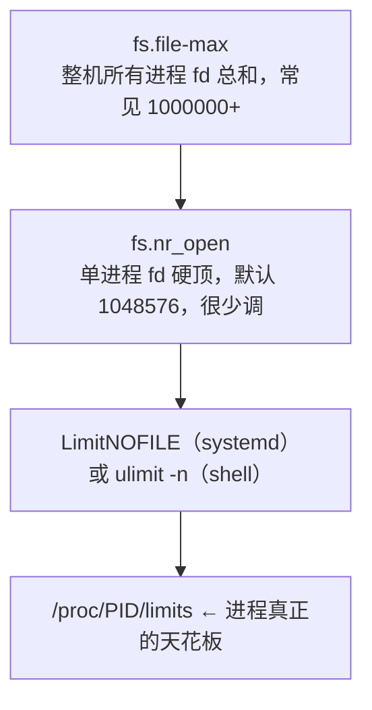
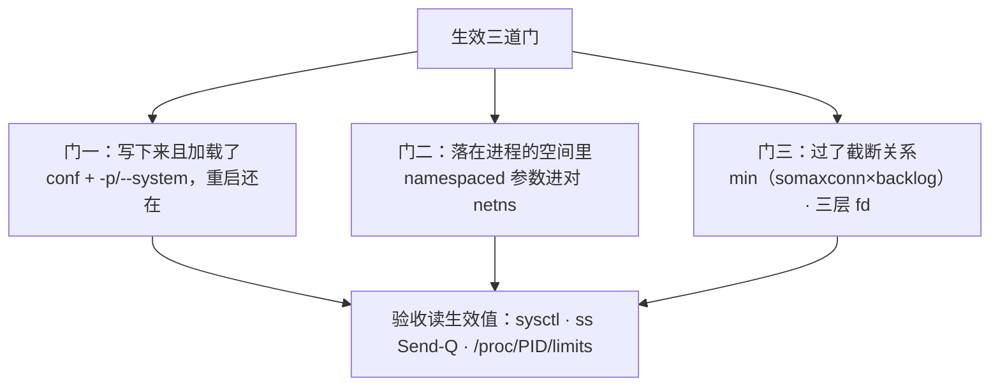
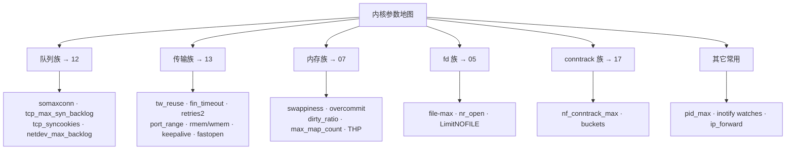
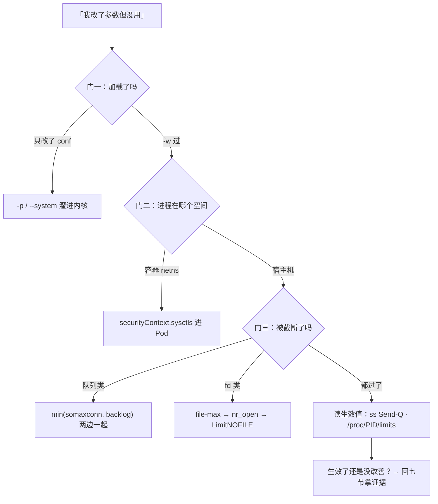

# 内核参数与 sysctl

> 活动开闸登录超时。有人把群里「生产 sysctl 万能优化清单」整份糊上，`somaxconn` 写了 32768，`ss -lnt` 的 Send-Q 还是 128；下一台 Redis 又糊同一份，延迟反而毛刺——参数写进去了，进程却没用上，或者写错了层。
> **本章回答**：一个内核参数从写进配置到真正被进程用上的一生（三道门），以及常调参数的全景地图与调参纪律。
> **不讲**：somaxconn/半连接全连接队列机制 → [12](../12-网络栈与Socket/)；TIME_WAIT/窗口/内核心跳 → [13](../13-TCP与UDP/)；swappiness/overcommit/OOM → [07](../07-内存与OOM/)；fd 与 rlimit 原理 → [05](../05-进程与信号/)；conntrack 表与 NAT → [17](../17-iptables与conntrack/)；安全向 sysctl → [27](../27-Linux安全加固/)；cgroup 与 sysctl 分工 → [10](../10-cgroup与容器/)。

**标记**：🎯重点 · 🔥难点 · ⭐常考 · 🔧实操
---

## 一、一张图：一个内核参数的一生

> 🎯 **一句话**：参数要过三道门才算生效——写下来、加载对地方、到得了进程手里；每道门都有「写了没用」的翻法。



- 📖 **读图**
  - 🛤️ 主线六段：写下来 → 加载 → 定居 → 到进程手里 → 验收 → 可回滚；下排四个卡点 = 「我明明改了」的四种翻车
  - 🩺 排障从左往右：先证明「写了吗、加载了吗」，再查「落在哪层、到没到进程」，最后才谈值合不合理
  - 🔭 `sysctl`/`cat /proc/sys` 照前两段；容器内读数照「定居」；`ss -lnt` Send-Q 与 `/proc/pid/limits` 照「到进程手里」——三处对不上，就卡在中间某道门
  - 开场三现象：Send-Q 仍 128 → 门三或门二；Redis 毛刺 → 清单打错角色（六节）；重启回旧值 → 门一

---

## 二、出生：写下来——sysctl 读写与持久化三件套

> 🎯 **一句话**：`/proc/sys` 是内核参数的开关面板，`sysctl` 是拧它的手；`-w` 只管这一次，落盘 + 加载才管一辈子。

### 🎛️ /proc/sys 与 sysctl 是什么

- **sysctl（system control）** = 内核暴露在 `/proc/sys/` 下的**运行时可调参数**
  - 目录结构即参数名：`net/ipv4/tcp_tw_reuse` ⇄ `net.ipv4.tcp_tw_reuse`（点 / 斜杠是同一东西的两种写法）
  - 两种等价写法：`sysctl -w net.ipv4.tcp_tw_reuse=1` 与 `echo 1 > /proc/sys/net/ipv4/tcp_tw_reuse`

### 📦 持久化三件套 ⭐

> 💡 **打个比方**：`sysctl -w` 像现场把音量拧小——立刻生效，重启后机器只认说明书；写进 `/etc/sysctl.d/*.conf` 像把默认音量写进说明书。只拧不写 = 白改；只写不加载 = 没写。

```bash
sysctl -w net.core.somaxconn=32768      # ① 立即生效，重启即丢（临时验证/紧急止血）
```

```ini
# /etc/sysctl.d/99-game.conf            # ② 持久化：按角色拆文件，别全堆一个
net.core.somaxconn = 32768
net.ipv4.tcp_max_syn_backlog = 8192
net.ipv4.ip_local_port_range = 1024 65535
```

```bash
sysctl -p                                # ③ 只重读 /etc/sysctl.conf 这一份
sysctl --system                          # ③' 按文件名顺序读所有 sysctl.d/*.conf + sysctl.conf
```

#### ❓ 为什么改了 conf 还不生效？

- ❌ **只改 conf**：纸面变了，内核还活着旧值
- ❌ **只 `-w`**：当场对了，重启回到 conf（或默认）
- ✅ **落盘 + 加载**：写进 `sysctl.d`，再 `-p` / `--system`（或重启）才算一辈子
- 🔑 **加载顺序**：`--system` 按文件名字典序，**后读覆盖先读**——`99-game.conf` 盖过 `50-default.conf`；两份 `99-*.conf` 撞名，字典序大的赢

- 🗂️ **按角色拆文件**：`99-web.conf` / `99-redis.conf` / `99-k8s-node.conf`（安全向另放 `99-security.conf` → [27](../27-Linux安全加固/)）——既好回滚，又能一眼看出「为谁调过」
- 🚢 舰队级用镜像 / Ansible / 节点 DaemonSet 下发；**禁止登录手糊当唯一真相**——conf 必须进 Git

> ⚠️ **别混**：改了 conf ≠ 生效——conf 只是纸面。反过来 `-w` 过的值也不写回 conf；`sysctl` 读到的是**当前生效值**，不是「配置里写了什么」。

> 🔍 **现场**：调参后验收三连 🔧
>
> ```bash
> ls /etc/sysctl.d/99-web.conf                  # ① conf 在不在、哪份是真相
> sysctl net.core.somaxconn                     # ② 当前生效值
> # net.core.somaxconn = 32768                  ← 改对了
> sysctl --system 2>&1 | grep -i somaxconn      # ③ 从哪个文件加载、有没有被后面覆盖
> # * Applying /etc/sysctl.d/99-web.conf ...
> # net.core.somaxconn = 32768                  ← 纸面与运行时对上了
> ```

- 🕳️ **三个高频坑**
  - conf 里 key 拼错**不报错也不生效**（`--system` 输出里根本不出现）
  - 两台「同角色」机器 conf 不同步时，**以机器活值为准**去追配置管理
  - 每条参数带一行注释：为什么调、哪条工单——半年后没人记得哪条是止血、哪条是跟风

本节对应练习题 Q1、Q2。会写了——宿主机改了，容器里进程为什么还是旧值？

---

## 三、定居：namespaced 还是全局——内核听谁的

🔥 容器里读数还是 128——真凶往往是**写错了 netns**。大白话：**有的参数跟网络命名空间走，改宿主机改不到容器里那份**。⭐（练习题 Q4）

> 🎯 **一句话**：多数 `net.*` 每个网络命名空间一份，`fs`/`vm`/`kernel` 是全机一份；进程在哪个 namespace，就听哪份的。

### 🏠 两类参数 ⭐

> 💡 **打个比方**：namespaced 参数像每间宿舍自己的电闸——你房间跳闸不影响隔壁，也修不了全楼总闸；全局参数（`vm.*`、`fs.*`、`kernel.*`）就是那把全楼总闸，只有物业（宿主机 root）能动。

| 对比 | namespaced（每 netns 一份） | 全局（全机一份） |
|------|------|------|
| 典型 | 多数 `net.ipv4.*`、`net.core.*`（somaxconn、tw_reuse、port_range） | `vm.swappiness`、`vm.overcommit_memory`、`fs.file-max`、`kernel.pid_max` |
| 改宿主机影响容器吗 | 不影响已有 netns | 直接影响全机（含容器） |
| 容器里能改吗 | 可以（Pod `securityContext.sysctls` / `docker --sysctl`） | 一般不行（需特权，生产禁止） |

#### ❓ 为什么宿主机改了，容器里还是旧值？

- 🧩 **多数 `net.*` 每 netns 一份**：Pod 的 netns 是 CNI 另建的——宿主机那份和它无关
- ✅ **容器正确写法**：Pod `securityContext.sysctls`（白名单内）把值写进**这个 Pod 的 netns**
- ❌ **全局参数**（`vm.*` 等）在容器里改会被拒；**特权 initContainer 悄悄改整节点** = 红线（无变更、无回滚、影响同节点所有 Pod）
- 📌 内核差异：`net.core.somaxconn` 较新内核才 namespaced；`nf_conntrack_*` 模块/节点级，走宿主机——**不确定就两边读一遍对账**

```yaml
spec:
  securityContext:
    sysctls:
    - name: net.core.somaxconn      # safe sysctl 白名单内
      value: "32768"                 # 只进这个 Pod 的 netns
```

- 🧭 **三招现场判断 namespaced？**
  1. 改宿主机前后到容器里读——变了 = 全局，没变 = namespaced（或这版内核里是）
  2. 看 kubelet safe sysctls 白名单（`ip_local_port_range`、`tcp_keepalive_time` 等可走 securityContext）
  3. 拿不准就两边读数对账——对账永远比记忆可靠
- 🔓 不在白名单的 unsafe sysctls 要 kubelet `--allowed-unsafe-sysctls` 显式放开，生产必须过变更评审——「safe/unsafe」分界 = 内核认为它**跨命名空间是否安全**

> 🔍 **现场**：进到进程所在空间里读 🔧
>
> ```bash
> kubectl exec {pod} -- cat /proc/sys/net/core/somaxconn   # 容器视角，128 = 没生效
> nsenter -t {PID} -n cat /proc/sys/net/core/somaxconn     # 按进程的 netns 读
> sysctl net.core.somaxconn                                # 宿主机 netns，别当容器的
> ```

> ⚠️ **别混**：宿主机敲 `sysctl` 读的是**宿主机 netns**；进程在容器 netns 里，两边是两份独立参数。验收永远在**进程所在的 namespace**（`nsenter -n` / `kubectl exec`）——「宿主机改了容器没变」不是 bug，是定居那道门没过。

本节对应练习题 Q4。回到开头 Send-Q 还是 128——只调 somaxconn 为什么不够？

---

## 四、到进程手里：min 关系与 fd 三层

🔥 `somaxconn` 写了 32768，Send-Q 还是 128——**高频错答是「内核坏了」**。大白话：**生效值 = min(somaxconn, 进程 listen backlog)**，只调一边等于没调。口诀：**「min 两边都要够」**（练习题 Q3）。

> 🎯 **一句话**：内核上限和应用自己的上限取 min 才是生效值；fd 还有第三层 rlimit——多层里最低的那个说了算。

### 🔗 somaxconn × listen backlog：只调一边无效 🔥⭐

- **somaxconn** = 内核给「全连接队列」设的上限
- 应用 `listen(fd, backlog)` 也会报一个数
- **生效队列长度 = min(应用 backlog, somaxconn)** —— 本章最经典的一道门

> 💡 **打个比方**：内核和应用各拿一节水管接在一起，实际流量由**最细的那节**决定——somaxconn 拧到 32768 而应用还 `listen(128)`，水流卡在应用那节。

#### ❓ 为什么 somaxconn 调到 32768，Send-Q 还是 128？

- ❌ **只调内核**：应用还 `listen(128)` → min = 128
- ❌ **只调应用**：内核还 128 → min = 128
- ✅ **两边一起调**：应用 backlog **和** `somaxconn` 都够大
- 📦 **容器还有第三重**：Pod netns 里也要有这份 somaxconn（三节）——三层全过，Send-Q 才会变
- 🔭 验收看 `ss -lnt` 的 **Send-Q**（LISTEN 下显示实际 backlog），不是看 conf

默认 128 的机器上，应用写 `listen(fd, 65535)`：生效仍 128。开服洪峰握手完了也进不了 accept 队列——队列机制 → [12](../12-网络栈与Socket/)，本章只管调参侧纪律。

```bash
ss -lnt | grep 443
# LISTEN 0  128  0.0.0.0:443   ← Send-Q=128：还有一边没调到
```

> 🔍 **现场**：somaxconn 调完验收（应用 backlog 已一起调到 65535）🔧
>
> ```bash
> ss -lnt | grep ':443'
> # LISTEN 0  128    0.0.0.0:443    ← 改之前
> # LISTEN 0  32768  0.0.0.0:443    ← 改之后：Send-Q 变了才算「生效」
> nstat -az | grep -i ListenOverflows ; sleep 60 ; nstat -az | grep -i ListenOverflows
> # TcpExt: ListenOverflows  1234 ...  →  1235 ...   ← 洪峰中差值不再涨才算「有效」
> ```
>
> Send-Q 变了 = **生效**（过了三道门）；溢出计数停涨 = **有效**（值调对了）——两次独立验收。

> ⚠️ **别混**：`somaxconn` 卡**全连接队列**（握手完等 accept），`tcp_max_syn_backlog` 卡**半连接队列**（握手中）——`ListenOverflows` 涨是前者，SYN 丢弃是后者；四个「满」的定责 → [12](../12-网络栈与Socket/)。

### 📂 fd 三层：file-max → nr_open → LimitNOFILE ⭐

打开文件数上限是三层套娃，**最低的那层说了算**：



- 📖 **读图**
  - 自上而下越来越「贴着进程」；报 `Too many open files` 十次九次卡在 soft 仍是 1024，不是 `file-max`
  - 验收只认 `/proc/<PID>/limits`；整机水位看 `/proc/sys/fs/file-nr`（已分配/未用/上限）

#### ❓ 为什么报 Too many open files 不先调 file-max？

- 🔎 **先定位哪一层顶住**：`/proc/PID/limits` vs `file-nr` vs `nr_open`
- 十次九次：**进程 soft = 1024**（LimitNOFILE / ulimit），整机远远没满
- ✅ **只修第三层**：`systemctl edit` 写 `LimitNOFILE`，`daemon-reload` + **重启进程**
- ❌ **`/etc/security/limits.conf` 对 systemd 服务不生效**——那是 PAM 给登录 shell 的（→ [11](../11-Systemd与服务管理/)）
- ❌ `ulimit -n` 只影响**当前 shell 及其子进程**——SSH 里调了，已启动的 Nginx 一点没变
- 📦 容器另有 runtime ulimits / 入口 `setrlimit`；验收同看 `/proc/PID/limits`（原理 → [05](../05-进程与信号/)）

> ⚠️ **别混**：`limits.conf` 和 `LimitNOFILE` 是两套体系——前者走 PAM 管登录会话，后者是 systemd 管服务进程。验收只认 `/proc/<服务PID>/limits`。

> 🔍 **现场**：网关报 `Too many open files`，三层各读一眼再动手 🔧
>
> ```bash
> cat /proc/$(pidof nginx)/limits | grep -i 'open files'
> # Max open files   1024   524288   files      ← Soft 1024：卡在 LimitNOFILE
> cat /proc/sys/fs/file-nr
> # 32768    0    1000000                      ← 整机才用 3 万，file-max 远没满
> cat /proc/sys/fs/nr_open                     # 1048576：硬顶不用动
> systemctl edit nginx                         # drop-in 写 LimitNOFILE=65535
> systemctl daemon-reload && systemctl restart nginx
> ```

> 📝 **面试**：「调 fd 上限调哪？」——分三层：整机 `fs.file-max`、单进程硬顶 `fs.nr_open`、进程实际 `LimitNOFILE`/`ulimit -n`；验收 `/proc/PID/limits`；`limits.conf` 管不了 systemd 服务；改了要重启进程。

### 收束：一个参数凭什么算「生效了」🎯⭐

三道门，缺一道都是「我明明改了」：



- 📖 **读图**
  - 门一「纸面→内核」、门二「内核的哪一份」、门三「还要和应用侧取 min/rlimit」
  - 三道门全过才轮到读数验收——四步各有一个命令，一步都不能省

#### ❓ 为什么生效了还不等于调对了？

- ✅ **生效** = 过了三道门，读数变了
- ❌ **不等于正确**：值合不合理（该不该调、调多大）是五、六、七节的事
- 👉 先证明生效，再讨论正确——「调了没坏」和「调了有用」是两回事

> 📝 **面试**：「为什么 somaxconn 改了没用？」——按三道门答：conf 加载了吗；进程在容器 netns 吗（securityContext.sysctls）；应用 listen backlog 调了吗（min）；最后 `ss -lnt` 看 Send-Q。

本节对应练习题 Q3、Q9。三道门懂了——常调参数地图怎么按角色用？

---

## 五、地图：常调参数全景

> 🎯 **一句话**：每个参数记四件事——是什么、默认多少、什么证据才动它、动了会出什么事；机制归专章，本章管地图和纪律。



- 📖 **读图**
  - 六族按**主责章**分组——机制去对应章，本章给「是什么/默认/何时动/动了出什么事」四件套
  - 值班反过来用：先有现象（队列溢出/端口耗尽/表满）→ 到图里找族 → 再回专章
  - 自检四问答不上来的参数，就不该出现在你的 conf 里

> 🔍 **现场**：接到「开闸登录超时」，从现象到族 🔧
>
> ```bash
> nstat -az | grep -iE 'ListenOverflows|ListenDrops'
> # TcpExt: ListenOverflows           1234    0.0   ← 二次采样在涨 → 队列族
> ss -s | grep -E 'TCP:'
> # TCP:   55 (estab 40, closed 10, orphaned 0, timewait 8) ← closed 异常多查 CLOSE_WAIT（05）
> grep -i 'table full' /var/log/messages
> # kernel: nf_conntrack: table full, dropping packet        → conntrack 族
> ```

### 📬 队列族（机制 → [12](../12-网络栈与Socket/)）⭐

- **net.core.somaxconn**：全连接队列上限。默认 128（新内核 4096）。**何时动**：`ListenOverflows` 涨。**动了出什么事**：几乎无代价，但**不调应用 backlog 就是白调**
- **net.ipv4.tcp_max_syn_backlog**：半连接队列上限，默认 1024，常用 8192+。和 somaxconn **成对**看
- **net.ipv4.tcp_syncookies**：SYN 洪水时用 cookie 替代半连接占位。**保持 1**——不是加大 backlog 的替代品
- **net.core.netdev_max_backlog**：网卡→协议栈排队。**何时动**：软中断 `%si` 打满（→ [06](../06-CPU与Load/)）再考虑

### 📡 传输族（机制 → [13](../13-TCP与UDP/)）

- **net.ipv4.tcp_tw_reuse**：复用 TIME_WAIT 做出站连接（需 timestamps，默认开）。默认 0 → 出站短连接多设 1。**只帮出站**，治本是连接池（→ [19](../19-Nginx/)）
- **tcp_tw_recycle**：**禁止**——4.12 起已删；3.x 上开启 + NAT = 随机丢连接。六节罪状一号
- **net.ipv4.tcp_fin_timeout**：本端 FIN_WAIT_2 超时（默认 60s）。**别乱降**——大量 CLOSE_WAIT 是应用不 close，降它只盖症状
- **net.ipv4.ip_local_port_range**：出站源端口池，默认 32768-60999（约 2.8 万）。**何时动**：`Cannot assign requested address`。扩到 1024 65535 是**买时间**，治本还是连接池
- **net.ipv4.tcp_rmem / tcp_wmem**：收发缓冲 `min/default/max` 三元组。**何时动**：BDP 场景且有 `ss -ti` 证据；无脑拉大几万连接 × 大缓冲会被 OOM 点名（→ [07](../07-内存与OOM/)）

> ⚠️ **别混**：把 max 调大 ≠ 内核马上吃这么多——max 是「允许用到」的上限；但每个连接都被允许用到 max，几万连接乘出来就是 OOM 账单。

- **net.ipv4.tcp_keepalive_*（7200/75/9）**：**内核层** TCP 保活——默认 2 小时才探测。改 600/30/3 让死连接几小时内被清。尺子：**应用心跳 15-45s < NAT/LB 空闲 ~5min < 内核 keepalive（默认 2h）**——内核 keepalive 是清僵尸兜底，**不是探活**（→ [13](../13-TCP与UDP/)、[22](../22-监控与告警/)）
- **tcp_retries2 / tcp_fastopen**：乱加大 retries2 = 故障检测变慢；fastopen 要双端支持——都不是排障第一刀

### 🧠 内存族（机制 → [07](../07-内存与OOM/)）⭐

- **vm.swappiness**：换页倾向，默认 60。数据库/Redis → 1-10。**Redis 用 1 不是 0**——0 在旧内核语义是「尽量不换直到快 OOM」，尖峰反而更容易被 OOM killer 直接杀
- **vm.overcommit_memory**：0（启发式）/1（从不拒绝）/2（按比例）。**Redis 建议 1**（fork 做 RDB）；**对 Web 是风险**——允许超卖，真用超了就 OOM 随机杀
- **vm.dirty_ratio / dirty_background_ratio**：脏页比例，常见默认 20/10。DB/大写入收到 15/5 或 10/5，避免攒一大坨后 IO 长尾（真盘慢 → [08](../08-磁盘与IO/)）
- **vm.max_map_count**：内存映射区上限，默认 65530。**ES 要求 ≥ 262144**；纯网关不用动
- **THP（透明大页）**：Redis/数据库机器**关闭（never）**——合并/拆分造成延迟毛刺；用 tuned/服务钉住，不是 sysctl 一行

### 📁 fd 族（机制 → [05](../05-进程与信号/)）

- **fs.file-max**：整机 fd 总上限，生产 1000000+；先看 `file-nr` 已分配数
- **fs.nr_open**：单进程硬顶（默认 1048576）。`LimitNOFILE` 想超过它得先抬它
- **LimitNOFILE / ulimit -n**：进程实际天花板（1024 → 65535+），验收 `/proc/PID/limits`（四节）

### 🕸️ conntrack 族（机制 → [17](../17-iptables与conntrack/)）⭐🔥

- **net.netfilter.nf_conntrack_max**：连接跟踪表容量，默认 65536——对 NAT/iptables kube-proxy 节点远远不够
- **K8s node 常见事故**：`nf_conntrack: table full, dropping packet` → Pod 间**间歇性丢新连接**（不是机器死）
- 调到 1048576 并**配监控告警 >80%**（表满了再调，丢的包找不回来）；没开 conntrack 的机器空调它就是氛围组。治本 → [17](../17-iptables与conntrack/)

### 🧩 其它常用

- **kernel.pid_max**：默认 32768。高密度 K8s 节点可能耗尽（`fork: Resource temporarily unavailable`）→ 4194304
- **fs.inotify.max_user_watches**：默认 8192。CI 报 `ENOSPC` 不一定是盘满——也可能是 watches 用光 → 524288
- **net.ipv4.ip_forward**：只有路由器/K8s 节点该开 1；普通应用机打开扩大攻击面（→ [27](../27-Linux安全加固/)）

> 📝 **面试**：「你常调哪些内核参数？」——按族报四件套各举一个：somaxconn、swappiness、nf_conntrack_max、file-max/LimitNOFILE。每个补一句「动了出什么事」。

本节对应练习题 Q5～Q10。回到开头那份「万能清单」——为什么 Redis 糊同一份会毛刺？

---

## 六、事故：抄来的「万能调优模板」罪状清单

🔥 「生产 sysctl 万能优化清单」整份糊上——**本章最大反面教材**。大白话：**网关参数和 DB 参数不是同一套衣服，抄错角色比不调更危险**。口诀：**「按角色给清单，不按网帖」**（练习题 Q11、Q12）。

> 🎯 **一句话**：模板的罪不在参数本身，在于「无证据、无场景、无回滚」——三条全占的清单贴上来就是事故预定。

### ☠️ 罪状逐条 🔥

#### ❓ 为什么一份「万能清单」比不调更危险？

- 🎭 **角色不同，瓶颈不同**：Web 卡在队列/fd，Redis 卡在换页/fork——同一份 conf 必然有一半是毒药
- 🪦 **废参数还在传**：`tcp_tw_recycle` 已删/危险，模板照抄 = 随机断连
- 🎰 **无证据全调**：出问题连「改了什么」都答不上——比默认更难回滚

**罪状一：`tcp_tw_recycle=1`**。4.12 起已删；3.x + NAT = 随机丢连接。抄之前先 `ls /proc/sys/net/ipv4/ | grep recycle`。

**罪状二：`vm.swappiness=0`**。Redis 要的是 1：0 在部分内核语义下反而更容易直接 OOM。

**罪状三：大降 `tcp_fin_timeout`**。大量 CLOSE_WAIT 是**应用不 close**；降 fin_timeout 只影响本端 FIN_WAIT_2——修代码 close（→ [05](../05-进程与信号/)、[13](../13-TCP与UDP/)）。

**罪状四：一份清单打全球**。`overcommit_memory=1` 对 Redis 是救星，对 Web 是超卖风险。

**罪状五：关 `tcp_syncookies` 只堆天文 backlog**。SYN flood 来了半连接照样被打穿；syncookies 保持 1。

**罪状六：拿 `tcp_rmem/wmem` 治队列溢出**。个数问题 vs 字节问题——拿字节参数治个数，min 那道门还是没过。

**罪状七：无证据全调 + 不留回滚**。没有 `nstat`/`ss`/监控就整份套用；conf 不进 Git，出问题答不上「改了什么」。

### 🚦 三档口径 ⭐

- **禁止**：`tcp_tw_recycle`、THP 开给 Redis/数据库、特权 initContainer 改整节点、把 fin/2MSL 砍到几秒当常规
- **慎用**：`swappiness=0`（用 1）、大降 `fin_timeout`、无脑拉大 rmem/wmem、乱加大 `tcp_retries2`
- **场景项（有证据才调）**：somaxconn/syn_backlog、ip_local_port_range、nf_conntrack_max、max_map_count、overcommit=1（仅 Redis/fork）、ip_forward（仅路由/节点）

> 📝 **面试**：「看过哪些危险的 sysctl 模板？」——背三条：recycle 已删且 NAT 断连、swappiness=0 反而 OOM、一份清单打全球；再补「观测 → 定位 → 单参小步改」。

### 🧾 两起事故复盘

- **事故 A（recycle）**：3.x 集群套模板后，NAT 后办公网用户「随机登不上」。根因 tw_recycle + NAT。教训：**先查模板里有没有已废弃参数**
- **事故 B（一份清单打全球）**：Redis conf 顺手发到 Web，overcommit=1 + swappiness=1；两周后 Web OOM 随机杀。教训：**conf 按角色拆、按角色下发**
- **事故 C（conntrack 当机器死）**：K8s 节点间歇丢连接，重启「恢复」——其实是清空了表，一周后复发。教训：**重启能「治好」的病，先想清楚重启清掉了什么**

- 📋 **拿到模板的评审四步**：① 过三档口径，禁止的划掉；② `ls /proc/sys/...` 对废参数；③ 对着监控问「这条治我哪个现象」；④ 活下来的按七节三步再落盘。模板当**候选清单**，不当答案抄。

本节对应练习题 Q11、Q12。知道不能乱抄了——调参三步怎么走？

---

## 七、纪律：调参三步——观测、定位、小步改

> 🎯 **一句话**：先有证据再动参数，一次只动一个，改完能回滚——三步缺一就是赌博。

> 💡 **打个比方**：调参像调药量——先验血（观测）、再确诊（定位）、一次只换一种药；一次换五种，好了不知道谁的功劳，坏了不知道谁的副作用。

### 👀 第一步：观测（拿证据）🔧

没有读数就没有调参资格：

```bash
nstat -az | grep -iE 'ListenOverflows|ListenDrops'   # 队列溢出（连采两次看差值）
ss -s                                                 # TIME_WAIT / CLOSE_WAIT 总量
cat /proc/sys/fs/file-nr                              # 32768  0  1000000 ← 已分配/未用/上限
cat /proc/sys/net/netfilter/nf_conntrack_count        # 对照 max 算水位（>80% 告警）
vmstat 1 5                                            # si/so 换页证据（swappiness 用）
```

### 🎯 第二步：定位（瓶颈是哪一个）

现象 → 族 → 第一读数：

- 队列溢出（`ListenOverflows` 涨）→ 队列族 → `ss -lnt` Send-Q
- 端口耗尽（`Cannot assign requested address`）→ 传输族 → `ss -s` 看 TIME_WAIT
- 表满（`table full, dropping packet`）→ conntrack 族 → `nf_conntrack_count / max`
- `Too many open files` → fd 族 → `/proc/PID/limits` 分层
- Redis 延迟毛刺 → 内存族 → `vmstat` si/so + THP 状态
- 写集体卡住 → dirty → `/proc/vmstat` 的 nr_dirty（真盘慢再查 [08](../08-磁盘与IO/)）

**现象对不上任何一族 = 大概率不是内核参数的问题**——回监控和代码查，别硬调。

### 🪜 第三步：小步改（一次一个，可回滚）

#### ❓ 为什么一次不能改五个参数？

- 🎲 **好了不知道谁的功劳，坏了不知道谁的锅**——min 关系的一对可以算「一个」
- ✅ 顺序：`-w` 临时 → 观察一个洪峰/交易日 → 有效才落盘进 Git → `--system` 再验收
- ⏪ **回滚成本心里有数**：sysctl 多半即时；**LimitNOFILE 回滚要重启进程**；`nf_conntrack_buckets` 缩表更麻烦——回滚越贵越要小步
- ⬆️ **升级注意**：大版本内核后，老模板参数可能已删（recycle）或改默认（somaxconn 新默认 4096）——升级前重放「每条还存在吗」

```bash
sysctl -w net.core.somaxconn=32768    # ① 先 -w，立刻按四节三道门验收
# ② 观察一个洪峰：指标改善吗？有新告警吗？
# ③ 有效才写进 /etc/sysctl.d/99-web.conf（进 Git，注明谁、为什么、工单）
sysctl --system                       # ④ 加载纸面，再验收一遍
```

> 📝 **面试**：「你的调参流程？」——观测拿读数 → 定位到族 → `-w` 小步改一个 → 按洪峰观察 → 有效才落盘进 Git → `--system` 后再验收；回滚成本先想好。

本节对应练习题 Q13。再看开头那个现场——Send-Q 仍 128、Redis 毛刺——三道门怎么逐道验？

---

## 八、作战：「调了没生效」与「该不该调」定责

> 🎯 **一句话**：调了没生效查三道门，该不该调查有没有证据——两类工单的树长得不一样。



- 📖 **读图**
  - 左边三道门是「生效」问题；走完仍没改善 → 「该不该调」，回七节第一步
  - 最常见两个出口：门三 min 只调一边；进程在容器 netns 而参数写进宿主机

| 现象 | 先做 | 别做 |
|------|------|------|
| Send-Q 还是 128 | 查 min 两边 + 容器 netns | 只把 32768 改成 65536；先加机器 |
| `Too many open files` | `cat /proc/PID/limits` 分层 | 只调全局 file-max |
| `table full, dropping packet` | conntrack 水位 + 调 max + 告警 | 当机器死了重启战斗服 |
| `Cannot assign requested address` | 查 port_range 与 TIME_WAIT，治本连接池 | 开 recycle；乱砍 2MSL |
| 重启后参数回到旧值 | `--system` 看从哪个文件加载 | 只改 conf 不加载 |
| 模板糊完随机断连 | `ls /proc/sys/net/ipv4/` 查废参数 | 逐条试参数碰运气 |
| Redis 延迟毛刺 | swappiness=1 + THP never | swappiness=0 赌 OOM |
| CLOSE_WAIT 涨 | 修代码 close | 只调 fin_timeout |
| CI 报 ENOSPC | 先分盘满还是 inotify watches 满 | 直接扩盘 |
| 升内核后模板失效 | 逐条重放「参数还在吗、默认变了吗」 | 原样照搬老 conf |

### ⏱️ 60 秒剧本 🔧

```text
① 0–10s  sysctl <参数>                     # 当前生效值是多少
② 10–30s 确认加载来源                       # --system：哪个文件、有没有被覆盖
③ 30–45s 定空间                            # 宿主机还是容器？nsenter/kubectl exec 里读
④ 45–60s 读生效值                          # ss Send-Q / /proc/PID/limits / nstat 差值
# ← 三道门各验一遍，哪道门读数对不上，问题就在哪道门
```

本节对应练习题 Q1、Q14。开头那个人——万能清单、只调一边、写错层——你已经知道该怎么拦住他了。

---

## 九、收口

### 命令速查 🔧

```bash
# 读写与持久化
sysctl net.core.somaxconn                     # 读单个
sysctl -a | grep somaxconn                    # 搜
sysctl -w net.core.somaxconn=32768            # 临时改（重启丢）
sysctl -p                                     # 重读 /etc/sysctl.conf
sysctl --system                               # 按序读全部 sysctl.d（后读覆盖先读）
sysctl -w net.core.somaxconn=128              # 回滚：改回旧值 + 同步改 conf
# 定居与验收
kubectl exec {pod} -- cat /proc/sys/net/core/somaxconn
nsenter -t {PID} -n cat /proc/sys/net/core/somaxconn
ss -lnt | grep <port>                         # LISTEN 的 Send-Q = 实际 backlog
cat /proc/{PID}/limits                        # 进程 fd/rlimit 天花板
cat /proc/sys/fs/file-nr                      # 整机 fd 水位
# 证据类
nstat -az | grep -iE 'ListenOverflows|ListenDrops'
ss -s
cat /proc/sys/net/netfilter/nf_conntrack_count
vmstat 1 5
cat /sys/kernel/mm/transparent_hugepage/enabled # Redis 要 never
ls /proc/sys/net/ipv4/ | grep -E 'tw_reuse|syncookies'
```

### 按角色起手 conf（复制后按证据裁剪）

```bash
# /etc/sysctl.d/99-web.conf —— 网关：队列 + fd + 出站
net.core.somaxconn = 32768
net.ipv4.tcp_max_syn_backlog = 8192
net.ipv4.tcp_syncookies = 1
net.ipv4.tcp_tw_reuse = 1
net.ipv4.ip_local_port_range = 1024 65535
net.ipv4.tcp_keepalive_time = 600
net.ipv4.tcp_keepalive_intvl = 30
net.ipv4.tcp_keepalive_probes = 3
fs.file-max = 1000000
```

```bash
# /etc/sysctl.d/99-redis.conf —— DB/Redis：内存路径
vm.swappiness = 1
vm.overcommit_memory = 1
vm.dirty_ratio = 10
vm.dirty_background_ratio = 5
# THP never 另用 tuned/服务钉住
```

```bash
# /etc/sysctl.d/99-k8s-node.conf —— 节点：表 + pid + inotify
net.netfilter.nf_conntrack_max = 1048576
kernel.pid_max = 4194304
fs.inotify.max_user_watches = 524288
fs.file-max = 1000000
vm.max_map_count = 262144
```

```ini
# systemd drop-in（网关进程）
[Service]
LimitNOFILE=65535
```

### 面试锚点

| 问 | 30 秒答 |
|----|---------|
| sysctl 怎么持久化？ | `/etc/sysctl.d/*.conf` 按角色拆；`-p` 只读 sysctl.conf，`--system` 按文件名序读全部、后读覆盖先读。 |
| 改了没生效查什么？ | 三道门：加载了吗 → 落在进程的 namespace 吗 → 被 min/rlimit 截了吗；读生效值验收。 |
| somaxconn 为什么调了没用？ | 生效 = min(listen backlog, somaxconn)；容器还要过 Pod netns；`ss -lnt` Send-Q 验收。 |
| namespaced 和全局区别？ | 多数 `net.*` 每 netns 一份；`vm`/`fs`/`kernel` 全机一份；Pod 用 `securityContext.sysctls`。 |
| fd 上限调哪层？ | `file-max` → `nr_open` → `LimitNOFILE`；`limits.conf` 管不了 systemd 服务。 |
| tw_reuse 和 tw_recycle？ | reuse=1 只帮出站、需 timestamps；recycle 已删且 NAT 断连，禁止。 |
| swappiness 该设多少？ | 默认 60；数据库 1-10；Redis 用 1 不是 0。 |
| conntrack 满了怎么办？ | `table full` → max 1048576 + 告警 >80%；治本在 17。 |
| 为什么反对调优模板？ | 无证据、无场景、含废参数、无回滚；三步纪律才是正解。 |
| 你的调参流程？ | 观测 → 定位到族 → `-w` 小步改一个 → 观察洪峰 → 落盘进 Git → 验收。 |
| 内核 keepalive 调过吗？ | 7200/75/9 → 600/30/3；清僵尸兜底，探活是应用心跳 15-45s。 |
| pid_max/inotify 何时动？ | 高密度节点 fork 报错 → pid_max 4194304；CI ENOSPC 查 inotify → 524288。 |

### 易错一句话对照

- 改了 conf 就生效了 → 要 `-p`/`--system` 或重启，conf 只是纸面
- `sysctl -w` 会写回配置文件 → 不会，重启即丢
- 宿主机改了容器就跟着变 → namespaced 参数每个 netns 一份
- 容器里 `sysctl -w` 打印成功 = 进程用上了 → 不等于，读容器内 `/proc/sys` + limits
- somaxconn 调大就行 → min(应用 backlog, somaxconn)，只调一边无效
- Send-Q 是发送队列 → LISTEN 状态下是实际 backlog
- fd 报错就调 file-max → 先 `/proc/PID/limits` 分层，多半卡 LimitNOFILE 1024
- `limits.conf` 万能 → 对 systemd 服务不生效，要 LimitNOFILE 并重启
- tw_reuse 能治服务端 TIME_WAIT → 只帮出站；入站堆积看 13
- fin_timeout 降了 CLOSE_WAIT 就少 → CLOSE_WAIT 是应用不 close
- swappiness=0 最安全 → 0 更容易直接 OOM，数据库用 1-10
- overcommit=1 是优化 → 只对 Redis 这类 fork 场景是；对 Web 是超卖风险
- rmem 调大治队列溢出 → 个数问题和字节问题两码事
- conntrack 满了再调也来得及 → 丢的包找不回来，>80% 就要动 + 告警
- 内核 keepalive 当探活 → 7200s 才启动的兜底，探活是应用心跳（22）
- ENOSPC 一定是盘满 → 也可能是 inotify watches 用光
- ES 起不来先加内存 → 先看 max_map_count ≥ 262144
- 模板是前人经验直接抄 → 先查废参数和场景，无证据不落地

### 数字墙

> somaxconn **128 → 32768**（新内核默认 4096）· tcp_max_syn_backlog **1024 → 8192+** · syncookies **保持 1** · tw_reuse **0 → 1**（出站）· fin_timeout **60 别乱降** · ip_local_port_range **32768-60999 → 1024 65535** · keepalive **7200/75/9 → 600/30/3** · 应用心跳 **15-45s** · NAT 空闲 **~5min** · swappiness **60 → 1-10**（Redis 1）· overcommit **Redis=1** · dirty_ratio/background **20/10 → 15/5 或 10/5** · max_map_count **65530 → ≥262144**（ES）· file-max **1000000+** · LimitNOFILE **1024 → 65535+** · nr_open **1048576** · nf_conntrack_max **65536 → 1048576 · 告警 >80%** · pid_max **32768 → 4194304** · inotify watches **8192 → 524288**

---

## 合上书

- [ ] **默画主图**：出生 → 加载 → 定居 → 到进程手里 → 验收 → 退役；四个「写了没用」卡点各挂在哪段
- [ ] **口述持久化三件套**：`-w` 临时、sysctl.d 按角色拆、`-p` 与 `--system` 区别；后读覆盖先读
- [ ] **口述 namespaced vs 全局**：哪族每 netns 一份、容器怎么写（securityContext.sysctls）、验收在进程空间读
- [ ] **默画三道门**：为什么 somaxconn 改了没用（min）+ fd 三层 + 验收命令各是哪个
- [ ] **口述参数地图六族**：每族 1-2 个参数的四件套，并说出主责章
- [ ] **背罪状清单**：禁止四件、慎用三件、场景项怎么界定
- [ ] **口述调参三步**：观测拿什么读数、定位怎么对地图、小步改顺序与回滚成本
- [ ] **定责**：「调了没生效」从哪道门进；「生效了没改善」之后去哪

上一章：[日志运维](../23-日志运维/)。队列机制 → [12](../12-网络栈与Socket/) · 传输层 → [13](../13-TCP与UDP/) · 内存与 OOM → [07](../07-内存与OOM/) · fd 原理 → [05](../05-进程与信号/) · conntrack → [17](../17-iptables与conntrack/) · 软中断 → [06](../06-CPU与Load/) · 安全向 sysctl → [27](../27-Linux安全加固/)。
