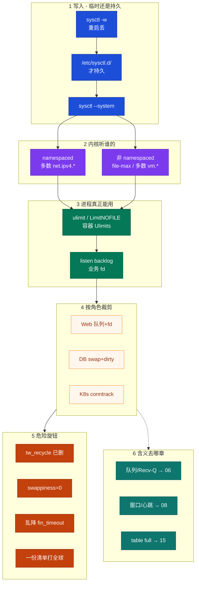
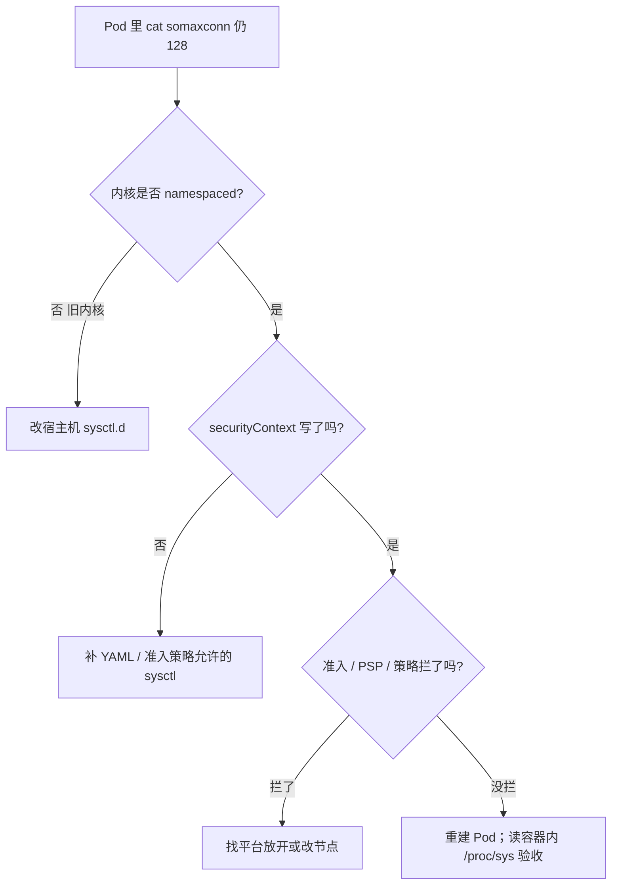
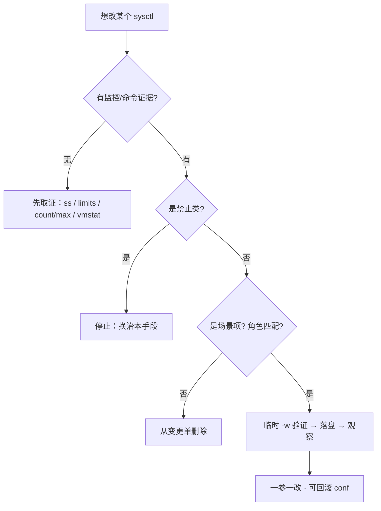
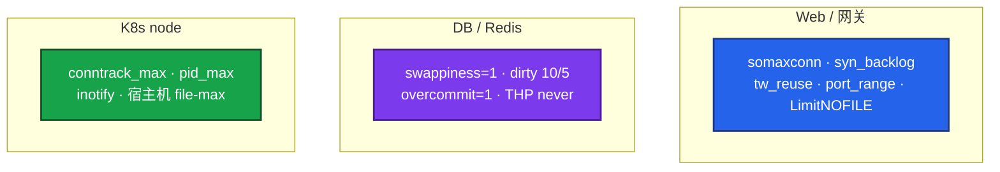
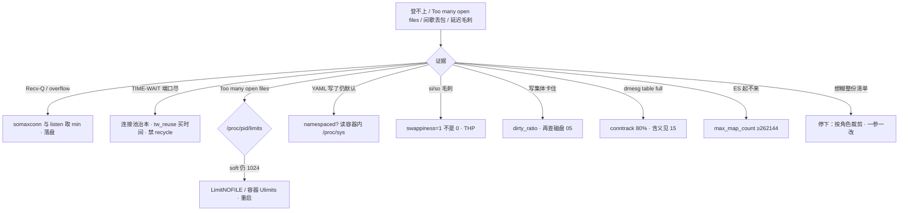

# 内核参数与 sysctl

> **这章解决什么**：活动开闸登录超时、容器里 `sysctl -w` 打印成功却不生效、群里把「生产清单」整份糊上 Redis——**旋钮写到哪、内核听谁的、进程能不能用上**？  
> **读法**：**先看总图（三道门 + 角色清单）** → **再认名词** → **再分节抠持久化 / namespaced / 危险旋钮**。  
> **刻意不展开**：半连接/全连接、Recv-Q 含义、四个「满」定责 → [12](../12-网络栈与Socket/)；握手/窗口/重传、keepalive vs 应用心跳 → [13](../13-TCP与UDP/)；conntrack 表结构、NAT → [17](../17-iptables与conntrack/)；安全 sysctl（redirects、rp_filter）→ [27](../27-Linux安全加固/)。

---

## 本章目录

1. [本章定位](#1-本章定位)
2. [先看总图：旋钮从写到真正生效](#2-先看总图旋钮从写到真正生效) ← **开篇必读**
   - [2.0 全章知识串图](#20-全章知识串图一张把细节串起来) ← **架构总览**
   - [2.3 完整走读](#23-完整走读活动开闸登录超时从现象到改一个旋钮)
3. [名词扫盲（对照总图认词）](#3-名词扫盲对照总图认词)
4. [三道门：持久化 / namespaced / rlimit](#4-三道门持久化--namespaced--rlimit) ← **重点精读**
5. [net.core 与 net.ipv4.tcp：边界与主责章](#5-netcore-与-netipv4tcp边界与主责章) ← **重点精读**
6. [危险旋钮：本章最易混](#6-危险旋钮本章最易混) ← **重点精读**
7. [按角色套清单](#7-按角色套清单)
8. [落地、配置与命令](#8-落地配置与命令)
9. [定责决策树](#9-定责决策树)
10. [去哪章继续学](#10-去哪章继续学)
11. [面试 · 易错 · 数字](#11-面试--易错--数字)
12. [合上书](#合上书)

---

## 1. 本章定位

| 章 | 负责 |
|----|------|
| **06** | 包怎么进主机、Socket/队列、Recv-Q、半/全连接、「四个满」**含义与定责** |
| **08** | TCP/UDP：握手、窗口、重传、心跳；**tcp_* 旋钮在传输层干什么** |
| **15** | conntrack 表满、NAT；**nf_conntrack_*** 的表侧含义 |
| **18（本章）** | sysctl **怎么写、怎么持久、谁听、危险不危险、按角色裁剪** |

本章是**内核旋钮的落盘与边界主场**。06/08/15 告诉你「这个数管什么、满了怎么认」；本章告诉你「改到哪一层才算改了、哪些千万别碰」。

🎯 **值班签名**：`sysctl -w` 打印成功、YAML 写了、群里贴了清单——**先问三道门，再问有没有证据，再改一个**。

---

## 2. 先看总图：旋钮从写到真正生效

> **正确开篇顺序**：先有「写 → 内核听谁 → 进程能用」的画面，再认词，再抠危险旋钮。  
> 先看 **§2.0 全章串图**，再看 **§2.1 坐标系**，再用 **§2.3 走读**把一次开闸故障串起来。

### 2.0 全章知识串图（一张把细节串起来）

> 🎯 **合上书要能默画这张。** 蓝=写入 · 紫=内核听谁 · 绿=进程真正用上 · 橙=危险/定责。  
> 若预览仍报错，以下面 **ASCII 一页板** 为准。



**读图路线：**

| 段 | 记住 |
|----|------|
| ① | `-w` 重启丢；落盘靠 `/etc/sysctl.d/` + `--system`（§4.1） |
| ② | 多数 `net.ipv4.*` 看这份网络 NS；`fs.file-max` / 多数 `vm.*` 只能宿主机（§4.2） |
| ③ | 进程 fd 看 `/proc/pid/limits`，不是 shell `ulimit`（§4.3） |
| ④ | Web / DB / K8s **三份清单**，别糊全球（§7） |
| ⑤ | recycle、swappiness=0、乱砍 fin_timeout → 危险专节（§6） |
| ⑥ | 旋钮**含义**回 06/08/15；本章管**怎么改、改不改得动** |

```text
┌──────────────────────────────────────────────────────────────────────────┐
│                     18 一张板：从写到生效到定责                              │
├─────────────┬────────────────────┬───────────────────────────────────────┤
│  写入       │  内核听谁          │  进程真正能用                          │
│  -w 重启丢  │  namespaced: net*  │  LimitNOFILE / 容器 Ulimits           │
│  sysctl.d   │  宿主机: fs/vm/*   │  min(listen, somaxconn)               │
│  --system   │  读容器内 /proc/sys│  读 /proc/pid/limits                   │
├─────────────┴────────────────────┴───────────────────────────────────────┤
│  角色：Web=队列+fd · DB=swap+dirty · K8s=conntrack+pid                     │
│  危险：recycle · swappiness=0 · 乱降 fin_timeout · 一份清单打全球          │
│  含义：队列→06 · 窗口/心跳→08 · table full→15 · 安全 sysctl→17            │
└──────────────────────────────────────────────────────────────────────────┘
```

### 2.1 坐标系：三条门 + 两类旋钮

把生产里所有「以为调了」的事故，压成一张坐标：

```text
                    临时 ──────────────────────► 持久
                      │                            │
         sysctl -w    │                            │  /etc/sysctl.d/*.conf
                      │                            │  + sysctl --system
                      ▼                            ▼
              ┌─────────────────────────────────────────┐
              │              内核值（/proc/sys）          │
              └─────────────────────────────────────────┘
                      │                            │
         namespaced   │                            │  非 namespaced
         （Pod netns） │                            │  （只能宿主机）
                      ▼                            ▼
              ┌─────────────────────────────────────────┐
              │     进程 rlimit（LimitNOFILE 等）         │
              │     ← 这里才是「Too many open files」    │
              └─────────────────────────────────────────┘
```

> **记住**：打印成功只说明「某一层写进去了」。值班要验证的是：**持久？对的 NS？进程 limits？**

### 2.2 两类旋钮：边界旋钮 vs 含义旋钮

| 类型 | 本章讲什么 | 含义去哪 |
|------|------------|----------|
| **边界旋钮** | 写到哪、谁听、危险不危险、按角色裁剪 | 本章 |
| **含义旋钮** | `somaxconn` 管全连接上限、`tcp_rmem` 管缓冲…… | [12](../12-网络栈与Socket/) / [13](../13-TCP与UDP/) / [17](../17-iptables与conntrack/) |

本章会列 `net.core.*` / `net.ipv4.tcp_*` 的**落盘与边界**，但不会把 06 的 Recv-Q FAQ、08 的窗口重传再讲一遍。看见「这个数干什么」→ 跟链接走。

### 2.3 完整走读：活动开闸登录超时，从现象到改一个旋钮

用一条现网故事，把三道门走通。**只保留这一版走读。**

**现场**：开闸 2 分钟，登录超时；战斗服在线还在。有人喊「把生产 sysctl 清单糊上去」。你拦下，按板子走。

#### 步骤 1：先认现象，别先改参

```bash
ss -lnt | head -5
sysctl net.core.somaxconn
netstat -s | grep -i overflow
```

```text
State   Recv-Q Send-Q Local Address:Port
LISTEN  128    128    0.0.0.0:443
net.core.somaxconn = 128
    86 times the listen queue of a socket overflowed
```

**说明什么**：LISTEN 上 Recv-Q 顶住 Send-Q（都是 128）+ overflow 在涨 → **全连接队列满**。含义见 [12 §5/§6](../12-网络栈与Socket/)；本章只负责：**短板在 somaxconn，还是 listen，还是两边？**

#### 步骤 2：对 min，确认短板

网关配置里写了 `listen 443 backlog=65535`，内核还是 128：

```text
有效全连接队列 = min(listen backlog, somaxconn) = min(65535, 128) = 128
```

只改 Nginx 无效。只改 somaxconn、应用仍 listen(128) 也无效。**两边一起拉。**

#### 步骤 3：临时验证 → 再持久化

```bash
# ① 临时验证（重启丢，只用来确认方向）
sysctl -w net.core.somaxconn=32768
sysctl -w net.ipv4.tcp_max_syn_backlog=8192

# ② 确认内核真的吃了
sysctl net.core.somaxconn
# net.core.somaxconn = 32768

# ③ 落盘（否则下次开机又回 128）
cat >/etc/sysctl.d/99-web.conf <<'EOF'
net.core.somaxconn = 32768
net.ipv4.tcp_max_syn_backlog = 8192
net.ipv4.tcp_syncookies = 1
EOF
sysctl --system
```

应用侧同步：`listen 443 backlog=32768;`，**重启/热加载**监听进程。再看 `ss -lnt`：Send-Q 应变大，Recv-Q 不应再长期顶满。

#### 步骤 4：如果是容器网关呢？

```bash
# 在 Pod 里读，不要只在宿主机读
kubectl exec -it gateway-xxx -- cat /proc/sys/net/core/somaxconn
```

| 读到 | 含义 | 动作 |
|------|------|------|
| 仍是 128 | 未 namespaced / 未写入这份 NS | Pod `securityContext.sysctls` 或改宿主机（旧内核） |
| 已是 32768，Recv-Q 仍顶 | 应用 listen 仍小，或 accept 太慢 | 回 [12](../12-网络栈与Socket/) 看 accept |

#### 步骤 5：别做的事（同一次事故里）

| 别做 | 为什么 |
|------|--------|
| 把整份「生产清单」糊到 Redis | overcommit=1、THP 是 DB 项，Web 队列问题无关 |
| 加大 `tcp_rmem` | LISTEN 顶满是**连接个数**，不是字节缓冲（[12](../12-网络栈与Socket/)） |
| 开 `tcp_tw_recycle` | 已删 / NAT 有害（§6） |
| 只 `sysctl -w` 不落盘 | 重启回到 128，下周又炸 |

**走读验收**：你能说出「证据 → min → 临时验证 → 落盘 → 读对的 NS」五步，而不是「群里有清单所以糊上去」。

---

## 3. 名词扫盲（对照总图认词）

对照 §2.0，先把词钉在门上。每个词只到「值班怎么认」，含义深挖跟链接走。

### 3.1 写入侧

| 词 | 值班里什么时候碰到 | 一句话 |
|----|--------------------|--------|
| **`/proc/sys/`** | `cat` / `sysctl` 读到的活值 | 内核旋钮的文件系统视图 |
| **`sysctl -w`** | 临时止血 | 改活值，**重启丢** |
| **`/etc/sysctl.conf`** | 老机器单文件 | 仍可用，生产更推荐拆 `sysctl.d` |
| **`/etc/sysctl.d/*.conf`** | 角色片段、可回滚 | **持久化主战场** |
| **`sysctl --system`** | 改完 conf 要加载 | 按顺序加载 conf，写入内核 |

> **别混**：改了 `.conf` 不跑 `--system`（或不重启），活值还是旧的。

### 3.2 作用域侧

| 词 | 值班里什么时候碰到 | 一句话 |
|----|--------------------|--------|
| **namespaced** | 容器 YAML 写了仍是默认 | 这份**网络命名空间**各自一份 |
| **非 namespaced** | 想在 Pod 里改 `file-max` | 只能改**宿主机**，容器里改不了或不生效 |
| **network NS** | Pod / 容器网络 | 多数 `net.ipv4.*` 跟着这份 NS |
| **宿主机 sysctl** | DaemonSet / 节点镜像 | `fs.*`、多数 `vm.*`、`kernel.pid_max` 常在这里 |

### 3.3 进程侧

| 词 | 值班里什么时候碰到 | 一句话 |
|----|--------------------|--------|
| **`fs.file-max`** | 「内核已经百万了」 | 整机 fd 上限，**不是进程上限** |
| **`fs.nr_open`** | 很少碰 | 单进程 hard 上限（默认常 1048576） |
| **`ulimit -n`** | 登录 shell 里看 | **当前 shell** 的 soft；服务进程未必继承 |
| **`LimitNOFILE`** | systemd 托管 Nginx | unit 里的进程 rlimit；**服务不读 PAM limits.conf** |
| **`/proc/<pid>/limits`** | Too many open files | **真相来源** |

### 3.4 网络旋钮（只记名字与主责章）

| 词 | 主责章 | 本章只记 |
|----|--------|----------|
| `net.core.somaxconn` | [12](../12-网络栈与Socket/) | 默认常 128；与 listen 取 **min**；持久 + namespaced |
| `net.ipv4.tcp_max_syn_backlog` | [12](../12-网络栈与Socket/) | 半连接上限；别和 somaxconn 混 |
| `net.core.rmem_*` / `wmem_*` | [12](../12-网络栈与Socket/) | 缓冲；**治不了 LISTEN 顶满** |
| `net.ipv4.tcp_rmem` / `tcp_wmem` | [12](../12-网络栈与Socket/) · [13](../13-TCP与UDP/) | min/default/max 三元组 |
| `net.ipv4.tcp_tw_reuse` | [12](../12-网络栈与Socket/) · [13](../13-TCP与UDP/) | 出站买时间；治本是连接池 |
| `net.ipv4.tcp_tw_recycle` | [13](../13-TCP与UDP/) | **禁止**；4.12+ 已删 |
| `tcp_keepalive_*` | [13](../13-TCP与UDP/) | ≠ 应用心跳 |
| `nf_conntrack_max` | [17](../17-iptables与conntrack/) | 表容量；告警 >80% |

### 3.5 内存 / 其它上限

| 词 | 值班场景 | 一句话 |
|----|----------|--------|
| `vm.swappiness` | Redis 延迟毛刺 | 生产常用 **1–10**；**1 不是 0** |
| `vm.overcommit_memory` | Redis fork / bgsave | Redis 场景常 **1**；Web 别抄 |
| `vm.dirty_ratio` | 写集体卡住 | 到阈值写进程阻塞刷盘 |
| `vm.max_map_count` | ES 起不来 | ≥ **262144** |
| `fs.inotify.max_user_watches` | CI `ENOSPC` | 不一定是盘满 |
| `kernel.pid_max` | 高密度 K8s 节点 | 默认 32768 常不够 |

> **记住**：名词扫盲只建「门牌」。队列/窗口/表满的故事在 06/08/15。

---

## 4. 三道门：持久化 / namespaced / rlimit

> 🎯 **本章核心对象。** 所有「改了不生效」先对这三道门。

### 4.1 第一道门：持久化

**一句话：** `-w` 止血；`.d` 才持久；改 conf 必须 `--system`（或重启）。

#### 临时 vs 持久

| 写法 | 存活到 | 适用 |
|------|--------|------|
| `sysctl -w key=value` | 重启前 | 验证方向、紧急止血 |
| `echo value > /proc/sys/...` | 重启前 | 等同临时 |
| `/etc/sysctl.d/99-xxx.conf` + `sysctl --system` | 跨重启 | **生产标准** |
| 云镜像 / Ansible / 节点 DaemonSet | 跨重建 | 舰队级 |

#### 加载顺序（面试常问）

```text
/etc/sysctl.d/*.conf
/usr/lib/sysctl.d/*.conf
/run/sysctl.d/*.conf
/etc/sysctl.conf
        │
        ▼
  sysctl --system  （按文件名排序加载，后写覆盖先写）
```

生产习惯：

```bash
# 角色拆文件，不要一个 99-all.conf 糊全球
/etc/sysctl.d/99-web.conf
/etc/sysctl.d/99-redis.conf
/etc/sysctl.d/99-k8s-node.conf
/etc/sysctl.d/99-security.conf   # 安全向单独文件 → 17
```

#### 现场验收

```bash
# 1) conf 在不在
ls /etc/sysctl.d/99-web.conf

# 2) 活值对不对
sysctl net.core.somaxconn

# 3) 重启演练（变更窗口）或至少 --system 后再读一次
sysctl --system | grep somaxconn
```

> **别混**：Git 里有 conf、机器上没同步；或同步了没 `--system`——都叫「没持久生效」。

**面试怎么说**：「临时用 -w 验证，生产写 sysctl.d，--system 加载；按角色拆文件，安全清单另放。」

### 4.2 第二道门：namespaced

**一句话：** 多数 `net.ipv4.*` 跟网络 NS；`fs.file-max`、多数 `vm.*` 只能宿主机。

#### 一张表钉死

| 参数族 | namespaced？ | 容器里怎么改 | 验证读哪里 |
|--------|--------------|--------------|------------|
| 多数 `net.ipv4.*` | **是** | Pod `securityContext.sysctls` | **容器内** `/proc/sys/...` |
| `net.core.somaxconn` | 较新内核 **是** | 同上；旧内核改宿主机 | 容器内 |
| `net.core.rmem_max` 等 | 看内核/发行版 | 先查文档，不确定就宿主机 | 容器内对比宿主机 |
| `fs.file-max` | **否** | 宿主机 `sysctl.d` | 宿主机 |
| 多数 `vm.*` | **否** | 宿主机 | 宿主机 |
| `kernel.pid_max` | **否** | 宿主机 | 宿主机 |
| `nf_conntrack_*` | 模块/节点级 | 通常宿主机 / 节点配置 | 宿主机 `/proc/sys/net/netfilter/` |

#### K8s 写法（只示意边界）

```yaml
# 仅 namespaced 参数可进 Pod
spec:
  securityContext:
    sysctls:
      - name: net.core.somaxconn
        value: "32768"
      - name: net.ipv4.tcp_tw_reuse
        value: "1"
# fs.file-max / vm.swappiness → 节点级，不要写进业务 Pod 幻想生效
```

#### 「YAML 写了仍是 128」决策



> **记住**：验收永远读**目标 NS 内**的 `/proc/sys`。宿主机是 32768、Pod 里是 128 → 你改错层了。

**面试怎么说**：「先问 namespaced；net 多数跟 Pod netns，file-max/vm 改宿主机；验证读容器内 /proc/sys。」

### 4.3 第三道门：进程 rlimit（LimitNOFILE）

**一句话：** Too many open files 十次九次是进程 soft 还是 1024，不是 `file-max`。

#### 三层天花板

```text
fs.file-max          ← 整机（生产常 1000000+）
     └─ fs.nr_open   ← 单进程 hard（默认常 1048576，很少调）
          └─ soft LimitNOFILE / ulimit -n
               ← 进程真正能打开的数（常卡在 1024）
```

#### 现场走一遍

```bash
pid=$(pgrep -o nginx)
cat /proc/$pid/limits | grep "open files"
sysctl fs.file-max
```

```text
Max open files            1024                 524288 files
fs.file-max = 1000000
```

| 列 | 含义 |
|----|------|
| soft 1024 | **当前瓶颈** |
| hard 524288 | 进程可上调到的天花板（仍受 nr_open / file-max） |
| file-max 100 万 | 整机够；**改它解决不了 1024** |

#### systemd vs PAM vs 容器

| 启动方式 | 改哪里 | 要不要重启 |
|----------|--------|------------|
| 交互登录 shell | `/etc/security/limits.conf`（PAM） | 重新登录 |
| **systemd 服务** | `LimitNOFILE=` drop-in | **daemon-reload + 重启进程** |
| 容器 | runtime ulimits / K8s 相关字段 / 入口 `setrlimit` | 重建容器 |

```ini
# /etc/systemd/system/nginx.service.d/limits.conf
[Service]
LimitNOFILE=65535
```

```bash
systemctl daemon-reload && systemctl restart nginx
cat /proc/$(pgrep -o nginx)/limits | grep "open files"
# Max open files            65535                65535 files
```

> **别混**：你在自己 SSH 里 `ulimit -n 65535`，**不会**改变已启动的 Nginx。以 `/proc/<pid>/limits` 为准。

**面试怎么说**：「file-max 百万仍报错，看 /proc/pid/limits；systemd 要 LimitNOFILE 并重启；limits.conf 服务不读。」

### 4.4 三道门合订：一例钉死

**场景**：同学在容器里执行：

```bash
sysctl -w fs.file-max=2000000
sysctl -w net.core.somaxconn=32768
# 都打印了 = 成功
```

Nginx 仍 `Too many open files`，`ss` Recv-Q 仍顶 128。

| 操作 | 实际发生了什么 |
|------|----------------|
| `fs.file-max` | **非 namespaced**；容器里改失败或改的是幻觉/被拒；即便宿主机改了，进程 soft 仍 1024 |
| `somaxconn` | 可能写进了某 NS，但 **LISTEN 进程的 backlog** 仍是旧的；或写错 NS |
| 真正缺的 | `/proc/nginx_pid/limits` + 应用 listen + **落盘到对的层** |

① 例子先钉：容器打印成功 ≠ 进程用上。  
② 定义：三道门 = 持久化 × namespaced × rlimit。  
③ 怎么认：读 conf、读目标 `/proc/sys`、读 `/proc/pid/limits`。  
④ 易错一句：**只看 sysctl 输出等于没排障。**

---

## 5. net.core 与 net.ipv4.tcp：边界与主责章

> 本章列「落盘与边界」；**含义、定责、何时该调** 回 06/08。  
> 目标：你会分「这是队列问题还是缓冲问题还是传输问题」，而不是背一长串 key。

### 5.1 总表：族 → 主责 → 本章边界

| 族 / 键 | 管什么（一句话） | 主责章 | 本章边界动作 |
|---------|------------------|--------|--------------|
| `net.core.somaxconn` | 全连接队列内核上限 | [12](../12-网络栈与Socket/) | 与 listen 取 min；持久；注意 namespaced |
| `net.ipv4.tcp_max_syn_backlog` | 半连接队列上限 | [12](../12-网络栈与Socket/) | 和 somaxconn **成对**看；别只改一边 |
| `net.ipv4.tcp_syncookies` | SYN flood 时用 cookie | [12](../12-网络栈与Socket/) | 生产保持 **1**；不是加大 backlog 的替代品乱关 |
| `net.core.netdev_max_backlog` | 网卡→协议栈排队 | [12](../12-网络栈与Socket/) · [06](../06-CPU与Load/) | 软中断打满再考虑；先看 `%si` |
| `net.core.rmem_default/max` · `wmem_*` | Socket 缓冲默认/上限 | [12](../12-网络栈与Socket/) | **LISTEN 顶满加 rmem 无效** |
| `net.ipv4.tcp_rmem` · `tcp_wmem` | TCP 缓冲三元组 | [12](../12-网络栈与Socket/) · [13](../13-TCP与UDP/) | ESTAB 缓冲；先问谁不 read / ZeroWindow |
| `net.ipv4.ip_local_port_range` | 出站临时端口池 | [12](../12-网络栈与Socket/) | 扩池是买时间；治本连接池 |
| `net.ipv4.tcp_tw_reuse` | 出站复用 TIME_WAIT | [12](../12-网络栈与Socket/) · [13](../13-TCP与UDP/) | 只出站；要 timestamps |
| `net.ipv4.tcp_tw_recycle` | （历史）快速回收 TW | [13](../13-TCP与UDP/) | **禁止**；见 §6 |
| `net.ipv4.tcp_fin_timeout` | FIN_WAIT 相关超时 | [13](../13-TCP与UDP/) | **不要**当 CLOSE_WAIT 解药乱降 |
| `net.ipv4.tcp_keepalive_*` | 内核探活 | [13](../13-TCP与UDP/) | ≠ 游戏心跳；见 §5.4 |
| `net.ipv4.tcp_retries2` 等 | 超时放弃 | [13](../13-TCP与UDP/) | 乱加大 → 故障检测变慢 |
| `net.ipv4.tcp_fastopen` | TFO | [13](../13-TCP与UDP/) | 双端支持才有意义；非排障第一刀 |
| `net.netfilter.nf_conntrack_*` | 连接跟踪表 | [17](../17-iptables与conntrack/) | max 买时间；告警 80%；治本少短连接/IPVS |

### 5.2 队列类：只记边界，含义回 06

**一句话：** 半连接看 `tcp_max_syn_backlog`；全连接看 `min(listen, somaxconn)`。

```text
SYN 到达
  → 半连接队列（tcp_max_syn_backlog，常见默认 ~1024）
  → 握手完成进入全连接（min(listen backlog, somaxconn)，常见默认 128）
  → accept() 领走
```

| 证据 | 调什么 | 别调什么 |
|------|--------|----------|
| `ss -lnt` Recv-Q 顶满 + overflow | somaxconn **和** listen | 只加 rmem |
| `ss -s` 大量 syn-recv | `tcp_max_syn_backlog`；查 SYN flood | 只加 somaxconn |
| ESTAB Recv-Q 持续涨 | 应用 read（[12](../12-网络栈与Socket/)） | 当队列满去加 somaxconn |

生产量级（网关常见起点，**有证据再调**）：

| 键 | 常见默认 | 网关起点 |
|----|----------|----------|
| `net.core.somaxconn` | 128 | **32768** |
| `net.ipv4.tcp_max_syn_backlog` | 1024 | **8192+** |
| `net.ipv4.tcp_syncookies` | 1 | **保持 1** |

> **链接**：[12 半连接/全连接](../12-网络栈与Socket/) · [12 Recv-Q](../12-网络栈与Socket/)。

### 5.3 缓冲类：rmem / wmem 边界

**一句话：** 缓冲是字节管道；治不了「排队人数上限」。

| 现象 | 先判断 | 再谈缓冲？ |
|------|--------|------------|
| LISTEN Recv-Q 顶满 | 连接个数队列 | **否**，调 backlog/somaxconn |
| ESTAB Recv-Q 涨、应用卡住 | 没 read | **否**，先修应用 |
| ESTAB Recv-Q 顶满、应用在读 | 管道可能偏小 | 可调 `tcp_rmem` / `SO_RCVBUF` |
| Send-Q 涨 + 对端 ZeroWindow | 对端不收（[13](../13-TCP与UDP/)） | 加本端 wmem **治不好对端** |
| Send-Q 涨 + retrans/cwnd | 路径问题（[13](../13-TCP与UDP/)） | 别当「缓冲太小」 |

```bash
sysctl net.ipv4.tcp_rmem net.ipv4.tcp_wmem
# 输出一般为：min  default  max
```

> **链接**：[12 何时调 rmem/wmem](../12-网络栈与Socket/) · [13 窗口/ZeroWindow](../13-TCP与UDP/)。

### 5.4 keepalive / TIME_WAIT：边界回 08，落盘在本章

**一句话：** 内核 keepalive 清僵尸 TCP；游戏存活靠应用心跳；TW 治本是连接池。

| 键 | 常见默认 | 生产可收到 | 边界 |
|----|----------|------------|------|
| `tcp_keepalive_time` | **7200s** | **600** | 仍 ≠ 15–45s 应用心跳 |
| `tcp_keepalive_intvl` | 75 | **30** | |
| `tcp_keepalive_probes` | 9 | **3** | |
| `tcp_tw_reuse` | 0 | **1**（出站） | 要 timestamps；不影响入站玩家监听 |
| `ip_local_port_range` | 32768–60999 | **1024 65535** | 扩池买时间 |

```text
应用心跳 15–45s  <  NAT/LB 空闲 ~5min  <  内核 keepalive（默认 2h，生产可 10min 级）
```

> **链接**：[13 心跳/NAT/keepalive](../13-TCP与UDP/) · [12 TIME_WAIT](../12-网络栈与Socket/)。

**面试怎么说**：「tcp_* 的含义我按 06/08 定责；18 负责落盘、namespaced、和听谁的；LISTEN 顶满我绝不先加 rmem。」

### 5.5 一例钉死：把「生产清单」当万能药

群里清单同时写了：

```bash
net.core.somaxconn = 32768
net.ipv4.tcp_rmem = 4096 87380 16777216
net.ipv4.tcp_tw_reuse = 1
vm.overcommit_memory = 1
```

开闸故障是 LISTEN Recv-Q=128。

| 项 | 这次有用吗？ |
|----|--------------|
| somaxconn | **有用**（还要配 listen） |
| tcp_rmem | **没用**（个数队列不是字节） |
| tw_reuse | **无关**（这是进站 listen 满） |
| overcommit=1 | **有害噪音**（Redis 项被糊到网关） |

① 例子：开闸 Recv-Q=128。  
② 定义：清单≠诊断。  
③ 认法：先 `ss -lnt` / overflow。  
④ 易错：**没有证据的旋钮不进变更单。**

---

## 6. 危险旋钮：本章最易混

> 🔥 **合上书要能默背「禁止 / 慎用 / 场景项」三类。**

### 6.1 禁止类

| 旋钮 / 做法 | 为什么危险 | 正确口径 |
|-------------|------------|----------|
| **`tcp_tw_recycle=1`** | 4.12+ **已删除**；老内核 NAT 下时间戳导致丢连接 | 答案写「已废弃，不用」；治 TW 用连接池 + `tw_reuse` |
| **把 2MSL / fin 相关超时砍到几秒当常规** | 串话、难复现的诡异断连 | TW 多 → 连接池；CW 涨 → 修 `close()` |
| **关 `tcp_syncookies` 只靠天文 backlog** | SYN flood 时半连接被打穿 | syncookies **保持 1**，backlog 合理加大 |
| **特权 initContainer 悄悄改整节点 sysctl** | 无变更单、无回滚、影响同节点所有 Pod | 节点级走镜像/DaemonSet/ansible，有审计 |

### 6.2 慎用类（能救也能害）

| 旋钮 | 什么时候可以 | 什么时候害人 |
|------|--------------|--------------|
| `vm.swappiness=0` | 几乎不该 | Redis 内存突增更易 **直接 OOM**；用 **1** |
| `vm.overcommit_memory=1` | Redis fork / bgsave | 糊到所有 Web Worker → 超分掩盖泄漏 |
| 大降 `tcp_fin_timeout` | 极少数受控实验 | 当 CLOSE_WAIT「万能药」→ 掩盖 fd 泄漏 |
| 大改 `tcp_retries2` / 超时族 | 有抓包证明路径极端 | 故障检测变慢，雪崩更晚发现 |
| 盲目加大 `tcp_rmem/wmem` | 已证明应用在读仍顶满 | 掩盖慢消费，推迟 OOM / 延迟暴露 |
| `ip_local_port_range` 扩到含特权口 | 端口耗尽买时间 | 与本地服务端口冲突；仍要治本连接池 |
| `net.ipv4.ip_forward=1` | 明确是路由器/Kube 节点角色 | 普通应用机打开扩大攻击面（安全清单另管） |

### 6.3 场景项（对的角色才开）

| 旋钮 | 适用角色 | 不要给谁 |
|------|----------|----------|
| `vm.overcommit_memory=1` | Redis / 部分 DB fork | 全体无状态 Web |
| `vm.max_map_count≥262144` | ES / Lucene | 纯网关（无害但不必假装「优化」） |
| `transparent_hugepage=never` | Redis（延迟敏感） | 不经评估全球 never |
| `nf_conntrack_max` 调到百万 | NAT / iptables kube-proxy 节点 | 没开 conntrack 的机器空调 |
| `kernel.pid_max=4194304` | 高密度 K8s 节点 | 单机三进程玩具机「也优化一下」 |

### 6.4 危险操作流程（变更纪律）



### 6.5 一例钉死：recycle 与 swappiness=0

**事故 A**：老剧本写着 `tcp_tw_recycle=1`，升到 5.x 内核报 key 不存在；有人在旧 3.x NAT 环境打开后，公网用户随机连不上。

**事故 B**：Redis 毛刺，把 `swappiness` 从 60 直接打到 0，流量尖峰 OOM Kill。

| | recycle | swappiness=0 |
|--|---------|--------------|
| ① 例子 | NAT 随机断 | Redis OOM |
| ② 定义 | 禁止 / 已删 | 慎用；生产用 1 |
| ③ 怎么认 | `sysctl` 无此键；或 NAT 怪异 | `vmstat` si/so + OOM 日志 |
| ④ 易错 | 「能加快回收 TW」 | 「0 最安全」 |

> **记住**：危险旋钮不是「高级优化」，是**变更红线**。

---

## 7. 按角色套清单

> 原则：**先证明瓶颈，再按角色裁剪，一参一改。** 一份清单打全球是错的。

### 7.1 Web / 网关

**先撞**：全连接队列、fd、出站端口 / TIME_WAIT。

| 优先旋钮 | 起点量级 | 证据 |
|----------|----------|------|
| `net.core.somaxconn` | 32768 | `ss -lnt` Recv-Q、overflow |
| `net.ipv4.tcp_max_syn_backlog` | 8192+ | syn-recv、SYN drop |
| `net.ipv4.tcp_syncookies` | 1 | 保持 |
| `net.ipv4.tcp_tw_reuse` | 1 | 出站 TW；配合连接池 |
| `net.ipv4.ip_local_port_range` | 1024 65535 | `Cannot assign requested address` |
| `tcp_keepalive_*` | 600/30/3 | 僵尸连接；**另做应用心跳** |
| `fs.file-max` | 1000000+ | 整机 |
| **LimitNOFILE** | 65535+ | `/proc/pid/limits` |

治本常在应用/ Nginx upstream keepalive → [19](../19-Nginx/)；含义 → [12](../12-网络栈与Socket/)。

### 7.2 DB / Redis

**先撞**：换页、脏页刷盘风暴、fork、THP 延迟。

| 优先旋钮 | 起点量级 | 证据 |
|----------|----------|------|
| `vm.swappiness` | **1**（不是 0） | `vmstat` si/so |
| `vm.dirty_ratio` / `dirty_background_ratio` | **10 / 5** | 写集体卡住 |
| `vm.overcommit_memory` | **1**（Redis） | fork / bgsave 失败 |
| THP | **never** | 延迟毛刺 |
| `vm.max_map_count` | ≥262144 | ES |

不要把网关的 somaxconn 天文数字当 Redis「性能套餐」核心。

### 7.3 K8s node

**先撞**：conntrack、pid、inotify、宿主机 file-max。

| 优先旋钮 | 起点量级 | 证据 |
|----------|----------|------|
| `nf_conntrack_max` | 1048576 级 | count/max >80%、`table full` |
| `kernel.pid_max` | 4194304 | 高密度 Pod |
| `fs.inotify.max_user_watches` | 524288+ | `ENOSPC` watchers |
| 宿主机 `fs.file-max` | 百万+ | 节点级 |
| Pod namespaced net | 按工作负载 | 读容器内 `/proc/sys` |

表满含义与治本 → [17](../17-iptables与conntrack/)；kube-proxy iptables vs IPVS → K8s 章。

### 7.4 三角色对照（默画）



**读图一句：** Web 先队列和 fd；DB 先内存路径；K8s 先表和 PID——**把 Redis 的 overcommit 糊到 Worker，叫拍脑袋。**

### 7.5 示例 conf（按角色复制后裁剪）

```bash
# /etc/sysctl.d/99-web.conf  —— 网关示例
net.core.somaxconn = 32768
net.ipv4.tcp_max_syn_backlog = 8192
net.ipv4.tcp_syncookies = 1
net.ipv4.tcp_tw_reuse = 1
net.ipv4.ip_local_port_range = 1024 65535
net.ipv4.tcp_keepalive_time = 600
net.ipv4.tcp_keepalive_intvl = 30
net.ipv4.tcp_keepalive_probes = 3
fs.file-max = 1000000
```

```bash
# /etc/sysctl.d/99-redis.conf  —— Redis 节点示例
vm.swappiness = 1
vm.overcommit_memory = 1
vm.dirty_ratio = 10
vm.dirty_background_ratio = 5
# THP：echo never > /sys/kernel/mm/transparent_hugepage/enabled（另做持久化方式）
```

```bash
# /etc/sysctl.d/99-k8s-node.conf  —— 节点示例
net.netfilter.nf_conntrack_max = 1048576
kernel.pid_max = 4194304
fs.inotify.max_user_watches = 524288
fs.file-max = 1000000
vm.max_map_count = 262144
```

```ini
# systemd drop-in（网关进程）
[Service]
LimitNOFILE=65535
```

> **记住**：安全向 redirects / rp_filter 等放 [27](../27-Linux安全加固/) 的独立 conf，别和性能清单搅成说不清的一锅。

---

## 8. 落地、配置与命令

### 8.1 落地顺序（生产）

1. **取证**：`ss` / `limits` / `conntrack count` / `vmstat` / 应用日志  
2. **定角色**：web / db / k8s node  
3. **临时 `-w`**：只改与证据相关的一个（或一对 min）  
4. **观察**：Recv-Q、错误率、延迟、OOM  
5. **落盘**：角色 `sysctl.d` + `--system`；fd 改 unit 并**重启进程**  
6. **验收**：目标 NS 内 `/proc/sys` + `/proc/pid/limits`  
7. **回滚预案**：旧 conf 在 Git；LimitNOFILE 回滚也要重启

### 8.2 命令速查

| 目的 | 命令 | 看什么 |
|------|------|--------|
| 读活值 | `sysctl key` · `cat /proc/sys/...` | 是否真进内核 |
| 临时改 | `sysctl -w key=value` | 验证方向 |
| 持久加载 | `sysctl --system` | `.d` 是否生效 |
| 队列 | `ss -lnt`；`netstat -s \| grep -i overflow` | Recv-Q、overflow |
| TW / 端口 | `ss -s` | timewait；对 `ip_local_port_range` |
| fd | `cat /proc/<pid>/limits` | soft/hard |
| conntrack | count / max；`dmesg \| grep conntrack` | >80%；table full |
| 换页 | `vmstat 1 5` | si/so |
| THP | `cat /sys/kernel/mm/transparent_hugepage/enabled` | Redis 要 never |
| 半/全连接上限 | `sysctl net.core.somaxconn net.ipv4.tcp_max_syn_backlog` | 与 06 对照 |

### 8.3 典型输出解读

```bash
sysctl net.core.somaxconn net.ipv4.tcp_tw_reuse vm.swappiness
```

```text
net.core.somaxconn = 128          ← 网关默认坑
net.ipv4.tcp_tw_reuse = 0         ← 出站 TW 多时可开 1
vm.swappiness = 60                ← Redis 节点偏高
```

```bash
cat /proc/sys/net/netfilter/nf_conntrack_count
cat /proc/sys/net/netfilter/nf_conntrack_max
```

```text
65520
65536
# 65520/65536 ≈ 99.9% → 该告警早就该在 80%
```

### 8.4 升级 / 回滚

| 事件 | 注意 |
|------|------|
| 内核大版本 | `tcp_tw_recycle` 可能不存在；somaxconn namespaced 行为可能变 |
| 回滚 sysctl | 改 conf + `sysctl --system` |
| 回滚 LimitNOFILE | **必须重启进程** |
| 镜像重建 | 角色 conf 随镜像/配置管理走，禁止登录手糊当唯一真相 |

---

## 9. 定责决策树

### 9.1 三问入口

1. **队列、端口、fd、表、内存，哪一类证据？**  
2. **这台是 web / db / k8s node？**  
3. **改在宿主机还是容器 NS？进程 limits 过了吗？**

### 9.2 决策树



### 9.3 现象｜先做｜别做

| 现象 | 先做 | 别做 |
|------|------|------|
| 登录超时 Recv-Q=128 | somaxconn **和** listen 一起拉并持久化 | 先加机器；先加 rmem |
| `Cannot assign requested address` | 连接池 + tw_reuse + 扩 port_range | 开 tw_recycle；乱砍 2MSL |
| Too many open files，file-max 已百万 | `/proc/pid/limits` | 只调全局 file-max |
| 容器 sysctl「成功」不生效 | 问 namespaced；读容器内 `/proc/sys` | 特权 init 悄悄改整节点 |
| 间歇登不上 | conntrack count/max、dmesg | 当机器死了重启战斗服 |
| Redis 延迟毛刺 | swappiness=1；THP never | swappiness=0 赌 OOM |
| 内核 keepalive 当游戏心跳 | 应用层 15–45s（[13](../13-TCP与UDP/)） | 指望 600/30/3 发现逻辑卡死 |
| CLOSE_WAIT 涨 | 修代码 close（[12](../12-网络栈与Socket/)/[13](../13-TCP与UDP/)） | 只调 fin_timeout |
| 无证据全调清单 | 先取证 | 「优化氛围组」 |

### 9.4 活动高峰 60 秒

```bash
ss -lnt | head
ss -s
cat /proc/$(pgrep -o nginx)/limits | grep "open files"
cat /proc/sys/net/netfilter/nf_conntrack_count
cat /proc/sys/net/netfilter/nf_conntrack_max
sysctl net.core.somaxconn vm.swappiness
```

有证据 → 一参一改 → 再谈落盘。

---

## 10. 去哪章继续学

| 你想搞懂 | 去 |
|----------|-----|
| Recv-Q、半/全连接、四个满定责 | [12 网络栈与 Socket](../12-网络栈与Socket/) |
| 窗口、重传、心跳、keepalive 含义 | [13 TCP 与 UDP](../13-TCP与UDP/) |
| conntrack table full、NAT | [17 iptables 与 conntrack](../17-iptables与conntrack/) |
| 软中断 `%si`、netdev backlog 深排 | [06 CPU 与 Load](../06-CPU与Load/) |
| 脏页与磁盘真慢 | [08 磁盘与 IO](../08-磁盘与IO/) |
| 安全 sysctl | [27 Linux 安全加固](../27-Linux安全加固/) |
| Nginx keepalive / backlog 落地 | [19 Nginx](../19-Nginx/) |
| cgroup 限额 vs sysctl | [10 cgroup 与容器](../10-cgroup与容器/) |

---

## 11. 面试 · 易错 · 数字

### 11.1 问法｜30 秒答

| 问 | 答 |
|----|-----|
| 生产怎么调 sysctl？ | 按 web/db/k8s 裁剪；先证据再调一个；`-w` 验证后写 `sysctl.d`。 |
| 为什么改了不生效？ | 三道门：没持久 / 错 NS / 进程 rlimit 未过。 |
| somaxconn 默认 128？ | 全连接 = min(listen, somaxconn)；活动开闸 Recv-Q 顶满。含义见 06。 |
| 容器里 sysctl -w 成功？ | 不等于进程用上；file-max 常改不了；读容器内 `/proc/sys` + limits。 |
| TIME_WAIT 太多？ | 治本连接池；买时间 tw_reuse；recycle 禁止。 |
| keepalive 当游戏心跳？ | 不行；默认 7200s；生产 600/30/3 仍只清僵尸 TCP；应用 15–45s。 |
| swappiness 0 还是 1？ | Redis **1 不是 0**。 |
| conntrack 满？ | 间歇丢新连接；>80% 告警；调 max 买时间，治本见 15。 |

### 11.2 对错表

| 说法 | 对错 | 口径 |
|------|:----:|------|
| 只把 somaxconn 调到 32768 就够 | 错 | 和 listen 取 min |
| 容器里 sysctl -w 成功 = 进程用上了 | 错 | namespaced + rlimit |
| systemd 服务读 limits.conf | 错 | 要 LimitNOFILE |
| tcp_tw_recycle 生产打开 | 错 | 已删 / NAT 有害 |
| tw_reuse 影响入站玩家连接 | 错 | 只给出站客户端侧 |
| 加大 rmem 治 LISTEN 顶满 | 错 | 个数队列 ≠ 字节缓冲 |
| 内核 keepalive 能当游戏心跳 | 错 | 见 08 |
| swappiness 设 0 最安全 | 错 | 1 不是 0 |
| overcommit=1 所有机器都要 | 错 | Redis 场景项 |
| conntrack 满 = 机器死了 | 错 | 间歇丢**新**连接 |
| ENOSPC 一定是盘满 | 错 | 也可能 inotify |
| ES 起不来先加内存 | 错 | 先看 max_map_count |
| 一份 sysctl 打 web/db/k8s | 错 | 按场景裁剪 |
| 先调参再看监控 | 错 | 先证明瓶颈 |
| 改 conf 不用 --system | 错 | 活值不会变 |

### 11.3 数字（默背）

| 项 | 数字 |
|----|------|
| somaxconn | 默认常 **128** → 生产网关 **32768+** |
| tcp_max_syn_backlog | **1024 → 8192+** |
| syncookies | **1** |
| port_range | **32768–60999 → 1024–65535** |
| keepalive | 默认 **7200/75/9**；生产可 **600/30/3** |
| 应用心跳 | **15–45s**；NAT **~5min** |
| file-max | **1000000+** |
| LimitNOFILE | **1024 → 65535+** |
| nr_open | 常 **1048576**（少调） |
| swappiness | **60 → 1–10**（Redis **1**） |
| dirty | **20/10 → 10/5** |
| conntrack | 默认常见 **65536**；生产 **1048576**；告警 **>80%** |
| inotify watches | **8192 → 524288+** |
| max_map_count | **65530 → ≥262144** |
| pid_max | **32768 → 4194304** |

### 11.4 易混一行

| 别混 | 差在哪 |
|------|--------|
| somaxconn vs listen | 取 **min** |
| syn_backlog vs somaxconn | 半连接 vs 全连接 |
| file-max vs LimitNOFILE | 整机 vs 进程 |
| tw_reuse vs tw_recycle | 出站买时间 vs **禁止** |
| namespaced vs 宿主机 | 读哪个 `/proc/sys` |
| swappiness 0 vs 1 | OOM 风险 vs 有退路 |
| 内核 keepalive vs 应用心跳 | 僵尸 TCP vs 人还在不在 |
| 调 rmem vs 调 somaxconn | 字节 vs 连接数 |
| conntrack 满 vs 队列满 | 表 vs LISTEN Recv-Q |
| web 清单 vs db 清单 | 队列 fd vs swap dirty |

---

## 合上书

1. **默画 §2.0**：写入 → 内核听谁 → 进程 rlimit → 三角色 → 危险区。  
2. **口述三道门**：持久化 / namespaced / LimitNOFILE；容器里改 file-max 为什么常常不算。  
3. **讲清边界**：`net.core.somaxconn` / `tcp_max_syn_backlog` / `tcp_rmem` 各回哪章定责？LISTEN 顶满为什么不加 rmem？  
4. **危险旋钮**：recycle、swappiness=0、乱降 fin_timeout、一份清单打全球——各为什么。  
5. **定责**：Recv-Q=128 / Too many open files / table full / Redis 毛刺 —— 先做什么、别做什么。  
6. **落地**：`-w` → 观察 → `sysctl.d` + `--system`；fd 为什么必须重启进程。

六题都能口述，这一章就过了。队列与 Recv-Q 回 [12](../12-网络栈与Socket/)；心跳与窗口回 [13](../13-TCP与UDP/)；表满回 [17](../17-iptables与conntrack/)。
