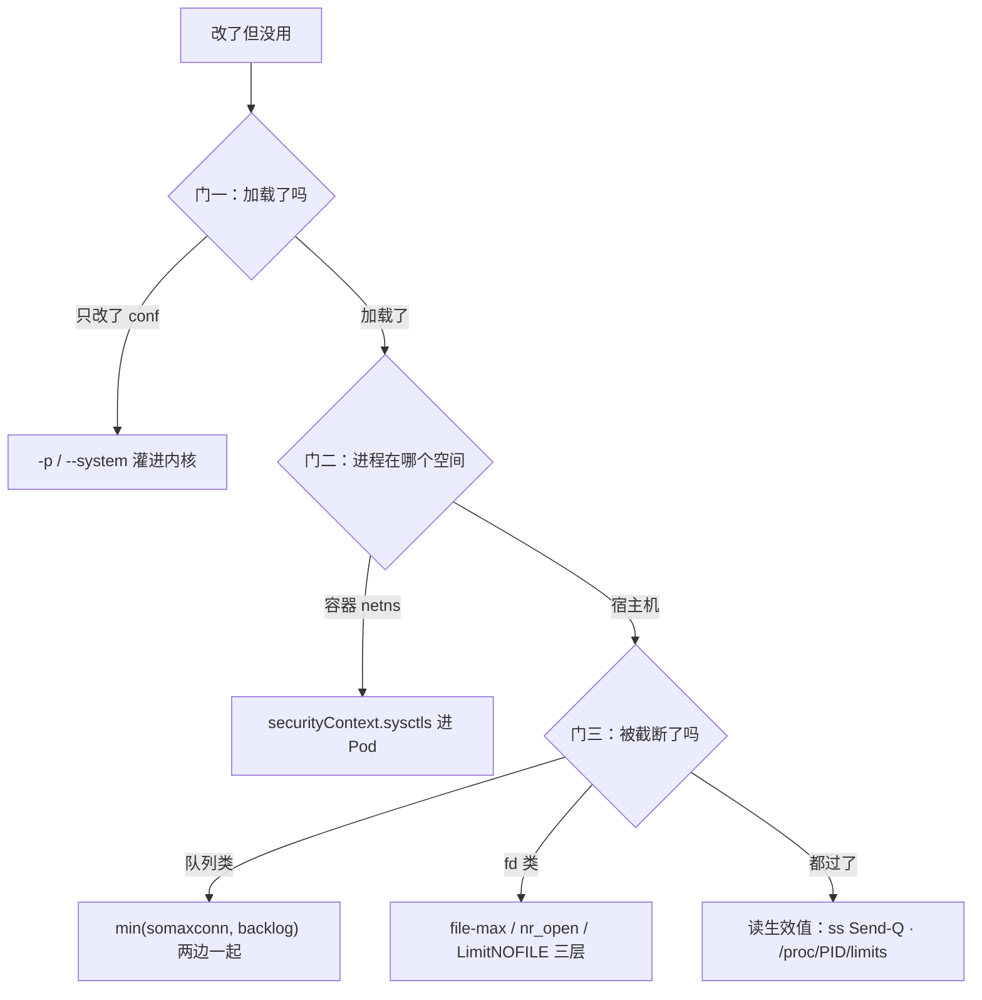

# 24｜内核参数与 sysctl · 练习题

先合上知识点，对着 **「一」的主图** 把「一个内核参数的一生：出生 → 加载 → 定居 → 到进程手里 → 验收 → 退役」口述一遍，再来做题。关键字（三道门、min 关系、namespaced、三档口径）要能对比。每题标了覆盖范围：

| 标记 | 含义 |
|------|------|
| **核心** | 不懂整章就没建立起来 |
| **必会** | 值班和面试都要能讲 |
| **常用** | 线上会反复碰到 |
| **常考** | 白板和追问的高频口径 |

## 本题目录

- [Q1 改了不生效](#q1)
- [Q2 -w 与 sysctl.d](#q2)
- [Q3 somaxconn 的 min](#q3)
- [Q4 容器里读数还是 128](#q4)
- [Q5 TIME_WAIT 与端口耗尽](#q5)
- [Q6 字节还是个数](#q6)
- [Q7 内核 keepalive 当心跳](#q7)
- [Q8 swappiness 与 overcommit](#q8)
- [Q9 fd 三层](#q9)
- [Q10 conntrack 表满](#q10)
- [Q11 按角色给清单](#q11)
- [Q12 万能模板罪状](#q12)
- [Q13 调参流程与回滚](#q13)
- [Q14 sysctl 白板综合题](#q14)
- [合上书](#合上书)

---

## Q1

**★★★★★｜sysctl「我明明改了但没用」，按什么顺序查？**

**覆盖**：核心 · 必会 · 常考 ｜ **对应**：知识点 [四、到进程手里：min 关系与 fd 三层](知识点.md)（主图见 [一、一张图：一个内核参数的一生](知识点.md)）

### 场景

同学甩出终端：`sysctl -w` 打印成功、conf 也写了，网关还是老样子。有人说「内核坏了」。

### 完整解答

> 🎯 **一句话**：三道门——写下来加载了、落在进程的空间里、过了 min/rlimit 截断；打印成功只说明过了某一道。



| 门 | 验收 |
|----|------|
| 写下来且加载 | `sysctl <key>` + `--system` 输出看来源 |
| 落对空间 | `kubectl exec` / `nsenter -t PID -n` 里读 |
| 过了截断 | `ss -lnt` Send-Q、`/proc/PID/limits` |

门都过了还是没改善？——换嫌疑，回「该不该调」重新拿证据（→ 七节调参三步）。

### 再追问

- 为什么排障不先怀疑参数值不对？——值错是三道门全过之后才轮到的假设；门没过，值再对也到不了进程。
- 「重启后参数回旧值」算哪道门？——门一：conf 没加载或被后面文件覆盖，`--system` 输出看从哪份读的。

---

## Q2

**★★★★★｜sysctl -w 和 /etc/sysctl.d/ 差在哪？-p 和 --system 又差在哪？**

**覆盖**：核心 · 必会 · 常用 ｜ **对应**：知识点 [二、出生：写下来——sysctl 读写机制与持久化三件套](知识点.md)

### 场景

周五高峰 `-w` 把 somaxconn 拉到 32768，周一开机回 128，活动再炸。另一个人改了 `99-web.conf` 却没做任何后续动作，问「我写进配置了还不行吗」。

### 完整解答

> 🎯 **一句话**：-w 只管这一次（重启丢），conf 只管重启后（不加载不生效）；-p 只读 sysctl.conf，--system 按文件名序读全部、后读覆盖先读。

```bash
sysctl -w net.core.somaxconn=32768     # 立即生效，重启丢——临时验证/止血
# /etc/sysctl.d/99-game.conf           # 纸面，重启后有效，但现在不生效
sysctl -p                              # 只重读 /etc/sysctl.conf
sysctl --system                        # 按字典序读所有 conf，后读覆盖先读
```

生产纪律：按角色拆文件（`99-web.conf` / `99-redis.conf` / `99-k8s-node.conf`，安全向另放一份 → [27](../27-Linux安全加固/)），conf 进 Git，用配置管理/镜像下发，**禁止登录手糊当唯一真相**；改完必须 `--system` + 验收读数。

> ⚠️ **别混**：`sysctl -w` 不会写回 conf；conf 改了不等于生效——一个管「现在」，一个管「重启后」，两边都要做。

### 再追问

- 两份 99-*.conf 撞了同名参数谁赢？——字典序大的后读、覆盖先读；所以命名要能看出优先级。
- Git 里有 conf、机器上活值不同步，算持久化成功吗？——不算；验收永远看机器活值 `sysctl <key>`。

---

## Q3

**★★★★★｜somaxconn 写了 32768，ss -lnt 的 Send-Q 还是 128，为什么？**

**覆盖**：核心 · 必会 · 常考 ｜ **对应**：知识点 [四、到进程手里：min 关系与 fd 三层](知识点.md)

### 场景

活动开闸登录超时。网关代码里 `listen(65535)`，宿主机和 Pod 都配了 `somaxconn=32768`，`ss -lnt | grep 443` 的 Send-Q 仍是 128。

### 完整解答

> 🎯 **一句话**：生效队列长度 = min(应用 listen backlog, somaxconn)，只调一边白调；Send-Q 才是实际 backlog 的读数。

```text
SYN → 半连接(tcp_max_syn_backlog) → 全连接 min(listen, somaxconn)
                                    → 一边是 128 → 实际 128 → 溢出/超时
```

- 证据：`nstat -az | grep ListenOverflows` 差值在涨、`ss -lnt` Send-Q 顶住不动。
- 处理：somaxconn **和** 应用 backlog 一起到 32768；容器场景还要确认 Pod netns 里那份也改了（三重门）；半连接另配 `tcp_max_syn_backlog=8192`，`syncookies` 保持 1。
- 验收：再看 `ss -lnt` Send-Q——它变了才算数，conf 里写了什么不算。

队列机制（半连接/全连接/两队列四个「满」的定责）→ [12](../12-网络栈与Socket/)，本章只管调参侧的 min 与验收。

### 再追问

- 只把 32768 改成 65536 有用吗？——没有；min 的另一边（应用 backlog、容器 netns）没动，改哪边都白改。
- 加大 `tcp_rmem` 能治吗？——不能，那是字节缓冲不是连接个数（Q6）。

---

## Q4

**★★★★☆｜Pod YAML 写了 somaxconn，容器里读还是 128；有人还想在 Pod 里改 vm.swappiness。**

**覆盖**：必会 · 常用 · 常考 ｜ **对应**：知识点 [三、定居：namespaced 还是全局——内核听谁的](知识点.md)

### 场景

`securityContext.sysctls` 配了 `net.core.somaxconn=32768`，容器内 `cat /proc/sys/net/core/somaxconn` 还是 128；群里另一个人在 Pod spec 里写 `vm.swappiness` 一直起不来。

### 完整解答

> 🎯 **一句话**：多数 net.* 参数每个 netns 一份（Pod 用 securityContext.sysctls），vm/fs/kernel 是全机一份（只能宿主机改）；验收永远读进程所在空间。

| 参数 | 去哪改 |
|------|--------|
| 多数 `net.ipv4.*` / `net.core.*` | Pod `securityContext.sysctls`（或宿主机，但改的是宿主机那份 netns） |
| `somaxconn`（新内核 namespaced） | 新内核 Pod 里改；**旧内核只能改宿主机** |
| `vm.swappiness` / `fs.file-max` / `kernel.*` | 只能宿主机 `sysctl.d`；Pod 里写会被拒 |
| `nf_conntrack_*` | 节点级，宿主机改 |

经典坑：宿主机 `sysctl -w` 改的是**宿主机 netns**，Pod 的 netns 是 CNI 另建的一份，互不相干——「宿主机改了容器没变」不是 bug。验收用 `kubectl exec` 或 `nsenter -t PID -n` 读，别拿宿主机读数当容器的。

> ⚠️ **别混**：特权 initContainer 悄悄改整节点 sysctl 是红线——无变更单、无回滚、影响同节点所有 Pod；节点级参数走镜像/DaemonSet + 审计。

### 再追问

- 容器里 `sysctl -w` 打印成功 = 进程用上了？——不等于；读容器内 `/proc/sys` 与进程 limits 才算验收。
- 安全向 sysctl（redirects/rp_filter）放哪？——单独一份 conf、归安全清单管，不和性能参数搅（→ [27](../27-Linux安全加固/)）。

---

## Q5

**★★★★★｜出站报 Cannot assign requested address、TIME_WAIT 几十万，怎么治？recycle 能开吗？**

**覆盖**：核心 · 必会 · 常考 ｜ **对应**：知识点 [五、地图：常调参数全景——是什么/默认值/什么时候动/动了出什么事](知识点.md)（事故另见 [六、事故：抄来的「万能调优模板」罪状清单](知识点.md)）

### 场景

Nginx 反代调下游 API，偶发 `Cannot assign requested address`，`ss -s` 里 TIME_WAIT 几十万。老脚本里还留着 `tcp_tw_recycle=1`。

### 完整解答

> 🎯 **一句话**：治本是连接池；买时间是 tw_reuse=1 + 扩 ip_local_port_range；recycle 禁止——4.12 起已删，3.x + NAT = 随机断连。

1. **治本**：连接池 / Nginx upstream keepalive（→ [19](../19-Nginx/)），短连接少了 TIME_WAIT 和端口消耗一起降。
2. **tcp_tw_reuse=1**：复用 TIME_WAIT 做**出站**连接，需 tcp_timestamps=1（默认开）；只帮这台机器当客户端的一侧，不影响入站玩家的 LISTEN。
3. **ip_local_port_range 1024 65535**：源端口池从默认 32768-60999（约 2.8 万）扩容——是买时间，注意别和本机监听端口撞段。
4. **别做**：开 recycle（已删/危险）；乱降 `tcp_fin_timeout` 或砍 2MSL 当常规操作。

TIME_WAIT 的完整生命周期与内核心跳 → [13](../13-TCP与UDP/)。

### 再追问

- 为什么 recycle 在云上特别毒？——云上全是 NAT，recycle 会丢弃同源时间戳错乱的包，NAT 后的客户端「时好时坏」，最难排的那种。
- fin_timeout 降到 5 秒行不行？——fin_timeout 管本端 FIN_WAIT_2，和 TIME_WAIT 不是一回事；大量 CLOSE_WAIT 是应用不调 close，降它只盖症状。

---

## Q6

**★★★★☆｜「Recv-Q 大就加 rmem」对不对？字节和个数怎么分？**

**覆盖**：必会 · 常用 ｜ **对应**：知识点 [五、地图：常调参数全景——是什么/默认值/什么时候动/动了出什么事](知识点.md)（min 关系见 [四、到进程手里：min 关系与 fd 三层](知识点.md)）

### 场景

两次评审：有人说「LISTEN 顶满就加 tcp_rmem」；另一次 ESTAB Send-Q 涨，有人加本端 wmem。

### 完整解答

> 🎯 **一句话**：队列是连接**个数**问题（somaxconn/backlog），缓冲是**字节**问题（rmem/wmem 三元组）——拿字节参数治个数问题，min 那道门还是没过。

| 现象 | 主责 | 动作 |
|------|------|------|
| LISTEN Send-Q/队列顶满 | 个数 | somaxconn + 应用 backlog（→ [12](../12-网络栈与Socket/)） |
| ZeroWindow / 对端不收 | 窗口 | 加本端 wmem 治不好**对端**（→ [13](../13-TCP与UDP/)） |
| 高带宽×高延迟吞吐上不去 | 字节 | `ss -ti` 证明窗口顶住，才调 rmem/wmem max |
| 软中断 %si 打满 | 中断 | 排查思路 → [06](../06-CPU与Load/)，必要时 netdev_max_backlog |

rmem/wmem 是「min/default/max」三元组：max 调大是**允许**用更多内存不是必然；全机无脑拉大，几万连接 × 大缓冲会被 OOM 点名（→ [07](../07-内存与OOM/)）。

### 再追问

- LISTEN 顶满加 rmem 为什么无效？——全连接队列长度由 min(listen, somaxconn) 决定，和每个连接的收缓冲无关。
- wmem 什么时候真能救？——BDP 场景（大带宽×高延迟）且 `ss -ti` 看到窗口是瓶颈；否则先定责再动手。

---

## Q7

**★★★★☆｜把 tcp_keepalive_time 调到 30 秒当游戏心跳，行不行？**

**覆盖**：必会 · 常用 · 常考 ｜ **对应**：知识点 [五、地图：常调参数全景——是什么/默认值/什么时候动/动了出什么事](知识点.md)（分工另见 [22](../22-监控与告警/)）

### 场景

战斗长连接的「死连接」几小时才消失。有人把 `tcp_keepalive_time` 调到 30 秒，说「这不就有心跳了」。

### 完整解答

> 🎯 **一句话**：内核 keepalive 是清僵尸 TCP 的兜底（默认 2 小时才启动），探活是应用心跳 15-45s——两层不能混。

量级尺子：**应用心跳 15-45s < NAT/LB 空闲超时 ~5min < 内核 keepalive（默认 2h）**。

- 默认 7200/75/9 太迟钝，生产收到 600/30/3：死连接几小时内被清，这是它该干的活。
- 就算调到 30 秒，它也只能证明「TCP 层还通」，证明不了「进程还能处理请求」——玩家假死（进程卡死但 fd 还在）内核探不出来，只有应用心跳能。
- NAT 空闲 ~5 分钟断链，靠的是应用心跳 < 5min 保活，不是 keepalive。

机制（探测包怎么走、几个参数怎么配合）→ [13](../13-TCP与UDP/)；本章管「落盘三元组 + 别当心跳」。

### 再追问

- tcp_fastopen=3 是什么？——要双端支持才有意义，不是心跳问题也不是开闸第一刀；知道名字即可。
- 应用心跳怎么和「在线数」监控结合？——心跳是探活数据源，掉线率告警归监控体系统一收口（→ [22](../22-监控与告警/)）。

---

## Q8

**★★★★★｜swappiness 设 0 还是 1？overcommit=1 能写进所有机器的镜像吗？**

**覆盖**：核心 · 必会 · 常考 ｜ **对应**：知识点 [五、地图：常调参数全景——是什么/默认值/什么时候动/动了出什么事](知识点.md)

### 场景

Redis 延迟毛刺。有人建议 `swappiness=0` 加 `swapoff -a`；另一个人把 `vm.overcommit_memory=1` 写进所有 Worker 的基础镜像，理由是「Redis 官方推荐」。

### 完整解答

> 🎯 **一句话**：Redis 用 swappiness=1 不是 0；overcommit=1 只对 Redis 这类 fork 场景是救星，对 Web 是内存超卖 + 随机 OOM——参数有「场景」这一栏。

| 项 | 口径 | 动了出什么事 |
|----|------|------|
| swappiness | 默认 60；数据库 1-10；Redis **1** | 0 在部分内核语义 = 尽量不换直到快 OOM，尖峰反而被 OOM killer 直接杀 |
| overcommit | 0 启发式（默认）/ 1 从不拒绝 / 2 按比例 | 1 允许超卖：Redis fork 不被拒；Web 真用超了就是随机 OOM |
| dirty_ratio/background | 20/10 → 15/5 或 10/5 | 不调：脏页攒一坨后写进程集体阻塞、IO 长尾 |
| max_map_count | 65530 → ≥262144 | ES mmapfs 起不来；网关不用动 |
| THP | Redis/DB 机器 never | THP 合并/拆分造成延迟毛刺，Redis 官方要求禁用 |

判断动作顺序：Redis 毛刺 → 先 swappiness=1 + THP never，再看监控（→ [07](../07-内存与OOM/)）；Web 集群收到 Redis 的 conf，就是六节事故 B。

### 再追问

- 为什么 Redis 宁可 1 也不 0？——1 = 换页倾向极低但留了缓冲；0 = 硬扛到 OOM killer 直接杀进程，「性能下降」和「进程直接死」选前者。
- swapoff -a 能当优化吗？——不能当默认动作；内存尖峰没有 swap 缓冲，直接 OOM。

---

## Q9

**★★★★★｜报 Too many open files，file-max 已经 100 万了，下一步看哪？**

**覆盖**：核心 · 必会 · 常用 ｜ **对应**：知识点 [四、到进程手里：min 关系与 fd 三层](知识点.md)

### 场景

Nginx 报 `Too many open files`。有人已经把 `fs.file-max` 调到 100 万并 `sysctl --system`，报错照旧。

### 完整解答

> 🎯 **一句话**：fd 三层 file-max → nr_open → LimitNOFILE，最低的那层说了算；十次九次卡在进程 soft 仍是 1024。

```text
fs.file-max（整机，1000000+）
  └─ fs.nr_open（单进程硬顶，默认 1048576）
       └─ LimitNOFILE / ulimit -n（进程实际）
            └─ /proc/{PID}/limits ← 验收看这里
```

```bash
cat /proc/$(pidof nginx)/limits   # 进程天花板：Soft 1024 = 卡在这层
cat /proc/sys/fs/file-nr          # 整机水位：32768 0 1000000 = 整机没满
```

修法：systemd 服务写 drop-in `LimitNOFILE=65535` → `daemon-reload` → **重启进程**；`/etc/security/limits.conf` 对 systemd 服务**不生效**（那是 PAM 给登录 shell 的）；`ulimit -n` 只影响当前 shell。容器另有 runtime ulimits / 入口 setrlimit，验收同样看 `/proc/PID/limits`。fd 与 rlimit 原理 → [05](../05-进程与信号/)。

### 再追问

- nr_open 要不要调？——一般不用；LimitNOFILE 想超过它才需要先抬它，否则服务起不来。
- 回滚成本最低的是哪层？——sysctl 多数即时回滚；LimitNOFILE 回滚要**重启进程**，趁低峰做。

---

## Q10

**★★★★☆｜K8s 节点登录「一会行一会不行」，dmesg 有 table full, dropping packet。**

**覆盖**：必会 · 常用 ｜ **对应**：知识点 [五、地图：常调参数全景——是什么/默认值/什么时候动/动了出什么事](知识点.md)（机制见 [17](../17-iptables与conntrack/)）

### 场景

CPU 不高、Pod 都活着，但 Pod 间/对外的新连接**间歇性**失败。有人已经在重启节点。

### 完整解答

> 🎯 **一句话**：conntrack 表满丢新连接，间歇性是它的签名；调 max 买时间 + >80% 告警，治本在少短连接/IPVS。

```bash
cat /proc/sys/net/netfilter/nf_conntrack_count   # 对照 max 算水位
cat /proc/sys/net/netfilter/nf_conntrack_max     # 默认 65536，对 K8s 节点远远不够
```

- 默认 65536 → 调 1048576，并**配监控告警 >80%**——表满期间丢的包找不回来，「满了再调」已经晚了。
- 为什么间歇：表有空位时能建连、打满就丢，count 曲线呈锯齿——「时好时坏」恰恰指向它。
- 治本：少短连接（连接池）、或 IPVS 模式绕开 iptables conntrack 路径（→ [17](../17-iptables与conntrack/)）。
- 同一台节点顺手检查：`kernel.pid_max=4194304`（fork 报 retry 时）、`fs.inotify.max_user_watches=524288`（CI/agent 报 ENOSPC，不一定是盘满）、宿主机 file-max。

### 再追问

- 没开 iptables/conntrack 的机器调 max 有意义吗？——没有，模块没加载就是「优化氛围组」。
- conntrack 满和队列溢出现象怎么分？——conntrack 是「新建连失败」（新旧都有，dmesg 有 dropping packet）；队列溢出是「握手完进不了 accept」（ListenOverflows 涨）。

---

## Q11

**★★★★★｜「你们生产机器内核参数怎么调的？」web / Redis / K8s node 各给一份。**

**覆盖**：核心 · 必会 · 常考 ｜ **对应**：知识点 [九、收口](知识点.md)（地图见 [五、地图：常调参数全景——是什么/默认值/什么时候动/动了出什么事](知识点.md)）

### 场景

面试收尾大题。有人开始背一长串参数名，把 Redis 清单糊到所有 Worker 上。

### 完整解答

> 🎯 **一句话**：按角色拆 conf、每个参数带证据场景；Web 调队列和 fd，Redis 调内存路径，K8s node 调表和 pid——三份清单长得完全不一样。

```text
Web/网关   somaxconn=32768 + syn_backlog=8192 + syncookies=1
           tw_reuse=1 + port_range=1024 65535 + keepalive 600/30/3
           file-max=1000000 + LimitNOFILE=65535
Redis/DB   swappiness=1 + overcommit=1 + dirty 10/5 + THP never
K8s node   nf_conntrack_max=1048576 + pid_max=4194304
           inotify watches=524288 + file-max=1000000 + max_map_count=262144(跑ES才要)
```

答题结构比参数名值钱：先说「按角色拆文件、conf 进 Git、--system 加载、验收读数」，再按角色报 1-2 个参数的四件套（是什么/默认/何时动/动了出什么事）。每个角色一两句，别背 40 个 key。

### 再追问

- 为什么不维护一份「全角色通用优化清单」？——overcommit=1 就是反例：Redis 的救星、Web 的毒药；通用清单必然在某类机器上是错的（六节罪状四）。
- 治不了的时候怎么办？——tw 堆积治本是连接池（→ [19](../19-Nginx/)）；conntrack 治本是 IPVS（→ [17](../17-iptables与conntrack/)）——sysctl 多数是买时间不是治本。

---

## Q12

**★★★★☆｜群里传的「生产 sysctl 万能优化清单」贴上来，你怎么评审？**

**覆盖**：核心 · 常考 ｜ **对应**：知识点 [六、事故：抄来的「万能调优模板」罪状清单](知识点.md)

### 场景

新同事把一份 2016 年的模板贴给你：「都是前人生产验证过的，直接全量下发吧」。

### 完整解答

> 🎯 **一句话**：模板的罪不在参数本身，在于无证据、无场景、无回滚——三条全占就是事故预定。

评审清单（对着模板逐条过）：

- **废参数**：`tcp_tw_recycle=1`——4.12 起已删；先 `ls /proc/sys/net/ipv4/ | grep recycle`，文件都没有（事故 A：NAT 后随机断连排障三天）。
- **危险值**：`swappiness=0`（用 1）；砍 fin/2MSL 当常规；关 syncookies 只堆天文 backlog。
- **无场景**：`overcommit=1` 糊 Web（超卖随机 OOM，事故 B）；`max_map_count` 糊网关假装优化。
- **无证据**：没有 nstat/ss/file-nr/监控读数就整份套用。
- **无回滚**：conf 不进 Git、没有基线读数、不知道哪些参数回滚要重启进程。

三档口径收尾：**禁止**（recycle、THP 给 Redis、特权 initContainer 改整节点、砍 fin）/ **慎用**（swappiness=0、大降 fin_timeout、无脑拉 rmem/wmem、乱加大 retries2）/ **场景项**（队列、端口、conntrack、max_map_count、overcommit、ip_forward 有证据才动）。

### 再追问

- 升内核时模板要重审吗？——要：recycle 没了、somaxconn 新默认 4096、namespaced 行为可能变——每条参数重放一遍「还存在吗」。
- 模板一点价值没有吗？——当**候选清单**有价值：逐条按三步纪律（观测→定位→小步改）验证后再落地。

---

## Q13

**★★★★☆｜你的调参流程是什么？改错了怎么回滚？**

**覆盖**：必会 · 常用 ｜ **对应**：知识点 [七、纪律：调参三步——观测、定位、小步改](知识点.md)（定责树见 [八、作战：「调了没生效」与「该不该调」定责](知识点.md)）

### 场景

面试官：「别说参数名了，说你**怎么调**。」追问：「高峰把 swappiness 打成 0 出了 OOM，下周还要升内核，怎么办？」

### 完整解答

> 🎯 **一句话**：观测拿读数 → 定位到族 → -w 小步改一个 → 观察一个洪峰 → 有效才落盘进 Git；回滚成本先想好。

```bash
# 第一步：观测（没有读数就没有调参资格）
nstat -az | grep -iE 'ListenOverflows|ListenDrops'   # 队列
ss -s                                                  # TW / CLOSE_WAIT
cat /proc/sys/fs/file-nr                               # fd 水位
cat /proc/sys/net/netfilter/nf_conntrack_count         # 表水位
vmstat 1 5                                             # si/so 换页
# 第二步：定位——现象对到地图的哪一族；对不上任何一族 = 别硬调
# 第三步：小步改
sysctl -w net.core.somaxconn=32768     # -w 临时改 → 三道门验收 → 观察洪峰
# 有效才写 sysctl.d/99-web.conf（进 Git，注明谁/为什么/哪条工单）→ --system → 再验收
```

- **一次只动一个参数**（或 min 关系的一对）：两个一起改，好了不知道谁的功、坏了不知道谁的锅。
- **回滚**：swappiness 错 0 改回 1（-w 即时 + 改 conf），别 `swapoff` 掩盖；**LimitNOFILE 回滚要重启进程**，趁低峰；conf 按角色拆、随配置管理走。
- **升级**：先升一台金丝雀看 Send-Q/延迟/OOM；模板参数逐条重审（recycle 不存在、somaxconn 新默认 4096、namespaced 行为变化）。

### 再追问

- 为什么先 -w 再落盘？——落盘是「确认有效之后」的承诺；-w 阶段随时可退，代价最小。
- 现象对不上任何一族怎么办？——大概率不是内核参数问题，回监控和代码查，别硬调凑答案。

---

## Q14

**★★★★★｜白板：参数一生 + 三道门 + min 关系 + 调参三步？**

**覆盖**：核心 · 必会 · 常考 ｜ **对应**：知识点 [一、一张图](知识点.md) · [九、收口](知识点.md)

### 场景

白板：「说 sysctl 为什么常『写了没用』，并举 somaxconn 的 min 关系。」

### 完整解答

> 🎯 **一句话**：**-w→sysctl.d→进程/netns 验收**；有效 backlog=min(listen,somaxconn)；禁止万能模板。

```text
四卡点: 没写对文件 / 容器netns / min关系 / 进程已启动未继承
三道门: sysctl -w → 观察洪峰 → 落盘Git
六族地图: 队列/端口/conntrack/fd/内存网络/安全
```

> 📝 **面试**：recycle 已删、swappiness=0 慎用（Q11、Q12）。

### 再追问

- 调了没生效？——从哪道门进：读数位置、netns、是否要重启进程（Q1、Q4）。

---

## 合上书

- [ ] 默画主图：出生 → 加载 → 定居 → 到进程手里 → 验收 → 退役；四个「写了没用」卡点各挂哪段
- [ ] 持久化三件套：-w / sysctl.d 按角色拆文件 / -p 与 --system 的区别；后读覆盖先读
- [ ] namespaced vs 全局：哪族每 netns 一份、容器怎么写、为什么在进程的空间里读
- [ ] somaxconn 改了没用：min 关系 + 容器 netns + ss Send-Q 验收；fd 三层从 file-max 到 /proc/PID/limits
- [ ] 参数地图六族：每族 1-2 个参数的四件套（是什么/默认/何时动/动了出什么事）
- [ ] 罪状清单：禁止四件、慎用三件、场景项怎么界定；recycle 和 swappiness=0 为什么毒
- [ ] 调参三步：观测拿什么读数、定位怎么对地图、小步改与回滚成本（LimitNOFILE 要重启进程）
- [ ] 「调了没生效」从哪道门进、「生效了没改善」之后去哪；conntrack 间歇丢包的签名
- [ ] 白板参数一生与三步纪律（Q14）

与知识点「合上书」对齐；都能口述这一章就过了。
