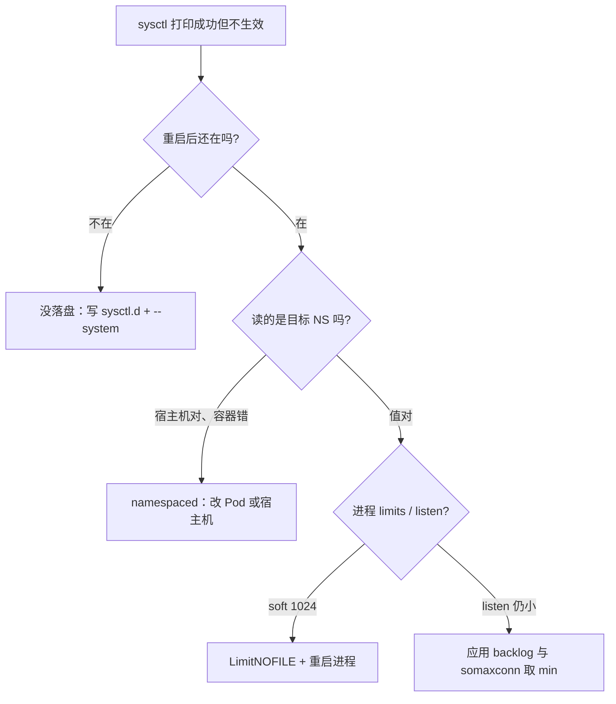
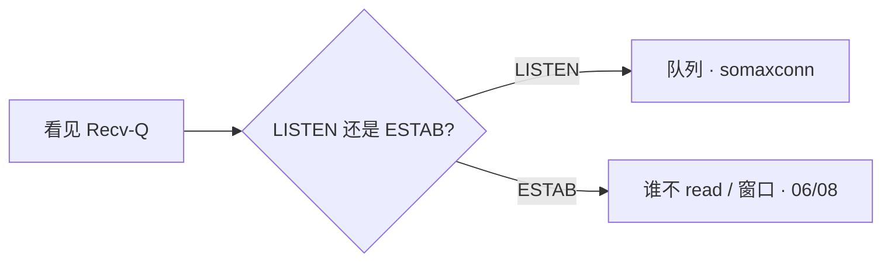

# 18｜内核参数与 sysctl · 练习题

先对照 [知识点](知识点.md)：**先 §2 总图，再 §4 三道门，再 §5～§6 边界与危险旋钮**。能讲清「写到哪 / 谁听 / 危险不危险」再谈具体 key。每题标了覆盖范围：

| 标记 | 含义 |
|------|------|
| **核心** | 不懂整章就没建立起来 |
| **必会** | 值班和面试都要能讲 |
| **常用** | 线上会反复碰到 |
| **常考** | 白板和追问的高频口径 |

## 本题目录

- [Q1 三道门](#q1)
- [Q2 持久化](#q2)
- [Q3 somaxconn 与 backlog](#q3)
- [Q4 net.core / tcp 边界](#q4)
- [Q5 TIME_WAIT 与危险旋钮](#q5)
- [Q6 fd 三层](#q6)
- [Q7 容器 namespaced](#q7)
- [Q8 conntrack](#q8)
- [Q9 swap / dirty / 场景项](#q9)
- [Q10 keepalive vs 心跳](#q10)
- [Q11 按角色裁剪](#q11)
- [Q12 升级回滚](#q12)
- [合上书](#合上书)

---

## Q1

**★★★★★｜sysctl「改了不生效」先查哪三道门？**

**覆盖**：核心 · 必会 · 常考

**对应**：知识点 §2 · §4

### 场景

同学甩出终端：`sysctl -w` 都打印成功了，Nginx 还是老样子。有人说「内核坏了」。

### 完整解答

**一句话**：三道门——持久化、namespaced、进程 rlimit；打印成功只说明某一层写进去了。



| 门 | 验收命令 |
|----|----------|
| 持久化 | `ls /etc/sysctl.d/` + `sysctl key` |
| namespaced | **容器内** `cat /proc/sys/...` |
| rlimit | `cat /proc/<pid>/limits` |

### 再追问

只看自己 SSH 里的 `ulimit -n` 够不够？——不够。以服务进程 `/proc/pid/limits` 为准。

---

## Q2

**★★★★★｜`sysctl -w` 和 `/etc/sysctl.d/` 差在哪？改 conf 忘了哪一步？**

**覆盖**：核心 · 必会 · 常用

**对应**：知识点 §4.1

### 场景

周五高峰 `-w` 把 somaxconn 拉到 32768，周一开机又回 128，活动再炸。

### 完整解答

**一句话**：`-w` 只改活值、重启丢；生产写 `/etc/sysctl.d/*.conf` 后必须 `sysctl --system`。

| 写法 | 存活 |
|------|------|
| `sysctl -w` | 到重启 |
| `sysctl.d` + `--system` | 跨重启 |

加载顺序面试口径：`sysctl.d` 各目录按文件名排序，后写覆盖先写；角色拆 `99-web.conf` / `99-redis.conf`，安全清单另文件（[27](../27-Linux安全加固/)）。

```bash
cat >/etc/sysctl.d/99-web.conf <<'EOF'
net.core.somaxconn = 32768
EOF
sysctl --system
sysctl net.core.somaxconn
```

### 再追问

Git 里有 conf、机器上不同步，算持久化成功吗？——不算。验收看机器活值。

---

## Q3

**★★★★★｜somaxconn 默认 128 会怎样？和 listen / syn_backlog 什么关系？**

**覆盖**：核心 · 必会 · 常用 · 常考

**对应**：知识点 §5.2 · [12](../12-网络栈与Socket/)

### 场景

活动开闸登录超时。网关 `listen(65535)`，宿主机没动过。`ss -lnt` Recv-Q 顶在 128。

### 完整解答

**一句话**：全连接实际长度 = min(listen backlog, somaxconn)；默认 128 会把开闸 SYN 顶满；半连接另看 `tcp_max_syn_backlog`。

```text
SYN → 半连接(tcp_max_syn_backlog) → 全连接 min(listen, somaxconn)
                                    → 默认 128 满 → overflow / 登录超时
```

发现：`ss -lnt` Recv-Q 持续顶满；`netstat -s | grep overflow`。

处理：somaxconn、应用 listen **一起**拉到 32768+；`tcp_max_syn_backlog` 到 8192+；`syncookies` 保持 **1**。落盘 `sysctl.d`。

含义与 Recv-Q 定责 → [12](../12-网络栈与Socket/)。本章负责：**min、持久化、容器内验证**。

### 再追问

加大 `tcp_rmem` 能治吗？——不能。那是字节缓冲，不是连接个数队列（§5.3）。

---

## Q4

**★★★★★｜什么时候调 somaxconn，什么时候调 rmem/wmem？和 06/08 怎么分工？**

**覆盖**：核心 · 必会 · 常考

**对应**：知识点 §5 · §2.2

### 场景

有人说「Recv-Q 大就加 rmem」。另一次 ESTAB Send-Q 涨，有人加本端 wmem。

### 完整解答

**一句话**：LISTEN 顶满调队列（somaxconn/listen）；ESTAB 缓冲/窗口问题先按 06/08 定责，再谈 rmem/wmem；18 只管落盘边界。

| 现象 | 主责 | 调参 |
|------|------|------|
| LISTEN Recv-Q 顶满 | [12](../12-网络栈与Socket/) | somaxconn + listen |
| ESTAB Recv-Q 涨、应用卡住 | [12](../12-网络栈与Socket/) | 先修 read，别先加 rmem |
| ZeroWindow / 对端不收 | [13](../13-TCP与UDP/) | 加本端 wmem 治不好对端 |
| retrans / cwnd | [13](../13-TCP与UDP/) | 别当缓冲太小 |



### 再追问

18 章为什么还列 tcp_rmem？——列边界与「别滥用」；含义与定责不在本章展开。

---

## Q5

**★★★★★｜TIME_WAIT 太多怎么治？能开 recycle 吗？为什么算危险旋钮？**

**覆盖**：核心 · 必会 · 常考

**对应**：知识点 §5.4 · §6 · [12](../12-网络栈与Socket/) · [13](../13-TCP与UDP/)

### 场景

Nginx 反代 API，后端 TIME_WAIT 几十万，偶发 `Cannot assign requested address`。脚本里还有 `tcp_tw_recycle=1`。

### 完整解答

**一句话**：治本是连接池/keepalive；买时间是 `tw_reuse` + 扩 `ip_local_port_range`；`tcp_tw_recycle` 禁止（已删 / NAT 有害）。

1. 治本：连接池 / Nginx upstream keepalive（[19](../19-Nginx/)）。  
2. `tcp_tw_reuse=1`：只复用**出站** TW，要 timestamps。  
3. 扩 port_range 到 `1024 65535`。  
4. **不要**乱降 fin/2MSL；**不要** recycle。

危险类还有：swappiness=0、无证据糊全球清单、特权 init 改整节点（§6）。

### 再追问

tw_reuse 会影响入站玩家 LISTEN 吗？——不会。只对这台当客户端的一侧。

---

## Q6

**★★★★★｜ulimit 和 fs.file-max 差在哪？改了为什么还不生效？**

**覆盖**：核心 · 必会 · 常用

**对应**：知识点 §4.3

### 场景

Nginx 报 `Too many open files`。有人已经把 `fs.file-max` 调到 100 万。

### 完整解答

**一句话**：fd 三层是 file-max → nr_open → LimitNOFILE；十次九次卡在进程 soft 1024；以 `/proc/pid/limits` 为准。

```text
fs.file-max     整机（生产 1000000+）
     └─ fs.nr_open
          └─ LimitNOFILE / ulimit -n   ← 实际 Soft
```

- 交互登录：PAM `limits.conf`  
- **systemd 服务不读 PAM** → `LimitNOFILE=65535`，还要 **重启进程**  
- 容器：runtime / securityContext / `setrlimit`，不读宿主机 limits.conf  

### 再追问

nr_open 要不要调？——一般不用。soft 65535、全局百万已覆盖绝大多数网关。

---

## Q7

**★★★★☆｜容器里 sysctl 不生效？YAML 写了 somaxconn 仍是 128**

**覆盖**：必会 · 常用 · 常考

**对应**：知识点 §4.2

### 场景

YAML 写了 `net.core.somaxconn=32768`，容器里 `cat /proc/sys/...` 仍是 128。另有人想在 Pod 里改 `fs.file-max`。

### 完整解答

**一句话**：先问是否 namespaced——多数 `net.ipv4.*` 跟 Pod netns；`fs.file-max` / 多数 `vm.*` 只能宿主机。

| 参数 | 怎么改 |
|------|--------|
| 多数 net.ipv4.* | Pod `securityContext.sysctls` |
| somaxconn | 新内核是；旧内核否 → **改宿主机** |
| fs.file-max / 多数 vm / kernel.* | 否，宿主机 |

验证永远读**容器内** `/proc/sys`。特权 initContainer 改的是整节点，要当节点变更管理。

### 再追问

能在容器里改 file-max 当「容器优化」吗？——不能当独立旋钮；走节点 `sysctl.d`。

---

## Q8

**★★★★☆｜conntrack 表满什么症状？K8s node 还要调什么？**

**覆盖**：必会 · 常用

**对应**：知识点 §7.3 · [17](../17-iptables与conntrack/)

### 场景

K8s 节点登录「一会行一会不行」。CPU 不高。`dmesg`：`table full, dropping packet`。

### 完整解答

**一句话**：count/max >80% 告警；表满间歇丢新连接；调 max 买时间，治本少短连接或切 IPVS（含义见 15）。

```bash
cat /proc/sys/net/netfilter/nf_conntrack_count
cat /proc/sys/net/netfilter/nf_conntrack_max
```

默认 max 常见 **65536**。生产可到 **1048576**（按内存）。节点同时盯：`pid_max` **4194304**、`inotify` **524288+**、宿主机 file-max。不要把 Redis `overcommit=1` 推到所有 Worker。

### 再追问

为什么是间歇的？——表有空位又能建；打满又丢。count 呈锯齿。

---

## Q9

**★★★★☆｜swappiness 设 0 还是 1？哪些是场景项不要全球开？**

**覆盖**：必会 · 常用 · 常考

**对应**：知识点 §6 · §7.2

### 场景

Redis 延迟毛刺。有人建议 `swappiness=0` 和 `swapoff -a`。另有人把 `overcommit_memory=1` 写进所有 Worker 镜像。

### 完整解答

**一句话**：Redis 用 swappiness=**1** 不是 0；overcommit=1、max_map_count、THP never 是场景项，按角色开。

| 项 | 口径 |
|----|------|
| swappiness | **1–10**；0 更容易直接 OOM |
| overcommit=1 | Redis fork；**Web 别抄** |
| dirty 10/5 | 防写进程集体阻塞；磁盘仍慢查 [08](../08-磁盘与IO/) |
| THP never | Redis 防毛刺 |
| max_map_count≥262144 | ES；网关不必假装优化 |

### 再追问

dirty_ratio 默认 20 会怎样？——脏页到 20% 时所有写进程可能阻塞刷盘。

---

## Q10

**★★★★☆｜内核 TCP keepalive 能当游戏心跳吗？**

**覆盖**：必会 · 常用 · 常考

**对应**：知识点 §5.4 · [13](../13-TCP与UDP/)

### 场景

战斗长连接「死连接」几小时才消失。有人把 `tcp_keepalive_time` 调到 30 秒当心跳。

### 完整解答

**一句话**：内核 keepalive 只清僵尸 TCP；游戏存活必须应用层 15–45s；两层不能混（主责 [13](../13-TCP与UDP/)）。

默认 **7200s** 才开始探。生产可收到 **600/30/3**，**仍然只是清僵尸 TCP**。NAT ~5min 也救不了——应用心跳必须更短。

18 章边界：可以落盘 keepalive 三元组；**不能**在面试里把它说成游戏心跳方案。

### 再追问

tcp_fastopen=3？——双端支持才有意义；不是心跳问题，也不是开闸第一刀。

---

## Q11

**★★★★★｜生产调哪些 sysctl？web / db / k8s 有何不同？**

**覆盖**：核心 · 必会 · 常考

**对应**：知识点 §7 · §11

### 场景

「你们机器内核参数怎么调的？」有人背一长串，把 Redis 清单糊到所有 Worker。

### 完整解答

**一句话**：按 web/db/k8s 角色裁剪；先证明瓶颈再调一个；一份清单打全球是错的。

```text
连接队列满  → somaxconn + syn_backlog + syncookies     Web/网关
出站端口尽  → tw_reuse + port_range + 连接池           Web
fd 不够     → file-max + LimitNOFILE                   Web
延迟毛刺    → swappiness=1；Redis fork → overcommit=1  DB
间歇丢包    → conntrack 80%；pid_max；inotify          K8s node
```

量级背知识点 §11.3。持久化 `/etc/sysctl.d/` + `--system`。危险旋钮见 §6。

### 再追问

somaxconn 和应用 listen？——取 **min**。应用 65535、内核 128 → 实际 128。

---

## Q12

**★★★☆☆｜改错了怎么回滚？升内核要注意什么？**

**覆盖**：必会 · 常用

**对应**：知识点 §6 · §8.4

### 场景

高峰把 swappiness 打到 0，Redis OOM。下周升内核，脚本里还有 `tcp_tw_recycle=1`。

### 完整解答

**一句话**：sysctl 回滚 = 改 conf + `sysctl --system`；LimitNOFILE 必须重启进程；升级前确认 recycle 已删、namespaced 是否变。

- 错误 0 改回 **1**，不要先 `swapoff` 掩盖。  
- 升级：`tw_recycle` 可能不存在；somaxconn namespaced 行为可能变；先升一台看 Recv-Q / 延迟 / OOM。  
- 角色 conf 随配置管理走，禁止登录手糊当唯一真相。  
- 一参一改；没有证据全调叫拍脑袋。

### 再追问

安全 sysctl 能不能写进 99-production.conf？——可以同机**不同文件**。redirects/rp_filter 在 [27](../27-Linux安全加固/)，别和性能清单搅不清。

---

## 合上书

- [ ] 能默画 §2.0：写入 → 听谁 → rlimit → 三角色 → 危险区  
- [ ] 能口述三道门；容器里改 file-max 为什么常常不算  
- [ ] 能算 min(listen, somaxconn)；说明为何不加 rmem 治 LISTEN 顶满  
- [ ] 能列出禁止/慎用/场景项（recycle、swappiness=0、overcommit 等）  
- [ ] 能处理 TW：连接池治本、tw_reuse、recycle 已删  
- [ ] Too many open files，file-max 百万了下一步看哪  
- [ ] 能按 web / Redis / k8s node 说优先旋钮，并分开讲 conntrack 80%、dirty、内核 keepalive vs 应用心跳  
