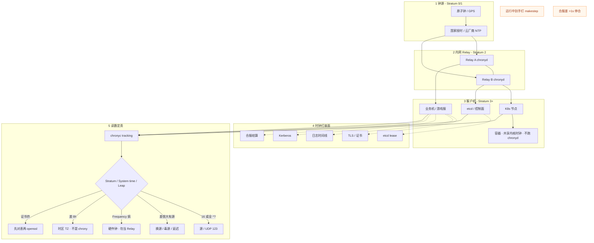
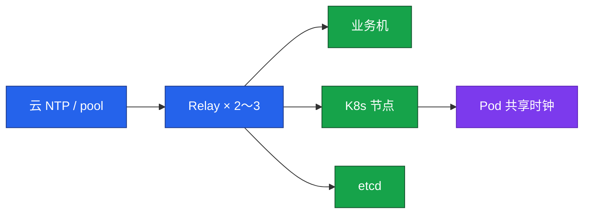
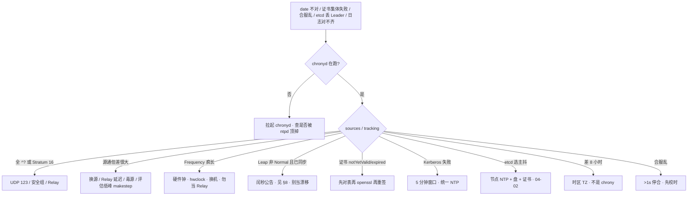

# NTP 与时间同步

> **这章解决什么**：合服排行榜乱、证书集体 `notYetValid`、etcd 选主抖、日志对不齐——根因是不是**本机以为的「现在」**偏了？  
> **读法**：**先看总图** → **再认名词** → **再分节抠 tracking / slew·step / 时钟打崩面**。  
> **刻意不展开**：API Server / kubelet 证书轮换流程 → [03-03](../../03-Kubernetes/03-API-Server/)；etcd Raft 细节 → [03-02](../../03-Kubernetes/02-etcd/)；合服/回档流程本身 → [07 游戏运维专题](../../07-游戏运维专题/)；日志字段规范 → [23 日志运维](../23-日志运维/)；云专线延迟产品 → [06 云平台](../../06-云平台/)。

---

## 本章目录

1. [本章定位](#1-本章定位)
2. [先看总图：时间从原子钟到业务机](#2-先看总图时间从原子钟到业务机) ← **开篇必读**
   - [2.0 全章知识串图](#20-全章知识串图一张把细节串起来) ← **架构总览**
   - [2.3 完整走读](#23-完整走读合服前一晚对表从告警到门禁)
3. [名词扫盲（对照总图认词）](#3-名词扫盲对照总图认词)
4. [Chrony / ntpd / ntpdate：怎么选](#4-chrony--ntpd--ntpdate怎么选)
5. [slew vs step：本章最易混](#5-slew-vs-step本章最易混) ← **重点精读**
6. [读 tracking：第一刀](#6-读-tracking第一刀)
7. [时钟打崩面：TLS / 日志 / etcd / Kerberos](#7-时钟打崩面tls--日志--etcd--kerberos)
8. [闰秒（Leap）与 Leap status](#8-闰秒leap与-leap-status)
9. [落地：Relay、配置、容器](#9-落地relay配置容器)
10. [定责决策树与命令速查](#10-定责决策树与命令速查)
11. [去哪章继续学](#11-去哪章继续学)
12. [面试 · 易错 · 数字](#12-面试--易错--数字)
13. [合上书](#合上书)

---

## 1. 本章定位

| 章 | 负责 |
|----|------|
| **25（本章）** | 时间从哪来、谁在对表、偏差怎么读、时钟偏了会炸什么、合服门禁 |
| **14** | TLS 握手/证书链细节（本章只讲「时钟把校验窗口打歪」） |
| **04-02 / 04-03** | etcd 选主、API Server 证书轮换（本章只讲「先对表」） |
| **23** | 日志采集字段规范（本章只讲「多机时间线对不齐」） |

本章是**分布式时间主场**。没有「大概对一下」：TLS、Kerberos、租约、binlog、日志对齐，用的都是这台机器以为的「现在」。

🎯 **值班签名**：证书还有 60 天却 expired、合服差 3 秒、日志差 8 小时——**先 `chronyc tracking`，再重签 / 合服 / 改采集**。

**本章主线（排障就按这三步想）：**

1. **业务只指内网 Relay**；容器共享节点时钟，不跑 chronyd。
2. **读 tracking**：Stratum 16 = 没同步；System time >0.5s 告警。
3. **合服门禁**：两套环境差 >1s 停止合服；运行中不要手打跳钟。

**读完你能：**

- 默画 Stratum + Relay 拓扑（§2.0）
- 口述 Chrony 相对 ntpd / ntpdate 为什么是默认（§4）
- 一例钉死 slew vs step（§5）
- 会读 tracking：Stratum / System time / Leap status（§6、§8）
- 证书、日志、etcd、Kerberos 各举一刀（§7）
- 对着定责树分流（§10）

---

## 2. 先看总图：时间从原子钟到业务机

> **正确开篇顺序**：先有全局画面，再认词，再抠细节。  
> 先看 **§2.0 全章串图**，再看 **§2.1 偏差量级**，再用 **§2.3 走读**把合服前对表串起来。

### 2.0 全章知识串图（一张把细节串起来）

> 🎯 **合上书要能默画这张。** 青=钟源 · 蓝=Relay · 紫=客户机 · 橙=打崩面 · 绿=读数定责。  
> 若预览仍报错，以下面 **ASCII 一页板** 为准。



**读图路线：**

| 段 | 记住 |
|----|------|
| ① | 数字越大离钟源越远，不是更准；16 = 没对上表（§3） |
| ② | 业务只同步内网 2～3 台 Relay；Relay 再指云/公网（§9） |
| ③ | etcd、kubelet、游戏服都是客户机；Pod 不跑 chronyd（§9.4） |
| ④ | 时钟差看起来像业务 bug（§7） |
| ⑤ | 第一刀 tracking，不是先 `date` 对网站（§6、§10） |

```text
┌──────────────────────────────────────────────────────────────────────────┐
│                     19 一张板：从原子钟到定责                              │
├─────────────┬────────────────────┬───────────────────────────────────────┤
│  Stratum 0/1│  Relay ×2～3       │  业务 / K8s / etcd                     │
│  原子钟/云NTP│  chronyd 内网服务   │  只指 Relay；容器共享节点时钟           │
├─────────────┴────────────────────┴───────────────────────────────────────┤
│  打崩面：TLS · 日志 · etcd · Kerberos · 合服结算                          │
│  读数：tracking → Stratum16/源不通 · 大偏 · 硬件漂 · TZ · 先对表再重签     │
│  门禁：告警 0.5s · 合服 >1s 停 · 开机 makestep · 跑着不跳钟 · Leap≠漂移   │
└──────────────────────────────────────────────────────────────────────────┘
```

### 2.1 偏差量级（经验尺，不是法条）

值班要有数量感——同样「差一点」，TLS 和日志疼的量级不同。

| 场景 | 量级 | 值班直觉 |
|------|------|----------|
| 金融 | 常盯 **<50ms** | 监管/对账敏感 |
| 游戏结算 / 合服 | 盯到 **<500ms** | 排行榜、邮件时间戳 |
| 日志对齐 | **<1s** 就要开始难受 | 多机关联排查 |
| 告警线 | 常见 **>0.5s** | 叫人，别等 1s |
| tracking 排查 | System time **>0.1s** 就要查 | 还没炸也查源 |
| 合服门禁 | 两套环境差 **>1s 停止合服** | 先合再补更贵 |
| 硬件钟 vs 系统 | `hwclock` 差 **>1s** 当故障 | 别当 Relay |
| 业务机 Stratum | 一般 **≤4**；**>10** 当链断；**16 = 没同步** | 数字大 ≠ 更准 |
| Kerberos 窗口 | 默认约 **5 分钟** | 表差五分钟门口不认 |
| TLS 窗口 | **分钟级**就可能炸 | notYetValid / expired |

> **记住**：告警 0.5s、合服 1s、Stratum 16、Kerberos 5 分钟——四条数字要能脱口。

### 2.2 相邻概念三句话（不膨胀本章）

| 概念 | 三句话 | 主责章 |
|------|--------|--------|
| TLS 握手 / 证书链 | 本章只关心「本机时钟是否把 notBefore/notAfter 窗口打歪」；链怎么验、怎么轮换不在这讲 | [14](../14-HTTP与TLS/) · [03-03](../../03-Kubernetes/03-API-Server/) |
| etcd Raft | 本章只说「偏移会抖选主」；盘、peer 证书、election-timeout 拧不动跨 region | [03-02](../../03-Kubernetes/02-etcd/) |
| 日志规范 | 本章只说「多机时间线对不齐」；字段名、采集链路、ELK 映射 | [23](../23-日志运维/) |
| 合服流程 | 本章只给校时门禁；合并脚本、回档策略 | [07 游戏运维专题](../../07-游戏运维专题/) |

### 2.3 完整走读：合服前一晚对表（从告警到门禁）

> 用现网角色串一遍。**只保留这一版**。假设：A 区、B 区要合服；监控先报 A 区某逻辑服偏移 2s。

**角色**：Relay×2 · A/B 游戏服 · etcd 控制面 · 合服流水线门禁。

| 步 | 你在哪 | 敲什么 / 看到什么 | 说明什么 |
|----|--------|-------------------|----------|
| 1 | 告警机 | Prometheus：`node_timex_offset` > 0.5s | 叫人，别等合服当晚 |
| 2 | 嫌疑逻辑服 | `systemctl is-active chronyd` → `active` | 进程在不等于同步好 |
| 3 | 同上 | `chronyc tracking` → Stratum **16** | **没同步源**，不是「差一点」 |
| 4 | 同上 | `chronyc sources -v` → 全 `^?` | UDP 123 / 安全组 / Relay 挂 |
| 5 | Relay | `chronyc tracking` + `activity` | Relay 自己要有 `^*`；业务才指得住 |
| 6 | 修通后 | 业务机再次 tracking → Stratum 3，System time 0.0001s | 同步恢复 |
| 7 | 合服流水线 | 两边批量扫 tracking，差 **>1s** → **停合** | 门禁，不是建议 |
| 8 | 禁止项 | 有人 crontab `ntpdate`、有人 `date -s` | 与 chronyd 抢表，合服后还会跳 |

**走读结论：**

1. 告警线 0.5s 是「叫人」；合服门禁 1s 是「停合」——两档别混。
2. Stratum 16 先修源，不要手改 `date`。
3. 证书/排行榜乱看起来像业务，根因常在第 3～4 步。

**面试怎么说**：「合服前两边扫 tracking；差 >1s 停合；Stratum 16 先查 sources 和 UDP 123；业务只指内网 Relay。」

---

## 3. 名词扫盲（对照总图认词）

对照 §2.0：钟源 → Relay → 客户机 → 打崩面 → tracking。

### 3.1 值班里什么时候碰到这些词

| 词 | 值班场景 | 一句话定义 |
|----|----------|------------|
| **NTP** | 「时间谁在管」 | 网络时间协议；UDP **123** |
| **Stratum** | tracking 第一眼 | 离真实钟源的层级；**16 = 未同步** |
| **Relay / 内网授时** | 大规模拓扑 | 内网 2～3 台 chronyd，业务只指它们 |
| **Chrony** | 新系统默认 | 现代 NTP 客户端/服务端实现 |
| **ntpd** | 老机房残留 | 老实现；初始慢、大偏差保守 |
| **ntpdate** | crontab 遗毒 | 一次性猛调；过时，禁与 chronyd 并存 |
| **offset / System time** | 告警数字 | 本机相对 NTP 参考的偏差 |
| **slew** | 正常校准 | 拧频率慢慢追，业务几乎无感 |
| **step** | makestep / 应急 | 直接改系统时间（跳钟） |
| **makestep** | chrony.conf | 允许前 N 次、偏差超阈值时 step |
| **rtcsync** | 重启后又偏 | 把系统时写回硬件钟 |
| **Leap / 闰秒** | Leap status 非 Normal | 官方插入/删除一秒；≠ 硬件漂 |
| **时区 TZ** | 日志差 8 小时 | 显示偏移；**不是** NTP 同步本身 |

### 3.2 对照表：容易说反的

| 说法 | 真相 |
|------|------|
| Stratum 数字大更准 | 离钟源**更远**；16 = **没同步** |
| 有 chronyd 就同步好了 | 要看 Stratum 和 `^*` |
| 差 8 小时 = NTP 坏了 | 多半是 **TZ** |
| 跳钟 = 校准 | step 会让结算/lease/证书疼；平时应 slew |
| 容器要自己对表 | 共享宿主机内核时钟 |

> **别混**：时钟（UTC 这一刻对不对）≠ 时区（显示成东八还是 UTC）。差 8 小时先 `timedatectl`，不是先换 NTP 源。

### 3.3 一张本章内数据流（客户机视角）

```text
云 NTP / 厂商授时
        │  UDP 123
        ▼
  Relay chronyd  ──allow──►  业务机 chronyd
        │                         │
        │ rtcsync                 │ tracking
        ▼                         ▼
     硬件钟 RTC              系统时钟 CLOCK_REALTIME
                                  │
                    ┌─────────────┼─────────────┐
                    ▼             ▼             ▼
                 TLS校验      日志时间戳      lease/结算
```

**读图两句：** 业务机不直接打公网池；应用读的是内核系统时钟——chronyd 把它拧准，应用自己不会「再对一次表」。

---

## 4. Chrony / ntpd / ntpdate：怎么选

### 4.1 一句话选型

**一句话：** RHEL 8+ / Ubuntu 20+ 默认 **Chrony**；禁止 crontab **ntpdate**；不要 ntpd+chronyd 双开。

### 4.2 对比（只留值班用得上的）

| | Chrony | ntpd | ntpdate |
|--|--------|------|---------|
| 角色 | 客户端+可当 Relay | 老客户端/服务端 | 一次性设置 |
| 初始同步 | **秒级** | 可能几十分钟 | 立刻跳一刀 |
| 闪断恢复 | 快 | 慢 | 不适用 |
| 大偏差 | `makestep` 可受控 step | 常慢 slew，要人介入 | 永远 step |
| 与 chronyd | — | **禁止并存** | **禁止并存** |
| 新环境默认 | **是** | 否 | 否（已过时） |

**打个比方：** ntpd 像老式机械表——大偏差要慢慢拧很久；Chrony 像石英表加智能校准——开机几秒对齐；`ntpdate` 像每月猛掰一次指针，和 chronyd 抢表。

### 4.3 现场走一遍：老机器双开抢时钟

```bash
systemctl is-active ntpd chronyd 2>/dev/null
crontab -l 2>/dev/null | grep -E 'ntpdate|ntp'
```

异常示例：

```text
active          # ntpd
active          # chronyd  —— 双开，抢 CLOCK_REALTIME
0 * * * * /usr/sbin/ntpdate -u ntp.example.com
```

处置：

1. `systemctl disable --now ntpd`
2. 删 crontab `ntpdate`
3. 确认只留 `chronyd`，`chronyc sources -v` 有 `^*`
4. 不要「先停 chrony 留 ntpd」——新规范是 Chrony

### 4.4 为什么 Chrony 更快（面试够用）

不是换了另一套 NTP 协议，是：

1. **滤波/估算**更敢用短采样收敛；
2. **允许受控 step**（makestep）开机对齐；
3. 实现更轻，虚拟机/休眠场景恢复更好。

ntpd 更保守地拧频率——大偏差时你可能干等。

**面试怎么说**：「新环境 Chrony；禁 ntpdate 和双开；Chrony 开机秒级、闪断恢复快，靠滤波和受控 step，不是协议换成别的。」

### 4.5 虚拟机与云

| 环境 | 做法 |
|------|------|
| 云主机 | 优先**厂商 NTP**（低延迟、安全组好放） |
| AWS | **169.254.169.123**（VPC link-local，不必出公网） |
| 阿里云 | `ntp.aliyun.com` / `ntp1–7.aliyun.com` |
| 火山 | `ntp.volcengine.com` |
| 虚拟机 | 看清 hypervisor 是否注入时钟；**不要**客机+宿主两套猛调 |

> **记住**：安全组不放 **UDP 123**，再好的 Chrony 也是 sources 全 `^?`。

---

## 5. slew vs step：本章最易混

> 🎯 **全章最易晕的一点单独钉死。** 别处只写「见 §5」。

### 5.1 一例钉死（先客户端场景，再抽象）

**场景：** 游戏结算服开机时比 NTP 慢 12 秒；另一次，有人在高峰对生产机执行了 `chronyc -a makestep`。

| | slew（微调） | step（跳变） |
|--|--------------|--------------|
| 做什么 | 拧晶振频率，时间连续追赶 | 直接改系统时间到目标 |
| 业务体感 | 几乎无感 | 时间线出现**空洞或重叠** |
| 结算/lease | 安全 | 可能双扣、租约错乱、证书窗口瞬移 |
| 何时用 | **运行中默认** | 开机前几次 / **低峰应急** |

**一句话定义：**

- **slew** = 连续拧频率，时钟单调追。
- **step** = 非连续改墙钟，`CLOCK_REALTIME` 跳一下。

### 5.2 对照命令怎么认

```bash
# 配置里允许开机 step：
grep makestep /etc/chrony.conf /etc/chrony/chrony.conf 2>/dev/null

# 运行中谁刚跳过？看 chrony 日志 / 监控 offset 突刺
# 应急（要广播窗口）：
sudo chronyc -a makestep
```

典型配置：

```ini
makestep 1.0 3
```

含义：**前 3 次**同步，若偏差 **>1.0 秒**，允许 **step**；之后只 **slew**。

更严：

```ini
makestep 0.1 2
```

前 2 次、>0.1s 就允许跳——网络差时可能过频 step，慎用。

### 5.3 易错一句钉死

> **别混**：`makestep 1.0 3` 是**开机对齐策略**，不是「随时可以跳」。运行中手打 `makestep` = 主动制造结算/lease/证书事故。

`rtcsync`：系统时钟校准后写回硬件钟，避免**重启后又偏回**。关掉它，下次开机可能再次触发大偏差 step。

**面试怎么说**：「平时 slew；makestep 只给开机前几次大偏差；生产高峰不手打跳钟；rtcsync 防止重启回偏。」

### 5.4 和「手改 date」的关系

```bash
date -s "2026-08-30 20:00:00"   # 禁止：和 chronyd 打架
```

手改 `date` 后 chronyd 可能再 slew/step 拉回来，时间线二次抖动。正确路径：修源 → 必要时低峰 `chronyc -a makestep` → 确认 tracking。

---

## 6. 读 tracking：第一刀

### 6.1 什么时候用

| 现象 | 第一刀 |
|------|--------|
| 证书集体失败 | `chronyc tracking` |
| 合服/结算乱 | 两边 `tracking` |
| 偏移告警 | `tracking` + `sources -v` |
| 日志对不齐 | 先看是偏差还是 TZ |
| etcd 丢 Leader | 节点 `tracking` 与盘、证书并列 |

不要第一刀去对「标准时间网站」——看不到 Stratum、毒源、硬件漂。

### 6.2 怎么敲

```bash
systemctl status chronyd --no-pager
chronyc tracking
chronyc sources -v
chronyc sourcestats -v
chronyc activity
timedatectl
hwclock -r
```

### 6.3 典型输出怎么读（健康）

```text
Reference ID    : CB6B0B0A (203.107.6.10)
Stratum         : 3
Ref time (UTC)  : Sun Aug 30 12:01:02 2026
System time     : 0.000123456 seconds slow of NTP time
Last offset     : +0.000098765 seconds
RMS offset      : 0.000112233 seconds
Frequency       : 5.678 ppm slow relative to hardware clock
Residual freq   : +0.001 ppm
Skew            : 0.012 ppm
Root delay      : 0.012345678 seconds
Root dispersion : 0.001234567 seconds
Update interval : 64.2 seconds
Leap status     : Normal
```

| 字段 | 正常 | 异常 | 你做什么 |
|------|------|------|----------|
| **Stratum** | 业务机 **≤4** | **16** 未同步；**>10** 链可疑 | 16 → sources |
| **System time** | 绝对值 **<0.05s** 更好 | **>0.1s** 查；**>0.5s** 告警 | 查源/延迟/硬件 |
| Last / RMS offset | 小且稳 | 持续变大 | 换源或查网络 |
| **Frequency** | 几十 ppm 内 | **>100 ppm** | 疑 CMOS/主板；勿当 Relay |
| **Leap status** | Normal | Insert/Delete second… | 关注闰秒公告（§8） |
| Reference ID | 有具体 IP/名 | 空或乱跳 | 源不稳 |

### 6.4 sources 怎么认

```text
MS Name/IP address         Stratum Poll Reach LastRx Last sample
===============================================================================
^* 10.0.0.10                     2   6   377    23   +12us[ +10us] +/-  450us
^+ 10.0.0.11                     2   6   377    28   +18us[ +15us] +/-  480us
^? 203.107.6.88                  0   6     0     -     +0ns[   +0ns] +/-    0ns
```

| 标记 | 含义 |
|------|------|
| `^*` | **当前选用源**（必须有一个） |
| `^+` | 可候选 |
| `^-` | 被算法排除 |
| `^?` | 不可达 / 未测量 |
| Reach `377` | 最近 8 次探测都成功（八进制满） |
| Reach `0` | 一直失败 |

业务机 sources：**只应出现内网 Relay**，不应再堆一堆公网池。

### 6.5 再给三段对照输出

**A. 未同步（Stratum 16）**

```text
Stratum         : 16
Leap status     : Not synchronized
```

```text
^? relay-a ... Reach 0
^? relay-b ... Reach 0
```

→ 修 UDP 123 / Relay / chronyd，**不要** `date -s`。

**B. 有源但偏很大**

```text
Stratum         : 3
System time     : 2.345 seconds fast of NTP time
```

```text
^* 10.0.0.10 ...
```

→ 源通但本机漂了或刚恢复；低峰评估是否 makestep；查 Frequency 是否硬件问题。

**C. 时区坑（不是 NTP）**

```text
# chronyc tracking 很好：System time 0.0001s，Stratum 3
# 但业务日志比节点 date 快 8 小时
timedatectl
# Time zone: UTC
# 容器未设 TZ=Asia/Shanghai
```

→ 挂 localtime 或设 TZ，**别换 NTP 源**。

### 6.6 和监控怎么分工

| 步骤 | 工具 | 目的 |
|------|------|------|
| 1 | node_exporter / `node_timex_*` | 规模告警 **>0.5s** |
| 2 | `chronyc tracking` | 人肉第一刀 |
| 3 | `sources -v` | 定责源还是本机 |
| 4 | `hwclock` / Frequency | 硬件 |
| 5 | `timedatectl` | 时区叉开 |

---

## 7. 时钟打崩面：TLS / 日志 / etcd / Kerberos

**一句话：** 时钟差看起来像业务 bug；证书失败先 tracking，再 openssl。

### 7.1 TLS / 证书（一例钉死）

**最常见例子：** kubelet 报证书 expired；`openssl x509 -dates` 显示 notAfter 还有 60 天。

```bash
chronyc tracking | grep -E 'Stratum|System time'
date -u
openssl x509 -in /var/lib/kubelet/pki/kubelet-client-current.pem -noout -dates 2>/dev/null | head -2
```

异常示例：

```text
Stratum         : 3
System time     : 62.345678 seconds fast of NTP time
notBefore=Jan  1 00:00:00 2026 GMT
notAfter=Jan  1 00:00:00 2027 GMT
```

**说明：** 节点比 NTP **快约 62 秒**。再快一点跨过窗口，TLS 会集体 `expired`；慢太多则 `notYetValid`。

**处置顺序：**

1. 先对表（修源；低峰才 makestep）
2. 再 openssl 看窗口
06. **最后**才轮换/重签

对表后校验窗口恢复，**往往立刻好**。已经因错误时间发出的票据/租约另说。

🎯 **分钟级偏差就可能炸 TLS**——别等合服量级才当回事。

### 7.2 日志时间线

| 现象 | 根因候选 | 先做 |
|------|----------|------|
| 多机同一请求日志差几百 ms～数秒 | NTP 偏移 | tracking 对比 |
| 整台差 **整 8 小时** | **时区** | `timedatectl` / 容器 `TZ` |
| 关联追踪对不上 | 上述两者之一 | 先分叉：偏差 vs TZ |
| 按时间回放错乱 | 历史曾跳钟 | 查 makestep / 手改 date 记录 |

日志对齐 **<1s** 开始难受：排障要靠时间窗关联时，1s 已经把因果顺序搅糊。

服务器与采集链路优先存 **UTC**；展示层再转本地。详见 [23](../23-日志运维/)。

### 7.3 etcd / Raft / lease

**表现：** `has_leader==0`、选主抖、lease 提前过期或双主错觉。

**机制（够用版）：** Raft 心跳/选举超时按**物理时钟流逝**感知；节点之间墙钟大幅偏移时，超时判断失真。不是「etcd 不用 NTP」，而是**控制面节点 NTP 必须健康**。

**并列三刀（不要只重启逻辑服）：**

1. 各 etcd 节点 `chronyc tracking`
2. 磁盘延迟 / fsync（04-02）
3. peer 证书是否也因时钟歪了

跨 region 不要靠拧 `election-timeout` 硬扛时钟问题。

### 7.4 Kerberos

默认票据时间窗口约 **5 分钟**。域控与业务机各指各的公网 NTP、或有的机器未同步 → 集体 401 / 票据失败。

**一刀：** 统一内网 Relay；先 tracking 两侧，再查 KDC。

### 7.5 其他一刀表

| 场景 | 表现 | 量级直觉 |
|------|------|----------|
| MySQL 主从 / PITR | binlog 时间戳乱 → 按时间恢复错 | 秒～分钟 |
| Redis 过期 | key 提前或推迟删 | 秒级客诉 |
| 分布式锁 lease | 双主 / 误释放 | 秒级 |
| 游戏排行榜 / 合服 | 结算时间戳不一致 | **>1s 停合** |
| 反作弊 | 时间戳异常误杀 | 视阈值 |

### 7.6 出海与时区策略

| 存 | 展示 | 活动开关 |
|----|------|----------|
| 服务器、库、日志用 **UTC** | 客户端转本地 | 写成**绝对时间**（含时区或 UTC 时刻） |

不要每台 `timedatectl set-timezone` 设当地时区当唯一真相——合服、跨区对账会炸。

**面试怎么说**：「证书 expired 但 notAfter 还早，先 tracking 看是否在未来；日志差 8h 先看 TZ；etcd 丢 Leader 时钟和盘、证书并列；Kerberos 约 5 分钟窗口要统一 NTP。」

> **记住**：证书失败先 tracking，再 openssl。合服差 >1s 停合，不要先合再回档。

---

## 8. 闰秒（Leap）与 Leap status

### 8.1 一句话

**一句话：** Leap 是官方在 UTC 插入/删除一秒；**不是**主板晶振坏了，也不是 makestep。

### 8.2 打个比方

平时对表像微调手表快慢；闰秒像广播「今晚 23:59:60 多念一秒」——全世界约定好的事件。硬件 Frequency 疯长是表芯坏了，两回事。

### 8.3 tracking 里怎么认

```text
Leap status     : Normal
```

| Leap status（常见表述） | 含义 |
|-------------------------|------|
| Normal | 无即将发生的闰秒 |
| Insert second … | 即将**插入**正闰秒 |
| Delete second … | 即将**删除**一秒（少见） |
| Not synchronized | 根本没同步（常伴 Stratum 16） |

关注 IERS / 上游公告；云厂商 NTP 一般会跟着处理。应用若假设「每分钟永远 60 秒」或用粗糙 `sleep` 排程，闰秒窗口可能踩坑——游戏结算尽量用单调时钟做**间隔**，墙钟做**时间点**。

### 8.4 和硬件漂移怎么分

| | 闰秒 Leap | 硬件漂移 |
|--|-----------|----------|
| tracking | Leap status 非 Normal（仍可能已同步） | Frequency **>100 ppm**，offset 持续爬 |
| 范围 | 全球/上游约定 | **单机** |
| 处置 | 跟公告；确认 chrony 版本与源支持 | 换电池/换实例；**勿当 Relay** |
| 误操作 | 当漂移去加大 makestep | 当闰秒忽略坏硬件 |

> **别混**：Leap status ≠ Frequency 疯长。追问「Leap 非 Normal」时先答闰秒，别答换 CMOS。

### 8.5 现场走一遍（公告窗口）

1. 读公告日期与 UTC 时刻  
2. `chronyc tracking` 看 Leap status 是否已提示  
3. 确认 Relay 与业务机都能问到同一套源  
4. 结算/发奖窗口尽量避开闰秒边界；或提前用绝对 UTC 时刻写死  

**面试怎么说**：「Leap 是 UTC 闰秒；看 Leap status；和硬件 Frequency 漂移分开；应用间隔用单调钟，时间点用墙钟。」

---

## 9. 落地：Relay、配置、容器

### 9.1 选型表

| 项 | 选 | 不选 |
|----|----|------|
| 客户端 | Chrony，开机自启 | ntpd 当新默认；crontab ntpdate |
| 拓扑 | 内网 **2～3** 台 Relay；业务只指内网 | 每台直连公网池 |
| 云上 | 厂商 NTP / VPC Relay | 安全组不放 UDP 123 还怪 Chrony |
| 容器 | 节点 Chrony；Pod 不跑 chronyd | sidecar 抢时钟 |
| 时间表示 | 存 UTC，展示再转 | 每台 localtime 当唯一真相 |
| 监控 | 偏差 **>0.5s** 告警 | 只看本机 date 对网站 |



### 9.2 核心配置

路径：Ubuntu `/etc/chrony/chrony.conf` · RHEL `/etc/chrony.conf`

**Relay 示例（指云 NTP，给内网服务）：**

```ini
server ntp.aliyun.com iburst minpoll 4 maxpoll 10
server ntp1.aliyun.com iburst
server ntp2.aliyun.com iburst

makestep 1.0 3
rtcsync

allow 10.0.0.0/8
# 源全死时临时兜底（滥用会传错钟）：
# local stratum 10

logdir /var/log/chrony
```

**业务机示例（只写内网 Relay）：**

```ini
server 10.0.0.10 iburst
server 10.0.0.11 iburst
server 10.0.0.12 iburst

makestep 1.0 3
rtcsync

# 不要 allow 公网；不要再写一堆 pool.ntp.org
```

| 参数 | 含义 | 改错会怎样 |
|------|------|------------|
| `iburst` | 加快初始同步 | 去掉则开机对齐慢 |
| `makestep 1.0 3` | 前 3 次、>1s 跳齐 | 运行中乱加次数 = 结算突跳 |
| `makestep 0.1 2` | 更严 | 网络差时可能过频 step |
| `rtcsync` | 写回硬件钟 | 关掉则重启又偏 |
| `allow` | Relay 给内网服务 | 不写则业务指了也拒 |
| `local stratum 10` | 源全死时临时源 | 滥用会把错钟传遍 |
| `minpoll` / `maxpoll` | 轮询间隔指数 | 过小增负载；过大收敛慢 |

### 9.3 验收（进程在不算数）

| 检查 | 合格线 |
|------|--------|
| chronyd | active |
| Stratum | 业务机 **≤4**（生产更好） |
| sources | 至少一个 **`^*`** |
| System time | 更好 **<0.05s**；告警 **0.5s** |
| hwclock vs 系统 | **<1s** |
| timedatectl | 全集群时区策略一致（建议 UTC） |
| 业务机 conf | **无**公网 server 行（大规模） |

### 9.4 容器与 K8s

**时钟一样：** 容器共享宿主机内核时钟。节点 Chrony 好了，Pod 的 UTC 就对。

**不要：** sidecar / Pod 内再跑 chronyd。

**差 8 小时：** 通常是镜像默认 UTC vs 展示期望 CST：

```yaml
env:
  - name: TZ
    value: Asia/Shanghai
```

或挂载 `/etc/localtime`。NTP 做在**节点**，不是每个 Pod。

### 9.5 合服前校时门禁

```text
对 A 区所有节点扫 tracking
对 B 区所有节点扫 tracking
取两边 System time（相对同一 NTP 参考）之差
差 > 1s  → 流水线失败，停止合服
差 ≤ 1s → 放行（结算仍建议盯 <500ms）
```

不要靠事后回档补时钟错误——回档比校时贵一个数量级。

### 9.6 升级 / 换源 / 回滚

| 动作 | 做法 | 别做 |
|------|------|------|
| 升 chrony 包 | 先升一台 Relay，业务指剩余 | 两台 Relay 同时停 |
| ntpd → Chrony | 停 ntpd + 删 ntpdate，再启 chronyd，确认 `^*` | 双开过渡「观察几天」 |
| 源毒 / 反复 step | 换 Relay 或云 NTP | 业务机加大 makestep 掩盖 |
| Frequency 几百 ppm | 换电池/下线 | 把这台提成 Relay |
| 应急 makestep | 低峰 + 广播窗口 | 结算高峰静默执行 |

### 9.7 云厂商地址速查

| 云 | 地址 | 特点 |
|----|------|------|
| 阿里云 | ntp.aliyun.com / ntp1–7 | 免费、低延迟 |
| AWS | **169.254.169.123** | VPC 内 link-local |
| 火山 | ntp.volcengine.com | 同理 |

安全组 / NACL / 安全组出站放行 **UDP 123**。sources 全 `^?`，十次有九次是网络策略。

---

## 10. 定责决策树与命令速查

### 10.1 命令速查

| 目的 | 命令 | 看什么 |
|------|------|--------|
| 服务在否 | `systemctl status chronyd` | active ≠ 已同步 |
| 第一刀 | `chronyc tracking` | Stratum / System time / Leap / Frequency |
| 源 | `chronyc sources -v` | `^*` / `^?` / Reach |
| 统计 | `chronyc sourcestats -v` | 抖动、延迟 |
| Relay 负载 | `chronyc activity` | 有多少客户端在问 |
| 时区 | `timedatectl` | 差 8h 先看这个 |
| 硬件钟 | `hwclock -r` | 与系统差 >1s |
| 应急跳齐 | `sudo chronyc -a makestep` | **低峰才用** |
| 谁在抢 | `systemctl is-active ntpd`；crontab 搜 ntpdate | 双开/遗毒 |

### 10.2 决策树



### 10.3 现象 | 先做 | 别做

| 现象 | 先做 | 别做 |
|------|------|------|
| Stratum 16 | 源、UDP 123、chronyd | 手改 date |
| sources 全 `^?` | 安全组 UDP 123；AWS 用 169.254.169.123 | 重装 chrony 碰运气 |
| 时间突跳 | 查 makestep、谁手打了、源是否毒 | 再 makestep 掩盖 |
| 证书还有 60 天却 expired | 节点时间是否在未来 | 先重签 |
| 日志差 8 小时 | TZ / localtime | 当 NTP 事故 |
| 日志差数百 ms～数秒 | 多机 tracking 对比 | 先改采集字段 |
| etcd 丢 Leader | 节点 tracking + 盘 + peer 证书 | 只重启逻辑服 |
| Frequency 几百 ppm | 换电池/下线；勿当 Relay | 加大 makestep |
| 合服差 3 秒 | **停合**，对齐再跑 | 先合再回档 |
| Leap status 非 Normal | 查闰秒公告 | 当 CMOS 坏了 |
| ntpd+chronyd 双开 | 停 ntpd、删 ntpdate | 两个都留着「冗余」 |

### 10.4 现场最小顺序

```bash
systemctl status chronyd
chronyc sources -v
chronyc tracking
hwclock -r
timedatectl
# 若证书相关，再：
date -u
# openssl x509 ... -dates
```

三问口诀：**chronyd 在不在？源通不通？这是时钟还是时区？**

---

## 11. 去哪章继续学

| 你想搞懂 | 章节 |
|----------|------|
| TLS 握手、证书链、HTTPS 502 | [14 HTTP与TLS](../14-HTTP与TLS/) |
| API Server / kubelet 证书轮换 | [03-03 API Server](../../03-Kubernetes/03-API-Server/) |
| etcd Raft、盘、election | [03-02 etcd](../../03-Kubernetes/02-etcd/) |
| 合服、回档流程 | [07 游戏运维专题](../../07-游戏运维专题/) |
| 日志字段与采集 | [23 日志运维](../23-日志运维/) |
| 云 NTP / 安全组产品面 | [06 云平台](../../06-云平台/) |
| 内核参数持久化 | [24 内核参数与sysctl](../24-内核参数与sysctl/) |
| 安全加固相关基线 | [27 Linux安全加固](../27-Linux安全加固/) |

---

## 12. 面试 · 易错 · 数字

| 问 | 30 秒答 |
|----|---------|
| 生产怎么同步？ | 业务只指内网 2～3 Relay；统一 Chrony；>0.5s 告警。 |
| 为何不用 ntpdate？ | 一次性猛调、过时、和 chronyd 抢时钟。 |
| Chrony vs ntpd？ | Chrony 秒级对齐、闪断恢复快、可受控 step；新系统默认。 |
| Stratum 16？ | 未同步，不是更准。 |
| makestep 1.0 3？ | 前 3 次偏差 >1s 可 step，之后 slew；跑着不手打。 |
| 证书突然 expired？ | 先 tracking 看时钟是否在未来，再 openssl，最后重签。 |
| 日志差 8 小时？ | 先 TZ，不是先换 NTP。 |
| 合服差 3 秒？ | >1s 停合；先校时再合。 |
| 容器要 chronyd 吗？ | 不要；共享节点时钟。 |
| Leap 是什么？ | UTC 闰秒；看 Leap status；别和硬件 Frequency 混。 |
| etcd 丢 Leader？ | NTP + 盘 + 证书并列查。 |
| Kerberos？ | 约 5 分钟窗口，统一 NTP。 |

| 易错说法 | 真相 |
|----------|------|
| crontab ntpdate 就算同步 | 猛调、过时、抢时钟 |
| 新系统继续默认 ntpd | RHEL 8+ / Ubuntu 20+ 用 Chrony |
| Stratum 数字大更准 | 离钟源更远；16 = 没同步 |
| 每台直连公网最好 | 大规模内网 Relay |
| 容器里要跑 chronyd | 共享节点时钟 |
| 差 8 小时一定是 NTP | 先看时区 |
| 运行中随便 makestep | 跳钟；结算/lease/证书怕 |
| 证书报过期先重签 | 先 tracking |
| Kerberos 和 NTP 无关 | 默认约 5 分钟窗口 |
| etcd 丢 Leader 只看磁盘 | 时钟偏移也会抖 |
| 合服差 >1s 先合再补 | 门禁停合 |
| 存当地时区方便运营 | 存 UTC，展示再转 |
| 硬件漂了加大 makestep | 换机；勿当 Relay |
| 只看 date 对网站就够 | 看不到 Stratum、毒源、漂移 |
| Leap 非 Normal = 主板坏了 | 闰秒公告；Frequency 才看硬件 |

**数字速记：**

| 数字 | 含义 |
|------|------|
| **<50ms** | 金融常盯 |
| **<500ms** | 游戏结算/合服盯 |
| **<1s** | 日志开始难受 |
| **>0.5s** | 告警叫人 |
| **>0.1s** | tracking 该查 |
| **>1s** | 合服门禁停合；hwclock 差当故障 |
| **≤4 / >10 / 16** | Stratum 正常 / 链断可疑 / 未同步 |
| **1.0 3** | makestep 默认语义 |
| **0.1 2** | 更严 makestep |
| **>100 ppm** | Frequency 疑硬件 |
| **5 分钟** | Kerberos 默认窗口 |
| **UDP 123** | NTP |
| **2～3** | Relay 台数 |
| **169.254.169.123** | AWS VPC NTP |
| **minpoll 4 / maxpoll 10** | 常见轮询指数 |

易混清单（合上书对着默）：Chrony vs ntpd vs ntpdate；slew vs step；时钟 vs 时区；Stratum 远 vs 未同步；证书过期 vs 时钟快了；etcd 网抖 vs 时钟抖；合服数据错 vs 时钟错；Leap vs 硬件漂移。

---

## 合上书

1. **默画 §2.0**：钟源 → Relay → 客户机/容器 → 打崩面 → tracking 分支。  
2. **口述**：业务机指谁？Stratum 16？容器要不要 chronyd？Chrony 相对 ntpd/ntpdate？  
3. **一例钉死 §5**：slew vs step；`makestep 1.0 3` 什么意思；为何运行中不手打？  
4. **打崩面 §7**：证书 / 日志差 8h / 日志差数百 ms / etcd / Kerberos —— 各第一刀？  
5. **Leap §8**：Leap status 非 Normal 与 Frequency >100ppm 怎么分？  
6. **定责 §10**：sources 全 `^?`、合服差 3s、证书还有 60 天却 expired —— 各走哪条？  
7. **边界**：证书轮换、etcd Raft、合服脚本、日志字段 —— 分别去哪一章？

七题都能口述，这一章就过了。下一章把可用性说成数字：RTO/RPO、双活 vs 主备 vs 两地三中心，以及游戏合服和跨区容灾怎么选 → [26 高可用与容灾](../26-高可用与容灾/)。
