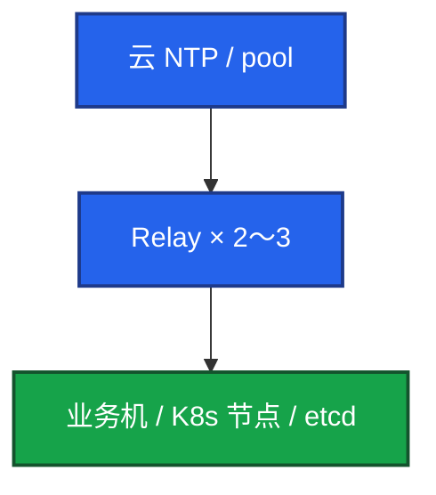
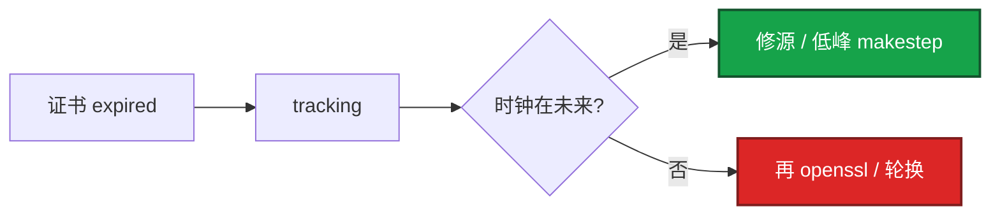

# 19｜NTP 与时间同步 · 练习题

先对照 [知识点](知识点.md) **§2 总图 + §5 slew/step + §6 tracking** 口述，再对答案。

| 标记 | 含义 |
|------|------|
| **核心** | 不懂整章就没建立起来 |
| **必会** | 值班和面试都要能讲 |
| **常用** | 线上会反复碰到 |
| **常考** | 白板和追问的高频口径 |

## 本题目录

- [Q1 生产怎么同步](#q1)
- [Q2 不同步炸什么](#q2)
- [Q3 Chrony vs ntpd / ntpdate](#q3)
- [Q4 slew vs step / makestep](#q4)
- [Q5 TLS / 证书先看什么](#q5)
- [Q6 日志：偏差 vs 时区](#q6)
- [Q7 etcd / Kerberos](#q7)
- [Q8 游戏合服门禁](#q8)
- [Q9 容器要不要 chronyd](#q9)
- [Q10 tracking / Stratum 16](#q10)
- [Q11 闰秒 Leap](#q11)
- [Q12 Relay 升级与换源](#q12)
- [合上书](#合上书)

---

## Q1

**★★★★★｜生产怎么保证时间同步？**

**覆盖**：核心 · 必会 · 常考

**对应**：知识点 §2 · §9

### 场景

「机器时间谁在管？」有人说 crontab 里 `ntpdate` 每小时跑一次。

### 完整解答

**一句话**：业务机只指内网 Relay，统一 Chrony 自启；不要用 ntpdate，偏差 >0.5s 告警。

统一 **Chrony**，开机自启。大规模不要每台直连公网：



关键配置：`iburst`；`makestep 1.0 3` 开机允许大偏差跳齐；`rtcsync` 写回硬件钟。监控 node_exporter，**偏差 >0.5s 告警**。

不要用 ntpdate：一次性猛调、已过时、和 chronyd 抢时钟。

### 再追问

验收只看 `systemctl is-active chronyd` 够吗？——不够。必须 tracking **Stratum ≤4**、至少一个 `^*`、System time 更好 **<0.05s**。

---

## Q2

**★★★★★｜时间不同步会出什么事？举三个以上**

**覆盖**：核心 · 必会 · 常考

**对应**：知识点 §7

### 场景

证书突然大面积失败。有人先重签。后来发现节点快了 20 分钟。

### 完整解答

**一句话**：时钟偏了会炸 TLS、日志对齐、PITR、游戏结算——先对表，再重签证书。

至少举这些：

1. **K8s / TLS**：偏差到证书有效期窗外 → `notYetValid` / `expired` → API 拒连（**分钟级**就可能炸）。
2. **多机日志**：时间线对不齐（**<1s** 开始难受）；整 8 小时差多半是 TZ。
3. **MySQL PITR**：binlog 时间戳乱，按时间恢复恢复错。
4. **游戏排行榜 / 活动**：结算时间戳不一致，客诉回档。
5. **Kerberos**：默认约 **5 分钟**窗口。
6. **etcd / lease**：选主抖、租约错。

发现：监控对比 NTP；巡检 `chronyc tracking`。先对表，再重签证书。

### 再追问

偏差多少会出事？——TLS 可能分钟级就炸；游戏结算 1s 就可能客诉；告警不要等到 1s，**0.5s** 就叫人。金融常盯 **<50ms**；游戏结算/合服盯 **<500ms**。

---

## Q3

**★★★★★｜Chrony 和 ntpd、ntpdate 差在哪？**

**覆盖**：核心 · 必会 · 常考

**对应**：知识点 §4

### 场景

旧机房还在跑 ntpd，新镜像换成 Chrony。有人 crontab 留着 `ntpdate`「双保险」。

### 完整解答

**一句话**：新环境默认 Chrony；禁止 ntpdate 与 ntpd+chronyd 双开；Chrony 秒级对齐、可受控 step。

| | Chrony | ntpd | ntpdate |
|--|--------|------|---------|
| 初始 | **秒级** | 可能很慢 | 立刻跳一刀 |
| 闪断恢复 | 快 | 慢 | — |
| 大偏差 | makestep 可受控 step | 常慢 slew | 永远 step |
| 与 chronyd | — | **禁并存** | **禁并存** |

不是 NTP 协议换了，是滤波和是否允许受控 step。发现双开：停 ntpd、删 crontab ntpdate，只留 chronyd，确认 `^*`。

### 再追问

Chrony 为什么更快？——滤波算法不同，允许受控 step；ntpd 更保守地拧频率。

---

## Q4

**★★★★★｜slew 和 step 怎么分？makestep 1.0 3 什么意思？**

**覆盖**：核心 · 必会 · 常考

**对应**：知识点 §5 ← **最易混**

### 场景

有人怕「跳钟」把游戏结算打乱，想删掉 makestep；另有人高峰直接 `chronyc -a makestep`。

### 完整解答

**一句话**：平时 slew；`makestep 1.0 3` 是开机前 3 次偏差 >1s 可 step；运行中不手打跳钟。

- **slew**：拧频率连续追，业务几乎无感。
- **step**：直接改墙钟，时间线空洞/重叠 → 结算、lease、证书怕。

`makestep 1.0 3`：**前 3 次**同步若偏差 **>1 秒**就 step，之后 slew。更严 `makestep 0.1 2`。`rtcsync` 写回硬件钟，防重启回偏。

应急 `chronyc -a makestep` 要**低峰 + 广播窗口**。手改 `date -s` 禁止。

### 再追问

删掉 makestep 更好吗？——开机大偏差可能长时间追不齐。保留开机策略，管住运行中手打。

---

## Q5

**★★★★★｜证书报 expired，openssl 看还有 60 天，你怎么查？**

**覆盖**：核心 · 必会 · 常考

**对应**：知识点 §7.1 · §6 · §10

### 场景

一批节点 kubelet 报证书过期。有人要立刻重签轮换。

### 完整解答

**一句话**：先 `chronyc tracking` 看 System time 是否在未来，再 openssl，**最后**才重签。

```bash
chronyc tracking | grep -E 'Stratum|System time'
date -u
openssl x509 -in ... -noout -dates
```

若 System time 显示 fast of NTP 几十秒～几分钟：时钟把校验窗口打歪。对表后往往立刻好。已经按错误时间发出的票据另说。



### 再追问

慢了会怎样？——可能 `notYetValid`。同样先对表。

---

## Q6

**★★★★☆｜日志对不齐：怎么区分 NTP 偏差和时区？**

**覆盖**：必会 · 常用 · 常考

**对应**：知识点 §7.2 · §6.5 · §3.2

### 场景

① 多机同一请求日志差 800ms～2s；② 某 Pod 日志比节点 `date` 整快 8 小时。有人两次都要换 NTP 源。

### 完整解答

**一句话**：差整 8 小时先看 TZ；差数百 ms～数秒先对比多机 tracking。

| 现象 | 更像 | 先做 |
|------|------|------|
| 整 **8 小时** | 时区（UTC vs CST） | `timedatectl`；容器 `TZ` / localtime |
| 数百 ms～数秒、各机不同 | NTP 偏移 | 各机 `chronyc tracking` |
| tracking 很好仍整点差 8h | 一定是 TZ | **别换 NTP 源** |

服务器与采集优先 **UTC**；展示再转。节点之间不同步会让日志关联和证书一起坏。

### 再追问

容器差 8 小时要在 sidecar 跑 chronyd 吗？——不要。共享内核时钟；设 TZ 即可。

---

## Q7

**★★★★★｜时钟怎么打崩 etcd、Kerberos？先看什么？**

**覆盖**：核心 · 必会 · 常考

**对应**：知识点 §7.3 · §7.4 · §10

### 场景

两张工单：① 堡垒机 Kerberos 集体失败；② etcd `has_leader==0`，有人要重启逻辑服。

### 完整解答

**一句话**：集体异常先 `chronyc tracking` 对表；etcd 还要并列查盘和 peer 证书，不要只重启战斗服。

| # | 机制 | 先做什么 |
|---|------|----------|
| Kerberos | 默认约 **5 分钟**窗口 | 域控和业务机同一套内网 NTP |
| etcd | 墙钟偏移让超时/lease 失真 | 节点 NTP + 盘 + peer 证书（04-02） |

一批节点同时挂、证书同一套 CA，更像 NTP。控制面不要跨 region 靠拧 election-timeout 硬扛。

### 再追问

对表之后 API 立刻好吗？——时钟拉回来往往立刻好。lease/票据已按错误时间发出的要另处理。

---

## Q8

**★★★★☆｜游戏服合服差 3 秒怎么办？**

**覆盖**：必会 · 常用 · 常考

**对应**：知识点 §2.3 · §9.5 · §7.5

### 场景

合服当晚排行榜和邮件时间全乱。两边 `date` 差 3 秒。有人要先合再补。

### 完整解答

**一句话**：合服门禁偏差 >1s 停；存 UTC；不要先合再补。

四件敏感事：排行榜结算、活动开关、合服按时间合并、反作弊时间戳。

流水线**前置校时**：两边扫 tracking，差 **>1s 停**。告警线 **0.5s**，结算盯 **<500ms**。回档比校时贵一个数量级。

出海：进程和库用 **UTC**，活动写成绝对时间，不要依赖各机 localtime。

### 再追问

告警 0.5s 和门禁 1s 什么关系？——0.5s 叫人；1s 停合。两档别混。

---

## Q9

**★★★★☆｜Pod 时间和宿主机一样吗？容器里要装 Chrony 吗？**

**覆盖**：必会 · 常用

**对应**：知识点 §9.4

### 场景

游戏 Pod 日志比节点 `date` 快 8 小时。有人要在 sidecar 里跑 chronyd。

### 完整解答

**一句话**：容器共享宿主机内核时钟，不要在 Pod 里跑 chronyd；差 8 小时通常是时区不是时钟。

节点 Chrony 好了，Pod 的 UTC 就对。差 8 小时：挂 `/etc/localtime` 或 `TZ=Asia/Shanghai`。

K8s：NTP 做在节点，不是每个 Pod。节点之间不同步 → 证书、etcd、日志关联一起坏。

### 再追问

用 UTC 还是本地时区？——服务器和日志 UTC；展示层转本地。

---

## Q10

**★★★★☆｜tracking 里 Stratum 16、偏差 2s，你怎么查？**

**覆盖**：必会 · 常用 · 常考

**对应**：知识点 §6 · §10

### 场景

告警：某逻辑服偏移 2 秒。`chronyc tracking` 显示 Stratum 16。

### 完整解答

**一句话**：Stratum 16 = 没同步源；先查 chronyd 和 sources，不要手打 `date`。

```text
1. systemctl status chronyd
2. chronyc sources -v     全 ^? → UDP 123 / 安全组 / Relay
3. 源通但差 → 换源、查延迟、Relay 自己是否同步
4. Frequency >100 ppm → 硬件钟，hwclock -r，勿当 Relay
5. /var/log/chrony 是否反复失败
```

云上 sources 全失败：安全组 / NACL 没放 **UDP 123**。AWS 用 **169.254.169.123**。

### 再追问

有 `^*` 但 System time 仍 2s？——源通本机漂或刚恢复；低峰评估 makestep；同时看 Frequency。

---

## Q11

**★★★★☆｜Leap status 非 Normal 是什么？和硬件漂移怎么分？**

**覆盖**：必会 · 常考

**对应**：知识点 §8

### 场景

tracking 里 Leap status 不是 Normal。有人说主板坏了要换机；另有人 Frequency 200ppm 却说「可能是闰秒」。

### 完整解答

**一句话**：Leap 是 UTC 闰秒公告；Frequency >100ppm 才是硬件漂——两回事。

| | 闰秒 Leap | 硬件漂移 |
|--|-----------|----------|
| 看什么 | Leap status | Frequency ppm |
| 范围 | 全球/上游约定 | **单机** |
| 处置 | 跟公告；避开结算边界 | 换电池/实例；**勿当 Relay** |

应用：间隔用单调钟，时间点用墙钟。不要把 Leap 非 Normal 当成加大 makestep 的理由。

### 再追问

Not synchronized 算闰秒吗？——不算。那是没同步（常伴 Stratum 16），先修源。

---

## Q12

**★★★☆☆｜Relay 升级、换源、巡检怎么做？**

**覆盖**：必会 · 常用

**对应**：知识点 §9.3 · §9.6 · §10

### 场景

要升 chrony 包；有人两台 Relay 一起停。另一次源反复 step。合服前要扫两套环境。

### 完整解答

**一句话**：Relay 滚动升级不要两台同时停；源毒换 Relay；巡检看 Stratum/`^*`/偏差，不要只看 date。

- 升级：先升一台 Relay，业务指剩余。ntpd→Chrony：停 ntpd 和 ntpdate，再启 chronyd，确认 `^*`。
- 源毒：换 Relay / 云 NTP，不要业务机加大 makestep 掩盖。
- 巡检：chronyd 能问到、Stratum ≤10（更好 ≤4）、System time **<0.5s**、至少一个 `^*`、hwclock 差 **<1s**。规模用 Prometheus。
- `local stratum 10`：源全死临时兜底；滥用传错钟。

### 再追问

合格线更好是多少？——偏差 **<0.05s** 更好；告警仍是 **0.5s**；合服门禁 **1s**。

---

## 合上书

- [ ] 能默画 §2.0：钟源 → Relay → 客户机 → 打崩面 → tracking 分支
- [ ] 能说出业务机指谁；Stratum 16；容器不要 chronyd
- [ ] 能对比 Chrony vs ntpd/ntpdate；一例钉死 slew vs step / makestep 1.0 3
- [ ] 证书 expired：先 tracking 再 openssl；日志差 8h 先 TZ
- [ ] Kerberos 5 分钟 / etcd 选主抖：先对表；并列查盘与证书
- [ ] 合服 >1s 停合；告警 0.5s；结算盯 <500ms
- [ ] Leap ≠ Frequency 漂移；sources 全 `^?` 先查 UDP 123
- [ ] Relay 滚动升级；硬件漂了勿当 Relay
