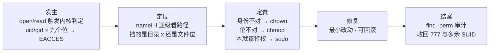
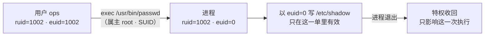
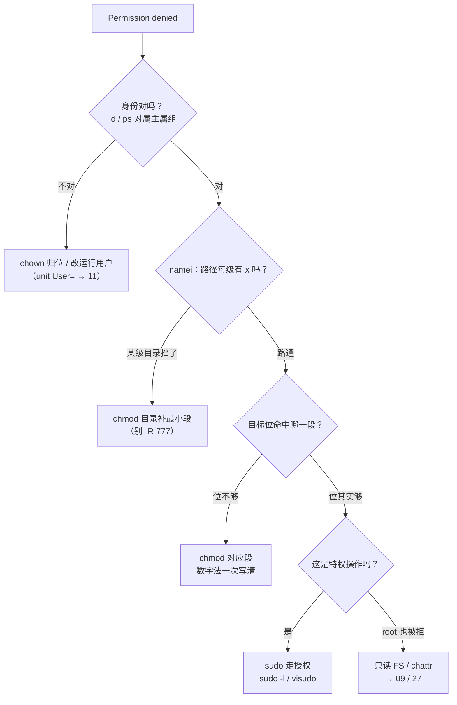
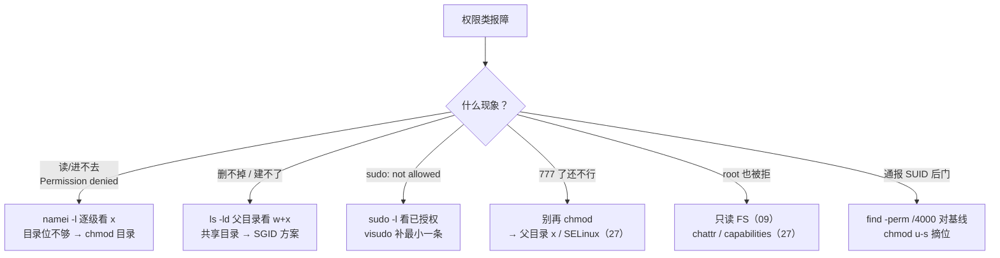

# 用户权限与特殊位

> 存档服凌晨告警写失败，日志里一行 `Permission denied`；有人当场 `chmod -R 777 /data` 把报错压了下去——一周后安全组通报：那个 777 的共享目录里躺着别人放的 SUID 后门，一台机器 root 失守。两场事故是同一课：九个权限位、三个特殊位、一份 sudoers，你只认识了第一个数字。
> **本章回答**：一次 Permission denied 从内核判定的那一微秒，到路径哪一级挡了你、该改哪个位、谁有权代办、怎么结案审计的一生。
> **不讲**：权限位存放在 inode 哪一格 → [09](../09-文件系统与inode/)；进程身份的 fork 继承与切换系统调用 → [05](../05-进程与信号/)；SELinux/AppArmor、fail2ban 与加固全景 → [27](../27-Linux安全加固/)。

**标记**：🎯重点 · 🔥难点 · ⭐常考 · 🔧实操

---

## 一、一张图：一次 Permission denied 的一生

> 🎯 **一句话**：权限拒绝不是一句报错，是一条链：内核判定 → 定位到具体哪一位 → 定责 → 修复 → 结案审计。



**读图**：主线是值班处理一次 Permission denied 的完整时间线。前两段靠命令看清，中间「定责」是三选一，最后一段结案是多数人跳过的——`chmod -R 777` 压报错就是跳过定责直接乱修。后面每节对应图上一个方块：二、三讲「发生」的原料（身份与九个位），四～六讲「位」怎么改，七讲「代办」，八讲「定位与结案」。

---

## 二、出身：UID、GID 与三本账

> 🎯 **一句话**：内核只认数字 UID/GID，不认用户名；名字到数字的翻译靠 passwd/group 两本账。

- **UID（User ID，用户 ID）** = 内核标识一个用户的整数；**GID（Group ID，组 ID）** 同理。权限判定时内核拿的是进程身份证上的数字，用户名只是给人看的备注。
- **/etc/passwd** 每行一个用户，七个冒号分隔字段，密码的真身在 /etc/shadow（root 才能读）：

```text
game:x:1002:1002:Game Server:/opt/game:/sbin/nologin
 ↑1  ↑2 ↑3   ↑4     ↑5          ↑6         ↑7
 1 用户名   2 密码占位（x = 真密码在 /etc/shadow）
 3 UID      4 主组 GID
 5 GECOS 备注  6 家目录  7 登录 shell
```

- **/etc/group** 记附加组：`wheel:x:10:ops,moonton` 一行 = ops 和 moonton 额外属于 wheel 组。
- **/etc/shadow** 第三本账：一行一个用户的密码哈希与老化策略（`ops:$6$…:19000:0:99999:7::`），权限 600、只有 root 可读——普通用户改密码凭什么写它，六节的 SUID 揭晓。
- **主组 vs 附加组**：进程的身份 = 一个 uid + 一串 gid 列表（主组在前）。判定属组段权限时，**任何一个** gid 命中属组就算过——「我明明在 game 组怎么还是 denied」先 `id` 看列表里到底有没有；服务进程还要看它是不是**重启过**才吃到新组员身份。

⭐ **UID 0 就是 root**——内核判定「是不是 root」看的是数字 0，不是名字。给一个普通用户把 UID 改成 0，它就是第二个 root；反过来建一个叫 root2 的普通账号毫无特权。值班看到陌生进程以 uid 0 跑，第一刀 `grep :0: /etc/passwd` 数一数有几个 uid 0 的账号（正常只有一个）。

> 🔍 **现场**：谈权限之前先弄清「你是谁、进程是谁」，两个身份一次看全。

```bash
id
# uid=1002(ops) gid=1002(ops) groups=1002(ops),10(wheel)
# ← 主组 ops，附加组 wheel：判定属组段时两个 gid 都算数
ps -o user,uid,gid,cmd -p 12847
# game 1002 1002 /opt/game/bin/server   # ← 进程真正的身份证，服务以谁在跑
getent passwd game-serv
# game-serv:x:998:998::/opt/game:/sbin/nologin   # ← 服务账号的 shell 是 nologin
```

> ⚠️ **别混**：`/sbin/nologin` 不是「禁用账号」——它只是不许交互登录，账号照样能跑服务、持有文件、被 su 过去（会弹 This account is currently not available）。真要禁用是锁 shadow 或设过期；「不能登录」和「不能用」是两回事。

> 📝 **面试**：/etc/passwd 七字段按顺序背「用户名:密码占位:UID:GID:备注:家目录:shell」；追问 UID 0 特殊在哪——内核按数字短路判定 root，与名字无关；再追问附加组怎么生效——进程身份是一串 gid 列表，任何命中都算。

---

## 三、长相：三组九位怎么读

> 🎯 **一句话**：`-rwxr-xr--` 拆成「1 个类型位 + 3×3 组」：属主、属组、其他人各占 rwx 三位——但同一位在文件上和目录上是两种语言。

```text
-  rwx  r-x  r--
↑   ↑    ↑    ↑
类型 属主 属组 其他人
 d=目录  l=软链  -=普通文件  b/c=块/字符设备
```

判定规则一句话：**从左到右取第一个命中的段**。进程 uid 等于属主 → 只看属主段；不等但在属组里 → 只看属组段；都不沾 → 其他段。属主段是 `---` 就是不行，**不会掉下去借属组的位**——这是「ls 看着有权限却拒绝」的第一种来源。

⭐ 用一个文件把三段各试一遍，比背规则记得牢：

```bash
ls -l /data/game/env.sh
# -rwxr-x--- 1 game game 512 ... /data/game/env.sh
sudo -u ops cat /data/game/env.sh        # ← ops 在 game 组 → 判属组段 r-x：读得了
sudo -u ops tee -a /data/game/env.sh     # ← 属组段没有 w：追加被拒（属主的 rwx 借不到）
sudo -u www-data cat /data/game/env.sh   # ← www-data 落其他段 ---：直接拒
```

🔥 真正的难点是**目录的 rwx 是另一种语言**：

| 位 | 对文件 | 对目录 |
|----|--------|--------|
| r | 读内容 | 能 `ls` 出文件名 |
| w | 改内容 | 能增删/改名目录项 |
| x | 执行 | 能**穿过**这个目录（进入、stat、读里面的文件）|

> 💡 **打个比方**：目录的 x 是**走廊通行权**。文件 777 是「房间门大敞」，可整栋楼的大门（父目录）没给你 x，你连楼都进不去——站在门口喊「我可是 777」没用。反过来，只有 r 没有 x 的目录像隔着玻璃看名单：知道有哪些房间，一间也进不去。

由这张表推出三个值班高频结论：

- **删文件看父目录的 w+x，不看文件自身权限** ⭐——`rm` 改的是父目录这张名单，不是文件本身。所以你能删掉别人 777 的文件，也可能删不动自己 777 的文件（若父目录不给你 w）。
- **进不去某文件，先查路径上每一级目录的 x**，不是只盯目标文件——`/data/game/server.log` 要过 `/`、`/data`、`/data/game` 三道门，任何一道对你是 `---` 或缺 x，都到不了最后那个文件。
- **目录的 r 和 x 常要成对给**：只给 r 的目录 `ls` 能看到名字但 stat 不到大小权限（输出一排问号），看到了却摸不着。

> 🔍 **现场**：`namei -l` 一次把整条路径每一级的权限摆出来，是 Permission denied 的第一刀。

```bash
namei -l /data/game/server.log
```

```text
f: /data/game/server.log
dr-xr-xr-x root root  /
drwxr-x--- root game  /data
# ← 其他人段没有 x：非 game 组的人在这一级就过不去
drwxrwxr-x game game  /data/game
-rw-r----- game game  server.log    # ← 文件本身反而是最后才判的
```

**读图**：`ls -l` 只能看终点，`namei -l` 把整条路的每一道门排成一列——排查时从上往下扫「哪一级的身份或 x 位不满足」，比对着目标文件的九宫格猜快得多。目录永远用 `ls -ld`，不带 `d` 看到的是目录**里面**内容的权限。

> ⚠️ **别混**：目录 w ≠ 「能改文件内容」——w 只管名单（删、建、改名）；改内容要文件自身的 w。「我能删别人的文件」和「我能改别人的文件」是两个完全不同的判定：前者看父目录 w+x，后者看文件 w，别只记一半。

> 📝 **面试**：目录 r/w/x 的三种含义先背熟；追问「为什么我能删同事 777 的文件」——rm 改的是父目录的目录项，判定发生在父目录的 w+x，与文件自身位无关；再追问「文件 777 为什么还是 denied」——反问路径上每一级目录的 x。

---

## 四、易容：chmod 与 chown

> 🎯 **一句话**：chmod 改「谁能怎么用」，chown 改「这是谁的」——两条命令两个维度，权限事故里混着用是常态。

**数字法**：r=4、w=2、x=1，每段三位相加：

```text
rwxr-xr--  →  7  5  4
7 = 4+2+1 (rwx)   5 = 4+0+1 (r-x)   4 = 0+4+0 (r--)
chmod 754 file → 属主 rwx · 属组 r-x · 其他 r--
```

**符号法**：`u/g/o/a`（属主/组/其他/全部）`+ - =`（加/减/设为）`r/w/x`，做增量改动、不动别的位：

```bash
chmod g+w share.log         # ← 只给属组加写，属主/其他原样
chmod o-rwx secret.key      # ← 收掉其他人的所有位
```

🔧 递归授权的正规写法是大写 **X**：

```bash
chmod -R u=rwX,g=rX,o= /data/game
# ← X（大写）：只给目录和本来就可执行的文件加 x，普通文件只拿 rw
#   写成小写 x 会把 .conf/.log 全部变成可执行——发版脚本里的事故常客
```

chown 改属主（可同时改组），chgrp 只改组：

```bash
chown game:game /data/game      # ← 属主:属组 一次改齐（只有 root 能执行）
chgrp game /data/game           # ← root，或属主本人且属于目标组
```

> 🔍 **现场**：改完必验——用 `stat -c '%a'` 看纯数字，比肉眼拼九宫格稳。

```bash
chmod 754 /data/game/env.sh && stat -c '%a %n' /data/game/env.sh
# 754 /data/game/env.sh          # ← 落地的就是 754，一眼对账
```

🔥 **为什么 `chmod -R 777` 是事故而不是修复**：777 = 所有人可写目录项 = 服务器上**任何**账号——包括被打穿的低权限 www-data——都能往里放文件、换文件；一旦放进一个 SUID 程序就是现成的 root 后门（六节）。它的正确身份是「本地测试机上五分钟的临时动作」，进不了生产操作手册。`chown -R` 给自己「图方便」同理：跳过定责的乱修。

> ⚠️ **别混**：chmod vs chown——一个改「能怎么用」、一个改「是谁的」。报 Permission denied 就 chown 给自己，和 777 压报错是同一种病：没定位到挡路的是哪一级、哪一段，就动了整棵树。

> 📝 **面试**：r=4 w=2 x=1 的来历是**二进制位掩码**（r=100、w=010、x=001），所以 754 = rwxr-xr--；再答 755/644/700/600 四个常见组合的场景：755 目录与程序、644 配置与日志、700 私有目录、600 私钥与 shadow。

---

## 五、出厂设置：umask 怎么定新文件权限

> 🎯 **一句话**：新文件的权限 = 模板**减去** umask 摘掉的位——umask 是「出厂裁剪模具」，不是「默认权限」本身。

进程每次 create 新文件时，内核拿模板 **0666**（目录 **0777**）做坯子，再把 umask 里立着的位**摘掉**：

```text
文件：0666 & ~umask        目录：0777 & ~umask

umask 0022 →  文件 0644 (rw-r--r--)   目录 0755 (rwxr-xr-x)
umask 0002 →  文件 0664 (rw-rw-r--)   目录 0775 (rwxrwxr-x)
```

> 💡 **打个比方**：umask 是出厂的**裁剪模具**——文件从 666 的整坯上切掉模具挡住的位。模具只做减法：所以**文件永远不可能因为 umask 天生带 x 位**；目录的坯子是 777，x 位天生就有，才轮得到 umask 摘它。

⭐ 三个要点，每个都对应一种值班现象：

- root 与多数发行版默认 **0022**；启用用户私有组（UPG，user private group）的环境常见 **0002**（同组可写）。「我建的文件同事改不了」先各查 `umask`。
- umask 是**进程属性**：shell 里 `umask 022` 只影响当前 shell 之后建的文件；systemd 服务看 unit 里的 `UMask=`（→ [11](../11-Systemd与服务管理/)），cron 也有独立环境。「手动 touch 是 644、服务跑出来是 600」九成是两边 umask 不同，不是玄学。
- umask **只管新建**，对已有文件零效果；想改存量要 chmod，两件事别混着治。

> 🔍 **现场**：两个数一起看——当前 umask 与实测落地的权限，对上账才算懂。

```bash
umask
# 0022
touch /tmp/probe.$$ && stat -c '%a %n' /tmp/probe.$$ && rm /tmp/probe.$$
# 644 /tmp/probe.31211        # ← 0666 & ~0022 = 0644，和 umask 对上
```

服务进程的模具单独看——「手动 touch 是 644、服务建出来是 600」的完整对账姿势：

```bash
grep -i '^UMask' /etc/systemd/system/ci-runner.service
# UMask=0077                      # ← 服务的模具：新建文件全是 600
systemctl show -p UMask ci-runner
# UMask=0077                      # ← 没写也有默认值，-p 一查便知（unit 细节 → 11）
```

> 📝 **面试**：「umask 022 时新文件、新目录权限是多少」——答 644 / 755，并主动写出 `0666 & ~0022` 这行算式，比背结论高一档；追问「为什么新文件天生不可执行」——umask 是掩码不是赋值，且模板 0666 本就不含 x；追问「目录为什么有 x」——目录模板是 0777。

---

## 六、特权：SUID、SGID 与 Sticky

> 🎯 **一句话**：九个位之外还有第四组特殊位——SUID/SGID/Sticky，数字 4/2/1 写在权限最前面，各自解决「普通用户干一件本需要特权的事」。

先认签名——`ls -l` 里某段的 x 位置变成 s 或 t：

```bash
ls -l /usr/bin/passwd; ls -ld /tmp
# -rwsr-xr-x. 1 root root  28K ... /usr/bin/passwd   # ← 属主段 x 位是 s：SUID
# drwxrwxrwt. 9 root root 4.0K ... /tmp              # ← 其他段 x 位是 t：Sticky
```

| 特殊位 | 数字 | 放在可执行文件上 | 放在目录上 |
|--------|------|------------------|-----------|
| **SUID**（Set User ID） | 4 | 执行瞬间 euid=文件属主（passwd）| 无实义（Linux）|
| **SGID**（Set Group ID） | 2 | 执行瞬间 egid=文件属组 | 新建文件**继承目录的组**（共享目录）|
| **Sticky**（粘滞位） | 1 | 无实义（历史用途）| 只有属主/root 能删（/tmp）|

### SUID：passwd 凭什么写 shadow ⭐🔥

普通用户改自己的密码要写 `/etc/shadow`（root 才可写）——`passwd` 带着 4755，任何用户执行它时**有效身份**临时变成 root，改完这一单就收回：



**读图**：SUID 改的是**有效身份（euid，effective UID）**，不是真实身份（ruid，real UID）——进程还是你启动的、日志还是记你的账，只是过内核权限检查那一下按属主的身份证刷。正常进程两个值相等，SUID 让它们分家；「进程到底以谁的身份在跑」用 `ps -o uid,euid` 一眼看穿。

> 💡 **打个比方**：SUID 是**临时工牌**——刷开这扇特定的门时，系统发你一张属主的工牌，出门（进程退出）就收回。工牌不能转借，也不能拿去开别的门：只对这一个程序、这一次执行有效。

### SGID：共享目录的正解 🔥

组协作的经典痛点：`deploy` 组多人往共享目录发版，普通做法下每个人建的新文件属组是**自己的主组**，别人写不了，只好天天手工 chmod。SGID 目录让**里面新建的一切自动继承目录的属组**：

```bash
mkdir /data/release && chgrp deploy /data/release && chmod 2775 /data/release
# ← 2 = SGID：之后谁在里面建文件，属组都是 deploy
touch /data/release/v1.2.5.tar && ls -l /data/release/
# -rw-rw-r--. 1 ops deploy 0 v1.2.5.tar
#                    ↑ 建文件的是 ops（主组 ops），落盘属组却是 deploy
```

配合属组段的 w（2775 里的 g=rwx）和合适的 umask，组员互相可写——「共享目录」的标准三件套：**SGID + 属组可写 + 合适 umask**。

### Sticky：/tmp 的 1777

`/tmp` 要人人可写（777），但没有 sticky 的话人人可**删**——A 放的临时文件 B 顺手就清了。1777 之后**只有文件属主和 root 能删**，w 位只保留「建」的权利。协作目录要「人人能交作业、没人能撕别人作业」，就是它。

```bash
ls -ld /tmp
# drwxrwxrwt. 9 root root 4.0K ... /tmp     # ← 其他段 x 位是 t：Sticky 签名
# 实测：a 用户 touch /tmp/a.tmp，b 用户 rm /tmp/a.tmp
# rm: cannot remove '/tmp/a.tmp': Operation not permitted   ← w 在、t 拦住了
```

数字写法一句：特殊位顶在最前面——`4755` = SUID+755，`2775` = SGID+775，`1777` = Sticky+777；符号法对应 `u+s` / `g+s` / `o+t`。

> ⚠️ **别混**（特殊位一组说清，全章只说这一次）：**小写 s/t = 该段同时有 x；大写 S/T = 位设了但 x 没设，白设**（`-rwSr-xr-x` 的 SUID 不生效，属主根本没执行权）。SUID 只认**二进制可执行文件**，放目录无意义、放脚本基本被现代系统忽略。**SGID 文件与 SGID 目录是两件事**：前者改执行进程的组身份，后者改新建文件的属组。Sticky 只在目录上有意义。

安全视角一句：**SUID 程序就是分布在全盘的提权入口**——每一个都是被打穿的低权限账号眼里的跳板。基线要收紧：无关 SUID 摘位（`chmod u-s`）、数据盘挂载加 `nosuid`、审计手法见八节；加固全景 → [27](../27-Linux安全加固/)。

> 📝 **面试**：`ls -l /usr/bin/passwd` 为什么是 rws——SUID 让普通用户以 root 有效身份改 shadow；追问「自己写的程序加 SUID 行不行」——技术上行、工程上危险，SUID 程序里起 shell 等于发后门，且脚本 SUID 基本被忽略；再追问 `/tmp` 为什么是 1777——人人能写、只有属主能删。

---

## 七、代办：sudo 与 sudoers

> 🎯 **一句话**：sudo 不是「别人的 root 密码」，是一份可审计的代办登记簿——谁、在哪台机、能以谁的身份、干哪几件事，全写在 sudoers 里。

先分清两条路：

| 对比 | **su（switch user）** | **sudo** |
|------|----------------------|----------|
| 要谁的密码 | 目标用户的密码（su root 要 root 密码）| 你自己的密码（root 也可免密）|
| 粒度 | 整个身份、整个会话 | 单条命令、可细到参数 |
| 审计 | 只知道谁变成了谁 | 每条命令带原身份进日志 |
| 生产定位 | 单人排障 `su -` | 一切授权与自动化的正式通道 |

su 把 root 密码发给所有需要特权的人，泄漏面最大；sudo 密码不出本人、权限随人撤、行为有日志——生产默认选它的原因就这三条。`su -` 的 `-` 必须带（login shell）：重置全部环境变量再进去；不带的话带着旧 PATH 和家目录切过去，是排障时「root 下正常、su 下不正常」的经典来源。

```bash
su - root        # ← 带杠：login shell，PATH/家目录全部重置成 root 的
su root          # ← 不带杠：带着你原来的 PATH 切过去——双胞胎现场就在这一杠
```

**sudoers 语法**，一行一个授权，四个字段：

```text
ops  ALL=(root)  /usr/bin/systemctl restart game-server, /usr/bin/journalctl -u game-server
 ↑1   ↑2   ↑3                      ↑4
 1 谁授权（%deploy = 一个组）  2 在哪些主机（按本机名匹配，ALL=不限）
 3 能以谁的身份运行           4 能跑哪些命令（绝对路径，逗号分隔）
```

⭐ 授权要**到命令级**：`ops ALL=(ALL) ALL` 等于发 root，审计上视同给钥匙。发版机的正规写法是只放开必要的一条、免密只给脚本：

```text
deploy ALL=(root) NOPASSWD: /usr/bin/systemctl restart game-server
# ← NOPASSWD 只罩住这一条命令；别的 sudo 仍要密码
```

增量授权放 `/etc/sudoers.d/deploy`（独立文件、`visudo -f` 编辑、权限 440），别都挤进主文件——配置管理也好分发。

```bash
ls -l /etc/sudoers.d/deploy
# -r--r----- 1 root root 440 deploy    # ← 一个授权一个文件 · 440 · visudo -f 编辑
sudo -l -U deploy                      # ← root 可替任何用户查授权：发没发对一目了然
```

> 🔍 **现场**：sudoers 写错一个字符，全机 sudo 瘫痪——所以编辑与验证各有专门命令。

```bash
visudo                        # ← 唯一正确的编辑方式：保存时做语法检查，写坏会拦你
visudo -c                     # ← 只校验不编辑（CI / 配置管理里用）
sudo -l                       # ← 当前用户到底被授权了什么，「not allowed」第一刀
sudo -u game systemctl status game-server   # ← 换个身份跑，验证「是不是身份问题」
```

**两个高频翻车点** 🔥，都在「sudo 提权的是谁」上：

```bash
sudo echo 'blacklist nouveau' > /etc/modprobe.d/blacklist.conf
# -bash: /etc/modprobe.d/blacklist.conf: Permission denied
# ← sudo 只提权了 echo；> 重定向是「你的 shell」在做，它没有 root 身份
echo 'blacklist nouveau' | sudo tee /etc/modprobe.d/blacklist.conf
# ← 正解：让 root 身份的 tee 来写文件

sudo cd /data/game
# sudo: cd: command not found
# ← cd 是 shell 内建命令，不是磁盘上的程序，sudo 无从提权
sudo -i                       # ← 真要「以 root 身份在那个目录里干活」，开一个完整会话
```

> 💡 **打个比方**：sudoers 是**代办登记簿**——登记清楚「谁、哪家分行、替谁、办哪几笔业务」。`ALL=(ALL) ALL` 相当于把金库钥匙登记给一个人；NOPASSWD 是「这笔业务免签字」，只配给脚本要跑的那一两条，不配给人。

sudo 的账全在日志里：`/var/log/secure`（RHEL 系）或 `/var/log/auth.log`（Debian 系）逐条记「谁在何时以谁的身份跑了什么、成没成」——出事故回放看这里。免密缓存默认约 15 分钟（`timestamp_timeout` 可调），同一终端连续 sudo 只问一次密码。

> ⚠️ **别混**：SUID 是**程序自带的钥匙**——谁执行谁临时拿到属主身份，不需要登记；sudo 是**登记过的代办**——先得在 sudoers 里有你的名字。前者靠程序自律，后者靠配置授权，安全等级完全不同：审计时 SUID 是「待清查的入口清单」，sudoers 是「白名单本身」。

> 📝 **面试**：su 与 sudo 答三点——密码归属（目标用户 vs 自己）、粒度（会话 vs 命令级）、审计（没有 vs 有日志）；再补「sudoers 必须用 visudo 编辑，写错会锁死 sudo，visudo 保存前做语法校验」；追问 NOPASSWD 给谁——只给自动化脚本的最小命令集，不给人。

---

## 八、结案：排查链、find 审计与 root 特权

> 🎯 **一句话**：Permission denied 的排查顺序固定四步：先身份（id）、再路径每一级的 x（namei）、再目标文件的位（ls）、最后一问「该不该特权」（sudo）。

### 排查链 🔧

```text
① 你是谁       id / ps -o uid,gid     ← 进程身份对不对（服务是不是换用户跑了）
② 路过哪       namei -l <完整路径>    ← 每一级目录的 x 与属组，挡在半路的最常见
③ 目标是什么   ls -l / ls -ld <终点>  ← 最后才看终点的九个位
④ 该不该特权   sudo -l / visudo       ← 前三步都对还拒绝，问的是授权不是权限
```

🔥 **经典坑**再钉一遍：文件已经 `chmod 777` 仍然 Permission denied——`namei -l` 一照，`/data/game` 是 `drwxr-x--- root:game`，其他人段没有 x，路在倒数第二级就断了，777 的终点压根没被走到。**改目标文件的位治不了父目录的病**。反过来，root 看 `/etc/shadow` 的 `-------` 照样读写，也是同一张判定表——见下。

### root 的两条特权

内核判定表最顶上有一行**短路**：uid 0 直接放行（除个别场景如执行位），九个位对它形同虚设——所以 root 读 `-------` 的 shadow 毫无障碍。现代内核又把 root 特权拆成一组 **capabilities（能力）**：CAP_DAC_OVERRIDE 就是「无视权限位」那一条，CAP_SYS_ADMIN 是挂载、命名空间等大杂烩——容器里「uid 明明是 0 却干不了 root 的事」就是 capabilities 被裁了（→ [10](../10-cgroup与容器/)，逐项深查 → [27](../27-Linux安全加固/)）。本章只需带走一句：**root 也被 Permission denied，别怀疑权限位——去看文件系统是不是只读（EROFS，→ [09](../09-文件系统与inode/)）或 chattr 锁（→ [27](../27-Linux安全加固/)）**。

### find 按权限审计 🔧⭐

> 🔍 **现场**：安全通报「有机器被放了 SUID 后门」——一条命令把全盘所有带特殊位的文件列出来对基线。

```bash
find / -xdev -type f -perm /4000 -ls 2>/dev/null
# 33554994 16 -rwsr-xr-x 1 root root 14328 ... /usr/bin/passwd
# 33555012 16 -rwsr-xr-x 1 root root 14328 ... /usr/bin/su
# ...
# ← -perm /4000 = SUID 位立着的任意文件；-xdev 不跨文件系统，快而稳

find / -xdev -perm /6000 -type f 2>/dev/null    # ← SUID 或 SGID 任一命中（6000=4+2）
find / -xdev -type d -perm -0002 2>/dev/null    # ← world-writable 目录（其他 w 位在）
find / -xdev -type d -perm -2000 2>/dev/null    # ← SGID 目录清单：共享目录盘点
find / -xdev -type d -perm -1000 2>/dev/null    # ← Sticky 目录清单：/tmp 之外还多不多
```

基线不是现查的，是平时攒的——每月或每次大变更后落一份快照，通报时 diff 两份快照，新增项一眼可见：

```bash
find / -xdev -perm /6000 -type f -ls 2>/dev/null > /var/log/suid-baseline-$(date +%F).txt
diff /var/log/suid-baseline-2026-08-01.txt /var/log/suid-baseline-2026-09-01.txt
# > 50331657 32 -rwsr-xr-x 1 root root 34568 ... /tmp/.cache/upd   ← 多出来的就是嫌疑
```

🔥 `-perm` 三种写法一句区分：`/mode` **任意一位**命中即匹配、`-mode` **全部位**都包含才匹配、裸 `mode` **精确等于**才匹配——审计用 `/`，查「含危险位」用 `-`；写成裸 `4000` 只会匹配「恰好 4000、其他位全空」这种几乎不存在的文件，是新手最常犯的空手而归。

### 收束：一次拒绝凭什么结案



**读图**：判定顺序和排查链同构——身份 → 路径 x → 目标位 → 特权，四个问题各对应一条修法，**没有一个箭头指向 `chmod -R 777`**。结案动作两件：把改过的位记进变更单；再跑一遍 `find -perm /4000` 和 `find -perm -0002` 对基线，确认没有顺手制造新入口。

> ⚠️ **别混**：权限位全对 ≠ 业务能跑——SELinux/AppArmor 在权限位**之上**还有一层强制访问控制；「位全对仍 denied、日志里有 AVC 字样」去 [27](../27-Linux安全加固/)。本章管的是 DAC（自主访问控制，Discretionary Access Control）这一层。

> 📝 **面试**：排查口径背四步——「一 id、二 namei、三 ls、四 sudo」，每步能立刻报出工具；追问「为什么 777 了还 denied」直接答父目录 x 位；追问「怎么审计 SUID」答 `find / -perm /4000` 对基线。

---

## 九、作战：60 秒定责

> 🎯 **一句话**：权限类报障按入口现象分型——读不进、删不掉/建不了、sudo 不让、root 也被拒——每类第一刀都不同。



**读图**：六个分支全是值班屏幕上真实出现的字样，不是抽象类别。共同底线：**每个分支的修法都是最小改动**——补一段 x、加一条 sudoers、摘一个 SUID；任何分支走到「-R 777」都算把事故扩大。

| 现象 | 先做 | 别做 |
|------|------|------|
| 服务写日志 Permission denied | `ps` 看进程身份 + `namei -l` 日志路径 | `chmod -R 777` 压报错 |
| 自己的文件删不掉 | `ls -ld` 父目录看 w+x | 对文件本身反复 chmod |
| sudo 报 not in sudoers | `sudo -l` + 找对应 sudoers 行 | 给 ALL=(ALL) ALL 了事 |
| 建的文件别人写不了 | 目录 SGID（2775）+ 核对 umask | 每人手工 chmod 补组位 |
| 新文件权限不符合预期 | `umask` + 实测 touch 一个 | chmod 旧文件当修复 |
| 通报有 SUID 后门 | `find -perm /4000` 对基线 | 只删文件不查植入路径（27）|
| root 也 denied | 只读 FS / chattr 查起 | 怀疑权限位再 chmod |

> 📝 **面试**：「权限类故障怎么排查」——分型 + 四步链（id → namei → ls → sudo）+ 以报障身份重放验证；能主动点出「整条剧本里没有任何一步是 -R 777」，就是值班过的口径。

🔧 **60 秒剧本**（值班第一分钟按顺序敲完再说话）：

```text
① 0–10s   定现象分型：读不进 / 删不掉 / sudo 拒 / root 拒；顺手 ps -o uid,gid 确认进程身份
② 10–30s  namei -l <完整路径>：逐级找挡路的目录，重点看每级 x 与属组
③ 30–45s  对症最小修：目录补 x · chown 归位 · sudoers 加一条 · SGID 建共享目录
④ 45–60s  验证 + 结案：以报障身份重放一次（sudo -u <user> cat {file}）确认通了；
          记变更单 + find -perm /4000 快照对基线，确认没造新入口
```

---

## 十、收口

> 🎯 **一句话**：身份、九个位、umask、三个特殊位、sudoers——一张速查、一组锚点、一堵数字墙带走。

### 命令速查 🔧

```bash
id; ps -o uid,gid,cmd -p {pid}              # 你是谁 / 进程是谁
namei -l /path/to/file                      # 路径逐级权限（denied 第一刀）
ls -l file; ls -ld dir                      # 目标位（目录记得 -d）
chmod 754 file; chmod -R u=rwX,g=rX,o= dir  # 数字法 / 递归 + 大写 X
chown user:group path; chgrp group path     # 归属
umask; stat -c '%a %n' file                 # 出厂模具与实测位
ls -l /usr/bin/passwd; ls -ld /tmp          # SUID / Sticky 签名
chmod 4755 tool; chmod 2775 dir; chmod 1777 dir      # 特殊位数字写法
find / -xdev -type f -perm /4000 -ls 2>/dev/null     # SUID 审计
find / -xdev -type d -perm -0002 2>/dev/null         # world-writable 目录审计
visudo; visudo -c; sudo -l; sudo -u <user> <cmd>     # sudo 家族
grep :0: /etc/passwd                        # 数一数几个 uid 0
tail -f /var/log/secure                     # sudo 审计日志（Debian 系 auth.log）
```

### 面试锚点

| 问 | 30 秒答 |
|----|---------|
| /etc/passwd 七字段？ | 用户名:密码占位:UID:GID:GECOS:家目录:shell；真密码在 shadow；UID 0 即 root |
| 权限判定顺序？ | 属主→属组→其他，取**第一个命中段**；属主段 --- 不会掉下去借属组的位 |
| 目录的 rwx 是什么？ | r=ls 名单、w=增删改目录项、x=穿过目录；删文件看父目录 w+x，不看文件位 |
| 文件 777 还是 denied？ | 查路径每一级目录的 x（namei -l）；父目录没 x，文件位根本没被判定到 |
| rwx 的 4/2/1 哪来的？ | 二进制位掩码 r=100、w=010、x=001；754 = rwxr-xr-- |
| umask 022 新文件权限？ | 文件 0666&~022=644、目录 755；umask 是摘除不是赋予，模板本就无 x |
| passwd 凭什么改 shadow？ | SUID（rws）：执行瞬间 euid=root，用完收回；脚本 SUID 基本被忽略 |
| SGID 目录干什么？ | 新建文件继承目录属组，共享目录 2775；SGID 文件是另一件事（egid）|
| /tmp 为什么 1777？ | Sticky：人人可写，只有属主/root 可删 |
| su 和 sudo 区别？ | su 要目标密码、会话级、无审计；sudo 自己的密码、命令级、有日志 |
| sudoers 怎么授权？ | user host=(runas) cmds；visudo 编辑、sudo -l 自查；NOPASSWD 只给脚本 |
| sudo echo > file 为什么失败？ | sudo 只提权了 echo，重定向是当前 shell 做的；用 sudo tee |
| root 为什么无视权限？ | uid 0 短路判定（CAP_DAC_OVERRIDE）；root 仍 denied 查只读 FS / chattr |
| 怎么审计 SUID？ | find / -perm /4000 对基线；/mode 任一命中、-mode 全包含、裸 mode 精确 |

### 易错一句话对照

- Permission denied = 权限位不对 → 先 id / namei 定位：可能挡在父目录的 x
- 改 777 就能读 → 父目录没 x，文件位根本没被判定到
- 文件 w 位决定能不能删 → 删除看父目录 w+x，与文件自身位无关
- 目录 w = 能改文件内容 → w 只管目录项；改内容看文件自身的 w
- umask 就是默认权限 → 是模板减掉的掩码，且只影响新建文件
- 新文件天生可执行 → 模板 0666 无 x，umask 给不出 x
- SUID 放哪都行 → 只认二进制可执行文件；目录无意义；脚本基本被忽略
- 大写 S 也是 SUID → S/T 表示该段缺 x，位设了不生效
- SGID 文件和目录一回事 → 一个改进程 egid、一个改新文件属组
- sudo 输的是 root 密码 → 是用户自己的密码；su 才要目标用户密码
- sudoers 用 vi 直接改 → 写错一个词锁死全机 sudo，必须 visudo
- sudo echo > file 会被提权 → 重定向由你的 shell 执行，用 sudo tee
- ALL=(ALL) ALL 图省事 → 等于发 root，审计视同给钥匙
- root 不会被拒 → 权限位上不会；只读 FS、chattr、capabilities 照样拒

### 数字墙

> r=4 · w=2 · x=1（二进制位掩码）· 常见组合 **755 / 644 / 700 / 600** · 文件模板 **0666**、目录模板 **0777** · 默认 umask **0022**（UPG 环境 0002）· 特殊位 **SUID=4 · SGID=2 · Sticky=1** · passwd **4755** · 共享目录 **2775** · /tmp **1777** · **UID 0 = root** · sudo 免密缓存默认 **~15 分钟** · 审计口径：`-perm /4000` SUID · `-perm /6000` SUID 或 SGID · `-perm -0002` world-writable

---

## 合上书

- [ ] **默画一节的图**：发生 → 定位 → 定责 → 修复 → 结案；id/namei、ls、sudo -l、find -perm 各照哪一段。
- [ ] **口述出身**：/etc/passwd 七字段、UID 0 特殊在哪、主组与附加组的判定规则、nologin 不等于禁用。
- [ ] **口述长相**：三组九位读法、判定取第一个命中段、目录 rwx 三种含义与「走廊通行权」比方。
- [ ] **口述易容**：数字法与符号法各干什么、大写 X 的用处、`chmod -R 777` 为什么是事故。
- [ ] **口述出厂**：umask 算术（0666 & ~0022）、为什么新文件没有 x、systemd 服务的 UMask。
- [ ] **默画特权**：SUID 执行瞬间 euid 变化图、SGID 目录继承、/tmp 的 Sticky；4/2/1 数字写法与大写 S/T 的含义。
- [ ] **口述代办**：su vs sudo 三点、sudoers 四字段、NOPASSWD 的正确范围、sudo tee 与 sudo cd 两个翻车点。
- [ ] **口述结案**：四步排查链、find -perm 三种写法、root 的两条特权与「root 也被拒」查什么。
- [ ] **默画收束判定链**：身份 → 路径 x → 目标位 → 特权，四问四修法，没有一条指向 777。
- [ ] **定责**：60 秒剧本四步各敲什么；安全通报 SUID 时先跑哪条命令。

下一章：[SSH 与远程访问](../26-SSH与远程访问/)。权限位存在 inode 哪一格：[09](../09-文件系统与inode/) · 进程身份与切换：[05](../05-进程与信号/) · 加固全景与 SELinux：[27](../27-Linux安全加固/)。
