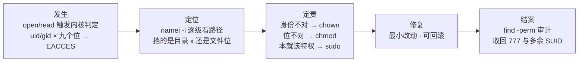
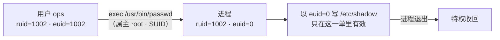
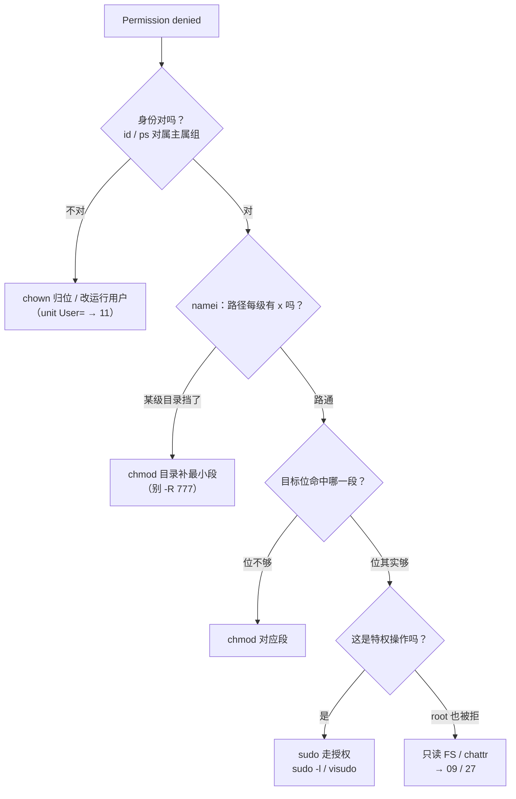
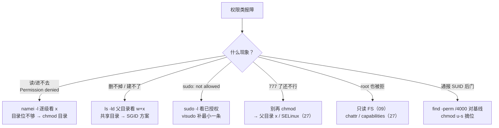

# 用户权限与特殊位

> 存档服凌晨写失败，日志一行 `Permission denied`；有人当场 `chmod -R 777 /data` 压报错——一周后安全组通报：那个 777 共享目录里躺着别人放的 SUID 后门，一台机器 root 失守。两场事故同一课：九个权限位、三个特殊位、一份 sudoers，你只认识了第一个数字。
> **本章回答**：一次 Permission denied 从内核判定那一微秒，到路径哪一级挡了你、该改哪个位、谁有权代办、怎么结案审计。
> **不讲**：权限位在 inode 哪一格 → [09](../09-文件系统与inode/)；进程身份的 fork 继承与切换 → [05](../05-进程与信号/)；SELinux/AppArmor、加固全景 → [27](../27-Linux安全加固/)。

**标记**：🎯重点 · 🔥难点 · ⭐常考 · 🔧实操

---

## 一、一张图：一次 Permission denied 的一生

> 🎯 **一句话**：权限拒绝不是一句报错，是一条链：内核判定 → 定位到具体哪一位 → 定责 → 修复 → 结案审计。



- 📖 **读图**
  - 🛤️ 主线：发生 → 定位 → 定责 → 修复 → 结案；`chmod -R 777` = 跳过定责直接乱修
  - 🔭 前两段靠 `id` / `namei`；中间定责三选一（chown / chmod / sudo）；最后结案多数人跳过（→ Q1、Q10、Q12）

---

## 二、出身：UID、GID 与三本账

> 🎯 **一句话**：内核只认数字 UID/GID，不认用户名；名字到数字靠 passwd/group 两本账。

### 🪪 三本账各记什么 ⭐

- 🔑 **UID / GID** = 内核标识用户/组的整数；权限判定拿进程身份证上的**数字**，用户名只是给人看的备注
- 📒 **/etc/passwd** 每行一个用户，七个冒号字段；密码真身在 `/etc/shadow`（root 才可读）：

```text
game:x:1002:1002:Game Server:/opt/game:/sbin/nologin
 ↑1  ↑2 ↑3   ↑4     ↑5          ↑6         ↑7
 1 用户名   2 密码占位（x = 真密码在 shadow）
 3 UID      4 主组 GID
 5 GECOS 备注  6 家目录  7 登录 shell
```

- 📒 **/etc/group** 记附加组：`wheel:x:10:ops,moonton` = ops、moonton 额外属于 wheel
- 📒 **/etc/shadow** 第三本账：密码哈希与老化；权限 600——普通用户改密码凭什么写它，六节 SUID 揭晓

#### ❓ 为什么内核认数字不认名字？

- ✅ **判定短路看数字**：UID **0** = root；把普通用户 UID 改成 0 = 第二个 root；建个叫 `root2` 的普通账号毫无特权
- 👥 **主组 vs 附加组**：进程身份 = 一个 uid + 一串 gid（主组在前）；判属组段时**任一** gid 命中就算过
- 🔄 「我明明在 game 组还 denied」→ 先 `id` 看列表；服务进程还要看**是否重启过**才吃到新组员身份
- 🔍 值班见陌生 uid 0 进程 → `grep :0: /etc/passwd` 数几个 uid 0（正常只有一个）

> 🔍 **现场**：谈权限之前先弄清「你是谁、进程是谁」。

```bash
id
# uid=1002(ops) gid=1002(ops) groups=1002(ops),10(wheel)
# ← 主组 ops，附加组 wheel：判属组段时两个 gid 都算数
ps -o user,uid,gid,cmd -p 12847
# game 1002 1002 /opt/game/bin/server   # ← 进程真正的身份证
getent passwd game-serv
# game-serv:x:998:998::/opt/game:/sbin/nologin   # ← 服务账号 shell 是 nologin
```

> ⚠️ **别混**：`/sbin/nologin` ≠ 禁用账号——只是不许交互登录，账号照样跑服务、持有文件、被 `su` 过去。真禁用要锁 shadow 或设过期。

> 📝 **面试**：passwd 七字段按序背「用户名:密码占位:UID:GID:备注:家目录:shell」；UID 0 内核按数字短路；附加组 = 一串 gid，任一命中都算。⭐（练习题 Q3）

本节对应练习题 Q3。身份有了——文件 777 为什么还会 Permission denied？

---

## 三、长相：三组九位怎么读

> 🎯 **一句话**：`-rwxr-xr--` = 1 个类型位 + 3×3 组（属主、属组、其他人）——同一位在文件上和目录上是两种语言。

### 👀 九宫格怎么读 ⭐

```text
-  rwx  r-x  r--
↑   ↑    ↑    ↑
类型 属主 属组 其他人
 d=目录  l=软链  -=普通文件  b/c=块/字符设备
```

- 📖 **读图**：从左到右三段；判定规则一句话——**取第一个命中的段**，不会掉下去借下一段

#### ❓ 为什么属主段 `---` 不会借属组的位？

- 📏 **规则**：uid = 属主 → 只看属主段；不等但在属组 → 只看属组段；都不沾 → 其他段
- ❌ 属主段 `---` 就是不行——**不会掉下去借属组**。这是「ls 看着有权限却拒绝」的第一种来源
- 🧪 用一个文件把三段各试一遍：

```bash
ls -l /data/game/env.sh
# -rwxr-x--- 1 game game 512 ... /data/game/env.sh
sudo -u ops cat /data/game/env.sh        # ← ops 在 game 组 → 属组 r-x：读得了
sudo -u ops tee -a /data/game/env.sh     # ← 属组无 w：追加拒（借不到属主 rwx）
sudo -u www-data cat /data/game/env.sh   # ← 落其他段 ---：直接拒
```

### 🚪 目录的 rwx 是另一种语言 🔥⭐

| 位 | 对文件 | 对目录 |
|----|--------|--------|
| r | 读内容 | 能 `ls` 出文件名 |
| w | 改内容 | 能增删/改名目录项 |
| x | 执行 | 能**穿过**这个目录（进入、stat、读里面的文件）|

> 💡 **打个比方**：目录的 x 是**走廊通行权**。文件 777 = 房间门大敞，父目录没给你 x = 连楼都进不去——站在门口喊「我可是 777」没用。只有 r 没有 x = 隔着玻璃看名单：知道有哪些房间，一间也进不去。

#### ❓ 为什么文件 777 还是 Permission denied？

- 🔥 **高频错答**：「权限坏了」。挡你的往往是路径上某一级目录缺 **x**，不是文件本身
- 口诀：**「文件看三位，进门看目录 x」**（练习题 Q1）
- 📌 三个值班结论：
  - **删文件看父目录的 w+x**，不看文件自身位 ⭐——`rm` 改的是父目录这张名单
  - **进不去先查路径每一级 x**——`/data/game/server.log` 要过 `/`、`/data`、`/data/game`，任一道缺 x 都到不了终点
  - **目录 r 和 x 常成对给**：只给 r → `ls` 见名字、stat 一排问号

> 🔍 **现场**：`namei -l` = Permission denied 第一刀。

```bash
namei -l /data/game/server.log
```

```text
f: /data/game/server.log
dr-xr-xr-x root root  /
drwxr-x--- root game  /data
# ← 其他人段没有 x：非 game 组在这一级就过不去
drwxrwxr-x game game  /data/game
-rw-r----- game game  server.log    # ← 文件本身反而是最后才判
```

- 📖 **读图**：`ls -l` 只看终点；`namei -l` 把整条路每一道门排成一列——从上往下扫「哪一级身份或 x 不满足」。目录永远 `ls -ld`，不带 `d` 看到的是目录**里面**内容的权限

> ⚠️ **别混**：目录 w ≠ 「能改文件内容」——w 只管名单（删、建、改名）；改内容要文件自身的 w。能删别人的文件 ≠ 能改别人的文件。

> 📝 **面试**：目录 r/w/x 三种含义先背熟；「为什么能删同事 777 的文件」——rm 判父目录 w+x；「文件 777 为何 denied」——反问路径每一级目录的 x。⭐（练习题 Q1、Q2）

本节对应练习题 Q1、Q2。会读九位了——chmod / chown 怎么用？

---

## 四、易容：chmod 与 chown

> 🎯 **一句话**：chmod 改「谁能怎么用」，chown 改「这是谁的」——两条命令两个维度，混着用是权限事故常态。

### 🔢 数字法与符号法 ⭐

- **数字法**：r=4、w=2、x=1，每段三位相加：

```text
rwxr-xr--  →  7  5  4
7 = 4+2+1 (rwx)   5 = 4+0+1 (r-x)   4 = 0+4+0 (r--)
chmod 754 file → 属主 rwx · 属组 r-x · 其他 r--
```

- **符号法**：`u/g/o/a` + `+/-/=` + `r/w/x`，做增量、不动别的位：

```bash
chmod g+w share.log         # ← 只给属组加写
chmod o-rwx secret.key      # ← 收掉其他人所有位
```

### 🔧 递归授权：大写 X 防坑

```bash
chmod -R u=rwX,g=rX,o= /data/game
# ← X（大写）：只给目录和本来就可执行的文件加 x
#   小写 x 会把 .conf/.log 全部变成可执行——发版脚本事故常客
```

```bash
chown game:game /data/game      # ← 属主:属组一次改齐（只有 root）
chgrp game /data/game           # ← root，或属主本人且属于目标组
```

> 🔍 **现场**：改完必验——`stat -c '%a'` 看纯数字。

```bash
chmod 754 /data/game/env.sh && stat -c '%a %n' /data/game/env.sh
# 754 /data/game/env.sh          # ← 落地就是 754
```

#### ❓ 为什么 `chmod -R 777` 是事故不是修复？

- 🔥 777 = 所有人可写目录项 = **任何**账号（含被打穿的 www-data）都能往里放文件、换文件
- 一旦放进一个 SUID 程序 = 现成 root 后门（六节）
- 正确身份：本地测试机上五分钟的临时动作；进不了生产手册。`chown -R` 给自己「图方便」同病：跳过定责乱修

> ⚠️ **别混**：chmod vs chown——一个改「能怎么用」、一个改「是谁的」。Permission denied 就 chown 给自己 = 和 777 压报错同一种病。

> 📝 **面试**：r=4 w=2 x=1 来自二进制位掩码；754 = rwxr-xr--；常见组合：755 目录与程序、644 配置与日志、700 私有目录、600 私钥与 shadow。（练习题 Q4）

本节对应练习题 Q4。会改位了——服务建出来为什么全是 600？

---

## 五、出厂设置：umask 怎么定新文件权限

> 🎯 **一句话**：新文件权限 = 模板**减去** umask 摘掉的位——umask 是「出厂裁剪模具」，不是「默认权限」本身。

```text
文件：0666 & ~umask        目录：0777 & ~umask

umask 0022 →  文件 0644 (rw-r--r--)   目录 0755 (rwxr-xr-x)
umask 0002 →  文件 0664 (rw-rw-r--)   目录 0775 (rwxrwxr-x)
```

> 💡 **打个比方**：umask 是出厂**裁剪模具**——从 666/777 整坯上切掉挡住的位。模具只做减法：文件模板 0666 本无 x → **umask 给不出可执行**；目录坯子 0777 才有 x 可摘。

#### ❓ 为什么 umask 不是「默认权限」？

- ❌ 不是赋值，是**掩码摘除**：`新权限 = 模板 & ~umask`
- 📌 三个值班要点：
  - root / 多数发行版默认 **0022**；UPG（user private group）环境常见 **0002**。「同事改不了我建的文件」先各查 `umask`
  - umask 是**进程属性**：shell 里 `umask 022` 只影响当前 shell 之后新建；systemd 看 unit 的 `UMask=`（→ [11](../11-Systemd与服务管理/)）
  - umask **只管新建**；改存量要 chmod——两件事别混着治

> 🔍 **现场**：当前 umask 与实测落地权限对上账才算懂。

```bash
umask
# 0022
touch /tmp/probe.$$ && stat -c '%a %n' /tmp/probe.$$ && rm /tmp/probe.$$
# 644 /tmp/probe.31211        # ← 0666 & ~0022 = 0644
```

```bash
grep -i '^UMask' /etc/systemd/system/ci-runner.service
# UMask=0077                      # ← 服务模具：新建全是 600
systemctl show -p UMask ci-runner
# UMask=0077                      # ← 没写也有默认，-p 一查便知
```

> 📝 **面试**：「umask 022 新文件/目录？」——644 / 755，写出 `0666 & ~0022`；「为何新文件不可执行」——模板 0666 无 x；「目录为何有 x」——模板 0777。（练习题 Q5）

本节对应练习题 Q5。三个特殊位各管什么？

---

## 六、特权：SUID、SGID 与 Sticky

> 🎯 **一句话**：九个位之外还有第四组——SUID/SGID/Sticky，数字 4/2/1 写在权限最前面，各解决「普通用户干一件本需要特权的事」。

### 🔏 先认签名

```bash
ls -l /usr/bin/passwd; ls -ld /tmp
# -rwsr-xr-x. 1 root root  28K ... /usr/bin/passwd   # ← 属主段 x 位是 s：SUID
# drwxrwxrwt. 9 root root 4.0K ... /tmp              # ← 其他段 x 位是 t：Sticky
```

| 特殊位 | 数字 | 放在可执行文件上 | 放在目录上 |
|--------|------|------------------|-----------|
| **SUID** | 4 | 执行瞬间 euid=文件属主（passwd）| 无实义（Linux）|
| **SGID** | 2 | 执行瞬间 egid=文件属组 | 新建文件**继承目录的组** |
| **Sticky** | 1 | 无实义（历史）| 只有属主/root 能删（/tmp）|

口诀：**「SUID 提权，Sticky 防删，SGID 传组」**（练习题 Q2、Q6、Q7）

### 🎫 SUID：passwd 凭什么写 shadow ⭐🔥

普通用户改密码要写 `/etc/shadow`（root 才可写）——`passwd` 带 4755，执行时**有效身份**临时变 root，改完收回：



- 📖 **读图**：SUID 改的是 **euid（effective UID）**，不是 ruid——进程还是你启动的、日志记你的账，过内核检查那一下按属主刷。正常进程两值相等；`ps -o uid,euid` 一眼看穿

> 💡 **打个比方**：SUID = **临时工牌**——刷开这扇特定的门时发你一张属主工牌，出门（进程退出）收回。不能转借、不能拿去开别的门。

#### ❓ 为什么改的是 euid 不是 ruid？

- 🧾 **ruid** = 谁启动的（审计记账）；**euid** = 过权限检查用谁的身份证
- ✅ 分家之后：日志仍记 ops，写 shadow 用 root——既可审计又可办事
- ⚠️ SUID 只认**二进制可执行文件**；放目录无意义；脚本基本被现代系统忽略

### 📁 SGID：共享目录的正解 🔥

组协作痛点：每人建的新文件属组是**自己的主组**，别人写不了。SGID 目录让新建物**自动继承目录属组**：

```bash
mkdir /data/release && chgrp deploy /data/release && chmod 2775 /data/release
# ← 2 = SGID：之后谁在里面建文件，属组都是 deploy
touch /data/release/v1.2.5.tar && ls -l /data/release/
# -rw-rw-r--. 1 ops deploy 0 v1.2.5.tar
#                    ↑ 建文件的是 ops，落盘属组却是 deploy
```

- 🔑 共享目录三件套：**SGID + 属组可写 + 合适 umask**

### 🧷 Sticky：/tmp 的 1777

`/tmp` 要人人可写（777），没有 sticky 则人人可**删**。1777 后**只有文件属主和 root 能删**——「人人能交作业、没人能撕别人作业」。

```bash
ls -ld /tmp
# drwxrwxrwt. 9 root root 4.0K ... /tmp     # ← 其他段 x 位是 t
# a 用户 touch /tmp/a.tmp，b 用户 rm → Operation not permitted
```

- 🔢 数字写法：特殊位顶最前——`4755` = SUID+755，`2775` = SGID+775，`1777` = Sticky+777；符号 `u+s` / `g+s` / `o+t`

> ⚠️ **别混**（全章只说一次）：
> - **小写 s/t** = 该段同时有 x；**大写 S/T** = 位设了但缺 x，**白设**
> - **SGID 文件 vs 目录**：前者改执行进程 egid，后者改新建文件属组
> - Sticky 只在目录上有意义
> - SUID 程序 = 全盘提权入口；无关的摘位（`chmod u-s`）、数据盘 `nosuid`；加固全景 → [27](../27-Linux安全加固/)

> 📝 **面试**：passwd 的 rws = SUID，euid=root 改 shadow；自己写程序加 SUID 技术上行、工程上危险；`/tmp` 1777 = Sticky 人人写、属主删。（练习题 Q6、Q7、Q10）

本节对应练习题 Q2、Q6、Q7、Q10。su 和 sudo 差在哪？

---

## 七、代办：sudo 与 sudoers

> 🎯 **一句话**：sudo 不是「别人的 root 密码」，是一份可审计的代办登记簿——谁、哪台机、以谁身份、干哪几件事，全写在 sudoers 里。

### 🔀 su vs sudo ⭐

| 对比 | **su** | **sudo** |
|------|--------|----------|
| 要谁的密码 | 目标用户密码 | 你自己的密码 |
| 粒度 | 整个身份、整个会话 | 单条命令、可细到参数 |
| 审计 | 只知道谁变成了谁 | 每条命令带原身份进日志 |
| 生产定位 | 单人排障 `su -` | 一切授权与自动化的正式通道 |

- 🔑 生产默认选 sudo：密码不出本人、权限随人撤、行为有日志
- `su -` 的 `-` 必须带（login shell）：重置 PATH/家目录；不带 = 「root 下正常、su 下不正常」经典来源

```bash
su - root        # ← 带杠：login shell，环境重置成 root 的
su root          # ← 不带杠：带着你原来的 PATH 切过去
```

### 📋 sudoers 四字段

```text
ops  ALL=(root)  /usr/bin/systemctl restart game-server, /usr/bin/journalctl -u game-server
 ↑1   ↑2   ↑3                      ↑4
 1 谁（%deploy = 组）  2 哪些主机（ALL=不限）
 3 以谁身份运行         4 哪些命令（绝对路径，逗号分隔）
```

- ⭐ 授权到**命令级**：`ops ALL=(ALL) ALL` = 发 root。正规写法：

```text
deploy ALL=(root) NOPASSWD: /usr/bin/systemctl restart game-server
# ← NOPASSWD 只罩这一条；别的 sudo 仍要密码
```

- 增量放 `/etc/sudoers.d/deploy`（`visudo -f`、权限 440），别都挤进主文件

```bash
ls -l /etc/sudoers.d/deploy
# -r--r----- 1 root root 440 deploy
sudo -l -U deploy                      # ← root 可替任何用户查授权
```

> 🔍 **现场**：sudoers 写错一个字符 = 全机 sudo 瘫痪。

```bash
visudo                        # ← 唯一正确编辑方式：保存时语法检查
visudo -c                     # ← 只校验（CI / 配置管理）
sudo -l                       # ← 「not allowed」第一刀
sudo -u game systemctl status game-server
```

### 💥 两个高频翻车点 🔥

#### ❓ 为什么 `sudo echo > file` 还是 Permission denied？

```bash
sudo echo 'blacklist nouveau' > /etc/modprobe.d/blacklist.conf
# -bash: ... Permission denied
# ← sudo 只提权了 echo；> 重定向是「你的 shell」在做
echo 'blacklist nouveau' | sudo tee /etc/modprobe.d/blacklist.conf
# ← 正解：让 root 身份的 tee 来写
```

```bash
sudo cd /data/game
# sudo: cd: command not found
# ← cd 是 shell 内建，不是磁盘上的程序，sudo 无从提权
sudo -i                       # ← 真要 root 会话：开完整 login
```

> 💡 **打个比方**：sudoers = **代办登记簿**——「谁、哪家分行、替谁、办哪几笔」.`ALL=(ALL) ALL` = 金库钥匙登记给人；NOPASSWD = 「这笔免签字」，只配给脚本那一两行。

- 📒 账在 `/var/log/secure`（RHEL）或 `/var/log/auth.log`（Debian）；免密缓存默认 ~15 分钟（`timestamp_timeout`）

> ⚠️ **别混**：SUID = **程序自带的钥匙**（谁执行谁临时拿属主身份）；sudo = **登记过的代办**（先得在 sudoers 有名）。审计时 SUID 是「待清查入口清单」，sudoers 是「白名单本身」。

> 📝 **面试**：su vs sudo 三点——密码归属、粒度、审计；sudoers 必须 visudo；NOPASSWD 只给自动化最小命令集。（练习题 Q8、Q9）

本节对应练习题 Q8、Q9。namei 怎么定位？find 怎么审计？

---

## 八、结案：排查链、find 审计与 root 特权

> 🎯 **一句话**：Permission denied 排查顺序固定四步：先身份（id）、再路径每一级 x（namei）、再目标位（ls）、最后问「该不该特权」（sudo）。

### 🪜 排查链 🔧

```text
① 你是谁       id / ps -o uid,gid     ← 进程身份对不对
② 路过哪       namei -l <完整路径>    ← 每一级目录的 x 与属组
③ 目标是什么   ls -l / ls -ld <终点>  ← 最后才看终点九个位
④ 该不该特权   sudo -l / visudo       ← 前三步都对还拒绝 → 问授权
```

- 🔥 文件已 `chmod 777` 仍 denied → `namei -l` 一照，父目录其他人无 x，777 终点根本没走到。**改目标文件治不了父目录的病**

### 👑 root 的两条特权

- **短路**：uid 0 直接放行（除个别场景如执行位）——root 读 `-------` 的 shadow 无障碍
- **capabilities**：CAP_DAC_OVERRIDE = 无视权限位；容器里「uid 0 却干不了 root 的事」= capabilities 被裁（→ [10](../10-cgroup与容器/)、[27](../27-Linux安全加固/)）
- 带走一句：**root 也被 Permission denied** → 别怀疑权限位，查只读 FS（EROFS → [09](../09-文件系统与inode/)）或 chattr（→ [27](../27-Linux安全加固/)）

### 🔎 find 按权限审计 🔧⭐

> 🔍 **现场**：通报「有机器被放了 SUID 后门」——一条命令列全盘特殊位对基线。

```bash
find / -xdev -type f -perm /4000 -ls 2>/dev/null
# 33554994 16 -rwsr-xr-x 1 root root 14328 ... /usr/bin/passwd
# ← -perm /4000 = SUID 位立着；-xdev 不跨文件系统

find / -xdev -perm /6000 -type f 2>/dev/null    # ← SUID 或 SGID（6000=4+2）
find / -xdev -type d -perm -0002 2>/dev/null    # ← world-writable 目录
find / -xdev -type d -perm -2000 2>/dev/null    # ← SGID 目录
find / -xdev -type d -perm -1000 2>/dev/null    # ← Sticky 目录
```

```bash
find / -xdev -perm /6000 -type f -ls 2>/dev/null > /var/log/suid-baseline-$(date +%F).txt
diff /var/log/suid-baseline-2026-08-01.txt /var/log/suid-baseline-2026-09-01.txt
# > ... /tmp/.cache/upd   ← 多出来的就是嫌疑
```

#### ❓ 为什么 `-perm /4000` 和裸 `4000` 结果差很远？

- `/mode` = **任意一位**命中即匹配（审计用这个）
- `-mode` = **全部位**都包含才匹配
- 裸 `mode` = **精确等于**——写成裸 `4000` 只匹配「恰好 4000、其他位全空」，几乎空手而归

### 收束：一次拒绝凭什么结案



- 📖 **读图**：身份 → 路径 x → 目标位 → 特权，四问四修法——**没有箭头指向 `chmod -R 777`**。结案两件：改过的位记变更单；再跑 `find -perm /4000` 对基线

> ⚠️ **别混**：权限位全对 ≠ 业务能跑——SELinux/AppArmor 在 DAC 之上还有一层；日志有 AVC → [27](../27-Linux安全加固/)。本章管的是 DAC。

> 📝 **面试**：四步——「一 id、二 namei、三 ls、四 sudo」；777 了还 denied → 父目录 x；审计 SUID → `find / -perm /4000` 对基线。（练习题 Q10、Q11、Q13）

本节对应练习题 Q10、Q11、Q13。接到 Permission denied，第一分钟怎么走？

---

## 九、作战：60 秒定责

> 🎯 **一句话**：权限类报障按入口现象分型——读不进、删不掉/建不了、sudo 不让、root 也被拒——每类第一刀都不同。



- 📖 **读图**：六个分支全是值班屏幕上真实字样。底线：**每个分支修法都是最小改动**——任何分支走到 `-R 777` 都算把事故扩大

| 现象 | 先做 | 别做 |
|------|------|------|
| 服务写日志 Permission denied | `ps` 看进程身份 + `namei -l` | `chmod -R 777` 压报错 |
| 自己的文件删不掉 | `ls -ld` 父目录看 w+x | 对文件本身反复 chmod |
| sudo 报 not in sudoers | `sudo -l` + 找对应行 | 给 ALL=(ALL) ALL |
| 建的文件别人写不了 | 目录 SGID（2775）+ 核对 umask | 每人手工 chmod 补组位 |
| 新文件权限不符合预期 | `umask` + 实测 touch | chmod 旧文件当修复 |
| 通报有 SUID 后门 | `find -perm /4000` 对基线 | 只删文件不查植入路径 |
| root 也 denied | 只读 FS / chattr 查起 | 怀疑权限位再 chmod |

> 📝 **面试**：「权限类故障怎么排查」——分型 + 四步链 + 以报障身份重放；主动点出「剧本里没有任何一步是 -R 777」。（练习题 Q12、Q14）

🔧 **60 秒剧本**：

```text
① 0–10s   定现象分型；顺手 ps -o uid,gid 确认进程身份
② 10–30s  namei -l <完整路径>：逐级找挡路目录
③ 30–45s  对症最小修：目录补 x · chown 归位 · sudoers 加一条 · SGID
④ 45–60s  以报障身份重放验证；记变更单 + find -perm /4000 对基线
```

本节对应练习题 Q11、Q12、Q13、Q14。

---

## 十、收口

> 🎯 **一句话**：身份、九个位、umask、三个特殊位、sudoers——一张速查、一组锚点、一堵数字墙带走。

### 命令速查 🔧

```bash
id; ps -o uid,gid,cmd -p {pid}              # 你是谁 / 进程是谁
namei -l /path/to/file                      # 路径逐级权限（denied 第一刀）
ls -l file; ls -ld dir                      # 目标位（目录记得 -d）
chmod 754 file; chmod -R u=rwX,g=rX,o= dir  # 数字法 / 递归 + 大写 X
chown user:group path; chgrp group path     # 归属
umask; stat -c '%a %n' file                 # 出厂模具与实测位
ls -l /usr/bin/passwd; ls -ld /tmp          # SUID / Sticky 签名
chmod 4755 tool; chmod 2775 dir; chmod 1777 dir
find / -xdev -type f -perm /4000 -ls 2>/dev/null     # SUID 审计
find / -xdev -type d -perm -0002 2>/dev/null         # world-writable
visudo; visudo -c; sudo -l; sudo -u <user> <cmd>
grep :0: /etc/passwd                        # 数几个 uid 0
tail -f /var/log/secure                     # sudo 审计（Debian 系 auth.log）
```

### 面试锚点

| 问 | 30 秒答 |
|----|---------|
| /etc/passwd 七字段？ | 用户名:密码占位:UID:GID:GECOS:家目录:shell；真密码在 shadow；UID 0 即 root |
| 权限判定顺序？ | 属主→属组→其他，取**第一个命中段**；属主段 --- 不会借属组 |
| 目录的 rwx？ | r=ls、w=增删改目录项、x=穿过；删文件看父目录 w+x |
| 文件 777 还是 denied？ | 查路径每一级目录 x（namei -l）；父目录没 x，文件位没被判定到 |
| rwx 的 4/2/1？ | 二进制位掩码；754 = rwxr-xr-- |
| umask 022 新文件？ | 0666&~022=644、目录 755；掩码不是赋值，模板无 x |
| passwd 凭什么改 shadow？ | SUID（rws）：执行瞬间 euid=root；脚本 SUID 基本被忽略 |
| SGID 目录干什么？ | 新建文件继承目录属组，共享目录 2775；SGID 文件是另一件事 |
| /tmp 为什么 1777？ | Sticky：人人可写，只有属主/root 可删 |
| su 和 sudo？ | su 要目标密码、会话级、无审计；sudo 自己的密码、命令级、有日志 |
| sudoers 怎么授权？ | user host=(runas) cmds；visudo 编辑；NOPASSWD 只给脚本 |
| sudo echo > file 为何失败？ | sudo 只提权 echo，重定向是当前 shell；用 sudo tee |
| root 为何无视权限？ | uid 0 短路（CAP_DAC_OVERRIDE）；仍 denied 查只读 FS / chattr |
| 怎么审计 SUID？ | find / -perm /4000 对基线；/任意命中、-全包含、裸精确 |

### 易错一句话对照

- Permission denied = 权限位不对 → 先 id / namei：可能挡在父目录 x
- 改 777 就能读 → 父目录没 x，文件位根本没被判定到
- 文件 w 决定能不能删 → 删除看父目录 w+x
- 目录 w = 能改文件内容 → w 只管目录项；改内容看文件 w
- umask 就是默认权限 → 是模板减掉的掩码，且只影响新建
- 新文件天生可执行 → 模板 0666 无 x，umask 给不出 x
- SUID 放哪都行 → 只认二进制可执行；目录无意义；脚本基本忽略
- 大写 S 也是 SUID → S/T 表示该段缺 x，位设了不生效
- SGID 文件和目录一回事 → 一个改进程 egid、一个改新文件属组
- sudo 输的是 root 密码 → 是用户自己的密码；su 才要目标密码
- sudoers 用 vi 直接改 → 写错锁死全机 sudo，必须 visudo
- sudo echo > file 会被提权 → 重定向由你的 shell 执行，用 sudo tee
- ALL=(ALL) ALL 图省事 → 等于发 root
- root 不会被拒 → 权限位上不会；只读 FS、chattr、capabilities 照样拒

### 数字墙

> r=4 · w=2 · x=1 · 常见 **755 / 644 / 700 / 600** · 文件模板 **0666**、目录 **0777** · 默认 umask **0022**（UPG 0002）· 特殊位 **SUID=4 · SGID=2 · Sticky=1** · passwd **4755** · 共享目录 **2775** · /tmp **1777** · **UID 0 = root** · sudo 免密缓存 **~15 分钟** · 审计：`-perm /4000` SUID · `/6000` SUID|SGID · `-0002` world-writable

---

## 合上书

对着第一节主图口述一遍，卡住就回对应小节。开头两场事故——`chmod -R 777` 压报错、共享目录 SUID 后门——现在该说清先定责什么了。

- [ ] **默画主图**：发生 → 定位 → 定责 → 修复 → 结案；id/namei、ls、sudo -l、find -perm 各照哪一段。（→ Q14）
- [ ] **口述出身**：passwd 七字段、UID 0、主组与附加组、nologin ≠ 禁用。（→ Q3）
- [ ] **口述长相**：三组九位、取第一个命中段、目录 rwx 与「走廊通行权」；为何文件 777 仍 denied。（→ Q1 · Q2）
- [ ] **口述易容**：数字法/符号法、大写 X、`chmod -R 777` 为何是事故。（→ Q4）
- [ ] **口述出厂**：umask 算术 `0666 & ~0022`、为何新文件无 x、systemd UMask。（→ Q5）
- [ ] **默画特权**：SUID 的 euid 变化图、SGID 目录继承、/tmp Sticky；4/2/1 与大写 S/T。（→ Q6 · Q7 · Q10）
- [ ] **口述代办**：su vs sudo 三点、sudoers 四字段、NOPASSWD 范围、sudo tee 与 sudo cd。（→ Q8 · Q9）
- [ ] **口述结案**：四步排查链、find -perm 三种写法、root 也被拒查什么。（→ Q10 · Q11 · Q13）
- [ ] **默画收束判定链**：身份 → 路径 x → 目标位 → 特权，没有一条指向 777。
- [ ] **定责**：60 秒剧本四步；安全通报 SUID 先跑哪条命令。（→ Q12 · Q14）

下一章：[SSH 与远程访问](../26-SSH与远程访问/)。权限位在 inode：[09](../09-文件系统与inode/) · 进程身份：[05](../05-进程与信号/) · 加固全景：[27](../27-Linux安全加固/)。
