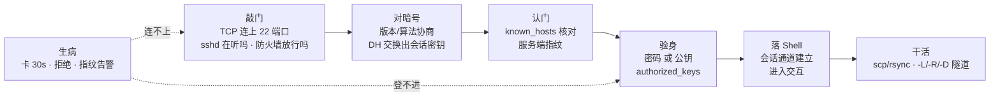
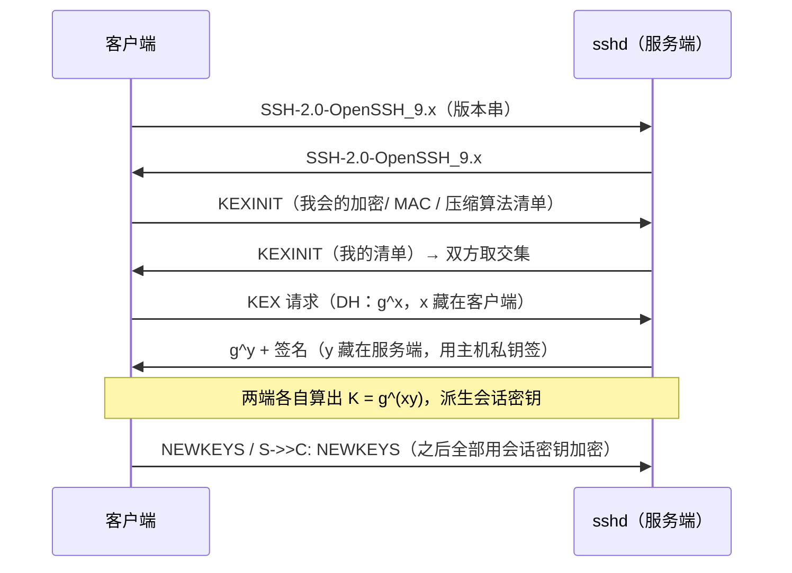
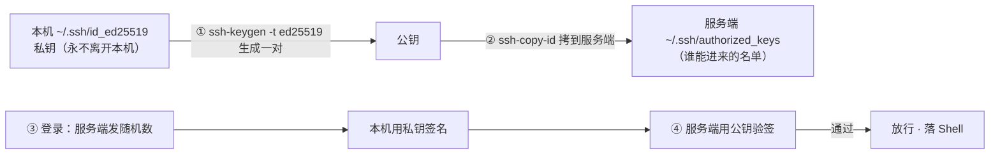
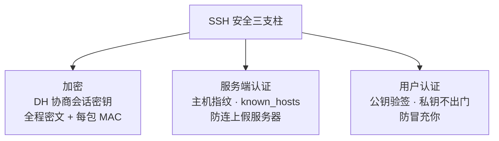
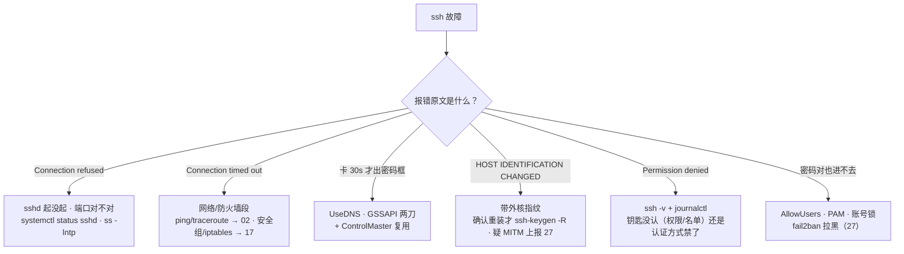

# SSH 与远程访问

> 割接演练半夜开场，十台机器 `ssh` 全部要卡 30 秒才弹密码框，群里已经有人喊「内网挂了」；另一天全网机器同时刷 `REMOTE HOST IDENTIFICATION HAS CHANGED`，值班的手起刀落 `rm known_hosts`——第一场是 UseDNS 反解慢，第二场可能是重装，也可能是中间人。两个都不是网络故障。
> **本章回答**：一次 SSH 连接从敲门（TCP）、对暗号（密钥交换）、认门（主机指纹）、验身（用户认证）到落 Shell、挖隧道的一生，每一段会怎么坏、第一刀砍哪。
> **不讲**：TCP 握手与队列机制 → [13](../13-TCP与UDP/)；ping/traceroute/ss 排查刀法 → [02](../02-网络排查命令/)；iptables/conntrack → [17](../17-iptables与conntrack/)；TLS 与证书体系 → [14](../14-HTTP与TLS/)；fail2ban、sshd 加固全景 → [27](../27-Linux安全加固/)；跳板机与批量密钥分发 → [28](../28-堡垒机与跳板机/)。

**标记**：🎯重点 · 🔥难点 · ⭐常考 · 🔧实操

---

## 一、一张图：一次 SSH 连接的一生

> 🎯 **一句话**：一条 SSH 连接要过五道门——敲门、对暗号、认门、验身、落 Shell——缺一道都到不了命令行。



**读图**：主线是五道门，每道门各有一类典型病：敲门段连不上（二节）、对暗号段几乎不坏但它解释「为什么安全」（三节）、认门段出指纹告警（四节）、验身段出 Permission denied（五节）、落 Shell 之后是隧道与传文件（七节）。「生病」不是新阶段，是任何一段坏了的样子——八、九节集中定责；`ssh -v` 的调试输出就是照这条线走的，卡在哪一步就是哪道门的病。

---

## 二、敲门：到 22 端口之前

> 🎯 **一句话**：`ssh` 报错分两种口吻——refused（对方回话了但 22 没人听）、timeout（喊了没人应）——两种病，第一刀完全不同。

```bash
ssh ops@10.0.0.21
# ssh: connect to host 10.0.0.21 port 22: Connection refused    ← ① 拒绝
# ssh: connect to host 10.0.0.21 port 22: Connection timed out  ← ② 超时
```

- **Connection refused（连接拒绝）**：TCP 包到了对方，对方内核回了 RST——**网络是通的，22 没人听**。sshd 没起、监听在别的端口、监听地址不对。
- **Connection timed out（连接超时）**：SYN 发出去石沉大海——**包根本没到或回不来**。IP 不对、路由不通、防火墙 DROP（DROP 不回话才叫超时；REJECT 会表现成 refused）。

> 🔍 **现场**：远程起手三问——sshd 活着吗、端口对吗、监听地址对吗。

```bash
ssh -p 2222 ops@10.0.0.21                  # ← 先确认端口：改过端口的机器，22 永远 refused
ss -lntp | grep sshd                       # 在目标机上（或走带外/云控制台）
# LISTEN 0 128 0.0.0.0:22    users:(("sshd",pid=980,fd=3))  ← 22 在听、全网卡
# LISTEN 0 128 127.0.0.1:22  users:(("sshd",pid=980,fd=3))  ← 只听回环：远程永远连不上
systemctl status sshd                      # ← refused 的第一刀（→ 11）
```

超时类按 [02](../02-网络排查命令/) 的刀法走 `ping` → `traceroute` → 逐跳定位；云上安全组和 iptables 的 DROP 是最常见真凶（→ [17](../17-iptables与conntrack/)）。**拿到密码提示符就算敲门通过**——卡在密码框之前的，都是这一节的事。

```bash
ping -c 3 10.0.0.21
# 3 packets transmitted, 0 received, 100% packet loss   ← 连 ICMP 都不通：网络段
traceroute -n 10.0.0.21
#  1  10.0.1.1   0.4 ms      ← 到网关就断：网关之后丢
#  2  * * *
#  3  * * *                   ← 从某跳起全星：断点在这一跳附近
```

还有一种夹在中间的报错：`ssh_exchange_identification: Connection closed by remote host`——TCP 握手成了、sshd 也在，却在版本串阶段被掐（hosts.deny、fail2ban 拉黑、或 `MaxStartups` 并发上限）。第一刀 `journalctl -u sshd` 看拒绝理由，再查限流（→ [17](../17-iptables与conntrack/)）。

⭐ refused 比 timed out 好消息得多：前者说明你和服务端之间网络无恙，修的是 sshd 自己；后者才是网络/防火墙段的问题。

> ⚠️ **别混**：refused vs timeout 一对——RST =「路通、门没人开」（查 sshd），无响应 =「路断」（查网络/防火墙）。把 timeout 当 sshd 故障反复重启服务，是最常见的第一刀砍错。

> 📝 **面试**：两种报错先答机制再答排查——refused 是对方内核回 RST、timeout 是包被吞；分别查 `systemctl status sshd` / `ss -lntp` 和 `ping`、`traceroute`、安全组。

---

## 三、对暗号：算法协商与密钥交换

> 🎯 **一句话**：双方先亮版本和算法清单，再用 Diffie-Hellman 在明文网络上凭空算出同一把会话密钥——之后一切全程加密。

TCP 连上后、你还没输入任何东西之前，ssh 已经自己说完了三轮话：



**读图**：三段递进——版本对上才能说同一种协议，算法清单取交集才能用同一种密码，DH 交换完双方同时发 NEWKEYS 切入加密。**你在屏幕上看到密码提示符之前，加密通道已经建好了**——这就是「为什么密码不会被链路上抓到」的答案。

🔥 **Diffie-Hellman（DH，迪菲-赫尔曼密钥交换）** 凭什么明文传也安全：双方各自握一个**从不上网**的随机私数（x、y），网上走的只有 g^x 和 g^y；数学上从 g^x 反推 x 是离散对数难题，窃听者攒下全部报文也算不出 g^(xy)。**会话密钥从没在网络上出现过**，每条连接现算现用、断开即焚。

> 💡 **打个比方**：两人各调一杯颜色——各自把秘色（私数）滴进公开的基色里传给对方，双方再往收到的混合色里滴自己的秘色，得到同一杯最终色；窃听者拿到两杯中间色，也调不出最终色。

由此推论两个值班常识：

- **tcpdump 抓 SSH 一片密文是正常的**——加密从握手后半段就开始，密码、命令、输出全部只见密文；想看明文不是抓包能解决的，只能上服务端审计或 sshd 调试（抓包刀法 → [16](../16-网络排障与抓包/)）。
- 和 HTTPS 思想同源（在明文信道上协商密钥），差别在 **TLS 靠 CA 证书体系认服务端，SSH 靠 known_hosts 指纹认服务端**——这正是四节的主角（→ [14](../14-HTTP与TLS/)）。

两个常被追问的细节：会话密钥不是「一把」而是**一组**——加密、MAC 各派生一把，进出方向各一套；长连接每隔约 1 小时或每 1G 数据会 **rekey（重新密钥交换，密钥轮换）**——「连接挂了几小时突然断、日志里带 rekey 字样」不是被黑，是正常轮换。版本串则是全程唯一明文可见的东西，顺手就是一把版本探测刀：

```bash
nc -w 2 10.0.0.21 22
# SSH-2.0-OpenSSH_9.6        ← 版本串裸奔：敲门段唯一能直接看到的内容
```

> 📝 **面试**：「SSH 连接建立过程」按图背六步——TCP → 版本协商 → KEXINIT 算法协商 → DH 密钥交换 → NEWKEYS → 用户认证；「SSH 为什么安全」答三件套——加密（DH 会话密钥 + 每包 MAC 校验）、服务端认证（指纹）、用户认证（公钥/密码）。

---

## 四、认门：known_hosts 与主机指纹

> 🎯 **一句话**：加密不等于没被骗——你加密地连上了假服务器照样完蛋；known_hosts 是客户端自己攒的服务端指纹账本。

每台 sshd 第一次装好就生成一对**主机密钥**（`/etc/ssh/ssh_host_ed25519_key` 等），公钥的哈希就是**指纹（fingerprint）**。客户端第一次连接时问你要不要记账：

```text
The authenticity of host '10.0.0.21' can't be established.
ED25519 key fingerprint is SHA256:8nRf…wKk.
Are you sure you want to continue connecting (yes/no)?      ← 首次：人肉核指纹
```

答 yes 之后这行指纹写进 `~/.ssh/known_hosts`（全局账本在 `/etc/ssh/ssh_known_hosts`）；**之后再连，客户端逐字核对指纹**，对不上立刻拒绝并刷出值班最吓人的屏：

```text
@@@@@@@@@@@@@@@@@@@@@@@@@@@@@@@@@@@@@@@@@@@@@@@@@@@@@@@@@@@
@    WARNING: REMOTE HOST IDENTIFICATION HAS CHANGED!     @
@@@@@@@@@@@@@@@@@@@@@@@@@@@@@@@@@@@@@@@@@@@@@@@@@@@@@@@@@@@
... Host key verification failed.
```

⭐🔥 **变更告警只有两种解释**：服务端重装/换了主机密钥（良性），或**中间人（MITM，man-in-the-middle attack）** 在冒充服务端（恶性）。**处置动作不是 `rm known_hosts`**：

```text
① 先弄清哪台是真的：带外确认（云控制台/VNC、或管理网另一条路）比对指纹
   ssh-keygen -lf /etc/ssh/ssh_host_ed25519_key.pub     ← 在目标机上看真指纹
② 确认是重装 → ssh-keygen -R 10.0.0.21 && ssh ops@10.0.0.21  ← 只删这一条并重记
③ 确认是中间人 → 停止连接、按安全事件上报（→ 27）
```

> 💡 **打个比方**：known_hosts 是你的**通讯录**——记的不是电话号码（IP 会变），是每个朋友的笔迹（指纹）。信封上的笔迹（服务端主机密钥的签名）和通讯录对不上，要么朋友换笔了（重装），要么有人冒充笔迹（中间人）——两种都要先打电话核实（带外确认），不能撕掉通讯录重记一遍。

> ⚠️ **别混**：`StrictHostKeyChecking` 三档——`yes`（没记过就拒绝，最严，自动化首选）、`accept-new`（首次自动记、变更仍拒绝，兼顾安全与自动化的推荐值）、`no`（来了就连，**等于把认门这道门拆了**，只允许一次性测试环境用）。批量分发指纹的正确姿势是预置 `/etc/ssh/ssh_known_hosts`，不是全局 `no`（→ [28](../28-堡垒机与跳板机/)）。

账本的两个运维常识：一些发行版 `HashKnownHosts yes`，known_hosts 里存的是**哈希**，肉眼看不出对应哪台——查账用 `ssh-keygen -F`；同镜像克隆的机器主机密钥相同、指纹相同，等于一把钥匙开一个机房——装机流程里要重置主机密钥（`rm /etc/ssh/ssh_host_* && ssh-keygen -A`，再预置新指纹）。

```bash
ssh-keygen -F 10.0.0.21
# Host 10.0.0.21 found: line 12
# |1|J3Iw9f…= ssh-ed25519 AAAAC3Nza…
# ← 哪怕存的是哈希，照样能按主机名/IP 查到记在第几行
```

> 📝 **面试**：「SSH 怎么防中间人」——known_hosts 指纹核对；「告警了怎么办」——带外核指纹，确认重装才 `ssh-keygen -R` 删单条，绝不无脑清账本；追问指纹哪来的——服务端主机密钥的哈希。

---

## 五、验身：密码认证 vs 密钥认证

> 🎯 **一句话**：密码认证把秘密送上网络比对，公钥认证让服务器用你的公钥验一个签名——**私钥永远不出你的电脑**。

| 对比 | **密码认证（password）** | **公钥认证（publickey）** |
|------|--------------------------|---------------------------|
| 秘密放在哪 | 服务端 shadow 里存着「能对上的那个秘密」 | 服务端只存公钥，无私密可偷 |
| 链路上传什么 | 密码本体（在加密通道里） | 只有一个签名 |
| 被爆破面 | `Failed password` 刷屏即爆破现场 | 无可猜的秘密，爆破面消失 |
| 生产定位 | 兜底 / 逐步禁用 | 默认与首选 |

**公钥认证**：你把**公钥**放进服务端 `~/.ssh/authorized_keys`，登录时服务端发一段随机数据，你用**私钥**签名传回，服务端用公钥验签——验过即放行。



**读图**：整条链上**传输的只有公钥和签名**，私钥连一个字节都没过网。⭐「密钥认证为什么更安全」的全部含义就一句：服务端没有可偷的密码、链路上没有可猜的秘密——比对的是「你会不会签名」，不是「你知不知道口令」。

生成与分发：

```bash
ssh-keygen -t ed25519 -C "ops@laptop"     # ← 现代默认 ed25519：密钥短、验签快
# 会问 passphrase：给私钥文件再上一道口令（笔记本丢了多一层保险）
ssh-copy-id ops@10.0.0.21                 # ← 公钥追加进对方 authorized_keys（批量 → 28）
```

⭐ 密钥类型三行认清：**ed25519** 现代默认，新发钥匙一律它；**rsa** 老存量，要兼容才新建、至少 `-b 4096`；**ecdsa** 是 ed25519 出现前的过渡，少用。钥匙的日常管理两条：

```bash
ssh-keygen -p -f ~/.ssh/id_ed25519                     # ← 改私钥的 passphrase（不换钥匙）
ssh-keygen -y -f ~/.ssh/id_ed25519 > id_ed25519.pub    # ← .pub 丢了：从私钥导出公钥
```

客户端侧把常用参数写进 `~/.ssh/config`（注意这是**客户端**配置，对应 `ssh_config` 那一侧），别名一条命令连上：

```bash
cat >> ~/.ssh/config <<'EOF'
Host bastion
    HostName 10.0.0.2
    User ops
    Port 2222
    IdentityFile ~/.ssh/id_ed25519
    ServerAliveInterval 60
EOF
ssh bastion      # ← 端口/用户/钥匙/保活全自动带上，不用每次手敲
```

### authorized_keys 的权限坑 🔥

值班高频第一名：sshd 的 `StrictModes`（默认开）会检查——**家目录、`.ssh`、`authorized_keys` 任何一个组/其他人可写，直接拒绝这把钥匙**。症状是「公钥明明放了、怎么都登不进」：

```bash
ls -ld ~ops ~ops/.ssh ~ops/.ssh/authorized_keys
# drwxr-x--- 3 ops ops 4096 /home/ops                  ← 家目录不可组写
# drwx------ 2 ops ops 4096 /home/ops/.ssh             ← 700
# -rw------- 1 ops ops  381 /home/ops/.ssh/authorized_keys   ← 600，一个都不能松

journalctl -u sshd -n 20 | grep -i refused
# Authentication refused: bad ownership or modes for directory /home/ops   ← 病名在这行
chmod 700 ~/.ssh && chmod 600 ~/.ssh/authorized_keys    # ← 修法（权限位语言 → 25 章）
```

### passphrase 与 ssh-agent

**passphrase** 是私钥文件的口令；每台机器输一次很烦，**ssh-agent** 把解锁后的私钥放在内存里代签：

```bash
eval "$(ssh-agent -s)"       # ← 起一个签名代理人
ssh-add ~/.ssh/id_ed25519    # ← 私钥解锁一次交给 agent
ssh ops@10.0.0.21            # ← 之后所有连接由 agent 代签，不再问口令
ssh-add -l                   # ← agent 里现存哪些钥匙
```

> ⚠️ **别混**：私钥 vs passphrase（前者是钥匙本体、躺在 `~/.ssh/id_*`，后者是钥匙的口令、只在人脑和 ssh-add 里）；以及 agent forwarding（`ssh -A`）——让跳板机上的 ssh 也能用你本机的 agent，方便但**跳板上的 root 能借你的身份连遍全网**，默认不开、要用只在可信跳板临时开（→ [28](../28-堡垒机与跳板机/)）。

### 收束：SSH 凭什么敢在公网敲命令

把三～五节收成一张可背的三支柱：



**读图**：三根柱子各挡一种攻击——加密挡窃听与篡改，服务端认证挡中间人，用户认证挡冒充。**抽掉任何一根，另外两根白搭**：不认门就是「加密地连上黑客」（StrictHostKeyChecking no）；不验用户就是「谁拿到网络位置谁进」。记忆分组：**对线路 / 对服务器 / 对人**，面试按这三组背。

> ⚠️ **别混**：三支柱**不挡**的东西——不挡服务端自身被打穿（→ [27](../27-Linux安全加固/)）、不挡账号密码太弱被爆破（那要 fail2ban / 禁密码登录，→ [27](../27-Linux安全加固/)）、不挡你把端口裸转发到办公网（七节红线）。

> 📝 **面试**：「SSH 为什么安全」按三支柱答 + 各自挡什么攻击 + 补一句「不挡什么」，就是满分结构；记忆分组法——对线路（加密）、对服务器（指纹）、对人（公钥）。

---

## 六、管家：sshd_config 高频参数

> 🎯 **一句话**：sshd_config 是这扇门的门规——改之前 `sshd -t`，改完 `reload`，这是不把自己锁在门外的两道保险。

主配置 `/etc/ssh/sshd_config`，增量配置放 `/etc/ssh/sshd_config.d/*.conf`（后读的覆盖先读的）。值班高频六个：

```text
Port 2222                          # ← 改端口：挡扫描噪音，不是安全手段
PermitRootLogin prohibit-password  # ← root 只许密钥（yes 危险 / no 全禁 / 默认 prohibit-password）
PasswordAuthentication no          # ← 关密码登录：爆破面清零（前提：密钥已经放好！）
PubkeyAuthentication yes
MaxAuthTries 6                     # ← 每连接最多认证尝试次数
AllowUsers ops deploy              # ← 白名单：不在名单的连密码对也拒（缺省=所有人）
```

> 🔍 **现场**：主文件和 drop-in 叠在一起，`sshd -T` 打印**合并后真正生效**的配置——「我明明写了为什么没生效」一眼见分晓。

```bash
sshd -T | grep -Ei '^(port|permitrootlogin|passwordauthentication|maxauthtries|allowusers)'
# port 2222
# permitrootlogin prohibit-password
# passwordauthentication no
# ← -T 需要 root；打出来的才是生效值，比翻两处文件可靠
```

⭐ 三个有顺序讲究的实战点：

- **先放钥匙、再关密码**：`PasswordAuthentication no` 之前必须确认公钥能登；改完**保持当前会话不退**，新开终端验证成功，再退旧会话——顺序反了就是把自己锁外面等带外救援。
- **AllowUsers 是最后一道闸**：认证全过、不在名单照样 Permission denied——「密码明明对却不让进」先查它。
- **PermitRootLogin no 的前提**：有可 sudo 的普通账号（→ [25](../25-用户权限与特殊位/)）；直接禁掉 root 又没留别的路，等于丢掉直连救生通道。

🔧 改配置的固定三步：

```bash
sshd -t                                   # ← 语法检查：写错一个词，reload 后新连接全挂
systemctl reload sshd                     # ← reload 重读配置且不断现有连接（比 restart 稳）
# 新开终端验证登录成功，再退出旧会话
```

> ⚠️ **别混**：`sshd_config`（服务端门规，管**别人怎么进这台机**）vs `ssh_config`（客户端偏好，管**你出去怎么连**）——`/etc/ssh/` 下就差一个字母 d，方向完全相反。`reload` vs `restart`：reload 不断已有连接、restart 全断（systemd 细节 → [11](../11-Systemd与服务管理/)）。

> 📝 **面试**：「加固一台 sshd」说出五条——改端口挡扫描、PermitRootLogin prohibit-password、PasswordAuthentication no、AllowUsers 白名单、MaxAuthTries 收紧；再补一句改动流程「sshd -t + reload + 不退旧会话验证」，就是运维过的心态。

---

## 七、挖隧道：-L、-R、-D 与 scp/rsync

> 🎯 **一句话**：ssh 除了登录还能「借道」——三种转发把 TCP 端口从一个网络搬到另一个，方向各不相同。

```text
-L 本地转发：把【远端网络的端口】搬到【本机】   ssh -L 8080:10.0.0.5:80 ops@bastion
-R 远程转发：把【本机的端口】搬到【远端】       ssh -R 9090:localhost:3000 ops@server
-D 动态转发：本机开一个 SOCKS5 代理             ssh -D 1080 ops@bastion
```

-L 参数读法固定四段：`本机端口:目标主机:目标端口@跳板`——**目标主机是站在跳板机的视角解析的**（所以能写内网 IP）。三个值班场景：

**场景一 · -L 查内网管理台** 🔧：管理台 `10.0.0.5:80` 只在游戏内网，办公网摸不到：

```bash
ssh -L 8080:10.0.0.5:80 ops@bastion
# 本机浏览器开 http://localhost:8080 → 流量走 bastion 的加密通道 → 落到 10.0.0.5:80
```

**场景二 · -R 让开发看你的本地服务** 🔧：开发要调试你本机 3000 端口的页面，他不在你的网段：

```bash
ssh -R 9090:localhost:3000 ops@dev.jump
# 开发访问 dev.jump:9090 → 隧道倒回你的 localhost:3000
```

**场景三 · -D 动态代理**：一次借道整个内网（SOCKS5，浏览器/代理客户端填 `127.0.0.1:1080`）：

```bash
ssh -D 1080 ops@bastion
```

比 `-A` 更安全的跳板姿势是 **`-J`（ProxyJump，代理跳转）**：

```bash
ssh -J bastion ops@10.0.0.21      # ← 一步直达内网机
# 等价于「先连 bastion、再从 bastion 连目标」，但不把 agent 借给跳板
# ← 跳板上的 root 借不走你的签名权——要跳板链路，优先它而不是 -A（→ 28）
```

> 💡 **打个比方**：隧道是你在自己和堡垒之间挖的一条**加密输送管**——-L 是把远处的东西顺着管子拉到你手边，-R 是把你手边的东西顺着管子递出去，-D 是管子里装了个万能接口（代理）想取什么取什么。

> 🔥 **安全红线**：-L/-R 默认只绑**回环地址**（localhost），这是保护；加 `-g` 或配 `GatewayPorts yes` 会绑到 0.0.0.0，**别人也能用你的隧道**——**禁止把生产数据库/管理台端口裸转到办公网**：等于绕过堡垒机审计、把内网服务暴露给整个办公段。要共享就上 [28](../28-堡垒机与跳板机/) 的正规通道。

传文件三兄弟：

```bash
scp patch.tar ops@10.0.0.21:/data/release/          # ← 单个小文件，简单直接
rsync -avP /data/release/ ops@10.0.0.21:/data/release/
# ← -a 保属性权限 · -v 进度 · -P = --partial --progress：断点续传
```

| 对比 | **scp** | **rsync** |
|------|---------|-----------|
| 断点续传 | 无，断了从头再来 | `-P` / `--partial` 接着传 |
| 增量传输 | 无，永远整文件 | 差异块算法，只传变化的部分 |
| 目录同步 | `-r` 全量搬运 | `-a` 保属性 + 增量 |
| 定位 | 单个小文件一把过 | 大文件 / 目录 / 反复同步 |

⭐ 大文件与断点：scp 中断 = 从头再来；rsync `-P`/`--partial` 保留半截文件续传、`--append-verify` 追加式断点，目录同步与增量传输（只传差异块）也是 rsync 主场——**发版包上 G 一律 rsync**。`-a` 会带上权限位，同步后权限对不上先想 `-a` 有没有加（权限语义 → [25](../25-用户权限与特殊位/)）。

> 📝 **面试**：三种转发各举一个场景 + 「默认只绑回环」+ 红线一句；追问 scp 和 rsync 选谁——小文件 scp，大文件/目录/断点 rsync -P。

---

## 八、生病：连得慢与登不进

> 🎯 **一句话**：能弹密码框但要等 30 秒，多半是服务端配置病不是网络病——UseDNS 和 GSSAPIAuthentication 两刀下去立竿见影。

### 连接慢：固定两刀 🔧🔥

**① UseDNS**：sshd 收到连接后尝试把你的 IP **反向解析**成域名记账，内网 DNS 没配反解区时它干等到超时——「卡 30 秒才出密码框」的头号来源。**② GSSAPIAuthentication**：先谈一遍 Kerberos/GSSAPI 认证，内网没有 KDC 时又是一段干等：

```bash
grep -E '^(UseDNS|GSSAPIAuthentication)' /etc/ssh/sshd_config
# UseDNS no                 ← 没有这两行就加上（注意：配置里必须显式写 no）
# GSSAPIAuthentication no   ← 改完 systemctl reload sshd
```

服务端慢之外还有一种「客户端慢」：每次新连接都重新走全套握手——开**连接复用**，第一条连上后后续命令秒开：

```bash
ssh -o ControlMaster=auto -o ControlPath=~/.ssh/cm-%r@%h:%p -o ControlPersist=10m ops@bastion
# ← 10 分钟内的 ssh/scp/rsync 复用同一条连接（批量操作机的标配）
```

复用写成客户端配置，对所有主机自动生效（`~/.ssh/config`）：

```bash
Host *
    ControlMaster auto
    ControlPath ~/.ssh/cm-%r@%h:%p
    ControlPersist 10m
```

> ⚠️ **别混**：慢的位置先定位再动刀——**到密码框之前慢**（本节两刀 + ControlMaster），**认证之后慢**（家目录模板/磁盘满/motd 脚本，磁盘查 [08](../08-磁盘与IO/)），别一律怪 DNS。

### 登不进：验身段的四种拒

```text
Permission denied (publickey)              ← 服务端只收公钥，你手里没有被认可的钥匙
Permission denied (publickey,password)    ← 括号里是「还允许的方式」，你全都失败了
Authentication refused: bad ownership ...  ← authorized_keys 权限松（五节坑）
Connection closed 早退 / 密码对也进不去     ← MaxAuthTries 打满 / fail2ban 拉黑 / AllowUsers 不在名单
```

排查顺序：客户端 `ssh -v`（`-vvv` 更细）看走到哪一步、服务端 `journalctl -u sshd` 看拒绝理由；「密码对但不让进」查 AllowUsers/PAM；「密钥怎么都对不上」查 authorized_keys 权限与家目录可写位（五节坑）。fail2ban 把自己办公 IP 拉黑是值班自伤名场面——解封动作与防爆破深讲 → [27](../27-Linux安全加固/)。服务端还有一把终极刀：测试机上**另起一个前台调试 sshd**，单连接模式把每一步协商与拒绝理由直接刷在屏幕上：

```bash
/usr/sbin/sshd -d -p 2222        # ← 前台单连接调试：另一个端口起一个影子 sshd
# 客户端 ssh -p 2222 连上去，拒绝原因逐行打印；用完 Ctrl-C，别留在生产线上
```

> 🔍 **现场**：一次登不进，两端各一条命令，八成病名就在输出里。

```bash
ssh -v ops@10.0.0.21 2>&1 | grep -E 'Offering|denied|Authentications'
# debug1: Offering public key: /Users/ops/.ssh/id_ed25519 ED25519 SHA256:…
# debug1: Authentications that can continue: publickey
# ← 我递了钥匙、对方只认 publickey 且没接受：查 authorized_keys / 权限 / AllowUsers
```

> 📝 **面试**：「SSH 慢怎么排查」——先定位慢在哪一段（密码框前/后），密码框前两刀 UseDNS、GSSAPIAuthentication no；追问还有没有别的加速——ControlMaster 连接复用。

---

## 九、作战：60 秒定责

> 🎯 **一句话**：ssh 故障先按报错原文分型——连不上、连得慢、登不进——每型第一刀固定。



**读图**：入口按报错原文分型，六个分支的第一刀各不相同：前两支在敲门段（二节），中间两支在认门与生病段（四、八节），后两支在验身段（五、八节）。**照着报错字面选分支**，比凭感觉「重试一下看看」快一个数量级。

| 现象 | 先做 | 别做 |
|------|------|------|
| Connection refused | `systemctl status sshd` + `ss -lntp` | 先怪网络 |
| Connection timed out | ping/traceroute → [02](../02-网络排查命令/) | 反复重试 ssh 当排查 |
| 卡 30s 出密码框 | UseDNS / GSSAPI 两刀 | 加大带宽、换机器 |
| HOST IDENTIFICATION CHANGED | 带外核指纹，重装才 -R | 直接 rm known_hosts |
| Permission denied (publickey) | `ls -ld ~/.ssh ~/.ssh/authorized_keys` | 反复重输密码（方式已禁）|
| 密码对也不让进 | 查 AllowUsers / PAM / fail2ban | 一把梭改 sshd_config |
| 改配置后连不上 | `sshd -t` 语法检查 + 看旧会话 | 没验证就退当前会话 |

> 📝 **面试**：「ssh 连不上怎么排查」——先按报错原文分型，再报每型第一刀；能主动补一句「多台同时异常先查网络/安全组与最近变更，单台异常先查本机 sshd」，就是值班口径。

🔧 **60 秒剧本**（值班第一分钟按顺序敲完再说话）：

```text
① 0–10s   照报错原文定分型：refused / timeout / 慢 / 指纹告警 / denied
② 10–30s  refused → systemctl status sshd + ss -lntp；timeout → 02 章刀法三连
③ 30–45s  denied → ssh -v 看卡在哪一步 + 对端 journalctl -u sshd 找拒绝理由
④ 45–60s  对症下刀并新开连接验证；指纹告警走带外核指纹，绝不 rm known_hosts 收工
```

---

## 十、收口

> 🎯 **一句话**：五道门 + 三支柱 + 三种转发，一张速查、一组锚点、一堵数字墙带走。

### 命令速查 🔧

```bash
ssh -p 2222 ops@host; ssh -i ~/.ssh/id_ed25519 ops@host    # 指定端口 / 指定私钥
ssh -v ops@host; ssh -vvv ops@host                          # 登录排障第一刀
ssh-keygen -t ed25519 -C "note"; ssh-copy-id ops@host       # 生成 / 分发公钥
ssh-keygen -lf /etc/ssh/ssh_host_ed25519_key.pub            # 看服务端指纹（带外核对）
ssh-keygen -R 10.0.0.21                                     # 指纹确认变更后删单条
eval "$(ssh-agent -s)"; ssh-add; ssh-add -l                 # agent 三连
ssh -L 8080:10.0.0.5:80 ops@bastion                         # 本地转发（查内网管理台）
ssh -R 9090:localhost:3000 ops@server                       # 远程转发（给开发看本地）
ssh -D 1080 ops@bastion                                     # 动态 SOCKS5
scp file ops@host:/path; rsync -avP src/ ops@host:dst/      # 传文件（大文件 rsync）
ss -lntp | grep sshd                                        # 22 在不在听、听哪个地址
sshd -t; systemctl reload sshd; journalctl -u sshd -n 50    # 改配置三步 / 看拒绝理由
```

### 面试锚点

| 问 | 30 秒答 |
|----|---------|
| SSH 连接建立过程？ | TCP → 版本协商 → KEXINIT 算法协商 → DH 密钥交换 → NEWKEYS 起加密 → 用户认证 → 会话通道 |
| DH 凭什么明文传也安全？ | 私数 x/y 从不上网，网上只有 g^x/g^y，离散对数不可逆；会话密钥不在网络上出现 |
| SSH 为什么安全？ | 三支柱：DH 会话加密 + 每包 MAC、known_hosts 服务端指纹、公钥用户认证；按「线路/服务器/人」分组 |
| 指纹告警怎么处理？ | 两种解释：重装或中间人；带外核指纹，确认重装才 ssh-keygen -R 删单条；不 rm 整个账本 |
| StrictHostKeyChecking 三档？ | yes 拒新（自动化首选）/ accept-new 首记变拒（推荐）/ no 拆门（仅一次性测试）|
| 密钥为什么比密码安全？ | 私钥不上网、服务端无可偷的秘密、爆破面消失；验的是签名不是对口令 |
| authorized_keys 权限？ | ~/.ssh 700、文件 600、家目录不可组写；StrictModes 松了直接拒登 |
| ssh-agent 干什么？ | 内存里持有解锁的私钥代签，免每机输 passphrase；-A 转发有被借身份风险 |
| 加固 sshd 五条？ | 改端口、PermitRootLogin prohibit-password、PasswordAuthentication no、AllowUsers、MaxAuthTries；改前 sshd -t |
| 三种端口转发？ | -L 把远端端口搬来本机（查内网）、-R 把本机端口搬去远端（给开发看）、-D SOCKS5；默认只绑回环 |
| scp 和 rsync 选谁？ | 小文件 scp；大文件/目录/断点 rsync -P（--partial 续传 + 增量）|
| ssh 卡 30 秒？ | 密码框前慢：UseDNS no + GSSAPIAuthentication no 两刀；认证后慢另查磁盘/家目录 |
| refused vs timed out？ | refused = 网络通、22 没人听（查 sshd）；timed out = 包没到（02/17 段）|

### 易错一句话对照

- SSH 安全 = 加密 → 加密只挡窃听；不认门照样「加密地连上假服务器」
- 指纹告警直接 rm known_hosts → 先带外核指纹，确认重装才删单条
- StrictHostKeyChecking no 更省事 → 认门这道门被拆了，只许一次性测试
- 密钥登录要把私钥传给服务器 → 传的只有公钥和签名
- authorized_keys 666 图省事 → StrictModes 直接拒登，600 是硬要求
- 密码对就能登 → AllowUsers/PAM/fail2ban 还能再拦一道
- PasswordAuthentication no 顺手就关 → 先放好钥匙、保持旧会话验证后再关
- sshd_config 改完 restart → 先 sshd -t、用 reload，新开验证后再退旧会话
- sshd_config 和 ssh_config 一回事 → 一个管进门（服务端），一个管出门（客户端）
- -L 转发到处开 → 默认只绑回环是保护；生产端口裸转办公网是红线
- scp 大文件断了重传 → rsync -P 断点续传
- 卡 30s 就怪网络 → UseDNS/GSSAPI 两刀先试
- 抓 SSH 抓不到明文是故障 → 本来就该全是密文，明文去服务端审计看

### 数字墙

> 默认端口 **22** · MaxAuthTries 默认 **6** · ~/.ssh **700** · authorized_keys / 私钥 **600** · StrictHostKeyChecking 推荐 **accept-new** · UseDNS / GSSAPIAuthentication 一律 **no** · ControlPersist 常用 **10m** · 推荐密钥 **ed25519** · 主机密钥 `/etc/ssh/ssh_host_*_key` · 服务端日志：RHEL 系 `/var/log/secure`、Debian 系 `/var/log/auth.log`

---

## 合上书

- [ ] **默画一节的图**：敲门 → 对暗号 → 认门 → 验身 → 落 Shell → 干活；「生病」挂在哪段、ssh -v 照的是哪条线。
- [ ] **口述敲门**：refused vs timeout 的机制与各自第一刀、`ss -lntp` 看监听地址的经典。
- [ ] **口述对暗号**：版本 → 算法 → DH → NEWKEYS 的顺序、DH 凭什么明文传也安全、为什么抓包全是密文。
- [ ] **口述认门**：指纹哪来的、known_hosts 记什么、变更告警的两种解释与三步处置。
- [ ] **默画三支柱**：加密 / 服务端认证 / 用户认证各挡什么、不挡什么，按「线路/服务器/人」分组。
- [ ] **口述验身**：密码 vs 公钥的秘密方向、authorized_keys 权限要求与 StrictModes、agent 与 passphrase、-A 的风险。
- [ ] **口述管家**：加固五参数、改配置三步（sshd -t / reload / 不退旧会话）、sshd_config vs ssh_config。
- [ ] **口述挖隧道**：-L/-R/-D 各一个场景与参数读法、回环默认与红线、scp vs rsync 的选择。
- [ ] **口述生病**：慢的两刀与「慢在哪段」的区分、登不进的四种拒与两端排查命令。
- [ ] **定责**：60 秒剧本四步；指纹告警绝不 rm known_hosts 收工。

下一章：[Linux 安全加固](../27-Linux安全加固/)。排查刀法：[02](../02-网络排查命令/) · 权限位语言：[25](../25-用户权限与特殊位/) · 跳板机与批量分发：[28](../28-堡垒机与跳板机/)。
