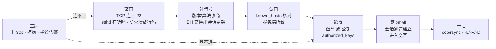
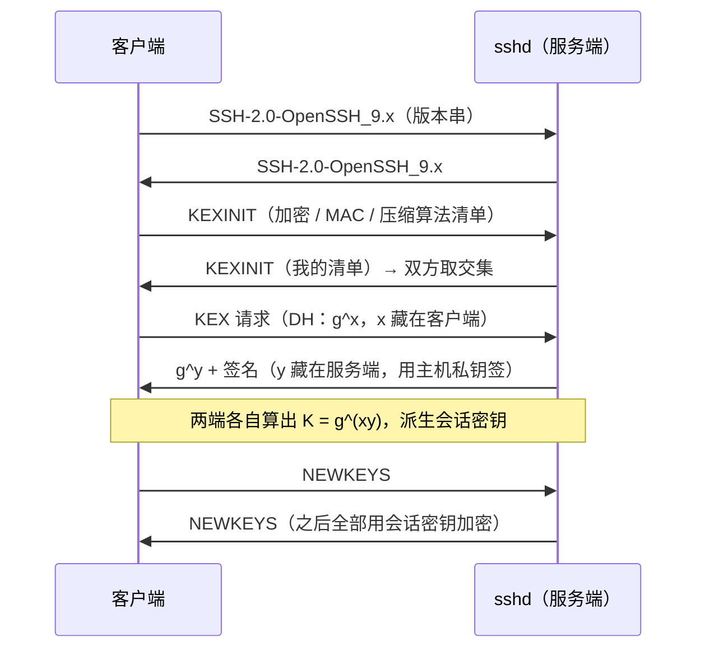
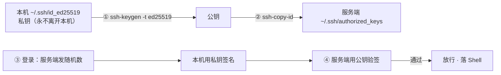
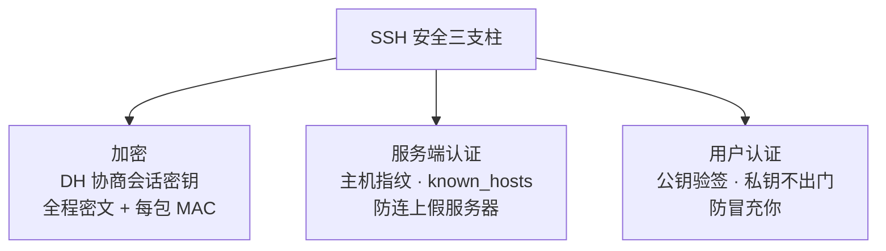
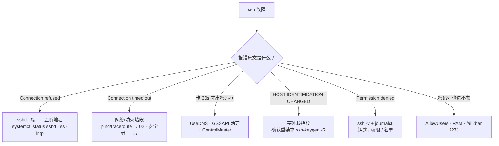

# SSH 与远程访问

> 割接演练半夜开场，十台机器 `ssh` 全要卡 30 秒才弹密码框，群里已有人喊「内网挂了」；另一天全网刷 `REMOTE HOST IDENTIFICATION HAS CHANGED`，值班手起刀落 `rm known_hosts`——第一场是 UseDNS 反解慢，第二场可能是重装，也可能是中间人。两个都不是「网络坏了」。
> **本章回答**：一次 SSH 从敲门（TCP）、对暗号（密钥交换）、认门（主机指纹）、验身（用户认证）到落 Shell、挖隧道，每一段会怎么坏、第一刀砍哪。
> **不讲**：TCP 握手与队列 → [13](../13-TCP与UDP/)；ping/traceroute/ss → [02](../02-网络排查命令/)；iptables/conntrack → [17](../17-iptables与conntrack/)；TLS 证书体系 → [14](../14-HTTP与TLS/)；fail2ban / sshd 加固全景 → [27](../27-Linux安全加固/)；跳板机与批量密钥 → [28](../28-堡垒机与跳板机/)。

**标记**：🎯重点 · 🔥难点 · ⭐常考 · 🔧实操
---

## 一、一张图：一次 SSH 连接的一生

> 🎯 **一句话**：一条 SSH 连接要过五道门——敲门、对暗号、认门、验身、落 Shell——缺一道都到不了命令行。



- 📖 **读图**
  - 🛤️ 主线五道门；「生病」不是新阶段，是任一段坏了的样子（八、九节定责）
  - 🔭 `ssh -v` 照这条线走——卡在哪一步就是哪道门的病（→ Q1、Q12）

---

## 二、敲门：到 22 端口之前

> 🎯 **一句话**：`ssh` 报错分两种口吻——refused（对方回话了但 22 没人听）、timeout（喊了没人应）——两种病，第一刀完全不同。

🔥 Connection refused vs timed out——**值班天天见**。口诀：**「拒绝查本机，超时查网络」**（练习题 Q1）。

```bash
ssh ops@10.0.0.21
# ssh: connect to host 10.0.0.21 port 22: Connection refused    ← ① 拒绝
# ssh: connect to host 10.0.0.21 port 22: Connection timed out  ← ② 超时
```

### 🚪 两种口吻各说什么 ⭐🔥

- 🔴 **Connection refused**：TCP 包到了对方，内核回了 **RST**——**网络是通的，22 没人听**
  - 常见：sshd 没起、监听在别的端口、只绑了 `127.0.0.1`
- ⚫ **Connection timed out**：SYN 石沉大海——**包根本没到或回不来**
  - 常见：IP/路由不通、防火墙 **DROP**（DROP 不回话才叫超时；**REJECT** 会表现成 refused）

#### ❓ 为什么 refused 比 timeout「好消息」？

- ✅ **refused = 路通**：修的是本机 sshd / 端口 / 监听地址，不用先怪交换机
- ❌ **timeout = 路断或被吞**：反复 `systemctl restart sshd` 是第一刀砍错
- 🧩 夹在中间的：`ssh_exchange_identification: Connection closed by remote host`——TCP 成了、版本串阶段被掐（`hosts.deny` / fail2ban / `MaxStartups`）→ 第一刀 `journalctl -u sshd`

> 🔍 **现场**：远程起手三问——sshd 活着吗、端口对吗、监听地址对吗。

```bash
ssh -p 2222 ops@10.0.0.21                  # ← 改过端口的机器，22 永远 refused
ss -lntp | grep sshd                       # 在目标机上（或走带外/云控制台）
# LISTEN 0 128 0.0.0.0:22    users:(("sshd",pid=980,fd=3))  ← 22 在听、全网卡
# LISTEN 0 128 127.0.0.1:22  users:(("sshd",pid=980,fd=3))  ← 只听回环：远程永远连不上
systemctl status sshd                      # ← refused 的第一刀（→ 11）
```

- 🗺️ **timeout 刀法**：按 [02](../02-网络排查命令/) 走 `ping` → `traceroute`；云上安全组 / iptables DROP 最常见（→ [17](../17-iptables与conntrack/)）

```bash
ping -c 3 10.0.0.21
# 3 packets transmitted, 0 received, 100% packet loss   ← 连 ICMP 都不通：网络段
traceroute -n 10.0.0.21
#  1  10.0.1.1   0.4 ms
#  2  * * *                   ← 从某跳起全星：断点在这一跳附近
```

- ✅ **拿到密码提示符就算敲门通过**——卡在密码框之前的，都是这一节的事

> ⚠️ **别混**：RST =「路通、门没人开」（查 sshd）；无响应 =「路断」（查网络/防火墙）。把 timeout 当 sshd 故障反复重启，是最常见的第一刀砍错。

> 📝 **面试**：先答机制再答排查——refused = 对方回 RST、timeout = 包被吞；分别查 `systemctl status sshd` / `ss -lntp` 和 `ping`、`traceroute`、安全组。⭐（练习题 Q1）

本节对应练习题 Q1。TCP 通了——对暗号这段几乎不坏，它到底在保证什么？

---

## 三、对暗号：算法协商与密钥交换

> 🎯 **一句话**：双方先亮版本和算法清单，再用 Diffie-Hellman 在明文网络上凭空算出同一把会话密钥——之后一切全程加密。

TCP 连上后、你还没输入任何东西之前，ssh 已经自己说完了三轮话：



- 📖 **读图**
  - 三段递进：版本对上 → 算法取交集 → DH 完双方发 NEWKEYS 切入加密
  - 🖥️ **你看到密码提示符之前，加密通道已经建好**——密码不会被链路上抓到

### 🔐 Diffie-Hellman 凭什么明文传也安全 ⭐🔥

- 🎲 **DH（迪菲-赫尔曼密钥交换）**：双方各自握一个**从不上网**的随机私数（x、y），网上只走 g^x / g^y
- 🧮 从 g^x 反推 x 是离散对数难题——窃听者攒下全部报文也算不出 g^(xy)
- 🔑 **会话密钥从没在网络上出现过**；每条连接现算现用、断开即焚

#### ❓ 为什么不直接「传一把共享密钥」？

- ❌ **明文传密钥**：中间人一抄就完——后面加密等于「用小偷也有的钥匙锁门」
- ✅ **DH**：网上只有中间态，会话密钥两端各自算出来；和 HTTPS 思想同源（→ [14](../14-HTTP与TLS/)）
- 🪪 差别：TLS 靠 **CA 证书**认服务端，SSH 靠 **known_hosts 指纹**认服务端——四节主角

> 💡 **打个比方**：两人各调一杯颜色——各自把秘色（私数）滴进公开基色传给对方，再往收到的混合色里滴自己的秘色，得到同一杯最终色；窃听者拿到两杯中间色，也调不出最终色。

- 🕵️ **值班常识**
  - `tcpdump` 抓 SSH 一片密文是正常的——想看明文只能上服务端审计 / sshd 调试（→ [16](../16-网络排障与抓包/)）
  - 会话密钥是**一组**（加密、MAC、进出方向各一套）；长连接约每 1 小时或每 1G 会 **rekey**——日志带 rekey 字样不是被黑
  - 版本串是全程唯一明文可见的东西：

```bash
nc -w 2 10.0.0.21 22
# SSH-2.0-OpenSSH_9.6        ← 敲门段唯一能直接看到的内容
```

> 📝 **面试**：「连接建立」按图背六步——TCP → 版本 → KEXINIT → DH → NEWKEYS → 用户认证；「为什么安全」答三件套——加密、服务端指纹、用户认证。⭐（练习题 Q2）

本节对应练习题 Q2。回到开头那个指纹告警——手起刀落 `rm known_hosts` 为什么危险？

---

## 四、认门：known_hosts 与主机指纹

> 🎯 **一句话**：加密不等于没被骗——你加密地连上了假服务器照样完蛋；known_hosts 是客户端自己攒的服务端指纹账本。

🔥 `REMOTE HOST IDENTIFICATION HAS CHANGED` 就 `rm known_hosts`——**高频错答**。口诀：**先核实再改，别直接删**（练习题 Q3）。

### 🪪 指纹从哪来、账本记什么 ⭐

- 🔑 每台 sshd 装好就生成**主机密钥**（`/etc/ssh/ssh_host_ed25519_key` 等），公钥的哈希 = **指纹（fingerprint）**
- 📒 客户端第一次连接问你要不要记账：

```text
The authenticity of host '10.0.0.21' can't be established.
ED25519 key fingerprint is SHA256:8nRf…wKk.
Are you sure you want to continue connecting (yes/no)?      ← 首次：人肉核指纹
```

- ✅ 答 yes → 写入 `~/.ssh/known_hosts`（全局账本 `/etc/ssh/ssh_known_hosts`）
- 🚨 之后再连，指纹对不上立刻拒绝：

```text
@@@@@@@@@@@@@@@@@@@@@@@@@@@@@@@@@@@@@@@@@@@@@@@@@@@@@@@@@@@
@    WARNING: REMOTE HOST IDENTIFICATION HAS CHANGED!     @
@@@@@@@@@@@@@@@@@@@@@@@@@@@@@@@@@@@@@@@@@@@@@@@@@@@@@@@@@@@
... Host key verification failed.
```

#### ❓ 为什么不能直接 `rm known_hosts`？

- 🎭 **变更只有两种解释**：服务端重装/换了主机密钥（良性），或**中间人（MITM）**在冒充（恶性）
- ❌ `rm known_hosts` = 撕掉整本通讯录重记——中间人场景等于主动接受假指纹
- ✅ **三步处置**：

```text
① 带外确认真指纹（云控制台 / VNC / 管理网）
   ssh-keygen -lf /etc/ssh/ssh_host_ed25519_key.pub     ← 在目标机上看真指纹
② 确认重装 → ssh-keygen -R 10.0.0.21 && ssh ops@…     ← 只删这一条并重记
③ 确认中间人 → 停止连接、按安全事件上报（→ 27）
```

> 💡 **打个比方**：known_hosts 是**通讯录**——记的不是电话号码（IP 会变），是每个朋友的笔迹（指纹）。笔迹对不上，要么换笔了（重装），要么有人冒充（中间人）——先打电话核实，不能撕掉通讯录。

> ⚠️ **别混**：`StrictHostKeyChecking` 三档——`yes`（没记过就拒，自动化最严）、`accept-new`（首次自动记、变更仍拒，**推荐**）、`no`（来了就连 = **拆掉认门这道门**，只许一次性测试）。批量分发指纹用预置 `/etc/ssh/ssh_known_hosts`，不是全局 `no`（→ [28](../28-堡垒机与跳板机/)）。

- 🧰 **账本运维**
  - 有的发行版 `HashKnownHosts yes`——肉眼看不出对应哪台，查账用 `ssh-keygen -F`
  - 同镜像克隆 → 主机密钥相同 = 一把钥匙开一个机房 → 装机要 `rm /etc/ssh/ssh_host_* && ssh-keygen -A`，再预置新指纹

```bash
ssh-keygen -F 10.0.0.21
# Host 10.0.0.21 found: line 12
# |1|J3Iw9f…= ssh-ed25519 AAAAC3Nza…   ← 哈希存也能按 IP 查到行号
```

> 📝 **面试**：「防中间人」——known_hosts 指纹核对；「告警了」——带外核指纹，确认重装才 `ssh-keygen -R` 删单条，绝不无脑清账本。⭐（练习题 Q3）

本节对应练习题 Q3。门认清了——密钥认证为什么比密码安全？公钥放好了为什么还登不进？

---

## 五、验身：密码认证 vs 密钥认证

> 🎯 **一句话**：密码认证把秘密送上网络比对，公钥认证让服务器用你的公钥验一个签名——**私钥永远不出你的电脑**。

🔥 公钥放好了就是登不进——**权限位往往是真凶**。口诀：**「家目录不组写，密钥文件 600」**（练习题 Q4、Q5）。

| 对比 | **密码认证（password）** | **公钥认证（publickey）** |
|------|--------------------------|---------------------------|
| 秘密放在哪 | 服务端 shadow 存「能对上的秘密」 | 服务端只存公钥，无私密可偷 |
| 链路上传什么 | 密码本体（在加密通道里） | 只有一个签名 |
| 被爆破面 | `Failed password` 刷屏 | 无可猜的秘密，爆破面消失 |
| 生产定位 | 兜底 / 逐步禁用 | 默认与首选 |

### 🔏 公钥认证怎么转 🎯⭐🔥



- 📖 **读图**
  - 整条链上传输的只有**公钥和签名**，私钥连一个字节都没过网
  - ⭐「为什么更安全」一句：服务端无可偷的密码、链路上无可猜的秘密——验的是「你会不会签名」

#### ❓ 为什么私钥不上网还能验身？

- 🧮 **挑战-应答**：服务端发随机数 → 你用私钥签名 → 公钥验签通过 = 证明「你持有对应私钥」
- ❌ **不是**「把私钥拷到服务器比对」——那是把钥匙柜搬进机房
- ✅ 私钥丢了 = 身份丢了；所以要 passphrase + 权限位（见下）

```bash
ssh-keygen -t ed25519 -C "ops@laptop"     # ← 现代默认：短、快
ssh-copy-id ops@10.0.0.21                 # ← 公钥追加进 authorized_keys（批量 → 28）
ssh-keygen -p -f ~/.ssh/id_ed25519         # ← 改 passphrase（不换钥匙）
ssh-keygen -y -f ~/.ssh/id_ed25519 > id_ed25519.pub   # ← .pub 丢了：从私钥导出
```

- 🗝️ **密钥类型**：`ed25519` 新发一律它；`rsa` 存量兼容至少 `-b 4096`；`ecdsa` 过渡期少用
- 📝 客户端偏好写进 `~/.ssh/config`（**客户端**侧，对应 `ssh_config`）：

```bash
cat >> ~/.ssh/config <<'EOF'
Host bastion
    HostName 10.0.0.2
    User ops
    Port 2222
    IdentityFile ~/.ssh/id_ed25519
    ServerAliveInterval 60
EOF
ssh bastion      # ← 端口/用户/钥匙/保活一次带齐
```

### 📐 authorized_keys 的权限坑 🔥

- 🧱 `StrictModes`（默认开）检查：家目录、`.ssh`、`authorized_keys` **任一**组/其他人可写 → 直接拒绝这把钥匙

```bash
ls -ld ~ops ~ops/.ssh ~ops/.ssh/authorized_keys
# drwxr-x--- 3 ops ops 4096 /home/ops                  ← 家目录不可组写
# drwx------ 2 ops ops 4096 /home/ops/.ssh             ← 700
# -rw------- 1 ops ops  381 /home/ops/.ssh/authorized_keys   ← 600

journalctl -u sshd -n 20 | grep -i refused
# Authentication refused: bad ownership or modes for directory /home/ops
chmod 700 ~/.ssh && chmod 600 ~/.ssh/authorized_keys    # ← 修法（→ 25）
```

#### ❓ 为什么权限一松就拒登？

- 🛡️ **防别人改你的门禁名单**：`.ssh` 或 `authorized_keys` 可写 = 同机其他用户可能塞进自己的公钥
- ⚖️ StrictModes 宁可「你登不进」也不要「别人替你开门」——权限位语言见 [25](../25-用户权限与特殊位/)

### 🔑 passphrase 与 ssh-agent

- **passphrase** = 私钥文件的口令；**ssh-agent** 把解锁后的私钥放内存里代签

```bash
eval "$(ssh-agent -s)"       # ← 起签名代理人
ssh-add ~/.ssh/id_ed25519    # ← 解锁一次交给 agent
ssh ops@10.0.0.21            # ← 之后由 agent 代签
ssh-add -l                   # ← agent 里现存哪些钥匙
```

> ⚠️ **别混**：私钥 vs passphrase（本体躺在 `~/.ssh/id_*`，口令只在人脑 / `ssh-add`）；`ssh -A`（agent forwarding）让跳板也能用你本机 agent——**跳板上的 root 能借你的身份连遍全网**，默认不开（→ [28](../28-堡垒机与跳板机/)）。

### 收束：SSH 凭什么敢在公网敲命令



- 📖 **读图**
  - 三根柱子各挡一种攻击：窃听/篡改、中间人、冒充用户
  - 抽掉任何一根，另外两根白搭——记忆分组：**对线路 / 对服务器 / 对人**

> ⚠️ **别混**：三支柱**不挡**——服务端被打穿（→ [27](../27-Linux安全加固/)）、弱密码爆破（禁密码 + fail2ban → 27）、把端口裸转发到办公网（七节红线）。

> 📝 **面试**：「为什么安全」按三支柱 + 各自挡什么 + 补一句「不挡什么」。⭐（练习题 Q4、Q5、Q6）

本节对应练习题 Q4、Q5、Q6。能登了——加固怎么不把自己锁死？

---

## 六、管家：sshd_config 高频参数

> 🎯 **一句话**：sshd_config 是这扇门的门规——改之前 `sshd -t`，改完 `reload`，这是不把自己锁在门外的两道保险。

主配置 `/etc/ssh/sshd_config`，增量 `/etc/ssh/sshd_config.d/*.conf`（后读覆盖先读）。值班高频：

```text
Port 2222                          # ← 改端口：挡扫描噪音，不是安全手段
PermitRootLogin prohibit-password  # ← root 只许密钥（yes 危险 / no 全禁）
PasswordAuthentication no          # ← 关密码：爆破面清零（前提：密钥已放好！）
PubkeyAuthentication yes
MaxAuthTries 6                     # ← 每连接最多认证尝试
AllowUsers ops deploy              # ← 白名单：不在名单的连密码对也拒
```

> 🔍 **现场**：`sshd -T` 打印**合并后真正生效**的配置——「我明明写了为什么没生效」一眼见分晓。

```bash
sshd -T | grep -Ei '^(port|permitrootlogin|passwordauthentication|maxauthtries|allowusers)'
# port 2222
# permitrootlogin prohibit-password
# passwordauthentication no
```

### 🧭 有顺序的三件事 ⭐

- 1️⃣ **先放钥匙、再关密码**：`PasswordAuthentication no` 之前确认公钥能登；改完**保持当前会话不退**，新开终端验证成功，再退旧会话
- 2️⃣ **AllowUsers 是最后一道闸**：认证全过、不在名单照样 Permission denied
- 3️⃣ **PermitRootLogin no 的前提**：有可 sudo 的普通账号（→ [25](../25-用户权限与特殊位/)）

#### ❓ 为什么改完不能立刻退当前会话？

- 🚪 旧会话还活着 = 你唯一的救生通道；新开连不上还能从旧会话改回去
- ❌ 顺序反了 = 把自己锁外面等带外 / 云控制台救援
- ✅ 固定三步：`sshd -t` → `systemctl reload sshd` → 新开验证 → 再退旧会话

```bash
sshd -t                                   # ← 语法检查：写错一个词，新连接全挂
systemctl reload sshd                     # ← reload 重读配置且不断现有连接
# 新开终端验证登录成功，再退出旧会话
```

### 🧩 Match 块与客户端分层 ⭐

- 🗂️ **服务端 `Match`**：按 User / Group / Address 分段覆盖全局——写在文件**后部**，命中才改那几项

```text
Match Address 10.0.0.0/8
    PasswordAuthentication no
Match User breakglass
    PasswordAuthentication yes          # ← 救急账号例外开密码
```

- 🗂️ **客户端分层**（别和 Match 混）：`/etc/ssh/ssh_config` 全局 · `~/.ssh/config` 按 Host 别名

> ⚠️ **别混**：`sshd_config`（管**别人怎么进这台机**）vs `ssh_config`（管**你出去怎么连**）——差一个字母 d，方向完全相反。`reload` 不断连接，`restart` 全断（→ [11](../11-Systemd与服务管理/)）。

> 📝 **面试**：加固五条（改端口、PermitRootLogin prohibit-password、PasswordAuthentication no、AllowUsers、MaxAuthTries）+ 改动流程「sshd -t + reload + 不退旧会话」；追问 Match 按条件分段。⭐（练习题 Q7、Q13）

本节对应练习题 Q7、Q13。会话在了——隧道 -L/-R 差在哪？

---

## 七、挖隧道：-L、-R、-D 与 scp/rsync

> 🎯 **一句话**：ssh 除了登录还能「借道」——三种转发把 TCP 端口从一个网络搬到另一个，方向各不相同。

```text
-L 本地转发：把【远端网络的端口】搬到【本机】   ssh -L 8080:10.0.0.5:80 ops@bastion
-R 远程转发：把【本机的端口】搬到【远端】       ssh -R 9090:localhost:3000 ops@server
-D 动态转发：本机开一个 SOCKS5 代理             ssh -D 1080 ops@bastion
```

### 🚇 三种转发各干什么 🔧⭐

- 📥 **-L 查内网管理台**：管理台 `10.0.0.5:80` 只在游戏内网

```bash
ssh -L 8080:10.0.0.5:80 ops@bastion
# 本机 http://localhost:8080 → 加密通道 → bastion → 10.0.0.5:80
```

#### ❓ 为什么 `-L` 的目标主机是「跳板视角」？

- 🧭 参数读法：`本机端口:目标主机:目标端口@跳板`
- ✅ **目标主机站在跳板机上解析**——所以能写内网 IP；站在你笔记本上根本路由不到
- 👉 写错成「本机视角的内网 IP」= 连到跳板本机或根本不通

- 📤 **-R 给开发看本地服务**：

```bash
ssh -R 9090:localhost:3000 ops@dev.jump
# 开发访问 dev.jump:9090 → 隧道倒回你的 localhost:3000
```

- 🧦 **-D 动态 SOCKS5**：浏览器填 `127.0.0.1:1080`，一次借道整个内网

```bash
ssh -D 1080 ops@bastion
```

- 🪜 比 `-A` 更安全的跳板姿势是 **`-J`（ProxyJump）**：

```bash
ssh -J bastion ops@10.0.0.21      # ← 一步直达；不把 agent 借给跳板（→ 28）
```

> 💡 **打个比方**：隧道是你和堡垒之间的**加密输送管**——-L 把远处的东西拉到手边，-R 把手边的递出去，-D 管子里装了万能接口（代理）。

> 🔥 **安全红线**：-L/-R 默认只绑**回环**；加 `-g` / `GatewayPorts yes` 绑到 `0.0.0.0` = **别人也能用你的隧道**。禁止把生产库/管理台裸转到办公网——等于绕过堡垒审计。要共享走 [28](../28-堡垒机与跳板机/)。

### 📦 scp vs rsync

| 对比 | **scp** | **rsync** |
|------|---------|-----------|
| 断点续传 | 无，断了从头来 | `-P` / `--partial` 接着传 |
| 增量 | 无，永远整文件 | 差异块，只传变化 |
| 定位 | 单个小文件 | 大文件 / 目录 / 反复同步 |

```bash
scp patch.tar ops@10.0.0.21:/data/release/
rsync -avP /data/release/ ops@10.0.0.21:/data/release/
# ← -a 保属性 · -P = --partial --progress：断点续传
```

- ⭐ **发版包上 G 一律 rsync**；`-a` 会带权限位，同步后权限对不上先想有没有加 `-a`（→ [25](../25-用户权限与特殊位/)）

> 📝 **面试**：三种转发各举一场景 + 「默认只绑回环」+ 红线；小文件 scp，大文件/目录/断点 rsync -P。⭐（练习题 Q8～Q10）

本节对应练习题 Q8、Q9、Q10。现在——卡 30 秒、登不进，第一刀砍哪？

---

## 八、生病：连得慢与登不进

> 🎯 **一句话**：能弹密码框但要等 30 秒，多半是服务端配置病不是网络病——UseDNS 和 GSSAPIAuthentication 两刀下去立竿见影。

### 🐢 连接慢：固定两刀 🔧🔥

#### ❓ 为什么卡 30 秒多半不是「内网挂了」？

- 🔍 **UseDNS**：sshd 收到连接后把你的 IP **反向解析**成域名记账；内网没配反解区 → 干等到超时
- 🔍 **GSSAPIAuthentication**：先谈一遍 Kerberos/GSSAPI；内网没有 KDC → 又一段干等
- ✅ 多台同时「卡半分钟才出密码框」+ 网络组说链路正常 → **先砍这两行，再怪交换机**

```bash
grep -E '^(UseDNS|GSSAPIAuthentication)' /etc/ssh/sshd_config
# UseDNS no                 ← 必须显式写 no（缺行也可能是 yes）
# GSSAPIAuthentication no
systemctl reload sshd
```

- 🚀 **客户端加速**：连接复用，第一条连上后后续秒开

```bash
# ~/.ssh/config
Host *
    ControlMaster auto
    ControlPath ~/.ssh/cm-%r@%h:%p
    ControlPersist 10m
```

> ⚠️ **别混**：**到密码框之前慢**（本节两刀 + ControlMaster）；**认证之后慢**（家目录模板 / 磁盘满 / motd，→ [08](../08-磁盘与IO/)）——别一律怪 DNS。

### 🚫 登不进：验身段的四种拒

```text
Permission denied (publickey)              ← 只收公钥，你手里没有被认可的钥匙
Permission denied (publickey,password)    ← 括号里是「还允许的方式」，你全都失败了
Authentication refused: bad ownership ...  ← authorized_keys 权限松（五节）
Connection closed 早退 / 密码对也进不去     ← MaxAuthTries / fail2ban / AllowUsers
```

- 🔍 **两端各一条**：客户端 `ssh -v`，服务端 `journalctl -u sshd`
- 🧪 测试机终极刀：另起前台调试 sshd（别留在生产）

```bash
ssh -v ops@10.0.0.21 2>&1 | grep -E 'Offering|denied|Authentications'
# debug1: Offering public key: …/id_ed25519
# debug1: Authentications that can continue: publickey
# ← 递了钥匙、对方只认 publickey 且没接受：查 authorized_keys / 权限 / AllowUsers

/usr/sbin/sshd -d -p 2222        # ← 前台单连接调试；用完 Ctrl-C
```

> 📝 **面试**：「SSH 慢」——先定位慢在密码框前/后；框前两刀 UseDNS、GSSAPIAuthentication no；再补 ControlMaster。⭐（练习题 Q11）

本节对应练习题 Q8～Q11。开头两个现场——第一分钟怎么定责？

---

## 九、作战：60 秒定责

> 🎯 **一句话**：ssh 故障先按报错原文分型——连不上、连得慢、登不进——每型第一刀固定。

🔥 十台卡 30 秒就喊「内网挂了」——**常常是 UseDNS**。口诀：**「先 ssh -v，再怪网络」**（练习题 Q11、Q12）。



- 📖 **读图**
  - 入口按报错原文分型；前两支敲门段，中间认门/生病，后两支验身
  - 照着字面选分支，比「重试一下看看」快一个数量级

| 现象 | 先做 | 别做 |
|------|------|------|
| Connection refused | `systemctl status sshd` + `ss -lntp` | 先怪网络 |
| Connection timed out | ping/traceroute → [02](../02-网络排查命令/) | 反复重试 ssh |
| 卡 30s 出密码框 | UseDNS / GSSAPI 两刀 | 加大带宽、换机器 |
| HOST IDENTIFICATION CHANGED | 带外核指纹，重装才 -R | 直接 rm known_hosts |
| Permission denied (publickey) | `ls -ld ~/.ssh ~/.ssh/authorized_keys` | 反复重输密码 |
| 密码对也不让进 | AllowUsers / PAM / fail2ban | 一把梭改 sshd_config |
| 改配置后连不上 | `sshd -t` + 看旧会话 | 没验证就退当前会话 |

🔧 **60 秒剧本**：

```text
① 0–10s   照报错原文定分型：refused / timeout / 慢 / 指纹告警 / denied
② 10–30s  refused → systemctl status sshd + ss -lntp；timeout → 02 章刀法
③ 30–45s  denied → ssh -v + 对端 journalctl -u sshd
④ 45–60s  对症下刀并新开验证；指纹告警走带外，绝不 rm known_hosts 收工
```

- 🧭 **多台同时异常** → 先想网络/安全组与最近变更；**单台** → 先查本机 sshd

> 📝 **面试**：按报错原文分型 + 每型第一刀；补一句「多台先网络、单台先本机」。⭐（练习题 Q12、Q14）

本节对应练习题 Q12、Q13、Q14。开头那两个人——你已经知道该怎么拦住他们了。

---

## 十、收口

> 🎯 **一句话**：五道门 + 三支柱 + 三种转发，一张速查、一组锚点、一堵数字墙带走。

### 命令速查 🔧

```bash
ssh -p 2222 ops@host; ssh -i ~/.ssh/id_ed25519 ops@host    # 指定端口 / 私钥
ssh -v ops@host; ssh -vvv ops@host                          # 登录排障第一刀
ssh-keygen -t ed25519 -C "note"; ssh-copy-id ops@host       # 生成 / 分发公钥
ssh-keygen -lf /etc/ssh/ssh_host_ed25519_key.pub            # 看服务端指纹
ssh-keygen -R 10.0.0.21                                     # 确认变更后删单条
eval "$(ssh-agent -s)"; ssh-add; ssh-add -l                 # agent 三连
ssh -L 8080:10.0.0.5:80 ops@bastion                         # 本地转发
ssh -R 9090:localhost:3000 ops@server                       # 远程转发
ssh -D 1080 ops@bastion; ssh -J bastion ops@10.0.0.21       # SOCKS5 / ProxyJump
scp file ops@host:/path; rsync -avP src/ ops@host:dst/      # 小文件 scp · 大文件 rsync
ss -lntp | grep sshd                                        # 22 在不在听
sshd -t; systemctl reload sshd; journalctl -u sshd -n 50    # 改配置三步 / 拒绝理由
sshd -T | grep -i passwordauthentication                    # 打印生效配置
```

### 面试锚点

| 问 | 30 秒答 |
|----|---------|
| SSH 连接建立过程？ | TCP → 版本 → KEXINIT → DH → NEWKEYS → 用户认证 → 会话通道 |
| DH 凭什么明文传也安全？ | 私数 x/y 不上网，网上只有 g^x/g^y；会话密钥不在网络上出现 |
| SSH 为什么安全？ | 三支柱：加密 + MAC、known_hosts 指纹、公钥验签；按「线路/服务器/人」分组 |
| 指纹告警怎么处理？ | 重装或中间人；带外核指纹，确认重装才 `ssh-keygen -R`；不 rm 整本 |
| StrictHostKeyChecking 三档？ | yes 拒新 / accept-new 首记变拒（推荐）/ no 拆门（仅测试）|
| 密钥为什么比密码安全？ | 私钥不上网、服务端无可偷秘密、爆破面消失 |
| authorized_keys 权限？ | `~/.ssh` 700、文件 600、家目录不可组写；StrictModes 松了直接拒 |
| ssh-agent / `-A`？ | agent 内存代签；`-A` 转发有被借身份风险 |
| 加固 sshd 五条？ | 改端口、PermitRootLogin prohibit-password、PasswordAuthentication no、AllowUsers、MaxAuthTries；改前 `sshd -t` |
| Match 块？ | 按 User/Group/Address 分段覆盖；写在后部；别和客户端 Host 混 |
| 三种端口转发？ | -L 远端搬来本机、-R 本机搬去远端、-D SOCKS5；默认只绑回环 |
| scp 和 rsync？ | 小文件 scp；大文件/目录/断点 rsync -P |
| ssh 卡 30 秒？ | 框前：UseDNS no + GSSAPIAuthentication no；框后另查磁盘/家目录 |
| refused vs timed out？ | refused = 路通、22 没人听；timed out = 包没到（02/17）|

### 易错一句话对照

- SSH 安全 = 加密 → 加密只挡窃听；不认门照样「加密地连上假服务器」
- 指纹告警直接 rm known_hosts → 先带外核指纹，确认重装才删单条
- StrictHostKeyChecking no 更省事 → 认门这道门被拆了，只许一次性测试
- 密钥登录要把私钥传给服务器 → 传的只有公钥和签名
- authorized_keys 666 图省事 → StrictModes 直接拒登，600 是硬要求
- 密码对就能登 → AllowUsers / PAM / fail2ban 还能再拦一道
- PasswordAuthentication no 顺手就关 → 先放好钥匙、保持旧会话验证后再关
- sshd_config 改完 restart → 先 `sshd -t`、用 reload，新开验证后再退旧会话
- sshd_config 和 ssh_config 一回事 → 一个管进门，一个管出门
- -L 转发到处开 → 默认只绑回环是保护；生产端口裸转办公网是红线
- scp 大文件断了重传 → rsync -P 断点续传
- 卡 30s 就怪网络 → UseDNS / GSSAPI 两刀先试
- 抓 SSH 抓不到明文是故障 → 本来就该全是密文

### 数字墙

> 默认端口 **22** · MaxAuthTries 默认 **6** · ~/.ssh **700** · authorized_keys / 私钥 **600** · StrictHostKeyChecking 推荐 **accept-new** · UseDNS / GSSAPIAuthentication 一律 **no** · ControlPersist 常用 **10m** · 推荐密钥 **ed25519** · 主机密钥 `/etc/ssh/ssh_host_*_key` · 服务端日志：RHEL 系 `/var/log/secure`、Debian 系 `/var/log/auth.log`

---

## 合上书

对齐练习题「合上书」，逐条口述，卡住就回对应节 / 题号。

- [ ] **默画一节的图**：敲门 → 对暗号 → 认门 → 验身 → 落 Shell → 干活；「生病」挂在哪段、`ssh -v` 照的是哪条线。
- [ ] **口述敲门**：refused vs timeout 的机制与各自第一刀、`ss -lntp` 看监听地址。
- [ ] **口述对暗号**：版本 → 算法 → DH → NEWKEYS；DH 凭什么明文传也安全；为什么抓包全是密文。
- [ ] **口述认门**：指纹哪来的、变更告警两种解释与三步处置；StrictHostKeyChecking 三档。
- [ ] **默画三支柱**：加密 / 服务端认证 / 用户认证各挡什么、不挡什么。
- [ ] **口述验身**：密码 vs 公钥的秘密方向、authorized_keys 权限与 StrictModes、agent 与 `-A` 风险。
- [ ] **口述管家**：加固五参数、改配置三步、Match 分段、sshd_config vs ssh_config。
- [ ] **口述挖隧道**：-L/-R/-D 各一场景与跳板视角读法、回环默认与红线、scp vs rsync。
- [ ] **口述生病**：慢的两刀与「慢在哪段」、登不进的四种拒与两端排查。
- [ ] **定责**：60 秒剧本四步；指纹告警绝不 rm known_hosts 收工。

下一章：[Linux 安全加固](../27-Linux安全加固/)。排查刀法：[02](../02-网络排查命令/) · 权限位：[25](../25-用户权限与特殊位/) · 跳板机：[28](../28-堡垒机与跳板机/)。
