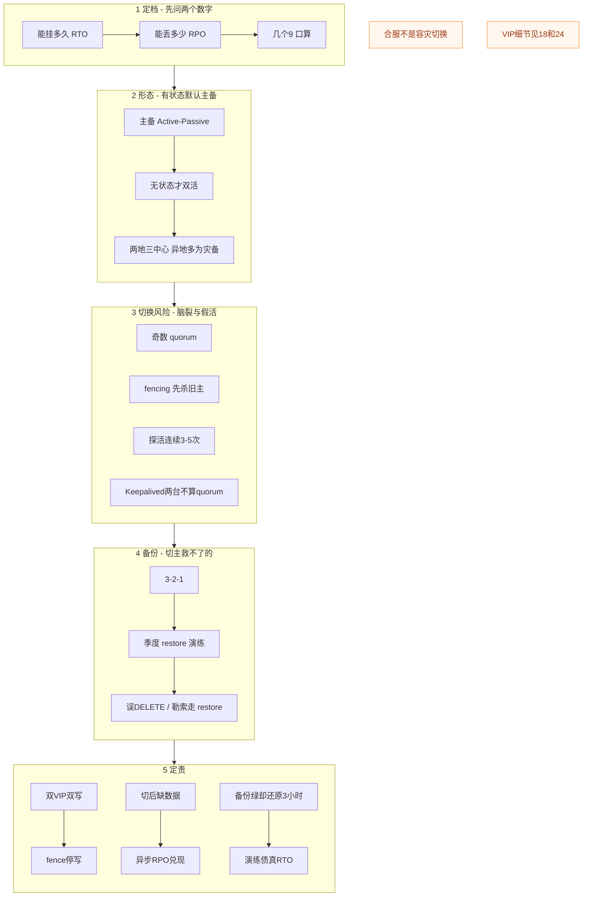
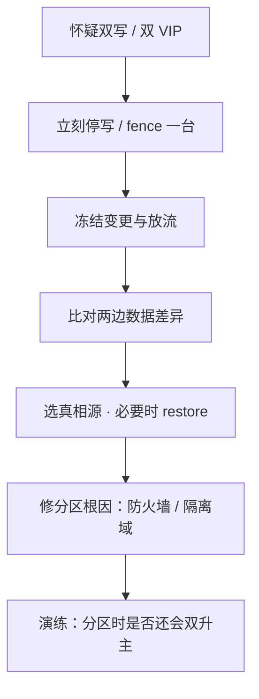
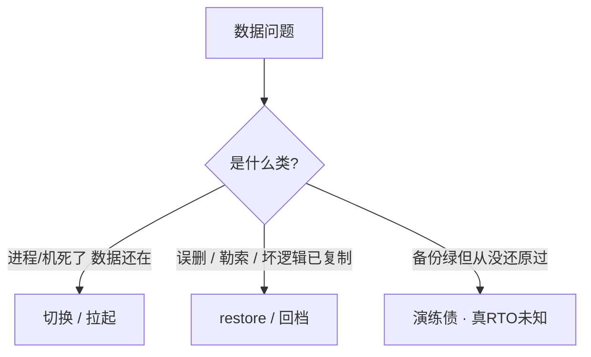
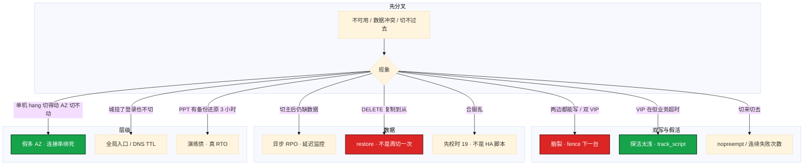

# 高可用与容灾

> **这章解决什么**：老板说「登录不能挂」、机房闪断后双主写充值、备份天天绿却从没 restore——怎么把口号换成能落地的档位，并在故障时**定责**？  
> **读法**：**先看总图** → **再走读一次切换** → **再认名词** → **再分节抠 RTO/RPO、主备、脑裂、备份**。  
> **刻意不展开**：LVS NAT/DR → [18](../18-LVS与四层负载均衡/)；Keepalived conf / GARP / nopreempt → [20](../20-HAProxy与Keepalived/)；云多 AZ / SLB → [06](../../06-云平台/)；MySQL 复制细节 → [02-01](../../02-中间件与数据库/01-MySQL/)；etcd quorum 操作 → [03-02](../../03-Kubernetes/02-etcd/)；游戏回档步骤 → [07](../../07-游戏运维专题/)；校时门禁 → [25](../25-NTP与时间同步/)。

---

## 本章目录

1. [本章定位](#1-本章定位)
2. [先看总图：故障到恢复这条时间轴](#2-先看总图故障到恢复这条时间轴) ← **开篇必读**
   - [2.0 全章知识串图](#20-全章知识串图一张把细节串起来) ← **架构总览**
   - [2.3 完整走读](#23-完整走读机房闪断从探活失败到切主验证)
3. [名词扫盲（对照总图认词）](#3-名词扫盲对照总图认词)
4. [RTO / RPO / 几个 9](#4-rto--rpo--几个-9怎么把口号换成档位)
5. [主备 Active-Passive](#5-主备-active-passive有状态默认形态)
6. [脑裂与 quorum：本章最易混](#6-脑裂与-quorum本章最易混) ← **重点精读**
7. [备份、3-2-1 与 restore](#7-备份3-2-1-与-restore切主救不了的那一类)
8. [探活、切换与 fencing](#8-探活切换与-fencing)
9. [双活 / 两地三中心 / 合服](#9-双活--两地三中心--合服)
10. [落地选型与组件对照](#10-落地选型与组件对照)
11. [定责决策树与命令速查](#11-定责决策树与命令速查)
12. [去哪章继续学](#12-去哪章继续学)
13. [面试 · 易错 · 数字](#13-面试--易错--数字)
14. [合上书](#合上书)

---

## 1. 本章定位

| 章 | 负责 |
|----|------|
| **26（本章）** | RTO/RPO 定档、主备/双活/两地三中心、脑裂与 quorum、备份与 restore、探活与切换定责 |
| **18 / 20** | VIP 怎么漂、LVS/Keepalived 怎么配 |
| **03-01 / 04-02** | MySQL 复制、etcd 多数派怎么操作 |
| **07 游戏运维** | SLO 细账、活动高峰、回档剧本 |

本章是**可用性口径入口**。后面所有「要不要双活」「切主还是 restore」「两台 Keepalived 算不算集群」，都建立在「故障—丢失—恢复」这张时间轴上。

🎯 **值班签名**：两边都能写充值 / 双 VIP —— 先 **fence 一台、停写**，不是让玩家重连试；误 `DELETE` —— 走 **restore**，不是再切一次主。

---

## 2. 先看总图：故障到恢复这条时间轴

> **正确开篇顺序**：先有全局画面，再认词，再抠细节。  
> 先看 **§2.0 全章串图**（考点挂一张板上），再看 **§2.1 时间轴**（坐标系），再用 **§2.3 走读**把一次闪断串起来。

### 2.0 全章知识串图（一张把细节串起来）

> 🎯 **合上书要能默画这张。** 蓝=定档 · 绿=形态 · 橙=脑裂/探活 · 紫=备份/定责。  
> 若预览仍报错，以下面 **ASCII 一页板** 为准。



**ASCII 一页板（兜底）：**

```text
┌─ 1 定档 ──────────────────────────────────────────────────────────┐
│  RTO=能挂多久 ｜ RPO=能丢多少 ｜ 99.99%≈年停机52.6分钟（525600尺子） │
└───────────────────────────────────────────────────────────────────┘
         │
┌─ 2 形态 ──────────────────────────────────────────────────────────┐
│  有状态 → 主备（一份写）｜ 无状态 → 双活+LB ｜ 抗城级 → 两地三中心   │
│  异地脚=灾备，通常异步，不是日常双写                                 │
└───────────────────────────────────────────────────────────────────┘
         │
┌─ 3 切换风险 ──────────────────────────────────────────────────────┐
│  奇数 quorum（3→扛1；4也只扛1）｜ fencing 先杀旧主 ｜ 探活连续3～5次 │
│  Keepalived 两台 = 优先级+心跳，不是多数派 → 可能双 VIP             │
└───────────────────────────────────────────────────────────────────┘
         │
┌─ 4 备份 ──────────────────────────────────────────────────────────┐
│  3-2-1 + 季度 restore ｜ 切主救不了误删/勒索/逻辑错误                 │
└───────────────────────────────────────────────────────────────────┘
         │
┌─ 5 定责第一刀 ────────────────────────────────────────────────────┐
│  双写→fence ｜ 切后缺数据→看复制落后 ｜ 合服乱→校时不是抢VIP        │
└───────────────────────────────────────────────────────────────────┘
```

**读图三句话：**

1. **先问 RTO/RPO**，再选主备 / 双活 / 两地三中心——图上没有「先画全球双活」这一步。  
2. **切换解决「进程/机房没了」**；误删、勒索、逻辑错误只能靠 **restore 演练过的备份**。  
3. **脑裂是分区后双写**——奇数 quorum + fencing；两台 Keepalived **不算** quorum。

---

### 2.1 一张总图（时间轴 · 先建立坐标系）

故障发生那一刻 `t0`，你真正关心两段：

```text
时间 ──────────────────────────────────────────────────────────────►

  ······ 最近可恢复点 ······│········ RPO ········│········ RTO ········│
                            │                    │                    │
                         备份/同步点              t0 故障              服务重新可用
                         （最多丢这段）           （中断开始）         （必须在此之前）
```

| 段 | 问的是 | 方案语言 |
|----|--------|----------|
| **RPO** | 最多丢多少数据（常用时间说） | 同步≈0；异步=`Seconds_Behind_Master`；备份=上次成功备份点 |
| **RTO** | 中断到恢复的目标上限 | 发现+到位+决策+切换+验证 **全算进** |

> **记住**：RTO 是**承诺**，MTTR 是**成绩单**。演练缩短的是 MTTR，不是祈祷少挂。


**读图两句话：**

1. 图上的 **RPO 段**在故障**之前**（丢的是「还没同步/备份」的数据）；**RTO 段**在故障**之后**（花时间切、验、放流）。  
2. 切换救不了「数据已经错了」——那要回到备份点（见 §7）。

---

### 2.2 三种生产形态（对照总图第 2 段）


| 形态 | 同一时刻几份写 | 切换体感 | 脑裂难度 | 默认给谁 |
|------|----------------|----------|----------|----------|
| **主备** | **一份** | 秒～分钟有缝 | 相对可控（仍要 fencing） | **有状态默认** |
| **双活** | 多份 | 几乎无切 | 难：同时写同一行就炸 | **无状态**（登录 API） |
| **两地三中心** | 同城写；异地多为备 | 同城秒～分；异地分～小时 | 异地切回要处理落后 | **抗城级** |

> **别混**：两地三中心 **≠** 异地双活。异地那只脚平时是**灾备**，通常异步，RPO 不是 0。

---

### 2.3 完整走读：机房闪断，从探活失败到切主验证

> 用一条真实路径把考点串一遍。**只保留这一版走读**。

**角色**：同城 AZ-A 主 MySQL · AZ-B 备 · Keepalived VIP · 登录服连 VIP · 玩家充值写主

#### 步骤 1：故障发生（中间交换机闪断 90 秒）

```text
t=0     AZ-A ↔ AZ-B 心跳/复制短暂中断
t=0+    主还在写本地；备 Seconds_Behind 开始涨（若异步）
        或：两边都收不到对方 VRRP → 都想占 VIP（最危险）
```

- 若只是复制断、VIP 仍在主：玩家可能还能写，**RPO 在变大**（异步）。  
- 若防火墙误拦 VRRP：**双 VIP** 风险立刻上台（见 §6）。

#### 步骤 2：探活连续失败（该不该切）

```text
track_script /health/deep：连续第 1 次失败 → 不切
连续第 2 次失败 → 不切
连续第 3～5 次失败 → 判定死，进入切换
```

偶发丢包、GC 尖刺 ≠ 死。**失败一次就切** → 活动抖动；**从不切** → 破 RTO。口径：**连续 3～5 次**（§8）。

假活例子：`killall -0 mysqld` 成功，但库已 `read_only` 或磁盘满写不进——探活必须碰到**写路径依赖**。

#### 步骤 3：fencing 再切（防脑裂）

```text
① 先确认旧主不能再写（fence / STONITH / 关写 / 拔 VIP）
② 再抬新主 / 漂 VIP / 改托管 endpoint
③ 验证：能写、关键读通、角色正确
④ nopreempt：旧主恢复后不抢回（避免二次闪断）
```

**反例**：先漂 VIP 再杀旧主 → 两台短暂都能写 → 充值写两份 → 恢复后「选哪边当真相」= 新的 RPO 灾难。

#### 步骤 4：验证与记账（对照 RTO/RPO）

```text
真实切换耗时 = 发现 → 到位 → 决策 → fence → 切 → 验证
对照 PPT 上的 RTO：演练过的 MTTR 才算数

若切后玩家缺 5 分钟充值：
  Seconds_Behind_Master 曾 ≈ 300
  → 异步 RPO 兑现，不是「切坏了」
  → 若承诺 RPO=0，方案档错了（应用同步/半同步）
```

#### 步骤 5：另一条分支——误 DELETE（不要走切换）

```text
某人 DROP TABLE / DELETE 没 WHERE
主从一起复制过去 → 切主救不了
→ 走 restore / 回档（§7 · 游戏细则 07）
```

| 情况 | 线上看到 | 走哪条 |
|------|----------|--------|
| 主进程死、VIP 可漂 | 探活连续失败 | 切换 SOP |
| 双 VIP / 两边写 | `ip addr` 同 VIP 两台都有 | **fence 停写** |
| 切后缺最近写入 | 复制延迟证据 | 认 RPO，不是再切 |
| 逻辑删除已复制 | 从库也没数据 | **restore** |
| 合服排行乱 | 时钟/合并脚本 | **不是 HA**（§9） |

---

## 3. 名词扫盲（对照总图认词）

| 名词 | 一句话 | 对照总图 |
|------|--------|----------|
| **RTO** | Recovery Time Objective：故障到恢复的**目标上限** | §2.1 故障右侧那段 |
| **RPO** | Recovery Point Objective：最多丢多少数据（时间说） | §2.1 故障左侧那段 |
| **MTTR** | 实测平均修复时间（成绩单） | 用演练测，对标 RTO |
| **MTBF** | 平均无故障间隔 | 可用性公式分子侧 |
| **可用性** | ≈ MTBF/(MTBF+MTTR)；几个 9 的口算尺子 | §4 |
| **主备 / Active-Passive** | 同一时刻一份写；备复制待命 | §2.2 左 |
| **双活 / Active-Active** | 多节点同时接（常同时写） | §2.2 中；无状态优先 |
| **热备 / 温备 / 冷备** | 热≈秒切；温≈分钟；冷≈人拉起小时级 | 定档表 §4 |
| **同步 / 异步复制** | 同步 RPO≈0；异步 RPO=落后量 | 定 RPO 的关键旋钮 |
| **脑裂 Split-brain** | 分区后双方都升主、都写 | §6 |
| **Quorum** | 多数派 N/2+1；没凑够不许写 | §6 |
| **Fencing / STONITH** | 切之前先让旧主不能写（杀电/杀网/关写） | 走读步骤 3 |
| **VIP** | 漂移的虚 IP；二层里应唯一 | 细节 → 24/20 |
| **VRRP** | Keepalived 心跳协议，**IP 协议 112** | 两台不算 quorum |
| **探活 / health check** | 连续失败才切；要碰到关键依赖 | §8 |
| **假活** | 进程在 / 静态 200，业务已死 | §8 |
| **nopreempt** | 旧主恢复不抢 VIP，防二次闪断 | §8 · conf 在 24 |
| **3-2-1** | 3 份、2 介质、1 异地 | §7 |
| **restore 演练** | 定期还原到空环境并计时 | 没有演练 = 没有 RPO |
| **合服** | 运营合并两套数据；**不是**容灾切换 | §9 |
| **两地三中心** | 同城双生产 + 异地灾备 | §2.2 右 · §9 |

> **记住**：先认「时间轴上的两段 + 三种形态 + 脑裂/备份两条风险」，再背组件名。

---

## 4. RTO / RPO / 几个 9：怎么把口号换成档位

### 4.1 一句话钉死

**一句话：** 先问能挂多久（RTO）、能丢多少（RPO），再选热备还是备份——不要一上来画异地双活。

### 4.2 值班里怎么碰到

| 群里说的 | 技术含义 | 你的第一刀 |
|----------|----------|------------|
| 「登录挂了要双活」 | 可能只要主备 + VIP / 多副本 | 先问 RTO/RPO 数字 |
| 「数据库不能丢」 | RPO≈0 → 同步或等价 | 问清是同步还是异步 |
| 「半小时内要好」 | RTO≤30min → 温备/自动切够格 | 不必全球多活 |
| 「我们要四个 9」 | 年停机预算 ≈52.6 分钟 | 先口算，再谈方案 |
| 「切过去了数据少了」 | 异步 RPO 兑现 | 看复制延迟，不是再切 |

### 4.3 定档表

| 档 | RTO | RPO | 典型 | 成本 |
|----|-----|-----|------|------|
| 热备 / 同步 / 多活 | ≈0～秒 | ≈0 | 同城同步、无状态多活 | 最高 |
| 温备 / 异步 + 快速切换 | 分钟级 | 秒～分钟 | 常见主从 + 自动切 | 中 |
| 冷备 / 快照 + 人拉起 | 小时级 | 小时级 | 备份 restore | 低 |

切换解决「进程没了」；误删、勒索、逻辑错误只能靠 restore——**主从一起复制过去的 `DELETE`，切主救不了**。

### 4.4 几个 9：525600 是口算尺子

一年 `365 × 24 × 60 = 525600` 分钟/年。停机预算 = `525600 × (1 − SLA)`。

| SLA | 算法 | 年停机约 |
|-----|------|----------|
| 99% | ×0.01 | **87.6 小时** |
| 99.9% | ×0.001 | **8.76 小时** |
| 99.95% | ×0.0005 | **4.38 小时** |
| 99.99% | ×0.0001 | **52.6 分钟** |
| 99.999% | ×0.00001 | **5.26 分钟** |

```text
承诺 99.99% → 年停机预算 52.6 min
实测单次 MTTR = 120 min → 全年只能容忍 ≈0.4 次「这种级」事故
一年只挂一次、修 8 小时 → 已远超 52.6 分钟
→ 故障次数少救不了修得慢
```

差一个 9，停机预算差约一个数量级。对外 SLA 应**松于**内部 SLO，留 error budget（细则 → 13 / 04-18）。

游戏口径（正式 SLO 在 08）：整体常 **99.95%～99.99%**；登录/支付按 **99.99%** 谈。

### 4.5 RTO 里到底算什么

```text
RTO 时钟从故障可感知开始，一直跑到业务验证通过：

  发现（告警/客诉）
    → 到位（人/自动）
    → 决策（切不切、切哪边）
    → fencing
    → 切换（VIP / 选主 / DNS）
    → 验证（写一条、关键读、放流）
```

PPT 写 RTO=5 分钟、演练却 3 小时才拉起——**那才是真 RTO**。

### 4.6 面试怎么说

「我不会先画双活。我先问 RTO/RPO：半小时内恢复、不能丢 → 同城同步主从 + 自动切；有状态默认主备；备份必须季度 restore。99.99% 一年大约 52.6 分钟，不是 8 小时。」

> **记住**：525600 是尺子；RTO 承诺、MTTR 成绩单；没有演练过 restore 的备份，RPO 是空话。

### 4.7 一例钉死：RTO vs RPO vs MTTR（只在这里写全）

#### ① 最常见具体例子

凌晨 2:17 主库磁盘挂了。最近一次成功同步点是 2:12。2:25 VIP 切到备，2:28 登录写探通过放流。过去 90 天同类故障平均 14 分钟恢复。

#### ② 一句话定义

| 词 | 这例子里是什么 |
|----|----------------|
| **RPO（承诺）** | 业务说「最多丢 5 分钟」——方案必须保证可恢复点不太于 5 分钟 |
| **本次实际丢失** | 约 5 分钟（2:12→05:17），落在承诺内 |
| **RTO（承诺）** | 业务说「15 分钟内恢复」 |
| **本次实际恢复** | 11 分钟（2:17→05:28），达标 |
| **MTTR** | 历史平均 14 分钟——成绩单，用来证明 RTO 是否吹牛 |

#### ③ 对照怎么认

```text
问老板：能丢多久？ → 得到 RPO 承诺 → 选同步还是异步/备份间隔
问老板：能挂多久？ → 得到 RTO 承诺 → 选自动切还是人拉起
看演练记录：上次真实耗时 → 得到 MTTR 样本 → 对标 RTO
看 Seconds_Behind / 备份时间戳 → 得到「现在真丢得起多少」
```

#### ④ 易错一句钉死

> **别混**：RTO 不是「切换脚本跑了几秒」；从告警到验证放流都算。RPO 不是「备份任务是否绿灯」；是可恢复点距离故障有多远。

---

## 5. 主备 Active-Passive：有状态默认形态

### 5.1 一句话钉死

**一句话：** 有状态默认主备（同一时刻一份写）；无状态才能双活。

### 5.2 主备在干什么

```text
Client ──► VIP / 托管 endpoint ──► 主（读写）
                                    │ 复制
                                    ▼
                                   备（只读 / 待命）
```

| 优点 | 代价 |
|------|------|
| 冲突少、心智简单 | 切换有缝（秒～分钟） |
| fencing / 选主路径清晰 | 备闲置成本；异步则有 RPO |
| 适合 DB、有状态房间外置后的单写 | VIP 漂移会断存量连接（18/20） |

**Active-Passive = Active-Standby**：主接写，备被动复制。名字不同，形态同一类。

### 5.3 同步 vs 异步：定 RPO 的旋钮

| 复制 | RPO | 切换时常见坑 |
|------|-----|--------------|
| **同步 / 半同步** | ≈0（按配置语义） | 延迟敏感；网络抖可能拖主 |
| **异步** | = 落后量 | 切后缺最近写入——**方案如此，不是切坏了** |

```text
切主后玩家缺约 5 分钟充值
Seconds_Behind_Master: 312
→ 异步 RPO ≈ 5 分钟已兑现
→ 若老板承诺「不能丢」，方案档错了，不是再切一次能补回
```

细节与参数 → [02-01 MySQL](../../02-中间件与数据库/01-MySQL/)。

### 5.4 游戏里怎么画（对照组件）

| 组件 | 默认形态 | 备注 |
|------|----------|------|
| 登录 API | 无状态多副本 + LB（可双活） | RTO 可 <30s |
| 玩家 MySQL | **主备 + 同步**（RPO=0） | 自动切 |
| Redis Session | 主从 / Sentinel | Session 可丢一点时常可接受 |
| 逻辑服 / 房间 | **单写 + 状态落库 + 拉起** | 不要跨城内存双活 |
| CDN / 静态 | 多源 | → 15 |

### 5.5 主备切换 SOP（值班骨架）


1. 确认旧主真死或已 fence，避免双写。  
2. 切 VIP / 托管 endpoint / 选主。  
3. 验证写入和关键读；看复制角色。  
4. `nopreempt`：备机稳住就不抢。  
5. 记下真实切换时间，对照 RTO。**高峰不切主**。

**现场走一遍（意向输出）：**

```bash
# 1) VIP 现在在哪
ip -br addr show | grep -E 'vip|32'

# 2) 探活是否连续失败（看 keepalived / 编排器日志，示意）
#    fail=1 → 不切；fail=4 (≥N) → 进入切换

# 3) fencing 后再切；切后验证
curl -s -o /dev/null -w '%{http_code}\n' http://VIP/health/deep
# 期望：200；若仍 5xx → 还没验完，不要报「切好了」
```

```text
输出解读：
  旧机仍有 VIP + 新机也有 VIP     → 脑裂窗口，回 §6
  新机有 VIP，deep health 200      → 切换骨架完成
  新机有 VIP，deep 503             → VIP 漂了业务没好（探活/依赖）
  玩家缺最近 N 分钟写入            → 查复制落后，认 RPO（§4 / §5.3）
```

### 5.6 面试怎么说

「有状态我默认主备或状态外置，不假装无状态双活。同步换 RPO≈0；异步就要接受落后。切主前先 fencing。」

> **别混**：主备的「备」是复制待命，不是「另一台也在日常双写」。

---

## 6. 脑裂与 quorum：本章最易混

> 🎯 **全章最易晕的一点单独钉死。** 别处只写「见 §6」。

### 6.1 四步钉死脑裂

#### ① 最常见具体例子

机房中间防火墙误拦心跳。两边 MySQL / Keepalived 都以为对方死了：

```text
AZ-A：我收不到 B → 我升主，VIP 在我这，继续写充值
AZ-B：我收不到 A → 我也升主，VIP 也在我这，也写充值
恢复后：两套玩家道具，选哪边当真相？
```

#### ② 一句话定义

**脑裂（split-brain）**：网络分区后双方都认为自己是主、**都写**，恢复后数据冲突。新 RPO 变成「选哪边当真相」。

#### ③ 对照命令怎么认

```bash
# 两台都执行：同一 VIP 是否同时出现
ip addr | grep -E 'inet .*/32|inet .*/24' | grep -v 127.0.0.1

# 两边能否写入（只读标志、业务写探）
# MySQL 示例意向：两边都是可写角色 = 危险
```

| 看到 | 含义 | 第一刀 |
|------|------|--------|
| **同一 VIP 出现在两台** | 双 VIP / 脑裂征兆 | **立刻 fence 一台、停写** |
| 两边业务都能写充值 | 双主已发生 | 停写 > 抢 VIP > 重启逻辑服 |
| 只有一边 VIP，另一边只读 | 正常主备 | 查复制落后即可 |

#### ④ 易错一句钉死

> **别混**：quorum（etcd/Raft 多数派）vs VRRP（Keepalived 心跳）——**解决的不是同一层问题**。Keepalived **两台不算 quorum**。

### 6.2 奇数节点：为什么 4 台不比 3 台更能扛 2 台

| N | quorum = N/2+1 | 可挂 | 备注 |
|---|---------------|------|------|
| 2 | 2 | **0** | 平票；挂 1 台就没多数 |
| **3** | **2** | **1** | 生产最常见 |
| 4 | 3 | **1** | 和 3 一样只扛 1，浪费一台 |
| **5** | **3** | **2** | 要扛 2 台故障再上 |

```text
3 节点：挂 1 台，剩 2 ≥ quorum 2 → 还能选主
4 节点：挂 1 台，剩 3 ≥ quorum 3 → 也能；但挂 2 台，剩 2 < 3 → 挂
       → 容错台数仍是 1，多买的那台没换成「扛 2 台」
2 节点：挂 1 台，剩 1 < 2 → 整集群不可用；还不如 1 台好懂
```

生产：**3 或 5**。2 节点 etcd / Raft **不要上生产**。

### 6.3 防脑裂三板斧

| 防法 | 要点 |
|------|------|
| **Quorum** | 没凑够 N/2+1 **不许写** |
| **Fencing / STONITH** | 切之前先杀旧主电源/网/关写 |
| **VIP 唯一** | 二层里尽量一个 VIP；两节点 VRRP 仍可能双发 → [20](../20-HAProxy与Keepalived/) |

普通 MySQL 主从 **不防脑裂**；MGR 或 MHA+fencing/VIP 才有说法（03-01）。etcd 靠多数派（04-02）。

### 6.4 Keepalived 两台：为什么总有人当成 quorum

```text
Keepalived 两台：
  靠优先级 + VRRP 心跳（IP 协议 112）
  没有「多数派投票」
  心跳被挡 → 两边都升 Master → 双 VIP

这和 etcd 3 节点完全不是一类东西。
```

| | Raft / etcd | Keepalived VRRP |
|--|-------------|-----------------|
| 决策 | 多数派投票 | 优先级 + 谁还活着发通告 |
| 2 节点 | 不能生产 | 常见，但**承认脑裂风险** |
| 心跳被挡 | 少数派不能写（若配好） | 可能**双主双 VIP** |
| 细节章 | 04-02 | 24 |

### 6.5 现场处置顺序（脑裂已发生）



| 要做 | 别做 |
|------|------|
| fence、停写、保留现场日志 | 让玩家重连「试一下」 |
| 比对差异再选真相 | 直接重启两边逻辑服赌运气 |
| 修心跳路径 / 隔离域 | 只加机器不加 quorum 规则 |

### 6.6 面试怎么说

「脑裂是分区后双写。防靠 quorum + fencing。3 台 quorum=2 扛 1 台；4 台仍只扛 1。Keepalived 两台没有多数派，心跳被挡会双 VIP——先 fence，不是重启。」

---

## 7. 备份、3-2-1 与 restore：切主救不了的那一类

### 7.1 一句话钉死

**一句话：** 3-2-1 要异地一份；只 backup 成功不 restore 演练，等于没有备份。

### 7.2 切主 vs restore：两条路



| 场景 | 切主有用吗 | 正确动作 |
|------|------------|----------|
| 主机宕机 | 有 | HA 切换 |
| `DELETE` 没 WHERE 已复制到从 | **无** | restore |
| 勒索加密生产盘 | **无**（同盘 snapshot 常一起没） | 异地 restore |
| 逻辑 bug 写坏余额 | 常无 | 回档 / 定点恢复（08） |

### 7.3 3-2-1 规则

| 数字 | 含义 | 反例（不算） |
|------|------|--------------|
| **3** | 至少三份数据 | 生产 + 同盘 snapshot 只算「还在一块盘上」 |
| **2** | 两种介质 | 全是同一块云盘的快照链 |
| **1** | 一份异地或另一账号 | 同账号同地域桶，火灾/盗号一起没 |

```text
合格例子（意向）：
  生产库
  + 同城备份盘 / 备份库
  + 异地对象存储（另一账号或另一 Region）
  且：季度 restore 到空环境跑通，记下耗时
```

### 7.4 备份策略怎么对齐 RPO

| RPO 目标 | 备份节奏 | 还要叠什么 |
|----------|----------|------------|
| 秒～分钟 | 连续复制 / binlog | 自动切；异步要监控落后 |
| 小时级 | 小时快照 + binlog | restore 剧本 |
| 天级 | 日备 | 接受丢一天 |

变更、合服、扩容前：**加打一份**，并确认密钥/权限在手边。

### 7.5 restore 演练：什么叫「做过」

```text
不算演练：
  □ 任务绿灯
  □ 「应该能还原」
  □ 只在原机覆盖试一下

算演练：
  ☑ 还原到空环境 / 隔离环境
  ☑ 跑校验（行数、抽样业务、登录可读）
  ☑ 记下真实耗时（这才是 RTO 证据）
  ☑ 密钥、权限、网络策略一并验证
  ☑ 季度至少一次；大变更前加一次
```

PPT 写 RPO=5 分钟、演练 3 小时才拉起——对外请改口，对内请还债。

### 7.6 主机还要备什么（别只备库）

| 类别 | 例子 | 为什么 |
|------|------|--------|
| 配置 | `/etc`、systemd unit、crontab | 库起来了服务起不来 |
| 证书与密钥 | TLS、DB 密码、对象存储密钥 | 没密钥等于没备份 |
| 镜像 / 包版本 | 可复现的发布物 | 避免「只能在那台旧机跑」 |

游戏库回档步骤细则 → [07](../../07-游戏运维专题/)。

### 7.7 面试怎么说

「备份任务绿不算数。我要 3-2-1，而且季度 restore 计时。误 DELETE 走 restore，不走切主。」

> **记住**：切主救进程；restore 救数据。没有演练的 RPO 是空话。

---

## 8. 探活、切换与 fencing

### 8.1 一句话钉死

**一句话：** 连续 **3～5** 次失败再切；`/health` 要碰到关键依赖；切之前先让旧主不能写。

### 8.2 探活深度

| 探活方式 | 返回 | 含义 |
|----------|------|------|
| `killall -0 nginx` | 0 | 进程在，可能已不 accept |
| GET `/health` → 静态 200 | 200 | DB 挂了也 200 → **假活** |
| GET `/health/deep` 查库 / 真登录 | 503 / 超时 | 该计入失败 |
| 只靠 VRRP 心跳 | 通 | **只说明 keepalived 在发报文**，不说明业务活 |

```bash
curl -s -o /dev/null -w '%{http_code} %{time_total}\n' http://127.0.0.1/health
curl -s -o /dev/null -w '%{http_code}\n' http://127.0.0.1/health/deep
```

### 8.3 参数口径（本章记数字，conf 在 24）

| 项 | 生产怎么用 | 改错会怎样 |
|----|------------|------------|
| 连续失败次数 | **3～5** | 1 次就切 → 活动抖动 |
| 间隔 | **1～5s** | 太稀 → 切太慢破 RTO |
| 单次超时 | **< 间隔** | 超时叠加重试会误判 |
| `/health` | 碰到库 / 登录依赖 | 静态 200 假活 |
| 检查太重 | 避免每次全表扫 | 探活把 DB 打满 |
| nopreempt | 主恢复不抢 | 二次闪断 |
| VRRP | IP **112**；心跳路径独立 | 双 VIP |

### 8.4 fencing 放在切换之前

```text
正确顺序：
  探活判定死 → fencing（旧主不能写）→ 抬新主 / 漂 VIP → 验证

错误顺序：
  先漂 VIP → 旧主还在写 → 双写窗口
```

托管云上的「自动故障转移」往往把 fencing 语义做进控制面；自建 MHA/Keepalived **必须自己想清楚**旧主怎么死干净。

### 8.5 VIP 漂移不是无感

VIP 漂走后，**存量 TCP 常断**，客户端要重连。不要答「完全无感」。细节 → [18](../18-LVS与四层负载均衡/) · [20](../20-HAProxy与Keepalived/)。

### 8.6 面试怎么说

「失败一次就切会抖；`/health` 只 return 200 不够。VIP 在但业务死，先查探活太浅。切之前 fencing。」

---

## 9. 双活 / 两地三中心 / 合服

### 9.1 双活给谁

**一句话：** 无状态可双活；有状态内存房间默认主备或状态外置。

| | 适合双活 | 不适合硬双活 |
|--|----------|--------------|
| 形态 | 登录 API、静态、无会话写冲突 | 内存房间、DB 主主日常双写 |
| 失败域 | LB 摘掉一台即可 | 同时写同一行 → 冲突比掉线惨 |
| 成本 | 相对可控 | 多城多活极贵 |

异地多活：多城同时写，RTO/RPO≈0，成本与冲突处理极高——**默认不要**当第一方案。

### 9.2 两地三中心

```text
同城中心 A ──同步/低延迟── 同城中心 B     ← 日常生产，抗 AZ/机房
         └──异步 / 备份──► 异地中心 C     ← 灾备脚，不日常双写
```

| | 同城双中心 | 异地第三中心 |
|--|------------|--------------|
| 目标 | 抗 AZ / 机房 | 抗城级 |
| 复制 | 常同步或近同步 | 常异步 |
| RPO | 可冲 0 | 通常 ≠0 |
| 何时切 | AZ 故障 | 城挂 / 演练 |

> **别混**：两地三中心 **≠** 「异地也在日常双活」。

### 9.3 合服 ≠ 容灾切换

**一句话：** 合服是运营合并两套数据；跨区容灾是城级故障切流——回滚靠合服前快照，不是抢 VIP。

| | 合服 | 跨区容灾 |
|--|------|----------|
| 触发 | 运营排期 | Region/机房故障 |
| 数据 | 两套合并都要留下 | 以灾备可恢复点为准（RPO=落后） |
| 战斗服 | 常停服合并 | 房间常散了，玩家重连 |
| 门禁 | 两边时钟 **>1s 停**（[25](../25-NTP与时间同步/)） | 两边本就应同一 NTP |
| 成功标准 | 名单/排行正确 | RTO 内登录支付可用 |
| 回滚 | 合服前快照 | 切错了是新的数据决策 |

合服当晚 SOP 骨架：

```text
1. chronyc tracking → 偏差 >1s → 停合服，先对时
2. 停写 / 锁服
3. 合服前全量备份（3-2-1，且本季度 restore 过）
4. 合并脚本 → 校验名单、邮件、排行
5. 不要叠不相关强更、不要同时切 VIP
6. 失败 → 合服前快照回滚，不是「再切一次主」
```

### 9.4 假多 AZ

```text
jdbc:mysql://10.0.1.50:3306/game
→ 绑死 AZ 内网 IP
→ 「多 AZ」PPT 有，切流时连接串仍指向死 AZ
→ 要用托管 endpoint / 可切的域名，并演练摘 AZ
```

只 kill 过本机 MySQL、从没摘过 AZ —— **不等于**多 AZ HA 验收通过。

### 9.5 面试怎么说

「无状态双活；有状态落库。两地三中心异地脚是灾备。合服是运营动作，不是 HA 切换；高峰不切主、不合服叠强更。」

---

## 10. 落地选型与组件对照

### 10.1 选型对错表

| 项 | 选 | 不选 |
|----|----|------|
| 先问 | RTO / RPO 数字 | 先画全球双活 |
| 有状态写 | 主备或状态外置 | DB 主主；房间内存双活 |
| 无状态 | 多副本 + LB | 单机硬扛 99.99% |
| 抗 1 故障域 | 3 节点 quorum | 2 节点当 Raft |
| 抗城级 | 两地三中心 / 异地备份 | 只靠同机 snapshot |
| 备份 | 3-2-1 + restore 演练 | 本机 cron 绿灯 |
| 变更 | 高峰不切主；合服不叠强更 | 当晚什么都做 |

### 10.2 游戏组件落法（与 08 对齐）

| 组件 | RTO | RPO | 路子 |
|------|-----|-----|------|
| 登录 | **<30s** | — | 无状态多副本 + LB |
| 玩家 MySQL | **<5min** | **0** | 同步主从 + 自动切 |
| Redis Session | **<30s** | 可丢一点 | Sentinel / 主从 |
| 逻辑服 | **<2min** | **0**（状态在库） | 落库 + 拉起 |

### 10.3 同城 MySQL HA 对照

| 路子 | RTO | RPO | 备注 |
|------|-----|-----|------|
| 托管多 AZ | 常 **<30s** | 0 | 看云文档与演练 |
| MHA + VIP | **1～2min** | 0～秒（看半同步） | 自建要自己 fencing |
| MGR | **<30s** | 0 | 带多数派防脑裂 |

验收：**PPT 上的 RTO 必须被演练过的 MTTR 证明**——没摘过 AZ、没 restore 过，不算部署完成。

### 10.4 升级与回滚

| 原则 | 说明 |
|------|------|
| 滚动 | 先升备 → 切 → 升旧主；etcd 保多数派（04-02） |
| 数据目录升过 | 可能 **不能** 靠换回旧二进制 | 回滚靠升级前快照 |
| 切错且新主已写 | 回滚是**新的数据决策**，不是撤销 |
| 没有升级前快照 | = 没有回滚 |

混沌工程：先预发把切换和告警跑通，再生产小剂量——验证 RTO，不是表演勇气。

### 10.5 核心配置口径速查

本章是口径，不是 `keepalived.conf`（24）也不是 `my.cnf`（03-01）。

| 项 | 数字 / 口径 |
|----|-------------|
| 探活连续失败 | **3～5** |
| 探活间隔 | **1～5s**，超时 < 间隔 |
| `/health` | 碰到库 / 登录依赖 |
| quorum | 3→05 扛1；5→06 扛2；4 浪费 |
| VRRP | IP **112**；两台 ≠ quorum |
| 备份 | 3-2-1 + 季度 restore |
| 合服校时 | **>1s 停**（19） |
| 几个 9 | 99.99% ≈ **52.6 min**/年 |

### 10.6 变更窗口也是可用性（常被忘掉的一刀）

**一句话：** 高峰切主、合服叠强更，本身就在花 error budget——不是「为了可用性所以今晚全做完」。

| 动作 | 高峰期 | 为什么 |
|------|--------|--------|
| 切主 / 漂 VIP | **停** | 存量断连 + 误判窗口叠加客诉 |
| 合服 | **停**（另排窗口） | 数据合并失败面大 |
| 内核/大版本强更 | **不与合服同夜** | 出问题无法归因 |
| 扩容只读副本 | 可谨慎做 | 仍要避开登录尖峰 |
| 只改文档 / 告警阈值 | 可以 | 不碰数据面 |

```text
现场常见翻车剧本：
  02:00 合服
  02:30 「顺便」升内核 / 切 VIP 演练
  03:10 排行乱 + VIP 抖
  群里同时喊：脑裂？合服脚本？时钟？
→ 变更叠加让定责树失效
→ 正确：合服窗口只做合服；HA 演练另约
```

活动日历与 SLA 细则 → [07](../../07-游戏运维专题/)。

### 10.7 容灾切换演练清单（摘 AZ / 切异地）

验收不是「kill 过本机 mysqld」，而是下面能勾上：

```text
摘 AZ / 同城切换
  □ 复制确实跨 AZ（不是两台同 AZ 装样子）
  □ VIP / 托管 endpoint / DNS 能切到活侧
  □ 应用连接串未绑死死掉的内网 IP
  □ 防火墙 / 安全组放行跨 AZ 路径
  □ 记下真实 RTO（发现→验证）
  □ 旧侧 fencing 有效（不会双写）

切异地
  □ 接受异步 RPO（数字写进 runbook）
  □ DNS TTL / 全局入口演练过
  □ 回切剧本单独写（不是「原路返回」一句话）
  □ 密钥与备份在异地可取
```

> **记住**：本机 kill ≠ 多 AZ 验收；PPT 有图 ≠ 演练过。

---

## 11. 定责决策树与命令速查

### 11.1 命令 / 取证速查（值班先背这张）

HA 总论没有一条万能 CLI，按现象取证：

| 目的 | 看什么 |
|------|--------|
| 谁在接写 | VIP 落在哪（`ip addr`）；DB 只读还是可写 |
| 复制落后 | `Seconds_Behind_Master` / 等价指标；当前 RPO 证据 |
| 脑裂 | 两台都有 VIP；两边都能写 |
| 探活 | 连续失败计数；`/health` 是否打到库 |
| 备份 | 最近成功、异地是否有、上次 restore 时间与耗时 |
| 时钟 | 合服前 `chronyc tracking`（19） |
| etcd | `endpoint health`（04-02） |
| 入口 | LVS/LB 是否摘错（16） |

```bash
# 双 VIP？
ip addr | grep -v 127.0.0.1

# 探活深度
curl -s -o /dev/null -w '%{http_code} %{time_total}\n' http://127.0.0.1/health/deep

# 合服门禁
chronyc tracking | grep 'System time'
```

### 11.2 决策树



### 11.3 现象 \| 先做 \| 别做

| 现象 | 先做 | 别做 |
|------|------|------|
| 双 VIP / 两边写充值 | 立刻下一台、fence、停写 | 让玩家重连试 |
| 进程在业务死 | `/health` 打到依赖 | 只 `killall -0` |
| 一年挂一次修 8 小时 | 拆 MTTR：发现到验证 | 用 99.99% 口头对冲 |
| 备份绿灯勒索加密 | 异地 restore 演练记录 | 相信同盘 snapshot |
| 合服排行乱 | 时钟门禁、合并顺序 | 当脑裂去抢 VIP |
| 房间双活掉线更惨 | 状态落库 | 跨城内存双写 |
| 2 节点 etcd 省钱 | 上 3 | 当集群卖可用性 |
| 高峰切主失败 | 变更窗口本身破 SLA | 再切一次赌 |
| 切后缺最近写入 | 看复制落后，认 RPO | 怪「切换脚本写坏了」就再切 |
| VIP 漂了存量断 | 预期内；查重连/池 | 答「完全无感」 |

### 11.4 活动高峰红线

```text
高峰：
  停发版、停合服、停切主
  先分清：入口（16）/ 控制面（04-02）/ 库复制 / 假活探活
  不要重启还活着的战斗服「试 HA」
```

三问定域：进程还在不在？还能不能写入？已有流量还通不通？

---

## 12. 去哪章继续学

| 你想搞懂 | 去 |
|----------|-----|
| VIP 怎么漂、LVS | [18 LVS](../18-LVS与四层负载均衡/) |
| Keepalived / HAProxy conf、GARP、nopreempt | [20](../20-HAProxy与Keepalived/) |
| MySQL 复制、MGR、半同步 | [02-01](../../02-中间件与数据库/01-MySQL/) |
| etcd 多数派操作 | [03-02](../../03-Kubernetes/02-etcd/) |
| 云多 AZ、SLB、跨 Region DNS | [06 云平台](../../06-云平台/) |
| 游戏 SLO、回档、活动高峰 | [07 游戏运维](../../07-游戏运维专题/) |
| 合服校时门禁 | [25 NTP](../25-NTP与时间同步/) |
| 告警与可观测 | [22](../22-监控与告警/) · [23](../23-日志运维/)（若已建章） |
| 入口之后的门禁 / 旋钮 | [27](../27-Linux安全加固/) · [24](../24-内核参数与sysctl/) |

---

## 13. 面试 · 易错 · 数字

| 问 | 30 秒答 |
|----|---------|
| RTO / RPO？ | RTO=恢复上限；RPO=最多丢多少。先问这两个再选方案。 |
| RTO vs MTTR？ | RTO 承诺；MTTR 实测平均。发现到验证都算进 RTO。 |
| 99.99% 年停机？ | ≈ **52.6 分钟**（525600×0.0001）。8.76 小时是 99.9%。 |
| 有状态怎么 HA？ | 默认主备或状态外置；不内存双活。 |
| 双活给谁？ | 无状态；有状态双写冲突更贵。 |
| 两地三中心？ | 同城抗 AZ；异地多为灾备，不日常双写。 |
| 脑裂？ | 分区双写；quorum + fencing；先停写。 |
| 为何奇数？ | 3 扛 1；4 仍扛 1；2 平票不能生产。 |
| Keepalived 两台？ | 不算 quorum；VRRP IP **112**；可能双 VIP。 |
| 探活？ | 连续 3～5 次；`/health` 碰依赖；防假活。 |
| 备份？ | 3-2-1 + restore 演练；切主救不了误 DELETE。 |
| 合服？ | 运营合并 ≠ 容灾切换；>1s 停；回滚靠快照。 |

| 易错说法 | 真相 |
|----------|------|
| 先画双活再问能丢多久 | 先 RTO/RPO |
| RTO 和 MTTR 一回事 | 承诺 vs 成绩单 |
| 99.99% ≈ 年停 8 小时 | **52.6 分钟** |
| 有状态逻辑服内存双活 | 状态落库 + 拉起 |
| 数据库默认主主 | 冲突比切换贵 |
| 两地三中心 = 异地双活 | 异地多为灾备 |
| 4 台比 3 台更能抗 2 台 | 4 台容错仍是 1 |
| Keepalived 两台算 quorum | 优先级 + 心跳 |
| `/health` return 200 够了 | 要碰到关键依赖 |
| 失败一次就切更灵敏 | 连续 3～5 次 |
| VIP 漂移完全无感 | 存量会断 |
| 备份任务绿 = 有 RPO | 必须 restore 演练 |
| 合服就是容灾切换 | 运营合并 vs 故障切城 |
| 高峰切主缩短窗口 | 变更窗口也是可用性 |
| 2 节点 etcd 能上生产 | 挂 1 台没多数 |
| 切主能救误 DELETE | 走 restore |

**数字**：525600 分钟/年 · 99% **87.6h** · 99.9% **8.76h** · 99.95% **4.38h** · 99.99% **52.6min** · 99.999% **5.26min** · 游戏整体 **99.95%～99.99%** · 登录支付 **99.99%** · 登录 RTO **<30s** · 玩家 MySQL **<5min / RPO 0** · Redis Session **<30s** 可丢一点 · 逻辑服 **<2min** 状态在库 · 托管多 AZ 常 **<30s** · MHA **1～2min** · MGR **<30s** · 探活 N=**3～5**、间隔 **1～5s** · 合服校时 **>1s 停** · quorum 3→05、5→06 · VRRP **IP 112**

**易混一对**：RTO vs MTTR vs RPO · 主备 vs 双活 vs 两地三中心 · 同步 vs 异步 · quorum vs VRRP · 合服 vs 跨区容灾 · 切主 vs restore · 假活探活 vs 真死 · 同城多 AZ vs 假两台同 AZ

---

## 合上书

1. **默画 §2.0**：定档（RTO/RPO/几个9）→ 形态（主备/双活/两地三中心）→ 脑裂与探活 → 备份与定责。  
2. **口述**：RTO/RPO/MTTR 各是什么？99.99% 一年允许多少停机？发现到验证为什么都算进 RTO？  
3. **讲清**：有状态为什么默认主备？双活给谁？两地三中心异地那只脚干什么？  
4. **一例钉死 §6**：脑裂是什么？3/4/5 怎么选？Keepalived 两台算不算 quorum？现场第一刀？  
5. **讲清 §7**：3-2-1 是什么？只备份不 restore 行不行？切主救得了误 DELETE 吗？  
6. **定责 §11**：双 VIP / 切后缺数据 / 合服乱 / 备份绿却还原 3 小时 —— 各走哪条？  
7. **边界**：VIP 配置去哪章？MySQL 复制？etcd？回档剧本？校时？

六～七题都能口述，这一章就过了。入口怎么转在 16，门怎么关在 17，旋钮在 18，对表在 19——可用性是把它们焊成今晚能走的步骤。
