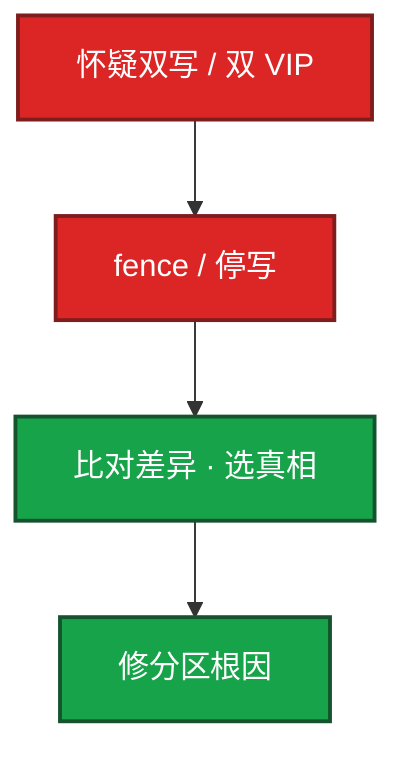
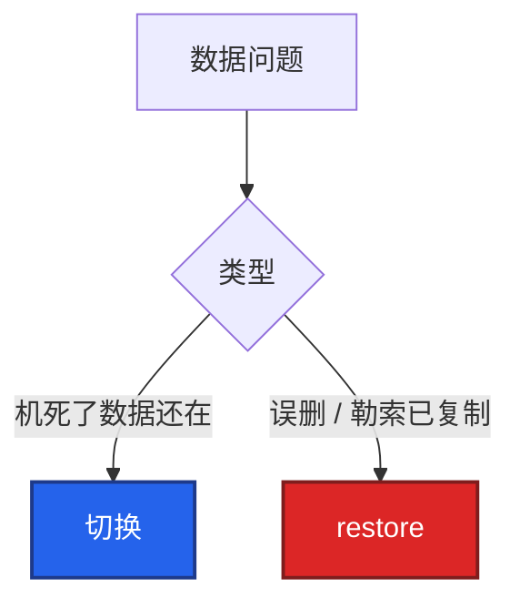
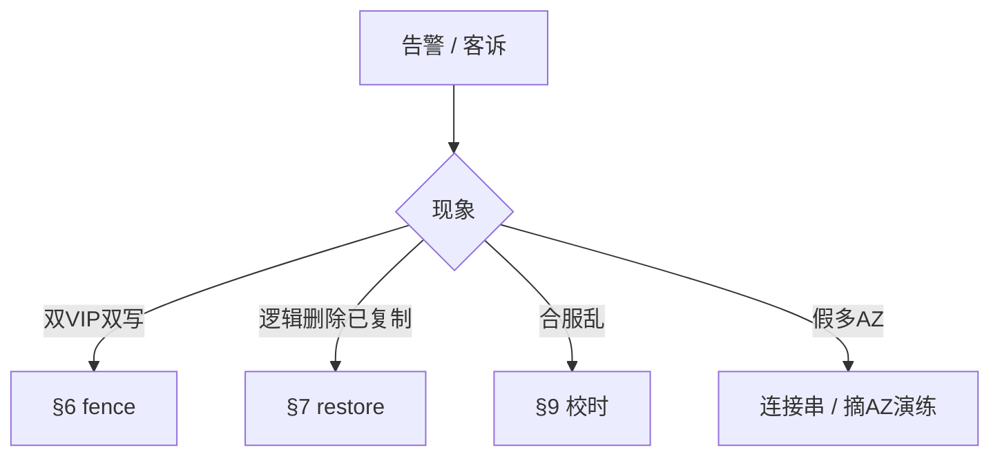

# 20｜高可用与容灾 · 练习题

先对照 [知识点](知识点.md)：**先 §2 总图，再 §3 名词，再 §6 脑裂与 §7 备份**。能讲清 RTO/RPO 时间轴再谈主备与双活。每题标了覆盖范围：

| 标记 | 含义 |
|------|------|
| **核心** | 不懂整章就没建立起来 |
| **必会** | 值班和面试都要能讲 |
| **常用** | 线上会反复碰到 |
| **常考** | 白板和追问的高频口径 |

## 本题目录

- [Q1 RTO / RPO](#q1)
- [Q2 脑裂与奇数](#q2)
- [Q3 主备 / 双活 / 两地三中心](#q3)
- [Q4 3-2-1 与 restore](#q4)
- [Q5 合服与跨区容灾](#q5)
- [Q6 探活与假活](#q6)
- [Q7 同城 MySQL HA](#q7)
- [Q8 升级回滚与切错](#q8)
- [Q9 排障分流](#q9)
- [Q10 几个 9](#q10)
- [合上书](#合上书)

---

## Q1

**★★★★★｜RTO 和 RPO 是什么？怎么用来选方案？**

**覆盖**：核心 · 必会 · 常考

**对应**：知识点 §2.1 · §4

### 场景

老板说「数据库不能丢数据，挂了半小时内要好」。有人直接画异地双活。

### 完整解答

**一句话**：先问 RTO（恢复上限）和 RPO（最多丢多少），再选热备还是备份，不要一上来画双活。

**RTO**：故障到业务恢复的上限。半小时 → 温备/自动切主够格，不必一上来全球多活。发现、到位、决策、切换、验证都算进 RTO。  
**RPO**：最多丢多少数据。「不能丢」→ 同步复制或等价，RPO≈0。

```text
  RTO≈0, RPO≈0     热备 / 同步 / 多活     最贵
  RTO 分钟, RPO 秒  异步 + 快速切
  RTO/RPO 小时     快照 + 人恢复
```

时间轴（对照 §2.1）：RPO 在故障**之前**（丢未同步/未备份），RTO 在故障**之后**（切与验证耗时）。

游戏组件举例（正式 SLO 在 [08](../../07-游戏运维专题/)）：

| 组件 | RTO | RPO | 路子 |
|------|-----|-----|------|
| 登录 | <30s | — | 无状态多副本 + LB |
| 玩家 MySQL | <5min | 0 | 同步主从 + 自动切 |
| Redis Session | <30s | 可丢一点 | Sentinel / 主从 |
| 逻辑服 | <2min | 0（状态在库） | 落库 + 拉起 |

### 再追问

99.99% 一年允许多少停机？RTO 和 MTTR 差在哪？——约 **52.6 分钟**。RTO 是承诺上限；MTTR 是历史平均。MTTR 必须明显小于 RTO。

---

## Q2

**★★★★★｜什么是脑裂？怎么防？为什么节点要奇数？**

**覆盖**：核心 · 必会 · 常考

**对应**：知识点 §6

### 场景

机房中间防火墙误拦心跳。两边 MySQL 都在写。恢复后发现两套玩家道具。有人说「再加一台 Keepalived 就有 quorum 了」。

### 完整解答

**一句话**：脑裂是分区后双写；防靠 quorum + fencing；3 节点扛 1 故障，4 节点也只扛 1，Keepalived 两台不算 quorum。

脑裂：网络分区后双方都升主、都写，恢复后数据冲突。新 RPO 变成「选哪边当真相」。

现场第一刀：`ip addr` 看同一 VIP 是否两台都有 → **立刻 fence 一台、停写**，不是让玩家重连试。

| 防法 | 要点 |
|------|------|
| Quorum | 没凑够 N/2+1 不许写 |
| Fencing / STONITH | 切之前先杀旧主电源或网 |
| VIP 唯一 | 二层里尽量一个 VIP；两节点 VRRP 仍可能双发，见 [20](../20-HAProxy与Keepalived/) |

奇数：3 节点 quorum=2，扛 1 台；4 节点 quorum=3，**也只扛 1 台**。生产 3 或 5。2 节点平票，不能当 Raft。普通主从不防脑裂。MGR 或 MHA+fencing/VIP 才有话说。

Keepalived 两台不算 quorum。心跳被挡就会双 VIP。VRRP 是 **IP 协议 112**。quorum（etcd/Raft）与 VRRP **不是同一层**（§6.4）。



### 再追问

2 节点 etcd 能不能上生产？——不能。挂 1 台就没多数，可用性还不如 1 台好懂。

---

## Q3

**★★★★★｜主备、双活、两地三中心怎么选？游戏逻辑服呢？**

**覆盖**：核心 · 必会 · 常考

**对应**：知识点 §2.2 · §5 · §9

### 场景

「战斗服也双活吧，玩家就不会掉线了。」内存里有房间状态。老板还要「两地三中心等于双活」。

### 完整解答

**一句话**：无状态可双活；有状态内存房间默认主备或状态外置；两地三中心异地脚是灾备不是日常双写。

无状态（登录 API）→ 双活 / 多副本，LB 摘掉一台即可。  
有状态写（DB、内存房间）→ **默认主备或单活 + 状态外置**。双写同一房间，冲突比掉线更惨。

**主备 Active-Passive**：同一时刻一份写；切换有缝；冲突少——有状态默认。

**两地三中心**：同城两个生产中心抗 AZ/机房；异地第三中心是**灾备**，通常异步、不日常双写。不要说成异地双活。切异地是城级事故或演练，RPO=复制/备份落后。

同步换 RPO≈0；异步换切换速度。`Seconds_Behind_Master` 是证据。切后缺 5 分钟充值，常是异步 RPO 兑现，不是「切坏了」。

### 再追问

异地多活呢？——多城同时写，RTO/RPO≈0，成本极高。数据库主主默认不要。

---

## Q4

**★★★★★｜3-2-1 是什么？只备份不 restore 行不行？切主救得了误 DELETE 吗？**

**覆盖**：核心 · 必会 · 常用

**对应**：知识点 §7

### 场景

备份任务天天绿。勒索加密了生产盘。对象存储里的备份从来没人试过 restore，密钥也不在手边。另一边有人 `DELETE` 没 WHERE，主从都复制了，值班想再切一次主。

### 完整解答

**一句话**：3-2-1 要异地一份；只 backup 不 restore 演练等于没有备份；误 DELETE 走 restore，切主没用。

**3** 份数据，**2** 种介质，**1** 份异地（或另一账号）。同盘 snapshot 不算 3；同账号同地域的桶，火灾和账号被盗一起没。

只 backup 成功 **不行**。必须定期 restore 到空环境，跑校验，记下真实 RTO。游戏库回档步骤在 [08](../../07-游戏运维专题/)。主机还要 `/etc`、crontab、证书；密钥受控存放。



PPT 写 RPO=5 分钟、演练却 3 小时才拉起——那才是真 RTO。

### 再追问

高峰能切主、能合服叠加强更吗？——变更窗口也是可用性。高峰不切主；合服当晚不要叠不相关强更。

---

## Q5

**★★★★☆｜合服和跨区容灾差在哪？**

**覆盖**：必会 · 常用 · 常考

**对应**：知识点 §9.3 · §11

### 场景

合服当晚排行乱，有人当脑裂去抢 VIP。另一边 Region 挂了，登录 DNS 还打进死区。

### 完整解答

**一句话**：合服是运营排期合并两套数据；跨区容灾是城级故障切流——不是同一种切换，回滚靠合服前快照不是 VIP。

| | 合服 | 跨区容灾 |
|--|------|----------|
| 触发 | 运营排期 | 城级故障 / 演练 |
| 数据 | 两套合并都要留下 | 以灾备可恢复点为准 |
| 战斗 | 常停服合并 | 房间通常散了，重连 |
| 门禁 | 两边时钟 **>1s 停**（[25](../25-NTP与时间同步/)） | 两边本就应同一 NTP |
| 回滚 | 合服前快照 | 切错了是新的数据决策 |

跨区：无状态登录可 DNS 切（RTO 可 <30s）；MySQL 跨区异步，接受分钟级 RPO；逻辑服状态落库，不要内存双活跨城。切流要演练：连接串是否绑死 AZ、防火墙是否只放同 AZ、TTL 是否还打进死区。

### 再追问

合服失败靠再切一次 VIP 吗？——不。靠合服前快照回滚，不是 HA 脚本。

---

## Q6

**★★★★☆｜健康检查为什么连续失败才切？/health 返回 200 够吗？**

**覆盖**：必会 · 常用

**对应**：知识点 §8

### 场景

探活 1 秒一次、失败一次就摘节点。活动期间抖动。Nginx 进程还在但不 accept。VIP 在主，玩家全超时，监控说「主还活着」。

### 完整解答

**一句话**：探活连续 3～5 次再切；`/health` 只 200 不够，必须碰到登录依赖。

偶发丢包、GC ≠ 死。**连续 N 次（3～5）** 再切。超时 < 间隔。切回观察一段时间，`nopreempt` 避免振荡。

`/health` 只 `return 200`：进程在、DB 已死。探活要碰到登录依赖。Keepalived 默认只保证 VRRP 进程，要 `track_script`；HAProxy 的 `httpchk` 才碰到 HTTP。检查太重会把 DB 打满。

| 探活 | 问题 |
|------|------|
| `killall -0` | 假活：不 accept 也过 |
| 静态 200 | DB 挂了也 200 |
| `/health/deep` 查库 | 才像真探活 |

VIP 漂移会断存量（[18](../18-LVS与四层负载均衡/)、[20](../20-HAProxy与Keepalived/)）。不要答完全无感。协议是 IP **112**。切之前先 fencing，避免双写窗口。

### 再追问

主恢复了会不会抢回来？——看 `nopreempt`。抢回是第二次闪断。

---

## Q7

**★★★★☆｜给玩家 MySQL 画一个同城 HA**

**覆盖**：必会 · 常用

**对应**：知识点 §5 · §10.3

### 场景

RPO=0，RTO 两分钟内。单机房已经不够。有人提议两台 Keepalived + 异步复制「先上了再说」。

### 完整解答

**一句话**：同城同步主从 + 自动切主（MHA/MGR/托管），逻辑服状态落库不要内存双活。

同城两 AZ 主从，**同步复制**。写走主，读可走从。备份打从库。切主用 MHA / 托管自动故障转移，不要人肉 DNS 当唯一手段。切之前要有 fencing 语义。

| 路子 | RTO | RPO |
|------|-----|-----|
| 托管多 AZ | 常 <30s | 0 |
| MHA + VIP | 1～2min | 0～秒（看半同步） |
| MGR | <30s | 0，带多数派防脑裂 |

异步却承诺 RPO=0 → 方案档错了。Keepalived 两台解决 VIP，**不自动等于**防脑裂 quorum。

逻辑服内存状态不要和 DB 同一套双活。状态落库或接受「这台挂了房间散了、玩家重连」。

验收：摘过 AZ、restore 过，PPT 上的 RTO 才算数。

### 再追问

延迟大怎么办？——并行复制、拆大事务、从库升配。云盘和跨 AZ 网络在 [07](../../06-云平台/)。

---

## Q8

**★★★★☆｜升级失败怎么回滚？切错了怎么办？**

**覆盖**：必会 · 常用

**对应**：知识点 §10.4 · §11

### 场景

控制面刚升完要三台镜像一起改回去。数据库升完发现写坏了。有人 VIP 抢回「恢复原主」。

### 完整解答

**一句话**：数据目录升过可能不能换回旧二进制，回滚靠升级前快照；切错且新主已写是新的数据决策。

有 quorum 的组件滚动，保多数派；先升备。数据目录升过可能 **不能靠换回旧二进制**，回滚靠升级前快照 restore（etcd 04-02 同口径）。

切错且新主已写：回滚是一次**新的数据决策**，不是撤销。VIP 抢回二次闪断。没有升级前快照 = 没有回滚。合服回滚用合服前快照，不要叠切主。

### 再追问

混沌工程第一步就上生产随机杀节点吗？——先预发把切换和告警跑通，再生产小剂量。验证 RTO，不是表演勇气。

---

## Q9

**★★★★☆｜给出现象，你先走哪条路？**

**覆盖**：必会 · 常用

**对应**：知识点 §11

### 场景

四个工单：① 双 VIP 两边写充值 ② DELETE 没 WHERE 主从都复制了 ③ 合服排行乱 ④ 只 kill 过本机 MySQL，从没摘过 AZ。

### 完整解答

**一句话**：双 VIP 走脑裂 fence；误 DELETE 走 restore；合服乱查时钟；kill 本机 MySQL 不等于多 AZ HA。

| # | 走哪条 | 不要做 |
|---|--------|--------|
| ① | 脑裂：fence、下一台、停写 | 重启逻辑服；让玩家重连试 |
| ② | restore / 回档（08） | 再切一次主 |
| ③ | 时钟门禁（19）、合并顺序 | 当 HA 去抢 VIP |
| ④ | 摘 AZ：复制是否真跨 AZ、DNS/LB、连接串、防火墙 | 以为本机 kill = 多 AZ |



现场先分：入口（[18](../18-LVS与四层负载均衡/)）、探活假活、复制落后、备份能否还原、是不是合服而不是容灾。

### 再追问

托管了这章能跳过吗？——不能。RPO、谁 restore、假多 AZ、自己的变更窗口仍是你的。

---

## Q10

**★★★☆☆｜可用性公式怎么用？几个 9 怎么换算？**

**覆盖**：常用 · 常考

**对应**：知识点 §4.4 · §13

### 场景

一年只挂一次，但恢复用了 8 小时。SLA 写着 99.99%。内部工具也写 99.99%。

### 完整解答

**一句话**：99.99% ≈ 52.6 分钟/年；修得慢次数少也救不了 SLA，RTO 是承诺 MTTR 是历史。

可用性 ≈ MTBF / (MTBF+MTTR)。一年一次、修 8 小时，远超 **52.6 分钟**。故障次数少不能补救修得慢。口算尺子：`365×24×60=525600`。

| SLA | 年停机约 |
|-----|----------|
| 99% | 87.6 小时 |
| 99.9% | 8.76 小时 |
| 99.95% | 4.38 小时 |
| 99.99% | 52.6 分钟 |
| 99.999% | 5.26 分钟 |

游戏整体常见 **99.95%～99.99%**，登录支付按 99.99% 谈。内部 99.9% 和对外 SLA 不要写成同一个数：对外应松于内部 SLO，留 error budget（04-18 / 08）。

### 再追问

Keepalived 在 HA 里扮演什么？——VRRP 占 VIP；Backup 超时发 GARP。心跳通 ≠ nginx 活着。conf 在 **24**。两台不算 quorum。

---

## 合上书

- [ ] **§2 总图**：能默画定档→形态→脑裂/探活→备份→定责；RPO 在故障前、RTO 在故障后
- [ ] 能说出 RTO/RPO/MTTR；99.99% ≈ 52.6 分钟；525600 尺子
- [ ] 能对比主备/双活/两地三中心；有状态不内存双活；Active-Passive = 一份写
- [ ] **§6**：脑裂、quorum 3/4/5、Keepalived 不是多数派、IP 112、现场 fence
- [ ] **§7**：3-2-1 + restore 演练；切主救不了误 DELETE
- [ ] **§8**：探活连续 3～5 次；/health 碰依赖；fencing 在切之前
- [ ] 能分开合服与跨区容灾；高峰不切主、合服不叠强更
- [ ] **§11 定责**：双 VIP / 切后缺数据 / 合服乱 / 演练债 —— 各走哪条
