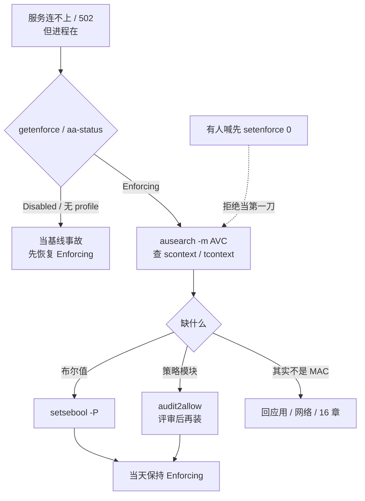
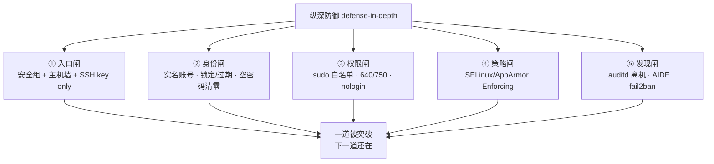
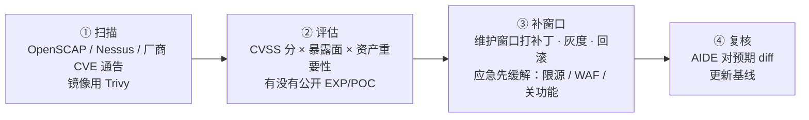
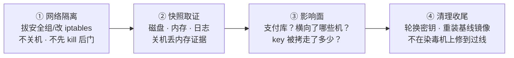
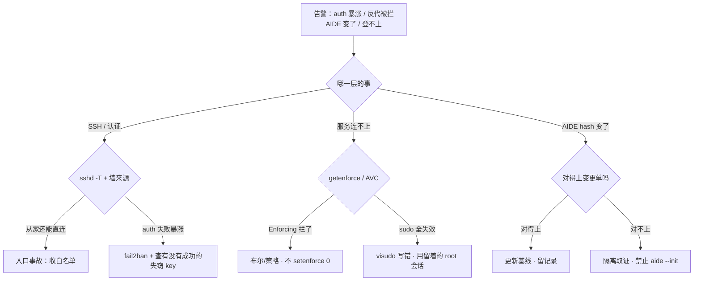

# Linux 安全加固

> 凌晨两点告警炸群：`/var/log/secure` 一分钟上千条 Failed password，有人喊「把 22 改成 2222」，有人发 `setenforce 0` 让反代先通，有人顺手给 deploy 开了 `NOPASSWD: ALL`——每一刀都在拆自己的墙。
> **本章回答**：一台裸机从出厂到扛得住一次入侵的一生——少开门、管住人、收住权、留下痕，出事了怎么收场。
> **不讲**：文件权限与 SUID/特殊位原理 → [25](../25-用户权限与特殊位/)；SSH 协议与 sshd 深配 → [26](../26-SSH与远程访问/)；五链四表与 conntrack → [17](../17-iptables与conntrack/)；sysctl 机制与落盘 → [24](../24-内核参数与sysctl/)；人从哪进生产的通道治理 → [28](../28-堡垒机与跳板机/)。

**标记**：🎯重点 · 🔥难点 · ⭐常考 · 🔧实操

---

## 一、一张图：一台裸机的加固一生

> 🎯 **一句话**：加固是一条纵深防御链：减面 → 管人 → 收权 → 锁门 → 筑墙 → 第二道墙 → 留痕 → 闭环。


**读图**：

- 主角是一台机器的一生：出厂裸机沿着十个阶段变成加固机；每个阶段都是一道闸，**任何一道被单独突破，下一道还在**——这就是纵深防御（defense-in-depth）。
- 十个阶段收成三层记：**入口层**（①④⑤，谁能连上）、**权限层**（②③⑥，进来能干什么）、**发现层**（⑧，事后对不对得上人）；⑦⑨⑩ 是贯穿的治理与兜底。
- 值班的照妖镜按层分：入口看 `sshd -T` 和 `iptables -L`，权限看 `sudo -l` 和 `getenforce`，发现看 `ausearch` 和 `aide --check`——**先分哪一层，再动手**。

> 🎯 **值班签名**：auth 失败暴涨 / 反代被拦 / AIDE hash 变了——先分**哪一层**；别先改端口、别先 `setenforce 0`、别先 `aide --init`。

---

## 二、减面：少开门——服务、端口与 SUID ⭐

> 🎯 **一句话**：攻击面（attack surface）= 能被打的入口总数；先减面，再给剩下的门装闸。

> 💡 **打个比方**：一台机器像一栋楼，每个监听端口是一扇门店。保安（防火墙、fail2ban）再能干，开一百家店也盯不过来——先把没生意的店关掉，保安才看得过来。

**减面三刀，一刀比一刀深：**

1. **关服务**：`systemctl list-unit-files --state=enabled` 列出开机自启，逐个问「这台机器要它干嘛」。经典该关：`avahi-daemon`（局域网发现）、`cups`（打印）、`bluetooth`、`rpcbind`（没有 NFS 时）、`postfix`（不对外发信时）。
2. **关端口**：`ss -tulpn` 的每一行监听都要答得上「**谁在听、给谁服务**」；答不上来的先查包名再决定关。业务口放行交给墙（六节），但**墙挡住 ≠ 可以留着监听**——服务还在就有本地提权面。
3. **清 SUID**：SUID（Set User ID，运行时以**文件属主**身份执行）二进制是提权后门的温床；`passwd` 那几个是合法的，**多出来的陌生文件先隔离再查**。原理与 `/4000` 写法在 [25](../25-用户权限与特殊位/)，本章只背结论命令。

> 🔍 **现场**：新机验收/例行巡检的减面三连：

```bash
systemctl list-unit-files --state=enabled | head -20
# abrt-ccpp.service        enabled   ← 没人在用就关
# avahi-daemon.service     enabled   ← 游戏服基本用不上
ss -tulpn
# Netid State  Local Address:Port  Process
# udp   UNCONN 0.0.0.0:5353        users:(("avahi-daemon",pid=812,fd=15))   ← 同上，一条龙关
find /usr/bin /usr/sbin /tmp /data -perm /4000 -ls 2>/dev/null
# 12 3421 -rwsr-xr-x 1 root root 74192 /tmp/pkexec2   ← /tmp 下出现 SUID = 大概率被入侵，隔离！
```

> ⚠️ **别混**：减面是**少开门**（服务不跑、端口不听），防火墙是**门上加闸**（服务还在、包进不来）——两层都要，墙不能替代减面：一个没人维护的老服务挂在 127.0.0.1 上，一次 SSRF 就能摸到。

> 📝 **面试**：「加固第一步是什么？」——**最小化（minimization）**：关掉不需要的服务和端口、清理多余 SUID，把攻击面减到业务必需的最小集合；然后再谈 SSH、防火墙、MAC 这些闸门。先减面后装闸，顺序反了就是给一百扇门挨个配保安。

---

## 三、管人：账号治理——每个人一把实名钥匙 ⭐🔧

> 🎯 **一句话**：一人一号、密码有策略、失败会锁、过期要清；共享账号等于没审计。

### 密码与账号策略：/etc/login.defs

**`/etc/login.defs`** = 登录相关的全局默认策略文件，管「新用户/新密码」的底线（对已存在密码要用 `chage` 单独改）：

```text
PASS_MAX_DAYS  90     # 密码最长 90 天换一次
PASS_MIN_DAYS  2      # 两次改密至少隔 2 天，防改回旧密码
PASS_MIN_LEN   8      # 最短长度（配合 pam_pwquality 才真正生效）
ENCRYPT_METHOD SHA512 # 影子口令哈希算法，别再是 MD5
```

**失败锁定（fail 系参数）**：连续登录失败 N 次锁账号一段时间，由 **PAM**（Pluggable Authentication Modules，可插拔认证模块）的 `pam_faillock` 实现（RHEL 8+；老的 `pam_tally2` 已废弃），配在 `/etc/security/faillock.conf`：

```text
deny = 5            # 失败 5 次锁定
fail_interval = 900 # 在 15 分钟窗口内计数
unlock_time = 600   # 锁 10 分钟自动解
```

### 账号的四种状态：正常、锁定、过期、删除

```bash
usermod -L deploy      # 锁定：shadow 第二列加 !，密码验证必失败
usermod -U deploy      # 解锁
chage -M 90 deploy     # 最长 90 天必须换密码
chage -E 2026-12-31 o  # 到期日之后账号不可登录（外包/临时账号标配）
usermod -s /sbin/nologin game   # 业务账号不给交互 shell
chage -l deploy        # 看这个号的策略全貌
```

> ⚠️ **别混**：**锁定**（`usermod -L`，密码失效但账号还在，可恢复）≠ **过期**（`chage -E`，到点自动不可登录，适合外包）≠ **删除**（`userdel`，uid 可能被新账号复用，取证场景先锁定别删）。**取证时锁定，治理时过期，确认无用再删。**

### 空密码扫描 ⭐

空密码 = 敲回车就进门，等保扫描必查：

```bash
awk -F: '($2 == "") {print $1}' /etc/shadow      # 第二列为空 = 空密码，必须立刻 passwd 置密或锁定
passwd -S deploy
# deploy LK 2026-08-30 0 90 7 -1   ← LK=锁定 / NP=空密码(事故!) / PS=有密码
```

`/etc/shadow` 第二列速记：`$6$...` 有密码（SHA512）、`!`/`*` 锁定或不可密码登录、**空字符串 = 空密码 = 事故**。长期不登录的账号（如上次登录一年前）一律 `usermod -L` 锁掉；离职回收是**当天**的事，通道侧全链路见 [28](../28-堡垒机与跳板机/)。

> 🔍 **现场**：安全组说「这台机器账号策略不合格」，五分钟出证据：

```bash
grep -E '^PASS_(MAX|MIN)' /etc/login.defs
grep -E '^(deny|unlock_time)' /etc/security/faillock.conf 2>/dev/null
awk -F: '($2==""){print $1}' /etc/shadow   # 输出为空 = 没有空密码
last -a | head        # 最近登录；一年前的日期 = 疑似僵尸账号
```

> 📝 **面试**：「账号治理怎么答？」——一人一号实名、`login.defs` 定密码策略（90 天/SHA512）、`pam_faillock` 失败 5 次锁 10 分钟、空密码零容忍、外包账号 `chage -E` 带到期、业务账号 `nologin`、离职当天回收。收尾补一句：**共享 ops 账号等于把审计全拆了**。

---

## 四、收权：sudo 白名单与文件底线 ⭐

> 🎯 **一句话**：sudo 白名单到具体命令；`NOPASSWD: ALL` 等于把白名单整个拆掉。

> 💡 **打个比方**：sudo 白名单像**酒店房卡**——deploy 的卡只能开 808 这间房（restart nginx）。`sudo su -` 是拿万能钥匙开整栋楼；`NOPASSWD: ALL` 是把钥匙架挂在 anybody 门口还贴了张「随时取用」。

```text
# /etc/sudoers（必须 visudo 编辑）
Cmnd_Alias NGINXCTL = /bin/systemctl restart nginx, /bin/systemctl reload nginx
deploy ALL=(root) NGINXCTL
deploy ALL=(root) !/bin/su, !/bin/bash, !/bin/sh    ← 显式禁 shell 逃逸
Defaults timestamp_timeout=5    # sudo 缓存 5 分钟，别默认 15
```

活动周有人喊「每次重启 nginx 都要找人」，要求写 `deploy ALL=(ALL) NOPASSWD: ALL`——**这句话一旦写上，常常永远忘收回**。正确姿势是临时要 root 走审批 + 堡垒机限时授权 + 录屏（[28](../28-堡垒机与跳板机/)）。

> 🔍 **现场**：审计「deploy 到底能干什么」，看**实际生效**的权限，不是看文档：

```bash
sudo -l -U deploy
# User deploy may run the following commands on prod-game-01:
#     (root) /bin/systemctl restart nginx, /bin/systemctl reload nginx
#     (root) !/bin/su, !/bin/bash, !/bin/sh
# ← 看到 (ALL) NOPASSWD: ALL = 加固等于没做
```

**visudo 写错 = sudo 全体失效**，逃生三条：① 改之前留一个已登录 root 会话或云 console；② 只用 `visudo`（自带语法检查）；③ 改完 `sudo -l -U deploy` 核对。**不要重启碰运气**——重启不会修好语法错误的 sudoers。

### 文件底线（原理在 25，这里只留结论）

- 配置 `640`、目录 `750`；**`chmod 777` 谁都能改，被植入后门无法追责**——「先跑起来再说」是事故开头。
- `umask` 常见 `022`（新文件不给 other 写）；业务进程用独立低权账号跑，`useradd -r -s /sbin/nologin game`。
- 进程侧还能用 systemd 收紧：`User=`、`NoNewPrivileges=yes`（防提权）、`ProtectSystem=strict`、`CapabilityBoundingSet=` 收窄——细节见 [11](../11-Systemd与服务管理/)。这是权限层的**补充**，不替代 sudo 白名单，也不替代 MAC。

> ⚠️ **别混**：`!/bin/bash` 这类**黑名单条目挡不住所有逃逸**（能 `less`/`vim`/`find -exec` 的白名单同样能弹 shell）——白名单的正解是「只放业务必需的二进制和参数」，黑名单只是第二道网，别当主防线。

> 📝 **面试**：「sudo 怎么管？」——Cmnd_Alias 白名单到具体二进制和参数、显式禁 su/bash/sh、`timestamp_timeout=5`、每人独立账号、`visudo` 编辑并留 root 会话逃生、临时 root 走审批不写 NOPASSWD。

---

## 五、锁门：SSH 加固清单 ⭐

> 🎯 **一句话**：核心四件——禁密码、禁 root、限来源、只用 key；改端口只是减扫描噪音。

协议原理、算法与逐项深配在 [26](../26-SSH与远程访问/)；本章只留**清单和验收手法**（产品化入口在 [28](../28-堡垒机与跳板机/)）：

```text
# /etc/ssh/sshd_config.d/99-hardening.conf（按发行版也可写主文件）
PermitRootLogin no            # 禁 root 直登——审计才能对到人
PasswordAuthentication no     # 关密码通道——撞库面直接消失
PubkeyAuthentication yes
KbdInteractiveAuthentication no
AllowUsers deploy@10.0.0.0/8  # 谁 + 从哪（堡垒机网段）
MaxAuthTries 3
LoginGraceTime 30
ClientAliveInterval 300
ClientAliveCountMax 2
X11Forwarding no              # 缩小「登上一台再当跳板」的面
AllowTcpForwarding no         # 业务机不开转发，隧道政策在 28
PermitTunnel no
```

改端口（`Port 2222`）只是让 `/var/log/secure` 少刷一点——扫描器照样全端口扫到。**真正让撞库失效的是关密码通道；真正让审计对到人的是禁 root；真正让公网打不到的是墙 + AllowUsers 限 CIDR。**

> 🔍 **现场**：看**生效值**（不是配置文件里被注释的那行），改完先语法检查再 reload：

```bash
sshd -T | grep -E 'permitrootlogin|passwordauthentication|pubkeyauthentication|allowusers|maxauthtries|clientaliveinterval'
# permitrootlogin no
# passwordauthentication no        ← 这两个 no 是底线
# pubkeyauthentication yes
# allowusers deploy@10.0.0.0/8

sshd -t && systemctl reload sshd   # -t 语法检查；reload 不掐现有会话
```

| `sshd -T` 字段 | 合格 | 事故 |
|------|------|------|
| `permitrootlogin` | `no` | `yes` = 审计分不清人 |
| `passwordauthentication` | `no` | `yes` = 撞库面 |
| `allowusers` | 带 `@CIDR` | 无限制 = 全世界可试 key |
| `maxauthtries` | `3` | 默认 `6` = 撞库窗口大 |
| `clientaliveinterval` | `300` | `0` = 僵死会话占 fd |

**改 sshd 不锁死自己五步**：① 留 console / 云 VNC 后路；② `sshd -t` 过了再动手；③ **reload** 不是 restart（不掐救命会话）；④ **另开一条新会话**验证——当前 ESTABLISHED 会话骗得了你；⑤ 防火墙同步新端口。

**key 被盗怎么办**：立刻从 `authorized_keys` 拿掉该公钥 → 堡垒机侧吊销 → 轮换所有可能被拷走的 key → 查 auditd / 堡垒机录像。**不要只「改 passphrase」却让旧公钥还留在 200 台机器上**——密码通道本来就该是关的，改密码救不了失窃 key。

> ⚠️ **别混**：改端口治的是**噪音**（扫描日志多少），认证方式治的是**撞库面**（能不能被试出来）——两件事，别拿前者当加固完成。

> 📝 **面试**：「SSH 加固说哪几件？」——禁密码、禁 root、AllowUsers 限堡垒网段、key only、`sshd -T` 看生效值、`sshd -t` 后 reload 并另开会话验证。追问「改端口吗」——改，但只当减噪音，不当核心。

---

## 六、筑墙：防火墙白名单化 ⭐

> 🎯 **一句话**：默认 DROP，白名单放行；云安全组第一层，主机墙第二层。

五链四表、`-v` 计数、NOTRACK 这些**怎么写规则**在 [17](../17-iptables与conntrack/)；本章只讲**策略与验收**：看 policy、看来源、先放 ESTABLISHED、另开会话验、持久化。

```text
最小化清单：
1. INPUT 默认 DROP
2. 先放 ESTABLISHED,RELATED（回包总闸）
3. SSH 只放堡垒机 CIDR，不要公网 22
4. 业务口只放 LB / 内网上游，不对 0.0.0.0/0
5. 非路由器：ip_forward=0、FORWARD DROP
6. 出站也收：NTP/DNS/制品库显式放，陌生外连拒绝或告警
7. 改完另一条会话验证
8. iptables-save / firewalld 持久化（防 reboot 丢，细节 17）
```

> 🔍 **现场**：验收就看 `policy` 和 `source` 两列：

```bash
iptables -L INPUT -n -v --line-numbers | head
# Chain INPUT (policy DROP 0 packets, 0 bytes)   ← policy DROP 才算白名单化
# num   pkts bytes target     prot opt in out source        destination
# 1      12M  890M ACCEPT     all  --  *  *   0.0.0.0/0    0.0.0.0/0   state RELATED,ESTABLISHED
# 2      456  27360 ACCEPT    tcp  --  *  *   10.0.0.0/8   0.0.0.0/0   tcp dpt:2222
#                              ↑ SSH 来源是堡垒网段，不是 0.0.0.0/0
```

**从家里还能直连业务机 = 入口事故**——是安全组/主机墙没收（白名单没做），不是「sshd 配错一行」这么轻；当事故处理，收白名单，不是口头提醒「别直连」。云安全组在虚拟化层、主机墙在 guest 内核，**两层先后串联**（安全组产品面 → [06-01](../../06-云平台/01-云网络与安全/)）：哪层拒都表现为不通，优先收安全组，不要再在 ECS 里堆第二套本地墙「求稳」——健康检查源、CDN 回源网段最容易漏放。

改墙防锁死六步（与 [17](../17-iptables与conntrack/) 同口径）：留 console → 先放 `ESTABLISHED,RELATED` → 用 `-I`（不是 `-A`）放行管理网段 → 再写 DROP → **另开新 ssh 验证** → save 持久化。

> ⚠️ **别混**：**当前会话还在 ≠ 没锁死**——它是 ESTABLISHED，靠总闸活着；新开连接才走新规则。验证必须另开一条新 ssh，当前窗口不能当证据。

---

## 七、拧内核旋钮：安全向 sysctl 🔥

> 🎯 **一句话**：安全向 sysctl 收的是「信息泄露面」和「被当跳板的面」；和性能旋钮分开两份文件。

sysctl 的机制（`/etc/sysctl.d/`、`sysctl --system` 加载顺序、容器里改了不算）在 [24](../24-内核参数与sysctl/)；本章管**该拧哪些安全旋钮**：

```text
# /etc/sysctl.d/99-security.conf
net.ipv4.conf.all.accept_redirects = 0      # 不听 ICMP 重定向——防被骗改路
net.ipv4.conf.default.accept_redirects = 0
net.ipv4.conf.all.accept_source_route = 0   # 不收源路由包——防绕路伪造
net.ipv4.tcp_syncookies = 1                 # SYN Flood 缓解
net.ipv4.ip_forward = 0                     # 非路由器不开转发——防被当跳板
net.ipv4.conf.all.rp_filter = 1             # 反向路径校验——反源地址伪造

kernel.kptr_restrict = 2                    # 内核指针对所有人打码（连 root 默认也只见 0）
kernel.dmesg_restrict = 1                   # dmesg 内核日志仅 CAP_SYSLOG 可读
kernel.yama.protected_symlinks = 1          # /tmp 竞态软链提权防护
kernel.yama.protected_hardlinks = 1         # 硬链提权防护
kernel.perf_event_paranoid = 2              # 收紧 perf_event（防侧信道摸内核布局）
```

**为什么是这几个**：攻击者摸清内核地址布局（`/proc/kallsyms`、`dmesg` 泄露的地址）是提权漏洞利用的**前置步骤**——`kptr_restrict=2` 后 `cat /proc/kallsyms` 全是 `0000000000000000`；`dmesg_restrict=1` 后普通用户 `dmesg` 直接 `dmesg: read kernel buffer failed: Operation not permitted`（**排障记得 sudo dmesg，别当成日志坏了**）。yama 两个参数堵的是「往 /tmp 塞恶意软链/硬链等特权程序踩坑」的老提权路数。

> ⚠️ **别混**：`tcp_syncookies=1` 只是 **SYN Flood 缓解**，不是防火墙替代品——墙管「谁能连」，syncookies 管「半连接队列被打满时握手还能不能完成」（队列机制 → [12](../12-网络栈与Socket/)）。同理**安全 sysctl（redirects/kptr）和性能 sysctl（somaxconn/tw_reuse）是两份文件**（`99-security.conf` vs `99-web.conf`），别混成一份「万能优化清单」（翻车现场 → [24](../24-内核参数与sysctl/)）。

**禁 ping（`icmp_echo_ignore_all=1`）是可选项不是必开项**——开了排障和云探活都会疼；扫描项书面风险接受即可。改完 `sysctl --system` 生效并确认落盘方式（[24](../24-内核参数与sysctl/)）。

---

## 八、第二道墙：SELinux 与 AppArmor 🔥

> 🎯 **一句话**：DAC 问「属主同不同意」，MAC 问「策略允不允许」——root 也拦。

> 💡 **打个比方**：DAC 像**自家门锁**——房主同意就能进，root 是万能钥匙；MAC 像**大厦门禁制度**——就算你是房主本人，规章说机房只有运维域进程能进，保安照样拦你。两套系统各管各的，一把钥匙开得了锁、开不了制度。

### DAC vs MAC ⭐

| 对比 | DAC | MAC |
|------|-----|-----|
| 谁说了算 | 属主/组/other 的 rwx 位 | 内核里的强制策略 |
| root | 通常全能 | **仍可能被拦** |
| 典型命令 | `chmod` / `chown` | `getenforce` / `ausearch -m AVC` |
| 拦了怎么修 | 改权限位 | 补策略/布尔值，**不是关 MAC** |

**一例钉死（面试白板题）**：Nginx 反代连不上游 8080，本机 `curl 127.0.0.1:8080` 通——进程以 `nginx` 用户跑（**DAC 已过**），但 SELinux 看**标签**：`httpd_t` 域默认不允许 `name_connect` 到任意端口 → **AVC denied**。你的 shell 不是 `httpd_t`，所以 curl 通、Nginx 502——「502 但进程在」的经典 MAC 签名。

### SELinux 三模式与 AppArmor

**SELinux**（Security-Enhanced Linux，标签 + 策略模型，RHEL/CentOS/Rocky 系）三模式：

- **Enforcing**：拦，并记 AVC——**生产目标状态**。
- **Permissive**：只记不拦——排查窗口可用，**当天必须回 Enforcing**；它不是「开了 SELinux 在防护」。
- **Disabled**：连审计都没有，等于拆除——**不要写进生产镜像**。

**AppArmor**（路径 + profile 模型，Ubuntu/Debian 系）对等三态：`enforce`（拦）/ `complain`（只记）/ 无 profile（不受控）。

| 对比 | SELinux | AppArmor |
|------|---------|----------|
| 模型 | 标签（label）+ 策略 | 路径（path）+ profile |
| 常见系统 | CentOS / RHEL / Rocky | Ubuntu / Debian |
| 看状态 | `getenforce` / `sestatus` | `aa-status` |
| 拦了记在哪 | AVC（`ausearch -m AVC`） | `dmesg` / journal |
| 临时放行排查 | `setenforce 0`（Permissive，当天回） | `aa-complain`（当天回 enforce） |

> ⚠️ **别混**：Permissive ≠ Enforcing——Permissive 还能看到 AVC（排查窗口），Disabled 连审计都没有。`setenforce 0|1` 只切 Enforcing/Permissive，**回不到 Disabled**（Disabled 要改配置重启）。

### 被拦了怎么修（先查 AVC，不关墙）⭐🔧

> 🔍 **现场**：反代 502、curl 通、有人发 `setenforce 0`——拒绝当第一刀，走这三步：

```bash
getenforce
# Enforcing

ausearch -m AVC -ts recent | tail -3
# type=AVC msg=audit(...): avc:  denied  { name_connect } for  pid=1234 comm="nginx"
#   scontext=system_u:system_r:httpd_t:s0      ← 谁想干：httpd_t 域的进程
#   tcontext=system_u:object_r:http_port_t:s0  ← 碰什么：端口对象
#   tclass=tcp_socket permissive=0

setsebool -P httpd_can_network_connect on     # 缺布尔值：允许 httpd 域向外连接
getsebool httpd_can_network_connect
# httpd_can_network_connect --> on
```

修法优先级：**布尔值（`setsebool -P`）→ 评审后 `audit2allow` 生成策略模块（不要盲装，等于把能力写进策略）→ 临时 Permissive 只给这台、只给排查窗口、当天回**。标签看不懂不要瞎 `chcon -R`——先 `getsebool -a | grep httpd` 找布尔，恢复默认上下文用 `restorecon -Rv <path>`：

```bash
ls -Z /var/www/html | head -2
# system_u:object_r:httpd_sys_content_t:s0 index.html   ← 文件类型标签
ps -eZ | grep nginx | head -2
# system_u:system_r:httpd_t:s0            nginx         ← 进程域标签
```



**读图**：入口先分三态——Disabled 本身就是事故；Enforcing 才进 AVC 排查；确认不是 MAC 就回应用/网络层。所有修法都以「**当天保持 Enforcing**」为终点，`setenforce 0` 永远不在第一刀里。

### 容器场景的现实

K8s 节点上 SELinux 常见被关——container runtime 与 CSI、旧内核的兼容性问题，这是**现实妥协**，不是最佳实践。两条纪律不变：① **不能拿「已经上 K8s」当关 SELinux、开密码登录的理由**——容器隔离（PSS/RBAC/NetworkPolicy → [03-13](../../03-Kubernetes/13-RBAC与安全/)）不替代宿主机 MAC，宿主机被拿下，容器隔离只是减速带；② 能保持 Enforcing 的宿主机尽量保持，容器内再套一层是加分不是替代。

### 收束：纵深防御——五道闸一张图 🎯⭐

到这里权限栈全齐了。面试问「生产机怎么加固」，答的就是这张图——**五道闸，各拦一类攻击，任何一道单独被突破，下一道还在**：



**读图**：横着按「攻击者要过的关」排——先连上（①）、再登录（②）、再提权（③）、再横向（④）、干完还想不留痕（⑤ 偏偏留了）。背的时候按三层分组：**入口（①）· 权限（②③④）· 发现（⑤）**，每层给一个第一刀命令：`sshd -T`+`iptables -L`、`sudo -l`+`getenforce`、`ausearch`+`aide --check`。

> ⚠️ **别混**：五道闸**不保证**「都过了就不被入侵」——0day 应用层漏洞从 80 端口直进业务进程，五道闸管的是**系统侧与提权侧**；应用与漏洞治理是十节的事。反过来也成立：**任何一道都不是银弹**，砍掉哪一道都得在别处加倍还。

> 📝 **面试**：按「**三层五闸**」背——入口（墙+SSH）、身份（实名+锁定）、权限（sudo+文件+MAC）、发现（auditd+AIDE+fail2ban），每道闸一句「拦什么、第一刀查什么」。追问「哪道最重要」答纵深：**没有最重要，只有最薄弱**。

---

## 九、站岗：fail2ban、auditd 与文件完整性 ⭐🔥

> 🎯 **一句话**：事中挡噪音、事后对到人、出事能发现——发现层必须离机。

### fail2ban：挡的是扫描，不是失窃的 key

**fail2ban** = 盯日志 + 正则匹配失败 + 自动封 IP 的看门程序：tail 认证日志 → `findtime` 窗口内失败满 `maxretry` 次 → 调 iptables/nftables 封 `bantime` → 到期解封。

```ini
# /etc/fail2ban/jail.local
[sshd]
enabled  = true
maxretry = 3        # 3 次失败
findtime = 600      # 10 分钟窗口内
bantime  = 3600     # 封 1 小时
```

> 🔍 **现场**：看它有没有在干活：

```bash
fail2ban-client status sshd
# |- Currently failed: 2
# |  Total failed:     1840
# |- Currently banned: 3
# `- Total banned:     120     ← Total banned 涨 = 扫描多，但不说明入口已合格
```

> ⚠️ **别混**：fail2ban 挡的是**失败尝试**（扫描/撞库）；**挡不住**已进堡垒机的失窃 key、合法 key 的恶意操作——`Total banned` 再高，也必须另行核对「家里能不能直连、密码通道关没关」。失窃 key 的解法是吊销 + MFA + 查录像（[28](../28-堡垒机与跳板机/)），不是加大 bantime。

### auditd：追责靠内核审计，不靠 history ⭐

**auditd** = 内核审计子系统；**`history` 是用户自己 shell 里可清可改的记事本**——`history -c` 一秒清空，root 还能直接改日志文件。写 `passwd`/`sudoers` 这种文件，auditd 一定有事件：

```bash
systemctl is-active auditd
# active

# /etc/audit/rules.d/audit.rules
-w /etc/passwd -p wa -k identity      # -w watch 路径 -p wa 写/属性变更 -k 检索钥匙
-w /etc/shadow -p wa -k identity
-w /etc/sudoers -p wa -k sudoers
-w /etc/ssh/sshd_config -p wa -k sshdcfg
-a always,exit -F arch=b64 -S execve -k cmd   # execve 全量很吵，按关键用户/目录收窄

ausearch -k sudoers -ts recent | tail -5
```

**本机 audit.log 不够**：root 能改。生产 = 规则 + **离机转发**（rsyslog/agent 转走，保留与轮转见 [23](../23-日志运维/)）。

### 登录与密钥痕迹

```bash
last -a | head            # 最近成功登录：谁、哪个 IP、何时
lastb | head              # 失败尝试（root）
grep -E 'Accepted|Failed' /var/log/secure | tail -30   # Debian 系在 /var/log/auth.log
```

| 信号 | 可能含义 | 下一步 |
|------|----------|--------|
| `Accepted publickey` 来自非堡垒 IP | 入口没收或 key 泄漏后直连 | 当事故；吊销 + 收墙 |
| `Failed password` 暴涨 | 扫描 | fail2ban + 确认密码通道已关 |
| `authorized_keys` 多出陌生行 | 植入后门 key | 隔离；对 AIDE；轮换 |
| `last` 有非值班窗口登录 | 失窃会话/key | 查堡垒机录像 + auditd |

### 文件完整性：从 md5 到 AIDE 到 IMA

- **手工基线**：干净安装后 `md5sum /usr/bin/* > baseline.md5`，之后定期 `md5sum -c baseline.md5`——土办法，没有增量、没有策略，但把「完整性」四个字落到地上。
- **AIDE**（Advanced Intrusion Detection Environment）：按配置监控关键路径 hash 的基线工具。**`aide --init` 只能在确认干净时做**；中招后再 init = **把后门写进信任根**。

```bash
aide --check
# File: /usr/bin/ssh
#   S : Size   M : Permissions   MD5 : Hash    ← 哪个维度变了
# Changed files: 1
```

- **IMA**（Integrity Measurement Architecture，内核完整性度量架构）：内核侧对可执行文件度量和签名校验的机制，一句带过——知道它是「比 AIDE 更靠近内核」的同类考点即可。

> 💡 **打个比方**：AIDE 基线是**出厂照片**——之后每天对比机器和照片有没有被换零件。中招之后再拍一张，等于给装了后门的机器来了张全家福，后门从此「合法」。

> ⚠️ **别混**：AIDE 报变 ≠ 入侵——**先对变更单**（补丁窗口、发版）：对得上就更新基线留记录，对不上才隔离取证。只监控 `/etc` 也不够，后门常在 `/usr/bin`、`/usr/sbin`。

---

## 十、闭环：漏洞管理与安全基线 ⭐

> 🎯 **一句话**：漏洞管理是流程——扫描 → 评估 → 补窗口；基线镜像是把流程的成果固化出厂。

### 漏洞管理三步 🔥



**读图**：从左进——扫描给出的是**清单不是工单**：不是每条 CVE 都要连夜修，②评估决定优先级（公网暴露 + 有 EXP + 支付资产 = 最高）；③ 补不上时用缓解措施顶住补窗口（高危漏洞的**补丁 SLA** 要有明文，如高危 7 天、严重 24 小时）；④ 打完补丁 AIDE 必红，对得上预期才更新基线。

### 等保与 CIS 基线

- **等保（网络安全等级保护）**：国内合规制度，系统按重要性定级（一级到五级，游戏/支付常见**三级**），过审要求一揽子技术+管理措施——SSH 加固、审计、堡垒机都是等保考点。**合规是底线不是安全上限**。
- **CIS Benchmark / Lynis / OpenSCAP**：机器可扫的安全配置基线。几十条不过怎么办——分三类：**高危必修**（密码登录、root SSH、SELinux Disabled、777、无审计）；**架构冲突书面接受**（这台就是 NAT 机要 `ip_forward=1`，文档 + 扫描白名单）；**噪音可接受**（改 banner、禁 ping，书面风险接受）。

**基线镜像 vs 手搓**：手搓每台会漂——CIS 每次差一点、中招后「修到过线」是假安全感。正解是**加固基线镜像出厂**（sshd/sudo/墙/MAC/auditd/AIDE 已过线），补丁与配置变更进镜像流水线再滚动换机；中招机器直接重装基线，不在染毒机上「修到绿」。

**新机验收（过线才上流量）**：

```bash
sshd -T | grep -E 'permitrootlogin|passwordauthentication|allowusers'   # 三个 no/限源
getenforce                                                               # Enforcing
sudo -l                                                                  # 不是 ALL
iptables -L INPUT -n | head -5                                           # policy DROP
systemctl is-enabled auditd chronyd                                      # enabled
# 最后：从办公网直连应失败；从堡垒机进应成功 —— 入口的唯一硬验收
```

| 变更 | 正确姿势 | 事故姿势 |
|------|----------|----------|
| sshd | 留会话 → `-t` → reload → 新会话验 → 墙同步 | restart 赌；不验新会话 |
| 防火墙 | 先 ACCEPT 再收紧；另会话验；save | 先 DROP 锁死；reboot 丢规则 |
| 补丁 | 变更单 → 打补丁 → AIDE 对预期 diff → 更新基线 | 全红后 `--init` 消告警 |
| 密钥 | 离职当天吊销；泄漏先 revoke | 旧 key 留着只改 passphrase |
| sudoers | `visudo` + 留 root 会话 | 直接 vi；写完注销 |

> 📝 **面试**：「漏洞怎么管？」——扫描（OpenSCAP/Trivy/厂商通告）→ 评估（CVSS × 暴露面 × 资产价值，有 EXP 的优先）→ 补窗口（灰度 + 回滚，应急用限源/WAF 缓解）→ 复核更新 AIDE 基线。收尾钉一句：**扫描过了 ≠ 不会被入侵，基线不是 IDS**——发现入侵靠九节的站岗三件。

---

## 十一、出事：入侵响应与定责 🔧

> 🎯 **一句话**：发现入侵先网络隔离、不关机取证；定责先分哪一层。

### 入侵响应四步



**读图**：从左进，顺序不能乱——先隔离是防止后门**外联和继续破坏**；不关机是因为**内存里有活证据**（连接、解密密钥），一关机就没了；③ 是定性（单机还是拖库）；④ 的终点是**重装**不是「修干净」。

发现信号来自九节：AIDE hash 变对不上变更单、非白名单登录、未知 SUID、非预期外连、auditd 对 passwd/sudoers 的异常写。

### 定责决策树



**读图**：入口从「现象」选分支——三种典型告警各走一条支线；两条「禁止」是全章红线：`setenforce 0` 当第一刀、中招后 `aide --init`，出现任何一条本身就是事故。

### 现象 · 先做 · 别做

| 现象 | 先做 | 别做 |
|------|------|------|
| Nginx 反代被 SELinux 拦 | `ausearch -m AVC`；`setsebool -P` | `setenforce 0` 当第一刀 |
| 改完 sshd 登不上 | console；查墙是否同步端口 | 再 restart 一次赌 |
| visudo 写错全员失效 | 用留着的 root 会话 / 云 console 修 | 重启碰运气 |
| AIDE 报 /usr/bin/ssh 变了 | 对变更单；对不上当入侵 | 先 kill 再 `aide --init` |
| history 是空的 | auditd 离机 + 堡垒机录像 | 断定「没人来过」结案 |
| 从家里还能 SSH | 当入口事故收安全组 | 「反正有 key」放过 |
| auth 失败暴涨 | `sshd -T` + 来源墙 + fail2ban | 只改端口当结案 |
| CIS 几十条不过 | 高危必修；冲突书面接受 | 每条噪音当 P0，或全不修 |

### 60 秒剧本 🔧

> 🔍 **现场**：安全告警进来，60 秒走完三问再下结论。

```text
① 0–20s  门还在不在？sshd -T 关键项；iptables -L INPUT -n | head；办公网直连试一把（应失败）
② 20–40s 权拆没拆？sudo -l 是不是 ALL；getenforce 是不是 Enforcing；ausearch -m AVC 有没有新拒绝
③ 40–60s 看得见吗？systemctl is-active auditd；日志离机路径在不在；aide --check 对不对得上变更单
```

---

## 十二、收口

### 命令速查 🔧

```bash
# 减面
systemctl list-unit-files --state=enabled     # 该关的自启服务
ss -tulpn                                     # 每个监听都要答得上给谁服务
find /usr/bin /usr/sbin /tmp /data -perm /4000 -ls   # SUID 排查（原理 25）
# 账号
chage -l <user>; passwd -S <user>             # 密码策略/状态（PS/LK/NP）
awk -F: '($2==""){print $1}' /etc/shadow      # 空密码扫描
# sudo
sudo -l -U <user>                             # 实际能跑什么；ALL = 没加固
# SSH（协议细节 26）
sshd -T | grep -E 'permitrootlogin|passwordauthentication|allowusers'
sshd -t && systemctl reload sshd              # 语法检查后 reload
# 墙（细则 17）
iptables -L INPUT -n -v --line-numbers        # policy + 来源 + 计数
# MAC
getenforce; ausearch -m AVC -ts recent        # 被拦先看谁拦了谁
setsebool -P httpd_can_network_connect on     # 缺布尔的正修法
# 站岗
fail2ban-client status sshd                   # 挡了多少扫描
ausearch -k sudoers -ts today                 # 谁动了 sudoers
aide --check                                  # 对变更单
last -a | head; lastb | head                  # 登录痕迹
grep -E 'Accepted|Failed' /var/log/secure | tail
# 安全 sysctl
sysctl kernel.kptr_restrict kernel.dmesg_restrict net.ipv4.tcp_syncookies
```

### 面试锚点

| 问 | 30 秒答 |
|----|---------|
| 生产机怎么加固？ | 减面→管人→收权→锁门→筑墙→MAC→留痕：入口（墙+key only）、权限（sudo 白名单+Enforcing）、发现（auditd 离机+AIDE）三层五闸纵深防御。 |
| 改 2222 端口算加固吗？ | 只减扫描噪音；核心是禁密码、禁 root、限来源、key only。 |
| sudo 怎么写？ | Cmnd_Alias 白名单到命令，禁 su/bash，timestamp_timeout=5，visudo 编辑留 root 会话。 |
| DAC 和 MAC？ | DAC 属主同不同意，MAC 内核策略，root 也拦；chmod 解决不了 MAC。 |
| Permissive 和 Disabled？ | Permissive 只记不拦、排查窗口当天回；Disabled 是拆除，别进镜像。 |
| 被 SELinux 拦了第一刀？ | getenforce → ausearch -m AVC → setsebool / 评审后 audit2allow；setenforce 0 是事故。 |
| history 空能结案吗？ | 不能；history 可清可改，靠 auditd 离机 + 堡垒机录像。 |
| AIDE 什么时候 init？ | 确认干净时；中招后再 init = 把后门写进信任根。 |
| fail2ban 挡得住什么？ | 只挡扫描撞库的失败尝试；失窃 key 靠吊销 + MFA。 |
| 安全向 sysctl 有哪些？ | redirects/source_route=0、syncookies=1、非路由 ip_forward=0、rp_filter=1；泄露面 kptr_restrict=2、dmesg_restrict=1。 |
| 上了 K8s 还要加固宿主机吗？ | 要；容器层 PSS/RBAC 不替代宿主机 MAC 和入口。 |
| CIS 不过每条都修吗？ | 高危必修、架构冲突书面接受、噪音记录在案；扫描过了不是 IDS。 |
| 发现入侵第一步？ | 网络隔离不关机 → 快照取证 → 影响面 → 轮换重装；不在染毒机修到过线。 |

### 易错一句话对照

- 改成 2222 就算加固完成 → 只减噪音，核心是 key only + 限来源
- `NOPASSWD: ALL` 方便值班 → 白名单到命令；ALL 是拆墙
- 被拦先 `setenforce 0` → 先 AVC 查谁拦了谁，关 Enforcing 是事故
- Permissive 等于开着 SELinux → 只记不拦
- 拿 K8s 当关 SELinux 的理由 → 容器隔离不替代宿主机 MAC
- history 空 = 没人操作过 → 可清可改，靠 auditd 离机
- 本机 audit.log 够合规 → root 能改，必须离机
- 中招后 `aide --init` 重建基线 → 把后门写进信任根
- fail2ban 能挡失窃 key → 只挡失败尝试；key 靠吊销和 MFA
- `chmod 777` 先跑起来 → 配置 640、目录 750
- syncookies = 防火墙做好了 → 只是 SYN Flood 缓解
- 当前 ssh 还在 = 没锁死 → 它是 ESTABLISHED，验证要新开会话
- 扫描过了就不会被入侵 → 基线不是 IDS
- `dmesg` 没输出 = 日志坏了 → dmesg_restrict=1 的正常表现，用 sudo

### 数字墙

> `MaxAuthTries 3` · `ClientAliveInterval 300` / `CountMax 2` · `LoginGraceTime 30` · 密码策略 `90/2/8` 天 · faillock `deny=5` / `unlock_time=600` / `fail_interval=900` · 文件 `640` / 目录 `750` / `/tmp` `1777` · `umask 022` · fail2ban `maxretry=3` / `findtime=600` / `bantime=3600` · `timestamp_timeout=5` · `kptr_restrict=2` · `dmesg_restrict=1` · `syncookies=1` / `rp_filter=1` / `ip_forward=0` · 高危补丁 SLA 常 `7 天`、严重 `24 小时`

---

## 合上书

- [ ] **默画一节的图**：裸机出厂到加固机的十个阶段，收成「入口/权限/发现」三层；说出五道闸各拦什么。
- [ ] **口述减面**：攻击面是什么、关服务关端口怎么查、SUID 扫查命令与「多出来的先隔离」；减面和防火墙为什么不互替。
- [ ] **口述管人**：login.defs 四项、faillock 三参数、锁定/过期/删除三态区别、空密码怎么扫、离职什么时候收。
- [ ] **讲清收权**：sudoers 白名单怎么写、`NOPASSWD: ALL` 为什么是事故、visudo 写错怎么逃、777 为什么是底线失守。
- [ ] **口述锁门**：SSH 核心四件、`sshd -T` 看什么、`-t` 后 reload 且另开会话验、key 被盗四步。
- [ ] **讲清筑墙**：默认 DROP 清单八条、安全组与主机墙两层、从家还能直连算哪层事故。
- [ ] **口述拧旋钮**：安全向 sysctl 两类（防当跳板/防泄露面）、kptr_restrict 和 dmesg_restrict 各防什么、为什么和性能 sysctl 分文件。
- [ ] **默画 DAC vs MAC 例子**：Nginx 502 但 curl 通的完整链路；三模式区别；被拦修法优先级与「当天回 Enforcing」。
- [ ] **口述站岗**：fail2ban 机制与边界、auditd watch 规则三件（-w/-p/-k）、AIDE init 时机、发现入侵四步为什么先隔离不关机。
- [ ] **定责**：决策树三条支线、60 秒三问剧本、两条全章红线（`setenforce 0` 第一刀、中招 `aide --init`）。

下一章把「人从哪进生产」接上：[堡垒机与跳板机](../28-堡垒机与跳板机/)。门闩回看 [26](../26-SSH与远程访问/) · 墙的细则回看 [17](../17-iptables与conntrack/) · 权限原理回看 [25](../25-用户权限与特殊位/)。
