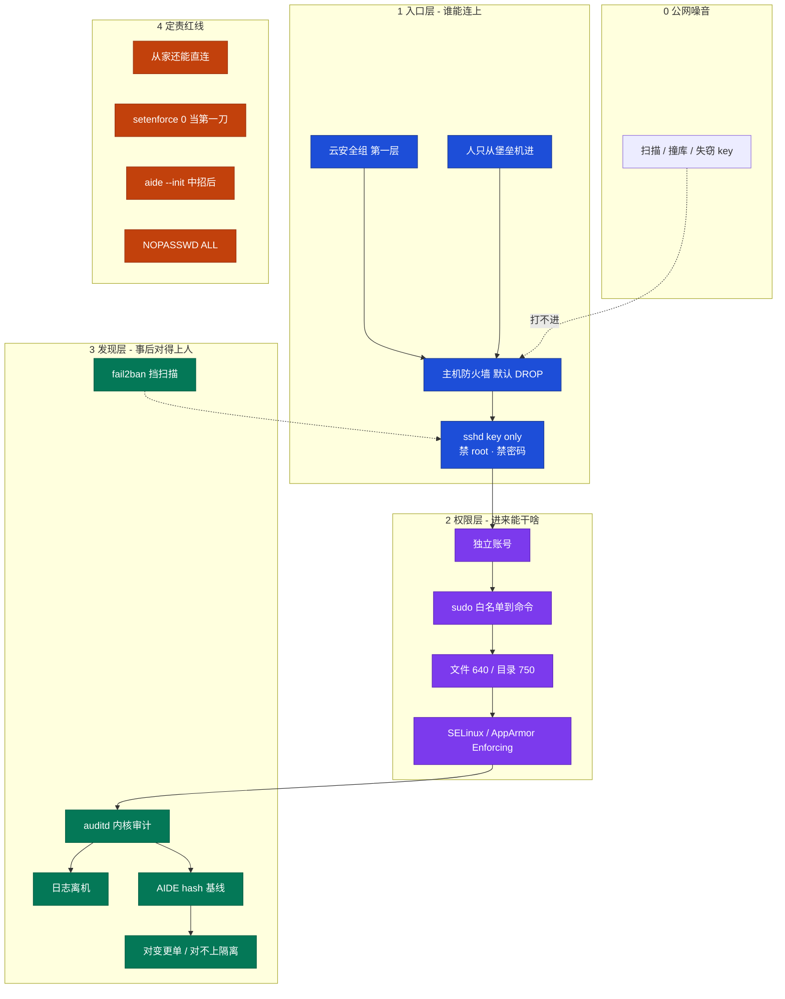
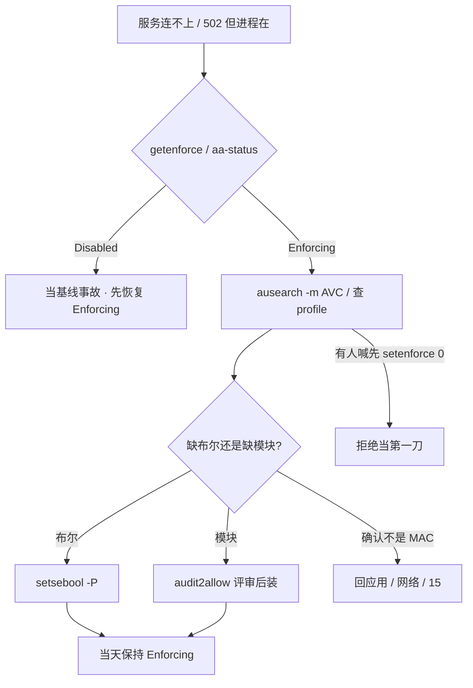
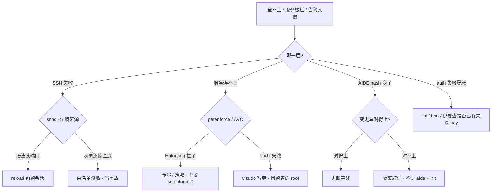

# Linux 安全加固

> **这章解决什么**：凌晨 auth 失败暴涨、有人喊「改 2222 顶一阵」、有人 `setenforce 0` 让反代先通、有人给 `deploy` 开 `NOPASSWD: ALL`——门还在不在？权有没有被拆开？事后对不对得上人？  
> **读法**：**先看总图（入口 → 权限 → 发现）** → **再认名词** → **再分节抠 sshd / sudo / 防火墙 / MAC / audit**。  
> **刻意不展开**：堡垒机产品、录屏、审批工单、ProxyJump → [28](../28-堡垒机与跳板机/)；云 IAM / 安全组产品 → [06 云平台](../../06-云平台/)；K8s RBAC / PSS / NetworkPolicy → [03-13](../../03-Kubernetes/13-RBAC与安全/)；五链四表 / conntrack 细则 → [17](../17-iptables与conntrack/)；性能向 sysctl（somaxconn / tw_reuse）→ [24](../24-内核参数与sysctl/)；审计日志怎么轮转、怎么集中 → [23](../23-日志运维/)。

---

## 本章目录

1. [本章定位](#1-本章定位)
2. [先看总图：谁能进、进来能干啥、干了啥能不能查](#2-先看总图谁能进进来能干啥干了啥能不能查) ← **开篇必读**
   - [2.0 全章知识串图](#20-全章知识串图一张把细节串起来) ← **架构总览**
   - [2.3 完整走读](#23-完整走读从公网扫描到值班用-key-登堡垒机再进业务机)
3. [名词扫盲（对照总图认词）](#3-名词扫盲对照总图认词)
4. [sshd：把门关死](#4-sshd把门关死)
5. [sudo 与文件权限：最小、可追责](#5-sudo-与文件权限最小可追责)
6. [防火墙最小化：默认拒绝](#6-防火墙最小化默认拒绝)
7. [SELinux / AppArmor：本章最易混](#7-selinux--apparmor本章最易混) ← **重点精读**
8. [auditd / AIDE / 发现层](#8-auditd--aide--发现层)
9. [落地基线与变更红线](#9-落地基线与变更红线)
10. [定责决策树与命令速查](#10-定责决策树与命令速查)
11. [去哪章继续学](#11-去哪章继续学)
12. [面试 · 易错 · 数字](#12-面试--易错--数字)
13. [合上书](#合上书)

---

## 1. 本章定位

| 章 | 负责 |
|----|------|
| **17（本章）** | 主机加固三层：入口（sshd + 来源）→ 权限（sudo / DAC / MAC）→ 发现（auditd / AIDE）；被拦查 AVC、入侵先隔离 |
| **15** | 五链四表、NAT、conntrack table full——**怎么写规则**、表满怎么认 |
| **25** | 堡垒机产品、审批、录屏、人怎么跳 |
| **04-13** | 容器 / K8s 侧 RBAC、PSS、NetworkPolicy——**不替代**宿主机 MAC |
| **18** | 性能旋钮；本章只留**安全向** sysctl（redirects / syncookies / ip_forward / rp_filter） |

本章是**主机安全入口**。15 告诉你「规则写在哪条链」；本章告诉你「生产机该不该让世界连上、进来能跑什么、出事能不能对到人」。

🎯 **值班签名**：auth 失败暴涨 / 反代被拦 / AIDE hash 变了——先分**哪一层**，**别先改端口、别先 `setenforce 0`、别先 `aide --init`**。

---

## 2. 先看总图：谁能进、进来能干啥、干了啥能不能查

> **正确开篇顺序**：先有全局画面，再认词，再抠 sshd / sudo / MAC。  
> 先看 **§2.0 全章串图**，再看 **§2.1 三层坐标系**，再用 **§2.3 走读**把一次值班登录串起来。

### 2.0 全章知识串图（一张把细节串起来）

> 🎯 **合上书要能默画这张。** 蓝=入口 · 紫=权限 · 绿=发现 · 橙=事故/定责。  
> 若预览仍报错，以下面 **ASCII 一页板** 为准。



**读图路线：**

| 段 | 记住 |
|----|------|
| ① 入口 | 人对堡垒机；机器只认堡垒机网段的 key（§4、§6） |
| ② 权限 | sudo 到具体命令；MAC 是第二道墙，root 也拦（§5、§7） |
| ③ 发现 | auditd 离机；AIDE 干净时 init（§8） |
| ④ 红线 | 家还能直连 / 先关 SELinux / 中招再 init / ALL（§10） |

```text
┌──────────────────────────────────────────────────────────────────────────┐
│                     17 一张板：入口 → 权限 → 发现                          │
├─────────────┬────────────────────┬───────────────────────────────────────┤
│  入口       │  权限              │  发现                                 │
│  安全组→墙  │  独立账号          │  auditd 离机                          │
│  DROP+CIDR  │  sudo 白名单       │  AIDE hash                            │
│  sshd key   │  640/750 + MAC     │  异常登录/外连/fail2ban               │
│  禁root密码 │  Enforcing         │  对不上→隔离取证                      │
├─────────────┴────────────────────┴───────────────────────────────────────┤
│  红线：家还能直连 · setenforce 0 第一刀 · 中招 aide --init · NOPASSWD ALL │
│  定责：先分哪一层 → 再动手（§10）                                          │
└──────────────────────────────────────────────────────────────────────────┘
```

### 2.1 三层坐标系（合上书默画用）

加固不是「改一个 sshd 端口」。生产叠三层，少一层出事只能猜：

| 层 | 管什么 | 典型手段 | 少了会怎样 |
|----|--------|----------|------------|
| **入口** | 谁能连上这台 | 堡垒机唯一、SSH key only、禁 root、禁密码、防火墙默认 DROP | 公网撞库打到业务机 |
| **权限** | 进来能跑什么 | 独立账号、sudo 白名单、业务 nologin、配置 640、MAC Enforcing | 进门就能 `su -` 开整栋 |
| **发现** | 事后对得上人 | auditd 离机、AIDE hash、异常登录/外连、fail2ban | history 空就说「没人来过」 |

云安全组是第一层，主机防火墙是第二层——**两层都要**，不要只开 syncookies 就说防火墙做好了。链和 conntrack 细则在 [17](../17-iptables与conntrack/)。

> **记住**：改端口只减扫描噪音，扫描器照样扫到。安全核心是 **key only + 只从堡垒机进**。本机 `history` 和本机日志都能被 root 改掉，发现层必须离机。

### 2.2 相邻概念三句话（不膨胀本章）

| 话题 | 三句话 | 主责章 |
|------|--------|--------|
| 堡垒机产品 | 人怎么审批、怎么录屏、怎么 ProxyJump | [28](../28-堡垒机与跳板机/) |
| iptables 链 | INPUT/FORWARD、NAT、table full 怎么认 | [17](../17-iptables与conntrack/) |
| 容器隔离 | PSS / RBAC / NetworkPolicy；**不替代**宿主机 MAC | [03-13](../../03-Kubernetes/13-RBAC与安全/) |
| 性能 sysctl | somaxconn、tw_reuse、队列 | [24](../24-内核参数与sysctl/) |
| 日志集中 | rsyslog/Fluent 怎么转、怎么留 | [23](../23-日志运维/) |

### 2.3 完整走读：从公网扫描到值班用 key 登堡垒机再进业务机

下面用**一条值班路径**把三层串一遍（单线程模型，不搞多账号并行）。

```text
扫描器 → 公网 22/2222
           │
           ×  安全组 / 主机墙：业务机不对世界开 SSH
           │
运维 → 堡垒机（MFA / 审批 / 录屏 · 产品见 25）
           │  key + AllowUsers@堡垒机 CIDR
           ▼
     业务机 sshd（key only · 禁 root · 禁密码）
           │
           ▼
     独立账号 deploy → sudo 白名单（只能 reload nginx）
           │
           ▼
     业务进程跑在 nologin 账号下；文件 640；MAC Enforcing
           │
           ▼
     每一步：auditd 记 · 日志离机 · AIDE 盯 /usr/bin
```

**现场对照（你在堡垒机上）：**

1. 从家里直连业务机应失败（入口合格）。  
2. `ssh -J deploy@bastion deploy@prod`（或堡垒机 Web）应成功。  
3. `sudo -l` 应看到命令列表，不是 `ALL`。  
4. `getenforce` 应为 `Enforcing`。  
5. `sshd -T | grep passwordauthentication` 应为 `no`。

走读只保留这一版。后面分节抠每一层「为什么」和「命令怎么认」。

---

## 3. 名词扫盲（对照总图认词）

对照 §2 总图认词。每个词先给「值班里什么时候碰到」，再给定义。

### 3.1 入口侧

| 名词 | 值班里什么时候碰到 | 一句话 |
|------|-------------------|--------|
| **key only** | auth 失败暴涨、有人还开着密码 | 只允许公钥登录，密码通道关掉 |
| **PermitRootLogin** | 审计对不上人 | 禁 root 直登；人用独立账号再 sudo |
| **AllowUsers / AllowGroups** | 全世界都能试 key | 把「谁 + 从哪」收窄到堡垒机网段 |
| **堡垒机唯一入口** | 从家还能 SSH 上生产机 | 人只打堡垒机；业务机防火墙不认家 |
| **fail2ban** | `/var/log/secure` 刷 Failed password | 挡扫描噪音；**挡不住**已进堡垒机的失窃 key |

### 3.2 权限侧

| 名词 | 值班里什么时候碰到 | 一句话 |
|------|-------------------|--------|
| **DAC** | `chmod` / `chown` | 属主同不同意——经典 Unix 权限 |
| **MAC** | Nginx 502 但进程在 | 内核按策略拦；就算是 root 也不在策略里就碰不到 |
| **SELinux** | RHEL / CentOS 反代被拦 | 标签 + 策略；状态 Enforcing / Permissive / Disabled |
| **AppArmor** | Ubuntu 服务被 profile 拦 | 路径 + profile；enforce / complain |
| **AVC** | `ausearch -m AVC` | Access Vector Cache 拒绝记录——被拦先看它 |
| **sudo 白名单** | 有人要 `NOPASSWD: ALL` | 只允许具体二进制/参数；禁 `su`/`bash` |
| **SUID** | `find -perm -4000` 多出一个陌生文件 | 跑起来用文件属主身份；来历不明当提权后门 |

### 3.3 发现侧

| 名词 | 值班里什么时候碰到 | 一句话 |
|------|-------------------|--------|
| **auditd** | history 是空的、合规要追责 | 内核审计；写 passwd/sudoers 一定有事件 |
| **AIDE** | `/usr/bin/ssh` hash 变了 | 文件完整性基线；干净时 init，中招后别 init |
| **离机** | 本机 audit.log 被删 | 日志转到别处；本机 root 改不掉副本 |
| **CIS / Lynis** | 扫描几十条不过 | 基线清单；高危必修，噪音可风险接受 |

> **别混**：DAC ≠ MAC；Permissive ≠ Enforcing；auditd ≠ history；fail2ban ≠ 吊销失窃 key；改端口 ≠ 加固完成。

---

## 4. sshd：把门关死

### 4.1 一句话

改端口只减扫描噪音；核心是 **禁密码、禁 root、限来源、只用 key**。

### 4.2 为什么改端口不算加固完成

```text
  错：Port 2222 + 仍允许 root 密码
  对：PasswordAuthentication no
      PermitRootLogin no
      PubkeyAuthentication yes
      AllowUsers deploy@10.0.0.0/8   # 堡垒机网段
      MaxAuthTries 3
      ClientAliveInterval 300
```

扫描器会全端口扫；改 2222 只是 `/var/log/secure` 少一点噪音。真正让撞库失效的是 **关掉密码通道**；真正让审计对到人的是 **禁 root 直登**；真正让公网打不到的是 **防火墙 + AllowUsers 限 CIDR**。

🎯 **常考**：面试官说「你们改端口了吗？」——答「改了减噪音，但核心是 key only + 堡垒机入口」。

### 4.3 现场走一遍：auth 失败暴涨，先别改端口

1. 堡垒机或已有会话上，看**生效值**（不是只看配置文件注释）：

```bash
sshd -T | grep -E 'permitrootlogin|passwordauthentication|pubkeyauthentication|port|allowusers|maxauthtries|clientaliveinterval|logingracetime'
```

2. 合格生产常见输出：

```text
permitrootlogin no
passwordauthentication no
pubkeyauthentication yes
port 2222
allowusers deploy@10.0.0.0/8
maxauthtries 3
clientaliveinterval 300
logingracetime 30
```

3. **说明什么**：root 和密码都关了；端口 2222 只是减噪音；`AllowUsers` 限了源网段。若从家里还能直连——是**防火墙/安全组**没收，不是 sshd 写错（见 §6、§10）。

4. 改配置前语法检查，再 reload（不 restart）：

```bash
sshd -t && systemctl reload sshd
```

5. **另开一条** SSH 会话验证：key 能进、密码/root 不能进、非堡垒机 IP 不能进。当前 ESTABLISHED 会话骗得了你。

### 4.4 输出解读：sshd -T 字段

| 字段 | 正常生产 | 异常 |
|------|----------|------|
| `permitrootlogin` | `no` | `yes` = 审计分不清人 |
| `passwordauthentication` | `no` | `yes` = 撞库面 |
| `pubkeyauthentication` | `yes` | `no` 又开密码 = 灾难组合 |
| `allowusers` | 带 `@CIDR` | 无限制 = 全世界可试 key |
| `maxauthtries` | `3` | 默认 6 = 撞库窗口大 |
| `clientaliveinterval` | `300` 左右 | 0 = 僵死会话占 fd |
| `logingracetime` | `30` | 过大 = 半开连接占资源 |

### 4.5 最小 sshd_config 片段（可复制思路）

```text
# /etc/ssh/sshd_config.d/99-hardening.conf  （或主文件，按发行版）
PermitRootLogin no
PasswordAuthentication no
PubkeyAuthentication yes
KbdInteractiveAuthentication no
ChallengeResponseAuthentication no
UsePAM yes
AllowUsers deploy@10.0.0.0/8
MaxAuthTries 3
LoginGraceTime 30
ClientAliveInterval 300
ClientAliveCountMax 2
X11Forwarding no
AllowTcpForwarding no
PermitTunnel no
```

关 X11 / TcpForwarding：缩小「登上一台再当跳板」的面。真正跳板应走堡垒机产品（[28](../28-堡垒机与跳板机/)），不是业务机开转发。

### 4.6 key 被盗怎么办

立刻从 `authorized_keys` 拿掉 → 堡垒机侧吊销 → 轮换所有可能被拷走的 key → 查 auditd / 堡垒机录像。  
**不要**只「改 passphrase」却让旧公钥留着；密码通道本来就该是关的，改密码救不了失窃 key。

### 4.7 改 sshd 不锁死自己（Checklist）

1. 留 **console** / 云厂商 VNC / 已有 root 会话。  
2. `sshd -t` 语法过了再动手。  
3. **reload**，不要 `restart` 把现有会话全掐。  
4. **另开一条新会话**验证。  
5. 防火墙同步新端口（若改了 Port）。  
6. 锁死了 → console 上去，先把 `PermitRootLogin` / 墙规则救回来，再收拾。

> **记住**：从家里直连还能上 = 安全组 / iptables 白名单没收，当**入口事故**，不是「sshd 配错了一行」这么轻。

**面试怎么说**：「改 2222 不算加固完成；核心是禁 root、禁密码、AllowUsers 限堡垒机网段；改完 `sshd -t` 再 reload，另开会话验，不 restart 掐现有会话。」

---

## 5. sudo 与文件权限：最小、可追责

### 5.1 一句话

sudo 白名单到具体命令；`sudo su` / `sudo bash` 等于拆掉白名单。

### 5.2 为什么 ALL 是事故

```text
  事故写法：
  deploy ALL=(ALL) NOPASSWD: ALL

  合格写法：
  Cmnd_Alias NGINXCTL = /bin/systemctl restart nginx, /bin/systemctl reload nginx
  deploy ALL=(root) NGINXCTL
  deploy ALL=(root) !/bin/su, !/bin/bash, !/bin/sh
  Defaults timestamp_timeout=5
```

白名单像酒店房卡只能开自己房间；`sudo su -` 是拿万能钥匙开整栋楼——口头说「别乱用」不算数。`NOPASSWD: ALL` 在活动周一旦写上，常常永远忘收回。

### 5.3 现场走一遍：有人要 NOPASSWD: ALL

1. 看 deploy 实际能跑什么：

```bash
sudo -l -U deploy
```

2. 合格示例：

```text
User deploy may run the following commands on prod-game-01:
    (root) /bin/systemctl restart nginx, /bin/systemctl reload nginx
    (root) !/bin/su, !/bin/bash, !/bin/sh
```

3. **说明什么**：只能 reload/restart nginx，显式禁了 shell 逃逸。若看到 `(ALL) NOPASSWD: ALL`，等于没加固。

4. 编辑必须 `visudo`（语法错会锁死 sudo）：

```bash
visudo
# 改完立刻：
sudo -l -U deploy
```

5. 查谁干了什么（本机可被改，生产要离机）：

```bash
ausearch -k sudoers -ts recent | tail -20
# CentOS/RHEL: grep sudo /var/log/secure
# Debian/Ubuntu: grep sudo /var/log/auth.log
```

### 5.4 账号与文件底线

| 检查项 | 合格 | 事故 |
|--------|------|------|
| `sudo -l` | 命令列表 | `ALL` / `NOPASSWD: ALL` |
| 账号 | 每人独立 | 共享 `ops` / `deploy` 万能钥匙 |
| 业务账号 | `nologin` / `false` | 业务用 root 跑、带 login shell |
| 文件权限 | 配置 `640`、目录 `750` | `chmod 777` |
| umask | 常见 `022` | 新建文件世界可写 |
| SUID | `passwd` 等已知项 | `find` 多出来的先隔离 |

```bash
# 业务账号
useradd -r -s /sbin/nologin game

# SUID 定期扫
find /usr/bin /usr/sbin /tmp /data -perm -4000 -ls

# sticky bit：/tmp 常见 1777 —— 只解决「不能删别人的文件」，不解决 SUID
```

`chmod 777`：谁都能改，被植入后门无法追责。SUID：二进制跑起来时用**文件属主**身份；`passwd` 合法，来历不明当提权后门。SGID 目录是共享组，不要和 SUID 后门混谈。

### 5.5 临时要 root 怎么办

审批工单 → 堡垒机限时授权 → 录屏 → 到期收回。  
不要把「活动周」变成永久 `NOPASSWD`。产品化流程见 [28](../28-堡垒机与跳板机/)。

### 5.6 visudo 写错怎么逃

sudo 全部失效。必须：

1. 改之前就留着一个 **已登录的 root 会话**，或云控制台。  
2. 只用 `visudo`（会语法检查）。  
3. 改完 `sudo -l -U deploy` 核对。  
4. **不要**重启碰运气——重启不会修好语法错误的 sudoers。

**面试怎么说**：「sudo 白名单到具体二进制和参数，显式禁 su/bash/sh；每人独立账号；visudo 写错用留着的 root 会话或云控制台修。」

---

## 6. 防火墙最小化：默认拒绝

### 6.1 一句话

默认 DROP，SSH/业务来源收窄；出站也要管。云安全组是第一层，主机防火墙是第二层。

### 6.2 和 15 章的边界

| 你要干什么 | 去哪 |
|------------|------|
| 默认 DROP、SSH 只放堡垒 CIDR、业务口只放 LB | **本章**（策略与验收） |
| 规则写在哪条链、NAT、conntrack 满、`-v` 计数 | **[17](../17-iptables与conntrack/)** |
| 抓包看 SYN 有没有出网卡 | **[16](../16-网络排障与抓包/)** |

本章不讲五链四表细节。你只需要会：**看 policy、看来源、先 ESTABLISHED、另开会话验、持久化**。

### 6.3 现场走一遍：改完 sshd 2222，从家突然登不上

可能是好事（墙同步了），也可能是坏事（把自己锁死）。在 console 上：

```bash
iptables -L INPUT -n -v --line-numbers | head -20
# 或 firewall-cmd --list-all
```

合格示意：

```text
Chain INPUT (policy DROP 0 packets, 0 bytes)
num   pkts bytes target     prot opt in     out     source               destination
1      12M  890M ACCEPT     all  --  *      *       0.0.0.0/0            0.0.0.0/0            state RELATED,ESTABLISHED
2      456  27360 ACCEPT     tcp  --  *      *       10.0.0.0/8           0.0.0.0/0            tcp dpt:2222
```

**输出解读**：

| 看什么 | 合格 | 事故 |
|--------|------|------|
| policy | `DROP` | `ACCEPT` = 默认全开 |
| 第 1 条 | `ESTABLISHED,RELATED` | 没有 = 自己回包也可能丢 |
| SSH 来源 | 堡垒机 CIDR | `0.0.0.0/0` = 对世界开 |
| 业务口 | 仅 LB / 内网上游 | 房间端口对公网 |

### 6.4 最小化清单（策略层）

1. INPUT **默认 DROP**。  
2. **先**放 `ESTABLISHED,RELATED`。  
3. SSH **只放堡垒机 CIDR**，不要公网 22。  
4. 业务口只放 LB / 内网上游。  
5. 非路由器：`ip_forward=0`，FORWARD DROP。  
6. **出站也收**：NTP、制品库、DNS 显式放；陌生外连拒绝或告警。  
7. 改完 **另一条会话**验证；当前 ESTABLISHED 骗得了你。  
8. `iptables-save` / firewalld 持久化（细节 [17](../17-iptables与conntrack/)）。

### 6.5 安全向 sysctl（和 18 性能清单分开）

```bash
# /etc/sysctl.d/99-security.conf
net.ipv4.conf.all.accept_redirects = 0
net.ipv4.conf.default.accept_redirects = 0
net.ipv4.conf.all.accept_source_route = 0
net.ipv4.tcp_syncookies = 1
net.ipv4.ip_forward = 0
net.ipv4.conf.all.rp_filter = 1
```

| 项 | 作用 | 别混成 |
|----|------|--------|
| `accept_redirects=0` | 防恶意重定向 | 不是「禁 ping」 |
| `accept_source_route=0` | 防源路由绕路 | — |
| `tcp_syncookies=1` | SYN Flood 缓解 | **不是**防火墙替代品 |
| `ip_forward=0` | 非路由器别开转发 | NAT 机才开 1（书面接受） |
| `rp_filter=1` | 反伪造源地址 | — |

禁 ping（`icmp_echo_ignore_all`）**可选**，排障和云探活会疼，**不是必开**——扫描项书面接受即可。

### 6.6 改墙不锁死 SSH

与 [17 §10.4](../17-iptables与conntrack/) 同口径，本章再钉一次：

1. 留 console。  
2. 先放行 ESTABLISHED + 管理网段（`-I` INSERT）。  
3. 再写 DROP。  
4. **新开 ssh** 验证。  
5. 持久化。  
6. 已锁死 → console 删错序规则。

**面试怎么说**：「INPUT 默认 DROP，先 ESTABLISHED 再放 SSH 仅堡垒机 CIDR、业务口仅 LB；出站也管；syncookies 不是防火墙替代品；链细则在 15。」

---

## 7. SELinux / AppArmor：本章最易混

> 🔥 **全章最易晕的一点单独钉死**：被拦先查 AVC / 补策略，**不要 `setenforce 0` 当第一刀**。

### 7.1 一句话

DAC 是属主同不同意；MAC 是内核策略——就算进程已经是 root，不在策略里也碰不到不该碰的。

### 7.2 DAC vs MAC（一例钉死）

**例子（先服务端）：** Nginx 进程以 `nginx` 用户跑（DAC 已过），要 `connect` 到上游 `127.0.0.1:8080`。  
SELinux 看标签：`httpd_t` 默认不一定允许 `name_connect` 到任意端口 → **AVC denied**。  
你 curl 本机 8080 通（你的 shell 不是 `httpd_t`），所以表现为「反代 502，本机 curl 通」。

```text
① 例子：Nginx 反代 upstream 连不上，curl 127.0.0.1:8080 通
② 定义：MAC = 内核按策略拦，与「是不是 root / 属主同不同意」正交
③ 怎么认：getenforce → ausearch -m AVC → 看 scontext / tcontext / 缺什么
④ 易错：setenforce 0 当第一刀 = 拆掉第二道墙（只写一次；别处「见 §7」）
```

### 7.3 SELinux vs AppArmor

| | SELinux | AppArmor |
|---|---------|----------|
| 模型 | 标签 + 策略 | 路径 + profile |
| 常见系统 | CentOS / RHEL / Rocky | Ubuntu / Debian |
| 开着且拦 | **Enforcing** | **enforce** |
| 只记不拦 | Permissive | complain |
| 拆除 | Disabled | 卸 profile / 禁用 |
| 查拒绝 | `ausearch -m AVC` | `dmesg` / `aa-status` / journal |

生产都应 **Enforcing / enforce**。  
Permissive：还能看到 AVC，排查窗口可用，**当天必须回去**。  
Disabled：连审计都没有，**不要写进生产镜像**。

> **别混**：Permissive ≠「开了 SELinux 在防护」——它只记不拦。Disabled 更彻底，等于拆除。

### 7.4 现场走一遍：Nginx 反代被拦

1. 看 MAC 状态：

```bash
getenforce
sestatus | head -5
# Ubuntu: aa-status
```

```text
Enforcing
SELinux status:                 enabled
Current mode:                   enforcing
```

2. 查最近 AVC：

```bash
ausearch -m AVC -ts recent | tail -5
```

```text
type=AVC msg=audit(...): avc:  denied  { name_connect } for  pid=1234 comm="nginx"
  scontext=system_u:system_r:httpd_t:s0 tcontext=system_u:object_r:http_port_t:s0
  tclass=tcp_socket permissive=0
```

3. **输出解读**：`httpd_t` 想 `name_connect` 被拒——常见修法是布尔值，不是关 SELinux：

```bash
setsebool -P httpd_can_network_connect on
getsebool httpd_can_network_connect
# --> httpd_can_network_connect --> on
```

4. 仍缺策略：`audit2allow` **评审后再装模块**——不要盲装把后门能力写进策略。  
5. 临时 Permissive **只给这台、只给排查窗口**，当天回到 Enforcing。

### 7.5 AppArmor 侧怎么认（Ubuntu 值班）

RHEL 系你背 `getenforce` / `ausearch`；Ubuntu 系对等物是 profile：

```bash
aa-status
# 或
cat /sys/kernel/security/apparmor/profiles 2>/dev/null | head
dmesg -T | grep -i apparmor | tail -10
journalctl -k | grep -i apparmor | tail -10
```

| 状态 | 含义 | 值班动作 |
|------|------|----------|
| `enforce` | 拦 | 查拒绝日志 → 调 profile / 布尔等价物 |
| `complain` | 只记不拦 | 排查窗口可用，当天回 enforce |
| 无 profile | 该进程不受控 | 基线应给关键服务装 profile |

修法原则与 SELinux 相同：**补策略，不拆 MAC**。不要 `aa-complain` 永久化，更不要卸载 AppArmor「让业务先过」。

### 7.6 标签 / 上下文怎么读（SELinux 一眼）

```bash
ls -Z /var/www/html | head
ps -eZ | grep nginx | head
id -Z
```

```text
system_u:object_r:httpd_sys_content_t:s0  index.html
system_u:system_r:httpd_t:s0              nginx
```

| 字段 | 大概是什么 |
|------|------------|
| `httpd_t` | 进程域——「这类进程」 |
| `httpd_sys_content_t` | 文件类型——「这类对象」 |
| AVC 里的 `scontext` / `tcontext` | 谁想碰谁 |

看不懂标签不要猜着 `chcon -R` 乱改。缺布尔先 `getsebool -a | grep httpd`；要恢复默认上下文用 `restorecon -Rv <path>`（对得上包默认策略时）。

### 7.7 容器上了还要不要宿主机 MAC？

要。容器里的隔离靠 PSS / RBAC / NetworkPolicy（[03-13](../../03-Kubernetes/13-RBAC与安全/)）。  
**不能拿「已经上 K8s」当关 SELinux、开密码登录的理由。** 宿主机被拿下，容器隔离也只是减速带。

节点上若跑 container runtime，宿主机仍应 Enforcing；容器内再套一层是加分，不是替代。

### 7.8 决策：被拦了怎么办



**面试怎么说**：「502 但进程在，我先 getenforce 和 ausearch AVC；缺布尔 setsebool -P；setenforce 0 当第一刀是事故。Permissive 只记不拦，Disabled 是拆除。」

---

## 8. auditd / AIDE / 发现层

### 8.1 一句话

追责靠 **auditd 离机转发**，不靠 shell 的 history；完整性靠 **AIDE 干净时 init**，中招后再 init 等于给后门发证书。

### 8.2 auditd vs history（一例钉死）

```text
① 例子：怀疑有人改过 sudoers，history 是空的
② 定义：history = 用户可清可改的 shell 本；auditd = 内核审计事件
③ 怎么认：systemctl is-active auditd；ausearch -k sudoers；离机副本有没有
④ 易错：history 空 ≠ 没人操作过（见本节，只写一次）
```

### 8.3 现场走一遍：history 空，要追责

1. auditd 是否在跑：

```bash
systemctl is-active auditd
ausearch -k sudoers -ts today | aureport -f --summary
```

2. 关键 watch 规则示例：

```bash
# /etc/audit/rules.d/audit.rules
-w /var/log/secure -p wa -k logins
-w /etc/passwd -p wa -k identity
-w /etc/shadow -p wa -k identity
-w /etc/sudoers -p wa -k sudoers
-w /etc/ssh/sshd_config -p wa -k sshdcfg
-a always,exit -F arch=b64 -S execve -k cmd
```

`-w` = watch 路径；`-p wa` = 写/属性变更；`-k` = 检索钥匙。  
`execve` 全量很吵——生产常按关键用户/关键目录收窄，细节与轮转见 [23](../23-日志运维/)。

3. **本机 audit.log 不够**：root 能改。生产 = 规则 + **离机转发**。

### 8.4 AIDE：什么时候 init

```bash
# 干净安装 / 已知干净镜像：
aide --init
# 按发行版把新库就位后：
aide --check
```

检查输出示意：

```text
File: /usr/bin/ssh
  S    : Size
  M    : Permissions
  MD5  : Hash
Changed files: 1
```

| 情况 | 做什么 |
|------|--------|
| 对得上变更单（补丁窗口） | 更新基线，留记录 |
| 对不上 | **隔离取证**，不要 `aide --init` |
| 只监控 `/etc` | 不够——后门常改 `/usr/bin`、`/usr/sbin` |

> **记住**：中招后再 `aide --init` = 把后门写进信任根。

### 8.5 fail2ban 的边界

```ini
[sshd]
enabled = true
maxretry = 3
bantime = 3600
findtime = 600
```

挡的是扫描 / 撞库噪音。  
**挡不住**：已经进了堡垒机的失窃 key、合法 key 的恶意操作。失窃 key → 吊销 + MFA + 查录像（§4.6、[28](../28-堡垒机与跳板机/)）。

看是否在挡：

```bash
fail2ban-client status sshd
# |  Status
# |  |- Filter
# |  |  |- Currently failed: 2
# |  |  |- Total failed:     1840
# |  `- Actions
# |     |- Currently banned: 3
# |     `- Total banned:     120
```

`Total banned` 涨说明扫描多，**不说明**入口已合格——仍要核对家里能否直连、是否 key only。

### 8.6 登录与密钥痕迹怎么查

```bash
last -a | head
lastb | head          # 失败尝试，需 root
grep -E 'Accepted|Failed' /var/log/secure | tail -30
# Debian: /var/log/auth.log

# 谁的公钥还能进
for u in root deploy; do
  echo "=== $u ==="
  getent passwd "$u"
  cat /home/$u/.ssh/authorized_keys 2>/dev/null || cat /root/.ssh/authorized_keys 2>/dev/null
done
```

| 信号 | 可能含义 | 下一步 |
|------|----------|--------|
| `Accepted publickey` 来自非堡垒 IP | 入口没收或 key 泄漏后直连 | 当事故；吊销 + 收墙 |
| `Failed password` 暴涨 | 扫描 | fail2ban + 确认密码通道已关 |
| `authorized_keys` 多出陌生行 | 植入后门 key | 隔离；对 AIDE；轮换 |
| `last` 有非值班窗口登录 | 失窃会话 / 失窃 key | 查堡垒机录像 + auditd |

### 8.7 发现入侵：第一步


| 步骤 | 做 | 别做 |
|------|----|------|
| 1 | 网络隔离 | 先 `kill` 后门再取证 |
| 2 | 磁盘/内存/日志快照 | 关机丢内存 |
| 3 | 影响面（库、横向、key） | 当「单机小问题」 |
| 4 | 清理 / 轮换 / 必要时重装基线镜像 | 在中招机「修到过线」当结案 |

发现信号：AIDE hash 变；非白名单登录；未知进程 / 异常 SUID；非预期外连；auditd 对 passwd/sudoers/sshd 的异常写。

**面试怎么说**：「history 空不能断定没人操作；靠 auditd 离机 + 堡垒机录像。AIDE 干净时 init；中招后再 init 等于给后门发证书。发现入侵先隔离不关机取证。」

---

## 9. 落地基线与变更红线

### 9.1 选型表

| 项 | 选 | 不选 |
|----|----|------|
| SSH | key only、禁 root、只从堡垒机进 | 密码、root 直登、公网 22 |
| sudo | 白名单 + 独立账号 | `NOPASSWD: ALL`、共享账号 |
| 防火墙 | 默认 DROP、SSH/业务来源收窄 | INPUT ACCEPT；业务口对世界 |
| MAC | Enforcing | Disabled 写进镜像；被拦就 `setenforce 0` |
| 审计 | auditd + 离机 | 只开 histappend |
| 完整性 | AIDE + 定时告警 | 中招后再 `--init` |
| 镜像 | 加固基线镜像出厂 | 每台手搓 |
| 合规 | CIS 定期扫，不合格有人认领 | 扫了不管；或每条噪音都当 P0 |

### 9.2 新机验收（过线才上流量）

```bash
sshd -T | grep -E 'permitrootlogin|passwordauthentication|allowusers'
getenforce
sudo -l
iptables -L INPUT -n | head -5   # 或 firewall-cmd --list-all
systemctl is-enabled auditd chronyd
# 从家里直连应失败；从堡垒机应成功
```

| 验收项 | 合格标准 |
|--------|----------|
| sshd | `permitrootlogin no`、`passwordauthentication no` |
| MAC | `Enforcing` / AppArmor enforce |
| 墙 | INPUT 默认 DROP；SSH 来源不是 0.0.0.0/0 |
| sudo | 不是 ALL |
| auditd | enabled + active；日志有离机路径 |
| 入口 | **家里直连失败** |

### 9.3 CIS / Lynis：每条都修吗？

不用背每一条。要有：**基线镜像覆盖高危项、扫描定期跑、不合格项有人认领（修或风险接受）。**

| 类别 | 例子 | 怎么处理 |
|------|------|----------|
| **高危必修** | 密码登录、root SSH、SELinux Disabled、777、无审计 | 必须修 |
| **架构冲突** | 这台就是 NAT 要 `ip_forward=1` | 文档 + 扫描白名单 |
| **噪音可接受** | 改 banner、禁 ping | 书面接受 |

扫描过了 ≠ 有 IDS。还要靠 AIDE、异常登录、离机审计、堡垒机。

### 9.4 变更红线（sshd / 墙 / 补丁）

| 变更 | 正确姿势 | 事故姿势 |
|------|----------|----------|
| sshd | 留会话 → `-t` → reload → 新会话验 → 墙同步端口 | restart 赌；不验新会话 |
| 防火墙 | 先 ACCEPT 再收紧；另会话验；save | 先 DROP 锁死；reboot 丢规则 |
| 补丁 | 变更单 → 打补丁 → AIDE 对预期 diff → 更新基线 | 全红后 `--init` 消告警 |
| 密钥 | 离职当天吊销；泄漏先 revoke | 旧 key 留着只改 passphrase |
| sudoers | `visudo` + 留 root 会话 | 直接 vi；写完注销 |

### 9.5 核心配置速查

| 文件 | 关键项 | 改错会怎样 |
|------|--------|------------|
| `sshd_config` | 禁 root、禁密码、AllowUsers、MaxAuthTries 3、ClientAliveInterval 300 | 语法错 + restart 可能锁在外面 |
| `sudoers` | 命令白名单、禁 su/bash、timestamp_timeout=5 | ALL；或语法错锁死 |
| iptables / firewalld | 默认 DROP、ESTABLISHED、SSH 仅堡垒机 | 0.0.0.0/0；或把自己锁死 |
| `99-security.conf` | redirects=0、source_route=0、syncookies=1、ip_forward=0、rp_filter=1 | 非路由开转发当跳板 |
| audit.rules | watch passwd/sudoers/sshd、execve | 只靠 history |
| fail2ban sshd | maxretry=3、bantime=3600、findtime=600 | 当银弹挡失窃 key |
| AIDE | 干净时 init | 中招后 init |

### 9.6 服务进程侧：和 Systemd 章的接口

业务进程不要用 root 跑；能用 systemd 收紧的先收紧（细节 [11](../11-Systemd与服务管理/)）：

| 方向 | 例子 | 说明 |
|------|------|------|
| 用户 | `User=` / `Group=` | 独立低权账号 |
| 权限 | `NoNewPrivileges=yes` | 防提权 |
| 文件系统 | `ProtectSystem=strict`、`ProtectHome=yes` | 只读系统盘 |
| 能力 | `CapabilityBoundingSet=` 收窄 | 不要留 `CAP_SYS_ADMIN` 当默认 |

这是**权限层**的补充，不是替代 sudo 白名单，也不是替代 MAC。面试提到「进程加固」可以点到这里，深挖去 13。

### 9.7 基线镜像 vs 手搓

```text
  手搓每台：
    慢 · 会漂 · CIS 每次差一点 · 中招后「修到过线」假安全感

  基线镜像出厂：
    sshd / sudo / 墙 / MAC / auditd / AIDE 规则已过线
    滚动换机 · 中招重装 · 变更进镜像流水线
```

补丁与配置变更进镜像流水线，再滚动；不要在已暴露机器上「调到扫描绿」当结案。

> **记住**：门只开给堡垒机的 key；独立账号 + sudo 白名单；防火墙默认拒绝且来源收窄。安全 sysctl 和性能清单（18）分开写。

---

## 10. 定责决策树与命令速查

### 10.1 命令速查（值班先背这张）

| 目的 | 命令 | 看什么 |
|------|------|--------|
| sshd 生效值 | `sshd -T \| grep -E 'permitrootlogin\|passwordauthentication\|allowusers\|port'` | 不是只看配置文件注释 |
| sshd 语法 | `sshd -t` | 过了再 reload |
| MAC | `getenforce` / `sestatus` / `aa-status` | Enforcing |
| AVC | `ausearch -m AVC -ts recent` | 谁拦了谁 |
| sudo | `sudo -l`；`visudo` | 实际能跑什么 |
| 墙 | `iptables -L -n -v --line-numbers` 或 `firewall-cmd --list-all` | policy + 来源 + 计数 |
| 安全 sysctl | `sysctl net.ipv4.ip_forward net.ipv4.tcp_syncookies` | 非路由 forward=0 |
| SUID | `find /usr/bin /usr/sbin -perm -4000 -ls` | 多出来的先隔离 |
| 身份 | `id`；`getent passwd game` | nologin、uid |
| 审计 | `ausearch -k sudoers`；`systemctl is-active auditd` | 离机有没有 |
| 完整性 | `aide --check` | 对变更单 |
| 合规 | `lynis audit system` | 高危项认领 |
| 跳转 | `ssh -J deploy@bastion deploy@prod` | 人只从堡垒机进（产品化 25） |

一次值班最小命令集：

```bash
echo "=== entry ==="
sshd -T | grep -E 'permitrootlogin|passwordauthentication|allowusers|port'
iptables -L INPUT -n -v --line-numbers 2>/dev/null | head -15

echo "=== perm ==="
getenforce 2>/dev/null; sudo -l
ausearch -m AVC -ts recent 2>/dev/null | tail -5

echo "=== detect ==="
systemctl is-active auditd
aide --check 2>&1 | tail -15
```

### 10.2 三问

安全相关现场也是三问：

1. **门还在不在？** → sshd 生效值 + 防火墙来源 + 家里能不能直连。  
2. **权限被没被拆开？** → `sudo -l` 是否 ALL；MAC 是否 Enforcing。  
3. **发现层还看不看得见？** → auditd 离机；AIDE 对不对得上变更单。

### 10.3 决策树



### 10.4 现象 | 先做 | 别做

| 现象 | 先做 | 别做 |
|------|------|------|
| Nginx 反代被 SELinux 拦 | `ausearch -m AVC`；`setsebool -P` | `setenforce 0` 当第一刀 |
| 改完 sshd 登不上 | console；检查防火墙是否同步端口 | 再 restart 一次赌 |
| visudo 写错 | 已有 root 会话 / 云控制台修 | 重启碰运气 |
| AIDE `/usr/bin/ssh` 变了 | 对变更单；对不上当入侵 | 先 kill 再 `aide --init` |
| history 是空的 | auditd 离机 + 堡垒机录像 | 断定没人登过 |
| 从家里还能 SSH | 安全组 + 主机墙当事故 | 「反正有密码/key」 |
| CIS 几十条不过 | 高危必修；架构冲突书面接受 | 每条噪音当 P0，或全不修 |
| 容器上了还要不要加固 | 宿主机要 | 拿 K8s 当关 SELinux 的理由 |
| auth 失败暴涨 | `sshd -T` + 来源墙 + fail2ban | 只改端口当结案 |
| 活动中被拦 | 先布尔/策略恢复路径 | 关 MAC 撑过活动 |

### 10.5 三分钟剧本

**剧本 A：auth 失败暴涨，群里喊改 2222**

1. `sshd -T`：若已是 key only + 禁 root → 改端口只减噪音。  
2. 查来源：安全组 / 主机墙是否对世界开了 SSH。  
3. fail2ban 挡扫描；同时查是否已有失窃 key（成功登录日志）。  
4. 从家直连应失败——否则入口事故。

**剧本 B：Nginx 502，curl 本机 upstream 通，有人发 setenforce 0**

1. `getenforce` → Enforcing。  
2. `ausearch -m AVC` → `httpd_t` `name_connect` denied。  
3. `setsebool -P httpd_can_network_connect on`。  
4. 拒绝 `setenforce 0` 当第一刀；活动中也先布尔。

**剧本 C：AIDE 报 /usr/bin/ssh 变了，今晚打过补丁**

1. 对变更单 / 补丁列表。  
2. 对得上 → 更新基线留记录。  
3. 对不上 → 隔离、快照、查 authorized_keys / 外连，**禁止** `aide --init`。

**剧本 D：改完墙，当前窗口还在，断开就进不去**

1. 当前 ESTABLISHED 骗了你。  
2. console 上去看 INPUT 顺序 / 来源。  
3. `-I` 放行管理 CIDR，新开 ssh 验，再 save。

**剧本 E：visudo 写完，所有人 sudo 报 syntax error**

1. 不要重启、不要再开新会话碰运气。  
2. 用**改之前留着的 root 会话**或云 console。  
3. `visudo` 修语法 → `sudo -l -U deploy` 验。  
4. 事后：sudoers 改动必须进变更单 + auditd watch。

**剧本 F：fail2ban 封了很多 IP，但仍有 Accepted publickey 来自陌生网段**

1. fail2ban 只挡失败尝试，挡不住合法 key。  
2. 立刻从 `authorized_keys` 吊销、收墙（只留堡垒 CIDR）。  
3. 查 auditd / 堡垒机录像 / 横向。  
4. 当失窃 key 事故，不是「再加大 bantime」。

---

## 11. 去哪章继续学

| 你想搞懂 | 去 |
|----------|-----|
| 五链四表、NAT、conntrack table full | [17 iptables 与 conntrack](../17-iptables与conntrack/) |
| 堡垒机产品、审批、录屏、ProxyJump | [28 堡垒机与跳板机](../28-堡垒机与跳板机/) |
| 云安全组 / IAM 产品 | [06 云平台](../../06-云平台/) |
| K8s RBAC / PSS / NetworkPolicy | [03-13 RBAC 与安全](../../03-Kubernetes/13-RBAC与安全/) |
| 性能向 sysctl、队列参数 | [24 内核参数与 sysctl](../24-内核参数与sysctl/) |
| 审计日志轮转与集中 | [23 日志运维](../23-日志运维/) |
| 抓包验证 SYN / 黑洞 | [16 网络排障与抓包](../16-网络排障与抓包/) |
| Systemd 服务加固（NoNewPrivileges 等） | [11 Systemd 与服务管理](../11-Systemd与服务管理/) |

---

## 12. 面试 · 易错 · 数字

| 问法 | 30 秒答 |
|------|---------|
| 生产机怎么加固？ | 入口（堡垒机 + key only）→ 权限（sudo 白名单 + MAC）→ 发现（auditd 离机 + AIDE）；改端口不是核心。 |
| 改 2222 算不算完成？ | 不算。核心是禁密码、禁 root、限来源、只用 key。 |
| sudo 怎么写？ | 白名单到命令，禁 su/bash；不要 NOPASSWD: ALL；visudo。 |
| 被 SELinux 拦了？ | getenforce → ausearch AVC → setsebool / 评审后模块；不要 setenforce 0 第一刀。 |
| DAC 和 MAC？ | DAC 属主同不同意；MAC 内核策略，root 也可能被拦。 |
| Permissive vs Disabled？ | Permissive 只记不拦；Disabled 拆除，别写进镜像。 |
| history 空？ | 不能断定没人来；靠 auditd 离机 + 堡垒机录像。 |
| AIDE 何时 init？ | 干净时；中招后再 init 等于给后门发证书。 |
| 发现入侵第一步？ | 网络隔离、不关机、取证，再影响面，最后清理轮换。 |
| 上了 K8s 还要宿主机加固吗？ | 要。容器层是 PSS/RBAC；宿主机仍要 MAC 与入口。 |
| 防火墙和安全组？ | 安全组第一层，主机墙第二层；默认 DROP，来源收窄。 |
| CIS 不过怎么办？ | 高危必修；架构冲突书面接受；扫描过了不是 IDS。 |

| 说法 | 对错 | 口径 |
|------|:----:|------|
| 改成 2222 就算加固完成 | 错 | 核心是 key only + 堡垒机入口 |
| 生产允许 root 密码应急 | 错 | 禁 root、禁密码；应急走堡垒机/console（25） |
| `deploy ALL=(ALL) NOPASSWD: ALL` 方便值班 | 错 | 白名单到命令；禁 su/bash |
| 被拦先 `setenforce 0` | 错 | 先 AVC；关 Enforcing 是事故 |
| Permissive 等于开了 SELinux | 错 | 只记不拦 |
| 上了 K8s 可以关宿主机 SELinux | 错 | 容器层是 PSS/RBAC；宿主机仍要 MAC |
| history 空 = 没人操作过 | 错 | 可清可改；靠 auditd 离机 |
| 本机 audit.log 够合规 | 错 | root 能改；必须转发 |
| 中招后 `aide --init` 重建基线 | 错 | 把后门写进信任根 |
| fail2ban 能挡失窃的 key | 错 | 只挡扫描；key 靠吊销和 MFA |
| INPUT ACCEPT、靠业务自己鉴权 | 错 | 默认 DROP，来源收窄 |
| 禁 ping 必须开 | 错 | 可选；排障会疼，书面接受即可 |
| `chmod 777` 先跑起来再说 | 错 | 配置 640、目录 750 |
| CIS 过了就不会被入侵 | 错 | 基线不是 IDS |
| syncookies 等于防火墙做好了 | 错 | 只是 SYN Flood 缓解 |

**数字**：`MaxAuthTries 3`；`ClientAliveInterval 300`、`CountMax 2`；`LoginGraceTime 30`；文件 `640`、目录 `750`、`/tmp` `1777`；umask `022`；fail2ban `maxretry=3`、`bantime=3600`、`findtime=600`；`timestamp_timeout=5`；syncookies=1、ip_forward=0、rp_filter=1、redirects=0。

**易混**（只列对照，细节见上文专节）：

| 易混对 | 差在哪 |
|--------|--------|
| 改端口 vs 认证方式 | 噪音 vs 撞库面 |
| DAC vs MAC | 属主 vs 内核策略（§7） |
| Enforcing vs Permissive vs Disabled | 拦 / 只记 / 拆除 |
| auditd vs history | 内核事件 vs 可清本 |
| AIDE 预期变更 vs 入侵 | 对变更单 vs 隔离 |
| fail2ban vs 失窃 key | 扫描 vs 吊销 |
| 安全 sysctl vs 18 性能清单 | redirects/syncookies vs somaxconn |
| 主机墙 vs 云安全组 vs 15 链细节 | 策略层 vs 产品 vs 实现 |

---

## 合上书

验收对齐：**默画 §2.0 串图**；故障能**指到 §10 决策树分支**。

1. **默画**：入口 → 权限 → 发现三层；红线四条是什么？为什么改端口不是核心？  
2. **口述**：sshd 必关哪几项？改完为什么 reload 而不是 restart？从家还能直连算哪层事故？  
3. **讲清**：sudo 怎么写才不算拆掉白名单？visudo 写错怎么办？  
4. **讲清**：防火墙最小化默认策略？SSH/业务口来源怎么收？出站管不管？和 15 章边界？  
5. **讲清**：DAC vs MAC；被 SELinux 拦了先跑哪条命令？Permissive 和 Disabled？  
6. **定责**：AIDE `/usr/bin/ssh` 变了怎么走？发现入侵第一步？history 空能不能结案？  
7. **合规**：AIDE 什么时候 init？CIS 不过哪些必须修？

七题都能口述，这一章就过了。下一章把性能旋钮按场景打开：web / db / k8s node 各调哪些 sysctl，以及为什么容器里改了不算——见 [24](../24-内核参数与sysctl/)。
