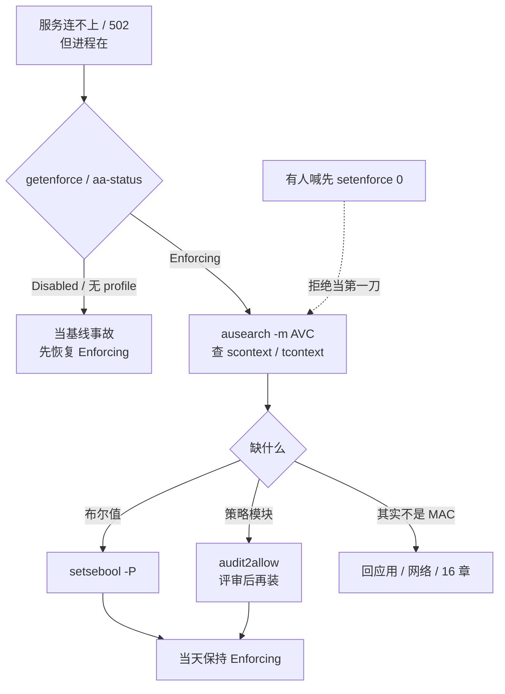
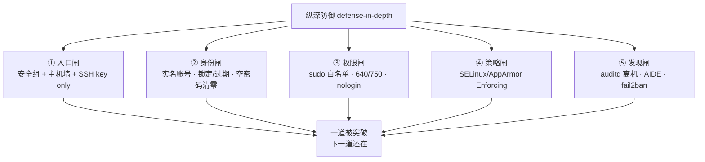
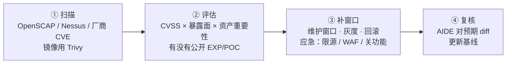
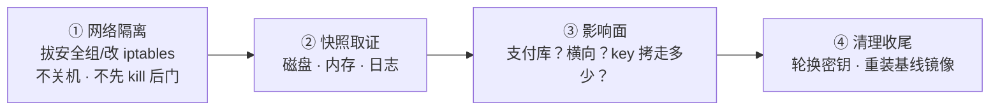
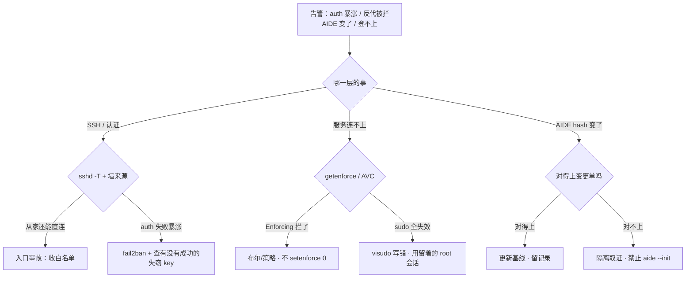

# Linux 安全加固

> 凌晨两点 `/var/log/secure` 一分钟上千条 Failed password：有人喊「把 22 改成 2222」，有人发 `setenforce 0` 让反代先通，有人给 deploy 开 `NOPASSWD: ALL`——每一刀都在拆自己的墙。
> **本章回答**：一台裸机从出厂到扛得住一次入侵的一生——少开门、管住人、收住权、留下痕，出事了怎么收场。
> **不讲**：文件权限与 SUID/特殊位原理 → [25](../25-用户权限与特殊位/)；SSH 协议与 sshd 深配 → [26](../26-SSH与远程访问/)；五链四表与 conntrack → [17](../17-iptables与conntrack/)；sysctl 机制与落盘 → [24](../24-内核参数与sysctl/)；人从哪进生产 → [28](../28-堡垒机与跳板机/)。

**标记**：🎯重点 · 🔥难点 · ⭐常考 · 🔧实操

---

## 一、一张图：一台裸机的加固一生

> 🎯 **一句话**：加固是纵深防御链：减面 → 管人 → 收权 → 锁门 → 筑墙 → 第二道墙 → 留痕 → 闭环。


- 📖 **读图**
  - 🛤️ 主角是机器的一生：十个阶段各是一道闸，**任何一道单独被突破，下一道还在**——这就是纵深防御（defense-in-depth）
  - 🧱 收成三层记：**入口**（①④⑤）· **权限**（②③⑥）· **发现**（⑧）；⑦⑨⑩ 是贯穿治理与兜底
  - 🩺 值班照妖镜按层分：入口 `sshd -T` + `iptables -L`；权限 `sudo -l` + `getenforce`；发现 `ausearch` + `aide --check`——**先分哪一层，再动手**

---

## 二、减面：少开门——服务、端口与 SUID ⭐

> 🎯 **一句话**：攻击面 = 能被打的入口总数；先减面，再给剩下的门装闸。

> 💡 **打个比方**：一台机器像一栋楼，每个监听端口是一扇门店。保安再能干，开一百家店也盯不过来——先关没生意的店。

### ✂️ 减面三刀

1. **关服务**：`systemctl list-unit-files --state=enabled` 逐个问「这台机器要它干嘛」
   - 经典该关：`avahi-daemon`、`cups`、`bluetooth`、`rpcbind`（无 NFS 时）、`postfix`（不对外发信时）
2. **关端口**：`ss -tulpn` 每一行都要答「**谁在听、给谁服务**」
   - 答不上来的先查包名再关；**墙挡住 ≠ 可以留着监听**——服务还在就有本地提权面
3. **清 SUID**：SUID（Set User ID）= 运行时以**文件属主**身份执行；`passwd` 那几个合法，**多出来的陌生文件先隔离再查**
   - 原理与 `/4000` → [25](../25-用户权限与特殊位/)；本章只背结论命令

#### ❓ 为什么先减面再装闸？墙挡不住本地提权面？

- ❌ **只装墙不减面**：服务还在监听——一次 SSRF / 本地漏洞就能摸到 `127.0.0.1` 上的老服务
- ✅ **减面 = 少开门**（服务不跑、端口不听）；**墙 = 门上加闸**（服务还在、包进不来）——两层都要，墙不能替代减面
- 🔍 新机验收三连：

```bash
systemctl list-unit-files --state=enabled | head -20
# avahi-daemon.service     enabled   ← 游戏服基本用不上
ss -tulpn
# udp   UNCONN 0.0.0.0:5353  users:(("avahi-daemon",pid=812,fd=15))   ← 一条龙关
find /usr/bin /usr/sbin /tmp /data -perm /4000 -ls 2>/dev/null
# -rwsr-xr-x 1 root root ... /tmp/pkexec2   ← /tmp 下 SUID = 大概率被入侵，隔离！
```

> ⚠️ **别混**：减面 ≠ 防火墙——见上 ❓；别处「见二节」。

> 📝 **面试**：「加固第一步？」——**最小化**：关多余服务/端口、清陌生 SUID，再谈 SSH、墙、MAC。顺序反了 = 给一百扇门挨个配保安。

本节对应练习题 Q2。门少了——空密码、锁定、过期怎么管？

---

## 三、管人：账号治理——每个人一把实名钥匙 ⭐🔧

> 🎯 **一句话**：一人一号、密码有策略、失败会锁、过期要清；共享账号等于没审计。

### 📋 密码策略：/etc/login.defs

**`/etc/login.defs`** = 登录相关全局默认（对已存在密码要用 `chage` 单独改）：

```text
PASS_MAX_DAYS  90     # 最长 90 天换一次
PASS_MIN_DAYS  2      # 两次改密至少隔 2 天
PASS_MIN_LEN   8      # 最短（配合 pam_pwquality 才真正生效）
ENCRYPT_METHOD SHA512 # 别再是 MD5
```

- 🔒 **失败锁定**：PAM（Pluggable Authentication Modules）的 `pam_faillock`（RHEL 8+；`pam_tally2` 已废弃）
  - `/etc/security/faillock.conf`：`deny=5` · `fail_interval=900` · `unlock_time=600`

### 👤 账号四态：正常 · 锁定 · 过期 · 删除

```bash
usermod -L deploy      # 锁定：shadow 第二列加 !，可恢复
usermod -U deploy      # 解锁
chage -M 90 deploy     # 最长 90 天必须换密码
chage -E 2026-12-31 o  # 到期后不可登录（外包标配）
usermod -s /sbin/nologin game   # 业务账号不给交互 shell
chage -l deploy        # 看策略全貌
```

#### ❓ 为什么锁定 ≠ 过期 ≠ 删除？

- 🔐 **锁定**（`usermod -L`）：密码失效，账号还在，**取证可恢复**
- 📅 **过期**（`chage -E`）：到点自动不可登录，适合外包/临时号
- 🗑️ **删除**（`userdel`）：uid 可能被新账号复用——取证场景**先锁别删**
- 口诀：**取证时锁定，治理时过期，确认无用再删**

### 🕳️ 空密码扫描 ⭐

```bash
awk -F: '($2 == "") {print $1}' /etc/shadow      # 第二列空 = 空密码，立刻置密或锁定
passwd -S deploy
# deploy LK 2026-08-30 0 90 7 -1   ← LK=锁定 / NP=空密码(事故!) / PS=有密码
```

- `/etc/shadow` 第二列：`$6$...` 有密码 · `!`/`*` 锁定 · **空 = 事故**
- 长期不登录一律 `usermod -L`；离职回收是**当天**的事（通道侧 → [28](../28-堡垒机与跳板机/)）

> 🔍 **现场**：安全组说「账号策略不合格」——五分钟出证据：

```bash
grep -E '^PASS_(MAX|MIN)' /etc/login.defs
grep -E '^(deny|unlock_time)' /etc/security/faillock.conf 2>/dev/null
awk -F: '($2==""){print $1}' /etc/shadow   # 空输出 = 没有空密码
last -a | head        # 一年前的日期 = 疑似僵尸账号
```

> 📝 **面试**：一人一号、`login.defs`（90/SHA512）、`pam_faillock` 5 次锁 10 分钟、空密码零容忍、外包 `chage -E`、业务 `nologin`、离职当天回收。收尾：**共享 ops 账号 = 审计全拆**。

本节对应练习题 Q3。开头那位给 deploy 开 NOPASSWD ALL——收权怎么写？

---

## 四、收权：sudo 白名单与文件底线 ⭐

🔥 `NOPASSWD: ALL`——**加固等于没做**。口诀：**「visudo 编辑，白名单到命令」**（练习题 Q4）。

> 🎯 **一句话**：sudo 白名单到具体命令；`NOPASSWD: ALL` 等于把白名单整拆。

> 💡 **打个比方**：sudo 像**酒店房卡**——deploy 只能开 808（restart nginx）。`sudo su -` 是万能钥匙；`NOPASSWD: ALL` 是把钥匙架挂在 anybody 门口。

```text
# /etc/sudoers（必须 visudo 编辑）
Cmnd_Alias NGINXCTL = /bin/systemctl restart nginx, /bin/systemctl reload nginx
deploy ALL=(root) NGINXCTL
deploy ALL=(root) !/bin/su, !/bin/bash, !/bin/sh    ← 显式禁 shell 逃逸
Defaults timestamp_timeout=5    # sudo 缓存 5 分钟，别默认 15
```

#### ❓ 为什么黑名单挡不住逃逸？`NOPASSWD: ALL` 为什么是事故？

- ❌ `!/bin/bash` **挡不住** `less` / `vim` / `find -exec` 弹 shell——黑名单只是第二道网
- ✅ 正解：**只放业务必需的二进制和参数**；临时 root 走审批 + 堡垒限时授权（[28](../28-堡垒机与跳板机/)），别写 ALL
- 🧯 **visudo 写错 = sudo 全体失效**：① 留已登录 root/云 console；② 只用 `visudo`；③ 改完 `sudo -l -U deploy` 核对——**重启修不好语法错误**

> 🔍 **现场**：看**实际生效**权限，不是看文档：

```bash
sudo -l -U deploy
#     (root) /bin/systemctl restart nginx, /bin/systemctl reload nginx
#     (root) !/bin/su, !/bin/bash, !/bin/sh
# ← 看到 (ALL) NOPASSWD: ALL = 加固等于没做
```

### 📁 文件底线（原理 → [25](../25-用户权限与特殊位/)）

- 配置 `640`、目录 `750`；**`chmod 777` = 谁都能改，植入后门无法追责**
- `umask` 常见 `022`；业务进程独立低权账号：`useradd -r -s /sbin/nologin game`
- systemd 补充收紧：`User=` · `NoNewPrivileges=yes` · `ProtectSystem=strict`（→ [11](../11-Systemd与服务管理/)）——不替代 sudo，也不替代 MAC

> ⚠️ **别混**：黑名单 ≠ 白名单主防线——见上 ❓。

> 📝 **面试**：Cmnd_Alias 到具体二进制和参数、禁 su/bash、`timestamp_timeout=5`、每人独立账号、`visudo` + 留 root 会话、临时 root 走审批不写 NOPASSWD。

本节对应练习题 Q4。SSH 加固清单哪些是底线？改完怎么不锁死自己？

---

## 五、锁门：SSH 加固清单 ⭐

🔥 「把 22 改成 2222」当加固——**不够**。口诀：**改端口只是藏门牌，禁密码、禁 root、限来源才是锁门**（练习题 Q5）。

> 🎯 **一句话**：核心四件——禁密码、禁 root、限来源、只用 key；改端口只减扫描噪音。

协议深配 → [26](../26-SSH与远程访问/)；产品化入口 → [28](../28-堡垒机与跳板机/)。本章只留清单与验收：

```text
# /etc/ssh/sshd_config.d/99-hardening.conf
PermitRootLogin no            # 禁 root 直登——审计对到人
PasswordAuthentication no     # 关密码通道——撞库面消失
PubkeyAuthentication yes
KbdInteractiveAuthentication no
AllowUsers deploy@10.0.0.0/8  # 谁 + 从哪（堡垒网段）
MaxAuthTries 3
LoginGraceTime 30
ClientAliveInterval 300
ClientAliveCountMax 2
X11Forwarding no
AllowTcpForwarding no         # 业务机不开转发
PermitTunnel no
```

#### ❓ 为什么改端口不算加固完成？

- 📡 **改端口**治的是**噪音**（扫描日志少一点）；扫描器照样全端口扫到
- 🔑 **真正让撞库失效**的是关密码；**让审计对到人**的是禁 root；**让公网打不到**的是墙 + `AllowUsers` 限 CIDR——三件才是锁门
- 🛠️ 改 sshd 不锁死五步：① 留 console；② `sshd -t`；③ **reload** 不 restart；④ **另开新会话**验（当前 ESTABLISHED 骗得了你）；⑤ 墙同步新端口

> 🔍 **现场**：看**生效值**，不是配置里被注释的那行：

```bash
sshd -T | grep -E 'permitrootlogin|passwordauthentication|pubkeyauthentication|allowusers|maxauthtries'
# permitrootlogin no
# passwordauthentication no        ← 这两个 no 是底线
# allowusers deploy@10.0.0.0/8
sshd -t && systemctl reload sshd
```

| `sshd -T` 字段 | 合格 | 事故 |
|------|------|------|
| `permitrootlogin` | `no` | `yes` = 审计分不清人 |
| `passwordauthentication` | `no` | `yes` = 撞库面 |
| `allowusers` | 带 `@CIDR` | 无限制 = 全世界可试 key |
| `maxauthtries` | `3` | 默认 `6` = 撞库窗口大 |

- 🗝️ **key 被盗**：立刻从 `authorized_keys` 拿掉 → 堡垒吊销 → 轮换可能被拷走的 key → 查 auditd/录像。**不要只改 passphrase 却让旧公钥还留在 200 台机器上**

> ⚠️ **别混**：改端口 ≠ 加固完成——见上 ❓。

> 📝 **面试**：禁密码、禁 root、AllowUsers 限堡垒网段、key only、`sshd -T` 看生效、`sshd -t` 后 reload 并另开会话验。追问改端口——改，但只当减噪音。

本节对应练习题 Q5。防火墙默认 DROP 怎么白名单化？

---

## 六、筑墙：防火墙白名单化 ⭐

> 🎯 **一句话**：默认 DROP，白名单放行；云安全组第一层，主机墙第二层。

规则写法 → [17](../17-iptables与conntrack/)；本章管**策略与验收**：

```text
最小化清单：
1. INPUT 默认 DROP
2. 先放 ESTABLISHED,RELATED（回包总闸）
3. SSH 只放堡垒机 CIDR，不要公网 22
4. 业务口只放 LB / 内网上游，不对 0.0.0.0/0
5. 非路由器：ip_forward=0、FORWARD DROP
6. 出站也收：NTP/DNS/制品库显式放
7. 改完另一条会话验证
8. iptables-save / firewalld 持久化（细节 17）
```

#### ❓ 为什么当前 ssh 还在 ≠ 没锁死？

- 🧵 **当前会话是 ESTABLISHED**，靠总闸活着；新开连接才走新规则
- ✅ 验证必须**另开一条新 ssh**；当前窗口不能当证据
- 🧯 防锁死六步：留 console → 先放 `ESTABLISHED,RELATED` → `-I` 放管理网段 → 再 DROP → 新 ssh 验 → save

> 🔍 **现场**：验收看 `policy` 和 `source`：

```bash
iptables -L INPUT -n -v --line-numbers | head
# Chain INPUT (policy DROP ...)   ← policy DROP 才算白名单化
# 1  ... ACCEPT  all  ... state RELATED,ESTABLISHED
# 2  ... ACCEPT  tcp  ... 10.0.0.0/8  ... tcp dpt:2222
#                              ↑ 来源是堡垒网段，不是 0.0.0.0/0
```

- 🏠 **从家里还能直连业务机 = 入口事故**：收白名单，不是口头「别直连」
- ☁️ 云安全组在虚拟化层、主机墙在 guest 内核，**两层串联**（→ [06-01](../../06-云平台/01-云网络与安全/)）；健康检查源、CDN 回源最容易漏放

> ⚠️ **别混**：当前会话还在 ≠ 规则安全——见上 ❓。

本节对应练习题 Q6。安全向 sysctl 调哪些？

---

## 七、拧内核旋钮：安全向 sysctl 🔥

> 🎯 **一句话**：安全向 sysctl 收「信息泄露面」和「被当跳板的面」；和性能旋钮分开两份文件。

机制与落盘 → [24](../24-内核参数与sysctl/)；本章管**该拧哪些**：

```text
# /etc/sysctl.d/99-security.conf
net.ipv4.conf.all.accept_redirects = 0      # 不听 ICMP 重定向
net.ipv4.conf.default.accept_redirects = 0
net.ipv4.conf.all.accept_source_route = 0   # 不收源路由
net.ipv4.tcp_syncookies = 1                 # SYN Flood 缓解
net.ipv4.ip_forward = 0                     # 非路由器不开转发
net.ipv4.conf.all.rp_filter = 1             # 反向路径校验

kernel.kptr_restrict = 2                    # 内核指针对所有人打码
kernel.dmesg_restrict = 1                   # dmesg 仅 CAP_SYSLOG
kernel.yama.protected_symlinks = 1          # /tmp 软链提权防护
kernel.yama.protected_hardlinks = 1
kernel.perf_event_paranoid = 2              # 收紧 perf（防侧信道）
```

#### ❓ 为什么要 kptr_restrict / dmesg_restrict？syncookies 能当防火墙吗？

- 🕵️ 攻击者摸清内核地址布局（`/proc/kallsyms`、`dmesg`）是提权利用的**前置步骤**
  - `kptr_restrict=2` → `cat /proc/kallsyms` 全是 `0000…`
  - `dmesg_restrict=1` → 普通用户 `dmesg` 直接 Operation not permitted（**排障用 sudo dmesg，别当日志坏了**）
- ❌ `tcp_syncookies=1` **只是 SYN Flood 缓解**，不是防火墙——墙管「谁能连」，syncookies 管「半连接被打满时握手还能不能完成」（队列 → [12](../12-网络栈与Socket/)）
- 📂 **安全 conf 与性能 conf 分文件**（`99-security.conf` vs `99-web.conf`），别混成「万能优化清单」

- 可选：`icmp_echo_ignore_all=1` 禁 ping——排障和云探活都会疼；书面风险接受即可
- 改完 `sysctl --system` 并确认落盘（[24](../24-内核参数与sysctl/)）

> ⚠️ **别混**：syncookies ≠ 防火墙；`dmesg` 没输出 ≠ 日志坏了——见上 ❓。

本节对应练习题 Q7。开头那位 `setenforce 0`——DAC 和 MAC 差在哪？

---

## 八、第二道墙：SELinux 与 AppArmor 🔥

🔥 反代 502 但 curl 通就 `setenforce 0`——**拆第二道墙**。口诀：**「先 ausearch，再放行；别 setenforce 0」**（练习题 Q8～Q10）。

> 🎯 **一句话**：DAC 问「属主同不同意」，MAC 问「策略允不允许」——root 也拦。

> 💡 **打个比方**：DAC 像**自家门锁**——房主同意就能进，root 是万能钥匙；MAC 像**大厦门禁制度**——规章说机房只有运维域能进，房主本人也被拦。

### ⚖️ DAC vs MAC ⭐

| 对比 | DAC | MAC |
|------|-----|-----|
| 谁说了算 | 属主/组/other 的 rwx | 内核强制策略 |
| root | 通常全能 | **仍可能被拦** |
| 典型命令 | `chmod` / `chown` | `getenforce` / `ausearch -m AVC` |
| 拦了怎么修 | 改权限位 | 补策略/布尔值，**不是关 MAC** |

#### ❓ 为什么 curl 通、Nginx 却 502？

- 钉死一例：Nginx 反代连不上游 8080，本机 `curl 127.0.0.1:8080` 通
  - 进程以 `nginx` 用户跑 → **DAC 已过**
  - SELinux 看标签：`httpd_t` 域默认不允许 `name_connect` 到任意端口 → **AVC denied**
  - 你的 shell **不是** `httpd_t`，所以 curl 通、Nginx 502——「502 但进程在」的经典 MAC 签名

### 🚦 SELinux 三模式与 AppArmor

- **SELinux**（标签 + 策略，RHEL/CentOS/Rocky）
  - **Enforcing**：拦 + 记 AVC——**生产目标**
  - **Permissive**：只记不拦——排查窗口，**当天必须回 Enforcing**
  - **Disabled**：连审计都没有——**不要写进生产镜像**
- **AppArmor**（路径 + profile，Ubuntu/Debian）：`enforce` / `complain` / 无 profile

| 对比 | SELinux | AppArmor |
|------|---------|----------|
| 模型 | 标签 + 策略 | 路径 + profile |
| 看状态 | `getenforce` / `sestatus` | `aa-status` |
| 拦了记在哪 | AVC（`ausearch -m AVC`） | `dmesg` / journal |
| 临时放行 | `setenforce 0`（当天回） | `aa-complain`（当天回） |

#### ❓ 为什么不能把 setenforce 0 当第一刀？Permissive ≠ Enforcing？

- ❌ Permissive **还能看 AVC**，但**不拦**——不是「开着 SELinux 在防护」
- ❌ Disabled 连审计都没有 = 拆除；`setenforce 0|1` **回不到 Disabled**（要改配置重启）
- ✅ 修法优先级：`setsebool -P` → 评审后 `audit2allow` → 临时 Permissive 只给排查窗口、当天回
- 🏷️ 标签看不懂别瞎 `chcon -R`——先布尔，恢复默认用 `restorecon -Rv <path>`

> 🔍 **现场**：反代 502、curl 通、有人发 `setenforce 0`——拒绝当第一刀：

```bash
getenforce
# Enforcing
ausearch -m AVC -ts recent | tail -3
# avc:  denied  { name_connect } for  ... comm="nginx"
#   scontext=...:httpd_t:s0      ← 谁想干
#   tcontext=...:http_port_t:s0  ← 碰什么
setsebool -P httpd_can_network_connect on
getsebool httpd_can_network_connect
# httpd_can_network_connect --> on
ls -Z /var/www/html | head -2
# system_u:object_r:httpd_sys_content_t:s0 index.html
ps -eZ | grep nginx | head -2
# system_u:system_r:httpd_t:s0            nginx
```



- 📖 **读图**
  - 🚪 先分三态：Disabled 本身是事故；Enforcing 才进 AVC
  - 🏁 所有修法终点 = **当天保持 Enforcing**；`setenforce 0` 永远不在第一刀

### 📦 容器场景

K8s 节点上 SELinux 常见被关——现实妥协，不是最佳实践。纪律：① **不能拿「已经上 K8s」关 SELinux / 开密码登录**——容器隔离（→ [03-13](../../03-Kubernetes/13-RBAC与安全/)）不替代宿主机 MAC；② 能保持 Enforcing 的宿主机尽量保持。

### 🧩 收束：纵深防御——五道闸 🎯⭐

面试问「生产机怎么加固」，答这张图——**五道闸，各拦一类攻击**：



- 📖 **读图**
  - 🛤️ 攻击者要过的关：连上 → 登录 → 提权 → 横向 → 留痕
  - 🧱 三层分组：**入口（①）· 权限（②③④）· 发现（⑤）**；每层第一刀：`sshd -T`+墙、`sudo -l`+`getenforce`、`ausearch`+`aide --check`

> ⚠️ **别混**：五道闸**不保证**「都过了就不被入侵」——0day 从 80 直进业务进程，五闸管的是**系统侧与提权侧**；任何一道都不是银弹。

> 📝 **面试**：按「**三层五闸**」背——入口、身份、权限（sudo+文件+MAC）、发现；追问「哪道最重要」→ 纵深：**没有最重要，只有最薄弱**。

本节对应练习题 Q8～Q10。fail2ban、auditd、AIDE 各留什么痕？

---

## 九、站岗：fail2ban、auditd 与文件完整性 ⭐🔥

> 🎯 **一句话**：事中挡噪音、事后对到人、出事能发现——发现层必须离机。

### 🚧 fail2ban：挡扫描，不是挡失窃 key

**fail2ban** = 盯日志 + 正则匹配失败 + 自动封 IP：`findtime` 内满 `maxretry` → 封 `bantime`。

```ini
# /etc/fail2ban/jail.local
[sshd]
enabled  = true
maxretry = 3
findtime = 600
bantime  = 3600
```

#### ❓ 为什么 Total banned 再高也不等于入口合格？

- ✅ fail2ban 挡的是**失败尝试**（扫描/撞库）
- ❌ **挡不住**已进堡垒的失窃 key、合法 key 的恶意操作——失窃 key 靠吊销 + MFA + 查录像（[28](../28-堡垒机与跳板机/)），不是加大 bantime
- 仍须核对：家里能不能直连、密码通道关没关

> 🔍 **现场**：

```bash
fail2ban-client status sshd
# `- Total banned:     120     ← 涨 = 扫描多，不说明入口已合格
```

### 📜 auditd：追责靠内核审计，不靠 history ⭐

**auditd** = 内核审计子系统；**`history` 是用户可清可改的记事本**——`history -c` 一秒清空。

```bash
systemctl is-active auditd
# active
# /etc/audit/rules.d/audit.rules
-w /etc/passwd -p wa -k identity
-w /etc/shadow -p wa -k identity
-w /etc/sudoers -p wa -k sudoers
-w /etc/ssh/sshd_config -p wa -k sshdcfg
ausearch -k sudoers -ts recent | tail -5
```

#### ❓ 为什么 history 空不能结案？本机 audit.log 够吗？

- ❌ history 可清可改；root 还能直接改本机日志
- ✅ 生产 = 规则 + **离机转发**（rsyslog/agent，→ [23](../23-日志运维/)）

### 🔑 登录与密钥痕迹

```bash
last -a | head
lastb | head
grep -E 'Accepted|Failed' /var/log/secure | tail -30   # Debian 系 auth.log
```

| 信号 | 可能含义 | 下一步 |
|------|----------|--------|
| `Accepted publickey` 来自非堡垒 IP | 入口没收或 key 泄漏 | 当事故；吊销 + 收墙 |
| `Failed password` 暴涨 | 扫描 | fail2ban + 确认密码通道已关 |
| `authorized_keys` 多出陌生行 | 植入后门 key | 隔离；对 AIDE；轮换 |
| `last` 有非值班窗口登录 | 失窃会话/key | 查堡垒录像 + auditd |

### 📸 文件完整性：md5 → AIDE → IMA

- **手工基线**：干净安装后 `md5sum /usr/bin/* > baseline.md5`，定期 `-c`
- **AIDE**（Advanced Intrusion Detection Environment）：按配置监控关键路径 hash
- **IMA**（Integrity Measurement Architecture）：内核侧度量——知道「比 AIDE 更靠近内核」即可

#### ❓ 为什么中招后再 `aide --init` 是事故？

> 💡 **打个比方**：AIDE 基线是**出厂照片**。中招后再拍 = 给装了后门的机器来张全家福，后门从此「合法」。

- ✅ `aide --init` **只能在确认干净时做**
- ❌ 中招后再 init = **把后门写进信任根**
- ⚠️ AIDE 报变 ≠ 入侵——**先对变更单**（补丁/发版）；对得上更新基线，对不上才隔离。只监控 `/etc` 不够，后门常在 `/usr/bin`

```bash
aide --check
# File: /usr/bin/ssh
#   S : Size   M : Permissions   MD5 : Hash
# Changed files: 1
```

本节对应练习题 Q11、Q12。漏洞管理与 CIS 怎么闭环？

---

## 十、闭环：漏洞管理与安全基线 ⭐

> 🎯 **一句话**：漏洞管理是流程——扫描 → 评估 → 补窗口；基线镜像把成果固化出厂。

### 🔄 漏洞管理三步 🔥



- 📖 **读图**
  - 📋 扫描给出的是**清单不是工单**——公网 + 有 EXP + 支付资产 = 最高优先
  - ⏱️ 补不上用缓解顶住；高危补丁 SLA 要有明文（如高危 7 天、严重 24 小时）
  - ✅ 打完补丁 AIDE 必红，对得上预期才更新基线

### 📐 等保与 CIS 基线

- **等保**：国内合规，游戏/支付常见**三级**；SSH/审计/堡垒都是考点。**合规是底线不是安全上限**
- **CIS / Lynis / OpenSCAP**：几十条不过分三类
  - **高危必修**（密码登录、root SSH、SELinux Disabled、777、无审计）
  - **架构冲突书面接受**（NAT 机要 `ip_forward=1`）
  - **噪音可接受**（改 banner、禁 ping）
- **基线镜像 vs 手搓**：手搓每台会漂；正解是**加固镜像出厂**，中招直接重装，不在染毒机「修到绿」

**新机验收（过线才上流量）**：

```bash
sshd -T | grep -E 'permitrootlogin|passwordauthentication|allowusers'
getenforce
sudo -l
iptables -L INPUT -n | head -5
systemctl is-enabled auditd chronyd
# 硬验收：办公网直连应失败；从堡垒机进应成功
```

| 变更 | 正确姿势 | 事故姿势 |
|------|----------|----------|
| sshd | 留会话 → `-t` → reload → 新会话验 | restart 赌；不验新会话 |
| 防火墙 | 先 ACCEPT 再收紧；另会话验；save | 先 DROP 锁死；reboot 丢规则 |
| 补丁 | 变更单 → 打补丁 → AIDE 对预期 → 更新基线 | 全红后 `--init` 消告警 |
| 密钥 | 离职当天吊销；泄漏先 revoke | 旧 key 留着只改 passphrase |
| sudoers | `visudo` + 留 root 会话 | 直接 vi；写完注销 |

> 📝 **面试**：扫描 → 评估（CVSS × 暴露面 × 资产）→ 补窗口（灰度+回滚，应急限源/WAF）→ 复核更新 AIDE。收尾：**扫描过了 ≠ 不会被入侵，基线不是 IDS**。

本节对应练习题 Q11～Q13。发现入侵 60 秒怎么走？

---

## 十一、出事：入侵响应与定责 🔧

> 🎯 **一句话**：发现入侵先网络隔离、不关机取证；定责先分哪一层。

### 🧯 入侵响应四步



#### ❓ 为什么先隔离不关机？终点为什么是重装？

- 🛑 先隔离：防后门**外联和继续破坏**
- 🧠 不关机：**内存里有活证据**（连接、解密密钥），一关机就没了
- 🔄 ④ 的终点是**重装基线**，不是「在染毒机上修干净」

- 📖 **读图**：顺序不能乱——隔离 → 取证 → 定性 → 重装；发现信号来自九节（AIDE 对不上变更单、非白名单登录、未知 SUID、异常外连、auditd 异常写）

### 🗺️ 定责决策树



- 📖 **读图**
  - 🔀 三种典型告警各走一条支线
  - 🚫 两条全章红线：`setenforce 0` 当第一刀、中招后 `aide --init`

### 现象 · 先做 · 别做

| 现象 | 先做 | 别做 |
|------|------|------|
| Nginx 反代被 SELinux 拦 | `ausearch -m AVC`；`setsebool -P` | `setenforce 0` 当第一刀 |
| 改完 sshd 登不上 | console；查墙是否同步端口 | 再 restart 一次赌 |
| visudo 写错全员失效 | 留着的 root 会话 / 云 console | 重启碰运气 |
| AIDE 报 /usr/bin/ssh 变了 | 对变更单；对不上当入侵 | 先 kill 再 `aide --init` |
| history 是空的 | auditd 离机 + 堡垒录像 | 断定「没人来过」结案 |
| 从家里还能 SSH | 当入口事故收安全组 | 「反正有 key」放过 |
| auth 失败暴涨 | `sshd -T` + 来源墙 + fail2ban | 只改端口当结案 |
| CIS 几十条不过 | 高危必修；冲突书面接受 | 每条噪音当 P0，或全不修 |

### ⏱️ 60 秒剧本 🔧

> 🔍 **现场**：安全告警进来，60 秒走完三问：

```text
① 0–20s  门还在不在？sshd -T 关键项；iptables -L INPUT -n | head；办公网直连（应失败）
② 20–40s 权拆没拆？sudo -l 是不是 ALL；getenforce；ausearch -m AVC
③ 40–60s 看得见吗？auditd 是否 active；日志离机路径；aide --check 对不对得上变更单
```

本节对应练习题 Q14。开头那三个人——改端口、setenforce 0、NOPASSWD ALL——你已经知道该怎么拦住他们了。

---

## 十二、收口

### 命令速查 🔧

```bash
# 减面
systemctl list-unit-files --state=enabled
ss -tulpn
find /usr/bin /usr/sbin /tmp /data -perm /4000 -ls
# 账号
chage -l <user>; passwd -S <user>
awk -F: '($2==""){print $1}' /etc/shadow
# sudo / SSH / 墙
sudo -l -U <user>
sshd -T | grep -E 'permitrootlogin|passwordauthentication|allowusers'
sshd -t && systemctl reload sshd
iptables -L INPUT -n -v --line-numbers
# MAC / 站岗
getenforce; ausearch -m AVC -ts recent
setsebool -P httpd_can_network_connect on
fail2ban-client status sshd
ausearch -k sudoers -ts today
aide --check
last -a | head; lastb | head
grep -E 'Accepted|Failed' /var/log/secure | tail
sysctl kernel.kptr_restrict kernel.dmesg_restrict net.ipv4.tcp_syncookies
```

### 面试锚点

遮住右列自问自答，卡壳的行回去重读对应小节——这张表就是本章的「30 秒口径速查」。

| 问 | 30 秒答 |
|----|---------|
| 生产机怎么加固？ | 减面→管人→收权→锁门→筑墙→MAC→留痕：入口/权限/发现三层五闸纵深防御。 |
| 改 2222 端口算加固吗？ | 只减扫描噪音；核心是禁密码、禁 root、限来源、key only。 |
| sudo 怎么写？ | Cmnd_Alias 白名单到命令，禁 su/bash，timestamp_timeout=5，visudo 留 root 会话。 |
| DAC 和 MAC？ | DAC 属主同不同意，MAC 内核策略，root 也拦；chmod 解决不了 MAC。 |
| Permissive 和 Disabled？ | Permissive 只记不拦、排查窗口当天回；Disabled 是拆除，别进镜像。 |
| 被 SELinux 拦了第一刀？ | getenforce → ausearch -m AVC → setsebool / 评审后 audit2allow；setenforce 0 是事故。 |
| history 空能结案吗？ | 不能；history 可清可改，靠 auditd 离机 + 堡垒机录像。 |
| AIDE 什么时候 init？ | 确认干净时；中招后再 init = 把后门写进信任根。 |
| fail2ban 挡得住什么？ | 只挡扫描撞库的失败尝试；失窃 key 靠吊销 + MFA。 |
| 安全向 sysctl 有哪些？ | redirects/source_route=0、syncookies=1、非路由 ip_forward=0、rp_filter=1；kptr_restrict=2、dmesg_restrict=1。 |
| 上了 K8s 还要加固宿主机吗？ | 要；容器层 PSS/RBAC 不替代宿主机 MAC 和入口。 |
| CIS 不过每条都修吗？ | 高危必修、架构冲突书面接受、噪音记录在案；扫描过了不是 IDS。 |
| 发现入侵第一步？ | 网络隔离不关机 → 快照取证 → 影响面 → 轮换重装；不在染毒机修到过线。 |

### 易错一句话对照

- 改成 2222 就算加固完成 → 只减噪音，核心是 key only + 限来源
- `NOPASSWD: ALL` 方便值班 → 白名单到命令；ALL 是拆墙
- 被拦先 `setenforce 0` → 先 AVC 查谁拦了谁，关 Enforcing 是事故
- Permissive 等于开着 SELinux → 只记不拦
- 拿 K8s 当关 SELinux 的理由 → 容器隔离不替代宿主机 MAC
- history 空 = 没人操作过 → 可清可改，靠 auditd 离机
- 本机 audit.log 够合规 → root 能改，必须离机
- 中招后 `aide --init` 重建基线 → 把后门写进信任根
- fail2ban 能挡失窃 key → 只挡失败尝试；key 靠吊销和 MFA
- `chmod 777` 先跑起来 → 配置 640、目录 750
- syncookies = 防火墙做好了 → 只是 SYN Flood 缓解
- 当前 ssh 还在 = 没锁死 → 它是 ESTABLISHED，验证要新开会话
- 扫描过了就不会被入侵 → 基线不是 IDS
- `dmesg` 没输出 = 日志坏了 → dmesg_restrict=1 的正常表现，用 sudo

### 数字墙

> `MaxAuthTries 3` · `ClientAliveInterval 300` / `CountMax 2` · `LoginGraceTime 30` · 密码策略 `90/2/8` 天 · faillock `deny=5` / `unlock_time=600` / `fail_interval=900` · 文件 `640` / 目录 `750` / `/tmp` `1777` · `umask 022` · fail2ban `maxretry=3` / `findtime=600` / `bantime=3600` · `timestamp_timeout=5` · `kptr_restrict=2` · `dmesg_restrict=1` · `syncookies=1` / `rp_filter=1` / `ip_forward=0` · 高危补丁 SLA 常 `7 天`、严重 `24 小时`

---

## 合上书

对齐练习题「合上书」，逐条口述，卡住就回对应节 / 题号。

- [ ] **默画一节的图**：裸机出厂到加固机的十个阶段，收成「入口/权限/发现」三层；说出五道闸各拦什么。
- [ ] **口述减面**：攻击面是什么、关服务关端口怎么查、SUID 扫查与「多出来的先隔离」；减面和防火墙为什么不互替。
- [ ] **口述管人**：login.defs 四项、faillock 三参数、锁定/过期/删除三态、空密码怎么扫、离职什么时候收。
- [ ] **讲清收权**：sudoers 白名单怎么写、`NOPASSWD: ALL` 为什么是事故、visudo 写错怎么逃、777 为什么是底线失守。
- [ ] **口述锁门**：SSH 核心四件、`sshd -T` 看什么、`-t` 后 reload 且另开会话验、key 被盗四步。
- [ ] **讲清筑墙**：默认 DROP 清单八条、安全组与主机墙两层、从家还能直连算哪层事故。
- [ ] **口述拧旋钮**：安全向 sysctl 两类（防当跳板/防泄露面）、kptr/dmesg_restrict 各防什么、为什么和性能 sysctl 分文件。
- [ ] **默画 DAC vs MAC 例子**：Nginx 502 但 curl 通的完整链路；三模式区别；被拦修法优先级与「当天回 Enforcing」。
- [ ] **口述站岗**：fail2ban 机制与边界、auditd watch 规则（-w/-p/-k）、AIDE init 时机、发现入侵四步为什么先隔离不关机。
- [ ] **定责**：决策树三条支线、60 秒三问剧本、两条全章红线（`setenforce 0` 第一刀、中招 `aide --init`）。

下一章把「人从哪进生产」接上：[堡垒机与跳板机](../28-堡垒机与跳板机/)。门闩回看 [26](../26-SSH与远程访问/) · 墙的细则回看 [17](../17-iptables与conntrack/) · 权限原理回看 [25](../25-用户权限与特殊位/)。
