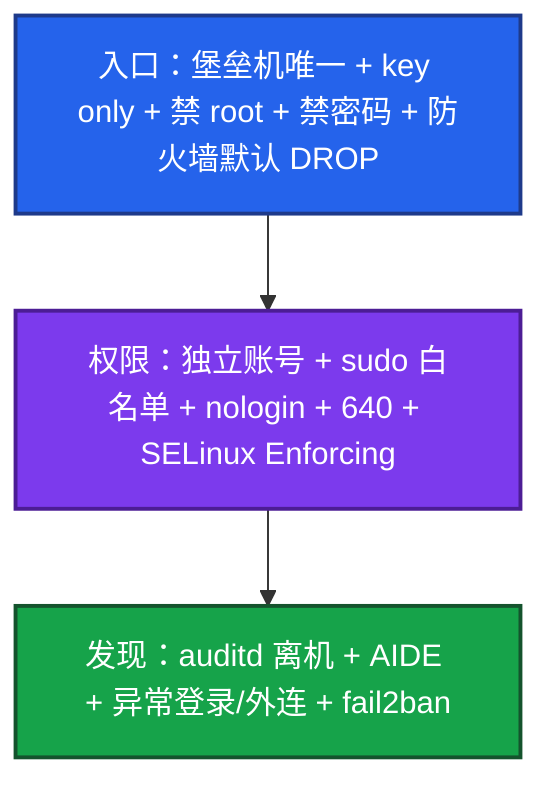
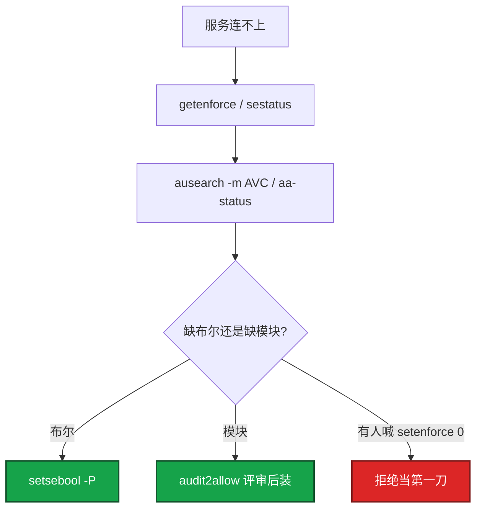

# 27｜Linux 安全加固 · 练习题

先对照 [知识点](知识点.md)：**先 §2 总图，再 §4～§8，再 §10 定责树**。能讲清三层再谈 AVC。每题标了覆盖范围：

| 标记 | 含义 |
|------|------|
| **核心** | 不懂整章就没建立起来 |
| **必会** | 值班和面试都要能讲 |
| **常用** | 线上会反复碰到 |
| **常考** | 白板和追问的高频口径 |

## 本题目录

- [Q1 三层加固](#q1)
- [Q2 sshd](#q2)
- [Q3 sudo](#q3)
- [Q4 防火墙最小化](#q4)
- [Q5 SELinux / AppArmor](#q5)
- [Q6 DAC vs MAC](#q6)
- [Q7 发现与入侵](#q7)
- [Q8 auditd / AIDE](#q8)
- [Q9 权限与 777 / SUID](#q9)
- [Q10 变更红线](#q10)
- [Q11 CIS 合规](#q11)
- [合上书](#合上书)

---

## Q1

**★★★★★｜生产服务器怎么加固？从入口讲到发现**

**覆盖**：核心 · 必会 · 常考

**对应**：知识点 §1 · §2.0 · §2.1

### 场景

安全同学问：「你们游戏逻辑服机器怎么加固的？」有人只答「改了 22 端口」。

### 完整解答

**一句话**：加固是入口（堡垒机 + key only）→ 权限（sudo 白名单 + MAC）→ 发现（auditd 离机 + AIDE）三层，改端口不是核心。

按三层讲，不要堆工具名：



新机从加固基线镜像出，CIS / Lynis 定期扫，不合格项要有人认领。合上书要能默画 §2.0 串图。

### 再追问

容器上了还要不要这些？——宿主机要。容器层靠 PSS + RBAC + NetworkPolicy（04-13）。不能拿「已经 K8s」当关 SELinux、开密码登录的理由。

---

## Q2

**★★★★★｜SSH 怎么加固？改端口算不算安全核心？**

**覆盖**：核心 · 必会 · 常考

**对应**：知识点 §4

### 场景

新环境默认 `root` + 密码。有人说「先改成 2222 顶一阵」。auth 失败暴涨时群里也有人只喊改端口。

### 完整解答

**一句话**：安全核心是禁密码、禁 root、限来源、只用 key；改端口只减扫描噪音。

```text
  错：只改 Port 2222，仍允许 root 密码
  对：PasswordAuthentication no
      PermitRootLogin no
      PubkeyAuthentication yes
      AllowUsers deploy@堡垒机网段
      MaxAuthTries 3 · ClientAliveInterval 300
      人只从堡垒机进（ssh -J）
```

| 项 | 作用 |
|----|------|
| 禁密码 | 暴力破解失效 |
| 禁 root | 审计能对到人 |
| 限 IP | 公网撞库打不到业务机 |
| key + passphrase | 私钥拷走还有口令 |
| 改端口 | 少日志噪音；扫描器仍能发现 |
| 关 X11 / TcpForwarding | 缩小跳板面 |

看生效值用 `sshd -T`，不是只看配置文件注释。改完先 `sshd -t`，再 **reload**。语法错 + restart 可能把自己锁在外面——留堡垒机 / 云控制台当逃生口（[28](../28-堡垒机与跳板机/)）。防火墙必须同步新端口。

从家里还能直连 = **入口事故**（安全组/主机墙没收），不是「sshd 写错了一行」这么轻。

### 再追问

key 被盗了怎么办？——立刻吊销该公钥、查 auditd / 堡垒机录像、轮换所有可能被拷走的 key。不要只改 passphrase 却让旧 key 留着。

---

## Q3

**★★★★★｜sudo 怎么管？临时要 root 怎么办？**

**覆盖**：核心 · 必会 · 常用

**对应**：知识点 §5

### 场景

活动值班说「每次重启 nginx 都要找人 sudo」，要求 `deploy ALL=(ALL) NOPASSWD: ALL`。

### 完整解答

**一句话**：sudo 白名单到具体命令并禁 su/bash；临时 root 走审批 + 堡垒限时授权，不要 NOPASSWD: ALL。

```text
  visudo
  Cmnd_Alias NGINXCTL = /bin/systemctl restart nginx, /bin/systemctl reload nginx
  deploy ALL=(root) NGINXCTL
  deploy ALL=(root) !/bin/su, !/bin/bash, !/bin/sh
  Defaults timestamp_timeout=5
```

1. 白名单到具体命令，不要 ALL。  
2. 禁 `su`/`bash`，否则白名单形同虚设。  
3. 每人独立账号。共享 `ops` 出事对不到人。  
4. 日志进 secure/auth.log，**转发离机**。  
5. `sudo -l -U deploy` 核对实际权限。

临时 root：审批工单 → 堡垒机限时授权 → 录屏 → 到期收回。不要把「活动周」变成永久 NOPASSWD。

### 再追问

visudo 写错了会怎样？——sudo 全部失效。必须 `visudo`，并保留一个已登录的 root 会话或云控制台，直到验证 `sudo -l` 正常。重启碰运气没用。

---

## Q4

**★★★★☆｜防火墙最小化怎么做？和安全组、和 15 章什么关系？**

**覆盖**：必会 · 常用 · 常考

**对应**：知识点 §6 · §10

### 场景

房间端口对 `0.0.0.0/0` 开着。有人说「反正游戏有自己的鉴权」。改完 INPUT DROP 当前 SSH 还在，以为成功了。另有人说「开了 syncookies 就算防火墙做好了」。

### 完整解答

**一句话**：默认 DROP + ESTABLISHED 最前 + SSH 只放堡垒 CIDR；云安全组是第一层，主机防火墙是第二层；链细则在 15。

默认 **DROP**，显式放行：

1. `ESTABLISHED,RELATED` 放在前面。  
2. SSH **只放堡垒机 CIDR**，不要公网 22。  
3. 业务口只放 LB / 内网上游。  
4. 非路由器：`ip_forward=0`，FORWARD DROP。  
5. 出站也收：NTP、制品库、DNS 显式放；陌生外连拒绝或告警。  
6. 改完 **另一条会话**验证。当前 ESTABLISHED 骗得了你。保存规则，防 reboot 丢。


本章管**策略与验收**；五链四表 / NAT / conntrack 满 → [17](../17-iptables与conntrack/)。syncookies 只是 SYN Flood 缓解，不是防火墙替代品。

### 再追问

禁 ping 要不要开？——`icmp_echo_ignore_all` 可选，排障和云探活会疼，**不是必开**。扫描项书面接受即可。

---

## Q5

**★★★★★｜SELinux 和 AppArmor 差在哪？被拦了能不能关？**

**覆盖**：核心 · 必会 · 常考

**对应**：知识点 §7

### 场景

Nginx 反代连不上上游，curl 本机 127.0.0.1 通。群里有人发 `setenforce 0`，「先恢复业务」。

### 完整解答

**一句话**：被 MAC 拦了先查 AVC 补策略，不要 `setenforce 0` 当第一刀。

两者都是 **MAC**。SELinux 用标签 + 策略，RHEL 系；AppArmor 用路径 + profile，Debian 系。生产都应 **Enforcing / Enforce**。



常见修法：`setsebool -P httpd_can_network_connect on`。  
Permissive 只记不拦，排查窗口可以，当天必须回去。Disabled 连审计都没有，不要写进生产镜像。容器不替代宿主机 MAC。

### 再追问

Permissive 和 Disabled 呢？——Permissive 还能看到 AVC。Disabled 等于拆除。扫描会记一笔。活动中被拦也先布尔/策略，不要关 MAC 撑活动。

---

## Q6

**★★★★★｜DAC 和 MAC 差在哪？举一个值班例子**

**覆盖**：核心 · 必会 · 常考

**对应**：知识点 §3.2 · §7.2

### 场景

面试官：「chmod 都对了为什么还连不上？你说的 MAC 是什么？」

### 完整解答

**一句话**：DAC 是属主同不同意；MAC 是内核策略——root / 正确属主也可能被拦。

例子钉死：Nginx 以 `nginx` 用户跑（DAC 已过），`connect` 上游时 SELinux 看 `httpd_t` 标签，默认可能不允许 `name_connect` → AVC denied。你 curl 本机通，是因为 shell 不是 `httpd_t`。

| | DAC | MAC |
|--|-----|-----|
| 问什么 | 属主/组/other 同不同意 | 策略允不允许这类进程碰这类对象 |
| 典型命令 | chmod / chown | getenforce / ausearch AVC / aa-status |
| root | 通常能过 | 仍可能被拦 |

> **别混**：把 777 打开「先跑起来」解决不了 MAC；关 SELinux 也解决不了 DAC 配置错误——两层正交。

### 再追问

为什么入侵后关 SELinux 特别危险？——DAC 被拿下后，MAC 是横向移动的第二道墙；拆掉等于少一层。

---

## Q7

**★★★★★｜怎么发现机器被入侵了？发现后第一步？**

**覆盖**：核心 · 必会 · 常考

**对应**：知识点 §8.6 · §10

### 场景

AIDE 报 `/usr/bin/ssh` hash 变了。有人要立刻 `kill` 再重装 ssh。

### 完整解答

**一句话**：发现入侵先网络隔离不关机取证，再查影响面，最后才清理轮换。

发现靠多层：AIDE 关键路径 hash；auditd 写 passwd/sudoers/sshd；非白名单登录；未知进程 / 异常 SUID；非预期外连。


fail2ban 只能挡扫端口，挡不住失窃 key。history 空 ≠ 没人登过。中招机「修到过线」不当结案——优先重装基线镜像。

### 再追问

history 里没有可疑命令？——不是没人登过。看 auditd、离机那份 secure/auth.log、堡垒机录像。

---

## Q8

**★★★★☆｜auditd 和 history 差在哪？AIDE 什么时候 init？**

**覆盖**：必会 · 常用 · 常考

**对应**：知识点 §8

### 场景

合规问操作审计。有人说「大家都开了 histappend」。凌晨 AIDE 告警，今晚有过补丁窗口。

### 完整解答

**一句话**：auditd 是内核审计不可清；AIDE 只在干净安装时 init，补丁后更新基线不要中招后再 `--init`。

`history` 用户可清、可改。**auditd 是内核审计**：`-w /etc/sudoers -p wa` 对写入一定有事件。生产 = 规则 + **日志离机**。本机 audit.log 不够，root 能改（[23](../23-日志运维/)）。

AIDE：干净安装时做基线。hash 变了先对变更单——对得上就更新基线留记录；对不上当入侵，**不要 `aide --init`**。只监控 `/etc` 不够，后门常改 `/usr/bin`、`/usr/sbin`。

### 再追问

只靠 fail2ban 能否代替 AIDE？——不能。fail2ban 减撞库噪音；完整性是另一层。失窃 key 要靠吊销和 MFA。

---

## Q9

**★★★★☆｜为什么不能 chmod 777？SUID 是什么？**

**覆盖**：必会 · 常用 · 常考

**对应**：知识点 §5.4

### 场景

游戏配置改不了，有人 `chmod -R 777 /data/game`。过两天安全扫出 `/tmp` 下一个 SUID 二进制。

### 完整解答

**一句话**：777 谁都能改是底线失守；来历不明 SUID 是提权后门，要定期扫。

`777` = 谁都能读改执行。目录 `750`、配置 `640` 是底线。umask 常见 `022`。业务账号用 `useradd -r -s /sbin/nologin`，禁止业务用 root 跑。

SUID：二进制跑起来时用**文件属主**身份。`passwd` 合法；来历不明的是提权后门。

```bash
find /usr/bin /usr/sbin /tmp /data -perm -4000 -ls
```

定期扫，多出来的先隔离。sticky bit（`/tmp` 的 `1777`）只解决「不能删别人的文件」，不解决 SUID。SGID 目录是共享组，不要和 SUID 后门混谈。

### 再追问

服务账号要不要 login shell？——不要。`nologin` / `false`。独立运维账号再 sudo。

---

## Q10

**★★★★☆｜改 sshd / 防火墙 / 打补丁怎么操作才不算事故？**

**覆盖**：必会 · 常用

**对应**：知识点 §4.7 · §9.4 · §10.5

### 场景

改端口后 reload，当前窗口还在。断开就进不去。另一次打完补丁 AIDE 全红，有人 `--init` 消告警。

### 完整解答

**一句话**：改 sshd 留会话、`sshd -t` → reload → 新开会话验证；补丁后 AIDE 对变更单更新基线。

| 变更 | 正确 | 事故 |
|------|------|------|
| sshd | 留 console → `-t` → reload → **新会话**验 → 墙同步端口 | restart 赌；不验新会话 |
| 防火墙 | 先加 ACCEPT 再 DROP；另会话验；save | 用当前 ESTAB 当唯一证据 |
| 补丁 | 变更单 → 打补丁 → AIDE 对预期 diff → 更新基线 | 全红后 `--init` 消告警 |
| 密钥 | 离职当天吊销；泄漏先 revoke | 旧 key 留着 |

安全 sysctl：redirects=0、source_route=0、syncookies=1、非路由器 ip_forward=0、rp_filter=1。连接队列在 [24](../24-内核参数与sysctl/)。

### 再追问

为什么 reload 不 restart？——reload 重读配置，一般保留已有会话；restart 可能把你唯一的救命会话掐断。

---

## Q11

**★★★☆☆｜合规扫 CIS 不过，要不要每条都修？**

**覆盖**：常用 · 常考

**对应**：知识点 §9.3 · §12

### 场景

Lynis / OpenSCAP 打出几十条。有人说「游戏服不能禁 ping、不能关转发等着当 NAT」。

### 完整解答

**一句话**：高危项必须修，架构冲突要文档化风险接受，扫描过了不等于有 IDS。

不用背每一条。要有：**基线镜像覆盖高危项、扫描定期跑、不合格项有人认领（修或风险接受）。**

- 高危：密码登录、root SSH、SELinux Disabled、777、无审计 → **必须修**  
- 架构冲突：这台就是 NAT 要 ip_forward → 文档 + 扫描白名单  
- 噪音：改 banner、禁 ping → 可接受，要有记录  

扫描过了不是 IDS。还要靠 AIDE、异常登录、离机审计、堡垒机（[28](../28-堡垒机与跳板机/)）。新机手搓到过线会漂——从过线镜像出厂，滚动换机。

### 再追问

验收家里直连为什么必须失败？——证明入口层（安全组+主机墙）真的没收；只看 `sshd -T` 不够。

---

## 合上书

与知识点「合上书」对齐：

- [ ] 能默画 §2.0：入口 → 权限 → 发现；说出红线四条；为什么改端口不是核心  
- [ ] 能默写 sshd 必关项；改完为什么 reload 而不是 restart；从家还能直连算哪层  
- [ ] 能写 sudo 白名单并禁 su/bash；visudo 写错怎么逃  
- [ ] 能说出防火墙默认 DROP、来源收窄、出站也管；和 15 / 安全组边界  
- [ ] 能讲清 DAC vs MAC；被 SELinux 拦了先跑哪条；Permissive vs Disabled  
- [ ] 能说明发现入侵第一步；history 空为什么不能结案  
- [ ] 能说明 AIDE 什么时候 init；CIS 不过哪些必须修  
