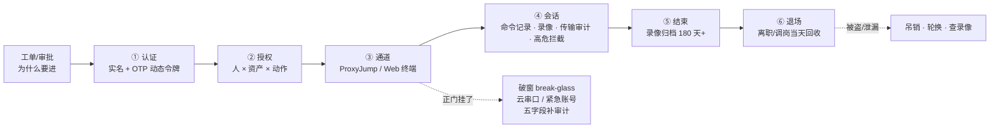
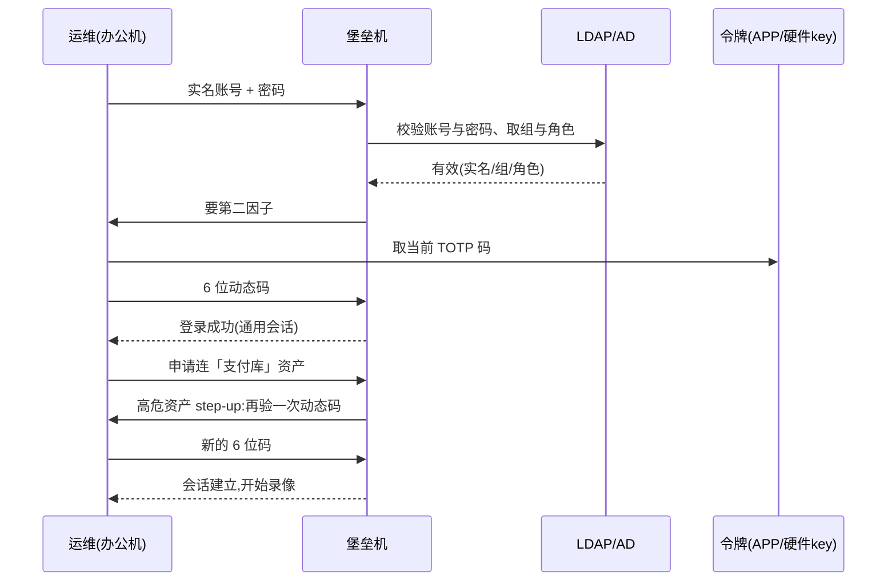
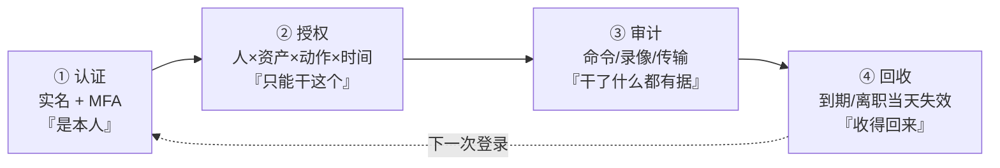
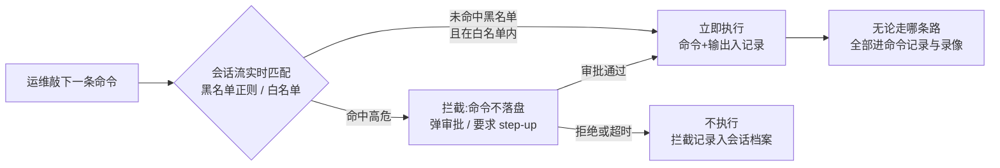
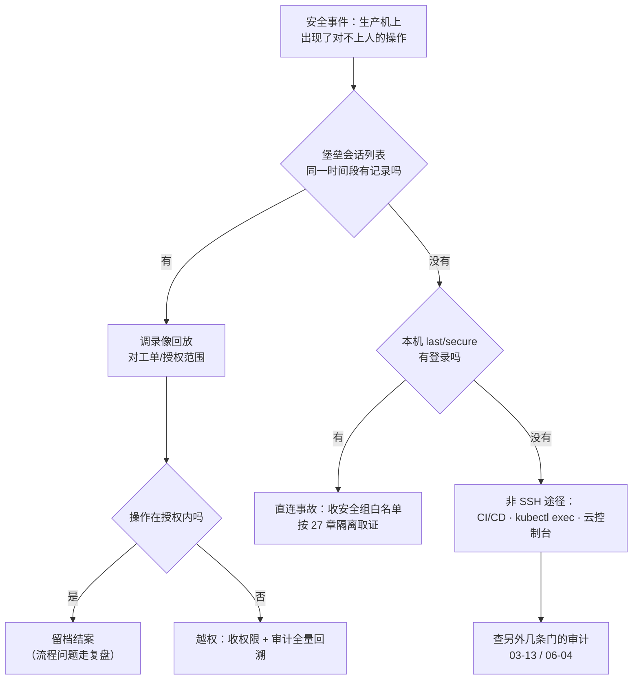

# 堡垒机与跳板机

> 支付库被人 DROP 了一张表，安全问「谁干的」，堡垒上查无此会话——开发上周在安全组给自己的笔记本加了 22，「就改一行」。
> **本章回答**：一个人从工位到生产机的一次登录全链路：凭什么进、进了能干什么、每一步留下什么证据、正门挂了怎么破窗。
> **不讲**：SSH 协议与 sshd 逐项配置 → [26](../26-SSH与远程访问/)；主机加固（SELinux/auditd/sudo）→ [27](../27-Linux安全加固/)；iptables 与安全组规则 → [17](../17-iptables与conntrack/)、[06-01](../../06-云平台/01-云网络与安全/)；K8s 侧 RBAC 与 exec 审计 → [03-13](../../03-Kubernetes/13-RBAC与安全/)；日志集中与轮转 → [23](../23-日志运维/)；时间同步 → [32](../32-NTP与时间同步/)。

**标记**：🎯重点 · 🔥难点 · ⭐常考 · 🔧实操

---

## 一、一张图：一次人工登录的一生

> 🎯 **一句话**：一次人工登录 = 认证 → 授权 → 通道 → 会话 → 退场，全程留痕；破窗是支线。



**读图**：

- 主线是**唯一入口**下的两段路径：办公网 → 堡垒 → 生产，图上没有「办公网 → 生产」的直连箭头——**有这条箭头，后面五步全是摆设**（二节）。
- ①②是治理（4A 的前三个 A），③④是技术与证据，⑥是生命周期兜底；虚线是两条支线：破窗（十节）与被盗（九节）。
- 值班排查「这操作谁干的」，照图走：先堡垒会话列表（④），再本机 `last`（对照），两边对得上才算闭环——**堡垒无、本机有 = 直连事故**。

**两段路径坐标系**（全章排查都画在这条线上）：

```text
办公网/VPN ──── 第一段：认证+授权 ────▶ 堡垒机 ──── 第二段：key/白名单 ────▶ 生产机
 203.0.113.x                            10.0.0.5                                10.0.0.21

出问题先定位卡在哪一段：
第一段失败（登不上堡垒）  → MFA？账号？堡垒活着吗？     → 四节 / 十一节
第二段失败（登得上堡垒进不去机器）→ 授权有吗？堡垒到机器通吗？→ 五节 / 十一节
机器上操作对不上人        → 直连 or 非 SSH 途径          → 二节 / 十二节
```

---

## 二、失控：直连生产的三宗罪 ⭐

> 🎯 **一句话**：直连不是「不方便审计」，是审计压根不存在。

**第一宗罪：出了事对不上人。** 机器上的 `history` 可清可改、共享账号分不清是谁、`last` 只告诉你「某个 IP 登过」——支付库被 DROP 的时候，你要的是「哪个人、在哪个工单授权下、敲了什么」，直连模式下这三样一样都拿不出来。

**第二宗罪：密码与 key 散落。** 每人把自己的公钥手工铺到 200 台机器的 `authorized_keys`：离职那天收不回来（忘了几台、别人代管的几台）、key 被拷走了没人知道、哪台有哪些 key 没人说得清。密码登录更糟：密码写在 20 个人的笔记本和便签里。散落模式的日常画像：

```text
问「张三的 key 在哪几台机器上？」→ 没人答得全
问「这台机器的 authorized_keys 五行都是谁的？」→ 三行是离职的
问「上次全量清 key 是什么时候？」→ 「上次出事之后吧」
```

**第三宗罪：口子越开越多。** 「就改一行」的安全组、给某个人开的白名单 IP、测试直连忘了删——每一行都是一条绕过堡垒的路。翻一遍安全组变更记录，常见三类口子：应急开的 22「先恢复再说」（回头看没有一条被收回）、给外包开的办公网 IP 段（外包换驻场就变成永久洞）、跨 VPC 的「临时」互通规则。**面失控不是一次决策，是一百次「就改一行」。**

> 🔍 **现场**：直连事故的签名——堡垒查无此会话，本机却有登录记录：

```bash
# 生产机上
last -a | head -5
# deploy  pts/2  203.0.113.77  Mon Sep  1 03:12   still logged in   ← 本机有
#堡垒控制台（同一时间段过滤该资产）
# （无会话记录）   ← 堡垒无 = 有人绕过了唯一入口，当事故处理
```

> ⚠️ **别混**：直连≠「有密码就能上」的认证问题——就算全部 key only，绕过堡垒照样没有命令记录与录像；**治理问题的解法是收通道，不是换更强的锁**。

> 📝 **面试**：「为什么必须唯一入口？」——三宗罪：无审计对不上人、凭据散落收不回、白名单口子失控；唯一入口 + 会话审计把「谁能上生产」变成一个可运营的问题。

---

## 三、演进：从跳板机到堡垒机 🔥

> 🎯 **一句话**：跳板解决「路径」，堡垒解决「可控、可追责」——一台机器和一套体系之差。

> 💡 **打个比方**：跳板机像小区里**多了一道门**——你要先过这道门才能进楼，但进了门之后没人认识你、没人记你来过。堡垒机像**银行柜台**——出示身份证（实名认证）、填单子（授权）、柜台内操作全程摄像（审计）、想取大额还要主管再批一次（高危拦截）。

**演进三段**：最早是「一台所有人都能登的跳板机」（路径收敛，但共享账号无审计）→ 加上实名、命令记录、录像，长成「自建/商业堡垒机」（路径 + 治理）→ 云时代出现托管堡垒与零信任接入（治理模型不变，入口形态变）。问「你们到哪一段了」，答案就落在下面这张表的左列到右列之间。

| 对比 | 跳板机（jump host） | 堡垒机（bastion / PAM） |
|------|--------------------|------------------------|
| 解决什么 | 路径：内外网隔开，只有它有路 | 治理：谁能进、干什么、留下什么 |
| 账号 | 共享账号/各自账号，机器上分散 | 实名统一认证，对接 LDAP/SSO |
| 授权 | 登上了基本都能去 | 人 × 资产 × 动作，带时间盒 |
| 审计 | `history`（可清可改） | 命令记录 + 录像 + 传输审计 |
| 事后 | 对不上人 | 会话回放可当证据 |

**JumpServer 类开源堡垒机的四个核心模块**（商业同类 CyberArk、BeyondTrust，云厂商也有托管版）：

1. **资产管理**：机器/数据库/云账号清单，分组打标签——「支付」单独一个组；纳管第一步是**盘点**：多少台机器、什么环境、谁在管，盘点不清就授权不清；
2. **用户与授权**：对接 LDAP/AD 实名，按「人 × 资产组 × 动作」授权，带有效期；授权有申请-审批流，工单就是事后对责的依据；
3. **会话与审计**：在线会话列表、命令记录、录像回放、文件传输日志——定责的证据链；支持会话**实时监控**与**强制断开**（发现正在敲 `rm -rf` 可以当场掐掉）；
4. **批量操作**：命令下发/ playbook 到一组资产——是「带审计的 Ansible」，不是聊天框。

**两种使用形态**：**客户端/ProxyJump 模式**（本地终端经堡垒进机器，体验接近原生 SSH）与 **Web 终端模式**（浏览器里直接操作）。大型实践通常两者并存：日常排障用 Web 终端（免装 key、天然录像全覆盖），脚本化和批量走 API/客户端。堡垒本身自建或用云托管版（→ [06-01](../../06-云平台/01-云网络与安全/)）是采购决策，**治理模型（本章主线）不变**。

> ⚠️ **别混**：**装了 JumpServer ≠ 做了堡垒**——没把直连收干净时，审计只覆盖「守规矩的人」；越权的人走的还是那条直连线。堡垒的生效前提是「生产只认堡垒」（六节的验收）。

> 📝 **面试**：「跳板机和堡垒机差在哪？」——跳板是路径收敛的一台机器；堡垒是认证、授权、审计、回收一整套体系。一句话收尾：**跳板让你只能从这走，堡垒还知道你干了什么**。

---

## 四、进门：认证收敛与动态令牌 ⭐

> 🎯 **一句话**：一次登录验明正身——实名是 4A 的地基，动态令牌防失窃。

**4A** = 账号（Account）· 认证（Authentication）· 授权（Authorization）· 审计（Audit）四个治理域的统称；**SSO**（Single Sign-On，单点登录）= 登一次通行所有系统——实名身份统一发放在 LDAP/AD，堡垒只认这个身份，不再自己养一套账号。

**OTP**（One-Time Password，动态令牌）= 每次登录用一次性口令，密码失窃也重放不了：

| 类型 | 原理 | 强度 | 备注 |
|------|------|------|------|
| TOTP | 按时间窗（30s）算码 | 好 | 主流：Google Authenticator / 企业统一令牌 |
| HOTP | 按计数器算码 | 好 | 老一代硬件令牌 |
| FIDO / 硬件 key | 私钥+挑战响应 | 最好 | 钓鱼也钓不走 |
| 短信 OTP | 下发到手机 | 弱 | SIM 卡劫持可绕，兜底用 |
| 备份码 | 一次性静态码 | 兜底 | 丢了手机时的后路 |

**MFA**（Multi-Factor Authentication，多因子认证）= 「你知道的」密码 + 「你有的」令牌/硬件 key + 「你是的」生物特征，至少两样凑齐。**开在登录堡垒那一跳**——不是开在每一台生产机（生产机只认堡垒过来的 key，[27](../27-Linux安全加固/) 的 key only）。**step-up** = 高危资产（支付库、GM 后台）在通用会话之上**再验一次**动态令牌。

一次完整认证走下来是这样：



**读图**：从上往下是「一个身份越验越细」的过程——先 LDAP 定**是谁**（实名、组、角色），再动态令牌定**是本人**，到高危资产还要再验一次定**此刻仍是他本人在操作**。每一步的产物（登录事件、令牌校验记录、step-up 记录）都是事后对责的证据；任何一步失败都进告警，而不是静默重试。

> 🔍 **现场**：MFA 突然全员失败，先看表——OTP 码是按时间算的：

```bash
timedatectl
# Local time: Mon 2026-09-01 03:12:33 UTC
#  NTP service: inactive     ← 堡垒机时钟漂移 > 30s，TOTP 窗口对不上，全员验证失败
# 修正：先修 NTP（→ 32），不是先关 MFA
```

> ⚠️ **别混**：OTP ≠ 改密码——OTP 是「这次登录的一次性凭证」，替代不了密码轮换，也替代不了白名单；**MFA 与资产白名单是两层**：MFA 验「是不是本人」，授权验「本人能不能上这台」。

> 📝 **面试**：「认证怎么做？」——LDAP/AD 实名 + SSO 一次登录 + 登堡垒那跳开 MFA（TOTP/FIDO）+ 高危资产 step-up；追问「短信行不行」——弱因子，只做兜底。

---

## 五、放行：授权模型——人 × 资产 × 动作 ⭐

> 🎯 **一句话**：默认拒绝；三维授权再叠一个时间盒，到期自动收回。

```text
人（LDAP 实名组）   资产（环境/标签）        动作              时间盒
--------------     ------------------      ---------------   ----------
game-sre      →    生产·游戏服组       →    SSH + 命令白名单   工单有效期 2h
dba           →    生产·支付库(单独组)  →    SSH + SFTP 只读   季度审批 90 天
外包-张三      →    测试环境            →    SSH(无文件传输)    合同到期日
```

四个维度缺一个都是事故：**默认拒绝**之下，谁（实名）、上哪台（资产组按环境隔离，支付单独成组）、干什么（SSH/命令/SFTP/文件传输**拆开授权**）、到什么时候（到期自动失效——比「记得回收」可靠一个数量级）。

**密钥侧的最小权限**（写进机器的 `authorized_keys`，细节在 [26](../26-SSH与远程访问/)）：

```text
from="10.0.0.0/8",no-port-forwarding,no-pty ssh-ed25519 AAAA... deploy@bastion
```

`from=` 限来源网段（这把 key 只能从堡垒网段用）、`no-port-forwarding` 禁当隧道跳板、`no-pty` 禁交互 shell；key 全部 `ED25519`、带 passphrase。批量铺公钥用 Ansible `authorized_key` 模块或 `AuthorizedKeysCommand` 对接 LDAP——**不要人肉一台台 append**，那是散落的开始（二节第二宗罪）。

> 🔍 **现场**：季度 review / 审计时，核对「某人此刻的有效授权清单」，看堡垒的生效数据，不是看申请记录：

```text
堡垒控制台 → 用户 → 张三 → 有效授权：
  生产·游戏服组      SSH + 命令白名单      至 2026-12-31   ← 工单 #4821
  生产·支付库        SSH + SFTP 只读      至 2026-09-30   ← 季度审批 #39
  测试环境           SSH(无传输)          至合同到期日     ← 外包连带
# 逐条问「为什么还有」：答不上来来源的当场收；到期日是自动失效，不是提醒
```

> ⚠️ **别混**：能 SSH ≠ 能 SFTP ≠ 能 sudo——三个动作三个开关，文件传输（上传脚本、下载 dump）要**单独授权单独留痕**；「给他开个 shell 剩下的随缘」不是授权，是放养。

---

## 六、通道：ProxyJump、Web 终端与隧道政策 🔥

> 🎯 **一句话**：人走 `-J`；`-L` 排障工单化、`-R` 生产默认禁、`-D` 只许临时。

> 💡 **打个比方**：`-J` 是**刷了门禁卡进大楼**再走到工位；`-L` 是从工位**接一根管子到楼里的数据库**（你在外面喝，数据在你屏幕上）；`-R` 是反过来**在门禁上开个洞朝外**（外面的人能顺着洞摸进来）；`-D` 是一根**临时的万能网线**，插哪儿哪儿通——所以只许临时、只许审批过。

```bash
# 人走 ProxyJump：一段命令认证一次，第二跳的 key 不落办公机
ssh -J moonton@bastion.corp deploy@10.0.0.21
# ~/.ssh/config 写法（可多跳 -J j1,j2）
Host prod-*
    ProxyJump moonton@bastion.corp
    ServerAliveInterval 60      # 保活：60s 一次，断了快速发现
    ServerAliveCountMax 3
    ExitOnForwardFailure yes    # 转发没建成直接退出，别带着假端口干活

# 排障连库：本地 15432 → 经堡垒 → 生产库 5432
ssh -J moonton@bastion.corp -L 15432:10.0.0.31:5432 deploy@10.0.0.21
psql -h 127.0.0.1 -p 15432 -U game -d payment
```

| 隧道 | 方向 | 合法场景 | 风险 |
|------|------|----------|------|
| `-J`（ProxyJump） | 人经堡垒到目标 | **日常唯一正道** | — |
| `-L`（本地转发） | 本地口 → 经跳板 → 内网目标 | 排障连库/连管理台，**工单化** | 借道后无命令审计（只审 SSH） |
| `-R`（远程转发） | 目标机口 → 反向回你这边 | 生产**默认禁**，特殊场景逐台审批 | 在生产墙上朝外开洞，经典后门通道 |
| `-D`（SOCKS 代理） | 本地起 SOCKS，全走跳板 | 临时内网访问，审批+限时 | 「假 VPN」，无限放大访问面 |

**隧道政策**：业务机 `AllowTcpForwarding no`（[27](../27-Linux安全加固/) 的 sshd 清单），隧道**只从堡垒发起**；`-L` 走工单、`-R` 默认禁、`-D` 限时。**Web 终端**是堡垒提供的浏览器内 SSH——好处是办公机不用存任何 key、录像天然全覆盖，坏处是体验依赖堡垒可用性（十一节）。

> 🔍 **现场**：怎么证明「第二跳确实经堡垒」——看生产机日志里的来源 IP：

```bash
# 生产机
grep 'Accepted publickey' /var/log/secure | tail -3
# Sep  1 03:12:40 sshd[2201]: Accepted publickey for deploy from 10.0.0.5
#                                                            ↑ 10.0.0.5 是堡垒内网 IP = 通道合格
#                                                            ↑ 出现办公网/家宽 IP = 直连，当事故
```

> ⚠️ **别混**：`-L` 与 `-R` 方向相反、风险相反——`-L` 把内网服务**接到你屏幕上**（你多看了一眼），`-R` 把你的机器**开给了内网**（别人多了一条路）；「都是转发随手开」是隧道事故的统一开头。

---

## 七、在场：会话审计三件套 ⭐🔧

> 🎯 **一句话**：命令记录、录像回放、文件传输审计——没有留痕的操作等于没发生过。

**三件套各管一段，缺一件就有一段黑箱**：

1. **命令记录**：会话内每条命令 + 输出摘要 + 执行账号——回答「他敲了什么」；
2. **录像回放**：终端操作全程录屏——回答「命令记录看不到的交互」（`vim` 里改了什么、`less` 里翻到了什么）；
3. **文件传输审计**：SFTP 上传/下载的文件名、大小、方向——回答「他带走了什么、放进了什么」。

三件套在控制台里长这样（一次会话的档案页）：

```text
会话 #8321  张三(db组) → 生产·支付库 10.0.0.31
  时间轴：    03:12:40 登录 —— 03:41:05 登出（28 分 25 秒，全程录像 41MB）
  命令记录：  03:13:02  psql -U game -d payment          ← 每条命令带时间戳
              03:20:11  pg_dump -t payment.orders > /tmp/o.sql
              03:20:44  sz /tmp/o.sql                    ← 下载动作，进传输审计
  传输审计：  ↓ /tmp/o.sql  182MB  → 办公机              ← 大小+方向，超阈值应告警
  拦截记录：  03:25:31  TRUNCATE payment.orders —— 已拦截，等待审批   ← 八节
```

**读档案**：定责时四块拼一起——谁（实名+组）、什么时候（时间轴）、干了什么（命令+录像）、带走了什么（传输日志）。**sz 下载一张 182MB 的表**这种动作，就该在传输审计里按阈值（如 >50MB）出告警，而不是等丢数了回放录像。

```bash
# 堡垒/生产机两侧对照——定责的标配套路
堡垒控制台：会话列表（who/资产/起止时间/命令数/有无录像）
生产机：    last -a | head；grep 'Accepted' /var/log/secure | tail
# 两边对得上 = 正常闭环
# 本机有、堡垒无 = 直连事故（二节）
# 堡垒有、本机无 = 会话早断/时间没对齐 → 32 章 NTP
```

**留痕的四条硬要求**：

- **保留期**：录像 180 天起步（等保/内审常见口径）；录屏卷**独立**于系统盘——盘满先拒绝新会话再告警，**不能静默停录**；
- **时钟**：堡垒与生产机 NTP 对齐（→ [32](../32-NTP与时间同步/)）——时间对不上，录像和日志拼不成一条证据链；
- **离机**：录像/命令记录的**索引与摘要**集中存储，本机盘坏了证据还在（日志面 → [23](../23-日志运维/)）；
- **无死角**：Web 终端和 SSH 协议会话**都要**进同一套审计；批量下发（八节）单独留执行记录；「监控告警的只读命令」也不能豁免——**豁免名单就是新的直连**。

> ⚠️ **别混**：会话审计 ≠ 本机 `history`——`history` 可清可改（→ [27](../27-Linux安全加固/)），auditd 是机器侧补充；**定责主证据是堡垒录像**，两者拼交叉验证。也别混「会话列表有」≠「操作可回放」——列表只证「来过」，干了什么要靠录像与命令记录。

### 收束：堡垒凭什么「可控可追责」——四维闭环 🎯



**读图**：四维首尾相接才是闭环——只做认证授权（①②）是「进门严、出门没记录」；只做审计（③）是「看得见、拦不住」；没有回收（④），“离职收不回”的老问题原样保留。**每一步留下的证据**：①登录事件、②授权工单、③录像与命令记录、④回收日志——出事时四样拼成完整证据链。

**可背清单**：唯一入口（无直连箭头）· 实名 + MFA · 默认拒绝的四维授权 · 三件套留痕 · 180 天+独立盘 · 离职当天回收 · 破窗有预案。

> ⚠️ **别混**：四维闭环**不保证**什么——只覆盖**人工通道**：CI/CD 发布、K8s `kubectl exec`、云控制台是另外几条门（[03-13](../../03-Kubernetes/13-RBAC与安全/)、[06-04](../../06-云平台/04-IAM与多账号/)），各有各的审计；「上了堡垒就全审计了」是这章最大的幻觉。

> 📝 **面试**：「堡垒机审计怎么答？」——三件套（命令/录像/传输）+ 四条硬要求（180 天+独立盘、NTP、离机、无死角）+ 定责套路（堡垒会话列表 vs 本机 last 对照）。收尾主动补边界：人工通道之外还有 CI 和 exec 两条门。

---

## 八、拦截：高危命令与批量操作 ⭐

> 🎯 **一句话**：高危命令会话内实时拦截；批量下发是带审计的 Ansible，不是聊天框。

**高危命令实时拦截**：堡垒在会话流里做命令匹配，命中规则**先拦再放行**（弹审批/要求 step-up），不是事后翻录像才发现。常见拦截面：`rm -rf /`（根路径递归删除）、`DROP TABLE`/`TRUNCATE`（结构破坏）、`shutdown`/`reboot`（停机）、`mkfs`/`> /dev/sda`（毁盘）、`chmod -R 777 /`（权限放空）。配套两种模式：**黑名单正则**（拦已知高危）+ **命令白名单**（值班只允许跑预案里的命令，其余一律审批）——白名单更严，黑名单更常用。



**读图**：从左进，分岔点在「匹配」——**未命中**直接执行但照样留痕；**命中**先进拦截态，审批通过才放行。关键在最后一步：三条路全部汇入命令记录与录像——**拦截是事前的闸，审计是事后的账**，被拦的和被执行的都要能查到，否则「拦截记录」本身就成了盲区。

**批量操作**：堡垒的命令下发到一组资产（或串 Ansible playbook）。两条纪律：① **先灰度再全量**——选 1 台看输出，再放量；② **执行记录入审计**——`for h in ...; do ssh $h ...; done` 在自己终端裸跑是**无痕批量**（机器上只有 last，没有命令归属），同样的事在堡垒上跑才留痕。高危命令拦截对批量任务同样生效——批量里藏一条 `rm -rf`，拦截要在**下发前**报出来。

> ⚠️ **别混**：拦截 ≠ 替代审计——拦得住的是**规则里的**高危；没拦到的操作照样要有录像兜底。两套机制一个事前一个事后，缺一不可。

> 📝 **面试**：「怎么防误删库？」——技术面：高危命令实时拦截 + 命令白名单 + DB 单独资产组 + step-up；流程面：变更窗口 + 审批 + 先备份。只答「我们会小心」零分。

---

## 九、退场：账号生命周期与权限回收 ⭐

> 🎯 **一句话**：入职最小授权、调岗先收后加、离职当天全收。

**离职当天的清单**（顺序不重要，当天完成才重要）：

1. LDAP/SSO 账号禁用——堡垒随之登不上（认证收敛的红利，一处断处处断）；
2. 堡垒侧角色/授权删除，进行中会话**强制断开**；
3. 机器上的 `authorized_keys` 批量清理（Ansible 批量删，别留「那几台代管的」）；
4. API token、云 AK/SK、GM 后台账号全部轮换或吊销；
5. 录像与操作记录**封存**（离职后 30 天内出问题还要能查）。

**调岗**先收后加——旧授权不动、只加新的，三个月后他还有支付库权限。**外包**用 `chage -E` 到期（[27](../27-Linux安全加固/)）+ 授权时间盒，合同到期日就是失效日，不靠「记得删」。

**被盗/泄漏响应**（key 泄漏、令牌丢失）：立即禁用账号 → 吊销相关 key/令牌 → 调录像与 `last` 圈定操作范围 → 查 `authorized_keys` 有无陌生行、crontab 有无植入 → 已有操作按可疑入侵处理（隔离取证 → [27](../27-Linux安全加固/)）。**季度 review** 支付/GM/数据库三类的授权清单——「他为什么还有这个权限」答不上来就收。

> 🔍 **现场**：回收做没做干净，当场验证——**回收后的失败才是合格证据**：

```text
① LDAP 禁用后，本人再登堡垒 → 应提示账号失效（不是密码错误）
② 堡垒侧删授权后，用别的账号代连该资产 → 会话列表里没有离职者的新会话
③ 进行中的会话 → 5 分钟内被强制断开（堡垒的会话管理在起作用）
④ 抽 3 台机器 cat authorized_keys → 离职者的公钥已不在
⑤ CI 里的个人 token 调一次接口 → 应 401（token 已轮换）
```

> 📝 **面试**：「离职流程安全侧做什么？」——当天：LDAP 禁用、断会话、批量清 key、轮换 token、封存录像；机制上答时间盒自动到期 + 季度 review，把「记得」换成「自动」。

---

## 十、破窗：break-glass，正门挂了 🔥

> 🎯 **一句话**：预置的紧急通道 + 事后补审计；不是临时开 22。

> 💡 **打个比方**：break-glass 是**消防通道的钥匙箱**——玻璃一敲谁都能拿钥匙，但拿钥匙这件事本身有记录、事后必须说明原因。临时 `0.0.0.0/0` 开 22 是**直接把卷帘门焊开**——门是开了，进来的可不止消防员。

堡垒挂了、网络断了、MFA 全员失败——这些时刻「说不得」的需求是真实的，所以**正解是预置而不是现场发挥**：

| 通道 | 评价 | 要求 |
|------|------|------|
| 云串口/VNC 控制台 | 首选——不走网络不经堡垒 | 云账号 MFA（→ [06-04](../../06-云平台/04-IAM与多账号/)） |
| 紧急本地账号（保险箱） | 可用——密码密封/双人分管 | 用后即改；限时启用 |
| 给个人 IP 开白名单 | 默认否——事后 100% 收不干净 | 逐条审批 + 到期时间 |
| `0.0.0.0/0` 开 22 | **禁止** | 没有例外 |
| 紧急账号长期 NOPASSWD | **禁止** | 等于常开后门 |

**用完补五字段**：谁用了、何时、为什么、干了什么（命令摘要）、影响面——缺字段等于白破窗，审计断链照样对不上人。

一次合格破窗的全过程（对照演练清单走一遍）：

```text
T+0    堡垒主备全挂（升级事故），发布流水线不受影响——人工通道才依赖堡垒
T+2m   值班按预案走云控制台串口/VNC 进入目标机（云账号本身有 MFA）
T+5m   需要文件操作 → 启用保险箱紧急账号（双人到场取密码），登录机器
T+12m  处置完成：回滚触发故障的变更
T+15m  收尾：紧急账号改密码并封存、云控制台操作留痕、补五字段工单
T+1d   堡垒恢复；抽查 last 里紧急账号的登录时间与工单对得上 → 闭环
```

**读时间线**：破窗的每一步都在「预案里」而不是「现场发明」——通道是预置的、账号是密封的、时间是量过的（全程 15 分钟）；事后每一步都能对上记录。**临时开 22 的方案在 T+2m 就开始失控**：先给自己 IP 开、同事要进再开一个、外包也要……面失控（二节第三宗罪）从破窗那一刻重新开始。

> 🔍 **现场**：验收堡垒可用性时顺手把破窗也演练一遍，目标是**5~15 分钟**内能进机器：

```text
演练清单：
① 堡垒主备都停（演练环境）→ 计时
② 走云串口/VNC 进入目标机      ← 通道真的通吗？账号密码真的在保险箱里吗？
③ 紧急账号登录（限时启用）     ← 密码取用走了双人流程吗？
④ 处置完成后：改密码 + 收白名单 + 5 字段补审计
⑤ 事后抽查：last 里紧急账号的登录记录与工单对得上吗？
```

> ⚠️ **别混**：break-glass ≠ 「临时开 22」——前者是**预置、受控、留痕**的紧急通道，后者是**现场发明、无审批、收不回**的口子；「先开着回头再收」的回头永远不会来。

---

## 十一、命门：堡垒自身的单点、网络与性能 ⭐

> 🎯 **一句话**：唯一入口自身成了最要命的组件——单点、网络盲区、性能瓶颈三个都要预案。

**坑一：单点。** 堡垒挂 = 全员进不了生产。**HA 做法**：控制面多实例（LB 前置 → [20](../20-HAProxy与Keepalived/)）、会话状态外置到 Redis 主从、配置库主从、录屏卷独立共享存储——**挂一台，会话不丢、能重连**。配套监控：进程、端口、证书过期、录屏盘水位（→ [22](../22-监控与告警/)）。

**坑二：网络盲区。** 新机房/新 VPC 的机器和堡垒网段不通，唯一入口变成「唯一瘫痪」——那边机器是好的，就是没人进得去。**做法**：堡垒多臂部署/每区域就近一组、新网络接入清单里**固定一项「堡垒可达性验证」**；跨机房互联本身是专线/VPN 的事（→ [20](../20-HAProxy与Keepalived/)、[06-01](../../06-云平台/01-云网络与安全/)）。

**坑三：性能瓶颈。** 并发会话数打满（全员发布日排队）、录屏存储写满（先拒新会话再告警）、批量下发风暴打满堡垒 CPU。容量口算两笔账：

```text
并发账：  运维+DBA+外包 80 人 × 发布日峰值 30% 同时在线 ≈ 25 并发会话
          堡垒规格按 3~4 倍余量选 → 100 并发起步；批量下发单算（瞬时打满 CPU）
录屏账：  日均 40 会话 × 平均 30 分钟 × 约 15MB ≈ 18GB/天
          × 180 天保留 ≈ 3.2TB → 录屏卷按 4TB 起步、独立盘、水位告警设在 70%
```

两笔账都超了的表现不一样：并发满 = 登录排队超时（人进不来）；录屏满 = 新会话被拒或**静默停录**（失明）——所以「满盘先拒新会话再告警」必须显式配置，不能靠默认行为。

**与 VPN / 零信任的边界**：VPN 解决**网络层接入**（把你的笔记本「搬进」内网），不解决运维通道的授权与审计——全 VPN 无堡垒 = 进了内网人人直连，三宗罪原样复发；正确的叠法是 VPN 打底接网络 + 堡垒管人工通道。**零信任**（Zero Trust）把「先接入后鉴权」改成「每个会话持续验证、按身份动态授权」——是堡垒思路的延伸（每一步都验、默认不信任），**演进方向不是取消审计**。SDP、ZTNA 这类产品落地时，会话审计与录像仍是硬需求，只是「入口」从一台堡垒变成一套策略引擎。

> ⚠️ **别混**：堡垒 HA ≠ 开公网 22 兜底——为了「保险」在公网留一个不认证的入口，等于给唯一入口装了后门；兜底是十节的破窗预案，不是一条永久放行规则。

---

## 十二、作战：对不上人，先查会话 🔧

> 🎯 **一句话**：三问——堡垒有会话吗？生产只认堡垒吗？能不能不开 22 修好？



**读图**：入口从「堡垒有没有这条会话」二分——有就走录像与授权比对（治理内问题），没有就看本机登录记录分流「直连」还是「非 SSH 途径」。**右下角是这章最容易漏的分支**：查无 SSH 会话不等于没人来过，CI 和 exec 是另外的门。

### 现象 · 先做 · 别做

| 现象 | 先做 | 别做 |
|------|------|------|
| 支付库被改，堡垒查无会话 | 本机 `last`/`secure` 对照；查 CI 与 exec 审计 | 断言「查不到=没人干」结案 |
| 堡垒升级后全员登不上 | 破窗走云串口；控制台看堡垒实例状态 | `0.0.0.0/0` 开 22「先恢复」 |
| MFA 全员验证失败 | `timedatectl` 查时钟漂移，修 NTP | 先关 MFA |
| 录屏盘写满 | 扩容 + 清过期的；确认「拒绝新会话」生效 | 静默停录继续放人进 |
| 新 VPC 机器没人能登 | 验证堡垒到该网段可达性 | 在生产机开公网 22 临时救 |
| 离职员工午夜有登录 | 禁账号断会话、调录像、轮换 key | 只删本地账号了事 |
| 批量变更后部分机器异常 | 堡垒下发记录看命令归属 + 灰度日志 | 再全量重跑一遍「覆盖」 |

### 60 秒剧本 🔧

> 🔍 **现场**：安全问「这操作谁干的」，60 秒走完三问再回话：

```text
① 0–20s  堡垒会话列表按资产+时间段过滤——有会话：进录像流程，答「谁、哪个工单」
② 20–40s 没有 → 登目标机 last -a；grep Accepted /var/log/secure
          ——本机有、堡垒无 = 直连事故；本机也无 = 转 CI/exec/云控制台排查
③ 40–60s 分层出结论：治理问题（收白名单/收权限）还是入侵（→ 27 隔离取证）
          ——回复安全：现象、证据一条、下一步动作，不说「应该没人吧」
```

---

## 十三、收口

### 命令速查 🔧

```bash
# 通道（协议细节 26）
ssh -J user@bast deploy@10.0.0.21                 # 人走 ProxyJump
ssh -J user@bast -L 15432:10.0.0.31:5432 deploy@10.0.0.21   # 排障连库（工单化）
# 定责对照（两边一起看）
last -a | head                                    # 生产机：谁从哪登录
grep -E 'Accepted|Failed' /var/log/secure | tail  # 生产机：认证事件与来源 IP
# 堡垒侧：会话列表 / 命令记录 / 录像回放 / 传输日志（控制台操作）
# 密钥最小权限（写进 authorized_keys）
from="10.0.0.0/8",no-port-forwarding,no-pty ssh-ed25519 AAAA... deploy@bastion
# MFA 排障
timedatectl                                       # 时钟漂移先于一切
```

### 面试锚点

| 问 | 30 秒答 |
|----|---------|
| 为什么需要堡垒机？ | 直连三宗罪：无审计对不上人、凭据散落收不回、口子越开越多；唯一入口 + 三件套审计。 |
| 跳板机和堡垒机区别？ | 跳板解决路径，堡垒解决可控可追责；认证/授权/审计/回收一整套 vs 一台机器。 |
| 审计三件套？ | 命令记录、录像回放、文件传输审计；180 天+、独立盘、NTP、离机、无死角。 |
| 直连事故怎么认？ | 本机 last 有、堡垒会话无；当事故收白名单，不是口头提醒。 |
| MFA 开在哪？ | 登录堡垒那一跳；高危资产 step-up 再验一次；TOTP/FIDO 强、短信弱。 |
| 授权模型？ | 人 × 资产 × 动作 × 时间盒，默认拒绝；SSH/SFTP/sudo 拆开授权。 |
| 四种隧道怎么管？ | -J 人走；-L 工单化排障；-R 生产默认禁；-D 临时审批；AllowTcpForwarding 只留堡垒。 |
| 高危命令怎么防？ | 会话内实时拦截（黑名单正则+白名单）+ step-up；拦截不替代审计。 |
| 离职怎么收？ | 当天：LDAP 禁用、断会话、批量清 key、轮换 token、封存录像；时间盒+季度 review 兜底。 |
| 堡垒挂了怎么办？ | 破窗：云串口/VNC 或紧急账号，5~15 分钟演练，用完五字段补审计；禁止 0.0.0.0/0 开 22。 |
| 堡垒自身的坑？ | 单点→HA（会话外置）、网络盲区→多臂+接入清单、性能→容量预估；VPN 管接入、堡垒管通道。 |
| 上了堡垒就全审计了？ | 不是；CI/CD、kubectl exec、云控制台是另外的门，各有各的审计。 |

### 易错一句话对照

- 装了 JumpServer 就是做了堡垒 → 没收直连时审计只覆盖守规矩的人
- 堡垒查无会话 = 没人操作 → CI、exec、云控制台是另外的门
- MFA 开在每台生产机 → 开在登堡垒那跳；生产机只认堡垒来的 key
- OTP 能替代密码轮换 → 一次性凭证≠凭据治理
- `-L` 和 `-R` 都是转发随手开 → 方向相反风险相反；-R 生产默认禁
- 能 SSH 就能传文件 → 三个动作三个开关，拆开授权
- 高危命令拦住了就不用录像 → 拦截事前、审计事后，缺一不可
- 离职删本地账号就完事 → LDAP 禁用+断会话+清 key+轮换 token 当天完成
- 堡垒挂了先开公网 22 恢复 → 破窗走串口/紧急账号，五字段补审计
- VPN 能替代堡垒 → VPN 只接网络层；全 VPN 无堡垒=内网直连三宗罪
- 批量操作在自己终端 for 循环 ssh → 无痕批量；堡垒下发才留执行记录
- 录屏盘满静默停录 → 先拒绝新会话再告警，停录即失明

### 数字墙

> 录像保留 `180 天+` · 破窗演练 `5~15 分钟` 内进入 · OTP 时间窗 `30s`（时钟漂移容忍）· `ServerAliveInterval 60` / `CountMax 3` · 紧急账号用后即改 · 离职回收 `当天` · 外包授权 `合同到期日` 自动失效 · 季度 review 支付/GM/DB 授权 · 高危补丁 SLA 见 [27](../27-Linux安全加固/)

---

## 合上书

- [ ] **默画一节的主图**：一次人工登录的一生主线六步 + 两条支线（破窗、被盗）；图上为什么没有「办公网 → 生产」的箭头。
- [ ] **口述三宗罪**：无审计、凭据散落、口子失控；直连事故的签名（本机有、堡垒无）和当什么级别处理。
- [ ] **讲清跳板 vs 堡垒**：一张两列表 + JumpServer 四个核心模块；「装了 ≠ 做了」的前提是什么。
- [ ] **口述认证收敛**：4A、SSO、OTP 各类型强弱、MFA 开在哪一跳、step-up、时钟漂移排障。
- [ ] **讲授权模型**：人 × 资产 × 动作 × 时间盒；from=/no-port-forwarding/no-pty 各限什么；为什么动作要拆开授权。
- [ ] **默写四种隧道**：-J/-L/-R/-D 的方向、场景、风险与政策；怎么用 secure 日志证明第二跳经堡垒。
- [ ] **口述审计三件套**：命令/录像/传输各回答什么问题；四条硬要求；定责的对照套路。
- [ ] **讲拦截与批量**：高危命令实时拦截面；批量下发两条纪律；拦截为什么不能替代审计。
- [ ] **口述退场**：离职当天五步、调岗先收后加、被盗响应、季度 review。
- [ ] **讲破窗**：允许/禁止两列表、五字段补审计、演练清单；为什么临时开 22 不是 break-glass。
- [ ] **数清命门三个**：单点/网络盲区/性能瓶颈各怎么做；堡垒与 VPN、零信任的边界。
- [ ] **定责**：决策树两个二分点、60 秒三问剧本；「查无会话 ≠ 没人操作」的三个去向。

上一章的门闸回看 [27](../27-Linux安全加固/)；SSH 协议细节回看 [26](../26-SSH与远程访问/)；下一章：[磁盘管理与LVM](../29-磁盘管理与LVM/)。
