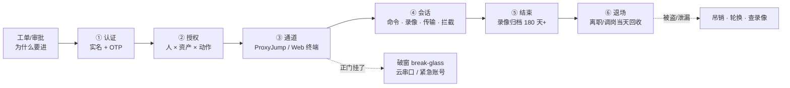
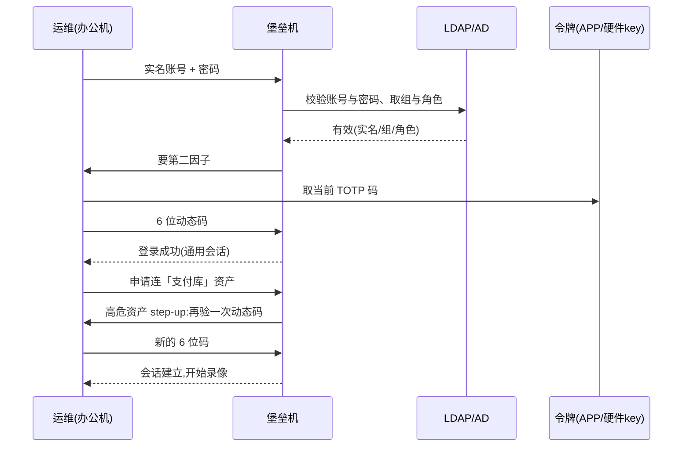
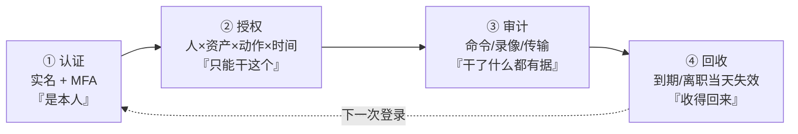
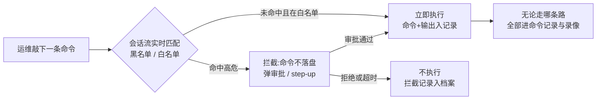
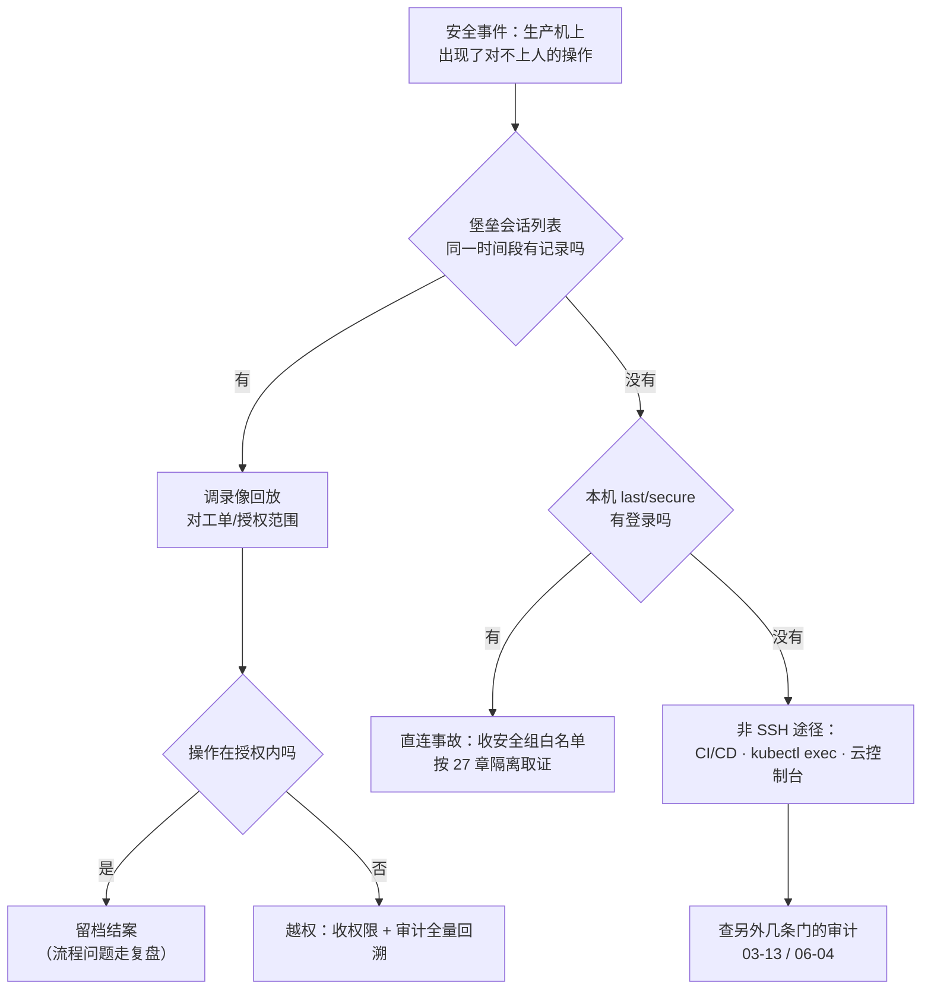

# 堡垒机与跳板机

> 支付库被人 DROP 了一张表，安全问「谁干的」，堡垒上查无此会话——开发上周在安全组给自己的笔记本加了 22，「就改一行」。
> **本章回答**：一个人从工位到生产机的一次登录全链路：凭什么进、进了能干什么、每一步留下什么证据、正门挂了怎么破窗。
> **不讲**：SSH 协议与 sshd 逐项配置 → [26](../26-SSH与远程访问/)；主机加固（SELinux/auditd/sudo）→ [27](../27-Linux安全加固/)；iptables 与安全组 → [17](../17-iptables与conntrack/)、[06-01](../../06-云平台/01-云网络与安全/)；K8s RBAC 与 exec 审计 → [03-13](../../03-Kubernetes/13-RBAC与安全/)；日志集中 → [23](../23-日志运维/)；时间同步 → [32](../32-NTP与时间同步/)。

**标记**：🎯重点 · 🔥难点 · ⭐常考 · 🔧实操

---

## 一、一张图：一次人工登录的一生

> 🎯 **一句话**：一次人工登录 = 认证 → 授权 → 通道 → 会话 → 退场，全程留痕；破窗是支线。



- 📖 **读图**
  - 🛤️ 主线唯一入口：办公网 → 堡垒 → 生产；图上**没有**「办公网 → 生产」直连箭头——有这条箭头，后面五步全是摆设（二节）
  - 🔭 值班「这操作谁干的」：先堡垒会话列表（④），再本机 `last`——**堡垒无、本机有 = 直连事故**（练习题 Q1、Q2）

**两段路径坐标系**（全章排查都画在这条线上）：

```text
办公网/VPN ──── 第一段：认证+授权 ────▶ 堡垒机 ──── 第二段：key/白名单 ────▶ 生产机
 203.0.113.x                            10.0.0.5                                10.0.0.21

第一段失败（登不上堡垒）     → MFA？账号？堡垒活着吗？     → 四节 / 十一节
第二段失败（登得上进不去机器）→ 授权有吗？堡垒到机器通吗？→ 五节 / 十一节
机器上操作对不上人           → 直连 or 非 SSH 途径          → 二节 / 十二节
```

---

## 二、失控：直连生产的三宗罪 ⭐

> 🎯 **一句话**：直连不是「不方便审计」，是审计压根不存在。

🔥 开头「就改一行」给笔记本放行 22——**三宗罪之一**。口诀：**「堡垒无、本机有 = 直连事故」**。

### ☠️ 三宗罪各坏哪一段

- 🕵️ **对不上人**：`history` 可清可改、共享账号分不清、`last` 只告诉你「某个 IP 登过」——要的是「哪个人、哪个工单、敲了什么」，直连三样都没有
- 🔑 **凭据散落**：每人公钥手工铺到 200 台 `authorized_keys`——离职收不回、key 被拷走没人知、哪台有哪些 key 说不清；密码更糟（便签 + 笔记本）
- 🕳️ **口子越开越多**：「就改一行」的安全组、给外包开的办公网段、跨 VPC「临时」互通——每一行都是绕过堡垒的路；**面失控不是一次决策，是一百次「就改一行」**

```text
问「张三的 key 在哪几台？」→ 没人答得全
问「这台 authorized_keys 五行都是谁？」→ 三行是离职的
问「上次全量清 key？」→ 「上次出事之后吧」
```

> 🔍 **现场**：直连事故的签名——堡垒查无此会话，本机却有登录：

```bash
# 生产机上
last -a | head -5
# deploy  pts/2  203.0.113.77  Mon Sep  1 03:12   still logged in   ← 本机有
# 堡垒控制台（同一时间段过滤该资产）
# （无会话记录）   ← 堡垒无 = 绕过唯一入口，当事故处理
```

> ⚠️ **别混**：直连 ≠ 「有密码就能上」的认证问题——就算全部 key only，绕过堡垒照样没有命令记录与录像；**治理问题的解法是收通道，不是换更强的锁**。

> 📝 **面试**：「为什么必须唯一入口？」——三宗罪：无审计对不上人、凭据散落收不回、白名单口子失控；唯一入口 + 会话审计把「谁能上生产」变成可运营问题。⭐（练习题 Q1、Q2）

本节对应练习题 Q1、Q2。不能直连了——跳板和堡垒差在哪？

---

## 三、演进：从跳板机到堡垒机 🔥

> 🎯 **一句话**：跳板解决「路径」，堡垒解决「可控、可追责」——一台机器和一套体系之差。

> 💡 **打个比方**：跳板像小区里**多了一道门**——先进门再进楼，但没人认识你、没人记你来过。堡垒像**银行柜台**——出示身份证（实名）、填单子（授权）、全程摄像（审计）、取大额要主管再批（高危拦截）。

| 对比 | 跳板机（jump host） | 堡垒机（bastion / PAM） |
|------|--------------------|------------------------|
| 解决什么 | 路径：内外网隔开，只有它有路 | 治理：谁能进、干什么、留下什么 |
| 账号 | 共享/各自账号，机器上分散 | 实名统一认证，对接 LDAP/SSO |
| 授权 | 登上了基本都能去 | 人 × 资产 × 动作，带时间盒 |
| 审计 | `history`（可清可改） | 命令记录 + 录像 + 传输审计 |
| 事后 | 对不上人 | 会话回放可当证据 |

### 🧩 JumpServer 四个核心模块 ⭐

商业同类 CyberArk、BeyondTrust，云厂商也有托管版——**治理模型不变，入口形态可变**：

1. **资产管理**：机器/数据库/云账号清单，分组打标签；纳管第一步是**盘点**——盘点不清就授权不清
2. **用户与授权**：对接 LDAP/AD 实名，按「人 × 资产组 × 动作」授权，带有效期；工单 = 事后对责依据
3. **会话与审计**：在线列表、命令记录、录像回放、文件传输日志；支持实时监控与**强制断开**
4. **批量操作**：命令下发 / playbook 到一组资产——「带审计的 Ansible」，不是聊天框

- 🖥️ **两种形态**：客户端 / ProxyJump（体验接近原生 SSH）与 Web 终端（免装 key、录像全覆盖）；日常排障多用 Web，脚本化走 API/客户端

#### ❓ 为什么「装了 JumpServer」还不算做了堡垒？

- 🔥 **高频错答**：软件只是壳——唯一入口、审计、授权模型没落地就还是跳板
- ❌ 没把直连收干净时，审计只覆盖「守规矩的人」；越权的人走的还是那条直连线
- ✅ **生效前提**：生产只认堡垒（六节验收：`Accepted` 来源 IP = 堡垒内网）
- 📝 一句话收尾：**跳板让你只能从这走，堡垒还知道你干了什么**

> ⚠️ **别混**：**装了 JumpServer ≠ 做了堡垒**——见上；治理模型（本章主线）与自建/云托管采购决策无关。

> 📝 **面试**：「跳板机和堡垒机差在哪？」——跳板是路径收敛的一台机器；堡垒是认证、授权、审计、回收一整套。⭐（练习题 Q3、Q8）

本节对应练习题 Q3、Q8。概念分清了——认证收敛与 OTP。

---

## 四、进门：认证收敛与动态令牌 ⭐

> 🎯 **一句话**：一次登录验明正身——实名是 4A 的地基，动态令牌防失窃。

### 🪪 4A · SSO · MFA 各管什么

- 🔑 **4A** = 账号（Account）· 认证（Authentication）· 授权（Authorization）· 审计（Audit）
- 🎫 **SSO**（单点登录）= 登一次通行所有系统；实名身份统一发放在 LDAP/AD，堡垒只认这个身份，不再自己养一套账号
- 📱 **OTP**（动态令牌）= 每次登录一次性口令，密码失窃也重放不了：
  - **TOTP**（按 30s 时间窗）——主流；**HOTP**（计数器）——老硬件令牌
  - **FIDO / 硬件 key**——私钥 + 挑战响应，钓鱼也钓不走（最强）
  - **短信 OTP**——弱（SIM 劫持可绕），只做兜底；**备份码**——丢手机后路
- 🔐 **MFA** = 「你知道的」+「你有的」+「你是的」至少两样；**开在登录堡垒那一跳**——不是每台生产机（生产机只认堡垒过来的 key，→ [27](../27-Linux安全加固/)）
- 🪜 **step-up** = 高危资产（支付库、GM）在通用会话之上**再验一次**动态令牌



- 📖 **读图**
  - 🪪 LDAP 定**是谁** → 令牌定**是本人** → step-up 定**此刻仍是他在操作**
  - 每一步产物（登录事件、令牌校验、step-up）都是事后证据；任一步失败进告警，不静默重试

#### ❓ 为什么 MFA 开在堡垒那一跳，不是每台生产机？

- ✅ **收敛一处**：人只验一次（登堡垒）；生产机只认堡垒网段过来的 key——通道与身份拆开
- ❌ 每台开 MFA = 凭据/令牌再次散落到机器侧，回收与排障都变地狱
- 🕐 **时钟坑**：TOTP 按时间算——堡垒时钟漂 >30s → 全员 MFA 失败；先修 NTP（→ [32](../32-NTP与时间同步/)），**不是先关 MFA**

> 🔍 **现场**：MFA 突然全员失败，先看表：

```bash
timedatectl
# Local time: Mon 2026-09-01 03:12:33 UTC
#  NTP service: inactive     ← 时钟漂移 > 30s，TOTP 窗口对不上
# 修正：先修 NTP（→ 32），不是先关 MFA
```

> ⚠️ **别混**：OTP ≠ 改密码——一次性凭证替代不了密码轮换，也替代不了白名单；**MFA 验「是不是本人」，授权验「本人能不能上这台」**——两层。

> 📝 **面试**：「认证怎么做？」——LDAP/AD 实名 + SSO + 登堡垒那跳 MFA（TOTP/FIDO）+ 高危 step-up；短信只做兜底。⭐（练习题 Q4）

本节对应练习题 Q4。人验清了——授权模型怎么收？

---

## 五、放行：授权模型——人 × 资产 × 动作 ⭐

> 🎯 **一句话**：默认拒绝；三维授权再叠一个时间盒，到期自动收回。

```text
人（LDAP 实名组）   资产（环境/标签）        动作              时间盒
--------------     ------------------      ---------------   ----------
game-sre      →    生产·游戏服组       →    SSH + 命令白名单   工单有效期 2h
dba           →    生产·支付库(单独组)  →    SSH + SFTP 只读   季度审批 90 天
外包-张三      →    测试环境            →    SSH(无文件传输)    合同到期日
```

- 🚫 **默认拒绝**之下四个维度缺一都是事故：谁（实名）、上哪台（资产组按环境隔离，支付单独成组）、干什么（SSH/命令/SFTP/传输**拆开**）、到什么时候（到期自动失效）
- 🔑 **密钥侧最小权限**（写进 `authorized_keys`，细节 → [26](../26-SSH与远程访问/)）：

```text
from="10.0.0.0/8",no-port-forwarding,no-pty ssh-ed25519 AAAA... deploy@bastion
```

  - `from=` 限来源网段（只能从堡垒网段用）· `no-port-forwarding` 禁当隧道跳板 · `no-pty` 禁交互 shell
  - key 全部 `ED25519`、带 passphrase；批量铺用 Ansible `authorized_key` 或 `AuthorizedKeysCommand`——**不要人肉 append**（二节第二宗罪）

#### ❓ 为什么能 SSH ≠ 能 SFTP ≠ 能 sudo？

- 🎛️ **三个动作三个开关**：文件传输（上传脚本、下载 dump）要**单独授权单独留痕**
- ❌ 「给他开个 shell 剩下的随缘」不是授权，是放养
- ✅ 季度 review 看堡垒**生效数据**，不是看申请记录——答不上「为什么还有」的当场收

> 🔍 **现场**：核对「某人此刻的有效授权清单」：

```text
堡垒控制台 → 用户 → 张三 → 有效授权：
  生产·游戏服组      SSH + 命令白名单      至 2026-12-31   ← 工单 #4821
  生产·支付库        SSH + SFTP 只读      至 2026-09-30   ← 季度审批 #39
  测试环境           SSH(无传输)          至合同到期日     ← 外包连带
# 逐条问「为什么还有」：答不上来源的当场收；到期日是自动失效，不是提醒
```

> ⚠️ **别混**：能 SSH ≠ 能传文件 ≠ 能 sudo——拆开授权；时间盒比「记得回收」可靠一个数量级。

本节对应练习题 Q5。权限收了——通道与隧道政策。

---

## 六、通道：ProxyJump、Web 终端与隧道政策 🔥

> 🎯 **一句话**：人走 `-J`；`-L` 排障工单化、`-R` 生产默认禁、`-D` 只许临时。

> 💡 **打个比方**：`-J` 是**刷门禁卡进大楼**再走到工位；`-L` 是从工位**接一根管子到楼里的库**（你在外面喝）；`-R` 是反过来**在门禁上开个洞朝外**；`-D` 是一根**临时万能网线**——只许临时、只许审批过。

```bash
# 人走 ProxyJump：一段命令认证一次，第二跳的 key 不落办公机
ssh -J moonton@bastion.corp deploy@10.0.0.21
# ~/.ssh/config（可多跳 -J j1,j2）
Host prod-*
    ProxyJump moonton@bastion.corp
    ServerAliveInterval 60      # 保活：60s 一次，断了快速发现
    ServerAliveCountMax 3
    ExitOnForwardFailure yes    # 转发没建成直接退出，别带着假端口干活

# 排障连库：本地 15432 → 经堡垒 → 生产库 5432
ssh -J moonton@bastion.corp -L 15432:10.0.0.31:5432 deploy@10.0.0.21
psql -h 127.0.0.1 -p 15432 -U game -d payment
```

| 隧道 | 方向 | 合法场景 | 风险 |
|------|------|----------|------|
| `-J`（ProxyJump） | 人经堡垒到目标 | **日常唯一正道** | — |
| `-L`（本地转发） | 本地口 → 经跳板 → 内网目标 | 排障连库/管理台，**工单化** | 借道后无命令审计（只审 SSH） |
| `-R`（远程转发） | 目标机口 → 反向回你这边 | 生产**默认禁**，特殊逐台审批 | 在生产墙上朝外开洞，经典后门 |
| `-D`（SOCKS） | 本地起 SOCKS，全走跳板 | 临时内网访问，审批+限时 | 「假 VPN」，无限放大访问面 |

- 📋 **隧道政策**：业务机 `AllowTcpForwarding no`（→ [27](../27-Linux安全加固/)），隧道**只从堡垒发起**；Web 终端 = 浏览器内 SSH——办公机不存 key、录像全覆盖，坏处是依赖堡垒可用性（十一节）

#### ❓ 为什么 `-L` 和 `-R` 风险相反？

- ⬅️ **`-L`**：内网服务接到你屏幕上——你多看了一眼（排障可接受，但要工单）
- ➡️ **`-R`**：你的机器开给了内网——别人多了一条路（生产默认禁）
- ❌ 「都是转发随手开」是隧道事故的统一开头

> 🔍 **现场**：证明「第二跳确实经堡垒」——看生产机日志来源 IP：

```bash
grep 'Accepted publickey' /var/log/secure | tail -3
# Sep  1 03:12:40 sshd[2201]: Accepted publickey for deploy from 10.0.0.5
#                                                            ↑ 堡垒内网 IP = 通道合格
#                                                            ↑ 办公网/家宽 IP = 直连，当事故
```

> ⚠️ **别混**：`-L` 与 `-R` 方向相反、风险相反；「都是转发」不是同一种东西。

本节对应练习题 Q6。路铺好了——审计三件套怎么定责？

---

## 七、在场：会话审计三件套 ⭐🔧

> 🎯 **一句话**：命令记录、录像回放、文件传输审计——没有留痕的操作等于没发生过。

### 📼 三件套各回答什么

1. **命令记录**：每条命令 + 输出摘要 + 执行账号——「他敲了什么」
2. **录像回放**：终端全程录屏——「`vim` / `less` 里交互命令记录看不到的」
3. **文件传输审计**：SFTP 上传/下载的文件名、大小、方向——「他带走了什么、放进了什么」

```text
会话 #8321  张三(db组) → 生产·支付库 10.0.0.31
  时间轴：    03:12:40 登录 —— 03:41:05 登出（28 分 25 秒，全程录像 41MB）
  命令记录：  03:13:02  psql -U game -d payment
              03:20:11  pg_dump -t payment.orders > /tmp/o.sql
              03:20:44  sz /tmp/o.sql                    ← 下载，进传输审计
  传输审计：  ↓ /tmp/o.sql  182MB  → 办公机              ← 超阈值应告警
  拦截记录：  03:25:31  TRUNCATE payment.orders —— 已拦截，等待审批
```

- 📖 **读图**：定责四块拼一起——谁（实名+组）、什么时候、干了什么（命令+录像）、带走了什么（传输）；`sz` 下 182MB 表应按阈值（如 >50MB）告警，别等丢数了才回放

```bash
# 定责标配套路：堡垒 / 生产机两侧对照
# 堡垒：会话列表（who/资产/起止/命令数/有无录像）
# 生产机：
last -a | head
grep 'Accepted' /var/log/secure | tail
# 两边对得上 = 正常闭环
# 本机有、堡垒无 = 直连事故（二节）
# 堡垒有、本机无 = 会话早断/时间没对齐 → 32 章 NTP
```

**留痕四条硬要求**：

- 📅 **保留期**：录像 180 天起步；录屏卷**独立**于系统盘——盘满先拒新会话再告警，**不能静默停录**
- 🕐 **时钟**：堡垒与生产 NTP 对齐（→ [32](../32-NTP与时间同步/)）——对不上拼不成证据链
- 📦 **离机**：索引与摘要集中存储，本机盘坏了证据还在（→ [23](../23-日志运维/)）
- 🚫 **无死角**：Web 与 SSH 协议会话进同一套审计；批量下发单独留执行记录；只读命令也不能豁免——**豁免名单就是新的直连**

> ⚠️ **别混**：会话审计 ≠ 本机 `history`——`history` 可清可改（→ [27](../27-Linux安全加固/)）；**定责主证据是堡垒录像**。「会话列表有」≠「操作可回放」——列表只证「来过」。

### 收束：堡垒凭什么「可控可追责」——四维闭环 🎯



- 📖 **读图**
  - ①②严进门、无③=出门没记录；只③=看得见拦不住；无④=离职收不回老问题原样保留
  - **可背清单**：唯一入口 · 实名+MFA · 默认拒绝四维授权 · 三件套留痕 · 180 天+独立盘 · 离职当天回收 · 破窗有预案

#### ❓ 为什么「上了堡垒就全审计了」是幻觉？

- ❌ 四维闭环**只覆盖人工通道**
- 🚪 CI/CD 发布、K8s `kubectl exec`、云控制台是另外几条门（→ [03-13](../../03-Kubernetes/13-RBAC与安全/)、[06-04](../../06-云平台/04-IAM与多账号/)），各有各的审计
- ✅ 出事查无 SSH 会话 ≠ 没人来过——十二节决策树右下角就是这条漏支

> ⚠️ **别混**：四维闭环不保证覆盖 CI / exec / 云控制台；「上了堡垒就全审计了」是这章最大幻觉。

> 📝 **面试**：「堡垒机审计怎么答？」——三件套 + 四条硬要求 + 定责套路（堡垒会话 vs 本机 last）；收尾补边界：人工通道之外还有 CI 和 exec。⭐（练习题 Q7）

本节对应练习题 Q7。痕迹有了——高危拦截与批量下发。

---

## 八、拦截：高危命令与批量操作 ⭐

> 🎯 **一句话**：高危命令会话内实时拦截；批量下发是带审计的 Ansible，不是聊天框。

### 🛑 先拦再放行

- 会话流实时匹配：命中规则**先拦再放行**（弹审批 / step-up），不是事后翻录像才发现
- 常见拦截面：`rm -rf /`、`DROP TABLE`/`TRUNCATE`、`shutdown`/`reboot`、`mkfs`、`chmod -R 777 /`
- 两种模式：**黑名单正则**（拦已知高危）+ **命令白名单**（值班只跑预案，其余一律审批）



- 📖 **读图**：分岔在「匹配」——未命中也留痕；命中先进拦截态。三条路全部汇入命令记录——**拦截是事前的闸，审计是事后的账**

### 📦 批量两条纪律

1. **先灰度再全量**——选 1 台看输出，再放量
2. **执行记录入审计**——本机 `for h in ...; do ssh $h; done` = **无痕批量**；同样的事在堡垒上跑才留痕。批量里藏 `rm -rf`，拦截要在**下发前**报出来

#### ❓ 为什么拦截不能替代审计？

- 🛑 拦得住的是**规则里的**高危；没拦到的操作照样要有录像兜底
- 🧾 被拦的和被执行的都要能查到——否则「拦截记录」本身成盲区
- 📝 防误删库：技术面拦截+白名单+DB 单独组+step-up；流程面变更窗口+审批+先备份。只答「我们会小心」零分

> ⚠️ **别混**：拦截 ≠ 替代审计——事前闸 + 事后账，缺一不可。

> 📝 **面试**：「怎么防误删库？」——实时拦截 + 命令白名单 + DB 单独资产组 + step-up；流程：变更窗口 + 审批 + 先备份。⭐（练习题 Q9）

本节对应练习题 Q9。刀收住了——离职回收与被盗响应。

---

## 九、退场：账号生命周期与权限回收 ⭐

> 🎯 **一句话**：入职最小授权、调岗先收后加、离职当天全收。

### 🚪 离职当天五步

1. LDAP/SSO 禁用——堡垒随之登不上（认证收敛红利：一处断处处断）
2. 堡垒侧角色/授权删除，进行中会话**强制断开**
3. 机器上 `authorized_keys` 批量清理（Ansible，别留「代管那几台」）
4. API token、云 AK/SK、GM 后台全部轮换或吊销
5. 录像与操作记录**封存**（离职后 30 天内出问题还要能查）

- 🔄 **调岗**：先收后加——旧授权不动只加新的，三个月后他还有支付库权限
- 📅 **外包**：`chage -E` 到期（→ [27](../27-Linux安全加固/)）+ 授权时间盒，合同到期日 = 失效日
- 🚨 **被盗/泄漏**：立即禁账号 → 吊销 key/令牌 → 调录像与 `last` 圈定范围 → 查陌生 `authorized_keys`/crontab → 按可疑入侵处理（→ [27](../27-Linux安全加固/)）；季度 review 支付/GM/DB——答不上「为什么还有」就收

> 🔍 **现场**：回收做没做干净——**回收后的失败才是合格证据**：

```text
① LDAP 禁用后本人再登堡垒 → 应提示账号失效（不是密码错误）
② 删授权后代连该资产 → 会话列表无离职者新会话
③ 进行中会话 → 5 分钟内被强制断开
④ 抽 3 台 cat authorized_keys → 离职者公钥已不在
⑤ CI 个人 token 调接口 → 应 401
```

> 📝 **面试**：「离职流程安全侧做什么？」——当天：LDAP 禁用、断会话、批量清 key、轮换 token、封存录像；机制上时间盒自动到期 + 季度 review。⭐（练习题 Q10）

本节对应练习题 Q10。正门挂了——break-glass 怎么破窗？

---

## 十、破窗：break-glass，正门挂了 🔥

> 🎯 **一句话**：预置的紧急通道 + 事后补审计；不是临时开 22。

> 💡 **打个比方**：break-glass 是**消防通道的钥匙箱**——敲玻璃拿钥匙本身有记录、事后必须说明原因。临时 `0.0.0.0/0` 开 22 是**把卷帘门焊开**——进来的可不止消防员。

| 通道 | 评价 | 要求 |
|------|------|------|
| 云串口/VNC 控制台 | 首选——不走网络不经堡垒 | 云账号 MFA（→ [06-04](../../06-云平台/04-IAM与多账号/)） |
| 紧急本地账号（保险箱） | 可用——密码密封/双人分管 | 用后即改；限时启用 |
| 给个人 IP 开白名单 | 默认否——事后 100% 收不干净 | 逐条审批 + 到期时间 |
| `0.0.0.0/0` 开 22 | **禁止** | 没有例外 |
| 紧急账号长期 NOPASSWD | **禁止** | 等于常开后门 |

- 📝 **用完补五字段**：谁、何时、为什么、干了什么（命令摘要）、影响面——缺字段 = 白破窗

```text
T+0    堡垒主备全挂（升级事故）；发布流水线不受影响——人工通道才依赖堡垒
T+2m   值班按预案走云串口/VNC（云账号本身有 MFA）
T+5m   需要文件操作 → 保险箱紧急账号（双人到场取密码）
T+12m  处置完成：回滚触发故障的变更
T+15m  收尾：紧急账号改密码并封存、云控制台留痕、补五字段工单
T+1d   堡垒恢复；抽查 last 里紧急账号登录时间与工单对得上 → 闭环
```

- 📖 **读图**：每一步都在预案里——通道预置、账号密封、全程约 15 分钟。**临时开 22 从 T+2m 开始失控**：先给自己 IP、同事再开一个、外包也要……面失控（二节）从破窗那一刻重新开始

#### ❓ 为什么 break-glass ≠ 「临时开 22」？

- ✅ 前者：**预置、受控、留痕**的紧急通道
- ❌ 后者：**现场发明、无审批、收不回**的口子；「先开着回头再收」的回头永远不会来
- 🧪 验收堡垒可用性时顺手演练破窗，目标 **5~15 分钟**内能进机器

> 🔍 **现场**：演练清单：

```text
① 堡垒主备都停（演练环境）→ 计时
② 走云串口/VNC 进入目标机      ← 通道真通？密码真在保险箱？
③ 紧急账号登录（限时启用）     ← 双人流程走了吗？
④ 处置完成后：改密码 + 收白名单 + 五字段补审计
⑤ 事后抽查：last 与工单对得上吗？
```

> ⚠️ **别混**：break-glass ≠ 临时开 22——见上。

本节对应练习题 Q11。紧急通道有了——堡垒自身的命门。

---

## 十一、命门：堡垒自身的单点、网络与性能 ⭐

> 🎯 **一句话**：唯一入口自身成了最要命的组件——单点、网络盲区、性能瓶颈三个都要预案。

### 💥 三个坑

- 🔴 **单点**：堡垒挂 = 全员进不了生产。HA：控制面多实例（LB → [20](../20-HAProxy与Keepalived/)）、会话状态外置 Redis、配置库主从、录屏卷独立共享——**挂一台，会话不丢、能重连**；监控进程/端口/证书/录屏盘水位（→ [22](../22-监控与告警/)）
- 🌐 **网络盲区**：新机房/新 VPC 与堡垒不通 → 唯一入口变「唯一瘫痪」。做法：多臂部署/每区域就近一组；新网络接入清单固定一项「堡垒可达性验证」
- 📈 **性能瓶颈**：并发打满、录屏写满、批量下发打满 CPU：

```text
并发账：  80 人 × 发布日峰值 30% ≈ 25 并发 → 按 3~4 倍余量选 100 并发起步
录屏账：  日均 40 会话 × 30 分钟 × ~15MB ≈ 18GB/天 × 180 天 ≈ 3.2TB
          → 录屏卷 4TB 起步、独立盘、水位告警 70%
```

  - 并发满 = 登录排队超时；录屏满 = 新会话被拒或**静默停录**（失明）——「满盘先拒新会话再告警」必须显式配置

#### ❓ 为什么 VPN 不能替代堡垒？

- 🔌 **VPN** 解决**网络层接入**（笔记本「搬进」内网），不解决运维通道的授权与审计
- ❌ 全 VPN 无堡垒 = 进了内网人人直连，三宗罪原样复发
- ✅ 正确叠法：VPN 打底接网络 + 堡垒管人工通道
- 🛡️ **零信任**把「先接入后鉴权」改成「每会话持续验证、按身份动态授权」——是堡垒思路的延伸，**演进方向不是取消审计**；SDP/ZTNA 落地时会话审计与录像仍是硬需求

> ⚠️ **别混**：堡垒 HA ≠ 开公网 22 兜底——为「保险」留不认证入口 = 给唯一入口装后门；兜底是十节破窗预案。

本节对应练习题 Q11～Q13。开头支付库 DROP——60 秒怎么定责？

---

## 十二、作战：对不上人，先查会话 🔧

> 🎯 **一句话**：三问——堡垒有会话吗？生产只认堡垒吗？能不能不开 22 修好？



- 📖 **读图**：入口「堡垒有没有这条会话」二分——有走录像与授权比对；没有看本机分流直连 / 非 SSH。**右下角最易漏**：查无 SSH ≠ 没人来过

### 现象 · 先做 · 别做

| 现象 | 先做 | 别做 |
|------|------|------|
| 支付库被改，堡垒查无会话 | 本机 `last`/`secure` 对照；查 CI 与 exec 审计 | 断言「查不到=没人干」结案 |
| 堡垒升级后全员登不上 | 破窗走云串口；看堡垒实例状态 | `0.0.0.0/0` 开 22「先恢复」 |
| MFA 全员验证失败 | `timedatectl` 查时钟，修 NTP | 先关 MFA |
| 录屏盘写满 | 扩容 + 清过期；确认「拒绝新会话」生效 | 静默停录继续放人进 |
| 新 VPC 机器没人能登 | 验证堡垒到该网段可达性 | 在生产机开公网 22 临时救 |
| 离职员工午夜有登录 | 禁账号断会话、调录像、轮换 key | 只删本地账号了事 |
| 批量变更后部分机器异常 | 堡垒下发记录看命令归属 + 灰度日志 | 再全量重跑一遍「覆盖」 |

### 60 秒剧本 🔧

> 🔍 **现场**：安全问「这操作谁干的」，60 秒走完三问再回话：

```text
① 0–20s  堡垒会话列表按资产+时间段过滤——有会话：进录像，答「谁、哪个工单」
② 20–40s 没有 → last -a；grep Accepted /var/log/secure
          ——本机有、堡垒无 = 直连事故；本机也无 = 转 CI/exec/云控制台
③ 40–60s 分层出结论：治理问题（收白名单/收权限）还是入侵（→ 27）
          ——回复：现象、证据一条、下一步；不说「应该没人吧」
```

本节对应练习题 Q13、Q14。开头「就改一行」——你已经知道该怎么拦住他了。

---

## 十三、收口

### 命令速查 🔧

```bash
# 通道（协议细节 26）
ssh -J user@bast deploy@10.0.0.21                 # 人走 ProxyJump
ssh -J user@bast -L 15432:10.0.0.31:5432 deploy@10.0.0.21   # 排障连库（工单化）
# 定责对照（两边一起看）
last -a | head                                    # 生产机：谁从哪登录
grep -E 'Accepted|Failed' /var/log/secure | tail  # 生产机：认证事件与来源 IP
# 堡垒侧：会话列表 / 命令记录 / 录像回放 / 传输日志（控制台）
# 密钥最小权限
from="10.0.0.0/8",no-port-forwarding,no-pty ssh-ed25519 AAAA... deploy@bastion
# MFA 排障
timedatectl                                       # 时钟漂移先于一切
```

### 面试锚点

| 问 | 30 秒答 |
|----|---------|
| 为什么需要堡垒机？ | 直连三宗罪：无审计、凭据散落、口子失控；唯一入口 + 三件套审计。 |
| 跳板机和堡垒机区别？ | 跳板解决路径，堡垒解决可控可追责；一整套体系 vs 一台机器。 |
| 审计三件套？ | 命令记录、录像回放、文件传输审计；180 天+、独立盘、NTP、离机、无死角。 |
| 直连事故怎么认？ | 本机 last 有、堡垒会话无；当事故收白名单，不是口头提醒。 |
| MFA 开在哪？ | 登录堡垒那一跳；高危 step-up；TOTP/FIDO 强、短信弱。 |
| 授权模型？ | 人 × 资产 × 动作 × 时间盒，默认拒绝；SSH/SFTP/sudo 拆开。 |
| 四种隧道怎么管？ | -J 人走；-L 工单化；-R 生产默认禁；-D 临时审批。 |
| 高危命令怎么防？ | 会话内实时拦截（黑名单+白名单）+ step-up；拦截不替代审计。 |
| 离职怎么收？ | 当天：LDAP 禁用、断会话、清 key、轮换 token、封存录像。 |
| 堡垒挂了怎么办？ | 破窗：云串口/紧急账号，5~15 分钟演练，五字段补审计；禁 0.0.0.0/0 开 22。 |
| 堡垒自身的坑？ | 单点→HA、网络盲区→多臂、性能→容量；VPN 管接入、堡垒管通道。 |
| 上了堡垒就全审计了？ | 不是；CI/CD、kubectl exec、云控制台是另外的门。 |

### 易错一句话对照

- 装了 JumpServer 就是做了堡垒 → 没收直连时审计只覆盖守规矩的人
- 堡垒查无会话 = 没人操作 → CI、exec、云控制台是另外的门
- MFA 开在每台生产机 → 开在登堡垒那跳；生产机只认堡垒来的 key
- OTP 能替代密码轮换 → 一次性凭证≠凭据治理
- `-L` 和 `-R` 都是转发随手开 → 方向相反风险相反；-R 生产默认禁
- 能 SSH 就能传文件 → 三个动作三个开关，拆开授权
- 高危命令拦住了就不用录像 → 拦截事前、审计事后，缺一不可
- 离职删本地账号就完事 → LDAP 禁用+断会话+清 key+轮换 token 当天完成
- 堡垒挂了先开公网 22 恢复 → 破窗走串口/紧急账号，五字段补审计
- VPN 能替代堡垒 → VPN 只接网络层；全 VPN 无堡垒=内网直连三宗罪
- 批量操作在自己终端 for 循环 ssh → 无痕批量；堡垒下发才留执行记录
- 录屏盘满静默停录 → 先拒绝新会话再告警，停录即失明

### 数字墙

> 录像保留 `180 天+` · 破窗演练 `5~15 分钟` 内进入 · OTP 时间窗 `30s` · `ServerAliveInterval 60` / `CountMax 3` · 紧急账号用后即改 · 离职回收 `当天` · 外包授权 `合同到期日` 自动失效 · 季度 review 支付/GM/DB 授权 · 高危补丁 SLA 见 [27](../27-Linux安全加固/)

---

## 合上书

对齐练习题「合上书」，逐条口述，卡住就回对应节 / 题号。

- [ ] **默画一节的主图**：一次人工登录的一生主线六步 + 两条支线（破窗、被盗）；图上为什么没有「办公网 → 生产」的箭头。
- [ ] **口述三宗罪**：无审计、凭据散落、口子失控；直连事故的签名（本机有、堡垒无）。
- [ ] **讲清跳板 vs 堡垒**：两列表 + 四个核心模块；「装了 ≠ 做了」的前提是什么。
- [ ] **口述认证收敛**：4A、SSO、OTP 强弱、MFA 开在哪一跳、step-up、时钟漂移排障。
- [ ] **讲授权模型**：人 × 资产 × 动作 × 时间盒；from=/no-port-forwarding/no-pty；为什么动作要拆开。
- [ ] **默写四种隧道**：-J/-L/-R/-D 的方向、场景、风险与政策；怎么用 secure 日志证明第二跳经堡垒。
- [ ] **口述审计三件套**：命令/录像/传输各回答什么；四条硬要求；定责对照套路。
- [ ] **讲拦截与批量**：高危拦截面；批量两条纪律；拦截为什么不能替代审计。
- [ ] **口述退场**：离职当天五步、调岗先收后加、被盗响应、季度 review。
- [ ] **讲破窗**：允许/禁止表、五字段、演练清单；为什么临时开 22 不是 break-glass。
- [ ] **数清命门三个**：单点/网络盲区/性能；堡垒与 VPN、零信任的边界。
- [ ] **定责**：决策树两个二分点、60 秒三问；「查无会话 ≠ 没人操作」的三个去向。

上一章回看 [27](../27-Linux安全加固/)；SSH 协议细节回看 [26](../26-SSH与远程访问/)；下一章：[磁盘管理与LVM](../29-磁盘管理与LVM/)。
